# Stable Diffusion 部署方案详解

## 概述

本文档详细介绍 Stable Diffusion 的各种部署方案，帮助你根据自身条件选择最适合的部署方式。无论你是拥有高端显卡的本地用户，还是希望通过云服务快速体验的新手，都能在这里找到合适的解决方案。

## 部署方案全景图

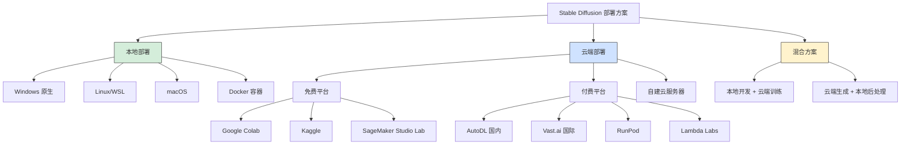

## 1. 方案选择决策指南

### 1.1 核心决策流程

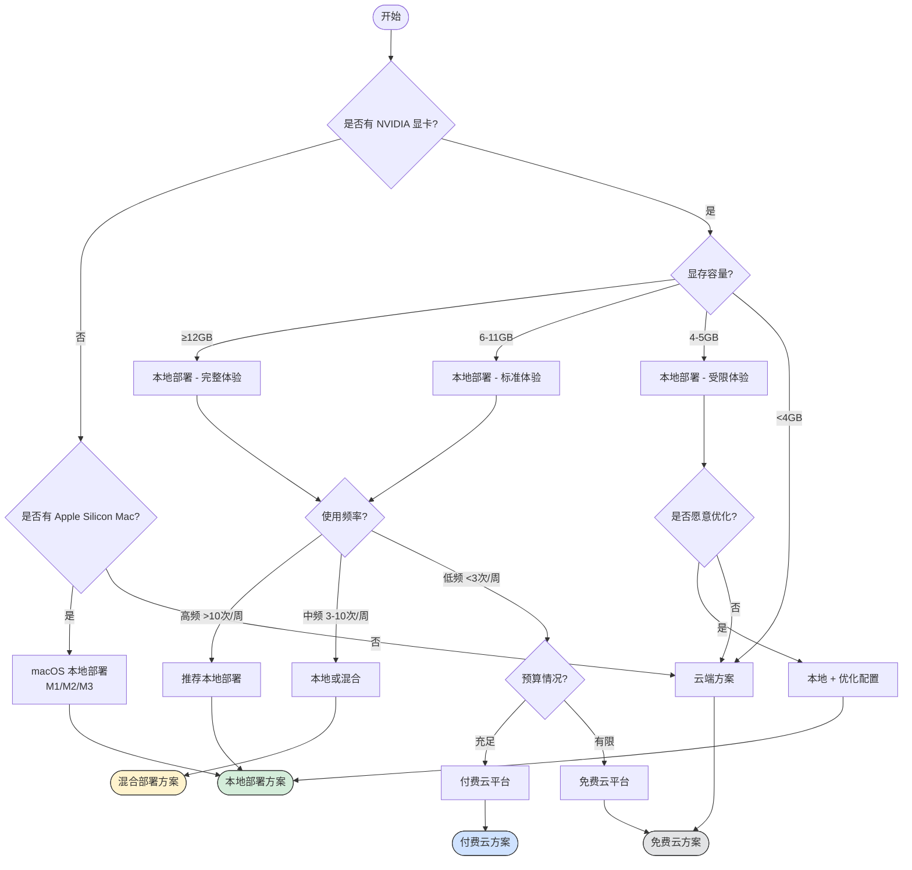

### 1.2 方案对比矩阵

| 维度 | 本地部署 | 免费云平台 | 付费云平台 | 混合方案 |
|------|----------|------------|------------|----------|
| **初始成本** | 💰💰💰 高 | ✅ 免费 | 💰 低 | 💰💰 中 |
| **使用成本** | ✅ 免费 | ✅ 免费 | 💰 按量 | 💰 较低 |
| **性能上限** | ⭐⭐⭐⭐⭐ | ⭐⭐⭐ | ⭐⭐⭐⭐⭐ | ⭐⭐⭐⭐ |
| **使用限制** | ✅ 无 | ⚠️ 时间/资源限制 | ⚠️ 费用限制 | ⚠️ 部分限制 |
| **隐私安全** | ⭐⭐⭐⭐⭐ | ⭐⭐ | ⭐⭐⭐ | ⭐⭐⭐⭐ |
| **扩展能力** | ⭐⭐⭐⭐⭐ | ⭐⭐ | ⭐⭐⭐⭐ | ⭐⭐⭐⭐⭐ |
| **学习曲线** | ⚠️ 陡峭 | ✅ 平缓 | ✅ 平缓 | ⚠️ 中等 |
| **稳定性** | ⭐⭐⭐⭐ | ⭐⭐⭐ | ⭐⭐⭐⭐ | ⭐⭐⭐⭐ |
| **推荐人群** | 专业/长期用户 | 初学者/体验者 | 中度用户 | 进阶用户 |

### 1.3 成本效益分析

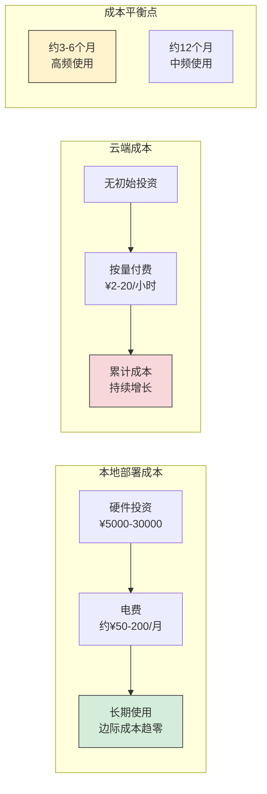

**成本平衡点计算示例**：

假设：
- 本地硬件投资：¥10,000（RTX 3060 配置）
- 云端费用：¥5/小时（中端配置）
- 每日使用时间：2小时

```
云端年成本 = 5 × 2 × 365 = ¥3,650
平衡点 = 10,000 ÷ 3,650 ≈ 2.7年

结论：如果计划使用超过 2.7 年，本地部署更经济
```

## 2. 本地部署方案

### 2.1 硬件配置详解

#### 显卡选购指南

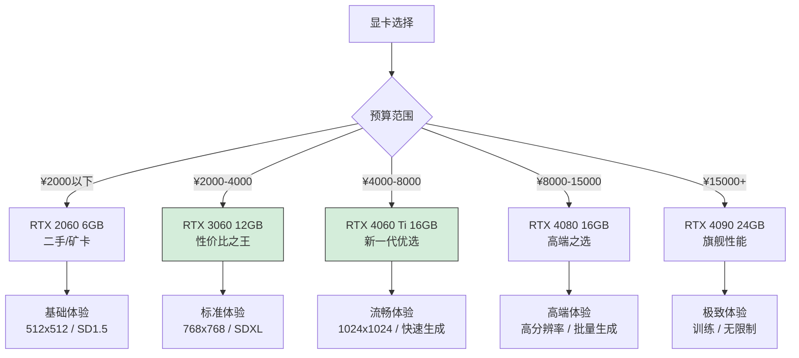

#### 显存与功能对应表

| 显存 | 可用模型 | 最大分辨率 | 批量生成 | 训练能力 | 代表显卡 |
|------|----------|------------|----------|----------|----------|
| 4GB | SD 1.5 (优化) | 512x512 | 1张 | ❌ | GTX 1650 |
| 6GB | SD 1.5 | 512x768 | 1-2张 | ❌ | RTX 2060 |
| 8GB | SD 1.5/2.1 | 768x768 | 2-4张 | LoRA | RTX 3070 |
| 12GB | SDXL | 1024x1024 | 4-8张 | LoRA | RTX 3060 |
| 16GB | SDXL + ControlNet | 1024x1536 | 8-16张 | LoRA/DB | RTX 4080 |
| 24GB | 所有模型 | 2048+ | 无限制 | 完整训练 | RTX 4090 |

#### 完整硬件配置方案

**入门级配置** - 预算约 ¥5,000

```
CPU: Intel i5-12400F / AMD R5 5600
GPU: NVIDIA RTX 3060 12GB
RAM: 16GB DDR4 3200MHz
SSD: 500GB NVMe
电源: 550W 80Plus Bronze

预期性能：
- SD 1.5 @ 512x512：约 4-5 秒/张
- SDXL @ 1024x1024：约 15-20 秒/张
```

**主流级配置** - 预算约 ¥10,000

```
CPU: Intel i5-13600KF / AMD R7 5800X3D
GPU: NVIDIA RTX 4070 12GB
RAM: 32GB DDR4 3600MHz
SSD: 1TB NVMe
电源: 650W 80Plus Gold

预期性能：
- SD 1.5 @ 512x512：约 2-3 秒/张
- SDXL @ 1024x1024：约 8-12 秒/张
```

**高端配置** - 预算约 ¥25,000+

```
CPU: Intel i7-14700K / AMD R9 7950X
GPU: NVIDIA RTX 4090 24GB
RAM: 64GB DDR5 6000MHz
SSD: 2TB NVMe Gen4
电源: 1000W 80Plus Platinum

预期性能：
- SD 1.5 @ 512x512：约 1-2 秒/张
- SDXL @ 1024x1024：约 3-5 秒/张
- 支持完整模型训练
```

### 2.2 Windows 本地部署

#### 环境准备流程

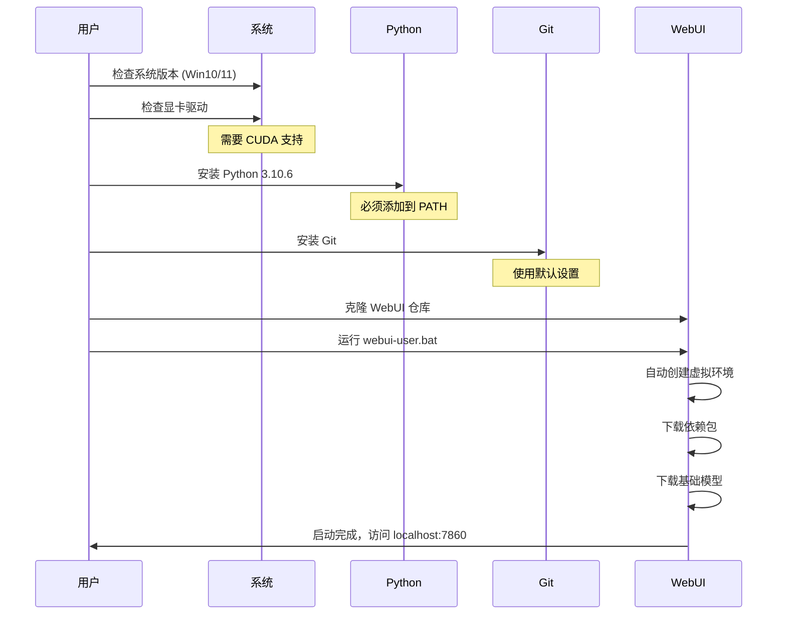

#### 详细安装步骤

**Step 1：系统检查与准备**

```powershell
# 检查 Windows 版本
winver

# 检查 NVIDIA 驱动
nvidia-smi

# 驱动版本应 >= 527.41（支持 CUDA 12.0）
# 如需更新，访问：https://www.nvidia.com/Download/index.aspx
```

**Step 2：安装 Python 3.10.6**

```powershell
# 下载地址
# https://www.python.org/ftp/python/3.10.6/python-3.10.6-amd64.exe

# 安装时必须勾选：
# ☑️ Add Python 3.10 to PATH
# ☑️ Install for all users (推荐)

# 验证安装
python --version
# 输出应为：Python 3.10.6
```

**Step 3：安装 Git**

```powershell
# 下载地址
# https://git-scm.com/download/win

# 使用默认设置安装

# 验证安装
git --version
# 输出应为：git version 2.x.x
```

**Step 4：克隆并配置 WebUI**

```powershell
# 选择安装目录（推荐非系统盘，如 D:\AI）
D:
mkdir AI
cd AI

# 克隆仓库
git clone https://github.com/AUTOMATIC1111/stable-diffusion-webui.git

# 进入目录
cd stable-diffusion-webui
```

**Step 5：配置启动参数**

编辑 `webui-user.bat` 文件：

```batch
@echo off

set PYTHON=
set GIT=
set VENV_DIR=
set COMMANDLINE_ARGS=--xformers --theme dark

call webui.bat
```

**推荐启动参数说明**：

| 参数 | 作用 | 适用场景 |
|------|------|----------|
| `--xformers` | 内存优化，提速 | 所有用户 |
| `--medvram` | 中等显存优化 | 8GB 以下显存 |
| `--lowvram` | 低显存优化 | 6GB 以下显存 |
| `--theme dark` | 暗色主题 | 个人偏好 |
| `--listen` | 允许局域网访问 | 多设备使用 |
| `--port 7861` | 更换端口 | 端口冲突 |
| `--autolaunch` | 自动打开浏览器 | 便捷启动 |
| `--no-half` | 禁用半精度 | 部分显卡兼容问题 |
| `--skip-torch-cuda-test` | 跳过 CUDA 测试 | 快速启动 |

**Step 6：首次启动**

```powershell
# 双击运行 webui-user.bat
# 或在命令行执行：
.\webui-user.bat

# 首次运行会自动下载：
# - PyTorch 和 CUDA 运行时
# - 各种依赖包
# - 基础模型（v1-5-pruned-emaonly）

# 预计时间：10-30分钟（取决于网络）
```

**Step 7：访问界面**

```
启动成功后，在浏览器访问：
http://127.0.0.1:7860

出现 "Running on local URL: http://127.0.0.1:7860" 表示成功
```

### 2.3 Linux 本地部署

#### Ubuntu/Debian 系统

```bash
# 更新系统
sudo apt update && sudo apt upgrade -y

# 安装依赖
sudo apt install -y python3.10 python3.10-venv python3-pip git wget

# 安装 NVIDIA 驱动（如未安装）
sudo apt install -y nvidia-driver-535

# 验证 CUDA
nvidia-smi

# 克隆仓库
git clone https://github.com/AUTOMATIC1111/stable-diffusion-webui.git
cd stable-diffusion-webui

# 设置启动参数（编辑 webui-user.sh）
export COMMANDLINE_ARGS="--xformers --listen"

# 启动
./webui.sh
```

#### Arch Linux 系统

```bash
# 安装依赖
sudo pacman -S python python-pip git wget

# 安装 NVIDIA 驱动
sudo pacman -S nvidia nvidia-utils

# 克隆并启动
git clone https://github.com/AUTOMATIC1111/stable-diffusion-webui.git
cd stable-diffusion-webui
./webui.sh
```

### 2.4 macOS 本地部署 (Apple Silicon)

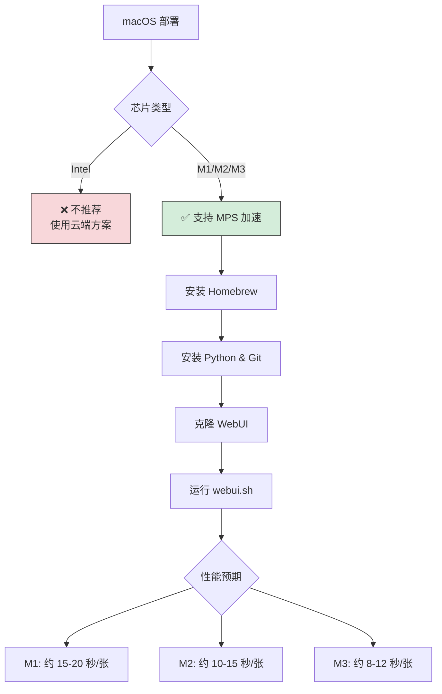

**详细步骤**：

```bash
# 安装 Homebrew（如未安装）
/bin/bash -c "$(curl -fsSL https://raw.githubusercontent.com/Homebrew/install/HEAD/install.sh)"

# 安装依赖
brew install python@3.10 git wget

# 克隆仓库
git clone https://github.com/AUTOMATIC1111/stable-diffusion-webui.git
cd stable-diffusion-webui

# 启动（自动使用 MPS 加速）
./webui.sh
```

**性能优化提示**：
- 关闭其他占用内存的应用
- 使用 `--opt-sub-quad-attention` 参数优化内存
- 建议使用 16GB 以上统一内存的 Mac

### 2.5 Docker 容器部署

Docker 部署适合需要环境隔离、快速部署或在服务器上运行的场景。

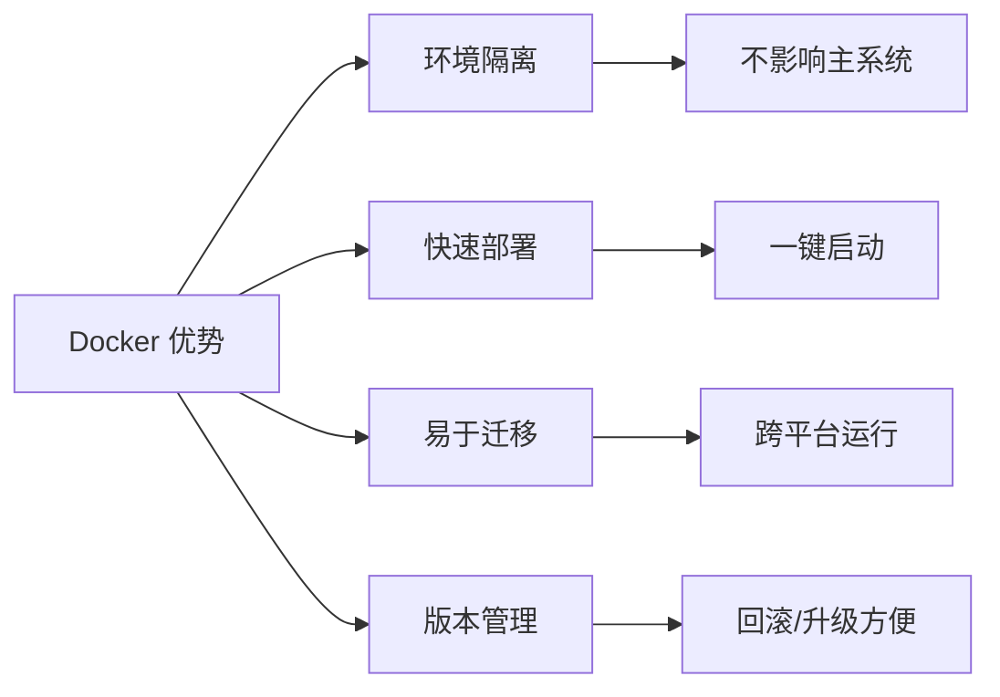

#### Docker Compose 配置

```yaml
# docker-compose.yml
version: '3.8'

services:
  stable-diffusion-webui:
    image: ghcr.io/automatic1111/stable-diffusion-webui:latest
    container_name: sd-webui
    ports:
      - "7860:7860"
    volumes:
      - ./models:/app/models
      - ./outputs:/app/outputs
      - ./extensions:/app/extensions
    deploy:
      resources:
        reservations:
          devices:
            - driver: nvidia
              count: all
              capabilities: [gpu]
    environment:
      - COMMANDLINE_ARGS=--xformers --listen
    restart: unless-stopped
```

#### 启动命令

```bash
# 启动服务
docker-compose up -d

# 查看日志
docker-compose logs -f

# 停止服务
docker-compose down
```

## 3. 云端部署方案

### 3.1 免费云平台

#### Google Colab

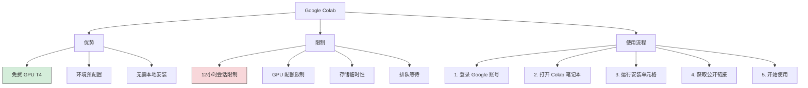

**推荐 Colab 笔记本**：

1. **TheLastBen's SD WebUI**
   - 地址：搜索 "TheLastBen fast-stable-diffusion"
   - 特点：优化启动速度，集成常用扩展

2. **Camenduru's SD WebUI**
   - 地址：github.com/camenduru/stable-diffusion-webui-colab
   - 特点：多版本可选，更新及时

**Colab 使用技巧**：

```python
# 检查 GPU 类型
!nvidia-smi

# 挂载 Google Drive（持久化存储）
from google.colab import drive
drive.mount('/content/drive')

# 设置模型保存路径
!ln -s /content/drive/MyDrive/SD_Models /content/stable-diffusion-webui/models/Stable-diffusion
```

#### Kaggle Notebooks

**配额信息**：
- GPU 时长：每周 30 小时
- GPU 类型：Tesla P100 16GB 或 T4 16GB
- 存储空间：20GB 临时 + 输出持久化

**使用步骤**：

```python
# 1. 创建新笔记本
# 2. 设置 -> Accelerator -> GPU P100

# 3. 安装 WebUI
!git clone https://github.com/AUTOMATIC1111/stable-diffusion-webui
%cd stable-diffusion-webui

# 4. 安装依赖
!pip install -r requirements.txt

# 5. 启动（使用 ngrok 或 cloudflared 穿透）
!python launch.py --share
```

#### Amazon SageMaker Studio Lab

**特点**：
- 免费 GPU 实例（4小时/会话）
- 15GB 持久存储
- 无需信用卡

**申请流程**：
1. 访问 studiolab.sagemaker.aws
2. 申请账号（需等待审批）
3. 创建 GPU 运行时
4. 克隆并运行 WebUI

### 3.2 付费云平台

#### AutoDL（国内首选）

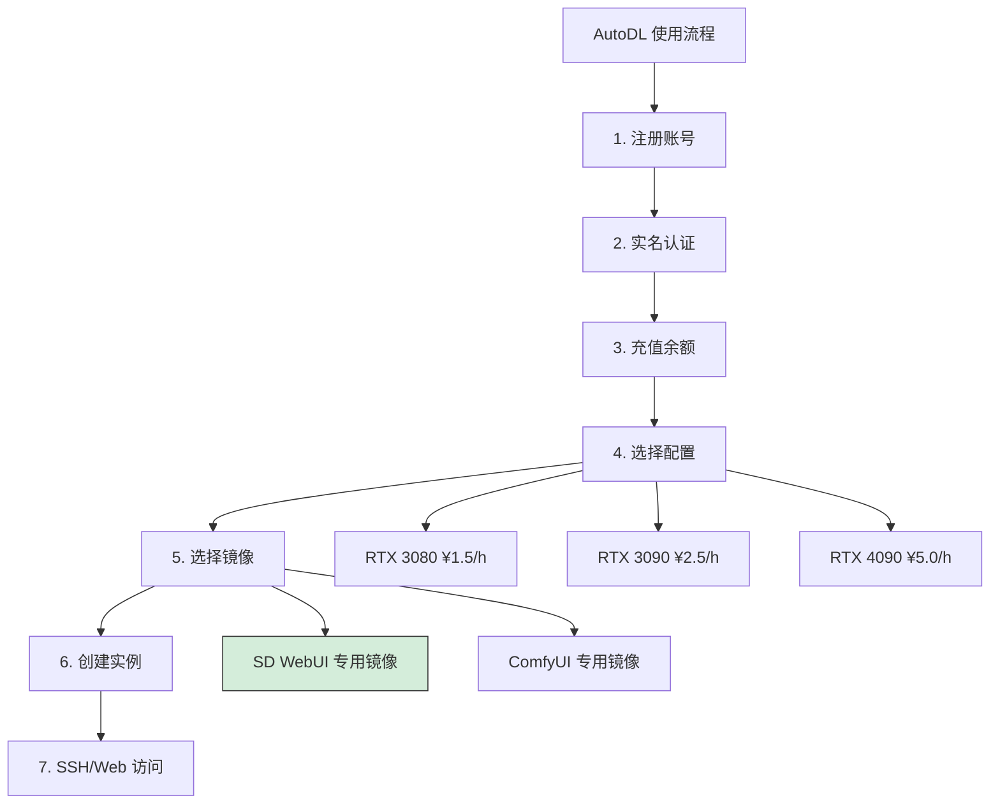

**推荐配置**：

| 使用场景 | GPU | 显存 | 价格 | 适用 |
|----------|-----|------|------|------|
| 入门体验 | RTX 3080 | 10GB | ¥1.5/h | SD 1.5 基础 |
| 标准使用 | RTX 3090 | 24GB | ¥2.5/h | SDXL 完整 |
| 高效生产 | RTX 4090 | 24GB | ¥5.0/h | 批量/训练 |

**SSH 连接示例**：

```bash
# 复制 AutoDL 提供的 SSH 命令
ssh -p 端口 root@region-xxx.autodl.pro

# 输入密码后即可进入

# 启动 WebUI（如使用预装镜像）
cd /root/stable-diffusion-webui
python launch.py --listen --port 6006
```

**端口转发访问**：

```bash
# 本地执行（将远程 6006 端口映射到本地）
ssh -L 7860:localhost:6006 -p 端口 root@region-xxx.autodl.pro

# 然后在本地浏览器访问
http://localhost:7860
```

#### Vast.ai（国际性价比）

**特点**：
- 竞价模式，价格灵活
- GPU 选择丰富
- 按秒计费

**使用流程**：


**推荐搜索过滤**：
- GPU Memory: ≥ 12GB
- GPU: RTX 3090 / RTX 4090
- Docker: SD WebUI 相关镜像
- Reliability: ≥ 95%

#### RunPod

**特点**：
- 预配置 SD 模板
- 一键部署
- 社区模板丰富

**快速部署**：
1. 注册并充值
2. 选择 "Stable Diffusion WebUI" 模板
3. 选择 GPU（推荐 RTX 3090）
4. 点击 Deploy
5. 等待启动，获取访问链接

#### 云平台对比总结

| 平台 | 优势 | 劣势 | 价格区间 | 推荐指数 |
|------|------|------|----------|----------|
| AutoDL | 国内访问快、中文界面、预装镜像 | 国际模型下载慢 | ¥1.5-8/h | ⭐⭐⭐⭐⭐ |
| Vast.ai | 价格灵活、选择多 | 英文界面、稳定性波动 | $0.1-1/h | ⭐⭐⭐⭐ |
| RunPod | 一键部署、简单易用 | 价格略高 | $0.3-1.5/h | ⭐⭐⭐⭐ |
| Lambda | 企业级稳定 | 价格高 | $0.5-2/h | ⭐⭐⭐ |

### 3.3 自建云服务器

适合有长期需求、需要完全控制的用户。

#### 阿里云/腾讯云 GPU 实例

**推荐配置**：
- 实例类型：GN7（NVIDIA V100）或更高
- 镜像：Ubuntu 22.04 + CUDA 12.0
- 存储：100GB SSD

**部署脚本**：

```bash
#!/bin/bash
# deploy_sd.sh

# 更新系统
apt update && apt upgrade -y

# 安装 NVIDIA 驱动和 CUDA
apt install -y nvidia-driver-535 nvidia-cuda-toolkit

# 安装 Python 和 Git
apt install -y python3.10 python3.10-venv python3-pip git

# 克隆 WebUI
git clone https://github.com/AUTOMATIC1111/stable-diffusion-webui.git
cd stable-diffusion-webui

# 配置启动参数
echo 'export COMMANDLINE_ARGS="--xformers --listen --port 7860"' >> webui-user.sh

# 创建 systemd 服务
cat > /etc/systemd/system/sdwebui.service << EOF
[Unit]
Description=Stable Diffusion WebUI
After=network.target

[Service]
Type=simple
User=root
WorkingDirectory=/root/stable-diffusion-webui
ExecStart=/root/stable-diffusion-webui/webui.sh
Restart=on-failure

[Install]
WantedBy=multi-user.target
EOF

# 启动服务
systemctl enable sdwebui
systemctl start sdwebui
```

## 4. WebUI 类型选择

### 4.1 WebUI 对比

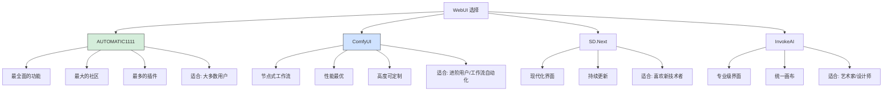

### 4.2 各 WebUI 详细对比

| 特性 | AUTOMATIC1111 | ComfyUI | SD.Next | InvokeAI |
|------|---------------|---------|---------|----------|
| **界面风格** | 传统表单 | 节点图 | 现代化 | 专业级 |
| **学习曲线** | 中等 | 陡峭 | 平缓 | 中等 |
| **扩展生态** | ⭐⭐⭐⭐⭐ | ⭐⭐⭐⭐ | ⭐⭐⭐ | ⭐⭐⭐ |
| **性能优化** | ⭐⭐⭐⭐ | ⭐⭐⭐⭐⭐ | ⭐⭐⭐⭐ | ⭐⭐⭐ |
| **工作流** | 基础 | 高级 | 中等 | 高级 |
| **API 支持** | ✅ | ✅ | ✅ | ✅ |
| **推荐新手** | ✅ | ❌ | ✅ | ⚠️ |

### 4.3 选择建议

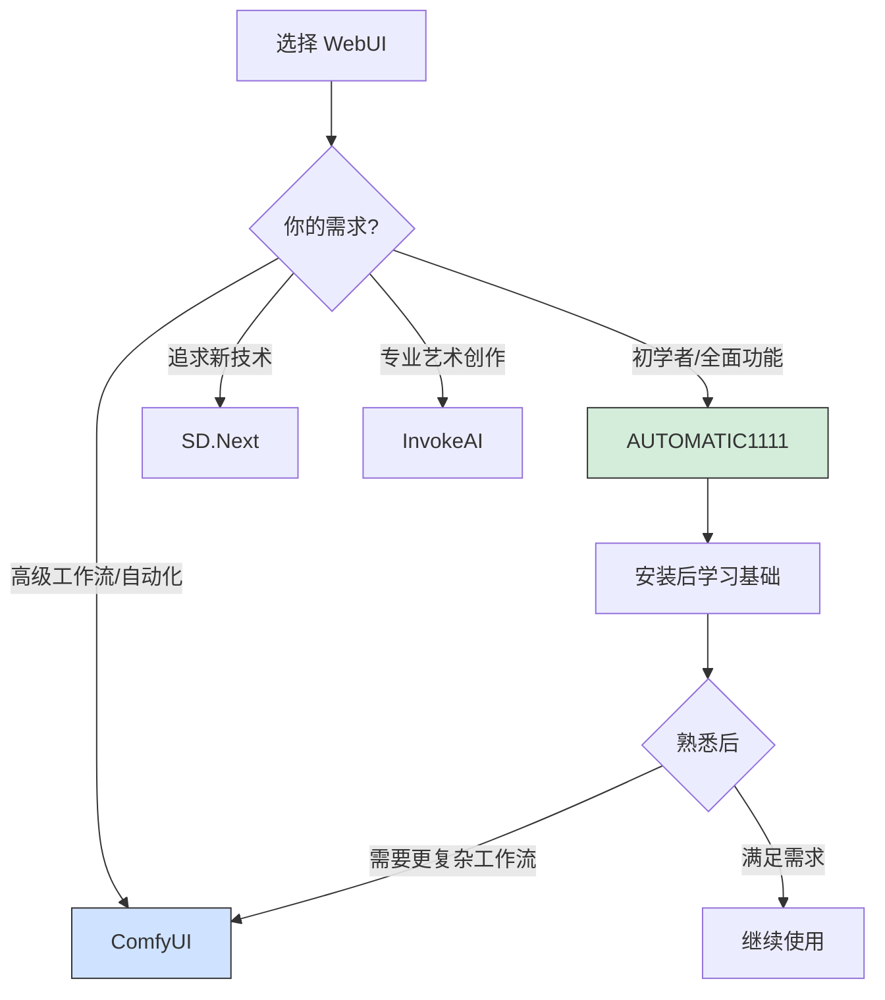

## 5. 常见问题与解决方案

### 5.1 安装问题

#### Q1: Python 版本冲突

**问题**：系统存在多个 Python 版本

**解决**：
```bash
# Windows：使用 py 启动器
py -3.10 --version

# 在 webui-user.bat 中指定
set PYTHON=C:\Python310\python.exe
```

#### Q2: Git 克隆失败

**问题**：网络问题导致克隆失败

**解决**：
```bash
# 使用镜像加速
git clone https://ghproxy.com/https://github.com/AUTOMATIC1111/stable-diffusion-webui.git

# 或使用浅克隆
git clone --depth 1 https://github.com/AUTOMATIC1111/stable-diffusion-webui.git
```

#### Q3: 依赖下载超时

**问题**：pip 下载依赖包失败

**解决**：
```bash
# 使用国内镜像（在 webui-user.bat 中添加）
set PIP_INDEX_URL=https://pypi.tuna.tsinghua.edu.cn/simple
set PIP_TRUSTED_HOST=pypi.tuna.tsinghua.edu.cn
```

### 5.2 运行问题

#### Q4: CUDA out of memory

**问题**：显存不足

**解决方案优先级**：

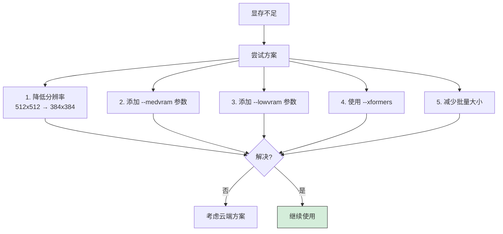

#### Q5: 启动时卡住不动

**排查清单**：
- [ ] 检查防火墙设置
- [ ] 确认端口未被占用
- [ ] 查看命令行输出的错误信息
- [ ] 尝试使用 `--skip-torch-cuda-test` 跳过测试

#### Q6: 生成的图片全黑/全灰

**可能原因**：
1. 模型文件损坏 → 重新下载
2. VAE 问题 → 更换 VAE 或设为 None
3. 半精度问题 → 添加 `--no-half` 参数

### 5.3 性能优化

#### 启动参数优化组合

```bash
# 6GB 显存优化配置
set COMMANDLINE_ARGS=--xformers --medvram --opt-split-attention

# 8GB 显存标准配置
set COMMANDLINE_ARGS=--xformers --opt-split-attention

# 12GB+ 显存高性能配置
set COMMANDLINE_ARGS=--xformers

# 24GB 显存极致配置
set COMMANDLINE_ARGS=--xformers --no-half-vae
```

#### 内存/显存监控

```python
# 在 WebUI 中安装 System Info 扩展
# 可以实时监控资源使用情况
```

## 6. 部署后验证

### 6.1 功能检查清单

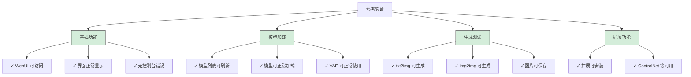

### 6.2 第一张测试图

使用以下提示词进行测试：

```
Prompt:
a beautiful sunset over mountains, golden hour lighting,
peaceful scenery, highly detailed, 8k, masterpiece

Negative Prompt:
low quality, blurry, text, watermark, signature

Settings:
- Sampling Method: DPM++ 2M Karras
- Steps: 30
- Width: 512
- Height: 512
- CFG Scale: 7
- Seed: 12345
```

如果能成功生成一张清晰的山景日落图，说明部署成功！

## 总结

### 方案快速选择

| 你的情况 | 推荐方案 |
|----------|----------|
| 有 RTX 3060 以上显卡 + 长期使用 | 本地部署 |
| 有 Mac M1/M2/M3 | macOS 本地部署 |
| 无显卡 + 想体验 | Google Colab |
| 无显卡 + 经常使用 | AutoDL 云平台 |
| 企业/商业用途 | 自建云服务器 |
| 开发/测试环境 | Docker 部署 |

