# Stable Diffusion 模型下载与配置指南

## 概述

模型是 Stable Diffusion 的核心，不同的模型决定了生成图像的风格、质量和特点。本文档将详细介绍各类模型的作用、如何选择和下载模型，以及配置和管理技巧。

## 模型生态全景图

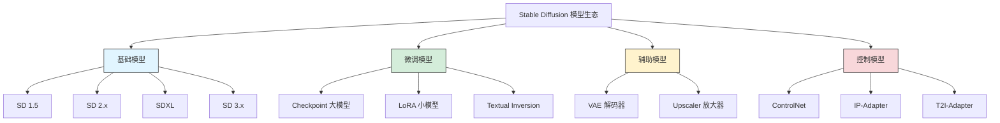

## 1. 模型类型详解

### 1.1 Checkpoint 模型（大模型）

Checkpoint 是 Stable Diffusion 的核心模型，决定了图像生成的基础风格和能力。

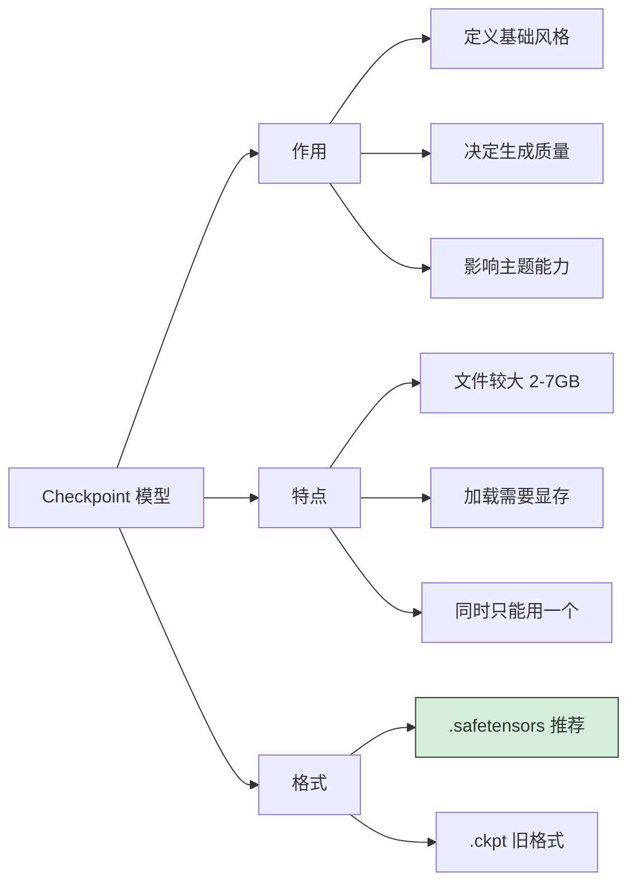

#### 模型版本对比

| 版本 | 基础分辨率 | 显存需求 | 特点 | 推荐度 |
|------|------------|----------|------|--------|
| **SD 1.5** | 512x512 | 4GB+ | 生态最成熟，资源最多 | ⭐⭐⭐⭐⭐ |
| **SD 2.1** | 768x768 | 6GB+ | 改进版，但生态较少 | ⭐⭐⭐ |
| **SDXL** | 1024x1024 | 8GB+ | 质量飞跃，细节更好 | ⭐⭐⭐⭐⭐ |
| **SD 3.x** | 1024x1024 | 12GB+ | 最新架构，文字能力强 | ⭐⭐⭐⭐ |

#### 风格分类

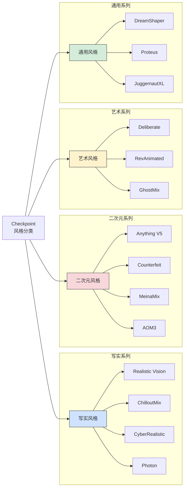

### 1.2 LoRA 模型（轻量微调）

LoRA（Low-Rank Adaptation）是一种轻量级的模型微调技术，可以在不改变基础模型的情况下添加特定风格或角色。

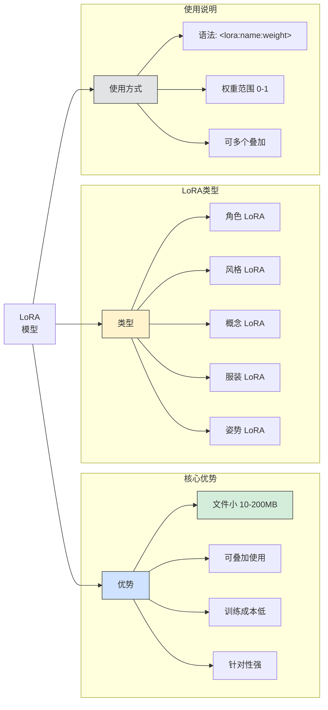

#### LoRA 使用示例

```
# 基础用法
<lora:lora_name:0.8>

# 多个 LoRA 叠加
<lora:style_lora:0.6>, <lora:character_lora:0.8>

# 在提示词中使用
masterpiece, best quality, 1girl, <lora:korean_doll:0.7>
```

#### LoRA 权重调整指南

| 权重 | 效果 | 适用场景 |
|------|------|----------|
| 0.3-0.5 | 轻微影响 | 风格微调，避免过拟合 |
| 0.6-0.8 | 明显影响 | 常规使用，推荐范围 |
| 0.9-1.0 | 强烈影响 | 需要完全呈现 LoRA 效果 |
| >1.0 | 过度影响 | 可能导致画面异常 |

### 1.3 VAE（变分自编码器）

VAE 负责将潜空间的数据解码为最终图像，影响图像的色彩和清晰度。

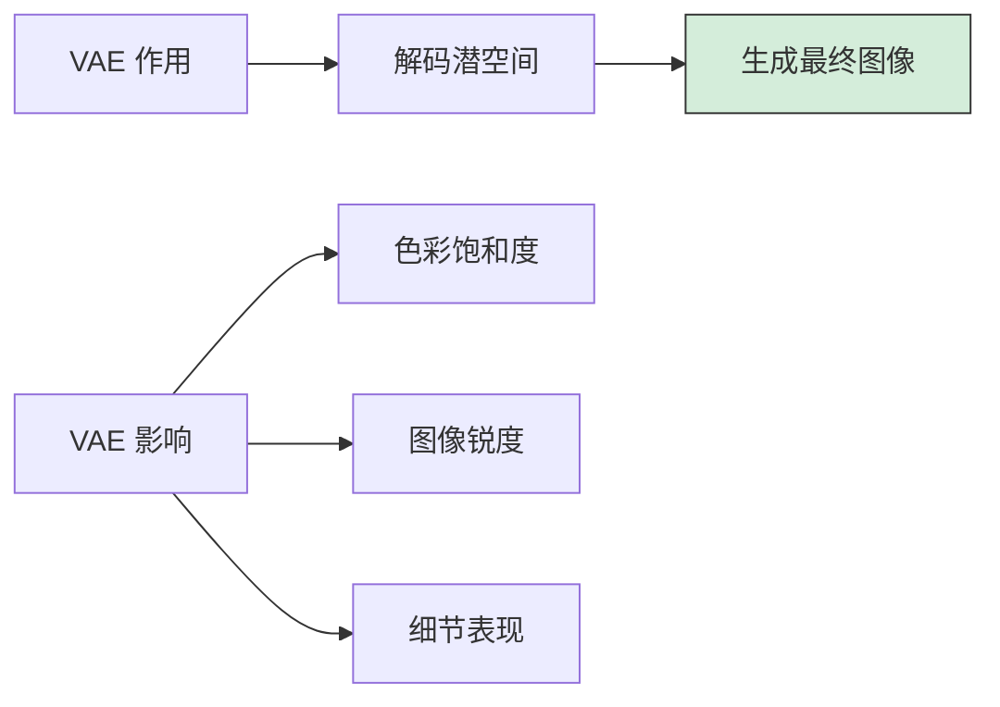

#### 常用 VAE 推荐

| VAE 名称 | 特点 | 适用模型 | 推荐度 |
|----------|------|----------|--------|
| **vae-ft-mse-840000** | 色彩鲜艳，细节清晰 | SD 1.5 全系列 | ⭐⭐⭐⭐⭐ |
| **kl-f8-anime2** | 专为二次元优化 | 二次元模型 | ⭐⭐⭐⭐ |
| **sdxl_vae** | SDXL 官方 VAE | SDXL 系列 | ⭐⭐⭐⭐⭐ |
| **blessed2** | 增强版，防灰图 | 写实模型 | ⭐⭐⭐⭐ |

#### VAE 对比效果

```
无 VAE / 内置 VAE：
- 颜色可能偏灰
- 细节可能模糊
- 某些模型效果正常

使用推荐 VAE：
- 色彩更鲜艳
- 细节更清晰
- 整体质感提升
```

### 1.4 Textual Inversion（文本嵌入）

Textual Inversion 也称为 Embeddings，是一种轻量级的概念学习方法。

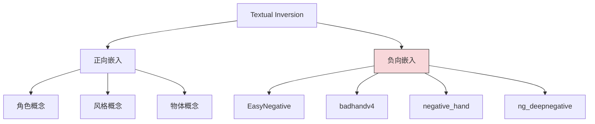

#### 常用负向嵌入

| 嵌入名称 | 作用 | 推荐度 |
|----------|------|--------|
| **EasyNegative** | 通用负面效果抑制 | ⭐⭐⭐⭐⭐ |
| **badhandv4** | 修复手部问题 | ⭐⭐⭐⭐⭐ |
| **negative_hand** | 手部负面特征 | ⭐⭐⭐⭐ |
| **ng_deepnegative** | 深度负面特征 | ⭐⭐⭐⭐ |
| **bad-artist** | 避免低质量艺术风格 | ⭐⭐⭐ |

#### 使用方法

```
# 在负面提示词中使用
Negative Prompt:
EasyNegative, badhandv4, (worst quality:1.4), (low quality:1.4)
```

### 1.5 ControlNet 模型

ControlNet 提供精确的图像控制能力，是高级创作的必备工具。

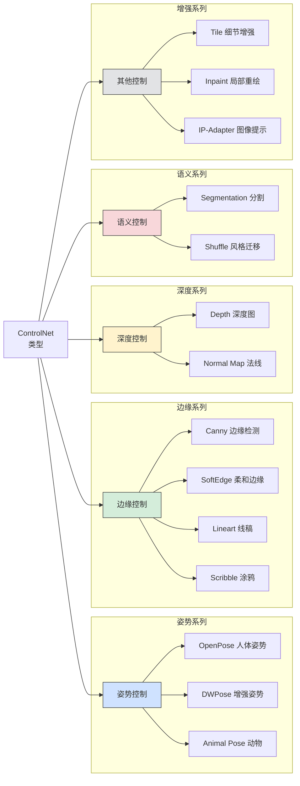

#### ControlNet 模型选择

| 模型 | 用途 | 输入类型 | 显存占用 |
|------|------|----------|----------|
| **control_canny** | 边缘精确控制 | 边缘图 | 中 |
| **control_openpose** | 人物姿势控制 | 姿势图 | 中 |
| **control_depth** | 空间深度控制 | 深度图 | 中 |
| **control_scribble** | 草图生成 | 简笔画 | 中 |
| **control_lineart** | 线稿上色 | 线稿 | 中 |
| **control_tile** | 细节增强/放大 | 原图 | 高 |
| **control_inpaint** | 局部重绘 | 遮罩图 | 高 |

### 1.6 Upscaler 放大模型

用于图像放大和细节增强。

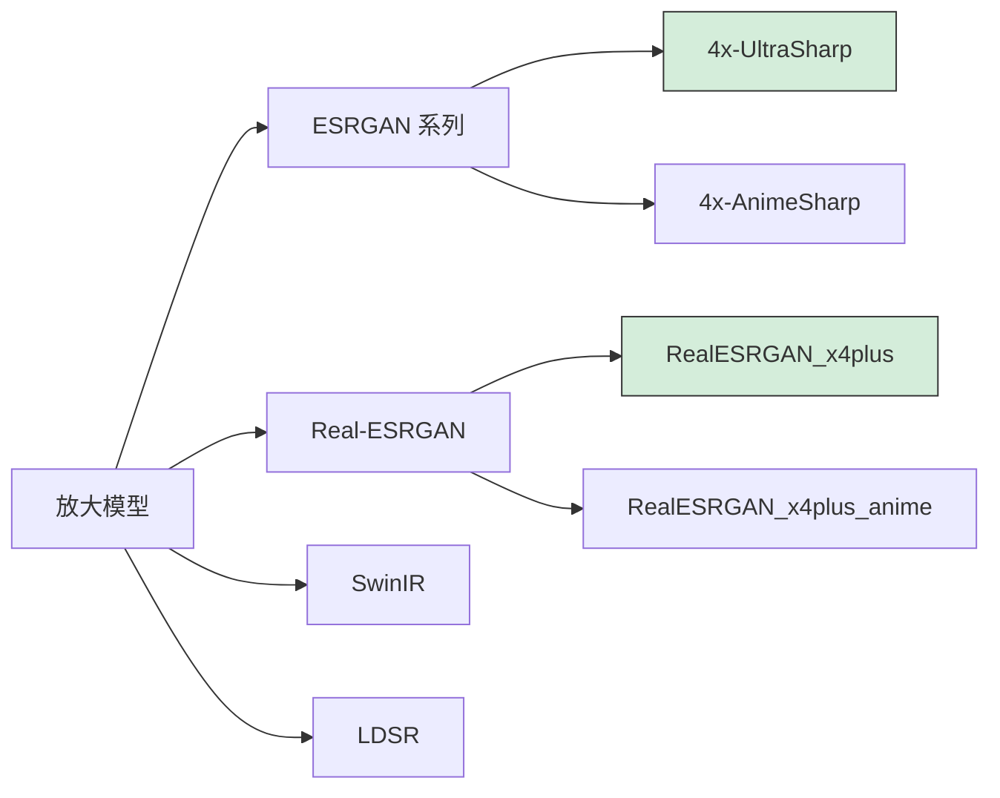

#### 放大模型推荐

| 模型 | 适用场景 | 放大倍数 | 速度 |
|------|----------|----------|------|
| **4x-UltraSharp** | 通用高质量放大 | 4x | 快 |
| **4x-AnimeSharp** | 二次元图像 | 4x | 快 |
| **RealESRGAN_x4plus** | 写实照片 | 4x | 中 |
| **RealESRGAN_x4plus_anime** | 动漫风格 | 4x | 中 |
| **LDSR** | 极致质量 | 2x/4x | 慢 |

## 2. 模型文件格式

### 2.1 格式对比

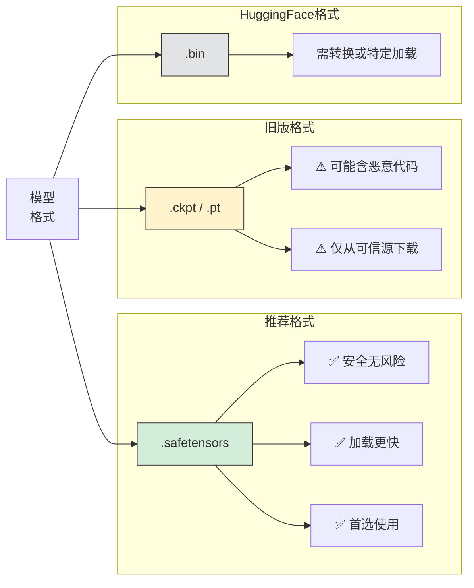

### 2.2 文件大小参考

| 模型类型 | 格式 | 典型大小 | 精度 |
|----------|------|----------|------|
| SD 1.5 Checkpoint | fp16 | 2-3 GB | 半精度 |
| SD 1.5 Checkpoint | fp32 | 4-5 GB | 全精度 |
| SDXL Checkpoint | fp16 | 6-7 GB | 半精度 |
| LoRA | - | 10-200 MB | - |
| VAE | - | 300-800 MB | - |
| ControlNet | - | 1.4-5 GB | - |
| Embedding | - | 10-100 KB | - |

### 2.3 精度选择

```
fp32（全精度）：
- 文件更大
- 理论质量更好
- 需要更多显存

fp16（半精度）：
- 文件更小（推荐）
- 质量差异几乎无法察觉
- 显存占用减半

pruned（精简版）：
- 移除训练数据
- 仅保留推理所需
- 适合普通使用
```

## 3. 下载平台详解

### 3.1 Civitai（首选推荐）

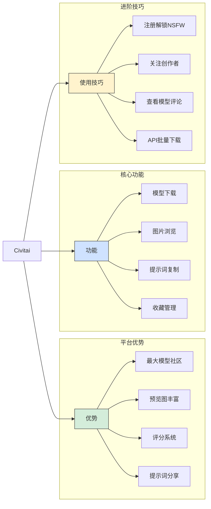

#### Civitai 模型页面解读

```
模型页面信息：
├── 模型名称和版本
├── 类型标签（Checkpoint/LoRA/等）
├── 基础模型（SD 1.5/SDXL/等）
├── 触发词（Trigger Words）
├── 下载量和评分
├── 预览图画廊
├── 使用说明
└── 版本历史
```

#### 下载技巧

```bash
# 使用 Civitai Helper 扩展（推荐）
# 可在 WebUI 内直接搜索下载

# 或使用命令行下载（需要 API Key）
curl -L "https://civitai.com/api/download/models/MODEL_ID" \
  -H "Authorization: Bearer YOUR_API_KEY" \
  -o model.safetensors
```

### 3.2 Hugging Face

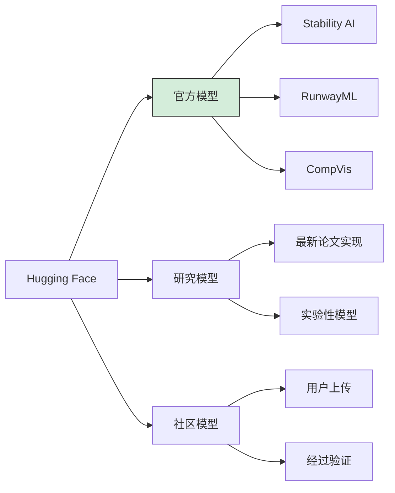

#### 常用官方模型仓库

| 仓库 | 内容 | 链接 |
|------|------|------|
| `runwayml/stable-diffusion-v1-5` | SD 1.5 官方 | [链接](https://huggingface.co/runwayml/stable-diffusion-v1-5) |
| `stabilityai/stable-diffusion-2-1` | SD 2.1 官方 | [链接](https://huggingface.co/stabilityai/stable-diffusion-2-1) |
| `stabilityai/stable-diffusion-xl-base-1.0` | SDXL Base | [链接](https://huggingface.co/stabilityai/stable-diffusion-xl-base-1.0) |
| `stabilityai/stable-diffusion-xl-refiner-1.0` | SDXL Refiner | [链接](https://huggingface.co/stabilityai/stable-diffusion-xl-refiner-1.0) |

#### 下载方法

```bash
# 方法1：Git LFS
git lfs install
git clone https://huggingface.co/runwayml/stable-diffusion-v1-5

# 方法2：huggingface-cli
pip install huggingface_hub
huggingface-cli download runwayml/stable-diffusion-v1-5

# 方法3：Python
from huggingface_hub import hf_hub_download
hf_hub_download(repo_id="runwayml/stable-diffusion-v1-5",
                filename="v1-5-pruned-emaonly.safetensors")
```

### 3.3 国内平台

#### 吐司网（Tusiart）

**网址**：https://tusiart.com/

**特点**：
- 🇨🇳 中文界面，无需翻墙
- ⚡ 国内 CDN，下载快
- 🎯 中文模型和本土化内容
- 💬 中文社区交流

#### LiblibAI

**网址**：https://www.liblib.art/

**特点**：
- 🇨🇳 国内平台
- 📦 模型资源丰富
- 🎨 在线体验功能
- 📝 教程和案例

#### 模型镜像站

```bash
# HuggingFace 镜像（国内加速）
https://hf-mirror.com/

# 使用方法
export HF_ENDPOINT=https://hf-mirror.com
huggingface-cli download runwayml/stable-diffusion-v1-5
```

### 3.4 下载平台对比

| 平台 | 模型数量 | 下载速度(国内) | 社区活跃度 | 安全性 |
|------|----------|----------------|------------|--------|
| Civitai | ⭐⭐⭐⭐⭐ | ⭐⭐⭐ | ⭐⭐⭐⭐⭐ | ⭐⭐⭐⭐ |
| Hugging Face | ⭐⭐⭐⭐ | ⭐⭐ | ⭐⭐⭐⭐ | ⭐⭐⭐⭐⭐ |
| 吐司网 | ⭐⭐⭐ | ⭐⭐⭐⭐⭐ | ⭐⭐⭐ | ⭐⭐⭐⭐ |
| LiblibAI | ⭐⭐⭐ | ⭐⭐⭐⭐⭐ | ⭐⭐⭐ | ⭐⭐⭐⭐ |

## 4. 模型选择指南

### 4.1 按使用场景选择

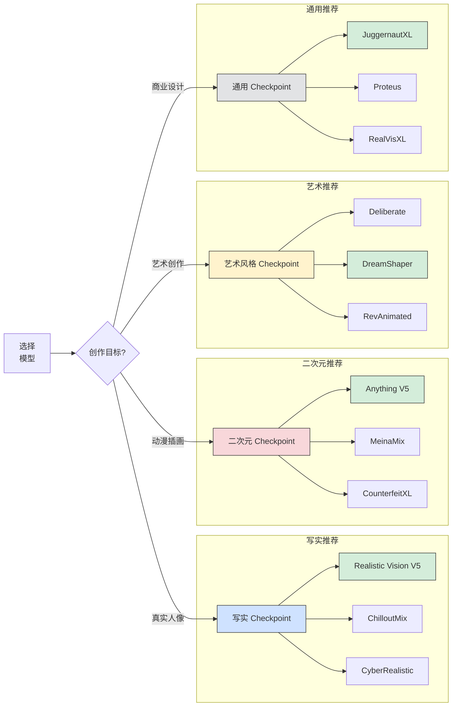

### 4.2 推荐模型清单

#### SD 1.5 系列（6GB+ 显存）

**写实风格**：

| 模型名 | 特点 | 擅长 | 推荐度 |
|--------|------|------|--------|
| **Realistic Vision V5** | 高度写实，细节丰富 | 人像、风景 | ⭐⭐⭐⭐⭐ |
| **ChilloutMix** | 亚洲人像优化 | 亚洲女性 | ⭐⭐⭐⭐⭐ |
| **CyberRealistic** | 现代感写实 | 时尚人像 | ⭐⭐⭐⭐ |
| **AbsoluteReality** | 极致真实感 | 照片级人像 | ⭐⭐⭐⭐ |

**二次元风格**：

| 模型名 | 特点 | 擅长 | 推荐度 |
|--------|------|------|--------|
| **Anything V5** | 经典二次元 | 动漫人物 | ⭐⭐⭐⭐⭐ |
| **MeinaMix** | 精致画风 | 可爱风格 | ⭐⭐⭐⭐⭐ |
| **Counterfeit** | 高质量插画 | 精细立绘 | ⭐⭐⭐⭐ |
| **AOM3** | 日系风格 | 动漫场景 | ⭐⭐⭐⭐ |

**通用/艺术风格**：

| 模型名 | 特点 | 擅长 | 推荐度 |
|--------|------|------|--------|
| **DreamShaper** | 万能型，入门首选 | 各种风格 | ⭐⭐⭐⭐⭐ |
| **Deliberate** | 艺术感强 | 概念艺术 | ⭐⭐⭐⭐ |
| **RevAnimated** | 3D 动画风 | 3D 渲染 | ⭐⭐⭐⭐ |

#### SDXL 系列（8GB+ 显存）

| 模型名 | 特点 | 擅长 | 推荐度 |
|--------|------|------|--------|
| **JuggernautXL** | SDXL 最佳通用 | 各种风格 | ⭐⭐⭐⭐⭐ |
| **RealVisXL** | 写实增强 | 真实人像 | ⭐⭐⭐⭐⭐ |
| **DreamShaperXL** | 艺术创作 | 梦幻风格 | ⭐⭐⭐⭐ |
| **CounterfeitXL** | 二次元 XL | 高清动漫 | ⭐⭐⭐⭐ |
| **Proteus** | 商业设计 | 产品渲染 | ⭐⭐⭐⭐ |

### 4.3 LoRA 推荐

#### 风格类 LoRA

| LoRA 名称 | 效果 | 推荐权重 |
|-----------|------|----------|
| **add_detail** | 增强细节 | 0.5-0.8 |
| **Film Grain** | 胶片质感 | 0.3-0.6 |
| **Anime Lineart** | 线稿风格 | 0.6-0.8 |
| **Watercolor** | 水彩效果 | 0.5-0.7 |
| **Oil Painting** | 油画风格 | 0.5-0.8 |

#### 质量增强 LoRA

| LoRA 名称 | 效果 | 推荐权重 |
|-----------|------|----------|
| **LCM LoRA** | 加速生成 | 1.0 |
| **Detail Tweaker** | 细节调整 | 0.5-1.0 |
| **epi_noiseoffset** | 高光暗部优化 | 0.5-0.7 |

### 4.4 新手推荐组合

#### 写实入门套装

```
Checkpoint: Realistic Vision V5.1
VAE: vae-ft-mse-840000-ema-pruned
LoRA: add_detail (0.5)
Embedding: EasyNegative, badhandv4

推荐参数：
- 分辨率: 512x768
- 采样器: DPM++ 2M Karras
- 步数: 30
- CFG: 7
```

#### 二次元入门套装

```
Checkpoint: Anything V5 或 MeinaMix
VAE: kl-f8-anime2 或 内置
LoRA: 根据需要
Embedding: EasyNegative

推荐参数：
- 分辨率: 512x768
- 采样器: Euler a
- 步数: 25
- CFG: 7
```

#### SDXL 入门套装

```
Checkpoint: JuggernautXL V9
VAE: sdxl_vae (通常内置)
LoRA: 根据需要

推荐参数：
- 分辨率: 1024x1024
- 采样器: DPM++ 2M Karras
- 步数: 30
- CFG: 7
```

## 5. 安装与配置

### 5.1 目录结构

```
stable-diffusion-webui/
├── models/
│   ├── Stable-diffusion/      # Checkpoint 模型
│   │   ├── realisticVision_v51.safetensors
│   │   ├── dreamshaper_8.safetensors
│   │   └── anythingV5_v5.safetensors
│   │
│   ├── VAE/                    # VAE 模型
│   │   ├── vae-ft-mse-840000-ema-pruned.safetensors
│   │   └── kl-f8-anime2.safetensors
│   │
│   ├── Lora/                   # LoRA 模型
│   │   ├── add_detail.safetensors
│   │   └── lcm-lora-sdv1-5.safetensors
│   │
│   ├── ControlNet/             # ControlNet 模型
│   │   ├── control_v11p_sd15_canny.pth
│   │   └── control_v11p_sd15_openpose.pth
│   │
│   ├── ESRGAN/                 # 放大模型
│   │   └── 4x-UltraSharp.pth
│   │
│   └── hypernetworks/          # Hypernetwork
│
├── embeddings/                 # Textual Inversion
│   ├── EasyNegative.safetensors
│   └── badhandv4.pt
│
└── extensions/
    └── sd-webui-controlnet/
        └── models/             # 扩展专属模型目录
```

### 5.2 安装步骤

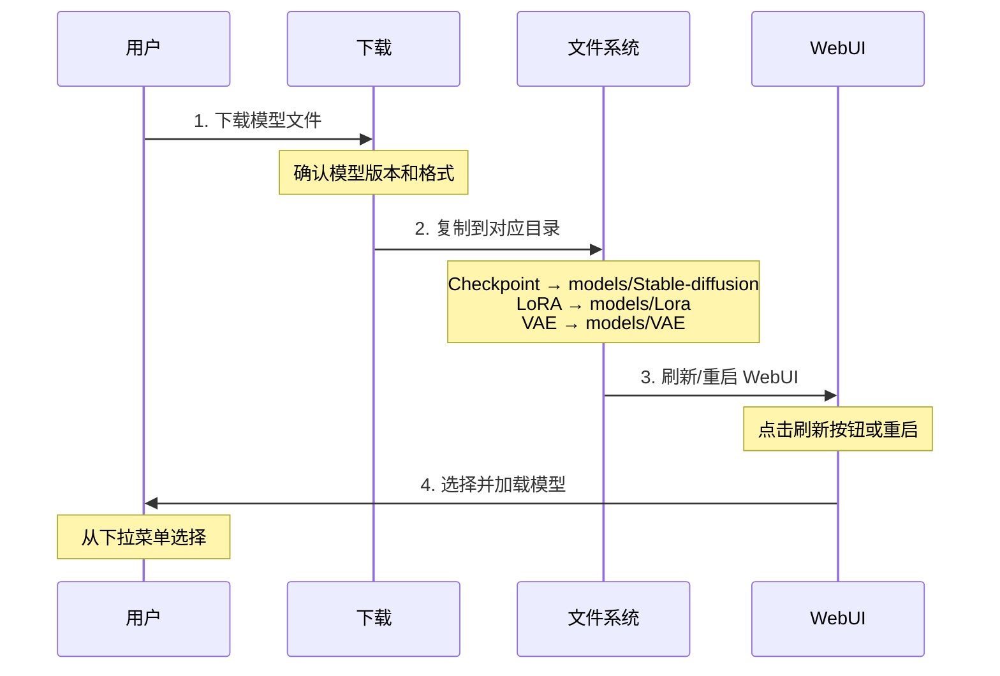

#### 详细步骤

**Step 1：下载模型**

```bash
# 选择要下载的模型
# 确认基础模型版本（SD 1.5 / SDXL）
# 选择 .safetensors 格式
```

**Step 2：放置文件**

```bash
# Windows 示例
# Checkpoint
复制 model.safetensors 到 D:\AI\stable-diffusion-webui\models\Stable-diffusion\

# LoRA
复制 lora.safetensors 到 D:\AI\stable-diffusion-webui\models\Lora\

# VAE
复制 vae.safetensors 到 D:\AI\stable-diffusion-webui\models\VAE\

# Embedding
复制 embedding.pt 到 D:\AI\stable-diffusion-webui\embeddings\
```

**Step 3：WebUI 中加载**

```
1. 刷新模型列表：点击 Checkpoint 下拉框旁的刷新按钮
2. 选择模型：从下拉菜单选择新模型
3. 等待加载：首次加载可能需要 10-30 秒
4. 配置 VAE：Settings → Stable Diffusion → SD VAE
```

### 5.3 模型配置优化

#### Settings 中的重要设置

```
Settings → Stable Diffusion:

- SD VAE: 选择或设置为 "Automatic"
- Clip skip: 通常设为 2（二次元）或 1（写实）
- Ignore last layers of CLIP model: 根据模型建议设置

Settings → Optimizations:

- Cross attention optimization: xFormers（推荐）
- Token merging ratio: 0（默认）
```

#### 启动参数优化

```bash
# webui-user.bat 中设置
set COMMANDLINE_ARGS=--xformers --no-half-vae

# --no-half-vae: 防止某些 VAE 产生黑图
# --xformers: 内存优化和加速
```

## 6. 模型管理技巧

### 6.1 文件命名规范

```
推荐命名格式：
[类型]_[名称]_[版本]_[精度].[格式]

示例：
checkpoint_realisticVision_v51_fp16.safetensors
lora_addDetail_v1_sd15.safetensors
vae_mse840000_pruned.safetensors
```

### 6.2 使用子文件夹

```
models/
├── Stable-diffusion/
│   ├── 写实/
│   │   ├── realisticVision_v51.safetensors
│   │   └── chilloutMix.safetensors
│   ├── 二次元/
│   │   ├── anythingV5.safetensors
│   │   └── meinaMix.safetensors
│   └── SDXL/
│       ├── juggernautXL_v9.safetensors
│       └── realvisXL.safetensors
```

### 6.3 模型信息记录

建议为每个重要模型创建说明文件：

```yaml
# realisticVision_v51.yaml
name: Realistic Vision V5.1
version: 5.1
base: SD 1.5
type: Checkpoint
source: https://civitai.com/models/4201
vae: vae-ft-mse-840000
clip_skip: 1
recommended_settings:
  sampler: DPM++ 2M Karras
  steps: 30
  cfg_scale: 7
  resolution: 512x768
trigger_words: null
notes: 写实人像首选模型
```

### 6.4 定期清理

```bash
# 删除不常用的模型以节省空间
# 建议保留：
# - 2-3 个常用 Checkpoint
# - 5-10 个常用 LoRA
# - 1-2 个 VAE
# - 必要的 Embedding

# 备份重要模型到外部存储
```

## 7. 常见问题

### Q1: 模型加载失败

**可能原因**：
- 文件损坏（下载不完整）
- 格式不兼容
- 放错目录

**解决方案**：
```bash
# 1. 检查文件完整性（比对 SHA256）
certutil -hashfile model.safetensors SHA256

# 2. 重新下载

# 3. 确认目录正确
```

### Q2: 生成效果与预览图差异大

**可能原因**：
- 未使用推荐参数
- VAE 不匹配
- 未使用触发词

**解决方案**：
```
1. 查看模型页面的推荐参数
2. 配置正确的 VAE
3. 使用模型要求的触发词
4. 参考预览图的提示词
```

### Q3: LoRA 不生效

**可能原因**：
- 语法错误
- 基础模型不匹配
- 权重设置不当

**解决方案**：
```
正确语法: <lora:lora_name:0.8>

注意：
- lora_name 是文件名（不含扩展名）
- 权重通常在 0.5-1.0 之间
- 确认 LoRA 适用于当前 Checkpoint
```

### Q4: VAE 导致黑图/灰图

**解决方案**：
```bash
# 方法1：添加启动参数
set COMMANDLINE_ARGS=--no-half-vae

# 方法2：更换 VAE
# 尝试使用模型内置 VAE 或其他推荐 VAE

# 方法3：设置为 Automatic
# Settings → SD VAE → Automatic
```

### Q5: 显存不足无法加载大模型

**解决方案优先级**：
```
1. 使用 --medvram 或 --lowvram 参数
2. 选择 fp16 版本模型
3. 关闭其他占用显存的程序
4. 考虑使用云端服务
```

## 8. 进阶技巧

### 8.1 模型融合

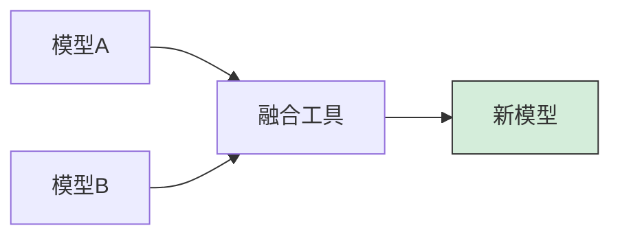

**使用 WebUI 内置融合**：
```
Checkpoint Merger 标签页:
1. 选择主模型 A
2. 选择次模型 B
3. 设置融合比例（如 0.5）
4. 选择融合方法
5. 运行融合
```

### 8.2 模型测试工作流

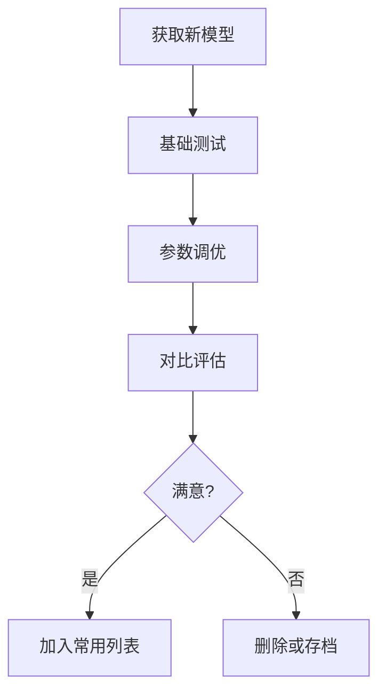

**标准测试提示词**：
```
# 通用测试
masterpiece, best quality, 1girl, solo, portrait,
looking at viewer, simple background

# 负面
low quality, worst quality, blurry, watermark
```

### 8.3 批量下载脚本

```python
# download_models.py
import os
import requests
from tqdm import tqdm

models = [
    {
        "name": "realisticVision_v51",
        "url": "YOUR_DOWNLOAD_URL",
        "path": "models/Stable-diffusion/"
    },
    # 添加更多模型...
]

def download_model(url, path, name):
    response = requests.get(url, stream=True)
    total = int(response.headers.get('content-length', 0))

    with open(os.path.join(path, f"{name}.safetensors"), 'wb') as f:
        with tqdm(total=total, unit='B', unit_scale=True) as pbar:
            for chunk in response.iter_content(chunk_size=8192):
                f.write(chunk)
                pbar.update(len(chunk))

for model in models:
    download_model(model["url"], model["path"], model["name"])
```

## 总结

### 快速参考卡

| 需求 | 推荐模型 | 显存要求 |
|------|----------|----------|
| 新手入门 | DreamShaper 8 | 6GB+ |
| 写实人像 | Realistic Vision V5 | 6GB+ |
| 二次元 | Anything V5 | 6GB+ |
| 高质量通用 | JuggernautXL | 8GB+ |
| 极致写实 | RealVisXL | 10GB+ |

### 下载优先级

```
1. 选择一个主力 Checkpoint
2. 下载推荐 VAE
3. 下载必要 Embedding（EasyNegative）
4. 根据需要添加 LoRA
5. 需要时再下载 ControlNet
```

模型只是工具，提示词技巧和参数调优同样重要。不要过度追求模型数量，深入掌握几个模型的使用更有价值。

AI 绘画领域发展迅速，新模型层出不穷。建议关注 Civitai 热门榜单，及时了解优质新模型。

只从可信来源下载模型，优先选择 .safetensors 格式，避免潜在的安全风险。

