# Stable Diffusion WebUI 界面功能详解

## 概述

AUTOMATIC1111 WebUI 是 Stable Diffusion 最流行的图形界面，功能丰富且扩展性强。本文档将详细介绍 WebUI 的各个功能模块，帮助你快速上手并掌握核心操作。

## 界面全景图

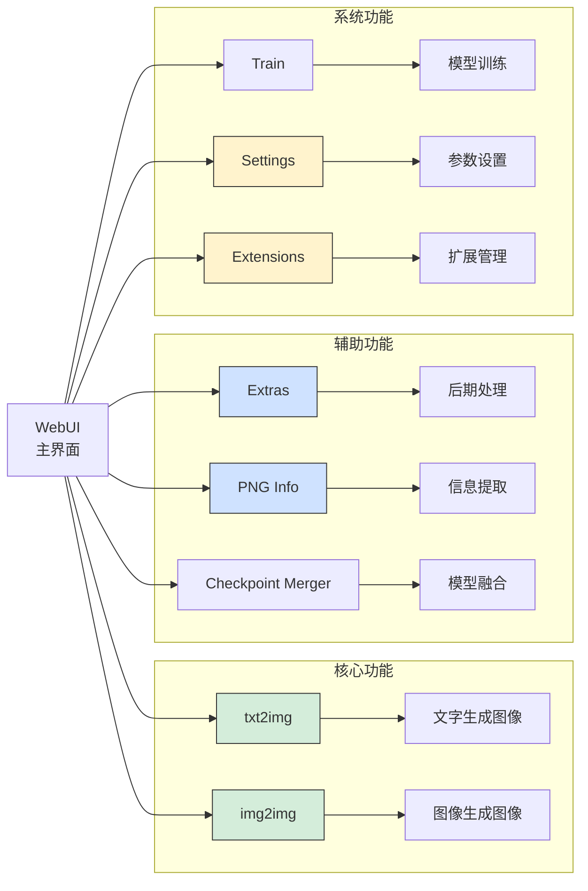
```mermaid
graph LR
    A[WebUI<br/>主界面] --> B[txt2img]
    A --> C[img2img]
    A --> D[Extras]
    A --> E[PNG Info]
    A --> F[Checkpoint Merger]
    A --> G[Train]
    A --> H[Settings]
    A --> I[Extensions]

    subgraph 核心功能
        B --> B1[文字生成图像]
        C --> C1[图像生成图像]
    end

    subgraph 辅助功能
        D --> D1[后期处理]
        E --> E1[信息提取]
        F --> F1[模型融合]
    end

    subgraph 系统功能
        G --> G1[模型训练]
        H --> H1[参数设置]
        I --> I1[扩展管理]
    end

    style B fill:#d4edda,stroke:#333
    style C fill:#d4edda,stroke:#333
    style D fill:#cfe2ff,stroke:#333
    style E fill:#cfe2ff,stroke:#333
    style H fill:#fff3cd,stroke:#333
    style I fill:#fff3cd,stroke:#333
```

## 1. txt2img（文生图）

文生图是 WebUI 最核心的功能，通过输入文字描述生成图像。

### 1.1 界面布局

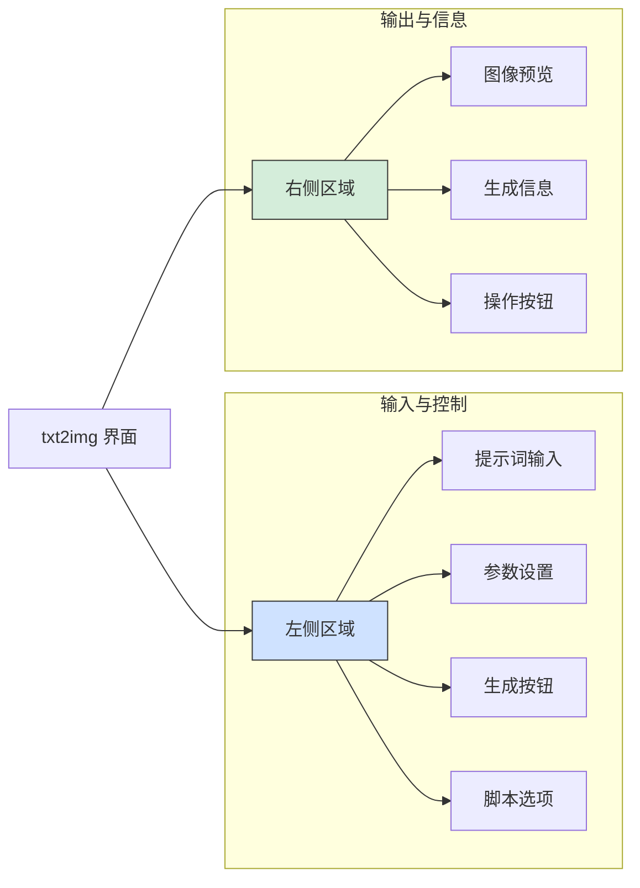
```mermaid
graph LR
    A[txt2img 界面] --> B[左侧区域]
    A --> C[右侧区域]

    subgraph 输入与控制
        B --> B1[提示词输入]
        B --> B2[参数设置]
        B --> B3[生成按钮]
        B --> B4[脚本选项]
    end

    subgraph 输出与信息
        C --> C1[图像预览]
        C --> C2[生成信息]
        C --> C3[操作按钮]
    end

    style B fill:#cfe2ff,stroke:#333
    style C fill:#d4edda,stroke:#333
```

### 1.2 提示词区域

#### Prompt（正面提示词）

```
作用：描述你想要生成的图像内容
位置：界面顶部大文本框

示例：
masterpiece, best quality, 1girl, long hair, blue eyes,
white dress, standing in flower field, sunlight, detailed

技巧：
- 重要内容放前面
- 用逗号分隔不同元素
- 可使用权重语法 (keyword:1.2)
```

#### Negative Prompt（负面提示词）

```
作用：描述你不想出现的内容
位置：Prompt 下方的文本框

示例：
low quality, worst quality, blurry, watermark, text,
bad anatomy, bad hands, missing fingers, extra limbs

技巧：
- 添加常见质量问题
- 使用负面 Embedding（如 EasyNegative）
- 针对性添加（如人物图加 bad hands）
```

### 1.3 采样参数

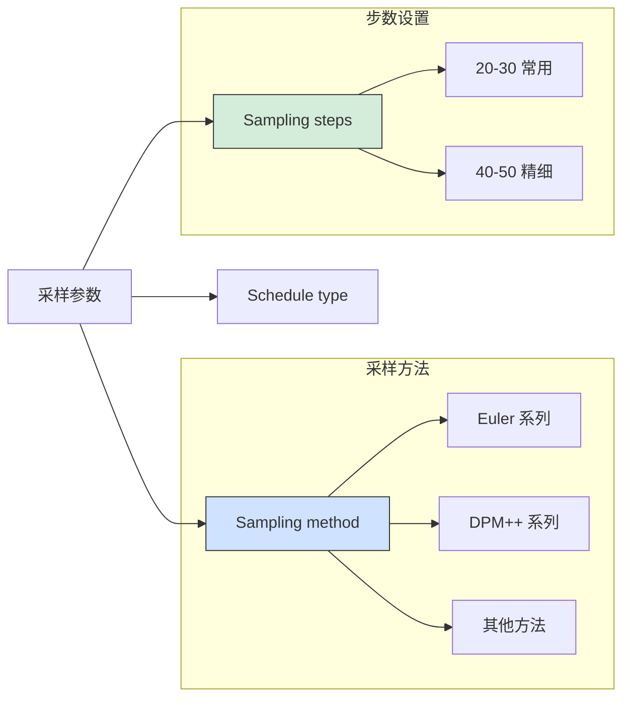
```mermaid
graph LR
    A[采样参数] --> B[Sampling method]
    A --> C[Sampling steps]
    A --> D[Schedule type]

    subgraph 采样方法
        B --> B1[Euler 系列]
        B --> B2[DPM++ 系列]
        B --> B3[其他方法]
    end

    subgraph 步数设置
        C --> C1[20-30 常用]
        C --> C2[40-50 精细]
    end

    style B fill:#cfe2ff,stroke:#333
    style C fill:#d4edda,stroke:#333
```

#### Sampling Method（采样方法）

| 方法 | 特点 | 推荐场景 | 速度 |
|------|------|----------|------|
| **Euler a** | 创意性强，变化大 | 探索阶段 | 快 |
| **Euler** | 稳定，收敛快 | 固定种子复现 | 快 |
| **DPM++ 2M Karras** | 质量高，细节好 | 日常使用首选 | 中 |
| **DPM++ SDE Karras** | 细节丰富，略慢 | 追求质量 | 慢 |
| **DPM++ 2M SDE** | 均衡之选 | 通用场景 | 中 |
| **DDIM** | 确定性强 | 需要精确控制 | 中 |
| **UniPC** | 高效率 | 快速出图 | 快 |

#### Sampling Steps（采样步数）

```
步数与质量关系：
├── 10-15 步：草图质量，快速预览
├── 20-30 步：标准质量，日常使用（推荐）
├── 40-50 步：高质量，精细图像
└── 50+ 步：边际效益递减，不推荐

注意：不同采样器对步数敏感度不同
- Euler a：20 步即可
- DPM++ 2M Karras：30 步较佳
```

### 1.4 图像尺寸

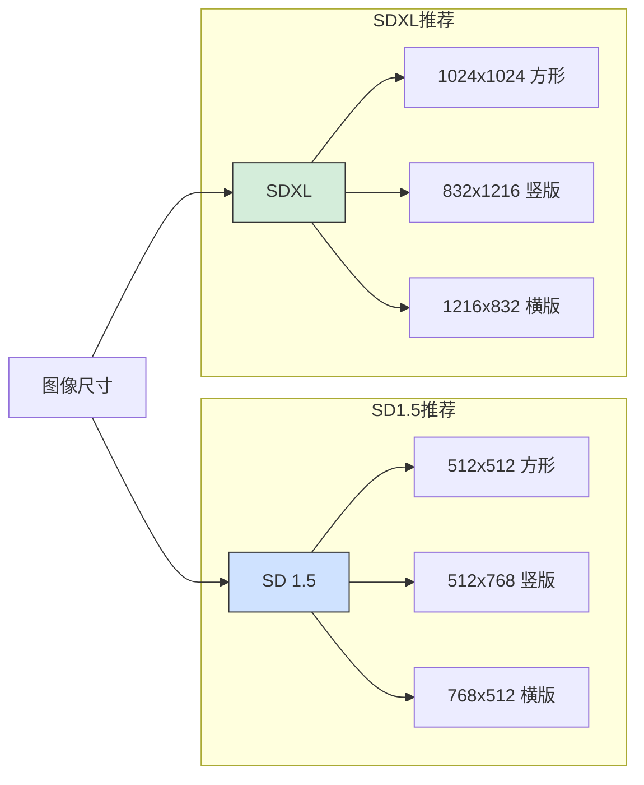
```mermaid
graph LR
    A[图像尺寸] --> B[SD 1.5]
    A --> C[SDXL]

    subgraph SD1.5推荐
        B --> B1[512x512 方形]
        B --> B2[512x768 竖版]
        B --> B3[768x512 横版]
    end

    subgraph SDXL推荐
        C --> C1[1024x1024 方形]
        C --> C2[832x1216 竖版]
        C --> C3[1216x832 横版]
    end

    style B fill:#cfe2ff,stroke:#333
    style C fill:#d4edda,stroke:#333
```

#### 常用尺寸速查表

| 模型 | 用途 | 宽度 | 高度 | 比例 |
|------|------|------|------|------|
| SD 1.5 | 方形头像 | 512 | 512 | 1:1 |
| SD 1.5 | 竖版人像 | 512 | 768 | 2:3 |
| SD 1.5 | 横版风景 | 768 | 512 | 3:2 |
| SD 1.5 | 手机壁纸 | 512 | 912 | 9:16 |
| SDXL | 方形 | 1024 | 1024 | 1:1 |
| SDXL | 竖版 | 832 | 1216 | 2:3 |
| SDXL | 横版 | 1216 | 832 | 3:2 |

### 1.5 CFG Scale（提示词相关性）

```
CFG Scale 控制图像与提示词的匹配程度

数值范围：1-30（常用 5-15）

效果对比：
├── 1-4：创意自由，可能偏离提示词
├── 5-7：轻度引导，保持创意
├── 7-9：标准范围，推荐使用
├── 10-12：强引导，严格遵循提示词
├── 13-15：非常严格，可能过饱和
└── 15+：通常过度，画面异常

推荐值：7（新手默认）
```

### 1.6 Seed（随机种子）

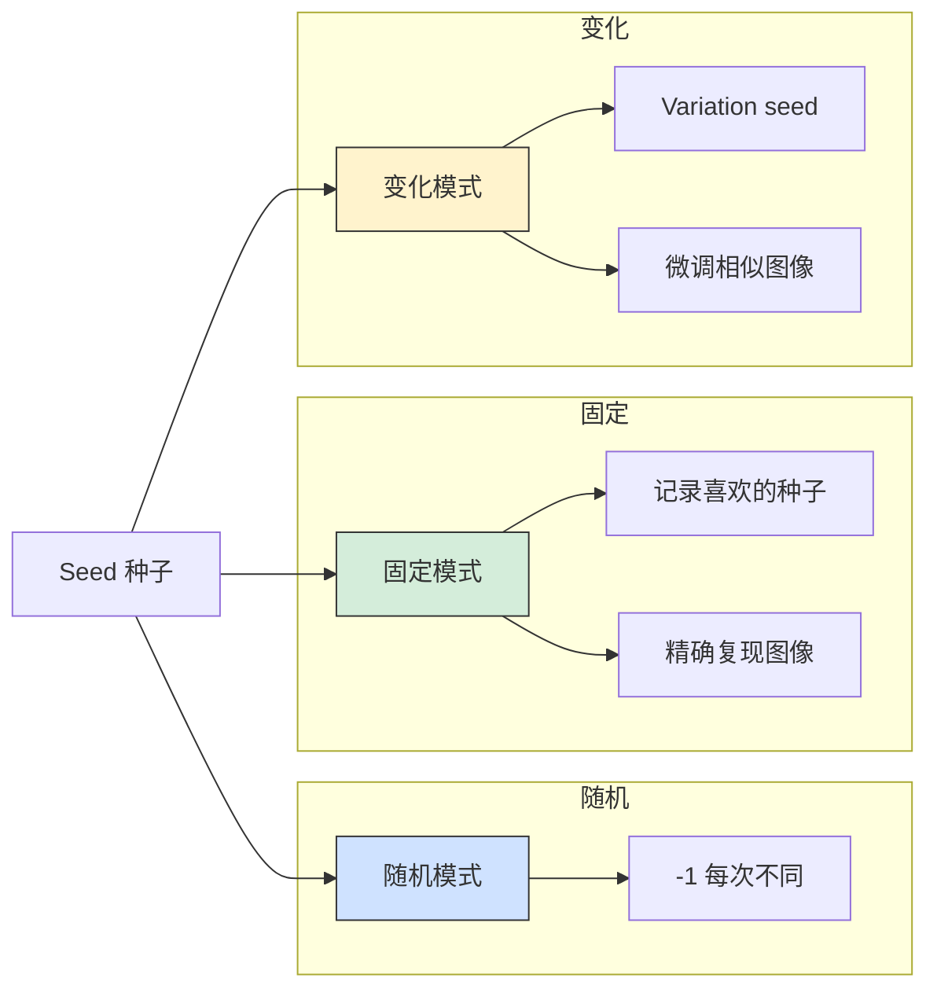
```mermaid
graph LR
    A[Seed 种子] --> B[随机模式]
    A --> C[固定模式]
    A --> D[变化模式]

    subgraph 随机
        B --> B1["-1" 每次不同]
    end

    subgraph 固定
        C --> C1[记录喜欢的种子]
        C --> C2[精确复现图像]
    end

    subgraph 变化
        D --> D1[Variation seed]
        D --> D2[微调相似图像]
    end

    style B fill:#cfe2ff,stroke:#333
    style C fill:#d4edda,stroke:#333
    style D fill:#fff3cd,stroke:#333
```

#### Seed 使用技巧

```
1. 探索阶段：使用 -1（随机）
2. 找到喜欢的图：记录 Seed 值
3. 微调优化：固定 Seed，调整其他参数
4. 批量变体：使用 Variation seed + Variation strength

Extra 选项：
- Variation seed：变体种子
- Variation strength：变体强度（0-1）
- Resize seed：种子尺寸调整
```

### 1.7 批量生成

```
Batch count：生成批次数（顺序执行）
Batch size：每批生成数量（并行执行）

示例：
Batch count = 4, Batch size = 2
→ 共生成 4 × 2 = 8 张图
→ 每次并行生成 2 张，执行 4 次

显存建议：
- 6GB 显存：Batch size ≤ 2
- 8GB 显存：Batch size ≤ 4
- 12GB+ 显存：Batch size ≤ 8
```

### 1.8 高分辨率修复（Hires. fix）

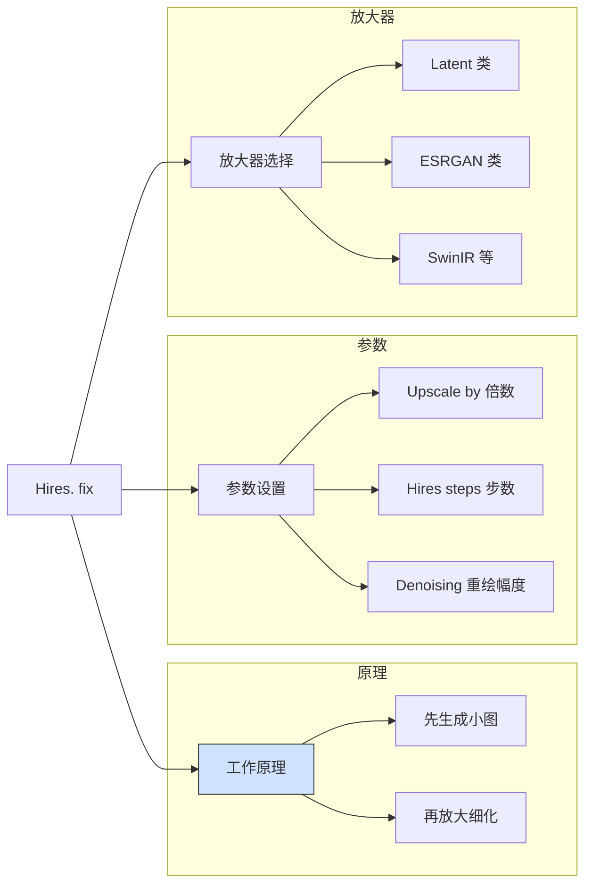
```mermaid
graph LR
    A[Hires. fix] --> B[工作原理]
    A --> C[参数设置]
    A --> D[放大器选择]

    subgraph 原理
        B --> B1[先生成小图]
        B --> B2[再放大细化]
    end

    subgraph 参数
        C --> C1[Upscale by 倍数]
        C --> C2[Hires steps 步数]
        C --> C3[Denoising 重绘幅度]
    end

    subgraph 放大器
        D --> D1[Latent 类]
        D --> D2[ESRGAN 类]
        D --> D3[SwinIR 等]
    end

    style B fill:#cfe2ff,stroke:#333
```

#### Hires. fix 推荐设置

| 参数 | 推荐值 | 说明 |
|------|--------|------|
| Upscaler | Latent 或 4x-UltraSharp | 根据需求选择 |
| Hires steps | 15-20 | 放大时的采样步数 |
| Denoising strength | 0.4-0.6 | 重绘强度，越高变化越大 |
| Upscale by | 1.5-2 | 放大倍数 |

## 2. img2img（图生图）

基于输入图像生成新图像，支持风格转换、图像修改等。

### 2.1 功能模块

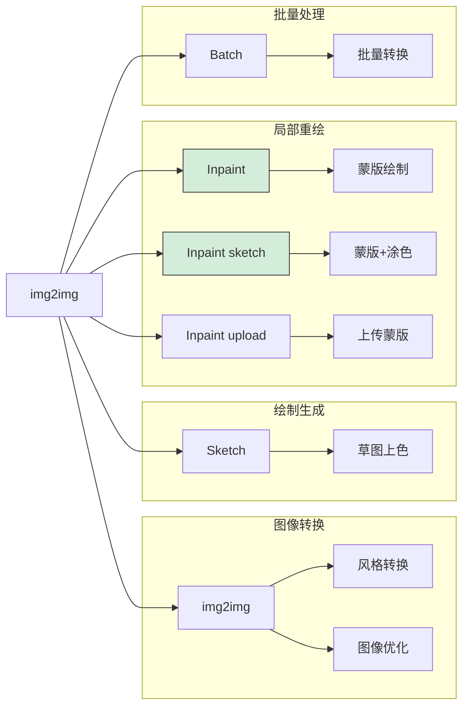
```mermaid
graph LR
    A[img2img] --> B[img2img]
    A --> C[Sketch]
    A --> D[Inpaint]
    A --> E[Inpaint sketch]
    A --> F[Inpaint upload]
    A --> G[Batch]

    subgraph 图像转换
        B --> B1[风格转换]
        B --> B2[图像优化]
    end

    subgraph 绘制生成
        C --> C1[草图上色]
    end

    subgraph 局部重绘
        D --> D1[蒙版绘制]
        E --> E1[蒙版+涂色]
        F --> F1[上传蒙版]
    end

    subgraph 批量处理
        G --> G1[批量转换]
    end

    style D fill:#d4edda,stroke:#333
    style E fill:#d4edda,stroke:#333
```

### 2.2 核心参数：Denoising Strength

```
Denoising Strength（重绘强度）
范围：0-1

效果对比：
├── 0.1-0.3：轻微修改，保持原图结构
├── 0.4-0.5：中度修改，风格转换
├── 0.6-0.7：大幅修改，保留构图
├── 0.8-0.9：几乎重绘，仅参考构图
└── 1.0：完全重绘，忽略原图

常用场景：
- 照片转动漫：0.5-0.7
- 优化细节：0.2-0.4
- 风格迁移：0.6-0.8
- 草图上色：0.7-0.9
```

### 2.3 Inpaint（局部重绘）

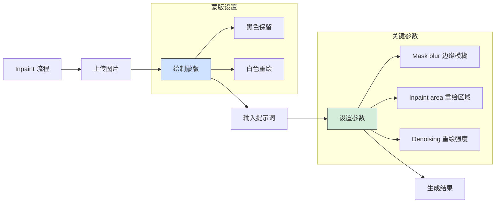
```mermaid
graph LR
    A[Inpaint 流程] --> B[上传图片]
    B --> C[绘制蒙版]
    C --> D[输入提示词]
    D --> E[设置参数]
    E --> F[生成结果]

    subgraph 蒙版设置
        C --> C1[黑色保留]
        C --> C2[白色重绘]
    end

    subgraph 关键参数
        E --> E1[Mask blur 边缘模糊]
        E --> E2[Inpaint area 重绘区域]
        E --> E3[Denoising 重绘强度]
    end

    style C fill:#cfe2ff,stroke:#333
    style E fill:#d4edda,stroke:#333
```

#### Inpaint 参数详解

| 参数 | 作用 | 推荐值 |
|------|------|--------|
| **Mask blur** | 蒙版边缘模糊度 | 4-8 |
| **Mask mode** | Inpaint masked / not masked | 根据需求 |
| **Masked content** | 蒙版区域填充方式 | Original 或 Latent noise |
| **Inpaint area** | Whole picture / Only masked | Only masked（节省显存） |
| **Only masked padding** | 边缘填充像素 | 32-64 |

#### Masked Content 选项

```
fill：纯色填充，适合大面积重绘
original：保持原图，适合微调
latent noise：噪声填充，创意性强
latent nothing：潜空间空白，中性起点
```

### 2.4 Sketch（草图上色）

```
使用流程：
1. 在画布上绘制草图（或上传草图）
2. 输入描述提示词
3. 设置较高的 Denoising（0.7-0.9）
4. 生成上色结果

技巧：
- 简单线条即可，不需精细
- 提示词描述颜色和风格
- 多次生成选择最佳
```

## 3. Extras（后期处理）

图像后期处理功能，包括放大、修复等。

### 3.1 功能概览

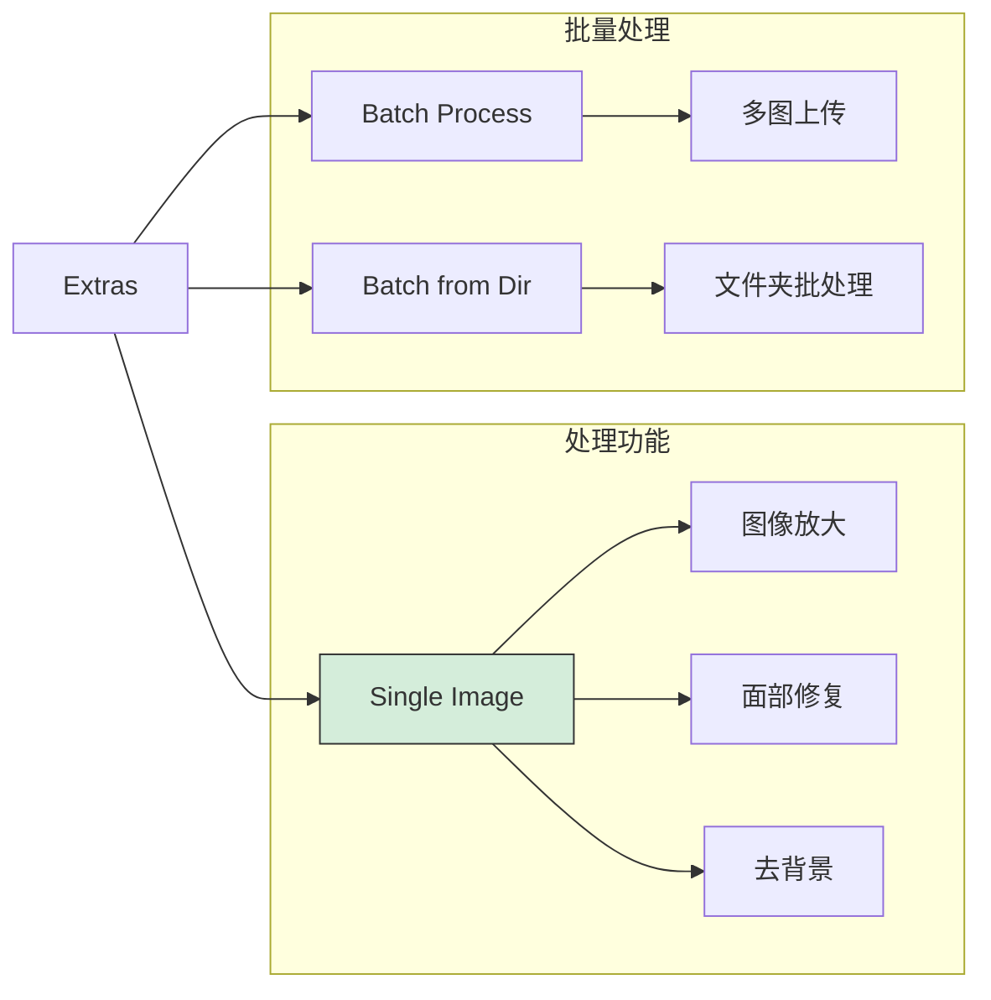
```mermaid
graph LR
    A[Extras] --> B[Single Image]
    A --> C[Batch Process]
    A --> D[Batch from Dir]

    subgraph 处理功能
        B --> B1[图像放大]
        B --> B2[面部修复]
        B --> B3[去背景]
    end

    subgraph 批量处理
        C --> C1[多图上传]
        D --> D1[文件夹批处理]
    end

    style B fill:#d4edda,stroke:#333
```

### 3.2 图像放大

#### 放大器对比

| 放大器 | 特点 | 适用场景 | 速度 |
|--------|------|----------|------|
| **Lanczos** | 锐利，保持边缘 | 像素画、线稿 | 快 |
| **ESRGAN_4x** | 通用放大 | 一般图像 | 中 |
| **4x-UltraSharp** | 高清锐利 | 写实照片 | 中 |
| **4x-AnimeSharp** | 动漫优化 | 二次元图像 | 中 |
| **R-ESRGAN 4x+** | 平衡之选 | 通用 | 中 |
| **R-ESRGAN 4x+ Anime6B** | 动漫专用 | 二次元 | 中 |
| **SwinIR_4x** | 高质量 | 追求极致 | 慢 |
| **LDSR** | 最高质量 | 最终输出 | 很慢 |

#### 推荐设置

```
写实图像放大：
- Upscaler 1：R-ESRGAN 4x+
- Upscaler 2：4x-UltraSharp
- Upscaler 2 visibility：0.3-0.5

二次元图像放大：
- Upscaler 1：R-ESRGAN 4x+ Anime6B
- Upscaler 2：4x-AnimeSharp
- Upscaler 2 visibility：0.3-0.5
```

### 3.3 面部修复

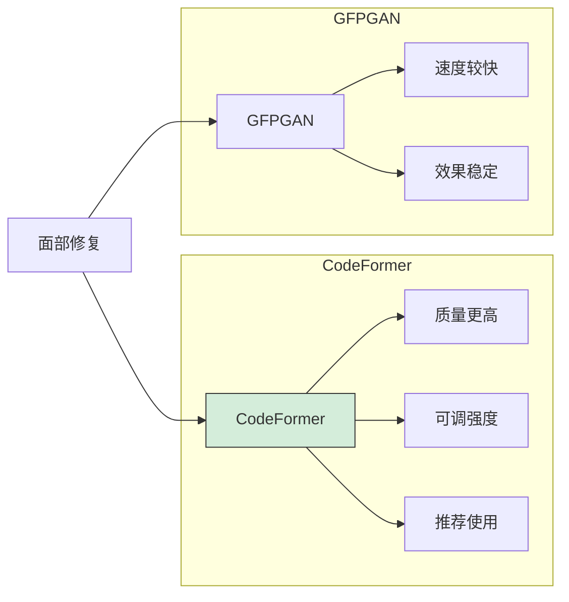
```mermaid
graph LR
    A[面部修复] --> B[CodeFormer]
    A --> C[GFPGAN]

    subgraph CodeFormer
        B --> B1[质量更高]
        B --> B2[可调强度]
        B --> B3[推荐使用]
    end

    subgraph GFPGAN
        C --> C1[速度较快]
        C --> C2[效果稳定]
    end

    style B fill:#d4edda,stroke:#333
```

#### 面部修复参数

```
CodeFormer visibility：可见度（0-1）
- 0.5：轻度修复，保持原貌
- 0.7：标准修复
- 1.0：完全修复

CodeFormer weight：保真度（0-1）
- 0：最大修复，可能改变面部
- 0.5：平衡
- 1：最大保真，修复较少
```

## 4. PNG Info（图像信息）

提取图像的生成参数信息。

### 4.1 功能说明

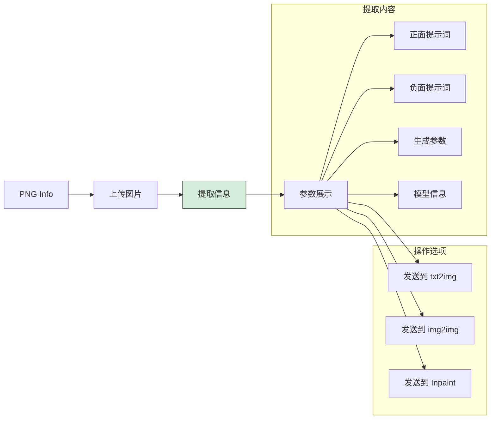
```mermaid
graph LR
    A[PNG Info] --> B[上传图片]
    B --> C[提取信息]
    C --> D[参数展示]

    subgraph 提取内容
        D --> D1[正面提示词]
        D --> D2[负面提示词]
        D --> D3[生成参数]
        D --> D4[模型信息]
    end

    subgraph 操作选项
        D --> E1[发送到 txt2img]
        D --> E2[发送到 img2img]
        D --> E3[发送到 Inpaint]
    end

    style C fill:#d4edda,stroke:#333
```

### 4.2 使用场景

```
1. 复现他人作品
   - 从 Civitai 下载带参数的图片
   - 上传到 PNG Info 提取参数
   - 发送到 txt2img 生成类似图像

2. 记录自己作品
   - 查看之前生成的图片参数
   - 作为创作笔记保存

3. 学习提示词
   - 分析优秀作品的提示词写法
   - 学习参数配置技巧
```

## 5. Settings（设置）

WebUI 的详细配置选项。

### 5.1 设置分类

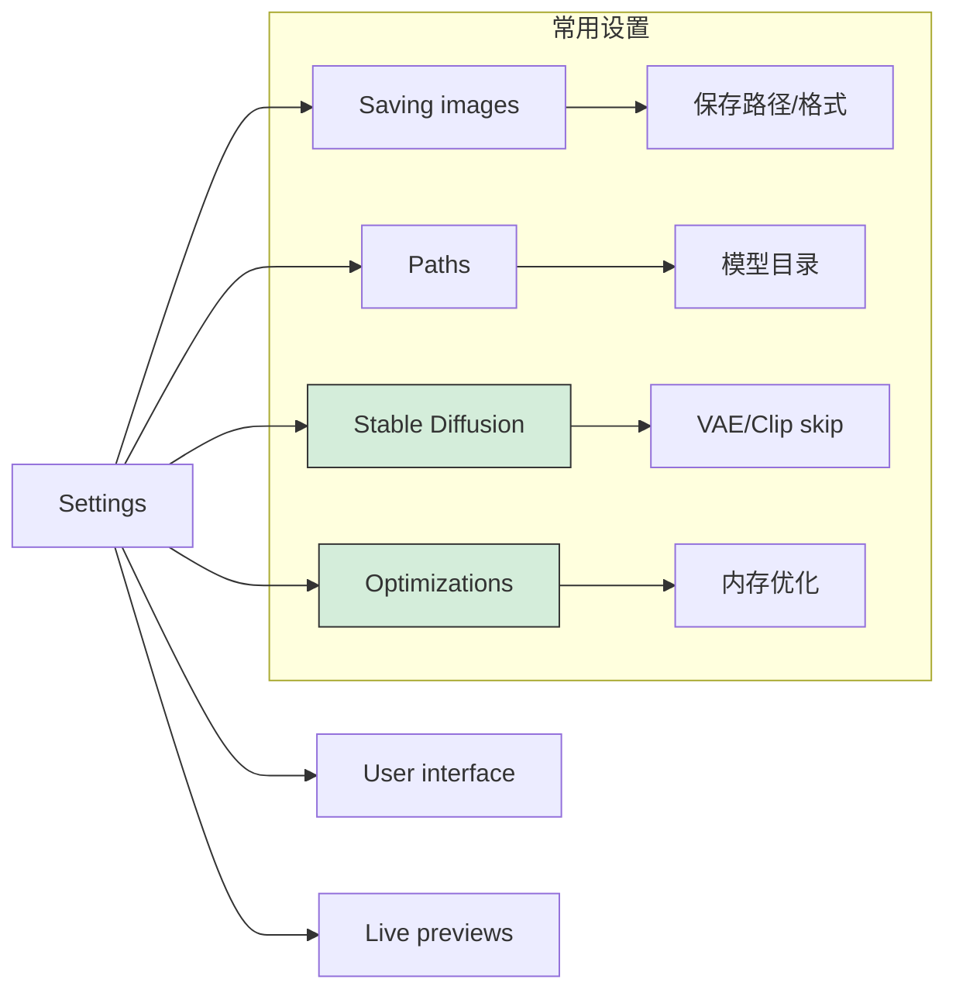
```mermaid
graph LR
    A[Settings] --> B[Saving images]
    A --> C[Paths]
    A --> D[Stable Diffusion]
    A --> E[Optimizations]
    A --> F[User interface]
    A --> G[Live previews]

    subgraph 常用设置
        B --> B1[保存路径/格式]
        C --> C1[模型目录]
        D --> D1[VAE/Clip skip]
        E --> E1[内存优化]
    end

    style D fill:#d4edda,stroke:#333
    style E fill:#d4edda,stroke:#333
```

### 5.2 重要设置项

#### Saving images/grids（图像保存）

```
Images filename pattern：文件名格式
推荐：[date]-[seed]-[model_name]

Save images to a subdirectory：按日期分文件夹
推荐：开启

File format for images：保存格式
推荐：PNG（无损）或 JPEG（节省空间）
```

#### Stable Diffusion

```
SD VAE：VAE 选择
- Automatic：自动选择
- None：使用模型内置
- 指定 VAE 文件

Clip skip：跳过 CLIP 层数
- 1：写实模型
- 2：二次元模型（常用）

Enable emphasis：启用权重语法 (keyword:1.2)
推荐：开启

Comma padding backtrack：逗号填充
推荐：20
```

#### Optimizations（优化）

```
Cross attention optimization：注意力优化
推荐：xFormers（需安装）或 sdp

Token merging ratio：Token 合并
- 0：不合并（质量最好）
- 0.3-0.5：适度加速
- 0.7+：明显加速，质量下降

Pad prompt/negative prompt：提示词填充
推荐：开启（减少偏差）
```

#### User interface（用户界面）

```
Quicksettings list：快捷设置项
推荐：sd_model_checkpoint, sd_vae, CLIP_stop_at_last_layers

Show progress in window title：窗口标题显示进度
推荐：开启

Live preview method：实时预览方法
推荐：Approx NN（快速）或 Full（精确）
```

### 5.3 推荐配置

```
新手推荐设置：
├── SD VAE: Automatic
├── Clip skip: 2
├── Cross attention: xFormers
├── Live preview: Approx NN
├── Save format: PNG
└── 其他保持默认

进阶优化设置：
├── Token merging: 0.3（加速）
├── Pad prompt: Enable
├── Batch cond/uncond: Enable
└── Persistent cond cache: Enable
```

## 6. Extensions（扩展）

WebUI 的扩展管理系统。

### 6.1 扩展管理

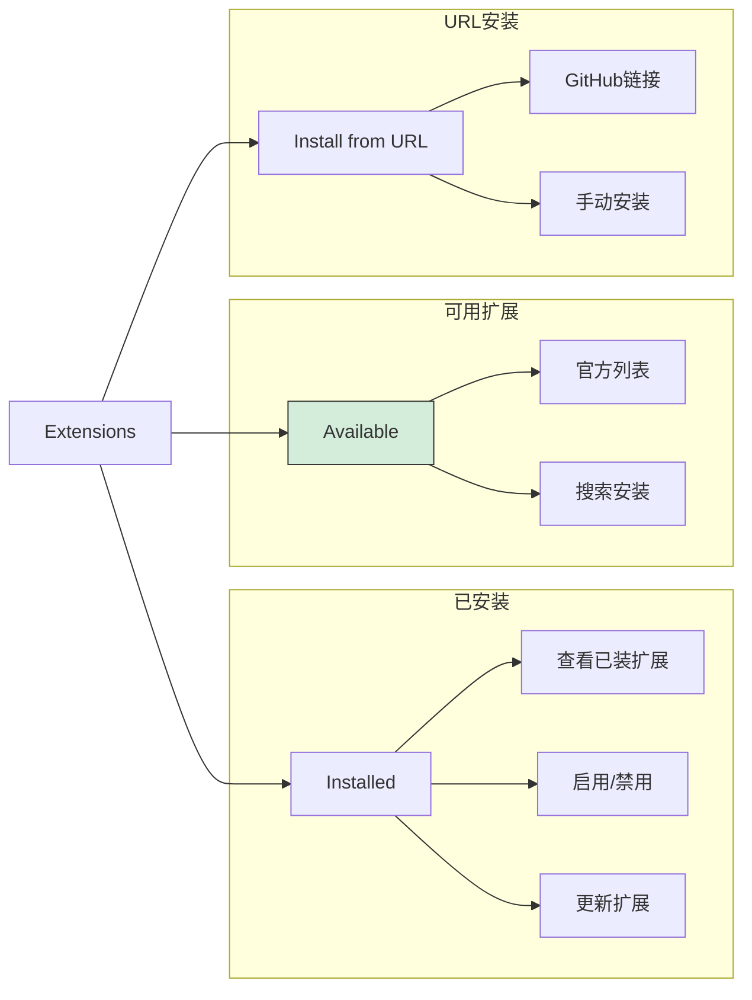
```mermaid
graph LR
    A[Extensions] --> B[Installed]
    A --> C[Available]
    A --> D[Install from URL]

    subgraph 已安装
        B --> B1[查看已装扩展]
        B --> B2[启用/禁用]
        B --> B3[更新扩展]
    end

    subgraph 可用扩展
        C --> C1[官方列表]
        C --> C2[搜索安装]
    end

    subgraph URL安装
        D --> D1[GitHub链接]
        D --> D2[手动安装]
    end

    style C fill:#d4edda,stroke:#333
```

### 6.2 必备扩展推荐

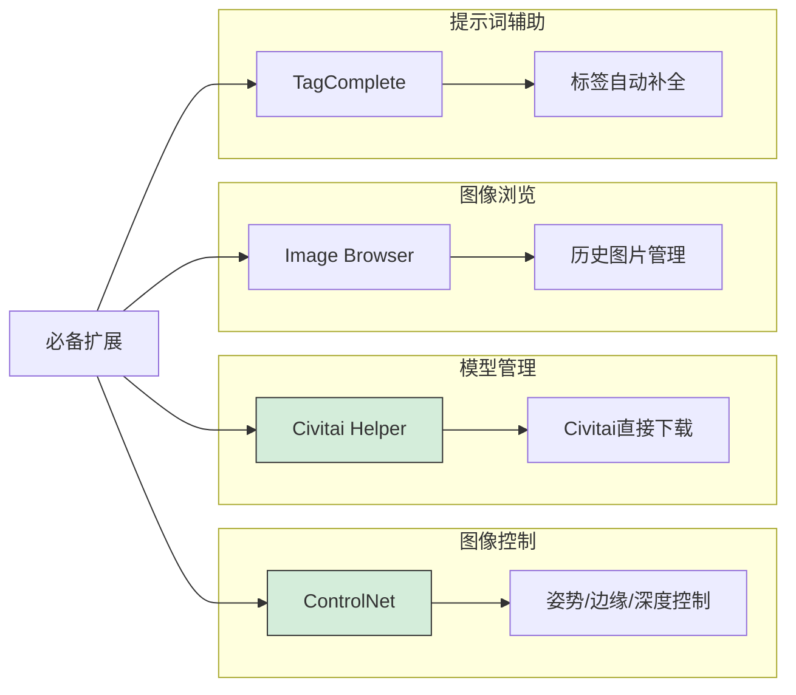
```mermaid
graph LR
    A[必备扩展] --> B[ControlNet]
    A --> C[Civitai Helper]
    A --> D[Image Browser]
    A --> E[TagComplete]

    subgraph 图像控制
        B --> B1[姿势/边缘/深度控制]
    end

    subgraph 模型管理
        C --> C1[Civitai直接下载]
    end

    subgraph 图像浏览
        D --> D1[历史图片管理]
    end

    subgraph 提示词辅助
        E --> E1[标签自动补全]
    end

    style B fill:#d4edda,stroke:#333
    style C fill:#d4edda,stroke:#333
```

#### 扩展详情

| 扩展名 | 功能 | 推荐度 | 安装方式 |
|--------|------|--------|----------|
| **sd-webui-controlnet** | 图像精确控制 | ⭐⭐⭐⭐⭐ | Available 搜索 |
| **sd-civitai-helper** | Civitai 集成 | ⭐⭐⭐⭐⭐ | Available 搜索 |
| **stable-diffusion-webui-images-browser** | 图像浏览管理 | ⭐⭐⭐⭐⭐ | Available 搜索 |
| **a1111-sd-webui-tagcomplete** | 标签自动补全 | ⭐⭐⭐⭐⭐ | Available 搜索 |
| **sd-webui-segment-anything** | SAM 分割 | ⭐⭐⭐⭐ | URL 安装 |
| **sd-webui-reactor** | 换脸工具 | ⭐⭐⭐⭐ | URL 安装 |
| **sd-webui-infinite-image-browsing** | 高级图像浏览 | ⭐⭐⭐⭐ | URL 安装 |
| **sd-webui-prompt-all-in-one** | 提示词翻译 | ⭐⭐⭐⭐ | URL 安装 |

### 6.3 扩展安装方法

#### 方法1：从 Available 安装

```
1. 点击 Extensions 标签
2. 点击 Available 子标签
3. 点击 Load from 按钮加载列表
4. 搜索扩展名
5. 点击 Install 安装
6. 重启 WebUI
```

#### 方法2：从 URL 安装

```
1. 点击 Extensions 标签
2. 点击 Install from URL 子标签
3. 输入 GitHub 仓库地址
4. 点击 Install 安装
5. 重启 WebUI

示例 URL：
https://github.com/Mikubill/sd-webui-controlnet
```

#### 方法3：手动安装

```bash
# 进入扩展目录
cd stable-diffusion-webui/extensions

# 克隆扩展仓库
git clone https://github.com/xxx/extension-name

# 重启 WebUI
```

## 7. 快捷操作

### 7.1 常用快捷键

| 快捷键 | 功能 |
|--------|------|
| `Enter` | 生成图像（焦点在输入框时） |
| `Ctrl + Enter` | 生成图像（全局） |
| `Escape` | 中断生成 |
| `Ctrl + Z` | 撤销（画布操作） |

### 7.2 实用技巧

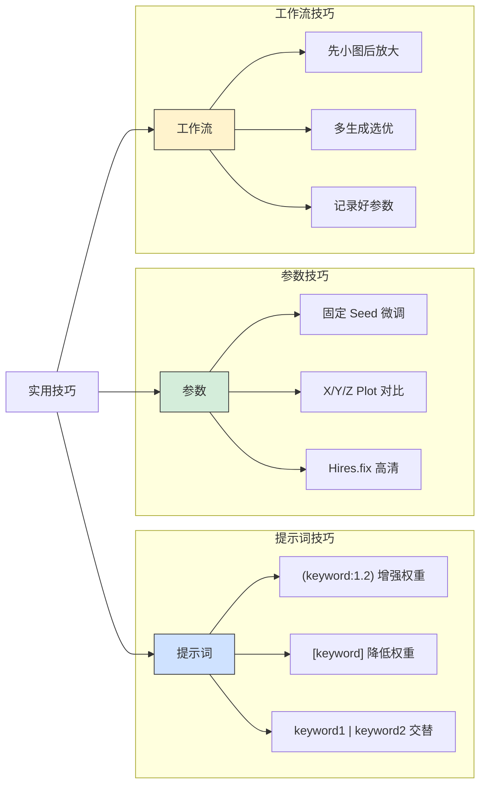
```mermaid
graph LR
    A[实用技巧] --> B[提示词]
    A --> C[参数]
    A --> D[工作流]

    subgraph 提示词技巧
        B --> B1["(keyword:1.2) 增强权重"]
        B --> B2["[keyword] 降低权重"]
        B --> B3["keyword1 | keyword2 交替"]
    end

    subgraph 参数技巧
        C --> C1[固定 Seed 微调]
        C --> C2[X/Y/Z Plot 对比]
        C --> C3[Hires.fix 高清]
    end

    subgraph 工作流技巧
        D --> D1[先小图后放大]
        D --> D2[多生成选优]
        D --> D3[记录好参数]
    end

    style B fill:#cfe2ff,stroke:#333
    style C fill:#d4edda,stroke:#333
    style D fill:#fff3cd,stroke:#333
```

### 7.3 权重语法详解

```
增强权重：
(keyword) = (keyword:1.1)
((keyword)) = (keyword:1.21)
(((keyword))) = (keyword:1.331)
(keyword:1.5) = 直接指定 1.5 倍权重

降低权重：
[keyword] = (keyword:0.9)
[[keyword]] = (keyword:0.81)
(keyword:0.5) = 直接指定 0.5 倍权重

混合语法：
[keyword1:keyword2:0.5] = 前 50% 用 keyword1，后 50% 用 keyword2
[keyword1|keyword2] = 交替使用两个关键词

示例：
(masterpiece:1.2), best quality, ((detailed eyes)), [simple background]
```

## 8. 生成第一张图

### 8.1 快速开始

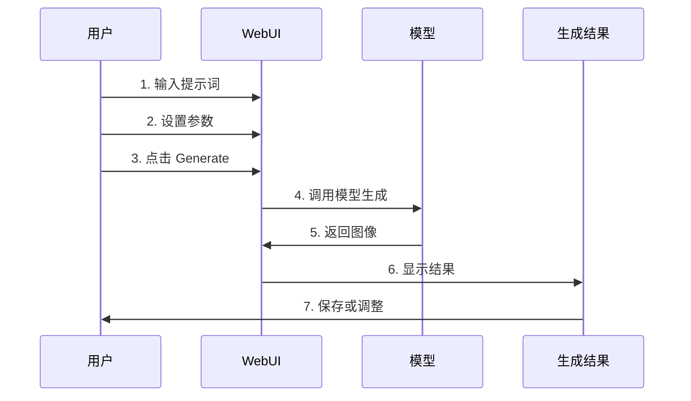
```mermaid
sequenceDiagram
    participant U as 用户
    participant W as WebUI
    participant M as 模型
    participant G as 生成结果

    U->>W: 1. 输入提示词
    U->>W: 2. 设置参数
    U->>W: 3. 点击 Generate
    W->>M: 4. 调用模型生成
    M->>W: 5. 返回图像
    W->>G: 6. 显示结果
    G->>U: 7. 保存或调整
```

### 8.2 新手模板

#### 写实人像

```
Prompt:
photo of a young woman, detailed face, natural lighting,
soft smile, looking at camera, professional photography,
high quality, 8k uhd, dslr

Negative Prompt:
cartoon, anime, drawing, painting, low quality, blurry,
bad anatomy, bad hands, watermark, text

Settings:
- Model: Realistic Vision V5.1
- Sampling: DPM++ 2M Karras
- Steps: 30
- CFG: 7
- Size: 512x768
- Seed: -1
```

#### 二次元角色

```
Prompt:
1girl, solo, long hair, blue eyes, white dress,
standing, flower field, sunlight, anime style,
masterpiece, best quality, detailed

Negative Prompt:
EasyNegative, badhandv4, low quality, worst quality,
blurry, watermark, text, ugly

Settings:
- Model: Anything V5
- Sampling: Euler a
- Steps: 25
- CFG: 7
- Size: 512x768
- Clip skip: 2
- Seed: -1
```

#### 风景场景

```
Prompt:
beautiful landscape, mountains, lake, sunset,
golden hour, colorful sky, peaceful, nature,
high detail, professional photography, 8k

Negative Prompt:
low quality, blurry, text, watermark, people, crowd

Settings:
- Model: DreamShaper 8
- Sampling: DPM++ 2M Karras
- Steps: 30
- CFG: 7
- Size: 768x512
- Seed: -1
```

### 8.3 参数调优流程

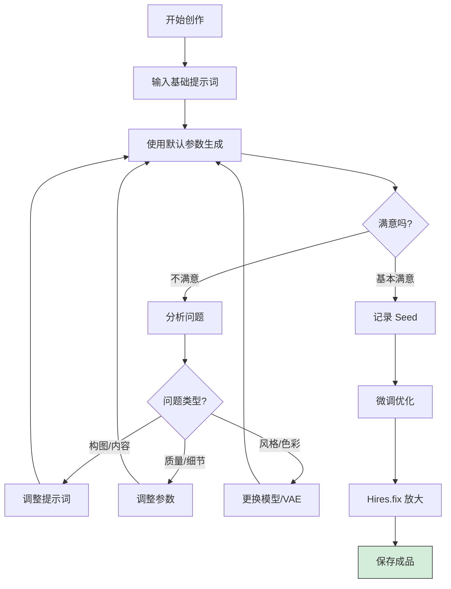
```mermaid
graph TD
    A[开始创作] --> B[输入基础提示词]
    B --> C[使用默认参数生成]
    C --> D{满意吗?}

    D -->|不满意| E[分析问题]
    E --> F{问题类型?}

    F -->|构图/内容| G[调整提示词]
    F -->|质量/细节| H[调整参数]
    F -->|风格/色彩| I[更换模型/VAE]

    G --> C
    H --> C
    I --> C

    D -->|基本满意| J[记录 Seed]
    J --> K[微调优化]
    K --> L[Hires.fix 放大]
    L --> M[保存成品]

    style M fill:#d4edda,stroke:#333
```

## 常见问题

### Q1: 界面加载很慢

```
解决方案：
1. 添加启动参数 --skip-torch-cuda-test
2. 使用 --ui-settings-file 指定配置文件
3. 清理浏览器缓存
4. 检查扩展是否过多
```

### Q2: 生成后图片不显示

```
解决方案：
1. 检查保存路径是否有写权限
2. 查看 outputs 文件夹是否存在
3. Settings → Saving → 检查保存设置
4. 重启 WebUI
```

### Q3: 参数改动不生效

```
解决方案：
1. 点击 Apply settings 应用设置
2. 某些设置需要重启 WebUI
3. 检查是否有扩展冲突
```

## 总结

### 界面快速索引

| 功能 | 标签页 | 主要用途 |
|------|--------|----------|
| 文字生图 | txt2img | 根据提示词生成图像 |
| 图片生图 | img2img | 基于图像生成/修改 |
| 局部重绘 | img2img → Inpaint | 修改图像局部区域 |
| 后期处理 | Extras | 放大、修复 |
| 参数提取 | PNG Info | 获取图片生成参数 |
| 系统设置 | Settings | 配置 WebUI |
| 扩展管理 | Extensions | 安装/管理扩展 |

### 新手上手顺序

```
1. 熟悉 txt2img 基本操作
2. 了解各参数的作用
3. 安装必备扩展（ControlNet、TagComplete）
4. 学习 img2img 和 Inpaint
5. 掌握 Extras 后期处理
6. 探索更多进阶功能
```

最后，界面功能很多，不必一次全部掌握。先从 txt2img 开始，生成几百张图后自然就熟悉了。熟悉基础操作后，强烈建议学习 ControlNet，它能大幅提升创作的可控性。