# Stable Diffusion 提示词编写技巧

> **适用人群**：初学者到进阶用户
> **阅读时间**：约 30 分钟

## 概述

提示词（Prompt）是与 Stable Diffusion 沟通的语言，好的提示词能让 AI 准确理解你的创作意图。本文档将系统介绍提示词的编写技巧，从基础语法到高级技巧，帮助你掌握 AI 绘画的核心技能。

## 提示词体系全景图

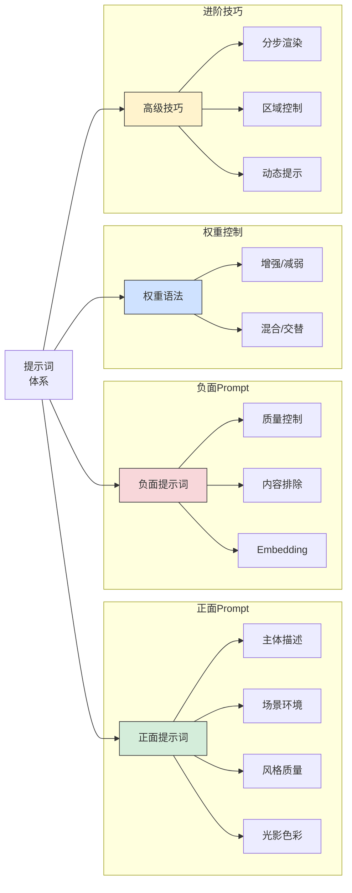

## 1. 提示词基础

### 1.1 基本规则

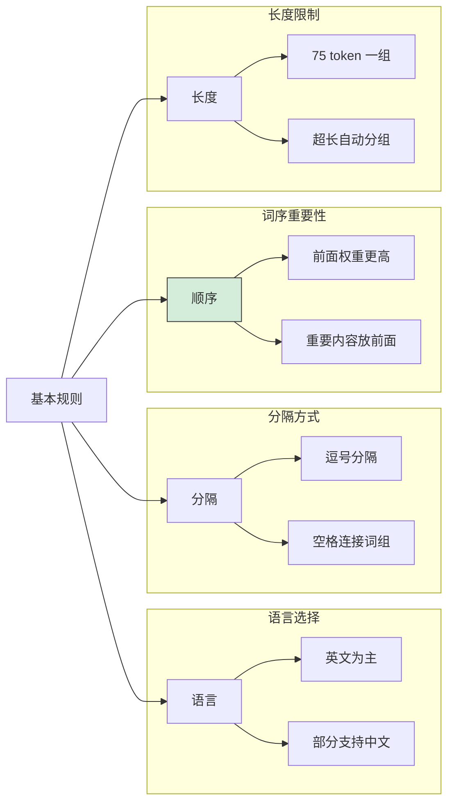

#### 核心规则

```
1. 使用英文
   ✅ beautiful girl, long hair
   ❌ 美丽的女孩，长发

2. 逗号分隔不同概念
   ✅ 1girl, long hair, blue eyes, white dress
   ❌ 1girl long hair blue eyes white dress

3. 重要内容放前面
   ✅ masterpiece, best quality, 1girl, ...
   ❌ ..., 1girl, best quality, masterpiece

4. 保持简洁具体
   ✅ detailed eyes, sharp focus
   ❌ very very very detailed beautiful eyes
```

### 1.2 Token 机制

```
什么是 Token：
- Token 是模型处理文本的基本单位
- 一个英文单词通常是 1-2 个 token
- 标点符号也占用 token

限制说明：
- CLIP 模型限制：77 tokens（含起止符）
- 实际可用：约 75 tokens
- 超出部分：自动分组处理（BREAK 语法）

查看方式：
- WebUI 右上角显示 token 数
- 格式：当前数/最大数
```

### 1.3 提示词结构模板

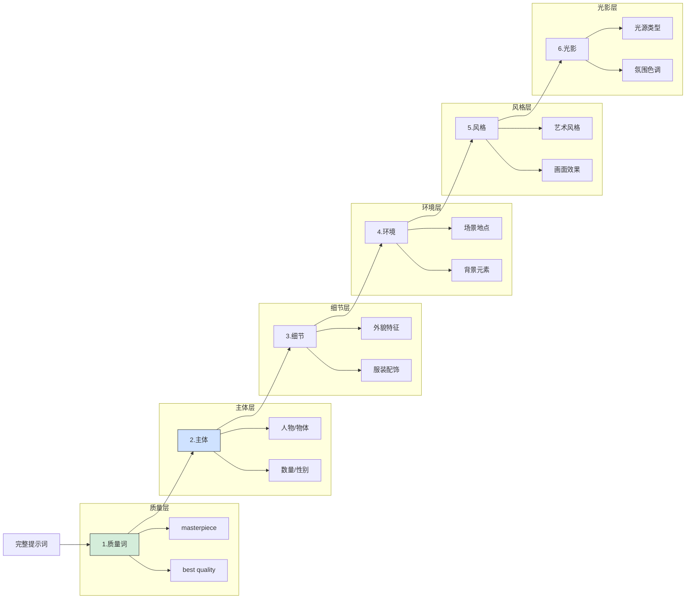

#### 模板示例

```
[质量词], [主体], [细节描述], [环境场景], [艺术风格], [光影效果]

示例1 - 人物：
masterpiece, best quality, 1girl, long blonde hair, blue eyes,
white dress, standing in flower field, anime style, soft lighting

示例2 - 风景：
masterpiece, best quality, landscape, mountains, lake,
sunset, golden hour, realistic, cinematic lighting, 8k uhd

示例3 - 物品：
masterpiece, best quality, a cup of coffee, wooden table,
morning light, cozy cafe, photography, warm tones
```

## 2. 正面提示词详解

### 2.1 质量与风格词

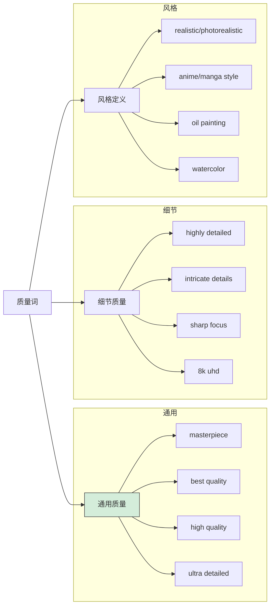

#### 质量词速查表

| 类别 | 关键词 | 效果 |
|------|--------|------|
| **基础质量** | masterpiece | 杰作级质量 |
| | best quality | 最佳质量 |
| | high quality | 高质量 |
| | ultra quality | 超高质量 |
| **细节增强** | highly detailed | 高度细节 |
| | intricate details | 复杂细节 |
| | ultra detailed | 超级细节 |
| | sharp focus | 清晰对焦 |
| **分辨率** | 8k uhd | 8K 超高清 |
| | 4k | 4K 清晰度 |
| | high resolution | 高分辨率 |
| **专业度** | professional | 专业级 |
| | award winning | 获奖作品 |
| | studio quality | 工作室质量 |

#### 风格词速查表

| 风格类型 | 关键词 | 效果描述 |
|----------|--------|----------|
| **写实** | realistic | 真实感 |
| | photorealistic | 照片级真实 |
| | hyperrealistic | 超写实 |
| **二次元** | anime | 动漫风格 |
| | manga | 漫画风格 |
| | illustration | 插画风格 |
| **绘画** | oil painting | 油画 |
| | watercolor | 水彩 |
| | digital painting | 数字绘画 |
| | concept art | 概念艺术 |
| **3D** | 3d render | 3D 渲染 |
| | unreal engine | UE 风格 |
| | octane render | Octane 渲染 |
| **特殊** | pixel art | 像素艺术 |
| | line art | 线条艺术 |
| | sketch | 素描 |

### 2.2 人物描述

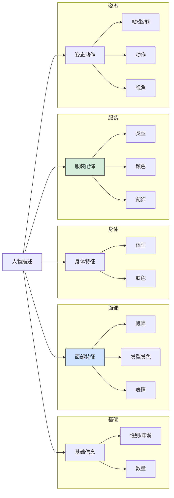

#### 人物关键词库

**性别与数量**
```
1girl, 1boy, 1woman, 1man
2girls, multiple girls
solo（单人）
couple（情侣）
group（群体）
```

**年龄**
```
young, teen, adult, mature, elderly
child（慎用）, baby（慎用）
```

**发型**
```
长度：long hair, medium hair, short hair, very long hair
类型：straight hair, wavy hair, curly hair, ponytail, twin tails
      braid, bun, bob cut, pixie cut, bangs, side bangs
颜色：blonde hair, black hair, brown hair, red hair,
      silver hair, blue hair, pink hair, gradient hair
```

**眼睛**
```
颜色：blue eyes, green eyes, brown eyes, red eyes,
      heterochromia（异色瞳）
类型：detailed eyes, sparkling eyes, closed eyes
      looking at viewer, looking away, looking up
```

**表情**
```
smile, grin, smirk, serious, sad, crying
surprised, angry, shy, embarrassed, blush
expressionless, sleeping
```

**服装类型**
```
日常：dress, shirt, blouse, t-shirt, sweater, hoodie
      jeans, skirt, shorts, pants
正式：suit, tuxedo, formal dress, evening gown
特殊：school uniform, maid outfit, kimono, hanfu
      armor, military uniform, swimsuit, bikini
```

**姿态动作**
```
standing, sitting, lying, walking, running
arms up, hands on hips, crossed arms
looking back, from behind, from side
portrait, upper body, full body, cowboy shot
```

### 2.3 场景环境

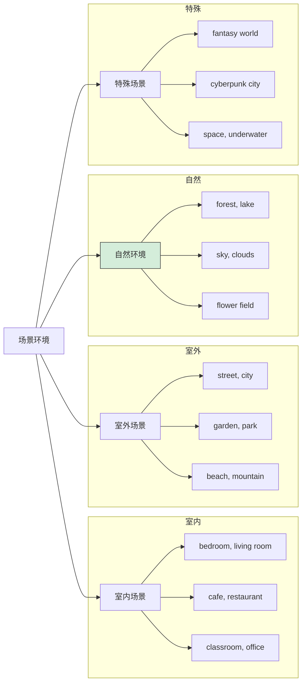

#### 场景关键词库

**室内场景**
```
房间：bedroom, living room, bathroom, kitchen
公共：cafe, restaurant, bar, library, museum
工作：office, classroom, studio, laboratory
特殊：castle interior, spaceship interior
```

**室外场景**
```
城市：city, street, alley, rooftop, bridge
自然：forest, mountain, beach, lake, river
      meadow, flower field, desert, canyon
天空：sky, clouds, sunset, sunrise, night sky
      starry sky, aurora, rainbow
```

**背景设置**
```
simple background, white background, gradient background
blurred background, bokeh, detailed background
no background, transparent background
```

### 2.4 光影与色彩

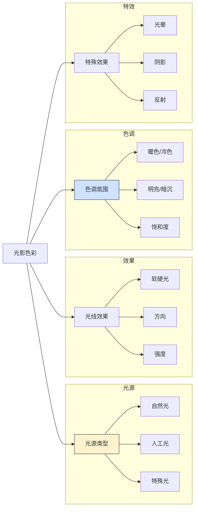

#### 光影关键词库

**光源类型**
```
自然光：sunlight, moonlight, natural lighting
        golden hour, blue hour, daylight
人工光：studio lighting, neon lights, candlelight
        lamp light, flash photography
特殊光：dramatic lighting, cinematic lighting
        volumetric lighting, god rays, backlight
```

**光线效果**
```
soft lighting（柔光）, hard lighting（硬光）
rim lighting（轮廓光）, side lighting（侧光）
front lighting（正面光）, top lighting（顶光）
low key（低调）, high key（高调）
```

**色调氛围**
```
warm tones（暖色调）, cool tones（冷色调）
vibrant colors（鲜艳色彩）, muted colors（柔和色彩）
pastel colors（粉彩色）, monochrome（单色）
sepia（复古棕色）, noir（黑白风格）
```

**特殊效果**
```
lens flare（镜头光晕）, bokeh（背景虚化）
bloom（泛光）, glow（发光）
reflection（反射）, shadow（阴影）
particles（粒子）, sparkles（闪光）
```

## 3. 负面提示词

### 3.1 负面提示词作用

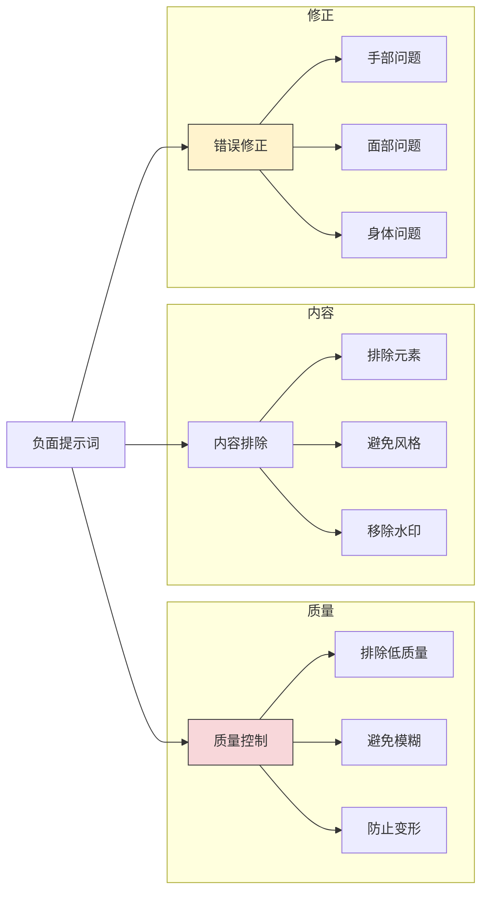

### 3.2 通用负面提示词模板

#### 基础模板

```
low quality, worst quality, normal quality,
lowres, blurry, jpeg artifacts, watermark, text,
signature, username, artist name
```

#### 人物专用模板

```
low quality, worst quality, blurry,
bad anatomy, bad hands, missing fingers, extra fingers,
fewer fingers, extra limbs, missing limbs,
mutated hands, poorly drawn hands, poorly drawn face,
deformed, ugly, duplicate, morbid, mutilated,
out of frame, extra arms, extra legs,
disfigured, gross proportions, malformed limbs,
fused fingers, too many fingers, long neck
```

#### 配合 Embedding 的模板

```
EasyNegative, badhandv4,
(low quality:1.4), (worst quality:1.4),
(blurry:1.2), watermark, text
```

### 3.3 负面提示词库

| 类别 | 关键词 | 作用 |
|------|--------|------|
| **质量** | low quality, worst quality | 排除低质量 |
| | lowres | 排除低分辨率 |
| | blurry, blur | 排除模糊 |
| | jpeg artifacts | 排除压缩伪影 |
| **水印文字** | watermark | 排除水印 |
| | text, signature | 排除文字签名 |
| | username, logo | 排除用户名、标志 |
| **人体问题** | bad anatomy | 解剖结构问题 |
| | bad hands | 手部问题 |
| | bad face | 面部问题 |
| | extra fingers | 多余手指 |
| | missing fingers | 缺少手指 |
| | extra limbs | 多余肢体 |
| **变形** | deformed | 变形 |
| | disfigured | 毁容 |
| | mutated | 突变 |
| | ugly | 丑陋 |
| **构图** | cropped | 裁切 |
| | out of frame | 出框 |
| | duplicate | 重复 |

### 3.4 常用负面 Embedding

| Embedding | 功能 | 使用方法 |
|-----------|------|----------|
| **EasyNegative** | 通用负面效果 | 直接写入负面提示词 |
| **badhandv4** | 修复手部问题 | 直接写入负面提示词 |
| **negative_hand** | 手部负面特征 | 直接写入负面提示词 |
| **ng_deepnegative** | 深度负面优化 | 直接写入负面提示词 |
| **bad-artist** | 排除低质量艺术风格 | 直接写入负面提示词 |
| **bad_prompt_version2** | 综合负面 | 直接写入负面提示词 |

## 4. 权重语法

### 4.1 权重基础

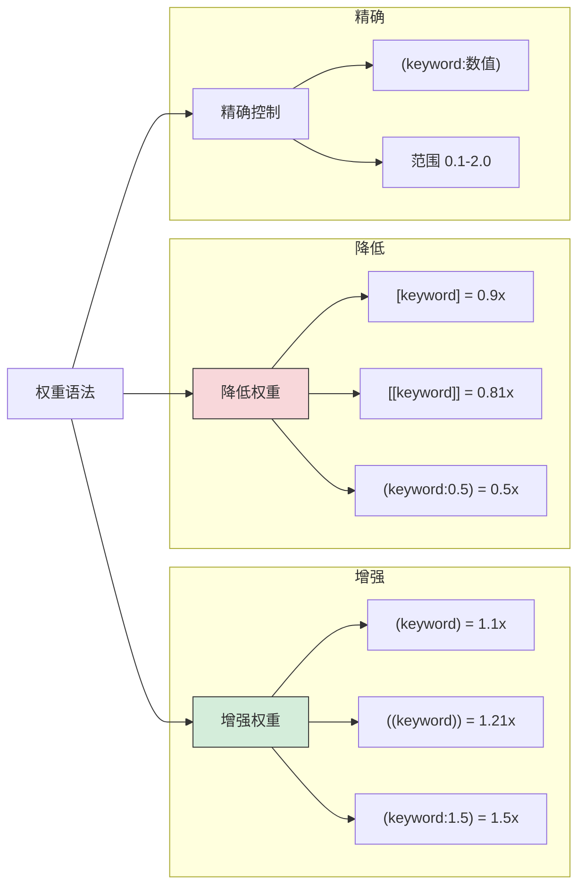

### 4.2 权重语法详解

#### 增强权重

```
括号增强（每层 1.1 倍）：
(keyword)     = keyword × 1.1
((keyword))   = keyword × 1.21
(((keyword))) = keyword × 1.331

数值增强：
(keyword:1.2) = keyword × 1.2
(keyword:1.5) = keyword × 1.5
(keyword:2.0) = keyword × 2.0（最大推荐值）

示例：
(masterpiece:1.2), (detailed eyes:1.3), ((beautiful face))
```

#### 降低权重

```
方括号降低（每层 0.9 倍）：
[keyword]     = keyword × 0.9
[[keyword]]   = keyword × 0.81
[[[keyword]]] = keyword × 0.729

数值降低：
(keyword:0.8) = keyword × 0.8
(keyword:0.5) = keyword × 0.5

示例：
[simple background], (text:0.3)
```

#### 权重使用建议

```
推荐范围：0.5 - 1.5
├── 0.5-0.8：明显降低影响
├── 0.9-1.1：微调（默认区间）
├── 1.2-1.3：适度强调
├── 1.4-1.5：强烈强调
└── >1.5：可能过度，谨慎使用

常见用法：
(masterpiece:1.2)      - 略微强调质量
(detailed eyes:1.3)    - 强调眼睛细节
(watermark:0.1)        - 在负面提示词中极力避免
((beautiful:1.4))      - 双重强调美观
```

### 4.3 混合与交替语法

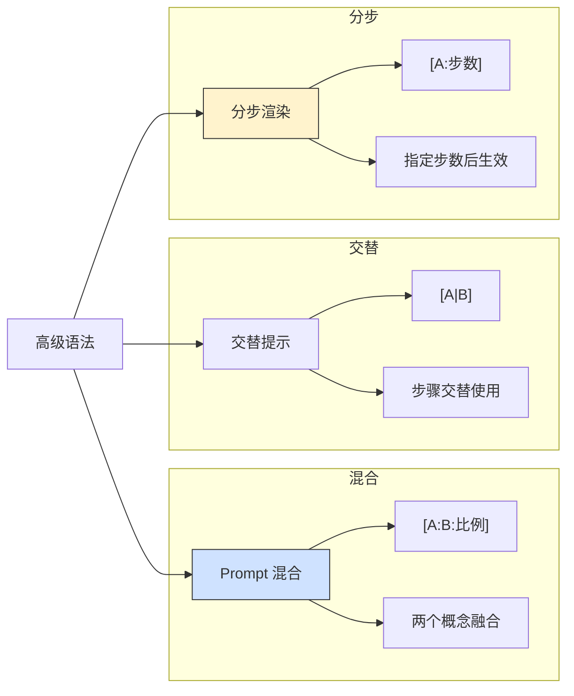

#### Prompt 混合

```
语法：[keyword1:keyword2:比例]

比例说明：
- 比例 < 1：表示百分比，0.3 = 前 30% 步数用 keyword1
- 比例 ≥ 1：表示步数，10 = 前 10 步用 keyword1

示例：
[cat:dog:0.5]
= 前 50% 步数生成猫的特征，后 50% 融合狗的特征

[sketch:detailed:0.3]
= 前 30% 保持草图感，后 70% 增加细节

[oil painting:photography:0.6]
= 60% 油画风格 + 40% 摄影风格
```

#### 交替提示

```
语法：[keyword1|keyword2|keyword3]

作用：在每个采样步骤交替使用不同关键词

示例：
[red|blue|green] dress
= 每步交替使用红、蓝、绿，最终可能产生混合色彩

[smile|serious] expression
= 交替微笑和严肃，可能产生微妙表情

注意：效果不太可控，建议谨慎使用
```

#### 分步生效

```
语法：[keyword:步数] 或 [:keyword:步数]

[keyword:10] = 前 10 步使用 keyword
[:keyword:10] = 第 10 步之后使用 keyword

示例：
[detailed background:15]
= 前 15 步渲染详细背景，之后不再强调

[:sharp focus:20]
= 第 20 步之后才开始强调清晰对焦

组合使用：
[rough sketch:detailed rendering:0.4]
= 前 40% 粗略草图，后 60% 精细渲染
```

## 5. 提示词编写技巧

### 5.1 编写流程

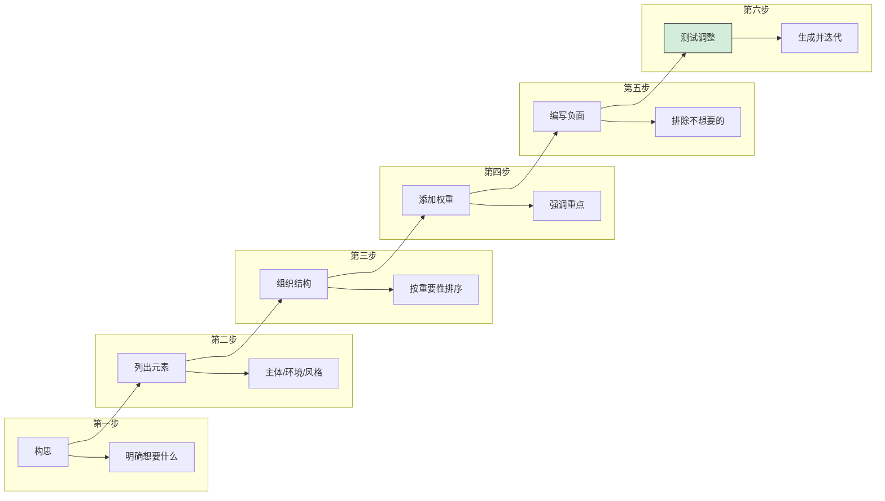

### 5.2 迭代优化策略

```
第一轮：基础生成
├── 使用简单提示词
├── 默认参数
├── 生成 4-8 张
└── 观察整体效果

第二轮：细节优化
├── 分析第一轮问题
├── 添加细节描述
├── 调整权重
└── 针对性修改

第三轮：风格调整
├── 微调风格词
├── 调整光影
├── 优化色彩
└── 固定满意的 Seed

第四轮：最终输出
├── Hires.fix 放大
├── 后期处理
└── 导出成品
```

### 5.3 常见问题与解决

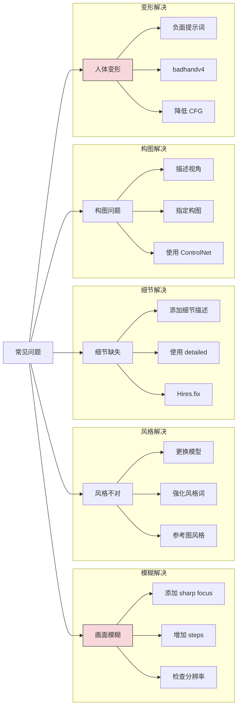

#### 问题解决速查

| 问题 | 可能原因 | 解决方案 |
|------|----------|----------|
| 画面模糊 | 分辨率低/步数少 | 增加分辨率、步数、添加 sharp focus |
| 风格偏差 | 模型不匹配 | 更换模型、强化风格词权重 |
| 细节缺失 | 描述不够 | 添加 detailed、具体描述细节 |
| 颜色怪异 | VAE 问题 | 更换 VAE、检查模型兼容性 |
| 手部变形 | 模型通病 | 添加 bad hands 到负面、使用 badhandv4 |
| 面部崩坏 | 分辨率/模型 | 增加分辨率、使用面部修复 |
| 多人混乱 | 描述不清 | 明确人数、使用位置词 |
| 内容不符 | CFG 太低 | 提高 CFG Scale（7-12） |
| 过度饱和 | CFG 太高 | 降低 CFG Scale |

### 5.4 提示词优化技巧

#### 技巧一：使用具体词汇

```
❌ 模糊描述：
beautiful, nice, good, pretty

✅ 具体描述：
elegant, stunning, gorgeous, exquisite
delicate features, symmetrical face
```

#### 技巧二：参考专业术语

```
摄影术语：
bokeh, depth of field, f/1.4, 85mm lens
macro photography, long exposure, HDR

艺术术语：
chiaroscuro（明暗对比）, impasto（厚涂）
sfumato（渐隐法）, tenebrism（暗色调主义）

渲染术语：
subsurface scattering, ambient occlusion
global illumination, ray tracing
```

#### 技巧三：善用艺术家风格

```
写实风格：
by Greg Rutkowski, by Artgerm
by Ross Tran, by Wlop

插画风格：
by Makoto Shinkai, by Studio Ghibli
by Ilya Kuvshinov, by Krenz Cushart

概念艺术：
by Craig Mullins, by Sparth
by John Howe, by Alan Lee
```

#### 技巧四：组合词组

```
有效组合：
masterpiece, best quality（质量组合）
cinematic lighting, dramatic shadows（光影组合）
detailed face, beautiful eyes（面部组合）
flowing hair, wind blown（动态组合）

避免冲突：
❌ realistic, anime style（风格冲突）
❌ simple background, detailed environment（背景冲突）
❌ solo, group photo（数量冲突）
```

## 6. 场景化提示词模板

### 6.1 人物肖像

```
【写实人像】
Prompt:
(masterpiece:1.2), best quality,
photo of a young woman, (detailed face:1.3),
brown hair, green eyes, soft smile,
wearing white blouse, natural makeup,
studio lighting, professional photography,
upper body, looking at viewer,
sharp focus, 8k uhd

Negative:
(low quality:1.4), (worst quality:1.4),
bad anatomy, bad hands, blurry,
watermark, text, signature

参数：512x768, CFG 7, Steps 30

【二次元角色】
Prompt:
(masterpiece:1.2), (best quality:1.2),
1girl, solo, long silver hair, red eyes,
black gothic dress, lace details,
standing, castle interior, moonlight,
anime style, detailed, beautiful

Negative:
EasyNegative, badhandv4,
(low quality:1.4), (worst quality:1.4)

参数：512x768, CFG 7, Steps 25, Clip skip 2
```

### 6.2 风景场景

```
【自然风景】
Prompt:
(masterpiece:1.2), best quality,
beautiful landscape, majestic mountains,
crystal clear lake, reflection,
sunset, golden hour, orange sky,
lush green forest, peaceful atmosphere,
professional photography, 8k uhd,
cinematic composition, vivid colors

Negative:
low quality, worst quality, blurry,
watermark, text, people, crowd

参数：768x512, CFG 7, Steps 30

【城市夜景】
Prompt:
(masterpiece:1.2), best quality,
cyberpunk city, neon lights, rain,
wet streets, reflections, night scene,
futuristic architecture, flying cars,
cinematic lighting, atmospheric fog,
detailed, ultra high definition

Negative:
low quality, blurry, daytime,
watermark, text

参数：768x512, CFG 7, Steps 35
```

### 6.3 创意场景

```
【奇幻场景】
Prompt:
(masterpiece:1.3), best quality,
fantasy landscape, floating islands,
waterfalls into clouds, ancient ruins,
magical crystals, glowing flowers,
ethereal atmosphere, dreamlike,
by Greg Rutkowski, concept art,
dramatic lighting, vibrant colors

Negative:
low quality, modern elements,
realistic, photo

参数：768x512, CFG 8, Steps 35

【科幻场景】
Prompt:
(masterpiece:1.2), best quality,
sci-fi space station interior,
holographic displays, advanced technology,
astronaut, viewing earth from window,
blue ambient lighting, clean design,
octane render, cinematic, detailed

Negative:
low quality, fantasy, medieval,
watermark, text

参数：768x512, CFG 7, Steps 30
```

## 7. 提示词工具与资源

### 7.1 辅助工具

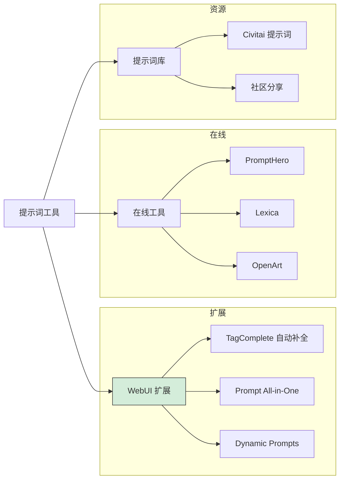

### 7.2 推荐资源

| 资源 | 类型 | 链接/说明 |
|------|------|-----------|
| **Civitai** | 图片+提示词 | civitai.com |
| **PromptHero** | 提示词搜索 | prompthero.com |
| **Lexica** | AI 图片库 | lexica.art |
| **OpenArt** | 提示词库 | openart.ai |
| **TagComplete** | WebUI 扩展 | 标签自动补全 |
| **Danbooru Tags** | 标签参考 | 二次元标签库 |

### 7.3 学习建议

```
1. 从模仿开始
   - 在 Civitai 找喜欢的图片
   - 复制提示词学习
   - 理解每个词的作用

2. 建立个人词库
   - 收集有效的关键词
   - 分类整理（质量/风格/人物等）
   - 形成个人模板

3. 持续实验
   - 对比不同关键词效果
   - 记录有效组合
   - 总结规律

4. 关注社区
   - 学习他人技巧
   - 了解新词汇新方法
   - 参与讨论交流
```

## 总结

### 提示词速查表

| 类别 | 常用词汇 |
|------|----------|
| **质量** | masterpiece, best quality, highly detailed, 8k |
| **风格** | realistic, anime, oil painting, concept art |
| **光影** | cinematic lighting, soft light, golden hour |
| **人物** | 1girl/1boy, hair color, eye color, clothing |
| **场景** | indoor/outdoor, background, environment |
| **负面** | low quality, bad hands, blurry, watermark |

### 黄金公式

```
完整提示词 = 质量词 + 主体 + 细节 + 环境 + 风格 + 光影

示例：
(masterpiece:1.2), best quality,    ← 质量
1girl, long blonde hair, blue eyes, ← 主体
detailed face, white dress,         ← 细节
flower field, blue sky,             ← 环境
anime style, soft colors,           ← 风格
natural lighting, golden hour       ← 光影
```

---

> 💡 **提示**：提示词编写是一门需要持续练习的技能，没有"完美"的提示词，只有"合适"的提示词。

> 🔄 **迭代思维**：每次生成都是学习机会，观察结果，分析原因，不断改进。

> 📚 **持续学习**：关注社区动态，AI 绘画技术发展迅速，新的技巧和方法不断涌现。
