# Stable Diffusion 生成参数详解

> **适用人群**：初学者到进阶用户
> **阅读时间**：约 25 分钟

## 概述

参数设置直接影响 AI 绘画的质量、速度和风格。理解每个参数的作用，能让你更精准地控制生成结果。本文档将详细解析 Stable Diffusion 的核心参数，帮助你掌握调参技巧。

## 参数体系全景图

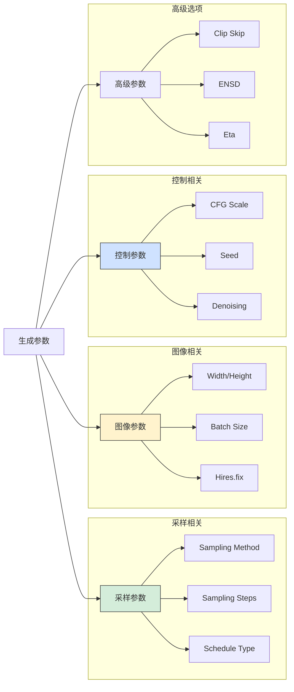

## 1. 采样方法（Sampling Method）

### 1.1 采样原理简述

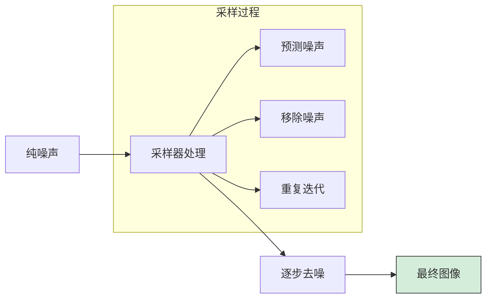

采样器决定了从噪声到图像的"去噪路径"，不同采样器有不同的特点：
- **收敛性**：是否能稳定收敛到最终结果
- **速度**：每步计算的复杂度
- **创意性**：生成结果的多样性
- **质量**：最终图像的细节表现

### 1.2 采样器分类

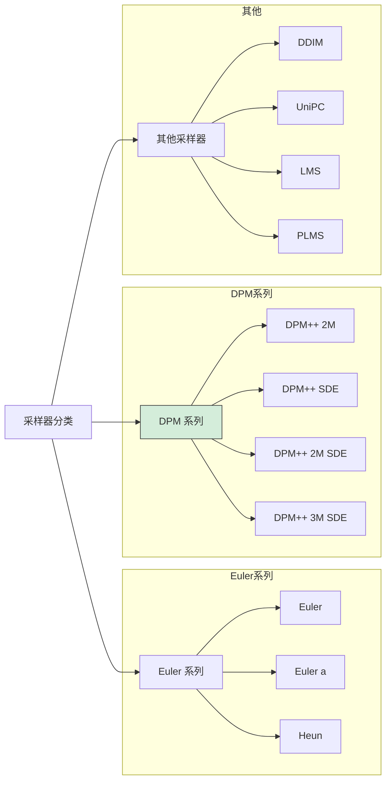

### 1.3 采样器详解

#### Euler 系列

| 采样器 | 特点 | 推荐步数 | 适用场景 |
|--------|------|----------|----------|
| **Euler** | 最基础，收敛快，确定性 | 20-30 | 需要稳定复现 |
| **Euler a** | 带随机性，创意强 | 20-30 | 探索阶段，创意生成 |
| **Heun** | Euler 改进版，质量更高 | 20-40 | 追求质量 |

```
Euler vs Euler a：
- Euler：确定性，相同参数=相同结果
- Euler a：ancestral（祖先采样），每步加入随机性
  └── 优点：更有创意，多样性强
  └── 缺点：结果不稳定，高步数可能崩坏
```

#### DPM++ 系列（推荐）

| 采样器 | 特点 | 推荐步数 | 适用场景 |
|--------|------|----------|----------|
| **DPM++ 2M Karras** | 均衡之选，质量高 | 25-35 | **日常首选** |
| **DPM++ SDE Karras** | 细节丰富，略慢 | 25-40 | 追求细节 |
| **DPM++ 2M SDE Karras** | 结合两者优点 | 25-35 | 通用场景 |
| **DPM++ 3M SDE Karras** | 最新版本，质量好 | 20-30 | 新版本推荐 |

```
Karras vs 普通：
- Karras：使用 Karras 噪声调度，噪声分布更合理
- 推荐：优先选择带 Karras 后缀的版本

SDE vs 非 SDE：
- SDE：Stochastic Differential Equation，引入随机性
- 非 SDE：确定性更强
```

#### 其他采样器

| 采样器 | 特点 | 推荐步数 | 适用场景 |
|--------|------|----------|----------|
| **DDIM** | 经典采样器，稳定 | 30-50 | 需要确定性 |
| **UniPC** | 高效率，快速 | 15-25 | 快速出图 |
| **LMS** | 线性多步法 | 30-50 | 特定场景 |
| **PLMS** | 伪线性多步法 | 30-50 | 特定场景 |
| **DPM adaptive** | 自适应步数 | 自动 | 自动调整 |

### 1.4 采样器选择指南

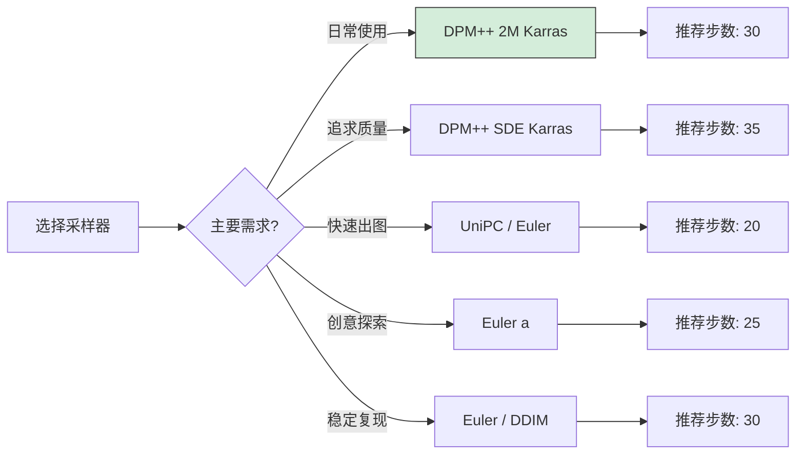

### 1.5 Schedule Type（调度类型）

```
调度类型决定噪声的分布方式：

Automatic：自动选择（推荐）
Uniform：均匀分布
Karras：Karras 分布（推荐）
Exponential：指数分布
Polyexponential：多项式指数分布

推荐：使用 Karras 或 Automatic
```

## 2. 采样步数（Sampling Steps）

### 2.1 步数与质量关系

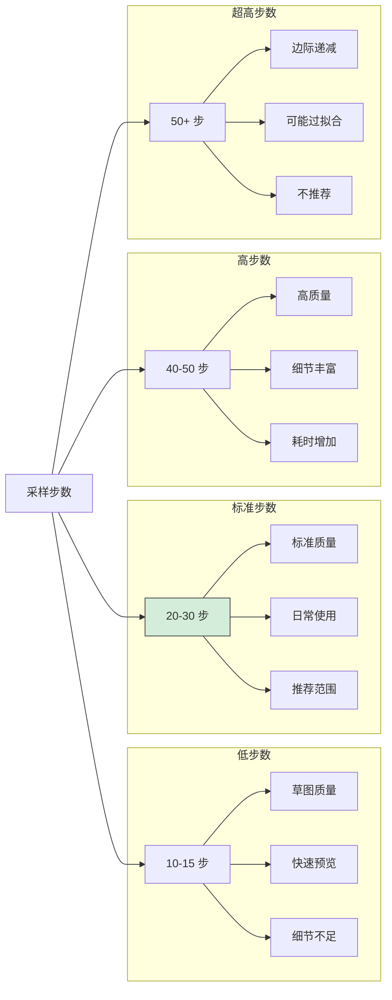

### 2.2 步数推荐表

| 采样器 | 最低步数 | 推荐步数 | 最高有效步数 |
|--------|----------|----------|--------------|
| Euler a | 15 | 20-25 | 30（超过可能崩坏） |
| Euler | 20 | 25-30 | 50 |
| DPM++ 2M Karras | 20 | 28-35 | 50 |
| DPM++ SDE Karras | 20 | 30-40 | 60 |
| UniPC | 12 | 15-20 | 30 |
| DDIM | 30 | 40-50 | 100 |

### 2.3 步数与时间关系

```
生成时间 ≈ 步数 × 单步时间

单步时间取决于：
├── GPU 性能
├── 图像分辨率
├── 批量大小
└── 采样器复杂度

示例（RTX 3060，512x512）：
├── 20 步：约 5 秒
├── 30 步：约 7 秒
├── 50 步：约 12 秒
└── 100 步：约 24 秒
```

## 3. CFG Scale（提示词相关性）

### 3.1 CFG 原理

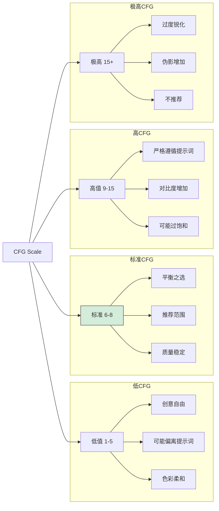

### 3.2 CFG 效果对比

| CFG 值 | 效果描述 | 适用场景 |
|--------|----------|----------|
| 1-3 | 几乎忽略提示词，AI 自由发挥 | 抽象艺术 |
| 4-5 | 轻度引导，保持创意空间 | 创意探索 |
| **6-8** | **标准范围，平衡质量和相关性** | **日常使用** |
| 9-11 | 强引导，严格遵循提示词 | 精确控制 |
| 12-15 | 非常严格，可能过饱和 | 特殊需求 |
| 15+ | 通常过度，画面异常 | 不推荐 |

### 3.3 CFG 调整技巧

```
基础原则：
├── 提示词简单 → CFG 可稍高（8-10）
├── 提示词复杂 → CFG 适中（6-8）
├── 追求创意 → CFG 偏低（5-7）
└── 精确复现 → CFG 偏高（8-12）

常见问题：
├── 画面过饱和 → 降低 CFG
├── 内容不符 → 提高 CFG
├── 细节过度 → 降低 CFG
└── 画面模糊 → 检查其他参数
```

### 3.4 不同模型的 CFG 建议

| 模型类型 | 推荐 CFG | 说明 |
|----------|----------|------|
| SD 1.5 写实 | 6-8 | 标准范围 |
| SD 1.5 二次元 | 7-9 | 可稍高 |
| SDXL | 5-7 | SDXL 对 CFG 更敏感 |
| Pony 系列 | 6-8 | 标准范围 |
| 训练的 LoRA | 视情况 | 可能需要调整 |

## 4. 图像尺寸（Width/Height）

### 4.1 尺寸与模型关系

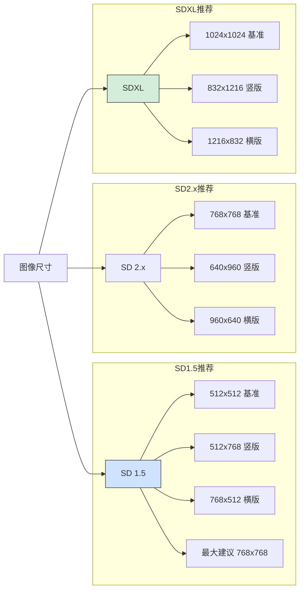

### 4.2 常用尺寸速查表

#### SD 1.5 尺寸

| 用途 | 宽度 | 高度 | 比例 | 像素数 |
|------|------|------|------|--------|
| 方形头像 | 512 | 512 | 1:1 | 262K |
| 竖版人像 | 512 | 768 | 2:3 | 393K |
| 横版风景 | 768 | 512 | 3:2 | 393K |
| 手机壁纸 | 512 | 912 | 9:16 | 467K |
| 宽屏 | 912 | 512 | 16:9 | 467K |

#### SDXL 尺寸

| 用途 | 宽度 | 高度 | 比例 | 像素数 |
|------|------|------|------|--------|
| 方形 | 1024 | 1024 | 1:1 | 1.05M |
| 竖版 | 832 | 1216 | 2:3 | 1.01M |
| 横版 | 1216 | 832 | 3:2 | 1.01M |
| 手机壁纸 | 768 | 1344 | 9:16 | 1.03M |
| 宽屏 | 1344 | 768 | 16:9 | 1.03M |

### 4.3 尺寸与显存关系

```
显存占用 ≈ 宽度 × 高度 × 系数

大致估算（单张生成）：
├── 512x512：约 4GB
├── 512x768：约 5GB
├── 768x768：约 6GB
├── 1024x1024：约 8GB
└── 1536x1536：约 12GB+

显存不足时：
├── 降低分辨率
├── 使用 --medvram 参数
├── 减少 Batch size
└── 先小图后放大
```

### 4.4 非标准尺寸注意事项

```
问题：超出训练尺寸可能导致
├── 重复元素（多头、多手）
├── 构图异常
├── 质量下降
└── 内容变形

解决方案：
├── 使用模型训练的标准尺寸
├── 保持 64 像素倍数
├── 使用 Hires.fix 放大
└── ControlNet 辅助控制
```

## 5. Seed（随机种子）

### 5.1 Seed 作用

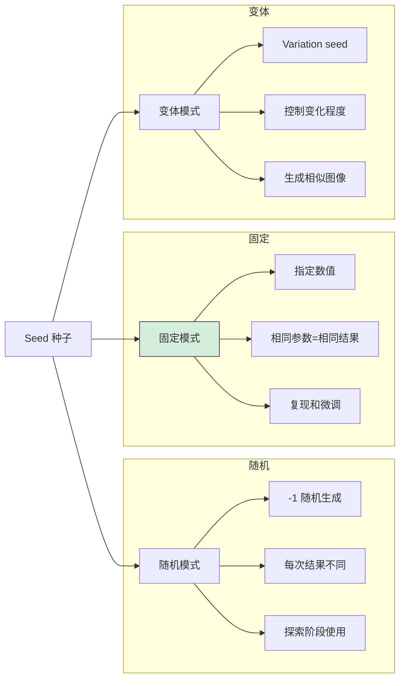

### 5.2 Seed 使用技巧

```
工作流程：
1. 探索阶段：Seed = -1（随机）
2. 发现好图：记录 Seed 值
3. 微调阶段：固定 Seed，调整其他参数
4. 批量变体：使用 Variation seed

复现条件（Seed 相同时）：
├── 提示词相同
├── 负面提示词相同
├── 采样器相同
├── 步数相同
├── CFG 相同
├── 尺寸相同
└── 模型相同
```

### 5.3 Variation Seed（变体种子）

```
参数说明：
├── Variation seed：变体的基础种子
├── Variation strength：变化强度（0-1）
│   ├── 0：完全使用原 Seed
│   ├── 0.1-0.3：轻微变化
│   ├── 0.4-0.6：明显变化
│   └── 1：完全使用 Variation seed

使用场景：
├── 生成相似但不同的图像
├── 微调构图或细节
└── 创建图像系列
```

### 5.4 Extra 选项

```
Resize seed from width/height：
├── 作用：从不同尺寸保持相似构图
├── 原理：调整 Seed 以适应新尺寸
└── 用途：放大时保持原有构图

示例：
原图：512x512, Seed=12345
新图：768x768
设置：Resize seed from 512x512
结果：构图相似的更大图像
```

## 6. Batch 参数

### 6.1 Batch Count vs Batch Size

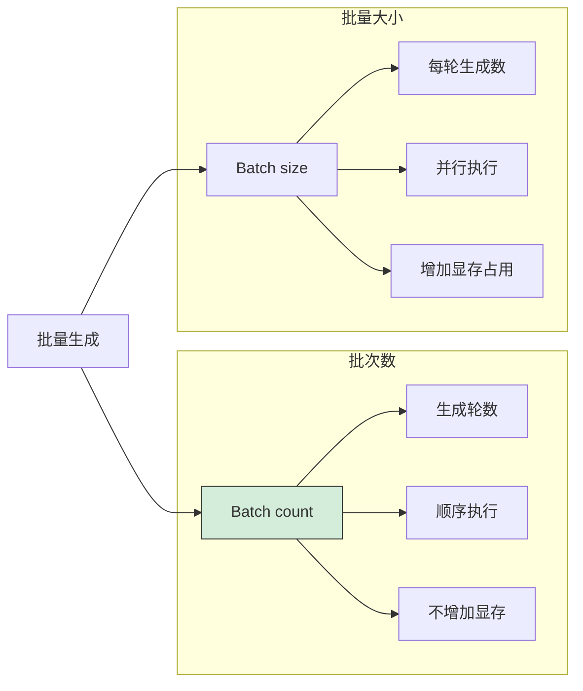

### 6.2 参数对比

| 参数 | 含义 | 执行方式 | 显存影响 |
|------|------|----------|----------|
| **Batch count** | 生成批次数 | 顺序 | 无额外占用 |
| **Batch size** | 每批生成数量 | 并行 | 成倍增加 |

```
示例：Batch count=4, Batch size=2
├── 总共生成：4 × 2 = 8 张
├── 执行方式：每次生成 2 张，执行 4 轮
└── 显存占用：约 2 倍单张占用

推荐设置：
├── 显存 6GB：Batch size ≤ 1
├── 显存 8GB：Batch size ≤ 2
├── 显存 12GB：Batch size ≤ 4
└── 显存 24GB：Batch size ≤ 8
```

## 7. Hires. fix（高分辨率修复）

### 7.1 工作原理

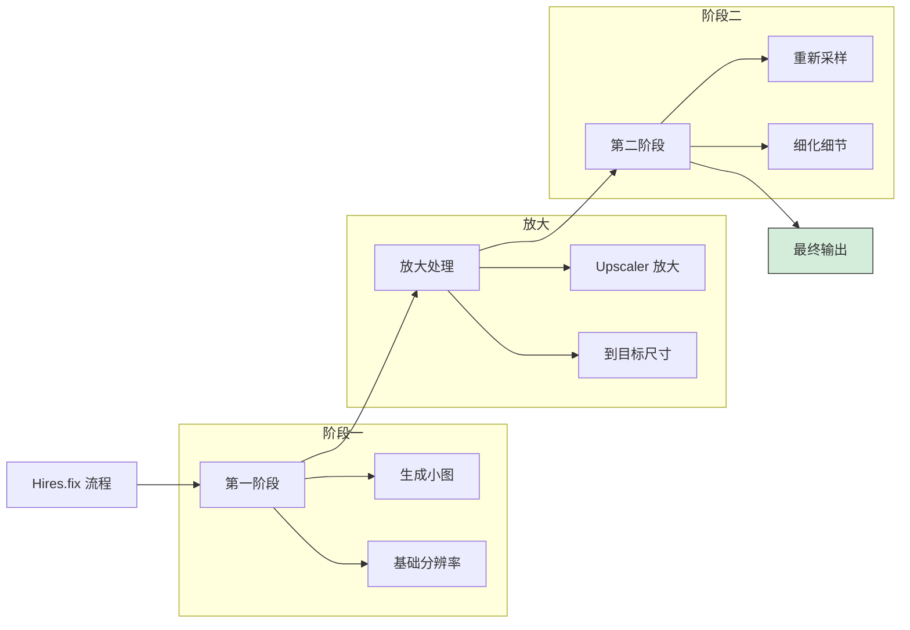

### 7.2 参数详解

| 参数 | 作用 | 推荐值 |
|------|------|--------|
| **Upscaler** | 放大算法 | Latent / 4x-UltraSharp |
| **Hires steps** | 第二阶段步数 | 15-20 |
| **Denoising strength** | 重绘强度 | 0.4-0.6 |
| **Upscale by** | 放大倍数 | 1.5-2.0 |

### 7.3 Upscaler 选择

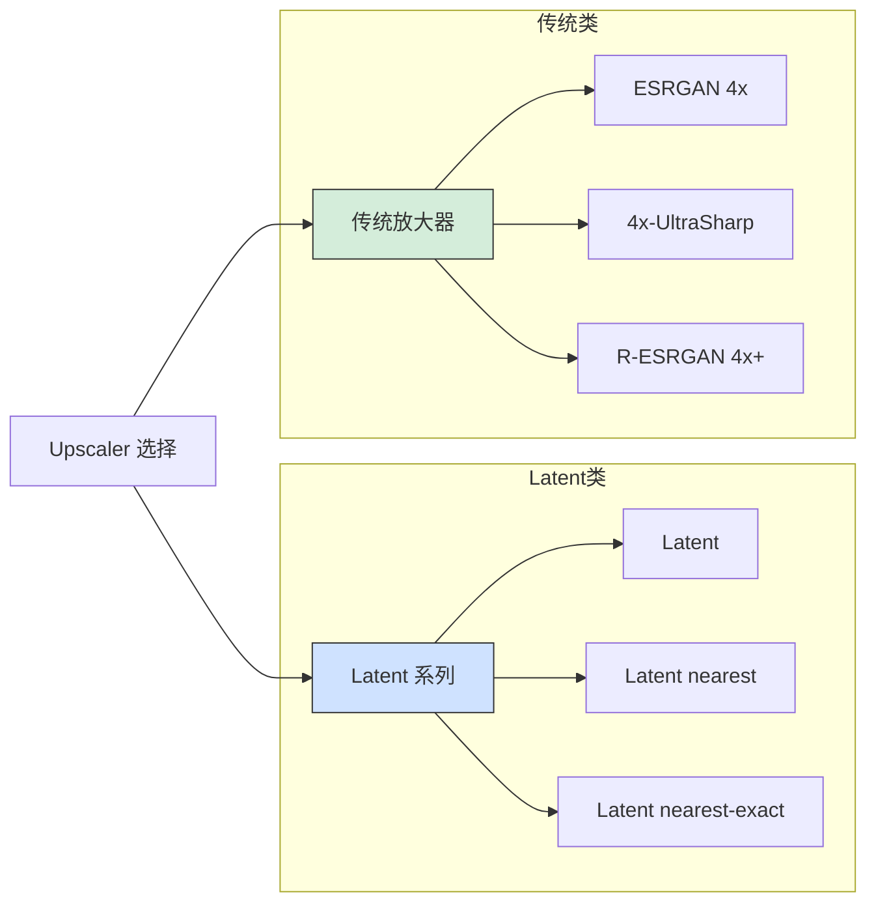

#### Upscaler 对比

| 放大器 | 特点 | 显存占用 | 推荐场景 |
|--------|------|----------|----------|
| **Latent** | 潜空间放大，可塑性强 | 低 | 需要更多细节变化 |
| **Latent (nearest)** | 更锐利 | 低 | 像素艺术 |
| **4x-UltraSharp** | 清晰锐利 | 中 | 写实图像 |
| **R-ESRGAN 4x+** | 平衡之选 | 中 | 通用场景 |
| **R-ESRGAN 4x+ Anime6B** | 动漫优化 | 中 | 二次元图像 |

### 7.4 Denoising Strength 影响

```
Denoising strength 在 Hires.fix 中的作用：

0.2-0.4：轻微修改
├── 保持原图结构
├── 仅增强细节
└── 适合满意的图像

0.4-0.6：标准范围（推荐）
├── 适度细化
├── 保持构图
└── 增加细节

0.6-0.8：大幅修改
├── 可能改变细节
├── 创造性更强
└── 可能偏离原图

0.8-1.0：接近重绘
├── 仅保留构图
├── 大量新细节
└── 风险较高
```

## 8. 高级参数

### 8.1 Clip Skip

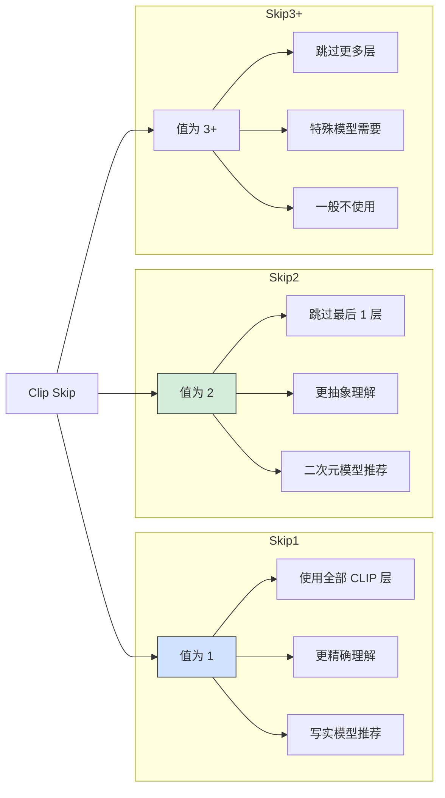

#### Clip Skip 设置建议

| 模型类型 | 推荐 Clip Skip | 说明 |
|----------|----------------|------|
| SD 1.5 写实 | 1 | 精确理解提示词 |
| SD 1.5 二次元 | 2 | 二次元模型惯例 |
| NAI 系列 | 2 | 训练时使用 Clip Skip 2 |
| SDXL | 不适用 | SDXL 有不同机制 |
| 自训练模型 | 按训练设置 | 查看模型说明 |

### 8.2 ENSD（Eta Noise Seed Delta）

```
作用：为 ancestral 采样器添加额外随机性

设置方法：
Settings → Stable Diffusion → Eta noise seed delta

推荐值：
├── 0：不添加额外随机性
├── 31337：常用值，增加多样性
└── 自定义：任意整数

适用采样器：
├── Euler a
├── DPM++ SDE 系列
└── 其他带 ancestral 的采样器
```

### 8.3 Eta（η）

```
作用：控制采样器的随机性程度

范围：0-1
├── 0：确定性采样（DDIM 模式）
├── 1：完全随机（DDPM 模式）
└── 默认：采样器特定值

影响：
├── 数值越高，随机性越强
├── 数值越低，结果越稳定
└── 通常保持默认即可
```

### 8.4 Script 脚本

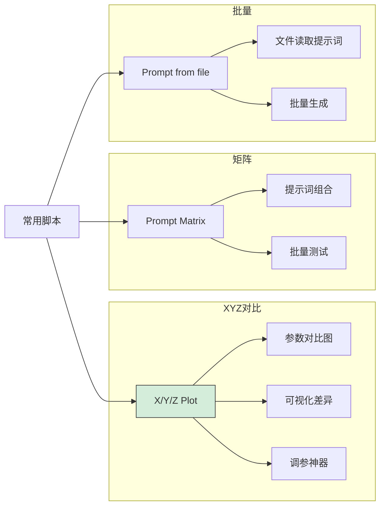

#### X/Y/Z Plot 使用

```
功能：创建参数对比网格图

常用对比：
├── X 轴：不同采样器
├── Y 轴：不同步数
└── Z 轴：不同 CFG（可选）

示例设置：
├── X type: Sampler
├── X values: Euler, DPM++ 2M Karras, UniPC
├── Y type: Steps
├── Y values: 20, 30, 40

输出：3×3 的对比网格图
```

## 9. 参数调优工作流

### 9.1 推荐工作流程

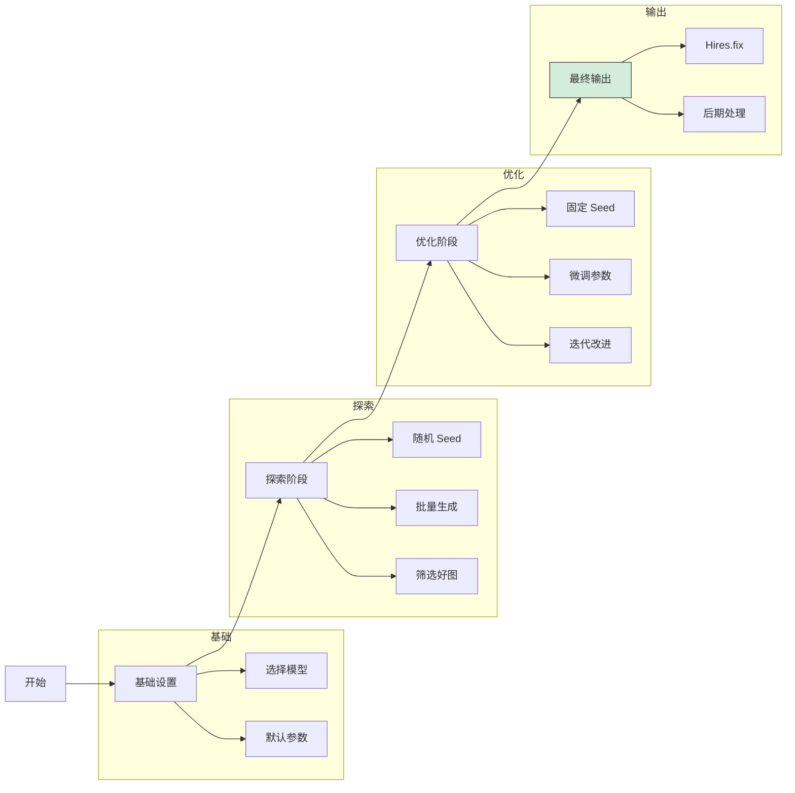

### 9.2 参数速查表

#### 新手推荐参数

```
模型：DreamShaper 8 / 你喜欢的模型
采样器：DPM++ 2M Karras
步数：30
CFG：7
尺寸：512x768（SD 1.5）/ 832x1216（SDXL）
Seed：-1
Batch count：4
Batch size：1
```

#### 高质量输出参数

```
采样器：DPM++ SDE Karras
步数：35-40
CFG：7-8
Hires.fix：开启
├── Upscaler：4x-UltraSharp
├── Hires steps：20
├── Denoising：0.45
└── Upscale by：1.5-2
```

#### 快速出图参数

```
采样器：UniPC / Euler
步数：15-20
CFG：7
尺寸：较小分辨率
Batch count：8
Batch size：1
```

### 9.3 常见问题速查

| 问题 | 可能原因 | 解决方案 |
|------|----------|----------|
| 生成太慢 | 步数过高/分辨率大 | 降低步数，使用快速采样器 |
| 画面模糊 | 步数不足/CFG 低 | 增加步数，提高 CFG |
| 过度饱和 | CFG 过高 | 降低 CFG 到 6-8 |
| 细节缺失 | 分辨率低/步数少 | 使用 Hires.fix |
| 结果不一致 | Seed 随机 | 固定 Seed |
| 显存不足 | 分辨率/批量过大 | 降低分辨率或 Batch size |
| 多头多手 | 尺寸不当 | 使用标准训练尺寸 |

## 总结

### 核心参数速记

| 参数 | 作用 | 推荐值 |
|------|------|--------|
| **Sampling method** | 去噪算法 | DPM++ 2M Karras |
| **Steps** | 采样步数 | 25-35 |
| **CFG Scale** | 提示词相关性 | 7 |
| **Size** | 图像尺寸 | 模型训练尺寸 |
| **Seed** | 随机种子 | -1（探索）/ 固定值（复现） |
| **Clip Skip** | CLIP 层跳过 | 1（写实）/ 2（二次元） |

### 调参口诀

```
采样器选 DPM，步数三十刚刚好
CFG 七是黄金点，尺寸遵循模型标
探索用随机种子，满意固定来复现
质量不够开 Hires，细节增强靠放大
```

---

> 💡 **提示**：参数调整是一门实践科学，没有"最优"参数，只有"最适合"的参数组合。

> 🔬 **建议**：使用 X/Y/Z Plot 脚本进行系统性参数测试，直观了解参数影响。

> 📊 **记录**：养成记录好参数组合的习惯，建立个人的参数模板库。
