# Stable Diffusion 模型选择与搭配指南

> **适用人群**：初学者到进阶用户
> **阅读时间**：约 25 分钟

## 概述

模型选择与搭配是 AI 绘画的核心技能。正确的模型组合能显著提升出图质量，而错误的搭配可能导致画面崩坏。本文档将系统介绍模型选择的方法论，以及如何将 Checkpoint、LoRA、VAE、Embedding 等组件有机搭配。

## 模型搭配体系

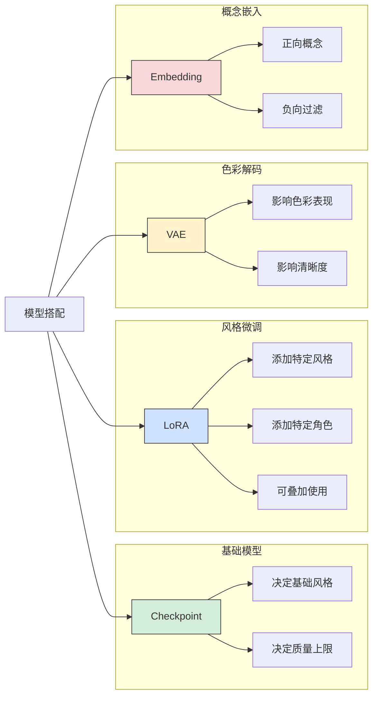

## 1. Checkpoint 选择

### 1.1 选择决策流程

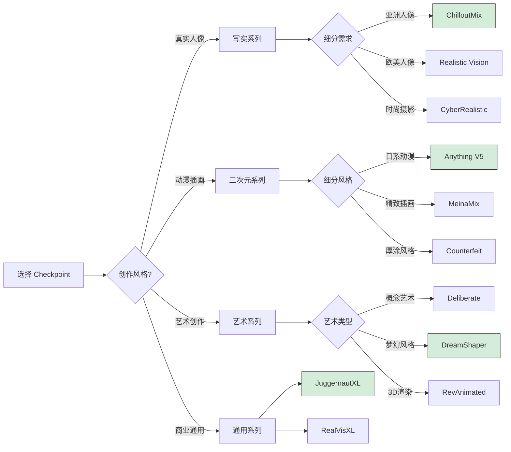

### 1.2 主流 Checkpoint 详解

#### SD 1.5 写实系列

| 模型名 | 特点 | 擅长领域 | VAE 建议 | 推荐度 |
|--------|------|----------|----------|--------|
| **Realistic Vision V5.1** | 高度写实，细节丰富 | 通用写实人像 | vae-ft-mse | ⭐⭐⭐⭐⭐ |
| **ChilloutMix** | 亚洲面孔优化 | 亚洲女性人像 | vae-ft-mse | ⭐⭐⭐⭐⭐ |
| **CyberRealistic** | 现代时尚感 | 时尚/商业摄影 | vae-ft-mse | ⭐⭐⭐⭐ |
| **AbsoluteReality** | 极致真实 | 照片级人像 | vae-ft-mse | ⭐⭐⭐⭐ |
| **Photon** | 光影出色 | 艺术人像 | vae-ft-mse | ⭐⭐⭐⭐ |
| **epiCRealism** | 电影质感 | 电影风格人像 | vae-ft-mse | ⭐⭐⭐⭐ |

#### SD 1.5 二次元系列

| 模型名 | 特点 | 擅长领域 | Clip Skip | 推荐度 |
|--------|------|----------|-----------|--------|
| **Anything V5** | 经典日系 | 通用动漫 | 2 | ⭐⭐⭐⭐⭐ |
| **MeinaMix** | 精致可爱 | 萌系角色 | 2 | ⭐⭐⭐⭐⭐ |
| **Counterfeit V3** | 厚涂质感 | 精细立绘 | 2 | ⭐⭐⭐⭐ |
| **AOM3** | 柔和画风 | 日系场景 | 2 | ⭐⭐⭐⭐ |
| **Cetus-Mix** | 多风格融合 | 风格多变 | 2 | ⭐⭐⭐⭐ |
| **Niji V5** | 类 Midjourney | 独特风格 | 2 | ⭐⭐⭐ |

#### SD 1.5 通用/艺术系列

| 模型名 | 特点 | 擅长领域 | 适用场景 | 推荐度 |
|--------|------|----------|----------|--------|
| **DreamShaper 8** | 万能型 | 各种风格 | 新手首选 | ⭐⭐⭐⭐⭐ |
| **Deliberate V3** | 艺术感强 | 概念艺术 | 创意作品 | ⭐⭐⭐⭐ |
| **RevAnimated** | 3D 动画风 | 3D 渲染 | 3D 风格 | ⭐⭐⭐⭐ |
| **GhostMix** | 混合风格 | 多元素融合 | 实验创作 | ⭐⭐⭐ |

#### SDXL 系列

| 模型名 | 特点 | 擅长领域 | 显存需求 | 推荐度 |
|--------|------|----------|----------|--------|
| **JuggernautXL V9** | SDXL 最佳通用 | 各种风格 | 8GB+ | ⭐⭐⭐⭐⭐ |
| **RealVisXL V4** | 写实增强 | 真实人像 | 8GB+ | ⭐⭐⭐⭐⭐ |
| **DreamShaperXL** | 艺术创作 | 梦幻风格 | 8GB+ | ⭐⭐⭐⭐ |
| **CounterfeitXL** | 二次元 XL | 高清动漫 | 10GB+ | ⭐⭐⭐⭐ |
| **Proteus V0.4** | 商业设计 | 产品/概念 | 8GB+ | ⭐⭐⭐⭐ |
| **LEOSAM HelloWorld** | 写实风景 | 风景/建筑 | 8GB+ | ⭐⭐⭐⭐ |

### 1.3 模型版本兼容性

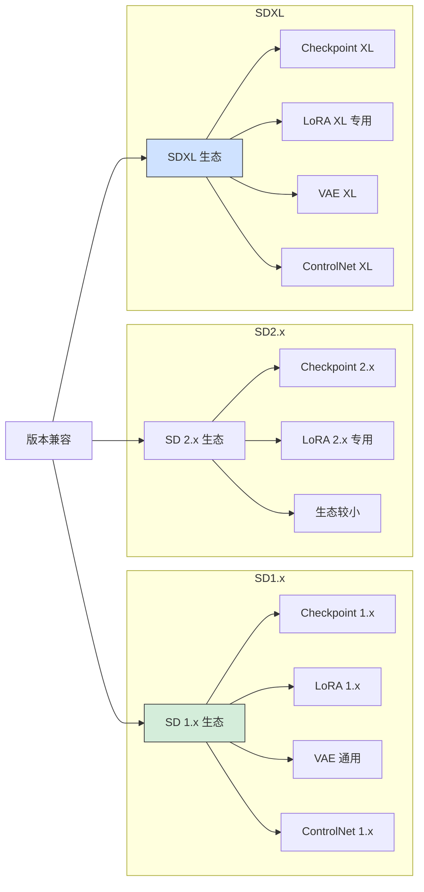

**重要提示**：
```
❌ 不兼容组合：
- SD 1.5 Checkpoint + SDXL LoRA
- SDXL Checkpoint + SD 1.5 LoRA
- SD 2.x 模型与 SD 1.x 模型混用

✅ 兼容组合：
- SD 1.5 Checkpoint + SD 1.5 LoRA
- SDXL Checkpoint + SDXL LoRA
- 同版本内的 VAE 通用
```

## 2. LoRA 选择与搭配

### 2.1 LoRA 分类

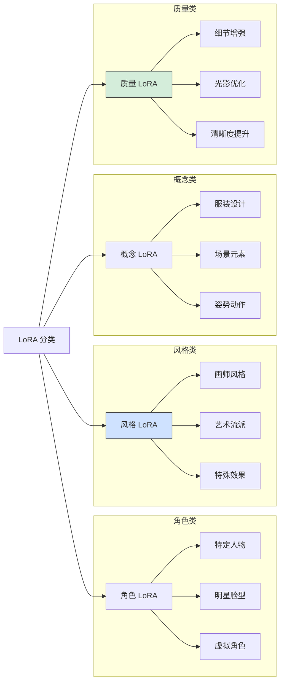

### 2.2 推荐 LoRA

#### 质量增强类

| LoRA 名称 | 功能 | 推荐权重 | 适用模型 |
|-----------|------|----------|----------|
| **add_detail** | 增加细节 | 0.5-0.8 | SD 1.5 全系列 |
| **Detail Tweaker** | 细节调整 | -1 到 1 | SD 1.5 全系列 |
| **epi_noiseoffset** | 高光暗部优化 | 0.5-0.7 | SD 1.5 写实 |
| **LCM LoRA** | 加速生成 | 1.0 | SD 1.5/XL |
| **Hyper-SD** | 极速生成 | 1.0 | SDXL |

#### 风格类

| LoRA 名称 | 效果 | 推荐权重 | 风格描述 |
|-----------|------|----------|----------|
| **Film Grain** | 胶片颗粒 | 0.3-0.6 | 复古电影感 |
| **Anime Lineart** | 线稿风格 | 0.6-0.8 | 动漫线条 |
| **Watercolor** | 水彩效果 | 0.5-0.7 | 水彩画风 |
| **Oil Painting** | 油画风格 | 0.5-0.8 | 古典油画 |
| **Flat Color** | 平涂风格 | 0.6-0.8 | 扁平插画 |
| **MoXin** | 国风水墨 | 0.6-0.9 | 中国水墨画 |

#### 人物优化类

| LoRA 名称 | 功能 | 推荐权重 | 说明 |
|-----------|------|----------|------|
| **Korean Doll** | 韩系脸型 | 0.5-0.7 | 韩国风格面孔 |
| **Japanese Doll** | 日系脸型 | 0.5-0.7 | 日本风格面孔 |
| **Better Hands** | 手部优化 | 0.4-0.6 | 改善手部绘制 |
| **Eye Detail** | 眼睛细节 | 0.4-0.6 | 增强眼睛表现 |

### 2.3 LoRA 叠加技巧

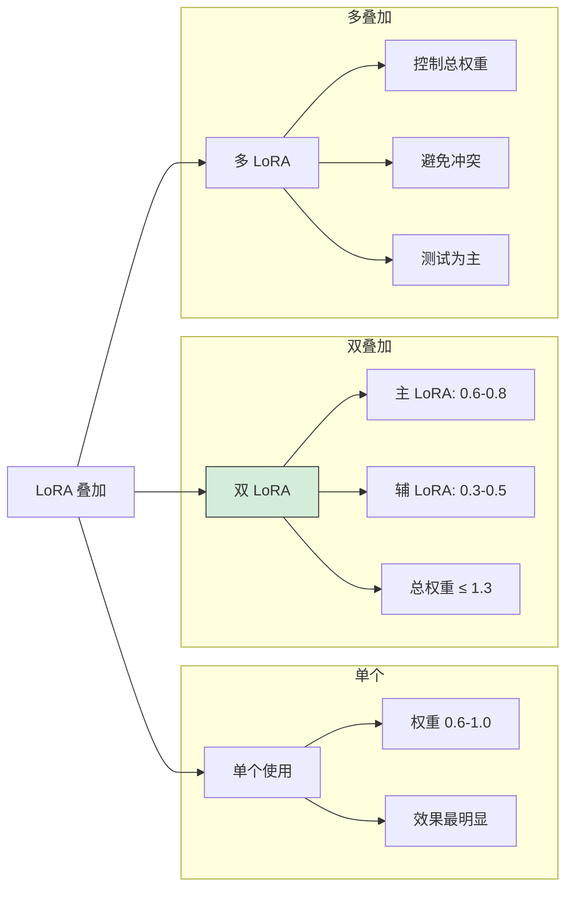

#### 叠加原则

```
1. 权重控制
   单个 LoRA：0.6-1.0
   双 LoRA：主 0.6-0.8 + 辅 0.3-0.5
   多 LoRA：每个 0.3-0.5，总计 ≤ 1.5

2. 类型搭配
   ✅ 推荐组合：
   - 角色 LoRA + 质量 LoRA
   - 风格 LoRA + 细节 LoRA
   - 服装 LoRA + 姿势 LoRA

   ❌ 避免组合：
   - 两个角色 LoRA（冲突）
   - 两个强风格 LoRA（混乱）
   - 写实 LoRA + 二次元 LoRA

3. 顺序影响
   提示词中靠前的 LoRA 影响略大
   <lora:主要:0.7>, <lora:次要:0.4>
```

#### 叠加示例

```
示例1：写实人像 + 细节增强
<lora:korean_doll:0.6>, <lora:add_detail:0.5>

示例2：二次元 + 特定画师风格
<lora:artist_style:0.7>, <lora:flat_color:0.4>

示例3：人物 + 服装 + 质量
<lora:character:0.7>, <lora:dress_style:0.5>, <lora:detail:0.3>

示例4：快速生成
<lora:lcm-lora-sdv1-5:1.0>
（需配合 LCM 采样器，步数 4-8）
```

### 2.4 LoRA 权重调试

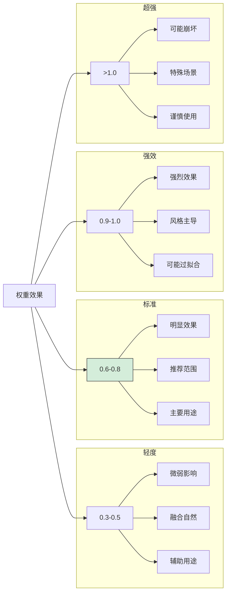

## 3. VAE 选择与搭配

### 3.1 VAE 作用

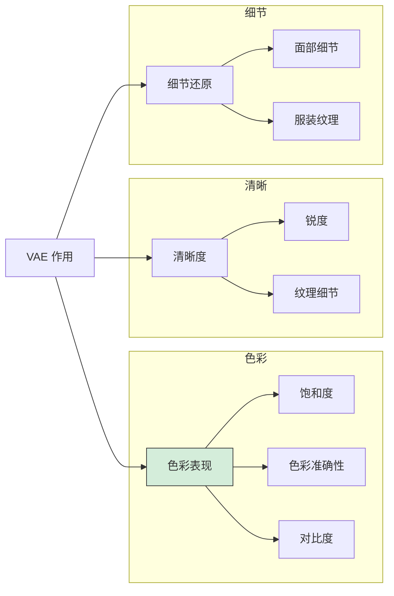

### 3.2 常用 VAE 推荐

| VAE 名称 | 特点 | 适用场景 | 推荐度 |
|----------|------|----------|--------|
| **vae-ft-mse-840000** | 色彩鲜艳，通用性强 | SD 1.5 全系列 | ⭐⭐⭐⭐⭐ |
| **kl-f8-anime2** | 动漫优化 | 二次元模型 | ⭐⭐⭐⭐ |
| **blessed2** | 防灰图增强 | 写实模型 | ⭐⭐⭐⭐ |
| **orangemix.vae** | 橙色调优化 | 特定风格 | ⭐⭐⭐ |
| **sdxl_vae** | SDXL 标准 | SDXL 模型 | ⭐⭐⭐⭐⭐ |

### 3.3 VAE 搭配建议

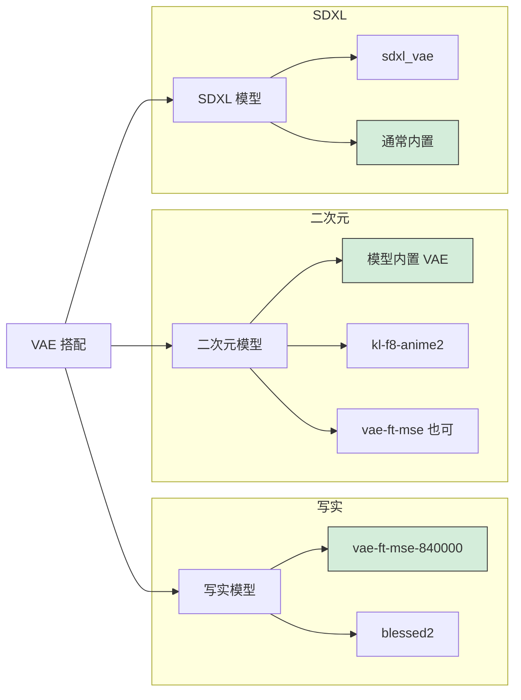

### 3.4 VAE 问题排查

```
问题1：图像发灰/色彩暗淡
原因：VAE 不匹配或未加载
解决：
├── 检查 VAE 是否正确加载
├── 尝试 vae-ft-mse-840000
└── Settings → SD VAE → 选择具体 VAE

问题2：图像出现黑块/异常
原因：VAE 与模型不兼容或半精度问题
解决：
├── 添加 --no-half-vae 启动参数
├── 尝试其他 VAE
└── 使用模型内置 VAE（设为 None）

问题3：色彩过于鲜艳
原因：VAE 色彩增强过度
解决：
├── 尝试使用模型内置 VAE
├── 后期调整色彩
└── 选择更中性的 VAE
```

## 4. Embedding 搭配

### 4.1 Embedding 分类

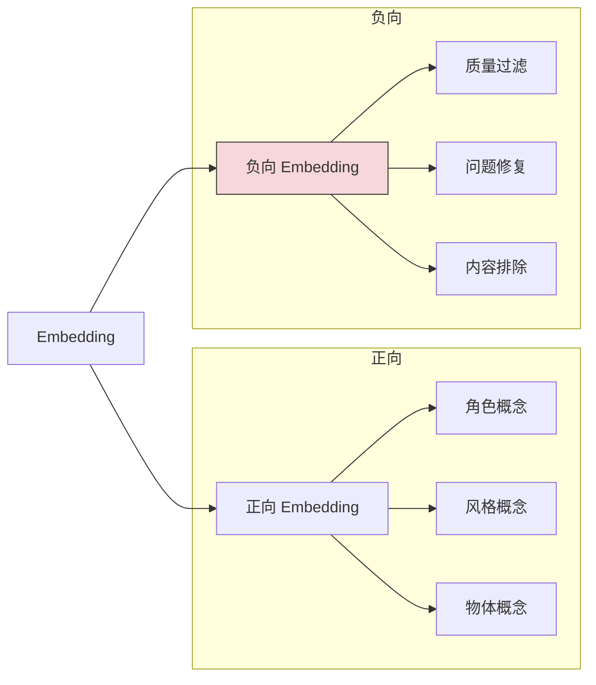

### 4.2 必备负向 Embedding

| Embedding | 功能 | 使用位置 | 推荐度 |
|-----------|------|----------|--------|
| **EasyNegative** | 通用负面质量 | 负面提示词 | ⭐⭐⭐⭐⭐ |
| **badhandv4** | 手部问题修复 | 负面提示词 | ⭐⭐⭐⭐⭐ |
| **negative_hand** | 手部负面特征 | 负面提示词 | ⭐⭐⭐⭐ |
| **ng_deepnegative** | 深度负面优化 | 负面提示词 | ⭐⭐⭐⭐ |
| **bad-artist** | 排除低质艺术 | 负面提示词 | ⭐⭐⭐ |
| **bad_prompt_version2** | 综合负面 | 负面提示词 | ⭐⭐⭐ |

### 4.3 Embedding 使用示例

```
基础负面模板：
EasyNegative, badhandv4,
(low quality:1.4), (worst quality:1.4)

完整负面模板：
EasyNegative, badhandv4, negative_hand,
(low quality:1.4), (worst quality:1.4),
(blurry:1.2), watermark, text, signature

二次元专用：
EasyNegative, badhandv4,
(low quality:1.4), bad anatomy,
extra fingers, fewer fingers
```

## 5. 完整搭配方案

### 5.1 搭配公式

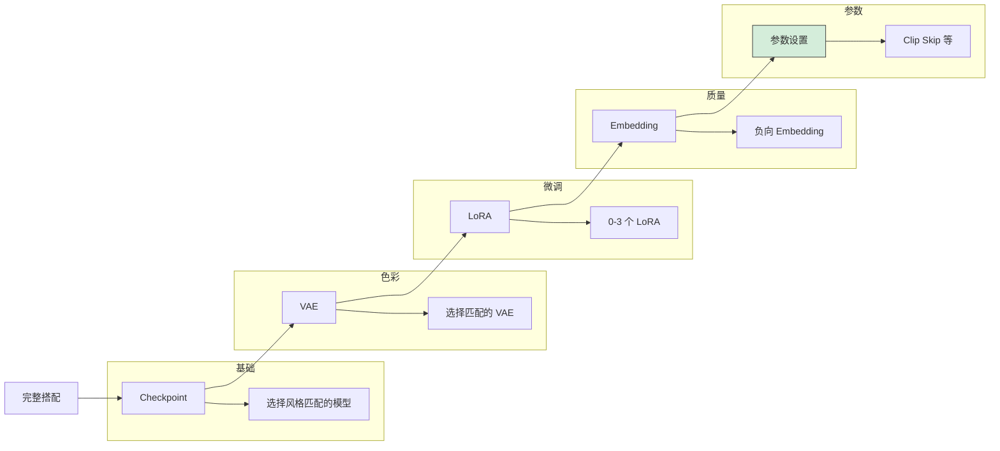

### 5.2 场景化搭配方案

#### 方案一：写实人像

```
【推荐组合】
Checkpoint: Realistic Vision V5.1
VAE: vae-ft-mse-840000-ema-pruned
LoRA:
  - add_detail (0.5)
  - 可选: korean_doll (0.4)

【参数设置】
Clip Skip: 1
采样器: DPM++ 2M Karras
步数: 30
CFG: 7
尺寸: 512x768

【提示词模板】
Prompt:
(masterpiece:1.2), best quality, photo of a woman,
detailed face, natural lighting, upper body,
looking at viewer, sharp focus, 8k

Negative:
EasyNegative, badhandv4,
(low quality:1.4), (worst quality:1.4),
bad anatomy, watermark, text
```

#### 方案二：亚洲写实人像

```
【推荐组合】
Checkpoint: ChilloutMix
VAE: vae-ft-mse-840000-ema-pruned
LoRA:
  - korean_doll (0.5) 或 japaneseDollLikeness (0.5)
  - add_detail (0.4)

【参数设置】
Clip Skip: 1
采样器: DPM++ SDE Karras
步数: 30
CFG: 7
尺寸: 512x768

【提示词模板】
Prompt:
(masterpiece:1.2), best quality,
1girl, asian, beautiful face, detailed eyes,
long black hair, natural makeup,
casual clothes, soft lighting, portrait

Negative:
EasyNegative, badhandv4,
(low quality:1.4), (worst quality:1.4),
western, blurry
```

#### 方案三：日系二次元

```
【推荐组合】
Checkpoint: Anything V5 / MeinaMix
VAE: 内置 / kl-f8-anime2
LoRA:
  - 风格 LoRA (0.6) 可选
  - flat_color (0.4) 可选

【参数设置】
Clip Skip: 2
采样器: Euler a / DPM++ 2M Karras
步数: 25
CFG: 7
尺寸: 512x768

【提示词模板】
Prompt:
(masterpiece:1.2), (best quality:1.2),
1girl, solo, long hair, blue eyes,
school uniform, smile, outdoors,
anime style, detailed, beautiful

Negative:
EasyNegative, badhandv4,
(low quality:1.4), (worst quality:1.4),
realistic, photo, 3d
```

#### 方案四：精致插画

```
【推荐组合】
Checkpoint: Counterfeit V3 / MeinaMix
VAE: kl-f8-anime2 / 内置
LoRA:
  - 画师风格 LoRA (0.7)
  - add_detail (0.3)

【参数设置】
Clip Skip: 2
采样器: DPM++ 2M Karras
步数: 30
CFG: 8
尺寸: 768x1024

【提示词模板】
Prompt:
(masterpiece:1.3), (best quality:1.3),
illustration, 1girl, detailed face,
intricate outfit, fantasy setting,
dramatic lighting, vivid colors

Negative:
EasyNegative, badhandv4,
(low quality:1.4), simple background,
sketch, rough
```

#### 方案五：SDXL 通用高质量

```
【推荐组合】
Checkpoint: JuggernautXL V9
VAE: 内置 sdxl_vae
LoRA:
  - 根据需要添加 XL 兼容 LoRA

【参数设置】
Clip Skip: 不适用
采样器: DPM++ 2M Karras
步数: 30
CFG: 6-7
尺寸: 1024x1024 / 832x1216

【提示词模板】
Prompt:
masterpiece, best quality, highly detailed,
[你的内容描述],
professional photography, sharp focus

Negative:
low quality, worst quality, blurry,
watermark, text, deformed
```

#### 方案六：梦幻艺术风格

```
【推荐组合】
Checkpoint: DreamShaper 8
VAE: vae-ft-mse-840000
LoRA:
  - epi_noiseoffset (0.5)
  - 可选风格 LoRA

【参数设置】
Clip Skip: 1-2
采样器: DPM++ SDE Karras
步数: 35
CFG: 7
尺寸: 768x512

【提示词模板】
Prompt:
(masterpiece:1.2), best quality,
fantasy landscape, magical atmosphere,
ethereal lighting, vibrant colors,
dreamlike, highly detailed, concept art

Negative:
EasyNegative,
(low quality:1.4), (worst quality:1.4),
realistic, photo, mundane
```

### 5.3 搭配验证清单

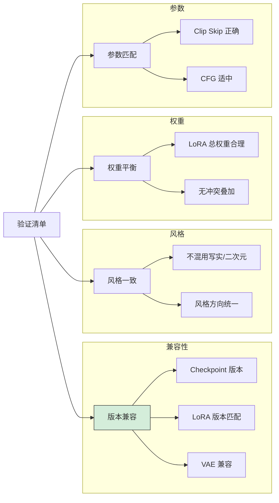

## 6. 模型测试与评估

### 6.1 测试流程

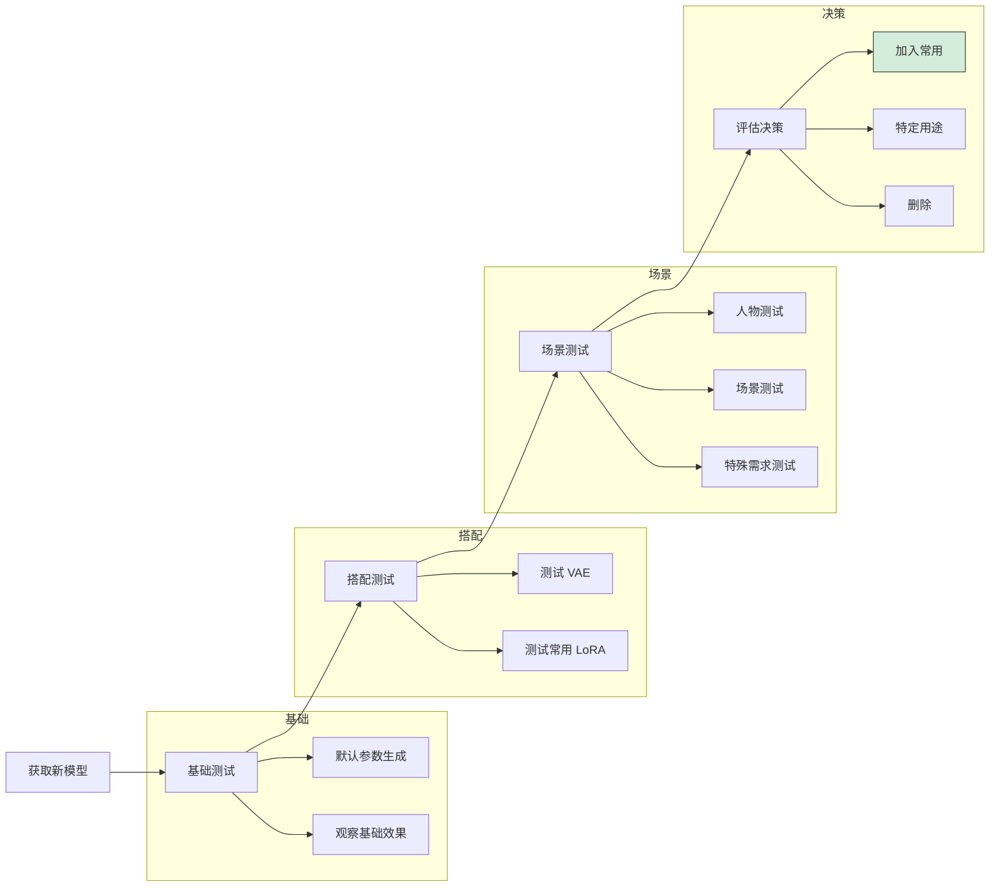

### 6.2 标准测试提示词

```
【人物测试】
Prompt:
masterpiece, best quality, 1girl, solo,
long hair, detailed face, looking at viewer,
upper body, simple background

Negative:
low quality, worst quality, blurry

【场景测试】
Prompt:
masterpiece, best quality, landscape,
mountains, lake, sunset, detailed,
professional photography

Negative:
low quality, worst quality, blurry, people

【风格测试】
Prompt:
masterpiece, best quality, concept art,
fantasy castle, dramatic lighting,
highly detailed, epic

Negative:
low quality, worst quality, simple
```

### 6.3 评估指标

| 评估维度 | 优秀 | 良好 | 一般 | 较差 |
|----------|------|------|------|------|
| 面部质量 | 精致自然 | 基本正确 | 偶有问题 | 经常崩坏 |
| 手部表现 | 正确美观 | 基本正确 | 偶有错误 | 频繁错误 |
| 色彩表现 | 丰富协调 | 正常 | 偏色/灰 | 严重问题 |
| 细节程度 | 丰富精细 | 适中 | 缺乏 | 模糊 |
| 风格一致 | 稳定统一 | 较统一 | 有波动 | 不稳定 |
| 提示词响应 | 准确 | 基本准确 | 部分偏差 | 大幅偏离 |

## 7. 常见问题

### Q1: 模型加载后效果与预览图差距大

```
可能原因：
├── 未使用推荐的 VAE
├── 未使用正确的 Clip Skip
├── 未使用模型要求的触发词
├── 参数设置不当（CFG、采样器等）
└── 未使用配套 LoRA

解决方案：
├── 查看模型页面的推荐设置
├── 使用模型指定的 VAE
├── 设置正确的 Clip Skip
├── 复制预览图的提示词和参数
└── 下载配套的 LoRA 和 Embedding
```

### Q2: LoRA 效果不明显

```
可能原因：
├── 权重设置过低
├── LoRA 版本与 Checkpoint 不兼容
├── 提示词中缺少触发词
└── 被其他 LoRA 抵消

解决方案：
├── 提高 LoRA 权重（0.7-1.0）
├── 确认版本兼容性（SD1.5/SDXL）
├── 添加 LoRA 的触发词
├── 减少其他 LoRA 数量
└── 单独测试该 LoRA
```

### Q3: 多个 LoRA 叠加后画面混乱

```
可能原因：
├── LoRA 总权重过高
├── LoRA 之间风格冲突
├── 使用了不兼容的 LoRA
└── 过多 LoRA 叠加

解决方案：
├── 降低各 LoRA 权重（总计 ≤ 1.5）
├── 移除风格冲突的 LoRA
├── 逐个添加测试
└── 最多使用 2-3 个 LoRA
```

### Q4: 如何选择适合的模型组合

```
选择思路：
1. 明确创作目标（风格、内容）
2. 选择匹配的 Checkpoint
3. 配置合适的 VAE
4. 按需添加 LoRA
5. 使用负向 Embedding
6. 测试并微调

快速匹配表：
├── 写实人像 → Realistic Vision + vae-ft-mse
├── 亚洲人像 → ChilloutMix + vae-ft-mse
├── 日系动漫 → Anything V5 + 内置 VAE
├── 精致插画 → MeinaMix + kl-f8-anime2
├── 通用创作 → DreamShaper + vae-ft-mse
└── SDXL 高质 → JuggernautXL + 内置 VAE
```

## 总结

### 搭配速查表

| 创作类型 | Checkpoint | VAE | Clip Skip | 推荐 LoRA |
|----------|------------|-----|-----------|-----------|
| 写实人像 | Realistic Vision | vae-ft-mse | 1 | add_detail |
| 亚洲人像 | ChilloutMix | vae-ft-mse | 1 | korean_doll |
| 日系动漫 | Anything V5 | 内置 | 2 | 按需 |
| 精致插画 | MeinaMix | kl-f8-anime2 | 2 | 画师风格 |
| 通用创作 | DreamShaper | vae-ft-mse | 1-2 | 按需 |
| SDXL 通用 | JuggernautXL | 内置 | - | XL 兼容 |

### 搭配原则

```
1. 版本一致：Checkpoint 和 LoRA 版本必须匹配
2. 风格统一：不混用写实和二次元模型/LoRA
3. 权重合理：LoRA 总权重控制在 1.5 以内
4. VAE 匹配：优先使用模型推荐的 VAE
5. 参数配套：Clip Skip 等参数按模型要求设置
6. 测试验证：新组合必须测试后再使用
```

---

> 💡 **提示**：好的模型搭配是实践出来的，多尝试、多记录，逐步建立自己的模型搭配库。

> 🔧 **建议**：为常用的模型组合创建预设，提高创作效率。

> 📊 **记录**：记录有效的搭配方案，包括具体的权重、参数，方便日后复用。
