# Stable Diffusion 工作流程最佳实践

> **适用人群**：初学者到进阶用户
> **阅读时间**：约 25 分钟

## 概述

高效的工作流程是提升 AI 绘画创作效率的关键。本文档将介绍从构思到成品的完整工作流程，分享经过实践验证的最佳实践，帮助你建立系统化的创作方法论。

## 完整工作流程总览

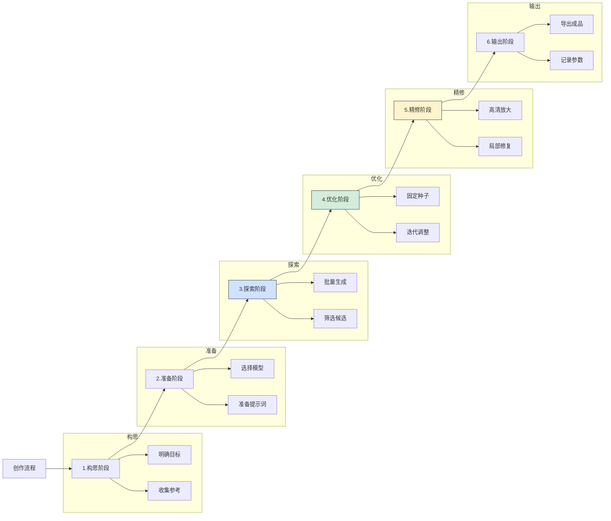
```mermaid
graph LR
    A[创作流程] --> B[1.构思阶段]
    B --> C[2.准备阶段]
    C --> D[3.探索阶段]
    D --> E[4.优化阶段]
    E --> F[5.精修阶段]
    F --> G[6.输出阶段]

    subgraph 构思
        B --> B1[明确目标]
        B --> B2[收集参考]
    end

    subgraph 准备
        C --> C1[选择模型]
        C --> C2[准备提示词]
    end

    subgraph 探索
        D --> D1[批量生成]
        D --> D2[筛选候选]
    end

    subgraph 优化
        E --> E1[固定种子]
        E --> E2[迭代调整]
    end

    subgraph 精修
        F --> F1[高清放大]
        F --> F2[局部修复]
    end

    subgraph 输出
        G --> G1[导出成品]
        G --> G2[记录参数]
    end

    style D fill:#cfe2ff,stroke:#333
    style E fill:#d4edda,stroke:#333
    style F fill:#fff3cd,stroke:#333
```

## 1. 构思阶段

### 1.1 明确创作目标

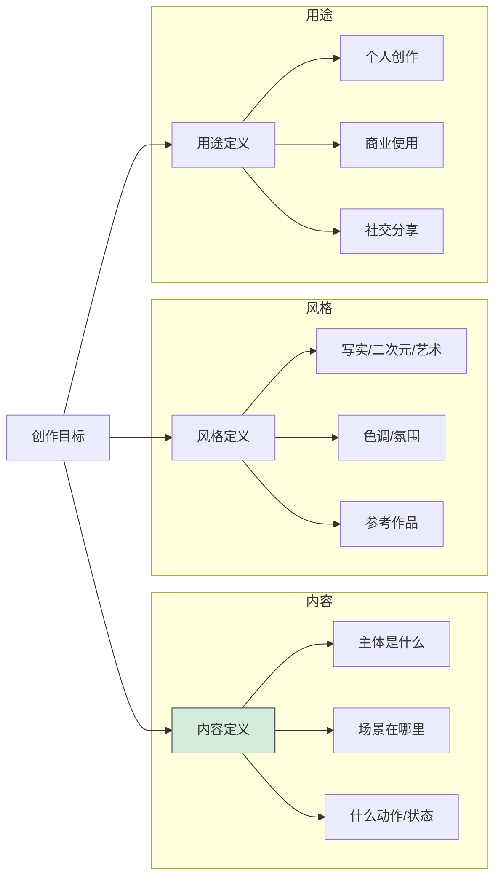
```mermaid
graph LR
    A[创作目标] --> B[内容定义]
    A --> C[风格定义]
    A --> D[用途定义]

    subgraph 内容
        B --> B1[主体是什么]
        B --> B2[场景在哪里]
        B --> B3[什么动作/状态]
    end

    subgraph 风格
        C --> C1[写实/二次元/艺术]
        C --> C2[色调/氛围]
        C --> C3[参考作品]
    end

    subgraph 用途
        D --> D1[个人创作]
        D --> D2[商业使用]
        D --> D3[社交分享]
    end

    style B fill:#d4edda,stroke:#333
```

#### 目标定义模板

```
【创作目标清单】

□ 主体内容：_____________
  （人物/风景/物品/概念）

□ 画面风格：_____________
  （写实/动漫/油画/概念艺术）

□ 情绪氛围：_____________
  （温暖/冷酷/梦幻/紧张）

□ 构图方式：_____________
  （特写/半身/全身/远景）

□ 最终用途：_____________
  （壁纸/头像/插图/打印）

□ 输出尺寸：_____________
  （方形/竖版/横版/具体尺寸）
```

### 1.2 收集参考资料

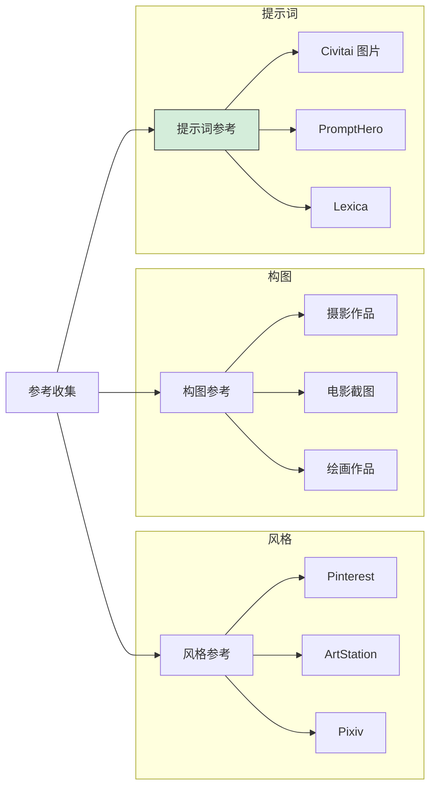
```mermaid
graph LR
    A[参考收集] --> B[风格参考]
    A --> C[构图参考]
    A --> D[提示词参考]

    subgraph 风格
        B --> B1[Pinterest]
        B --> B2[ArtStation]
        B --> B3[Pixiv]
    end

    subgraph 构图
        C --> C1[摄影作品]
        C --> C2[电影截图]
        C --> C3[绘画作品]
    end

    subgraph 提示词
        D --> D1[Civitai 图片]
        D --> D2[PromptHero]
        D --> D3[Lexica]
    end

    style D fill:#d4edda,stroke:#333
```

#### 参考资料来源

| 来源 | 用途 | 链接 |
|------|------|------|
| **Civitai** | 提示词+参数参考 | civitai.com |
| **Pinterest** | 风格/构图灵感 | pinterest.com |
| **ArtStation** | 专业艺术参考 | artstation.com |
| **Lexica** | AI 图片+提示词 | lexica.art |
| **PromptHero** | 提示词搜索 | prompthero.com |
| **Unsplash** | 摄影参考 | unsplash.com |

### 1.3 创意思维导图

```
创作主题：[你的主题]
    │
    ├─ 主体
    │   ├─ 人物特征
    │   ├─ 服装配饰
    │   └─ 姿态动作
    │
    ├─ 环境
    │   ├─ 场景地点
    │   ├─ 时间/天气
    │   └─ 背景元素
    │
    ├─ 风格
    │   ├─ 艺术流派
    │   ├─ 色彩基调
    │   └─ 参考艺术家
    │
    └─ 氛围
        ├─ 光影效果
        ├─ 情绪表达
        └─ 整体感觉
```

## 2. 准备阶段

### 2.1 模型选择流程

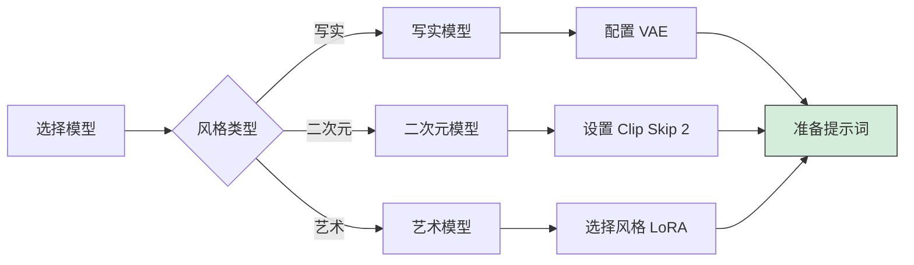
```mermaid
graph LR
    A[选择模型] --> B{风格类型}

    B -->|写实| C[写实模型]
    B -->|二次元| D[二次元模型]
    B -->|艺术| E[艺术模型]

    C --> C1[配置 VAE]
    D --> D1[设置 Clip Skip 2]
    E --> E1[选择风格 LoRA]

    C1 --> F[准备提示词]
    D1 --> F
    E1 --> F

    style F fill:#d4edda,stroke:#333
```

#### 快速模型选择表

| 创作目标 | 推荐模型 | VAE | Clip Skip |
|----------|----------|-----|-----------|
| 写实人像 | Realistic Vision V5 | vae-ft-mse | 1 |
| 亚洲人像 | ChilloutMix | vae-ft-mse | 1 |
| 日系动漫 | Anything V5 | 内置 | 2 |
| 精致插画 | MeinaMix | kl-f8-anime2 | 2 |
| 通用创作 | DreamShaper 8 | vae-ft-mse | 1-2 |
| SDXL 高质 | JuggernautXL | 内置 | - |

### 2.2 提示词准备

#### 提示词构建流程

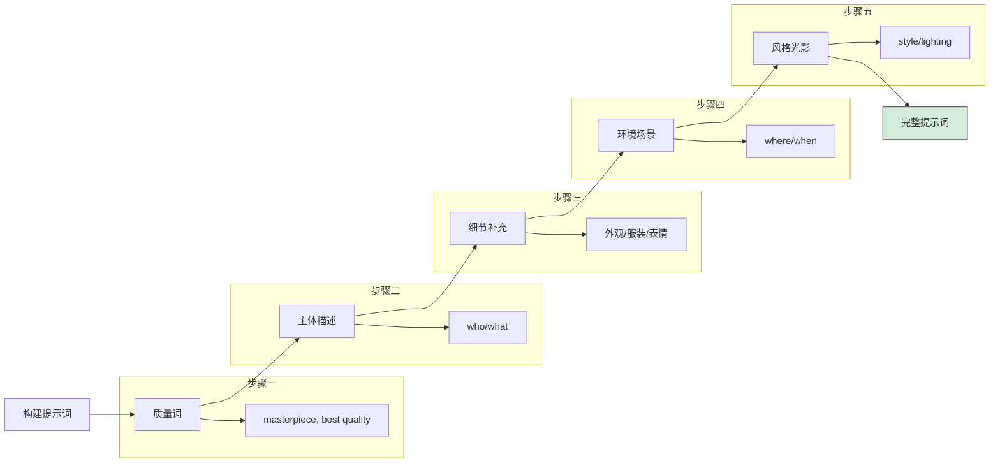
```mermaid
graph LR
    A[构建提示词] --> B[质量词]
    B --> C[主体描述]
    C --> D[细节补充]
    D --> E[环境场景]
    E --> F[风格光影]
    F --> G[完整提示词]

    subgraph 步骤一
        B --> B1[masterpiece, best quality]
    end

    subgraph 步骤二
        C --> C1[who/what]
    end

    subgraph 步骤三
        D --> D1[外观/服装/表情]
    end

    subgraph 步骤四
        E --> E1[where/when]
    end

    subgraph 步骤五
        F --> F1[style/lighting]
    end

    style G fill:#d4edda,stroke:#333
```

#### 提示词模板库

**通用模板**
```
(masterpiece:1.2), best quality, [主体], [细节],
[环境], [风格], [光影]
```

**人物模板**
```
(masterpiece:1.2), best quality,
[数量+性别], [发型发色], [眼睛], [表情],
[服装], [姿态], [视角],
[背景], [光影], [风格]
```

**场景模板**
```
(masterpiece:1.2), best quality,
[场景类型], [主要元素], [天气/时间],
[氛围], [风格], [细节程度]
```

### 2.3 参数预设

```
【基础预设】
采样器：DPM++ 2M Karras
步数：30
CFG：7
尺寸：512x768（SD1.5）/ 832x1216（SDXL）

【快速预设】
采样器：Euler / UniPC
步数：20
CFG：7
用途：快速探索

【高质量预设】
采样器：DPM++ SDE Karras
步数：35-40
CFG：7-8
Hires.fix：开启
用途：最终输出
```

## 3. 探索阶段

### 3.1 批量生成策略

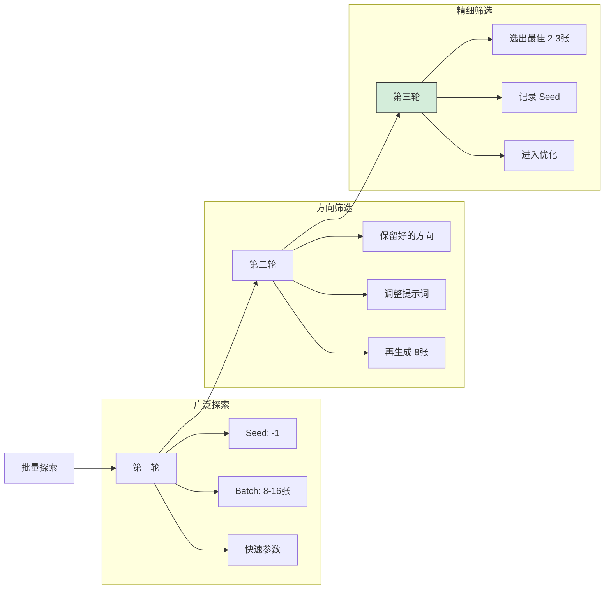
```mermaid
graph LR
    A[批量探索] --> B[第一轮]
    B --> C[第二轮]
    C --> D[第三轮]

    subgraph 广泛探索
        B --> B1[Seed: -1]
        B --> B2[Batch: 8-16张]
        B --> B3[快速参数]
    end

    subgraph 方向筛选
        C --> C1[保留好的方向]
        C --> C2[调整提示词]
        C --> C3[再生成 8张]
    end

    subgraph 精细筛选
        D --> D1[选出最佳 2-3张]
        D --> D2[记录 Seed]
        D --> D3[进入优化]
    end

    style D fill:#d4edda,stroke:#333
```

#### 探索阶段设置

```
【探索参数】
Seed：-1（随机）
Batch count：4
Batch size：2（显存允许的情况下）
采样器：Euler a（创意探索）/ DPM++ 2M Karras（稳定探索）
步数：20-25（快速出图）
CFG：7

【目标】
- 快速产出大量候选
- 测试提示词效果
- 寻找满意的构图/风格方向
```

### 3.2 高效筛选方法

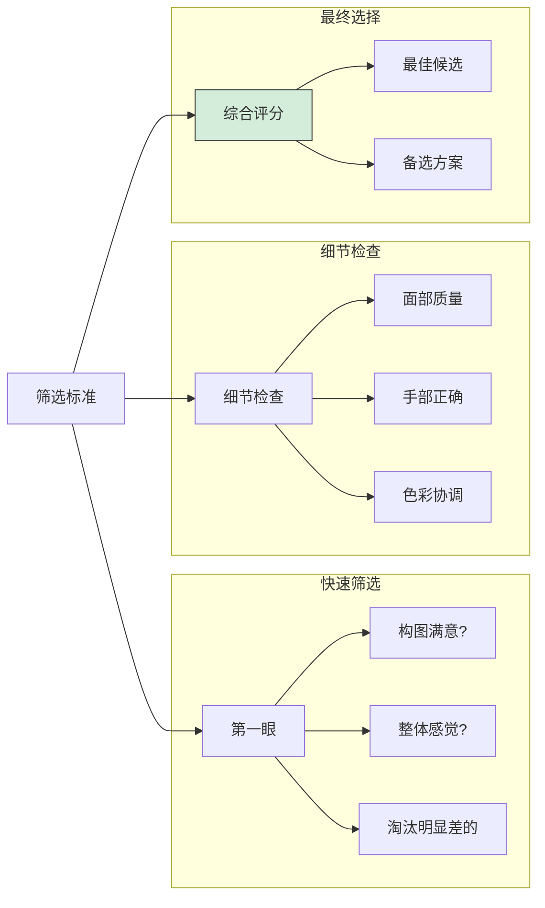
```mermaid
graph LR
    A[筛选标准] --> B[第一眼]
    A --> C[细节检查]
    A --> D[综合评分]

    subgraph 快速筛选
        B --> B1[构图满意?]
        B --> B2[整体感觉?]
        B --> B3[淘汰明显差的]
    end

    subgraph 细节检查
        C --> C1[面部质量]
        C --> C2[手部正确]
        C --> C3[色彩协调]
    end

    subgraph 最终选择
        D --> D1[最佳候选]
        D --> D2[备选方案]
    end

    style D fill:#d4edda,stroke:#333
```

#### 筛选检查清单

```
□ 构图布局是否满意
□ 主体是否突出
□ 面部是否正常（无崩坏）
□ 手部是否正确（手指数量）
□ 色彩是否协调
□ 光影是否自然
□ 细节是否足够
□ 整体氛围是否符合预期
□ 是否有明显瑕疵
□ 是否值得进一步优化
```

### 3.3 X/Y/Z Plot 参数测试

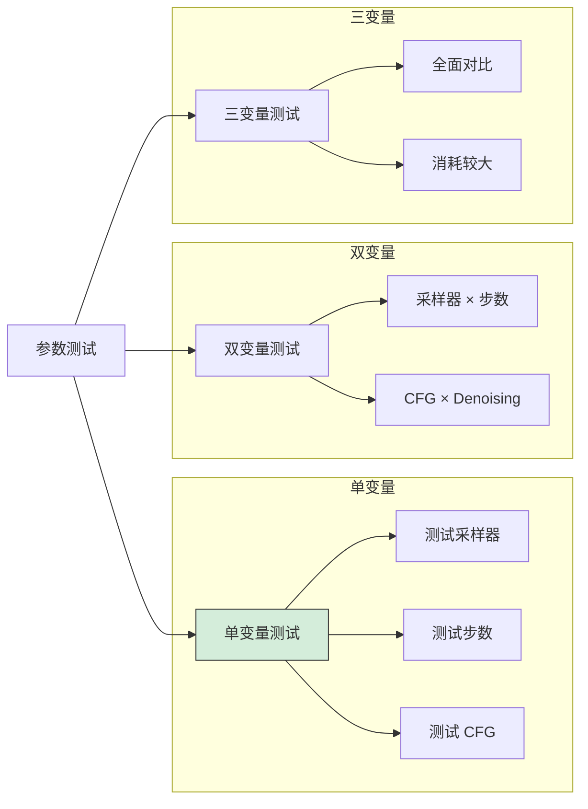
```mermaid
graph LR
    A[参数测试] --> B[单变量测试]
    A --> C[双变量测试]
    A --> D[三变量测试]

    subgraph 单变量
        B --> B1[测试采样器]
        B --> B2[测试步数]
        B --> B3[测试 CFG]
    end

    subgraph 双变量
        C --> C1[采样器 × 步数]
        C --> C2[CFG × Denoising]
    end

    subgraph 三变量
        D --> D1[全面对比]
        D --> D2[消耗较大]
    end

    style B fill:#d4edda,stroke:#333
```

#### 常用测试组合

```
【采样器对比】
X type: Sampler
X values: Euler a, DPM++ 2M Karras, DPM++ SDE Karras, UniPC

【步数对比】
X type: Steps
X values: 15, 20, 25, 30, 40

【CFG 对比】
X type: CFG Scale
X values: 5, 6, 7, 8, 9, 10

【综合对比】
X type: Sampler
X values: Euler a, DPM++ 2M Karras
Y type: Steps
Y values: 20, 30, 40
```

## 4. 优化阶段

### 4.1 迭代优化流程

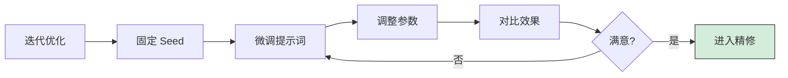
```mermaid
graph LR
    A[迭代优化] --> B[固定 Seed]
    B --> C[微调提示词]
    C --> D[调整参数]
    D --> E[对比效果]
    E --> F{满意?}
    F -->|否| C
    F -->|是| G[进入精修]

    style G fill:#d4edda,stroke:#333
```

### 4.2 提示词微调技巧

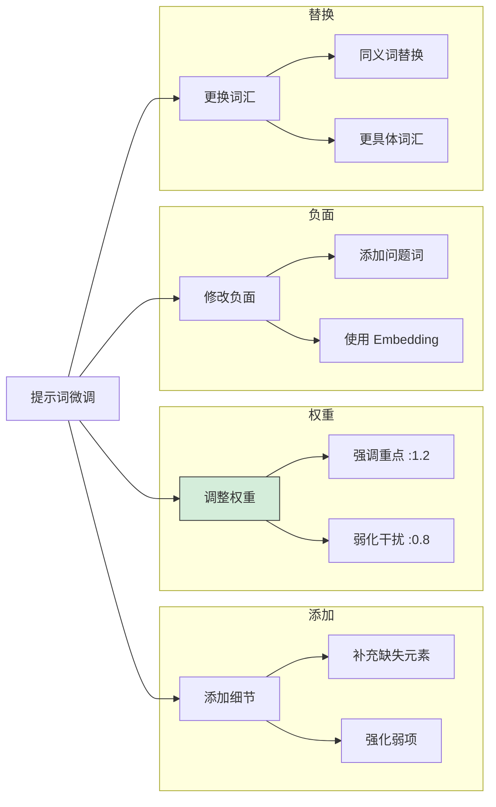
```mermaid
graph LR
    A[提示词微调] --> B[添加细节]
    A --> C[调整权重]
    A --> D[修改负面]
    A --> E[更换词汇]

    subgraph 添加
        B --> B1[补充缺失元素]
        B --> B2[强化弱项]
    end

    subgraph 权重
        C --> C1[强调重点 :1.2]
        C --> C2[弱化干扰 :0.8]
    end

    subgraph 负面
        D --> D1[添加问题词]
        D --> D2[使用 Embedding]
    end

    subgraph 替换
        E --> E1[同义词替换]
        E --> E2[更具体词汇]
    end

    style C fill:#d4edda,stroke:#333
```

#### 微调示例

```
【原始】
1girl, long hair, dress

【添加细节】
1girl, long blonde hair, flowing hair,
elegant white dress, lace details

【调整权重】
1girl, (long blonde hair:1.2), flowing hair,
(elegant white dress:1.1), lace details

【同义词优化】
1girl, (lustrous golden hair:1.2), windswept hair,
(exquisite ivory gown:1.1), intricate lace embroidery
```

### 4.3 参数微调指南

| 问题 | 调整方向 | 具体操作 |
|------|----------|----------|
| 细节不足 | 增加步数 | Steps +10 |
| 色彩暗淡 | 检查 VAE | 更换 VAE |
| 过度饱和 | 降低 CFG | CFG -1~2 |
| 不够锐利 | 提示词 | 添加 sharp focus |
| 风格偏差 | 权重调整 | 强化风格词 |
| 构图不变 | 换种子 | 使用 Variation |
| 手部问题 | 负面词 | 添加 badhandv4 |

### 4.4 Variation 变体生成

```
目的：基于满意的图像生成相似变体

设置：
├── Seed：满意图像的 Seed
├── Variation seed：新的随机数
├── Variation strength：0.1-0.3（轻微变化）
│                       0.3-0.5（适度变化）
│                       0.5-0.7（明显变化）

用途：
├── 生成表情变化
├── 微调姿态
├── 产出系列图
└── 寻找更好版本
```

## 5. 精修阶段

### 5.1 高清放大流程

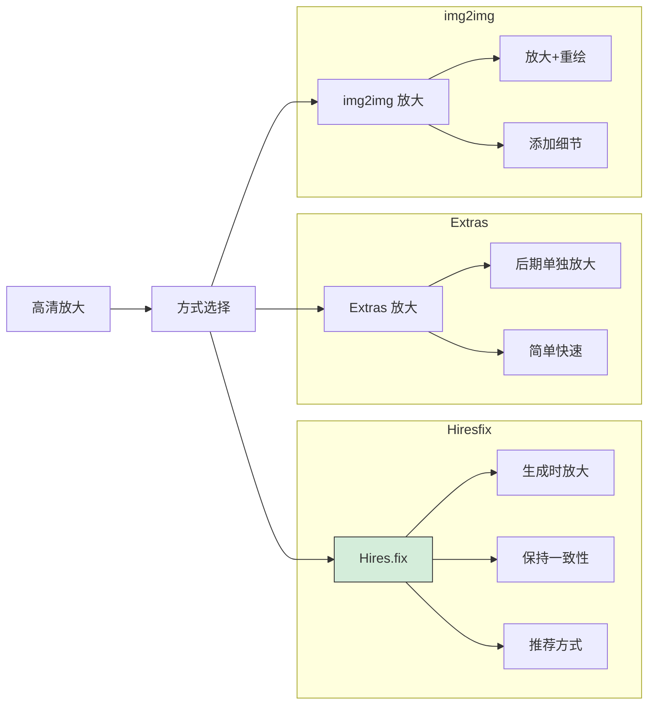
```mermaid
graph LR
    A[高清放大] --> B[方式选择]
    B --> C[Hires.fix]
    B --> D[Extras 放大]
    B --> E[img2img 放大]

    subgraph Hiresfix
        C --> C1[生成时放大]
        C --> C2[保持一致性]
        C --> C3[推荐方式]
    end

    subgraph Extras
        D --> D1[后期单独放大]
        D --> D2[简单快速]
    end

    subgraph img2img
        E --> E1[放大+重绘]
        E --> E2[添加细节]
    end

    style C fill:#d4edda,stroke:#333
```

#### Hires.fix 推荐设置

```
【标准设置】
Upscaler: Latent 或 R-ESRGAN 4x+
Hires steps: 15-20
Denoising strength: 0.4-0.5
Upscale by: 1.5-2.0

【写实图像】
Upscaler: 4x-UltraSharp
Hires steps: 20
Denoising strength: 0.4
Upscale by: 2.0

【二次元图像】
Upscaler: R-ESRGAN 4x+ Anime6B
Hires steps: 15
Denoising strength: 0.5
Upscale by: 2.0
```

### 5.2 局部修复（Inpaint）

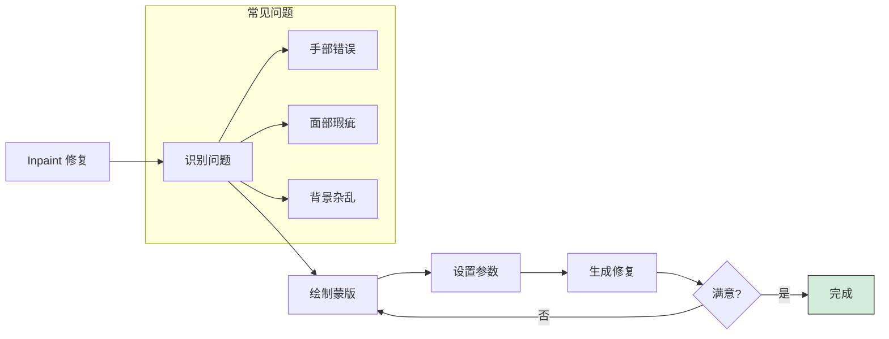
```mermaid
graph LR
    A[Inpaint 修复] --> B[识别问题]
    B --> C[绘制蒙版]
    C --> D[设置参数]
    D --> E[生成修复]
    E --> F{满意?}
    F -->|否| C
    F -->|是| G[完成]

    subgraph 常见问题
        B --> B1[手部错误]
        B --> B2[面部瑕疵]
        B --> B3[背景杂乱]
    end

    style G fill:#d4edda,stroke:#333
```

#### Inpaint 最佳设置

```
【手部修复】
Mask blur: 4-8
Masked content: Original
Inpaint area: Only masked
Only masked padding: 64
Denoising strength: 0.6-0.8
提示词: 添加 detailed hands, correct fingers

【面部修复】
Mask blur: 4
Masked content: Original
Inpaint area: Only masked
Only masked padding: 32
Denoising strength: 0.4-0.6
提示词: 添加 detailed face, beautiful eyes

【背景修复】
Mask blur: 8-12
Masked content: Latent noise
Inpaint area: Only masked
Denoising strength: 0.7-0.9
提示词: 描述期望的背景
```

### 5.3 面部修复

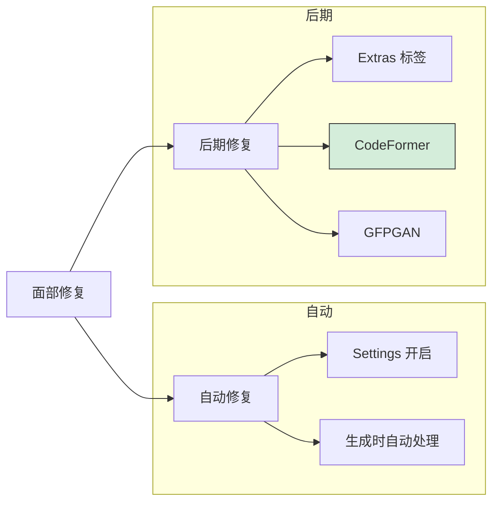
```mermaid
graph LR
    A[面部修复] --> B[自动修复]
    A --> C[后期修复]

    subgraph 自动
        B --> B1[Settings 开启]
        B --> B2[生成时自动处理]
    end

    subgraph 后期
        C --> C1[Extras 标签]
        C --> C2[CodeFormer]
        C --> C3[GFPGAN]
    end

    style C2 fill:#d4edda,stroke:#333
```

#### 面部修复参数

```
【CodeFormer】（推荐）
CodeFormer visibility: 0.5-0.8
CodeFormer weight: 0.5-0.7
效果：质量高，保真度可调

【GFPGAN】
GFPGAN visibility: 0.5-0.8
效果：速度快，效果稳定
```

## 6. 输出阶段

### 6.1 输出流程

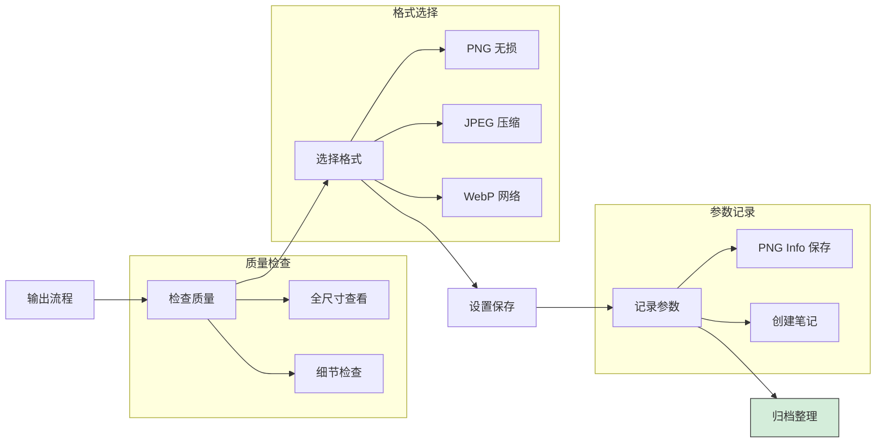
```mermaid
graph LR
    A[输出流程] --> B[检查质量]
    B --> C[选择格式]
    C --> D[设置保存]
    D --> E[记录参数]
    E --> F[归档整理]

    subgraph 质量检查
        B --> B1[全尺寸查看]
        B --> B2[细节检查]
    end

    subgraph 格式选择
        C --> C1[PNG 无损]
        C --> C2[JPEG 压缩]
        C --> C3[WebP 网络]
    end

    subgraph 参数记录
        E --> E1[PNG Info 保存]
        E --> E2[创建笔记]
    end

    style F fill:#d4edda,stroke:#333
```

### 6.2 输出格式选择

| 格式 | 特点 | 适用场景 | 文件大小 |
|------|------|----------|----------|
| **PNG** | 无损，保留元数据 | 存档、后期处理 | 大 |
| **JPEG** | 有损，体积小 | 分享、网络展示 | 小 |
| **WebP** | 现代格式，平衡 | 网站使用 | 中 |

### 6.3 参数记录模板

```
【作品信息】
名称：_______________
创作日期：___________
用途：_______________

【模型配置】
Checkpoint：_______________
VAE：_______________
LoRA：_______________
Embedding：_______________

【提示词】
Prompt：
_______________

Negative：
_______________

【生成参数】
采样器：_______________
步数：_______________
CFG：_______________
尺寸：_______________
Seed：_______________

【后处理】
Hires.fix：是/否
放大器：_______________
面部修复：是/否
其他：_______________

【备注】
_______________
```

## 7. 效率提升技巧

### 7.1 快捷操作

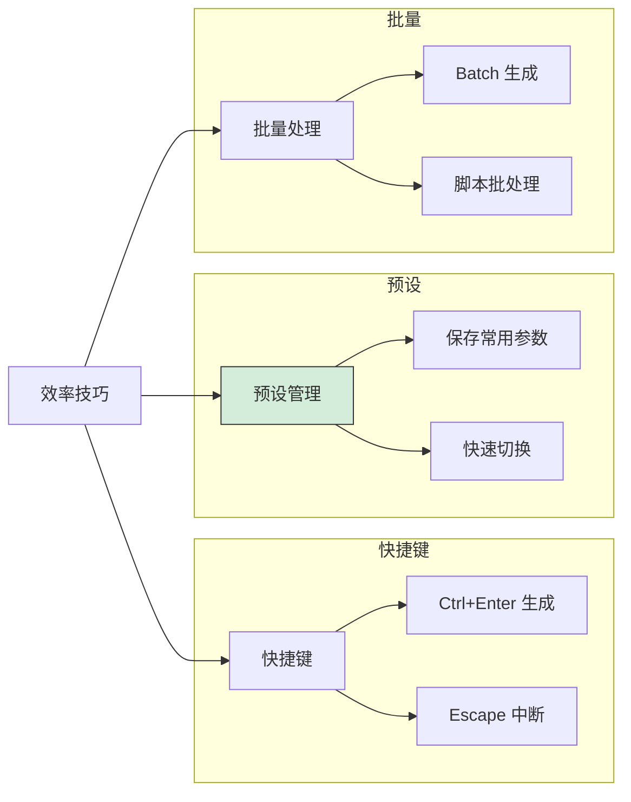
```mermaid
graph LR
    A[效率技巧] --> B[快捷键]
    A --> C[预设管理]
    A --> D[批量处理]

    subgraph 快捷键
        B --> B1[Ctrl+Enter 生成]
        B --> B2[Escape 中断]
    end

    subgraph 预设
        C --> C1[保存常用参数]
        C --> C2[快速切换]
    end

    subgraph 批量
        D --> D1[Batch 生成]
        D --> D2[脚本批处理]
    end

    style C fill:#d4edda,stroke:#333
```

### 7.2 工作空间组织

```
【文件夹结构建议】

AI_Art/
├── models/                 # 模型文件
│   ├── checkpoints/
│   ├── lora/
│   ├── vae/
│   └── embeddings/
│
├── outputs/               # 输出文件
│   ├── favorites/         # 精选作品
│   ├── projects/          # 按项目分类
│   │   ├── project_A/
│   │   └── project_B/
│   └── archive/           # 存档
│
├── references/            # 参考资料
│   ├── style/
│   ├── composition/
│   └── prompts/
│
└── presets/              # 预设配置
    ├── prompts.txt
    └── settings.json
```

### 7.3 提示词库管理

```
【提示词分类】

quality_prompts.txt
├── 基础质量词
├── 细节增强词
└── 风格定义词

character_prompts.txt
├── 面部特征
├── 发型发色
├── 服装类型
└── 姿态动作

scene_prompts.txt
├── 室内场景
├── 室外场景
├── 自然环境
└── 特殊场景

negative_prompts.txt
├── 通用负面
├── 人物专用
└── 场景专用
```

### 7.4 常用扩展推荐

| 扩展名 | 功能 | 效率提升 |
|--------|------|----------|
| **TagComplete** | 标签自动补全 | 提示词输入 |
| **Image Browser** | 图像浏览管理 | 作品查找 |
| **Civitai Helper** | 模型下载管理 | 模型获取 |
| **Dynamic Prompts** | 动态提示词 | 批量变化 |
| **Preset Manager** | 预设管理 | 参数切换 |
| **Aspect Ratio** | 比例选择器 | 尺寸设置 |

## 8. 创作心法

### 8.1 迭代思维

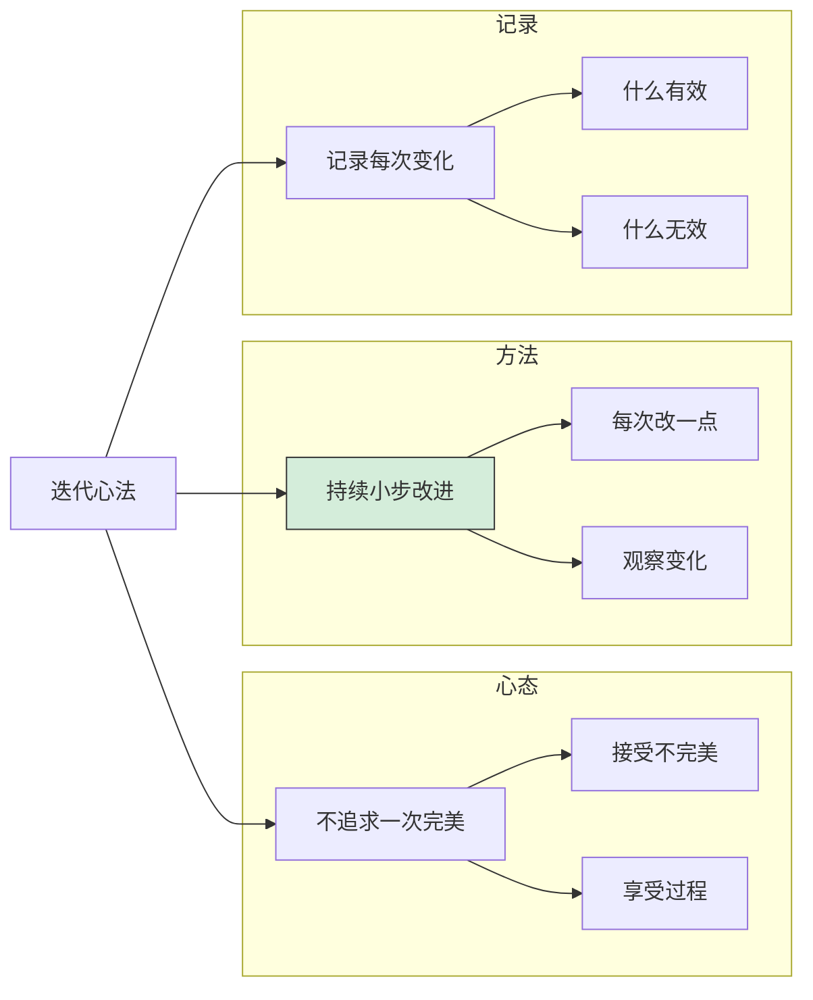
```mermaid
graph LR
    A[迭代心法] --> B[不追求一次完美]
    A --> C[持续小步改进]
    A --> D[记录每次变化]

    subgraph 心态
        B --> B1[接受不完美]
        B --> B2[享受过程]
    end

    subgraph 方法
        C --> C1[每次改一点]
        C --> C2[观察变化]
    end

    subgraph 记录
        D --> D1[什么有效]
        D --> D2[什么无效]
    end

    style C fill:#d4edda,stroke:#333
```

### 8.2 创作原则

```
【效率原则】
1. 先快后慢：探索阶段快速出图，优化阶段精细调整
2. 先广后深：先找方向，再深入优化
3. 及时止损：多次失败后换方向，不死磕

【质量原则】
1. 先整体后细节：构图满意再优化细节
2. 先生成后修复：生成为主，修复为辅
3. 适可而止：80%满意即可，追求100%效率低

【学习原则】
1. 多观察：看优秀作品，分析其特点
2. 多实验：尝试不同参数，理解其作用
3. 多记录：记录有效的方法和参数组合
```

### 8.3 常见误区

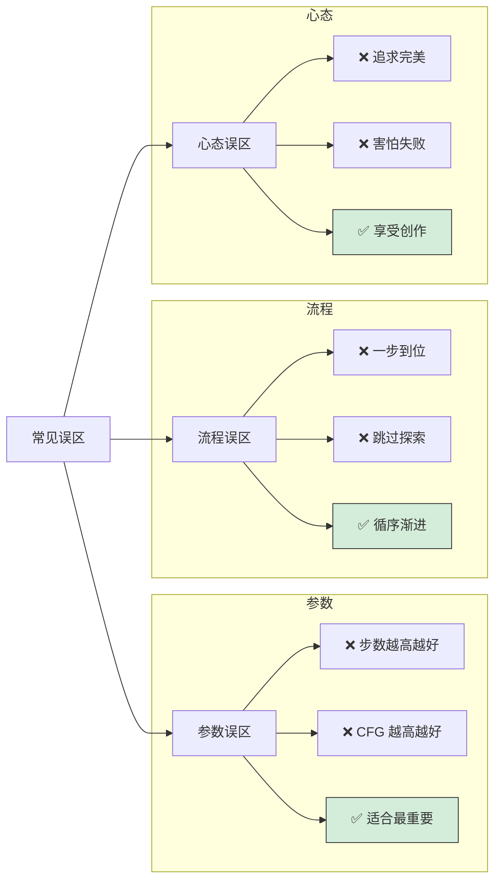
```mermaid
graph LR
    A[常见误区] --> B[参数误区]
    A --> C[流程误区]
    A --> D[心态误区]

    subgraph 参数
        B --> B1["❌ 步数越高越好"]
        B --> B2["❌ CFG 越高越好"]
        B --> B3["✅ 适合最重要"]
    end

    subgraph 流程
        C --> C1["❌ 一步到位"]
        C --> C2["❌ 跳过探索"]
        C --> C3["✅ 循序渐进"]
    end

    subgraph 心态
        D --> D1["❌ 追求完美"]
        D --> D2["❌ 害怕失败"]
        D --> D3["✅ 享受创作"]
    end

    style B3 fill:#d4edda,stroke:#333
    style C3 fill:#d4edda,stroke:#333
    style D3 fill:#d4edda,stroke:#333
```

## 9. 工作流程检查清单

### 9.1 完整流程检查

```
【构思阶段】
□ 明确创作目标
□ 收集参考资料
□ 确定风格方向

【准备阶段】
□ 选择合适模型
□ 配置 VAE
□ 准备提示词
□ 设置基础参数

【探索阶段】
□ 批量生成测试
□ 筛选候选图像
□ 确定优化方向

【优化阶段】
□ 固定满意的 Seed
□ 微调提示词
□ 调整参数
□ 确认最终版本

【精修阶段】
□ 高清放大（如需）
□ 局部修复（如需）
□ 面部修复（如需）

【输出阶段】
□ 质量检查
□ 选择格式保存
□ 记录参数
□ 归档整理
```

### 9.2 快速创作清单

```
【10分钟快速出图】
1. 选择熟悉的模型预设
2. 使用模板提示词，修改关键词
3. 快速参数：Steps 20, CFG 7
4. 批量生成 8 张
5. 选择最满意的 1-2 张
6. 简单放大输出

【30分钟精品出图】
1. 构思+参考收集（5分钟）
2. 模型选择+提示词（5分钟）
3. 批量探索+筛选（10分钟）
4. 固定Seed+优化（5分钟）
5. 高清放大+修复（5分钟）
```

## 总结

### 工作流程核心要点

```
1. 构思先行：明确目标再动手
2. 快速探索：批量生成找方向
3. 迭代优化：固定种子微调整
4. 精修输出：放大修复出成品
5. 记录积累：参数经验要保存
```

### 效率公式

```
高效创作 = 清晰目标 + 合适工具 + 正确方法 + 持续迭代

时间分配建议：
├── 构思准备：10-15%
├── 探索筛选：30-40%
├── 优化调整：30-40%
└── 精修输出：15-20%
```

---

> 💡 **提示**：工作流程因人而异，本文档提供的是框架和参考，你可以根据自己的习惯调整优化。

> 🎯 **核心**：效率的关键不是速度，而是减少无效尝试，让每次操作都有价值。

> 📈 **成长**：记录你的创作过程，定期回顾总结，你会发现自己的进步。
