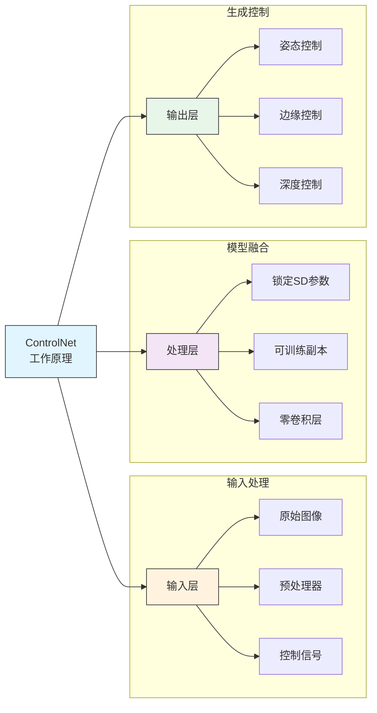
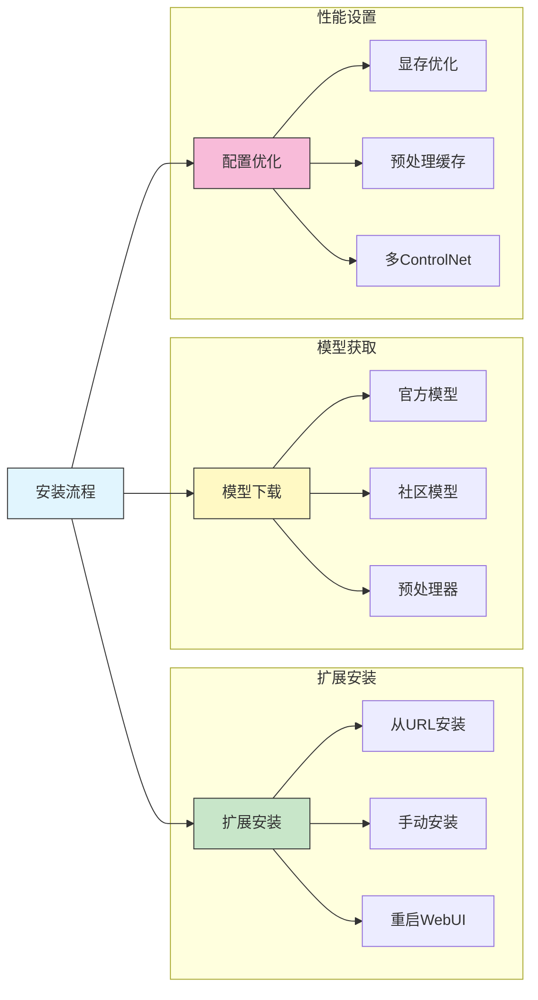
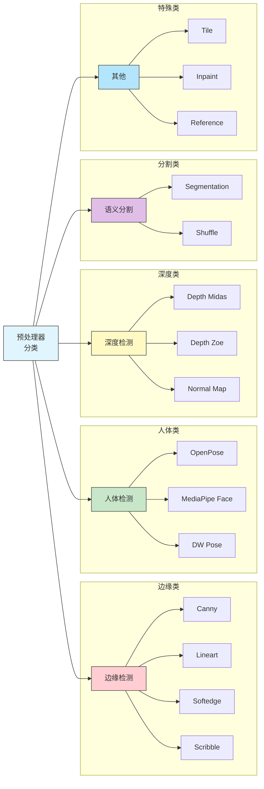
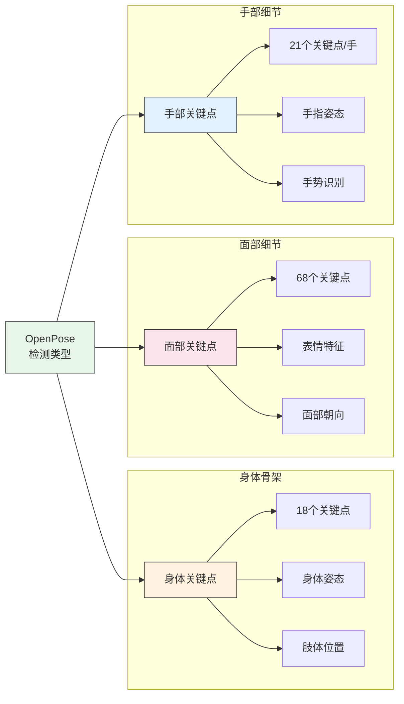
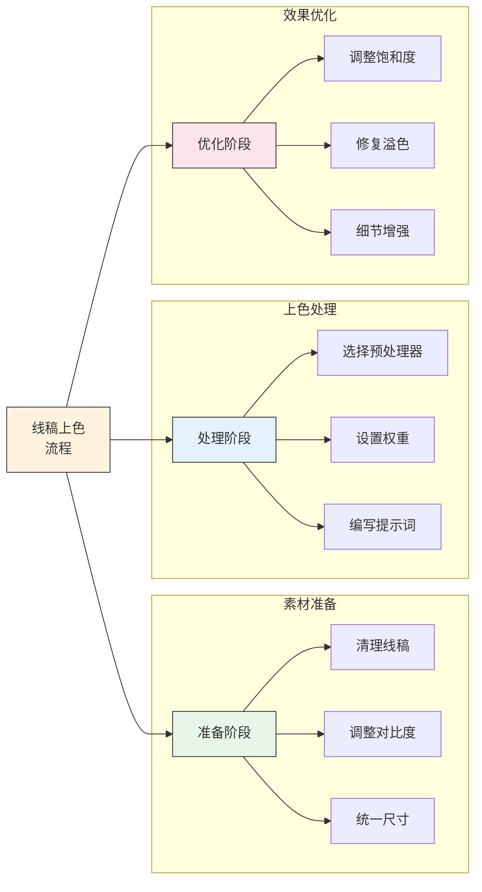
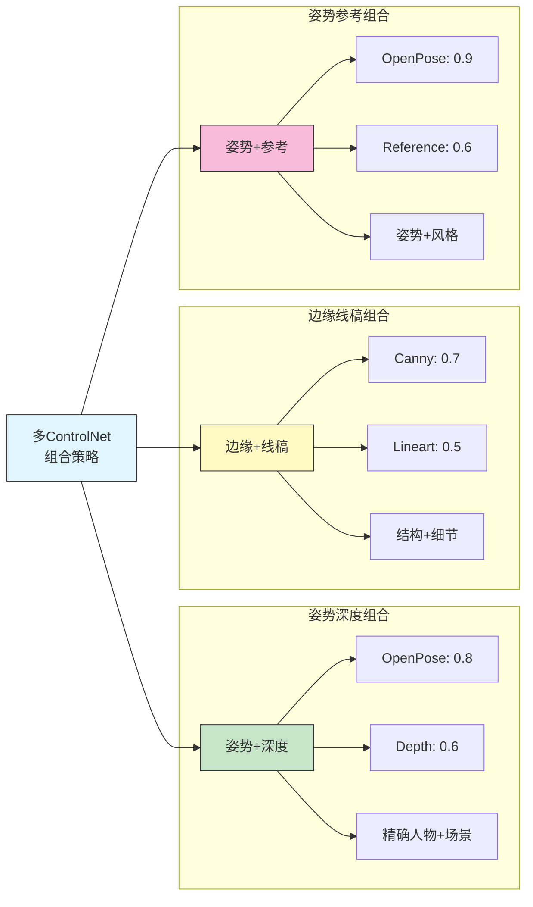
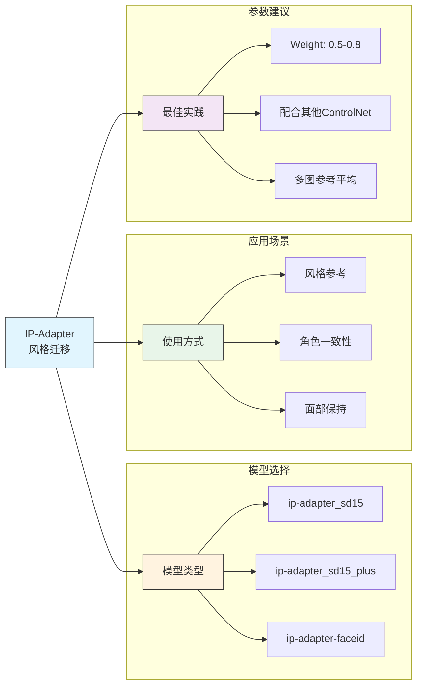
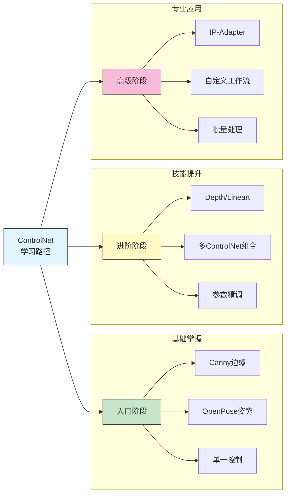

# ControlNet 入门与应用

## 📚 本章概述

ControlNet 是 Stable Diffusion 生态中最重要的控制工具之一，它能够精确控制生成图像的姿势、构图、边缘等特征。本章将全面介绍 ControlNet 的原理、安装配置以及各种预处理器的实际应用。

## 1. ControlNet 基础概念

### 1.1 什么是 ControlNet

ControlNet 是一种神经网络架构，通过添加额外的控制条件来引导 Stable Diffusion 的生成过程。



### 1.2 核心优势

| 优势 | 说明 | 应用场景 |
|------|------|----------|
| **精确控制** | 可以精确控制人物姿势、构图布局 | 商业摄影、角色设计 |
| **风格保持** | 在改变内容的同时保持艺术风格 | 风格迁移、二次创作 |
| **细节保留** | 保留原图关键特征和细节 | 图像修复、增强 |
| **多模态融合** | 支持多种控制条件组合使用 | 复杂场景生成 |
| **灵活权重** | 可调节控制强度实现自然过渡 | 创意探索、微调 |

### 1.3 ControlNet 与传统方法对比

| 特性 | 传统 img2img | ControlNet |
|------|-------------|------------|
| 控制精度 | 低，依赖降噪强度 | 高，精确到像素级 |
| 姿势控制 | 无法实现 | 完美支持 |
| 构图保持 | 部分保持 | 精确保持 |
| 多条件组合 | 不支持 | 支持多种组合 |
| 学习成本 | 低 | 中等 |

## 2. 安装与配置

### 2.1 安装 ControlNet 扩展



**方法一：从 URL 安装（推荐）**

1. 打开 WebUI → Extensions → Install from URL
2. 输入仓库地址：
```
https://github.com/Mikubill/sd-webui-controlnet
```
3. 点击 Install → 等待完成 → 重启 WebUI

**方法二：手动安装**

```bash
# 进入扩展目录
cd stable-diffusion-webui/extensions

# 克隆仓库
git clone https://github.com/Mikubill/sd-webui-controlnet

# 重启 WebUI
```

### 2.2 下载 ControlNet 模型

**模型存放路径：**
```
stable-diffusion-webui/
├── extensions/
│   └── sd-webui-controlnet/
└── models/
    └── ControlNet/          # ControlNet 模型存放位置
        ├── control_v11p_sd15_canny.pth
        ├── control_v11p_sd15_openpose.pth
        └── ...
```

**推荐下载模型：**

| 模型名称 | 文件大小 | 用途 | 优先级 |
|----------|----------|------|--------|
| canny | ~1.4GB | 边缘检测控制 | ⭐⭐⭐⭐⭐ |
| openpose | ~1.4GB | 人体姿势控制 | ⭐⭐⭐⭐⭐ |
| depth | ~1.4GB | 深度图控制 | ⭐⭐⭐⭐ |
| lineart | ~1.4GB | 线稿上色 | ⭐⭐⭐⭐ |
| scribble | ~1.4GB | 涂鸦转图 | ⭐⭐⭐ |
| softedge | ~1.4GB | 柔和边缘 | ⭐⭐⭐ |
| tile | ~1.4GB | 细节增强 | ⭐⭐⭐⭐ |
| ip-adapter | ~50MB | 风格迁移 | ⭐⭐⭐⭐⭐ |

**下载地址：**
- HuggingFace: https://huggingface.co/lllyasviel/ControlNet-v1-1
- 国内镜像: https://hf-mirror.com/lllyasviel/ControlNet-v1-1

### 2.3 显存优化配置

```python
# 在 webui-user.bat 或启动脚本中添加

# 低显存优化（6GB以下）
set COMMANDLINE_ARGS=--medvram --xformers

# 极低显存（4GB）
set COMMANDLINE_ARGS=--lowvram --xformers

# 多 ControlNet 设置（Settings → ControlNet）
# Multi ControlNet: Max models amount = 3
```

**显存占用参考：**

| 配置 | 单个 ControlNet | 双 ControlNet | 三 ControlNet |
|------|----------------|---------------|---------------|
| 512×512 | +1.5GB | +2.5GB | +3.5GB |
| 768×768 | +2.5GB | +4GB | +5.5GB |
| 1024×1024 | +4GB | +6GB | +8GB |

## 3. 预处理器详解

### 3.1 预处理器分类



### 3.2 Canny 边缘检测

**原理说明：**
Canny 边缘检测器通过多阶段算法检测图像中的边缘，输出二值边缘图。

**参数设置：**

| 参数 | 推荐值 | 说明 |
|------|--------|------|
| Low Threshold | 100 | 边缘检测低阈值 |
| High Threshold | 200 | 边缘检测高阈值 |
| Control Weight | 1.0 | 控制强度 |
| Starting Step | 0 | 开始控制的步数 |
| Ending Step | 1.0 | 结束控制的步数比例 |

**使用场景：**
- ✅ 建筑物转绘
- ✅ 机械/产品设计
- ✅ Logo/图标转绘
- ✅ 线稿上色
- ❌ 人像（边缘过硬）

**最佳实践：**
```
正向提示词：masterpiece, best quality, [描述内容]
负向提示词：lowres, bad anatomy, worst quality

参数建议：
- Sampling: DPM++ 2M Karras
- Steps: 25-30
- CFG: 7-9
- Control Weight: 0.8-1.0
```

### 3.3 OpenPose 姿势检测

**检测内容：**



**预处理器选项：**

| 预处理器 | 检测内容 | 精度 | 速度 |
|----------|----------|------|------|
| openpose | 身体 | 中 | 快 |
| openpose_face | 身体+面部 | 高 | 中 |
| openpose_hand | 身体+手部 | 高 | 中 |
| openpose_full | 全部 | 最高 | 慢 |
| dw_openpose_full | 全部（改进版） | 最高 | 中 |

**使用技巧：**

1. **单人场景**：使用 `openpose_full` 获取最佳效果
2. **多人场景**：先检测再手动调整遮挡部分
3. **手部问题**：配合手部修复LoRA使用
4. **面部朝向**：确保面部清晰可见

### 3.4 Depth 深度检测

**深度检测器对比：**

| 检测器 | 精度 | 速度 | 适用场景 |
|--------|------|------|----------|
| depth_midas | 高 | 中 | 通用场景 |
| depth_zoe | 最高 | 慢 | 室内场景 |
| depth_leres | 高 | 慢 | 远景场景 |
| depth_leres++ | 最高 | 最慢 | 高精度需求 |

**应用场景：**
- 🏞️ 景深控制
- 🏠 室内设计
- 🎮 游戏场景
- 📸 前后景分离

### 3.5 Lineart 线稿处理

**线稿预处理器对比：**

| 预处理器 | 线条风格 | 适用内容 |
|----------|----------|----------|
| lineart_realistic | 写实细腻 | 人像、风景 |
| lineart_coarse | 粗犷有力 | 漫画、插画 |
| lineart_anime | 动漫风格 | 二次元角色 |
| lineart_anime_denoise | 去噪动漫 | 低质量线稿 |

**线稿上色流程：**



### 3.6 Tile 细节增强

**Tile 模型特点：**
- 放大图像同时增强细节
- 保持原图整体风格
- 修复模糊区域
- 添加合理纹理

**使用场景：**
| 场景 | 设置建议 |
|------|----------|
| 图像放大 | Weight: 0.5-0.7, Denoise: 0.3-0.5 |
| 细节增强 | Weight: 0.8-1.0, Denoise: 0.2-0.4 |
| 风格统一 | Weight: 0.6-0.8, Denoise: 0.4-0.6 |

### 3.7 Reference 参考控制

**Reference 模式：**

| 模式 | 效果 | 适用场景 |
|------|------|----------|
| reference_only | 仅参考风格 | 风格迁移 |
| reference_adain | 自适应风格 | 色调统一 |
| reference_adain+attn | 综合参考 | 角色一致性 |

## 4. 实战应用案例

### 4.1 人物姿势控制

**案例：根据参考图生成特定姿势人物**

```
输入：带有特定姿势的参考图
目标：生成相同姿势的不同风格人物

ControlNet 设置：
├── 预处理器: dw_openpose_full
├── 模型: control_v11p_sd15_openpose
├── Control Weight: 0.9
├── Starting Step: 0
└── Ending Step: 1

提示词：
正向: masterpiece, best quality, 1girl, beautiful face,
      detailed eyes, flowing dress, standing pose
负向: bad anatomy, wrong fingers, extra limbs,
      deformed, ugly, blurry
```

### 4.2 建筑转绘

**案例：将照片转换为插画风格**

```
输入：建筑物照片
目标：转换为动漫/插画风格

ControlNet 设置：
├── 预处理器: canny (Threshold: 100-200)
├── 模型: control_v11p_sd15_canny
├── Control Weight: 0.8
├── Starting Step: 0
└── Ending Step: 0.8

提示词：
正向: anime style, detailed background,
      beautiful architecture, makoto shinkai style,
      blue sky, clouds
负向: realistic, photo, ugly, low quality
```

### 4.3 线稿上色

**案例：黑白线稿自动上色**

```
输入：动漫人物线稿
目标：高质量彩色插画

ControlNet 设置：
├── 预处理器: lineart_anime
├── 模型: control_v11p_sd15_lineart
├── Control Weight: 1.0
├── Starting Step: 0
└── Ending Step: 1

提示词：
正向: masterpiece, best quality, anime coloring,
      vibrant colors, detailed shading,
      [角色描述], [颜色描述]
负向: grayscale, monochrome, sketch,
      bad coloring, flat colors
```

### 4.4 多 ControlNet 组合

**案例：姿势+深度双重控制**



**组合设置示例：**

```
ControlNet Unit 0:
├── 预处理器: dw_openpose_full
├── 模型: openpose
├── Weight: 0.85
└── 作用: 控制人物姿势

ControlNet Unit 1:
├── 预处理器: depth_midas
├── 模型: depth
├── Weight: 0.6
└── 作用: 控制空间深度

总体参数：
├── CFG Scale: 7
├── Steps: 30
└── Sampler: DPM++ 2M Karras
```

## 5. 参数调优指南

### 5.1 Control Weight 影响

| Weight 值 | 效果 | 适用情况 |
|-----------|------|----------|
| 0.3-0.5 | 轻度参考 | 创意自由度高 |
| 0.6-0.8 | 平衡控制 | 日常使用推荐 |
| 0.9-1.0 | 严格遵循 | 精确复制需求 |
| 1.2+ | 过度控制 | 可能产生伪影 |

### 5.2 Starting/Ending Step

```
控制时机调整：

早期控制 (0-0.5)：
├── 影响整体构图和布局
├── 对大体轮廓影响大
└── 推荐用于姿势控制

中期控制 (0.3-0.7)：
├── 平衡结构与细节
├── 适合大多数场景
└── 默认推荐设置

后期控制 (0.5-1.0)：
├── 主要影响细节
├── 对整体影响小
└── 推荐用于细节增强
```

### 5.3 常见问题解决

| 问题 | 原因 | 解决方案 |
|------|------|----------|
| 控制效果弱 | Weight 过低 | 提高到 0.8-1.0 |
| 图像失真 | Weight 过高 | 降低到 0.6-0.8 |
| 边缘伪影 | 预处理质量差 | 调整预处理参数 |
| 姿势不准 | 遮挡或复杂姿势 | 手动编辑骨架 |
| 显存不足 | 模型过多 | 启用 lowvram 模式 |

## 6. 高级技巧

### 6.1 ControlNet 蒙版

```
蒙版应用场景：
├── 局部控制（只控制人物，不控制背景）
├── 区域混合（不同区域使用不同控制）
└── 精细修复（仅修复特定区域）

蒙版设置：
1. 在 ControlNet 面板启用蒙版
2. 上传或绘制蒙版（白色=生效区域）
3. 调整羽化值实现自然过渡
```

### 6.2 Preprocessor 参数微调

**Canny 参数优化：**
```
低阈值 (Low Threshold)：
├── 低值 (50-80): 检测更多细节边缘
├── 中值 (100-150): 平衡效果
└── 高值 (150-200): 只保留主要边缘

高阈值 (High Threshold)：
├── 与低阈值差距小: 边缘更清晰但可能断裂
└── 与低阈值差距大: 边缘连续但可能有噪点
```

### 6.3 IP-Adapter 风格迁移



## 7. 工作流程模板

### 7.1 人物创作流程

```
1. 准备阶段
   ├── 收集参考姿势图
   ├── 确定画面风格
   └── 准备角色描述提示词

2. ControlNet 配置
   ├── 启用 OpenPose
   ├── 上传参考图并预处理
   ├── 设置 Weight: 0.85
   └── 可选：添加 Reference 控制风格

3. 生成参数
   ├── Sampler: DPM++ 2M Karras
   ├── Steps: 25-30
   ├── CFG: 7-8
   └── 尺寸: 512x768 或 768x1024

4. 迭代优化
   ├── 生成多张选择最佳
   ├── 调整 Weight 微调效果
   └── 使用 img2img 局部修复
```

### 7.2 建筑/场景转绘流程

```
1. 素材准备
   ├── 选择清晰的建筑照片
   ├── 调整对比度和亮度
   └── 确定目标风格

2. ControlNet 配置
   ├── 主控制: Canny (Weight: 0.8)
   ├── 辅助: Depth (Weight: 0.5)
   └── 调整 Canny 阈值突出建筑轮廓

3. 风格提示词
   ├── 明确艺术风格（如 Ghibli、新海诚）
   ├── 添加氛围描述（光线、天气）
   └── 排除不需要的元素

4. 后期处理
   ├── 使用 Tile 放大并增强细节
   ├── 调整色彩饱和度
   └── 添加额外特效
```

## 8. 总结与建议

### 8.1 ControlNet 选择速查表

| 需求 | 推荐方案 | 备选方案 |
|------|----------|----------|
| 控制人物姿势 | OpenPose | DW Pose |
| 保持构图结构 | Canny | Lineart |
| 控制空间深度 | Depth | Normal |
| 线稿上色 | Lineart | Scribble |
| 风格迁移 | Reference/IP-Adapter | Shuffle |
| 图像放大增强 | Tile | - |
| 局部重绘 | Inpaint | - |

### 8.2 学习路径建议



---

**本章要点回顾：**
- ControlNet 是精确控制 SD 生成的核心工具
- 不同预处理器适用于不同场景
- 合理组合多个 ControlNet 可实现复杂效果
- 参数调优是获得理想效果的关键
- 建立标准化工作流程提高效率

**下一章预告：** LoRA 模型使用 - 学习如何使用和叠加 LoRA 实现风格定制
