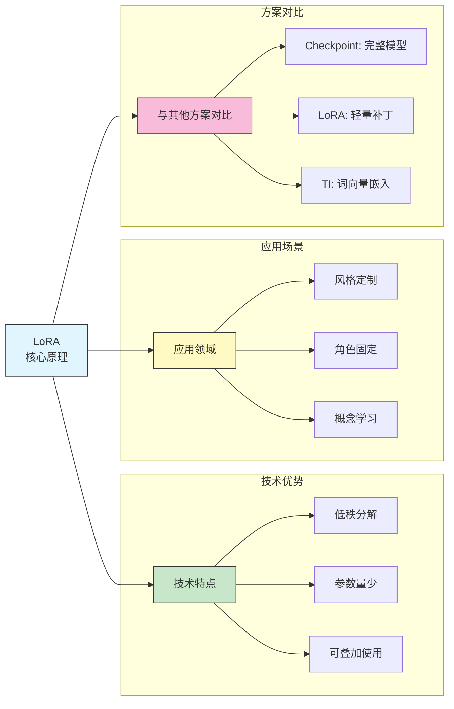
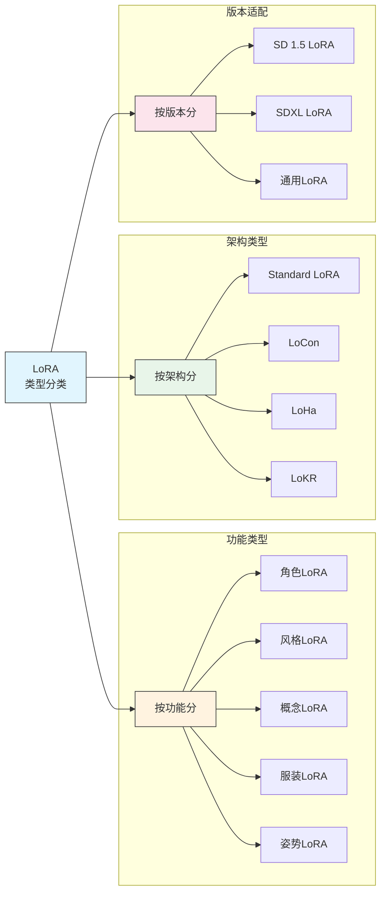
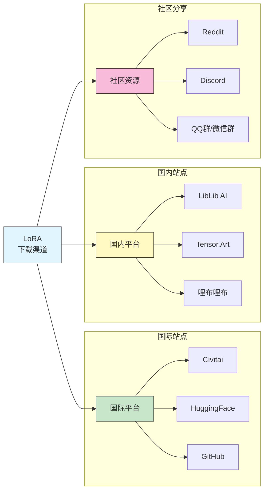
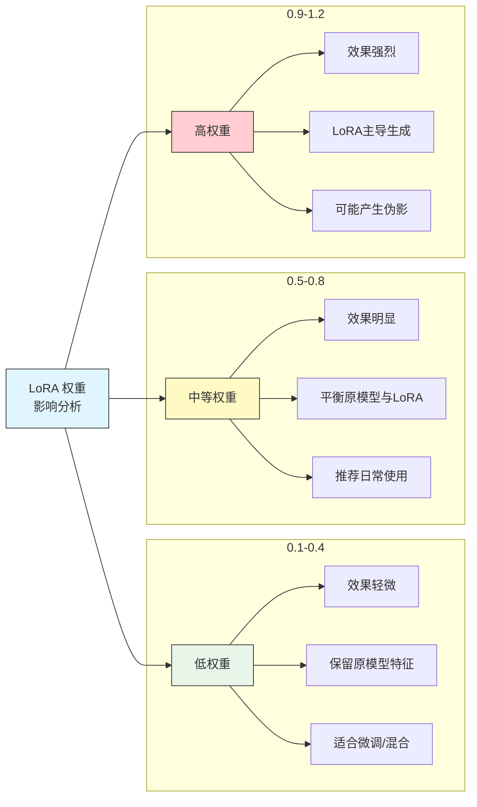
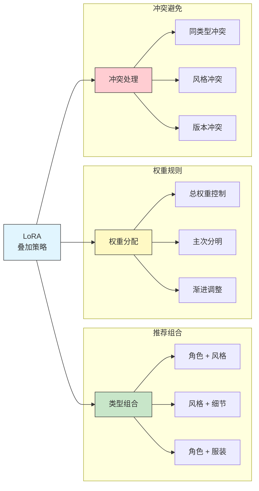
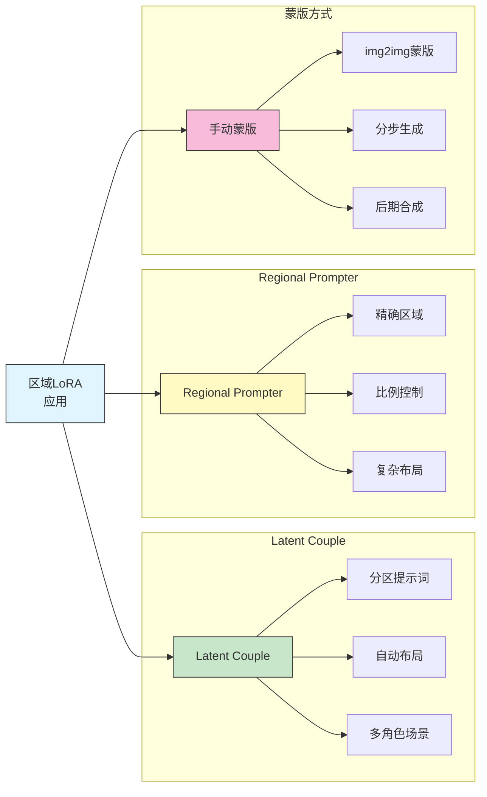
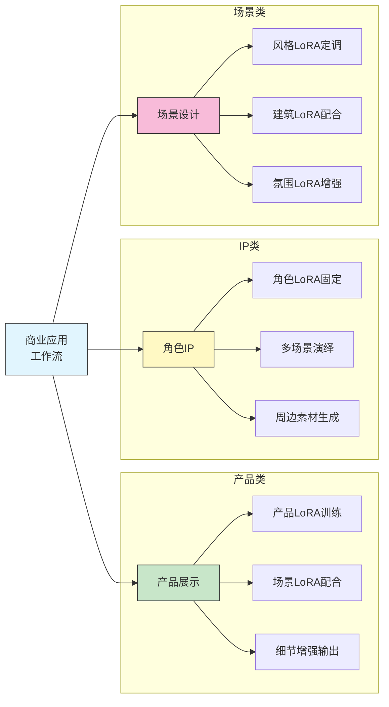
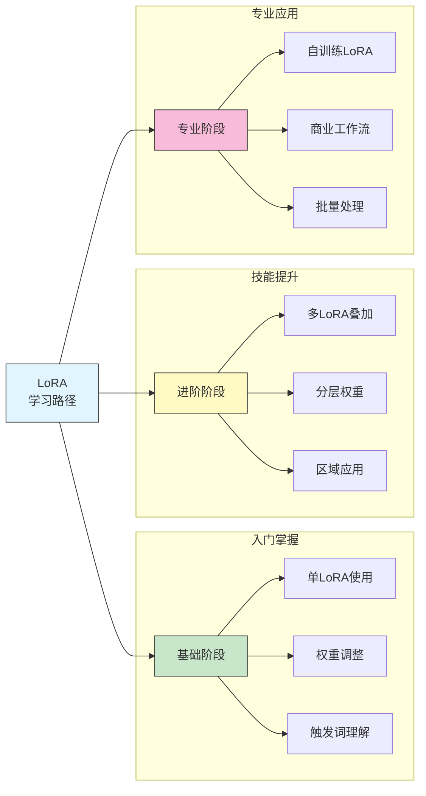

# LoRA 模型使用

## 📚 本章概述

LoRA（Low-Rank Adaptation）是一种轻量级模型微调技术，可以在不修改原模型的情况下添加特定风格、角色或概念。本章将详细介绍 LoRA 的原理、使用方法、叠加技巧以及最佳实践。

## 1. LoRA 基础概念

### 1.1 什么是 LoRA



**LoRA 工作原理：**

LoRA 通过在原始模型的权重矩阵旁添加两个小矩阵（低秩矩阵）来实现微调：
- 原始权重矩阵 W 不变
- 添加 ΔW = A × B（两个小矩阵的乘积）
- 最终输出 = W + α × ΔW

### 1.2 LoRA 与其他微调方案对比

| 方案 | 文件大小 | 训练成本 | 灵活性 | 效果 |
|------|----------|----------|--------|------|
| **Fine-tune Checkpoint** | 2-7GB | 高 | 低 | 最好 |
| **LoRA** | 10-200MB | 中 | 高 | 很好 |
| **LyCORIS/LoHa** | 20-300MB | 中 | 高 | 很好 |
| **Textual Inversion** | 10-100KB | 低 | 中 | 一般 |
| **Hypernetwork** | 10-200MB | 中 | 中 | 一般 |

### 1.3 LoRA 类型详解



**各类型 LoRA 详解：**

| 类型 | 说明 | 典型大小 | 使用场景 |
|------|------|----------|----------|
| **角色 LoRA** | 固定特定角色外观 | 50-150MB | 保持角色一致性 |
| **风格 LoRA** | 特定画师/艺术风格 | 20-100MB | 风格迁移 |
| **概念 LoRA** | 新物品/场景概念 | 30-100MB | 生成特定物品 |
| **服装 LoRA** | 特定服装款式 | 30-80MB | 服装设计 |
| **姿势 LoRA** | 特定姿势/动作 | 20-60MB | 控制人物动态 |
| **细节 LoRA** | 增强细节（手、脚） | 20-50MB | 修复生成缺陷 |

## 2. LoRA 下载与安装

### 2.1 主要下载平台



**平台对比：**

| 平台 | 资源量 | 访问速度 | 质量把控 | 推荐指数 |
|------|--------|----------|----------|----------|
| Civitai | 最多 | 需魔法 | 社区评分 | ⭐⭐⭐⭐⭐ |
| HuggingFace | 很多 | 需魔法 | 官方认证 | ⭐⭐⭐⭐ |
| LibLib AI | 多 | 快 | 社区审核 | ⭐⭐⭐⭐⭐ |
| Tensor.Art | 较多 | 快 | 平台审核 | ⭐⭐⭐⭐ |

### 2.2 LoRA 安装位置

**标准目录结构：**

```
stable-diffusion-webui/
├── models/
│   └── Lora/                    # LoRA 模型目录
│       ├── character/           # 建议按类型分类
│       │   ├── anime_girl_v1.safetensors
│       │   └── realistic_man.safetensors
│       ├── style/
│       │   ├── ghibli_style.safetensors
│       │   └── watercolor.safetensors
│       ├── concept/
│       │   └── cyberpunk_city.safetensors
│       └── detail/
│           └── better_hands.safetensors
```

### 2.3 下载注意事项

**下载前检查清单：**

```
□ 确认 LoRA 适用的基础模型版本（SD1.5 / SDXL）
□ 查看示例图片和提示词
□ 阅读作者说明，了解推荐权重
□ 检查触发词（Trigger Words）
□ 确认文件格式（.safetensors 优先）
□ 下载配套的预览图（可选）
```

## 3. LoRA 基本使用

### 3.1 触发方式

**在提示词中触发 LoRA：**

```
基本语法：
<lora:模型名称:权重>

示例：
<lora:anime_style:0.8>
<lora:character_name:0.7>
<lora:better_hands:0.5>
```

**使用 WebUI 界面：**

1. 点击 "🎴" 按钮打开额外网络面板
2. 切换到 "Lora" 标签页
3. 点击想要使用的 LoRA 卡片
4. LoRA 触发代码自动添加到提示词

### 3.2 权重参数详解



**权重调整指南：**

| 权重范围 | 效果强度 | 使用建议 | 注意事项 |
|----------|----------|----------|----------|
| 0.1-0.3 | 轻微 | 风格微调、多LoRA混合 | 效果可能不明显 |
| 0.4-0.6 | 中等 | 初次尝试、安全范围 | 推荐起始值 |
| 0.7-0.8 | 较强 | 大多数场景最佳 | 日常推荐 |
| 0.9-1.0 | 强烈 | 需要完整效果时 | 注意检查质量 |
| 1.1-1.5 | 过度 | 特殊需求 | 可能产生伪影 |

### 3.3 配合触发词使用

**触发词的重要性：**

```
许多 LoRA 需要特定触发词才能正确激活效果

示例（角色 LoRA）：
提示词: masterpiece, best quality, 1girl, nahida,
        <lora:nahida_v1:0.75>

触发词: nahida（必须包含）

示例（风格 LoRA）：
提示词: ghibli style, landscape, mountains,
        <lora:ghibli_style:0.7>

触发词: ghibli style（必须包含）
```

**触发词查找方法：**
1. 下载页面的作者说明
2. 配套的 `.txt` 或 `.yaml` 文件
3. 预览图下方的提示词示例
4. 评论区用户反馈

## 4. LoRA 叠加技巧

### 4.1 多 LoRA 组合



**多 LoRA 示例：**

```
场景: 使用特定角色 + 艺术风格 + 细节增强

提示词:
masterpiece, best quality,
1girl, long hair, school uniform, smile,
<lora:character_alice:0.7>     # 角色
<lora:anime_watercolor:0.5>    # 风格
<lora:detail_enhancer:0.3>     # 细节

权重分配原则:
├── 主要效果 LoRA: 0.6-0.8
├── 辅助效果 LoRA: 0.4-0.6
└── 细节/修复 LoRA: 0.2-0.4

总权重参考: 建议不超过 1.5-2.0
```

### 4.2 LoRA 组合配方

**经典组合方案：**

| 组合类型 | LoRA 配置 | 效果描述 |
|----------|-----------|----------|
| **人像完美** | 角色0.7 + 面部修复0.4 + 手部修复0.5 | 高质量人像 |
| **风格统一** | 主风格0.8 + 氛围0.3 | 统一画面风格 |
| **角色换装** | 角色0.8 + 服装0.6 | 保持角色换服装 |
| **场景增强** | 场景0.6 + 细节0.4 + 光影0.3 | 丰富场景细节 |
| **概念融合** | 概念A 0.5 + 概念B 0.5 | 创新概念混合 |

### 4.3 权重计算工具

**X/Y/Z Plot 测试最佳权重：**

```
使用 X/Y/Z Plot 功能批量测试

设置示例:
├── X type: Prompt S/R
├── X values: <lora:test:0.3>,<lora:test:0.5>,<lora:test:0.7>,<lora:test:0.9>
├── Y type: Prompt S/R
└── Y values: 其他变量...

结果: 生成权重对比矩阵图
```

### 4.4 冲突排查

**常见冲突类型：**

| 冲突类型 | 症状 | 解决方案 |
|----------|------|----------|
| 风格冲突 | 画面混乱、风格不统一 | 降低其中一个权重 |
| 角色冲突 | 特征混合、五官变形 | 只用一个角色LoRA |
| 版本冲突 | 色彩异常、结构错误 | 确认LoRA版本匹配 |
| 权重过高 | 伪影、过度饱和 | 降低总权重 |

## 5. 进阶使用技巧

### 5.1 分层权重控制

**LyCORIS 分层语法：**

```
使用分层权重精细控制 LoRA 对不同网络层的影响

基本语法:
<lora:模型名:权重:层级权重>

层级对应:
├── BASE: 基础层（整体风格）
├── IN01-IN11: 输入层（细节特征）
├── MID: 中间层（结构）
└── OUT00-OUT11: 输出层（最终效果）

示例:
<lora:style_lora:0.8:0.5,0.5,0.5,0.5,0.8,0.8,0.8,0.8,0.8,0.8,0.8,0.8,1,1,1,1,1,1,1,1,1,1,1,1,1>
```

### 5.2 区域 LoRA

**在不同区域使用不同 LoRA：**



### 5.3 LoRA Block Weight 扩展

**安装与使用：**

```
扩展名: sd-webui-lora-block-weight

功能:
├── 可视化调整各层权重
├── 预设配置快速切换
├── 实时预览效果变化
└── 保存自定义配置

常用预设:
├── ALL: 1,1,1,1,1,1,1,1,1,1,1,1,1,1,1,1,1
├── INS: 1,1,1,1,0,0,0,0,0,0,0,0,0,0,0,0,0
├── OUTS: 0,0,0,0,0,0,0,0,0,0,0,0,1,1,1,1,1
├── MID: 0,0,0,0,1,1,1,1,1,1,1,1,0,0,0,0,0
└── CUSTOM: 自定义组合
```

### 5.4 LoRA 与 ControlNet 配合

```
组合策略:

1. 角色 LoRA + OpenPose
   └── 固定角色外观 + 控制姿势

2. 风格 LoRA + Canny
   └── 风格迁移 + 保持结构

3. 细节 LoRA + Tile
   └── 放大增强 + 细节修复

示例提示词:
masterpiece, character_name,
<lora:character:0.75>
<lora:detail_fix:0.4>

ControlNet:
├── OpenPose: Weight 0.85
└── 参考图: 目标姿势图片
```

## 6. 常用 LoRA 推荐

### 6.1 细节修复类

| LoRA 名称 | 功能 | 推荐权重 | 备注 |
|-----------|------|----------|------|
| **Detail Tweaker** | 通用细节增强 | 0.3-0.5 | 全场景适用 |
| **Better Hands** | 手部修复 | 0.4-0.6 | 必备LoRA |
| **Eye Detail** | 眼部增强 | 0.3-0.5 | 写实人像 |
| **Skin Texture** | 皮肤纹理 | 0.2-0.4 | 写实风格 |

### 6.2 风格类

| LoRA 名称 | 风格类型 | 推荐权重 | 特点 |
|-----------|----------|----------|------|
| **Flat Color** | 平涂风格 | 0.6-0.8 | 清新简洁 |
| **Watercolor** | 水彩风格 | 0.5-0.7 | 柔和自然 |
| **Pixel Art** | 像素风格 | 0.7-1.0 | 复古游戏风 |
| **Ghibli Style** | 吉卜力风格 | 0.6-0.8 | 温馨治愈 |
| **Oil Painting** | 油画风格 | 0.5-0.7 | 艺术质感 |

### 6.3 概念增强类

| LoRA 名称 | 概念类型 | 推荐权重 | 用途 |
|-----------|----------|----------|------|
| **Cyberpunk** | 赛博朋克 | 0.5-0.7 | 科幻场景 |
| **Fantasy** | 奇幻风格 | 0.5-0.7 | 魔幻题材 |
| **Victorian** | 维多利亚 | 0.5-0.7 | 复古题材 |

## 7. 实战案例

### 7.1 角色一致性创作

```
目标: 使用角色 LoRA 创建系列插画

Step 1: 选择角色 LoRA
├── 确认触发词
├── 测试推荐权重
└── 熟悉角色特征

Step 2: 基础设置
├── Checkpoint: 匹配的基础模型
├── LoRA: <lora:character:0.75>
├── 触发词: character_name
└── VAE: 匹配的VAE

Step 3: 场景变换
├── 场景1: "standing in classroom"
├── 场景2: "sitting in cafe"
├── 场景3: "walking in park"
└── 保持 LoRA 设置不变

Step 4: 质量控制
├── 固定 Seed 基础值
├── 批量生成选优
└── 局部 img2img 修复
```

### 7.2 风格融合实验

```
目标: 融合多种风格创造独特画风

基础配置:
├── Checkpoint: 通用型底模
├── 主风格 LoRA: 0.5
├── 辅助风格 LoRA: 0.3
└── 细节 LoRA: 0.2

实验变量:
├── 主风格权重: 0.4 → 0.6 → 0.8
├── 辅助风格权重: 0.2 → 0.3 → 0.4
└── 观察融合效果

记录最佳配比:
├── A风格 0.55 + B风格 0.35 = 理想效果
└── 保存为工作流模板
```

### 7.3 商业应用案例



## 8. 常见问题解答

### 8.1 问题诊断表

| 问题现象 | 可能原因 | 解决方案 |
|----------|----------|----------|
| LoRA 无效果 | 缺少触发词 | 添加正确触发词 |
| 画面变形 | 权重过高 | 降低权重至0.5-0.7 |
| 颜色异常 | 版本不匹配 | 确认SD版本兼容 |
| 风格不稳定 | 多LoRA冲突 | 减少LoRA数量 |
| 出现伪影 | 总权重过高 | 降低各LoRA权重 |
| 面部崩坏 | 细节控制不足 | 添加面部修复LoRA |
| 加载失败 | 文件损坏/路径错误 | 重新下载/检查路径 |

### 8.2 优化建议

```
性能优化:
├── 使用 .safetensors 格式
├── 限制同时加载的 LoRA 数量 (≤3)
├── 定期清理不用的 LoRA
└── 使用 LoRA 管理扩展

质量优化:
├── 测试找到最佳权重
├── 配合合适的 Checkpoint
├── 使用正确的触发词
└── 避免风格冲突的 LoRA 组合
```

## 9. 总结与速查表

### 9.1 LoRA 使用速查

| 使用阶段 | 关键操作 | 注意事项 |
|----------|----------|----------|
| **选择** | 确认版本兼容 | SD1.5/SDXL 不通用 |
| **下载** | 查看触发词和示例 | 保存配套信息 |
| **安装** | 放入正确目录 | 建议分类存放 |
| **使用** | 添加触发代码 | 包含触发词 |
| **调参** | 从0.5开始测试 | 逐步调整 |
| **叠加** | 控制总权重 | ≤1.5-2.0 |

### 9.2 推荐权重参考表

| LoRA 类型 | 单独使用 | 组合使用 |
|-----------|----------|----------|
| 角色 LoRA | 0.7-0.9 | 0.6-0.8 |
| 风格 LoRA | 0.6-0.8 | 0.4-0.6 |
| 细节 LoRA | 0.3-0.5 | 0.2-0.4 |
| 概念 LoRA | 0.5-0.7 | 0.4-0.5 |
| 服装 LoRA | 0.6-0.8 | 0.5-0.7 |

### 9.3 学习路径



---

**本章要点回顾：**
- LoRA 是轻量级模型微调的首选方案
- 触发词是激活 LoRA 效果的关键
- 权重控制直接影响生成效果
- 多 LoRA 叠加需要合理分配权重
- 版本兼容性是选择 LoRA 的重要因素

**下一章预告：** 图生图工作流 - 掌握 img2img 的完整工作流程和技巧
