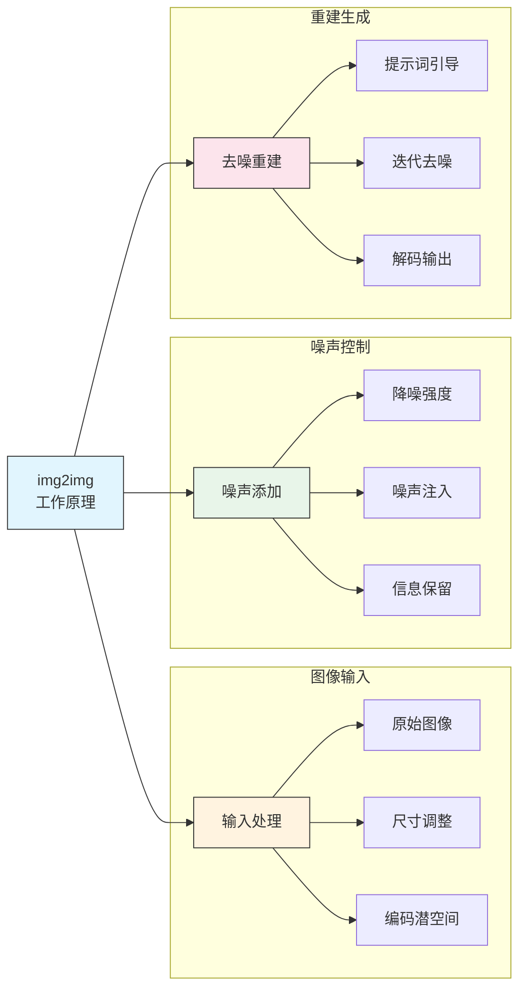
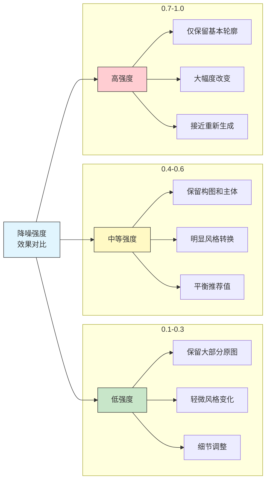
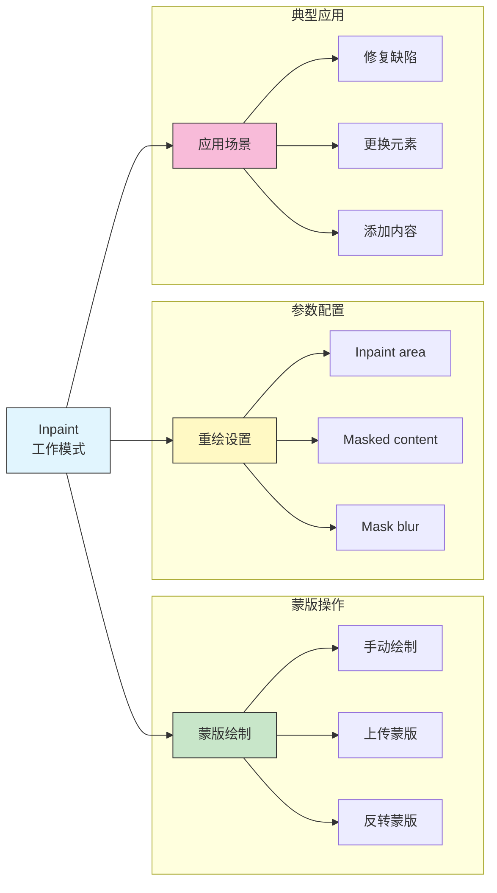
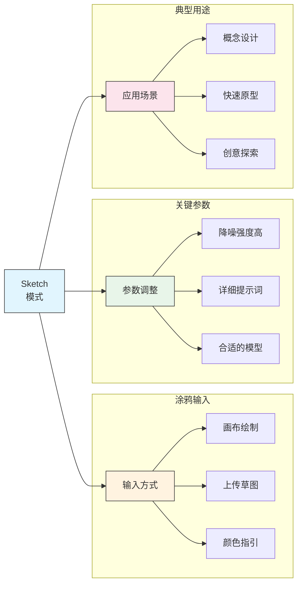
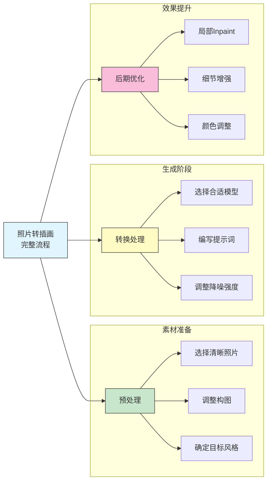
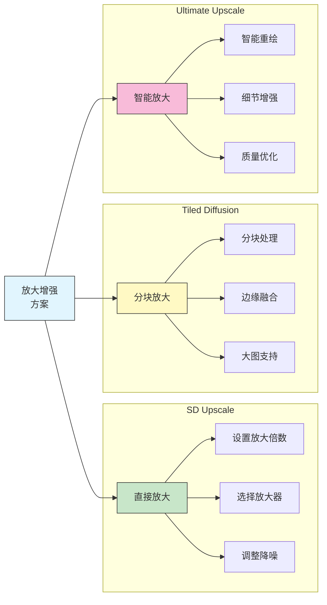
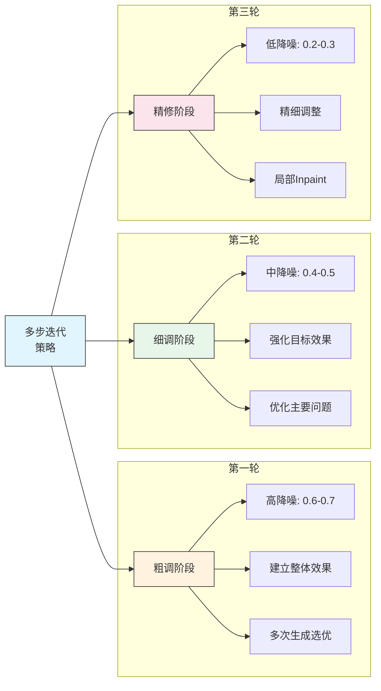
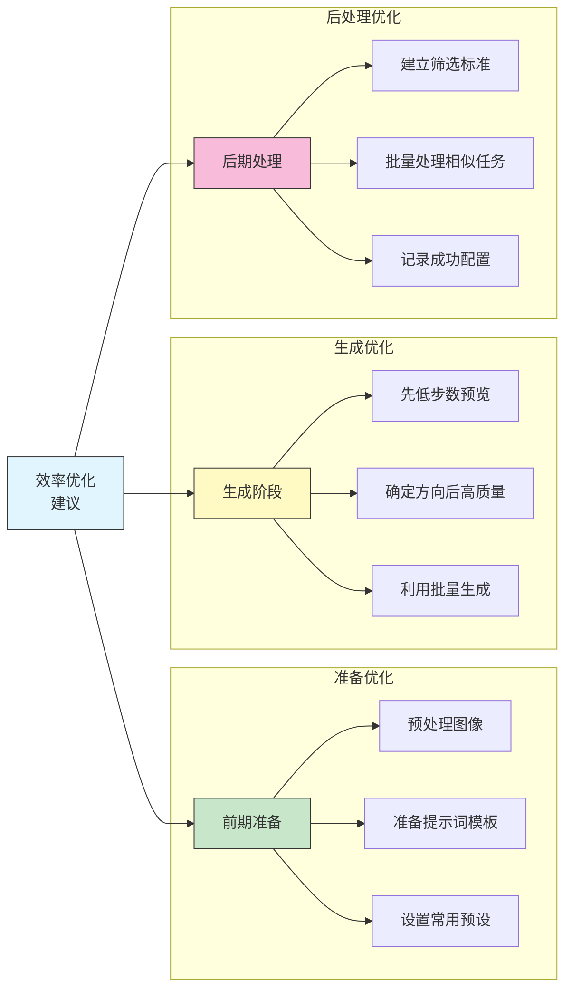

# 图生图工作流

## 📚 本章概述

图生图（img2img）是 Stable Diffusion 的核心功能之一，允许以现有图像为基础进行创作。本章将系统介绍 img2img 的各种模式、参数调优、实战应用以及完整的工作流程。

## 1. img2img 基础概念

### 1.1 工作原理



**img2img 与 txt2img 的区别：**

| 特性 | txt2img | img2img |
|------|---------|---------|
| 输入 | 仅提示词 | 图像 + 提示词 |
| 起点 | 随机噪声 | 原图 + 部分噪声 |
| 控制性 | 较低 | 较高 |
| 一致性 | 完全随机 | 保留原图特征 |
| 主要用途 | 从零创作 | 修改/增强现有图像 |

### 1.2 核心参数：降噪强度

**Denoising Strength（降噪强度）详解：**



**降噪强度参考表：**

| 强度范围 | 效果描述 | 适用场景 |
|----------|----------|----------|
| 0.1-0.2 | 极轻微变化 | 色调微调、去噪 |
| 0.25-0.35 | 轻度变化 | 细节优化、质量提升 |
| 0.4-0.5 | 中度变化 | 风格迁移、局部重绘 |
| 0.55-0.7 | 较大变化 | 重新诠释、创意改造 |
| 0.75-0.85 | 大幅变化 | 保留构图的重绘 |
| 0.9-1.0 | 几乎重绘 | 仅参考构图 |

### 1.3 Resize 模式

**图像尺寸调整模式：**

| 模式 | 说明 | 适用场景 |
|------|------|----------|
| **Just resize** | 直接缩放 | 比例一致时使用 |
| **Crop and resize** | 裁剪后缩放 | 需要特定比例 |
| **Resize and fill** | 缩放后填充 | 保留完整内容 |
| **Just resize (latent upscale)** | 潜空间缩放 | 放大时推荐 |

## 2. img2img 模式详解

### 2.1 基础 img2img

**工作流程：**

```
1. 准备阶段
   ├── 选择或上传参考图
   ├── 确定目标风格/效果
   └── 编写提示词

2. 参数设置
   ├── 选择合适的 Checkpoint
   ├── 设置降噪强度
   ├── 调整尺寸和 CFG
   └── 选择采样器和步数

3. 迭代优化
   ├── 生成初版
   ├── 分析效果调整参数
   └── 达到满意效果
```

**示例配置：**

```
场景: 将照片转换为动漫风格

参考图: 人物照片
提示词: anime style, 1girl, beautiful eyes,
        colorful, detailed, masterpiece
负向提示词: realistic, photo, bad anatomy

参数设置:
├── Checkpoint: 动漫风格模型
├── Denoising: 0.55
├── CFG Scale: 7
├── Steps: 30
└── Sampler: DPM++ 2M Karras
```

### 2.2 Inpaint（局部重绘）



**Inpaint 参数详解：**

| 参数 | 选项 | 说明 |
|------|------|------|
| **Mask blur** | 0-64 | 蒙版边缘模糊程度 |
| **Mask mode** | Inpaint masked / not masked | 重绘蒙版区域/非蒙版区域 |
| **Masked content** | fill / original / latent noise / latent nothing | 蒙版区域初始内容 |
| **Inpaint area** | Whole picture / Only masked | 重绘范围 |
| **Only masked padding** | 0-256 | 仅蒙版模式的扩展像素 |

**Masked content 选项对比：**

| 选项 | 原理 | 适用场景 |
|------|------|----------|
| **fill** | 用周围颜色填充 | 删除/替换元素 |
| **original** | 保留原图内容 | 微调修改 |
| **latent noise** | 添加噪声 | 完全重绘 |
| **latent nothing** | 空白潜空间 | 创造性重绘 |

### 2.3 Inpaint Sketch

**功能特点：**
- 在蒙版区域直接涂画颜色
- 涂画的颜色会影响生成结果
- 适合指定颜色的局部重绘

**使用技巧：**

```
场景: 修改人物衣服颜色

步骤:
1. 上传原图
2. 绘制蒙版覆盖衣服区域
3. 用目标颜色在蒙版区域涂画
4. 提示词中添加颜色描述
5. 设置适当降噪强度 (0.4-0.6)
6. 生成并微调
```

### 2.4 Inpaint Upload

**功能说明：**
- 分开上传原图和蒙版图
- 蒙版图：白色=重绘区域，黑色=保留区域
- 适合精确控制或批量处理

### 2.5 Sketch（涂鸦转图）



**Sketch 最佳实践：**

```
推荐设置:
├── Denoising: 0.7-0.9 (涂鸦越简单，值越高)
├── CFG Scale: 7-10
├── Steps: 30-40
└── 提示词: 详细描述目标效果

技巧:
├── 用不同颜色区分不同区域
├── 标注主要色彩
├── 粗略勾勒形状即可
└── 配合 ControlNet Scribble 效果更好
```

## 3. 实战工作流

### 3.1 照片转插画



**详细步骤：**

```
Step 1: 预处理
├── 选择高质量照片（光线好、主体清晰）
├── 裁剪到合适比例
└── 记录原图尺寸

Step 2: 首次转换
├── Checkpoint: 目标风格模型
├── 提示词: anime style, [场景描述], masterpiece
├── Denoising: 0.5-0.6（首次尝试）
├── CFG: 7-8
└── Steps: 25-30

Step 3: 效果评估
├── 检查整体风格转换
├── 识别需要修复的区域
└── 记录问题点

Step 4: 局部优化
├── 使用 Inpaint 修复问题区域
├── 调整面部细节
├── 优化边缘过渡

Step 5: 最终输出
├── 可选：Hires.fix 放大
├── 可选：添加后处理效果
└── 导出最终成品
```

### 3.2 图像修复工作流

**缺陷修复流程：**

```
常见修复场景:
├── 手部问题 → Inpaint + 手部 LoRA
├── 面部变形 → Inpaint + 面部提示词
├── 背景杂乱 → Inpaint + 简洁背景提示
├── 多余肢体 → Inpaint + latent nothing
└── 服装错误 → Inpaint + 正确服装描述

推荐参数:
├── Mask blur: 8-16
├── Inpaint area: Only masked
├── Padding: 32-64
├── Denoising: 0.4-0.7
└── Masked content: 根据情况选择
```

### 3.3 图像放大增强



**推荐放大流程：**

```
方案A: 标准放大（中等质量需求）
├── 使用 Extras → 选择放大器
├── 放大倍数: 2x-4x
├── 放大器: ESRGAN_4x / RealESRGAN
└── 无需重新生成

方案B: img2img 放大（高质量需求）
├── 在 img2img 中上传原图
├── 调整到目标尺寸
├── Denoising: 0.2-0.35
├── 可添加细节增强提示词
└── 保持原图风格

方案C: Tiled Diffusion（超大图需求）
├── 安装 Tiled Diffusion 扩展
├── 设置分块大小和重叠
├── 配合 ControlNet Tile
├── Denoising: 0.3-0.5
└── 显存友好，支持超大尺寸
```

### 3.4 风格迁移工作流

**多轮迭代法：**

```
目标: 将 A 风格图像转换为 B 风格

第一轮: 建立基础
├── Denoising: 0.5
├── 风格提示词: [B风格描述]
├── 观察整体转换效果

第二轮: 强化风格
├── 使用第一轮输出作为输入
├── Denoising: 0.4
├── 保持提示词不变
├── 风格更加明显

第三轮: 细节优化
├── 使用第二轮输出
├── Denoising: 0.3
├── 增加细节描述词
├── 修复问题区域

最终检查:
├── 整体风格一致性
├── 细节保持完整
└── 无明显伪影
```

## 4. 参数调优技巧

### 4.1 降噪强度与步数关系

```
公式理解:
实际步数 = 总步数 × 降噪强度

示例:
├── Steps: 30, Denoising: 0.5 → 实际 15 步
├── Steps: 40, Denoising: 0.4 → 实际 16 步
└── Steps: 50, Denoising: 0.6 → 实际 30 步

建议:
├── 低降噪强度时，可适当增加总步数
├── 高降噪强度时，保持正常步数即可
└── 实际步数过低会导致质量下降
```

### 4.2 CFG Scale 在 img2img 中的影响

| CFG 值 | 效果 | 建议使用场景 |
|--------|------|--------------|
| 3-5 | 更自然，更贴近原图 | 细微调整 |
| 6-8 | 平衡效果 | 日常使用 |
| 9-12 | 更严格遵循提示词 | 风格转换 |
| 12+ | 过度饱和风险 | 特殊需求 |

### 4.3 采样器选择

**img2img 推荐采样器：**

| 采样器 | 特点 | 推荐场景 |
|--------|------|----------|
| **DPM++ 2M Karras** | 平衡质量与速度 | 通用推荐 |
| **Euler a** | 创意性强 | 风格探索 |
| **DDIM** | 稳定一致 | 精确控制 |
| **UniPC** | 收敛快 | 快速预览 |

### 4.4 常见问题解决

| 问题 | 原因分析 | 解决方案 |
|------|----------|----------|
| 风格变化不够 | 降噪强度太低 | 提高至 0.5-0.7 |
| 原图特征丢失 | 降噪强度太高 | 降低至 0.3-0.5 |
| 边缘模糊 | Inpaint blur 过高 | 降低 blur 值 |
| 颜色偏差 | VAE 不匹配 | 更换 VAE |
| 细节丢失 | 步数/实际步数太低 | 增加总步数 |
| 生成内容与蒙版不匹配 | Inpaint area 设置 | 尝试 Only masked |

## 5. 高级技巧

### 5.1 多步迭代精修



### 5.2 Seed 技巧

```
Seed 在 img2img 中的应用:

固定 Seed:
├── 保持生成一致性
├── 方便参数对比
└── 可复现特定效果

Subseed 变化:
├── 在保持整体一致的前提下
├── 产生细微变化
└── Subseed strength 控制变化程度

批量探索:
├── Seed: -1（随机）
├── Batch count: 4-8
└── 选择最佳结果的 Seed 继续优化
```

### 5.3 配合 ControlNet

**img2img + ControlNet 组合：**

```
场景: 保持姿势的风格转换

配置:
├── img2img
│   ├── 输入: 原始照片
│   ├── Denoising: 0.6
│   └── 提示词: 目标风格描述
│
└── ControlNet
    ├── 预处理器: openpose
    ├── 模型: control_openpose
    └── Weight: 0.8

效果: 风格转换的同时保持人物姿势
```

### 5.4 Batch 批量处理

**批量处理设置：**

```
批量 img2img 处理:

脚本选择: img2img batch

输入设置:
├── Input directory: 输入图片文件夹路径
├── Output directory: 输出文件夹路径
└── Use input image's size: 可选

统一参数:
├── 统一的提示词
├── 统一的降噪强度
├── 统一的模型和参数
└── 批量处理完成

注意事项:
├── 确保输入图片尺寸接近
├── 提示词尽量通用
└── 可能需要后期筛选和调整
```

## 6. 场景化工作流模板

### 6.1 人像美化模板

```
目标: 人像照片风格化美化

输入: 人物照片（清晰正面）

配置:
├── Checkpoint: 写实/半写实模型
├── Denoising: 0.35-0.45
├── CFG: 6-7
├── Steps: 30

提示词模板:
正向: beautiful portrait, soft lighting,
      detailed skin, natural makeup,
      professional photography, 8k
负向: ugly, deformed, bad anatomy,
      blurry, low quality

流程:
1. 整体转换 (denoising 0.4)
2. Inpaint 眼睛 (denoising 0.5)
3. Inpaint 皮肤问题区域 (denoising 0.4)
4. 可选: 放大增强细节
```

### 6.2 场景风格化模板

```
目标: 照片转动漫/插画风格

输入: 风景/城市照片

配置:
├── Checkpoint: 动漫风格模型
├── Denoising: 0.55-0.65
├── CFG: 7-8
├── Steps: 30

提示词模板:
正向: anime style, makoto shinkai,
      beautiful scenery, detailed background,
      vibrant colors, masterpiece
负向: realistic, photo, ugly,
      low quality, blurry

可选增强:
├── ControlNet Canny 保持边缘
├── 多轮迭代加深风格
└── Inpaint 修复问题区域
```

### 6.3 产品图优化模板

```
目标: 产品照片增强/背景更换

输入: 产品照片

配置:
├── Checkpoint: 写实模型
├── 模式: Inpaint（只重绘背景）
├── Denoising: 0.7-0.9
├── CFG: 7

提示词模板:
正向: professional product photography,
      clean white background,
      studio lighting, high quality
负向: dirty, messy, cluttered,
      low quality, blurry

流程:
1. 绘制蒙版覆盖背景（保留产品）
2. 使用 "fill" 或 "latent noise"
3. 生成新背景
4. 必要时调整边缘
```

## 7. 效率提升技巧

### 7.1 快捷键与操作

| 操作 | 快捷方式 | 说明 |
|------|----------|------|
| 生成 | Enter / Ctrl+Enter | 开始生成 |
| 中断 | Interrupt | 停止当前生成 |
| 跳过 | Skip | 跳过当前批次 |
| 发送到 img2img | 图片下方按钮 | 快速迁移 |
| 应用上次参数 | 粘贴按钮 | 快速复用设置 |

### 7.2 预设保存

```
建议保存的预设:

1. 快速预览预设
   ├── Steps: 15
   ├── Denoising: 0.5
   └── Sampler: UniPC

2. 高质量输出预设
   ├── Steps: 40
   ├── Denoising: 0.4
   └── Sampler: DPM++ 2M Karras

3. 风格转换预设
   ├── Steps: 30
   ├── Denoising: 0.6
   └── CFG: 8

4. Inpaint 修复预设
   ├── Mask blur: 12
   ├── Inpaint area: Only masked
   └── Padding: 48
```

### 7.3 工作流优化建议



## 8. 总结与速查表

### 8.1 img2img 模式速查

| 模式 | 主要用途 | 关键设置 |
|------|----------|----------|
| img2img | 整体风格转换 | Denoising: 0.4-0.6 |
| Inpaint | 局部修改/修复 | Mask blur: 8-16 |
| Inpaint Sketch | 指定颜色重绘 | 配合颜色提示词 |
| Sketch | 涂鸦转图像 | Denoising: 0.7-0.9 |

### 8.2 降噪强度速查

| 目标 | 推荐降噪强度 |
|------|--------------|
| 轻微调色/去噪 | 0.1-0.2 |
| 细节优化 | 0.25-0.35 |
| 风格迁移 | 0.45-0.6 |
| 创意改造 | 0.65-0.8 |
| 基本重绘 | 0.85-1.0 |

### 8.3 Inpaint 设置速查

| 场景 | Masked content | Inpaint area | Denoising |
|------|----------------|--------------|-----------|
| 删除元素 | fill | Only masked | 0.7-0.9 |
| 替换元素 | latent noise | Only masked | 0.6-0.8 |
| 微调修改 | original | Whole picture | 0.4-0.5 |
| 扩展图像 | fill | Only masked | 0.8-1.0 |

---

**本章要点回顾：**
- img2img 是以图像为基础的二次创作核心功能
- 降噪强度是控制变化程度的关键参数
- Inpaint 是精确控制局部重绘的利器
- 多轮迭代是获得高质量结果的有效方法
- 合理的工作流程能大幅提升效率

**下一章预告：** 常用插件推荐 - 掌握提升效率和效果的必备扩展
