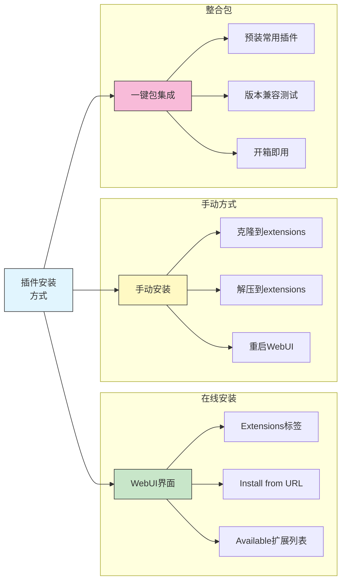
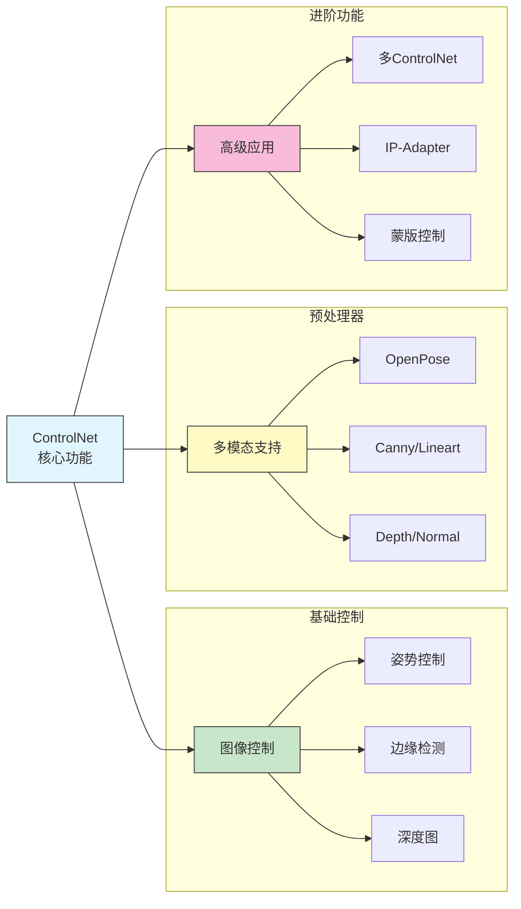
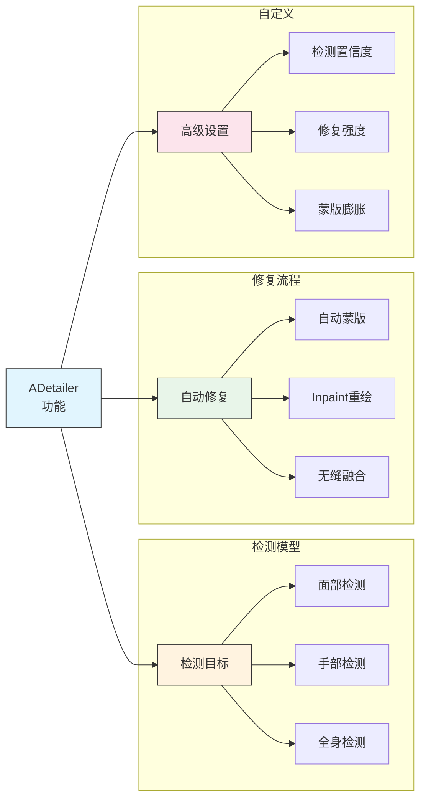
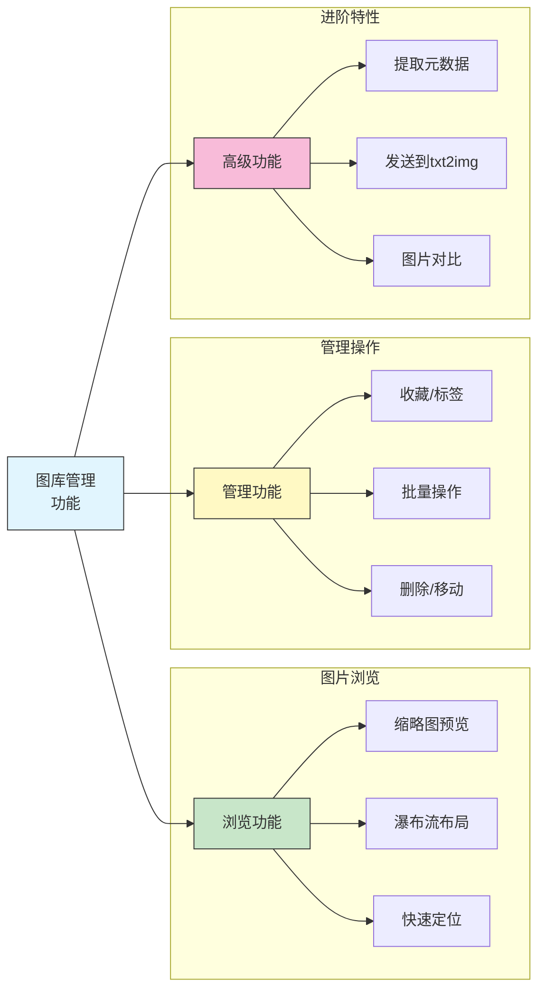
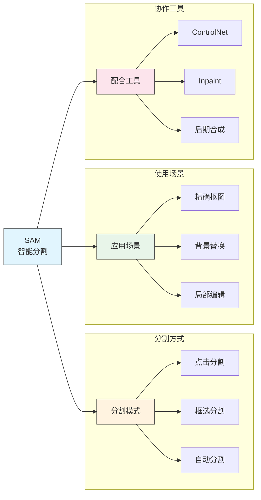
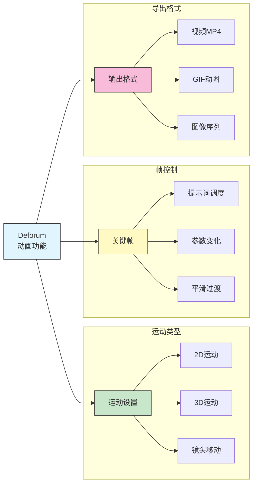
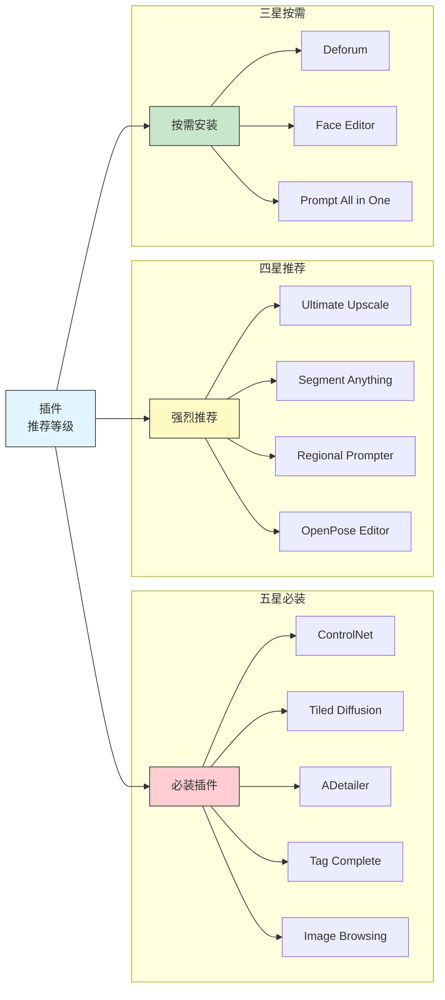

# 常用插件推荐

## 📚 本章概述

Stable Diffusion WebUI 拥有丰富的扩展生态系统，通过安装合适的插件可以大幅提升创作效率和图像质量。本章将系统介绍各类必备和推荐插件，包括安装方法、功能说明和使用技巧。

## 1. 插件安装基础

### 1.1 安装方式



**方法一：从 URL 安装**

```
步骤:
1. 打开 WebUI → Extensions → Install from URL
2. 在 URL 框中粘贴插件的 GitHub 仓库地址
3. 点击 Install 按钮
4. 等待安装完成
5. 点击 Apply and restart UI
```

**方法二：从可用列表安装**

```
步骤:
1. Extensions → Available → Load from
2. 在列表中搜索插件名称
3. 点击 Install 按钮
4. 重启 WebUI
```

**方法三：手动安装**

```bash
# 进入扩展目录
cd stable-diffusion-webui/extensions

# 克隆插件仓库
git clone https://github.com/作者/插件名.git

# 重启 WebUI
```

### 1.2 插件管理

**常用管理操作：**

| 操作 | 方法 | 说明 |
|------|------|------|
| 更新插件 | Extensions → Installed → Check for updates | 检查并更新 |
| 禁用插件 | 取消勾选 → Apply | 不删除，仅禁用 |
| 删除插件 | 删除 extensions 下对应文件夹 | 完全移除 |
| 插件设置 | Settings → 对应插件选项 | 配置参数 |

### 1.3 常见问题处理

| 问题 | 可能原因 | 解决方案 |
|------|----------|----------|
| 安装失败 | 网络问题 | 使用代理或手动下载 |
| 启动报错 | 依赖缺失 | 检查 requirements.txt |
| 功能异常 | 版本不兼容 | 更新 WebUI 或回退插件版本 |
| 界面卡顿 | 插件过多 | 禁用不常用插件 |

## 2. 核心必备插件

### 2.1 ControlNet



**插件信息：**

| 项目 | 内容 |
|------|------|
| 名称 | sd-webui-controlnet |
| 仓库 | https://github.com/Mikubill/sd-webui-controlnet |
| 重要性 | ⭐⭐⭐⭐⭐ 必装 |
| 功能 | 精确控制生成图像的姿势、构图、边缘等 |

**核心使用场景：**
- 人物姿势控制
- 建筑转绘
- 线稿上色
- 风格迁移

### 2.2 Tiled Diffusion & VAE

**插件信息：**

| 项目 | 内容 |
|------|------|
| 名称 | multidiffusion-upscaler-for-automatic1111 |
| 仓库 | https://github.com/pkuliyi2015/multidiffusion-upscaler-for-automatic1111 |
| 重要性 | ⭐⭐⭐⭐⭐ 必装 |
| 功能 | 分块处理大图，突破显存限制 |

**主要功能：**

```
Tiled Diffusion:
├── 将大图分成小块处理
├── 智能边缘融合
├── 支持超大尺寸生成
└── 显存友好

Tiled VAE:
├── VAE 分块编解码
├── 降低显存占用
├── 必备低配优化
└── 默认建议开启
```

**推荐设置：**

| 参数 | 推荐值 | 说明 |
|------|--------|------|
| Tile Size | 96-128 | 分块大小 |
| Overlap | 48-64 | 重叠像素 |
| Tile batch size | 1-4 | 根据显存调整 |
| Upscaler | 按需选择 | ESRGAN/Real-ESRGAN |

### 2.3 ADetailer（面部/手部修复）



**插件信息：**

| 项目 | 内容 |
|------|------|
| 名称 | adetailer |
| 仓库 | https://github.com/Bing-su/adetailer |
| 重要性 | ⭐⭐⭐⭐⭐ 必装 |
| 功能 | 自动检测并修复面部/手部 |

**使用配置：**

```
基础设置:
├── ADetailer model: face_yolov8n.pt（面部）
├── Detection confidence: 0.3
├── Mask dilation: 4-8
└── Inpaint denoising: 0.4

进阶设置:
├── 可添加专用修复提示词
├── 支持多模型串联
├── 手部修复: hand_yolov8n.pt
└── 全身: person_yolov8n-seg.pt
```

### 2.4 Ultimate SD Upscale

**插件信息：**

| 项目 | 内容 |
|------|------|
| 名称 | ultimate-upscale-for-automatic1111 |
| 仓库 | https://github.com/Coyote-A/ultimate-upscale-for-automatic1111 |
| 重要性 | ⭐⭐⭐⭐ 强烈推荐 |
| 功能 | 高质量分块放大 |

**与其他放大方案对比：**

| 方案 | 质量 | 速度 | 显存占用 |
|------|------|------|----------|
| Extras 放大 | 中 | 快 | 低 |
| Hires.fix | 高 | 慢 | 高 |
| Tiled Diffusion | 高 | 中 | 中 |
| Ultimate Upscale | 最高 | 慢 | 中 |

## 3. 效率提升插件

### 3.1 Infinite Image Browsing（图库管理）



**插件信息：**

| 项目 | 内容 |
|------|------|
| 名称 | infinite-image-browsing |
| 仓库 | https://github.com/zanllp/sd-webui-infinite-image-browsing |
| 重要性 | ⭐⭐⭐⭐⭐ 必装 |
| 功能 | 强大的图库浏览和管理 |

**核心功能：**
- 📁 浏览所有输出目录
- 🏷️ 自定义标签和收藏
- 🔍 根据提示词/参数搜索
- 📤 一键发送到生成页面
- 🗑️ 批量删除管理

### 3.2 Tag Complete（提示词自动补全）

**插件信息：**

| 项目 | 内容 |
|------|------|
| 名称 | a1111-sd-webui-tagcomplete |
| 仓库 | https://github.com/DominikDoom/a1111-sd-webui-tagcomplete |
| 重要性 | ⭐⭐⭐⭐⭐ 必装 |
| 功能 | 输入时自动补全提示词标签 |

**功能特点：**

```
支持的标签库:
├── Danbooru 标签（二次元）
├── e621 标签
├── 自定义标签库
└── Embedding/LoRA 名称

触发方式:
├── 输入时自动弹出
├── Tab 键确认选择
├── 支持模糊搜索
└── 显示标签使用频率
```

### 3.3 Prompt All in One（提示词工具箱）

**插件信息：**

| 项目 | 内容 |
|------|------|
| 名称 | sd-webui-prompt-all-in-one |
| 仓库 | https://github.com/Physton/sd-webui-prompt-all-in-one |
| 重要性 | ⭐⭐⭐⭐ 强烈推荐 |
| 功能 | 提示词翻译、管理、优化 |

**核心功能：**

| 功能 | 说明 |
|------|------|
| 中英翻译 | 中文自动翻译为英文提示词 |
| 一键优化 | AI 优化提示词结构 |
| 历史记录 | 保存常用提示词 |
| 权重调整 | 可视化调整词权重 |
| 收藏管理 | 分类保存提示词模板 |

### 3.4 Aspect Ratio Selector（比例选择器）

**插件信息：**

| 项目 | 内容 |
|------|------|
| 名称 | sd-webui-ar |
| 仓库 | https://github.com/alemelis/sd-webui-ar |
| 重要性 | ⭐⭐⭐ 推荐 |
| 功能 | 快速切换常用图像比例 |

**预设比例：**

| 比例 | 尺寸示例 | 用途 |
|------|----------|------|
| 1:1 | 512×512 / 1024×1024 | 头像、社交媒体 |
| 4:3 | 768×576 | 传统照片 |
| 3:2 | 768×512 | 单反照片 |
| 16:9 | 896×512 | 视频/壁纸 |
| 9:16 | 512×896 | 手机壁纸 |
| 2:3 | 512×768 | 人像竖图 |

### 3.5 System Info（系统监控）

**插件信息：**

| 项目 | 内容 |
|------|------|
| 名称 | sd-webui-system-info |
| 仓库 | https://github.com/vladmandic/sd-webui-system-info |
| 重要性 | ⭐⭐⭐ 推荐 |
| 功能 | 实时监控系统资源 |

**监控指标：**
- GPU 使用率和温度
- 显存占用
- CPU 和内存使用
- 生成速度统计

## 4. 图像增强插件

### 4.1 Segment Anything（智能分割）



**插件信息：**

| 项目 | 内容 |
|------|------|
| 名称 | sd-webui-segment-anything |
| 仓库 | https://github.com/continue-revolution/sd-webui-segment-anything |
| 重要性 | ⭐⭐⭐⭐ 强烈推荐 |
| 功能 | 基于 SAM 的智能图像分割 |

**使用流程：**

```
1. 上传图像到 SAM 面板
2. 点击目标区域或框选
3. SAM 自动识别边界
4. 导出蒙版用于 Inpaint
5. 或直接进行后续处理
```

### 4.2 Remove Background（背景移除）

**插件信息：**

| 项目 | 内容 |
|------|------|
| 名称 | stable-diffusion-webui-rembg |
| 仓库 | https://github.com/AUTOMATIC1111/stable-diffusion-webui-rembg |
| 重要性 | ⭐⭐⭐⭐ 强烈推荐 |
| 功能 | 自动移除图像背景 |

**支持的模型：**

| 模型 | 特点 | 适用场景 |
|------|------|----------|
| u2net | 通用效果好 | 大多数场景 |
| u2net_human_seg | 人物优化 | 人像抠图 |
| isnet-general-use | 新一代模型 | 高质量需求 |

### 4.3 Face Editor（面部编辑）

**插件信息：**

| 项目 | 内容 |
|------|------|
| 名称 | sd-webui-face-editor |
| 仓库 | https://github.com/ototadana/sd-webui-face-editor |
| 重要性 | ⭐⭐⭐ 推荐 |
| 功能 | 精细编辑人物面部 |

**编辑功能：**
- 面部特征调整
- 表情变化
- 年龄修改
- 面部替换

### 4.4 OpenPose Editor（姿势编辑器）

**插件信息：**

| 项目 | 内容 |
|------|------|
| 名称 | sd-webui-openpose-editor |
| 仓库 | https://github.com/fkunn1326/openpose-editor |
| 重要性 | ⭐⭐⭐⭐ 强烈推荐 |
| 功能 | 可视化编辑骨骼姿势 |

**功能特点：**

```
编辑功能:
├── 拖拽关节点
├── 调整骨骼角度
├── 多人物编辑
├── 手指精细调整
└── 面部朝向控制

导出功能:
├── 直接发送到 ControlNet
├── 保存骨骼图
├── 支持导入已有姿势
└── 预设姿势库
```

## 5. 批量处理插件

### 5.1 Dataset Tag Editor（标签编辑器）

**插件信息：**

| 项目 | 内容 |
|------|------|
| 名称 | sd-webui-dataset-tag-editor |
| 仓库 | https://github.com/toshiaki1729/sd-webui-dataset-tag-editor |
| 重要性 | ⭐⭐⭐⭐ 训练必备 |
| 功能 | 批量编辑图像标签 |

**核心功能：**
- 批量加载图像及其标签
- 可视化编辑标签
- 批量添加/删除/替换标签
- 标签频率统计
- 导出训练数据集

### 5.2 Batch PNG Info（批量元数据）

**插件信息：**

| 项目 | 内容 |
|------|------|
| 名称 | batchpnginfo |
| 仓库 | https://github.com/vladmandic/batchpnginfo |
| 重要性 | ⭐⭐⭐ 推荐 |
| 功能 | 批量读取图像元数据 |

**功能说明：**
- 批量读取 PNG 元数据
- 导出提示词和参数
- 方便复现和学习

### 5.3 Image Browser（图像浏览器）

**插件信息：**

| 项目 | 内容 |
|------|------|
| 名称 | sd-webui-additional-networks |
| 重要性 | ⭐⭐⭐ 推荐 |
| 功能 | 浏览和管理输出图像 |

## 6. 特殊功能插件

### 6.1 Deforum（动画生成）



**插件信息：**

| 项目 | 内容 |
|------|------|
| 名称 | deforum-for-automatic1111-webui |
| 仓库 | https://github.com/deforum-art/deforum-for-automatic1111-webui |
| 重要性 | ⭐⭐⭐⭐ 动画必备 |
| 功能 | 生成动画和视频 |

### 6.2 Regional Prompter（区域提示词）

**插件信息：**

| 项目 | 内容 |
|------|------|
| 名称 | sd-webui-regional-prompter |
| 仓库 | https://github.com/hako-mikan/sd-webui-regional-prompter |
| 重要性 | ⭐⭐⭐⭐ 强烈推荐 |
| 功能 | 不同区域使用不同提示词 |

**应用场景：**
- 多角色同图不同描述
- 分区域风格控制
- 精确内容布局

**使用示例：**

```
区域划分语法:
BREAK 分隔不同区域

示例:
1girl, red hair, smile BREAK
blue sky, clouds BREAK
green grass

配合设置:
├── Divide mode: Horizontal/Vertical/Random
├── Divide ratio: 1:1:1（各区域比例）
└── Base ratio: 0.5（基础提示词权重）
```

### 6.3 LyCORIS（高级 LoRA）

**插件信息：**

| 项目 | 内容 |
|------|------|
| 名称 | sd-webui-lycoris |
| 仓库 | https://github.com/KohakuBlueleaf/a1111-sd-webui-lycoris |
| 重要性 | ⭐⭐⭐⭐ 推荐 |
| 功能 | 支持 LyCORIS 格式模型 |

**支持的格式：**
- LoCon
- LoHa
- LoKR
- (IA)³
- DyLoRA

### 6.4 WD 1.4 Tagger（自动标注）

**插件信息：**

| 项目 | 内容 |
|------|------|
| 名称 | sd-webui-wd14-tagger |
| 仓库 | https://github.com/toriato/stable-diffusion-webui-wd14-tagger |
| 重要性 | ⭐⭐⭐⭐ 训练必备 |
| 功能 | 自动生成图像标签 |

**使用场景：**
- 训练数据集标注
- 反推图像提示词
- 批量标签生成

## 7. 插件推荐清单

### 7.1 按重要性分类



### 7.2 按场景推荐

| 使用场景 | 推荐插件组合 |
|----------|--------------|
| **日常创作** | ControlNet + ADetailer + Tag Complete + Image Browsing |
| **人像摄影** | ADetailer + Face Editor + Remove Background |
| **动漫插画** | Tag Complete + Regional Prompter + LoRA Block Weight |
| **图像放大** | Tiled Diffusion + Ultimate Upscale |
| **动画视频** | Deforum + ControlNet |
| **训练准备** | Dataset Tag Editor + WD14 Tagger |
| **抠图合成** | Segment Anything + Remove Background |

### 7.3 新手入门推荐

**第一阶段（基础必装）：**

| 序号 | 插件 | 原因 |
|------|------|------|
| 1 | ControlNet | 精确控制核心 |
| 2 | ADetailer | 自动修复面部 |
| 3 | Tiled VAE | 显存优化 |
| 4 | Tag Complete | 提示词辅助 |
| 5 | Infinite Image Browsing | 图库管理 |

**第二阶段（能力扩展）：**

| 序号 | 插件 | 原因 |
|------|------|------|
| 6 | Ultimate Upscale | 高质量放大 |
| 7 | Prompt All in One | 提示词工具 |
| 8 | OpenPose Editor | 姿势编辑 |
| 9 | Remove Background | 背景移除 |

## 8. 性能优化建议

### 8.1 插件对性能的影响

| 插件 | 内存影响 | 显存影响 | 启动影响 |
|------|----------|----------|----------|
| ControlNet | 中 | 高 | 中 |
| Tiled Diffusion | 低 | 降低 | 低 |
| ADetailer | 中 | 中 | 低 |
| SAM | 高 | 高 | 高 |
| Deforum | 中 | 中 | 中 |

### 8.2 优化建议

```
性能优化策略:

1. 插件数量控制
   ├── 只安装常用插件
   ├── 禁用不常用插件
   └── 定期清理

2. 显存优化
   ├── 启用 Tiled VAE
   ├── 设置合理的批量大小
   └── 使用 --medvram 或 --lowvram

3. 启动优化
   ├── 禁用自动更新检查
   ├── 按需加载模型
   └── 减少启动时加载项

4. 使用建议
   ├── ControlNet 按需启用
   ├── 不同时使用多个重型插件
   └── 定期重启 WebUI 释放资源
```

## 9. 总结

### 9.1 插件安装优先级

| 优先级 | 插件名称 | 安装理由 |
|--------|----------|----------|
| P0 | ControlNet | 核心控制能力 |
| P0 | Tiled Diffusion/VAE | 显存优化必备 |
| P0 | ADetailer | 自动质量提升 |
| P1 | Tag Complete | 效率提升 |
| P1 | Infinite Image Browsing | 文件管理 |
| P1 | Ultimate Upscale | 放大需求 |
| P2 | Regional Prompter | 进阶控制 |
| P2 | Segment Anything | 智能分割 |
| P2 | OpenPose Editor | 姿势编辑 |
| P3 | 其他按需插件 | 特定场景 |

### 9.2 常用插件仓库汇总

```
必装插件:
├── ControlNet: github.com/Mikubill/sd-webui-controlnet
├── Tiled Diffusion: github.com/pkuliyi2015/multidiffusion-upscaler-for-automatic1111
├── ADetailer: github.com/Bing-su/adetailer
├── Tag Complete: github.com/DominikDoom/a1111-sd-webui-tagcomplete
└── Image Browsing: github.com/zanllp/sd-webui-infinite-image-browsing

推荐插件:
├── Ultimate Upscale: github.com/Coyote-A/ultimate-upscale-for-automatic1111
├── SAM: github.com/continue-revolution/sd-webui-segment-anything
├── Regional Prompter: github.com/hako-mikan/sd-webui-regional-prompter
├── OpenPose Editor: github.com/fkunn1326/openpose-editor
└── WD14 Tagger: github.com/toriato/stable-diffusion-webui-wd14-tagger
```

---

**本章要点回顾：**
- 插件是扩展 WebUI 功能的重要途径
- 根据需求选择合适的插件组合
- 注意插件对系统性能的影响
- 定期更新和维护插件
- 不同场景有不同的最佳插件组合

**下一章预告：** LoRA 模型训练 - 学习如何训练属于自己的 LoRA 模型
