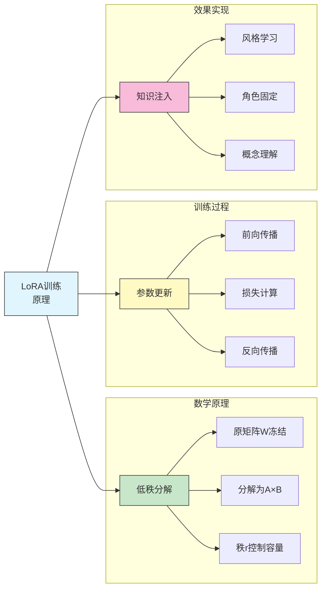
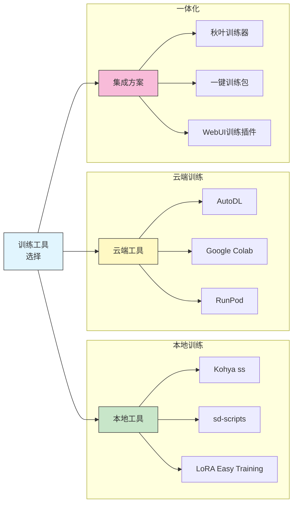
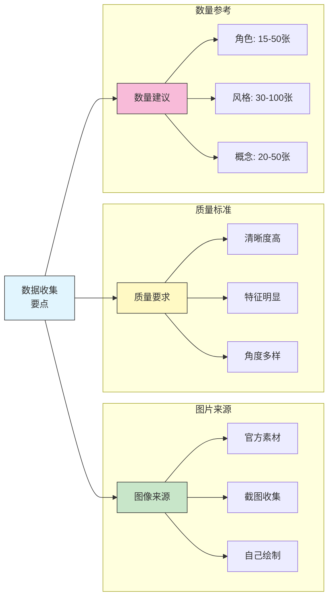
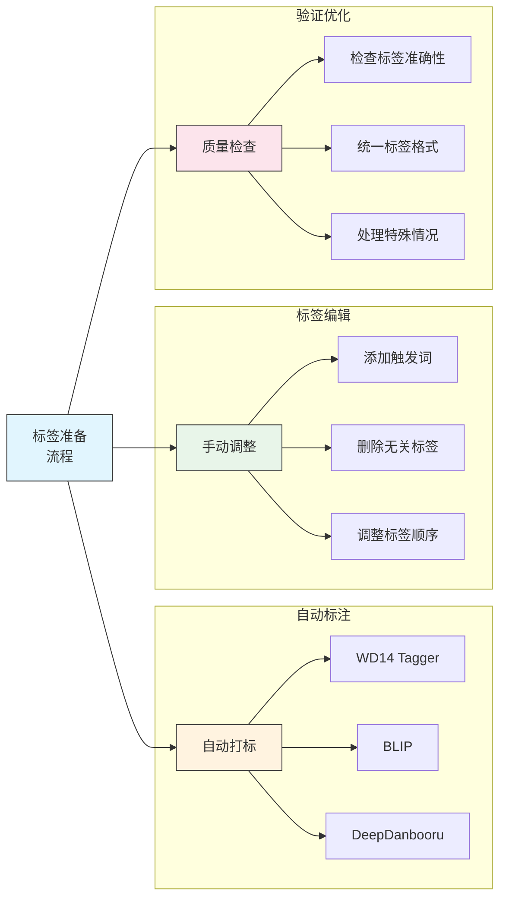
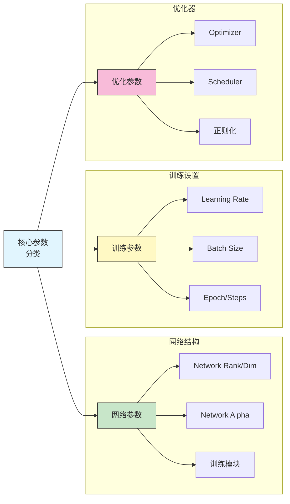
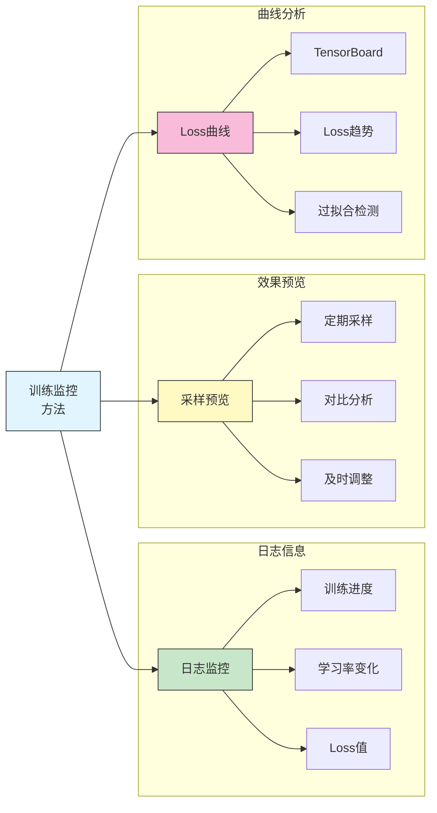
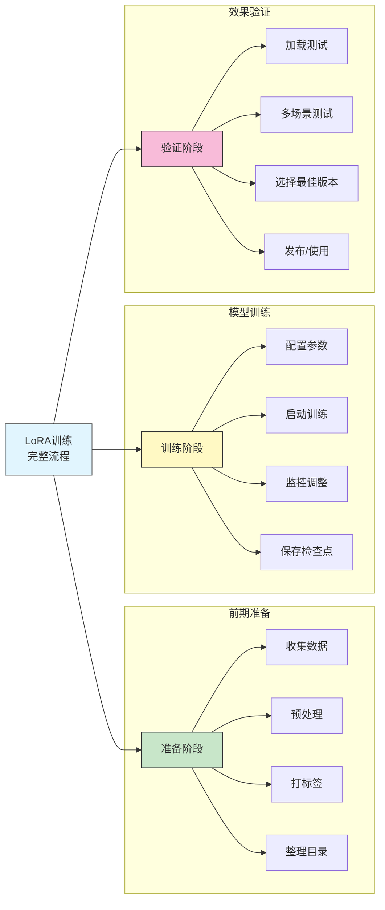

# LoRA 模型训练

## 📚 本章概述

训练自己的 LoRA 模型是 Stable Diffusion 进阶应用的重要技能。本章将系统介绍 LoRA 训练的完整流程，包括环境搭建、数据集准备、参数设置、训练监控以及常见问题解决。

## 1. LoRA 训练基础

### 1.1 训练原理



**LoRA 核心公式：**

```
W' = W + α × (A × B)

其中:
├── W: 原始权重矩阵（冻结）
├── A: 低秩矩阵 (d × r)
├── B: 低秩矩阵 (r × k)
├── r: 秩，控制训练容量
└── α: 缩放因子
```

### 1.2 训练类型对比

| 训练类型 | 训练内容 | 数据量需求 | 训练时间 | 效果 |
|----------|----------|------------|----------|------|
| **角色 LoRA** | 固定角色外观 | 15-50张 | 1-3小时 | 高 |
| **风格 LoRA** | 特定画风 | 30-100张 | 2-4小时 | 高 |
| **概念 LoRA** | 新物品/场景 | 20-50张 | 1-2小时 | 中高 |
| **姿势 LoRA** | 特定动作 | 30-80张 | 2-3小时 | 中 |

### 1.3 训练工具选择



**工具对比：**

| 工具 | 易用性 | 功能性 | 推荐度 |
|------|--------|--------|--------|
| **Kohya ss GUI** | ⭐⭐⭐⭐ | ⭐⭐⭐⭐⭐ | 首选推荐 |
| **sd-scripts** | ⭐⭐ | ⭐⭐⭐⭐⭐ | 高级用户 |
| **秋叶训练器** | ⭐⭐⭐⭐⭐ | ⭐⭐⭐⭐ | 新手推荐 |
| **云端 Colab** | ⭐⭐⭐⭐ | ⭐⭐⭐ | 无显卡用户 |

## 2. 环境搭建

### 2.1 硬件要求

**最低配置：**

| 组件 | 最低要求 | 推荐配置 |
|------|----------|----------|
| GPU | 8GB 显存 | 12GB+ 显存 |
| RAM | 16GB | 32GB+ |
| 硬盘 | 50GB 空间 | 100GB+ SSD |
| CPU | 4核 | 8核+ |

**显卡推荐：**

| 显卡 | 显存 | 训练能力 | 推荐度 |
|------|------|----------|--------|
| RTX 3060 | 12GB | 基础训练 | ⭐⭐⭐ |
| RTX 3080 | 10GB | 中等规模 | ⭐⭐⭐⭐ |
| RTX 3090 | 24GB | 大规模训练 | ⭐⭐⭐⭐⭐ |
| RTX 4090 | 24GB | 顶级效率 | ⭐⭐⭐⭐⭐ |

### 2.2 Kohya ss 安装

**Windows 安装步骤：**

```bash
# 1. 克隆仓库
git clone https://github.com/bmaltais/kohya_ss.git
cd kohya_ss

# 2. 运行安装脚本
setup.bat

# 3. 启动 GUI
gui.bat
```

**Linux 安装步骤：**

```bash
# 1. 克隆仓库
git clone https://github.com/bmaltais/kohya_ss.git
cd kohya_ss

# 2. 安装依赖
chmod +x setup.sh
./setup.sh

# 3. 启动 GUI
./gui.sh
```

### 2.3 秋叶训练器安装

```
下载地址:
├── GitHub: github.com/Akegarasu/lora-scripts
├── 国内镜像: 各大整合包内置
└── 一键安装包: B站秋叶官方发布

安装步骤:
1. 下载整合包
2. 解压到无中文路径目录
3. 运行 启动训练器.bat
4. 等待依赖安装完成
5. 打开浏览器访问本地地址
```

## 3. 数据集准备

### 3.1 数据收集



**数据收集原则：**

| 原则 | 说明 | 具体要求 |
|------|------|----------|
| **清晰度** | 图像质量要高 | 分辨率 ≥ 512px |
| **多样性** | 角度、表情多样 | 正面/侧面/多角度 |
| **一致性** | 核心特征统一 | 保持角色特征一致 |
| **纯净性** | 背景尽量简单 | 避免复杂背景干扰 |

### 3.2 图像预处理

**预处理流程：**

```
1. 尺寸调整
   ├── 推荐尺寸: 512×512 / 768×768
   ├── 保持宽高比
   └── 统一分辨率

2. 质量筛选
   ├── 删除模糊图像
   ├── 删除遮挡严重的图像
   └── 删除特征不明显的图像

3. 裁剪处理
   ├── 人物居中
   ├── 保留关键特征
   └── 适当留白

4. 格式统一
   ├── 转换为 PNG/JPG
   ├── 8位色深
   └── sRGB 色彩空间
```

**常用预处理工具：**

| 工具 | 功能 | 推荐度 |
|------|------|--------|
| **BIRME** | 批量裁剪 | ⭐⭐⭐⭐ |
| **Photoshop** | 专业处理 | ⭐⭐⭐⭐⭐ |
| **XnConvert** | 批量转换 | ⭐⭐⭐⭐ |
| **训练器内置** | 自动处理 | ⭐⭐⭐ |

### 3.3 标签（Tag）准备



**标签规则：**

```
标签文件格式:
├── 与图像同名的 .txt 文件
├── 标签用逗号分隔
└── 每张图一个标签文件

示例:
图像: 001.png
标签: 001.txt

标签内容示例:
trigger_word, 1girl, solo, long hair, blue eyes,
school uniform, standing, smile, simple background

关键点:
├── 触发词放在最前面
├── 从整体到细节排列
├── 删除不需要学习的元素标签
└── 保留需要泛化的元素标签
```

**打标工具使用：**

| 工具 | 特点 | 适用场景 |
|------|------|----------|
| **WD14 Tagger** | 动漫图像专精 | 二次元角色 |
| **BLIP** | 自然语言描述 | 写实/场景 |
| **DeepDanbooru** | Danbooru 标签 | 动漫风格 |
| **手动标注** | 最精确 | 少量高质量 |

### 3.4 数据集目录结构

**标准目录结构：**

```
training_data/
├── 10_character_name/      # 重复次数_概念名称
│   ├── 001.png
│   ├── 001.txt
│   ├── 002.png
│   ├── 002.txt
│   └── ...
├── 5_another_concept/
│   └── ...
└── log/                    # 训练日志（自动生成）
```

**重复次数计算：**

```
公式: 重复次数 = 目标总步数 / (图片数量 × epoch数)

示例:
├── 图片数量: 20张
├── 目标总步数: 2000步
├── Epoch: 10
├── 重复次数 = 2000 / (20 × 10) = 10
└── 文件夹命名: 10_character_name
```

## 4. 训练参数详解

### 4.1 核心参数



### 4.2 Network Rank (Dim)

**秩的影响：**

| Rank 值 | 模型大小 | 学习能力 | 适用场景 |
|---------|----------|----------|----------|
| 4-8 | ~4-8MB | 低 | 简单风格 |
| 16-32 | ~20-40MB | 中 | 角色/一般风格 |
| 64-128 | ~80-150MB | 高 | 复杂角色/高精度 |
| 256+ | ~300MB+ | 最高 | 特殊需求 |

**推荐设置：**

```
角色 LoRA: Rank 32-64
风格 LoRA: Rank 16-32
概念 LoRA: Rank 16-32
细节 LoRA: Rank 8-16
```

### 4.3 Network Alpha

**Alpha 与 Rank 的关系：**

```
实际学习率缩放 = Alpha / Rank

常见设置:
├── Alpha = Rank: 标准学习
├── Alpha = Rank/2: 较温和
├── Alpha = 1: 非常保守

推荐:
├── 新手: Alpha = Rank（1:1）
├── 进阶: Alpha = Rank/2
└── 精细调优: 根据效果调整
```

### 4.4 Learning Rate（学习率）

**学习率设置指南：**

| 组件 | 推荐学习率 | 说明 |
|------|------------|------|
| **Text Encoder** | 1e-5 ~ 5e-5 | 文本编码器，较保守 |
| **UNet** | 1e-4 ~ 5e-4 | 主要生成网络 |
| **整体** | 1e-4 | 不分开时使用 |

**学习率调度器：**

| 调度器 | 特点 | 推荐度 |
|--------|------|--------|
| **constant** | 恒定学习率 | ⭐⭐ |
| **cosine** | 余弦退火 | ⭐⭐⭐⭐⭐ |
| **cosine_with_restarts** | 余弦重启 | ⭐⭐⭐⭐ |
| **polynomial** | 多项式衰减 | ⭐⭐⭐ |

### 4.5 Batch Size 与显存

**Batch Size 与显存关系：**

| 显存 | 512×512 | 768×768 | 1024×1024 |
|------|---------|---------|-----------|
| 8GB | 1-2 | 1 | ❌ |
| 12GB | 2-4 | 1-2 | 1 |
| 24GB | 4-8 | 2-4 | 1-2 |

**Gradient Accumulation（梯度累积）：**

```
等效 Batch Size = 实际 Batch Size × 累积步数

示例:
├── Batch Size: 2
├── Gradient Accumulation: 4
├── 等效 Batch Size: 8
└── 显存占用: 仅需 Batch Size 2 的显存
```

### 4.6 Epoch 与 Steps

**训练量计算：**

```
总步数 = (图片数量 × 重复次数 × Epoch数) / Batch Size

示例:
├── 图片: 20张
├── 重复: 10次
├── Epoch: 10
├── Batch: 2
├── 总步数 = (20 × 10 × 10) / 2 = 1000步
```

**推荐训练量：**

| 训练类型 | 推荐步数 | 推荐 Epoch |
|----------|----------|------------|
| 角色 LoRA | 1500-3000 | 15-30 |
| 风格 LoRA | 2000-5000 | 10-20 |
| 概念 LoRA | 1000-2000 | 10-20 |

## 5. 训练实战

### 5.1 角色 LoRA 训练示例

**完整配置示例：**

```yaml
# 基础设置
pretrained_model: "sd15_base.safetensors"
output_name: "character_name_v1"
output_dir: "./output"

# 网络参数
network_dim: 32
network_alpha: 16
network_module: "networks.lora"

# 训练参数
resolution: 512
batch_size: 2
max_train_epochs: 20
learning_rate: 0.0001
unet_lr: 0.0001
text_encoder_lr: 0.00005
lr_scheduler: "cosine"
lr_warmup_steps: 100

# 优化器
optimizer_type: "AdamW8bit"
mixed_precision: "fp16"

# 数据集
train_data_dir: "./training_data"
caption_extension: ".txt"

# 保存设置
save_every_n_epochs: 5
save_model_as: "safetensors"
```

### 5.2 风格 LoRA 训练示例

```yaml
# 基础设置
pretrained_model: "anime_model.safetensors"
output_name: "art_style_v1"

# 网络参数（风格 LoRA 可以用较小的 Rank）
network_dim: 16
network_alpha: 8

# 训练参数（风格需要更多数据和步数）
resolution: 768
batch_size: 1
max_train_epochs: 15
learning_rate: 0.00005

# 正则化（防止过拟合）
reg_data_dir: "./reg_images"  # 可选
prior_loss_weight: 1.0
```

### 5.3 训练监控



**Loss 曲线解读：**

| 曲线特征 | 含义 | 处理建议 |
|----------|------|----------|
| 稳定下降 | 正常学习 | 继续训练 |
| 剧烈震荡 | 学习率过高 | 降低学习率 |
| 快速平稳 | 可能过拟合 | 提前停止 |
| 缓慢下降 | 学习率过低 | 提高学习率 |
| 先降后升 | 明显过拟合 | 使用更早的检查点 |

### 5.4 采样提示词设置

```
采样配置建议:

采样器: DPM++ 2M Karras
步数: 20-28
CFG: 7

采样提示词模板:
正向: masterpiece, best quality, trigger_word,
      [测试场景描述]
负向: lowres, bad anatomy, worst quality,
      low quality

多场景测试:
├── 场景1: 基础测试（与训练集相似）
├── 场景2: 泛化测试（不同背景/服装）
├── 场景3: 极限测试（复杂姿势/场景）
└── 对比不同 Epoch 的效果
```

## 6. 高级技巧

### 6.1 正则化图像

**作用说明：**
- 防止模型遗忘原有能力
- 减少过拟合风险
- 提高泛化性

**准备方法：**

```
正则化图像准备:

1. 生成方式
   ├── 使用基础模型生成
   ├── 提示词: 通用的类别描述
   ├── 数量: 训练图像的 1-2 倍
   └── 质量: 中等即可

2. 标签方式
   ├── 使用与训练集相同的打标方式
   ├── 不包含触发词
   └── 只包含通用描述

3. 目录结构
   reg_data/
   ├── 1_class_name/     # 重复次数通常为1
   │   ├── 001.png
   │   └── 001.txt
```

### 6.2 多概念训练

```
多概念 LoRA 训练:

目录结构:
training_data/
├── 10_character_A/      # 角色A
│   └── ...
├── 10_character_B/      # 角色B
│   └── ...
└── 5_shared_style/      # 共享风格

注意事项:
├── 每个概念使用独立触发词
├── 平衡各概念的数据量
├── 适当增加训练步数
└── 测试时分别验证各概念
```

### 6.3 LyCORIS 训练

**LyCORIS 格式对比：**

| 格式 | 参数量 | 效果 | 推荐场景 |
|------|--------|------|----------|
| LoRA | 基准 | 基准 | 通用 |
| LoCon | 更多 | 更好 | 需要更多细节 |
| LoHa | 较多 | 很好 | 平衡选择 |
| LoKR | 最少 | 较好 | 小模型需求 |

### 6.4 SDXL LoRA 训练

**SDXL 训练差异：**

| 参数 | SD 1.5 | SDXL |
|------|--------|------|
| 分辨率 | 512 | 1024 |
| 显存需求 | 8GB+ | 16GB+ |
| 训练时间 | 1x | 2-3x |
| 数据量 | 基准 | 可适当减少 |

**SDXL 推荐设置：**

```yaml
# SDXL 特有设置
resolution: 1024
network_dim: 32
network_alpha: 16
learning_rate: 0.0001

# 显存优化
mixed_precision: "bf16"
gradient_checkpointing: true
optimizer_type: "AdamW8bit"
```

## 7. 常见问题解决

### 7.1 训练问题诊断

| 问题现象 | 可能原因 | 解决方案 |
|----------|----------|----------|
| Loss 不下降 | 学习率太低 | 提高学习率 |
| Loss 震荡 | 学习率太高 | 降低学习率 |
| 显存不足 | Batch/分辨率太大 | 降低配置 |
| 过拟合 | 训练过度 | 减少 Epoch |
| 欠拟合 | 训练不足 | 增加步数 |
| 角色不像 | 数据质量差 | 优化数据集 |
| 风格不稳 | 数据不一致 | 统一风格 |

### 7.2 效果优化建议

```
效果不佳时的检查清单:

数据层面:
□ 图像质量是否足够高
□ 特征是否清晰可见
□ 标签是否准确完整
□ 数据量是否充足

参数层面:
□ Rank 是否合适
□ 学习率是否合理
□ 训练步数是否足够
□ 是否需要正则化

模型层面:
□ 基础模型是否匹配
□ 是否需要更换基础模型
□ 训练模块选择是否正确
```

### 7.3 过拟合处理

**过拟合症状：**
- 只能复现训练集内容
- 其他场景效果差
- 生成内容过于相似

**解决方案：**

```
1. 数据层面
   ├── 增加数据多样性
   ├── 添加正则化图像
   └── 减少重复次数

2. 参数层面
   ├── 降低 Network Rank
   ├── 减少训练 Epoch
   ├── 使用 Dropout
   └── 提高 Alpha/Rank 比例

3. 策略层面
   ├── 使用更早的检查点
   ├── 添加数据增强
   └── 尝试多折训练
```

## 8. 训练工作流程总结

### 8.1 完整流程图



### 8.2 参数速查表

**新手推荐配置（角色 LoRA）：**

| 参数 | 推荐值 | 备注 |
|------|--------|------|
| Network Rank | 32 | 平衡选择 |
| Network Alpha | 16 | Rank 的一半 |
| Learning Rate | 1e-4 | 标准学习率 |
| Text Encoder LR | 5e-5 | 较保守 |
| Batch Size | 2 | 根据显存调整 |
| Epoch | 15-20 | 根据数据量 |
| Resolution | 512 | SD 1.5 标准 |
| Optimizer | AdamW8bit | 显存优化 |
| Scheduler | cosine | 效果稳定 |

### 8.3 检查清单

```
训练前检查:
□ 数据集图像质量合格
□ 标签文件完整准确
□ 目录结构正确
□ 触发词设置明确
□ 基础模型已下载
□ 显存空间充足

训练中检查:
□ Loss 正常下降
□ 采样效果逐步改善
□ 无报错信息
□ 显存使用稳定

训练后检查:
□ 模型文件正常保存
□ 多场景测试通过
□ 触发词工作正常
□ 权重范围测试
```

---

**本章要点回顾：**
- LoRA 训练是 SD 进阶的重要技能
- 数据质量直接决定训练效果
- 参数设置需要根据场景调整
- 监控训练过程及时发现问题
- 多次迭代优化获得最佳效果

**课程总结：** 至此，Stable Diffusion 核心功能的学习已经完成。从环境搭建、基础生成到高级技巧和模型训练，希望这套教程能帮助你掌握 AI 绘画的核心技能。持续实践和探索，创作出更多优秀作品！
