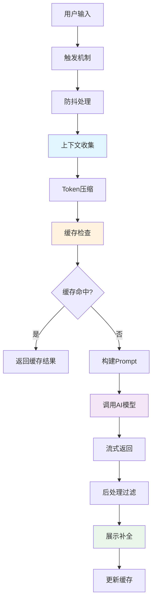

# Code Agent 代码补全实现详解

## 一、代码补全核心流程

### 1.1 整体架构



### 1.2 性能目标

| 指标 | 目标值 | 说明 |
|------|--------|------|
| 首次响应时间 | < 100ms | 从触发到显示第一个字符 |
| 完整补全时间 | < 500ms | 单行补全完整返回 |
| 多行补全时间 | < 1s | 多行补全完整返回 |
| 缓存命中率 | > 60% | 相同上下文复用 |
| 取消率 | < 10% | 用户继续输入导致的取消 |

## 二、触发机制与防抖

### 2.1 触发策略

```typescript
// src/completion/trigger.ts
interface TriggerConfig {
    // 字符触发
    triggerCharacters: string[];
    // 延迟触发（毫秒）
    debounceDelay: number;
    // 最小前缀长度
    minPrefixLength: number;
    // 特殊触发模式
    manualTrigger: boolean;
}

class CompletionTrigger {
    private config: TriggerConfig = {
        triggerCharacters: ['.', '(', ' ', '\n', ':', '='],
        debounceDelay: 150,
        minPrefixLength: 2,
        manualTrigger: true
    };

    private debounceTimer: NodeJS.Timeout | null = null;
    private lastTriggerTime: number = 0;

    shouldTrigger(
        document: vscode.TextDocument,
        position: vscode.Position,
        context: vscode.InlineCompletionContext
    ): boolean {
        // 1. 检查手动触发
        if (context.triggerKind === vscode.InlineCompletionTriggerKind.Invoke) {
            return true;
        }

        // 2. 检查触发字符
        const lineText = document.lineAt(position.line).text;
        const charBeforeCursor = lineText[position.character - 1];

        if (this.config.triggerCharacters.includes(charBeforeCursor)) {
            return true;
        }

        // 3. 检查前缀长度
        const prefix = this.getPrefix(document, position);
        if (prefix.length < this.config.minPrefixLength) {
            return false;
        }

        // 4. 检查是否在注释或字符串中
        if (this.isInCommentOrString(document, position)) {
            return false;
        }

        // 5. 检查是否在有意义的位置
        return this.isMeaningfulPosition(document, position);
    }

    debounce(callback: () => void): void {
        if (this.debounceTimer) {
            clearTimeout(this.debounceTimer);
        }

        this.debounceTimer = setTimeout(() => {
            const now = Date.now();
            // 避免过于频繁的触发
            if (now - this.lastTriggerTime >= this.config.debounceDelay) {
                this.lastTriggerTime = now;
                callback();
            }
        }, this.config.debounceDelay);
    }

    private getPrefix(document: vscode.TextDocument, position: vscode.Position): string {
        const line = document.lineAt(position.line);
        return line.text.substring(0, position.character);
    }

    private isInCommentOrString(
        document: vscode.TextDocument,
        position: vscode.Position
    ): boolean {
        // 简化实现，实际应该使用语法解析
        const line = document.lineAt(position.line).text;
        const prefix = line.substring(0, position.character);

        // 检查单行注释
        if (prefix.includes('//') || prefix.includes('#')) {
            return true;
        }

        // 检查字符串（简单检查引号数量）
        const singleQuotes = (prefix.match(/'/g) || []).length;
        const doubleQuotes = (prefix.match(/"/g) || []).length;

        return singleQuotes % 2 === 1 || doubleQuotes % 2 === 1;
    }

    private isMeaningfulPosition(
        document: vscode.TextDocument,
        position: vscode.Position
    ): boolean {
        const line = document.lineAt(position.line).text;
        const prefix = line.substring(0, position.character).trim();

        // 空行或只有空格，不触发
        if (!prefix) {
            return false;
        }

        // 在关键字后面，应该触发
        const keywords = ['if', 'for', 'while', 'def', 'class', 'function', 'const', 'let', 'var'];
        for (const kw of keywords) {
            if (prefix.endsWith(kw + ' ')) {
                return true;
            }
        }

        return true;
    }
}
```

### 2.2 请求取消机制

```typescript
// src/completion/cancellation.ts
class CompletionCancellation {
    private activeRequests = new Map<string, AbortController>();

    createCancellableRequest(
        requestId: string,
        token: vscode.CancellationToken
    ): AbortController {
        // 取消之前的请求
        this.cancel(requestId);

        const controller = new AbortController();
        this.activeRequests.set(requestId, controller);

        // VSCode取消令牌触发时，取消请求
        token.onCancellationRequested(() => {
            this.cancel(requestId);
        });

        return controller;
    }

    cancel(requestId: string): void {
        const controller = this.activeRequests.get(requestId);
        if (controller) {
            controller.abort();
            this.activeRequests.delete(requestId);
        }
    }

    cancelAll(): void {
        for (const [id, controller] of this.activeRequests) {
            controller.abort();
        }
        this.activeRequests.clear();
    }

    isActive(requestId: string): boolean {
        return this.activeRequests.has(requestId);
    }
}
```

## 三、上下文收集策略

### 3.1 多层次上下文

```typescript
// src/completion/context.ts
interface CompletionContext {
    // 当前行上下文
    currentLine: {
        prefix: string;
        suffix: string;
        indent: number;
    };

    // 文件上下文
    fileContext: {
        language: string;
        filePath: string;
        imports: string[];
        recentEdits: Edit[];
    };

    // 代码块上下文
    blockContext: {
        enclosingFunction?: FunctionInfo;
        enclosingClass?: ClassInfo;
        localVariables: Variable[];
    };

    // 相关代码上下文
    relatedContext: {
        similarFunctions: string[];
        referencedSymbols: Symbol[];
    };

    // 项目上下文
    projectContext?: {
        dependencies: string[];
        commonPatterns: Pattern[];
    };
}

class ContextCollector {
    async collect(
        document: vscode.TextDocument,
        position: vscode.Position
    ): Promise<CompletionContext> {
        return {
            currentLine: this.collectCurrentLine(document, position),
            fileContext: this.collectFileContext(document),
            blockContext: await this.collectBlockContext(document, position),
            relatedContext: await this.collectRelatedContext(document, position),
            projectContext: await this.collectProjectContext(document)
        };
    }

    private collectCurrentLine(
        document: vscode.TextDocument,
        position: vscode.Position
    ) {
        const line = document.lineAt(position.line);
        const prefix = line.text.substring(0, position.character);
        const suffix = line.text.substring(position.character);
        const indent = line.firstNonWhitespaceCharacterIndex;

        return { prefix, suffix, indent };
    }

    private collectFileContext(document: vscode.TextDocument) {
        const text = document.getText();
        const language = document.languageId;
        const filePath = document.uri.fsPath;

        // 提取导入语句
        const imports = this.extractImports(text, language);

        // 获取最近编辑
        const recentEdits = this.getRecentEdits(document);

        return { language, filePath, imports, recentEdits };
    }

    private async collectBlockContext(
        document: vscode.TextDocument,
        position: vscode.Position
    ) {
        // 使用 Tree-sitter 解析代码结构
        const tree = await this.parseDocument(document);
        const node = this.findNodeAtPosition(tree, position);

        // 查找包含的函数
        const enclosingFunction = this.findEnclosingFunction(node);

        // 查找包含的类
        const enclosingClass = this.findEnclosingClass(node);

        // 提取局部变量
        const localVariables = this.extractLocalVariables(node);

        return { enclosingFunction, enclosingClass, localVariables };
    }

    private async collectRelatedContext(
        document: vscode.TextDocument,
        position: vscode.Position
    ) {
        // 查找相似函数（基于向量相似度）
        const currentFunction = await this.getCurrentFunction(document, position);
        const similarFunctions = await this.findSimilarFunctions(currentFunction);

        // 查找引用的符号
        const referencedSymbols = await this.findReferencedSymbols(document, position);

        return { similarFunctions, referencedSymbols };
    }

    private async collectProjectContext(document: vscode.TextDocument) {
        // 读取 package.json 或其他依赖文件
        const dependencies = await this.extractDependencies(document);

        // 分析项目常用模式
        const commonPatterns = await this.analyzeCommonPatterns(document);

        return { dependencies, commonPatterns };
    }

    private extractImports(text: string, language: string): string[] {
        const imports: string[] = [];

        if (language === 'typescript' || language === 'javascript') {
            // 匹配 import 语句
            const importRegex = /import\s+.*?from\s+['"](.+?)['"]/g;
            let match;
            while ((match = importRegex.exec(text)) !== null) {
                imports.push(match[1]);
            }
        } else if (language === 'python') {
            // 匹配 Python import
            const importRegex = /(?:from\s+(\S+)\s+)?import\s+(.+)/g;
            let match;
            while ((match = importRegex.exec(text)) !== null) {
                imports.push(match[1] || match[2]);
            }
        }

        return imports;
    }

    private getRecentEdits(document: vscode.TextDocument): Edit[] {
        // 实际实现需要监听文档变更事件
        return [];
    }

    private async parseDocument(document: vscode.TextDocument): Promise<any> {
        // 使用 Tree-sitter 解析
        // 实际实现需要调用后端 API
        return null;
    }

    private findNodeAtPosition(tree: any, position: vscode.Position): any {
        // 查找指定位置的 AST 节点
        return null;
    }

    private findEnclosingFunction(node: any): FunctionInfo | undefined {
        // 查找包含的函数
        return undefined;
    }

    private findEnclosingClass(node: any): ClassInfo | undefined {
        // 查找包含的类
        return undefined;
    }

    private extractLocalVariables(node: any): Variable[] {
        // 提取局部变量
        return [];
    }

    private async getCurrentFunction(
        document: vscode.TextDocument,
        position: vscode.Position
    ): Promise<string> {
        // 获取当前函数代码
        return '';
    }

    private async findSimilarFunctions(functionCode: string): Promise<string[]> {
        // 使用向量检索查找相似函数
        return [];
    }

    private async findReferencedSymbols(
        document: vscode.TextDocument,
        position: vscode.Position
    ): Promise<Symbol[]> {
        // 查找引用的符号
        return [];
    }

    private async extractDependencies(document: vscode.TextDocument): Promise<string[]> {
        // 提取项目依赖
        return [];
    }

    private async analyzeCommonPatterns(document: vscode.TextDocument): Promise<Pattern[]> {
        // 分析常用模式
        return [];
    }
}

interface Edit {
    range: vscode.Range;
    text: string;
    timestamp: number;
}

interface FunctionInfo {
    name: string;
    parameters: string[];
    returnType?: string;
    body: string;
}

interface ClassInfo {
    name: string;
    methods: string[];
    properties: string[];
}

interface Variable {
    name: string;
    type?: string;
    value?: string;
}

interface Symbol {
    name: string;
    kind: string;
    location: vscode.Location;
}

interface Pattern {
    description: string;
    frequency: number;
    example: string;
}
```

### 3.2 Token管理与压缩

```typescript
// src/completion/token-manager.ts
interface TokenBudget {
    maxTotal: number;
    prefix: number;
    suffix: number;
    fileContext: number;
    relatedContext: number;
}

class TokenManager {
    private budget: TokenBudget = {
        maxTotal: 4000,
        prefix: 1500,
        suffix: 500,
        fileContext: 1000,
        relatedContext: 1000
    };

    compress(context: CompletionContext): CompressedContext {
        const compressed: CompressedContext = {
            prefix: this.compressPrefix(
                context.currentLine.prefix,
                this.budget.prefix
            ),
            suffix: this.compressSuffix(
                context.currentLine.suffix,
                this.budget.suffix
            ),
            fileContext: this.compressFileContext(
                context.fileContext,
                this.budget.fileContext
            ),
            relatedContext: this.compressRelatedContext(
                context.relatedContext,
                this.budget.relatedContext
            )
        };

        // 确保总 token 数不超过限制
        const totalTokens = this.estimateTokens(compressed);
        if (totalTokens > this.budget.maxTotal) {
            return this.aggressiveCompress(compressed, this.budget.maxTotal);
        }

        return compressed;
    }

    private compressPrefix(prefix: string, maxTokens: number): string {
        // 保留最近的代码行，直到达到 token 限制
        const lines = prefix.split('\n');
        const result: string[] = [];
        let tokens = 0;

        for (let i = lines.length - 1; i >= 0; i--) {
            const lineTokens = this.estimateLineTokens(lines[i]);
            if (tokens + lineTokens > maxTokens) {
                break;
            }
            result.unshift(lines[i]);
            tokens += lineTokens;
        }

        return result.join('\n');
    }

    private compressSuffix(suffix: string, maxTokens: number): string {
        // 保留开头的代码行
        const lines = suffix.split('\n');
        const result: string[] = [];
        let tokens = 0;

        for (const line of lines) {
            const lineTokens = this.estimateLineTokens(line);
            if (tokens + lineTokens > maxTokens) {
                break;
            }
            result.push(line);
            tokens += lineTokens;
        }

        return result.join('\n');
    }

    private compressFileContext(
        fileContext: any,
        maxTokens: number
    ): string {
        // 优先保留：导入语句 > 类定义 > 函数签名
        const parts: string[] = [];
        let tokens = 0;

        // 1. 导入语句
        if (fileContext.imports) {
            const imports = fileContext.imports.join('\n');
            const importTokens = this.estimateLineTokens(imports);
            if (tokens + importTokens <= maxTokens) {
                parts.push(imports);
                tokens += importTokens;
            }
        }

        // 2. 类和函数签名（简化版本）
        // ...

        return parts.join('\n\n');
    }

    private compressRelatedContext(
        relatedContext: any,
        maxTokens: number
    ): string {
        // 只保留最相关的几个示例
        const parts: string[] = [];
        let tokens = 0;

        if (relatedContext.similarFunctions) {
            for (const func of relatedContext.similarFunctions) {
                const funcTokens = this.estimateLineTokens(func);
                if (tokens + funcTokens > maxTokens) {
                    break;
                }
                parts.push(func);
                tokens += funcTokens;
            }
        }

        return parts.join('\n\n');
    }

    private estimateTokens(context: CompressedContext): number {
        return (
            this.estimateLineTokens(context.prefix) +
            this.estimateLineTokens(context.suffix) +
            this.estimateLineTokens(context.fileContext) +
            this.estimateLineTokens(context.relatedContext)
        );
    }

    private estimateLineTokens(text: string): number {
        // 简单估算：1 token ≈ 4 字符
        return Math.ceil(text.length / 4);
    }

    private aggressiveCompress(
        context: CompressedContext,
        maxTokens: number
    ): CompressedContext {
        // 激进压缩：按比例缩减每个部分
        const currentTokens = this.estimateTokens(context);
        const ratio = maxTokens / currentTokens;

        return {
            prefix: this.compressPrefix(context.prefix, this.budget.prefix * ratio),
            suffix: this.compressSuffix(context.suffix, this.budget.suffix * ratio),
            fileContext: this.compressFileContext(
                context.fileContext,
                this.budget.fileContext * ratio
            ),
            relatedContext: this.compressRelatedContext(
                context.relatedContext,
                this.budget.relatedContext * ratio
            )
        };
    }
}

interface CompressedContext {
    prefix: string;
    suffix: string;
    fileContext: string;
    relatedContext: string;
}
```

## 四、智能缓存策略

### 4.1 多级缓存架构

```typescript
// src/completion/cache.ts
interface CacheKey {
    prefix: string;
    language: string;
    contextHash: string;
}

interface CacheEntry {
    key: CacheKey;
    completion: string;
    timestamp: number;
    hitCount: number;
    tokenCount: number;
}

class CompletionCache {
    // L1: 内存缓存（最近使用）
    private l1Cache = new Map<string, CacheEntry>();
    private l1MaxSize = 100;

    // L2: LRU 缓存（更大容量）
    private l2Cache = new LRUCache<string, CacheEntry>({ max: 1000 });

    // L3: 磁盘缓存（持久化）
    private l3CachePath: string;

    constructor(context: vscode.ExtensionContext) {
        this.l3CachePath = path.join(
            context.globalStorageUri.fsPath,
            'completion-cache.json'
        );
        this.loadL3Cache();
    }

    async get(key: CacheKey): Promise<string | null> {
        const keyStr = this.serializeKey(key);

        // 1. 检查 L1 缓存
        const l1Hit = this.l1Cache.get(keyStr);
        if (l1Hit) {
            l1Hit.hitCount++;
            return l1Hit.completion;
        }

        // 2. 检查 L2 缓存
        const l2Hit = this.l2Cache.get(keyStr);
        if (l2Hit) {
            // 提升到 L1
            this.promoteToL1(keyStr, l2Hit);
            return l2Hit.completion;
        }

        // 3. 检查 L3 缓存
        const l3Hit = await this.getFromL3(keyStr);
        if (l3Hit) {
            // 提升到 L2
            this.l2Cache.set(keyStr, l3Hit);
            return l3Hit.completion;
        }

        return null;
    }

    async set(key: CacheKey, completion: string): Promise<void> {
        const keyStr = this.serializeKey(key);
        const entry: CacheEntry = {
            key,
            completion,
            timestamp: Date.now(),
            hitCount: 0,
            tokenCount: this.estimateTokens(completion)
        };

        // 添加到 L1
        this.l1Cache.set(keyStr, entry);

        // L1 缓存满了，移动到 L2
        if (this.l1Cache.size > this.l1MaxSize) {
            this.evictFromL1();
        }

        // 异步持久化到 L3
        this.saveToL3(keyStr, entry);
    }

    private serializeKey(key: CacheKey): string {
        // 使用前缀和上下文哈希作为键
        return `${key.language}:${key.contextHash}:${this.hashPrefix(key.prefix)}`;
    }

    private hashPrefix(prefix: string): string {
        // 简单哈希，实际应该使用更好的哈希算法
        let hash = 0;
        for (let i = 0; i < prefix.length; i++) {
            hash = ((hash << 5) - hash) + prefix.charCodeAt(i);
            hash = hash & hash; // Convert to 32bit integer
        }
        return hash.toString(36);
    }

    private promoteToL1(key: string, entry: CacheEntry): void {
        this.l1Cache.set(key, entry);
        if (this.l1Cache.size > this.l1MaxSize) {
            this.evictFromL1();
        }
    }

    private evictFromL1(): void {
        // 找到最少使用的条目移到 L2
        let minHitCount = Infinity;
        let evictKey: string | null = null;

        for (const [key, entry] of this.l1Cache) {
            if (entry.hitCount < minHitCount) {
                minHitCount = entry.hitCount;
                evictKey = key;
            }
        }

        if (evictKey) {
            const entry = this.l1Cache.get(evictKey)!;
            this.l2Cache.set(evictKey, entry);
            this.l1Cache.delete(evictKey);
        }
    }

    private async getFromL3(key: string): Promise<CacheEntry | null> {
        try {
            const data = await fs.promises.readFile(this.l3CachePath, 'utf8');
            const cache = JSON.parse(data);
            return cache[key] || null;
        } catch {
            return null;
        }
    }

    private async saveToL3(key: string, entry: CacheEntry): Promise<void> {
        try {
            let cache: Record<string, CacheEntry> = {};
            try {
                const data = await fs.promises.readFile(this.l3CachePath, 'utf8');
                cache = JSON.parse(data);
            } catch {
                // 文件不存在，使用空缓存
            }

            cache[key] = entry;

            // 限制 L3 缓存大小（最多 10000 条）
            const keys = Object.keys(cache);
            if (keys.length > 10000) {
                // 删除最旧的条目
                keys
                    .sort((a, b) => cache[a].timestamp - cache[b].timestamp)
                    .slice(0, keys.length - 10000)
                    .forEach(k => delete cache[k]);
            }

            await fs.promises.writeFile(
                this.l3CachePath,
                JSON.stringify(cache),
                'utf8'
            );
        } catch (error) {
            console.error('Failed to save to L3 cache:', error);
        }
    }

    private estimateTokens(text: string): number {
        return Math.ceil(text.length / 4);
    }

    async clear(): Promise<void> {
        this.l1Cache.clear();
        this.l2Cache.clear();
        try {
            await fs.promises.unlink(this.l3CachePath);
        } catch {
            // 忽略错误
        }
    }

    getStats() {
        return {
            l1Size: this.l1Cache.size,
            l2Size: this.l2Cache.size,
            totalHits: Array.from(this.l1Cache.values()).reduce(
                (sum, e) => sum + e.hitCount,
                0
            )
        };
    }
}

// LRU Cache 实现（简化版）
class LRUCache<K, V> {
    private cache = new Map<K, V>();
    private max: number;

    constructor(options: { max: number }) {
        this.max = options.max;
    }

    get(key: K): V | undefined {
        const value = this.cache.get(key);
        if (value !== undefined) {
            // 移到最后（最近使用）
            this.cache.delete(key);
            this.cache.set(key, value);
        }
        return value;
    }

    set(key: K, value: V): void {
        // 删除旧的，添加到最后
        this.cache.delete(key);
        this.cache.set(key, value);

        // 超出容量，删除最旧的
        if (this.cache.size > this.max) {
            const firstKey = this.cache.keys().next().value;
            this.cache.delete(firstKey);
        }
    }

    clear(): void {
        this.cache.clear();
    }

    get size(): number {
        return this.cache.size;
    }
}
```

### 4.2 上下文感知缓存

```typescript
// src/completion/context-aware-cache.ts
class ContextAwareCache extends CompletionCache {
    // 基于语义相似度的缓存查找
    async getSimilar(
        key: CacheKey,
        threshold: number = 0.8
    ): Promise<string | null> {
        // 1. 精确匹配
        const exact = await this.get(key);
        if (exact) {
            return exact;
        }

        // 2. 前缀匹配
        const prefixMatch = await this.findByPrefixSimilarity(key, threshold);
        if (prefixMatch) {
            return prefixMatch;
        }

        // 3. 语义匹配（使用嵌入向量）
        const semanticMatch = await this.findBySemanticSimilarity(key, threshold);
        if (semanticMatch) {
            return semanticMatch;
        }

        return null;
    }

    private async findByPrefixSimilarity(
        key: CacheKey,
        threshold: number
    ): Promise<string | null> {
        const candidates: Array<{ entry: CacheEntry; similarity: number }> = [];

        // 遍历缓存，计算前缀相似度
        for (const [_, entry] of this.l1Cache) {
            if (entry.key.language === key.language) {
                const similarity = this.calculatePrefixSimilarity(
                    key.prefix,
                    entry.key.prefix
                );
                if (similarity >= threshold) {
                    candidates.push({ entry, similarity });
                }
            }
        }

        // 返回最相似的
        if (candidates.length > 0) {
            candidates.sort((a, b) => b.similarity - a.similarity);
            return candidates[0].entry.completion;
        }

        return null;
    }

    private calculatePrefixSimilarity(prefix1: string, prefix2: string): number {
        // 使用编辑距离计算相似度
        const maxLen = Math.max(prefix1.length, prefix2.length);
        if (maxLen === 0) return 1.0;

        const distance = this.levenshteinDistance(prefix1, prefix2);
        return 1 - distance / maxLen;
    }

    private levenshteinDistance(str1: string, str2: string): number {
        const matrix: number[][] = [];

        for (let i = 0; i <= str2.length; i++) {
            matrix[i] = [i];
        }

        for (let j = 0; j <= str1.length; j++) {
            matrix[0][j] = j;
        }

        for (let i = 1; i <= str2.length; i++) {
            for (let j = 1; j <= str1.length; j++) {
                if (str2.charAt(i - 1) === str1.charAt(j - 1)) {
                    matrix[i][j] = matrix[i - 1][j - 1];
                } else {
                    matrix[i][j] = Math.min(
                        matrix[i - 1][j - 1] + 1,
                        matrix[i][j - 1] + 1,
                        matrix[i - 1][j] + 1
                    );
                }
            }
        }

        return matrix[str2.length][str1.length];
    }

    private async findBySemanticSimilarity(
        key: CacheKey,
        threshold: number
    ): Promise<string | null> {
        // 实际实现需要调用向量数据库
        // 这里是简化示例
        return null;
    }
}
```

## 五、AI模型调用

### 5.1 Prompt工程

```typescript
// src/completion/prompt-builder.ts
class CompletionPromptBuilder {
    buildPrompt(context: CompressedContext): string {
        return `You are an expert code completion AI. Generate the most likely code continuation.

Language: ${context.language}
File Context:
${context.fileContext}

Related Examples:
${context.relatedContext}

Current Code:
${context.prefix}<CURSOR>${context.suffix}

Instructions:
1. Complete the code at <CURSOR> position
2. Match the existing code style and indentation
3. Only return the completion, no explanations
4. Keep completions concise and relevant
5. For single-line: complete the current statement
6. For multi-line: complete the logical block

Completion:`;
    }

    buildFIMPrompt(context: CompressedContext): string {
        // Fill-in-the-Middle prompt format (用于某些模型)
        return `<fim_prefix>${context.prefix}<fim_suffix>${context.suffix}<fim_middle>`;
    }

    buildChatPrompt(context: CompressedContext): ChatMessage[] {
        return [
            {
                role: 'system',
                content: 'You are an expert code completion assistant. Provide concise, accurate code completions.'
            },
            {
                role: 'user',
                content: `Language: ${context.language}\n\nComplete this code:\n${context.prefix}<CURSOR>${context.suffix}`
            }
        ];
    }
}

interface ChatMessage {
    role: 'system' | 'user' | 'assistant';
    content: string;
}
```

### 5.2 流式响应处理

```typescript
// src/completion/streaming.ts
class StreamingCompletionHandler {
    async handleStream(
        apiClient: APIClient,
        context: CompressedContext,
        onChunk: (chunk: string) => void,
        signal: AbortSignal
    ): Promise<string> {
        const prompt = new CompletionPromptBuilder().buildPrompt(context);
        let fullCompletion = '';
        let buffer = '';

        try {
            const stream = await apiClient.streamCompletion(prompt, signal);

            for await (const chunk of stream) {
                if (signal.aborted) {
                    break;
                }

                buffer += chunk;

                // 逐词发送（在空格或标点处）
                if (this.shouldFlush(buffer)) {
                    onChunk(buffer);
                    fullCompletion += buffer;
                    buffer = '';
                }
            }

            // 发送剩余内容
            if (buffer) {
                onChunk(buffer);
                fullCompletion += buffer;
            }

            return fullCompletion;
        } catch (error) {
            if (signal.aborted) {
                console.log('Completion cancelled');
            } else {
                console.error('Streaming error:', error);
            }
            throw error;
        }
    }

    private shouldFlush(buffer: string): boolean {
        // 在合适的位置刷新缓冲区
        const flushChars = [' ', '\n', '(', ')', '{', '}', ';', ','];
        return flushChars.some(char => buffer.endsWith(char));
    }
}
```

## 六、后处理与过滤

### 6.1 补全质量评估

```typescript
// src/completion/quality-filter.ts
interface QualityScore {
    score: number;
    reasons: string[];
}

class CompletionQualityFilter {
    evaluate(
        completion: string,
        context: CompletionContext
    ): QualityScore {
        const scores: number[] = [];
        const reasons: string[] = [];

        // 1. 语法检查
        const syntaxScore = this.checkSyntax(completion, context.fileContext.language);
        scores.push(syntaxScore);
        if (syntaxScore < 0.5) {
            reasons.push('Syntax issues detected');
        }

        // 2. 缩进一致性
        const indentScore = this.checkIndentation(
            completion,
            context.currentLine.indent
        );
        scores.push(indentScore);
        if (indentScore < 0.8) {
            reasons.push('Indentation mismatch');
        }

        // 3. 代码风格一致性
        const styleScore = this.checkStyle(completion, context);
        scores.push(styleScore);

        // 4. 相关性检查
        const relevanceScore = this.checkRelevance(completion, context);
        scores.push(relevanceScore);
        if (relevanceScore < 0.6) {
            reasons.push('Low relevance to context');
        }

        // 5. 重复性检查
        const repetitionScore = this.checkRepetition(
            completion,
            context.currentLine.prefix
        );
        scores.push(repetitionScore);
        if (repetitionScore < 0.7) {
            reasons.push('Repetitive content');
        }

        const avgScore = scores.reduce((a, b) => a + b, 0) / scores.length;
        return { score: avgScore, reasons };
    }

    shouldAccept(quality: QualityScore, threshold: number = 0.7): boolean {
        return quality.score >= threshold;
    }

    private checkSyntax(completion: string, language: string): number {
        // 简单语法检查
        try {
            if (language === 'javascript' || language === 'typescript') {
                // 检查括号匹配
                const openBrackets = (completion.match(/[{[(]/g) || []).length;
                const closeBrackets = (completion.match(/[}\])]/g) || []).length;

                if (Math.abs(openBrackets - closeBrackets) > 2) {
                    return 0.3;
                }
            }
            return 1.0;
        } catch {
            return 0.5;
        }
    }

    private checkIndentation(completion: string, expectedIndent: number): number {
        const lines = completion.split('\n');
        if (lines.length === 0) return 1.0;

        const firstLine = lines[0];
        const actualIndent = firstLine.search(/\S/);

        if (actualIndent === -1) return 1.0; // 空行

        // 允许缩进差异在 1 个级别（4 个空格）内
        const diff = Math.abs(actualIndent - expectedIndent);
        return Math.max(0, 1 - diff / 8);
    }

    private checkStyle(completion: string, context: CompletionContext): number {
        // 检查代码风格一致性
        const prefix = context.currentLine.prefix;

        // 检查引号风格
        const prefixUsesDouble = prefix.includes('"');
        const prefixUsesSingle = prefix.includes("'");
        const completionUsesDouble = completion.includes('"');
        const completionUsesSingle = completion.includes("'");

        if (prefixUsesDouble && completionUsesSingle) return 0.8;
        if (prefixUsesSingle && completionUsesDouble) return 0.8;

        return 1.0;
    }

    private checkRelevance(completion: string, context: CompletionContext): number {
        // 检查是否与上下文相关
        const prefix = context.currentLine.prefix.toLowerCase();
        const completionLower = completion.toLowerCase();

        // 提取关键词
        const keywords = this.extractKeywords(prefix);
        const matchCount = keywords.filter(kw =>
            completionLower.includes(kw)
        ).length;

        if (keywords.length === 0) return 1.0;
        return matchCount / keywords.length;
    }

    private checkRepetition(completion: string, prefix: string): number {
        // 检查是否过度重复前缀内容
        const lastLine = prefix.split('\n').pop() || '';
        const similarity = this.calculateSimilarity(lastLine, completion);

        // 如果补全与前缀过于相似，降低分数
        return similarity < 0.9 ? 1.0 : 0.5;
    }

    private extractKeywords(text: string): string[] {
        // 提取标识符作为关键词
        const identifierRegex = /\b[a-z_][a-z0-9_]*\b/gi;
        const matches = text.match(identifierRegex) || [];
        return [...new Set(matches.map(m => m.toLowerCase()))];
    }

    private calculateSimilarity(str1: string, str2: string): number {
        const set1 = new Set(str1.split(''));
        const set2 = new Set(str2.split(''));
        const intersection = new Set([...set1].filter(x => set2.has(x)));
        const union = new Set([...set1, ...set2]);
        return intersection.size / union.size;
    }
}
```

### 6.2 智能截断

```typescript
// src/completion/truncation.ts
class CompletionTruncator {
    truncate(completion: string, context: CompletionContext): string {
        // 1. 单行补全：在合适的位置截断
        if (!completion.includes('\n')) {
            return this.truncateSingleLine(completion);
        }

        // 2. 多行补全：保持代码块完整性
        return this.truncateMultiLine(completion, context);
    }

    private truncateSingleLine(completion: string): string {
        // 在语句结束处截断
        const endChars = [';', ',', ')', '}'];

        for (const char of endChars) {
            const index = completion.indexOf(char);
            if (index !== -1) {
                return completion.substring(0, index + 1);
            }
        }

        return completion;
    }

    private truncateMultiLine(
        completion: string,
        context: CompletionContext
    ): string {
        const lines = completion.split('\n');
        const result: string[] = [];
        let bracketCount = 0;

        for (const line of lines) {
            result.push(line);

            // 跟踪括号平衡
            bracketCount += (line.match(/{/g) || []).length;
            bracketCount -= (line.match(/}/g) || []).length;

            // 在代码块结束处停止
            if (bracketCount === 0 && result.length > 1) {
                break;
            }

            // 限制最大行数
            if (result.length >= 10) {
                break;
            }
        }

        return result.join('\n');
    }
}
```

## 七、完整实现示例

### 7.1 补全提供者

```typescript
// src/completion/provider.ts
export class InlineCompletionProvider implements vscode.InlineCompletionItemProvider {
    private trigger = new CompletionTrigger();
    private contextCollector = new ContextCollector();
    private tokenManager = new TokenManager();
    private cache: ContextAwareCache;
    private qualityFilter = new CompletionQualityFilter();
    private truncator = new CompletionTruncator();
    private cancellation = new CompletionCancellation();
    private apiClient: APIClient;

    constructor(context: vscode.ExtensionContext, apiClient: APIClient) {
        this.cache = new ContextAwareCache(context);
        this.apiClient = apiClient;
    }

    async provideInlineCompletionItems(
        document: vscode.TextDocument,
        position: vscode.Position,
        context: vscode.InlineCompletionContext,
        token: vscode.CancellationToken
    ): Promise<vscode.InlineCompletionItem[]> {
        // 1. 检查是否应该触发
        if (!this.trigger.shouldTrigger(document, position, context)) {
            return [];
        }

        // 2. 收集上下文
        const fullContext = await this.contextCollector.collect(document, position);

        // 3. Token 压缩
        const compressedContext = this.tokenManager.compress(fullContext);

        // 4. 生成缓存键
        const cacheKey: CacheKey = {
            prefix: compressedContext.prefix,
            language: document.languageId,
            contextHash: this.hashContext(compressedContext)
        };

        // 5. 检查缓存
        let completion = await this.cache.getSimilar(cacheKey);

        if (!completion) {
            // 6. 调用 AI 模型
            const requestId = `${document.uri.toString()}:${position.line}:${position.character}`;
            const abortController = this.cancellation.createCancellableRequest(
                requestId,
                token
            );

            try {
                const promptBuilder = new CompletionPromptBuilder();
                const prompt = promptBuilder.buildPrompt(compressedContext);

                completion = await this.apiClient.getCompletion(
                    prompt,
                    abortController.signal
                );

                // 7. 保存到缓存
                if (completion) {
                    await this.cache.set(cacheKey, completion);
                }
            } catch (error) {
                if (abortController.signal.aborted) {
                    return [];
                }
                throw error;
            }
        }

        if (!completion) {
            return [];
        }

        // 8. 质量评估
        const quality = this.qualityFilter.evaluate(completion, fullContext);
        if (!this.qualityFilter.shouldAccept(quality)) {
            console.log('Completion rejected:', quality.reasons);
            return [];
        }

        // 9. 智能截断
        const truncated = this.truncator.truncate(completion, fullContext);

        // 10. 返回结果
        return [
            new vscode.InlineCompletionItem(
                truncated,
                new vscode.Range(position, position)
            )
        ];
    }

    private hashContext(context: CompressedContext): string {
        const contextStr = JSON.stringify({
            fileContext: context.fileContext,
            relatedContext: context.relatedContext
        });

        // 简单哈希
        let hash = 0;
        for (let i = 0; i < contextStr.length; i++) {
            hash = ((hash << 5) - hash) + contextStr.charCodeAt(i);
            hash = hash & hash;
        }
        return hash.toString(36);
    }

    dispose() {
        this.cancellation.cancelAll();
    }
}
```

### 7.2 性能监控

```typescript
// src/completion/metrics.ts
class CompletionMetrics {
    private metrics: {
        totalRequests: number;
        cacheHits: number;
        averageLatency: number;
        acceptanceRate: number;
        rejectionReasons: Map<string, number>;
    } = {
        totalRequests: 0,
        cacheHits: 0,
        averageLatency: 0,
        acceptanceRate: 0,
        rejectionReasons: new Map()
    };

    private latencies: number[] = [];

    recordRequest(startTime: number, cacheHit: boolean): void {
        const latency = Date.now() - startTime;
        this.latencies.push(latency);
        this.metrics.totalRequests++;

        if (cacheHit) {
            this.metrics.cacheHits++;
        }

        // 计算平均延迟（保留最近 100 个）
        if (this.latencies.length > 100) {
            this.latencies.shift();
        }
        this.metrics.averageLatency =
            this.latencies.reduce((a, b) => a + b, 0) / this.latencies.length;
    }

    recordRejection(reasons: string[]): void {
        for (const reason of reasons) {
            const count = this.rejectionReasons.get(reason) || 0;
            this.rejectionReasons.set(reason, count + 1);
        }
    }

    getReport(): string {
        const cacheHitRate = this.metrics.totalRequests > 0
            ? (this.metrics.cacheHits / this.metrics.totalRequests * 100).toFixed(1)
            : '0';

        return `
Completion Metrics:
- Total Requests: ${this.metrics.totalRequests}
- Cache Hit Rate: ${cacheHitRate}%
- Average Latency: ${this.metrics.averageLatency.toFixed(0)}ms
- Rejection Reasons: ${JSON.stringify(Object.fromEntries(this.rejectionReasons))}
        `.trim();
    }
}
```

## 八、调试与优化

### 8.1 调试工具

```typescript
// src/completion/debug.ts
class CompletionDebugger {
    private outputChannel: vscode.OutputChannel;

    constructor() {
        this.outputChannel = vscode.window.createOutputChannel('Code Completion Debug');
    }

    logCompletionRequest(context: CompletionContext, cacheKey: string): void {
        this.outputChannel.appendLine('\n=== Completion Request ===');
        this.outputChannel.appendLine(`Time: ${new Date().toISOString()}`);
        this.outputChannel.appendLine(`Language: ${context.fileContext.language}`);
        this.outputChannel.appendLine(`Cache Key: ${cacheKey}`);
        this.outputChannel.appendLine(`Prefix:\n${context.currentLine.prefix}`);
        this.outputChannel.appendLine(`Suffix:\n${context.currentLine.suffix}`);
    }

    logCompletionResult(
        completion: string,
        latency: number,
        cacheHit: boolean,
        quality: QualityScore
    ): void {
        this.outputChannel.appendLine('\n=== Completion Result ===');
        this.outputChannel.appendLine(`Latency: ${latency}ms`);
        this.outputChannel.appendLine(`Cache Hit: ${cacheHit}`);
        this.outputChannel.appendLine(`Quality Score: ${quality.score.toFixed(2)}`);
        if (quality.reasons.length > 0) {
            this.outputChannel.appendLine(`Issues: ${quality.reasons.join(', ')}`);
        }
        this.outputChannel.appendLine(`Completion:\n${completion}`);
    }

    show(): void {
        this.outputChannel.show();
    }
}
```

### 8.2 性能优化建议

1. **并行化处理**
   - 上下文收集和缓存查询并行
   - 多个模型并发调用，取最快结果

2. **预加载策略**
   - 预测下一个可能的补全位置
   - 提前加载相关上下文

3. **智能取消**
   - 用户快速输入时取消旧请求
   - 基于光标移动智能取消

4. **分级服务**
   - 简单补全用快速模型
   - 复杂补全用强大模型

## 九、总结

### 核心要点

1. **性能优化**
   - 多级缓存（L1/L2/L3）
   - 智能防抖和请求取消
   - Token 压缩和上下文管理

2. **质量保证**
   - 多维度质量评估
   - 智能截断和后处理
   - 语法和风格检查

3. **用户体验**
   - < 100ms 首次响应
   - 流式返回
   - 上下文感知

### 下一步

- [VSCode插件开发](/ai/codeagent/vscode-extension.html)
- [AI集成与后端](/ai/codeagent/ai-integration.html)
- [测试与部署](/ai/codeagent/testing-deployment.html)
