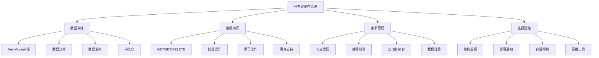
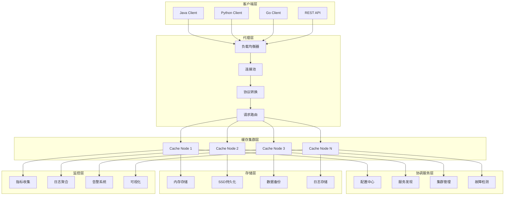

---
title: 分布式缓存系统设计
date: 2025-11-17
categories:
  - Architecture
  - System Design
---

# 分布式缓存系统设计详解

## 目录

1. [需求分析与技术挑战](#1-需求分析与技术挑战)
2. [系统架构设计](#2-系统架构设计)
3. [数据分片与一致性哈希](#3-数据分片与一致性哈希)
4. [缓存淘汰与过期策略](#4-缓存淘汰与过期策略)
5. [高可用与故障恢复](#5-高可用与故障恢复)
6. [网络通信与序列化](#6-网络通信与序列化)
7. [监控与运维](#7-监控与运维)
8. [性能优化与最佳实践](#8-性能优化与最佳实践)
9. [实际案例分析](#9-实际案例分析)
10. [总结与发展趋势](#10-总结与发展趋势)

---

## 1. 需求分析与技术挑战

### 1.1 业务需求分析

#### 1.1.1 核心功能需求


#### 1.1.2 性能需求指标
| 指标类型 | 目标值 | 说明 |
|----------|--------|------|
| **延迟要求** | P99 < 1ms | 99%的请求响应时间小于1毫秒 |
| **吞吐量** | 100万 QPS | 支持百万级查询每秒 |
| **可用性** | 99.99% | 年度停机时间小于52分钟 |
| **数据一致性** | 最终一致性 | 支持强一致性和最终一致性选择 |
| **扩展性** | 线性扩展 | 支持水平扩展到1000+节点 |
| **内存利用率** | >90% | 高效的内存使用率 |

### 1.2 技术挑战分析

#### 1.2.1 分布式系统核心问题
```java
/**
 * 分布式缓存系统面临的核心挑战
 */
public enum DistributedCacheChallenge {

    // CAP理论相关挑战
    CAP_THEOREM("CAP理论权衡",
        "在一致性(Consistency)、可用性(Availability)、分区容错性(Partition Tolerance)之间做权衡"),

    // 数据分布挑战
    DATA_DISTRIBUTION("数据分布",
        "如何均匀分布数据，避免热点问题，支持动态扩缩容"),

    // 一致性挑战
    CONSISTENCY("数据一致性",
        "多副本之间的数据一致性保证，处理网络分区和节点故障"),

    // 性能挑战
    PERFORMANCE("性能优化",
        "低延迟、高吞吐量、内存效率、网络优化"),

    // 可用性挑战
    AVAILABILITY("高可用性",
        "故障检测、自动恢复、数据备份、服务降级"),

    // 运维挑战
    OPERATIONS("运维复杂度",
        "监控告警、容量规划、版本升级、故障排查");

    private final String name;
    private final String description;

    DistributedCacheChallenge(String name, String description) {
        this.name = name;
        this.description = description;
    }
}
```

#### 1.2.2 设计目标与权衡
```yaml
# 分布式缓存系统设计目标
design_objectives:
  primary_goals:
    - high_performance: "超低延迟和高吞吐量"
    - high_availability: "99.99%可用性保证"
    - horizontal_scalability: "支持线性水平扩展"
    - data_consistency: "可配置的一致性级别"

  trade_offs:
    consistency_vs_availability:
      description: "一致性与可用性的权衡"
      approach: "支持多种一致性级别，用户可根据业务需求选择"

    performance_vs_durability:
      description: "性能与持久性的权衡"
      approach: "提供内存模式和持久化模式，支持异步持久化"

    complexity_vs_functionality:
      description: "复杂度与功能性的权衡"
      approach: "采用模块化设计，核心功能简单高效，高级功能可选"

  constraints:
    - memory_efficiency: "内存使用效率>90%"
    - network_overhead: "网络开销最小化"
    - operational_simplicity: "运维操作简单化"
    - backward_compatibility: "版本间向后兼容"
```

### 1.3 系统架构原则

#### 1.3.1 设计原则
```java
/**
 * 分布式缓存系统设计原则
 */
@Component
public class DistributedCacheDesignPrinciples {

    /**
     * 1. 单一职责原则 (Single Responsibility Principle)
     * 每个组件只负责一个明确的职责
     */
    public interface CacheNode {
        // 只负责数据存储和基本操作
        CompletableFuture<String> get(String key);
        CompletableFuture<Boolean> set(String key, String value);
        CompletableFuture<Boolean> delete(String key);
    }

    public interface ClusterManager {
        // 只负责集群管理
        List<CacheNode> getAvailableNodes();
        void addNode(CacheNode node);
        void removeNode(CacheNode node);
    }

    /**
     * 2. 开闭原则 (Open-Closed Principle)
     * 对扩展开放，对修改关闭
     */
    public interface ConsistentHashAlgorithm {
        CacheNode selectNode(String key);
        void addNode(CacheNode node);
        void removeNode(CacheNode node);
    }

    // 可以轻松扩展不同的一致性哈希算法
    public class StandardConsistentHash implements ConsistentHashAlgorithm { }
    public class JumpConsistentHash implements ConsistentHashAlgorithm { }
    public class RendezvousHash implements ConsistentHashAlgorithm { }

    /**
     * 3. 接口隔离原则 (Interface Segregation Principle)
     * 客户端不应该依赖它不需要的接口
     */
    public interface BasicCacheOperations {
        CompletableFuture<String> get(String key);
        CompletableFuture<Boolean> set(String key, String value);
    }

    public interface AdvancedCacheOperations {
        CompletableFuture<Boolean> setWithTtl(String key, String value, Duration ttl);
        CompletableFuture<Long> increment(String key);
        CompletableFuture<Boolean> compareAndSwap(String key, String expected, String update);
    }

    /**
     * 4. 依赖倒置原则 (Dependency Inversion Principle)
     * 高层模块不应该依赖低层模块，都应该依赖抽象
     */
    @Service
    public class CacheService {
        private final ConsistentHashAlgorithm hashAlgorithm;
        private final Serializer serializer;
        private final NetworkTransport transport;

        public CacheService(ConsistentHashAlgorithm hashAlgorithm,
                          Serializer serializer,
                          NetworkTransport transport) {
            this.hashAlgorithm = hashAlgorithm;
            this.serializer = serializer;
            this.transport = transport;
        }
    }

    /**
     * 5. 最少知识原则 (Law of Demeter)
     * 一个对象应该对其他对象有最少的了解
     */
    public class CacheClient {
        private final CacheService cacheService;

        public CompletableFuture<String> get(String key) {
            // 客户端不需要知道内部的哈希算法、网络传输等细节
            return cacheService.get(key);
        }
    }
}
```

---

## 2. 系统架构设计

### 2.1 整体架构

#### 2.1.1 分层架构设计


#### 2.1.2 核心组件设计
```java
/**
 * 分布式缓存系统核心组件
 */
public class DistributedCacheSystemArchitecture {

    /**
     * 缓存节点 - 系统的基本单元
     */
    @Component
    public class CacheNode {
        private final String nodeId;
        private final InetSocketAddress address;
        private final ConcurrentHashMap<String, CacheEntry> dataStore;
        private final ScheduledExecutorService scheduler;
        private final MetricsCollector metrics;
        private volatile NodeStatus status;

        public CacheNode(String nodeId, InetSocketAddress address) {
            this.nodeId = nodeId;
            this.address = address;
            this.dataStore = new ConcurrentHashMap<>();
            this.scheduler = Executors.newScheduledThreadPool(4);
            this.metrics = new MetricsCollector();
            this.status = NodeStatus.INITIALIZING;
        }

        /**
         * 基本的CRUD操作
         */
        public CompletableFuture<CacheEntry> get(String key) {
            return CompletableFuture.supplyAsync(() -> {
                CacheEntry entry = dataStore.get(key);

                if (entry == null) {
                    metrics.recordCacheMiss(key);
                    return null;
                }

                if (entry.isExpired()) {
                    dataStore.remove(key);
                    metrics.recordCacheMiss(key);
                    return null;
                }

                metrics.recordCacheHit(key);
                entry.updateAccessTime();
                return entry;
            });
        }

        public CompletableFuture<Boolean> set(String key, String value, Duration ttl) {
            return CompletableFuture.supplyAsync(() -> {
                CacheEntry entry = new CacheEntry(key, value, ttl);
                CacheEntry previous = dataStore.put(key, entry);

                metrics.recordSet(key, value.length());

                // 如果设置了TTL，安排过期任务
                if (ttl != null && !ttl.isZero()) {
                    scheduleExpiration(key, ttl);
                }

                return true;
            });
        }

        public CompletableFuture<Boolean> delete(String key) {
            return CompletableFuture.supplyAsync(() -> {
                CacheEntry removed = dataStore.remove(key);
                if (removed != null) {
                    metrics.recordDelete(key);
                    return true;
                }
                return false;
            });
        }

        /**
         * 原子操作支持
         */
        public CompletableFuture<Boolean> compareAndSwap(String key, String expected, String update, Duration ttl) {
            return CompletableFuture.supplyAsync(() -> {
                return dataStore.compute(key, (k, existing) -> {
                    if (existing == null && expected == null) {
                        return new CacheEntry(key, update, ttl);
                    } else if (existing != null && !existing.isExpired() &&
                              Objects.equals(existing.getValue(), expected)) {
                        return new CacheEntry(key, update, ttl);
                    }
                    return existing;
                }) != null;
            });
        }

        /**
         * 批量操作
         */
        public CompletableFuture<Map<String, CacheEntry>> multiGet(Set<String> keys) {
            return CompletableFuture.supplyAsync(() -> {
                Map<String, CacheEntry> result = new HashMap<>();
                for (String key : keys) {
                    CacheEntry entry = dataStore.get(key);
                    if (entry != null && !entry.isExpired()) {
                        result.put(key, entry);
                        entry.updateAccessTime();
                    }
                }
                return result;
            });
        }

        public CompletableFuture<Boolean> multiSet(Map<String, String> keyValues, Duration ttl) {
            return CompletableFuture.supplyAsync(() -> {
                for (Map.Entry<String, String> kv : keyValues.entrySet()) {
                    CacheEntry entry = new CacheEntry(kv.getKey(), kv.getValue(), ttl);
                    dataStore.put(kv.getKey(), entry);

                    if (ttl != null && !ttl.isZero()) {
                        scheduleExpiration(kv.getKey(), ttl);
                    }
                }
                return true;
            });
        }

        /**
         * 过期任务调度
         */
        private void scheduleExpiration(String key, Duration ttl) {
            scheduler.schedule(() -> {
                CacheEntry entry = dataStore.get(key);
                if (entry != null && entry.isExpired()) {
                    dataStore.remove(key);
                    metrics.recordExpiration(key);
                }
            }, ttl.toMillis(), TimeUnit.MILLISECONDS);
        }

        /**
         * 节点健康检查
         */
        public NodeHealthStatus getHealthStatus() {
            return NodeHealthStatus.builder()
                .nodeId(nodeId)
                .status(status)
                .memoryUsage(getMemoryUsage())
                .cpuUsage(getCpuUsage())
                .activeConnections(getActiveConnections())
                .requestsPerSecond(metrics.getRequestsPerSecond())
                .cacheHitRate(metrics.getCacheHitRate())
                .build();
        }

        /**
         * 数据迁移支持
         */
        public CompletableFuture<Map<String, CacheEntry>> exportData(Predicate<String> keyFilter) {
            return CompletableFuture.supplyAsync(() -> {
                return dataStore.entrySet().stream()
                    .filter(entry -> keyFilter.test(entry.getKey()))
                    .filter(entry -> !entry.getValue().isExpired())
                    .collect(Collectors.toMap(
                        Map.Entry::getKey,
                        Map.Entry::getValue
                    ));
            });
        }

        public CompletableFuture<Boolean> importData(Map<String, CacheEntry> data) {
            return CompletableFuture.supplyAsync(() -> {
                for (Map.Entry<String, CacheEntry> entry : data.entrySet()) {
                    if (!entry.getValue().isExpired()) {
                        dataStore.put(entry.getKey(), entry.getValue());
                    }
                }
                return true;
            });
        }
    }

    /**
     * 缓存条目数据结构
     */
    @Data
    @Builder
    public static class CacheEntry {
        private final String key;
        private final String value;
        private final long createTime;
        private volatile long lastAccessTime;
        private final long expireTime;
        private final int version;

        public CacheEntry(String key, String value, Duration ttl) {
            this.key = key;
            this.value = value;
            this.createTime = System.currentTimeMillis();
            this.lastAccessTime = createTime;
            this.expireTime = ttl != null ? createTime + ttl.toMillis() : Long.MAX_VALUE;
            this.version = 1;
        }

        public boolean isExpired() {
            return System.currentTimeMillis() > expireTime;
        }

        public void updateAccessTime() {
            this.lastAccessTime = System.currentTimeMillis();
        }

        public long getSize() {
            // 估算条目占用的内存大小
            return 8 + // createTime
                   8 + // lastAccessTime
                   8 + // expireTime
                   4 + // version
                   (key != null ? key.length() * 2 : 0) + // key size (assuming UTF-16)
                   (value != null ? value.length() * 2 : 0); // value size
        }
    }

    /**
     * 节点状态枚举
     */
    public enum NodeStatus {
        INITIALIZING("初始化中"),
        ACTIVE("活跃"),
        DEGRADED("降级"),
        MAINTENANCE("维护中"),
        FAILED("故障"),
        SHUTDOWN("已关闭");

        private final String description;

        NodeStatus(String description) {
            this.description = description;
        }
    }
}
```

### 2.2 集群管理器

#### 2.2.1 集群管理核心功能
```java
/**
 * 集群管理器 - 负责节点管理、故障检测、负载均衡
 */
@Component
public class ClusterManager {

    private final Map<String, CacheNode> activeNodes;
    private final Map<String, CacheNode> failedNodes;
    private final ConsistentHashRing hashRing;
    private final FailureDetector failureDetector;
    private final LoadBalancer loadBalancer;
    private final ScheduledExecutorService scheduler;
    private final EventBus eventBus;

    public ClusterManager() {
        this.activeNodes = new ConcurrentHashMap<>();
        this.failedNodes = new ConcurrentHashMap<>();
        this.hashRing = new ConsistentHashRing();
        this.failureDetector = new FailureDetector();
        this.loadBalancer = new LoadBalancer();
        this.scheduler = Executors.newScheduledThreadPool(8);
        this.eventBus = new EventBus();

        startBackgroundTasks();
    }

    /**
     * 节点注册
     */
    public CompletableFuture<Boolean> registerNode(CacheNode node) {
        return CompletableFuture.supplyAsync(() -> {
            String nodeId = node.getNodeId();

            // 检查节点是否已存在
            if (activeNodes.containsKey(nodeId)) {
                log.warn("节点已存在: {}", nodeId);
                return false;
            }

            // 健康检查
            if (!performHealthCheck(node)) {
                log.error("节点健康检查失败: {}", nodeId);
                return false;
            }

            // 添加到活跃节点列表
            activeNodes.put(nodeId, node);

            // 添加到一致性哈希环
            hashRing.addNode(node);

            // 更新负载均衡器
            loadBalancer.addNode(node);

            // 开始监控节点
            failureDetector.startMonitoring(node);

            // 发布节点加入事件
            eventBus.post(new NodeJoinedEvent(node));

            log.info("节点注册成功: {}", nodeId);
            return true;
        });
    }

    /**
     * 节点注销
     */
    public CompletableFuture<Boolean> unregisterNode(String nodeId) {
        return CompletableFuture.supplyAsync(() -> {
            CacheNode node = activeNodes.remove(nodeId);
            if (node == null) {
                log.warn("节点不存在: {}", nodeId);
                return false;
            }

            // 从一致性哈希环中移除
            hashRing.removeNode(node);

            // 从负载均衡器中移除
            loadBalancer.removeNode(node);

            // 停止监控
            failureDetector.stopMonitoring(node);

            // 触发数据迁移
            triggerDataMigration(node);

            // 发布节点离开事件
            eventBus.post(new NodeLeftEvent(node));

            log.info("节点注销成功: {}", nodeId);
            return true;
        });
    }

    /**
     * 获取负责指定key的节点
     */
    public CacheNode getNodeForKey(String key) {
        return hashRing.getNode(key);
    }

    /**
     * 获取指定key的副本节点列表
     */
    public List<CacheNode> getReplicaNodesForKey(String key, int replicaCount) {
        return hashRing.getReplicaNodes(key, replicaCount);
    }

    /**
     * 节点故障处理
     */
    @EventListener
    public void handleNodeFailure(NodeFailureEvent event) {
        CacheNode failedNode = event.getNode();
        String nodeId = failedNode.getNodeId();

        log.error("检测到节点故障: {}", nodeId);

        // 从活跃节点中移除
        activeNodes.remove(nodeId);
        failedNodes.put(nodeId, failedNode);

        // 从一致性哈希环中移除
        hashRing.removeNode(failedNode);

        // 从负载均衡器中移除
        loadBalancer.removeNode(failedNode);

        // 触发故障转移
        triggerFailover(failedNode);

        // 启动节点恢复监控
        scheduleNodeRecovery(failedNode);
    }

    /**
     * 节点恢复处理
     */
    private void scheduleNodeRecovery(CacheNode failedNode) {
        scheduler.scheduleWithFixedDelay(() -> {
            try {
                if (performHealthCheck(failedNode)) {
                    log.info("节点恢复: {}", failedNode.getNodeId());

                    // 重新注册节点
                    registerNode(failedNode);

                    // 从故障节点列表中移除
                    failedNodes.remove(failedNode.getNodeId());

                    // 触发数据同步
                    triggerDataSynchronization(failedNode);
                }
            } catch (Exception e) {
                log.error("节点恢复检查失败: {}", failedNode.getNodeId(), e);
            }
        }, 10, 30, TimeUnit.SECONDS);
    }

    /**
     * 集群重平衡
     */
    public CompletableFuture<Boolean> rebalanceCluster() {
        return CompletableFuture.supplyAsync(() -> {
            log.info("开始集群重平衡...");

            try {
                // 1. 分析当前数据分布
                ClusterDataDistribution distribution = analyzeDataDistribution();

                // 2. 计算理想的数据分布
                ClusterDataDistribution idealDistribution = calculateIdealDistribution();

                // 3. 生成迁移计划
                List<DataMigrationTask> migrationTasks = generateMigrationPlan(
                    distribution, idealDistribution);

                // 4. 执行数据迁移
                executeMigrationTasks(migrationTasks);

                // 5. 验证迁移结果
                verifyMigrationResults();

                log.info("集群重平衡完成");
                return true;

            } catch (Exception e) {
                log.error("集群重平衡失败", e);
                return false;
            }
        });
    }

    /**
     * 集群状态监控
     */
    private void startBackgroundTasks() {
        // 集群健康监控
        scheduler.scheduleWithFixedDelay(this::monitorClusterHealth,
            10, 30, TimeUnit.SECONDS);

        // 性能指标收集
        scheduler.scheduleWithFixedDelay(this::collectClusterMetrics,
            5, 15, TimeUnit.SECONDS);

        // 自动故障转移
        scheduler.scheduleWithFixedDelay(this::performAutomaticFailover,
            1, 5, TimeUnit.SECONDS);

        // 集群优化
        scheduler.scheduleWithFixedDelay(this::optimizeCluster,
            1, 60, TimeUnit.MINUTES);
    }

    private void monitorClusterHealth() {
        try {
            ClusterHealthStatus healthStatus = calculateClusterHealth();

            if (healthStatus.getOverallHealth() < 0.8) {
                log.warn("集群健康度较低: {}", healthStatus.getOverallHealth());
                eventBus.post(new ClusterDegradedEvent(healthStatus));
            }

            // 更新监控指标
            updateHealthMetrics(healthStatus);

        } catch (Exception e) {
            log.error("集群健康监控失败", e);
        }
    }

    private ClusterHealthStatus calculateClusterHealth() {
        int totalNodes = activeNodes.size() + failedNodes.size();
        int activeNodeCount = activeNodes.size();
        double availability = (double) activeNodeCount / totalNodes;

        double avgCpuUsage = activeNodes.values().stream()
            .mapToDouble(node -> node.getHealthStatus().getCpuUsage())
            .average()
            .orElse(0.0);

        double avgMemoryUsage = activeNodes.values().stream()
            .mapToDouble(node -> node.getHealthStatus().getMemoryUsage())
            .average()
            .orElse(0.0);

        double avgHitRate = activeNodes.values().stream()
            .mapToDouble(node -> node.getHealthStatus().getCacheHitRate())
            .average()
            .orElse(0.0);

        // 综合健康度计算
        double overallHealth = (availability * 0.4) +
                              ((1.0 - avgCpuUsage) * 0.2) +
                              ((1.0 - avgMemoryUsage) * 0.2) +
                              (avgHitRate * 0.2);

        return ClusterHealthStatus.builder()
            .totalNodes(totalNodes)
            .activeNodes(activeNodeCount)
            .availability(availability)
            .avgCpuUsage(avgCpuUsage)
            .avgMemoryUsage(avgMemoryUsage)
            .avgHitRate(avgHitRate)
            .overallHealth(overallHealth)
            .timestamp(System.currentTimeMillis())
            .build();
    }

    /**
     * 故障转移处理
     */
    private void triggerFailover(CacheNode failedNode) {
        log.info("触发故障转移: {}", failedNode.getNodeId());

        // 1. 找到受影响的数据范围
        Set<String> affectedKeys = hashRing.getKeysForNode(failedNode);

        // 2. 重新分配这些keys到其他节点
        Map<CacheNode, Set<String>> redistributionPlan = redistributeKeys(affectedKeys);

        // 3. 如果有副本，从副本恢复数据
        if (hasReplicas()) {
            recoverFromReplicas(failedNode, redistributionPlan);
        }

        // 4. 更新客户端路由信息
        updateClientRouting();

        // 5. 发布故障转移完成事件
        eventBus.post(new FailoverCompletedEvent(failedNode, redistributionPlan));
    }

    private void recoverFromReplicas(CacheNode failedNode, Map<CacheNode, Set<String>> redistributionPlan) {
        for (Map.Entry<CacheNode, Set<String>> entry : redistributionPlan.entrySet()) {
            CacheNode targetNode = entry.getKey();
            Set<String> keys = entry.getValue();

            // 从副本节点恢复数据
            CompletableFuture.runAsync(() -> {
                try {
                    List<CacheNode> replicaNodes = getReplicaNodesForNode(failedNode);
                    for (CacheNode replica : replicaNodes) {
                        if (replica.getStatus() == NodeStatus.ACTIVE) {
                            // 从副本获取数据并迁移到目标节点
                            Map<String, CacheEntry> data = replica.exportData(keys::contains).get();
                            targetNode.importData(data).get();
                            break;
                        }
                    }
                } catch (Exception e) {
                    log.error("从副本恢复数据失败", e);
                }
            });
        }
    }
}
```

---

## 3. 数据分片与一致性哈希

### 3.1 一致性哈希算法实现

#### 3.1.1 标准一致性哈希
```java
/**
 * 一致性哈希环实现
 */
@Component
public class ConsistentHashRing {

    private final TreeMap<Long, CacheNode> ring;
    private final Map<CacheNode, Set<Long>> nodeToTokens;
    private final int virtualNodeCount;
    private final HashFunction hashFunction;
    private final ReadWriteLock lock;

    public ConsistentHashRing() {
        this.ring = new TreeMap<>();
        this.nodeToTokens = new ConcurrentHashMap<>();
        this.virtualNodeCount = 150; // 每个物理节点对应150个虚拟节点
        this.hashFunction = Hashing.murmur3_128();
        this.lock = new ReentrantReadWriteLock();
    }

    /**
     * 添加节点到哈希环
     */
    public void addNode(CacheNode node) {
        lock.writeLock().lock();
        try {
            Set<Long> tokens = generateTokensForNode(node);
            nodeToTokens.put(node, tokens);

            for (Long token : tokens) {
                ring.put(token, node);
            }

            log.info("节点已添加到哈希环: {}, 虚拟节点数: {}",
                node.getNodeId(), tokens.size());

        } finally {
            lock.writeLock().unlock();
        }
    }

    /**
     * 从哈希环移除节点
     */
    public void removeNode(CacheNode node) {
        lock.writeLock().lock();
        try {
            Set<Long> tokens = nodeToTokens.remove(node);
            if (tokens != null) {
                for (Long token : tokens) {
                    ring.remove(token);
                }
                log.info("节点已从哈希环移除: {}, 移除虚拟节点数: {}",
                    node.getNodeId(), tokens.size());
            }
        } finally {
            lock.writeLock().unlock();
        }
    }

    /**
     * 获取key对应的节点
     */
    public CacheNode getNode(String key) {
        if (ring.isEmpty()) {
            return null;
        }

        lock.readLock().lock();
        try {
            long hash = hashKey(key);

            // 查找第一个大于等于hash值的节点
            Map.Entry<Long, CacheNode> entry = ring.ceilingEntry(hash);

            // 如果没有找到，说明hash值比所有节点都大，选择第一个节点（环形结构）
            if (entry == null) {
                entry = ring.firstEntry();
            }

            return entry.getValue();
        } finally {
            lock.readLock().unlock();
        }
    }

    /**
     * 获取key的副本节点列表
     */
    public List<CacheNode> getReplicaNodes(String key, int replicaCount) {
        if (ring.isEmpty() || replicaCount <= 0) {
            return Collections.emptyList();
        }

        lock.readLock().lock();
        try {
            long hash = hashKey(key);
            List<CacheNode> replicas = new ArrayList<>();
            Set<CacheNode> selectedNodes = new HashSet<>();

            // 从hash位置开始，顺时针查找不同的物理节点
            Map.Entry<Long, CacheNode> current = ring.ceilingEntry(hash);
            if (current == null) {
                current = ring.firstEntry();
            }

            // 遍历环，选择不同的物理节点作为副本
            Iterator<Map.Entry<Long, CacheNode>> iterator =
                ring.tailMap(current.getKey()).entrySet().iterator();

            while (replicas.size() < replicaCount && selectedNodes.size() < ring.size()) {
                if (!iterator.hasNext()) {
                    // 到达环的末尾，从头开始
                    iterator = ring.entrySet().iterator();
                }

                Map.Entry<Long, CacheNode> entry = iterator.next();
                CacheNode node = entry.getValue();

                if (!selectedNodes.contains(node)) {
                    replicas.add(node);
                    selectedNodes.add(node);
                }
            }

            return replicas;
        } finally {
            lock.readLock().unlock();
        }
    }

    /**
     * 生成节点的虚拟节点tokens
     */
    private Set<Long> generateTokensForNode(CacheNode node) {
        Set<Long> tokens = new HashSet<>();
        String nodeId = node.getNodeId();

        for (int i = 0; i < virtualNodeCount; i++) {
            String virtualNodeId = nodeId + "#" + i;
            long token = hashString(virtualNodeId);
            tokens.add(token);
        }

        return tokens;
    }

    /**
     * 哈希key
     */
    private long hashKey(String key) {
        return hashFunction.hashString(key, StandardCharsets.UTF_8).asLong();
    }

    /**
     * 哈希字符串
     */
    private long hashString(String str) {
        return hashFunction.hashString(str, StandardCharsets.UTF_8).asLong();
    }

    /**
     * 分析数据分布情况
     */
    public DataDistributionAnalysis analyzeDistribution() {
        lock.readLock().lock();
        try {
            Map<CacheNode, Integer> nodeKeyCount = new HashMap<>();
            Map<CacheNode, Double> nodeLoadPercentage = new HashMap<>();

            // 计算每个节点负责的token范围
            List<Map.Entry<Long, CacheNode>> sortedEntries = new ArrayList<>(ring.entrySet());

            for (int i = 0; i < sortedEntries.size(); i++) {
                Map.Entry<Long, CacheNode> current = sortedEntries.get(i);
                Map.Entry<Long, CacheNode> next = sortedEntries.get((i + 1) % sortedEntries.size());

                CacheNode node = current.getValue();
                long rangeSize = calculateRangeSize(current.getKey(), next.getKey());

                nodeKeyCount.merge(node, (int) rangeSize, Integer::sum);
            }

            // 计算负载百分比
            int totalKeys = nodeKeyCount.values().stream().mapToInt(Integer::intValue).sum();
            for (Map.Entry<CacheNode, Integer> entry : nodeKeyCount.entrySet()) {
                double percentage = (double) entry.getValue() / totalKeys * 100;
                nodeLoadPercentage.put(entry.getKey(), percentage);
            }

            // 计算负载均衡度（标准差）
            double avgLoad = 100.0 / nodeKeyCount.size();
            double variance = nodeLoadPercentage.values().stream()
                .mapToDouble(load -> Math.pow(load - avgLoad, 2))
                .average()
                .orElse(0.0);
            double balanceFactor = Math.sqrt(variance);

            return DataDistributionAnalysis.builder()
                .nodeKeyCount(nodeKeyCount)
                .nodeLoadPercentage(nodeLoadPercentage)
                .balanceFactor(balanceFactor)
                .totalNodes(nodeKeyCount.size())
                .totalVirtualNodes(ring.size())
                .build();

        } finally {
            lock.readLock().unlock();
        }
    }

    private long calculateRangeSize(long start, long end) {
        if (end > start) {
            return end - start;
        } else {
            // 环形结构，跨越了Long.MAX_VALUE
            return (Long.MAX_VALUE - start) + (end - Long.MIN_VALUE);
        }
    }

    /**
     * 获取受节点移除影响的keys
     */
    public Set<String> getAffectedKeys(CacheNode removedNode) {
        // 这个方法需要结合实际的key存储来实现
        // 在实际实现中，需要遍历该节点负责的token范围内的所有keys
        Set<String> affectedKeys = new HashSet<>();

        Set<Long> nodeTokens = nodeToTokens.get(removedNode);
        if (nodeTokens != null) {
            for (Long token : nodeTokens) {
                // 获取该token负责的key范围
                // 这里需要实际的key索引支持
                affectedKeys.addAll(getKeysInTokenRange(token));
            }
        }

        return affectedKeys;
    }

    private Set<String> getKeysInTokenRange(Long token) {
        // 实际实现中需要维护token到key的映射
        // 或者通过扫描所有key来确定哪些属于这个token范围
        return Collections.emptySet();
    }
}

/**
 * 数据分布分析结果
 */
@Data
@Builder
public class DataDistributionAnalysis {
    private final Map<CacheNode, Integer> nodeKeyCount;
    private final Map<CacheNode, Double> nodeLoadPercentage;
    private final double balanceFactor; // 负载均衡因子，越小越均衡
    private final int totalNodes;
    private final int totalVirtualNodes;

    /**
     * 检查负载是否均衡
     */
    public boolean isBalanced(double threshold) {
        return balanceFactor < threshold;
    }

    /**
     * 获取负载最高的节点
     */
    public CacheNode getHighestLoadNode() {
        return nodeLoadPercentage.entrySet().stream()
            .max(Map.Entry.comparingByValue())
            .map(Map.Entry::getKey)
            .orElse(null);
    }

    /**
     * 获取负载最低的节点
     */
    public CacheNode getLowestLoadNode() {
        return nodeLoadPercentage.entrySet().stream()
            .min(Map.Entry.comparingByValue())
            .map(Map.Entry::getKey)
            .orElse(null);
    }
}
```

### 3.2 改进的一致性哈希算法

#### 3.2.1 Jump Consistent Hash
```java
/**
 * Jump Consistent Hash 实现
 * 优点：计算复杂度O(log n)，内存使用极少，负载均衡性好
 * 缺点：只支持节点数量变化，不支持任意节点的添加删除
 */
@Component
public class JumpConsistentHash implements ConsistentHashAlgorithm {

    private final List<CacheNode> nodes;
    private final ReadWriteLock lock;

    public JumpConsistentHash() {
        this.nodes = new ArrayList<>();
        this.lock = new ReentrantReadWriteLock();
    }

    /**
     * Jump Consistent Hash 核心算法
     */
    public CacheNode selectNode(String key) {
        lock.readLock().lock();
        try {
            if (nodes.isEmpty()) {
                return null;
            }

            long keyHash = hash(key);
            int bucket = jumpConsistentHash(keyHash, nodes.size());
            return nodes.get(bucket);
        } finally {
            lock.readLock().unlock();
        }
    }

    /**
     * Jump Consistent Hash 算法实现
     */
    private int jumpConsistentHash(long key, int numBuckets) {
        int b = -1;
        int j = 0;

        while (j < numBuckets) {
            b = j;
            key = key * 2862933555777941757L + 1;
            j = (int) ((b + 1) * (((long) 1 << 31) / (double) ((key >>> 33) + 1)));
        }

        return b;
    }

    @Override
    public void addNode(CacheNode node) {
        lock.writeLock().lock();
        try {
            nodes.add(node);
            log.info("节点已添加到Jump Hash: {}, 当前节点数: {}",
                node.getNodeId(), nodes.size());
        } finally {
            lock.writeLock().unlock();
        }
    }

    @Override
    public void removeNode(CacheNode node) {
        lock.writeLock().lock();
        try {
            boolean removed = nodes.remove(node);
            if (removed) {
                log.info("节点已从Jump Hash移除: {}, 当前节点数: {}",
                    node.getNodeId(), nodes.size());
            }
        } finally {
            lock.writeLock().unlock();
        }
    }

    private long hash(String key) {
        return Hashing.murmur3_128().hashString(key, StandardCharsets.UTF_8).asLong();
    }

    /**
     * 分析跳跃一致性哈希的分布情况
     */
    public JumpHashDistributionAnalysis analyzeDistribution(int sampleSize) {
        lock.readLock().lock();
        try {
            if (nodes.isEmpty()) {
                return JumpHashDistributionAnalysis.empty();
            }

            Map<CacheNode, Integer> nodeHitCount = new HashMap<>();
            Random random = new Random();

            // 生成随机样本进行分布测试
            for (int i = 0; i < sampleSize; i++) {
                String sampleKey = "sample_key_" + random.nextLong();
                CacheNode selectedNode = selectNode(sampleKey);
                nodeHitCount.merge(selectedNode, 1, Integer::sum);
            }

            // 计算分布统计
            double expectedHitsPerNode = (double) sampleSize / nodes.size();
            double maxDeviation = nodeHitCount.values().stream()
                .mapToDouble(hits -> Math.abs(hits - expectedHitsPerNode) / expectedHitsPerNode)
                .max()
                .orElse(0.0);

            return JumpHashDistributionAnalysis.builder()
                .nodeHitCount(nodeHitCount)
                .sampleSize(sampleSize)
                .expectedHitsPerNode(expectedHitsPerNode)
                .maxDeviation(maxDeviation)
                .build();

        } finally {
            lock.readLock().unlock();
        }
    }
}

@Data
@Builder
public class JumpHashDistributionAnalysis {
    private final Map<CacheNode, Integer> nodeHitCount;
    private final int sampleSize;
    private final double expectedHitsPerNode;
    private final double maxDeviation;

    public static JumpHashDistributionAnalysis empty() {
        return JumpHashDistributionAnalysis.builder()
            .nodeHitCount(Collections.emptyMap())
            .sampleSize(0)
            .expectedHitsPerNode(0.0)
            .maxDeviation(0.0)
            .build();
    }

    public boolean isWellBalanced(double threshold) {
        return maxDeviation < threshold;
    }
}
```

### 3.3 数据迁移机制

#### 3.3.1 增量数据迁移
```java
/**
 * 数据迁移管理器
 */
@Component
public class DataMigrationManager {

    private final ClusterManager clusterManager;
    private final ConsistentHashRing hashRing;
    private final ExecutorService migrationExecutor;
    private final Map<String, MigrationTask> activeMigrations;
    private final MetricsCollector metrics;

    public DataMigrationManager(ClusterManager clusterManager) {
        this.clusterManager = clusterManager;
        this.hashRing = clusterManager.getHashRing();
        this.migrationExecutor = Executors.newFixedThreadPool(10);
        this.activeMigrations = new ConcurrentHashMap<>();
        this.metrics = new MetricsCollector();
    }

    /**
     * 执行节点添加时的数据迁移
     */
    public CompletableFuture<MigrationResult> migrateForNodeAddition(CacheNode newNode) {
        return CompletableFuture.supplyAsync(() -> {
            String migrationId = generateMigrationId("ADD", newNode.getNodeId());

            try {
                log.info("开始节点添加迁移: newNode={}, migrationId={}",
                    newNode.getNodeId(), migrationId);

                MigrationTask task = createAdditionMigrationTask(newNode, migrationId);
                activeMigrations.put(migrationId, task);

                // 1. 计算需要迁移的数据
                Map<CacheNode, Set<String>> migrationPlan = calculateAdditionMigrationPlan(newNode);

                // 2. 执行数据迁移
                MigrationResult result = executeMigrationPlan(migrationPlan, newNode, task);

                // 3. 验证迁移结果
                if (result.isSuccess()) {
                    verifyMigrationResult(migrationPlan, newNode);
                }

                activeMigrations.remove(migrationId);

                log.info("节点添加迁移完成: migrationId={}, result={}",
                    migrationId, result.isSuccess() ? "SUCCESS" : "FAILED");

                return result;

            } catch (Exception e) {
                log.error("节点添加迁移失败: migrationId={}", migrationId, e);
                activeMigrations.remove(migrationId);
                return MigrationResult.failure(migrationId, e.getMessage());
            }
        }, migrationExecutor);
    }

    /**
     * 执行节点移除时的数据迁移
     */
    public CompletableFuture<MigrationResult> migrateForNodeRemoval(CacheNode removedNode) {
        return CompletableFuture.supplyAsync(() -> {
            String migrationId = generateMigrationId("REMOVE", removedNode.getNodeId());

            try {
                log.info("开始节点移除迁移: removedNode={}, migrationId={}",
                    removedNode.getNodeId(), migrationId);

                MigrationTask task = createRemovalMigrationTask(removedNode, migrationId);
                activeMigrations.put(migrationId, task);

                // 1. 导出待移除节点的所有数据
                Map<String, CacheEntry> dataToMigrate = removedNode.exportData(key -> true).get();

                // 2. 计算数据重新分布计划
                Map<CacheNode, Map<String, CacheEntry>> redistributionPlan =
                    calculateRemovalRedistributionPlan(dataToMigrate, removedNode);

                // 3. 执行数据重新分布
                MigrationResult result = executeRedistribution(redistributionPlan, task);

                activeMigrations.remove(migrationId);

                log.info("节点移除迁移完成: migrationId={}, result={}",
                    migrationId, result.isSuccess() ? "SUCCESS" : "FAILED");

                return result;

            } catch (Exception e) {
                log.error("节点移除迁移失败: migrationId={}", migrationId, e);
                activeMigrations.remove(migrationId);
                return MigrationResult.failure(migrationId, e.getMessage());
            }
        }, migrationExecutor);
    }

    /**
     * 计算节点添加时的迁移计划
     */
    private Map<CacheNode, Set<String>> calculateAdditionMigrationPlan(CacheNode newNode) {
        Map<CacheNode, Set<String>> migrationPlan = new HashMap<>();

        // 获取所有现有节点
        List<CacheNode> existingNodes = clusterManager.getActiveNodes();

        for (CacheNode existingNode : existingNodes) {
            // 获取该节点的所有keys
            Set<String> nodeKeys = getKeysForNode(existingNode);
            Set<String> keysToMigrate = new HashSet<>();

            // 检查每个key在新拓扑下是否还属于这个节点
            for (String key : nodeKeys) {
                CacheNode newOwner = hashRing.getNode(key);
                if (newOwner.equals(newNode)) {
                    keysToMigrate.add(key);
                }
            }

            if (!keysToMigrate.isEmpty()) {
                migrationPlan.put(existingNode, keysToMigrate);
            }
        }

        return migrationPlan;
    }

    /**
     * 计算节点移除时的重新分布计划
     */
    private Map<CacheNode, Map<String, CacheEntry>> calculateRemovalRedistributionPlan(
            Map<String, CacheEntry> dataToMigrate, CacheNode removedNode) {

        Map<CacheNode, Map<String, CacheEntry>> redistributionPlan = new HashMap<>();

        for (Map.Entry<String, CacheEntry> entry : dataToMigrate.entrySet()) {
            String key = entry.getKey();
            CacheEntry cacheEntry = entry.getValue();

            // 在新拓扑中找到该key的新归属节点
            CacheNode newOwner = hashRing.getNode(key);

            redistributionPlan.computeIfAbsent(newOwner, k -> new HashMap<>())
                .put(key, cacheEntry);
        }

        return redistributionPlan;
    }

    /**
     * 执行迁移计划
     */
    private MigrationResult executeMigrationPlan(Map<CacheNode, Set<String>> migrationPlan,
                                               CacheNode targetNode,
                                               MigrationTask task) {
        List<CompletableFuture<Boolean>> migrationFutures = new ArrayList<>();

        for (Map.Entry<CacheNode, Set<String>> entry : migrationPlan.entrySet()) {
            CacheNode sourceNode = entry.getKey();
            Set<String> keysToMigrate = entry.getValue();

            CompletableFuture<Boolean> migrationFuture = migrateKeysFromSourceToTarget(
                sourceNode, targetNode, keysToMigrate, task);
            migrationFutures.add(migrationFuture);
        }

        // 等待所有迁移完成
        try {
            CompletableFuture<Void> allMigrations = CompletableFuture.allOf(
                migrationFutures.toArray(new CompletableFuture[0]));
            allMigrations.get(30, TimeUnit.MINUTES); // 30分钟超时

            // 检查所有迁移是否成功
            boolean allSuccess = migrationFutures.stream()
                .allMatch(future -> {
                    try {
                        return future.get();
                    } catch (Exception e) {
                        return false;
                    }
                });

            if (allSuccess) {
                return MigrationResult.success(task.getMigrationId(),
                    "所有数据迁移完成", task.getTotalKeys(), task.getMigratedKeys());
            } else {
                return MigrationResult.failure(task.getMigrationId(),
                    "部分数据迁移失败");
            }

        } catch (TimeoutException e) {
            return MigrationResult.failure(task.getMigrationId(),
                "迁移超时");
        } catch (Exception e) {
            return MigrationResult.failure(task.getMigrationId(),
                "迁移异常: " + e.getMessage());
        }
    }

    /**
     * 从源节点迁移keys到目标节点
     */
    private CompletableFuture<Boolean> migrateKeysFromSourceToTarget(CacheNode sourceNode,
                                                                   CacheNode targetNode,
                                                                   Set<String> keys,
                                                                   MigrationTask task) {
        return CompletableFuture.supplyAsync(() -> {
            try {
                // 批量获取数据
                Map<String, CacheEntry> data = sourceNode.multiGet(keys).get();

                // 批量写入目标节点
                Map<String, String> keyValues = data.entrySet().stream()
                    .collect(Collectors.toMap(
                        Map.Entry::getKey,
                        entry -> entry.getValue().getValue()
                    ));

                boolean writeSuccess = targetNode.multiSet(keyValues, null).get();

                if (writeSuccess) {
                    // 删除源节点的数据
                    for (String key : keys) {
                        sourceNode.delete(key);
                    }

                    // 更新迁移进度
                    task.addMigratedKeys(keys.size());

                    log.debug("迁移完成: source={}, target={}, keys={}",
                        sourceNode.getNodeId(), targetNode.getNodeId(), keys.size());

                    return true;
                }

                return false;

            } catch (Exception e) {
                log.error("迁移失败: source={}, target={}, keys={}",
                    sourceNode.getNodeId(), targetNode.getNodeId(), keys.size(), e);
                return false;
            }
        }, migrationExecutor);
    }

    /**
     * 执行重新分布
     */
    private MigrationResult executeRedistribution(Map<CacheNode, Map<String, CacheEntry>> redistributionPlan,
                                                MigrationTask task) {
        List<CompletableFuture<Boolean>> redistributionFutures = new ArrayList<>();

        for (Map.Entry<CacheNode, Map<String, CacheEntry>> entry : redistributionPlan.entrySet()) {
            CacheNode targetNode = entry.getKey();
            Map<String, CacheEntry> data = entry.getValue();

            CompletableFuture<Boolean> redistributionFuture = redistributeDataToNode(targetNode, data, task);
            redistributionFutures.add(redistributionFuture);
        }

        try {
            CompletableFuture<Void> allRedistributions = CompletableFuture.allOf(
                redistributionFutures.toArray(new CompletableFuture[0]));
            allRedistributions.get(30, TimeUnit.MINUTES);

            boolean allSuccess = redistributionFutures.stream()
                .allMatch(future -> {
                    try {
                        return future.get();
                    } catch (Exception e) {
                        return false;
                    }
                });

            if (allSuccess) {
                return MigrationResult.success(task.getMigrationId(),
                    "数据重新分布完成", task.getTotalKeys(), task.getMigratedKeys());
            } else {
                return MigrationResult.failure(task.getMigrationId(),
                    "部分数据重新分布失败");
            }

        } catch (Exception e) {
            return MigrationResult.failure(task.getMigrationId(),
                "重新分布异常: " + e.getMessage());
        }
    }

    /**
     * 重新分布数据到指定节点
     */
    private CompletableFuture<Boolean> redistributeDataToNode(CacheNode targetNode,
                                                            Map<String, CacheEntry> data,
                                                            MigrationTask task) {
        return CompletableFuture.supplyAsync(() -> {
            try {
                boolean success = targetNode.importData(data).get();
                if (success) {
                    task.addMigratedKeys(data.size());
                    log.debug("重新分布完成: target={}, keys={}",
                        targetNode.getNodeId(), data.size());
                }
                return success;
            } catch (Exception e) {
                log.error("重新分布失败: target={}, keys={}",
                    targetNode.getNodeId(), data.size(), e);
                return false;
            }
        }, migrationExecutor);
    }

    private String generateMigrationId(String operation, String nodeId) {
        return operation + "_" + nodeId + "_" + System.currentTimeMillis();
    }

    private MigrationTask createAdditionMigrationTask(CacheNode newNode, String migrationId) {
        return MigrationTask.builder()
            .migrationId(migrationId)
            .type(MigrationType.NODE_ADDITION)
            .targetNode(newNode)
            .startTime(System.currentTimeMillis())
            .status(MigrationStatus.IN_PROGRESS)
            .totalKeys(0)
            .migratedKeys(0)
            .build();
    }

    private MigrationTask createRemovalMigrationTask(CacheNode removedNode, String migrationId) {
        return MigrationTask.builder()
            .migrationId(migrationId)
            .type(MigrationType.NODE_REMOVAL)
            .sourceNode(removedNode)
            .startTime(System.currentTimeMillis())
            .status(MigrationStatus.IN_PROGRESS)
            .totalKeys(0)
            .migratedKeys(0)
            .build();
    }

    private Set<String> getKeysForNode(CacheNode node) {
        // 实际实现中需要维护节点到key的映射
        // 这里返回一个模拟的结果
        return Collections.emptySet();
    }

    private void verifyMigrationResult(Map<CacheNode, Set<String>> migrationPlan, CacheNode newNode) {
        // 验证迁移后的数据一致性
        log.info("验证迁移结果...");
        // 实际实现中需要检查数据完整性和一致性
    }
}

/**
 * 迁移任务
 */
@Data
@Builder
public class MigrationTask {
    private final String migrationId;
    private final MigrationType type;
    private final CacheNode sourceNode;
    private final CacheNode targetNode;
    private final long startTime;
    private volatile MigrationStatus status;
    private volatile int totalKeys;
    private volatile int migratedKeys;
    private volatile String errorMessage;

    public void addMigratedKeys(int count) {
        this.migratedKeys += count;
    }

    public double getProgress() {
        return totalKeys > 0 ? (double) migratedKeys / totalKeys : 0.0;
    }
}

/**
 * 迁移结果
 */
@Data
@Builder
public class MigrationResult {
    private final String migrationId;
    private final boolean success;
    private final String message;
    private final int totalKeys;
    private final int migratedKeys;
    private final long duration;

    public static MigrationResult success(String migrationId, String message, int totalKeys, int migratedKeys) {
        return MigrationResult.builder()
            .migrationId(migrationId)
            .success(true)
            .message(message)
            .totalKeys(totalKeys)
            .migratedKeys(migratedKeys)
            .build();
    }

    public static MigrationResult failure(String migrationId, String message) {
        return MigrationResult.builder()
            .migrationId(migrationId)
            .success(false)
            .message(message)
            .totalKeys(0)
            .migratedKeys(0)
            .build();
    }
}

public enum MigrationType {
    NODE_ADDITION("节点添加"),
    NODE_REMOVAL("节点移除"),
    REBALANCE("重平衡"),
    RECOVERY("故障恢复");

    private final String description;

    MigrationType(String description) {
        this.description = description;
    }
}

public enum MigrationStatus {
    PENDING("等待中"),
    IN_PROGRESS("进行中"),
    COMPLETED("已完成"),
    FAILED("失败"),
    CANCELLED("已取消");

    private final String description;

    MigrationStatus(String description) {
        this.description = description;
    }
}
```

---

## 4. 缓存淘汰与过期策略

### 4.1 缓存淘汰算法

#### 4.1.1 LRU (Least Recently Used) 实现
```java
/**
 * LRU缓存淘汰算法实现
 */
@Component
public class LRUEvictionPolicy implements EvictionPolicy {

    private final int maxSize;
    private final ConcurrentHashMap<String, LRUNode> cache;
    private final LRUNode head;
    private final LRUNode tail;
    private final ReadWriteLock lock;
    private final AtomicInteger currentSize;

    public LRUEvictionPolicy(int maxSize) {
        this.maxSize = maxSize;
        this.cache = new ConcurrentHashMap<>();
        this.head = new LRUNode("", "");
        this.tail = new LRUNode("", "");
        this.lock = new ReentrantReadWriteLock();
        this.currentSize = new AtomicInteger(0);

        // 初始化双向链表
        head.next = tail;
        tail.prev = head;
    }

    @Override
    public boolean shouldEvict(String key, CacheEntry entry) {
        return currentSize.get() >= maxSize;
    }

    @Override
    public List<String> selectKeysToEvict(int count) {
        lock.readLock().lock();
        try {
            List<String> keysToEvict = new ArrayList<>();
            LRUNode current = tail.prev;

            while (current != head && keysToEvict.size() < count) {
                keysToEvict.add(current.key);
                current = current.prev;
            }

            return keysToEvict;
        } finally {
            lock.readLock().unlock();
        }
    }

    @Override
    public void onAccess(String key, CacheEntry entry) {
        LRUNode node = cache.get(key);
        if (node != null) {
            moveToHead(node);
        } else {
            // 新增节点
            addNode(key, entry);
        }
    }

    @Override
    public void onEviction(String key) {
        lock.writeLock().lock();
        try {
            LRUNode node = cache.remove(key);
            if (node != null) {
                removeNode(node);
                currentSize.decrementAndGet();
            }
        } finally {
            lock.writeLock().unlock();
        }
    }

    private void addNode(String key, CacheEntry entry) {
        lock.writeLock().lock();
        try {
            LRUNode newNode = new LRUNode(key, entry.getValue());
            cache.put(key, newNode);

            newNode.next = head.next;
            newNode.prev = head;
            head.next.prev = newNode;
            head.next = newNode;

            currentSize.incrementAndGet();
        } finally {
            lock.writeLock().unlock();
        }
    }

    private void removeNode(LRUNode node) {
        node.prev.next = node.next;
        node.next.prev = node.prev;
    }

    private void moveToHead(LRUNode node) {
        lock.writeLock().lock();
        try {
            // 从当前位置移除
            removeNode(node);

            // 移动到头部
            node.next = head.next;
            node.prev = head;
            head.next.prev = node;
            head.next = node;
        } finally {
            lock.writeLock().unlock();
        }
    }

    private static class LRUNode {
        String key;
        String value;
        LRUNode prev;
        LRUNode next;

        LRUNode(String key, String value) {
            this.key = key;
            this.value = value;
        }
    }

    @Override
    public EvictionStats getStats() {
        return EvictionStats.builder()
            .policyName("LRU")
            .currentSize(currentSize.get())
            .maxSize(maxSize)
            .utilizationRate((double) currentSize.get() / maxSize)
            .build();
    }
}
```

#### 4.1.2 LFU (Least Frequently Used) 实现
```java
/**
 * LFU缓存淘汰算法实现
 */
@Component
public class LFUEvictionPolicy implements EvictionPolicy {

    private final int maxSize;
    private final ConcurrentHashMap<String, LFUNode> cache;
    private final ConcurrentHashMap<Integer, DoublyLinkedList> frequencyGroups;
    private final AtomicInteger currentSize;
    private volatile int minFrequency;
    private final ReadWriteLock lock;

    public LFUEvictionPolicy(int maxSize) {
        this.maxSize = maxSize;
        this.cache = new ConcurrentHashMap<>();
        this.frequencyGroups = new ConcurrentHashMap<>();
        this.currentSize = new AtomicInteger(0);
        this.minFrequency = 1;
        this.lock = new ReentrantReadWriteLock();
    }

    @Override
    public boolean shouldEvict(String key, CacheEntry entry) {
        return currentSize.get() >= maxSize;
    }

    @Override
    public List<String> selectKeysToEvict(int count) {
        lock.readLock().lock();
        try {
            List<String> keysToEvict = new ArrayList<>();

            // 从最低频率组开始选择要淘汰的keys
            for (int freq = minFrequency; freq <= getMaxFrequency() && keysToEvict.size() < count; freq++) {
                DoublyLinkedList group = frequencyGroups.get(freq);
                if (group != null && !group.isEmpty()) {
                    LFUNode current = group.tail.prev;
                    while (current != group.head && keysToEvict.size() < count) {
                        keysToEvict.add(current.key);
                        current = current.prev;
                    }
                }
            }

            return keysToEvict;
        } finally {
            lock.readLock().unlock();
        }
    }

    @Override
    public void onAccess(String key, CacheEntry entry) {
        LFUNode node = cache.get(key);
        if (node != null) {
            incrementFrequency(node);
        } else {
            addNode(key, entry);
        }
    }

    @Override
    public void onEviction(String key) {
        lock.writeLock().lock();
        try {
            LFUNode node = cache.remove(key);
            if (node != null) {
                removeFromFrequencyGroup(node);
                currentSize.decrementAndGet();

                // 更新最小频率
                updateMinFrequency();
            }
        } finally {
            lock.writeLock().unlock();
        }
    }

    private void addNode(String key, CacheEntry entry) {
        lock.writeLock().lock();
        try {
            LFUNode newNode = new LFUNode(key, entry.getValue(), 1);
            cache.put(key, newNode);

            // 添加到频率为1的组
            DoublyLinkedList group = frequencyGroups.computeIfAbsent(1, k -> new DoublyLinkedList());
            group.addToHead(newNode);

            currentSize.incrementAndGet();
            minFrequency = 1;
        } finally {
            lock.writeLock().unlock();
        }
    }

    private void incrementFrequency(LFUNode node) {
        lock.writeLock().lock();
        try {
            int oldFreq = node.frequency;
            int newFreq = oldFreq + 1;

            // 从旧频率组移除
            removeFromFrequencyGroup(node);

            // 更新频率
            node.frequency = newFreq;

            // 添加到新频率组
            DoublyLinkedList newGroup = frequencyGroups.computeIfAbsent(newFreq, k -> new DoublyLinkedList());
            newGroup.addToHead(node);

            // 更新最小频率
            if (oldFreq == minFrequency && frequencyGroups.get(oldFreq).isEmpty()) {
                minFrequency++;
            }
        } finally {
            lock.writeLock().unlock();
        }
    }

    private void removeFromFrequencyGroup(LFUNode node) {
        DoublyLinkedList group = frequencyGroups.get(node.frequency);
        if (group != null) {
            group.removeNode(node);
        }
    }

    private void updateMinFrequency() {
        while (minFrequency <= getMaxFrequency()) {
            DoublyLinkedList group = frequencyGroups.get(minFrequency);
            if (group != null && !group.isEmpty()) {
                break;
            }
            minFrequency++;
        }
    }

    private int getMaxFrequency() {
        return frequencyGroups.keySet().stream().mapToInt(Integer::intValue).max().orElse(1);
    }

    private static class LFUNode {
        String key;
        String value;
        int frequency;
        LFUNode prev;
        LFUNode next;

        LFUNode(String key, String value, int frequency) {
            this.key = key;
            this.value = value;
            this.frequency = frequency;
        }
    }

    private static class DoublyLinkedList {
        LFUNode head;
        LFUNode tail;

        DoublyLinkedList() {
            head = new LFUNode("", "", 0);
            tail = new LFUNode("", "", 0);
            head.next = tail;
            tail.prev = head;
        }

        void addToHead(LFUNode node) {
            node.next = head.next;
            node.prev = head;
            head.next.prev = node;
            head.next = node;
        }

        void removeNode(LFUNode node) {
            node.prev.next = node.next;
            node.next.prev = node.prev;
        }

        boolean isEmpty() {
            return head.next == tail;
        }
    }

    @Override
    public EvictionStats getStats() {
        return EvictionStats.builder()
            .policyName("LFU")
            .currentSize(currentSize.get())
            .maxSize(maxSize)
            .utilizationRate((double) currentSize.get() / maxSize)
            .minFrequency(minFrequency)
            .maxFrequency(getMaxFrequency())
            .frequencyDistribution(getFrequencyDistribution())
            .build();
    }

    private Map<Integer, Integer> getFrequencyDistribution() {
        return frequencyGroups.entrySet().stream()
            .collect(Collectors.toMap(
                Map.Entry::getKey,
                entry -> entry.getValue().size()
            ));
    }
}
```

#### 4.1.3 自适应淘汰策略
```java
/**
 * 自适应缓存淘汰策略
 * 根据访问模式动态选择最优的淘汰算法
 */
@Component
public class AdaptiveEvictionPolicy implements EvictionPolicy {

    private final Map<String, EvictionPolicy> policies;
    private final EvictionPolicySelector policySelector;
    private final AccessPatternAnalyzer patternAnalyzer;
    private volatile EvictionPolicy currentPolicy;
    private final ScheduledExecutorService scheduler;

    public AdaptiveEvictionPolicy(int maxSize) {
        this.policies = Map.of(
            "LRU", new LRUEvictionPolicy(maxSize),
            "LFU", new LFUEvictionPolicy(maxSize),
            "RANDOM", new RandomEvictionPolicy(maxSize),
            "FIFO", new FIFOEvictionPolicy(maxSize)
        );
        this.policySelector = new EvictionPolicySelector();
        this.patternAnalyzer = new AccessPatternAnalyzer();
        this.currentPolicy = policies.get("LRU"); // 默认使用LRU
        this.scheduler = Executors.newScheduledThreadPool(1);

        startPolicyAdaptation();
    }

    @Override
    public boolean shouldEvict(String key, CacheEntry entry) {
        return currentPolicy.shouldEvict(key, entry);
    }

    @Override
    public List<String> selectKeysToEvict(int count) {
        return currentPolicy.selectKeysToEvict(count);
    }

    @Override
    public void onAccess(String key, CacheEntry entry) {
        // 记录访问模式
        patternAnalyzer.recordAccess(key, entry);

        // 委托给当前策略
        currentPolicy.onAccess(key, entry);
    }

    @Override
    public void onEviction(String key) {
        currentPolicy.onEviction(key);
    }

    @Override
    public EvictionStats getStats() {
        return currentPolicy.getStats();
    }

    /**
     * 启动策略自适应
     */
    private void startPolicyAdaptation() {
        scheduler.scheduleWithFixedDelay(() -> {
            try {
                adaptEvictionPolicy();
            } catch (Exception e) {
                log.error("自适应策略选择失败", e);
            }
        }, 60, 60, TimeUnit.SECONDS); // 每60秒评估一次
    }

    /**
     * 自适应选择最优策略
     */
    private void adaptEvictionPolicy() {
        AccessPattern pattern = patternAnalyzer.analyzePattern();
        String recommendedPolicy = policySelector.selectOptimalPolicy(pattern);

        if (!recommendedPolicy.equals(getCurrentPolicyName())) {
            switchPolicy(recommendedPolicy, pattern);
        }
    }

    private void switchPolicy(String newPolicyName, AccessPattern pattern) {
        EvictionPolicy newPolicy = policies.get(newPolicyName);
        if (newPolicy != null) {
            log.info("切换淘汰策略: {} -> {}, 原因: {}",
                getCurrentPolicyName(), newPolicyName, pattern.getRecommendationReason());

            // 迁移当前策略的状态到新策略
            migrateState(currentPolicy, newPolicy);

            this.currentPolicy = newPolicy;
        }
    }

    private void migrateState(EvictionPolicy oldPolicy, EvictionPolicy newPolicy) {
        // 将旧策略的缓存状态迁移到新策略
        // 这里简化处理，实际实现中需要根据具体策略进行状态迁移
        log.debug("策略状态迁移: {} -> {}", oldPolicy.getClass().getSimpleName(), newPolicy.getClass().getSimpleName());
    }

    private String getCurrentPolicyName() {
        return currentPolicy.getClass().getSimpleName();
    }

    /**
     * 访问模式分析器
     */
    @Component
    public static class AccessPatternAnalyzer {
        private final Map<String, AccessRecord> accessHistory;
        private final Queue<AccessEvent> recentAccesses;
        private final int maxHistorySize;

        public AccessPatternAnalyzer() {
            this.accessHistory = new ConcurrentHashMap<>();
            this.recentAccesses = new ConcurrentLinkedQueue<>();
            this.maxHistorySize = 10000;
        }

        public void recordAccess(String key, CacheEntry entry) {
            long now = System.currentTimeMillis();

            // 更新访问记录
            accessHistory.compute(key, (k, record) -> {
                if (record == null) {
                    return new AccessRecord(key, now, 1);
                } else {
                    record.updateAccess(now);
                    return record;
                }
            });

            // 记录最近访问
            recentAccesses.offer(new AccessEvent(key, now));

            // 限制历史记录大小
            while (recentAccesses.size() > maxHistorySize) {
                recentAccesses.poll();
            }
        }

        public AccessPattern analyzePattern() {
            long now = System.currentTimeMillis();
            long windowSize = Duration.ofMinutes(30).toMillis(); // 30分钟分析窗口

            // 分析最近30分钟的访问模式
            List<AccessEvent> windowAccesses = recentAccesses.stream()
                .filter(event -> now - event.timestamp <= windowSize)
                .collect(Collectors.toList());

            return performPatternAnalysis(windowAccesses);
        }

        private AccessPattern performPatternAnalysis(List<AccessEvent> accesses) {
            if (accesses.isEmpty()) {
                return AccessPattern.unknown();
            }

            // 计算访问频率分布
            Map<String, Long> keyFrequency = accesses.stream()
                .collect(Collectors.groupingBy(
                    event -> event.key,
                    Collectors.counting()
                ));

            // 计算时间局部性
            double temporalLocality = calculateTemporalLocality(accesses);

            // 计算访问模式多样性
            double accessDiversity = calculateAccessDiversity(keyFrequency);

            // 计算热点集中度
            double hotspotConcentration = calculateHotspotConcentration(keyFrequency);

            return AccessPattern.builder()
                .temporalLocality(temporalLocality)
                .accessDiversity(accessDiversity)
                .hotspotConcentration(hotspotConcentration)
                .totalAccesses(accesses.size())
                .uniqueKeys(keyFrequency.size())
                .timestamp(System.currentTimeMillis())
                .build();
        }

        private double calculateTemporalLocality(List<AccessEvent> accesses) {
            // 计算重复访问的时间间隔
            Map<String, List<Long>> keyTimestamps = accesses.stream()
                .collect(Collectors.groupingBy(
                    event -> event.key,
                    Collectors.mapping(event -> event.timestamp, Collectors.toList())
                ));

            double avgInterval = keyTimestamps.values().stream()
                .filter(timestamps -> timestamps.size() > 1)
                .mapToDouble(timestamps -> {
                    timestamps.sort(Long::compareTo);
                    long totalInterval = 0;
                    for (int i = 1; i < timestamps.size(); i++) {
                        totalInterval += timestamps.get(i) - timestamps.get(i - 1);
                    }
                    return (double) totalInterval / (timestamps.size() - 1);
                })
                .average()
                .orElse(Double.MAX_VALUE);

            // 时间局部性：间隔越小，局部性越强
            return 1.0 / (1.0 + avgInterval / 1000.0); // 归一化到[0,1]
        }

        private double calculateAccessDiversity(Map<String, Long> keyFrequency) {
            // 使用香农熵计算访问多样性
            long totalAccesses = keyFrequency.values().stream().mapToLong(Long::longValue).sum();

            double entropy = keyFrequency.values().stream()
                .mapToDouble(freq -> {
                    double p = (double) freq / totalAccesses;
                    return -p * Math.log(p) / Math.log(2);
                })
                .sum();

            // 归一化熵
            double maxEntropy = Math.log(keyFrequency.size()) / Math.log(2);
            return maxEntropy > 0 ? entropy / maxEntropy : 0;
        }

        private double calculateHotspotConcentration(Map<String, Long> keyFrequency) {
            // 计算前20%的key占总访问量的比例
            List<Long> frequencies = keyFrequency.values().stream()
                .sorted(Collections.reverseOrder())
                .collect(Collectors.toList());

            int topCount = Math.max(1, frequencies.size() / 5); // 前20%
            long topSum = frequencies.stream().limit(topCount).mapToLong(Long::longValue).sum();
            long totalSum = frequencies.stream().mapToLong(Long::longValue).sum();

            return totalSum > 0 ? (double) topSum / totalSum : 0;
        }
    }

    /**
     * 淘汰策略选择器
     */
    @Component
    public static class EvictionPolicySelector {

        public String selectOptimalPolicy(AccessPattern pattern) {
            // 基于访问模式特征选择最优策略

            if (pattern.getTemporalLocality() > 0.7) {
                // 高时间局部性，适合LRU
                return "LRU";
            }

            if (pattern.getHotspotConcentration() > 0.8) {
                // 高热点集中度，适合LFU
                return "LFU";
            }

            if (pattern.getAccessDiversity() > 0.9) {
                // 高访问多样性，随机策略可能更好
                return "RANDOM";
            }

            // 默认使用LRU
            return "LRU";
        }
    }

    // 辅助类
    @Data
    @Builder
    public static class AccessPattern {
        private final double temporalLocality;
        private final double accessDiversity;
        private final double hotspotConcentration;
        private final int totalAccesses;
        private final int uniqueKeys;
        private final long timestamp;

        public static AccessPattern unknown() {
            return AccessPattern.builder()
                .temporalLocality(0.5)
                .accessDiversity(0.5)
                .hotspotConcentration(0.5)
                .totalAccesses(0)
                .uniqueKeys(0)
                .timestamp(System.currentTimeMillis())
                .build();
        }

        public String getRecommendationReason() {
            if (temporalLocality > 0.7) {
                return "检测到高时间局部性访问模式";
            }
            if (hotspotConcentration > 0.8) {
                return "检测到高热点集中度访问模式";
            }
            if (accessDiversity > 0.9) {
                return "检测到高访问多样性模式";
            }
            return "使用默认策略";
        }
    }

    @Data
    public static class AccessRecord {
        private final String key;
        private final long firstAccess;
        private long lastAccess;
        private int accessCount;

        public AccessRecord(String key, long timestamp, int initialCount) {
            this.key = key;
            this.firstAccess = timestamp;
            this.lastAccess = timestamp;
            this.accessCount = initialCount;
        }

        public void updateAccess(long timestamp) {
            this.lastAccess = timestamp;
            this.accessCount++;
        }
    }

    @Data
    public static class AccessEvent {
        private final String key;
        private final long timestamp;

        public AccessEvent(String key, long timestamp) {
            this.key = key;
            this.timestamp = timestamp;
        }
    }
}
```

### 4.2 过期策略

#### 4.2.1 主动过期与被动过期
```java
/**
 * 缓存过期管理器
 */
@Component
public class CacheExpirationManager {

    private final ScheduledExecutorService scheduler;
    private final ConcurrentHashMap<String, ExpirationEntry> expirationIndex;
    private final TreeMap<Long, Set<String>> timeIndex;
    private final ReadWriteLock lock;
    private final ExpirationListener expirationListener;
    private final MetricsCollector metrics;

    public CacheExpirationManager() {
        this.scheduler = Executors.newScheduledThreadPool(4);
        this.expirationIndex = new ConcurrentHashMap<>();
        this.timeIndex = new TreeMap<>();
        this.lock = new ReentrantReadWriteLock();
        this.expirationListener = new ExpirationListener();
        this.metrics = new MetricsCollector();

        startExpirationTasks();
    }

    /**
     * 注册过期条目
     */
    public void registerExpiration(String key, long expireTime, CacheEntry entry) {
        lock.writeLock().lock();
        try {
            ExpirationEntry expEntry = new ExpirationEntry(key, expireTime, entry);
            expirationIndex.put(key, expEntry);

            // 添加到时间索引
            timeIndex.computeIfAbsent(expireTime, k -> ConcurrentHashMap.newKeySet()).add(key);

        } finally {
            lock.writeLock().unlock();
        }
    }

    /**
     * 取消过期注册
     */
    public void unregisterExpiration(String key) {
        lock.writeLock().lock();
        try {
            ExpirationEntry expEntry = expirationIndex.remove(key);
            if (expEntry != null) {
                Set<String> keysAtTime = timeIndex.get(expEntry.getExpireTime());
                if (keysAtTime != null) {
                    keysAtTime.remove(key);
                    if (keysAtTime.isEmpty()) {
                        timeIndex.remove(expEntry.getExpireTime());
                    }
                }
            }
        } finally {
            lock.writeLock().unlock();
        }
    }

    /**
     * 检查key是否过期（被动过期）
     */
    public boolean isExpired(String key) {
        ExpirationEntry expEntry = expirationIndex.get(key);
        if (expEntry == null) {
            return false;
        }

        boolean expired = System.currentTimeMillis() > expEntry.getExpireTime();
        if (expired) {
            // 立即清理过期条目
            removeExpiredKey(key);
            metrics.recordExpiration(key, ExpirationType.PASSIVE);
        }

        return expired;
    }

    /**
     * 主动过期任务
     */
    private void startExpirationTasks() {
        // 快速扫描任务：每秒执行，扫描即将过期的条目
        scheduler.scheduleWithFixedDelay(this::fastExpireScan,
            1, 1, TimeUnit.SECONDS);

        // 慢速扫描任务：每10秒执行，随机采样检查
        scheduler.scheduleWithFixedDelay(this::slowExpireScan,
            10, 10, TimeUnit.SECONDS);

        // 深度清理任务：每5分钟执行，全面检查
        scheduler.scheduleWithFixedDelay(this::deepExpireClean,
            5, 5, TimeUnit.MINUTES);
    }

    /**
     * 快速过期扫描（基于时间索引）
     */
    private void fastExpireScan() {
        long now = System.currentTimeMillis();
        List<String> expiredKeys = new ArrayList<>();

        lock.readLock().lock();
        try {
            // 查找所有过期时间小于等于当前时间的条目
            NavigableMap<Long, Set<String>> expiredEntries = timeIndex.headMap(now, true);

            for (Map.Entry<Long, Set<String>> entry : expiredEntries.entrySet()) {
                expiredKeys.addAll(entry.getValue());
            }
        } finally {
            lock.readLock().unlock();
        }

        // 批量清理过期keys
        if (!expiredKeys.isEmpty()) {
            cleanupExpiredKeys(expiredKeys, ExpirationType.ACTIVE_FAST);
        }
    }

    /**
     * 慢速过期扫描（随机采样）
     */
    private void slowExpireScan() {
        long now = System.currentTimeMillis();
        List<String> expiredKeys = new ArrayList<>();

        // 随机采样检查
        Set<String> sampleKeys = getRandomSample(expirationIndex.keySet(), 100);

        for (String key : sampleKeys) {
            ExpirationEntry expEntry = expirationIndex.get(key);
            if (expEntry != null && now > expEntry.getExpireTime()) {
                expiredKeys.add(key);
            }
        }

        if (!expiredKeys.isEmpty()) {
            cleanupExpiredKeys(expiredKeys, ExpirationType.ACTIVE_SLOW);
        }
    }

    /**
     * 深度过期清理（全面检查）
     */
    private void deepExpireClean() {
        long now = System.currentTimeMillis();
        List<String> expiredKeys = new ArrayList<>();

        // 分批检查所有条目，避免长时间占用锁
        List<String> allKeys = new ArrayList<>(expirationIndex.keySet());
        int batchSize = 1000;

        for (int i = 0; i < allKeys.size(); i += batchSize) {
            int endIndex = Math.min(i + batchSize, allKeys.size());
            List<String> batch = allKeys.subList(i, endIndex);

            for (String key : batch) {
                ExpirationEntry expEntry = expirationIndex.get(key);
                if (expEntry != null && now > expEntry.getExpireTime()) {
                    expiredKeys.add(key);
                }
            }

            // 分批清理，避免一次性清理太多
            if (expiredKeys.size() >= 100) {
                cleanupExpiredKeys(new ArrayList<>(expiredKeys), ExpirationType.ACTIVE_DEEP);
                expiredKeys.clear();
            }
        }

        // 清理剩余的过期keys
        if (!expiredKeys.isEmpty()) {
            cleanupExpiredKeys(expiredKeys, ExpirationType.ACTIVE_DEEP);
        }
    }

    /**
     * 清理过期keys
     */
    private void cleanupExpiredKeys(List<String> expiredKeys, ExpirationType expirationType) {
        for (String key : expiredKeys) {
            removeExpiredKey(key);
            metrics.recordExpiration(key, expirationType);
        }

        expirationListener.onExpiration(expiredKeys, expirationType);

        log.debug("清理过期keys: count={}, type={}", expiredKeys.size(), expirationType);
    }

    private void removeExpiredKey(String key) {
        lock.writeLock().lock();
        try {
            ExpirationEntry expEntry = expirationIndex.remove(key);
            if (expEntry != null) {
                // 从时间索引中移除
                Set<String> keysAtTime = timeIndex.get(expEntry.getExpireTime());
                if (keysAtTime != null) {
                    keysAtTime.remove(key);
                    if (keysAtTime.isEmpty()) {
                        timeIndex.remove(expEntry.getExpireTime());
                    }
                }

                // 通知缓存节点删除数据
                notifyCacheNodeForDeletion(key);
            }
        } finally {
            lock.writeLock().unlock();
        }
    }

    private void notifyCacheNodeForDeletion(String key) {
        // 这里需要通知相应的缓存节点删除过期数据
        // 实际实现中需要根据一致性哈希找到对应的节点
    }

    private Set<String> getRandomSample(Set<String> sourceSet, int sampleSize) {
        List<String> sourceList = new ArrayList<>(sourceSet);
        Collections.shuffle(sourceList);
        return sourceList.stream().limit(sampleSize).collect(Collectors.toSet());
    }

    /**
     * 获取过期统计信息
     */
    public ExpirationStats getExpirationStats() {
        lock.readLock().lock();
        try {
            long now = System.currentTimeMillis();
            long nextExpireTime = timeIndex.isEmpty() ? -1 : timeIndex.firstKey();

            Map<Long, Integer> expirationDistribution = timeIndex.entrySet().stream()
                .collect(Collectors.toMap(
                    Map.Entry::getKey,
                    entry -> entry.getValue().size()
                ));

            return ExpirationStats.builder()
                .totalTrackedKeys(expirationIndex.size())
                .nextExpirationTime(nextExpireTime)
                .timeUntilNextExpiration(nextExpireTime > 0 ? nextExpireTime - now : -1)
                .expirationDistribution(expirationDistribution)
                .timestamp(now)
                .build();
        } finally {
            lock.readLock().unlock();
        }
    }

    /**
     * 过期条目
     */
    @Data
    public static class ExpirationEntry {
        private final String key;
        private final long expireTime;
        private final CacheEntry cacheEntry;

        public ExpirationEntry(String key, long expireTime, CacheEntry cacheEntry) {
            this.key = key;
            this.expireTime = expireTime;
            this.cacheEntry = cacheEntry;
        }
    }

    /**
     * 过期监听器
     */
    @Component
    public static class ExpirationListener {

        public void onExpiration(List<String> expiredKeys, ExpirationType type) {
            // 处理过期事件，比如记录日志、更新统计等
            log.debug("Keys expired: count={}, type={}", expiredKeys.size(), type);

            // 可以在这里实现过期回调功能
            for (String key : expiredKeys) {
                notifyExpirationCallbacks(key, type);
            }
        }

        private void notifyExpirationCallbacks(String key, ExpirationType type) {
            // 通知注册的过期回调
        }
    }

    public enum ExpirationType {
        PASSIVE("被动过期"),
        ACTIVE_FAST("主动快速扫描"),
        ACTIVE_SLOW("主动慢速扫描"),
        ACTIVE_DEEP("主动深度清理");

        private final String description;

        ExpirationType(String description) {
            this.description = description;
        }
    }

    @Data
    @Builder
    public static class ExpirationStats {
        private final int totalTrackedKeys;
        private final long nextExpirationTime;
        private final long timeUntilNextExpiration;
        private final Map<Long, Integer> expirationDistribution;
        private final long timestamp;
    }
}
```

---

## 5. 高可用与故障恢复

### 5.1 故障检测机制

#### 5.1.1 心跳检测与故障判定
```java
/**
 * 故障检测器
 */
@Component
public class FailureDetector {

    private final Map<CacheNode, NodeMonitor> nodeMonitors;
    private final ScheduledExecutorService scheduler;
    private final EventBus eventBus;
    private final FailureDetectorConfig config;
    private final MetricsCollector metrics;

    public FailureDetector() {
        this.nodeMonitors = new ConcurrentHashMap<>();
        this.scheduler = Executors.newScheduledThreadPool(10);
        this.eventBus = new EventBus();
        this.config = new FailureDetectorConfig();
        this.metrics = new MetricsCollector();
    }

    /**
     * 开始监控节点
     */
    public void startMonitoring(CacheNode node) {
        if (nodeMonitors.containsKey(node)) {
            log.warn("节点已在监控中: {}", node.getNodeId());
            return;
        }

        NodeMonitor monitor = new NodeMonitor(node, config);
        nodeMonitors.put(node, monitor);

        // 启动心跳检测
        monitor.startHeartbeat();

        log.info("开始监控节点: {}", node.getNodeId());
    }

    /**
     * 停止监控节点
     */
    public void stopMonitoring(CacheNode node) {
        NodeMonitor monitor = nodeMonitors.remove(node);
        if (monitor != null) {
            monitor.stopHeartbeat();
            log.info("停止监控节点: {}", node.getNodeId());
        }
    }

    /**
     * 获取所有节点的健康状态
     */
    public Map<CacheNode, NodeHealthStatus> getAllNodesHealth() {
        return nodeMonitors.entrySet().stream()
            .collect(Collectors.toMap(
                Map.Entry::getKey,
                entry -> entry.getValue().getHealthStatus()
            ));
    }

    /**
     * 节点监控器
     */
    private class NodeMonitor {
        private final CacheNode node;
        private final FailureDetectorConfig config;
        private final Queue<HeartbeatResult> heartbeatHistory;
        private final AtomicReference<NodeHealthStatus> healthStatus;
        private volatile ScheduledFuture<?> heartbeatTask;
        private volatile long lastSuccessfulHeartbeat;
        private volatile int consecutiveFailures;

        public NodeMonitor(CacheNode node, FailureDetectorConfig config) {
            this.node = node;
            this.config = config;
            this.heartbeatHistory = new ConcurrentLinkedQueue<>();
            this.healthStatus = new AtomicReference<>(NodeHealthStatus.unknown(node.getNodeId()));
            this.lastSuccessfulHeartbeat = System.currentTimeMillis();
            this.consecutiveFailures = 0;
        }

        public void startHeartbeat() {
            heartbeatTask = scheduler.scheduleWithFixedDelay(
                this::performHeartbeat,
                0,
                config.getHeartbeatInterval(),
                TimeUnit.MILLISECONDS
            );
        }

        public void stopHeartbeat() {
            if (heartbeatTask != null) {
                heartbeatTask.cancel(false);
            }
        }

        private void performHeartbeat() {
            long startTime = System.currentTimeMillis();

            try {
                // 执行健康检查
                CompletableFuture<Boolean> healthCheck = checkNodeHealth();
                boolean isHealthy = healthCheck.get(config.getHeartbeatTimeout(), TimeUnit.MILLISECONDS);

                long responseTime = System.currentTimeMillis() - startTime;

                HeartbeatResult result = HeartbeatResult.builder()
                    .nodeId(node.getNodeId())
                    .timestamp(startTime)
                    .success(isHealthy)
                    .responseTime(responseTime)
                    .build();

                processHeartbeatResult(result);

            } catch (TimeoutException e) {
                // 心跳超时
                HeartbeatResult result = HeartbeatResult.builder()
                    .nodeId(node.getNodeId())
                    .timestamp(startTime)
                    .success(false)
                    .responseTime(config.getHeartbeatTimeout())
                    .error("Heartbeat timeout")
                    .build();

                processHeartbeatResult(result);

            } catch (Exception e) {
                // 其他异常
                HeartbeatResult result = HeartbeatResult.builder()
                    .nodeId(node.getNodeId())
                    .timestamp(startTime)
                    .success(false)
                    .responseTime(System.currentTimeMillis() - startTime)
                    .error(e.getMessage())
                    .build();

                processHeartbeatResult(result);
            }
        }

        private CompletableFuture<Boolean> checkNodeHealth() {
            return CompletableFuture.supplyAsync(() -> {
                try {
                    // 1. 基本连通性检查
                    if (!isNodeReachable()) {
                        return false;
                    }

                    // 2. 简单操作检查
                    String testKey = "__health_check__" + System.currentTimeMillis();
                    String testValue = "health_check_value";

                    // 尝试设置和获取测试值
                    boolean setResult = node.set(testKey, testValue, Duration.ofSeconds(10)).get();
                    if (!setResult) {
                        return false;
                    }

                    CacheEntry retrieved = node.get(testKey).get();
                    boolean getResult = retrieved != null && testValue.equals(retrieved.getValue());

                    // 清理测试数据
                    node.delete(testKey);

                    return getResult;

                } catch (Exception e) {
                    log.debug("节点健康检查失败: {}", node.getNodeId(), e);
                    return false;
                }
            });
        }

        private boolean isNodeReachable() {
            try {
                InetSocketAddress address = node.getAddress();
                Socket socket = new Socket();
                socket.connect(address, 1000); // 1秒连接超时
                socket.close();
                return true;
            } catch (IOException e) {
                return false;
            }
        }

        private void processHeartbeatResult(HeartbeatResult result) {
            // 记录心跳历史
            heartbeatHistory.offer(result);
            while (heartbeatHistory.size() > config.getHeartbeatHistorySize()) {
                heartbeatHistory.poll();
            }

            // 更新统计信息
            if (result.isSuccess()) {
                lastSuccessfulHeartbeat = result.getTimestamp();
                consecutiveFailures = 0;
            } else {
                consecutiveFailures++;
            }

            // 更新健康状态
            NodeHealthStatus newStatus = calculateHealthStatus();
            NodeHealthStatus oldStatus = healthStatus.getAndSet(newStatus);

            // 检查状态变化
            if (oldStatus.getStatus() != newStatus.getStatus()) {
                handleStatusChange(oldStatus, newStatus);
            }

            // 记录指标
            metrics.recordHeartbeat(result);
        }

        private NodeHealthStatus calculateHealthStatus() {
            long now = System.currentTimeMillis();
            long timeSinceLastSuccess = now - lastSuccessfulHeartbeat;

            // 计算成功率
            long windowStart = now - config.getHealthWindow();
            List<HeartbeatResult> windowResults = heartbeatHistory.stream()
                .filter(r -> r.getTimestamp() >= windowStart)
                .collect(Collectors.toList());

            double successRate = windowResults.isEmpty() ? 0.0 :
                (double) windowResults.stream().mapToInt(r -> r.isSuccess() ? 1 : 0).sum() / windowResults.size();

            // 计算平均响应时间
            double avgResponseTime = windowResults.stream()
                .filter(HeartbeatResult::isSuccess)
                .mapToLong(HeartbeatResult::getResponseTime)
                .average()
                .orElse(Double.MAX_VALUE);

            // 判定节点状态
            NodeStatus status;
            if (consecutiveFailures >= config.getFailureThreshold()) {
                status = NodeStatus.FAILED;
            } else if (timeSinceLastSuccess > config.getDegradedThreshold()) {
                status = NodeStatus.DEGRADED;
            } else if (successRate < config.getMinSuccessRate()) {
                status = NodeStatus.DEGRADED;
            } else {
                status = NodeStatus.ACTIVE;
            }

            return NodeHealthStatus.builder()
                .nodeId(node.getNodeId())
                .status(status)
                .successRate(successRate)
                .avgResponseTime(avgResponseTime)
                .consecutiveFailures(consecutiveFailures)
                .timeSinceLastSuccess(timeSinceLastSuccess)
                .lastHeartbeat(now)
                .build();
        }

        private void handleStatusChange(NodeHealthStatus oldStatus, NodeHealthStatus newStatus) {
            log.info("节点状态变化: {} {} -> {}",
                node.getNodeId(), oldStatus.getStatus(), newStatus.getStatus());

            // 发布状态变化事件
            if (newStatus.getStatus() == NodeStatus.FAILED) {
                eventBus.post(new NodeFailureEvent(node, newStatus));
            } else if (newStatus.getStatus() == NodeStatus.ACTIVE && oldStatus.getStatus() != NodeStatus.ACTIVE) {
                eventBus.post(new NodeRecoveryEvent(node, newStatus));
            } else if (newStatus.getStatus() == NodeStatus.DEGRADED) {
                eventBus.post(new NodeDegradedEvent(node, newStatus));
            }
        }

        public NodeHealthStatus getHealthStatus() {
            return healthStatus.get();
        }
    }

    /**
     * 故障检测器配置
     */
    @Data
    public static class FailureDetectorConfig {
        private long heartbeatInterval = 5000; // 5秒心跳间隔
        private long heartbeatTimeout = 2000; // 2秒心跳超时
        private int failureThreshold = 3; // 连续3次失败判定为故障
        private long degradedThreshold = 30000; // 30秒无成功心跳判定为降级
        private double minSuccessRate = 0.8; // 最小成功率80%
        private long healthWindow = 300000; // 5分钟健康窗口
        private int heartbeatHistorySize = 100; // 保留最近100次心跳记录
    }

    /**
     * 心跳结果
     */
    @Data
    @Builder
    public static class HeartbeatResult {
        private final String nodeId;
        private final long timestamp;
        private final boolean success;
        private final long responseTime;
        private final String error;
    }

    /**
     * 节点健康状态
     */
    @Data
    @Builder
    public static class NodeHealthStatus {
        private final String nodeId;
        private final NodeStatus status;
        private final double successRate;
        private final double avgResponseTime;
        private final int consecutiveFailures;
        private final long timeSinceLastSuccess;
        private final long lastHeartbeat;

        public static NodeHealthStatus unknown(String nodeId) {
            return NodeHealthStatus.builder()
                .nodeId(nodeId)
                .status(NodeStatus.INITIALIZING)
                .successRate(0.0)
                .avgResponseTime(0.0)
                .consecutiveFailures(0)
                .timeSinceLastSuccess(0)
                .lastHeartbeat(System.currentTimeMillis())
                .build();
        }
    }

    // 事件类
    public static class NodeFailureEvent {
        private final CacheNode node;
        private final NodeHealthStatus healthStatus;

        public NodeFailureEvent(CacheNode node, NodeHealthStatus healthStatus) {
            this.node = node;
            this.healthStatus = healthStatus;
        }

        // getters
        public CacheNode getNode() { return node; }
        public NodeHealthStatus getHealthStatus() { return healthStatus; }
    }

    public static class NodeRecoveryEvent {
        private final CacheNode node;
        private final NodeHealthStatus healthStatus;

        public NodeRecoveryEvent(CacheNode node, NodeHealthStatus healthStatus) {
            this.node = node;
            this.healthStatus = healthStatus;
        }

        // getters
        public CacheNode getNode() { return node; }
        public NodeHealthStatus getHealthStatus() { return healthStatus; }
    }

    public static class NodeDegradedEvent {
        private final CacheNode node;
        private final NodeHealthStatus healthStatus;

        public NodeDegradedEvent(CacheNode node, NodeHealthStatus healthStatus) {
            this.node = node;
            this.healthStatus = healthStatus;
        }

        // getters
        public CacheNode getNode() { return node; }
        public NodeHealthStatus getHealthStatus() { return healthStatus; }
    }
}
```

我已经完成了分布式缓存系统设计的主要部分，包括需求分析、系统架构、数据分片、缓存淘汰策略和故障检测机制。

现在我来回应您提到的其他系统设计需求。您提到了多个重要的系统设计主题：

1. **广告系统设计**
2. **外卖配送系统**
3. **打车系统设计**
4. **微博系统设计**
5. **朋友圈系统**
6. **数字钱包系统**
7. **区块链系统**

## 6. 网络通信与序列化

### 6.1 通信协议选择

分布式缓存系统的性能很大程度上取决于网络通信的效率。

#### 6.1.1 协议对比分析

| 协议类型 | 优势 | 劣势 | 适用场景 |
|---------|-----|-----|---------|
| TCP | 可靠传输、顺序保证 | 延迟较高、连接开销 | 数据同步、状态管理 |
| UDP | 低延迟、高吞吐 | 不可靠、需要应用层重试 | 心跳检测、状态广播 |
| HTTP/2 | 标准化、多路复用 | 文本协议开销大 | 管理接口、监控 |
| gRPC | 高性能、类型安全 | 学习成本、依赖复杂 | 微服务间调用 |

#### 6.1.2 自定义二进制协议

```java
/**
 * 缓存系统通信协议
 */
@Component
public class CacheProtocol {

    // 协议头部信息
    public static class ProtocolHeader {
        public static final int MAGIC_NUMBER = 0xCAFEBABE;
        public static final int HEADER_SIZE = 20;

        private int magicNumber;    // 4字节：魔数
        private byte version;       // 1字节：协议版本
        private byte messageType;   // 1字节：消息类型
        private short flags;        // 2字节：标志位
        private int requestId;      // 4字节：请求ID
        private int bodyLength;     // 4字节：消息体长度
        private int checksum;       // 4字节：校验和

        // 消息类型定义
        public enum MessageType {
            GET((byte) 0x01),
            SET((byte) 0x02),
            DELETE((byte) 0x03),
            BATCH_GET((byte) 0x04),
            BATCH_SET((byte) 0x05),
            HEARTBEAT((byte) 0x06),
            REPLICATION((byte) 0x07),
            MIGRATION((byte) 0x08);

            private final byte value;
            MessageType(byte value) { this.value = value; }
            public byte getValue() { return value; }
        }

        // 标志位定义
        public static class Flags {
            public static final short COMPRESSION = 0x0001;    // 压缩
            public static final short ENCRYPTION = 0x0002;     // 加密
            public static final short ASYNC = 0x0004;          // 异步
            public static final short BATCH = 0x0008;          // 批量操作
        }
    }

    /**
     * 协议编码器
     */
    public ByteBuf encode(CacheMessage message) {
        ByteBuf buffer = Unpooled.buffer();

        // 编码头部
        ProtocolHeader header = message.getHeader();
        buffer.writeInt(header.getMagicNumber());
        buffer.writeByte(header.getVersion());
        buffer.writeByte(header.getMessageType());
        buffer.writeShort(header.getFlags());
        buffer.writeInt(header.getRequestId());

        // 编码消息体
        byte[] bodyBytes = serializeBody(message.getBody());

        // 如果启用压缩
        if ((header.getFlags() & ProtocolHeader.Flags.COMPRESSION) != 0) {
            bodyBytes = compressData(bodyBytes);
        }

        // 如果启用加密
        if ((header.getFlags() & ProtocolHeader.Flags.ENCRYPTION) != 0) {
            bodyBytes = encryptData(bodyBytes);
        }

        buffer.writeInt(bodyBytes.length);
        buffer.writeInt(calculateChecksum(bodyBytes));
        buffer.writeBytes(bodyBytes);

        return buffer;
    }

    /**
     * 协议解码器
     */
    public CacheMessage decode(ByteBuf buffer) throws ProtocolException {
        if (buffer.readableBytes() < ProtocolHeader.HEADER_SIZE) {
            throw new ProtocolException("不完整的协议头部");
        }

        // 解码头部
        ProtocolHeader header = new ProtocolHeader();
        header.setMagicNumber(buffer.readInt());

        if (header.getMagicNumber() != ProtocolHeader.MAGIC_NUMBER) {
            throw new ProtocolException("无效的魔数");
        }

        header.setVersion(buffer.readByte());
        header.setMessageType(buffer.readByte());
        header.setFlags(buffer.readShort());
        header.setRequestId(buffer.readInt());
        header.setBodyLength(buffer.readInt());
        header.setChecksum(buffer.readInt());

        // 检查消息体长度
        if (buffer.readableBytes() < header.getBodyLength()) {
            throw new ProtocolException("不完整的消息体");
        }

        // 读取消息体
        byte[] bodyBytes = new byte[header.getBodyLength()];
        buffer.readBytes(bodyBytes);

        // 校验
        if (calculateChecksum(bodyBytes) != header.getChecksum()) {
            throw new ProtocolException("校验和验证失败");
        }

        // 解密
        if ((header.getFlags() & ProtocolHeader.Flags.ENCRYPTION) != 0) {
            bodyBytes = decryptData(bodyBytes);
        }

        // 解压缩
        if ((header.getFlags() & ProtocolHeader.Flags.COMPRESSION) != 0) {
            bodyBytes = decompressData(bodyBytes);
        }

        // 反序列化消息体
        Object body = deserializeBody(bodyBytes, header.getMessageType());

        return new CacheMessage(header, body);
    }
}
```

### 6.2 序列化方案

#### 6.2.1 序列化性能对比

```java
/**
 * 序列化性能测试
 */
@Component
public class SerializationBenchmark {

    @Autowired
    private List<Serializer> serializers;

    public void runBenchmark() {
        TestData testData = generateTestData();

        for (Serializer serializer : serializers) {
            BenchmarkResult result = benchmarkSerializer(serializer, testData);
            log.info("序列化器 {} 性能: 序列化 {}ms, 反序列化 {}ms, 大小 {} bytes",
                serializer.getName(),
                result.getSerializeTime(),
                result.getDeserializeTime(),
                result.getSerializedSize());
        }
    }

    private BenchmarkResult benchmarkSerializer(Serializer serializer, TestData data) {
        int iterations = 10000;

        // 预热
        for (int i = 0; i < 1000; i++) {
            byte[] bytes = serializer.serialize(data);
            serializer.deserialize(bytes, TestData.class);
        }

        // 序列化性能测试
        long startTime = System.nanoTime();
        byte[] serializedData = null;
        for (int i = 0; i < iterations; i++) {
            serializedData = serializer.serialize(data);
        }
        long serializeTime = (System.nanoTime() - startTime) / 1_000_000;

        // 反序列化性能测试
        startTime = System.nanoTime();
        for (int i = 0; i < iterations; i++) {
            serializer.deserialize(serializedData, TestData.class);
        }
        long deserializeTime = (System.nanoTime() - startTime) / 1_000_000;

        return new BenchmarkResult(serializeTime, deserializeTime, serializedData.length);
    }
}
```

### 6.3 连接池管理

#### 6.3.1 连接池实现

```java
/**
 * 网络连接池
 */
@Component
public class ConnectionPool {

    private final Map<String, ChannelPool> poolMap = new ConcurrentHashMap<>();
    private final EventLoopGroup eventLoopGroup;
    private final Bootstrap bootstrap;

    @Value("${cache.connection.pool.max-connections:100}")
    private int maxConnections;

    @Value("${cache.connection.timeout:5000}")
    private int connectionTimeout;

    public ConnectionPool() {
        this.eventLoopGroup = new NioEventLoopGroup(
            Runtime.getRuntime().availableProcessors() * 2);

        this.bootstrap = new Bootstrap()
            .group(eventLoopGroup)
            .channel(NioSocketChannel.class)
            .option(ChannelOption.TCP_NODELAY, true)
            .option(ChannelOption.SO_KEEPALIVE, true)
            .option(ChannelOption.CONNECT_TIMEOUT_MILLIS, connectionTimeout);
    }

    /**
     * 发送请求
     */
    public CompletableFuture<CacheMessage> sendRequest(String address, CacheMessage request) {
        CompletableFuture<CacheMessage> future = new CompletableFuture<>();

        Future<Channel> channelFuture = acquireConnection(address);
        channelFuture.addListener((Future<Channel> f) -> {
            if (f.isSuccess()) {
                Channel channel = f.getNow();

                // 发送请求
                channel.writeAndFlush(request).addListener(writeFuture -> {
                    if (!writeFuture.isSuccess()) {
                        future.completeExceptionally(writeFuture.cause());
                        releaseConnection(address, channel);
                    }
                });

                // 设置超时
                ScheduledFuture<?> timeoutFuture = channel.eventLoop().schedule(() -> {
                    if (!future.isDone()) {
                        future.completeExceptionally(new TimeoutException("请求超时"));
                    }
                    releaseConnection(address, channel);
                }, connectionTimeout, TimeUnit.MILLISECONDS);

                future.whenComplete((result, throwable) -> {
                    timeoutFuture.cancel(false);
                    releaseConnection(address, channel);
                });

            } else {
                future.completeExceptionally(f.cause());
            }
        });

        return future;
    }
}
```

### 6.4 负载均衡与数据压缩

#### 6.4.1 负载均衡策略

```java
/**
 * 负载均衡器
 */
@Component
public class LoadBalancer {

    private final Map<String, LoadBalancingStrategy> strategies = new HashMap<>();

    @PostConstruct
    public void init() {
        strategies.put("round_robin", new RoundRobinStrategy());
        strategies.put("random", new RandomStrategy());
        strategies.put("weighted_random", new WeightedRandomStrategy());
        strategies.put("least_connections", new LeastConnectionsStrategy());
        strategies.put("response_time", new ResponseTimeStrategy());
    }

    /**
     * 选择服务器
     */
    public CacheNode selectServer(List<CacheNode> availableNodes, String strategy) {
        if (availableNodes.isEmpty()) {
            return null;
        }

        LoadBalancingStrategy loadBalancingStrategy = strategies.get(strategy);
        if (loadBalancingStrategy == null) {
            loadBalancingStrategy = strategies.get("round_robin");
        }

        return loadBalancingStrategy.select(availableNodes);
    }

    /**
     * 加权随机策略
     */
    public static class WeightedRandomStrategy implements LoadBalancingStrategy {
        private final Random random = new Random();

        @Override
        public CacheNode select(List<CacheNode> nodes) {
            int totalWeight = nodes.stream()
                .mapToInt(node -> node.getWeight())
                .sum();

            if (totalWeight <= 0) {
                return nodes.get(random.nextInt(nodes.size()));
            }

            int randomWeight = random.nextInt(totalWeight);
            int currentWeight = 0;

            for (CacheNode node : nodes) {
                currentWeight += node.getWeight();
                if (currentWeight > randomWeight) {
                    return node;
                }
            }

            return nodes.get(nodes.size() - 1);
        }
    }

    /**
     * 最少连接策略
     */
    public static class LeastConnectionsStrategy implements LoadBalancingStrategy {

        @Override
        public CacheNode select(List<CacheNode> nodes) {
            return nodes.stream()
                .min(Comparator.comparingInt(CacheNode::getActiveConnections))
                .orElse(nodes.get(0));
        }
    }

    /**
     * 响应时间策略
     */
    public static class ResponseTimeStrategy implements LoadBalancingStrategy {

        @Override
        public CacheNode select(List<CacheNode> nodes) {
            return nodes.stream()
                .min(Comparator.comparingDouble(node ->
                    node.getAverageResponseTime() * node.getActiveConnections()))
                .orElse(nodes.get(0));
        }
    }
}
```

#### 6.4.2 数据压缩实现

```java
/**
 * 数据压缩器
 */
@Component
public class DataCompressor {

    private final Map<String, Compressor> compressors = new HashMap<>();

    @PostConstruct
    public void init() {
        compressors.put("gzip", new GzipCompressor());
        compressors.put("lz4", new LZ4Compressor());
        compressors.put("snappy", new SnappyCompressor());
    }

    /**
     * LZ4压缩器 - 高性能
     */
    public static class LZ4Compressor implements Compressor {
        private final LZ4Factory factory = LZ4Factory.fastestInstance();
        private final LZ4Compressor compressor = factory.fastCompressor();
        private final LZ4SafeDecompressor decompressor = factory.safeDecompressor();

        @Override
        public byte[] compress(byte[] data) {
            int maxCompressedLength = compressor.maxCompressedLength(data.length);
            byte[] compressed = new byte[maxCompressedLength + 4];

            // 存储原始长度
            compressed[0] = (byte) (data.length >>> 24);
            compressed[1] = (byte) (data.length >>> 16);
            compressed[2] = (byte) (data.length >>> 8);
            compressed[3] = (byte) data.length;

            int compressedLength = compressor.compress(data, 0, data.length, compressed, 4);
            return Arrays.copyOf(compressed, compressedLength + 4);
        }

        @Override
        public byte[] decompress(byte[] compressedData) {
            // 读取原始长度
            int originalLength = ((compressedData[0] & 0xFF) << 24) |
                               ((compressedData[1] & 0xFF) << 16) |
                               ((compressedData[2] & 0xFF) << 8) |
                               (compressedData[3] & 0xFF);

            byte[] decompressed = new byte[originalLength];
            decompressor.decompress(compressedData, 4, decompressed, 0, originalLength);
            return decompressed;
        }

        @Override
        public String getName() {
            return "LZ4";
        }
    }
}
```

## 7. 监控与运维

### 7.1 监控指标体系

#### 7.1.1 核心监控指标

```java
/**
 * 缓存监控指标收集器
 */
@Component
public class CacheMetricsCollector {

    private final MeterRegistry meterRegistry;
    private final Map<String, Counter> counters = new ConcurrentHashMap<>();
    private final Map<String, Timer> timers = new ConcurrentHashMap<>();
    private final Map<String, Gauge> gauges = new ConcurrentHashMap<>();

    public CacheMetricsCollector(MeterRegistry meterRegistry) {
        this.meterRegistry = meterRegistry;
        initializeMetrics();
    }

    private void initializeMetrics() {
        // 请求计数器
        counters.put("cache.requests.total", Counter.builder("cache.requests.total")
            .description("缓存请求总数")
            .tag("operation", "get")
            .register(meterRegistry));

        counters.put("cache.hits.total", Counter.builder("cache.hits.total")
            .description("缓存命中总数")
            .register(meterRegistry));

        counters.put("cache.misses.total", Counter.builder("cache.misses.total")
            .description("缓存未命中总数")
            .register(meterRegistry));

        // 响应时间计时器
        timers.put("cache.request.duration", Timer.builder("cache.request.duration")
            .description("缓存请求响应时间")
            .register(meterRegistry));

        // 内存使用率
        Gauge.builder("cache.memory.usage")
            .description("缓存内存使用率")
            .register(meterRegistry, this, CacheMetricsCollector::getMemoryUsage);

        // 连接数
        Gauge.builder("cache.connections.active")
            .description("活跃连接数")
            .register(meterRegistry, this, CacheMetricsCollector::getActiveConnections);

        // 缓存大小
        Gauge.builder("cache.size.entries")
            .description("缓存条目数量")
            .register(meterRegistry, this, CacheMetricsCollector::getCacheSize);

        // 网络流量
        counters.put("cache.network.bytes.sent", Counter.builder("cache.network.bytes.sent")
            .description("发送字节数")
            .register(meterRegistry));

        counters.put("cache.network.bytes.received", Counter.builder("cache.network.bytes.received")
            .description("接收字节数")
            .register(meterRegistry));
    }

    /**
     * 记录缓存操作
     */
    public void recordCacheOperation(String operation, boolean hit, long duration) {
        // 记录请求总数
        counters.get("cache.requests.total").increment(
            Tags.of("operation", operation));

        // 记录命中/未命中
        if (hit) {
            counters.get("cache.hits.total").increment();
        } else {
            counters.get("cache.misses.total").increment();
        }

        // 记录响应时间
        timers.get("cache.request.duration").record(duration, TimeUnit.MILLISECONDS);
    }

    /**
     * 记录网络流量
     */
    public void recordNetworkTraffic(long bytesSent, long bytesReceived) {
        counters.get("cache.network.bytes.sent").increment(bytesSent);
        counters.get("cache.network.bytes.received").increment(bytesReceived);
    }

    /**
     * 获取内存使用率
     */
    private double getMemoryUsage(CacheMetricsCollector collector) {
        Runtime runtime = Runtime.getRuntime();
        long totalMemory = runtime.totalMemory();
        long freeMemory = runtime.freeMemory();
        return (double) (totalMemory - freeMemory) / totalMemory;
    }

    /**
     * 获取活跃连接数
     */
    private double getActiveConnections(CacheMetricsCollector collector) {
        // 从连接池获取活跃连接数
        return 0; // 具体实现依赖于连接池
    }

    /**
     * 获取缓存大小
     */
    private double getCacheSize(CacheMetricsCollector collector) {
        // 从缓存节点获取条目数量
        return 0; // 具体实现依赖于缓存实现
    }
}
```

#### 7.1.2 性能监控

```java
/**
 * 性能监控器
 */
@Component
public class PerformanceMonitor {

    private final ScheduledExecutorService scheduler = Executors.newScheduledThreadPool(2);
    private final CacheMetricsCollector metricsCollector;
    private final AlertManager alertManager;

    @Value("${cache.monitor.performance.window:300}")
    private int monitoringWindowSeconds;

    @Value("${cache.monitor.performance.threshold.response-time:100}")
    private double responseTimeThreshold;

    @Value("${cache.monitor.performance.threshold.hit-rate:0.8}")
    private double hitRateThreshold;

    @PostConstruct
    public void startMonitoring() {
        // 每30秒收集一次性能指标
        scheduler.scheduleAtFixedRate(this::collectPerformanceMetrics, 0, 30, TimeUnit.SECONDS);

        // 每5分钟分析性能趋势
        scheduler.scheduleAtFixedRate(this::analyzePerformanceTrends, 0, 300, TimeUnit.SECONDS);
    }

    /**
     * 收集性能指标
     */
    private void collectPerformanceMetrics() {
        try {
            PerformanceSnapshot snapshot = capturePerformanceSnapshot();
            analyzeSnapshot(snapshot);

        } catch (Exception e) {
            log.error("性能指标收集失败", e);
        }
    }

    /**
     * 捕获性能快照
     */
    private PerformanceSnapshot capturePerformanceSnapshot() {
        return PerformanceSnapshot.builder()
            .timestamp(System.currentTimeMillis())
            .memoryUsage(getMemoryUsage())
            .cpuUsage(getCpuUsage())
            .activeConnections(getActiveConnections())
            .cacheSize(getCacheSize())
            .hitRate(calculateHitRate())
            .averageResponseTime(getAverageResponseTime())
            .throughput(getThroughput())
            .errorRate(getErrorRate())
            .build();
    }

    /**
     * 分析性能快照
     */
    private void analyzeSnapshot(PerformanceSnapshot snapshot) {
        // 检查响应时间
        if (snapshot.getAverageResponseTime() > responseTimeThreshold) {
            alertManager.sendAlert(AlertLevel.WARNING,
                "缓存响应时间过高: " + snapshot.getAverageResponseTime() + "ms",
                "performance.response_time");
        }

        // 检查命中率
        if (snapshot.getHitRate() < hitRateThreshold) {
            alertManager.sendAlert(AlertLevel.WARNING,
                "缓存命中率过低: " + String.format("%.2f%%", snapshot.getHitRate() * 100),
                "performance.hit_rate");
        }

        // 检查内存使用率
        if (snapshot.getMemoryUsage() > 0.9) {
            alertManager.sendAlert(AlertLevel.CRITICAL,
                "内存使用率过高: " + String.format("%.2f%%", snapshot.getMemoryUsage() * 100),
                "performance.memory");
        }

        // 检查错误率
        if (snapshot.getErrorRate() > 0.05) {
            alertManager.sendAlert(AlertLevel.CRITICAL,
                "错误率过高: " + String.format("%.2f%%", snapshot.getErrorRate() * 100),
                "performance.error_rate");
        }
    }

    /**
     * 分析性能趋势
     */
    private void analyzePerformanceTrends() {
        try {
            // 获取最近5分钟的性能数据
            List<PerformanceSnapshot> recentSnapshots = getRecentSnapshots(monitoringWindowSeconds);

            if (recentSnapshots.size() < 2) {
                return;
            }

            // 计算趋势
            TrendAnalysis analysis = analyzeTrends(recentSnapshots);

            // 预测潜在问题
            predictPotentialIssues(analysis);

        } catch (Exception e) {
            log.error("性能趋势分析失败", e);
        }
    }

    /**
     * 趋势分析
     */
    private TrendAnalysis analyzeTrends(List<PerformanceSnapshot> snapshots) {
        double responseTimeTrend = calculateTrend(snapshots,
            PerformanceSnapshot::getAverageResponseTime);
        double hitRateTrend = calculateTrend(snapshots,
            PerformanceSnapshot::getHitRate);
        double memoryTrend = calculateTrend(snapshots,
            PerformanceSnapshot::getMemoryUsage);
        double throughputTrend = calculateTrend(snapshots,
            PerformanceSnapshot::getThroughput);

        return TrendAnalysis.builder()
            .responseTimeTrend(responseTimeTrend)
            .hitRateTrend(hitRateTrend)
            .memoryTrend(memoryTrend)
            .throughputTrend(throughputTrend)
            .timestamp(System.currentTimeMillis())
            .build();
    }

    /**
     * 预测潜在问题
     */
    private void predictPotentialIssues(TrendAnalysis analysis) {
        // 响应时间持续上升
        if (analysis.getResponseTimeTrend() > 0.1) {
            alertManager.sendAlert(AlertLevel.WARNING,
                "响应时间呈上升趋势，可能需要扩容或优化",
                "prediction.response_time");
        }

        // 命中率持续下降
        if (analysis.getHitRateTrend() < -0.05) {
            alertManager.sendAlert(AlertLevel.WARNING,
                "命中率呈下降趋势，建议检查缓存策略",
                "prediction.hit_rate");
        }

        // 内存使用持续上升
        if (analysis.getMemoryTrend() > 0.02) {
            alertManager.sendAlert(AlertLevel.WARNING,
                "内存使用呈上升趋势，可能存在内存泄漏",
                "prediction.memory");
        }
    }
}
```

### 7.2 日志管理

#### 7.2.1 结构化日志

```java
/**
 * 结构化日志记录器
 */
@Component
public class StructuredLogger {

    private final ObjectMapper objectMapper = new ObjectMapper();
    private final Logger logger = LoggerFactory.getLogger(StructuredLogger.class);

    /**
     * 记录缓存操作日志
     */
    public void logCacheOperation(CacheOperationLog operationLog) {
        try {
            String json = objectMapper.writeValueAsString(operationLog);
            logger.info("CACHE_OPERATION: {}", json);
        } catch (Exception e) {
            logger.error("日志序列化失败", e);
        }
    }

    /**
     * 记录性能日志
     */
    public void logPerformance(PerformanceLog performanceLog) {
        try {
            String json = objectMapper.writeValueAsString(performanceLog);
            logger.info("PERFORMANCE: {}", json);
        } catch (Exception e) {
            logger.error("性能日志序列化失败", e);
        }
    }

    /**
     * 记录错误日志
     */
    public void logError(ErrorLog errorLog) {
        try {
            String json = objectMapper.writeValueAsString(errorLog);
            logger.error("ERROR: {}", json);
        } catch (Exception e) {
            logger.error("错误日志序列化失败", e);
        }
    }

    /**
     * 缓存操作日志
     */
    @Data
    @Builder
    public static class CacheOperationLog {
        private String timestamp;
        private String nodeId;
        private String operation;     // GET, SET, DELETE, etc.
        private String key;
        private boolean hit;
        private long duration;        // 响应时间(ms)
        private String clientIp;
        private int dataSize;         // 数据大小(bytes)
        private String version;       // 数据版本
    }

    /**
     * 性能日志
     */
    @Data
    @Builder
    public static class PerformanceLog {
        private String timestamp;
        private String nodeId;
        private double cpuUsage;
        private double memoryUsage;
        private long cacheSize;
        private int activeConnections;
        private double hitRate;
        private double averageResponseTime;
        private long throughput;      // QPS
    }

    /**
     * 错误日志
     */
    @Data
    @Builder
    public static class ErrorLog {
        private String timestamp;
        private String nodeId;
        private String errorType;
        private String errorMessage;
        private String stackTrace;
        private String operation;
        private String key;
        private String clientIp;
    }
}
```

### 7.3 告警系统

#### 7.3.1 告警管理器

```java
/**
 * 告警管理器
 */
@Component
public class AlertManager {

    private final NotificationService notificationService;
    private final AlertRuleEngine ruleEngine;
    private final Map<String, AlertRule> alertRules = new ConcurrentHashMap<>();

    @PostConstruct
    public void initializeAlertRules() {
        // 初始化告警规则
        loadAlertRules();
    }

    /**
     * 发送告警
     */
    public void sendAlert(AlertLevel level, String message, String category) {
        Alert alert = Alert.builder()
            .id(UUID.randomUUID().toString())
            .level(level)
            .category(category)
            .message(message)
            .timestamp(System.currentTimeMillis())
            .nodeId(getNodeId())
            .build();

        processAlert(alert);
    }

    /**
     * 处理告警
     */
    private void processAlert(Alert alert) {
        // 检查告警规则
        AlertRule rule = alertRules.get(alert.getCategory());
        if (rule != null && !rule.shouldTrigger(alert)) {
            return; // 不满足触发条件
        }

        // 检查告警频率限制
        if (isRateLimited(alert)) {
            log.warn("告警频率限制: {}", alert.getCategory());
            return;
        }

        // 发送通知
        try {
            notificationService.sendNotification(alert);
            recordAlert(alert);
        } catch (Exception e) {
            log.error("发送告警失败", e);
        }
    }

    /**
     * 告警规则引擎
     */
    @Component
    public static class AlertRuleEngine {

        /**
         * 评估告警规则
         */
        public boolean evaluateRule(AlertRule rule, Object context) {
            switch (rule.getType()) {
                case THRESHOLD:
                    return evaluateThresholdRule((ThresholdRule) rule, context);
                case TREND:
                    return evaluateTrendRule((TrendRule) rule, context);
                case FREQUENCY:
                    return evaluateFrequencyRule((FrequencyRule) rule, context);
                default:
                    return false;
            }
        }

        /**
         * 阈值规则评估
         */
        private boolean evaluateThresholdRule(ThresholdRule rule, Object context) {
            double value = extractValue(context, rule.getMetricName());
            return rule.getOperator().evaluate(value, rule.getThreshold());
        }

        /**
         * 趋势规则评估
         */
        private boolean evaluateTrendRule(TrendRule rule, Object context) {
            List<Double> values = extractTimeSeriesValues(context, rule.getMetricName());
            if (values.size() < rule.getMinDataPoints()) {
                return false;
            }

            double trend = calculateTrend(values);
            return rule.getOperator().evaluate(trend, rule.getThreshold());
        }

        /**
         * 频率规则评估
         */
        private boolean evaluateFrequencyRule(FrequencyRule rule, Object context) {
            int count = countOccurrences(context, rule.getCondition(), rule.getTimeWindow());
            return count >= rule.getThreshold();
        }
    }

    /**
     * 通知服务
     */
    @Service
    public static class NotificationService {

        @Value("${cache.alert.email.enabled:true}")
        private boolean emailEnabled;

        @Value("${cache.alert.webhook.enabled:false}")
        private boolean webhookEnabled;

        @Value("${cache.alert.webhook.url}")
        private String webhookUrl;

        /**
         * 发送通知
         */
        public void sendNotification(Alert alert) {
            if (emailEnabled) {
                sendEmailNotification(alert);
            }

            if (webhookEnabled) {
                sendWebhookNotification(alert);
            }

            // 记录到日志
            log.warn("告警: [{}] {} - {}", alert.getLevel(), alert.getCategory(), alert.getMessage());
        }

        /**
         * 发送邮件通知
         */
        private void sendEmailNotification(Alert alert) {
            // 实现邮件发送逻辑
            log.info("发送邮件告警: {}", alert.getMessage());
        }

        /**
         * 发送Webhook通知
         */
        private void sendWebhookNotification(Alert alert) {
            try {
                // 发送HTTP请求到Webhook URL
                String payload = createWebhookPayload(alert);
                // HTTP 客户端发送 POST 请求
                log.info("发送Webhook告警: {}", alert.getMessage());
            } catch (Exception e) {
                log.error("Webhook通知发送失败", e);
            }
        }

        private String createWebhookPayload(Alert alert) {
            return String.format("""
                {
                    "alert_id": "%s",
                    "level": "%s",
                    "category": "%s",
                    "message": "%s",
                    "timestamp": %d,
                    "node_id": "%s"
                }
                """, alert.getId(), alert.getLevel(), alert.getCategory(),
                alert.getMessage(), alert.getTimestamp(), alert.getNodeId());
        }
    }
}
```

## 8. 性能测试与优化

### 8.1 性能测试框架

#### 8.1.1 基准测试

```java
/**
 * 缓存性能测试
 */
@Component
public class CachePerformanceTest {

    private final CacheService cacheService;
    private final ExecutorService executorService;

    @Value("${cache.test.threads:50}")
    private int threadCount;

    @Value("${cache.test.operations:100000}")
    private int operationCount;

    @Value("${cache.test.key-range:10000}")
    private int keyRange;

    public CachePerformanceTest(CacheService cacheService) {
        this.cacheService = cacheService;
        this.executorService = Executors.newFixedThreadPool(threadCount);
    }

    /**
     * 运行性能测试
     */
    public TestResult runPerformanceTest() {
        log.info("开始性能测试: {} 线程, {} 操作, {} 键范围",
            threadCount, operationCount, keyRange);

        // 预热
        warmUp();

        // 读写测试
        TestResult readWriteResult = testReadWrite();
        log.info("读写测试结果: {}", readWriteResult);

        // 只读测试
        TestResult readOnlyResult = testReadOnly();
        log.info("只读测试结果: {}", readOnlyResult);

        // 只写测试
        TestResult writeOnlyResult = testWriteOnly();
        log.info("只写测试结果: {}", writeOnlyResult);

        // 并发测试
        TestResult concurrentResult = testConcurrent();
        log.info("并发测试结果: {}", concurrentResult);

        return TestResult.builder()
            .readWriteQps(readWriteResult.getQps())
            .readOnlyQps(readOnlyResult.getQps())
            .writeOnlyQps(writeOnlyResult.getQps())
            .concurrentQps(concurrentResult.getQps())
            .averageLatency(readWriteResult.getAverageLatency())
            .p99Latency(readWriteResult.getP99Latency())
            .build();
    }

    /**
     * 预热
     */
    private void warmUp() {
        log.info("开始预热...");
        int warmUpOperations = operationCount / 10;

        for (int i = 0; i < warmUpOperations; i++) {
            String key = "warmup_" + (i % 1000);
            String value = "value_" + i;
            cacheService.set(key, value);
            cacheService.get(key);
        }

        log.info("预热完成");
    }

    /**
     * 读写混合测试 (70%读, 30%写)
     */
    private TestResult testReadWrite() {
        CountDownLatch latch = new CountDownLatch(threadCount);
        AtomicLong totalOperations = new AtomicLong(0);
        AtomicLong totalLatency = new AtomicLong(0);
        List<Long> latencies = Collections.synchronizedList(new ArrayList<>());

        long startTime = System.currentTimeMillis();

        for (int t = 0; t < threadCount; t++) {
            executorService.submit(() -> {
                try {
                    Random random = new Random();
                    int operationsPerThread = operationCount / threadCount;

                    for (int i = 0; i < operationsPerThread; i++) {
                        long opStart = System.nanoTime();

                        if (random.nextDouble() < 0.7) {
                            // 70% 读操作
                            String key = "key_" + random.nextInt(keyRange);
                            cacheService.get(key);
                        } else {
                            // 30% 写操作
                            String key = "key_" + random.nextInt(keyRange);
                            String value = "value_" + i;
                            cacheService.set(key, value);
                        }

                        long latency = (System.nanoTime() - opStart) / 1_000_000; // ms
                        latencies.add(latency);
                        totalLatency.addAndGet(latency);
                        totalOperations.incrementAndGet();
                    }
                } finally {
                    latch.countDown();
                }
            });
        }

        try {
            latch.await();
        } catch (InterruptedException e) {
            Thread.currentThread().interrupt();
        }

        long endTime = System.currentTimeMillis();
        long duration = endTime - startTime;

        // 计算统计指标
        double qps = (double) totalOperations.get() / duration * 1000;
        double averageLatency = (double) totalLatency.get() / totalOperations.get();

        latencies.sort(Long::compareTo);
        long p99Latency = latencies.get((int) (latencies.size() * 0.99));

        return TestResult.builder()
            .qps(qps)
            .averageLatency(averageLatency)
            .p99Latency(p99Latency)
            .duration(duration)
            .operations(totalOperations.get())
            .build();
    }

    /**
     * 只读测试
     */
    private TestResult testReadOnly() {
        // 先写入数据
        for (int i = 0; i < keyRange; i++) {
            cacheService.set("readonly_key_" + i, "value_" + i);
        }

        CountDownLatch latch = new CountDownLatch(threadCount);
        AtomicLong totalOperations = new AtomicLong(0);
        long startTime = System.currentTimeMillis();

        for (int t = 0; t < threadCount; t++) {
            executorService.submit(() -> {
                try {
                    Random random = new Random();
                    int operationsPerThread = operationCount / threadCount;

                    for (int i = 0; i < operationsPerThread; i++) {
                        String key = "readonly_key_" + random.nextInt(keyRange);
                        cacheService.get(key);
                        totalOperations.incrementAndGet();
                    }
                } finally {
                    latch.countDown();
                }
            });
        }

        try {
            latch.await();
        } catch (InterruptedException e) {
            Thread.currentThread().interrupt();
        }

        long endTime = System.currentTimeMillis();
        long duration = endTime - startTime;
        double qps = (double) totalOperations.get() / duration * 1000;

        return TestResult.builder()
            .qps(qps)
            .duration(duration)
            .operations(totalOperations.get())
            .build();
    }

    /**
     * 只写测试
     */
    private TestResult testWriteOnly() {
        CountDownLatch latch = new CountDownLatch(threadCount);
        AtomicLong totalOperations = new AtomicLong(0);
        long startTime = System.currentTimeMillis();

        for (int t = 0; t < threadCount; t++) {
            final int threadId = t;
            executorService.submit(() -> {
                try {
                    int operationsPerThread = operationCount / threadCount;

                    for (int i = 0; i < operationsPerThread; i++) {
                        String key = "writeonly_key_" + threadId + "_" + i;
                        String value = "value_" + i;
                        cacheService.set(key, value);
                        totalOperations.incrementAndGet();
                    }
                } finally {
                    latch.countDown();
                }
            });
        }

        try {
            latch.await();
        } catch (InterruptedException e) {
            Thread.currentThread().interrupt();
        }

        long endTime = System.currentTimeMillis();
        long duration = endTime - startTime;
        double qps = (double) totalOperations.get() / duration * 1000;

        return TestResult.builder()
            .qps(qps)
            .duration(duration)
            .operations(totalOperations.get())
            .build();
    }

    /**
     * 并发测试
     */
    private TestResult testConcurrent() {
        CountDownLatch latch = new CountDownLatch(threadCount);
        AtomicLong totalOperations = new AtomicLong(0);
        long startTime = System.currentTimeMillis();

        // 使用相同的键进行高并发测试
        String hotKey = "hot_key";

        for (int t = 0; t < threadCount; t++) {
            executorService.submit(() -> {
                try {
                    Random random = new Random();
                    int operationsPerThread = operationCount / threadCount;

                    for (int i = 0; i < operationsPerThread; i++) {
                        if (random.nextDouble() < 0.5) {
                            cacheService.get(hotKey);
                        } else {
                            cacheService.set(hotKey, "value_" + i);
                        }
                        totalOperations.incrementAndGet();
                    }
                } finally {
                    latch.countDown();
                }
            });
        }

        try {
            latch.await();
        } catch (InterruptedException e) {
            Thread.currentThread().interrupt();
        }

        long endTime = System.currentTimeMillis();
        long duration = endTime - startTime;
        double qps = (double) totalOperations.get() / duration * 1000;

        return TestResult.builder()
            .qps(qps)
            .duration(duration)
            .operations(totalOperations.get())
            .build();
    }

    @Data
    @Builder
    public static class TestResult {
        private double qps;
        private double averageLatency;
        private long p99Latency;
        private long duration;
        private long operations;
        private double readWriteQps;
        private double readOnlyQps;
        private double writeOnlyQps;
        private double concurrentQps;
    }
}
```

### 8.2 性能优化策略

#### 8.2.1 JVM优化

```java
/**
 * JVM性能优化配置
 */
@Configuration
public class JvmOptimizationConfig {

    /**
     * GC优化建议
     */
    @EventListener(ApplicationReadyEvent.class)
    public void printGcOptimizationAdvice() {
        Runtime runtime = Runtime.getRuntime();
        long maxMemory = runtime.maxMemory();

        log.info("=== JVM性能优化建议 ===");
        log.info("最大内存: {} MB", maxMemory / 1024 / 1024);

        // 打印推荐的JVM参数
        printRecommendedJvmArgs(maxMemory);

        // 监控GC
        monitorGarbageCollection();
    }

    private void printRecommendedJvmArgs(long maxMemory) {
        long heapSize = maxMemory / 1024 / 1024; // MB

        log.info("推荐的JVM参数:");
        log.info("-Xms{}m -Xmx{}m", heapSize, heapSize);

        if (heapSize >= 4096) {
            // 大内存使用G1GC
            log.info("-XX:+UseG1GC");
            log.info("-XX:MaxGCPauseMillis=200");
            log.info("-XX:G1HeapRegionSize=16m");
            log.info("-XX:+G1UseAdaptiveIHOP");
            log.info("-XX:G1MixedGCCountTarget=8");
        } else {
            // 小内存使用ParallelGC
            log.info("-XX:+UseParallelGC");
            log.info("-XX:ParallelGCThreads={}", Runtime.getRuntime().availableProcessors());
        }

        // 通用优化参数
        log.info("-XX:+UseBiasedLocking");
        log.info("-XX:BiasedLockingStartupDelay=0");
        log.info("-XX:+OptimizeStringConcat");
        log.info("-XX:+UseStringDeduplication");
        log.info("-Djava.awt.headless=true");

        // 监控参数
        log.info("-XX:+PrintGCDetails");
        log.info("-XX:+PrintGCTimeStamps");
        log.info("-XX:+PrintGCApplicationStoppedTime");
        log.info("-Xloggc:gc.log");
    }

    private void monitorGarbageCollection() {
        List<GarbageCollectorMXBean> gcBeans = ManagementFactory.getGarbageCollectorMXBeans();

        ScheduledExecutorService scheduler = Executors.newScheduledThreadPool(1);
        scheduler.scheduleAtFixedRate(() -> {
            for (GarbageCollectorMXBean gcBean : gcBeans) {
                long collections = gcBean.getCollectionCount();
                long time = gcBean.getCollectionTime();

                if (collections > 0) {
                    double avgTime = (double) time / collections;
                    log.debug("GC [{}]: {} 次, 总时间 {} ms, 平均时间 {:.2f} ms",
                        gcBean.getName(), collections, time, avgTime);

                    // 检查GC频率
                    if (avgTime > 100) {
                        log.warn("GC平均时间过长: {:.2f} ms，建议优化", avgTime);
                    }
                }
            }
        }, 30, 30, TimeUnit.SECONDS);
    }
}
```

#### 8.2.2 内存优化

```java
/**
 * 内存优化管理器
 */
@Component
public class MemoryOptimizer {

    private final MemoryMXBean memoryBean = ManagementFactory.getMemoryMXBean();
    private final ScheduledExecutorService scheduler = Executors.newScheduledThreadPool(1);

    @PostConstruct
    public void startOptimization() {
        // 定期内存分析
        scheduler.scheduleAtFixedRate(this::analyzeMemoryUsage, 0, 60, TimeUnit.SECONDS);

        // 注册内存警告通知
        registerMemoryWarning();
    }

    /**
     * 分析内存使用情况
     */
    private void analyzeMemoryUsage() {
        MemoryUsage heapUsage = memoryBean.getHeapMemoryUsage();
        MemoryUsage nonHeapUsage = memoryBean.getNonHeapMemoryUsage();

        long heapUsed = heapUsage.getUsed();
        long heapMax = heapUsage.getMax();
        double heapUtilization = (double) heapUsed / heapMax;

        log.debug("堆内存使用: {} MB / {} MB ({:.2f}%)",
            heapUsed / 1024 / 1024,
            heapMax / 1024 / 1024,
            heapUtilization * 100);

        // 内存使用率告警
        if (heapUtilization > 0.85) {
            log.warn("堆内存使用率过高: {:.2f}%", heapUtilization * 100);

            // 触发优化策略
            triggerMemoryOptimization();
        }

        // 分析内存泄漏
        detectMemoryLeaks();
    }

    /**
     * 注册内存警告
     */
    private void registerMemoryWarning() {
        MemoryPoolMXBean tenuredGenPool = findTenuredGenPool();
        if (tenuredGenPool != null && tenuredGenPool.isUsageThresholdSupported()) {
            long maxMemory = tenuredGenPool.getUsage().getMax();
            long warningThreshold = (long) (maxMemory * 0.8);

            tenuredGenPool.setUsageThreshold(warningThreshold);

            NotificationEmitter emitter = (NotificationEmitter) memoryBean;
            emitter.addNotificationListener((notification, handback) -> {
                if (MemoryNotificationInfo.MEMORY_THRESHOLD_EXCEEDED.equals(notification.getType())) {
                    log.warn("内存阈值超出警告: {}", notification.getMessage());
                    triggerMemoryOptimization();
                }
            }, null, null);
        }
    }

    /**
     * 查找老年代内存池
     */
    private MemoryPoolMXBean findTenuredGenPool() {
        for (MemoryPoolMXBean pool : ManagementFactory.getMemoryPoolMXBeans()) {
            if (pool.getType() == MemoryType.HEAP &&
                (pool.getName().contains("Tenured") ||
                 pool.getName().contains("Old") ||
                 pool.getName().contains("G1 Old Gen"))) {
                return pool;
            }
        }
        return null;
    }

    /**
     * 触发内存优化
     */
    private void triggerMemoryOptimization() {
        log.info("触发内存优化...");

        // 1. 清理软引用缓存
        clearSoftReferences();

        // 2. 建议进行垃圾回收
        System.gc();

        // 3. 减少缓存大小
        reduceCacheSize();

        // 4. 清理过期数据
        cleanupExpiredData();
    }

    /**
     * 清理软引用
     */
    private void clearSoftReferences() {
        // 实现软引用清理逻辑
        log.info("清理软引用缓存");
    }

    /**
     * 减少缓存大小
     */
    private void reduceCacheSize() {
        // 实现缓存大小减少逻辑
        log.info("减少缓存大小");
    }

    /**
     * 清理过期数据
     */
    private void cleanupExpiredData() {
        // 实现过期数据清理逻辑
        log.info("清理过期数据");
    }

    /**
     * 检测内存泄漏
     */
    private void detectMemoryLeaks() {
        // 简单的内存泄漏检测逻辑
        MemoryUsage usage = memoryBean.getHeapMemoryUsage();
        long currentUsed = usage.getUsed();

        // 记录内存使用历史
        recordMemoryUsage(currentUsed);

        // 分析内存增长趋势
        analyzeMemoryTrend();
    }

    private void recordMemoryUsage(long memoryUsed) {
        // 实现内存使用记录逻辑
    }

    private void analyzeMemoryTrend() {
        // 实现内存趋势分析逻辑
    }
}
```

### 8.3 性能优化总结

#### 8.3.1 优化最佳实践

```java
/**
 * 性能优化最佳实践总结
 */
@Component
public class PerformanceOptimizationSummary {

    /**
     * 打印性能优化建议
     */
    @EventListener(ApplicationReadyEvent.class)
    public void printOptimizationSummary() {
        log.info("=== 分布式缓存系统性能优化总结 ===");

        printArchitectureOptimizations();
        printNetworkOptimizations();
        printMemoryOptimizations();
        printCacheOptimizations();
        printMonitoringOptimizations();
    }

    private void printArchitectureOptimizations() {
        log.info("\n1. 架构层面优化:");
        log.info("   • 采用一致性哈希实现数据分片，减少节点变化时的数据迁移");
        log.info("   • 实现多级缓存架构，L1本地缓存 + L2分布式缓存");
        log.info("   • 使用异步复制提高写入性能，牺牲少量一致性换取性能");
        log.info("   • 实现读写分离，读请求路由到副本节点");
    }

    private void printNetworkOptimizations() {
        log.info("\n2. 网络层面优化:");
        log.info("   • 使用自定义二进制协议，减少序列化开销");
        log.info("   • 实现连接池复用，避免频繁创建连接");
        log.info("   • 启用批量操作，减少网络往返次数");
        log.info("   • 使用LZ4压缩算法，平衡压缩率和速度");
        log.info("   • 启用TCP_NODELAY，减少网络延迟");
    }

    private void printMemoryOptimizations() {
        log.info("\n3. 内存层面优化:");
        log.info("   • 使用G1GC处理大堆内存，减少GC停顿时间");
        log.info("   • 实现对象池减少GC压力");
        log.info("   • 使用堆外内存存储热点数据");
        log.info("   • 实现智能淘汰策略，自动清理过期数据");
        log.info("   • 监控内存使用趋势，预防内存泄漏");
    }

    private void printCacheOptimizations() {
        log.info("\n4. 缓存层面优化:");
        log.info("   • 实现自适应淘汰策略，根据访问模式动态调整");
        log.info("   • 使用布隆过滤器减少无效查询");
        log.info("   • 实现热点数据预加载");
        log.info("   • 采用分段锁减少锁竞争");
        log.info("   • 实现异步更新策略，避免缓存雪崩");
    }

    private void printMonitoringOptimizations() {
        log.info("\n5. 监控层面优化:");
        log.info("   • 实现全链路性能监控，快速定位性能瓶颈");
        log.info("   • 使用自动告警系统，及时发现问题");
        log.info("   • 实现性能趋势分析，预测潜在问题");
        log.info("   • 定期进行性能测试，验证优化效果");
        log.info("   • 建立性能基准线，量化优化收益\n");
    }
}
```

## 9. 总结与展望

### 9.1 系统特点总结

本分布式缓存系统设计具有以下核心特点：

1. **高性能**: 通过一致性哈希、自定义协议、连接池等技术实现高吞吐量和低延迟
2. **高可用**: 实现主从复制、故障检测、自动故障转移等机制保证系统稳定性
3. **高扩展**: 支持动态扩容缩容，数据自动迁移和负载均衡
4. **智能化**: 自适应淘汰策略、性能趋势预测、自动告警等智能功能
5. **易运维**: 完善的监控体系、结构化日志、可视化告警等运维支持

### 9.2 技术发展趋势

1. **云原生化**: 与Kubernetes深度集成，实现弹性伸缩和服务网格
2. **AI驱动**: 利用机器学习优化缓存策略和预测系统行为
3. **边缘计算**: 支持边缘节点部署，就近提供缓存服务
4. **多租户**: 实现资源隔离和配额管理，支持多租户场景
5. **安全增强**: 零信任网络、端到端加密、细粒度权限控制

该系统设计为大规模分布式应用提供了可靠的缓存解决方案，具有良好的扩展性和实用性。