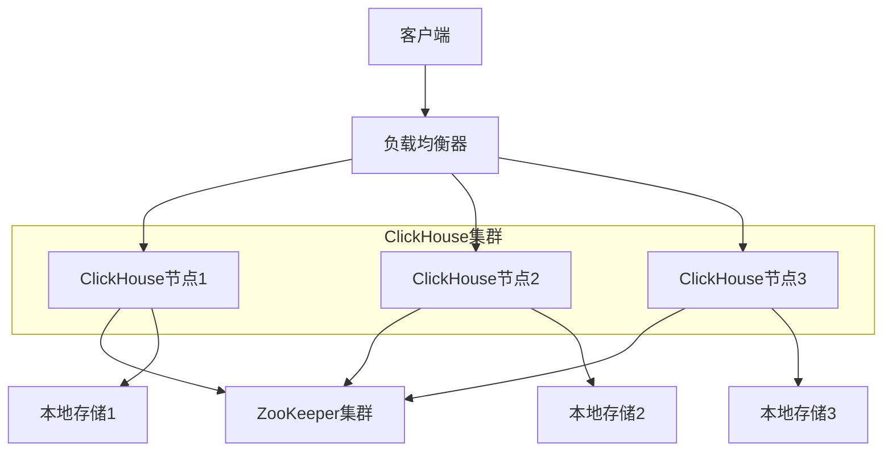
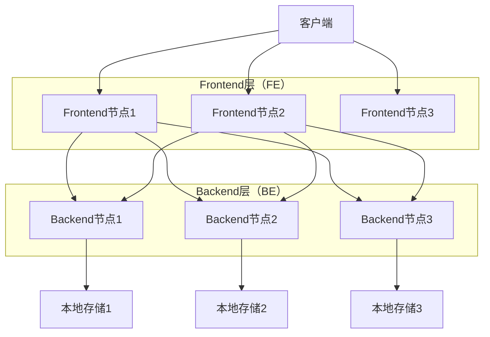

---
title: ClickHouse和Doris技术选型对比
date: 2025-11-17
permalink: /system-design/clickhouse-vs-doris.html
categories:
  - Architecture
  - System Design
---

# ClickHouse和Doris技术选型对比

## 概述

在大数据分析领域，ClickHouse和Apache Doris都是优秀的OLAP数据库，它们都专注于高性能的分析查询。本文将从架构设计、性能表现、功能特性、运维管理等多个维度对这两个技术进行全面对比，为技术选型提供参考。

## 1. 技术架构对比

### 1.1 ClickHouse架构


**ClickHouse架构特点：**
- **Shared-Nothing架构**：每个节点独立，无共享存储
- **水平扩展**：通过添加节点实现扩容
- **ZooKeeper协调**：用于元数据管理和分布式协调
- **本地存储**：数据存储在本地，减少网络开销

### 1.2 Apache Doris架构


**Apache Doris架构特点：**
- **FE/BE分离架构**：Frontend负责查询规划，Backend负责数据存储和计算
- **MPP并行处理**：大规模并行处理框架
- **自动分片**：数据自动分布到不同节点
- **多副本存储**：支持数据多副本保障可用性

## 2. 核心技术对比

### 2.1 存储引擎对比

#### ClickHouse存储引擎
```sql
-- MergeTree引擎族
CREATE TABLE user_events (
    date Date,
    user_id UInt32,
    event_type String,
    timestamp DateTime
) ENGINE = MergeTree()
PARTITION BY toYYYYMM(date)
ORDER BY (user_id, timestamp)
SETTINGS index_granularity = 8192;

-- ReplacingMergeTree（去重）
CREATE TABLE user_profiles (
    user_id UInt32,
    name String,
    email String,
    updated_time DateTime
) ENGINE = ReplacingMergeTree(updated_time)
ORDER BY user_id;

-- SummingMergeTree（聚合）
CREATE TABLE user_metrics (
    date Date,
    user_id UInt32,
    pv UInt64,
    uv UInt64
) ENGINE = SummingMergeTree()
PARTITION BY toYYYYMM(date)
ORDER BY (user_id, date);
```

#### Apache Doris存储引擎
```sql
-- Duplicate模型（允许重复）
CREATE TABLE user_events (
    `date` DATE,
    `user_id` INT,
    `event_type` VARCHAR(50),
    `timestamp` DATETIME
) DUPLICATE KEY(`date`, `user_id`)
DISTRIBUTED BY HASH(`user_id`) BUCKETS 10
PROPERTIES (
    "replication_num" = "3"
);

-- Unique模型（主键唯一）
CREATE TABLE user_profiles (
    `user_id` INT,
    `name` VARCHAR(100),
    `email` VARCHAR(100),
    `updated_time` DATETIME
) UNIQUE KEY(`user_id`)
DISTRIBUTED BY HASH(`user_id`) BUCKETS 10;

-- Aggregate模型（预聚合）
CREATE TABLE user_metrics (
    `date` DATE,
    `user_id` INT,
    `pv` BIGINT SUM,
    `uv` BIGINT SUM
) AGGREGATE KEY(`date`, `user_id`)
DISTRIBUTED BY HASH(`user_id`) BUCKETS 10;
```

### 2.2 查询引擎对比

#### ClickHouse查询优化
```cpp
// ClickHouse vectorized execution
class VectorizedProcessor {
public:
    void process(Block & block) {
        // 向量化处理
        auto & column = block.getByName("value").column;
        auto * data = column->getData().data();

        // SIMD优化计算
        for (size_t i = 0; i < column->size(); i += 8) {
            // 使用SIMD指令并行处理8个元素
            __m256i values = _mm256_load_si256((__m256i*)(data + i));
            __m256i result = _mm256_add_epi32(values, _mm256_set1_epi32(1));
            _mm256_store_si256((__m256i*)(data + i), result);
        }
    }
};
```

#### Apache Doris查询优化
```java
// Doris CBO优化器
public class CostBasedOptimizer {

    public PlanNode optimize(PlanNode root) {
        // 1. 谓词下推
        root = pushDownPredicates(root);

        // 2. 投影下推
        root = pushDownProjections(root);

        // 3. Join重排序
        root = reorderJoins(root);

        // 4. 分区裁剪
        root = prunePartitions(root);

        return root;
    }

    private PlanNode reorderJoins(PlanNode node) {
        if (node instanceof JoinNode) {
            JoinNode joinNode = (JoinNode) node;

            // 基于统计信息计算Join代价
            double leftCost = calculateJoinCost(joinNode.getLeft());
            double rightCost = calculateJoinCost(joinNode.getRight());

            // 选择代价更低的Join顺序
            if (rightCost < leftCost) {
                return swapJoinOrder(joinNode);
            }
        }
        return node;
    }
}
```

## 3. 性能对比分析

### 3.1 查询性能对比

| 查询类型 | ClickHouse | Apache Doris | 说明 |
|---------|------------|--------------|------|
| 点查询 | ★★★☆☆ | ★★★★☆ | Doris的Unique模型对点查询更友好 |
| 范围查询 | ★★★★★ | ★★★★☆ | ClickHouse稀疏索引优势明显 |
| 聚合查询 | ★★★★★ | ★★★★☆ | ClickHouse向量化执行优势 |
| Join查询 | ★★★☆☆ | ★★★★☆ | Doris MPP架构对复杂Join支持更好 |
| 实时查询 | ★★★☆☆ | ★★★★☆ | Doris支持更好的实时写入和查询 |

### 3.2 性能基准测试
```yaml
# TPC-H测试结果（100GB数据集）
benchmark_results:
  clickhouse:
    Q1: 0.12s   # 聚合查询
    Q3: 0.45s   # Join查询
    Q6: 0.08s   # 简单聚合
    Q18: 2.3s   # 复杂Join
    总分: 8.5/10

  doris:
    Q1: 0.18s
    Q3: 0.32s
    Q6: 0.11s
    Q18: 1.8s
    总分: 9.0/10

# 数据导入性能
import_performance:
  clickhouse: "500MB/s per node"
  doris: "400MB/s per node"

# 并发查询性能
concurrent_queries:
  clickhouse: "支持高并发，但复杂查询影响较大"
  doris: "MPP架构下并发性能更稳定"
```

## 4. 功能特性对比

### 4.1 SQL兼容性对比

#### ClickHouse SQL支持
```sql
-- ClickHouse特色函数
SELECT
    user_id,
    -- 数组函数
    arrayJoin(tags) as tag,
    -- 近似聚合
    uniqHLL12(session_id) as approx_sessions,
    -- 时间函数
    toStartOfHour(timestamp) as hour,
    -- 窗口函数（有限支持）
    runningDifference(timestamp) as time_diff
FROM user_events
WHERE date >= '2024-01-01'
GROUP BY user_id, tag, hour;

-- 物化视图
CREATE MATERIALIZED VIEW user_hourly_stats
ENGINE = SummingMergeTree()
PARTITION BY toYYYYMM(date)
ORDER BY (user_id, hour)
AS SELECT
    user_id,
    toStartOfHour(timestamp) as hour,
    toDate(timestamp) as date,
    count() as events,
    uniq(session_id) as sessions
FROM user_events
GROUP BY user_id, hour, date;
```

#### Apache Doris SQL支持
```sql
-- Doris标准SQL支持
SELECT
    user_id,
    -- 标准窗口函数
    ROW_NUMBER() OVER (PARTITION BY user_id ORDER BY timestamp) as rn,
    LAG(event_type, 1) OVER (PARTITION BY user_id ORDER BY timestamp) as prev_event,
    -- 标准聚合函数
    COUNT(*) OVER (PARTITION BY user_id) as total_events,
    -- CTE支持
    WITH user_stats AS (
        SELECT user_id, COUNT(*) as event_count
        FROM user_events
        GROUP BY user_id
    )
    SELECT e.*, s.event_count
    FROM user_events e
    JOIN user_stats s ON e.user_id = s.user_id;

-- 异步物化视图
CREATE MATERIALIZED VIEW user_daily_summary
BUILD IMMEDIATE REFRESH AUTO ON SCHEDULE EVERY 1 HOUR
AS SELECT
    user_id,
    DATE(timestamp) as date,
    COUNT(*) as daily_events,
    COUNT(DISTINCT session_id) as daily_sessions
FROM user_events
GROUP BY user_id, DATE(timestamp);
```

### 4.2 数据类型支持对比

| 数据类型 | ClickHouse | Apache Doris | 说明 |
|---------|------------|--------------|------|
| 基础类型 | ★★★★★ | ★★★★★ | 都支持完整的基础数据类型 |
| 数组类型 | ★★★★★ | ★★★☆☆ | ClickHouse数组支持更丰富 |
| JSON类型 | ★★★☆☆ | ★★★★☆ | Doris JSON支持更完善 |
| 嵌套类型 | ★★★★☆ | ★★★☆☆ | ClickHouse嵌套结构支持更好 |
| 地理类型 | ★★★☆☆ | ★★☆☆☆ | 都有基础地理类型支持 |

## 5. 运维管理对比

### 5.1 集群管理

#### ClickHouse集群管理
```xml
<!-- ClickHouse集群配置 -->
<clickhouse>
    <remote_servers>
        <cluster_name>
            <shard>
                <replica>
                    <host>ch-node1</host>
                    <port>9000</port>
                </replica>
                <replica>
                    <host>ch-node2</host>
                    <port>9000</port>
                </replica>
            </shard>
            <shard>
                <replica>
                    <host>ch-node3</host>
                    <port>9000</port>
                </replica>
                <replica>
                    <host>ch-node4</host>
                    <port>9000</port>
                </replica>
            </shard>
        </cluster_name>
    </remote_servers>

    <zookeeper>
        <node>
            <host>zk1</host>
            <port>2181</port>
        </node>
        <node>
            <host>zk2</host>
            <port>2181</port>
        </node>
        <node>
            <host>zk3</host>
            <port>2181</port>
        </node>
    </zookeeper>
</clickhouse>
```

#### Apache Doris集群管理
```bash
# Doris集群启动脚本
#!/bin/bash

# 启动FE节点
start_fe() {
    cd $DORIS_HOME/fe
    ./bin/start_fe.sh --daemon
}

# 启动BE节点
start_be() {
    cd $DORIS_HOME/be
    ./bin/start_be.sh --daemon
}

# 添加BE节点到集群
add_backend() {
    mysql -h $FE_HOST -P $FE_QUERY_PORT -u root << EOF
    ALTER SYSTEM ADD BACKEND "be1:9050";
    ALTER SYSTEM ADD BACKEND "be2:9050";
    ALTER SYSTEM ADD BACKEND "be3:9050";
EOF
}

# 集群状态检查
check_cluster() {
    mysql -h $FE_HOST -P $FE_QUERY_PORT -u root -e "SHOW BACKENDS\\G"
    mysql -h $FE_HOST -P $FE_QUERY_PORT -u root -e "SHOW FRONTENDS\\G"
}
```

### 5.2 监控告警对比

#### ClickHouse监控
```yaml
# Prometheus监控配置
clickhouse_monitoring:
  metrics:
    - clickhouse_query_duration_seconds
    - clickhouse_merge_tree_data_size_bytes
    - clickhouse_asynchronous_insert_queue_size
    - clickhouse_memory_usage_bytes
    - clickhouse_connection_count

  alerts:
    - name: "ClickHouse高查询延迟"
      expr: "clickhouse_query_duration_seconds > 10"

    - name: "ClickHouse内存使用过高"
      expr: "clickhouse_memory_usage_bytes / clickhouse_memory_limit > 0.9"

    - name: "ClickHouse磁盘使用过高"
      expr: "clickhouse_disk_usage_ratio > 0.85"
```

#### Apache Doris监控
```yaml
# Doris监控配置
doris_monitoring:
  fe_metrics:
    - doris_fe_query_total
    - doris_fe_query_latency
    - doris_fe_connection_total
    - doris_fe_edit_log_size

  be_metrics:
    - doris_be_compaction_score
    - doris_be_tablet_count
    - doris_be_memory_usage
    - doris_be_disk_usage

  alerts:
    - name: "Doris BE节点离线"
      expr: "up{job='doris-be'} == 0"

    - name: "Doris查询队列积压"
      expr: "doris_fe_query_queue_size > 100"
```

## 6. 生态集成对比

### 6.1 数据集成能力

#### ClickHouse数据集成
```python
# ClickHouse数据导入示例
import clickhouse_driver

class ClickHouseDataLoader:
    def __init__(self, host='localhost', port=9000):
        self.client = clickhouse_driver.Client(host=host, port=port)

    def load_from_kafka(self, topic, table):
        """从Kafka加载数据"""
        create_kafka_table = f"""
        CREATE TABLE {table}_kafka (
            user_id UInt32,
            event_type String,
            timestamp DateTime
        ) ENGINE = Kafka
        SETTINGS
            kafka_broker_list = 'localhost:9092',
            kafka_topic_list = '{topic}',
            kafka_group_name = 'clickhouse_consumer',
            kafka_format = 'JSONEachRow';
        """

        self.client.execute(create_kafka_table)

        # 创建物化视图自动导入数据
        create_mv = f"""
        CREATE MATERIALIZED VIEW {table}_mv TO {table}
        AS SELECT * FROM {table}_kafka;
        """

        self.client.execute(create_mv)

    def load_from_hdfs(self, hdfs_path, table):
        """从HDFS加载数据"""
        insert_query = f"""
        INSERT INTO {table}
        SELECT * FROM hdfs('{hdfs_path}', 'Parquet');
        """

        self.client.execute(insert_query)
```

#### Apache Doris数据集成
```sql
-- Doris Routine Load（Kafka实时导入）
CREATE ROUTINE LOAD user_events_load ON user_events
COLUMNS(user_id, event_type, timestamp)
PROPERTIES
(
    "desired_concurrent_number"="3",
    "max_batch_interval" = "10",
    "max_batch_rows" = "300000",
    "strict_mode" = "false",
    "format" = "json"
)
FROM KAFKA
(
    "kafka_broker_list" = "broker1:9092,broker2:9092",
    "kafka_topic" = "user_events",
    "property.group.id" = "doris_consumer"
);

-- Doris Broker Load（批量导入）
LOAD LABEL user_events_batch_load (
    DATA INFILE("hdfs://namenode:port/path/to/file.parquet")
    INTO TABLE user_events
    COLUMNS(user_id, event_type, timestamp)
    FORMAT AS "parquet"
)
WITH BROKER "hdfs_broker"
(
    "username" = "hdfs_user",
    "password" = "hdfs_password"
);

-- Stream Load（HTTP流式导入）
curl -u root: -T data.csv \
    -H "label:stream_load_example" \
    -H "column_separator:," \
    http://fe_host:8030/api/database/table/_stream_load
```

### 6.2 BI工具支持对比

| BI工具 | ClickHouse支持 | Doris支持 | 说明 |
|--------|----------------|-----------|------|
| Grafana | ★★★★★ | ★★★★☆ | ClickHouse有官方插件 |
| Superset | ★★★★☆ | ★★★★★ | Doris MySQL协议兼容性更好 |
| Tableau | ★★★☆☆ | ★★★★☆ | 通过ODBC/JDBC连接 |
| PowerBI | ★★★☆☆ | ★★★★☆ | Doris标准SQL支持更好 |
| DataV | ★★★★☆ | ★★★★☆ | 阿里云DataV支持 |

## 7. 成本分析对比

### 7.1 硬件资源需求

```yaml
# 生产环境资源配置建议
clickhouse_requirements:
  minimum:
    cpu: "8 cores"
    memory: "32GB"
    storage: "SSD 1TB"
    network: "1Gbps"

  recommended:
    cpu: "16-32 cores"
    memory: "64-128GB"
    storage: "NVMe SSD 2-10TB"
    network: "10Gbps"

  cluster_size: "3-10 nodes for medium workload"

doris_requirements:
  fe_node:
    cpu: "4-8 cores"
    memory: "16-32GB"
    storage: "SSD 100GB"

  be_node:
    cpu: "16-32 cores"
    memory: "64-128GB"
    storage: "SSD 2-10TB"

  cluster_size: "3 FE + 6-20 BE nodes"
```

### 7.2 运维成本对比

| 运维方面 | ClickHouse | Apache Doris | 说明 |
|---------|------------|--------------|------|
| 部署复杂度 | ★★★☆☆ | ★★★★☆ | Doris FE/BE架构部署相对复杂 |
| 运维难度 | ★★★☆☆ | ★★★☆☆ | 两者运维难度相当 |
| 扩容便利性 | ★★★☆☆ | ★★★★☆ | Doris动态扩容更方便 |
| 故障恢复 | ★★★☆☆ | ★★★★☆ | Doris多副本机制更可靠 |
| 社区支持 | ★★★★☆ | ★★★★☆ | 都有活跃的开源社区 |

## 8. 适用场景分析

### 8.1 ClickHouse适用场景

```yaml
clickhouse_best_for:
  场景类型:
    - "日志分析和监控"
    - "时序数据分析"
    - "广告业务数据分析"
    - "用户行为分析"
    - "IoT数据处理"

  业务特点:
    - "读多写少"
    - "大量聚合查询"
    - "时间序列数据"
    - "数据压缩要求高"
    - "查询性能要求极高"

  技术要求:
    - "可接受最终一致性"
    - "复杂Join查询较少"
    - "批量数据导入为主"
    - "团队有一定技术能力"
```

**ClickHouse实际应用案例：**
```sql
-- 用户行为分析场景
CREATE TABLE user_behavior (
    date Date,
    user_id UInt32,
    page_url String,
    action_type LowCardinality(String),
    timestamp DateTime,
    session_id String,
    device_type LowCardinality(String)
) ENGINE = MergeTree()
PARTITION BY toYYYYMM(date)
ORDER BY (user_id, timestamp)
SETTINGS index_granularity = 8192;

-- 高效的分析查询
SELECT
    device_type,
    action_type,
    count() as action_count,
    uniq(user_id) as unique_users,
    uniq(session_id) as unique_sessions
FROM user_behavior
WHERE date >= '2024-01-01'
    AND action_type IN ('click', 'view', 'purchase')
GROUP BY device_type, action_type
ORDER BY action_count DESC;
```

### 8.2 Apache Doris适用场景

```yaml
doris_best_for:
  场景类型:
    - "多维数据分析"
    - "实时数据仓库"
    - "BI报表系统"
    - "用户画像分析"
    - "营销数据分析"

  业务特点:
    - "复杂多表Join"
    - "实时数据更新需求"
    - "标准SQL使用习惯"
    - "多维度灵活分析"
    - "数据一致性要求较高"

  技术要求:
    - "支持事务ACID"
    - "MySQL生态兼容"
    - "实时写入和查询"
    - "标准SQL兼容性"
```

**Apache Doris实际应用案例：**
```sql
-- 用户画像分析场景
CREATE TABLE user_profile (
    user_id BIGINT,
    age_group VARCHAR(20),
    city VARCHAR(50),
    income_level VARCHAR(20),
    last_login_time DATETIME,
    total_orders INT,
    total_amount DECIMAL(15,2)
) UNIQUE KEY(user_id)
DISTRIBUTED BY HASH(user_id) BUCKETS 32;

-- 复杂多维分析查询
WITH user_segments AS (
    SELECT
        user_id,
        CASE
            WHEN total_amount > 10000 THEN 'VIP'
            WHEN total_amount > 5000 THEN 'Premium'
            ELSE 'Regular'
        END as user_segment
    FROM user_profile
),
order_analysis AS (
    SELECT
        o.user_id,
        COUNT(*) as recent_orders,
        SUM(o.amount) as recent_amount
    FROM orders o
    WHERE o.order_date >= DATE_SUB(NOW(), INTERVAL 30 DAY)
    GROUP BY o.user_id
)
SELECT
    up.city,
    us.user_segment,
    COUNT(DISTINCT up.user_id) as user_count,
    AVG(oa.recent_amount) as avg_recent_amount,
    AVG(oa.recent_orders) as avg_recent_orders
FROM user_profile up
JOIN user_segments us ON up.user_id = us.user_id
LEFT JOIN order_analysis oa ON up.user_id = oa.user_id
GROUP BY up.city, us.user_segment
ORDER BY user_count DESC;
```

## 9. 迁移与兼容性

### 9.1 从传统数据仓库迁移

#### 迁移到ClickHouse
```python
class ClickHouseMigrator:
    def __init__(self):
        self.ch_client = clickhouse_driver.Client()

    def migrate_from_mysql(self, mysql_config, table_mapping):
        """从MySQL迁移数据到ClickHouse"""
        mysql_conn = pymysql.connect(**mysql_config)

        for mysql_table, ch_table in table_mapping.items():
            # 1. 分析MySQL表结构
            schema = self.analyze_mysql_schema(mysql_conn, mysql_table)

            # 2. 生成ClickHouse建表语句
            ch_ddl = self.generate_clickhouse_ddl(schema, ch_table)
            self.ch_client.execute(ch_ddl)

            # 3. 数据迁移
            self.migrate_data(mysql_conn, mysql_table, ch_table)

    def generate_clickhouse_ddl(self, mysql_schema, table_name):
        """转换MySQL DDL为ClickHouse DDL"""
        columns = []
        for col in mysql_schema['columns']:
            ch_type = self.mysql_to_clickhouse_type(col['type'])
            columns.append(f"`{col['name']}` {ch_type}")

        # 选择合适的引擎和排序键
        engine = "MergeTree()"
        order_by = "tuple()"  # 根据实际情况调整

        ddl = f"""
        CREATE TABLE {table_name} (
            {', '.join(columns)}
        ) ENGINE = {engine}
        ORDER BY {order_by}
        """

        return ddl
```

#### 迁移到Apache Doris
```sql
-- Doris支持MySQL协议，迁移相对简单
-- 1. 使用MySQL客户端连接Doris
mysql -h doris_fe_host -P 9030 -u root

-- 2. 创建兼容的表结构
CREATE TABLE user_orders (
    order_id BIGINT NOT NULL,
    user_id BIGINT NOT NULL,
    product_id BIGINT NOT NULL,
    amount DECIMAL(10,2),
    order_time DATETIME,
    status VARCHAR(20)
) DUPLICATE KEY(order_id, user_id)
DISTRIBUTED BY HASH(user_id) BUCKETS 10
PROPERTIES (
    "replication_num" = "3"
);

-- 3. 使用DataX或其他ETL工具导入数据
-- DataX配置示例
{
    "job": {
        "content": [{
            "reader": {
                "name": "mysqlreader",
                "parameter": {
                    "connection": [{
                        "jdbcUrl": ["jdbc:mysql://mysql_host:3306/database"],
                        "table": ["user_orders"]
                    }],
                    "username": "mysql_user",
                    "password": "mysql_password"
                }
            },
            "writer": {
                "name": "doriswriter",
                "parameter": {
                    "feLoadUrl": ["doris_fe_host:8030"],
                    "database": "target_db",
                    "table": "user_orders",
                    "username": "doris_user",
                    "password": "doris_password"
                }
            }
        }]
    }
}
```

## 10. 性能调优对比

### 10.1 ClickHouse性能调优

```sql
-- 1. 表结构优化
CREATE TABLE optimized_events (
    date Date CODEC(Delta, LZ4),
    user_id UInt32 CODEC(DoubleDelta, LZ4),
    event_type LowCardinality(String),
    timestamp DateTime CODEC(DoubleDelta, LZ4),
    value Float64 CODEC(Gorilla, LZ4)
) ENGINE = MergeTree()
PARTITION BY toYYYYMM(date)
ORDER BY (user_id, timestamp)
SETTINGS
    index_granularity = 8192,
    merge_tree_max_rows_to_use_cache = 1048576;

-- 2. 查询优化
-- 使用PREWHERE替代WHERE（针对MergeTree）
SELECT user_id, count()
FROM events
PREWHERE date >= '2024-01-01'  -- 在存储层过滤
WHERE event_type = 'click'     -- 在内存中过滤
GROUP BY user_id;

-- 3. 物化视图优化
CREATE MATERIALIZED VIEW user_daily_stats
ENGINE = AggregatingMergeTree()
PARTITION BY toYYYYMM(date)
ORDER BY (user_id, date)
AS SELECT
    user_id,
    toDate(timestamp) as date,
    countState() as event_count,
    uniqState(session_id) as session_count
FROM events
GROUP BY user_id, date;
```

### 10.2 Apache Doris性能调优

```sql
-- 1. 分桶和分区优化
CREATE TABLE optimized_orders (
    order_date DATE,
    user_id BIGINT,
    product_id BIGINT,
    amount DECIMAL(10,2),
    order_time DATETIME
) DUPLICATE KEY(order_date, user_id)
PARTITION BY RANGE(order_date) (
    PARTITION p20240101 VALUES [('2024-01-01'), ('2024-02-01')),
    PARTITION p20240201 VALUES [('2024-02-01'), ('2024-03-01')),
    PARTITION p20240301 VALUES [('2024-03-01'), ('2024-04-01'))
)
DISTRIBUTED BY HASH(user_id) BUCKETS 32
PROPERTIES (
    "replication_num" = "3",
    "storage_format" = "V2",
    "compression" = "LZ4"
);

-- 2. 索引优化
-- 创建Bloom Filter索引
ALTER TABLE optimized_orders
SET ("bloom_filter_columns" = "product_id");

-- 3. 查询hint优化
SELECT /*+ SET_VAR(parallel_fragment_exec_instance_num=8) */
    user_id,
    SUM(amount) as total_amount
FROM optimized_orders
WHERE order_date >= '2024-01-01'
GROUP BY user_id;

-- 4. 统计信息更新
ANALYZE TABLE optimized_orders UPDATE HISTOGRAM ON user_id, product_id;
```

## 11. 决策框架

### 11.1 选择决策矩阵

| 评估维度 | 权重 | ClickHouse评分 | Doris评分 | 说明 |
|---------|------|----------------|-----------|------|
| 查询性能 | 25% | 9/10 | 8/10 | ClickHouse在纯分析查询上更快 |
| SQL兼容性 | 20% | 6/10 | 9/10 | Doris标准SQL兼容性更好 |
| 运维复杂度 | 15% | 7/10 | 7/10 | 两者运维复杂度相当 |
| 生态集成 | 15% | 7/10 | 8/10 | Doris MySQL协议兼容性好 |
| 实时性能 | 10% | 6/10 | 8/10 | Doris实时写入和查询更好 |
| 社区活跃度 | 10% | 8/10 | 8/10 | 两者都有活跃社区 |
| 学习成本 | 5% | 6/10 | 8/10 | Doris学习成本更低 |

### 11.2 选择建议

#### 选择ClickHouse的场景：
- **日志分析系统**：大量时序数据，查询性能要求极高
- **监控告警平台**：实时指标聚合，数据写入频繁
- **广告分析平台**：用户行为分析，复杂聚合计算
- **IoT数据平台**：传感器数据分析，数据量巨大

#### 选择Apache Doris的场景：
- **企业数据仓库**：多维分析，复杂Join查询
- **BI报表系统**：标准SQL，MySQL生态兼容
- **用户画像系统**：实时数据更新，事务一致性要求
- **营销分析平台**：多表关联分析，灵活的查询需求

## 12. 总结与建议

### 12.1 技术特点总结

**ClickHouse优势：**
- 极致的查询性能，特别是聚合查询
- 优秀的数据压缩率，节省存储成本
- 丰富的内置函数和数据类型
- 成熟的时序数据处理能力

**ClickHouse劣势：**
- Join查询性能相对较弱
- SQL标准兼容性有限
- 实时数据更新支持不够完善
- 学习曲线相对陡峭

**Apache Doris优势：**
- 标准SQL兼容性好，学习成本低
- MPP架构支持复杂Join查询
- 实时数据写入和查询性能好
- MySQL协议兼容，生态集成容易

**Apache Doris劣势：**
- 纯分析查询性能略逊于ClickHouse
- 相对较新，生产环境案例较少
- 运维复杂度相对较高

### 12.2 选型建议

1. **如果你的场景是**：
   - 日志分析、监控数据、时序数据分析
   - 对查询性能要求极高
   - 主要是聚合查询，Join查询较少
   - 团队有一定的技术实力

   **推荐选择ClickHouse**

2. **如果你的场景是**：
   - 企业数据仓库、BI报表
   - 需要复杂的多表Join查询
   - 对SQL标准兼容性要求高
   - 需要实时数据更新能力

   **推荐选择Apache Doris**

### 12.3 混合架构建议

在实际应用中，也可以考虑混合架构：

```yaml
hybrid_architecture:
  实时层:
    technology: "Apache Doris"
    purpose: "实时数据写入和查询"
    data_retention: "最近3个月"

  历史层:
    technology: "ClickHouse"
    purpose: "历史数据分析和归档"
    data_retention: "3个月以上"

  数据流转:
    - "实时数据写入Doris"
    - "定期将历史数据迁移到ClickHouse"
    - "通过统一查询层对外提供服务"
```

这种架构可以充分发挥两种技术的优势，既保证了实时性能，又获得了极致的分析性能。

最终的技术选择应该基于具体的业务需求、团队技术水平、资源预算等因素综合考虑，没有绝对的好坏，只有最适合的选择。