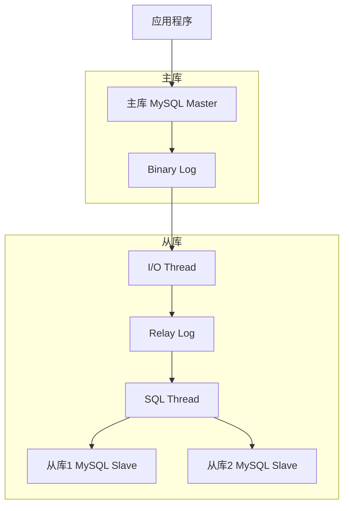
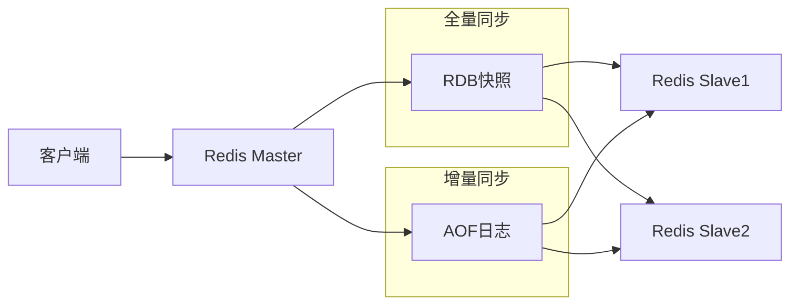
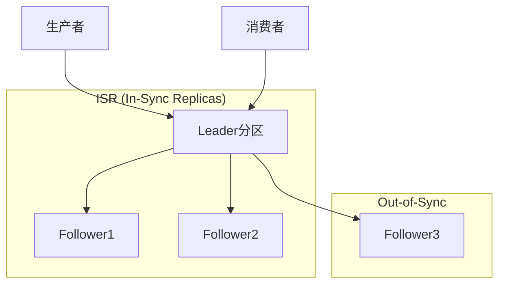

---
title: MySQL主从同步方案和对比分析
date: 2025-11-17
permalink: /system-design/mysql-replication.html
categories:
  - Architecture
  - System Design
---

# MySQL主从同步方案和对比分析

## 概述

主从同步是分布式数据库系统中的核心技术，通过将主库的变更实时同步到从库，实现数据的高可用性、读写分离和负载均衡。本文将详细分析MySQL的主从同步方案，并与Redis、Kafka等其他中间件的主从同步方案进行对比分析。

## 1. MySQL主从同步原理

### 1.1 基本架构


### 1.2 同步流程详解
```sql
-- 1. 主库配置
-- my.cnf配置
[mysqld]
server-id = 1
log-bin = mysql-bin
binlog-format = ROW
gtid-mode = ON
enforce-gtid-consistency = ON
log-slave-updates = ON

-- 创建复制用户
CREATE USER 'replication'@'%' IDENTIFIED BY 'password123';
GRANT REPLICATION SLAVE ON *.* TO 'replication'@'%';
FLUSH PRIVILEGES;

-- 查看主库状态
SHOW MASTER STATUS;
-- +------------------+----------+--------------+------------------+-------------------------------------------+
-- | File             | Position | Binlog_Do_DB | Binlog_Ignore_DB | Executed_Gtid_Set                         |
-- +------------------+----------+--------------+------------------+-------------------------------------------+
-- | mysql-bin.000001 |      154 |              |                  | 24da167a-1234-11ec-8d3d-0242ac130003:1-5 |
-- +------------------+----------+--------------+------------------+-------------------------------------------+
```

```sql
-- 2. 从库配置
-- my.cnf配置
[mysqld]
server-id = 2
relay-log = relay-bin
read-only = ON
super-read-only = ON
gtid-mode = ON
enforce-gtid-consistency = ON

-- 配置主从关系
CHANGE MASTER TO
    MASTER_HOST='master_ip',
    MASTER_PORT=3306,
    MASTER_USER='replication',
    MASTER_PASSWORD='password123',
    MASTER_AUTO_POSITION=1;

-- 启动从库同步
START SLAVE;

-- 检查同步状态
SHOW SLAVE STATUS\G
```

### 1.3 MySQL同步实现机制
```java
// MySQL Binlog解析示例
public class BinlogEventProcessor {

    public void processBinlogEvent(BinlogEvent event) {
        switch (event.getEventType()) {
            case WRITE_ROWS:
                handleInsertEvent((WriteRowsEvent) event);
                break;
            case UPDATE_ROWS:
                handleUpdateEvent((UpdateRowsEvent) event);
                break;
            case DELETE_ROWS:
                handleDeleteEvent((DeleteRowsEvent) event);
                break;
            case XID:
                handleTransactionCommit((XidEvent) event);
                break;
            case GTID:
                handleGtidEvent((GtidEvent) event);
                break;
        }
    }

    private void handleInsertEvent(WriteRowsEvent event) {
        String tableName = event.getTableName();
        List<Serializable[]> rows = event.getRows();

        for (Serializable[] row : rows) {
            // 构建INSERT SQL并在从库执行
            String sql = buildInsertSQL(tableName, row);
            executeOnSlave(sql);
        }
    }

    private void handleUpdateEvent(UpdateRowsEvent event) {
        String tableName = event.getTableName();
        List<Pair<Serializable[], Serializable[]>> rows = event.getRows();

        for (Pair<Serializable[], Serializable[]> pair : rows) {
            Serializable[] beforeRow = pair.getLeft();
            Serializable[] afterRow = pair.getRight();

            // 构建UPDATE SQL并在从库执行
            String sql = buildUpdateSQL(tableName, beforeRow, afterRow);
            executeOnSlave(sql);
        }
    }
}
```

## 2. MySQL主从同步模式对比

### 2.1 异步复制（默认模式）
```yaml
asynchronous_replication:
  特点:
    - "主库不等待从库确认即提交事务"
    - "性能最好，延迟最低"
    - "可能存在数据丢失风险"
    - "默认复制模式"

  配置:
    sync_binlog: 1
    innodb_flush_log_at_trx_commit: 1
    rpl_semi_sync_master_enabled: OFF

  适用场景:
    - "对性能要求极高"
    - "可容忍少量数据丢失"
    - "读写分离场景"
```

### 2.2 半同步复制
```yaml
semi_synchronous_replication:
  特点:
    - "主库等待至少一个从库确认后提交"
    - "数据安全性较高"
    - "性能有所下降"
    - "需要插件支持"

  配置:
    # 主库配置
    rpl_semi_sync_master_enabled: ON
    rpl_semi_sync_master_timeout: 1000  # 1秒超时
    rpl_semi_sync_master_wait_no_slave: ON

    # 从库配置
    rpl_semi_sync_slave_enabled: ON

  适用场景:
    - "对数据一致性要求较高"
    - "可接受轻微性能损失"
    - "金融、电商等重要业务"
```

### 2.3 增强半同步复制（MySQL 5.7+）
```sql
-- 配置增强半同步复制
SET GLOBAL rpl_semi_sync_master_enabled = ON;
SET GLOBAL rpl_semi_sync_master_timeout = 1000;
-- 关键区别：等待从库接收到binlog并写入relay log
SET GLOBAL rpl_semi_sync_master_wait_point = AFTER_SYNC;

-- 从库配置
SET GLOBAL rpl_semi_sync_slave_enabled = ON;

-- 监控半同步状态
SHOW STATUS LIKE 'Rpl_semi_sync%';
-- +----------------------------+-------+
-- | Variable_name              | Value |
-- +----------------------------+-------+
-- | Rpl_semi_sync_master_clients | 2   |
-- | Rpl_semi_sync_master_status  | ON  |
-- | Rpl_semi_sync_master_yes_tx   | 100 |
-- | Rpl_semi_sync_master_no_tx    | 0   |
-- +----------------------------+-------+
```

## 3. MySQL高可用架构模式

### 3.1 一主多从架构
```python
class MySQLMasterSlaveCluster:
    def __init__(self):
        self.master = MySQLConnection('master_host', 3306)
        self.slaves = [
            MySQLConnection('slave1_host', 3306),
            MySQLConnection('slave2_host', 3306),
            MySQLConnection('slave3_host', 3306)
        ]
        self.load_balancer = SlaveLoadBalancer()

    def write(self, sql, params):
        """写操作总是发往主库"""
        try:
            result = self.master.execute(sql, params)
            return result
        except Exception as e:
            logger.error(f"Write operation failed: {e}")
            raise

    def read(self, sql, params):
        """读操作发往从库，支持负载均衡"""
        slave = self.load_balancer.select_slave(self.slaves)

        try:
            result = slave.execute(sql, params)
            return result
        except Exception as e:
            # 从库故障时回退到主库
            logger.warning(f"Slave read failed, fallback to master: {e}")
            return self.master.execute(sql, params)

    def health_check(self):
        """健康检查"""
        # 检查主库状态
        master_status = self.check_master_health()

        # 检查从库同步状态
        slave_statuses = []
        for slave in self.slaves:
            status = self.check_slave_health(slave)
            slave_statuses.append(status)

        return {
            'master': master_status,
            'slaves': slave_statuses
        }

    def check_slave_health(self, slave):
        """检查从库同步状态"""
        try:
            status = slave.execute("SHOW SLAVE STATUS")

            if not status:
                return {'healthy': False, 'error': 'No slave status'}

            io_running = status[0]['Slave_IO_Running'] == 'Yes'
            sql_running = status[0]['Slave_SQL_Running'] == 'Yes'
            seconds_behind = status[0]['Seconds_Behind_Master']

            is_healthy = (io_running and sql_running and
                         (seconds_behind is None or seconds_behind < 30))

            return {
                'healthy': is_healthy,
                'io_running': io_running,
                'sql_running': sql_running,
                'lag': seconds_behind
            }

        except Exception as e:
            return {'healthy': False, 'error': str(e)}
```

### 3.2 MySQL Group Replication（MGR）
```sql
-- MGR配置
[mysqld]
server-id = 1
gtid-mode = ON
enforce-gtid-consistency = ON
binlog-checksum = NONE
log-slave-updates = ON
log-bin = binlog
binlog-format = ROW

# Group Replication配置
plugin-load-add = group_replication.so
group_replication_group_name = "aaaaaaaa-aaaa-aaaa-aaaa-aaaaaaaaaaaa"
group_replication_start_on_boot = off
group_replication_local_address = "s1:33061"
group_replication_group_seeds = "s1:33061,s2:33061,s3:33061"
group_replication_bootstrap_group = off
group_replication_single_primary_mode = ON
group_replication_enforce_update_everywhere_checks = OFF

-- 启动MGR
SET GLOBAL group_replication_bootstrap_group=ON;
START GROUP_REPLICATION;
SET GLOBAL group_replication_bootstrap_group=OFF;

-- 查看集群状态
SELECT * FROM performance_schema.replication_group_members;
```

## 4. 其他中间件主从同步方案对比

### 4.1 Redis主从同步

#### Redis同步原理


#### Redis同步实现
```python
class RedisReplicationManager:
    def __init__(self):
        self.master = redis.Redis(host='master_host', port=6379)
        self.slaves = [
            redis.Redis(host='slave1_host', port=6379),
            redis.Redis(host='slave2_host', port=6379)
        ]

    def setup_replication(self):
        """配置Redis主从复制"""
        for slave in self.slaves:
            # 配置从库指向主库
            slave.execute_command('SLAVEOF', 'master_host', 6379)

            # 配置只读模式
            slave.config_set('slave-read-only', 'yes')

    def monitor_replication_lag(self):
        """监控复制延迟"""
        master_info = self.master.info('replication')

        for i, slave in enumerate(self.slaves):
            slave_info = slave.info('replication')

            if slave_info['role'] == 'slave':
                master_repl_offset = master_info['master_repl_offset']
                slave_repl_offset = slave_info['slave_repl_offset']

                lag = master_repl_offset - slave_repl_offset

                logger.info(f"Slave {i} replication lag: {lag} bytes")

                if lag > 1024 * 1024:  # 1MB延迟告警
                    self.alert_replication_lag(i, lag)

    def handle_master_failover(self):
        """处理主库故障转移"""
        # 选择最优的从库作为新主库
        best_slave = self.select_best_slave()

        if best_slave:
            # 提升从库为主库
            best_slave.execute_command('SLAVEOF', 'NO', 'ONE')

            # 其他从库指向新主库
            new_master_host = best_slave.connection_pool.connection_kwargs['host']
            new_master_port = best_slave.connection_pool.connection_kwargs['port']

            for slave in self.slaves:
                if slave != best_slave:
                    slave.execute_command('SLAVEOF', new_master_host, new_master_port)

    def select_best_slave(self):
        """选择最佳从库"""
        best_slave = None
        min_lag = float('inf')

        for slave in self.slaves:
            info = slave.info('replication')
            if info['role'] == 'slave':
                lag = info.get('slave_lag', float('inf'))
                if lag < min_lag:
                    min_lag = lag
                    best_slave = slave

        return best_slave
```

#### Redis同步特点
```yaml
redis_replication:
  优势:
    - "异步复制，性能优秀"
    - "自动故障检测和恢复"
    - "支持读写分离"
    - "配置简单"

  劣势:
    - "可能丢失数据"
    - "主从切换需要手动或依赖哨兵"
    - "从库只读，不支持写入"

  同步机制:
    - "全量同步：RDB快照"
    - "增量同步：命令传播"
    - "部分重同步：复制积压缓冲区"
```

### 4.2 Kafka主从同步（副本机制）

#### Kafka副本同步原理


#### Kafka副本管理
```java
public class KafkaReplicationManager {

    private AdminClient adminClient;
    private Properties props;

    public KafkaReplicationManager() {
        props = new Properties();
        props.put(AdminClientConfig.BOOTSTRAP_SERVERS_CONFIG, "kafka1:9092,kafka2:9092");
        adminClient = AdminClient.create(props);
    }

    public void createTopicWithReplication(String topicName, int partitions, int replicas) {
        NewTopic topic = new NewTopic(topicName, partitions, (short) replicas);

        // 配置副本分布策略
        Map<Integer, List<Integer>> replicasAssignments = new HashMap<>();
        for (int i = 0; i < partitions; i++) {
            List<Integer> brokerIds = assignReplicaToBrokers(i, replicas);
            replicasAssignments.put(i, brokerIds);
        }

        topic.replicasAssignments(replicasAssignments);

        CreateTopicsResult result = adminClient.createTopics(Arrays.asList(topic));

        try {
            result.all().get();
            System.out.println("Topic created successfully with replication");
        } catch (Exception e) {
            System.err.println("Failed to create topic: " + e.getMessage());
        }
    }

    public void monitorReplicaLag() {
        try {
            DescribeTopicsResult topicsResult = adminClient.describeTopics(getTopicNames());
            Map<String, TopicDescription> topics = topicsResult.all().get();

            for (Map.Entry<String, TopicDescription> entry : topics.entrySet()) {
                String topicName = entry.getKey();
                TopicDescription description = entry.getValue();

                for (TopicPartitionInfo partition : description.partitions()) {
                    int leaderId = partition.leader().id();
                    Set<Integer> isrIds = partition.isr().stream()
                            .map(Node::id)
                            .collect(Collectors.toSet());

                    // 检查ISR中的副本数量
                    if (isrIds.size() < partition.replicas().size()) {
                        System.out.println(String.format(
                            "Topic %s Partition %d has %d replicas but only %d in ISR",
                            topicName, partition.partition(),
                            partition.replicas().size(), isrIds.size()));
                    }
                }
            }
        } catch (Exception e) {
            System.err.println("Failed to monitor replica lag: " + e.getMessage());
        }
    }

    public void reassignPartitionReplicas(String topicName, int partition, List<Integer> newBrokers) {
        Map<TopicPartition, Optional<NewPartitionReassignment>> reassignments = new HashMap<>();

        TopicPartition tp = new TopicPartition(topicName, partition);
        NewPartitionReassignment reassignment = new NewPartitionReassignment(newBrokers);

        reassignments.put(tp, Optional.of(reassignment));

        AlterPartitionReassignmentsResult result = adminClient.alterPartitionReassignments(reassignments);

        try {
            result.all().get();
            System.out.println("Partition reassignment completed");
        } catch (Exception e) {
            System.err.println("Failed to reassign partitions: " + e.getMessage());
        }
    }

    private List<Integer> assignReplicaToBrokers(int partitionId, int replicas) {
        // 简单的副本分配策略
        List<Integer> availableBrokers = Arrays.asList(1, 2, 3, 4, 5);
        List<Integer> assignment = new ArrayList<>();

        for (int i = 0; i < replicas; i++) {
            int brokerId = availableBrokers.get((partitionId + i) % availableBrokers.size());
            assignment.add(brokerId);
        }

        return assignment;
    }
}
```

#### Kafka同步特点
```yaml
kafka_replication:
  优势:
    - "强一致性保证（ISR机制）"
    - "自动故障转移"
    - "分区级别的副本管理"
    - "高吞吐量"

  劣势:
    - "配置相对复杂"
    - "需要Zookeeper协调"
    - "副本同步有一定延迟"

  同步机制:
    - "Leader-Follower模式"
    - "ISR (In-Sync Replicas) 机制"
    - "高水位标记确保一致性"
    - "自动故障检测和Leader选举"
```

### 4.3 MongoDB副本集

#### MongoDB副本集架构
```javascript
// MongoDB副本集配置
rs.initiate({
    _id: "rs0",
    members: [
        { _id: 0, host: "mongo1:27017", priority: 2 },  // Primary
        { _id: 1, host: "mongo2:27017", priority: 1 },  // Secondary
        { _id: 2, host: "mongo3:27017", priority: 1 }   // Secondary
    ]
});

// 添加仲裁节点
rs.add({ _id: 3, host: "mongo4:27017", arbiterOnly: true });

// 查看副本集状态
rs.status();
```

#### MongoDB同步监控
```python
from pymongo import MongoClient
import time

class MongoReplicationMonitor:
    def __init__(self, connection_string):
        self.client = MongoClient(connection_string)
        self.db = self.client.admin

    def check_replica_lag(self):
        """检查副本集延迟"""
        # 获取副本集状态
        status = self.db.command('replSetGetStatus')

        primary_optime = None
        replica_lags = {}

        for member in status['members']:
            if member['state'] == 1:  # PRIMARY
                primary_optime = member['optimeDate']
            elif member['state'] == 2:  # SECONDARY
                secondary_optime = member['optimeDate']
                lag = (primary_optime - secondary_optime).total_seconds()
                replica_lags[member['name']] = lag

        return replica_lags

    def trigger_election(self):
        """触发主节点选举"""
        try:
            self.db.command('replSetStepDown', 60)  # 主节点下线60秒
            print("Election triggered successfully")
        except Exception as e:
            print(f"Failed to trigger election: {e}")

    def add_member(self, host, priority=1):
        """添加副本集成员"""
        config = self.db.command('replSetGetConfig')['config']

        new_id = max(member['_id'] for member in config['members']) + 1
        new_member = {
            '_id': new_id,
            'host': host,
            'priority': priority
        }

        config['members'].append(new_member)
        config['version'] += 1

        self.db.command('replSetReconfig', config)
        print(f"Added member {host} to replica set")
```

## 5. 主从同步方案综合对比

### 5.1 技术特性对比表

| 特性维度 | MySQL | Redis | Kafka | MongoDB |
|---------|-------|-------|-------|---------|
| 同步模式 | 异步/半同步 | 异步 | 同步(ISR) | 异步 |
| 一致性 | 最终一致性 | 最终一致性 | 强一致性 | 最终一致性 |
| 故障转移 | 手动/MGR自动 | 手动/哨兵 | 自动 | 自动 |
| 数据丢失风险 | 中等 | 高 | 低 | 中等 |
| 性能开销 | 中等 | 低 | 中等 | 中等 |
| 配置复杂度 | 中等 | 简单 | 复杂 | 中等 |
| 读写分离 | 支持 | 支持 | 不适用 | 支持 |

### 5.2 延迟和吞吐量对比

```yaml
performance_comparison:
  mysql:
    replication_lag: "毫秒级到秒级"
    throughput: "数万TPS"
    factors: ["binlog格式", "网络延迟", "从库性能"]

  redis:
    replication_lag: "毫秒级"
    throughput: "数十万QPS"
    factors: ["命令复杂度", "网络带宽", "内存使用"]

  kafka:
    replication_lag: "毫秒级"
    throughput: "百万级消息/秒"
    factors: ["批量大小", "副本数量", "网络条件"]

  mongodb:
    replication_lag: "毫秒级到秒级"
    throughput: "数万TPS"
    factors: ["oplog大小", "网络延迟", "写入复杂度"]
```

### 5.3 应用场景适配

#### MySQL主从同步适用场景
```yaml
mysql_scenarios:
  读写分离:
    - "Web应用数据库"
    - "报表系统"
    - "数据分析平台"

  高可用:
    - "关键业务系统"
    - "电商平台"
    - "金融系统"

  数据备份:
    - "异地容灾"
    - "数据仓库同步"
    - "历史数据归档"
```

#### Redis主从同步适用场景
```yaml
redis_scenarios:
  缓存高可用:
    - "分布式缓存"
    - "会话存储"
    - "热点数据缓存"

  读写分离:
    - "读多写少场景"
    - "实时排行榜"
    - "计数器服务"

  故障恢复:
    - "快速故障转移"
    - "数据预热"
    - "服务降级"
```

#### Kafka副本同步适用场景
```yaml
kafka_scenarios:
  消息可靠性:
    - "订单消息"
    - "支付通知"
    - "关键事件流"

  高可用流处理:
    - "实时数据处理"
    - "事件驱动架构"
    - "微服务通信"

  数据集成:
    - "数据管道"
    - "ETL流程"
    - "数据湖构建"
```

## 6. 主从同步最佳实践

### 6.1 MySQL主从优化实践

```sql
-- 1. 二进制日志优化
SET GLOBAL sync_binlog = 1;                    -- 强制刷盘
SET GLOBAL binlog_cache_size = 1048576;        -- 1MB缓存
SET GLOBAL max_binlog_cache_size = 4294967296; -- 4GB最大缓存
SET GLOBAL binlog_format = 'ROW';              -- 行级别复制

-- 2. 从库优化
SET GLOBAL slave_parallel_type = 'LOGICAL_CLOCK';
SET GLOBAL slave_parallel_workers = 8;         -- 并行复制线程
SET GLOBAL slave_preserve_commit_order = ON;   -- 保持提交顺序
SET GLOBAL slave_transaction_retries = 10;     -- 事务重试次数

-- 3. 监控关键指标
SHOW STATUS LIKE 'Slave_lag_master';
SHOW STATUS LIKE 'Slave_SQL_Running_State';
SELECT * FROM performance_schema.replication_applier_status_by_worker;
```

### 6.2 通用优化策略

```python
class ReplicationOptimizer:
    def __init__(self, tech_type):
        self.tech_type = tech_type
        self.metrics_collector = MetricsCollector()

    def optimize_network(self):
        """网络优化"""
        optimizations = {
            'tcp_keepalive': True,
            'compression': True,
            'batch_size': self.calculate_optimal_batch_size(),
            'parallel_streams': self.calculate_parallel_streams()
        }
        return optimizations

    def optimize_storage(self):
        """存储优化"""
        if self.tech_type == 'mysql':
            return {
                'innodb_buffer_pool_size': '70% of RAM',
                'innodb_log_file_size': '256MB',
                'innodb_flush_log_at_trx_commit': 2
            }
        elif self.tech_type == 'redis':
            return {
                'save_policy': 'optimized_for_replication',
                'aof_rewrite_policy': 'auto',
                'memory_management': 'maxmemory_policy'
            }

    def monitor_and_alert(self):
        """监控告警"""
        metrics = self.metrics_collector.collect()

        alerts = []
        if metrics['replication_lag'] > self.get_threshold('lag'):
            alerts.append(f"Replication lag too high: {metrics['replication_lag']}")

        if metrics['error_rate'] > self.get_threshold('error_rate'):
            alerts.append(f"Replication error rate high: {metrics['error_rate']}")

        return alerts

    def auto_failover_strategy(self):
        """自动故障转移策略"""
        return {
            'health_check_interval': 5,  # 5秒检查一次
            'failure_threshold': 3,      # 连续3次失败触发
            'failover_timeout': 30,      # 30秒故障转移超时
            'rollback_policy': 'automatic'
        }
```

## 7. 故障处理和恢复

### 7.1 MySQL主从故障处理

```sql
-- 常见故障排查
-- 1. 检查同步状态
SHOW SLAVE STATUS\G

-- 2. 跳过错误事务（谨慎使用）
SET GLOBAL sql_slave_skip_counter = 1;
START SLAVE;

-- 3. 基于GTID的故障恢复
STOP SLAVE;
SET GTID_NEXT = '24da167a-1234-11ec-8d3d-0242ac130003:6';
BEGIN; COMMIT;
SET GTID_NEXT = 'AUTOMATIC';
START SLAVE;

-- 4. 重建从库（终极方案）
STOP SLAVE;
RESET SLAVE;

-- 在主库导出数据
mysqldump --single-transaction --routines --triggers --master-data=2 \
    --all-databases > backup.sql

-- 从库导入并重新配置
mysql < backup.sql
CHANGE MASTER TO MASTER_AUTO_POSITION = 1;
START SLAVE;
```

### 7.2 通用故障恢复框架

```python
class ReplicationFailureHandler:
    def __init__(self):
        self.failure_detectors = []
        self.recovery_strategies = []

    def detect_failures(self):
        """故障检测"""
        failures = []

        for detector in self.failure_detectors:
            try:
                result = detector.check()
                if not result.is_healthy:
                    failures.append(result)
            except Exception as e:
                failures.append(FailureResult('detector_error', str(e)))

        return failures

    def handle_failure(self, failure):
        """故障处理"""
        strategy = self.select_recovery_strategy(failure)

        if strategy:
            try:
                recovery_result = strategy.execute(failure)

                if recovery_result.success:
                    self.log_recovery_success(failure, strategy)
                    return True
                else:
                    self.log_recovery_failure(failure, strategy, recovery_result.error)
                    return False

            except Exception as e:
                self.log_recovery_exception(failure, strategy, e)
                return False

        return False

    def select_recovery_strategy(self, failure):
        """选择恢复策略"""
        for strategy in self.recovery_strategies:
            if strategy.can_handle(failure):
                return strategy
        return None

# 具体实现示例
class MySQLLagRecoveryStrategy:
    def can_handle(self, failure):
        return failure.type == 'replication_lag'

    def execute(self, failure):
        try:
            # 1. 检查网络连接
            if not self.check_network_connectivity():
                return RecoveryResult(False, "Network connectivity issue")

            # 2. 检查主库状态
            master_status = self.check_master_status()
            if not master_status.is_healthy:
                return RecoveryResult(False, "Master is not healthy")

            # 3. 重启从库复制
            self.restart_slave_replication()

            # 4. 等待延迟恢复
            if self.wait_for_lag_recovery(timeout=300):
                return RecoveryResult(True, "Replication lag recovered")
            else:
                return RecoveryResult(False, "Lag recovery timeout")

        except Exception as e:
            return RecoveryResult(False, f"Recovery failed: {e}")
```

## 8. 监控和告警体系

### 8.1 关键指标监控

```yaml
monitoring_metrics:
  mysql:
    lag_metrics:
      - "Seconds_Behind_Master"
      - "Slave_SQL_Running_State"
      - "Master_Log_File vs Relay_Master_Log_File"

    performance_metrics:
      - "Slave_rows_processed/sec"
      - "Binlog_cache_use vs Binlog_cache_disk_use"
      - "Handler_read_rnd_next"

    error_metrics:
      - "Slave_SQL_Error"
      - "Last_SQL_Error"
      - "Connection_errors_*"

  redis:
    replication_metrics:
      - "master_repl_offset vs slave_repl_offset"
      - "master_link_status"
      - "slave_lag"

  kafka:
    replica_metrics:
      - "under_replicated_partitions"
      - "isr_shrinks/sec"
      - "leader_election_rate"
```

### 8.2 监控实现

```python
import prometheus_client
from prometheus_client import Gauge, Counter, Histogram

class ReplicationMonitor:
    def __init__(self):
        # Prometheus指标定义
        self.lag_gauge = Gauge('replication_lag_seconds',
                              'Replication lag in seconds',
                              ['instance', 'type'])

        self.error_counter = Counter('replication_errors_total',
                                   'Total replication errors',
                                   ['instance', 'type', 'error_type'])

        self.throughput_gauge = Gauge('replication_throughput',
                                    'Replication throughput',
                                    ['instance', 'type'])

    def collect_mysql_metrics(self, connection):
        """收集MySQL复制指标"""
        try:
            # 获取从库状态
            cursor = connection.cursor(dictionary=True)
            cursor.execute("SHOW SLAVE STATUS")
            status = cursor.fetchone()

            if status:
                # 延迟指标
                lag = status.get('Seconds_Behind_Master')
                if lag is not None:
                    self.lag_gauge.labels(instance=connection.host, type='mysql').set(lag)

                # 错误指标
                if status.get('Last_SQL_Error'):
                    self.error_counter.labels(
                        instance=connection.host,
                        type='mysql',
                        error_type='sql_error'
                    ).inc()

                # 吞吐量指标（需要计算增量）
                self.calculate_throughput(connection, status)

        except Exception as e:
            self.error_counter.labels(
                instance=connection.host,
                type='mysql',
                error_type='monitoring_error'
            ).inc()

    def collect_redis_metrics(self, redis_client):
        """收集Redis复制指标"""
        try:
            info = redis_client.info('replication')

            if info['role'] == 'slave':
                # 计算延迟
                master_offset = info.get('master_repl_offset', 0)
                slave_offset = info.get('slave_repl_offset', 0)
                lag = master_offset - slave_offset

                self.lag_gauge.labels(
                    instance=redis_client.connection_pool.connection_kwargs['host'],
                    type='redis'
                ).set(lag)

                # 连接状态
                if info.get('master_link_status') != 'up':
                    self.error_counter.labels(
                        instance=redis_client.connection_pool.connection_kwargs['host'],
                        type='redis',
                        error_type='connection_error'
                    ).inc()

        except Exception as e:
            self.error_counter.labels(
                instance='unknown',
                type='redis',
                error_type='monitoring_error'
            ).inc()

class AlertManager:
    def __init__(self):
        self.alert_rules = {
            'high_replication_lag': {
                'threshold': 30,  # 30秒
                'severity': 'warning'
            },
            'critical_replication_lag': {
                'threshold': 300, # 5分钟
                'severity': 'critical'
            },
            'replication_errors': {
                'threshold': 5,   # 5次错误
                'window': 300,    # 5分钟窗口
                'severity': 'critical'
            }
        }

    def check_alerts(self, metrics):
        """检查告警条件"""
        alerts = []

        for rule_name, rule in self.alert_rules.items():
            if self.evaluate_rule(rule_name, rule, metrics):
                alert = {
                    'rule': rule_name,
                    'severity': rule['severity'],
                    'message': self.generate_alert_message(rule_name, metrics),
                    'timestamp': time.time()
                }
                alerts.append(alert)

        return alerts

    def send_alerts(self, alerts):
        """发送告警通知"""
        for alert in alerts:
            if alert['severity'] == 'critical':
                self.send_immediate_alert(alert)
            else:
                self.send_batched_alert(alert)
```

## 9. 总结与最佳实践

### 9.1 主从同步技术总结

```yaml
technology_summary:
  mysql:
    核心特点:
      - "成熟稳定的关系数据库复制"
      - "支持多种复制模式"
      - "丰富的故障处理工具"

    最佳场景:
      - "OLTP业务系统"
      - "数据一致性要求高"
      - "复杂查询和事务"

  redis:
    核心特点:
      - "高性能内存数据库复制"
      - "简单配置和管理"
      - "快速故障恢复"

    最佳场景:
      - "缓存系统"
      - "会话存储"
      - "实时数据处理"

  kafka:
    核心特点:
      - "分布式消息系统副本"
      - "强一致性保证"
      - "自动故障转移"

    最佳场景:
      - "消息队列"
      - "事件流处理"
      - "数据管道"

  mongodb:
    核心特点:
      - "文档数据库副本集"
      - "自动选举和故障转移"
      - "灵活的数据模型"

    最佳场景:
      - "非关系型数据"
      - "快速开发迭代"
      - "水平扩展需求"
```

### 9.2 选型决策框架

```python
class ReplicationTechnologySelector:
    def __init__(self):
        self.criteria = {
            'data_consistency': 0.3,
            'performance': 0.25,
            'availability': 0.2,
            'complexity': 0.15,
            'cost': 0.1
        }

    def evaluate_technology(self, technology, requirements):
        """评估技术方案"""
        scores = {
            'mysql': {
                'data_consistency': 8,
                'performance': 7,
                'availability': 8,
                'complexity': 6,
                'cost': 7
            },
            'redis': {
                'data_consistency': 6,
                'performance': 10,
                'availability': 7,
                'complexity': 9,
                'cost': 9
            },
            'kafka': {
                'data_consistency': 9,
                'performance': 8,
                'availability': 9,
                'complexity': 5,
                'cost': 6
            },
            'mongodb': {
                'data_consistency': 7,
                'performance': 8,
                'availability': 8,
                'complexity': 7,
                'cost': 7
            }
        }

        tech_scores = scores.get(technology, {})
        weighted_score = sum(
            tech_scores.get(criterion, 0) * weight
            for criterion, weight in self.criteria.items()
        )

        return weighted_score

    def recommend_technology(self, requirements):
        """推荐最适合的技术"""
        technologies = ['mysql', 'redis', 'kafka', 'mongodb']

        results = {}
        for tech in technologies:
            score = self.evaluate_technology(tech, requirements)
            results[tech] = score

        # 返回评分最高的技术
        best_tech = max(results, key=results.get)
        return {
            'recommendation': best_tech,
            'score': results[best_tech],
            'all_scores': results
        }
```

### 9.3 最佳实践建议

1. **技术选型原则**：
   - 根据业务需求选择合适的一致性级别
   - 考虑团队技术能力和运维成本
   - 评估性能要求和扩展需求
   - 重视监控和故障恢复能力

2. **实施建议**：
   - 从简单场景开始，逐步扩展
   - 建立完善的监控和告警体系
   - 制定详细的故障处理手册
   - 定期进行故障演练和恢复测试

3. **运维要点**：
   - 监控关键指标，及时发现问题
   - 建立自动化的故障恢复机制
   - 定期备份和数据验证
   - 持续优化性能和资源使用

通过合理选择和正确实施主从同步方案，可以显著提升系统的可用性、性能和数据安全性。