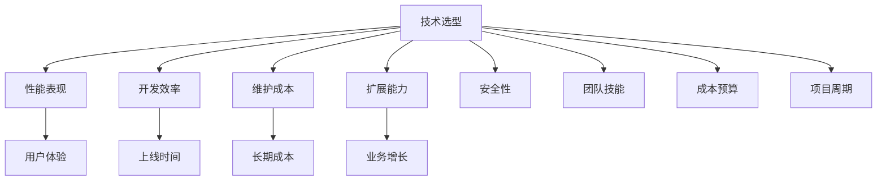

---
title: 技术选型标准和方法
date: 2025-11-17
categories:
  - Architecture
  - System Design
---

# 技术选型标准和方法

## 概述

技术选型是软件开发和系统架构中的关键决策，直接影响项目的成功与否。本文将系统性地介绍技术选型的标准、方法论、决策框架和最佳实践，并通过具体的中间件选型案例来展示如何在实际项目中进行科学的技术选型。

## 1. 技术选型的重要性

### 1.1 技术选型的影响范围


### 1.2 错误技术选型的代价
```yaml
wrong_tech_choices_cost:
  开发阶段:
    - "学习曲线陡峭，开发效率低下"
    - "功能实现困难，需要大量变通方案"
    - "性能达不到预期，需要重构优化"
    - "安全漏洞和稳定性问题"

  运维阶段:
    - "运维复杂度高，故障频发"
    - "扩展困难，无法满足业务增长"
    - "监控和调试工具匮乏"
    - "社区支持不足，问题解决困难"

  业务影响:
    - "项目延期，错失市场机会"
    - "用户体验差，客户流失"
    - "技术债务累积，重构成本巨大"
    - "团队士气低落，人员流失"
```

## 2. 技术选型的核心标准

### 2.1 技术标准维度
```yaml
technical_criteria:
  功能匹配度:
    weight: 25%
    factors:
      - "是否满足核心业务需求"
      - "功能完整性和成熟度"
      - "扩展性和定制能力"
      - "与现有系统的兼容性"

  性能表现:
    weight: 20%
    factors:
      - "响应时间和吞吐量"
      - "资源消耗和效率"
      - "并发处理能力"
      - "可扩展性上限"

  稳定性和可靠性:
    weight: 20%
    factors:
      - "系统可用性指标"
      - "故障恢复能力"
      - "数据一致性保证"
      - "异常处理机制"

  安全性:
    weight: 15%
    factors:
      - "身份认证和授权"
      - "数据加密和传输安全"
      - "漏洞历史和修复速度"
      - "合规性要求支持"

  可维护性:
    weight: 10%
    factors:
      - "代码质量和结构"
      - "文档完整性"
      - "调试和监控工具"
      - "升级和迁移便利性"

  社区和生态:
    weight: 10%
    factors:
      - "社区活跃度"
      - "文档和教程质量"
      - "第三方工具支持"
      - "商业支持可获得性"
```

### 2.2 业务标准维度
```yaml
business_criteria:
  成本控制:
    licensing_cost: "许可证费用"
    infrastructure_cost: "基础设施成本"
    development_cost: "开发成本"
    operation_cost: "运维成本"
    migration_cost: "迁移成本"

  时间要求:
    learning_curve: "学习曲线"
    development_time: "开发周期"
    deployment_time: "部署时间"
    time_to_market: "上市时间"

  风险评估:
    technical_risk: "技术风险"
    vendor_lock_in: "厂商锁定风险"
    compliance_risk: "合规风险"
    security_risk: "安全风险"

  战略匹配:
    business_alignment: "业务目标匹配度"
    technology_roadmap: "技术路线图契合度"
    competitive_advantage: "竞争优势"
    innovation_potential: "创新潜力"
```

## 3. 技术选型方法论

### 3.1 SWOT分析方法
```python
class TechnicalSWOTAnalyzer:
    def __init__(self, technology_name):
        self.technology = technology_name

    def analyze(self, context):
        """进行SWOT分析"""
        return {
            'strengths': self.identify_strengths(context),
            'weaknesses': self.identify_weaknesses(context),
            'opportunities': self.identify_opportunities(context),
            'threats': self.identify_threats(context)
        }

    def identify_strengths(self, context):
        """识别技术优势"""
        strengths = []

        # 性能优势
        if context.get('performance_requirements') == 'high':
            if self.technology in context.get('high_performance_techs', []):
                strengths.append("高性能处理能力")

        # 成熟度优势
        if context.get('stability_requirements') == 'high':
            if self.technology in context.get('mature_techs', []):
                strengths.append("技术成熟稳定")

        # 生态优势
        if context.get('ecosystem_importance') == 'high':
            ecosystem_score = context.get('ecosystem_scores', {}).get(self.technology, 0)
            if ecosystem_score > 8:
                strengths.append("生态系统完善")

        return strengths

    def identify_weaknesses(self, context):
        """识别技术弱势"""
        weaknesses = []

        # 学习成本
        learning_curve = context.get('learning_curves', {}).get(self.technology, 'medium')
        if learning_curve == 'steep':
            weaknesses.append("学习曲线陡峭")

        # 资源消耗
        resource_usage = context.get('resource_usage', {}).get(self.technology, 'medium')
        if resource_usage == 'high':
            weaknesses.append("资源消耗较大")

        return weaknesses

    def identify_opportunities(self, context):
        """识别机会"""
        opportunities = []

        # 市场趋势
        if self.technology in context.get('trending_techs', []):
            opportunities.append("技术发展趋势良好")

        # 团队技能匹配
        team_skills = context.get('team_skills', [])
        if self.technology in team_skills:
            opportunities.append("团队已具备相关技能")

        return opportunities

    def identify_threats(self, context):
        """识别威胁"""
        threats = []

        # 技术过时风险
        if self.technology in context.get('legacy_techs', []):
            threats.append("技术可能过时")

        # 厂商锁定
        vendor_lock_in = context.get('vendor_lock_in', {}).get(self.technology, 'low')
        if vendor_lock_in == 'high':
            threats.append("厂商锁定风险高")

        return threats

# 使用示例
analyzer = TechnicalSWOTAnalyzer('Redis')
context = {
    'performance_requirements': 'high',
    'high_performance_techs': ['Redis', 'Memcached'],
    'ecosystem_scores': {'Redis': 9, 'Memcached': 7},
    'learning_curves': {'Redis': 'moderate', 'Memcached': 'easy'},
    'trending_techs': ['Redis', 'Kafka'],
    'team_skills': ['Redis', 'MySQL']
}

swot_result = analyzer.analyze(context)
print(swot_result)
```

### 3.2 多维度评分模型
```python
import numpy as np
from dataclasses import dataclass
from typing import Dict, List

@dataclass
class EvaluationCriterion:
    name: str
    weight: float
    description: str

@dataclass
class TechnologyScore:
    technology: str
    scores: Dict[str, int]  # 各维度得分(1-10)

class TechnologyEvaluator:
    def __init__(self):
        self.criteria = [
            EvaluationCriterion("functionality", 0.25, "功能匹配度"),
            EvaluationCriterion("performance", 0.20, "性能表现"),
            EvaluationCriterion("reliability", 0.20, "稳定性"),
            EvaluationCriterion("security", 0.15, "安全性"),
            EvaluationCriterion("maintainability", 0.10, "可维护性"),
            EvaluationCriterion("ecosystem", 0.10, "生态系统")
        ]

    def evaluate_technology(self, tech_scores: TechnologyScore) -> Dict:
        """评估单个技术方案"""
        weighted_score = 0
        detailed_scores = {}

        for criterion in self.criteria:
            score = tech_scores.scores.get(criterion.name, 0)
            weighted = score * criterion.weight
            weighted_score += weighted

            detailed_scores[criterion.name] = {
                'raw_score': score,
                'weighted_score': weighted,
                'weight': criterion.weight
            }

        return {
            'technology': tech_scores.technology,
            'total_score': weighted_score,
            'detailed_scores': detailed_scores,
            'normalized_score': weighted_score / 10  # 归一化到0-1
        }

    def compare_technologies(self, tech_scores_list: List[TechnologyScore]) -> Dict:
        """比较多个技术方案"""
        evaluations = []

        for tech_scores in tech_scores_list:
            evaluation = self.evaluate_technology(tech_scores)
            evaluations.append(evaluation)

        # 按总分排序
        evaluations.sort(key=lambda x: x['total_score'], reverse=True)

        # 生成对比报告
        comparison = {
            'rankings': evaluations,
            'best_choice': evaluations[0],
            'criterion_analysis': self._analyze_by_criterion(tech_scores_list)
        }

        return comparison

    def _analyze_by_criterion(self, tech_scores_list: List[TechnologyScore]) -> Dict:
        """按标准维度分析"""
        analysis = {}

        for criterion in self.criteria:
            criterion_scores = []

            for tech_scores in tech_scores_list:
                score = tech_scores.scores.get(criterion.name, 0)
                criterion_scores.append({
                    'technology': tech_scores.technology,
                    'score': score
                })

            # 按该维度排序
            criterion_scores.sort(key=lambda x: x['score'], reverse=True)

            analysis[criterion.name] = {
                'best_performer': criterion_scores[0],
                'all_scores': criterion_scores,
                'average_score': np.mean([s['score'] for s in criterion_scores])
            }

        return analysis

# 使用示例：消息队列技术选型
def message_queue_selection_example():
    evaluator = TechnologyEvaluator()

    # 定义候选技术的评分
    technologies = [
        TechnologyScore("RabbitMQ", {
            "functionality": 9,
            "performance": 7,
            "reliability": 9,
            "security": 8,
            "maintainability": 8,
            "ecosystem": 8
        }),
        TechnologyScore("Apache Kafka", {
            "functionality": 8,
            "performance": 10,
            "reliability": 8,
            "security": 7,
            "maintainability": 6,
            "ecosystem": 9
        }),
        TechnologyScore("Redis Streams", {
            "functionality": 7,
            "performance": 9,
            "reliability": 7,
            "security": 6,
            "maintainability": 7,
            "ecosystem": 8
        }),
        TechnologyScore("Amazon SQS", {
            "functionality": 8,
            "performance": 8,
            "reliability": 10,
            "security": 9,
            "maintainability": 9,
            "ecosystem": 7
        })
    ]

    comparison_result = evaluator.compare_technologies(technologies)

    return comparison_result
```

### 3.3 决策树方法
```python
class TechnicalDecisionTree:
    def __init__(self):
        self.decision_nodes = {}
        self.build_decision_tree()

    def build_decision_tree(self):
        """构建技术选型决策树"""
        self.decision_nodes = {
            'root': {
                'question': '项目的主要特征是什么？',
                'options': {
                    'high_performance': 'performance_node',
                    'high_availability': 'availability_node',
                    'cost_sensitive': 'cost_node',
                    'rapid_development': 'development_node'
                }
            },
            'performance_node': {
                'question': '性能要求的具体指标？',
                'options': {
                    'low_latency': {
                        'recommendations': ['Redis', 'Hazelcast', 'MemcachedRocket'],
                        'rationale': '内存数据库提供最低延迟'
                    },
                    'high_throughput': {
                        'recommendations': ['Apache Kafka', 'Apache Pulsar'],
                        'rationale': '分布式消息系统支持高吞吐'
                    },
                    'complex_queries': {
                        'recommendations': ['PostgreSQL', 'ClickHouse'],
                        'rationale': '支持复杂SQL查询优化'
                    }
                }
            },
            'availability_node': {
                'question': '可用性要求级别？',
                'options': {
                    '99.9%': {
                        'recommendations': ['MySQL Master-Slave', 'Redis Sentinel'],
                        'rationale': '主从架构提供基础高可用'
                    },
                    '99.99%': {
                        'recommendations': ['MySQL Cluster', 'PostgreSQL HA', 'MongoDB Replica Set'],
                        'rationale': '集群架构支持更高可用性'
                    },
                    '99.999%': {
                        'recommendations': ['Apache Cassandra', 'Amazon DynamoDB', 'Google Spanner'],
                        'rationale': '分布式数据库提供极高可用性'
                    }
                }
            },
            'cost_node': {
                'question': '成本优先考虑哪个方面？',
                'options': {
                    'licensing_cost': {
                        'recommendations': ['MySQL', 'PostgreSQL', 'Redis', 'MongoDB'],
                        'rationale': '开源方案无许可证费用'
                    },
                    'infrastructure_cost': {
                        'recommendations': ['SQLite', 'H2', 'Apache Derby'],
                        'rationale': '嵌入式数据库减少基础设施成本'
                    },
                    'operational_cost': {
                        'recommendations': ['Amazon RDS', 'Google Cloud SQL', 'Azure SQL'],
                        'rationale': '托管服务降低运维成本'
                    }
                }
            },
            'development_node': {
                'question': '开发效率的关键因素？',
                'options': {
                    'familiar_technology': {
                        'recommendations': 'team_skills_analysis',
                        'rationale': '基于团队现有技能选择'
                    },
                    'rapid_prototyping': {
                        'recommendations': ['MongoDB', 'Firebase', 'SQLite'],
                        'rationale': '支持快速原型开发'
                    },
                    'rich_ecosystem': {
                        'recommendations': ['MySQL', 'PostgreSQL', 'Redis'],
                        'rationale': '生态系统丰富，开发工具多'
                    }
                }
            }
        }

    def make_decision(self, requirements: Dict) -> Dict:
        """基于需求进行决策"""
        current_node = 'root'
        path = []

        while current_node in self.decision_nodes:
            node = self.decision_nodes[current_node]
            path.append({
                'node': current_node,
                'question': node['question']
            })

            # 根据需求自动选择路径
            if current_node == 'root':
                if requirements.get('performance_critical', False):
                    current_node = 'performance_node'
                elif requirements.get('availability_critical', False):
                    current_node = 'availability_node'
                elif requirements.get('cost_sensitive', False):
                    current_node = 'cost_node'
                else:
                    current_node = 'development_node'

            elif current_node == 'performance_node':
                if requirements.get('latency_requirement', 'normal') == 'ultra_low':
                    return self._format_recommendation(
                        node['options']['low_latency'], path)
                elif requirements.get('throughput_requirement', 'normal') == 'high':
                    return self._format_recommendation(
                        node['options']['high_throughput'], path)
                else:
                    return self._format_recommendation(
                        node['options']['complex_queries'], path)

            elif current_node == 'availability_node':
                availability = requirements.get('availability_requirement', '99.9%')
                if availability in node['options']:
                    return self._format_recommendation(
                        node['options'][availability], path)

            else:
                # 其他节点的处理逻辑
                break

        return {'error': 'Decision path not found'}

    def _format_recommendation(self, recommendation: Dict, path: List) -> Dict:
        """格式化推荐结果"""
        return {
            'recommendations': recommendation['recommendations'],
            'rationale': recommendation['rationale'],
            'decision_path': path,
            'confidence': self._calculate_confidence(recommendation)
        }

    def _calculate_confidence(self, recommendation: Dict) -> float:
        """计算推荐的置信度"""
        # 基于推荐技术数量和明确度计算置信度
        tech_count = len(recommendation['recommendations'])
        if tech_count == 1:
            return 0.9  # 明确推荐
        elif tech_count <= 3:
            return 0.8  # 几个选择
        else:
            return 0.6  # 选择较多，置信度较低

# 使用示例
def decision_tree_example():
    decision_tree = TechnicalDecisionTree()

    # 高性能缓存需求
    requirements = {
        'performance_critical': True,
        'latency_requirement': 'ultra_low',
        'throughput_requirement': 'high',
        'availability_requirement': '99.9%',
        'cost_sensitive': False
    }

    recommendation = decision_tree.make_decision(requirements)
    return recommendation
```

## 4. 中间件选型实战案例

### 4.1 消息队列选型案例

#### 业务场景分析
```yaml
business_scenario:
  项目背景: "电商平台微服务架构"
  业务需求:
    - "订单状态变更通知"
    - "库存扣减事件处理"
    - "用户行为数据收集"
    - "支付回调处理"

  技术要求:
    - "消息不丢失"
    - "至少一次投递保证"
    - "支持消息分区"
    - "高可用性"
    - "监控和运维友好"

  约束条件:
    - "团队熟悉Java技术栈"
    - "预算有限，优先开源方案"
    - "需要在3个月内上线"
    - "预期QPS峰值10万"
```

#### 候选方案分析
```python
class MessageQueueSelector:
    def __init__(self):
        self.candidates = {
            'RabbitMQ': {
                'pros': [
                    '成熟稳定，社区活跃',
                    '支持多种消息模式',
                    '管理界面友好',
                    '文档完善'
                ],
                'cons': [
                    '性能相对较低',
                    'Erlang技术栈，调试困难',
                    '集群配置复杂'
                ],
                'scores': {
                    'functionality': 9,
                    'performance': 6,
                    'reliability': 8,
                    'ease_of_use': 8,
                    'ecosystem': 8,
                    'cost': 9
                }
            },
            'Apache Kafka': {
                'pros': [
                    '高性能高吞吐',
                    '分布式架构',
                    '数据持久化',
                    '强大的流处理能力'
                ],
                'cons': [
                    '学习曲线陡峭',
                    '运维复杂',
                    '不适合传统消息队列场景'
                ],
                'scores': {
                    'functionality': 7,
                    'performance': 10,
                    'reliability': 8,
                    'ease_of_use': 5,
                    'ecosystem': 9,
                    'cost': 8
                }
            },
            'RocketMQ': {
                'pros': [
                    '阿里巴巴生产验证',
                    '支持事务消息',
                    '性能优秀',
                    '中文文档丰富'
                ],
                'cons': [
                    '社区相对较小',
                    '国际化程度不高',
                    '版本迭代较快'
                ],
                'scores': {
                    'functionality': 8,
                    'performance': 9,
                    'reliability': 8,
                    'ease_of_use': 7,
                    'ecosystem': 6,
                    'cost': 9
                }
            }
        }

    def evaluate_for_scenario(self, scenario_requirements):
        """针对具体场景评估"""
        weighted_scores = {}

        # 根据场景调整权重
        if scenario_requirements.get('performance_critical'):
            weights = {'performance': 0.3, 'functionality': 0.2, 'reliability': 0.2,
                      'ease_of_use': 0.1, 'ecosystem': 0.1, 'cost': 0.1}
        elif scenario_requirements.get('ease_of_use_critical'):
            weights = {'ease_of_use': 0.3, 'functionality': 0.2, 'reliability': 0.2,
                      'performance': 0.1, 'ecosystem': 0.1, 'cost': 0.1}
        else:
            weights = {'functionality': 0.25, 'reliability': 0.2, 'performance': 0.2,
                      'ease_of_use': 0.15, 'ecosystem': 0.1, 'cost': 0.1}

        for tech, data in self.candidates.items():
            score = sum(data['scores'][criterion] * weight
                       for criterion, weight in weights.items())
            weighted_scores[tech] = {
                'total_score': score,
                'scores': data['scores'],
                'pros': data['pros'],
                'cons': data['cons']
            }

        return weighted_scores

# 场景评估
selector = MessageQueueSelector()
scenario = {'performance_critical': True, 'high_availability': True}
evaluation_result = selector.evaluate_for_scenario(scenario)

# 输出推荐结果
for tech, result in sorted(evaluation_result.items(),
                          key=lambda x: x[1]['total_score'], reverse=True):
    print(f"{tech}: 总分 {result['total_score']:.2f}")
    print(f"  优势: {', '.join(result['pros'][:2])}")
    print(f"  劣势: {', '.join(result['cons'][:2])}")
```

#### 决策过程记录
```python
class DecisionRecord:
    def __init__(self):
        self.decision_log = []

    def record_decision_step(self, step_name, description, data, rationale):
        """记录决策步骤"""
        step = {
            'timestamp': datetime.now().isoformat(),
            'step': step_name,
            'description': description,
            'data': data,
            'rationale': rationale
        }
        self.decision_log.append(step)

    def generate_decision_report(self):
        """生成决策报告"""
        report = {
            'summary': {
                'total_steps': len(self.decision_log),
                'decision_timeline': [step['timestamp'] for step in self.decision_log],
                'final_recommendation': self.decision_log[-1] if self.decision_log else None
            },
            'detailed_process': self.decision_log,
            'key_factors': self._extract_key_factors(),
            'alternatives_considered': self._extract_alternatives()
        }
        return report

    def _extract_key_factors(self):
        """提取关键决策因素"""
        factors = []
        for step in self.decision_log:
            if 'factors' in step.get('data', {}):
                factors.extend(step['data']['factors'])
        return list(set(factors))

    def _extract_alternatives(self):
        """提取考虑的备选方案"""
        alternatives = []
        for step in self.decision_log:
            if 'alternatives' in step.get('data', {}):
                alternatives.extend(step['data']['alternatives'])
        return list(set(alternatives))

# 使用示例
def document_mq_decision():
    recorder = DecisionRecord()

    # 需求分析步骤
    recorder.record_decision_step(
        step_name="需求分析",
        description="分析业务场景和技术需求",
        data={
            'business_requirements': ['订单处理', '库存管理', '用户通知'],
            'technical_requirements': ['高性能', '高可用', '消息持久化'],
            'constraints': ['开源优先', '3个月上线', 'Java技术栈'],
            'factors': ['性能', '可靠性', '学习成本']
        },
        rationale="明确项目需求是技术选型的基础"
    )

    # 候选方案识别
    recorder.record_decision_step(
        step_name="候选方案识别",
        description="识别可能的技术方案",
        data={
            'alternatives': ['RabbitMQ', 'Apache Kafka', 'RocketMQ', 'ActiveMQ'],
            'screening_criteria': ['开源', 'Java支持', '社区活跃'],
            'eliminated': ['ActiveMQ'],
            'eliminated_reason': ['社区活跃度低', '性能不足']
        },
        rationale="筛选出符合基本要求的候选方案"
    )

    # 详细评估
    recorder.record_decision_step(
        step_name="详细评估",
        description="对候选方案进行多维度评估",
        data={
            'evaluation_criteria': ['功能', '性能', '可靠性', '易用性', '生态', '成本'],
            'evaluation_results': {
                'RabbitMQ': 7.8,
                'Apache Kafka': 8.2,
                'RocketMQ': 7.6
            },
            'factors': ['性能权重调整', '团队技能考虑']
        },
        rationale="基于量化评估确定最佳方案"
    )

    # 最终决策
    recorder.record_decision_step(
        step_name="最终决策",
        description="综合考虑所有因素做出最终决策",
        data={
            'final_choice': 'Apache Kafka',
            'key_reasons': [
                '高性能满足10万QPS需求',
                '分布式架构支持横向扩展',
                '数据持久化保证消息不丢失',
                '丰富的生态系统'
            ],
            'mitigation_plans': [
                '组织Kafka培训降低学习成本',
                '引入专业运维工具简化管理',
                '制定详细的运维文档'
            ]
        },
        rationale="Kafka在性能和扩展性方面的优势超越了学习成本的劣势"
    )

    return recorder.generate_decision_report()
```

### 4.2 数据库选型案例

#### 数据存储需求分析
```python
class DatabaseSelector:
    def __init__(self):
        self.selection_framework = {
            'data_models': {
                'relational': ['MySQL', 'PostgreSQL', 'Oracle', 'SQL Server'],
                'document': ['MongoDB', 'CouchDB', 'Amazon DocumentDB'],
                'key_value': ['Redis', 'DynamoDB', 'Riak'],
                'column_family': ['Cassandra', 'HBase', 'Amazon Redshift'],
                'graph': ['Neo4j', 'Amazon Neptune', 'ArangoDB'],
                'time_series': ['InfluxDB', 'TimescaleDB', 'OpenTSDB'],
                'search': ['Elasticsearch', 'Solr', 'Amazon CloudSearch']
            },
            'use_case_patterns': {
                'oltp': {
                    'characteristics': ['high_concurrency', 'acid_compliance', 'complex_queries'],
                    'recommended': ['PostgreSQL', 'MySQL', 'Oracle']
                },
                'olap': {
                    'characteristics': ['large_datasets', 'analytical_queries', 'batch_processing'],
                    'recommended': ['ClickHouse', 'Apache Druid', 'Amazon Redshift']
                },
                'real_time_analytics': {
                    'characteristics': ['streaming_data', 'low_latency', 'high_throughput'],
                    'recommended': ['Apache Kafka + ClickHouse', 'Apache Druid', 'Amazon Kinesis Analytics']
                },
                'content_management': {
                    'characteristics': ['flexible_schema', 'hierarchical_data', 'full_text_search'],
                    'recommended': ['MongoDB', 'Elasticsearch', 'PostgreSQL']
                }
            }
        }

    def analyze_requirements(self, requirements):
        """分析数据存储需求"""
        analysis = {
            'data_characteristics': self._analyze_data_characteristics(requirements),
            'access_patterns': self._analyze_access_patterns(requirements),
            'scalability_needs': self._analyze_scalability_needs(requirements),
            'consistency_requirements': self._analyze_consistency_requirements(requirements)
        }
        return analysis

    def _analyze_data_characteristics(self, requirements):
        """分析数据特征"""
        data_type = requirements.get('primary_data_type', 'structured')
        schema_flexibility = requirements.get('schema_flexibility', 'fixed')
        data_relationships = requirements.get('data_relationships', 'simple')

        if data_type == 'structured' and schema_flexibility == 'fixed':
            return {
                'model_recommendation': 'relational',
                'rationale': '结构化数据，固定模式适合关系型数据库'
            }
        elif data_type == 'semi_structured' or schema_flexibility == 'flexible':
            return {
                'model_recommendation': 'document',
                'rationale': '半结构化数据或灵活模式适合文档数据库'
            }
        elif data_relationships == 'complex_graph':
            return {
                'model_recommendation': 'graph',
                'rationale': '复杂关系数据适合图数据库'
            }
        else:
            return {
                'model_recommendation': 'hybrid',
                'rationale': '需要综合考虑多种数据模型'
            }

    def _analyze_access_patterns(self, requirements):
        """分析访问模式"""
        read_write_ratio = requirements.get('read_write_ratio', '70:30')
        query_complexity = requirements.get('query_complexity', 'medium')
        concurrent_users = requirements.get('concurrent_users', 1000)

        patterns = []

        read_ratio = int(read_write_ratio.split(':')[0])
        if read_ratio > 80:
            patterns.append('read_heavy')

        if query_complexity == 'complex':
            patterns.append('complex_queries')

        if concurrent_users > 10000:
            patterns.append('high_concurrency')

        return {
            'identified_patterns': patterns,
            'optimization_focus': 'read_performance' if 'read_heavy' in patterns else 'balanced'
        }

    def recommend_database(self, requirements):
        """推荐数据库方案"""
        analysis = self.analyze_requirements(requirements)

        # 基于分析结果推荐数据库
        model_rec = analysis['data_characteristics']['model_recommendation']
        access_patterns = analysis['access_patterns']['identified_patterns']

        candidates = self.selection_framework['data_models'].get(model_rec, [])

        # 根据访问模式进一步筛选
        if 'read_heavy' in access_patterns:
            # 优化读性能的数据库
            if model_rec == 'relational':
                candidates = [db for db in candidates if db in ['PostgreSQL', 'MySQL']]

        if 'high_concurrency' in access_patterns:
            # 支持高并发的数据库
            candidates = [db for db in candidates if db not in ['SQLite']]

        # 评分和排序
        scored_candidates = []
        for candidate in candidates:
            score = self._score_candidate(candidate, requirements, analysis)
            scored_candidates.append((candidate, score))

        scored_candidates.sort(key=lambda x: x[1], reverse=True)

        return {
            'primary_recommendation': scored_candidates[0] if scored_candidates else None,
            'alternatives': scored_candidates[1:3],
            'analysis': analysis,
            'rationale': self._generate_rationale(scored_candidates[0] if scored_candidates else None, analysis)
        }

    def _score_candidate(self, candidate, requirements, analysis):
        """为候选数据库评分"""
        # 这里简化评分逻辑，实际应该更复杂
        base_score = 5.0

        # 根据不同因素调整分数
        if candidate == 'PostgreSQL':
            base_score += 1.5  # PostgreSQL功能丰富
        elif candidate == 'MySQL':
            base_score += 1.0  # MySQL简单易用
        elif candidate == 'MongoDB':
            base_score += 0.5 if requirements.get('schema_flexibility') == 'flexible' else -0.5

        # 根据访问模式调整
        patterns = analysis['access_patterns']['identified_patterns']
        if 'read_heavy' in patterns and candidate in ['PostgreSQL', 'MySQL']:
            base_score += 0.5

        return base_score

    def _generate_rationale(self, recommendation, analysis):
        """生成推荐理由"""
        if not recommendation:
            return "没有找到合适的推荐"

        db_name = recommendation[0]
        score = recommendation[1]

        rationale = f"推荐{db_name}，评分{score:.1f}。"
        rationale += f"基于{analysis['data_characteristics']['rationale']}，"
        rationale += f"访问模式为{', '.join(analysis['access_patterns']['identified_patterns'])}。"

        return rationale

# 使用示例
def database_selection_example():
    selector = DatabaseSelector()

    # 电商订单系统需求
    requirements = {
        'primary_data_type': 'structured',
        'schema_flexibility': 'fixed',
        'data_relationships': 'moderate',
        'read_write_ratio': '80:20',
        'query_complexity': 'medium',
        'concurrent_users': 5000,
        'data_volume': 'medium',  # < 1TB
        'consistency_requirement': 'strong'
    }

    recommendation = selector.recommend_database(requirements)
    return recommendation
```

## 5. 技术选型的风险管理

### 5.1 风险识别与评估
```python
from enum import Enum
from dataclasses import dataclass
from typing import List, Dict

class RiskLevel(Enum):
    LOW = 1
    MEDIUM = 2
    HIGH = 3
    CRITICAL = 4

@dataclass
class TechnicalRisk:
    name: str
    description: str
    category: str
    probability: float  # 0-1
    impact: RiskLevel
    mitigation_strategies: List[str]

class TechnicalRiskAssessment:
    def __init__(self):
        self.risk_categories = {
            'technical': '技术风险',
            'business': '业务风险',
            'organizational': '组织风险',
            'external': '外部风险'
        }

    def assess_technology_risks(self, technology: str, context: Dict) -> List[TechnicalRisk]:
        """评估特定技术的风险"""
        risks = []

        # 技术成熟度风险
        if self._is_emerging_technology(technology):
            risks.append(TechnicalRisk(
                name="技术成熟度风险",
                description=f"{technology}是相对较新的技术，可能存在未知问题",
                category="technical",
                probability=0.6,
                impact=RiskLevel.MEDIUM,
                mitigation_strategies=[
                    "进行充分的PoC验证",
                    "关注社区反馈和问题报告",
                    "准备技术备选方案",
                    "渐进式部署策略"
                ]
            ))

        # 团队技能风险
        team_familiarity = context.get('team_familiarity', {}).get(technology, 0)
        if team_familiarity < 0.5:
            risks.append(TechnicalRisk(
                name="团队技能风险",
                description=f"团队对{technology}不够熟悉，可能影响开发效率和质量",
                category="organizational",
                probability=0.8,
                impact=RiskLevel.HIGH,
                mitigation_strategies=[
                    "组织专业培训",
                    "引入外部专家指导",
                    "建立知识分享机制",
                    "预留额外的学习时间"
                ]
            ))

        # 厂商锁定风险
        vendor_lock_in_level = self._assess_vendor_lock_in(technology)
        if vendor_lock_in_level > 0.7:
            risks.append(TechnicalRisk(
                name="厂商锁定风险",
                description=f"使用{technology}可能导致严重的厂商锁定",
                category="business",
                probability=0.9,
                impact=RiskLevel.HIGH,
                mitigation_strategies=[
                    "使用标准接口和协议",
                    "制定迁移计划和策略",
                    "避免使用厂商特有功能",
                    "建立多厂商策略"
                ]
            ))

        # 性能风险
        if context.get('performance_critical', False):
            performance_uncertainty = self._assess_performance_uncertainty(technology, context)
            if performance_uncertainty > 0.5:
                risks.append(TechnicalRisk(
                    name="性能风险",
                    description=f"{technology}在当前场景下的性能表现存在不确定性",
                    category="technical",
                    probability=0.4,
                    impact=RiskLevel.CRITICAL,
                    mitigation_strategies=[
                        "进行性能基准测试",
                        "设计性能监控体系",
                        "准备性能优化方案",
                        "建立性能回退机制"
                    ]
                ))

        # 社区支持风险
        community_risk = self._assess_community_risk(technology)
        if community_risk > 0.6:
            risks.append(TechnicalRisk(
                name="社区支持风险",
                description=f"{technology}的社区支持可能不够充分",
                category="external",
                probability=0.5,
                impact=RiskLevel.MEDIUM,
                mitigation_strategies=[
                    "建立内部技术支持团队",
                    "寻找商业支持选项",
                    "参与开源社区贡献",
                    "建立技术交流网络"
                ]
            ))

        return risks

    def calculate_risk_score(self, risks: List[TechnicalRisk]) -> Dict:
        """计算综合风险评分"""
        if not risks:
            return {'total_score': 0, 'risk_level': 'LOW'}

        total_score = 0
        for risk in risks:
            impact_weight = {
                RiskLevel.LOW: 1,
                RiskLevel.MEDIUM: 2,
                RiskLevel.HIGH: 3,
                RiskLevel.CRITICAL: 4
            }
            score = risk.probability * impact_weight[risk.impact]
            total_score += score

        avg_score = total_score / len(risks)

        if avg_score < 1.5:
            risk_level = 'LOW'
        elif avg_score < 2.5:
            risk_level = 'MEDIUM'
        elif avg_score < 3.5:
            risk_level = 'HIGH'
        else:
            risk_level = 'CRITICAL'

        return {
            'total_score': total_score,
            'average_score': avg_score,
            'risk_level': risk_level,
            'risk_count': len(risks)
        }

    def generate_risk_mitigation_plan(self, risks: List[TechnicalRisk]) -> Dict:
        """生成风险缓解计划"""
        mitigation_plan = {
            'immediate_actions': [],
            'short_term_actions': [],
            'long_term_actions': [],
            'contingency_plans': []
        }

        for risk in risks:
            if risk.impact == RiskLevel.CRITICAL:
                mitigation_plan['immediate_actions'].extend(risk.mitigation_strategies[:2])
            elif risk.impact == RiskLevel.HIGH:
                mitigation_plan['short_term_actions'].extend(risk.mitigation_strategies)
            else:
                mitigation_plan['long_term_actions'].extend(risk.mitigation_strategies)

        # 去重
        for category in mitigation_plan:
            mitigation_plan[category] = list(set(mitigation_plan[category]))

        return mitigation_plan

    def _is_emerging_technology(self, technology: str) -> bool:
        """判断是否为新兴技术"""
        emerging_techs = ['Rust', 'Deno', 'Svelte', 'Solid.js', 'Fresh']
        return technology in emerging_techs

    def _assess_vendor_lock_in(self, technology: str) -> float:
        """评估厂商锁定程度"""
        # 简化的评估逻辑
        high_lock_in = ['AWS DynamoDB', 'Google Bigtable', 'Azure Cosmos DB']
        medium_lock_in = ['MongoDB Atlas', 'Redis Enterprise']
        low_lock_in = ['PostgreSQL', 'MySQL', 'Redis']

        if technology in high_lock_in:
            return 0.9
        elif technology in medium_lock_in:
            return 0.5
        elif technology in low_lock_in:
            return 0.1
        else:
            return 0.3  # 默认中等风险

    def _assess_performance_uncertainty(self, technology: str, context: Dict) -> float:
        """评估性能不确定性"""
        # 基于技术特点和应用场景评估
        if context.get('scale', 'medium') == 'large':
            return 0.7  # 大规模应用性能不确定性高
        elif context.get('load_pattern') == 'unpredictable':
            return 0.6  # 不可预测负载模式
        else:
            return 0.3  # 一般情况

    def _assess_community_risk(self, technology: str) -> float:
        """评估社区支持风险"""
        # 基于GitHub stars、贡献者数量、活跃度等指标
        # 这里简化处理
        strong_community = ['React', 'Angular', 'Vue.js', 'PostgreSQL', 'MySQL']
        weak_community = ['Meteor', 'Backbone.js', 'CouchDB']

        if technology in strong_community:
            return 0.2
        elif technology in weak_community:
            return 0.8
        else:
            return 0.5

# 使用示例
def risk_assessment_example():
    assessor = TechnicalRiskAssessment()

    context = {
        'team_familiarity': {'MongoDB': 0.3, 'PostgreSQL': 0.8},
        'performance_critical': True,
        'scale': 'large',
        'load_pattern': 'predictable'
    }

    # 评估MongoDB的风险
    mongodb_risks = assessor.assess_technology_risks('MongoDB', context)
    risk_score = assessor.calculate_risk_score(mongodb_risks)
    mitigation_plan = assessor.generate_risk_mitigation_plan(mongodb_risks)

    return {
        'risks': mongodb_risks,
        'risk_score': risk_score,
        'mitigation_plan': mitigation_plan
    }
```

### 5.2 风险监控与预警
```python
class TechnicalRiskMonitor:
    def __init__(self):
        self.risk_indicators = {}
        self.alert_thresholds = {}
        self.monitoring_metrics = {}

    def setup_risk_monitoring(self, technology: str, risks: List[TechnicalRisk]):
        """设置风险监控"""
        indicators = {}

        for risk in risks:
            if risk.category == 'technical':
                if 'performance' in risk.name.lower():
                    indicators[f'{risk.name}_latency'] = {
                        'metric': 'response_time_p95',
                        'threshold': 1000,  # ms
                        'alert_level': 'warning'
                    }
                    indicators[f'{risk.name}_throughput'] = {
                        'metric': 'requests_per_second',
                        'threshold': 100,
                        'alert_level': 'critical'
                    }

                if 'stability' in risk.name.lower():
                    indicators[f'{risk.name}_error_rate'] = {
                        'metric': 'error_rate',
                        'threshold': 0.05,  # 5%
                        'alert_level': 'warning'
                    }
                    indicators[f'{risk.name}_uptime'] = {
                        'metric': 'uptime_percentage',
                        'threshold': 0.995,  # 99.5%
                        'alert_level': 'critical'
                    }

            elif risk.category == 'organizational':
                if 'skill' in risk.name.lower():
                    indicators[f'{risk.name}_velocity'] = {
                        'metric': 'development_velocity',
                        'threshold': 0.8,  # 相对基线
                        'alert_level': 'warning'
                    }
                    indicators[f'{risk.name}_bug_rate'] = {
                        'metric': 'bug_introduction_rate',
                        'threshold': 0.1,  # 10%
                        'alert_level': 'critical'
                    }

        self.risk_indicators[technology] = indicators

    def check_risk_indicators(self, technology: str, current_metrics: Dict) -> List[Dict]:
        """检查风险指标"""
        alerts = []
        indicators = self.risk_indicators.get(technology, {})

        for indicator_name, indicator_config in indicators.items():
            metric_name = indicator_config['metric']
            threshold = indicator_config['threshold']
            alert_level = indicator_config['alert_level']

            current_value = current_metrics.get(metric_name)

            if current_value is not None:
                is_alert = False

                # 根据指标类型判断是否触发告警
                if 'latency' in indicator_name or 'error_rate' in indicator_name or 'bug_rate' in indicator_name:
                    is_alert = current_value > threshold
                elif 'throughput' in indicator_name or 'uptime' in indicator_name or 'velocity' in indicator_name:
                    is_alert = current_value < threshold

                if is_alert:
                    alerts.append({
                        'indicator': indicator_name,
                        'metric': metric_name,
                        'current_value': current_value,
                        'threshold': threshold,
                        'alert_level': alert_level,
                        'technology': technology
                    })

        return alerts

    def generate_risk_report(self, technology: str, time_period: str = '24h') -> Dict:
        """生成风险报告"""
        # 这里简化实现，实际应该从监控系统获取数据
        mock_metrics = {
            'response_time_p95': 500,
            'requests_per_second': 150,
            'error_rate': 0.02,
            'uptime_percentage': 0.998,
            'development_velocity': 0.9,
            'bug_introduction_rate': 0.05
        }

        alerts = self.check_risk_indicators(technology, mock_metrics)

        report = {
            'technology': technology,
            'time_period': time_period,
            'risk_status': 'GREEN' if not alerts else 'YELLOW' if len(alerts) < 3 else 'RED',
            'active_alerts': alerts,
            'metrics_summary': mock_metrics,
            'recommendations': self._generate_recommendations(alerts)
        }

        return report

    def _generate_recommendations(self, alerts: List[Dict]) -> List[str]:
        """基于告警生成建议"""
        recommendations = []

        for alert in alerts:
            if 'latency' in alert['indicator']:
                recommendations.append("考虑进行性能调优或增加缓存")
            elif 'error_rate' in alert['indicator']:
                recommendations.append("检查错误日志，修复常见问题")
            elif 'velocity' in alert['indicator']:
                recommendations.append("评估团队培训需求，提供技术支持")
            elif 'bug_rate' in alert['indicator']:
                recommendations.append("加强代码审查和测试覆盖率")

        return list(set(recommendations))

# 使用示例
def risk_monitoring_example():
    monitor = TechnicalRiskMonitor()

    # 模拟的风险列表
    risks = [
        TechnicalRisk(
            name="性能风险",
            description="系统性能可能不满足要求",
            category="technical",
            probability=0.3,
            impact=RiskLevel.HIGH,
            mitigation_strategies=[]
        ),
        TechnicalRisk(
            name="团队技能风险",
            description="团队技能不足",
            category="organizational",
            probability=0.6,
            impact=RiskLevel.MEDIUM,
            mitigation_strategies=[]
        )
    ]

    # 设置监控
    monitor.setup_risk_monitoring('MongoDB', risks)

    # 生成风险报告
    risk_report = monitor.generate_risk_report('MongoDB')

    return risk_report
```

## 6. 技术选型的组织和流程

### 6.1 技术委员会模式
```python
from abc import ABC, abstractmethod
from typing import List, Dict, Optional

class TechnicalCommitteeMember(ABC):
    def __init__(self, name: str, role: str, expertise: List[str]):
        self.name = name
        self.role = role
        self.expertise = expertise
        self.voting_weight = 1.0

    @abstractmethod
    def evaluate_proposal(self, proposal: Dict) -> Dict:
        """评估技术提案"""
        pass

class ArchitectCommitteeMember(TechnicalCommitteeMember):
    def __init__(self, name: str, expertise: List[str]):
        super().__init__(name, "Architect", expertise)
        self.voting_weight = 1.5  # 架构师权重更高

    def evaluate_proposal(self, proposal: Dict) -> Dict:
        """从架构角度评估提案"""
        score = 0
        comments = []

        # 架构一致性评估
        if self._check_architecture_alignment(proposal):
            score += 2
            comments.append("与现有架构保持一致")
        else:
            score -= 1
            comments.append("可能引入架构复杂性")

        # 扩展性评估
        if proposal.get('scalability', 'medium') == 'high':
            score += 1
            comments.append("具备良好的扩展能力")

        # 维护性评估
        if proposal.get('maintainability', 'medium') == 'high':
            score += 1
            comments.append("维护成本可控")

        return {
            'member': self.name,
            'role': self.role,
            'score': score,
            'max_score': 4,
            'comments': comments,
            'recommendation': 'approve' if score >= 2 else 'reject'
        }

    def _check_architecture_alignment(self, proposal: Dict) -> bool:
        """检查架构一致性"""
        # 简化的架构一致性检查
        current_stack = proposal.get('current_stack', [])
        proposed_tech = proposal.get('technology')

        # 如果提案技术与现有技术栈兼容，返回True
        return any(tech in current_stack for tech in [proposed_tech])

class DeveloperCommitteeMember(TechnicalCommitteeMember):
    def __init__(self, name: str, expertise: List[str]):
        super().__init__(name, "Developer", expertise)

    def evaluate_proposal(self, proposal: Dict) -> Dict:
        """从开发角度评估提案"""
        score = 0
        comments = []

        # 开发效率评估
        learning_curve = proposal.get('learning_curve', 'medium')
        if learning_curve == 'easy':
            score += 2
            comments.append("学习成本低，开发效率高")
        elif learning_curve == 'medium':
            score += 1
            comments.append("学习成本适中")

        # 调试和工具支持
        if proposal.get('debugging_tools', False):
            score += 1
            comments.append("调试工具丰富")

        # 文档质量
        if proposal.get('documentation_quality', 'medium') == 'high':
            score += 1
            comments.append("文档质量优秀")

        return {
            'member': self.name,
            'role': self.role,
            'score': score,
            'max_score': 4,
            'comments': comments,
            'recommendation': 'approve' if score >= 2 else 'reject'
        }

class OpsCommitteeMember(TechnicalCommitteeMember):
    def __init__(self, name: str, expertise: List[str]):
        super().__init__(name, "Operations", expertise)

    def evaluate_proposal(self, proposal: Dict) -> Dict:
        """从运维角度评估提案"""
        score = 0
        comments = []

        # 运维复杂度
        if proposal.get('operational_complexity', 'medium') == 'low':
            score += 2
            comments.append("运维简单")
        elif proposal.get('operational_complexity', 'medium') == 'medium':
            score += 1

        # 监控和告警
        if proposal.get('monitoring_support', False):
            score += 1
            comments.append("监控支持完善")

        # 高可用性
        if proposal.get('high_availability', False):
            score += 1
            comments.append("支持高可用部署")

        return {
            'member': self.name,
            'role': self.role,
            'score': score,
            'max_score': 4,
            'comments': comments,
            'recommendation': 'approve' if score >= 2 else 'reject'
        }

class TechnicalCommittee:
    def __init__(self):
        self.members: List[TechnicalCommitteeMember] = []
        self.decision_threshold = 0.6  # 60%支持率通过

    def add_member(self, member: TechnicalCommitteeMember):
        """添加委员会成员"""
        self.members.append(member)

    def evaluate_proposal(self, proposal: Dict) -> Dict:
        """评估技术提案"""
        evaluations = []
        total_weighted_score = 0
        total_weight = 0

        for member in self.members:
            evaluation = member.evaluate_proposal(proposal)
            evaluations.append(evaluation)

            # 计算加权分数
            normalized_score = evaluation['score'] / evaluation['max_score']
            weighted_score = normalized_score * member.voting_weight
            total_weighted_score += weighted_score
            total_weight += member.voting_weight

        # 计算总体评分
        overall_score = total_weighted_score / total_weight if total_weight > 0 else 0

        # 决策结果
        decision = 'approved' if overall_score >= self.decision_threshold else 'rejected'

        return {
            'proposal': proposal.get('technology', 'Unknown'),
            'overall_score': overall_score,
            'decision': decision,
            'evaluations': evaluations,
            'summary': self._generate_summary(evaluations, decision)
        }

    def _generate_summary(self, evaluations: List[Dict], decision: str) -> str:
        """生成评估总结"""
        approve_count = sum(1 for e in evaluations if e['recommendation'] == 'approve')
        total_count = len(evaluations)

        summary = f"委员会{total_count}名成员中{approve_count}名支持该提案。"

        if decision == 'approved':
            summary += "提案获得通过。"
        else:
            summary += "提案被否决。"

        # 添加主要关注点
        all_comments = []
        for evaluation in evaluations:
            all_comments.extend(evaluation['comments'])

        if all_comments:
            summary += f" 主要关注点：{'; '.join(all_comments[:3])}。"

        return summary

# 使用示例
def technical_committee_example():
    # 创建技术委员会
    committee = TechnicalCommittee()

    # 添加成员
    committee.add_member(ArchitectCommitteeMember("Alice", ["System Architecture", "Database Design"]))
    committee.add_member(DeveloperCommitteeMember("Bob", ["Java", "Python", "Frontend"]))
    committee.add_member(OpsCommitteeMember("Charlie", ["DevOps", "Monitoring", "Cloud"]))

    # 评估MongoDB提案
    mongodb_proposal = {
        'technology': 'MongoDB',
        'current_stack': ['MySQL', 'Redis', 'Java'],
        'scalability': 'high',
        'maintainability': 'medium',
        'learning_curve': 'medium',
        'debugging_tools': True,
        'documentation_quality': 'high',
        'operational_complexity': 'medium',
        'monitoring_support': True,
        'high_availability': True
    }

    result = committee.evaluate_proposal(mongodb_proposal)
    return result
```

### 6.2 技术选型流程标准化
```python
from enum import Enum
from datetime import datetime, timedelta
from typing import List, Dict, Optional

class ProposalStatus(Enum):
    DRAFT = "draft"
    SUBMITTED = "submitted"
    UNDER_REVIEW = "under_review"
    APPROVED = "approved"
    REJECTED = "rejected"
    IMPLEMENTED = "implemented"

class TechnicalProposal:
    def __init__(self, title: str, proposer: str, technology: str):
        self.id = self._generate_id()
        self.title = title
        self.proposer = proposer
        self.technology = technology
        self.status = ProposalStatus.DRAFT
        self.created_at = datetime.now()
        self.updated_at = datetime.now()

        self.problem_statement = ""
        self.proposed_solution = ""
        self.alternatives_considered = []
        self.decision_criteria = {}
        self.risk_assessment = {}
        self.implementation_plan = {}

        self.reviews = []
        self.decision_rationale = ""

    def _generate_id(self) -> str:
        """生成提案ID"""
        return f"TECH-{datetime.now().strftime('%Y%m%d')}-{hash(datetime.now()) % 1000:03d}"

class TechnicalDecisionProcess:
    def __init__(self):
        self.proposals: Dict[str, TechnicalProposal] = {}
        self.reviewers = []
        self.approval_workflow = {
            ProposalStatus.DRAFT: [ProposalStatus.SUBMITTED],
            ProposalStatus.SUBMITTED: [ProposalStatus.UNDER_REVIEW, ProposalStatus.DRAFT],
            ProposalStatus.UNDER_REVIEW: [ProposalStatus.APPROVED, ProposalStatus.REJECTED],
            ProposalStatus.APPROVED: [ProposalStatus.IMPLEMENTED],
            ProposalStatus.REJECTED: [ProposalStatus.DRAFT],
            ProposalStatus.IMPLEMENTED: []
        }

    def create_proposal(self, title: str, proposer: str, technology: str) -> TechnicalProposal:
        """创建新的技术提案"""
        proposal = TechnicalProposal(title, proposer, technology)
        self.proposals[proposal.id] = proposal
        return proposal

    def submit_proposal(self, proposal_id: str) -> bool:
        """提交提案进行审议"""
        proposal = self.proposals.get(proposal_id)
        if not proposal:
            return False

        if not self._validate_proposal_completeness(proposal):
            raise ValueError("提案信息不完整")

        proposal.status = ProposalStatus.SUBMITTED
        proposal.updated_at = datetime.now()

        # 自动分配审议者
        self._assign_reviewers(proposal)

        return True

    def start_review_process(self, proposal_id: str) -> bool:
        """开始审议流程"""
        proposal = self.proposals.get(proposal_id)
        if not proposal or proposal.status != ProposalStatus.SUBMITTED:
            return False

        proposal.status = ProposalStatus.UNDER_REVIEW
        proposal.updated_at = datetime.now()

        # 发送审议通知
        self._notify_reviewers(proposal)

        return True

    def add_review(self, proposal_id: str, reviewer: str, review_data: Dict) -> bool:
        """添加审议意见"""
        proposal = self.proposals.get(proposal_id)
        if not proposal or proposal.status != ProposalStatus.UNDER_REVIEW:
            return False

        review = {
            'reviewer': reviewer,
            'timestamp': datetime.now(),
            'score': review_data.get('score', 0),
            'comments': review_data.get('comments', ''),
            'recommendation': review_data.get('recommendation', 'neutral'),
            'concerns': review_data.get('concerns', [])
        }

        proposal.reviews.append(review)
        proposal.updated_at = datetime.now()

        # 检查是否所有审议者都已完成审议
        if self._all_reviews_completed(proposal):
            self._finalize_decision(proposal)

        return True

    def _validate_proposal_completeness(self, proposal: TechnicalProposal) -> bool:
        """验证提案完整性"""
        required_fields = [
            'problem_statement',
            'proposed_solution',
            'alternatives_considered',
            'decision_criteria',
            'risk_assessment'
        ]

        for field in required_fields:
            if not getattr(proposal, field):
                return False

        return True

    def _assign_reviewers(self, proposal: TechnicalProposal):
        """分配审议者"""
        # 基于技术领域和角色分配审议者
        assigned_reviewers = []

        # 总是包含架构师
        architects = [r for r in self.reviewers if r.get('role') == 'architect']
        if architects:
            assigned_reviewers.extend(architects[:1])

        # 根据技术领域选择专家
        tech_experts = [r for r in self.reviewers
                       if proposal.technology.lower() in r.get('expertise', [])]
        assigned_reviewers.extend(tech_experts[:2])

        # 包含运维代表
        ops_members = [r for r in self.reviewers if r.get('role') == 'operations']
        if ops_members:
            assigned_reviewers.extend(ops_members[:1])

        proposal.assigned_reviewers = assigned_reviewers

    def _notify_reviewers(self, proposal: TechnicalProposal):
        """通知审议者"""
        # 实际实现中会发送邮件或其他通知
        for reviewer in getattr(proposal, 'assigned_reviewers', []):
            print(f"通知 {reviewer.get('name')} 审议提案 {proposal.title}")

    def _all_reviews_completed(self, proposal: TechnicalProposal) -> bool:
        """检查是否所有审议都已完成"""
        assigned_reviewers = getattr(proposal, 'assigned_reviewers', [])
        completed_reviewers = {r['reviewer'] for r in proposal.reviews}

        return len(completed_reviewers) >= len(assigned_reviewers)

    def _finalize_decision(self, proposal: TechnicalProposal):
        """最终决策"""
        if not proposal.reviews:
            return

        # 计算平均得分
        avg_score = sum(r['score'] for r in proposal.reviews) / len(proposal.reviews)
        approve_count = sum(1 for r in proposal.reviews if r['recommendation'] == 'approve')

        # 决策逻辑
        if avg_score >= 7 and approve_count >= len(proposal.reviews) * 0.6:
            proposal.status = ProposalStatus.APPROVED
            proposal.decision_rationale = f"获得{approve_count}/{len(proposal.reviews)}审议者支持，平均得分{avg_score:.1f}"
        else:
            proposal.status = ProposalStatus.REJECTED
            proposal.decision_rationale = f"仅获得{approve_count}/{len(proposal.reviews)}审议者支持，平均得分{avg_score:.1f}"

        proposal.updated_at = datetime.now()

    def generate_decision_record(self, proposal_id: str) -> Dict:
        """生成决策记录"""
        proposal = self.proposals.get(proposal_id)
        if not proposal:
            return {}

        record = {
            'proposal_id': proposal.id,
            'title': proposal.title,
            'technology': proposal.technology,
            'proposer': proposal.proposer,
            'status': proposal.status.value,
            'created_at': proposal.created_at.isoformat(),
            'decision_date': proposal.updated_at.isoformat(),
            'problem_statement': proposal.problem_statement,
            'solution': proposal.proposed_solution,
            'alternatives': proposal.alternatives_considered,
            'decision_criteria': proposal.decision_criteria,
            'risk_assessment': proposal.risk_assessment,
            'reviews': proposal.reviews,
            'decision_rationale': proposal.decision_rationale,
            'implementation_plan': proposal.implementation_plan
        }

        return record

# 使用示例
def decision_process_example():
    process = TechnicalDecisionProcess()

    # 添加审议者
    process.reviewers = [
        {'name': 'Alice', 'role': 'architect', 'expertise': ['database', 'system_design']},
        {'name': 'Bob', 'role': 'developer', 'expertise': ['java', 'spring', 'mongodb']},
        {'name': 'Charlie', 'role': 'operations', 'expertise': ['devops', 'monitoring']}
    ]

    # 创建提案
    proposal = process.create_proposal(
        "采用MongoDB作为用户数据存储",
        "开发团队",
        "MongoDB"
    )

    # 完善提案内容
    proposal.problem_statement = "现有MySQL数据库在处理用户画像等半结构化数据时存在困难"
    proposal.proposed_solution = "采用MongoDB存储用户相关的半结构化数据"
    proposal.alternatives_considered = ["PostgreSQL JSON", "Elasticsearch", "维持MySQL"]
    proposal.decision_criteria = {"性能": 0.3, "易用性": 0.2, "扩展性": 0.3, "成本": 0.2}
    proposal.risk_assessment = {"技能风险": "中", "性能风险": "低", "迁移风险": "中"}

    # 提交提案
    process.submit_proposal(proposal.id)

    # 开始审议
    process.start_review_process(proposal.id)

    # 添加审议意见
    process.add_review(proposal.id, "Alice", {
        'score': 8,
        'comments': '架构设计合理，与现有系统兼容性好',
        'recommendation': 'approve'
    })

    process.add_review(proposal.id, "Bob", {
        'score': 7,
        'comments': '需要团队学习，但长期收益明确',
        'recommendation': 'approve'
    })

    process.add_review(proposal.id, "Charlie", {
        'score': 6,
        'comments': '运维复杂度有所增加，需要完善监控',
        'recommendation': 'approve'
    })

    # 生成决策记录
    decision_record = process.generate_decision_record(proposal.id)

    return decision_record
```

## 7. 技术选型工具和平台

### 7.1 选型决策支持工具
```python
import json
import pandas as pd
from typing import Dict, List, Any
import numpy as np
from sklearn.preprocessing import MinMaxScaler
from sklearn.decomposition import PCA

class TechnologyDecisionSupportTool:
    def __init__(self):
        self.technology_database = {}
        self.evaluation_templates = {}
        self.decision_history = []

    def load_technology_database(self, db_path: str):
        """加载技术数据库"""
        # 模拟技术数据库
        self.technology_database = {
            "databases": {
                "MySQL": {
                    "category": "RDBMS",
                    "performance": 8,
                    "scalability": 7,
                    "ease_of_use": 9,
                    "community": 9,
                    "cost": 9,
                    "learning_curve": 2,
                    "maturity": 10,
                    "use_cases": ["OLTP", "Web Applications", "E-commerce"]
                },
                "MongoDB": {
                    "category": "Document DB",
                    "performance": 8,
                    "scalability": 9,
                    "ease_of_use": 8,
                    "community": 8,
                    "cost": 8,
                    "learning_curve": 3,
                    "maturity": 8,
                    "use_cases": ["Content Management", "Real-time Analytics", "IoT"]
                },
                "Redis": {
                    "category": "Key-Value Store",
                    "performance": 10,
                    "scalability": 8,
                    "ease_of_use": 9,
                    "community": 9,
                    "cost": 9,
                    "learning_curve": 2,
                    "maturity": 9,
                    "use_cases": ["Caching", "Session Storage", "Real-time Analytics"]
                }
            },
            "message_queues": {
                "RabbitMQ": {
                    "category": "Traditional MQ",
                    "performance": 7,
                    "scalability": 6,
                    "ease_of_use": 8,
                    "community": 8,
                    "cost": 9,
                    "learning_curve": 3,
                    "maturity": 9,
                    "use_cases": ["Microservices", "Task Queues", "Pub/Sub"]
                },
                "Apache Kafka": {
                    "category": "Streaming Platform",
                    "performance": 10,
                    "scalability": 10,
                    "ease_of_use": 5,
                    "community": 9,
                    "cost": 7,
                    "learning_curve": 5,
                    "maturity": 9,
                    "use_cases": ["Event Streaming", "Log Aggregation", "Real-time Analytics"]
                }
            }
        }

    def create_evaluation_template(self, template_name: str, criteria: Dict[str, float]):
        """创建评估模板"""
        # 验证权重总和为1
        total_weight = sum(criteria.values())
        if abs(total_weight - 1.0) > 0.01:
            raise ValueError(f"权重总和必须为1.0，当前为{total_weight}")

        self.evaluation_templates[template_name] = criteria

    def recommend_technologies(self, category: str, requirements: Dict, template_name: str = "default") -> List[Dict]:
        """推荐技术方案"""
        if template_name not in self.evaluation_templates:
            # 使用默认模板
            self.create_evaluation_template("default", {
                "performance": 0.2,
                "scalability": 0.2,
                "ease_of_use": 0.15,
                "community": 0.15,
                "cost": 0.1,
                "learning_curve": 0.1,
                "maturity": 0.1
            })
            template_name = "default"

        template = self.evaluation_templates[template_name]
        technologies = self.technology_database.get(category, {})

        if not technologies:
            return []

        recommendations = []

        for tech_name, tech_data in technologies.items():
            score = 0
            detailed_scores = {}

            for criterion, weight in template.items():
                if criterion in tech_data:
                    criterion_score = tech_data[criterion]
                    # 对于学习曲线，分数越低越好，需要反向计算
                    if criterion == "learning_curve":
                        criterion_score = 10 - criterion_score

                    weighted_score = criterion_score * weight
                    score += weighted_score
                    detailed_scores[criterion] = {
                        "raw_score": tech_data[criterion],
                        "weighted_score": weighted_score,
                        "weight": weight
                    }

            # 根据用例匹配度调整分数
            use_case_bonus = self._calculate_use_case_bonus(
                tech_data.get("use_cases", []),
                requirements.get("use_cases", [])
            )
            score += use_case_bonus

            recommendations.append({
                "technology": tech_name,
                "category": tech_data.get("category", "Unknown"),
                "total_score": score,
                "detailed_scores": detailed_scores,
                "use_case_match": use_case_bonus,
                "metadata": tech_data
            })

        # 按分数排序
        recommendations.sort(key=lambda x: x["total_score"], reverse=True)

        return recommendations

    def _calculate_use_case_bonus(self, tech_use_cases: List[str], required_use_cases: List[str]) -> float:
        """计算用例匹配奖励分数"""
        if not required_use_cases or not tech_use_cases:
            return 0

        matches = len(set(tech_use_cases) & set(required_use_cases))
        total_required = len(required_use_cases)

        return (matches / total_required) * 1.0  # 最多1分奖励

    def compare_technologies(self, category: str, tech_names: List[str]) -> pd.DataFrame:
        """比较多个技术方案"""
        technologies = self.technology_database.get(category, {})
        comparison_data = []

        for tech_name in tech_names:
            if tech_name in technologies:
                tech_data = technologies[tech_name].copy()
                tech_data["Technology"] = tech_name
                comparison_data.append(tech_data)

        if not comparison_data:
            return pd.DataFrame()

        df = pd.DataFrame(comparison_data)

        # 重排列，让Technology列在前面
        cols = ['Technology'] + [col for col in df.columns if col != 'Technology']
        df = df[cols]

        return df

    def generate_radar_chart_data(self, category: str, tech_names: List[str]) -> Dict:
        """生成雷达图数据"""
        technologies = self.technology_database.get(category, {})
        radar_data = {
            "categories": ["performance", "scalability", "ease_of_use", "community", "cost", "maturity"],
            "data": []
        }

        for tech_name in tech_names:
            if tech_name in technologies:
                tech_data = technologies[tech_name]
                values = []
                for category in radar_data["categories"]:
                    value = tech_data.get(category, 5)
                    # 学习曲线需要反向处理
                    if category == "learning_curve":
                        value = 10 - value
                    values.append(value)

                radar_data["data"].append({
                    "name": tech_name,
                    "values": values
                })

        return radar_data

    def analyze_decision_factors(self, category: str, requirements: Dict) -> Dict:
        """分析决策因素的重要性"""
        technologies = self.technology_database.get(category, {})
        if not technologies:
            return {}

        # 使用PCA分析主要因素
        tech_data = []
        tech_names = []
        feature_names = ["performance", "scalability", "ease_of_use", "community", "cost", "maturity"]

        for tech_name, data in technologies.items():
            features = [data.get(feature, 5) for feature in feature_names]
            tech_data.append(features)
            tech_names.append(tech_name)

        if len(tech_data) < 2:
            return {"error": "数据不足以进行因素分析"}

        # 标准化数据
        scaler = MinMaxScaler()
        normalized_data = scaler.fit_transform(tech_data)

        # PCA分析
        pca = PCA(n_components=2)
        pca_result = pca.fit_transform(normalized_data)

        # 分析每个因素的贡献度
        feature_importance = {}
        for i, feature in enumerate(feature_names):
            importance = abs(pca.components_[0][i]) + abs(pca.components_[1][i])
            feature_importance[feature] = importance

        # 排序
        sorted_importance = sorted(feature_importance.items(), key=lambda x: x[1], reverse=True)

        return {
            "factor_importance": sorted_importance,
            "explained_variance_ratio": pca.explained_variance_ratio_.tolist(),
            "recommendations": self._generate_factor_recommendations(sorted_importance, requirements)
        }

    def _generate_factor_recommendations(self, factor_importance: List, requirements: Dict) -> List[str]:
        """基于因素重要性生成建议"""
        recommendations = []

        top_factors = [factor[0] for factor in factor_importance[:3]]

        if "performance" in top_factors:
            recommendations.append("性能是关键差异化因素，建议进行基准测试")

        if "scalability" in top_factors:
            recommendations.append("扩展性差异明显，需要根据未来增长预期选择")

        if "ease_of_use" in top_factors:
            recommendations.append("易用性对项目成功影响很大，考虑团队技能水平")

        return recommendations

    def save_decision(self, decision_data: Dict):
        """保存决策记录"""
        decision_record = {
            "timestamp": datetime.now().isoformat(),
            "decision_id": f"DEC-{len(self.decision_history) + 1:04d}",
            **decision_data
        }
        self.decision_history.append(decision_record)

    def get_decision_insights(self) -> Dict:
        """获取历史决策洞察"""
        if not self.decision_history:
            return {"message": "暂无历史决策数据"}

        # 统计最常选择的技术
        tech_choices = {}
        category_stats = {}

        for decision in self.decision_history:
            chosen_tech = decision.get("chosen_technology")
            category = decision.get("category")

            if chosen_tech:
                tech_choices[chosen_tech] = tech_choices.get(chosen_tech, 0) + 1

            if category:
                category_stats[category] = category_stats.get(category, 0) + 1

        return {
            "total_decisions": len(self.decision_history),
            "most_chosen_technologies": sorted(tech_choices.items(), key=lambda x: x[1], reverse=True)[:5],
            "decisions_by_category": category_stats,
            "recent_decisions": self.decision_history[-5:] if len(self.decision_history) >= 5 else self.decision_history
        }

# 使用示例
def decision_support_tool_example():
    tool = TechnologyDecisionSupportTool()
    tool.load_technology_database("tech_db.json")

    # 创建评估模板
    tool.create_evaluation_template("performance_focused", {
        "performance": 0.3,
        "scalability": 0.25,
        "ease_of_use": 0.1,
        "community": 0.15,
        "cost": 0.1,
        "learning_curve": 0.05,
        "maturity": 0.05
    })

    # 获取推荐
    requirements = {
        "use_cases": ["Real-time Analytics", "Caching"],
        "performance_priority": "high"
    }

    recommendations = tool.recommend_technologies(
        category="databases",
        requirements=requirements,
        template_name="performance_focused"
    )

    # 技术对比
    comparison = tool.compare_technologies("databases", ["MySQL", "MongoDB", "Redis"])

    # 因素分析
    factor_analysis = tool.analyze_decision_factors("databases", requirements)

    # 保存决策
    tool.save_decision({
        "category": "databases",
        "chosen_technology": recommendations[0]["technology"] if recommendations else None,
        "requirements": requirements,
        "alternatives_considered": [r["technology"] for r in recommendations[:3]]
    })

    return {
        "recommendations": recommendations,
        "comparison": comparison.to_dict() if not comparison.empty else {},
        "factor_analysis": factor_analysis
    }
```

## 8. 技术选型的持续优化

### 8.1 技术选型回顾机制
```python
from datetime import datetime, timedelta
from dataclasses import dataclass
from typing import List, Dict, Optional

@dataclass
class TechnologyReviewResult:
    technology: str
    review_date: datetime
    overall_satisfaction: int  # 1-10
    performance_rating: int
    reliability_rating: int
    development_efficiency_rating: int
    operational_complexity_rating: int
    key_benefits: List[str]
    main_challenges: List[str]
    lessons_learned: List[str]
    recommendations: str

class TechnologyLifecycleManager:
    def __init__(self):
        self.technology_adoptions = {}
        self.review_history = {}
        self.performance_metrics = {}

    def record_technology_adoption(self, technology: str, adoption_data: Dict):
        """记录技术采用情况"""
        self.technology_adoptions[technology] = {
            "adoption_date": datetime.now(),
            "project": adoption_data.get("project"),
            "team": adoption_data.get("team"),
            "original_rationale": adoption_data.get("rationale", ""),
            "expected_benefits": adoption_data.get("expected_benefits", []),
            "identified_risks": adoption_data.get("risks", []),
            "success_criteria": adoption_data.get("success_criteria", {}),
            "review_schedule": self._generate_review_schedule(datetime.now())
        }

    def _generate_review_schedule(self, adoption_date: datetime) -> List[datetime]:
        """生成回顾时间表"""
        return [
            adoption_date + timedelta(days=30),    # 1个月回顾
            adoption_date + timedelta(days=90),    # 3个月回顾
            adoption_date + timedelta(days=180),   # 6个月回顾
            adoption_date + timedelta(days=365)    # 1年回顾
        ]

    def conduct_technology_review(self, technology: str, review_data: Dict) -> TechnologyReviewResult:
        """进行技术回顾"""
        result = TechnologyReviewResult(
            technology=technology,
            review_date=datetime.now(),
            overall_satisfaction=review_data.get("overall_satisfaction", 5),
            performance_rating=review_data.get("performance_rating", 5),
            reliability_rating=review_data.get("reliability_rating", 5),
            development_efficiency_rating=review_data.get("development_efficiency_rating", 5),
            operational_complexity_rating=review_data.get("operational_complexity_rating", 5),
            key_benefits=review_data.get("key_benefits", []),
            main_challenges=review_data.get("main_challenges", []),
            lessons_learned=review_data.get("lessons_learned", []),
            recommendations=review_data.get("recommendations", "")
        )

        # 保存回顾结果
        if technology not in self.review_history:
            self.review_history[technology] = []
        self.review_history[technology].append(result)

        return result

    def analyze_technology_trends(self, technology: str) -> Dict:
        """分析技术趋势"""
        reviews = self.review_history.get(technology, [])
        if not reviews:
            return {"error": "No review data available"}

        # 按时间排序
        reviews.sort(key=lambda x: x.review_date)

        # 趋势分析
        satisfaction_trend = [r.overall_satisfaction for r in reviews]
        performance_trend = [r.performance_rating for r in reviews]
        reliability_trend = [r.reliability_rating for r in reviews]

        return {
            "review_count": len(reviews),
            "latest_satisfaction": satisfaction_trend[-1] if satisfaction_trend else 0,
            "satisfaction_trend": self._calculate_trend(satisfaction_trend),
            "performance_trend": self._calculate_trend(performance_trend),
            "reliability_trend": self._calculate_trend(reliability_trend),
            "common_benefits": self._extract_common_items([r.key_benefits for r in reviews]),
            "recurring_challenges": self._extract_common_items([r.main_challenges for r in reviews]),
            "key_lessons": self._extract_common_items([r.lessons_learned for r in reviews])
        }

    def _calculate_trend(self, values: List[int]) -> str:
        """计算趋势"""
        if len(values) < 2:
            return "insufficient_data"

        recent_avg = sum(values[-3:]) / min(3, len(values))
        early_avg = sum(values[:3]) / min(3, len(values))

        if recent_avg > early_avg + 1:
            return "improving"
        elif recent_avg < early_avg - 1:
            return "declining"
        else:
            return "stable"

    def _extract_common_items(self, item_lists: List[List[str]]) -> List[Dict]:
        """提取常见项目"""
        item_counts = {}
        total_reviews = len(item_lists)

        for items in item_lists:
            for item in items:
                item_counts[item] = item_counts.get(item, 0) + 1

        # 按频率排序，只返回出现在30%以上回顾中的项目
        common_items = []
        for item, count in item_counts.items():
            if count / total_reviews >= 0.3:
                common_items.append({
                    "item": item,
                    "frequency": count,
                    "percentage": count / total_reviews
                })

        common_items.sort(key=lambda x: x["frequency"], reverse=True)
        return common_items[:10]  # 返回前10个

    def generate_technology_health_report(self) -> Dict:
        """生成技术健康度报告"""
        report = {
            "summary": {
                "total_technologies": len(self.technology_adoptions),
                "technologies_reviewed": len(self.review_history),
                "review_coverage": 0
            },
            "technology_health": {},
            "recommendations": []
        }

        if self.technology_adoptions:
            report["summary"]["review_coverage"] = len(self.review_history) / len(self.technology_adoptions)

        # 分析每个技术的健康度
        for tech, reviews in self.review_history.items():
            if reviews:
                latest_review = max(reviews, key=lambda x: x.review_date)
                trend_analysis = self.analyze_technology_trends(tech)

                health_score = self._calculate_health_score(latest_review, trend_analysis)

                report["technology_health"][tech] = {
                    "health_score": health_score,
                    "latest_satisfaction": latest_review.overall_satisfaction,
                    "trend": trend_analysis.get("satisfaction_trend", "unknown"),
                    "last_reviewed": latest_review.review_date.isoformat(),
                    "status": self._determine_technology_status(health_score, trend_analysis)
                }

        # 生成建议
        report["recommendations"] = self._generate_health_recommendations(report["technology_health"])

        return report

    def _calculate_health_score(self, latest_review: TechnologyReviewResult, trend_analysis: Dict) -> int:
        """计算技术健康度评分"""
        base_score = (
            latest_review.overall_satisfaction * 0.3 +
            latest_review.performance_rating * 0.25 +
            latest_review.reliability_rating * 0.25 +
            latest_review.development_efficiency_rating * 0.2
        )

        # 根据趋势调整分数
        trend = trend_analysis.get("satisfaction_trend", "stable")
        if trend == "improving":
            base_score += 1
        elif trend == "declining":
            base_score -= 1

        return min(10, max(1, int(base_score)))

    def _determine_technology_status(self, health_score: int, trend_analysis: Dict) -> str:
        """确定技术状态"""
        trend = trend_analysis.get("satisfaction_trend", "stable")

        if health_score >= 8:
            return "healthy"
        elif health_score >= 6:
            if trend == "improving":
                return "improving"
            elif trend == "declining":
                return "at_risk"
            else:
                return "stable"
        else:
            return "problematic"

    def _generate_health_recommendations(self, technology_health: Dict) -> List[str]:
        """生成健康度建议"""
        recommendations = []

        problematic_techs = [tech for tech, data in technology_health.items()
                           if data["status"] == "problematic"]

        if problematic_techs:
            recommendations.append(f"关注问题技术：{', '.join(problematic_techs)}，考虑替换或改进方案")

        at_risk_techs = [tech for tech, data in technology_health.items()
                        if data["status"] == "at_risk"]

        if at_risk_techs:
            recommendations.append(f"监控风险技术：{', '.join(at_risk_techs)}，制定改进计划")

        improving_techs = [tech for tech, data in technology_health.items()
                         if data["status"] == "improving"]

        if improving_techs:
            recommendations.append(f"关注改进中的技术：{', '.join(improving_techs)}，总结成功经验")

        return recommendations

# 使用示例
def technology_lifecycle_example():
    manager = TechnologyLifecycleManager()

    # 记录技术采用
    manager.record_technology_adoption("MongoDB", {
        "project": "用户数据平台",
        "team": "数据团队",
        "rationale": "更好地处理半结构化用户数据",
        "expected_benefits": ["灵活的数据模型", "更好的查询性能", "简化开发流程"],
        "risks": ["团队学习成本", "运维复杂度增加"],
        "success_criteria": {
            "performance": "查询响应时间<100ms",
            "reliability": "可用性>99.9%",
            "development_efficiency": "开发速度提升20%"
        }
    })

    # 进行1个月回顾
    one_month_review = manager.conduct_technology_review("MongoDB", {
        "overall_satisfaction": 8,
        "performance_rating": 9,
        "reliability_rating": 7,
        "development_efficiency_rating": 8,
        "operational_complexity_rating": 6,
        "key_benefits": ["灵活的数据模型", "快速原型开发", "良好的查询性能"],
        "main_challenges": ["运维复杂度", "监控工具不够完善"],
        "lessons_learned": ["需要投入更多时间学习最佳实践", "应该早期建立监控体系"],
        "recommendations": "继续使用，但需要加强运维能力建设"
    })

    # 进行3个月回顾
    three_month_review = manager.conduct_technology_review("MongoDB", {
        "overall_satisfaction": 9,
        "performance_rating": 9,
        "reliability_rating": 8,
        "development_efficiency_rating": 9,
        "operational_complexity_rating": 7,
        "key_benefits": ["开发效率显著提升", "数据模型灵活性", "扩展性好"],
        "main_challenges": ["偶发性能问题", "备份策略需要优化"],
        "lessons_learned": ["索引设计很重要", "需要定期优化查询"],
        "recommendations": "技术选择正确，继续深化使用"
    })

    # 分析技术趋势
    trend_analysis = manager.analyze_technology_trends("MongoDB")

    # 生成健康度报告
    health_report = manager.generate_technology_health_report()

    return {
        "reviews": [one_month_review, three_month_review],
        "trend_analysis": trend_analysis,
        "health_report": health_report
    }
```

## 9. 总结与最佳实践

### 9.1 技术选型成功要素

```yaml
success_factors:
  明确需求:
    - "清晰定义业务需求和技术约束"
    - "识别关键性能指标和成功标准"
    - "评估现有技术基础和团队能力"

  系统化方法:
    - "建立标准化的评估流程"
    - "使用多维度评估模型"
    - "充分考虑风险因素"
    - "进行概念验证(PoC)"

  团队参与:
    - "涉及相关角色的代表参与决策"
    - "建立技术委员会或评估小组"
    - "确保决策过程的透明度"

  长期视角:
    - "考虑技术发展趋势"
    - "评估长期维护成本"
    - "制定技术演进路线图"
    - "建立持续评估机制"
```

### 9.2 技术选型原则

```python
class TechnologySelectionPrinciples:
    """技术选型原则"""

    @staticmethod
    def business_first_principle():
        """业务优先原则"""
        return {
            "description": "技术服务于业务，而不是业务迁就技术",
            "guidelines": [
                "优先满足业务需求，而非追求技术先进性",
                "考虑技术对业务目标的直接贡献",
                "评估技术选择对用户体验的影响",
                "确保技术选择支持业务增长"
            ]
        }

    @staticmethod
    def fitness_for_purpose():
        """适合性原则"""
        return {
            "description": "选择最适合特定用途的技术，而非最好的技术",
            "guidelines": [
                "没有银弹，每种技术都有其适用场景",
                "简单问题用简单方案解决",
                "复杂问题才考虑复杂技术",
                "避免过度工程化"
            ]
        }

    @staticmethod
    def team_capability_alignment():
        """团队能力匹配原则"""
        return {
            "description": "技术选择必须与团队能力相匹配",
            "guidelines": [
                "考虑团队现有技能和学习能力",
                "评估技术的学习曲线",
                "确保有足够的技术支持",
                "平衡创新与风险"
            ]
        }

    @staticmethod
    def evolutionary_architecture():
        """演进式架构原则"""
        return {
            "description": "技术选择应支持架构的持续演进",
            "guidelines": [
                "避免技术锁定，保持灵活性",
                "选择支持渐进式迁移的技术",
                "考虑技术的可替换性",
                "建立架构决策记录(ADR)"
            ]
        }

    @staticmethod
    def risk_and_compliance():
        """风险与合规原则"""
        return {
            "description": "充分考虑技术风险和合规要求",
            "guidelines": [
                "识别和评估技术风险",
                "确保满足安全和合规要求",
                "制定风险缓解策略",
                "建立技术债务管理机制"
            ]
        }
```

### 9.3 技术选型检查清单

```python
class TechnologySelectionChecklist:
    """技术选型检查清单"""

    def __init__(self):
        self.checklist_categories = {
            "需求分析": self._requirements_checklist(),
            "技术评估": self._technical_evaluation_checklist(),
            "风险管理": self._risk_management_checklist(),
            "决策过程": self._decision_process_checklist(),
            "实施准备": self._implementation_checklist()
        }

    def _requirements_checklist(self):
        return [
            {"item": "业务需求是否清晰定义？", "critical": True},
            {"item": "非功能性需求是否明确？", "critical": True},
            {"item": "成功标准是否可衡量？", "critical": True},
            {"item": "约束条件是否完整识别？", "critical": False},
            {"item": "利益相关者需求是否收集？", "critical": False}
        ]

    def _technical_evaluation_checklist(self):
        return [
            {"item": "是否进行了多维度技术评估？", "critical": True},
            {"item": "是否考虑了技术成熟度？", "critical": True},
            {"item": "是否评估了性能表现？", "critical": True},
            {"item": "是否分析了扩展性？", "critical": False},
            {"item": "是否考虑了安全性？", "critical": True},
            {"item": "是否评估了维护成本？", "critical": False},
            {"item": "是否进行了PoC验证？", "critical": False}
        ]

    def _risk_management_checklist(self):
        return [
            {"item": "是否识别了主要技术风险？", "critical": True},
            {"item": "是否评估了团队技能风险？", "critical": True},
            {"item": "是否考虑了厂商锁定风险？", "critical": False},
            {"item": "是否制定了风险缓解策略？", "critical": True},
            {"item": "是否有备选方案？", "critical": False}
        ]

    def _decision_process_checklist(self):
        return [
            {"item": "决策过程是否透明？", "critical": False},
            {"item": "是否有足够的利益相关者参与？", "critical": True},
            {"item": "是否记录了决策理由？", "critical": True},
            {"item": "是否考虑了不同观点？", "critical": False},
            {"item": "决策是否可追溯？", "critical": False}
        ]

    def _implementation_checklist(self):
        return [
            {"item": "是否制定了实施计划？", "critical": True},
            {"item": "是否准备了培训方案？", "critical": False},
            {"item": "是否建立了监控体系？", "critical": True},
            {"item": "是否制定了回滚策略？", "critical": True},
            {"item": "是否安排了技术支持？", "critical": False}
        ]

    def evaluate_checklist(self, responses: Dict[str, Dict[str, bool]]) -> Dict:
        """评估检查清单完成度"""
        results = {}
        overall_score = 0
        total_critical = 0
        completed_critical = 0

        for category, items in self.checklist_categories.items():
            category_responses = responses.get(category, {})
            category_score = 0
            category_critical = 0
            category_critical_completed = 0

            for item in items:
                item_text = item["item"]
                is_completed = category_responses.get(item_text, False)
                is_critical = item["critical"]

                if is_completed:
                    category_score += 1
                    if is_critical:
                        category_critical_completed += 1

                if is_critical:
                    category_critical += 1
                    total_critical += 1
                    if is_completed:
                        completed_critical += 1

            category_completion_rate = category_score / len(items) if items else 0
            category_critical_rate = (category_critical_completed / category_critical
                                    if category_critical > 0 else 1)

            results[category] = {
                "completion_rate": category_completion_rate,
                "critical_completion_rate": category_critical_rate,
                "completed_items": category_score,
                "total_items": len(items),
                "critical_items_completed": category_critical_completed,
                "total_critical_items": category_critical
            }

            overall_score += category_completion_rate

        overall_completion_rate = overall_score / len(self.checklist_categories)
        overall_critical_rate = completed_critical / total_critical if total_critical > 0 else 1

        # 生成评估结果
        assessment = "excellent" if overall_critical_rate >= 0.9 else \
                    "good" if overall_critical_rate >= 0.7 else \
                    "needs_improvement" if overall_critical_rate >= 0.5 else "poor"

        return {
            "overall_completion_rate": overall_completion_rate,
            "critical_completion_rate": overall_critical_rate,
            "assessment": assessment,
            "category_results": results,
            "recommendations": self._generate_recommendations(results, assessment)
        }

    def _generate_recommendations(self, results: Dict, assessment: str) -> List[str]:
        """生成改进建议"""
        recommendations = []

        if assessment == "poor":
            recommendations.append("技术选型准备不足，建议重新评估关键项目")

        # 检查各类别的完成情况
        for category, result in results.items():
            if result["critical_completion_rate"] < 0.7:
                recommendations.append(f"{category}类别的关键项目完成度不足，需要重点关注")

        if assessment in ["good", "excellent"]:
            recommendations.append("技术选型准备工作较为充分，可以进行决策")

        return recommendations

# 使用示例
def checklist_evaluation_example():
    checklist = TechnologySelectionChecklist()

    # 模拟检查清单回答
    responses = {
        "需求分析": {
            "业务需求是否清晰定义？": True,
            "非功能性需求是否明确？": True,
            "成功标准是否可衡量？": False,
            "约束条件是否完整识别？": True,
            "利益相关者需求是否收集？": True
        },
        "技术评估": {
            "是否进行了多维度技术评估？": True,
            "是否考虑了技术成熟度？": True,
            "是否评估了性能表现？": True,
            "是否分析了扩展性？": False,
            "是否考虑了安全性？": True,
            "是否评估了维护成本？": False,
            "是否进行了PoC验证？": False
        },
        "风险管理": {
            "是否识别了主要技术风险？": True,
            "是否评估了团队技能风险？": True,
            "是否考虑了厂商锁定风险？": False,
            "是否制定了风险缓解策略？": True,
            "是否有备选方案？": False
        },
        "决策过程": {
            "决策过程是否透明？": True,
            "是否有足够的利益相关者参与？": True,
            "是否记录了决策理由？": True,
            "是否考虑了不同观点？": True,
            "决策是否可追溯？": True
        },
        "实施准备": {
            "是否制定了实施计划？": True,
            "是否准备了培训方案？": False,
            "是否建立了监控体系？": True,
            "是否制定了回滚策略？": True,
            "是否安排了技术支持？": True
        }
    }

    evaluation_result = checklist.evaluate_checklist(responses)
    return evaluation_result
```

技术选型是一个复杂而重要的决策过程，需要综合考虑业务需求、技术特性、团队能力、风险因素等多个维度。通过建立标准化的选型流程、使用科学的评估方法、建立完善的风险管理机制，可以显著提高技术选型的成功率，为项目的长期成功奠定坚实基础。

关键是要记住：**没有最好的技术，只有最适合的技术**。技术选型的目标不是选择最先进或最流行的技术，而是选择最能满足当前业务需求、最适合团队能力、风险可控的技术方案。