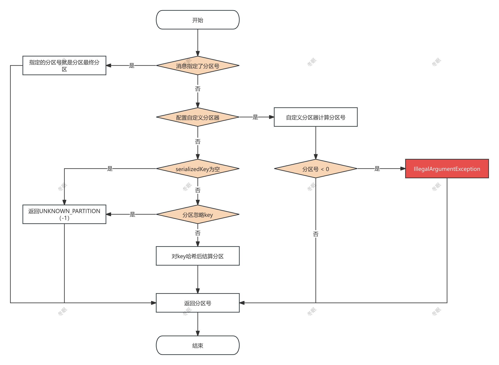

Kafka 生产者在发送消息时，需要确定消息要发送到哪个分区。本文主要介绍 Kafka 的分区计算策略。

## 分区计算流程图



## partition方法

源码如下：

```java
/**
 * 计算给定消息记录应该发送到哪个分区
 * 
 * 分区选择的优先级顺序：
 * 1. 如果记录中指定了分区号，直接返回该分区
 * 2. 如果配置了自定义分区器，使用自定义分区器计算分区
 * 3. 如果消息有key且未配置忽略key，使用内置分区器根据key计算分区
 * 4. 以上都不满足，返回UNKNOWN_PARTITION，表示可以使用任意分区
 *
 * @param record 待发送的消息记录，包含topic、key、value等信息
 * @param serializedKey 序列化后的消息key
 * @param serializedValue 序列化后的消息value
 * @param cluster 集群元数据信息，包含topic的分区信息
 * @return 计算得到的目标分区号
 */
private int partition(ProducerRecord<K, V> record, byte[] serializedKey, byte[] serializedValue, Cluster cluster) {
    // 1. 检查消息是否指定了分区号，如果指定了则直接返回
    if (record.partition() != null)
        return record.partition();

    // 2. 检查是否配置了自定义分区器
    if (partitionerPlugin.get() != null) {
        // 使用自定义分区器计算分区号
        int customPartition = partitionerPlugin.get().partition(
            record.topic(), record.key(), serializedKey, record.value(), serializedValue, cluster);
        // 验证自定义分区器返回的分区号是否有效（必须非负）
        if (customPartition < 0) {
            throw new IllegalArgumentException(String.format(
                "The partitioner generated an invalid partition number: %d. Partition number should always be non-negative.", customPartition));
        }
        return customPartition;
    }

    // 3. 如果消息有key且配置为不忽略key，使用内置分区器
    if (serializedKey != null && !partitionerIgnoreKeys) {
        // 使用内置分区器，通过对key进行哈希来选择分区
        return BuiltInPartitioner.partitionForKey(serializedKey, cluster.partitionsForTopic(record.topic()).size());
    } else {
        // 4. 没有key或配置忽略key，返回UNKNOWN_PARTITION，表示可以使用任意分区
        return RecordMetadata.UNKNOWN_PARTITION;
    }
}
```

## 根据key计算分区

使用内置分区器，通过对key进行哈希来选择分区时，调用的是 `BuiltInPartitioner.partitionForKey` 方法。


```java
/**
 * 默认的键值分区哈希函数
 * 使用MurmurHash2算法计算消息键的哈希值，并映射到指定范围的分区号
 *
 * @param serializedKey 序列化后的消息键字节数组
 * @param numPartitions 主题的分区数量
 * @return 介于[0, numPartitions-1]之间的分区号
 */
public static int partitionForKey(final byte[] serializedKey, final int numPartitions) {
    return Utils.toPositive(Utils.murmur2(serializedKey)) % numPartitions;
}
```

murmur2 方法主要是根据 serializedKey 结算出 Hash 值。

toPositive 主要是将 hash 值转换成正数。

最终根据 Hash 值和分区数量取余，得到分区号。

## UNKNOWN_PARTITION

此时只是计算出了 ProducerRecord 的分区号，还需要将 ProducerRecord 追加到消息累加器 RecordAccumulator。

```java
RecordAccumulator.RecordAppendResult result = accumulator.append(record.topic(), partition, timestamp, serializedKey,
                    serializedValue, headers, appendCallbacks, remainingWaitMs, nowMs, cluster);
```                    

在 `accumulator.append` 方法中，会针对分区号为 UNKNOWN_PARTITION 的消息进行二次分区计算。

```java
final BuiltInPartitioner.StickyPartitionInfo partitionInfo;
final int effectivePartition;
if (partition == RecordMetadata.UNKNOWN_PARTITION) {
    // 使用内置分区器选择分区
    partitionInfo = topicInfo.builtInPartitioner.peekCurrentPartitionInfo(cluster);
    effectivePartition = partitionInfo.partition();
} else {
    partitionInfo = null;
    effectivePartition = partition;  // 使用指定的分区
}
```
effectivePartition 就是最终的分区号。

`peekCurrentPartitionInfo` 方法用于获取当前选择的粘性分区信息。

```java
/**
 * 获取当前选择的粘性分区信息。该方法与{@link #isPartitionChanged}和{@link #updatePartitionInfo}配合使用。
 * 
 * @param cluster 集群信息（当没有当前分区时需要用于选择新分区）
 * @return 粘性分区信息对象
 */
StickyPartitionInfo peekCurrentPartitionInfo(Cluster cluster) {
    // 尝试获取当前的粘性分区信息
    StickyPartitionInfo partitionInfo = stickyPartitionInfo.get();
    if (partitionInfo != null)
        return partitionInfo;

    // 作为第一个创建粘性分区信息的线程
    // nextPartition 根据分区负载统计信息计算下一个要使用的分区
    partitionInfo = new StickyPartitionInfo(nextPartition(cluster));
    // 使用CAS操作安全地设置粘性分区信息
    if (stickyPartitionInfo.compareAndSet(null, partitionInfo))
        return partitionInfo;
    // 发生了竞争(CAS操作失败)，其他线程已经计算出粘性分区的信息，则直接返回其他线程设置的分区信息
    return stickyPartitionInfo.get();
}
```

## nextPartition

nextPartition 方法主要是根据分区负载统计信息计算下一个要使用的分区。

分区选择策略：

1. 如果没有负载统计信息，使用均匀分布随机选择分区
   
2. 如果有负载统计信息，根据分区队列大小的反比作为权重进行加权随机选择

```java
/**
 * 根据分区负载统计信息计算下一个要使用的分区
 * 
 * @param cluster 集群信息，用于获取topic的分区信息
 * @return 选择的分区号
 */
private int nextPartition(Cluster cluster) {
    // 获取一个随机数作为基础值
    int random = randomPartition();

    // 将易变变量缓存到本地变量，提高性能和一致性, partitionLoadStats是分区负载信息
    PartitionLoadStats partitionLoadStats = this.partitionLoadStats;
    int partition;

    if (partitionLoadStats == null) {
        // 没有负载统计信息时，使用均匀分布选择分区 
        // availablePartitionsForTopic 获取主题的所有可用分区信息
        List<PartitionInfo> availablePartitions = cluster.availablePartitionsForTopic(topic);
        if (!availablePartitions.isEmpty()) {
            // 有可用分区时，从可用分区中随机选择
            partition = availablePartitions.get(random % availablePartitions.size()).partition();
        } else {
            // 没有可用分区时，从所有分区中随机选择
            // partitionsForTopic 获取主题的所有分区信息
            List<PartitionInfo> partitions = cluster.partitionsForTopic(topic);
            partition = random % partitions.size();
        }
    } else {
        // 使用负载统计信息进行加权随机选择
        // 注意：没有leader的分区会被排除在统计信息之外
        assert partitionLoadStats.length > 0;

        // 获取累积频率表，用于加权随机选择
        int[] cumulativeFrequencyTable = partitionLoadStats.cumulativeFrequencyTable;
        // 生成一个在累积频率范围内的加权随机数
        int weightedRandom = random % cumulativeFrequencyTable[partitionLoadStats.length - 1];

        // 使用二分查找在累积频率表中找到对应的分区索引
        // 累积频率表是有序的，可以使用二分查找提高效率
        int searchResult = Arrays.binarySearch(cumulativeFrequencyTable, 0, partitionLoadStats.length, weightedRandom);

        // 二分查找返回值说明：
        // 1. 如果找到元素，返回该元素的索引
        // 2. 如果没找到，返回 -(插入点) - 1
        // 插入点是第一个大于目标值的元素的索引
        // 例如，对于累积频率表 [4,5,8]：
        // - 查找3：返回-1(插入点0)，abs(-1+1)=0，选择索引0
        // - 查找4：返回0，abs(0+1)=1，选择索引1
        int partitionIndex = Math.abs(searchResult + 1);
        assert partitionIndex < partitionLoadStats.length;
        // 根据索引获取实际的分区号
        partition = partitionLoadStats.partitionIds[partitionIndex];
    }

    log.trace("Switching to partition {} in topic {}", partition, topic);
    return partition;
}
```

