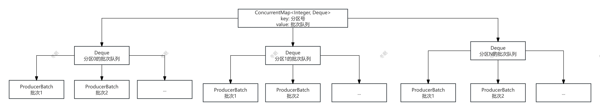
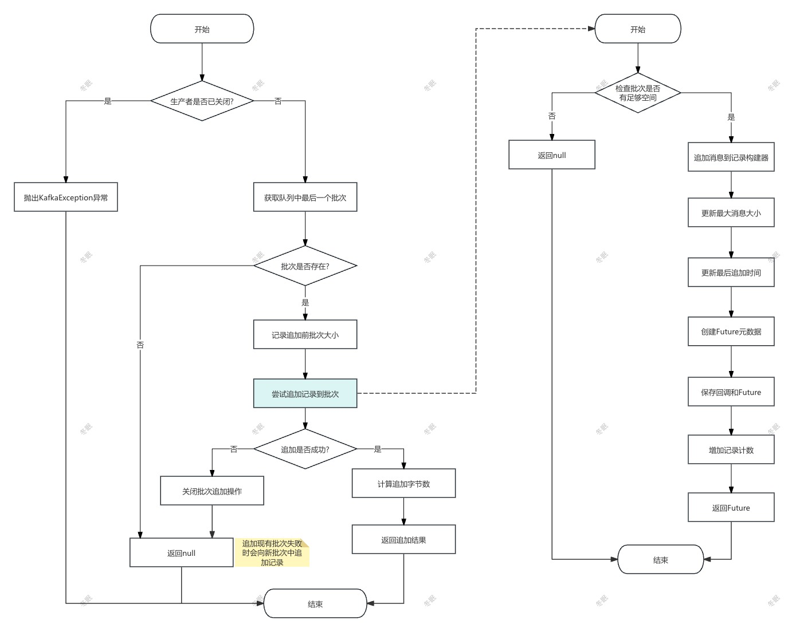

## 消息追加到RecordAccumulator流程图


## RecordAccumulator 的主要结构

消息追加主要用到 RecordAccumulator 中的 topicInfoMap。

```java
 private final ConcurrentMap<String /*topic*/, TopicInfo> topicInfoMap = new CopyOnWriteMap<>();  // 主题信息映射
```
topicInfoMap 的 key 是 topic 名称，value 是 TopicInfo 对象。

TopicInfo 类的主要结构如下：
```java
/**
 * 每个主题的相关信息
 * 包含该主题的分区批次队列和分区器
 */
private static class TopicInfo {
    // 主题的分区批次映射表
    // 键为分区号,值为该分区的批次队列
    public final ConcurrentMap<Integer /*partition*/, Deque<ProducerBatch>> batches = new CopyOnWriteMap<>();
    
    // 该主题使用的内置分区器
    public final BuiltInPartitioner builtInPartitioner;

    /**
     * 创建主题信息对象
     *
     * @param builtInPartitioner 用于该主题的内置分区器
     */
    public TopicInfo(BuiltInPartitioner builtInPartitioner) {
        this.builtInPartitioner = builtInPartitioner;  // 设置分区器
    }
}
```

其中 batches 是一个 Map，key 是分区号，value 是该分区的批次队列 `Deque<ProducerBatch>`。

追加消息时主要是向 Deque 中插入数据。

ProducerBatch 是一个将要被发送或正在发送的消息批次，这个批次包含了多条待发送的消息记录，可以进行压缩和事务处理。

**⚠️ batchSize 是针对单个 ProducerBatch  生效的**

`buffer.memory`是全局的内存限制.

每个`ProducerBatch`的大小不会超过`batch.size`，而所有分区的所有批次总大小不会超过`buffer.memory`。



如果`batch.size`是单个批次的大小，那么为什么队列中会有多个批次？这通常发生在生产者持续发送消息到同一个分区，而之前的批次还没有发送出去的情况下。例如，如果生产者快速发送消息，超过了发送的速度，就会在队列中累积多个批次。

## 获取分区信息

可以参见 [分区计算](http://localhost:8080/kafka/%E5%88%86%E5%8C%BA%E8%AE%A1%E7%AE%97.html) 中的 `UNKNOWN_PARTITION` 章节。

## 验证分区是否发生变化

> 注意：只在使用粘性分区 StickyPartitionInfo 的时候，才会校验分区是否发生变更。
> 
> 只有传入的分区号为 `UNKNOWN_PARTITION` 时，才会使用粘性分区。

校验分区是否发生变更主要是通过 `topicInfo.builtInPartitioner.isPartitionChanged(partitionInfo)` 实现的。

BuiltInPartitioner 是一个内置的分区器，为每个topic维护了自适应粘性分区(KIP-794)所需的各种信息。每个topic对应一个分区器实例。

isPartitionChanged 方法用于检查分区是否发生并发变更。

```java
/**
 * 检查分区是否发生并发变更,或者是否需要完成之前被禁用的分区变更
 *
 * @param topic 主题名称
 * @param topicInfo 主题信息
 * @param partitionInfo 内置分区器的分区信息
 * @param deque 分区队列
 * @param nowMs 当前时间戳(毫秒)
 * @param cluster 集群元数据
 * @return 如果分区发生变更且需要获取新的分区信息并重试则返回true,否则返回false
 */
private boolean partitionChanged(String topic,
                                    TopicInfo topicInfo,
                                    BuiltInPartitioner.StickyPartitionInfo partitionInfo,
                                    Deque<ProducerBatch> deque, long nowMs,
                                    Cluster cluster) {
    // 检查分区是否发生并发变更
    if (topicInfo.builtInPartitioner.isPartitionChanged(partitionInfo)) {
        log.trace("主题 {} 的分区 {} 被并发追加切换,正在重试", partitionInfo.partition(), topic);
        return true;
    }

    // 如果队列中有未完成的批次,可能禁用分区切换
    // 检查所有批次是否都已填满,如果是则可以进行切换
    if (allBatchesFull(deque)) {
        topicInfo.builtInPartitioner.updatePartitionInfo(partitionInfo, 0, cluster, true);
        // 更新分区信息后的再次确认
        if (topicInfo.builtInPartitioner.isPartitionChanged(partitionInfo)) {
            log.trace("完成了主题 {} 分区 {} 之前被禁用的切换,正在重试", topic, partitionInfo.partition());
            return true;
        }
    }
    return false;
}

//builtInPartitioner.isPartitionChanged(partitionInfo)
boolean isPartitionChanged(StickyPartitionInfo partitionInfo) {
    // 如果调用者没有使用内置分区器，partitionInfo可能为null
    return partitionInfo != null && stickyPartitionInfo.get() != partitionInfo;
}
```

## 更新分区信息

`updatePartitionInfo` 方法更新分区信息，包括追加的字节数，**⚠️ 该方法可能触发分区切换**。此方法必须在分区批次队列的锁定状态下调用。

`topicInfo.builtInPartitioner.updatePartitionInfo(partitionInfo, 0, cluster, true)` 传入的appendedBytes未0，主要是为了判断是否需要切换分区。

```java
/**
 * @param partitionInfo 由peekCurrentPartitionInfo返回的粘性分区信息对象
 * @param appendedBytes 追加到此分区的字节数
 * @param cluster 集群信息
 * @param enableSwitch 如果为true，在生产足够字节数时切换分区
 */
void updatePartitionInfo(StickyPartitionInfo partitionInfo, int appendedBytes, Cluster cluster, boolean enableSwitch) {
    // 如果调用者没有使用内置分区器，partitionInfo可能为null
    if (partitionInfo == null)
        return;

    // 确保partitionInfo没有被并发修改
    assert partitionInfo == stickyPartitionInfo.get();
    // 原子地增加新消息的字节数
    int producedBytes = partitionInfo.producedBytes.addAndGet(appendedBytes);

    // 已生产字节数超过了阈值的两倍
    if (producedBytes >= stickyBatchSize * 2) {
        log.trace("已生产{}字节，超过批次大小{}字节的两倍，切换开关设置为{}", producedBytes, stickyBatchSize, enableSwitch);
    }

    // 在以下两种情况下切换分区：
    // 1. 已生产字节数达到阈值且允许切换
    // 2. 已生产字节数达到阈值的两倍（强制切换）
    if (producedBytes >= stickyBatchSize && enableSwitch || producedBytes >= stickyBatchSize * 2) {
        // 已向此分区生产足够数据，切换到下一个分区
        StickyPartitionInfo newPartitionInfo = new StickyPartitionInfo(nextPartition(cluster));
        stickyPartitionInfo.set(newPartitionInfo);
    }
}

```

### 分区切换

切换分区有两种情况：

1. 已生产字节数达到阈值且允许切换

2. 已生产字节数达到阈值的两倍（强制切换）

当producedBytes达到stickyBatchSize*2时强制切换分区，是为了防止在某些特殊情况下（比如混合了带键和不带键的消息）可能导致的分区切换延迟问题。例如，当带键消息在禁用切换的批次准备好后创建了未准备好的批次时，如果不强制切换，可能会导致消息在同一分区累积过多。这个两倍大小的限制确保了即使在复杂场景下，分区切换也能在合理的范围内发生，避免单个分区负载过重。

## 将消息追加到现有批次

追加消息到现有批次调用的是 `tryAppend` 方法。该方法的流程逻辑如下图所示。

该方法尝试将新记录追加到队列中最后一个批次。如果批次已满,则返回null以触发创建新批次。

当批次已满时,会关闭批次的追加操作以释放资源(如压缩缓冲区)。





```java
/**
 * 尝试将记录追加到现有的生产者批次中
 * 
 *
 * @param timestamp 记录的时间戳
 * @param key 记录的键
 * @param value 记录的值
 * @param headers 记录的头部信息
 * @param callback 发送完成后的回调函数
 * @param deque 批次队列
 * @param nowMs 当前时间戳(毫秒)
 * @return 追加结果,如果追加失败则返回null
 */
private RecordAppendResult tryAppend(long timestamp, byte[] key, byte[] value, Header[] headers,
                                     Callback callback, Deque<ProducerBatch> deque, long nowMs) {
    // 如果生产者已关闭,则抛出异常
    if (closed)
        throw new KafkaException("Producer closed while send in progress");

    // 获取队列中的最后一个批次
    ProducerBatch last = deque.peekLast();
    if (last != null) {
        // 记录追加前的批次大小
        int initialBytes = last.estimatedSizeInBytes();
        // 尝试将记录追加到批次中
        FutureRecordMetadata future = last.tryAppend(timestamp, key, value, headers, callback, nowMs);
        if (future == null) {
            // 如果追加失败(批次已满),关闭批次的追加操作以释放资源
            last.closeForRecordAppends();
        } else {
            // 计算本次追加的字节数
            int appendedBytes = last.estimatedSizeInBytes() - initialBytes;
            // 返回追加结果,包含元数据Future、是否需要创建新批次、是否创建了新批次、追加的字节数
            return new RecordAppendResult(future, deque.size() > 1 || last.isFull(), false, appendedBytes);
        }
    }
    // 如果队列为空或追加失败,返回null以触发创建新批次
    return null;
}
```

真正想批次中插入数据的方式是 `ProducerBatch#tryAppend` 方法。

```java
/**
 * 尝试将一条消息记录追加到当前批次中，并返回该记录在批次内的相对偏移量
 *
 * @param timestamp 消息时间戳
 * @param key 消息键
 * @param value 消息值
 * @param headers 消息头部
 * @param callback 发送完成回调
 * @param now 当前时间戳
 * @return 消息的Future元数据，如果批次空间不足则返回null
 */
public FutureRecordMetadata tryAppend(long timestamp, byte[] key, byte[] value, Header[] headers, Callback callback, long now) {
    // 检查批次是否有足够空间容纳新消息
    if (!recordsBuilder.hasRoomFor(timestamp, key, value, headers)) {
        return null;
    } else {
        // 追加消息到记录构建器
        this.recordsBuilder.append(timestamp, key, value, headers);
        // 更新批次中最大消息大小： 最大记录大小和新消息的大小 estimateSizeInBytesUpperBound得出的是一个预估值
        this.maxRecordSize = Math.max(this.maxRecordSize, AbstractRecords.estimateSizeInBytesUpperBound(magic(),
                recordsBuilder.compression().type(), key, value, headers));
        // 更新最后追加时间
        this.lastAppendTime = now;
        // 创建消息的Future元数据
        FutureRecordMetadata future = new FutureRecordMetadata(this.produceFuture, this.recordCount,
                                                                timestamp,
                                                                key == null ? -1 : key.length,
                                                                value == null ? -1 : value.length,
                                                                Time.SYSTEM);
        // 保存回调和Future，以便在批次需要分割时能够正确处理
        thunks.add(new Thunk(callback, future));
        // 增加记录计数
        this.recordCount++;
        return future;
    }
}
```

tryAppend最终调用 `MemoryRecordsBuilder#appendWithOffset` 插入数据。

```java
/**
 * 在指定偏移量处追加一条新记录。
 * 该方法处理记录的追加操作，包括各种验证检查和格式版本的兼容性处理。
 * 
 * @param offset 记录的绝对偏移量
 * @param isControlRecord 是否为控制记录
 * @param timestamp 记录的时间戳
 * @param key 记录的键
 * @param value 记录的值
 * @param headers 记录的头部信息数组
 */
private void appendWithOffset(long offset, boolean isControlRecord, long timestamp, ByteBuffer key,
                                ByteBuffer value, Header[] headers) {
    try {
        // 验证控制记录只能追加到控制批次中
        if (isControlRecord != isControlBatch)
            throw new IllegalArgumentException("Control records can only be appended to control batches");

        // 确保偏移量单调递增
        if (lastOffset != null && offset <= lastOffset)
            throw new IllegalArgumentException(String.format("Illegal offset %d following previous offset %d " +
                    "(Offsets must increase monotonically).", offset, lastOffset));

        // 验证时间戳的有效性
        if (timestamp < 0 && timestamp != RecordBatch.NO_TIMESTAMP)
            throw new IllegalArgumentException("Invalid negative timestamp " + timestamp);

        // 检查消息格式版本是否支持记录头部
        if (magic < RecordBatch.MAGIC_VALUE_V2 && headers != null && headers.length > 0)
            throw new IllegalArgumentException("Magic v" + magic + " does not support record headers");

        // 如果基准时间戳未设置，则使用当前记录的时间戳
        if (baseTimestamp == null)
            baseTimestamp = timestamp;

        // 根据消息格式版本选择不同的追加方式
        if (magic > RecordBatch.MAGIC_VALUE_V1) {
            // 新版本格式：追加默认记录
            appendDefaultRecord(offset, timestamp, key, value, headers);
        } else {
            // 旧版本格式：追加传统记录
            appendLegacyRecord(offset, timestamp, key, value, magic);
        }
    } catch (IOException e) {
        // 处理I/O异常
        throw new KafkaException("I/O exception when writing to the append stream, closing", e);
    }
}
```


