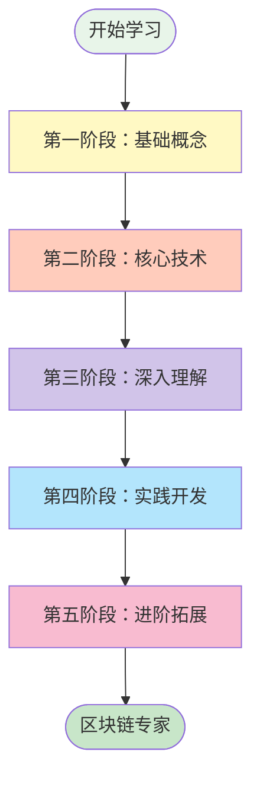
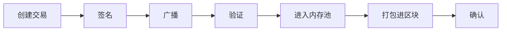

# 比特币知识学习路线图

## 学习目标

通过系统学习比特币技术，你将掌握：
- 理解比特币的工作原理和设计理念
- 掌握区块链的核心技术和密码学基础
- 了解去中心化系统的设计思想
- 具备开发区块链应用的基础能力
- 理解数字货币的经济模型和激励机制

## 学习路线总览



## 第一阶段：基础概念（1-2周）

### 1.1 了解比特币的诞生

**学习内容：**
- 比特币白皮书阅读
- 中本聪的设计理念
- 比特币要解决的问题
- 去中心化的意义

**推荐资源：**
- 📄 [Bitcoin Whitepaper](https://bitcoin.org/bitcoin.pdf) - 必读
- 📚 《精通比特币》第1-2章
- 🎥 [比特币原理动画](https://www.youtube.com/watch?v=Lx9zgZCMqXE)

**学习目标：**
- [ ] 理解什么是双花问题
- [ ] 理解去中心化的含义
- [ ] 了解比特币的基本特性
- [ ] 能够简单解释比特币是什么

### 1.2 区块链基础

**学习内容：**
- 什么是区块链
- 区块的结构
- 链式存储原理
- 分布式账本概念

**实践练习：**
```python
# 简单的区块结构
class SimpleBlock:
    def __init__(self, index, data, previous_hash):
        self.index = index
        self.timestamp = time.time()
        self.data = data
        self.previous_hash = previous_hash
        self.hash = self.calculate_hash()
    
    def calculate_hash(self):
        # 计算区块哈希
        pass
```

### 1.3 比特币生态系统

**学习内容：**
- 矿工、用户、开发者的角色
- 比特币网络结构
- 钱包的概念
- 交易所的作用

## 第二阶段：核心技术（2-3周）

### 2.1 密码学基础

**学习内容：**
- 哈希函数（SHA-256）
- 非对称加密（椭圆曲线）
- 数字签名
- Merkle树

**重点文档：**
- [比特币系统用到的密码学原理](./01.比特币系统用到的密码学原理)

**实践项目：**
```python
# 实现简单的数字签名
from ecdsa import SigningKey, SECP256k1

# 生成密钥对
private_key = SigningKey.generate(curve=SECP256k1)
public_key = private_key.get_verifying_key()

# 签名和验证
message = b"Hello Bitcoin"
signature = private_key.sign(message)
is_valid = public_key.verify(signature, message)
```

### 2.2 数据结构

**学习内容：**
- 区块结构详解
- 交易结构
- UTXO模型
- 内存池机制

**重点文档：**
- [比特币系统用到的数据结构](./02.比特币系统用到的数据结构)

### 2.3 共识机制

**学习内容：**
- 工作量证明（PoW）
- 难度调整算法
- 最长链原则
- 分叉处理

**实验任务：**
- 实现简化版PoW算法
- 模拟挖矿过程
- 计算不同难度下的挖矿时间

## 第三阶段：深入理解（3-4周）

### 3.1 交易机制

**学习内容：**
- 交易的生命周期
- 交易脚本语言
- P2PKH、P2SH等交易类型
- 多重签名交易

**详细主题：**


### 3.2 网络协议

**学习内容：**
- P2P网络架构
- 节点发现机制
- 消息传播协议
- SPV轻节点

**网络消息类型：**
| 消息类型 | 功能 | 使用场景 |
|---------|------|----------|
| version | 版本协商 | 建立连接 |
| tx | 交易传播 | 广播交易 |
| block | 区块传播 | 同步区块 |
| inv | 库存通知 | 数据发现 |
| getdata | 请求数据 | 获取详情 |

### 3.3 经济模型

**学习内容：**
- 比特币发行机制
- 区块奖励减半
- 交易费用机制
- 激励相容设计

**关键数据：**
- 总量：2100万枚
- 初始奖励：50 BTC
- 减半周期：210,000区块
- 当前奖励：6.25 BTC（2024年）

## 第四阶段：实践开发（4-6周）

### 4.1 搭建开发环境

**工具准备：**
```bash
# 安装Bitcoin Core
wget https://bitcoin.org/bin/bitcoin-core-24.0/bitcoin-24.0-x86_64-linux-gnu.tar.gz
tar -xzf bitcoin-24.0-x86_64-linux-gnu.tar.gz

# 启动测试网络节点
bitcoind -testnet -daemon

# 安装开发库
pip install python-bitcoinlib
npm install bitcoinjs-lib
```

### 4.2 钱包开发

**实现功能：**
- 生成HD钱包
- 地址管理
- 交易构建
- 余额查询

**示例代码：**
```python
from bitcoin import *

# 生成助记词
mnemonic = generate_mnemonic()

# 从助记词生成种子
seed = mnemonic_to_seed(mnemonic)

# 生成主私钥
master_key = bip32_master_key(seed)

# 派生地址
for i in range(5):
    # m/44'/0'/0'/0/i 路径
    child_key = bip32_ckd(master_key, 44 + 2**31)
    child_key = bip32_ckd(child_key, 0 + 2**31)
    child_key = bip32_ckd(child_key, 0 + 2**31)
    child_key = bip32_ckd(child_key, 0)
    child_key = bip32_ckd(child_key, i)
    
    # 获取地址
    address = pubtoaddr(bip32_extract_key(child_key))
    print(f"Address {i}: {address}")
```

### 4.3 区块链浏览器

**开发内容：**
- 区块信息展示
- 交易查询
- 地址余额统计
- 网络统计数据

**技术栈：**
- 后端：Node.js + Bitcoin Core RPC
- 前端：React/Vue + Web3
- 数据库：PostgreSQL/MongoDB

### 4.4 简单的DApp

**项目示例：**
1. **时间戳服务**：利用OP_RETURN存储数据哈希
2. **支付网关**：接收比特币支付
3. **多签钱包**：实现2-of-3多签管理

## 第五阶段：进阶拓展（持续学习）

### 5.1 比特币改进提案（BIPs）

**重要BIPs：**
- BIP32：HD钱包
- BIP39：助记词
- BIP141：隔离见证
- BIP340-342：Taproot

### 5.2 扩展技术

**学习方向：**
- **闪电网络**：Layer 2支付通道
- **侧链技术**：Liquid、RSK
- **跨链协议**：原子交换
- **隐私技术**：CoinJoin、Taproot

### 5.3 其他区块链

**对比学习：**
| 项目 | 共识机制 | 特点 | 学习重点 |
|------|---------|------|----------|
| Ethereum | PoS | 智能合约 | EVM、Solidity |
| Monero | PoW | 隐私保护 | 环签名、隐形地址 |
| Solana | PoH | 高性能 | 并行处理 |
| Polkadot | NPoS | 跨链 | 中继链、平行链 |

## 学习资源推荐

### 📚 必读书籍

1. **《精通比特币》**（Mastering Bitcoin）- Andreas Antonopoulos
   - 技术深度：⭐⭐⭐⭐⭐
   - 适合阶段：2-4

2. **《比特币标准》**（The Bitcoin Standard）- Saifedean Ammous
   - 经济理论：⭐⭐⭐⭐⭐
   - 适合阶段：1-3

3. **《编程比特币》**（Programming Bitcoin）- Jimmy Song
   - 代码实践：⭐⭐⭐⭐⭐
   - 适合阶段：3-5

### 🌐 在线资源

**官方资源：**
- [Bitcoin.org](https://bitcoin.org) - 官方网站
- [Bitcoin Wiki](https://en.bitcoin.it/wiki) - 技术文档
- [Bitcoin Core](https://github.com/bitcoin/bitcoin) - 源代码

**学习平台：**
- [Bitcoin Developer](https://developer.bitcoin.org) - 开发者指南
- [Learn Me a Bitcoin](https://learnmeabitcoin.com) - 可视化教程
- [Bitcoin Optech](https://bitcoinops.org) - 技术周报

**社区论坛：**
- [BitcoinTalk](https://bitcointalk.org) - 最大论坛
- [Reddit r/Bitcoin](https://reddit.com/r/bitcoin) - Reddit社区
- [Bitcoin StackExchange](https://bitcoin.stackexchange.com) - 问答平台

### 🛠 开发工具

**测试网络：**
- Testnet：公共测试网
- Regtest：本地回归测试
- Signet：签名测试网

**开发库：**
```json
{
  "python": ["python-bitcoinlib", "bit", "pycoin"],
  "javascript": ["bitcoinjs-lib", "bitcore-lib", "bcoin"],
  "java": ["bitcoinj"],
  "go": ["btcd", "btcsuite"],
  "rust": ["rust-bitcoin", "bitcoin-core"]
}
```

**调试工具：**
- Bitcoin Core GUI：图形界面
- bitcoin-cli：命令行工具
- Blockstream Explorer：区块浏览器
- btcdeb：脚本调试器

## 学习建议

### ✅ 最佳实践

1. **循序渐进**：从概念到技术，从理论到实践
2. **动手实验**：编写代码加深理解
3. **参与社区**：提问、讨论、贡献
4. **持续更新**：关注最新发展和技术进展

### ⚠️ 常见误区

1. **不要跳过基础**：密码学和数据结构是根基
2. **不要只看价格**：技术本质更重要
3. **不要忽视安全**：私钥管理至关重要
4. **不要闭门造车**：多交流多实践

### 🎯 学习检验

**初级（1-2阶段）：**
- [ ] 能解释比特币的工作原理
- [ ] 理解区块链的数据结构
- [ ] 会使用比特币钱包

**中级（3-4阶段）：**
- [ ] 能分析交易脚本
- [ ] 会搭建比特币节点
- [ ] 能开发简单应用

**高级（5阶段）：**
- [ ] 深入理解协议细节
- [ ] 能参与技术讨论
- [ ] 可以贡献代码

## 职业发展方向

### 技术路线
- **区块链开发工程师**：DApp开发、智能合约
- **区块链架构师**：系统设计、技术选型
- **安全工程师**：智能合约审计、密码学应用

### 产品路线
- **产品经理**：区块链产品设计
- **解决方案架构师**：企业区块链方案
- **技术顾问**：咨询服务

### 研究路线
- **研究员**：协议研究、经济模型
- **密码学专家**：零知识证明、MPC
- **分布式系统专家**：共识算法、网络协议

## 总结

比特币不仅是一种数字货币，更是一场技术革命。通过系统学习比特币，你将：

1. **掌握前沿技术**：区块链、密码学、分布式系统
2. **理解创新思维**：去中心化、信任机制、激励设计
3. **获得职业机会**：区块链行业正在快速发展
4. **参与技术变革**：成为Web3时代的建设者

记住：学习比特币是一个持续的过程，技术在不断演进，保持学习的热情和好奇心最为重要！

---

*"If you don't believe it or don't get it, I don't have the time to try to convince you, sorry."* - Satoshi Nakamoto

祝你在比特币学习之旅中收获满满！🚀
