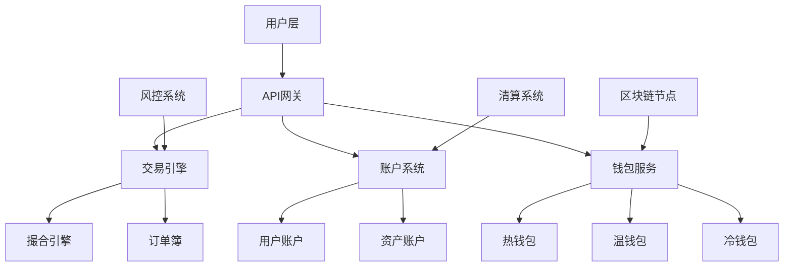

# 比特币交易所架构设计

## 1. 交易所架构概览



## 2. 核心模块设计

### 2.1 账户系统

```java
public class AccountSystem {
    
    /**
     * 用户账户
     */
    public static class UserAccount {
        private String userId;
        private Map<String, Balance> balances; // 币种 -> 余额
        private KYCLevel kycLevel;
        
        public static class Balance {
            private double available;  // 可用余额
            private double frozen;     // 冻结余额
            private double total;      // 总余额 = available + frozen
            
            public synchronized boolean freeze(double amount) {
                if (available >= amount) {
                    available -= amount;
                    frozen += amount;
                    return true;
                }
                return false;
            }
            
            public synchronized void unfreeze(double amount) {
                frozen -= amount;
                available += amount;
            }
        }
    }
    
    /**
     * 资产流水记录
     */
    public static class AssetLog {
        private String logId;
        private String userId;
        private String asset;
        private double amount;
        private LogType type;
        private long timestamp;
        
        public enum LogType {
            DEPOSIT,      // 充值
            WITHDRAWAL,   // 提现
            TRADE_BUY,    // 买入
            TRADE_SELL,   // 卖出
            FEE,          // 手续费
            TRANSFER      // 转账
        }
    }
}
```

### 2.2 撮合引擎

```java
public class MatchingEngine {
    
    private TreeMap<Double, List<Order>> buyOrders;  // 买单(价格降序)
    private TreeMap<Double, List<Order>> sellOrders; // 卖单(价格升序)
    
    /**
     * 提交订单
     */
    public synchronized List<Trade> submitOrder(Order order) {
        List<Trade> trades = new ArrayList<>();
        
        if (order.side == OrderSide.BUY) {
            // 匹配卖单
            while (order.remainingQty > 0 && !sellOrders.isEmpty()) {
                double bestSellPrice = sellOrders.firstKey();
                
                if (order.price >= bestSellPrice) {
                    Trade trade = matchOrders(order, sellOrders.get(bestSellPrice));
                    if (trade != null) {
                        trades.add(trade);
                    }
                } else {
                    break;
                }
            }
            
            // 未完全成交,加入订单簿
            if (order.remainingQty > 0) {
                addToBuyBook(order);
            }
        } else {
            // 匹配买单
            while (order.remainingQty > 0 && !buyOrders.isEmpty()) {
                double bestBuyPrice = buyOrders.lastKey();
                
                if (order.price <= bestBuyPrice) {
                    Trade trade = matchOrders(order, buyOrders.get(bestBuyPrice));
                    if (trade != null) {
                        trades.add(trade);
                    }
                } else {
                    break;
                }
            }
            
            if (order.remainingQty > 0) {
                addToSellBook(order);
            }
        }
        
        return trades;
    }
    
    private Trade matchOrders(Order taker, List<Order> makers) {
        Order maker = makers.get(0);
        
        double tradeQty = Math.min(taker.remainingQty, maker.remainingQty);
        double tradePrice = maker.price; // 使用挂单价格
        
        Trade trade = new Trade();
        trade.price = tradePrice;
        trade.quantity = tradeQty;
        trade.buyOrderId = taker.side == OrderSide.BUY ? 
            taker.orderId : maker.orderId;
        trade.sellOrderId = taker.side == OrderSide.SELL ? 
            taker.orderId : maker.orderId;
        trade.timestamp = System.currentTimeMillis();
        
        taker.remainingQty -= tradeQty;
        maker.remainingQty -= tradeQty;
        
        if (maker.remainingQty == 0) {
            makers.remove(0);
        }
        
        System.out.printf("成交: 价格%.2f 数量%.4f%n", tradePrice, tradeQty);
        
        return trade;
    }
    
    private void addToBuyBook(Order order) {
        buyOrders.computeIfAbsent(order.price, k -> new ArrayList<>()).add(order);
    }
    
    private void addToSellBook(Order order) {
        sellOrders.computeIfAbsent(order.price, k -> new ArrayList<>()).add(order);
    }
    
    public static class Order {
        String orderId;
        String userId;
        OrderSide side;
        double price;
        double quantity;
        double remainingQty;
    }
    
    public enum OrderSide { BUY, SELL }
    
    public static class Trade {
        String buyOrderId;
        String sellOrderId;
        double price;
        double quantity;
        long timestamp;
    }
}
```

### 2.3 钱包架构

```java
public class WalletArchitecture {
    
    /**
     * 三层钱包架构
     */
    public interface WalletTier {
        String getName();
        double getBalanceLimit();
        SecurityLevel getSecurityLevel();
    }
    
    /**
     * 热钱包 - 在线自动处理
     */
    public static class HotWallet implements WalletTier {
        private String address;
        private double balance;
        private static final double LIMIT = 100; // 100 BTC上限
        
        public String getName() { return "热钱包"; }
        public double getBalanceLimit() { return LIMIT; }
        public SecurityLevel getSecurityLevel() { return SecurityLevel.LOW; }
        
        /**
         * 自动处理提现
         */
        public synchronized Transaction processWithdrawal(
                String recipient, double amount) {
            
            if (balance < amount) {
                throw new RuntimeException("热钱包余额不足");
            }
            
            Transaction tx = new Transaction();
            tx.to = recipient;
            tx.amount = amount;
            tx.from = address;
            
            // 自动签名并广播
            signAndBroadcast(tx);
            
            balance -= amount;
            
            // 检查是否需要补充
            if (balance < LIMIT * 0.3) {
                requestRefillFromWarm();
            }
            
            return tx;
        }
        
        private void signAndBroadcast(Transaction tx) {
            System.out.println("热钱包自动处理提现: " + tx.amount + " BTC");
        }
        
        private void requestRefillFromWarm() {
            System.out.println("热钱包余额低,请求从温钱包补充");
        }
    }
    
    /**
     * 温钱包 - 半自动,定期补充热钱包
     */
    public static class WarmWallet implements WalletTier {
        private String address;
        private double balance;
        private static final double LIMIT = 1000; // 1000 BTC上限
        
        public String getName() { return "温钱包"; }
        public double getBalanceLimit() { return LIMIT; }
        public SecurityLevel getSecurityLevel() { return SecurityLevel.MEDIUM; }
        
        /**
         * 补充热钱包(需要人工审批)
         */
        public Transaction refillHotWallet(
                String hotWalletAddress, 
                double amount,
                String approver) {
            
            System.out.println("温钱包补充热钱包:");
            System.out.println("  数量: " + amount + " BTC");
            System.out.println("  审批人: " + approver);
            
            Transaction tx = new Transaction();
            tx.to = hotWalletAddress;
            tx.amount = amount;
            tx.from = address;
            tx.requiresApproval = true;
            
            balance -= amount;
            
            return tx;
        }
    }
    
    /**
     * 冷钱包 - 离线多签
     */
    public static class ColdWallet implements WalletTier {
        private String multiSigAddress; // 3-of-5多签
        private double balance;
        
        public String getName() { return "冷钱包"; }
        public double getBalanceLimit() { return Double.MAX_VALUE; }
        public SecurityLevel getSecurityLevel() { return SecurityLevel.HIGH; }
        
        /**
         * 补充温钱包(需要多签+物理隔离)
         */
        public Transaction refillWarmWallet(
                String warmWalletAddress,
                double amount,
                List<String> signers) {
            
            if (signers.size() < 3) {
                throw new RuntimeException("至少需要3个签名");
            }
            
            System.out.println("冷钱包转账(多签):");
            System.out.println("  数量: " + amount + " BTC");
            System.out.println("  签名者: " + String.join(", ", signers));
            
            Transaction tx = new Transaction();
            tx.to = warmWalletAddress;
            tx.amount = amount;
            tx.from = multiSigAddress;
            tx.requiresMultiSig = true;
            tx.signers = signers;
            
            balance -= amount;
            
            return tx;
        }
    }
    
    public enum SecurityLevel {
        LOW, MEDIUM, HIGH
    }
    
    public static class Transaction {
        String from;
        String to;
        double amount;
        boolean requiresApproval;
        boolean requiresMultiSig;
        List<String> signers;
    }
}
```

## 3. 充值提现流程

### 3.1 充值监控

```java
public class DepositMonitor {
    
    private Map<String, String> addressToUser = new HashMap<>();
    
    /**
     * 为用户分配充值地址
     */
    public String assignDepositAddress(String userId) {
        String address = generateAddress();
        addressToUser.put(address, userId);
        
        System.out.println("为用户 " + userId + " 分配地址: " + address);
        return address;
    }
    
    /**
     * 监控区块链交易
     */
    public void monitorBlockchain() {
        // 订阅新区块
        while (true) {
            Block newBlock = waitForNewBlock();
            
            for (Transaction tx : newBlock.transactions) {
                for (TxOutput output : tx.outputs) {
                    String address = output.address;
                    
                    if (addressToUser.containsKey(address)) {
                        String userId = addressToUser.get(address);
                        double amount = output.amount / 100_000_000.0;
                        
                        // 等待确认
                        if (tx.confirmations >= 6) {
                            processDeposit(userId, amount, tx.txid);
                        }
                    }
                }
            }
        }
    }
    
    private void processDeposit(String userId, double amount, String txid) {
        System.out.println("检测到充值:");
        System.out.println("  用户: " + userId);
        System.out.println("  数量: " + amount + " BTC");
        System.out.println("  交易: " + txid);
        
        // 更新用户余额
        creditUserAccount(userId, amount);
        
        // 转移到热钱包
        if (amount > 1.0) {
            transferToHotWallet(amount);
        }
    }
    
    private String generateAddress() {
        return "bc1q" + java.util.UUID.randomUUID().toString().substring(0, 38);
    }
    
    private Block waitForNewBlock() {
        return new Block(); // 简化
    }
    
    private void creditUserAccount(String userId, double amount) {}
    private void transferToHotWallet(double amount) {}
    
    static class Block {
        List<Transaction> transactions = new ArrayList<>();
    }
    
    static class Transaction {
        String txid;
        int confirmations;
        List<TxOutput> outputs = new ArrayList<>();
    }
    
    static class TxOutput {
        String address;
        long amount;
    }
}
```

### 3.2 提现处理

```java
public class WithdrawalProcessor {
    
    /**
     * 提现审核
     */
    public WithdrawalStatus processWithdrawal(WithdrawalRequest request) {
        System.out.println("处理提现请求:");
        System.out.println("  用户: " + request.userId);
        System.out.println("  数量: " + request.amount + " BTC");
        System.out.println("  地址: " + request.toAddress);
        
        // 1. 风控检查
        RiskCheckResult risk = performRiskCheck(request);
        if (!risk.passed) {
            return WithdrawalStatus.REJECTED;
        }
        
        // 2. 冻结用户余额
        boolean frozen = freezeUserBalance(request.userId, request.amount);
        if (!frozen) {
            return WithdrawalStatus.INSUFFICIENT_BALANCE;
        }
        
        // 3. 根据金额选择钱包
        if (request.amount < 1.0) {
            // 小额: 热钱包自动处理
            processFromHotWallet(request);
            return WithdrawalStatus.PROCESSING;
        } else if (request.amount < 10.0) {
            // 中额: 温钱包,需要审批
            return WithdrawalStatus.PENDING_APPROVAL;
        } else {
            // 大额: 冷钱包,需要多签
            return WithdrawalStatus.PENDING_MULTISIG;
        }
    }
    
    private RiskCheckResult performRiskCheck(WithdrawalRequest req) {
        RiskCheckResult result = new RiskCheckResult();
        
        // 检查地址风险
        if (isHighRiskAddress(req.toAddress)) {
            result.passed = false;
            result.reason = "目标地址风险较高";
            return result;
        }
        
        // 检查异常行为
        if (hasAbnormalBehavior(req.userId)) {
            result.passed = false;
            result.reason = "检测到异常行为";
            return result;
        }
        
        result.passed = true;
        return result;
    }
    
    private void processFromHotWallet(WithdrawalRequest req) {
        System.out.println("从热钱包自动处理提现");
    }
    
    private boolean isHighRiskAddress(String address) { return false; }
    private boolean hasAbnormalBehavior(String userId) { return false; }
    private boolean freezeUserBalance(String userId, double amount) { return true; }
    
    public static class WithdrawalRequest {
        String requestId;
        String userId;
        String toAddress;
        double amount;
    }
    
    public enum WithdrawalStatus {
        PROCESSING, PENDING_APPROVAL, PENDING_MULTISIG, 
        COMPLETED, REJECTED, INSUFFICIENT_BALANCE
    }
    
    static class RiskCheckResult {
        boolean passed;
        String reason;
    }
}
```

## 4. 性能优化

### 4.1 订单簿优化

- **内存数据结构**: 使用TreeMap存储订单簿
- **缓存层**: Redis缓存最新价格和深度
- **异步处理**: 撮合引擎使用事件驱动
- **分片**: 不同交易对使用独立撮合引擎

### 4.2 数据库设计

```sql
-- 用户账户表
CREATE TABLE user_accounts (
    user_id VARCHAR(64) PRIMARY KEY,
    created_at TIMESTAMP,
    kyc_level INT
);

-- 资产余额表
CREATE TABLE balances (
    user_id VARCHAR(64),
    asset VARCHAR(16),
    available DECIMAL(20,8),
    frozen DECIMAL(20,8),
    PRIMARY KEY (user_id, asset),
    INDEX idx_user (user_id)
);

-- 订单表
CREATE TABLE orders (
    order_id VARCHAR(64) PRIMARY KEY,
    user_id VARCHAR(64),
    pair VARCHAR(16),
    side ENUM('BUY', 'SELL'),
    price DECIMAL(20,8),
    quantity DECIMAL(20,8),
    filled_qty DECIMAL(20,8),
    status ENUM('PENDING', 'PARTIAL', 'FILLED', 'CANCELLED'),
    created_at TIMESTAMP,
    INDEX idx_user_time (user_id, created_at)
);

-- 成交记录表
CREATE TABLE trades (
    trade_id VARCHAR(64) PRIMARY KEY,
    buy_order_id VARCHAR(64),
    sell_order_id VARCHAR(64),
    price DECIMAL(20,8),
    quantity DECIMAL(20,8),
    fee DECIMAL(20,8),
    timestamp TIMESTAMP,
    INDEX idx_time (timestamp)
);
```

## 5. 安全措施

### 5.1 安全清单

```
✅ 冷热钱包分离
✅ 多重签名
✅ 提现白名单
✅ IP白名单
✅ 2FA双重认证
✅ 提现延迟机制
✅ 异常监控告警
✅ 定期安全审计
✅ 数据库加密
✅ API限流
```

### 5.2 灾备方案

- 🔄 **数据库主从复制**: 实时同步
- 💾 **定期备份**: 每日全量+增量
- 🌐 **多地域部署**: 容灾切换
- 📊 **监控告警**: 7x24小时监控

## 6. 相关文档

- [26.比特币支付集成实战](./26.比特币支付集成实战)
- [27.比特币多签钱包开发](./27.比特币多签钱包开发)
- [34.比特币监管合规实践](./34.比特币监管合规实践)

## 7. 参考资料

- [交易所架构最佳实践](https://github.com/topics/cryptocurrency-exchange)
- [Binance架构解析](https://www.binance.com/en/blog)
