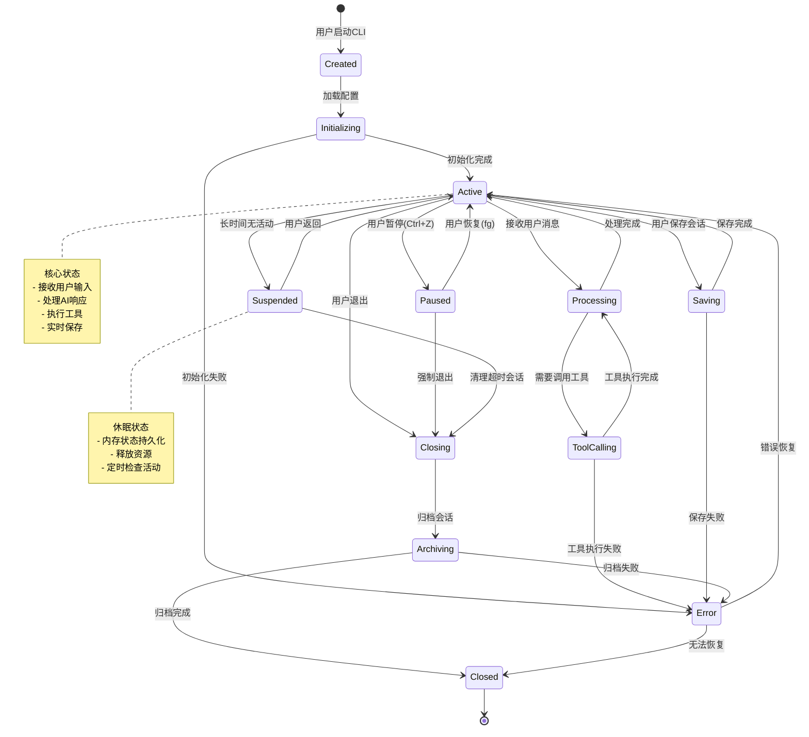
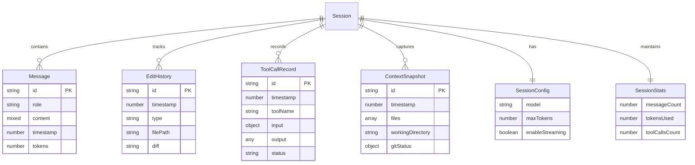
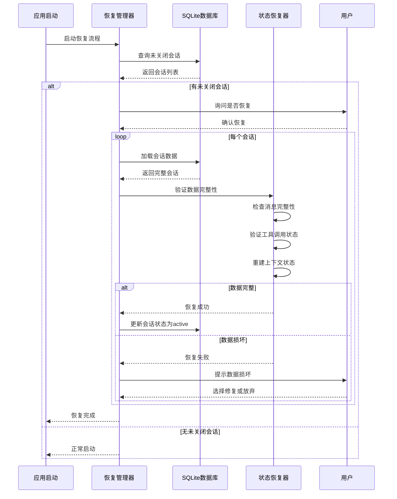

# 第4篇：会话与状态管理

## 引言

会话管理是 Claude Code 的"记忆系统"，负责保存对话历史、上下文状态、用户偏好等关键信息。良好的会话管理能够实现对话的连续性、崩溃后的恢复、以及跨设备的同步。本文将深入探讨 Claude Code 的会话与状态管理实现。

### 为什么需要会话管理？

1. **对话连续性**：保持多轮对话的上下文和状态
2. **崩溃恢复**：意外中断后能够恢复工作状态
3. **历史回溯**：查看和恢复历史对话
4. **性能优化**：通过缓存避免重复计算
5. **用户体验**：无缝的跨会话体验

### 状态管理的挑战

- ⚠️ 数据一致性问题（并发写入）
- ⚠️ 存储空间管理（历史积累）
- ⚠️ 隐私和安全（敏感信息）
- ⚠️ 性能优化（大量数据读写）
- ⚠️ 跨平台兼容性

---

## 一、会话生命周期

### 1.1 完整状态机



### 1.2 状态转换规则

```typescript
/**
 * 会话状态枚举
 */
enum SessionStatus {
  CREATED = 'created',           // 已创建
  INITIALIZING = 'initializing', // 初始化中
  ACTIVE = 'active',             // 活跃
  PROCESSING = 'processing',     // 处理中
  TOOL_CALLING = 'tool_calling', // 工具调用中
  PAUSED = 'paused',             // 暂停
  SUSPENDED = 'suspended',       // 休眠
  SAVING = 'saving',             // 保存中
  CLOSING = 'closing',           // 关闭中
  ARCHIVING = 'archiving',       // 归档中
  CLOSED = 'closed',             // 已关闭
  ERROR = 'error'                // 错误
}

/**
 * 状态转换管理器
 */
class SessionStateManager {
  private currentState: SessionStatus;
  private stateHistory: Array<{ from: SessionStatus; to: SessionStatus; timestamp: number }> = [];

  // 允许的状态转换规则
  private readonly VALID_TRANSITIONS: Map<SessionStatus, SessionStatus[]> = new Map([
    [SessionStatus.CREATED, [SessionStatus.INITIALIZING, SessionStatus.ERROR]],
    [SessionStatus.INITIALIZING, [SessionStatus.ACTIVE, SessionStatus.ERROR]],
    [SessionStatus.ACTIVE, [
      SessionStatus.PROCESSING,
      SessionStatus.PAUSED,
      SessionStatus.SUSPENDED,
      SessionStatus.SAVING,
      SessionStatus.CLOSING,
      SessionStatus.ERROR
    ]],
    [SessionStatus.PROCESSING, [
      SessionStatus.ACTIVE,
      SessionStatus.TOOL_CALLING,
      SessionStatus.ERROR
    ]],
    [SessionStatus.TOOL_CALLING, [
      SessionStatus.PROCESSING,
      SessionStatus.ERROR
    ]],
    [SessionStatus.PAUSED, [SessionStatus.ACTIVE, SessionStatus.CLOSING]],
    [SessionStatus.SUSPENDED, [SessionStatus.ACTIVE, SessionStatus.CLOSING]],
    [SessionStatus.SAVING, [SessionStatus.ACTIVE, SessionStatus.ERROR]],
    [SessionStatus.CLOSING, [SessionStatus.ARCHIVING, SessionStatus.ERROR]],
    [SessionStatus.ARCHIVING, [SessionStatus.CLOSED, SessionStatus.ERROR]],
    [SessionStatus.ERROR, [SessionStatus.ACTIVE, SessionStatus.CLOSED]],
    [SessionStatus.CLOSED, []]
  ]);

  constructor(initialState: SessionStatus = SessionStatus.CREATED) {
    this.currentState = initialState;
  }

  /**
   * 转换状态
   */
  transition(newState: SessionStatus): void {
    const allowedStates = this.VALID_TRANSITIONS.get(this.currentState);

    if (!allowedStates || !allowedStates.includes(newState)) {
      throw new Error(
        `Invalid state transition: ${this.currentState} -> ${newState}`
      );
    }

    const oldState = this.currentState;
    this.currentState = newState;

    // 记录状态历史
    this.stateHistory.push({
      from: oldState,
      to: newState,
      timestamp: Date.now()
    });

    console.log(`状态转换: ${oldState} -> ${newState}`);
  }

  /**
   * 获取当前状态
   */
  getCurrentState(): SessionStatus {
    return this.currentState;
  }

  /**
   * 检查是否可以转换到指定状态
   */
  canTransitionTo(newState: SessionStatus): boolean {
    const allowedStates = this.VALID_TRANSITIONS.get(this.currentState);
    return allowedStates ? allowedStates.includes(newState) : false;
  }

  /**
   * 获取状态历史
   */
  getStateHistory(): Array<{ from: SessionStatus; to: SessionStatus; timestamp: number }> {
    return [...this.stateHistory];
  }

  /**
   * 检查是否为终态
   */
  isFinalState(): boolean {
    return this.currentState === SessionStatus.CLOSED;
  }

  /**
   * 检查是否为错误状态
   */
  isErrorState(): boolean {
    return this.currentState === SessionStatus.ERROR;
  }
}

export { SessionStatus, SessionStateManager };
```

---

## 二、会话数据结构

### 2.1 TypeScript 接口定义

```typescript
/**
 * 消息内容类型
 */
type MessageContent = string | Array<{
  type: 'text' | 'tool_use' | 'tool_result';
  text?: string;
  id?: string;
  name?: string;
  input?: Record<string, any>;
  content?: string;
  is_error?: boolean;
}>;

/**
 * 单条消息
 */
interface Message {
  id: string;                    // 消息唯一ID
  role: 'user' | 'assistant' | 'system'; // 角色
  content: MessageContent;       // 消息内容
  timestamp: number;             // 时间戳
  tokens?: number;               // Token数量
  metadata?: {
    model?: string;              // 使用的模型
    stop_reason?: string;        // 停止原因
    usage?: {                    // Token使用情况
      input_tokens: number;
      output_tokens: number;
    };
  };
}

/**
 * 编辑历史记录
 */
interface EditHistory {
  id: string;                    // 编辑ID
  timestamp: number;             // 编辑时间
  type: 'create' | 'update' | 'delete'; // 操作类型
  filePath: string;              // 文件路径
  oldContent?: string;           // 旧内容（用于回滚）
  newContent?: string;           // 新内容
  diff?: string;                 // Diff信息
}

/**
 * 工具调用记录
 */
interface ToolCallRecord {
  id: string;                    // 调用ID
  timestamp: number;             // 调用时间
  toolName: string;              // 工具名称
  input: Record<string, any>;    // 输入参数
  output?: any;                  // 输出结果
  error?: string;                // 错误信息
  duration?: number;             // 执行时长(ms)
  status: 'pending' | 'success' | 'error'; // 状态
}

/**
 * 上下文快照
 */
interface ContextSnapshot {
  id: string;                    // 快照ID
  timestamp: number;             // 创建时间
  files: Array<{                 // 相关文件
    path: string;
    lastModified: number;
    size: number;
    hash?: string;               // 文件哈希值
  }>;
  workingDirectory: string;      // 工作目录
  gitStatus?: {                  // Git状态
    branch: string;
    uncommittedChanges: number;
    untrackedFiles: number;
  };
  environmentVars?: Record<string, string>; // 环境变量
}

/**
 * 会话配置
 */
interface SessionConfig {
  model: string;                 // AI模型
  maxTokens: number;             // 最大Token数
  temperature: number;           // 温度参数
  enableStreaming: boolean;      // 是否启用流式响应
  enableToolCalling: boolean;    // 是否启用工具调用
  maxToolCallDepth: number;      // 工具调用最大深度
  autoSave: boolean;             // 是否自动保存
  autoSaveInterval: number;      // 自动保存间隔(ms)
}

/**
 * 会话统计信息
 */
interface SessionStats {
  messageCount: number;          // 消息总数
  tokensUsed: number;            // Token总消耗
  toolCallsCount: number;        // 工具调用次数
  filesModified: number;         // 修改的文件数
  startTime: number;             // 开始时间
  lastActiveTime: number;        // 最后活跃时间
  totalDuration: number;         // 总时长(ms)
}

/**
 * 完整会话数据结构
 */
interface Session {
  // 基本信息
  id: string;                    // 会话唯一ID
  createdAt: Date;               // 创建时间
  lastActiveAt: Date;            // 最后活跃时间
  status: SessionStatus;         // 当前状态

  // 元数据
  metadata: {
    workspaceRoot: string;       // 工作区根目录
    projectName?: string;        // 项目名称
    gitBranch?: string;          // Git分支
    userId?: string;             // 用户ID
    deviceId?: string;           // 设备ID
    tags?: string[];             // 标签
  };

  // 对话数据
  messages: Message[];           // 消息历史
  systemPrompt?: string;         // 系统提示词

  // 上下文数据
  context: {
    files: string[];             // 相关文件列表
    recentEdits: EditHistory[];  // 最近编辑
    snapshots: ContextSnapshot[]; // 上下文快照
  };

  // 工具调用记录
  toolCalls: ToolCallRecord[];

  // 配置
  config: SessionConfig;

  // 统计信息
  stats: SessionStats;

  // 其他状态
  isPersisted: boolean;          // 是否已持久化
  isDirty: boolean;              // 是否有未保存的更改
}

export {
  Message,
  MessageContent,
  EditHistory,
  ToolCallRecord,
  ContextSnapshot,
  SessionConfig,
  SessionStats,
  Session
};
```

### 2.2 数据关系图



---

## 三、持久化方案设计

### 3.1 技术选型对比

| 方案 | 优点 | 缺点 | 适用场景 |
|------|------|------|---------|
| **SQLite** | ✅ 轻量级<br>✅ 无需服务<br>✅ ACID保证<br>✅ 查询灵活 | ❌ 并发性能一般<br>❌ 不适合分布式 | 单用户CLI应用 |
| **JSON文件** | ✅ 简单直观<br>✅ 易于调试<br>✅ 可读性好 | ❌ 大数据性能差<br>❌ 无事务支持<br>❌ 并发写入风险 | 配置文件、小规模数据 |
| **LevelDB** | ✅ 高性能<br>✅ 键值存储快 | ❌ 查询能力弱<br>❌ 无SQL支持 | 时序数据、缓存 |
| **PostgreSQL** | ✅ 功能强大<br>✅ 并发性能好<br>✅ 适合分布式 | ❌ 需要额外服务<br>❌ 部署复杂 | 企业级应用、多用户 |

**Claude Code 选择：SQLite**

原因：
1. ✅ 轻量级，无需额外服务
2. ✅ 符合单用户CLI应用场景
3. ✅ 支持完整的SQL查询
4. ✅ ACID事务保证数据一致性
5. ✅ 跨平台兼容性好

### 3.2 SQLite 数据库设计

#### Schema 定义

```sql
-- ============================================
-- Claude Code 会话数据库 Schema
-- ============================================

-- 1. 会话表
CREATE TABLE IF NOT EXISTS sessions (
  id TEXT PRIMARY KEY,
  created_at INTEGER NOT NULL,
  last_active_at INTEGER NOT NULL,
  status TEXT NOT NULL DEFAULT 'active',

  -- 元数据 (JSON)
  metadata TEXT NOT NULL,

  -- 配置 (JSON)
  config TEXT NOT NULL,

  -- 统计信息 (JSON)
  stats TEXT NOT NULL,

  -- 系统提示词
  system_prompt TEXT,

  -- 标志位
  is_persisted INTEGER DEFAULT 1,
  is_dirty INTEGER DEFAULT 0,

  -- 索引字段（从metadata中提取，用于快速查询）
  workspace_root TEXT,
  project_name TEXT,
  git_branch TEXT
);

-- 2. 消息表
CREATE TABLE IF NOT EXISTS messages (
  id TEXT PRIMARY KEY,
  session_id TEXT NOT NULL,
  role TEXT NOT NULL CHECK(role IN ('user', 'assistant', 'system')),
  content TEXT NOT NULL,           -- JSON或纯文本
  timestamp INTEGER NOT NULL,
  tokens INTEGER,

  -- 元数据 (JSON)
  metadata TEXT,

  FOREIGN KEY (session_id) REFERENCES sessions(id) ON DELETE CASCADE
);

-- 3. 编辑历史表
CREATE TABLE IF NOT EXISTS edit_history (
  id TEXT PRIMARY KEY,
  session_id TEXT NOT NULL,
  timestamp INTEGER NOT NULL,
  type TEXT NOT NULL CHECK(type IN ('create', 'update', 'delete')),
  file_path TEXT NOT NULL,
  old_content TEXT,
  new_content TEXT,
  diff TEXT,

  FOREIGN KEY (session_id) REFERENCES sessions(id) ON DELETE CASCADE
);

-- 4. 工具调用记录表
CREATE TABLE IF NOT EXISTS tool_calls (
  id TEXT PRIMARY KEY,
  session_id TEXT NOT NULL,
  timestamp INTEGER NOT NULL,
  tool_name TEXT NOT NULL,
  input TEXT NOT NULL,              -- JSON
  output TEXT,                      -- JSON
  error TEXT,
  duration INTEGER,
  status TEXT NOT NULL DEFAULT 'pending' CHECK(status IN ('pending', 'success', 'error')),

  FOREIGN KEY (session_id) REFERENCES sessions(id) ON DELETE CASCADE
);

-- 5. 上下文快照表
CREATE TABLE IF NOT EXISTS context_snapshots (
  id TEXT PRIMARY KEY,
  session_id TEXT NOT NULL,
  timestamp INTEGER NOT NULL,
  context_data TEXT NOT NULL,       -- JSON: files, workingDirectory, gitStatus等

  FOREIGN KEY (session_id) REFERENCES sessions(id) ON DELETE CASCADE
);

-- ============================================
-- 索引定义
-- ============================================

-- 会话索引
CREATE INDEX IF NOT EXISTS idx_sessions_status ON sessions(status);
CREATE INDEX IF NOT EXISTS idx_sessions_last_active ON sessions(last_active_at DESC);
CREATE INDEX IF NOT EXISTS idx_sessions_workspace ON sessions(workspace_root);

-- 消息索引
CREATE INDEX IF NOT EXISTS idx_messages_session ON messages(session_id);
CREATE INDEX IF NOT EXISTS idx_messages_timestamp ON messages(timestamp DESC);
CREATE INDEX IF NOT EXISTS idx_messages_role ON messages(role);

-- 编辑历史索引
CREATE INDEX IF NOT EXISTS idx_edits_session ON edit_history(session_id);
CREATE INDEX IF NOT EXISTS idx_edits_timestamp ON edit_history(timestamp DESC);
CREATE INDEX IF NOT EXISTS idx_edits_file ON edit_history(file_path);

-- 工具调用索引
CREATE INDEX IF NOT EXISTS idx_tools_session ON tool_calls(session_id);
CREATE INDEX IF NOT EXISTS idx_tools_timestamp ON tool_calls(timestamp DESC);
CREATE INDEX IF NOT EXISTS idx_tools_name ON tool_calls(tool_name);
CREATE INDEX IF NOT EXISTS idx_tools_status ON tool_calls(status);

-- 快照索引
CREATE INDEX IF NOT EXISTS idx_snapshots_session ON context_snapshots(session_id);
CREATE INDEX IF NOT EXISTS idx_snapshots_timestamp ON context_snapshots(timestamp DESC);

-- ============================================
-- 视图定义
-- ============================================

-- 会话摘要视图（包含统计信息）
CREATE VIEW IF NOT EXISTS session_summary AS
SELECT
  s.id,
  s.created_at,
  s.last_active_at,
  s.status,
  s.workspace_root,
  s.project_name,
  COUNT(DISTINCT m.id) as message_count,
  COUNT(DISTINCT t.id) as tool_call_count,
  COUNT(DISTINCT e.id) as edit_count,
  SUM(m.tokens) as total_tokens
FROM sessions s
LEFT JOIN messages m ON s.id = m.session_id
LEFT JOIN tool_calls t ON s.id = t.session_id
LEFT JOIN edit_history e ON s.id = e.session_id
GROUP BY s.id;

-- 最近活跃会话视图
CREATE VIEW IF NOT EXISTS recent_sessions AS
SELECT
  id,
  workspace_root,
  project_name,
  last_active_at,
  status
FROM sessions
WHERE status IN ('active', 'paused', 'suspended')
ORDER BY last_active_at DESC
LIMIT 10;
```

### 3.3 持久化实现

```typescript
import Database from 'better-sqlite3';
import * as fs from 'fs';
import * as path from 'path';
import { v4 as uuidv4 } from 'uuid';

/**
 * 会话持久化管理器
 */
class SessionPersistence {
  private db: Database.Database;
  private dbPath: string;

  constructor(dbPath?: string) {
    // 默认数据库路径: ~/.claude-code/sessions.db
    this.dbPath = dbPath || path.join(
      process.env.HOME || process.env.USERPROFILE || '',
      '.claude-code',
      'sessions.db'
    );

    this.ensureDbDirectory();
    this.db = new Database(this.dbPath);
    this.initialize();
  }

  /**
   * 确保数据库目录存在
   */
  private ensureDbDirectory(): void {
    const dir = path.dirname(this.dbPath);
    if (!fs.existsSync(dir)) {
      fs.mkdirSync(dir, { recursive: true });
    }
  }

  /**
   * 初始化数据库（创建表和索引）
   */
  private initialize(): void {
    // 启用外键约束
    this.db.pragma('foreign_keys = ON');

    // 性能优化设置
    this.db.pragma('journal_mode = WAL');      // Write-Ahead Logging
    this.db.pragma('synchronous = NORMAL');    // 平衡性能和安全性
    this.db.pragma('cache_size = -64000');     // 64MB缓存

    // 读取并执行Schema
    const schemaPath = path.join(__dirname, 'schema.sql');
    if (fs.existsSync(schemaPath)) {
      const schema = fs.readFileSync(schemaPath, 'utf-8');
      this.db.exec(schema);
    } else {
      // 内联Schema（简化版）
      this.createTables();
    }

    console.log(`✅ 数据库已初始化: ${this.dbPath}`);
  }

  /**
   * 创建表结构
   */
  private createTables(): void {
    this.db.exec(`
      CREATE TABLE IF NOT EXISTS sessions (
        id TEXT PRIMARY KEY,
        created_at INTEGER NOT NULL,
        last_active_at INTEGER NOT NULL,
        status TEXT NOT NULL DEFAULT 'active',
        metadata TEXT NOT NULL,
        config TEXT NOT NULL,
        stats TEXT NOT NULL,
        system_prompt TEXT,
        is_persisted INTEGER DEFAULT 1,
        is_dirty INTEGER DEFAULT 0,
        workspace_root TEXT,
        project_name TEXT,
        git_branch TEXT
      );

      CREATE TABLE IF NOT EXISTS messages (
        id TEXT PRIMARY KEY,
        session_id TEXT NOT NULL,
        role TEXT NOT NULL,
        content TEXT NOT NULL,
        timestamp INTEGER NOT NULL,
        tokens INTEGER,
        metadata TEXT,
        FOREIGN KEY (session_id) REFERENCES sessions(id) ON DELETE CASCADE
      );

      CREATE TABLE IF NOT EXISTS edit_history (
        id TEXT PRIMARY KEY,
        session_id TEXT NOT NULL,
        timestamp INTEGER NOT NULL,
        type TEXT NOT NULL,
        file_path TEXT NOT NULL,
        old_content TEXT,
        new_content TEXT,
        diff TEXT,
        FOREIGN KEY (session_id) REFERENCES sessions(id) ON DELETE CASCADE
      );

      CREATE TABLE IF NOT EXISTS tool_calls (
        id TEXT PRIMARY KEY,
        session_id TEXT NOT NULL,
        timestamp INTEGER NOT NULL,
        tool_name TEXT NOT NULL,
        input TEXT NOT NULL,
        output TEXT,
        error TEXT,
        duration INTEGER,
        status TEXT NOT NULL DEFAULT 'pending',
        FOREIGN KEY (session_id) REFERENCES sessions(id) ON DELETE CASCADE
      );

      CREATE TABLE IF NOT EXISTS context_snapshots (
        id TEXT PRIMARY KEY,
        session_id TEXT NOT NULL,
        timestamp INTEGER NOT NULL,
        context_data TEXT NOT NULL,
        FOREIGN KEY (session_id) REFERENCES sessions(id) ON DELETE CASCADE
      );

      -- 创建索引
      CREATE INDEX IF NOT EXISTS idx_sessions_status ON sessions(status);
      CREATE INDEX IF NOT EXISTS idx_sessions_last_active ON sessions(last_active_at DESC);
      CREATE INDEX IF NOT EXISTS idx_messages_session ON messages(session_id);
      CREATE INDEX IF NOT EXISTS idx_messages_timestamp ON messages(timestamp DESC);
      CREATE INDEX IF NOT EXISTS idx_tools_session ON tool_calls(session_id);
      CREATE INDEX IF NOT EXISTS idx_edits_session ON edit_history(session_id);
      CREATE INDEX IF NOT EXISTS idx_snapshots_session ON context_snapshots(session_id);
    `);
  }

  /**
   * 保存完整会话
   */
  async saveSession(session: Session): Promise<void> {
    const transaction = this.db.transaction(() => {
      // 1. 保存会话基本信息
      this.db.prepare(`
        INSERT OR REPLACE INTO sessions (
          id, created_at, last_active_at, status,
          metadata, config, stats, system_prompt,
          is_persisted, is_dirty, workspace_root, project_name, git_branch
        ) VALUES (?, ?, ?, ?, ?, ?, ?, ?, ?, ?, ?, ?, ?)
      `).run(
        session.id,
        session.createdAt.getTime(),
        session.lastActiveAt.getTime(),
        session.status,
        JSON.stringify(session.metadata),
        JSON.stringify(session.config),
        JSON.stringify(session.stats),
        session.systemPrompt || null,
        session.isPersisted ? 1 : 0,
        session.isDirty ? 1 : 0,
        session.metadata.workspaceRoot,
        session.metadata.projectName || null,
        session.metadata.gitBranch || null
      );

      // 2. 保存消息（批量插入）
      const insertMessage = this.db.prepare(`
        INSERT OR REPLACE INTO messages (
          id, session_id, role, content, timestamp, tokens, metadata
        ) VALUES (?, ?, ?, ?, ?, ?, ?)
      `);

      for (const msg of session.messages) {
        insertMessage.run(
          msg.id,
          session.id,
          msg.role,
          typeof msg.content === 'string' ? msg.content : JSON.stringify(msg.content),
          msg.timestamp,
          msg.tokens || null,
          msg.metadata ? JSON.stringify(msg.metadata) : null
        );
      }

      // 3. 保存编辑历史
      const insertEdit = this.db.prepare(`
        INSERT OR REPLACE INTO edit_history (
          id, session_id, timestamp, type, file_path, old_content, new_content, diff
        ) VALUES (?, ?, ?, ?, ?, ?, ?, ?)
      `);

      for (const edit of session.context.recentEdits) {
        insertEdit.run(
          edit.id,
          session.id,
          edit.timestamp,
          edit.type,
          edit.filePath,
          edit.oldContent || null,
          edit.newContent || null,
          edit.diff || null
        );
      }

      // 4. 保存工具调用记录
      const insertTool = this.db.prepare(`
        INSERT OR REPLACE INTO tool_calls (
          id, session_id, timestamp, tool_name, input, output, error, duration, status
        ) VALUES (?, ?, ?, ?, ?, ?, ?, ?, ?)
      `);

      for (const tool of session.toolCalls) {
        insertTool.run(
          tool.id,
          session.id,
          tool.timestamp,
          tool.toolName,
          JSON.stringify(tool.input),
          tool.output ? JSON.stringify(tool.output) : null,
          tool.error || null,
          tool.duration || null,
          tool.status
        );
      }
    });

    // 执行事务
    transaction();

    console.log(`✅ 会话已保存: ${session.id}`);
  }

  /**
   * 加载会话
   */
  async loadSession(sessionId: string): Promise<Session | null> {
    // 1. 加载会话基本信息
    const sessionRow = this.db.prepare(`
      SELECT * FROM sessions WHERE id = ?
    `).get(sessionId) as any;

    if (!sessionRow) {
      return null;
    }

    // 2. 加载消息
    const messageRows = this.db.prepare(`
      SELECT * FROM messages WHERE session_id = ? ORDER BY timestamp ASC
    `).all(sessionId) as any[];

    const messages: Message[] = messageRows.map(row => ({
      id: row.id,
      role: row.role,
      content: this.tryParseJSON(row.content),
      timestamp: row.timestamp,
      tokens: row.tokens,
      metadata: this.tryParseJSON(row.metadata)
    }));

    // 3. 加载编辑历史
    const editRows = this.db.prepare(`
      SELECT * FROM edit_history WHERE session_id = ? ORDER BY timestamp DESC LIMIT 100
    `).all(sessionId) as any[];

    const recentEdits: EditHistory[] = editRows.map(row => ({
      id: row.id,
      timestamp: row.timestamp,
      type: row.type,
      filePath: row.file_path,
      oldContent: row.old_content,
      newContent: row.new_content,
      diff: row.diff
    }));

    // 4. 加载工具调用记录
    const toolRows = this.db.prepare(`
      SELECT * FROM tool_calls WHERE session_id = ? ORDER BY timestamp DESC LIMIT 100
    `).all(sessionId) as any[];

    const toolCalls: ToolCallRecord[] = toolRows.map(row => ({
      id: row.id,
      timestamp: row.timestamp,
      toolName: row.tool_name,
      input: JSON.parse(row.input),
      output: this.tryParseJSON(row.output),
      error: row.error,
      duration: row.duration,
      status: row.status
    }));

    // 5. 加载上下文快照（最新一个）
    const snapshotRow = this.db.prepare(`
      SELECT * FROM context_snapshots
      WHERE session_id = ?
      ORDER BY timestamp DESC
      LIMIT 1
    `).get(sessionId) as any;

    const snapshots: ContextSnapshot[] = snapshotRow ? [
      {
        ...JSON.parse(snapshotRow.context_data),
        id: snapshotRow.id,
        timestamp: snapshotRow.timestamp
      }
    ] : [];

    // 6. 组装完整会话对象
    const session: Session = {
      id: sessionRow.id,
      createdAt: new Date(sessionRow.created_at),
      lastActiveAt: new Date(sessionRow.last_active_at),
      status: sessionRow.status,
      metadata: JSON.parse(sessionRow.metadata),
      messages,
      systemPrompt: sessionRow.system_prompt,
      context: {
        files: [],  // 从最新快照中提取
        recentEdits,
        snapshots
      },
      toolCalls,
      config: JSON.parse(sessionRow.config),
      stats: JSON.parse(sessionRow.stats),
      isPersisted: Boolean(sessionRow.is_persisted),
      isDirty: Boolean(sessionRow.is_dirty)
    };

    console.log(`✅ 会话已加载: ${sessionId}`);
    return session;
  }

  /**
   * 追加消息（增量保存）
   */
  async appendMessage(sessionId: string, message: Message): Promise<void> {
    this.db.prepare(`
      INSERT INTO messages (
        id, session_id, role, content, timestamp, tokens, metadata
      ) VALUES (?, ?, ?, ?, ?, ?, ?)
    `).run(
      message.id,
      sessionId,
      message.role,
      typeof message.content === 'string' ? message.content : JSON.stringify(message.content),
      message.timestamp,
      message.tokens || null,
      message.metadata ? JSON.stringify(message.metadata) : null
    );

    // 更新会话的最后活跃时间
    this.updateLastActive(sessionId);
  }

  /**
   * 更新会话状态
   */
  async updateSessionStatus(sessionId: string, status: SessionStatus): Promise<void> {
    this.db.prepare(`
      UPDATE sessions SET status = ?, last_active_at = ? WHERE id = ?
    `).run(status, Date.now(), sessionId);
  }

  /**
   * 更新最后活跃时间
   */
  private updateLastActive(sessionId: string): void {
    this.db.prepare(`
      UPDATE sessions SET last_active_at = ? WHERE id = ?
    `).run(Date.now(), sessionId);
  }

  /**
   * 列出所有会话
   */
  async listSessions(options: {
    status?: SessionStatus;
    limit?: number;
    offset?: number;
  } = {}): Promise<Array<Partial<Session>>> {
    let query = 'SELECT * FROM session_summary WHERE 1=1';
    const params: any[] = [];

    if (options.status) {
      query += ' AND status = ?';
      params.push(options.status);
    }

    query += ' ORDER BY last_active_at DESC';

    if (options.limit) {
      query += ' LIMIT ?';
      params.push(options.limit);
    }

    if (options.offset) {
      query += ' OFFSET ?';
      params.push(options.offset);
    }

    const rows = this.db.prepare(query).all(...params) as any[];

    return rows.map(row => ({
      id: row.id,
      createdAt: new Date(row.created_at),
      lastActiveAt: new Date(row.last_active_at),
      status: row.status,
      metadata: {
        workspaceRoot: row.workspace_root,
        projectName: row.project_name
      },
      stats: {
        messageCount: row.message_count,
        toolCallsCount: row.tool_call_count,
        tokensUsed: row.total_tokens
      }
    } as Partial<Session>));
  }

  /**
   * 删除会话
   */
  async deleteSession(sessionId: string): Promise<void> {
    this.db.prepare('DELETE FROM sessions WHERE id = ?').run(sessionId);
    console.log(`✅ 会话已删除: ${sessionId}`);
  }

  /**
   * 清理旧会话
   */
  async cleanupOldSessions(olderThanDays: number = 30): Promise<number> {
    const cutoffTime = Date.now() - (olderThanDays * 24 * 60 * 60 * 1000);

    const result = this.db.prepare(`
      DELETE FROM sessions
      WHERE status = 'closed' AND last_active_at < ?
    `).run(cutoffTime);

    console.log(`✅ 已清理 ${result.changes} 个旧会话`);
    return result.changes;
  }

  /**
   * 辅助方法：尝试解析JSON
   */
  private tryParseJSON(str: string | null): any {
    if (!str) return null;
    try {
      return JSON.parse(str);
    } catch {
      return str;
    }
  }

  /**
   * 关闭数据库连接
   */
  close(): void {
    this.db.close();
    console.log('✅ 数据库连接已关闭');
  }

  /**
   * 获取数据库统计信息
   */
  getStats(): {
    totalSessions: number;
    activeSessions: number;
    totalMessages: number;
    dbSize: number;
  } {
    const stats = this.db.prepare(`
      SELECT
        COUNT(DISTINCT s.id) as total_sessions,
        SUM(CASE WHEN s.status = 'active' THEN 1 ELSE 0 END) as active_sessions,
        COUNT(DISTINCT m.id) as total_messages
      FROM sessions s
      LEFT JOIN messages m ON s.id = m.session_id
    `).get() as any;

    const dbSize = fs.statSync(this.dbPath).size;

    return {
      totalSessions: stats.total_sessions || 0,
      activeSessions: stats.active_sessions || 0,
      totalMessages: stats.total_messages || 0,
      dbSize
    };
  }
}

export { SessionPersistence };
```

---

## 四、会话恢复机制

### 4.1 崩溃恢复流程



### 4.2 恢复管理器实现

```typescript
/**
 * 会话恢复管理器
 */
class SessionRecoveryManager {
  private persistence: SessionPersistence;

  constructor(persistence: SessionPersistence) {
    this.persistence = persistence;
  }

  /**
   * 启动时自动恢复
   */
  async autoRecover(): Promise<Session[]> {
    console.log('🔍 检查未关闭的会话...');

    // 查找所有未正常关闭的会话
    const uncleanSessions = await this.persistence.listSessions({
      status: SessionStatus.ACTIVE
    });

    if (uncleanSessions.length === 0) {
      console.log('✅ 没有需要恢复的会话');
      return [];
    }

    console.log(`⚠️  发现 ${uncleanSessions.length} 个未关闭的会话`);

    // 询问用户是否恢复
    const shouldRecover = await this.promptUserForRecovery(uncleanSessions);

    if (!shouldRecover) {
      // 用户选择不恢复，将这些会话标记为已关闭
      for (const session of uncleanSessions) {
        await this.persistence.updateSessionStatus(session.id!, SessionStatus.CLOSED);
      }
      return [];
    }

    // 恢复会话
    const recovered: Session[] = [];

    for (const partialSession of uncleanSessions) {
      try {
        const session = await this.recoverSession(partialSession.id!);
        if (session) {
          recovered.push(session);
          console.log(`✅ 已恢复会话: ${session.id}`);
        }
      } catch (error) {
        console.error(`❌ 恢复会话失败 [${partialSession.id}]:`, error.message);
      }
    }

    return recovered;
  }

  /**
   * 恢复单个会话
   */
  async recoverSession(sessionId: string): Promise<Session | null> {
    console.log(`🔧 恢复会话: ${sessionId}`);

    // 1. 加载完整会话数据
    const session = await this.persistence.loadSession(sessionId);
    if (!session) {
      throw new Error('Session not found');
    }

    // 2. 验证数据完整性
    const validation = await this.validateSessionIntegrity(session);

    if (!validation.isValid) {
      console.warn(`⚠️  会话数据存在问题:`, validation.issues);

      // 尝试修复
      const fixed = await this.attemptFix(session, validation.issues);
      if (!fixed) {
        throw new Error('无法修复会话数据');
      }
    }

    // 3. 重建运行时状态
    await this.restoreRuntimeState(session);

    // 4. 更新会话状态
    session.status = SessionStatus.ACTIVE;
    session.lastActiveAt = new Date();
    await this.persistence.saveSession(session);

    return session;
  }

  /**
   * 验证会话数据完整性
   */
  private async validateSessionIntegrity(session: Session): Promise<{
    isValid: boolean;
    issues: string[];
  }> {
    const issues: string[] = [];

    // 1. 检查基本信息
    if (!session.id || !session.createdAt) {
      issues.push('缺少基本信息');
    }

    // 2. 检查消息完整性
    if (session.messages.length === 0) {
      issues.push('消息历史为空');
    } else {
      // 检查消息是否按时间顺序
      for (let i = 1; i < session.messages.length; i++) {
        if (session.messages[i].timestamp < session.messages[i - 1].timestamp) {
          issues.push('消息时间顺序错误');
          break;
        }
      }

      // 检查是否有孤立的工具调用（没有对应结果）
      const pendingToolCalls = session.messages.filter(
        msg => Array.isArray(msg.content) &&
        msg.content.some((block: any) => block.type === 'tool_use')
      );

      if (pendingToolCalls.length > 0) {
        issues.push(`存在 ${pendingToolCalls.length} 个未完成的工具调用`);
      }
    }

    // 3. 检查工具调用状态
    const pendingTools = session.toolCalls.filter(t => t.status === 'pending');
    if (pendingTools.length > 0) {
      issues.push(`存在 ${pendingTools.length} 个待处理的工具调用`);
    }

    // 4. 检查配置有效性
    if (!session.config || !session.config.model) {
      issues.push('配置信息不完整');
    }

    return {
      isValid: issues.length === 0,
      issues
    };
  }

  /**
   * 尝试修复数据问题
   */
  private async attemptFix(session: Session, issues: string[]): Promise<boolean> {
    console.log('🔧 尝试修复数据问题...');

    let fixed = true;

    for (const issue of issues) {
      if (issue.includes('未完成的工具调用')) {
        // 将未完成的工具调用标记为错误
        session.toolCalls = session.toolCalls.map(tool => {
          if (tool.status === 'pending') {
            return {
              ...tool,
              status: 'error' as const,
              error: 'Session crashed during execution'
            };
          }
          return tool;
        });
      } else if (issue.includes('消息时间顺序错误')) {
        // 重新按时间排序
        session.messages.sort((a, b) => a.timestamp - b.timestamp);
      } else if (issue.includes('配置信息不完整')) {
        // 使用默认配置
        session.config = {
          model: 'claude-3-5-sonnet-20250929',
          maxTokens: 8000,
          temperature: 0,
          enableStreaming: true,
          enableToolCalling: true,
          maxToolCallDepth: 5,
          autoSave: true,
          autoSaveInterval: 60000
        };
      } else {
        // 无法自动修复
        fixed = false;
      }
    }

    if (fixed) {
      console.log('✅ 数据问题已修复');
      // 保存修复后的数据
      await this.persistence.saveSession(session);
    } else {
      console.warn('❌ 部分问题无法自动修复');
    }

    return fixed;
  }

  /**
   * 重建运行时状态
   */
  private async restoreRuntimeState(session: Session): Promise<void> {
    // 1. 恢复上下文管理器状态
    // contextManager.restore(session.context);

    // 2. 恢复文件监听
    // fileWatcher.watchFiles(session.context.files);

    // 3. 重新加载工具定义
    // toolRegistry.reloadTools();

    console.log('✅ 运行时状态已恢复');
  }

  /**
   * 提示用户是否恢复
   */
  private async promptUserForRecovery(sessions: Array<Partial<Session>>): Promise<boolean> {
    // 这里可以使用inquirer等库实现交互式提示
    // 简化版本：直接返回true

    console.log('\n未关闭的会话列表:');
    sessions.forEach((session, index) => {
      console.log(`${index + 1}. ${session.metadata?.projectName || session.id}`);
      console.log(`   工作区: ${session.metadata?.workspaceRoot}`);
      console.log(`   最后活跃: ${session.lastActiveAt?.toLocaleString()}`);
    });

    // 实际应用中应该询问用户
    // const answer = await inquirer.prompt([...]);
    // return answer.shouldRecover;

    return true;  // 默认恢复
  }

  /**
   * 创建检查点（定期保存）
   */
  async createCheckpoint(session: Session): Promise<void> {
    console.log(`💾 创建检查点: ${session.id}`);

    // 创建上下文快照
    const snapshot: ContextSnapshot = {
      id: uuidv4(),
      timestamp: Date.now(),
      files: session.context.files.map(f => ({
        path: f,
        lastModified: Date.now(),
        size: 0  // 实际实现中应该获取真实文件信息
      })),
      workingDirectory: session.metadata.workspaceRoot
    };

    // 保存快照到数据库
    const db = (this.persistence as any).db;
    db.prepare(`
      INSERT INTO context_snapshots (id, session_id, timestamp, context_data)
      VALUES (?, ?, ?, ?)
    `).run(
      snapshot.id,
      session.id,
      snapshot.timestamp,
      JSON.stringify(snapshot)
    );

    // 保存完整会话
    await this.persistence.saveSession(session);

    console.log('✅ 检查点已创建');
  }

  /**
   * 回滚到检查点
   */
  async rollbackToCheckpoint(sessionId: string, checkpointId: string): Promise<Session | null> {
    console.log(`⏮️  回滚到检查点: ${checkpointId}`);

    // 加载检查点时的会话状态
    // 这里需要从快照中重建会话
    // 实际实现会更复杂

    const session = await this.persistence.loadSession(sessionId);
    if (!session) {
      return null;
    }

    // 找到对应的快照
    const snapshot = session.context.snapshots.find(s => s.id === checkpointId);
    if (!snapshot) {
      throw new Error('Checkpoint not found');
    }

    // 恢复到该快照的状态
    // ...

    console.log('✅ 已回滚到检查点');
    return session;
  }
}

export { SessionRecoveryManager };
```

### 4.3 断点续传实现

```typescript
/**
 * 长时间运行任务的断点续传
 */
class ResumableTaskManager {
  private persistence: SessionPersistence;

  constructor(persistence: SessionPersistence) {
    this.persistence = persistence;
  }

  /**
   * 保存任务进度
   */
  async saveProgress(
    sessionId: string,
    taskId: string,
    progress: {
      currentStep: number;
      totalSteps: number;
      completedWork: any;
      remainingWork: any;
      intermediateResults: any;
    }
  ): Promise<void> {
    // 将进度保存为工具调用记录
    const record: ToolCallRecord = {
      id: taskId,
      timestamp: Date.now(),
      toolName: '_task_progress',  // 特殊工具名
      input: {
        currentStep: progress.currentStep,
        totalSteps: progress.totalSteps,
        completedWork: progress.completedWork,
        remainingWork: progress.remainingWork
      },
      output: progress.intermediateResults,
      status: 'pending',
      duration: 0
    };

    const db = (this.persistence as any).db;
    db.prepare(`
      INSERT OR REPLACE INTO tool_calls (
        id, session_id, timestamp, tool_name, input, output, status, duration
      ) VALUES (?, ?, ?, ?, ?, ?, ?, ?)
    `).run(
      record.id,
      sessionId,
      record.timestamp,
      record.toolName,
      JSON.stringify(record.input),
      JSON.stringify(record.output),
      record.status,
      record.duration
    );

    console.log(`💾 任务进度已保存: ${taskId} (${progress.currentStep}/${progress.totalSteps})`);
  }

  /**
   * 恢复任务进度
   */
  async loadProgress(sessionId: string, taskId: string): Promise<any | null> {
    const db = (this.persistence as any).db;

    const record = db.prepare(`
      SELECT * FROM tool_calls
      WHERE id = ? AND session_id = ? AND tool_name = '_task_progress'
    `).get(taskId, sessionId) as any;

    if (!record) {
      return null;
    }

    return {
      currentStep: JSON.parse(record.input).currentStep,
      totalSteps: JSON.parse(record.input).totalSteps,
      completedWork: JSON.parse(record.input).completedWork,
      remainingWork: JSON.parse(record.input).remainingWork,
      intermediateResults: JSON.parse(record.output || '{}')
    };
  }

  /**
   * 续传执行任务
   */
  async resumeTask(
    sessionId: string,
    taskId: string,
    executor: (progress: any) => Promise<any>
  ): Promise<any> {
    // 1. 加载进度
    const progress = await this.loadProgress(sessionId, taskId);

    if (!progress) {
      console.log('未找到任务进度，从头开始');
      return executor(null);
    }

    console.log(`▶️  从第 ${progress.currentStep}/${progress.totalSteps} 步继续`);

    // 2. 从中断点继续执行
    return executor(progress);
  }

  /**
   * 清除任务进度
   */
  async clearProgress(sessionId: string, taskId: string): Promise<void> {
    const db = (this.persistence as any).db;

    db.prepare(`
      DELETE FROM tool_calls
      WHERE id = ? AND session_id = ? AND tool_name = '_task_progress'
    `).run(taskId, sessionId);

    console.log(`🗑️  任务进度已清除: ${taskId}`);
  }
}

export { ResumableTaskManager };
```

---

## 五、多会话并发处理

### 5.1 会话隔离策略

```typescript
/**
 * 会话隔离管理器
 */
class SessionIsolationManager {
  private activeSessions: Map<string, Session> = new Map();
  private sessionLocks: Map<string, boolean> = new Map();

  /**
   * 加载会话（带锁）
   */
  async acquireSession(sessionId: string): Promise<Session> {
    // 检查是否已被加载
    if (this.activeSessions.has(sessionId)) {
      return this.activeSessions.get(sessionId)!;
    }

    // 检查是否被锁定
    if (this.sessionLocks.get(sessionId)) {
      throw new Error(`Session ${sessionId} is locked by another process`);
    }

    // 加锁
    this.sessionLocks.set(sessionId, true);

    try {
      // 从数据库加载
      const persistence = new SessionPersistence();
      const session = await persistence.loadSession(sessionId);

      if (!session) {
        throw new Error(`Session ${sessionId} not found`);
      }

      // 加入活跃会话池
      this.activeSessions.set(sessionId, session);

      return session;
    } catch (error) {
      // 释放锁
      this.sessionLocks.delete(sessionId);
      throw error;
    }
  }

  /**
   * 释放会话
   */
  async releaseSession(sessionId: string, save: boolean = true): Promise<void> {
    const session = this.activeSessions.get(sessionId);

    if (!session) {
      return;
    }

    if (save) {
      // 保存到数据库
      const persistence = new SessionPersistence();
      await persistence.saveSession(session);
    }

    // 从活跃池中移除
    this.activeSessions.delete(sessionId);

    // 释放锁
    this.sessionLocks.delete(sessionId);

    console.log(`✅ 会话已释放: ${sessionId}`);
  }

  /**
   * 获取所有活跃会话
   */
  getActiveSessions(): Session[] {
    return Array.from(this.activeSessions.values());
  }

  /**
   * 检查会话是否被锁定
   */
  isSessionLocked(sessionId: string): boolean {
    return this.sessionLocks.get(sessionId) || false;
  }
}

export { SessionIsolationManager };
```

### 5.2 资源管理和配额

```typescript
/**
 * 资源配额管理器
 */
class ResourceQuotaManager {
  private readonly MAX_ACTIVE_SESSIONS = 5;      // 最大并发会话数
  private readonly MAX_MESSAGES_PER_SESSION = 1000; // 每个会话最大消息数
  private readonly MAX_TOTAL_MEMORY_MB = 512;    // 最大内存使用(MB)

  /**
   * 检查是否可以创建新会话
   */
  canCreateSession(activeSessions: Session[]): boolean {
    if (activeSessions.length >= this.MAX_ACTIVE_SESSIONS) {
      console.warn(`⚠️  达到最大会话数限制: ${this.MAX_ACTIVE_SESSIONS}`);
      return false;
    }

    // 检查内存使用
    const memoryUsageMB = process.memoryUsage().heapUsed / 1024 / 1024;
    if (memoryUsageMB > this.MAX_TOTAL_MEMORY_MB) {
      console.warn(`⚠️  内存使用超限: ${memoryUsageMB.toFixed(2)}MB`);
      return false;
    }

    return true;
  }

  /**
   * 检查会话是否需要清理
   */
  shouldCleanupSession(session: Session): boolean {
    // 消息数过多
    if (session.messages.length > this.MAX_MESSAGES_PER_SESSION) {
      return true;
    }

    // 长时间未活跃（24小时）
    const inactiveHours = (Date.now() - session.lastActiveAt.getTime()) / (1000 * 60 * 60);
    if (inactiveHours > 24) {
      return true;
    }

    return false;
  }

  /**
   * 获取资源使用情况
   */
  getResourceUsage(sessions: Session[]): {
    sessionCount: number;
    totalMessages: number;
    totalTokens: number;
    memoryUsageMB: number;
  } {
    const totalMessages = sessions.reduce((sum, s) => sum + s.messages.length, 0);
    const totalTokens = sessions.reduce((sum, s) => sum + s.stats.tokensUsed, 0);
    const memoryUsageMB = process.memoryUsage().heapUsed / 1024 / 1024;

    return {
      sessionCount: sessions.length,
      totalMessages,
      totalTokens,
      memoryUsageMB
    };
  }

  /**
   * 建议清理哪些会话
   */
  suggestCleanup(sessions: Session[]): string[] {
    return sessions
      .filter(s => this.shouldCleanupSession(s))
      .map(s => s.id)
      .slice(0, Math.ceil(sessions.length * 0.2)); // 最多清理20%
  }
}

export { ResourceQuotaManager };
```

---

## 六、会话清理和归档

### 6.1 自动清理策略

```typescript
/**
 * 会话清理管理器
 */
class SessionCleanupManager {
  private persistence: SessionPersistence;
  private cleanupIntervalMs: number = 60 * 60 * 1000; // 1小时
  private timer?: NodeJS.Timer;

  constructor(persistence: SessionPersistence) {
    this.persistence = persistence;
  }

  /**
   * 启动自动清理
   */
  startAutoCleanup(): void {
    console.log('🧹 启动自动清理任务');

    this.timer = setInterval(async () => {
      await this.runCleanup();
    }, this.cleanupIntervalMs);
  }

  /**
   * 停止自动清理
   */
  stopAutoCleanup(): void {
    if (this.timer) {
      clearInterval(this.timer);
      this.timer = undefined;
      console.log('🛑 自动清理已停止');
    }
  }

  /**
   * 执行清理任务
   */
  async runCleanup(): Promise<void> {
    console.log('🧹 开始清理会话...');

    try {
      // 1. 清理超时会话（7天未活跃）
      await this.cleanupInactiveSessions(7);

      // 2. 归档已关闭会话（30天前）
      await this.archiveClosedSessions(30);

      // 3. 压缩历史消息（保留最近100条）
      await this.compressOldMessages(100);

      // 4. 删除临时快照（保留最近5个）
      await this.cleanupOldSnapshots(5);

      console.log('✅ 清理完成');
    } catch (error) {
      console.error('❌ 清理失败:', error);
    }
  }

  /**
   * 清理不活跃会话
   */
  private async cleanupInactiveSessions(inactiveDays: number): Promise<void> {
    const cutoffTime = Date.now() - (inactiveDays * 24 * 60 * 60 * 1000);

    const db = (this.persistence as any).db;
    const result = db.prepare(`
      UPDATE sessions
      SET status = 'closed'
      WHERE status IN ('active', 'suspended') AND last_active_at < ?
    `).run(cutoffTime);

    if (result.changes > 0) {
      console.log(`  ✅ 已关闭 ${result.changes} 个不活跃会话`);
    }
  }

  /**
   * 归档已关闭会话
   */
  private async archiveClosedSessions(olderThanDays: number): Promise<void> {
    const cutoffTime = Date.now() - (olderThanDays * 24 * 60 * 60 * 1000);

    // 1. 查找需要归档的会话
    const db = (this.persistence as any).db;
    const sessions = db.prepare(`
      SELECT id FROM sessions
      WHERE status = 'closed' AND last_active_at < ?
    `).all(cutoffTime) as any[];

    if (sessions.length === 0) {
      return;
    }

    console.log(`  📦 归档 ${sessions.length} 个会话...`);

    // 2. 导出为JSON文件
    for (const { id } of sessions) {
      await this.exportToArchive(id);
    }

    // 3. 从数据库删除
    const result = db.prepare(`
      DELETE FROM sessions WHERE status = 'closed' AND last_active_at < ?
    `).run(cutoffTime);

    console.log(`  ✅ 已归档并删除 ${result.changes} 个会话`);
  }

  /**
   * 导出会话到归档文件
   */
  private async exportToArchive(sessionId: string): Promise<void> {
    const session = await this.persistence.loadSession(sessionId);
    if (!session) {
      return;
    }

    // 归档目录: ~/.claude-code/archives/YYYY-MM/
    const archiveDir = path.join(
      process.env.HOME || process.env.USERPROFILE || '',
      '.claude-code',
      'archives',
      new Date().toISOString().slice(0, 7) // YYYY-MM
    );

    if (!fs.existsSync(archiveDir)) {
      fs.mkdirSync(archiveDir, { recursive: true });
    }

    // 归档文件: session_{id}.json.gz
    const archivePath = path.join(archiveDir, `session_${sessionId}.json.gz`);

    // 压缩并保存
    const json = JSON.stringify(session, null, 2);
    const compressed = zlib.gzipSync(json);
    fs.writeFileSync(archivePath, compressed);

    console.log(`  📦 已归档: ${archivePath}`);
  }

  /**
   * 压缩旧消息
   */
  private async compressOldMessages(keepRecentCount: number): Promise<void> {
    const db = (this.persistence as any).db;

    // 对每个活跃会话，只保留最近N条消息
    const sessions = db.prepare(`
      SELECT id FROM sessions WHERE status IN ('active', 'paused', 'suspended')
    `).all() as any[];

    let totalDeleted = 0;

    for (const { id } of sessions) {
      const result = db.prepare(`
        DELETE FROM messages
        WHERE session_id = ? AND id NOT IN (
          SELECT id FROM messages
          WHERE session_id = ?
          ORDER BY timestamp DESC
          LIMIT ?
        )
      `).run(id, id, keepRecentCount);

      totalDeleted += result.changes;
    }

    if (totalDeleted > 0) {
      console.log(`  ✅ 已删除 ${totalDeleted} 条旧消息`);
    }
  }

  /**
   * 清理旧快照
   */
  private async cleanupOldSnapshots(keepRecentCount: number): Promise<void> {
    const db = (this.persistence as any).db;

    const sessions = db.prepare(`
      SELECT id FROM sessions WHERE status IN ('active', 'paused', 'suspended')
    `).all() as any[];

    let totalDeleted = 0;

    for (const { id } of sessions) {
      const result = db.prepare(`
        DELETE FROM context_snapshots
        WHERE session_id = ? AND id NOT IN (
          SELECT id FROM context_snapshots
          WHERE session_id = ?
          ORDER BY timestamp DESC
          LIMIT ?
        )
      `).run(id, id, keepRecentCount);

      totalDeleted += result.changes;
    }

    if (totalDeleted > 0) {
      console.log(`  ✅ 已删除 ${totalDeleted} 个旧快照`);
    }
  }
}

export { SessionCleanupManager };
```

### 6.2 归档格式和导入导出

```typescript
/**
 * 会话导入导出管理器
 */
class SessionImportExportManager {
  private persistence: SessionPersistence;

  constructor(persistence: SessionPersistence) {
    this.persistence = persistence;
  }

  /**
   * 导出会话为JSON文件
   */
  async exportSession(sessionId: string, outputPath: string): Promise<void> {
    console.log(`📤 导出会话: ${sessionId}`);

    // 1. 加载完整会话
    const session = await this.persistence.loadSession(sessionId);
    if (!session) {
      throw new Error(`Session ${sessionId} not found`);
    }

    // 2. 准备导出数据
    const exportData = {
      version: '1.0.0',
      exportedAt: new Date().toISOString(),
      session: {
        ...session,
        // 转换Date为ISO字符串
        createdAt: session.createdAt.toISOString(),
        lastActiveAt: session.lastActiveAt.toISOString()
      }
    };

    // 3. 写入文件
    fs.writeFileSync(outputPath, JSON.stringify(exportData, null, 2), 'utf-8');

    console.log(`✅ 会话已导出到: ${outputPath}`);
  }

  /**
   * 导入会话从JSON文件
   */
  async importSession(inputPath: string): Promise<Session> {
    console.log(`📥 导入会话: ${inputPath}`);

    // 1. 读取文件
    const content = fs.readFileSync(inputPath, 'utf-8');
    const exportData = JSON.parse(content);

    // 2. 验证版本
    if (exportData.version !== '1.0.0') {
      throw new Error(`Unsupported version: ${exportData.version}`);
    }

    // 3. 恢复会话对象
    const session: Session = {
      ...exportData.session,
      createdAt: new Date(exportData.session.createdAt),
      lastActiveAt: new Date(exportData.session.lastActiveAt),
      // 生成新的ID（避免冲突）
      id: uuidv4(),
      status: SessionStatus.CLOSED  // 导入的会话默认为关闭状态
    };

    // 4. 保存到数据库
    await this.persistence.saveSession(session);

    console.log(`✅ 会话已导入: ${session.id}`);
    return session;
  }

  /**
   * 批量导出所有会话
   */
  async exportAllSessions(outputDir: string): Promise<void> {
    console.log(`📤 批量导出所有会话到: ${outputDir}`);

    if (!fs.existsSync(outputDir)) {
      fs.mkdirSync(outputDir, { recursive: true });
    }

    // 列出所有会话
    const sessions = await this.persistence.listSessions();

    for (const partialSession of sessions) {
      const outputPath = path.join(
        outputDir,
        `session_${partialSession.id}_${Date.now()}.json`
      );

      try {
        await this.exportSession(partialSession.id!, outputPath);
      } catch (error) {
        console.error(`❌ 导出失败 [${partialSession.id}]:`, error.message);
      }
    }

    console.log(`✅ 批量导出完成，共 ${sessions.length} 个会话`);
  }

  /**
   * 从归档恢复会话
   */
  async restoreFromArchive(archivePath: string): Promise<Session> {
    console.log(`📦 从归档恢复: ${archivePath}`);

    // 如果是gzip压缩文件
    let content: string;
    if (archivePath.endsWith('.gz')) {
      const compressed = fs.readFileSync(archivePath);
      const decompressed = zlib.gunzipSync(compressed);
      content = decompressed.toString('utf-8');
    } else {
      content = fs.readFileSync(archivePath, 'utf-8');
    }

    // 解析并导入
    const data = JSON.parse(content);

    const session: Session = {
      ...data,
      createdAt: new Date(data.createdAt),
      lastActiveAt: new Date(data.lastActiveAt)
    };

    await this.persistence.saveSession(session);

    console.log(`✅ 会话已从归档恢复: ${session.id}`);
    return session;
  }
}

export { SessionImportExportManager };
```

---

## 七、会话管理器完整实现

将所有组件整合到一起:

```typescript
import * as zlib from 'zlib';
import * as path from 'path';
import * as fs from 'fs';
import { v4 as uuidv4 } from 'uuid';

/**
 * 会话管理器 - 核心类
 */
class SessionManager {
  private persistence: SessionPersistence;
  private stateManager: SessionStateManager;
  private recoveryManager: SessionRecoveryManager;
  private isolationManager: SessionIsolationManager;
  private quotaManager: ResourceQuotaManager;
  private cleanupManager: SessionCleanupManager;
  private importExportManager: SessionImportExportManager;
  private resumableTaskManager: ResumableTaskManager;

  private currentSession: Session | null = null;

  constructor(dbPath?: string) {
    // 初始化各个组件
    this.persistence = new SessionPersistence(dbPath);
    this.stateManager = new SessionStateManager();
    this.recoveryManager = new SessionRecoveryManager(this.persistence);
    this.isolationManager = new SessionIsolationManager();
    this.quotaManager = new ResourceQuotaManager();
    this.cleanupManager = new SessionCleanupManager(this.persistence);
    this.importExportManager = new SessionImportExportManager(this.persistence);
    this.resumableTaskManager = new ResumableTaskManager(this.persistence);
  }

  /**
   * 启动会话管理器
   */
  async start(): Promise<void> {
    console.log('🚀 启动会话管理器...');

    // 1. 尝试恢复未关闭的会话
    const recovered = await this.recoveryManager.autoRecover();

    if (recovered.length > 0) {
      // 使用第一个恢复的会话
      this.currentSession = recovered[0];
      console.log(`✅ 已恢复会话: ${this.currentSession.id}`);
    } else {
      // 创建新会话
      await this.createNewSession();
    }

    // 2. 启动自动清理
    this.cleanupManager.startAutoCleanup();

    console.log('✅ 会话管理器已启动');
  }

  /**
   * 创建新会话
   */
  async createNewSession(metadata?: Partial<Session['metadata']>): Promise<Session> {
    console.log('🆕 创建新会话...');

    // 检查资源配额
    const activeSessions = this.isolationManager.getActiveSessions();
    if (!this.quotaManager.canCreateSession(activeSessions)) {
      throw new Error('无法创建新会话：资源配额不足');
    }

    // 创建会话对象
    const session: Session = {
      id: uuidv4(),
      createdAt: new Date(),
      lastActiveAt: new Date(),
      status: SessionStatus.CREATED,
      metadata: {
        workspaceRoot: process.cwd(),
        projectName: path.basename(process.cwd()),
        ...metadata
      },
      messages: [],
      systemPrompt: undefined,
      context: {
        files: [],
        recentEdits: [],
        snapshots: []
      },
      toolCalls: [],
      config: {
        model: 'claude-3-5-sonnet-20250929',
        maxTokens: 8000,
        temperature: 0,
        enableStreaming: true,
        enableToolCalling: true,
        maxToolCallDepth: 5,
        autoSave: true,
        autoSaveInterval: 60000
      },
      stats: {
        messageCount: 0,
        tokensUsed: 0,
        toolCallsCount: 0,
        filesModified: 0,
        startTime: Date.now(),
        lastActiveTime: Date.now(),
        totalDuration: 0
      },
      isPersisted: false,
      isDirty: false
    };

    // 保存到数据库
    await this.persistence.saveSession(session);

    // 更新状态
    this.stateManager.transition(SessionStatus.ACTIVE);
    session.status = SessionStatus.ACTIVE;

    // 设置为当前会话
    this.currentSession = session;

    console.log(`✅ 新会话已创建: ${session.id}`);
    return session;
  }

  /**
   * 获取当前会话
   */
  getCurrentSession(): Session | null {
    return this.currentSession;
  }

  /**
   * 切换会话
   */
  async switchSession(sessionId: string): Promise<void> {
    console.log(`🔄 切换到会话: ${sessionId}`);

    // 1. 保存当前会话
    if (this.currentSession) {
      await this.persistence.saveSession(this.currentSession);
      this.isolationManager.releaseSession(this.currentSession.id);
    }

    // 2. 加载新会话
    this.currentSession = await this.isolationManager.acquireSession(sessionId);

    console.log(`✅ 已切换到会话: ${sessionId}`);
  }

  /**
   * 添加消息到当前会话
   */
  async addMessage(message: Omit<Message, 'id' | 'timestamp'>): Promise<Message> {
    if (!this.currentSession) {
      throw new Error('No active session');
    }

    const fullMessage: Message = {
      id: uuidv4(),
      timestamp: Date.now(),
      ...message
    };

    // 添加到会话
    this.currentSession.messages.push(fullMessage);

    // 更新统计
    this.currentSession.stats.messageCount++;
    this.currentSession.stats.tokensUsed += fullMessage.tokens || 0;
    this.currentSession.stats.lastActiveTime = Date.now();
    this.currentSession.lastActiveAt = new Date();

    // 标记为脏数据
    this.currentSession.isDirty = true;

    // 增量保存
    await this.persistence.appendMessage(this.currentSession.id, fullMessage);

    return fullMessage;
  }

  /**
   * 记录工具调用
   */
  async recordToolCall(toolCall: Omit<ToolCallRecord, 'id' | 'timestamp' | 'status'>): Promise<void> {
    if (!this.currentSession) {
      throw new Error('No active session');
    }

    const record: ToolCallRecord = {
      id: uuidv4(),
      timestamp: Date.now(),
      status: 'pending',
      ...toolCall
    };

    this.currentSession.toolCalls.push(record);
    this.currentSession.stats.toolCallsCount++;
    this.currentSession.isDirty = true;

    // 保存到数据库
    const db = (this.persistence as any).db;
    db.prepare(`
      INSERT INTO tool_calls (
        id, session_id, timestamp, tool_name, input, output, error, duration, status
      ) VALUES (?, ?, ?, ?, ?, ?, ?, ?, ?)
    `).run(
      record.id,
      this.currentSession.id,
      record.timestamp,
      record.toolName,
      JSON.stringify(record.input),
      record.output ? JSON.stringify(record.output) : null,
      record.error || null,
      record.duration || null,
      record.status
    );
  }

  /**
   * 更新工具调用状态
   */
  async updateToolCallStatus(
    toolCallId: string,
    status: 'success' | 'error',
    output?: any,
    error?: string,
    duration?: number
  ): Promise<void> {
    if (!this.currentSession) {
      throw new Error('No active session');
    }

    const toolCall = this.currentSession.toolCalls.find(t => t.id === toolCallId);
    if (!toolCall) {
      throw new Error(`Tool call ${toolCallId} not found`);
    }

    toolCall.status = status;
    toolCall.output = output;
    toolCall.error = error;
    toolCall.duration = duration;

    // 更新数据库
    const db = (this.persistence as any).db;
    db.prepare(`
      UPDATE tool_calls
      SET status = ?, output = ?, error = ?, duration = ?
      WHERE id = ?
    `).run(
      status,
      output ? JSON.stringify(output) : null,
      error || null,
      duration || null,
      toolCallId
    );
  }

  /**
   * 创建上下文快照
   */
  async createSnapshot(): Promise<void> {
    if (!this.currentSession) {
      throw new Error('No active session');
    }

    await this.recoveryManager.createCheckpoint(this.currentSession);
  }

  /**
   * 保存当前会话
   */
  async save(): Promise<void> {
    if (!this.currentSession) {
      return;
    }

    await this.persistence.saveSession(this.currentSession);
    this.currentSession.isDirty = false;
    this.currentSession.isPersisted = true;

    console.log(`💾 会话已保存: ${this.currentSession.id}`);
  }

  /**
   * 关闭当前会话
   */
  async closeCurrentSession(): Promise<void> {
    if (!this.currentSession) {
      return;
    }

    console.log(`🔒 关闭会话: ${this.currentSession.id}`);

    // 1. 更新状态
    this.stateManager.transition(SessionStatus.CLOSING);
    this.currentSession.status = SessionStatus.CLOSING;

    // 2. 最后一次保存
    await this.persistence.saveSession(this.currentSession);

    // 3. 更新为已关闭
    this.currentSession.status = SessionStatus.CLOSED;
    await this.persistence.updateSessionStatus(this.currentSession.id, SessionStatus.CLOSED);

    // 4. 释放资源
    await this.isolationManager.releaseSession(this.currentSession.id, false);

    this.currentSession = null;

    console.log('✅ 会话已关闭');
  }

  /**
   * 关闭会话管理器
   */
  async shutdown(): Promise<void> {
    console.log('🛑 关闭会话管理器...');

    // 1. 关闭当前会话
    await this.closeCurrentSession();

    // 2. 停止自动清理
    this.cleanupManager.stopAutoCleanup();

    // 3. 关闭数据库连接
    this.persistence.close();

    console.log('✅ 会话管理器已关闭');
  }

  /**
   * 获取会话统计信息
   */
  getStats(): any {
    const dbStats = this.persistence.getStats();
    const activeSessions = this.isolationManager.getActiveSessions();
    const resourceUsage = this.quotaManager.getResourceUsage(activeSessions);

    return {
      database: dbStats,
      resources: resourceUsage,
      currentSession: this.currentSession ? {
        id: this.currentSession.id,
        messageCount: this.currentSession.messages.length,
        tokensUsed: this.currentSession.stats.tokensUsed,
        toolCallsCount: this.currentSession.toolCalls.length,
        duration: Date.now() - this.currentSession.stats.startTime
      } : null
    };
  }

  /**
   * 导出当前会话
   */
  async exportCurrentSession(outputPath: string): Promise<void> {
    if (!this.currentSession) {
      throw new Error('No active session');
    }

    await this.importExportManager.exportSession(this.currentSession.id, outputPath);
  }

  /**
   * 导入会话
   */
  async importSession(inputPath: string): Promise<Session> {
    return await this.importExportManager.importSession(inputPath);
  }
}

export { SessionManager };
```

---

## 八、最佳实践

### 8.1 会话管理建议

1. **频繁保存**
   - 使用自动保存机制
   - 每次关键操作后手动保存
   - 设置合理的保存间隔（推荐1分钟）

2. **定期清理**
   - 启用自动清理
   - 定期归档旧会话
   - 压缩历史消息

3. **资源控制**
   - 限制并发会话数
   - 监控内存使用
   - 及时释放不用的会话

4. **错误处理**
   - 实现完善的错误恢复机制
   - 保存多个检查点
   - 提供手动恢复选项

5. **隐私保护**
   - 过滤敏感信息
   - 加密存储（如需要）
   - 定期清理历史

### 8.2 性能优化技巧

```typescript
/**
 * 性能优化示例
 */

// 1. 批量插入消息
async function batchInsertMessages(messages: Message[]): Promise<void> {
  const db = persistence.db;
  const transaction = db.transaction(() => {
    const insert = db.prepare(`
      INSERT INTO messages (id, session_id, role, content, timestamp)
      VALUES (?, ?, ?, ?, ?)
    `);

    for (const msg of messages) {
      insert.run(msg.id, sessionId, msg.role, msg.content, msg.timestamp);
    }
  });

  transaction();
}

// 2. 使用索引优化查询
// 已在Schema中定义，确保查询使用索引
const recentMessages = db.prepare(`
  SELECT * FROM messages
  WHERE session_id = ?
  ORDER BY timestamp DESC
  LIMIT 100
`).all(sessionId);

// 3. 延迟加载大数据
async function loadSessionLazy(sessionId: string): Promise<Session> {
  // 先加载基本信息
  const session = await loadSessionBasic(sessionId);

  // 按需加载消息
  session.loadMessages = async () => {
    return await loadMessages(sessionId);
  };

  return session;
}

// 4. 使用内存缓存
const sessionCache = new Map<string, Session>();

async function getCachedSession(sessionId: string): Promise<Session> {
  if (sessionCache.has(sessionId)) {
    return sessionCache.get(sessionId)!;
  }

  const session = await loadSession(sessionId);
  sessionCache.set(sessionId, session);
  return session;
}
```

---

## 九、常见问题 FAQ

### Q1: 会话数据会占用多少空间？

**A:** 取决于使用情况：
- 基本会话（10条消息）: ~50KB
- 中等会话（100条消息）: ~500KB
- 大型会话（1000条消息）: ~5MB
- SQLite数据库开销: ~10%

**建议**:
- 定期清理旧会话
- 压缩历史消息
- 归档长期不用的会话

### Q2: 如何在多台设备间同步会话？

**A:** 有几种方案：

```typescript
// 方案1: 导出/导入
// 设备A导出
await sessionManager.exportCurrentSession('/path/to/session.json');

// 设备B导入
await sessionManager.importSession('/path/to/session.json');

// 方案2: 使用云存储同步数据库文件
// 将 ~/.claude-code/sessions.db 同步到云盘

// 方案3: 实现远程同步服务（高级）
class RemoteSyncService {
  async syncToCloud(session: Session): Promise<void> {
    // 上传到云端
  }

  async syncFromCloud(sessionId: string): Promise<Session> {
    // 从云端下载
  }
}
```

### Q3: 会话崩溃后如何恢复？

**A:** 使用恢复管理器：

```typescript
// 启动时自动恢复
const sessionManager = new SessionManager();
await sessionManager.start();  // 会自动尝试恢复

// 或手动恢复
const recoveryManager = new SessionRecoveryManager(persistence);
const recovered = await recoveryManager.autoRecover();

// 如果数据损坏，尝试修复
const session = await recoveryManager.recoverSession(sessionId);
```

### Q4: 如何实现会话的撤销/重做？

**A:** 利用消息历史和快照：

```typescript
class SessionUndoManager {
  private history: Array<{ messages: Message[], timestamp: number }> = [];
  private currentIndex: number = -1;

  /**
   * 保存快照
   */
  saveSnapshot(messages: Message[]): void {
    // 删除当前位置之后的历史
    this.history = this.history.slice(0, this.currentIndex + 1);

    // 添加新快照
    this.history.push({
      messages: JSON.parse(JSON.stringify(messages)),
      timestamp: Date.now()
    });

    this.currentIndex++;
  }

  /**
   * 撤销
   */
  undo(): Message[] | null {
    if (this.currentIndex <= 0) {
      return null;
    }

    this.currentIndex--;
    return this.history[this.currentIndex].messages;
  }

  /**
   * 重做
   */
  redo(): Message[] | null {
    if (this.currentIndex >= this.history.length - 1) {
      return null;
    }

    this.currentIndex++;
    return this.history[this.currentIndex].messages;
  }

  /**
   * 检查是否可以撤销/重做
   */
  canUndo(): boolean {
    return this.currentIndex > 0;
  }

  canRedo(): boolean {
    return this.currentIndex < this.history.length - 1;
  }
}
```

### Q5: 如何监控会话性能？

**A:** 实现性能监控：

```typescript
class SessionPerformanceMonitor {
  private metrics: {
    saveTime: number[];
    loadTime: number[];
    messageCount: number[];
  } = {
    saveTime: [],
    loadTime: [],
    messageCount: []
  };

  /**
   * 测量保存时间
   */
  async measureSave(fn: () => Promise<void>): Promise<void> {
    const start = performance.now();
    await fn();
    const duration = performance.now() - start;

    this.metrics.saveTime.push(duration);

    if (duration > 1000) {
      console.warn(`⚠️  保存耗时过长: ${duration.toFixed(2)}ms`);
    }
  }

  /**
   * 生成性能报告
   */
  generateReport(): string {
    const avgSaveTime = this.average(this.metrics.saveTime);
    const avgLoadTime = this.average(this.metrics.loadTime);

    return `
性能报告:
- 平均保存时间: ${avgSaveTime.toFixed(2)}ms
- 平均加载时间: ${avgLoadTime.toFixed(2)}ms
- 保存操作数: ${this.metrics.saveTime.length}
- 加载操作数: ${this.metrics.loadTime.length}
    `.trim();
  }

  private average(arr: number[]): number {
    return arr.length > 0 ? arr.reduce((a, b) => a + b, 0) / arr.length : 0;
  }
}
```

---

## 十、实战练习

### 练习1: 实现会话列表展示

**目标**: 创建一个CLI工具，展示所有会话列表

```typescript
async function listSessions() {
  const persistence = new SessionPersistence();
  const sessions = await persistence.listSessions({ limit: 20 });

  console.log('\n会话列表:\n');
  console.log('ID\t\t\t\t状态\t最后活跃\t\t消息数');
  console.log('─'.repeat(80));

  for (const session of sessions) {
    console.log(
      `${session.id!.slice(0, 8)}\t` +
      `${session.status}\t` +
      `${session.lastActiveAt?.toLocaleString()}\t` +
      `${session.stats?.messageCount || 0}`
    );
  }

  console.log();
}
```

### 练习2: 实现会话搜索

**目标**: 根据关键词搜索会话中的消息

```typescript
async function searchSessions(keyword: string): Promise<any[]> {
  const persistence = new SessionPersistence();
  const db = (persistence as any).db;

  const results = db.prepare(`
    SELECT
      m.id,
      m.session_id,
      m.role,
      m.content,
      m.timestamp,
      s.workspace_root,
      s.project_name
    FROM messages m
    JOIN sessions s ON m.session_id = s.id
    WHERE m.content LIKE ?
    ORDER BY m.timestamp DESC
    LIMIT 50
  `).all(`%${keyword}%`);

  return results;
}

// 使用示例
const results = await searchSessions('bug fix');
console.log(`找到 ${results.length} 条相关消息`);
```

### 练习3: 实现会话统计仪表板

**目标**: 展示会话使用统计

```typescript
async function showDashboard() {
  const persistence = new SessionPersistence();
  const stats = persistence.getStats();

  console.log('\n📊 会话统计仪表板\n');
  console.log('─'.repeat(50));
  console.log(`总会话数: ${stats.totalSessions}`);
  console.log(`活跃会话: ${stats.activeSessions}`);
  console.log(`总消息数: ${stats.totalMessages}`);
  console.log(`数据库大小: ${(stats.dbSize / 1024 / 1024).toFixed(2)} MB`);
  console.log('─'.repeat(50));

  // 展示最近活跃会话
  const recentSessions = await persistence.listSessions({ limit: 5 });
  console.log('\n最近活跃的5个会话:');
  recentSessions.forEach((session, index) => {
    console.log(
      `${index + 1}. ${session.metadata?.projectName || 'Unnamed'} ` +
      `(${session.stats?.messageCount || 0} 条消息)`
    );
  });

  console.log();
}
```

---

## 十一、总结

### 核心要点回顾

1. **会话生命周期管理**
   - 完整的状态机设计
   - 严格的状态转换规则
   - 支持暂停、恢复、关闭

2. **持久化存储**
   - 选择SQLite作为存储方案
   - 完善的Schema设计
   - 支持事务和外键约束

3. **崩溃恢复机制**
   - 自动检测未关闭会话
   - 数据完整性验证
   - 检查点和断点续传

4. **多会话管理**
   - 会话隔离和锁机制
   - 资源配额控制
   - 并发安全保证

5. **清理和归档**
   - 自动清理策略
   - 会话归档导出
   - 历史数据压缩

6. **性能优化**
   - 批量操作
   - 索引优化
   - 延迟加载

### 系列文章导航

- [第1篇: 整体架构设计](/ai/claude-code/architecture/01-overall-architecture)
- [第2篇: 核心引擎实现](/ai/claude-code/architecture/02-core-engine)
- [第3篇: 上下文管理系统](/ai/claude-code/architecture/03-context-management) (即将发布)
- [第4篇: 会话与状态管理](/ai/claude-code/architecture/04-session-management) (当前)
- [第5篇: 工具系统架构](/ai/claude-code/architecture/05-tools-system) (即将发布)

---

**如果这篇文章对你有帮助，欢迎分享给更多的朋友！**
