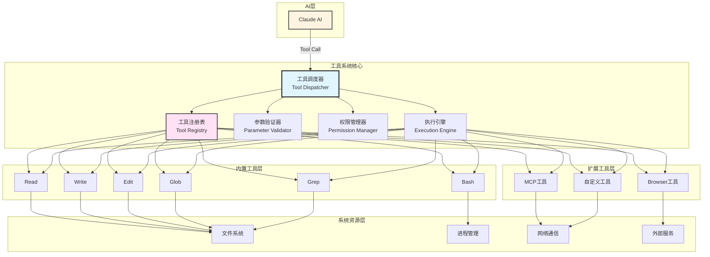
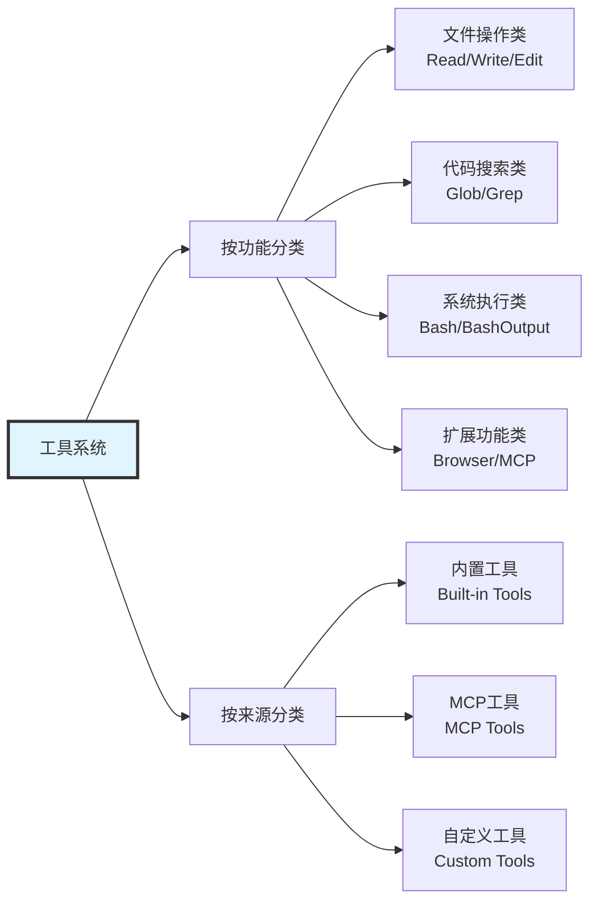
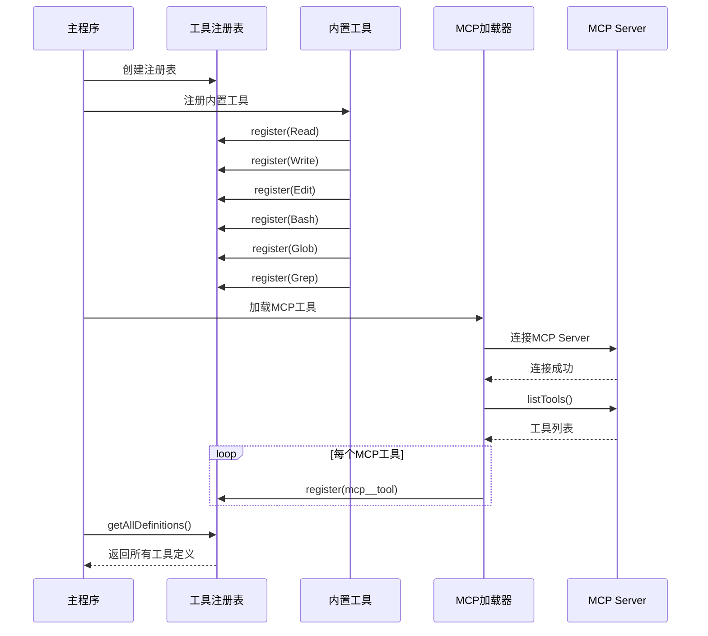
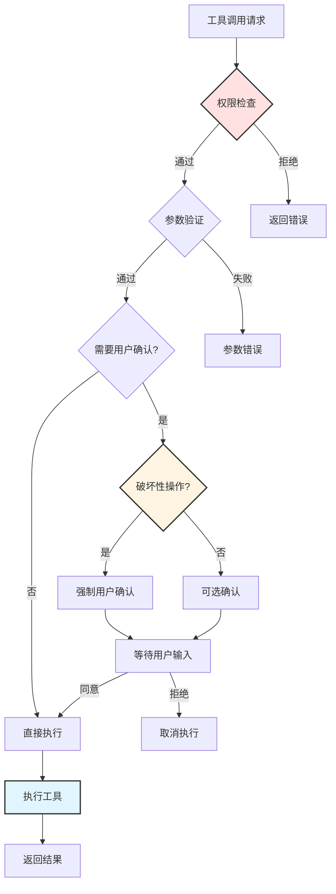
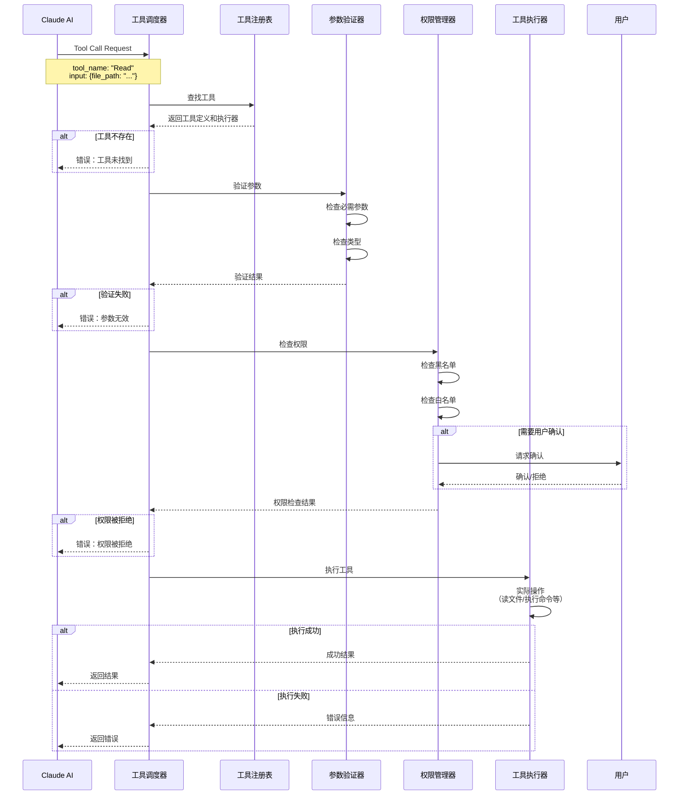

# 第5篇：工具系统架构

## 引言

工具系统是 Claude Code 的"手和眼"，赋予了 AI 与真实世界交互的能力。如果说 AI 引擎是"大脑"，那么工具系统就是"四肢"，负责执行实际的文件操作、代码搜索、命令执行等任务。本文将深入解析 Claude Code 工具系统的完整架构。

### 为什么工具系统如此重要？

1. **赋能 AI**：让 AI 从"只能说"变成"既能说又能做"
2. **标准化交互**：统一的工具接口，降低集成复杂度
3. **安全可控**：通过权限管理和参数验证确保安全
4. **可扩展性**：插件化设计，支持无限扩展
5. **性能优化**：智能调度和并行执行提升效率

### 本文目标

- 理解工具系统的整体架构
- 掌握 Tool Schema 设计规范
- 学习工具注册和调用流程
- 了解权限管理和安全机制
- 实战开发一个自定义工具

---

## 一、工具系统整体架构

### 1.1 核心组件



### 1.2 工具系统分层

| 层级 | 职责 | 核心组件 |
|-----|------|---------|
| **接口层** | 接收AI的工具调用请求 | Tool Dispatcher |
| **管理层** | 工具注册、验证、权限控制 | Registry、Validator、Permission Manager |
| **执行层** | 实际执行工具逻辑 | Execution Engine、Tool Executors |
| **资源层** | 访问系统资源 | File System、Process、Network |

### 1.3 工具分类



---

## 二、Tool Schema 设计规范

### 2.1 JSON Schema 标准

Claude Code 采用 JSON Schema 定义工具接口，这是 Anthropic API 的标准格式。

```typescript
// 工具定义的完整类型
interface ToolDefinition {
  // 工具名称（唯一标识符）
  name: string;

  // 工具描述（AI用于理解工具用途）
  description: string;

  // 输入参数的JSON Schema
  input_schema: {
    type: 'object';
    properties: Record<string, PropertySchema>;
    required?: string[];
    additionalProperties?: boolean;
  };
}

// 属性定义
interface PropertySchema {
  type: 'string' | 'number' | 'boolean' | 'array' | 'object';
  description: string;
  enum?: any[];
  items?: PropertySchema;
  default?: any;
}
```

### 2.2 内置工具示例

#### Read 工具定义

```typescript
const ReadToolDefinition: ToolDefinition = {
  name: 'Read',
  description: `Reads a file from the local filesystem. You can access any file directly by using this tool.

Usage:
- The file_path parameter must be an absolute path, not a relative path
- By default, it reads up to 2000 lines starting from the beginning
- You can optionally specify a line offset and limit (especially handy for long files)
- Any lines longer than 2000 characters will be truncated
- Results are returned using cat -n format, with line numbers starting at 1`,

  input_schema: {
    type: 'object',
    properties: {
      file_path: {
        type: 'string',
        description: 'The absolute path to the file to read'
      },
      offset: {
        type: 'number',
        description: 'The line number to start reading from. Only provide if the file is too large to read at once'
      },
      limit: {
        type: 'number',
        description: 'The number of lines to read. Only provide if the file is too large to read at once'
      }
    },
    required: ['file_path']
  }
};
```

#### Bash 工具定义

```typescript
const BashToolDefinition: ToolDefinition = {
  name: 'Bash',
  description: `Executes a given bash command in a persistent shell session.

Usage notes:
- Always quote file paths that contain spaces with double quotes
- The command argument is required
- You can specify an optional timeout in milliseconds (up to 600000ms / 10 minutes)
- You can use run_in_background parameter to run commands in background
- Avoid using Bash with find, grep, cat commands - use dedicated tools instead`,

  input_schema: {
    type: 'object',
    properties: {
      command: {
        type: 'string',
        description: 'The command to execute'
      },
      description: {
        type: 'string',
        description: 'Clear, concise description of what this command does in 5-10 words'
      },
      timeout: {
        type: 'number',
        description: 'Optional timeout in milliseconds (max 600000)',
        default: 120000
      },
      run_in_background: {
        type: 'boolean',
        description: 'Set to true to run this command in the background',
        default: false
      }
    },
    required: ['command']
  }
};
```

#### Edit 工具定义

```typescript
const EditToolDefinition: ToolDefinition = {
  name: 'Edit',
  description: `Performs exact string replacements in files.

Usage:
- You must use Read tool at least once before editing
- Preserve exact indentation as it appears in the file
- The edit will FAIL if old_string is not unique in the file
- Use replace_all for replacing and renaming strings across the file`,

  input_schema: {
    type: 'object',
    properties: {
      file_path: {
        type: 'string',
        description: 'The absolute path to the file to modify'
      },
      old_string: {
        type: 'string',
        description: 'The text to replace'
      },
      new_string: {
        type: 'string',
        description: 'The text to replace it with (must be different from old_string)'
      },
      replace_all: {
        type: 'boolean',
        description: 'Replace all occurences of old_string (default false)',
        default: false
      }
    },
    required: ['file_path', 'old_string', 'new_string']
  }
};
```

### 2.3 Schema 设计最佳实践

**1. 描述清晰**

```typescript
// ❌ 不好的描述
{
  name: 'search',
  description: 'Search files',
  // ...
}

// ✅ 好的描述
{
  name: 'Grep',
  description: `A powerful search tool built on ripgrep.

Usage:
- ALWAYS use Grep for search tasks. NEVER invoke grep as a Bash command
- Supports full regex syntax (e.g., "log.*Error", "function\\s+\\w+")
- Filter files with glob parameter (e.g., "*.js", "**/*.tsx")
- Output modes: "content" shows matching lines, "files_with_matches" shows only file paths`,
  // ...
}
```

**2. 参数类型明确**

```typescript
// 完整的参数定义
properties: {
  file_path: {
    type: 'string',
    description: 'The absolute path to the file to read'
  },
  line_number: {
    type: 'number',
    description: 'The line number to start from (1-indexed)'
  },
  case_sensitive: {
    type: 'boolean',
    description: 'Whether the search is case sensitive',
    default: false
  },
  file_types: {
    type: 'array',
    description: 'File extensions to search (e.g., ["ts", "js"])',
    items: {
      type: 'string'
    }
  }
}
```

**3. 必需参数标注**

```typescript
{
  input_schema: {
    type: 'object',
    properties: {
      file_path: { type: 'string', description: '...' },
      content: { type: 'string', description: '...' },
      encoding: { type: 'string', description: '...', default: 'utf-8' }
    },
    // 明确标注必需参数
    required: ['file_path', 'content']
  }
}
```

---

## 三、工具注册和发现机制

### 3.1 工具注册表设计

```typescript
/**
 * 工具执行器接口
 */
interface ToolExecutor {
  /**
   * 执行工具
   * @param input 工具输入参数
   * @returns 工具执行结果
   */
  execute(input: Record<string, any>): Promise<ToolResult>;
}

/**
 * 工具执行结果
 */
interface ToolResult {
  success: boolean;
  content?: string;
  error?: string;
  metadata?: Record<string, any>;
}

/**
 * 工具注册表
 * 负责管理所有可用工具
 */
class ToolRegistry {
  // 工具定义映射表
  private definitions: Map<string, ToolDefinition> = new Map();

  // 工具执行器映射表
  private executors: Map<string, ToolExecutor> = new Map();

  /**
   * 注册工具
   * @param definition 工具定义
   * @param executor 工具执行器
   */
  register(definition: ToolDefinition, executor: ToolExecutor): void {
    // 验证工具定义
    this.validateDefinition(definition);

    // 检查名称冲突
    if (this.definitions.has(definition.name)) {
      throw new Error(`Tool ${definition.name} already registered`);
    }

    // 注册工具
    this.definitions.set(definition.name, definition);
    this.executors.set(definition.name, executor);

    console.log(`✅ Registered tool: ${definition.name}`);
  }

  /**
   * 获取所有工具定义（用于发送给AI）
   */
  getAllDefinitions(): ToolDefinition[] {
    return Array.from(this.definitions.values());
  }

  /**
   * 获取工具执行器
   */
  getExecutor(name: string): ToolExecutor | undefined {
    return this.executors.get(name);
  }

  /**
   * 检查工具是否存在
   */
  has(name: string): boolean {
    return this.definitions.has(name);
  }

  /**
   * 验证工具定义
   */
  private validateDefinition(definition: ToolDefinition): void {
    if (!definition.name) {
      throw new Error('Tool name is required');
    }

    if (!definition.description) {
      throw new Error(`Tool ${definition.name}: description is required`);
    }

    if (!definition.input_schema) {
      throw new Error(`Tool ${definition.name}: input_schema is required`);
    }

    // 验证 JSON Schema 格式
    if (definition.input_schema.type !== 'object') {
      throw new Error(`Tool ${definition.name}: input_schema.type must be "object"`);
    }
  }
}
```

### 3.2 内置工具注册

```typescript
/**
 * 初始化内置工具
 */
function registerBuiltInTools(registry: ToolRegistry): void {
  // 文件操作工具
  registry.register(ReadToolDefinition, new ReadToolExecutor());
  registry.register(WriteToolDefinition, new WriteToolExecutor());
  registry.register(EditToolDefinition, new EditToolExecutor());

  // 搜索工具
  registry.register(GlobToolDefinition, new GlobToolExecutor());
  registry.register(GrepToolDefinition, new GrepToolExecutor());

  // 系统工具
  registry.register(BashToolDefinition, new BashToolExecutor());
  registry.register(BashOutputToolDefinition, new BashOutputToolExecutor());
  registry.register(KillShellToolDefinition, new KillShellToolExecutor());

  console.log('✅ All built-in tools registered');
}
```

### 3.3 MCP 工具动态注册

```typescript
/**
 * MCP 工具加载器
 */
class MCPToolLoader {
  private registry: ToolRegistry;

  constructor(registry: ToolRegistry) {
    this.registry = registry;
  }

  /**
   * 从 MCP Server 加载工具
   */
  async loadFromMCP(mcpServerConfig: MCPServerConfig): Promise<void> {
    console.log(`Loading MCP Server: ${mcpServerConfig.name}...`);

    try {
      // 连接到 MCP Server
      const mcpServer = await this.connectToMCPServer(mcpServerConfig);

      // 获取 MCP Server 提供的工具列表
      const tools = await mcpServer.listTools();

      // 注册每个工具
      for (const tool of tools) {
        // 转换 MCP 工具定义为 Claude Code 格式
        const definition = this.convertMCPToolDefinition(tool);

        // 创建执行器（代理到 MCP Server）
        const executor = this.createMCPToolExecutor(mcpServer, tool.name);

        // 注册到工具注册表
        this.registry.register(definition, executor);
      }

      console.log(`✅ Loaded ${tools.length} tools from ${mcpServerConfig.name}`);
    } catch (error) {
      console.error(`❌ Failed to load MCP Server ${mcpServerConfig.name}:`, error);
    }
  }

  /**
   * 创建 MCP 工具执行器
   */
  private createMCPToolExecutor(
    mcpServer: MCPServer,
    toolName: string
  ): ToolExecutor {
    return {
      async execute(input: Record<string, any>): Promise<ToolResult> {
        try {
          // 调用 MCP Server 执行工具
          const result = await mcpServer.callTool(toolName, input);

          return {
            success: true,
            content: result.content
          };
        } catch (error) {
          return {
            success: false,
            error: error.message
          };
        }
      }
    };
  }

  /**
   * 转换 MCP 工具定义为 Claude Code 格式
   */
  private convertMCPToolDefinition(mcpTool: MCPToolInfo): ToolDefinition {
    return {
      name: `mcp__${mcpTool.serverName}__${mcpTool.name}`,
      description: mcpTool.description,
      input_schema: mcpTool.inputSchema
    };
  }

  /**
   * 连接到 MCP Server
   */
  private async connectToMCPServer(config: MCPServerConfig): Promise<MCPServer> {
    // 实现 MCP 协议连接逻辑
    // ...
    throw new Error('Not implemented');
  }
}
```

### 3.4 工具发现流程



---

## 四、参数验证和类型检查

### 4.1 参数验证器

```typescript
/**
 * 参数验证器
 * 负责验证工具调用参数是否符合 Schema 定义
 */
class ParameterValidator {
  /**
   * 验证参数
   * @param toolName 工具名称
   * @param params 参数对象
   * @param schema 参数的 JSON Schema
   * @returns 验证结果
   */
  validate(
    toolName: string,
    params: Record<string, any>,
    schema: ToolDefinition['input_schema']
  ): ValidationResult {
    const errors: string[] = [];

    // 1. 检查必需参数
    if (schema.required) {
      for (const requiredField of schema.required) {
        if (!(requiredField in params)) {
          errors.push(`Missing required parameter: ${requiredField}`);
        }
      }
    }

    // 2. 检查参数类型
    for (const [fieldName, value] of Object.entries(params)) {
      const fieldSchema = schema.properties[fieldName];

      if (!fieldSchema) {
        // 检查是否允许额外参数
        if (schema.additionalProperties === false) {
          errors.push(`Unknown parameter: ${fieldName}`);
        }
        continue;
      }

      // 类型检查
      const typeError = this.validateType(fieldName, value, fieldSchema);
      if (typeError) {
        errors.push(typeError);
      }
    }

    return {
      valid: errors.length === 0,
      errors
    };
  }

  /**
   * 验证参数类型
   */
  private validateType(
    fieldName: string,
    value: any,
    schema: PropertySchema
  ): string | null {
    const actualType = this.getType(value);

    if (schema.type === 'string' && actualType !== 'string') {
      return `Parameter ${fieldName} must be a string, got ${actualType}`;
    }

    if (schema.type === 'number' && actualType !== 'number') {
      return `Parameter ${fieldName} must be a number, got ${actualType}`;
    }

    if (schema.type === 'boolean' && actualType !== 'boolean') {
      return `Parameter ${fieldName} must be a boolean, got ${actualType}`;
    }

    if (schema.type === 'array') {
      if (!Array.isArray(value)) {
        return `Parameter ${fieldName} must be an array, got ${actualType}`;
      }

      // 验证数组元素
      if (schema.items) {
        for (let i = 0; i < value.length; i++) {
          const itemError = this.validateType(
            `${fieldName}[${i}]`,
            value[i],
            schema.items
          );
          if (itemError) {
            return itemError;
          }
        }
      }
    }

    if (schema.type === 'object') {
      if (actualType !== 'object') {
        return `Parameter ${fieldName} must be an object, got ${actualType}`;
      }
    }

    // 检查枚举值
    if (schema.enum && !schema.enum.includes(value)) {
      return `Parameter ${fieldName} must be one of: ${schema.enum.join(', ')}`;
    }

    return null;
  }

  /**
   * 获取值的类型
   */
  private getType(value: any): string {
    if (value === null) return 'null';
    if (value === undefined) return 'undefined';
    if (Array.isArray(value)) return 'array';
    return typeof value;
  }
}

/**
 * 验证结果
 */
interface ValidationResult {
  valid: boolean;
  errors: string[];
}
```

### 4.2 参数验证示例

```typescript
// 使用示例
const validator = new ParameterValidator();

// 验证 Read 工具参数
const readParams = {
  file_path: '/path/to/file.ts',
  offset: 10,
  limit: 100
};

const result = validator.validate('Read', readParams, ReadToolDefinition.input_schema);

if (!result.valid) {
  console.error('Parameter validation failed:');
  result.errors.forEach(error => console.error(`  - ${error}`));
}

// 错误示例：缺少必需参数
const invalidParams = {
  offset: 10
  // 缺少 file_path
};

const invalidResult = validator.validate('Read', invalidParams, ReadToolDefinition.input_schema);
// invalidResult.valid === false
// invalidResult.errors === ['Missing required parameter: file_path']
```

---

## 五、工具权限管理

### 5.1 权限管理架构



### 5.2 权限管理器实现

```typescript
/**
 * 工具权限级别
 */
enum PermissionLevel {
  // 安全操作（只读）
  SAFE = 'safe',

  // 需要确认的操作（写入文件等）
  REQUIRES_CONFIRMATION = 'requires_confirmation',

  // 危险操作（删除、执行命令等）
  DANGEROUS = 'dangerous',

  // 禁止的操作
  FORBIDDEN = 'forbidden'
}

/**
 * 工具权限配置
 */
interface ToolPermission {
  toolName: string;
  level: PermissionLevel;
  // 白名单：允许的参数模式
  whitelist?: string[];
  // 黑名单：禁止的参数模式
  blacklist?: string[];
  // 是否需要用户确认
  requiresConfirmation?: boolean;
}

/**
 * 权限管理器
 */
class PermissionManager {
  private permissions: Map<string, ToolPermission> = new Map();

  constructor() {
    this.initializeDefaultPermissions();
  }

  /**
   * 初始化默认权限
   */
  private initializeDefaultPermissions(): void {
    // 只读工具 - 安全
    this.setPermission({
      toolName: 'Read',
      level: PermissionLevel.SAFE
    });

    this.setPermission({
      toolName: 'Glob',
      level: PermissionLevel.SAFE
    });

    this.setPermission({
      toolName: 'Grep',
      level: PermissionLevel.SAFE
    });

    // 写入工具 - 需要确认
    this.setPermission({
      toolName: 'Write',
      level: PermissionLevel.REQUIRES_CONFIRMATION,
      requiresConfirmation: true
    });

    this.setPermission({
      toolName: 'Edit',
      level: PermissionLevel.REQUIRES_CONFIRMATION,
      requiresConfirmation: true
    });

    // 命令执行 - 危险操作
    this.setPermission({
      toolName: 'Bash',
      level: PermissionLevel.DANGEROUS,
      requiresConfirmation: true,
      blacklist: [
        'rm -rf /',
        'mkfs',
        'dd if=/dev/zero',
        'fork bomb',
        ':(){:|:&};:',  // fork bomb
        'chmod -R 777 /',
        'sudo rm',
      ]
    });
  }

  /**
   * 设置工具权限
   */
  setPermission(permission: ToolPermission): void {
    this.permissions.set(permission.toolName, permission);
  }

  /**
   * 检查工具调用是否被允许
   */
  async checkPermission(
    toolName: string,
    params: Record<string, any>
  ): Promise<PermissionCheckResult> {
    const permission = this.permissions.get(toolName);

    if (!permission) {
      // 默认：未知工具需要确认
      return {
        allowed: false,
        reason: 'Unknown tool, permission denied',
        requiresConfirmation: true
      };
    }

    // 检查是否被禁止
    if (permission.level === PermissionLevel.FORBIDDEN) {
      return {
        allowed: false,
        reason: `Tool ${toolName} is forbidden`,
        requiresConfirmation: false
      };
    }

    // 检查黑名单
    if (permission.blacklist) {
      const blacklistViolation = this.checkBlacklist(params, permission.blacklist);
      if (blacklistViolation) {
        return {
          allowed: false,
          reason: `Blacklist violation: ${blacklistViolation}`,
          requiresConfirmation: false
        };
      }
    }

    // 检查白名单
    if (permission.whitelist && permission.whitelist.length > 0) {
      const whitelistPassed = this.checkWhitelist(params, permission.whitelist);
      if (!whitelistPassed) {
        return {
          allowed: false,
          reason: 'Not in whitelist',
          requiresConfirmation: true
        };
      }
    }

    // 安全操作直接允许
    if (permission.level === PermissionLevel.SAFE) {
      return {
        allowed: true,
        requiresConfirmation: false
      };
    }

    // 需要确认的操作
    if (permission.requiresConfirmation) {
      // 请求用户确认
      const userConfirmed = await this.requestUserConfirmation(toolName, params);

      return {
        allowed: userConfirmed,
        reason: userConfirmed ? undefined : 'User denied',
        requiresConfirmation: true
      };
    }

    // 默认允许
    return {
      allowed: true,
      requiresConfirmation: false
    };
  }

  /**
   * 检查黑名单
   */
  private checkBlacklist(
    params: Record<string, any>,
    blacklist: string[]
  ): string | null {
    const paramsStr = JSON.stringify(params);

    for (const pattern of blacklist) {
      if (paramsStr.includes(pattern)) {
        return pattern;
      }
    }

    return null;
  }

  /**
   * 检查白名单
   */
  private checkWhitelist(
    params: Record<string, any>,
    whitelist: string[]
  ): boolean {
    const paramsStr = JSON.stringify(params);

    for (const pattern of whitelist) {
      if (paramsStr.includes(pattern)) {
        return true;
      }
    }

    return false;
  }

  /**
   * 请求用户确认
   */
  private async requestUserConfirmation(
    toolName: string,
    params: Record<string, any>
  ): Promise<boolean> {
    console.log(`\n⚠️  Tool ${toolName} requires confirmation`);
    console.log(`Parameters:`, JSON.stringify(params, null, 2));
    console.log(`\nDo you want to proceed? (yes/no)`);

    // 读取用户输入
    const answer = await this.readUserInput();

    return answer.toLowerCase() === 'yes' || answer.toLowerCase() === 'y';
  }

  /**
   * 读取用户输入
   */
  private async readUserInput(): Promise<string> {
    return new Promise((resolve) => {
      const readline = require('readline');
      const rl = readline.createInterface({
        input: process.stdin,
        output: process.stdout
      });

      rl.question('> ', (answer: string) => {
        rl.close();
        resolve(answer.trim());
      });
    });
  }
}

/**
 * 权限检查结果
 */
interface PermissionCheckResult {
  allowed: boolean;
  reason?: string;
  requiresConfirmation: boolean;
}
```

---

## 六、工具调用流程

### 6.1 完整调用时序图



### 6.2 工具调度器实现

```typescript
/**
 * 工具调度器
 * 负责协调工具调用的整个流程
 */
class ToolDispatcher {
  private registry: ToolRegistry;
  private validator: ParameterValidator;
  private permissionManager: PermissionManager;

  constructor(
    registry: ToolRegistry,
    validator: ParameterValidator,
    permissionManager: PermissionManager
  ) {
    this.registry = registry;
    this.validator = validator;
    this.permissionManager = permissionManager;
  }

  /**
   * 执行工具调用
   * @param toolCall AI 的工具调用请求
   * @returns 工具执行结果
   */
  async execute(toolCall: ToolCall): Promise<ToolResult> {
    const { name, input } = toolCall;

    try {
      // 1. 查找工具
      const executor = this.registry.getExecutor(name);
      if (!executor) {
        return {
          success: false,
          error: `Tool not found: ${name}`
        };
      }

      const definition = this.registry.getAllDefinitions().find(d => d.name === name);
      if (!definition) {
        return {
          success: false,
          error: `Tool definition not found: ${name}`
        };
      }

      // 2. 验证参数
      const validationResult = this.validator.validate(
        name,
        input,
        definition.input_schema
      );

      if (!validationResult.valid) {
        return {
          success: false,
          error: `Parameter validation failed:\n${validationResult.errors.join('\n')}`
        };
      }

      // 3. 检查权限
      const permissionResult = await this.permissionManager.checkPermission(name, input);

      if (!permissionResult.allowed) {
        return {
          success: false,
          error: `Permission denied: ${permissionResult.reason || 'Unknown reason'}`
        };
      }

      // 4. 执行工具
      console.log(`🔧 Executing tool: ${name}`);
      const startTime = Date.now();

      const result = await executor.execute(input);

      const duration = Date.now() - startTime;
      console.log(`✅ Tool ${name} completed in ${duration}ms`);

      return result;

    } catch (error) {
      console.error(`❌ Tool ${name} failed:`, error);

      return {
        success: false,
        error: `Tool execution failed: ${error.message}`
      };
    }
  }

  /**
   * 批量执行工具调用
   * @param toolCalls 多个工具调用
   * @returns 所有工具的执行结果
   */
  async executeBatch(toolCalls: ToolCall[]): Promise<ToolResult[]> {
    // 并行执行所有工具调用
    return Promise.all(
      toolCalls.map(toolCall => this.execute(toolCall))
    );
  }
}

/**
 * 工具调用请求（来自AI）
 */
interface ToolCall {
  id: string;
  type: 'tool_use';
  name: string;
  input: Record<string, any>;
}
```

### 6.3 端到端示例

```typescript
// 完整的工具调用示例
async function exampleToolCallFlow() {
  // 1. 初始化系统
  const registry = new ToolRegistry();
  const validator = new ParameterValidator();
  const permissionManager = new PermissionManager();
  const dispatcher = new ToolDispatcher(registry, validator, permissionManager);

  // 2. 注册工具
  registerBuiltInTools(registry);

  // 3. AI 发起工具调用
  const toolCall: ToolCall = {
    id: 'tool_call_123',
    type: 'tool_use',
    name: 'Read',
    input: {
      file_path: '/Users/user/project/src/index.ts',
      offset: 0,
      limit: 50
    }
  };

  // 4. 执行工具
  const result = await dispatcher.execute(toolCall);

  // 5. 处理结果
  if (result.success) {
    console.log('文件内容：');
    console.log(result.content);
  } else {
    console.error('执行失败：', result.error);
  }
}
```

---

## 七、内置工具详解

### 7.1 Read 工具实现

```typescript
/**
 * Read 工具执行器
 * 读取文件内容，支持偏移和限制
 */
class ReadToolExecutor implements ToolExecutor {
  async execute(input: Record<string, any>): Promise<ToolResult> {
    const { file_path, offset = 0, limit } = input;

    try {
      // 检查文件是否存在
      if (!fs.existsSync(file_path)) {
        return {
          success: false,
          error: `File not found: ${file_path}`
        };
      }

      // 检查是否是文件（不是目录）
      const stat = fs.statSync(file_path);
      if (stat.isDirectory()) {
        return {
          success: false,
          error: `Path is a directory, not a file: ${file_path}`
        };
      }

      // 读取文件内容
      const content = fs.readFileSync(file_path, 'utf-8');
      const lines = content.split('\n');

      // 应用偏移和限制
      const selectedLines = limit
        ? lines.slice(offset, offset + limit)
        : lines.slice(offset);

      // 添加行号（cat -n 格式）
      const numberedLines = selectedLines.map((line, idx) => {
        const lineNumber = offset + idx + 1;
        // 截断过长的行
        const truncatedLine = line.length > 2000
          ? line.substring(0, 2000) + '... [truncated]'
          : line;
        return `${lineNumber}\t${truncatedLine}`;
      });

      return {
        success: true,
        content: numberedLines.join('\n'),
        metadata: {
          totalLines: lines.length,
          returnedLines: selectedLines.length,
          file_path
        }
      };

    } catch (error) {
      return {
        success: false,
        error: `Failed to read file: ${error.message}`
      };
    }
  }
}
```

### 7.2 Write 工具实现

```typescript
/**
 * Write 工具执行器
 * 写入文件，会覆盖现有内容
 */
class WriteToolExecutor implements ToolExecutor {
  async execute(input: Record<string, any>): Promise<ToolResult> {
    const { file_path, content } = input;

    try {
      // 检查是否已存在（如果存在需要先读取）
      if (fs.existsSync(file_path)) {
        // 验证是否在之前读取过该文件
        // 这是一个安全措施，防止意外覆盖
        const shouldProceed = await this.verifyFileWasRead(file_path);
        if (!shouldProceed) {
          return {
            success: false,
            error: `File exists but was not read first. Use Read tool before Write.`
          };
        }

        // 创建备份
        await this.createBackup(file_path);
      }

      // 确保目录存在
      const dir = path.dirname(file_path);
      if (!fs.existsSync(dir)) {
        fs.mkdirSync(dir, { recursive: true });
      }

      // 写入文件
      fs.writeFileSync(file_path, content, 'utf-8');

      return {
        success: true,
        content: `File written successfully: ${file_path}`,
        metadata: {
          file_path,
          bytes: Buffer.byteLength(content, 'utf-8')
        }
      };

    } catch (error) {
      return {
        success: false,
        error: `Failed to write file: ${error.message}`
      };
    }
  }

  /**
   * 验证文件是否被读取过
   */
  private async verifyFileWasRead(filePath: string): Promise<boolean> {
    // 在实际实现中，需要检查会话历史
    // 这里简化为总是返回 true
    return true;
  }

  /**
   * 创建文件备份
   */
  private async createBackup(filePath: string): Promise<void> {
    const backupPath = `${filePath}.backup`;
    fs.copyFileSync(filePath, backupPath);
    console.log(`📦 Created backup: ${backupPath}`);
  }
}
```

### 7.3 Edit 工具实现

```typescript
/**
 * Edit 工具执行器
 * 精确字符串替换
 */
class EditToolExecutor implements ToolExecutor {
  async execute(input: Record<string, any>): Promise<ToolResult> {
    const { file_path, old_string, new_string, replace_all = false } = input;

    try {
      // 读取文件内容
      if (!fs.existsSync(file_path)) {
        return {
          success: false,
          error: `File not found: ${file_path}`
        };
      }

      const content = fs.readFileSync(file_path, 'utf-8');

      // 检查 old_string 是否存在
      if (!content.includes(old_string)) {
        return {
          success: false,
          error: `String not found in file: "${old_string}"`
        };
      }

      // 检查唯一性（如果不是 replace_all）
      if (!replace_all) {
        const occurrences = (content.match(new RegExp(this.escapeRegex(old_string), 'g')) || []).length;
        if (occurrences > 1) {
          return {
            success: false,
            error: `String appears ${occurrences} times in file. Use replace_all=true or provide more context to make it unique.`
          };
        }
      }

      // 执行替换
      let newContent: string;
      if (replace_all) {
        newContent = content.split(old_string).join(new_string);
      } else {
        newContent = content.replace(old_string, new_string);
      }

      // 写入文件
      fs.writeFileSync(file_path, newContent, 'utf-8');

      return {
        success: true,
        content: `Successfully replaced string in ${file_path}`,
        metadata: {
          file_path,
          replacements: replace_all ? 'all' : 1
        }
      };

    } catch (error) {
      return {
        success: false,
        error: `Failed to edit file: ${error.message}`
      };
    }
  }

  /**
   * 转义正则表达式特殊字符
   */
  private escapeRegex(str: string): string {
    return str.replace(/[.*+?^${}()|[\]\\]/g, '\\$&');
  }
}
```

### 7.4 Bash 工具实现

```typescript
/**
 * Bash 工具执行器
 * 执行 shell 命令
 */
class BashToolExecutor implements ToolExecutor {
  private sessions: Map<string, ChildProcess> = new Map();

  async execute(input: Record<string, any>): Promise<ToolResult> {
    const {
      command,
      description,
      timeout = 120000,
      run_in_background = false
    } = input;

    try {
      console.log(`💻 Executing: ${description || command}`);

      if (run_in_background) {
        return await this.executeInBackground(command, timeout);
      } else {
        return await this.executeSync(command, timeout);
      }

    } catch (error) {
      return {
        success: false,
        error: `Command execution failed: ${error.message}`
      };
    }
  }

  /**
   * 同步执行命令
   */
  private async executeSync(command: string, timeout: number): Promise<ToolResult> {
    return new Promise((resolve) => {
      const child = spawn('/bin/bash', ['-c', command], {
        timeout,
        maxBuffer: 10 * 1024 * 1024 // 10MB
      });

      let stdout = '';
      let stderr = '';

      child.stdout?.on('data', (data) => {
        const chunk = data.toString();
        stdout += chunk;
        // 实时输出
        process.stdout.write(chunk);
      });

      child.stderr?.on('data', (data) => {
        const chunk = data.toString();
        stderr += chunk;
        process.stderr.write(chunk);
      });

      child.on('close', (code) => {
        if (code === 0) {
          resolve({
            success: true,
            content: stdout,
            metadata: {
              exitCode: code,
              stderr: stderr || undefined
            }
          });
        } else {
          resolve({
            success: false,
            error: `Command exited with code ${code}\n${stderr}`,
            metadata: {
              exitCode: code,
              stdout: stdout || undefined
            }
          });
        }
      });

      child.on('error', (error) => {
        resolve({
          success: false,
          error: `Failed to execute command: ${error.message}`
        });
      });
    });
  }

  /**
   * 后台执行命令
   */
  private async executeInBackground(command: string, timeout: number): Promise<ToolResult> {
    const sessionId = `bash_${Date.now()}`;

    const child = spawn('/bin/bash', ['-c', command], {
      timeout,
      detached: true,
      stdio: ['ignore', 'pipe', 'pipe']
    });

    // 保存会话
    this.sessions.set(sessionId, child);

    // 后台运行，不等待结果
    child.unref();

    return {
      success: true,
      content: `Command started in background (session: ${sessionId})`,
      metadata: {
        sessionId,
        pid: child.pid
      }
    };
  }
}
```

### 7.5 Glob 工具实现

```typescript
/**
 * Glob 工具执行器
 * 文件模式匹配
 */
class GlobToolExecutor implements ToolExecutor {
  async execute(input: Record<string, any>): Promise<ToolResult> {
    const { pattern, path: searchPath = process.cwd() } = input;

    try {
      // 使用 fast-glob 库
      const fg = require('fast-glob');

      const files = await fg(pattern, {
        cwd: searchPath,
        absolute: true,
        dot: false,
        ignore: ['node_modules/**', '.git/**', 'dist/**', 'build/**']
      });

      // 按修改时间排序
      const filesWithStats = await Promise.all(
        files.map(async (file: string) => {
          const stat = fs.statSync(file);
          return {
            path: file,
            mtime: stat.mtimeMs
          };
        })
      );

      filesWithStats.sort((a, b) => b.mtime - a.mtime);

      const sortedFiles = filesWithStats.map(f => f.path);

      return {
        success: true,
        content: sortedFiles.join('\n'),
        metadata: {
          count: sortedFiles.length,
          pattern
        }
      };

    } catch (error) {
      return {
        success: false,
        error: `Glob search failed: ${error.message}`
      };
    }
  }
}
```

### 7.6 Grep 工具实现

```typescript
/**
 * Grep 工具执行器
 * 内容搜索（基于 ripgrep）
 */
class GrepToolExecutor implements ToolExecutor {
  async execute(input: Record<string, any>): Promise<ToolResult> {
    const {
      pattern,
      path: searchPath = process.cwd(),
      glob,
      type,
      output_mode = 'files_with_matches',
      '-i': caseInsensitive = false,
      '-n': lineNumbers = false,
      '-A': after = 0,
      '-B': before = 0,
      '-C': context = 0,
      head_limit,
      multiline = false
    } = input;

    try {
      // 构造 ripgrep 命令
      const args: string[] = [pattern];

      // 搜索路径
      args.push(searchPath);

      // 输出模式
      if (output_mode === 'files_with_matches') {
        args.push('--files-with-matches');
      } else if (output_mode === 'count') {
        args.push('--count');
      }

      // 其他选项
      if (caseInsensitive) args.push('-i');
      if (lineNumbers && output_mode === 'content') args.push('-n');
      if (after && output_mode === 'content') args.push(`-A${after}`);
      if (before && output_mode === 'content') args.push(`-B${before}`);
      if (context && output_mode === 'content') args.push(`-C${context}`);
      if (multiline) args.push('-U', '--multiline-dotall');

      // 文件过滤
      if (glob) args.push('--glob', glob);
      if (type) args.push('--type', type);

      // 限制结果数量
      if (head_limit) args.push('--max-count', String(head_limit));

      // 执行 ripgrep
      const child = spawn('rg', args);

      let stdout = '';
      let stderr = '';

      child.stdout?.on('data', (data) => {
        stdout += data.toString();
      });

      child.stderr?.on('data', (data) => {
        stderr += data.toString();
      });

      const result = await new Promise<ToolResult>((resolve) => {
        child.on('close', (code) => {
          if (code === 0 || code === 1) {
            // code 1 表示没有匹配，这不是错误
            resolve({
              success: true,
              content: stdout || 'No matches found',
              metadata: {
                pattern,
                matches: stdout.split('\n').filter(l => l).length
              }
            });
          } else {
            resolve({
              success: false,
              error: `ripgrep failed with code ${code}\n${stderr}`
            });
          }
        });
      });

      return result;

    } catch (error) {
      return {
        success: false,
        error: `Grep search failed: ${error.message}`
      };
    }
  }
}
```

---

## 八、最佳实践

### 8.1 工具设计原则

**1. 单一职责**
```typescript
// ❌ 不好：一个工具做太多事情
{
  name: 'FileManager',
  description: 'Manage files: read, write, delete, move, etc.'
}

// ✅ 好：每个工具职责单一
{
  name: 'Read',
  description: 'Reads a file from the filesystem'
}
```

**2. 清晰的接口**
```typescript
// ✅ 好的工具定义
{
  name: 'SearchCode',
  description: 'Search for patterns in code using regular expressions',
  input_schema: {
    type: 'object',
    properties: {
      pattern: {
        type: 'string',
        description: 'Regular expression pattern to search for'
      },
      path: {
        type: 'string',
        description: 'Directory to search in (default: current directory)'
      },
      file_type: {
        type: 'string',
        description: 'File type filter (e.g., "ts", "js", "py")',
        enum: ['ts', 'js', 'py', 'java', 'go']
      }
    },
    required: ['pattern']
  }
}
```

**3. 详细的错误处理**
```typescript
async execute(input: Record<string, any>): Promise<ToolResult> {
  try {
    // 执行逻辑
  } catch (error) {
    // 提供有用的错误信息
    return {
      success: false,
      error: `Failed to execute tool: ${error.message}\n\nSuggestion: Check if the file exists and you have read permissions.`
    };
  }
}
```

### 8.2 性能优化建议

**1. 并行执行独立工具**
```typescript
// 当多个工具调用相互独立时，并行执行
async function optimizedExecution(toolCalls: ToolCall[]) {
  // 分析依赖关系
  const independent = toolCalls.filter(call => !hasDependencies(call));
  const dependent = toolCalls.filter(call => hasDependencies(call));

  // 并行执行独立工具
  const independentResults = await Promise.all(
    independent.map(call => dispatcher.execute(call))
  );

  // 顺序执行有依赖的工具
  const dependentResults = [];
  for (const call of dependent) {
    const result = await dispatcher.execute(call);
    dependentResults.push(result);
  }

  return [...independentResults, ...dependentResults];
}
```

**2. 结果缓存**
```typescript
class CachedToolExecutor implements ToolExecutor {
  private cache: Map<string, { result: ToolResult; timestamp: number }> = new Map();
  private ttl = 5 * 60 * 1000; // 5分钟

  async execute(input: Record<string, any>): Promise<ToolResult> {
    const cacheKey = this.getCacheKey(input);

    // 检查缓存
    const cached = this.cache.get(cacheKey);
    if (cached && Date.now() - cached.timestamp < this.ttl) {
      console.log('✅ Returning cached result');
      return cached.result;
    }

    // 执行工具
    const result = await this.actualExecute(input);

    // 缓存结果
    this.cache.set(cacheKey, {
      result,
      timestamp: Date.now()
    });

    return result;
  }

  private getCacheKey(input: Record<string, any>): string {
    return JSON.stringify(input);
  }
}
```

### 8.3 安全建议

**1. 输入验证**
```typescript
// 始终验证和清理输入
function sanitizeInput(input: string): string {
  // 移除危险字符
  return input.replace(/[;&|`$]/g, '');
}
```

**2. 路径验证**
```typescript
function validatePath(filePath: string, workspaceRoot: string): boolean {
  const resolved = path.resolve(filePath);

  // 确保在工作区内
  if (!resolved.startsWith(workspaceRoot)) {
    throw new Error('Access denied: path outside workspace');
  }

  // 检查路径遍历攻击
  if (filePath.includes('..')) {
    throw new Error('Invalid path: contains ".."');
  }

  return true;
}
```

---

## 九、常见问题 FAQ

### Q1: 如何添加自定义工具？

A: 有两种方式：

**方式1：直接注册到工具系统**
```typescript
// 定义工具
const myTool: ToolDefinition = {
  name: 'MyCustomTool',
  description: 'My custom tool description',
  input_schema: { /* ... */ }
};

// 实现执行器
class MyToolExecutor implements ToolExecutor {
  async execute(input: any): Promise<ToolResult> {
    // 实现逻辑
  }
}

// 注册
toolRegistry.register(myTool, new MyToolExecutor());
```

**方式2：开发 MCP Server（推荐）**

参考第9篇《MCP协议深入解析》和第18篇《MCP Server开发实战》。

### Q2: 工具调用失败如何处理？

A: Claude Code 会将错误返回给 AI，AI 会尝试：
1. 理解错误原因
2. 修正参数重试
3. 选择其他工具
4. 向用户请求帮助

### Q3: 可以限制工具的执行频率吗？

A: 可以实现一个速率限制器：

```typescript
class RateLimitedExecutor implements ToolExecutor {
  private lastExecutionTime = 0;
  private minInterval = 1000; // 最小间隔 1 秒

  async execute(input: any): Promise<ToolResult> {
    const now = Date.now();
    const elapsed = now - this.lastExecutionTime;

    if (elapsed < this.minInterval) {
      await new Promise(resolve =>
        setTimeout(resolve, this.minInterval - elapsed)
      );
    }

    this.lastExecutionTime = Date.now();
    return this.actualExecute(input);
  }
}
```

### Q4: 工具执行超时怎么办？

A: 设置合理的超时时间，并实现超时处理：

```typescript
async function executeWithTimeout(
  executor: ToolExecutor,
  input: any,
  timeout: number
): Promise<ToolResult> {
  return Promise.race([
    executor.execute(input),
    new Promise<ToolResult>((_, reject) =>
      setTimeout(() => reject(new Error('Tool execution timeout')), timeout)
    )
  ]);
}
```

### Q5: 如何调试工具调用？

A: 添加详细的日志：

```typescript
class LoggingExecutor implements ToolExecutor {
  constructor(private inner: ToolExecutor, private toolName: string) {}

  async execute(input: any): Promise<ToolResult> {
    console.log(`[${this.toolName}] Input:`, JSON.stringify(input, null, 2));

    const startTime = Date.now();
    const result = await this.inner.execute(input);
    const duration = Date.now() - startTime;

    console.log(`[${this.toolName}] Result:`, {
      success: result.success,
      duration: `${duration}ms`
    });

    if (!result.success) {
      console.error(`[${this.toolName}] Error:`, result.error);
    }

    return result;
  }
}
```

---

## 十、实战练习：创建一个自定义工具

### 练习目标

创建一个 `FileSearch` 工具，实现文件内容搜索和替换功能。

### 练习步骤

**1. 定义工具 Schema**

```typescript
const FileSearchToolDefinition: ToolDefinition = {
  name: 'FileSearch',
  description: `Search and optionally replace text in files.

Usage:
- Searches for a pattern across multiple files
- Supports regular expressions
- Can preview changes before replacing
- Returns list of matches with line numbers`,

  input_schema: {
    type: 'object',
    properties: {
      pattern: {
        type: 'string',
        description: 'Pattern to search for (supports regex)'
      },
      path: {
        type: 'string',
        description: 'Directory to search in'
      },
      file_glob: {
        type: 'string',
        description: 'File pattern (e.g., "*.ts")',
        default: '*'
      },
      replace_with: {
        type: 'string',
        description: 'Replacement text (optional, for search and replace)'
      },
      preview_only: {
        type: 'boolean',
        description: 'Only preview changes without applying them',
        default: true
      }
    },
    required: ['pattern', 'path']
  }
};
```

**2. 实现执行器**

```typescript
class FileSearchExecutor implements ToolExecutor {
  async execute(input: Record<string, any>): Promise<ToolResult> {
    const {
      pattern,
      path: searchPath,
      file_glob = '*',
      replace_with,
      preview_only = true
    } = input;

    try {
      // 1. 查找匹配的文件
      const fg = require('fast-glob');
      const files = await fg(file_glob, {
        cwd: searchPath,
        absolute: true
      });

      // 2. 搜索每个文件
      const matches: SearchMatch[] = [];
      const regex = new RegExp(pattern, 'g');

      for (const file of files) {
        const content = fs.readFileSync(file, 'utf-8');
        const lines = content.split('\n');

        lines.forEach((line, idx) => {
          if (regex.test(line)) {
            matches.push({
              file,
              lineNumber: idx + 1,
              line,
              match: pattern
            });
          }
          regex.lastIndex = 0; // 重置正则
        });
      }

      // 3. 如果是替换操作
      if (replace_with && !preview_only) {
        for (const match of matches) {
          const content = fs.readFileSync(match.file, 'utf-8');
          const newContent = content.replace(new RegExp(pattern, 'g'), replace_with);
          fs.writeFileSync(match.file, newContent, 'utf-8');
        }
      }

      // 4. 格式化输出
      const output = this.formatMatches(matches, replace_with, preview_only);

      return {
        success: true,
        content: output,
        metadata: {
          totalMatches: matches.length,
          filesSearched: files.length,
          replaced: !preview_only && !!replace_with
        }
      };

    } catch (error) {
      return {
        success: false,
        error: `File search failed: ${error.message}`
      };
    }
  }

  private formatMatches(
    matches: SearchMatch[],
    replaceWith?: string,
    previewOnly?: boolean
  ): string {
    if (matches.length === 0) {
      return 'No matches found';
    }

    let output = `Found ${matches.length} matches:\n\n`;

    for (const match of matches) {
      output += `${match.file}:${match.lineNumber}\n`;
      output += `  ${match.line}\n`;

      if (replaceWith) {
        const preview = match.line.replace(
          new RegExp(match.match, 'g'),
          replaceWith
        );
        output += `  → ${preview}\n`;
      }

      output += '\n';
    }

    if (replaceWith && previewOnly) {
      output += '\n⚠️  Preview only. Set preview_only=false to apply changes.';
    }

    return output;
  }
}

interface SearchMatch {
  file: string;
  lineNumber: number;
  line: string;
  match: string;
}
```

**3. 注册和测试**

```typescript
// 注册工具
toolRegistry.register(FileSearchToolDefinition, new FileSearchExecutor());

// 测试工具
const testCall: ToolCall = {
  id: 'test_1',
  type: 'tool_use',
  name: 'FileSearch',
  input: {
    pattern: 'TODO',
    path: '/Users/user/project/src',
    file_glob: '**/*.ts',
    preview_only: true
  }
};

const result = await dispatcher.execute(testCall);
console.log(result.content);
```

### 练习扩展

1. 添加正则表达式语法验证
2. 支持多行匹配
3. 添加排除模式（忽略某些文件）
4. 实现批量替换的撤销功能
5. 添加进度显示（大型搜索）

---

## 十一、总结

工具系统是 Claude Code 的核心能力之一，本文深入探讨了：

✅ **整体架构**：四层架构，职责清晰
✅ **Tool Schema**：标准化的工具定义规范
✅ **注册机制**：灵活的工具发现和管理
✅ **参数验证**：完善的类型检查和验证
✅ **权限管理**：多层次的安全机制
✅ **调用流程**：完整的工具执行流程
✅ **内置工具**：六大核心工具的实现细节
✅ **最佳实践**：设计原则和优化建议
✅ **实战练习**：自定义工具开发

### 关键要点

1. **标准化接口**：JSON Schema 确保工具定义清晰一致
2. **分层设计**：调度、验证、权限、执行各层职责明确
3. **安全优先**：多重安全机制防止危险操作
4. **可扩展性**：插件化设计支持无限扩展
5. **用户体验**：清晰的错误提示和确认机制

---

## 十二、下一篇预告

在下一篇文章中，我们将深入探讨 **[文件操作工具实现](./06-文件操作工具实现.md)**，包括：
- Read 工具的高级特性（分页、缓存、增量读取）
- Write 工具的备份和回滚机制
- Edit 工具的冲突检测和智能合并
- 文件监听和变更检测
- 安全沙箱机制设计

敬请期待！ 🚀

---

**如果觉得这篇文章对你有帮助，欢迎分享给更多的朋友！**
