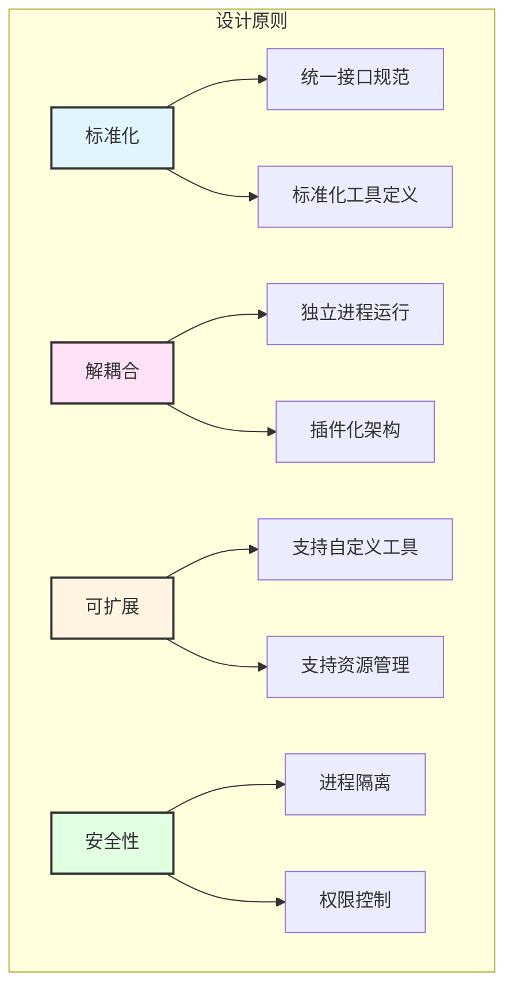
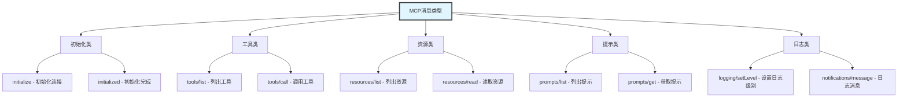
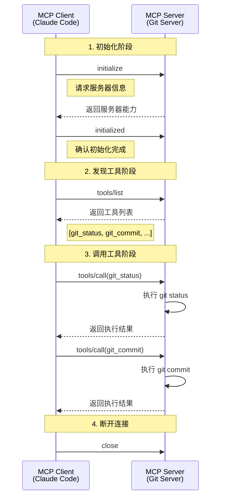
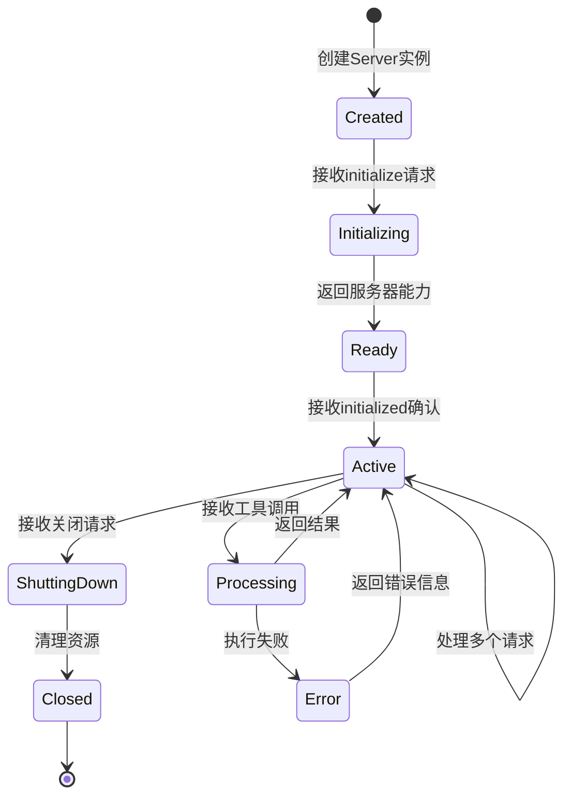
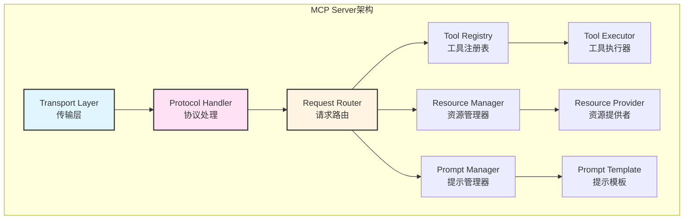
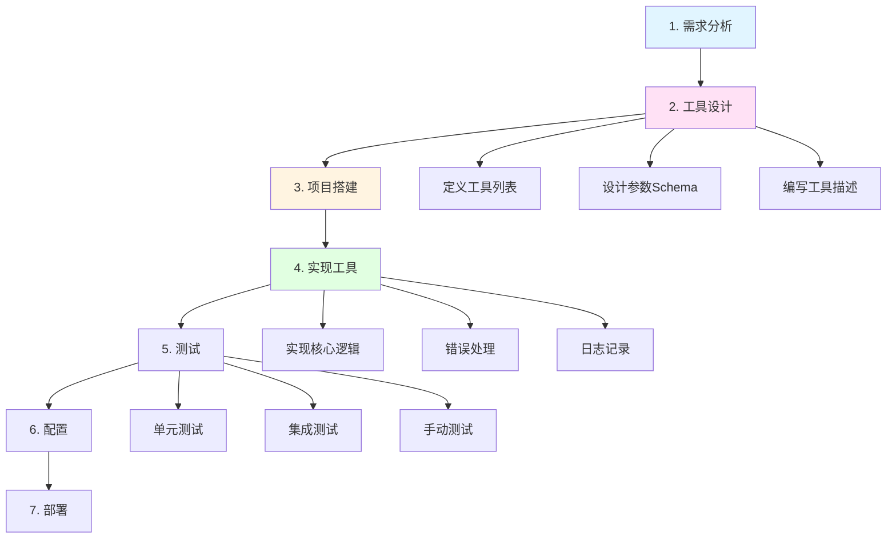
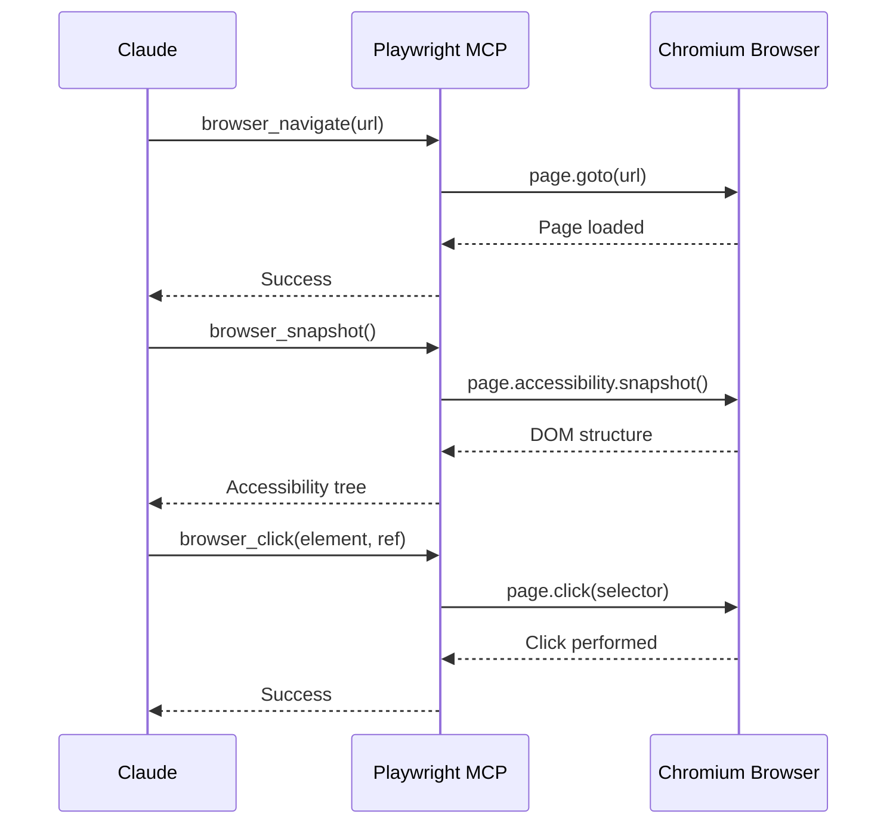
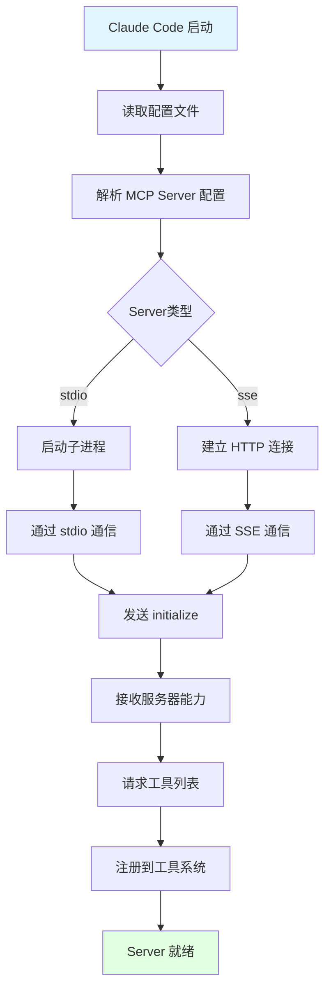

---
title: Claude Code架构详解（九）：MCP协议深入解析
date: 2025-01-15
categories:
  - AI
  - Claude Code
---

# 第9篇：MCP协议深入解析

## 引言

Model Context Protocol (MCP) 是 Claude Code 扩展性的核心基础，它提供了一套标准化的协议，让第三方开发者能够为 Claude Code 开发自定义工具和服务。本文将深入探讨 MCP 协议的设计理念、技术规范和实战开发。

### 为什么需要 MCP 协议？

在 MCP 出现之前，AI 应用集成外部工具面临诸多挑战：

1. **缺乏标准**：每个 AI 应用有自己的工具定义方式
2. **重复开发**：相同的工具需要为不同平台重复开发
3. **维护困难**：工具更新需要同步修改多个应用
4. **生态割裂**：无法共享工具和最佳实践

MCP 的出现解决了这些问题：

✅ **标准化接口**：统一的协议规范，工具定义一次，到处可用
✅ **松耦合设计**：MCP Server 独立运行，易于开发和维护
✅ **生态共享**：社区可以共享 MCP Server，加速生态建设
✅ **灵活扩展**：支持任意类型的工具和服务集成

### 本文目标

通过本文，你将学习到：
- MCP 协议的设计理念和技术架构
- JSON-RPC 通信协议详解
- 如何开发一个完整的 MCP Server
- 内置 MCP 工具的实现原理
- 生产环境的最佳实践

---

## 一、MCP 协议设计理念

### 1.1 核心设计思想

MCP 采用 **Client-Server 架构**，遵循以下设计原则：



### 1.2 架构对比

**传统集成方式**：
```typescript
// 传统方式：每个工具直接集成到应用中
class Application {
  async executeGitCommand(cmd: string) {
    // 直接执行 git 命令
    return exec(`git ${cmd}`);
  }

  async queryDatabase(sql: string) {
    // 直接连接数据库
    return db.query(sql);
  }

  // 需要为每个功能添加代码
}
```

**MCP 方式**：
```typescript
// MCP 方式：通过协议与独立的 Server 通信
class Application {
  private mcpClients: Map<string, MCPClient> = new Map();

  async callTool(serverName: string, toolName: string, params: any) {
    const client = this.mcpClients.get(serverName);
    // 通过 MCP 协议调用
    return await client.callTool(toolName, params);
  }
}

// Git 功能由独立的 Git MCP Server 提供
// 数据库功能由独立的 Database MCP Server 提供
```

### 1.3 MCP 的优势

| 特性 | 传统方式 | MCP 方式 |
|------|---------|---------|
| **开发效率** | 需要修改主应用代码 | 独立开发，无需修改主应用 |
| **可维护性** | 紧耦合，难以更新 | 松耦合，独立更新 |
| **可重用性** | 每个应用重复开发 | 一次开发，多处使用 |
| **隔离性** | 共享内存空间 | 独立进程，资源隔离 |
| **安全性** | 直接访问系统资源 | 受控访问，权限管理 |

---

## 二、协议规范和消息格式

### 2.1 JSON-RPC 2.0 基础

MCP 基于 **JSON-RPC 2.0** 协议，这是一个轻量级的远程过程调用协议。

**JSON-RPC 请求格式**：
```json
{
  "jsonrpc": "2.0",
  "id": "1",
  "method": "tools/call",
  "params": {
    "name": "read_file",
    "arguments": {
      "path": "/path/to/file.txt"
    }
  }
}
```

**JSON-RPC 响应格式**：
```json
{
  "jsonrpc": "2.0",
  "id": "1",
  "result": {
    "content": "file content here...",
    "isError": false
  }
}
```

**错误响应格式**：
```json
{
  "jsonrpc": "2.0",
  "id": "1",
  "error": {
    "code": -32600,
    "message": "Invalid Request",
    "data": {
      "details": "Missing required parameter: path"
    }
  }
}
```

### 2.2 MCP 消息类型

MCP 定义了以下核心消息类型：



### 2.3 完整通信流程



### 2.4 MCP 工具定义规范

每个 MCP 工具必须包含以下字段：

```typescript
interface MCPTool {
  // 工具名称（唯一标识）
  name: string;

  // 工具描述（给 AI 看的，帮助 AI 理解何时使用）
  description: string;

  // 输入参数 Schema（JSON Schema 格式）
  inputSchema: {
    type: "object";
    properties: Record<string, JSONSchema>;
    required?: string[];
  };
}

// 示例：Git Status 工具定义
const gitStatusTool: MCPTool = {
  name: "git_status",
  description: "Get the current git status of the repository, including staged, unstaged, and untracked files.",
  inputSchema: {
    type: "object",
    properties: {
      path: {
        type: "string",
        description: "Repository path (optional, defaults to current directory)"
      },
      short: {
        type: "boolean",
        description: "Use short format"
      }
    },
    required: []
  }
};
```

---

## 三、MCP Server 架构

### 3.1 Server 生命周期



### 3.2 Server 核心组件



### 3.3 TypeScript 基础框架

```typescript
/**
 * MCP Server 基础类
 * 提供了创建 MCP Server 所需的核心功能
 */
abstract class MCPServer {
  private tools: Map<string, MCPTool> = new Map();
  private resources: Map<string, MCPResource> = new Map();

  // 服务器信息
  abstract getServerInfo(): {
    name: string;
    version: string;
  };

  /**
   * 注册工具
   */
  protected registerTool(
    tool: MCPTool,
    handler: (params: any) => Promise<any>
  ): void {
    this.tools.set(tool.name, {
      ...tool,
      handler
    });
  }

  /**
   * 处理初始化请求
   */
  async handleInitialize(params: InitializeParams): Promise<InitializeResult> {
    return {
      protocolVersion: "2024-11-05",
      capabilities: {
        tools: { listChanged: true },
        resources: { listChanged: false },
        prompts: { listChanged: false }
      },
      serverInfo: this.getServerInfo()
    };
  }

  /**
   * 处理工具列表请求
   */
  async handleToolsList(): Promise<ToolsListResult> {
    return {
      tools: Array.from(this.tools.values()).map(tool => ({
        name: tool.name,
        description: tool.description,
        inputSchema: tool.inputSchema
      }))
    };
  }

  /**
   * 处理工具调用请求
   */
  async handleToolCall(params: ToolCallParams): Promise<ToolCallResult> {
    const tool = this.tools.get(params.name);

    if (!tool) {
      throw new Error(`Tool not found: ${params.name}`);
    }

    try {
      // 验证参数
      this.validateParams(params.arguments, tool.inputSchema);

      // 执行工具
      const result = await tool.handler(params.arguments);

      return {
        content: [
          {
            type: "text",
            text: typeof result === "string" ? result : JSON.stringify(result, null, 2)
          }
        ],
        isError: false
      };
    } catch (error) {
      return {
        content: [
          {
            type: "text",
            text: `Error executing tool: ${error.message}`
          }
        ],
        isError: true
      };
    }
  }

  /**
   * 参数验证
   */
  private validateParams(params: any, schema: any): void {
    // 检查必需参数
    if (schema.required) {
      for (const field of schema.required) {
        if (!(field in params)) {
          throw new Error(`Missing required parameter: ${field}`);
        }
      }
    }

    // 类型检查（简化版）
    for (const [key, value] of Object.entries(params)) {
      const propSchema = schema.properties[key];
      if (propSchema && propSchema.type) {
        const actualType = typeof value;
        if (actualType !== propSchema.type) {
          throw new Error(
            `Invalid type for ${key}: expected ${propSchema.type}, got ${actualType}`
          );
        }
      }
    }
  }

  /**
   * 启动 Server（基于 stdio）
   */
  async start(): Promise<void> {
    const transport = new StdioTransport();

    transport.on("message", async (message: JSONRPCMessage) => {
      try {
        const response = await this.handleMessage(message);
        transport.send(response);
      } catch (error) {
        transport.send({
          jsonrpc: "2.0",
          id: message.id,
          error: {
            code: -32603,
            message: error.message
          }
        });
      }
    });

    await transport.start();
  }

  /**
   * 路由消息到对应的处理器
   */
  private async handleMessage(message: JSONRPCMessage): Promise<any> {
    const { method, params, id } = message;

    let result: any;

    switch (method) {
      case "initialize":
        result = await this.handleInitialize(params);
        break;

      case "tools/list":
        result = await this.handleToolsList();
        break;

      case "tools/call":
        result = await this.handleToolCall(params);
        break;

      default:
        throw new Error(`Unknown method: ${method}`);
    }

    return {
      jsonrpc: "2.0",
      id,
      result
    };
  }
}

/**
 * Stdio 传输层
 * MCP Server 通过标准输入输出与 Client 通信
 */
class StdioTransport extends EventEmitter {
  private buffer: string = "";

  async start(): Promise<void> {
    // 监听标准输入
    process.stdin.on("data", (chunk) => {
      this.buffer += chunk.toString();
      this.processBuffer();
    });

    process.stdin.resume();
  }

  private processBuffer(): void {
    const lines = this.buffer.split("\n");
    this.buffer = lines.pop() || "";

    for (const line of lines) {
      if (line.trim()) {
        try {
          const message = JSON.parse(line);
          this.emit("message", message);
        } catch (error) {
          console.error("Failed to parse message:", error);
        }
      }
    }
  }

  send(message: any): void {
    // 发送到标准输出
    process.stdout.write(JSON.stringify(message) + "\n");
  }
}
```

---

## 四、开发 MCP Server 的完整流程

### 4.1 开发流程图



### 4.2 步骤详解

#### **步骤 1：需求分析**

明确要实现的功能：
- 需要哪些工具？
- 每个工具解决什么问题？
- 工具的输入输出是什么？

#### **步骤 2：工具设计**

设计工具接口：
```typescript
// 设计文档示例
/**
 * Git MCP Server 工具列表
 *
 * 1. git_status
 *    - 功能：获取 git 仓库状态
 *    - 输入：path (可选)
 *    - 输出：状态信息文本
 *
 * 2. git_commit
 *    - 功能：创建 git 提交
 *    - 输入：message (必需), files (可选)
 *    - 输出：提交结果
 *
 * 3. git_log
 *    - 功能：查看提交历史
 *    - 输入：count (可选), format (可选)
 *    - 输出：提交历史列表
 */
```

#### **步骤 3：项目搭建**

创建项目结构：
```bash
git-mcp-server/
├── package.json
├── tsconfig.json
├── src/
│   ├── index.ts        # 入口文件
│   ├── server.ts       # Server 主类
│   ├── tools/          # 工具实现
│   │   ├── status.ts
│   │   ├── commit.ts
│   │   └── log.ts
│   └── types.ts        # 类型定义
├── test/               # 测试文件
└── README.md
```

**package.json**：
```json
{
  "name": "git-mcp-server",
  "version": "1.0.0",
  "description": "MCP Server for Git operations",
  "main": "dist/index.js",
  "bin": {
    "git-mcp-server": "./dist/index.js"
  },
  "scripts": {
    "build": "tsc",
    "start": "node dist/index.js",
    "dev": "ts-node src/index.ts",
    "test": "jest"
  },
  "dependencies": {
    "simple-git": "^3.20.0"
  },
  "devDependencies": {
    "@types/node": "^20.0.0",
    "typescript": "^5.0.0",
    "ts-node": "^10.9.0",
    "jest": "^29.0.0"
  }
}
```

**tsconfig.json**：
```json
{
  "compilerOptions": {
    "target": "ES2020",
    "module": "commonjs",
    "lib": ["ES2020"],
    "outDir": "./dist",
    "rootDir": "./src",
    "strict": true,
    "esModuleInterop": true,
    "skipLibCheck": true,
    "forceConsistentCasingInFileNames": true,
    "declaration": true,
    "declarationMap": true,
    "sourceMap": true
  },
  "include": ["src/**/*"],
  "exclude": ["node_modules", "dist", "test"]
}
```

---

## 五、实战案例：Git MCP Server

### 5.1 完整实现

下面是一个完整的、可运行的 Git MCP Server 实现：

**src/types.ts**：
```typescript
/**
 * MCP 协议类型定义
 */

export interface JSONRPCMessage {
  jsonrpc: "2.0";
  id?: string | number;
  method?: string;
  params?: any;
  result?: any;
  error?: {
    code: number;
    message: string;
    data?: any;
  };
}

export interface MCPTool {
  name: string;
  description: string;
  inputSchema: {
    type: "object";
    properties: Record<string, any>;
    required?: string[];
  };
}

export interface InitializeParams {
  protocolVersion: string;
  capabilities: any;
  clientInfo: {
    name: string;
    version: string;
  };
}

export interface InitializeResult {
  protocolVersion: string;
  capabilities: {
    tools?: { listChanged: boolean };
    resources?: { listChanged: boolean };
    prompts?: { listChanged: boolean };
  };
  serverInfo: {
    name: string;
    version: string;
  };
}

export interface ToolCallParams {
  name: string;
  arguments: any;
}

export interface ToolCallResult {
  content: Array<{
    type: "text" | "image" | "resource";
    text?: string;
    data?: string;
    mimeType?: string;
  }>;
  isError: boolean;
}
```

**src/tools/status.ts**：
```typescript
import simpleGit from "simple-git";
import { MCPTool } from "../types";

/**
 * Git Status 工具定义
 */
export const gitStatusTool: MCPTool = {
  name: "git_status",
  description: "Get the current status of the git repository. Shows staged, unstaged, and untracked files.",
  inputSchema: {
    type: "object",
    properties: {
      path: {
        type: "string",
        description: "Path to the git repository (optional, defaults to current directory)"
      }
    },
    required: []
  }
};

/**
 * Git Status 工具实现
 */
export async function executeGitStatus(params: { path?: string }): Promise<string> {
  const repoPath = params.path || process.cwd();
  const git = simpleGit(repoPath);

  try {
    // 检查是否是 git 仓库
    const isRepo = await git.checkIsRepo();
    if (!isRepo) {
      return `Error: ${repoPath} is not a git repository`;
    }

    // 获取状态
    const status = await git.status();

    // 格式化输出
    let output = `Git Status (${repoPath})\n\n`;

    // 当前分支
    output += `On branch: ${status.current}\n`;

    // 追踪状态
    if (status.tracking) {
      output += `Tracking: ${status.tracking}\n`;
    }

    if (status.ahead > 0) {
      output += `Ahead by ${status.ahead} commit(s)\n`;
    }

    if (status.behind > 0) {
      output += `Behind by ${status.behind} commit(s)\n`;
    }

    output += "\n";

    // 已暂存的文件
    if (status.staged.length > 0) {
      output += "Changes to be committed:\n";
      status.staged.forEach(file => {
        output += `  modified: ${file}\n`;
      });
      output += "\n";
    }

    // 未暂存的文件
    if (status.modified.length > 0) {
      output += "Changes not staged for commit:\n";
      status.modified.forEach(file => {
        output += `  modified: ${file}\n`;
      });
      output += "\n";
    }

    // 未追踪的文件
    if (status.not_added.length > 0) {
      output += "Untracked files:\n";
      status.not_added.forEach(file => {
        output += `  ${file}\n`;
      });
      output += "\n";
    }

    // 工作区干净
    if (status.isClean()) {
      output += "Working tree clean\n";
    }

    return output;
  } catch (error) {
    return `Error executing git status: ${error.message}`;
  }
}
```

**src/tools/commit.ts**：
```typescript
import simpleGit from "simple-git";
import { MCPTool } from "../types";

/**
 * Git Commit 工具定义
 */
export const gitCommitTool: MCPTool = {
  name: "git_commit",
  description: "Create a git commit with the specified message. Optionally stage specific files before committing.",
  inputSchema: {
    type: "object",
    properties: {
      message: {
        type: "string",
        description: "Commit message"
      },
      files: {
        type: "array",
        items: { type: "string" },
        description: "Files to stage before committing (optional). If not specified, commits already staged files."
      },
      path: {
        type: "string",
        description: "Path to the git repository (optional)"
      }
    },
    required: ["message"]
  }
};

/**
 * Git Commit 工具实现
 */
export async function executeGitCommit(params: {
  message: string;
  files?: string[];
  path?: string;
}): Promise<string> {
  const repoPath = params.path || process.cwd();
  const git = simpleGit(repoPath);

  try {
    // 检查是否是 git 仓库
    const isRepo = await git.checkIsRepo();
    if (!isRepo) {
      return `Error: ${repoPath} is not a git repository`;
    }

    // 如果指定了文件，先 add
    if (params.files && params.files.length > 0) {
      await git.add(params.files);
    }

    // 检查是否有文件可以提交
    const status = await git.status();
    if (status.staged.length === 0) {
      return "Error: No changes staged for commit. Use 'files' parameter to stage files.";
    }

    // 创建提交
    const result = await git.commit(params.message);

    return `Commit successful:
Commit: ${result.commit}
Summary: ${result.summary.changes} files changed, ${result.summary.insertions} insertions(+), ${result.summary.deletions} deletions(-)
Branch: ${result.branch}`;
  } catch (error) {
    return `Error executing git commit: ${error.message}`;
  }
}
```

**src/tools/log.ts**：
```typescript
import simpleGit from "simple-git";
import { MCPTool } from "../types";

/**
 * Git Log 工具定义
 */
export const gitLogTool: MCPTool = {
  name: "git_log",
  description: "View git commit history. Shows recent commits with their hash, author, date, and message.",
  inputSchema: {
    type: "object",
    properties: {
      count: {
        type: "number",
        description: "Number of commits to show (default: 10)"
      },
      path: {
        type: "string",
        description: "Path to the git repository (optional)"
      },
      oneline: {
        type: "boolean",
        description: "Show each commit on a single line"
      }
    },
    required: []
  }
};

/**
 * Git Log 工具实现
 */
export async function executeGitLog(params: {
  count?: number;
  path?: string;
  oneline?: boolean;
}): Promise<string> {
  const repoPath = params.path || process.cwd();
  const git = simpleGit(repoPath);
  const maxCount = params.count || 10;

  try {
    // 检查是否是 git 仓库
    const isRepo = await git.checkIsRepo();
    if (!isRepo) {
      return `Error: ${repoPath} is not a git repository`;
    }

    // 获取日志
    const log = await git.log({ maxCount });

    if (log.all.length === 0) {
      return "No commits found";
    }

    // 格式化输出
    let output = `Git Log (${repoPath})\n`;
    output += `Showing ${log.all.length} most recent commit(s)\n\n`;

    if (params.oneline) {
      // 单行格式
      log.all.forEach(commit => {
        const shortHash = commit.hash.substring(0, 7);
        const message = commit.message.split("\n")[0]; // 只取第一行
        output += `${shortHash} ${message}\n`;
      });
    } else {
      // 详细格式
      log.all.forEach((commit, index) => {
        if (index > 0) output += "\n---\n\n";

        output += `Commit: ${commit.hash}\n`;
        output += `Author: ${commit.author_name} <${commit.author_email}>\n`;
        output += `Date:   ${commit.date}\n\n`;
        output += `    ${commit.message.replace(/\n/g, "\n    ")}\n`;
      });
    }

    return output;
  } catch (error) {
    return `Error executing git log: ${error.message}`;
  }
}
```

**src/server.ts**：
```typescript
import { EventEmitter } from "events";
import {
  JSONRPCMessage,
  MCPTool,
  InitializeParams,
  InitializeResult,
  ToolCallParams,
  ToolCallResult
} from "./types";
import { gitStatusTool, executeGitStatus } from "./tools/status";
import { gitCommitTool, executeGitCommit } from "./tools/commit";
import { gitLogTool, executeGitLog } from "./tools/log";

/**
 * Git MCP Server
 * 提供 Git 操作的 MCP 工具
 */
export class GitMCPServer {
  private tools: Map<string, { tool: MCPTool; handler: (params: any) => Promise<string> }>;

  constructor() {
    this.tools = new Map();
    this.registerTools();
  }

  /**
   * 注册所有工具
   */
  private registerTools(): void {
    this.tools.set(gitStatusTool.name, {
      tool: gitStatusTool,
      handler: executeGitStatus
    });

    this.tools.set(gitCommitTool.name, {
      tool: gitCommitTool,
      handler: executeGitCommit
    });

    this.tools.set(gitLogTool.name, {
      tool: gitLogTool,
      handler: executeGitLog
    });

    console.error(`[Git MCP Server] Registered ${this.tools.size} tools`);
  }

  /**
   * 处理初始化请求
   */
  async handleInitialize(params: InitializeParams): Promise<InitializeResult> {
    console.error("[Git MCP Server] Initialize request received");

    return {
      protocolVersion: "2024-11-05",
      capabilities: {
        tools: { listChanged: true }
      },
      serverInfo: {
        name: "git-mcp-server",
        version: "1.0.0"
      }
    };
  }

  /**
   * 处理工具列表请求
   */
  async handleToolsList(): Promise<{ tools: MCPTool[] }> {
    console.error("[Git MCP Server] Tools list request received");

    const tools = Array.from(this.tools.values()).map(t => t.tool);
    console.error(`[Git MCP Server] Returning ${tools.length} tools`);

    return { tools };
  }

  /**
   * 处理工具调用请求
   */
  async handleToolCall(params: ToolCallParams): Promise<ToolCallResult> {
    console.error(`[Git MCP Server] Tool call: ${params.name}`);
    console.error(`[Git MCP Server] Parameters:`, JSON.stringify(params.arguments, null, 2));

    const toolEntry = this.tools.get(params.name);

    if (!toolEntry) {
      console.error(`[Git MCP Server] Tool not found: ${params.name}`);
      return {
        content: [
          {
            type: "text",
            text: `Error: Tool not found: ${params.name}`
          }
        ],
        isError: true
      };
    }

    try {
      // 验证参数
      this.validateParams(params.arguments, toolEntry.tool.inputSchema);

      // 执行工具
      console.error(`[Git MCP Server] Executing tool: ${params.name}`);
      const result = await toolEntry.handler(params.arguments);

      console.error(`[Git MCP Server] Tool execution successful`);

      return {
        content: [
          {
            type: "text",
            text: result
          }
        ],
        isError: false
      };
    } catch (error) {
      console.error(`[Git MCP Server] Tool execution failed:`, error);

      return {
        content: [
          {
            type: "text",
            text: `Error executing tool ${params.name}: ${error.message}`
          }
        ],
        isError: true
      };
    }
  }

  /**
   * 参数验证
   */
  private validateParams(params: any, schema: any): void {
    // 检查必需参数
    if (schema.required && Array.isArray(schema.required)) {
      for (const field of schema.required) {
        if (!(field in params)) {
          throw new Error(`Missing required parameter: ${field}`);
        }
      }
    }
  }

  /**
   * 处理 JSON-RPC 消息
   */
  async handleMessage(message: JSONRPCMessage): Promise<JSONRPCMessage> {
    const { method, params, id } = message;

    try {
      let result: any;

      switch (method) {
        case "initialize":
          result = await this.handleInitialize(params);
          break;

        case "tools/list":
          result = await this.handleToolsList();
          break;

        case "tools/call":
          result = await this.handleToolCall(params);
          break;

        case "notifications/initialized":
          // 初始化完成通知，无需返回
          console.error("[Git MCP Server] Client initialized");
          return null;

        default:
          throw new Error(`Unknown method: ${method}`);
      }

      return {
        jsonrpc: "2.0",
        id,
        result
      };
    } catch (error) {
      console.error(`[Git MCP Server] Error handling message:`, error);

      return {
        jsonrpc: "2.0",
        id,
        error: {
          code: -32603,
          message: error.message
        }
      };
    }
  }

  /**
   * 启动 Server（基于 stdio）
   */
  async start(): Promise<void> {
    console.error("[Git MCP Server] Starting...");

    const transport = new StdioTransport();

    transport.on("message", async (message: JSONRPCMessage) => {
      const response = await this.handleMessage(message);
      if (response) {
        transport.send(response);
      }
    });

    await transport.start();

    console.error("[Git MCP Server] Server started and listening");
  }
}

/**
 * Stdio 传输层
 * MCP Server 通过标准输入输出与 Client 通信
 */
class StdioTransport extends EventEmitter {
  private buffer: string = "";

  async start(): Promise<void> {
    // 监听标准输入
    process.stdin.on("data", (chunk) => {
      this.buffer += chunk.toString();
      this.processBuffer();
    });

    // 处理进程退出
    process.on("SIGINT", () => {
      console.error("[Git MCP Server] Received SIGINT, shutting down");
      process.exit(0);
    });

    process.stdin.resume();
  }

  private processBuffer(): void {
    const lines = this.buffer.split("\n");
    this.buffer = lines.pop() || "";

    for (const line of lines) {
      if (line.trim()) {
        try {
          const message = JSON.parse(line);
          this.emit("message", message);
        } catch (error) {
          console.error("[Git MCP Server] Failed to parse message:", error);
        }
      }
    }
  }

  send(message: JSONRPCMessage): void {
    // 发送到标准输出
    const json = JSON.stringify(message);
    process.stdout.write(json + "\n");
  }
}
```

**src/index.ts**：
```typescript
#!/usr/bin/env node

import { GitMCPServer } from "./server";

/**
 * Git MCP Server 入口
 */
async function main() {
  const server = new GitMCPServer();
  await server.start();
}

main().catch(error => {
  console.error("[Git MCP Server] Fatal error:", error);
  process.exit(1);
});
```

### 5.2 构建和测试

**构建项目**：
```bash
# 安装依赖
npm install

# 编译 TypeScript
npm run build
```

**手动测试**：
```bash
# 运行 Server
node dist/index.js

# 然后发送 JSON-RPC 消息（每条消息一行）：

# 1. 初始化
{"jsonrpc":"2.0","id":1,"method":"initialize","params":{"protocolVersion":"2024-11-05","capabilities":{},"clientInfo":{"name":"test-client","version":"1.0.0"}}}

# 2. 列出工具
{"jsonrpc":"2.0","id":2,"method":"tools/list","params":{}}

# 3. 调用 git_status
{"jsonrpc":"2.0","id":3,"method":"tools/call","params":{"name":"git_status","arguments":{}}}
```

---

## 六、内置 MCP 工具解析

Claude Code 内置了几个重要的 MCP Server：

### 6.1 Playwright MCP Server

用于浏览器自动化和网页操作。

**核心工具**：
```typescript
// 浏览器操作工具
const playwrightTools = [
  {
    name: "browser_navigate",
    description: "Navigate to a URL",
    inputSchema: {
      type: "object",
      properties: {
        url: { type: "string", description: "URL to navigate to" }
      },
      required: ["url"]
    }
  },
  {
    name: "browser_snapshot",
    description: "Capture accessibility snapshot of the current page",
    inputSchema: {
      type: "object",
      properties: {}
    }
  },
  {
    name: "browser_click",
    description: "Click on an element",
    inputSchema: {
      type: "object",
      properties: {
        element: { type: "string", description: "Element description" },
        ref: { type: "string", description: "Element reference" }
      },
      required: ["element", "ref"]
    }
  },
  {
    name: "browser_type",
    description: "Type text into an element",
    inputSchema: {
      type: "object",
      properties: {
        element: { type: "string" },
        ref: { type: "string" },
        text: { type: "string" },
        submit: { type: "boolean", description: "Press Enter after typing" }
      },
      required: ["element", "ref", "text"]
    }
  },
  {
    name: "browser_take_screenshot",
    description: "Take a screenshot",
    inputSchema: {
      type: "object",
      properties: {
        filename: { type: "string" },
        fullPage: { type: "boolean" }
      }
    }
  }
];
```

**工作流程**：


### 6.2 Filesystem MCP Server

提供文件系统操作能力。

**核心工具**：
- `fs_read_file`: 读取文件
- `fs_write_file`: 写入文件
- `fs_list_directory`: 列出目录
- `fs_create_directory`: 创建目录
- `fs_delete_file`: 删除文件

### 6.3 工具发现和加载机制



**配置示例**：
```json
{
  "mcpServers": {
    "git": {
      "command": "node",
      "args": ["/path/to/git-mcp-server/dist/index.js"],
      "env": {}
    },
    "playwright": {
      "command": "npx",
      "args": ["-y", "@modelcontextprotocol/server-playwright"],
      "env": {}
    },
    "filesystem": {
      "command": "npx",
      "args": ["-y", "@modelcontextprotocol/server-filesystem", "/allowed/path"],
      "env": {}
    }
  }
}
```

**加载逻辑**：
```typescript
class MCPManager {
  private clients: Map<string, MCPClient> = new Map();

  async loadServers(config: MCPConfig): Promise<void> {
    for (const [name, serverConfig] of Object.entries(config.mcpServers)) {
      try {
        console.log(`Loading MCP Server: ${name}`);

        // 创建客户端
        const client = new MCPClient({
          name,
          command: serverConfig.command,
          args: serverConfig.args,
          env: serverConfig.env
        });

        // 启动 Server
        await client.start();

        // 初始化
        await client.initialize();

        // 获取工具列表
        const tools = await client.listTools();

        // 注册工具到全局工具注册表
        for (const tool of tools) {
          toolRegistry.register(tool, async (params) => {
            return await client.callTool(tool.name, params);
          });
        }

        this.clients.set(name, client);
        console.log(`✓ Loaded ${name}: ${tools.length} tools`);
      } catch (error) {
        console.error(`✗ Failed to load ${name}:`, error);
      }
    }
  }
}
```

---

## 七、自定义 MCP 扩展开发

### 7.1 开发数据库 MCP Server

下面是一个 SQLite 数据库 MCP Server 的示例：

```typescript
/**
 * SQLite MCP Server
 * 提供数据库查询和操作工具
 */
import sqlite3 from "sqlite3";
import { open, Database } from "sqlite";

class SQLiteMCPServer {
  private db: Database | null = null;

  constructor() {
    this.registerTools();
  }

  private registerTools(): void {
    // 连接数据库工具
    this.registerTool(
      {
        name: "db_connect",
        description: "Connect to a SQLite database",
        inputSchema: {
          type: "object",
          properties: {
            path: {
              type: "string",
              description: "Path to the SQLite database file"
            }
          },
          required: ["path"]
        }
      },
      async (params) => {
        this.db = await open({
          filename: params.path,
          driver: sqlite3.Database
        });
        return `Connected to database: ${params.path}`;
      }
    );

    // 执行查询工具
    this.registerTool(
      {
        name: "db_query",
        description: "Execute a SQL query and return results",
        inputSchema: {
          type: "object",
          properties: {
            sql: {
              type: "string",
              description: "SQL query to execute"
            }
          },
          required: ["sql"]
        }
      },
      async (params) => {
        if (!this.db) {
          throw new Error("Not connected to database. Use db_connect first.");
        }

        const results = await this.db.all(params.sql);
        return JSON.stringify(results, null, 2);
      }
    );

    // 列出表工具
    this.registerTool(
      {
        name: "db_list_tables",
        description: "List all tables in the database",
        inputSchema: {
          type: "object",
          properties: {},
          required: []
        }
      },
      async (params) => {
        if (!this.db) {
          throw new Error("Not connected to database.");
        }

        const tables = await this.db.all(
          "SELECT name FROM sqlite_master WHERE type='table'"
        );

        return tables.map(t => t.name).join("\n");
      }
    );
  }
}
```

### 7.2 开发 API 调用 MCP Server

```typescript
/**
 * HTTP API MCP Server
 * 提供 HTTP 请求工具
 */
class HttpMCPServer {
  private registerTools(): void {
    // GET 请求工具
    this.registerTool(
      {
        name: "http_get",
        description: "Send a HTTP GET request",
        inputSchema: {
          type: "object",
          properties: {
            url: { type: "string", description: "URL to request" },
            headers: {
              type: "object",
              description: "HTTP headers (optional)"
            }
          },
          required: ["url"]
        }
      },
      async (params) => {
        const response = await fetch(params.url, {
          method: "GET",
          headers: params.headers || {}
        });

        const data = await response.text();

        return `Status: ${response.status}
Headers: ${JSON.stringify(Object.fromEntries(response.headers), null, 2)}

Body:
${data}`;
      }
    );

    // POST 请求工具
    this.registerTool(
      {
        name: "http_post",
        description: "Send a HTTP POST request",
        inputSchema: {
          type: "object",
          properties: {
            url: { type: "string" },
            body: { type: "string", description: "Request body" },
            headers: { type: "object" }
          },
          required: ["url", "body"]
        }
      },
      async (params) => {
        const response = await fetch(params.url, {
          method: "POST",
          headers: params.headers || { "Content-Type": "application/json" },
          body: params.body
        });

        const data = await response.text();

        return `Status: ${response.status}\n\n${data}`;
      }
    );
  }
}
```

---

## 八、配置 MCP Server

### 8.1 Claude Code 配置文件

MCP Server 需要在 Claude Code 的配置文件中注册。

**配置文件位置**：
- macOS: `~/Library/Application Support/Claude/claude_desktop_config.json`
- Windows: `%APPDATA%\Claude\claude_desktop_config.json`
- Linux: `~/.config/Claude/claude_desktop_config.json`

**完整配置示例**：
```json
{
  "mcpServers": {
    "git": {
      "command": "node",
      "args": ["/Users/you/git-mcp-server/dist/index.js"],
      "env": {}
    },
    "sqlite": {
      "command": "node",
      "args": ["/Users/you/sqlite-mcp-server/dist/index.js"],
      "env": {}
    },
    "http": {
      "command": "node",
      "args": ["/Users/you/http-mcp-server/dist/index.js"],
      "env": {}
    },
    "playwright": {
      "command": "npx",
      "args": ["-y", "@modelcontextprotocol/server-playwright"],
      "env": {
        "DISPLAY": ":0"
      }
    }
  },
  "globalShortcut": "Cmd+Shift+Space",
  "theme": "dark"
}
```

### 8.2 使用 Git MCP Server

**添加到配置**：
```json
{
  "mcpServers": {
    "git": {
      "command": "node",
      "args": ["/absolute/path/to/git-mcp-server/dist/index.js"],
      "env": {}
    }
  }
}
```

**重启 Claude Code**：
```bash
# 配置修改后需要重启 Claude Code
# 通过菜单或命令行重启
```

**验证加载**：
```bash
# 在 Claude Code 中询问
"What MCP tools are available?"

# Claude 会列出所有可用的 MCP 工具，包括：
# - git_status
# - git_commit
# - git_log
```

**使用示例**：
```
User: "Please show me the git status of the current repository"

Claude: [调用 git_status 工具]

Git Status (/path/to/repo)

On branch: main
Tracking: origin/main

Changes not staged for commit:
  modified: src/index.ts
  modified: README.md

Untracked files:
  test.txt
```

---

## 九、最佳实践

### 9.1 工具设计原则

**1. 单一职责**
```typescript
// ✅ 好的设计：每个工具做一件事
const tools = [
  { name: "git_status", description: "Get repository status" },
  { name: "git_commit", description: "Create a commit" },
  { name: "git_push", description: "Push to remote" }
];

// ❌ 不好的设计：一个工具做太多事
const tool = {
  name: "git_do_everything",
  description: "Git operations",
  inputSchema: {
    properties: {
      operation: { enum: ["status", "commit", "push", "pull", ...] }
    }
  }
};
```

**2. 清晰的描述**
```typescript
// ✅ 好的描述：详细说明功能和参数
{
  name: "git_commit",
  description: "Create a git commit with the specified message. Optionally stage specific files before committing. If no files are specified, commits already staged changes.",
  inputSchema: {
    properties: {
      message: {
        type: "string",
        description: "The commit message. Should be clear and descriptive."
      }
    }
  }
}

// ❌ 不好的描述：过于简单
{
  name: "git_commit",
  description: "Commit",
  inputSchema: {
    properties: {
      message: { type: "string" }
    }
  }
}
```

**3. 完善的错误处理**
```typescript
async function executeTool(params: any): Promise<string> {
  try {
    // 参数验证
    if (!params.required_field) {
      throw new Error("Missing required field: required_field");
    }

    // 执行操作
    const result = await performOperation(params);

    // 返回友好的结果
    return formatResult(result);
  } catch (error) {
    // 返回清晰的错误信息
    if (error.code === "ENOENT") {
      return `Error: File not found: ${params.path}`;
    } else if (error.code === "EACCES") {
      return `Error: Permission denied: ${params.path}`;
    } else {
      return `Error: ${error.message}`;
    }
  }
}
```

### 9.2 性能优化

**1. 连接复用**
```typescript
class DatabaseMCPServer {
  private connections: Map<string, Connection> = new Map();

  async query(dbPath: string, sql: string): Promise<any> {
    // 复用已有连接
    let conn = this.connections.get(dbPath);

    if (!conn) {
      conn = await createConnection(dbPath);
      this.connections.set(dbPath, conn);
    }

    return await conn.query(sql);
  }
}
```

**2. 结果缓存**
```typescript
class GitMCPServer {
  private cache: Map<string, { data: any; timestamp: number }> = new Map();
  private cacheTTL = 5000; // 5秒缓存

  async getStatus(path: string): Promise<string> {
    const cacheKey = `status:${path}`;
    const cached = this.cache.get(cacheKey);

    if (cached && Date.now() - cached.timestamp < this.cacheTTL) {
      return cached.data;
    }

    const data = await executeGitStatus({ path });
    this.cache.set(cacheKey, { data, timestamp: Date.now() });

    return data;
  }
}
```

**3. 批量操作**
```typescript
// 支持批量操作，减少调用次数
{
  name: "git_add_multiple",
  description: "Stage multiple files at once",
  inputSchema: {
    properties: {
      files: {
        type: "array",
        items: { type: "string" },
        description: "List of files to stage"
      }
    },
    required: ["files"]
  }
}
```

### 9.3 安全考虑

**1. 路径验证**
```typescript
function validatePath(path: string, allowedRoot: string): void {
  const resolved = require("path").resolve(path);

  if (!resolved.startsWith(allowedRoot)) {
    throw new Error(`Access denied: ${path} is outside allowed directory`);
  }
}
```

**2. 命令过滤**
```typescript
const DANGEROUS_PATTERNS = [
  /rm\s+-rf\s+\//,
  /mkfs/,
  /dd\s+if=/,
  /:\(\)\{\s*:\|:&\s*\};:/  // fork bomb
];

function validateCommand(cmd: string): void {
  for (const pattern of DANGEROUS_PATTERNS) {
    if (pattern.test(cmd)) {
      throw new Error(`Dangerous command detected: ${cmd}`);
    }
  }
}
```

**3. 资源限制**
```typescript
class ResourceLimiter {
  private maxConcurrent = 5;
  private currentExecutions = 0;

  async execute<T>(fn: () => Promise<T>): Promise<T> {
    if (this.currentExecutions >= this.maxConcurrent) {
      throw new Error("Too many concurrent executions");
    }

    this.currentExecutions++;
    try {
      return await fn();
    } finally {
      this.currentExecutions--;
    }
  }
}
```

---

## 十、常见问题 FAQ

### Q1: MCP Server 无法启动怎么办？

**排查步骤**：
```bash
# 1. 检查配置文件路径是否正确
cat ~/Library/Application\ Support/Claude/claude_desktop_config.json

# 2. 手动测试 Server
node /path/to/mcp-server/dist/index.js

# 3. 查看 Claude Code 日志
tail -f ~/Library/Logs/Claude/mcp.log

# 4. 检查 Node.js 版本
node --version  # 需要 >= 18.0.0
```

### Q2: 工具调用失败如何调试？

**调试技巧**：
```typescript
// 在工具执行函数中添加详细日志
export async function executeTool(params: any): Promise<string> {
  // 记录到 stderr（不会干扰 JSON-RPC 通信）
  console.error("[DEBUG] Tool called with params:", JSON.stringify(params, null, 2));

  try {
    const result = await doSomething(params);
    console.error("[DEBUG] Tool execution successful");
    return result;
  } catch (error) {
    console.error("[ERROR] Tool execution failed:", error);
    throw error;
  }
}
```

### Q3: 如何支持多个仓库/项目？

**方案一：使用路径参数**
```typescript
// 每个工具接受 path 参数
{
  name: "git_status",
  inputSchema: {
    properties: {
      path: {
        type: "string",
        description: "Repository path (default: current directory)"
      }
    }
  }
}
```

**方案二：多个 Server 实例**
```json
{
  "mcpServers": {
    "git-project-a": {
      "command": "node",
      "args": ["/path/to/git-mcp-server/dist/index.js"],
      "env": {
        "DEFAULT_REPO": "/projects/project-a"
      }
    },
    "git-project-b": {
      "command": "node",
      "args": ["/path/to/git-mcp-server/dist/index.js"],
      "env": {
        "DEFAULT_REPO": "/projects/project-b"
      }
    }
  }
}
```

### Q4: MCP Server 可以访问网络吗？

**可以**。MCP Server 是独立的 Node.js 进程，可以：
- 发送 HTTP 请求
- 连接数据库
- 调用外部 API
- 使用 WebSocket
- 等等

示例：
```typescript
// 调用外部 API 的 MCP 工具
async function callExternalAPI(params: { endpoint: string }): Promise<string> {
  const response = await fetch(`https://api.example.com/${params.endpoint}`);
  const data = await response.json();
  return JSON.stringify(data, null, 2);
}
```

### Q5: 如何发布和分享 MCP Server？

**发布到 npm**：
```bash
# 1. 准备 package.json
{
  "name": "@your-org/git-mcp-server",
  "version": "1.0.0",
  "bin": {
    "git-mcp-server": "./dist/index.js"
  }
}

# 2. 发布
npm publish

# 3. 用户安装
npm install -g @your-org/git-mcp-server
```

**配置使用**：
```json
{
  "mcpServers": {
    "git": {
      "command": "git-mcp-server",
      "args": []
    }
  }
}
```

---

## 十一、总结

MCP 协议是 Claude Code 扩展性的核心，它通过标准化的接口让第三方开发者能够轻松为 Claude Code 添加新功能。

### 关键要点

✅ **标准化协议**：基于 JSON-RPC 2.0，简单易用
✅ **松耦合架构**：Server 独立运行，易于开发和维护
✅ **灵活扩展**：支持任意类型的工具和服务
✅ **社区生态**：共享 MCP Server，加速生态建设

### 开发 MCP Server 的核心步骤

1. **设计工具接口**：明确工具名称、描述和参数
2. **实现工具逻辑**：编写核心功能代码
3. **遵循 MCP 规范**：实现 JSON-RPC 通信
4. **错误处理**：提供友好的错误信息
5. **配置注册**：添加到 Claude Code 配置文件
6. **测试验证**：确保工具正常工作

### 下一步学习

本文介绍了 MCP 协议的核心概念和开发实践。接下来你可以：

1. 阅读 **[浏览器自动化集成](./10-浏览器自动化集成.md)**，学习 Playwright MCP Server 的实现
2. 尝试开发自己的 MCP Server
3. 参与社区，分享你的 MCP Server

---

## 十二、扩展阅读

### 推荐资源
- [MCP 协议官方文档](https://modelcontextprotocol.io/)
- [JSON-RPC 2.0 规范](https://www.jsonrpc.org/specification)
- [Anthropic 官方 MCP 示例](https://github.com/anthropics/mcp-servers)
- [Claude Code 文档](https://docs.claude.com/claude-code)

### 社区 MCP Servers
- **@modelcontextprotocol/server-playwright**：浏览器自动化
- **@modelcontextprotocol/server-filesystem**：文件系统操作
- **@modelcontextprotocol/server-sqlite**：SQLite 数据库
- **@modelcontextprotocol/server-github**：GitHub API 集成

### 相关技术
- **LSP (Language Server Protocol)**：类似的协议，用于语言服务
- **DAP (Debug Adapter Protocol)**：调试器协议
- **JSON-RPC**：远程过程调用协议

---

**如果觉得这篇文章对你有帮助，欢迎分享给更多的朋友！**

下一篇我们将深入探讨 **[浏览器自动化集成](./10-浏览器自动化集成.md)**，敬请期待！ 🚀
