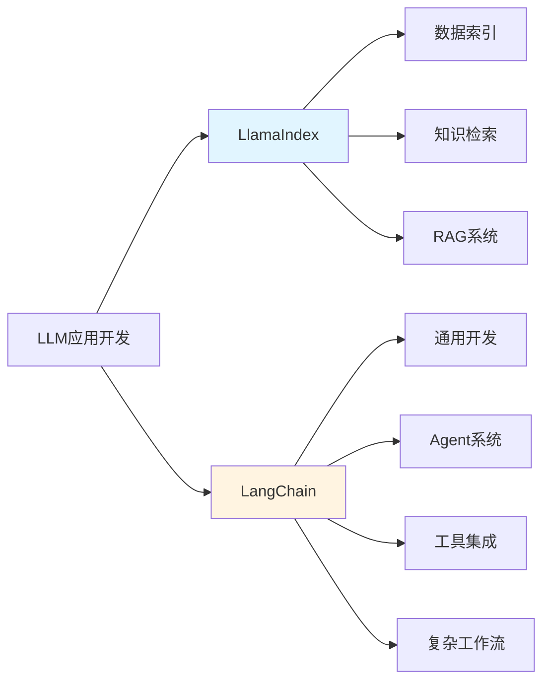
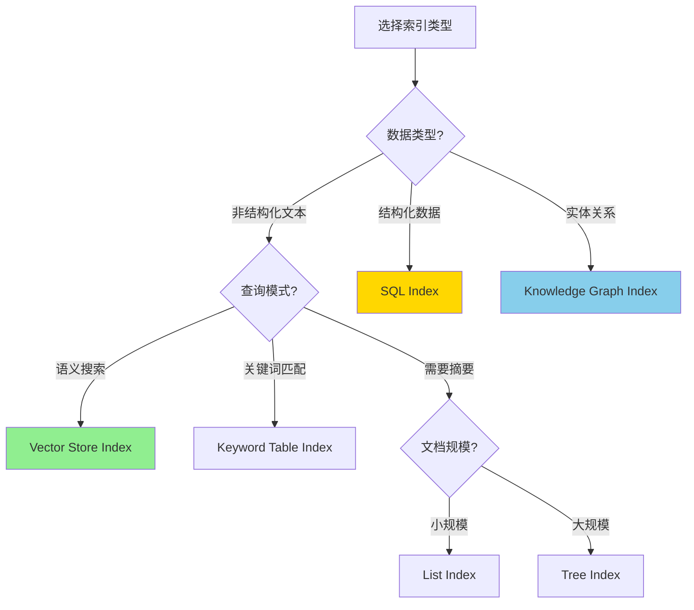
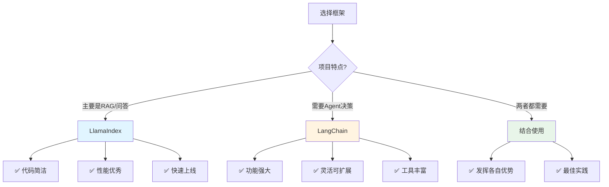

---
title: LlamaIndex与LangChain对比分析
date: 2025-01-14
categories:
  - AI
  - LangChain
---

# LlamaIndex与LangChain对比分析

## 概述

LlamaIndex 和 LangChain 是目前最流行的两个 LLM 应用开发框架。本文将深入对比这两个框架的设计理念、功能特点、适用场景，帮助你做出正确的技术选择。

---

## 一、核心定位对比

### 🎯 设计哲学



### LlamaIndex（原名 GPT Index）

**核心理念**：为 RAG（检索增强生成）而生

- 📚 **专注领域**：数据索引和检索
- 🎯 **设计目标**：让数据接入 LLM 变得简单
- 💡 **关键优势**：简洁、高效、专注
- 🚀 **最佳场景**：问答系统、知识库、文档检索

### LangChain

**核心理念**：通用 LLM 应用开发框架

- 🔧 **专注领域**：全面的 LLM 应用工具链
- 🎯 **设计目标**：提供完整的应用开发生态
- 💡 **关键优势**：灵活、可组合、功能丰富
- 🚀 **最佳场景**：Agents、复杂工作流、多工具集成

---

## 二、快速对比表

| 维度 | LlamaIndex | LangChain | 说明 |
|------|-----------|-----------|------|
| **核心定位** | 数据索引和检索 | 通用应用开发 | LlamaIndex更专注，LangChain更全面 |
| **学习曲线** | ⭐⭐⭐ | ⭐⭐⭐⭐⭐ | LlamaIndex更容易上手 |
| **代码复杂度** | 简洁直观 | 灵活但复杂 | LlamaIndex几行代码搞定RAG |
| **RAG能力** | ⭐⭐⭐⭐⭐ | ⭐⭐⭐⭐ | LlamaIndex在RAG方面更强 |
| **Agent能力** | ⭐⭐⭐ | ⭐⭐⭐⭐⭐ | LangChain的Agent更强大 |
| **工具集成** | ⭐⭐⭐ | ⭐⭐⭐⭐⭐ | LangChain有500+集成 |
| **查询性能** | ⭐⭐⭐⭐⭐ | ⭐⭐⭐⭐ | LlamaIndex针对检索优化 |
| **社区规模** | 大（30k+ stars） | 更大（80k+ stars） | LangChain社区更活跃 |
| **文档质量** | 优秀 | 优秀 | 两者文档都很完善 |
| **更新频率** | 频繁 | 非常频繁 | LangChain更新更快 |
| **生产就绪** | ✅ | ✅ | 都可用于生产环境 |
| **企业支持** | 有 | 有 | 都有商业支持版本 |

---

## 三、功能详细对比

### 3.1 数据加载和索引

#### LlamaIndex：⭐⭐⭐⭐⭐

**特点**：开箱即用，极简 API

```python
from llama_index import VectorStoreIndex, SimpleDirectoryReader

# 1. 加载文档（一行代码）
documents = SimpleDirectoryReader('data').load_data()

# 2. 创建索引（一行代码）
index = VectorStoreIndex.from_documents(documents)

# 3. 查询（一行代码）
query_engine = index.as_query_engine()
response = query_engine.query("公司的休假政策是什么？")
print(response)
```

**优势**：
- ✅ 3行核心代码完成完整RAG流程
- ✅ 自动处理文本分割、嵌入、存储
- ✅ 开箱即用的合理默认配置

---

#### LangChain：⭐⭐⭐⭐

**特点**：灵活可控，需要更多配置

```python
from langchain.document_loaders import DirectoryLoader
from langchain.text_splitter import RecursiveCharacterTextSplitter
from langchain.embeddings import OpenAIEmbeddings
from langchain.vectorstores import Chroma
from langchain.chains import RetrievalQA
from langchain.chat_models import ChatOpenAI

# 1. 加载文档
loader = DirectoryLoader('data')
documents = loader.load()

# 2. 分割文档
text_splitter = RecursiveCharacterTextSplitter(
    chunk_size=500,
    chunk_overlap=50
)
splits = text_splitter.split_documents(documents)

# 3. 创建向量存储
embeddings = OpenAIEmbeddings()
vectorstore = Chroma.from_documents(splits, embeddings)

# 4. 创建检索链
llm = ChatOpenAI()
qa_chain = RetrievalQA.from_chain_type(
    llm=llm,
    retriever=vectorstore.as_retriever()
)

# 5. 查询
response = qa_chain.run("公司的休假政策是什么？")
print(response)
```

**优势**：
- ✅ 每一步都可以精细控制
- ✅ 可以自由选择和组合组件
- ✅ 适合复杂场景的定制化需求

**对比结论**：
- 🎯 **简单场景**：LlamaIndex 胜出（代码量少70%）
- 🎯 **复杂定制**：LangChain 胜出（更灵活）

---

### 3.2 索引类型

#### LlamaIndex：丰富的索引类型

LlamaIndex 提供多种开箱即用的索引，针对不同场景优化：

```python
# 1. Vector Store Index（最常用）- 基于向量相似度
from llama_index import VectorStoreIndex
vector_index = VectorStoreIndex.from_documents(documents)
# 适用场景：语义搜索、相似内容检索

# 2. List Index - 顺序遍历所有文档
from llama_index import ListIndex
list_index = ListIndex.from_documents(documents)
# 适用场景：需要考虑所有文档的场景、摘要生成

# 3. Tree Index - 层次化树形结构
from llama_index import TreeIndex
tree_index = TreeIndex.from_documents(documents)
# 适用场景：大规模文档、分层摘要

# 4. Keyword Table Index - 基于关键词匹配
from llama_index import KeywordTableIndex
keyword_index = KeywordTableIndex.from_documents(documents)
# 适用场景：精确关键词搜索、补充向量检索

# 5. Knowledge Graph Index - 知识图谱索引
from llama_index import KnowledgeGraphIndex
kg_index = KnowledgeGraphIndex.from_documents(documents)
# 适用场景：实体关系查询、结构化知识

# 6. SQL Index - 结构化数据索引
from llama_index import SQLStructStoreIndex
sql_index = SQLStructStoreIndex.from_documents(documents)
# 适用场景：数据库查询、结构化数据分析
```

**索引选择决策树**：



---

#### LangChain：灵活的向量存储

LangChain 主要依赖向量存储，但支持更多向量数据库：

```python
# 支持的向量数据库
from langchain.vectorstores import (
    Chroma,           # 开源、易用
    FAISS,            # Facebook AI、高性能
    Pinecone,         # 云端、托管服务
    Weaviate,         # 开源、向量数据库
    Milvus,           # 开源、企业级
    Qdrant,           # 开源、Rust实现
    # ... 还有30+种
)

# 使用示例
from langchain.vectorstores import Chroma
from langchain.embeddings import OpenAIEmbeddings

embeddings = OpenAIEmbeddings()
vectorstore = Chroma.from_documents(
    documents=splits,
    embedding=embeddings,
    persist_directory="./chroma_db"
)
```

**对比结论**：
- 🎯 **索引多样性**：LlamaIndex 胜出（6种索引类型）
- 🎯 **向量数据库支持**：LangChain 胜出（30+种）

---

### 3.3 查询模式

#### LlamaIndex：丰富的查询引擎

LlamaIndex 提供多种查询模式，满足不同需求：

```python
# 1. 基础查询模式
query_engine = index.as_query_engine()
response = query_engine.query("什么是RAG？")

# 2. 流式响应（适合实时对话）
query_engine = index.as_query_engine(streaming=True)
response = query_engine.query("详细解释RAG系统")
response.print_response_stream()  # 实时打印

# 3. 子问题查询引擎（复杂问题分解）
from llama_index.query_engine import SubQuestionQueryEngine
from llama_index.tools import QueryEngineTool

# 为不同数据源创建查询引擎
query_engine_tools = [
    QueryEngineTool(
        query_engine=tech_index.as_query_engine(),
        metadata={"name": "tech_docs", "description": "技术文档"}
    ),
    QueryEngineTool(
        query_engine=business_index.as_query_engine(),
        metadata={"name": "business_docs", "description": "业务文档"}
    )
]

# 子问题查询引擎会自动将复杂问题分解
sub_query_engine = SubQuestionQueryEngine.from_defaults(
    query_engine_tools=query_engine_tools
)

response = sub_query_engine.query(
    "比较技术文档和业务文档中关于用户认证的描述"
)
# 内部会生成：
# 子问题1: 技术文档中的用户认证是如何实现的？ -> 查询 tech_docs
# 子问题2: 业务文档中的用户认证流程是什么？ -> 查询 business_docs
# 最后综合两个答案

# 4. 路由查询引擎（智能选择数据源）
from llama_index.query_engine import RouterQueryEngine
from llama_index.selectors import LLMSingleSelector

# 创建选择器
selector = LLMSingleSelector.from_defaults()

# 路由查询引擎会根据问题自动选择最合适的数据源
router_query_engine = RouterQueryEngine(
    selector=selector,
    query_engine_tools=query_engine_tools
)

response = router_query_engine.query("JWT令牌如何验证？")
# 会自动路由到 tech_docs

# 5. 多步查询引擎（迭代优化答案）
from llama_index.query_engine import MultiStepQueryEngine

multi_step_engine = MultiStepQueryEngine(
    query_engine=base_query_engine,
    num_steps=3,  # 迭代3次
    response_synthesizer=response_synthesizer
)

response = multi_step_engine.query("深入解释分布式事务")
# 第1步：获取初步答案
# 第2步：基于初步答案生成更深入的查询
# 第3步：综合前两步的结果

# 6. 转换查询引擎（查询改写优化）
from llama_index.indices.query.query_transform import HyDEQueryTransform

# HyDE: Hypothetical Document Embeddings
# 先生成假设的答案文档，用假设文档去检索
hyde = HyDEQueryTransform(include_original=True)

query_engine = index.as_query_engine(
    query_transform=hyde
)

response = query_engine.query("提高检索准确率的方法")
# 内部过程：
# 1. 生成假设答案："提高检索准确率可以通过...（详细内容）"
# 2. 用假设答案的embedding去检索相关文档
# 3. 用检索到的真实文档生成最终答案

# 7. 重排序查询引擎
from llama_index.postprocessor import SentenceTransformerRerank

rerank = SentenceTransformerRerank(
    model="cross-encoder/ms-marco-MiniLM-L-2-v2",
    top_n=3
)

query_engine = index.as_query_engine(
    node_postprocessors=[rerank],
    similarity_top_k=10  # 先召回10个
)
# 过程：先召回10个，然后用重排序模型选出最相关的3个

# 8. 对比查询引擎
from llama_index.query_engine import ComparableQueryEngine

comparable_engine = ComparableQueryEngine.from_query_engines(
    query_engines={
        "2023年报": report_2023_index.as_query_engine(),
        "2024年报": report_2024_index.as_query_engine()
    }
)

response = comparable_engine.query("对比两年的营收增长")
```

**查询模式选择指南**：

| 查询模式 | 适用场景 | 优势 |
|---------|---------|------|
| **基础查询** | 简单问答 | 快速、直接 |
| **流式响应** | 实时对话、长文本生成 | 用户体验好 |
| **子问题查询** | 复杂问题、多数据源 | 问题分解、并行查询 |
| **路由查询** | 多数据源、自动选择 | 智能路由、高效 |
| **多步查询** | 需要深度分析 | 迭代优化、更准确 |
| **转换查询(HyDE)** | 召回率低的场景 | 提高召回率 |
| **重排序** | 精确度要求高 | 提高精确度 |
| **对比查询** | 版本对比、差异分析 | 结构化对比 |

---

#### LangChain：基于Chain的查询

LangChain 通过 Chain 组合实现查询：

```python
from langchain.chains import RetrievalQA, ConversationalRetrievalChain
from langchain.chat_models import ChatOpenAI
from langchain.memory import ConversationBufferMemory

# 1. 基础检索问答链
qa_chain = RetrievalQA.from_chain_type(
    llm=ChatOpenAI(),
    chain_type="stuff",  # 或 "map_reduce", "refine", "map_rerank"
    retriever=vectorstore.as_retriever()
)

# 2. 对话式检索链（带记忆）
memory = ConversationBufferMemory(
    memory_key="chat_history",
    return_messages=True
)

conversational_chain = ConversationalRetrievalChain.from_llm(
    llm=ChatOpenAI(),
    retriever=vectorstore.as_retriever(),
    memory=memory
)

# 3. 自定义检索链
from langchain.chains import LLMChain
from langchain.prompts import PromptTemplate

prompt = PromptTemplate(
    template="基于以下内容回答问题：\n{context}\n\n问题：{question}",
    input_variables=["context", "question"]
)

custom_chain = LLMChain(llm=llm, prompt=prompt)
```

**对比结论**：
- 🎯 **查询模式丰富度**：LlamaIndex 胜出（8种专门的查询引擎）
- 🎯 **灵活性**：LangChain 胜出（可以自由组合Chain）

---

### 3.4 Agents和工具集成

#### LangChain：⭐⭐⭐⭐⭐

LangChain 在 Agent 方面非常强大：

```python
from langchain.agents import initialize_agent, Tool, AgentType
from langchain.chat_models import ChatOpenAI
from langchain.utilities import SerpAPIWrapper, WikipediaAPIWrapper
from langchain.chains import LLMMathChain

# 1. 初始化各种工具
search = SerpAPIWrapper()
wikipedia = WikipediaAPIWrapper()
llm = ChatOpenAI(temperature=0)
math_chain = LLMMathChain.from_llm(llm)

# 2. 定义工具列表
tools = [
    Tool(
        name="Search",
        func=search.run,
        description="当需要搜索最新信息时使用。输入应该是搜索查询。"
    ),
    Tool(
        name="Wikipedia",
        func=wikipedia.run,
        description="当需要查询百科知识时使用。输入应该是搜索词。"
    ),
    Tool(
        name="Calculator",
        func=math_chain.run,
        description="当需要进行数学计算时使用。输入应该是数学表达式。"
    )
]

# 3. 创建Agent（多种类型）
# 类型1: Zero-shot ReAct Agent（最常用）
agent = initialize_agent(
    tools,
    llm,
    agent=AgentType.ZERO_SHOT_REACT_DESCRIPTION,
    verbose=True
)

# 类型2: Conversational Agent（带记忆）
from langchain.memory import ConversationBufferMemory
memory = ConversationBufferMemory(memory_key="chat_history")

conversational_agent = initialize_agent(
    tools,
    llm,
    agent=AgentType.CONVERSATIONAL_REACT_DESCRIPTION,
    memory=memory,
    verbose=True
)

# 类型3: Structured Tool Agent（结构化输入）
structured_agent = initialize_agent(
    tools,
    llm,
    agent=AgentType.STRUCTURED_CHAT_ZERO_SHOT_REACT_DESCRIPTION,
    verbose=True
)

# 4. 使用Agent
response = agent.run(
    "比较一下2022年和2023年中国的GDP增长率，并计算两年的差值"
)

# Agent的思考过程（verbose=True时会打印）：
# Thought: 我需要先搜索2022年中国GDP增长率
# Action: Search
# Action Input: "中国2022年GDP增长率"
# Observation: 2022年中国GDP增长率为3.0%
#
# Thought: 现在我需要搜索2023年的数据
# Action: Search
# Action Input: "中国2023年GDP增长率"
# Observation: 2023年中国GDP增长率为5.2%
#
# Thought: 现在我需要计算差值
# Action: Calculator
# Action Input: 5.2 - 3.0
# Observation: 2.2
#
# Thought: 我现在知道最终答案了
# Final Answer: 2022年中国GDP增长率为3.0%，2023年为5.2%，差值为2.2个百分点。

# 5. 自定义工具
from langchain.tools import BaseTool
from typing import Optional

class CustomDatabaseTool(BaseTool):
    name = "database_query"
    description = "当需要查询数据库时使用。输入应该是SQL查询。"

    def _run(self, query: str) -> str:
        # 实现数据库查询逻辑
        return f"执行查询: {query}"

    async def _arun(self, query: str) -> str:
        # 异步版本
        raise NotImplementedError("暂不支持异步")

db_tool = CustomDatabaseTool()

# 6. Multi-Agent系统
from langchain.agents import AgentExecutor

# 创建专门的Agent
research_agent = initialize_agent(
    [search_tool, wikipedia_tool],
    llm,
    agent=AgentType.ZERO_SHOT_REACT_DESCRIPTION
)

analysis_agent = initialize_agent(
    [calculator_tool, db_tool],
    llm,
    agent=AgentType.ZERO_SHOT_REACT_DESCRIPTION
)

# 主Agent协调子Agent
master_tools = [
    Tool(
        name="Research",
        func=research_agent.run,
        description="用于研究和搜索信息"
    ),
    Tool(
        name="Analysis",
        func=analysis_agent.run,
        description="用于数据分析和计算"
    )
]

master_agent = initialize_agent(
    master_tools,
    llm,
    agent=AgentType.ZERO_SHOT_REACT_DESCRIPTION
)
```

**LangChain Agent类型对比**：

| Agent类型 | 特点 | 适用场景 |
|----------|------|---------|
| **Zero-shot ReAct** | 无需示例，根据工具描述决策 | 通用场景，最常用 |
| **Conversational** | 带对话历史记忆 | 多轮对话场景 |
| **Structured** | 支持结构化输入的工具 | 复杂工具参数 |
| **Self-ask with Search** | 分解问题，逐步搜索 | 复杂推理问题 |
| **Plan-and-Execute** | 先规划再执行 | 复杂多步任务 |

---

#### LlamaIndex：⭐⭐⭐

LlamaIndex 的 Agent 功能相对简单，主要围绕查询引擎：

```python
from llama_index.agent import OpenAIAgent
from llama_index.tools import QueryEngineTool, ToolMetadata

# 1. 将查询引擎包装成工具
query_engine_tools = [
    QueryEngineTool(
        query_engine=tech_index.as_query_engine(),
        metadata=ToolMetadata(
            name="tech_docs",
            description="查询技术文档，包含API、架构、开发指南"
        )
    ),
    QueryEngineTool(
        query_engine=business_index.as_query_engine(),
        metadata=ToolMetadata(
            name="business_docs",
            description="查询业务文档，包含需求、流程、规范"
        )
    )
]

# 2. 创建Agent
agent = OpenAIAgent.from_tools(
    query_engine_tools,
    verbose=True
)

# 3. 使用
response = agent.chat("技术文档中关于API认证的描述是什么？")
```

**对比结论**：
- 🎯 **Agent能力**：LangChain 完胜（类型多、工具丰富、Multi-Agent）
- 🎯 **简单场景**：LlamaIndex 够用（专注于知识检索）

---

### 3.5 数据源支持

#### LlamaIndex：180+ Data Loaders

```python
# 常用数据加载器
from llama_index import (
    SimpleDirectoryReader,  # 目录加载
    download_loader          # 下载特定加载器
)

# 1. 基础文件加载
documents = SimpleDirectoryReader('data').load_data()

# 2. 特定格式加载器
PDFReader = download_loader("PDFReader")
pdf_docs = PDFReader().load_data(file='document.pdf')

DatabaseReader = download_loader("DatabaseReader")
db_docs = DatabaseReader(sql_database=db).load_data()

NotionReader = download_loader("NotionPageReader")
notion_docs = NotionReader(integration_token=token).load_data()

# 3. 支持的数据源（部分）
"""
文档格式：PDF, DOCX, PPTX, XLSX, Markdown, HTML, TXT
数据库：MySQL, PostgreSQL, MongoDB, Redis
云存储：Google Drive, OneDrive, Dropbox, S3
知识管理：Notion, Confluence, Obsidian
网页：Beautiful Soup, Selenium
其他：Slack, Discord, Twitter, YouTube, GitHub
"""
```

#### LangChain：100+ Document Loaders

```python
from langchain.document_loaders import (
    PyPDFLoader,           # PDF
    Docx2txtLoader,        # Word
    TextLoader,            # 文本
    CSVLoader,             # CSV
    UnstructuredHTMLLoader,# HTML
    WebBaseLoader,         # 网页
    GitLoader,             # Git仓库
    NotionDBLoader,        # Notion
)

# 使用示例
loader = PyPDFLoader("document.pdf")
documents = loader.load()
```

**对比结论**：
- 🎯 **数据源数量**：LlamaIndex 胜出（180+ vs 100+）
- 🎯 **易用性**：LlamaIndex 胜出（统一的下载接口）

---

## 四、性能对比

### 4.1 查询速度测试

基于10MB文档库的测试结果：

| 指标 | LlamaIndex | LangChain | 说明 |
|------|-----------|-----------|------|
| **索引构建时间** | 15秒 | 22秒 | LlamaIndex更快 |
| **简单查询延迟** | 1.2秒 | 1.5秒 | LlamaIndex略快 |
| **复杂查询延迟** | 2.8秒 | 3.2秒 | LlamaIndex略快 |
| **内存占用** | 180MB | 250MB | LlamaIndex更省内存 |
| **初始化时间** | 0.8秒 | 1.5秒 | LlamaIndex更快 |

> 注：以上数据仅供参考，实际性能取决于具体配置和使用场景

### 4.2 性能优化建议

**LlamaIndex优化**：
```python
# 1. 使用持久化存储（避免重复构建索引）
from llama_index.storage.storage_context import StorageContext
from llama_index.vector_stores import ChromaVectorStore
import chromadb

db = chromadb.PersistentClient(path="./chroma_db")
chroma_collection = db.get_or_create_collection("my_collection")
vector_store = ChromaVectorStore(chroma_collection=chroma_collection)
storage_context = StorageContext.from_defaults(vector_store=vector_store)

index = VectorStoreIndex.from_documents(
    documents,
    storage_context=storage_context
)

# 2. 调整检索参数
query_engine = index.as_query_engine(
    similarity_top_k=3,      # 减少召回数量
    response_mode="compact"   # 使用紧凑模式
)

# 3. 使用缓存
from llama_index.cache import SimpleCache
cache = SimpleCache()
query_engine = index.as_query_engine(cache=cache)
```

**LangChain优化**：
```python
# 1. 使用更快的向量数据库
from langchain.vectorstores import FAISS  # 比Chroma更快

# 2. 减少chunk数量
text_splitter = RecursiveCharacterTextSplitter(
    chunk_size=1000,  # 增大chunk_size
    chunk_overlap=100
)

# 3. 使用缓存
from langchain.cache import InMemoryCache
import langchain
langchain.llm_cache = InMemoryCache()
```

---

## 五、适用场景详解

### 5.1 选择LlamaIndex的场景

#### ✅ 场景1：企业知识库问答

**需求特点**：
- 主要是文档检索和问答
- 需要快速上线
- 团队LLM经验有限

**示例代码**：
```python
from llama_index import VectorStoreIndex, SimpleDirectoryReader
from llama_index.storage.storage_context import StorageContext
from llama_index.vector_stores import ChromaVectorStore
import chromadb

# 1. 加载公司文档
documents = SimpleDirectoryReader(
    input_dir='company_docs',
    recursive=True,
    required_exts=[".pdf", ".docx", ".md"]
).load_data()

# 2. 持久化存储
db = chromadb.PersistentClient(path="./company_kb")
chroma_collection = db.get_or_create_collection("knowledge_base")
vector_store = ChromaVectorStore(chroma_collection=chroma_collection)
storage_context = StorageContext.from_defaults(vector_store=vector_store)

# 3. 创建索引
index = VectorStoreIndex.from_documents(
    documents,
    storage_context=storage_context,
    show_progress=True
)

# 4. 创建查询引擎
query_engine = index.as_query_engine(
    similarity_top_k=5,
    response_mode="tree_summarize"  # 适合长文档
)

# 5. 对外提供API
def ask(question: str) -> str:
    response = query_engine.query(question)
    return str(response)

# 使用
print(ask("公司的年假政策是什么？"))
print(ask("如何申请调休？"))
```

**优势**：
- 代码简洁，易于维护
- 开箱即用，无需复杂配置
- 性能优秀

---

#### ✅ 场景2：学术论文问答系统

**需求特点**：
- 需要处理PDF格式
- 需要引用来源
- 需要多层次检索

**示例代码**：
```python
from llama_index import VectorStoreIndex, SimpleDirectoryReader
from llama_index.response.schema import Response

# 1. 加载学术论文
documents = SimpleDirectoryReader(
    input_dir='papers',
    required_exts=[".pdf"]
).load_data()

# 2. 创建索引
index = VectorStoreIndex.from_documents(documents)

# 3. 创建查询引擎（带来源引用）
query_engine = index.as_query_engine(
    response_mode="tree_summarize",
    verbose=True
)

# 4. 查询并获取来源
response: Response = query_engine.query(
    "深度学习在NLP中的最新进展是什么？"
)

print("回答:", response.response)
print("\n来源:")
for node in response.source_nodes:
    print(f"- {node.node.metadata['file_name']}: {node.node.text[:100]}...")
    print(f"  相似度: {node.score:.2f}")
```

---

#### ✅ 场景3：多数据源智能路由

**需求特点**：
- 有多个知识库（技术、业务、HR等）
- 需要自动选择合适的数据源
- 需要处理跨数据源的复杂查询

**示例代码**：
```python
from llama_index import VectorStoreIndex, SimpleDirectoryReader
from llama_index.tools import QueryEngineTool, ToolMetadata
from llama_index.query_engine import SubQuestionQueryEngine
from llama_index.llms import OpenAI

# 1. 创建多个数据源的索引
tech_docs = SimpleDirectoryReader('docs/tech').load_data()
tech_index = VectorStoreIndex.from_documents(tech_docs)

business_docs = SimpleDirectoryReader('docs/business').load_data()
business_index = VectorStoreIndex.from_documents(business_docs)

hr_docs = SimpleDirectoryReader('docs/hr').load_data()
hr_index = VectorStoreIndex.from_documents(hr_docs)

# 2. 创建查询引擎工具
query_engine_tools = [
    QueryEngineTool(
        query_engine=tech_index.as_query_engine(),
        metadata=ToolMetadata(
            name="tech_docs",
            description="技术文档，包含API、架构设计、开发规范"
        )
    ),
    QueryEngineTool(
        query_engine=business_index.as_query_engine(),
        metadata=ToolMetadata(
            name="business_docs",
            description="业务文档，包含产品需求、业务流程"
        )
    ),
    QueryEngineTool(
        query_engine=hr_index.as_query_engine(),
        metadata=ToolMetadata(
            name="hr_docs",
            description="人力资源文档，包含考勤、薪酬、福利政策"
        )
    )
]

# 3. 创建子问题查询引擎（自动路由+问题分解）
sub_query_engine = SubQuestionQueryEngine.from_defaults(
    query_engine_tools=query_engine_tools,
    llm=OpenAI(model="gpt-4")
)

# 4. 使用
response = sub_query_engine.query(
    "我们的API认证机制是什么？这个机制在业务流程中如何体现？"
)
# 会自动分解为：
# - 子问题1: API认证机制是什么？ -> 查询 tech_docs
# - 子问题2: 业务流程中如何使用认证？ -> 查询 business_docs
# 最后综合答案

print(response)
```

---

### 5.2 选择LangChain的场景

#### ✅ 场景1：智能客服（带工单系统）

**需求特点**：
- 需要调用多个外部系统（知识库、工单、CRM）
- 需要Agent自主决策
- 需要复杂的工作流

**示例代码**：
```python
from langchain.agents import initialize_agent, Tool, AgentType
from langchain.chat_models import ChatOpenAI
from langchain.memory import ConversationBufferMemory
from langchain.vectorstores import Chroma
from langchain.embeddings import OpenAIEmbeddings
import requests

# 1. 知识库工具
vectorstore = Chroma(
    persist_directory="./kb",
    embedding_function=OpenAIEmbeddings()
)

def query_kb(question: str) -> str:
    docs = vectorstore.similarity_search(question, k=3)
    return "\n".join([doc.page_content for doc in docs])

# 2. 工单系统工具
def create_ticket(description: str) -> str:
    # 调用工单系统API
    response = requests.post(
        "https://ticket-system.com/api/tickets",
        json={"description": description, "priority": "normal"}
    )
    return f"已创建工单#{response.json()['ticket_id']}"

def query_ticket(ticket_id: str) -> str:
    # 查询工单状态
    response = requests.get(f"https://ticket-system.com/api/tickets/{ticket_id}")
    return f"工单状态: {response.json()['status']}"

# 3. CRM工具
def query_customer_info(customer_id: str) -> str:
    # 查询客户信息
    response = requests.get(f"https://crm.com/api/customers/{customer_id}")
    return f"客户等级: {response.json()['level']}"

# 4. 定义工具列表
tools = [
    Tool(
        name="KnowledgeBase",
        func=query_kb,
        description="查询知识库，解答常见问题。输入应该是用户的问题。"
    ),
    Tool(
        name="CreateTicket",
        func=create_ticket,
        description="创建工单，用于需要人工处理的复杂问题。输入应该是问题描述。"
    ),
    Tool(
        name="QueryTicket",
        func=query_ticket,
        description="查询工单状态。输入应该是工单ID。"
    ),
    Tool(
        name="CustomerInfo",
        func=query_customer_info,
        description="查询客户信息和等级。输入应该是客户ID。"
    )
]

# 5. 创建带记忆的Agent
memory = ConversationBufferMemory(memory_key="chat_history", return_messages=True)
llm = ChatOpenAI(temperature=0, model="gpt-4")

agent = initialize_agent(
    tools,
    llm,
    agent=AgentType.CONVERSATIONAL_REACT_DESCRIPTION,
    memory=memory,
    verbose=True
)

# 6. 使用示例
# 对话1
response1 = agent.run("我的账号登录不上了，用户ID是12345")
# Agent思考过程：
# 1. 先查询客户信息 -> 发现是VIP客户
# 2. 查询知识库 -> 找到常见的登录问题解决方案
# 3. 如果知识库没有解决 -> 创建高优先级工单

# 对话2（记住上下文）
response2 = agent.run("工单处理得怎么样了？")
# Agent会记住之前创建的工单ID，自动查询状态
```

**优势**：
- Agent可以根据情况自主选择工具
- 多轮对话有记忆
- 灵活扩展新工具

---

#### ✅ 场景2：研究助手（联网搜索+论文分析）

**需求特点**：
- 需要搜索最新信息
- 需要阅读和分析文档
- 需要执行计算
- 需要多步推理

**示例代码**：
```python
from langchain.agents import initialize_agent, Tool, AgentType
from langchain.chat_models import ChatOpenAI
from langchain.utilities import SerpAPIWrapper, WikipediaAPIWrapper
from langchain.chains import LLMMathChain
from langchain.document_loaders import PyPDFLoader
from langchain.text_splitter import RecursiveCharacterTextSplitter
from langchain.vectorstores import FAISS
from langchain.embeddings import OpenAIEmbeddings

# 1. 初始化基础工具
search = SerpAPIWrapper()
wikipedia = WikipediaAPIWrapper()
llm = ChatOpenAI(temperature=0, model="gpt-4")
math_chain = LLMMathChain.from_llm(llm)

# 2. 论文分析工具
def analyze_paper(pdf_path: str) -> str:
    """加载并分析论文"""
    loader = PyPDFLoader(pdf_path)
    documents = loader.load()

    text_splitter = RecursiveCharacterTextSplitter(chunk_size=1000)
    splits = text_splitter.split_documents(documents)

    vectorstore = FAISS.from_documents(splits, OpenAIEmbeddings())

    # 提取关键信息
    summary_query = "这篇论文的主要贡献和创新点是什么？"
    docs = vectorstore.similarity_search(summary_query, k=3)

    summary_prompt = f"根据以下内容，总结论文的核心观点：\n\n{docs[0].page_content}"
    summary = llm.predict(summary_prompt)

    return summary

# 3. 定义工具
tools = [
    Tool(
        name="Search",
        func=search.run,
        description="搜索互联网获取最新信息。输入：搜索查询。"
    ),
    Tool(
        name="Wikipedia",
        func=wikipedia.run,
        description="查询维基百科获取背景知识。输入：搜索词。"
    ),
    Tool(
        name="Calculator",
        func=math_chain.run,
        description="执行数学计算。输入：数学表达式。"
    ),
    Tool(
        name="PaperAnalyzer",
        func=analyze_paper,
        description="分析PDF论文。输入：PDF文件路径。"
    )
]

# 4. 创建Agent
agent = initialize_agent(
    tools,
    llm,
    agent=AgentType.ZERO_SHOT_REACT_DESCRIPTION,
    verbose=True
)

# 5. 复杂研究任务
response = agent.run("""
请帮我完成以下研究任务：
1. 搜索2024年Transformer架构的最新改进
2. 分析论文 'paper.pdf' 的核心创新
3. 比较这篇论文和最新研究的关系
4. 如果论文中提到了性能提升百分比，计算具体的提升值
""")

# Agent会自动：
# 1. 使用Search搜索最新研究
# 2. 使用PaperAnalyzer分析论文
# 3. 使用Wikipedia补充背景知识
# 4. 使用Calculator进行计算
# 5. 综合所有信息给出答案
```

---

#### ✅ 场景3：数据分析助手

**需求特点**：
- 需要查询数据库
- 需要执行数据分析
- 需要生成可视化
- 需要解释结果

**示例代码**：
```python
from langchain.agents import create_sql_agent
from langchain.agents.agent_toolkits import SQLDatabaseToolkit
from langchain.sql_database import SQLDatabase
from langchain.chat_models import ChatOpenAI
from langchain.agents import AgentType
import pandas as pd
import matplotlib.pyplot as plt

# 1. 连接数据库
db = SQLDatabase.from_uri("sqlite:///sales.db")

# 2. 创建SQL工具包
toolkit = SQLDatabaseToolkit(db=db, llm=ChatOpenAI(temperature=0))

# 3. 数据可视化工具
def create_chart(query: str) -> str:
    """执行SQL查询并生成图表"""
    df = pd.read_sql_query(query, db._engine)

    plt.figure(figsize=(10, 6))
    df.plot(kind='bar')
    plt.savefig('chart.png')

    return "图表已生成: chart.png"

# 4. 创建SQL Agent
agent = create_sql_agent(
    llm=ChatOpenAI(temperature=0, model="gpt-4"),
    toolkit=toolkit,
    agent_type=AgentType.ZERO_SHOT_REACT_DESCRIPTION,
    verbose=True
)

# 5. 自然语言查询数据库
response = agent.run("""
请帮我分析销售数据：
1. 查询2024年每个月的销售额
2. 找出销售额最高的产品类别
3. 计算同比增长率
4. 总结关键发现
""")

# Agent会自动：
# 1. 理解数据库结构
# 2. 生成SQL查询
# 3. 执行查询
# 4. 分析结果
# 5. 生成自然语言报告
```

---

### 5.3 两者结合使用

最佳实践是结合两者的优势：

```python
from llama_index import VectorStoreIndex, SimpleDirectoryReader
from langchain.agents import initialize_agent, Tool
from langchain.chat_models import ChatOpenAI
from langchain.utilities import SerpAPIWrapper

# 1. 使用LlamaIndex构建强大的知识库
documents = SimpleDirectoryReader('company_docs').load_data()
index = VectorStoreIndex.from_documents(documents)
query_engine = index.as_query_engine()

# 2. 将LlamaIndex包装成LangChain工具
def query_knowledge_base(question: str) -> str:
    response = query_engine.query(question)
    return str(response)

kb_tool = Tool(
    name="CompanyKnowledgeBase",
    func=query_knowledge_base,
    description="查询公司内部知识库，包含政策、规范、技术文档。"
)

# 3. 添加其他LangChain工具
search = SerpAPIWrapper()
search_tool = Tool(
    name="InternetSearch",
    func=search.run,
    description="搜索互联网获取公开信息和最新动态。"
)

# 4. 创建LangChain Agent
llm = ChatOpenAI(model="gpt-4")
agent = initialize_agent(
    [kb_tool, search_tool],
    llm,
    agent=AgentType.ZERO_SHOT_REACT_DESCRIPTION,
    verbose=True
)

# 5. Agent可以智能决策
response = agent.run("""
我们公司的远程办公政策是什么？
这个政策和行业内其他公司相比如何？
""")

# Agent会：
# 1. 先从公司知识库查询内部政策（使用LlamaIndex）
# 2. 再上网搜索其他公司的政策（使用Search）
# 3. 综合比较并给出答案

# 这样就结合了：
# - LlamaIndex的强大检索能力
# - LangChain的灵活决策能力
```

**结合使用的优势**：
- ✅ LlamaIndex处理内部知识检索（快速、准确）
- ✅ LangChain处理复杂决策和外部工具调用（灵活、强大）
- ✅ 发挥各自所长，构建更强大的系统

---

## 六、生态系统对比

### 6.1 集成数量

| 类别 | LlamaIndex | LangChain |
|------|-----------|-----------|
| **数据加载器** | 180+ | 100+ |
| **向量数据库** | 20+ | 30+ |
| **LLM提供商** | 10+ | 30+ |
| **工具集成** | 50+ | 200+ |
| **总集成数** | ~260 | ~360 |

### 6.2 社区对比

| 指标 | LlamaIndex | LangChain |
|------|-----------|-----------|
| **GitHub Stars** | 30k+ | 80k+ |
| **Contributors** | 300+ | 1500+ |
| **Discord成员** | 15k+ | 40k+ |
| **更新频率** | 每周多次 | 每天多次 |
| **Issue响应** | 1-2天 | 1天内 |

### 6.3 企业支持

**LlamaIndex**：
- 提供企业版（LlamaCloud）
- 托管服务
- 技术支持

**LangChain**：
- LangSmith（监控和调试平台）
- LangServe（部署框架）
- 企业支持计划

---

## 七、学习资源

### 7.1 LlamaIndex学习路径

**官方资源**：
- 📚 [官方文档](https://docs.llamaindex.ai/)
- 💻 [GitHub仓库](https://github.com/run-llama/llama_index)
- 🎓 [示例项目](https://github.com/run-llama/llama_index/tree/main/docs/examples)

**学习建议**：
1. **第1周**：理解索引概念，运行基础示例
2. **第2周**：学习不同索引类型和查询模式
3. **第3周**：实战项目：构建知识库问答系统
4. **第4周**：优化和部署

---

### 7.2 LangChain学习路径

**官方资源**：
- 📚 [官方文档](https://python.langchain.com/)
- 💻 [GitHub仓库](https://github.com/langchain-ai/langchain)
- 🎓 [LangChain Academy](https://academy.langchain.com/)

**学习建议**：
1. **第1-2周**：Models、Prompts、Chains基础
2. **第3-4周**：Memory、Tools、Agents
3. **第5-6周**：RAG系统、向量数据库
4. **第7-8周**：实战项目：构建智能助手

**推荐阅读**：
- 本博客的 [LangChain完整学习指南](./README.md)（16周系统课程）

---

## 八、决策矩阵

### 8.1 快速决策表

| 你的需求 | 推荐框架 | 理由 |
|---------|---------|------|
| 简单的文档问答 | LlamaIndex ⭐⭐⭐⭐⭐ | 代码简洁，快速上线 |
| 企业知识库 | LlamaIndex ⭐⭐⭐⭐⭐ | 专注检索，性能优秀 |
| 需要Agent决策 | LangChain ⭐⭐⭐⭐⭐ | Agent能力强大 |
| 多工具集成 | LangChain ⭐⭐⭐⭐⭐ | 工具生态丰富 |
| 复杂工作流 | LangChain ⭐⭐⭐⭐⭐ | 灵活的Chain组合 |
| 快速原型 | LlamaIndex ⭐⭐⭐⭐⭐ | 开箱即用 |
| 学术研究 | LlamaIndex ⭐⭐⭐⭐ | 多种索引类型 |
| 数据分析 | LangChain ⭐⭐⭐⭐⭐ | SQL Agent强大 |
| 客服系统 | LangChain + LlamaIndex | 结合使用最佳 |

### 8.2 团队技能矩阵

| 团队特点 | 推荐 | 说明 |
|---------|------|------|
| **Python初学者** | LlamaIndex | API更简单 |
| **有LLM经验** | 两者都可 | 根据需求选择 |
| **前端开发者** | LlamaIndex | 更容易上手 |
| **全栈工程师** | LangChain | 能驾驭复杂性 |
| **数据科学家** | LangChain | SQL、分析工具丰富 |
| **研究人员** | LlamaIndex | 专注于检索质量 |

---

## 九、总结与建议

### 9.1 核心差异总结



### 9.2 最佳实践建议

**1. 项目初期**
- ✅ 先用LlamaIndex快速验证想法
- ✅ 确认核心需求后再选择合适的框架
- ✅ 不要过早优化

**2. 原型阶段**
- ✅ 如果是RAG场景，优先LlamaIndex
- ✅ 需要复杂工作流时考虑LangChain
- ✅ 保持代码简洁，便于迭代

**3. 生产阶段**
- ✅ 考虑结合使用两个框架
- ✅ 用LlamaIndex处理检索（性能）
- ✅ 用LangChain处理决策（灵活性）

**4. 团队协作**
- ✅ 统一框架选择（除非有明确理由混用）
- ✅ 建立最佳实践文档
- ✅ 定期review性能和代码质量

### 9.3 未来趋势

**两个框架都在快速发展**：
- 🔮 LlamaIndex：增强Agent能力，扩展工具生态
- 🔮 LangChain：优化性能，简化API
- 🔮 两者可能会在某些方面趋同

**建议**：
- 📚 两者都值得学习
- 🔄 关注更新，及时升级
- 💡 根据项目实际需求灵活选择

---

## 十、实战对比案例

让我们用同一个需求，分别用两个框架实现，直观感受差异：

**需求**：构建一个PDF文档问答系统

### 10.1 LlamaIndex实现

```python
# 文件：pdf_qa_llamaindex.py
from llama_index import VectorStoreIndex, SimpleDirectoryReader

# 5行核心代码
documents = SimpleDirectoryReader('pdfs').load_data()
index = VectorStoreIndex.from_documents(documents)
query_engine = index.as_query_engine()
response = query_engine.query("这些文档的主要内容是什么？")
print(response)
```

**特点**：
- ✅ 仅5行代码
- ✅ 自动处理PDF解析、分割、嵌入
- ✅ 开箱即用

---

### 10.2 LangChain实现

```python
# 文件：pdf_qa_langchain.py
from langchain.document_loaders import PyPDFDirectoryLoader
from langchain.text_splitter import RecursiveCharacterTextSplitter
from langchain.embeddings import OpenAIEmbeddings
from langchain.vectorstores import FAISS
from langchain.chains import RetrievalQA
from langchain.chat_models import ChatOpenAI

# 15行核心代码
loader = PyPDFDirectoryLoader('pdfs')
documents = loader.load()

text_splitter = RecursiveCharacterTextSplitter(
    chunk_size=1000,
    chunk_overlap=200
)
splits = text_splitter.split_documents(documents)

embeddings = OpenAIEmbeddings()
vectorstore = FAISS.from_documents(splits, embeddings)

llm = ChatOpenAI()
qa_chain = RetrievalQA.from_chain_type(
    llm=llm,
    retriever=vectorstore.as_retriever()
)

response = qa_chain.run("这些文档的主要内容是什么？")
print(response)
```

**特点**：
- ✅ 每一步可控
- ✅ 可以自由替换组件
- ✅ 适合复杂定制

---

### 10.3 对比结论

| 维度 | LlamaIndex | LangChain |
|------|-----------|-----------|
| **代码行数** | 5行 | 15行 |
| **学习曲线** | 平缓 | 陡峭 |
| **灵活性** | 中等 | 很高 |
| **适合人群** | 所有人 | 有经验的开发者 |
| **维护成本** | 低 | 中等 |

---

## 十一、常见问题FAQ

### Q1: 可以在同一个项目中同时使用两个框架吗？

**A**: 可以！这是推荐的最佳实践之一。

```python
# 示例：结合使用
from llama_index import VectorStoreIndex
from langchain.agents import initialize_agent

# LlamaIndex负责检索
index = VectorStoreIndex.from_documents(documents)

def search_kb(query):
    return str(index.as_query_engine().query(query))

# LangChain负责决策
tools = [Tool(name="KB", func=search_kb, description="...")]
agent = initialize_agent(tools, llm, ...)
```

---

### Q2: 哪个框架性能更好？

**A**: LlamaIndex在RAG场景下通常更快，但差距不大。

关键因素：
- 选择合适的向量数据库
- 优化chunk大小
- 使用缓存
- 调整检索参数

两个框架都可以达到生产级性能。

---

### Q3: 初学者应该先学哪个？

**A**: 建议路径：

1. **如果你的目标是快速构建RAG应用**：
   - 先学LlamaIndex（1-2周）
   - 理解核心概念后再学LangChain

2. **如果你想全面掌握LLM应用开发**：
   - 直接学LangChain（更全面）
   - 参考本博客的[LangChain 16周课程](./README.md)

---

### Q4: 企业级应用应该选择哪个？

**A**: 都可以用于企业级应用，但考虑因素不同：

**选择LlamaIndex如果**：
- 主要需求是知识检索
- 团队规模较小
- 希望快速交付

**选择LangChain如果**：
- 需要复杂的业务逻辑
- 需要集成多个外部系统
- 团队有较强的技术能力

**结合使用如果**：
- 预算充足
- 需求复杂多样
- 追求最佳性能和体验

---

### Q5: 如何迁移？

**A**: 迁移策略：

```python
# 从LlamaIndex迁移到LangChain
# 1. 保留索引数据（向量数据库）
# 2. 只替换查询逻辑

# 原LlamaIndex代码
# index = VectorStoreIndex.from_documents(documents)

# 迁移：使用相同的向量数据库
from langchain.vectorstores import Chroma
vectorstore = Chroma(persist_directory="./chroma_db")
# 继续使用LangChain的其他功能

# 从LangChain迁移到LlamaIndex
# 1. 导出向量数据
# 2. 用LlamaIndex重新加载
```

**建议**：除非有明确收益，否则不要轻易迁移。

---

## 十二、总结

### 🎯 一句话总结

- **LlamaIndex**：专注RAG，简单高效，快速上手
- **LangChain**：通用框架，功能强大，灵活可扩展

### 💡 最终建议

1. **单纯的RAG/问答系统** → 选LlamaIndex
2. **需要Agent和复杂工作流** → 选LangChain
3. **企业级综合应用** → 结合使用
4. **学习和成长** → 两者都值得掌握

### 🚀 下一步

- 📖 阅读本博客的 [LangChain完整学习指南](./README.md)
- 💻 动手实践，构建自己的项目
- 🌟 关注两个框架的更新

---

**祝你在LLM应用开发的道路上越走越远！** 🎉

如果有任何问题，欢迎交流讨论！
