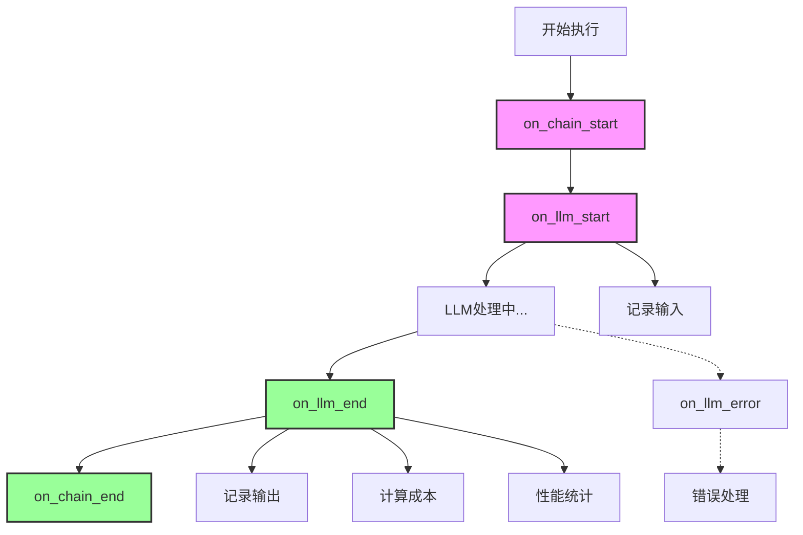
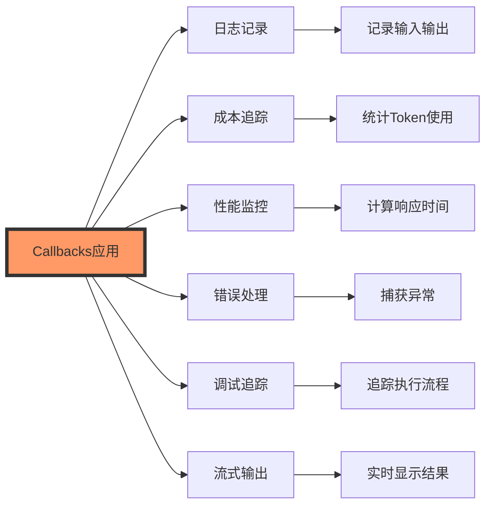
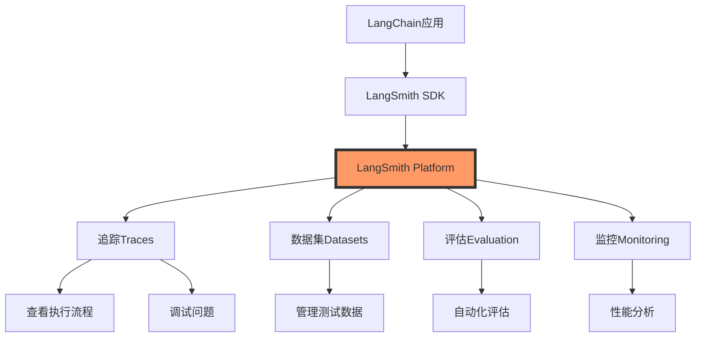

---
title: 第11周-Callbacks和监控系统
date: 2025-01-12
categories:
  - AI
  - LangChain
---

# 第11周:Callbacks和监控系统

## 本周学习目标

通过本周的学习,你将掌握:

1. 理解 Callbacks 机制和工作原理
2. 掌握内置 Callbacks 的使用
3. 实现自定义 Callbacks
4. 集成 LangSmith 进行追踪和调试
5. 实现成本追踪和性能监控
6. 构建完整的监控仪表盘
7. 掌握日志管理和错误处理
8. 实现生产级监控系统

## 第一部分:Callbacks 基础

### 1.1 什么是 Callbacks?

Callbacks(回调)是 LangChain 中的事件监听机制,允许你在执行过程中的关键节点插入自定义逻辑。



### 1.2 Callbacks 的用途



### 1.3 Callbacks 生命周期

```python
from langchain.callbacks.base import BaseCallbackHandler
from langchain_openai import ChatOpenAI
from langchain_core.messages import HumanMessage
import time

class LifecycleCallbackHandler(BaseCallbackHandler):
    """演示完整的 Callback 生命周期"""

    def on_llm_start(self, serialized, prompts, **kwargs):
        """
        LLM 开始执行时调用

        参数:
            serialized: LLM 配置信息
            prompts: 输入的提示词列表
        """
        print("\n=== on_llm_start ===")
        print(f"开始调用 LLM")
        print(f"提示词数量: {len(prompts)}")
        print(f"提示词: {prompts[0][:100]}...")

    def on_llm_new_token(self, token: str, **kwargs):
        """
        流式输出时,每个新 token 生成时调用

        参数:
            token: 新生成的 token
        """
        print(token, end="", flush=True)

    def on_llm_end(self, response, **kwargs):
        """
        LLM 执行结束时调用

        参数:
            response: LLM 的响应结果
        """
        print("\n\n=== on_llm_end ===")
        print(f"LLM 执行完成")
        if hasattr(response, 'llm_output') and response.llm_output:
            token_usage = response.llm_output.get('token_usage', {})
            print(f"Token 使用: {token_usage}")

    def on_llm_error(self, error, **kwargs):
        """
        LLM 执行出错时调用

        参数:
            error: 错误信息
        """
        print("\n=== on_llm_error ===")
        print(f"错误: {error}")

    def on_chain_start(self, serialized, inputs, **kwargs):
        """
        Chain 开始执行时调用

        参数:
            serialized: Chain 配置信息
            inputs: 输入参数
        """
        print("\n=== on_chain_start ===")
        print(f"Chain 开始执行")
        print(f"输入: {inputs}")

    def on_chain_end(self, outputs, **kwargs):
        """
        Chain 执行结束时调用

        参数:
            outputs: Chain 的输出结果
        """
        print("\n=== on_chain_end ===")
        print(f"Chain 执行完成")
        print(f"输出: {outputs}")

    def on_chain_error(self, error, **kwargs):
        """
        Chain 执行出错时调用

        参数:
            error: 错误信息
        """
        print("\n=== on_chain_error ===")
        print(f"错误: {error}")

    def on_tool_start(self, serialized, input_str, **kwargs):
        """
        Tool 开始执行时调用

        参数:
            serialized: Tool 配置信息
            input_str: 工具输入
        """
        print("\n=== on_tool_start ===")
        print(f"工具开始执行")
        print(f"输入: {input_str}")

    def on_tool_end(self, output, **kwargs):
        """
        Tool 执行结束时调用

        参数:
            output: 工具输出
        """
        print("\n=== on_tool_end ===")
        print(f"工具执行完成")
        print(f"输出: {output}")

    def on_tool_error(self, error, **kwargs):
        """
        Tool 执行出错时调用

        参数:
            error: 错误信息
        """
        print("\n=== on_tool_error ===")
        print(f"错误: {error}")

    def on_agent_action(self, action, **kwargs):
        """
        Agent 采取行动时调用

        参数:
            action: Agent 的行动
        """
        print("\n=== on_agent_action ===")
        print(f"Agent 行动: {action}")

    def on_agent_finish(self, finish, **kwargs):
        """
        Agent 完成时调用

        参数:
            finish: Agent 的最终输出
        """
        print("\n=== on_agent_finish ===")
        print(f"Agent 完成: {finish}")

# ===== 使用示例 =====
if __name__ == "__main__":
    # 创建 Callback Handler
    handler = LifecycleCallbackHandler()

    # 创建 LLM(传入 Callback)
    llm = ChatOpenAI(
        model="gpt-3.5-turbo",
        callbacks=[handler]
    )

    # 测试
    print("="*60)
    print("测试 Callbacks 生命周期")
    print("="*60)

    response = llm.invoke([HumanMessage(content="用一句话介绍 LangChain")])

    print("\n" + "="*60)
    print("最终响应:")
    print(response.content)
    print("="*60)
```

### 1.4 内置 Callbacks

```python
from langchain.callbacks import StdOutCallbackHandler
from langchain_openai import ChatOpenAI
from langchain.chains import LLMChain
from langchain.prompts import ChatPromptTemplate

# ===== 1. StdOutCallbackHandler - 标准输出 =====
print("="*60)
print("1. StdOutCallbackHandler - 标准输出")
print("="*60)

llm = ChatOpenAI(
    model="gpt-3.5-turbo",
    callbacks=[StdOutCallbackHandler()]  # 输出到控制台
)

prompt = ChatPromptTemplate.from_template("给我讲一个关于{topic}的笑话")
chain = prompt | llm

result = chain.invoke({"topic": "程序员"})
print(f"\n结果: {result.content}")

# ===== 2. FileCallbackHandler - 文件输出 =====
print("\n" + "="*60)
print("2. FileCallbackHandler - 文件输出")
print("="*60)

from langchain.callbacks import FileCallbackHandler
import tempfile

# 创建临时文件
temp_file = tempfile.NamedTemporaryFile(mode='w', delete=False, suffix='.log')
temp_file_path = temp_file.name
temp_file.close()

file_handler = FileCallbackHandler(temp_file_path)

llm = ChatOpenAI(
    model="gpt-3.5-turbo",
    callbacks=[file_handler]
)

response = llm.invoke("什么是机器学习?")

print(f"✓ 日志已写入: {temp_file_path}")

# 读取日志文件
with open(temp_file_path, 'r') as f:
    log_content = f.read()
    print(f"\n日志内容(前500字符):\n{log_content[:500]}...")

# ===== 3. StreamingStdOutCallbackHandler - 流式输出 =====
print("\n" + "="*60)
print("3. StreamingStdOutCallbackHandler - 流式输出")
print("="*60)

from langchain.callbacks.streaming_stdout import StreamingStdOutCallbackHandler

llm = ChatOpenAI(
    model="gpt-3.5-turbo",
    streaming=True,  # 启用流式输出
    callbacks=[StreamingStdOutCallbackHandler()]
)

print("\n流式输出:")
response = llm.invoke("用一句话解释什么是 RAG")

print(f"\n\n完整响应: {response.content}")

# 清理临时文件
import os
os.remove(temp_file_path)
```

## 第二部分:自定义 Callbacks

### 2.1 成本追踪 Callback

```python
from langchain.callbacks.base import BaseCallbackHandler
from langchain_openai import ChatOpenAI
from typing import Dict, Any, List
import time

class CostTrackingHandler(BaseCallbackHandler):
    """成本追踪 Callback"""

    # OpenAI 定价(2024年价格,实际使用时需要更新)
    PRICING = {
        "gpt-3.5-turbo": {
            "prompt": 0.0015 / 1000,      # $0.0015 per 1K tokens
            "completion": 0.002 / 1000     # $0.002 per 1K tokens
        },
        "gpt-4": {
            "prompt": 0.03 / 1000,         # $0.03 per 1K tokens
            "completion": 0.06 / 1000      # $0.06 per 1K tokens
        },
        "gpt-4-turbo": {
            "prompt": 0.01 / 1000,         # $0.01 per 1K tokens
            "completion": 0.03 / 1000      # $0.03 per 1K tokens
        }
    }

    def __init__(self):
        """初始化成本追踪器"""
        self.total_tokens = 0
        self.prompt_tokens = 0
        self.completion_tokens = 0
        self.total_cost = 0.0
        self.model_calls = []

    def on_llm_start(self, serialized: Dict[str, Any], prompts: List[str], **kwargs):
        """LLM 开始时记录"""
        self.current_call = {
            "model": serialized.get("kwargs", {}).get("model_name", "unknown"),
            "start_time": time.time(),
            "prompts": prompts
        }

    def on_llm_end(self, response, **kwargs):
        """LLM 结束时计算成本"""
        if not hasattr(response, 'llm_output') or not response.llm_output:
            return

        token_usage = response.llm_output.get('token_usage', {})

        if not token_usage:
            return

        prompt_tokens = token_usage.get('prompt_tokens', 0)
        completion_tokens = token_usage.get('completion_tokens', 0)
        total_tokens = token_usage.get('total_tokens', 0)

        # 累计 token
        self.prompt_tokens += prompt_tokens
        self.completion_tokens += completion_tokens
        self.total_tokens += total_tokens

        # 计算成本
        model = self.current_call.get("model", "gpt-3.5-turbo")
        pricing = self.PRICING.get(model, self.PRICING["gpt-3.5-turbo"])

        prompt_cost = prompt_tokens * pricing["prompt"]
        completion_cost = completion_tokens * pricing["completion"]
        call_cost = prompt_cost + completion_cost

        self.total_cost += call_cost

        # 记录调用信息
        self.current_call.update({
            "end_time": time.time(),
            "duration": time.time() - self.current_call["start_time"],
            "prompt_tokens": prompt_tokens,
            "completion_tokens": completion_tokens,
            "total_tokens": total_tokens,
            "cost": call_cost
        })

        self.model_calls.append(self.current_call)

    def get_stats(self) -> Dict[str, Any]:
        """获取统计信息"""
        return {
            "total_calls": len(self.model_calls),
            "total_tokens": self.total_tokens,
            "prompt_tokens": self.prompt_tokens,
            "completion_tokens": self.completion_tokens,
            "total_cost": round(self.total_cost, 4),
            "average_cost_per_call": round(self.total_cost / len(self.model_calls), 4) if self.model_calls else 0,
            "calls": self.model_calls
        }

    def print_stats(self):
        """打印统计信息"""
        stats = self.get_stats()

        print("\n" + "="*60)
        print("成本统计")
        print("="*60)
        print(f"总调用次数: {stats['total_calls']}")
        print(f"总 Token 数: {stats['total_tokens']:,}")
        print(f"  - Prompt Tokens: {stats['prompt_tokens']:,}")
        print(f"  - Completion Tokens: {stats['completion_tokens']:,}")
        print(f"总成本: ${stats['total_cost']:.4f}")
        print(f"平均每次调用成本: ${stats['average_cost_per_call']:.4f}")

        if stats['calls']:
            print(f"\n详细调用记录:")
            for i, call in enumerate(stats['calls'], 1):
                print(f"\n  调用 {i}:")
                print(f"    模型: {call['model']}")
                print(f"    耗时: {call['duration']:.2f}秒")
                print(f"    Token: {call['total_tokens']} ({call['prompt_tokens']}+{call['completion_tokens']})")
                print(f"    成本: ${call['cost']:.4f}")

        print("="*60)

    def reset(self):
        """重置统计"""
        self.total_tokens = 0
        self.prompt_tokens = 0
        self.completion_tokens = 0
        self.total_cost = 0.0
        self.model_calls = []

# ===== 使用示例 =====
if __name__ == "__main__":
    from langchain.prompts import ChatPromptTemplate

    # 创建成本追踪器
    cost_tracker = CostTrackingHandler()

    # 创建 LLM
    llm = ChatOpenAI(
        model="gpt-3.5-turbo",
        callbacks=[cost_tracker]
    )

    # 测试多次调用
    print("="*60)
    print("测试成本追踪")
    print("="*60)

    questions = [
        "什么是 LangChain?",
        "解释一下 RAG 技术",
        "如何优化 LLM 应用的性能?"
    ]

    for i, question in enumerate(questions, 1):
        print(f"\n问题 {i}: {question}")
        response = llm.invoke(question)
        print(f"回答: {response.content[:100]}...")

    # 打印统计
    cost_tracker.print_stats()

    # 获取统计数据(可用于后续处理)
    stats = cost_tracker.get_stats()
```

### 2.2 性能监控 Callback

```python
from langchain.callbacks.base import BaseCallbackHandler
from langchain_openai import ChatOpenAI
from typing import Dict, Any, List
import time
from collections import defaultdict

class PerformanceMonitorHandler(BaseCallbackHandler):
    """性能监控 Callback"""

    def __init__(self):
        """初始化性能监控器"""
        self.metrics = defaultdict(lambda: {
            "count": 0,
            "total_time": 0,
            "min_time": float('inf'),
            "max_time": 0,
            "errors": 0
        })
        self.current_timings = {}

    def on_llm_start(self, serialized: Dict[str, Any], prompts: List[str], **kwargs):
        """记录 LLM 开始时间"""
        run_id = kwargs.get('run_id', 'default')
        self.current_timings[f"llm_{run_id}"] = time.time()

    def on_llm_end(self, response, **kwargs):
        """记录 LLM 结束时间"""
        run_id = kwargs.get('run_id', 'default')
        start_key = f"llm_{run_id}"

        if start_key in self.current_timings:
            duration = time.time() - self.current_timings[start_key]
            self._update_metrics("llm", duration)
            del self.current_timings[start_key]

    def on_llm_error(self, error, **kwargs):
        """记录 LLM 错误"""
        self.metrics["llm"]["errors"] += 1

    def on_chain_start(self, serialized: Dict[str, Any], inputs: Dict[str, Any], **kwargs):
        """记录 Chain 开始时间"""
        run_id = kwargs.get('run_id', 'default')
        self.current_timings[f"chain_{run_id}"] = time.time()

    def on_chain_end(self, outputs: Dict[str, Any], **kwargs):
        """记录 Chain 结束时间"""
        run_id = kwargs.get('run_id', 'default')
        start_key = f"chain_{run_id}"

        if start_key in self.current_timings:
            duration = time.time() - self.current_timings[start_key]
            self._update_metrics("chain", duration)
            del self.current_timings[start_key]

    def on_chain_error(self, error, **kwargs):
        """记录 Chain 错误"""
        self.metrics["chain"]["errors"] += 1

    def on_tool_start(self, serialized: Dict[str, Any], input_str: str, **kwargs):
        """记录 Tool 开始时间"""
        run_id = kwargs.get('run_id', 'default')
        self.current_timings[f"tool_{run_id}"] = time.time()

    def on_tool_end(self, output: str, **kwargs):
        """记录 Tool 结束时间"""
        run_id = kwargs.get('run_id', 'default')
        start_key = f"tool_{run_id}"

        if start_key in self.current_timings:
            duration = time.time() - self.current_timings[start_key]
            self._update_metrics("tool", duration)
            del self.current_timings[start_key]

    def on_tool_error(self, error, **kwargs):
        """记录 Tool 错误"""
        self.metrics["tool"]["errors"] += 1

    def _update_metrics(self, component: str, duration: float):
        """更新性能指标"""
        metrics = self.metrics[component]

        metrics["count"] += 1
        metrics["total_time"] += duration
        metrics["min_time"] = min(metrics["min_time"], duration)
        metrics["max_time"] = max(metrics["max_time"], duration)

    def get_stats(self) -> Dict[str, Any]:
        """获取性能统计"""
        stats = {}

        for component, metrics in self.metrics.items():
            if metrics["count"] > 0:
                stats[component] = {
                    "count": metrics["count"],
                    "total_time": round(metrics["total_time"], 3),
                    "avg_time": round(metrics["total_time"] / metrics["count"], 3),
                    "min_time": round(metrics["min_time"], 3),
                    "max_time": round(metrics["max_time"], 3),
                    "errors": metrics["errors"],
                    "success_rate": round((metrics["count"] - metrics["errors"]) / metrics["count"] * 100, 2)
                }

        return stats

    def print_stats(self):
        """打印性能统计"""
        stats = self.get_stats()

        print("\n" + "="*60)
        print("性能统计")
        print("="*60)

        for component, metrics in stats.items():
            print(f"\n{component.upper()}:")
            print(f"  调用次数: {metrics['count']}")
            print(f"  总耗时: {metrics['total_time']}秒")
            print(f"  平均耗时: {metrics['avg_time']}秒")
            print(f"  最短耗时: {metrics['min_time']}秒")
            print(f"  最长耗时: {metrics['max_time']}秒")
            print(f"  错误次数: {metrics['errors']}")
            print(f"  成功率: {metrics['success_rate']}%")

        print("="*60)

    def reset(self):
        """重置统计"""
        self.metrics.clear()
        self.current_timings.clear()

# ===== 使用示例 =====
if __name__ == "__main__":
    from langchain.prompts import ChatPromptTemplate
    from langchain.chains import LLMChain

    # 创建性能监控器
    perf_monitor = PerformanceMonitorHandler()

    # 创建 LLM 和 Chain
    llm = ChatOpenAI(
        model="gpt-3.5-turbo",
        callbacks=[perf_monitor]
    )

    prompt = ChatPromptTemplate.from_template("用一句话回答: {question}")
    chain = prompt | llm

    # 测试多次调用
    print("="*60)
    print("测试性能监控")
    print("="*60)

    questions = [
        "什么是 Python?",
        "什么是机器学习?",
        "什么是深度学习?",
        "什么是 LangChain?",
        "什么是 RAG?"
    ]

    for i, question in enumerate(questions, 1):
        print(f"\n执行查询 {i}/{len(questions)}...")
        result = chain.invoke({"question": question})
        print(f"✓ 完成")

    # 打印性能统计
    perf_monitor.print_stats()
```

### 2.3 组合多个 Callbacks

```python
from langchain.callbacks.base import BaseCallbackHandler
from langchain_openai import ChatOpenAI
from langchain.prompts import ChatPromptTemplate
from typing import List

class MultiCallbackHandler(BaseCallbackHandler):
    """组合多个 Callback 的处理器"""

    def __init__(self, handlers: List[BaseCallbackHandler]):
        """
        初始化

        参数:
            handlers: Callback 处理器列表
        """
        self.handlers = handlers

    def _run_handlers(self, method_name: str, *args, **kwargs):
        """运行所有处理器的指定方法"""
        for handler in self.handlers:
            if hasattr(handler, method_name):
                method = getattr(handler, method_name)
                try:
                    method(*args, **kwargs)
                except Exception as e:
                    print(f"Handler {handler.__class__.__name__}.{method_name} failed: {e}")

    def on_llm_start(self, *args, **kwargs):
        self._run_handlers("on_llm_start", *args, **kwargs)

    def on_llm_end(self, *args, **kwargs):
        self._run_handlers("on_llm_end", *args, **kwargs)

    def on_llm_error(self, *args, **kwargs):
        self._run_handlers("on_llm_error", *args, **kwargs)

    def on_chain_start(self, *args, **kwargs):
        self._run_handlers("on_chain_start", *args, **kwargs)

    def on_chain_end(self, *args, **kwargs):
        self._run_handlers("on_chain_end", *args, **kwargs)

    def on_chain_error(self, *args, **kwargs):
        self._run_handlers("on_chain_error", *args, **kwargs)

    def on_tool_start(self, *args, **kwargs):
        self._run_handlers("on_tool_start", *args, **kwargs)

    def on_tool_end(self, *args, **kwargs):
        self._run_handlers("on_tool_end", *args, **kwargs)

    def on_tool_error(self, *args, **kwargs):
        self._run_handlers("on_tool_error", *args, **kwargs)

# ===== 使用示例 =====
if __name__ == "__main__":
    # 创建多个处理器
    cost_tracker = CostTrackingHandler()
    perf_monitor = PerformanceMonitorHandler()

    # 组合处理器
    multi_handler = MultiCallbackHandler([
        cost_tracker,
        perf_monitor
    ])

    # 创建 LLM
    llm = ChatOpenAI(
        model="gpt-3.5-turbo",
        callbacks=[multi_handler]
    )

    # 测试
    print("="*60)
    print("测试组合 Callbacks")
    print("="*60)

    questions = [
        "什么是 LangChain?",
        "RAG 的优势是什么?",
        "如何优化 LLM 性能?"
    ]

    for i, question in enumerate(questions, 1):
        print(f"\n问题 {i}: {question}")
        response = llm.invoke(question)
        print(f"✓ 完成")

    # 打印所有统计
    cost_tracker.print_stats()
    perf_monitor.print_stats()
```

## 第三部分:LangSmith 集成

### 3.1 LangSmith 简介

LangSmith 是 LangChain 官方的追踪、监控和调试平台。



### 3.2 配置 LangSmith

```python
"""
LangSmith 配置步骤:

1. 注册 LangSmith 账号
   访问: https://smith.langchain.com/

2. 获取 API Key
   进入 Settings -> API Keys -> Create API Key

3. 配置环境变量
   在 .env 文件中添加:

   LANGCHAIN_TRACING_V2=true
   LANGCHAIN_API_KEY=ls__your_api_key_here
   LANGCHAIN_PROJECT=my-project
   LANGCHAIN_ENDPOINT=https://api.smith.langchain.com

4. 安装依赖
   pip install langsmith
"""

import os
from dotenv import load_dotenv

# 加载环境变量
load_dotenv()

# 验证配置
def verify_langsmith_config():
    """验证 LangSmith 配置"""
    required_vars = [
        "LANGCHAIN_TRACING_V2",
        "LANGCHAIN_API_KEY",
        "LANGCHAIN_PROJECT"
    ]

    print("="*60)
    print("LangSmith 配置检查")
    print("="*60)

    all_configured = True

    for var in required_vars:
        value = os.getenv(var)
        if value:
            # 隐藏 API Key
            if "KEY" in var and len(value) > 8:
                display_value = value[:4] + "..." + value[-4:]
            else:
                display_value = value
            print(f"✓ {var}: {display_value}")
        else:
            print(f"✗ {var}: 未配置")
            all_configured = False

    print("="*60)

    if all_configured:
        print("✓ LangSmith 配置完整")
    else:
        print("✗ LangSmith 配置不完整,请检查 .env 文件")

    return all_configured

# 运行检查
if __name__ == "__main__":
    verify_langsmith_config()
```

### 3.3 使用 LangSmith 追踪

```python
import os
from langchain_openai import ChatOpenAI
from langchain.prompts import ChatPromptTemplate
from langchain.chains import LLMChain

# ===== 确保 LangSmith 已配置 =====
# os.environ["LANGCHAIN_TRACING_V2"] = "true"
# os.environ["LANGCHAIN_API_KEY"] = "your-api-key"
# os.environ["LANGCHAIN_PROJECT"] = "my-project"

# ===== 创建简单的 Chain =====
llm = ChatOpenAI(model="gpt-3.5-turbo", temperature=0)

prompt = ChatPromptTemplate.from_template(
    "你是一个{role}。请回答以下问题:\n\n{question}"
)

chain = prompt | llm

# ===== 执行调用(自动追踪) =====
print("="*60)
print("执行 LangSmith 追踪示例")
print("="*60)

result = chain.invoke({
    "role": "Python 专家",
    "question": "什么是装饰器?"
})

print(f"\n回答: {result.content}")

print("\n✓ 追踪已发送到 LangSmith")
print("  访问 https://smith.langchain.com/ 查看详情")

# ===== 带标签和元数据的追踪 =====
from langchain.callbacks import tracing_v2_enabled

print("\n" + "="*60)
print("带标签和元数据的追踪")
print("="*60)

# 方法1: 使用上下文管理器
with tracing_v2_enabled(
    project_name="my-custom-project",
    tags=["example", "tutorial"],
    metadata={"user_id": "user123", "session_id": "session456"}
):
    result = chain.invoke({
        "role": "数据科学家",
        "question": "什么是梯度下降?"
    })
    print(f"\n回答: {result.content[:100]}...")

print("\n✓ 带标签和元数据的追踪已发送")

# ===== 异步追踪 =====
import asyncio

async def async_trace_example():
    """异步追踪示例"""
    print("\n" + "="*60)
    print("异步追踪示例")
    print("="*60)

    # 异步执行
    result = await chain.ainvoke({
        "role": "机器学习工程师",
        "question": "什么是过拟合?"
    })

    print(f"\n回答: {result.content[:100]}...")
    print("\n✓ 异步追踪已发送")

# 运行异步示例
if __name__ == "__main__":
    asyncio.run(async_trace_example())
```

### 3.4 LangSmith 数据集和评估

```python
from langsmith import Client
from langchain_openai import ChatOpenAI
from langchain.prompts import ChatPromptTemplate
import os

# 创建 LangSmith 客户端
client = Client(
    api_key=os.getenv("LANGCHAIN_API_KEY"),
    api_url=os.getenv("LANGCHAIN_ENDPOINT", "https://api.smith.langchain.com")
)

# ===== 创建数据集 =====
def create_test_dataset():
    """创建测试数据集"""
    dataset_name = "qa-test-dataset"

    # 检查数据集是否已存在
    try:
        dataset = client.read_dataset(dataset_name=dataset_name)
        print(f"✓ 数据集 '{dataset_name}' 已存在")
        return dataset
    except:
        pass

    # 创建新数据集
    dataset = client.create_dataset(
        dataset_name=dataset_name,
        description="问答系统测试数据集"
    )

    # 添加示例
    examples = [
        {
            "inputs": {"question": "什么是 Python?"},
            "outputs": {"answer": "Python 是一门解释型、面向对象的编程语言"}
        },
        {
            "inputs": {"question": "什么是机器学习?"},
            "outputs": {"answer": "机器学习是人工智能的一个分支,让计算机从数据中学习"}
        },
        {
            "inputs": {"question": "什么是深度学习?"},
            "outputs": {"answer": "深度学习是机器学习的子集,使用多层神经网络"}
        }
    ]

    for example in examples:
        client.create_example(
            inputs=example["inputs"],
            outputs=example["outputs"],
            dataset_id=dataset.id
        )

    print(f"✓ 数据集 '{dataset_name}' 创建成功")
    return dataset

# ===== 定义评估函数 =====
def qa_chain(inputs: dict) -> dict:
    """问答链"""
    llm = ChatOpenAI(model="gpt-3.5-turbo", temperature=0)
    prompt = ChatPromptTemplate.from_template("用一句话回答: {question}")
    chain = prompt | llm

    result = chain.invoke(inputs)
    return {"answer": result.content}

# ===== 运行评估 =====
def run_evaluation():
    """运行评估"""
    from langsmith.evaluation import evaluate

    # 创建数据集
    dataset = create_test_dataset()

    print("\n" + "="*60)
    print("运行评估")
    print("="*60)

    # 自定义评估器
    def check_answer_length(run, example):
        """检查答案长度"""
        prediction = run.outputs.get("answer", "")
        # 答案应该在 10-200 字符之间
        is_valid = 10 <= len(prediction) <= 200
        return {
            "key": "answer_length",
            "score": 1.0 if is_valid else 0.0
        }

    # 运行评估
    results = evaluate(
        qa_chain,
        data=dataset.name,
        evaluators=[check_answer_length],
        experiment_prefix="qa-evaluation"
    )

    print("\n✓ 评估完成")
    print(f"  查看结果: https://smith.langchain.com/")

    return results

# ===== 使用示例 =====
if __name__ == "__main__":
    # 注意: 需要配置 LangSmith
    if os.getenv("LANGCHAIN_API_KEY"):
        run_evaluation()
    else:
        print("请先配置 LANGCHAIN_API_KEY")
```

## 第四部分:生产级监控系统

### 4.1 完整的监控系统

```python
from langchain.callbacks.base import BaseCallbackHandler
from typing import Dict, Any, List, Optional
import time
import json
from datetime import datetime
from collections import defaultdict
import logging

class ProductionMonitoringHandler(BaseCallbackHandler):
    """生产级监控系统"""

    def __init__(
        self,
        log_file: Optional[str] = None,
        enable_cost_tracking: bool = True,
        enable_performance_tracking: bool = True,
        enable_error_tracking: bool = True
    ):
        """
        初始化生产监控系统

        参数:
            log_file: 日志文件路径
            enable_cost_tracking: 是否启用成本追踪
            enable_performance_tracking: 是否启用性能追踪
            enable_error_tracking: 是否启用错误追踪
        """
        self.log_file = log_file
        self.enable_cost_tracking = enable_cost_tracking
        self.enable_performance_tracking = enable_performance_tracking
        self.enable_error_tracking = enable_error_tracking

        # 设置日志
        self.logger = self._setup_logger()

        # 初始化追踪器
        self.cost_tracker = CostTrackingHandler() if enable_cost_tracking else None
        self.perf_tracker = PerformanceMonitorHandler() if enable_performance_tracking else None

        # 错误追踪
        self.errors = [] if enable_error_tracking else None

        # 会话追踪
        self.sessions = defaultdict(lambda: {
            "start_time": None,
            "end_time": None,
            "calls": 0,
            "errors": 0
        })

        self.current_session_id = None

    def _setup_logger(self):
        """设置日志"""
        logger = logging.getLogger("ProductionMonitor")
        logger.setLevel(logging.INFO)

        # 控制台输出
        console_handler = logging.StreamHandler()
        console_handler.setLevel(logging.INFO)

        # 文件输出
        if self.log_file:
            file_handler = logging.FileHandler(self.log_file)
            file_handler.setLevel(logging.INFO)
            logger.addHandler(file_handler)

        # 格式化
        formatter = logging.Formatter(
            '%(asctime)s - %(name)s - %(levelname)s - %(message)s'
        )
        console_handler.setFormatter(formatter)

        logger.addHandler(console_handler)

        return logger

    def start_session(self, session_id: str):
        """开始新会话"""
        self.current_session_id = session_id
        self.sessions[session_id]["start_time"] = datetime.now()
        self.logger.info(f"Session started: {session_id}")

    def end_session(self):
        """结束当前会话"""
        if self.current_session_id:
            self.sessions[self.current_session_id]["end_time"] = datetime.now()
            self.logger.info(f"Session ended: {self.current_session_id}")
            self.current_session_id = None

    # ===== Callback 方法 =====

    def on_llm_start(self, serialized: Dict[str, Any], prompts: List[str], **kwargs):
        """LLM 开始"""
        if self.cost_tracker:
            self.cost_tracker.on_llm_start(serialized, prompts, **kwargs)
        if self.perf_tracker:
            self.perf_tracker.on_llm_start(serialized, prompts, **kwargs)

        if self.current_session_id:
            self.sessions[self.current_session_id]["calls"] += 1

        self.logger.info(f"LLM started: {serialized.get('kwargs', {}).get('model_name', 'unknown')}")

    def on_llm_end(self, response, **kwargs):
        """LLM 结束"""
        if self.cost_tracker:
            self.cost_tracker.on_llm_end(response, **kwargs)
        if self.perf_tracker:
            self.perf_tracker.on_llm_end(response, **kwargs)

        # 记录 token 使用
        if hasattr(response, 'llm_output') and response.llm_output:
            token_usage = response.llm_output.get('token_usage', {})
            self.logger.info(f"LLM ended: tokens={token_usage.get('total_tokens', 0)}")

    def on_llm_error(self, error: Exception, **kwargs):
        """LLM 错误"""
        if self.cost_tracker:
            self.cost_tracker.on_llm_error(error, **kwargs)
        if self.perf_tracker:
            self.perf_tracker.on_llm_error(error, **kwargs)

        if self.current_session_id:
            self.sessions[self.current_session_id]["errors"] += 1

        if self.errors is not None:
            self.errors.append({
                "type": "llm_error",
                "error": str(error),
                "timestamp": datetime.now().isoformat()
            })

        self.logger.error(f"LLM error: {error}")

    def on_chain_start(self, serialized: Dict[str, Any], inputs: Dict[str, Any], **kwargs):
        """Chain 开始"""
        if self.perf_tracker:
            self.perf_tracker.on_chain_start(serialized, inputs, **kwargs)

        self.logger.info("Chain started")

    def on_chain_end(self, outputs: Dict[str, Any], **kwargs):
        """Chain 结束"""
        if self.perf_tracker:
            self.perf_tracker.on_chain_end(outputs, **kwargs)

        self.logger.info("Chain ended")

    def on_chain_error(self, error: Exception, **kwargs):
        """Chain 错误"""
        if self.perf_tracker:
            self.perf_tracker.on_chain_error(error, **kwargs)

        if self.errors is not None:
            self.errors.append({
                "type": "chain_error",
                "error": str(error),
                "timestamp": datetime.now().isoformat()
            })

        self.logger.error(f"Chain error: {error}")

    # ===== 统计和报告 =====

    def get_report(self) -> Dict[str, Any]:
        """获取完整报告"""
        report = {
            "timestamp": datetime.now().isoformat(),
            "sessions": dict(self.sessions)
        }

        if self.cost_tracker:
            report["cost"] = self.cost_tracker.get_stats()

        if self.perf_tracker:
            report["performance"] = self.perf_tracker.get_stats()

        if self.errors is not None:
            report["errors"] = {
                "total": len(self.errors),
                "recent": self.errors[-10:]  # 最近10个错误
            }

        return report

    def print_report(self):
        """打印报告"""
        report = self.get_report()

        print("\n" + "="*60)
        print("生产监控报告")
        print("="*60)

        # 会话统计
        if report["sessions"]:
            print("\n会话统计:")
            for session_id, session_data in report["sessions"].items():
                print(f"\n  {session_id}:")
                print(f"    调用次数: {session_data['calls']}")
                print(f"    错误次数: {session_data['errors']}")
                if session_data['start_time'] and session_data['end_time']:
                    duration = (session_data['end_time'] - session_data['start_time']).total_seconds()
                    print(f"    持续时间: {duration:.2f}秒")

        # 成本统计
        if "cost" in report:
            print(f"\n成本统计:")
            cost = report["cost"]
            print(f"  总调用: {cost['total_calls']}")
            print(f"  总成本: ${cost['total_cost']:.4f}")
            print(f"  平均成本: ${cost['average_cost_per_call']:.4f}")

        # 性能统计
        if "performance" in report:
            print(f"\n性能统计:")
            for component, metrics in report["performance"].items():
                print(f"  {component.upper()}:")
                print(f"    平均耗时: {metrics['avg_time']}秒")
                print(f"    成功率: {metrics['success_rate']}%")

        # 错误统计
        if "errors" in report:
            print(f"\n错误统计:")
            print(f"  总错误数: {report['errors']['total']}")
            if report['errors']['recent']:
                print(f"  最近错误:")
                for error in report['errors']['recent'][-3:]:
                    print(f"    - {error['type']}: {error['error'][:50]}...")

        print("="*60)

    def export_report(self, file_path: str):
        """导出报告到 JSON 文件"""
        report = self.get_report()

        with open(file_path, 'w', encoding='utf-8') as f:
            json.dump(report, f, indent=2, ensure_ascii=False, default=str)

        self.logger.info(f"Report exported to {file_path}")

# ===== 使用示例 =====
if __name__ == "__main__":
    from langchain_openai import ChatOpenAI
    from langchain.prompts import ChatPromptTemplate

    # 创建监控系统
    monitor = ProductionMonitoringHandler(
        log_file="production_monitor.log",
        enable_cost_tracking=True,
        enable_performance_tracking=True,
        enable_error_tracking=True
    )

    # 开始会话
    monitor.start_session("session_001")

    # 创建 LLM
    llm = ChatOpenAI(
        model="gpt-3.5-turbo",
        callbacks=[monitor]
    )

    prompt = ChatPromptTemplate.from_template("用一句话回答: {question}")
    chain = prompt | llm

    # 模拟生产环境调用
    print("="*60)
    print("模拟生产环境调用")
    print("="*60)

    questions = [
        "什么是 Python?",
        "什么是机器学习?",
        "什么是深度学习?",
        "什么是 LangChain?",
        "什么是 RAG?"
    ]

    for i, question in enumerate(questions, 1):
        print(f"\n处理问题 {i}/{len(questions)}: {question}")
        try:
            result = chain.invoke({"question": question})
            print(f"✓ 完成")
        except Exception as e:
            print(f"✗ 错误: {e}")

    # 结束会话
    monitor.end_session()

    # 打印报告
    monitor.print_report()

    # 导出报告
    monitor.export_report("production_report.json")
    print(f"\n✓ 报告已导出到 production_report.json")
```

### 4.2 集成 Prometheus 和 Grafana

```python
"""
集成 Prometheus 和 Grafana 进行监控

安装依赖:
pip install prometheus-client

架构:
LangChain App -> Prometheus Metrics -> Prometheus Server -> Grafana Dashboard
"""

from prometheus_client import Counter, Histogram, Gauge, Summary, start_http_server
from langchain.callbacks.base import BaseCallbackHandler
from typing import Dict, Any, List
import time

class PrometheusMetricsHandler(BaseCallbackHandler):
    """Prometheus 指标收集器"""

    def __init__(self, port: int = 8000):
        """
        初始化

        参数:
            port: Prometheus metrics HTTP 服务端口
        """
        # 启动 HTTP 服务器
        start_http_server(port)
        print(f"✓ Prometheus metrics server started on port {port}")
        print(f"  访问: http://localhost:{port}/metrics")

        # 定义指标

        # Counter: 单调递增计数器
        self.llm_calls_total = Counter(
            'langchain_llm_calls_total',
            'Total number of LLM calls',
            ['model', 'status']
        )

        self.chain_calls_total = Counter(
            'langchain_chain_calls_total',
            'Total number of chain calls',
            ['status']
        )

        self.tool_calls_total = Counter(
            'langchain_tool_calls_total',
            'Total number of tool calls',
            ['tool_name', 'status']
        )

        # Histogram: 分布统计
        self.llm_duration_seconds = Histogram(
            'langchain_llm_duration_seconds',
            'LLM call duration in seconds',
            ['model'],
            buckets=(0.1, 0.5, 1.0, 2.0, 5.0, 10.0, 30.0, 60.0)
        )

        self.chain_duration_seconds = Histogram(
            'langchain_chain_duration_seconds',
            'Chain execution duration in seconds',
            buckets=(0.1, 0.5, 1.0, 2.0, 5.0, 10.0, 30.0, 60.0)
        )

        # Gauge: 可增可减的值
        self.llm_active_calls = Gauge(
            'langchain_llm_active_calls',
            'Number of active LLM calls',
            ['model']
        )

        # Summary: 统计摘要
        self.token_usage = Summary(
            'langchain_token_usage',
            'Token usage per call',
            ['model', 'type']
        )

        # 追踪状态
        self.current_timings = {}
        self.current_models = {}

    def on_llm_start(self, serialized: Dict[str, Any], prompts: List[str], **kwargs):
        """LLM 开始"""
        run_id = kwargs.get('run_id', 'default')
        model = serialized.get('kwargs', {}).get('model_name', 'unknown')

        # 记录开始时间
        self.current_timings[f"llm_{run_id}"] = time.time()
        self.current_models[f"llm_{run_id}"] = model

        # 增加活跃调用数
        self.llm_active_calls.labels(model=model).inc()

    def on_llm_end(self, response, **kwargs):
        """LLM 结束"""
        run_id = kwargs.get('run_id', 'default')
        key = f"llm_{run_id}"

        if key in self.current_timings:
            # 计算耗时
            duration = time.time() - self.current_timings[key]
            model = self.current_models.get(key, 'unknown')

            # 记录指标
            self.llm_calls_total.labels(model=model, status='success').inc()
            self.llm_duration_seconds.labels(model=model).observe(duration)
            self.llm_active_calls.labels(model=model).dec()

            # 记录 token 使用
            if hasattr(response, 'llm_output') and response.llm_output:
                token_usage = response.llm_output.get('token_usage', {})
                if token_usage:
                    self.token_usage.labels(model=model, type='prompt').observe(
                        token_usage.get('prompt_tokens', 0)
                    )
                    self.token_usage.labels(model=model, type='completion').observe(
                        token_usage.get('completion_tokens', 0)
                    )

            # 清理
            del self.current_timings[key]
            del self.current_models[key]

    def on_llm_error(self, error: Exception, **kwargs):
        """LLM 错误"""
        run_id = kwargs.get('run_id', 'default')
        key = f"llm_{run_id}"

        model = self.current_models.get(key, 'unknown')

        # 记录错误
        self.llm_calls_total.labels(model=model, status='error').inc()
        self.llm_active_calls.labels(model=model).dec()

        # 清理
        if key in self.current_timings:
            del self.current_timings[key]
        if key in self.current_models:
            del self.current_models[key]

    def on_chain_start(self, serialized: Dict[str, Any], inputs: Dict[str, Any], **kwargs):
        """Chain 开始"""
        run_id = kwargs.get('run_id', 'default')
        self.current_timings[f"chain_{run_id}"] = time.time()

    def on_chain_end(self, outputs: Dict[str, Any], **kwargs):
        """Chain 结束"""
        run_id = kwargs.get('run_id', 'default')
        key = f"chain_{run_id}"

        if key in self.current_timings:
            duration = time.time() - self.current_timings[key]

            self.chain_calls_total.labels(status='success').inc()
            self.chain_duration_seconds.observe(duration)

            del self.current_timings[key]

    def on_chain_error(self, error: Exception, **kwargs):
        """Chain 错误"""
        run_id = kwargs.get('run_id', 'default')
        key = f"chain_{run_id}"

        self.chain_calls_total.labels(status='error').inc()

        if key in self.current_timings:
            del self.current_timings[key]

# ===== 使用示例 =====
if __name__ == "__main__":
    from langchain_openai import ChatOpenAI
    from langchain.prompts import ChatPromptTemplate
    import time as time_module

    # 创建 Prometheus 指标收集器
    metrics_handler = PrometheusMetricsHandler(port=8000)

    # 创建 LLM
    llm = ChatOpenAI(
        model="gpt-3.5-turbo",
        callbacks=[metrics_handler]
    )

    prompt = ChatPromptTemplate.from_template("用一句话回答: {question}")
    chain = prompt | llm

    print("\n" + "="*60)
    print("生成 Prometheus 指标")
    print("="*60)
    print("\n访问 http://localhost:8000/metrics 查看指标")
    print("\n按 Ctrl+C 停止...\n")

    # 模拟持续调用
    questions = [
        "什么是 Python?",
        "什么是机器学习?",
        "什么是深度学习?",
        "什么是 LangChain?",
        "什么是 RAG?"
    ]

    try:
        while True:
            for question in questions:
                print(f"处理: {question}")
                result = chain.invoke({"question": question})
                print(f"✓ 完成\n")
                time_module.sleep(2)  # 等待2秒
    except KeyboardInterrupt:
        print("\n✓ 停止")
```

**Grafana Dashboard 配置示例**:

```json
{
  "dashboard": {
    "title": "LangChain Monitoring",
    "panels": [
      {
        "title": "LLM Calls Rate",
        "targets": [
          {
            "expr": "rate(langchain_llm_calls_total[5m])"
          }
        ]
      },
      {
        "title": "LLM Duration",
        "targets": [
          {
            "expr": "histogram_quantile(0.95, langchain_llm_duration_seconds_bucket)"
          }
        ]
      },
      {
        "title": "Token Usage",
        "targets": [
          {
            "expr": "rate(langchain_token_usage_sum[5m])"
          }
        ]
      },
      {
        "title": "Error Rate",
        "targets": [
          {
            "expr": "rate(langchain_llm_calls_total{status='error'}[5m])"
          }
        ]
      }
    ]
  }
}
```

## 练习题

### 基础练习

1. **自定义 Callback**:
   - 实现一个日志记录 Callback
   - 记录所有 LLM 的输入和输出
   - 保存到文件

2. **成本追踪**:
   - 实现成本追踪功能
   - 计算每次调用的成本
   - 生成成本报告

3. **性能监控**:
   - 实现响应时间监控
   - 统计平均、最小、最大耗时
   - 识别性能瓶颈

### 进阶练习

4. **LangSmith 集成**:
   - 配置 LangSmith
   - 追踪 Chain 执行
   - 添加自定义标签和元数据

5. **错误处理**:
   - 实现错误捕获和记录
   - 统计错误类型和频率
   - 实现错误告警

6. **组合监控**:
   - 同时使用成本追踪和性能监控
   - 生成综合报告
   - 导出到 JSON 文件

### 实战练习

7. **生产监控系统**:
   - 实现完整的监控系统
   - 包含成本、性能、错误追踪
   - 实现会话管理
   - 生成详细报告

8. **Prometheus 集成**:
   - 集成 Prometheus 指标
   - 配置 Grafana 仪表盘
   - 实现实时监控

9. **告警系统**:
   - 实现自动告警功能
   - 成本超标告警
   - 错误率告警
   - 性能降级告警

## 本周总结

### 核心概念

1. **Callbacks**:
   - 事件监听机制
   - 关键节点插入逻辑
   - 支持自定义扩展

2. **监控类型**:
   - 成本监控: Token 使用和费用
   - 性能监控: 响应时间和吞吐量
   - 错误监控: 异常和失败率
   - 业务监控: 用户行为和数据质量

3. **LangSmith**:
   - 官方追踪平台
   - 可视化执行流程
   - 数据集和评估

### 最佳实践

1. **监控设计**:
   - 分层监控(基础设施、应用、业务)
   - 关键指标优先
   - 避免过度监控

2. **成本控制**:
   - 实时追踪成本
   - 设置成本预警
   - 优化 token 使用

3. **性能优化**:
   - 监控响应时间
   - 识别瓶颈
   - 持续优化

4. **错误处理**:
   - 记录所有错误
   - 分类错误类型
   - 自动告警

### 常见问题

**Q: Callbacks 会影响性能吗?**
A:
- 轻量级 Callbacks 影响很小
- 避免在 Callback 中执行耗时操作
- 可以使用异步处理

**Q: 如何选择监控工具?**
A:
- 开发/测试: LangSmith
- 生产环境: Prometheus + Grafana
- 简单应用: 自定义 Callbacks

**Q: 成本追踪准确吗?**
A:
- 基于 token 使用计算
- 需要定期更新定价
- 可能有轻微误差

### 下周预告

下周我们将学习**综合实战项目 - 企业级 RAG 系统**,整合前面所有知识,构建一个完整的生产级应用!

---

**作业**:
1. 完成所有练习题
2. 实现一个完整的监控系统
3. 集成 LangSmith(如有条件)
4. 为自己的项目添加监控

**推荐阅读**:
- [LangSmith 文档](https://docs.smith.langchain.com/)
- [Prometheus 文档](https://prometheus.io/docs/)
- [Grafana 文档](https://grafana.com/docs/)
- [LangChain Callbacks 文档](https://python.langchain.com/docs/modules/callbacks/)
