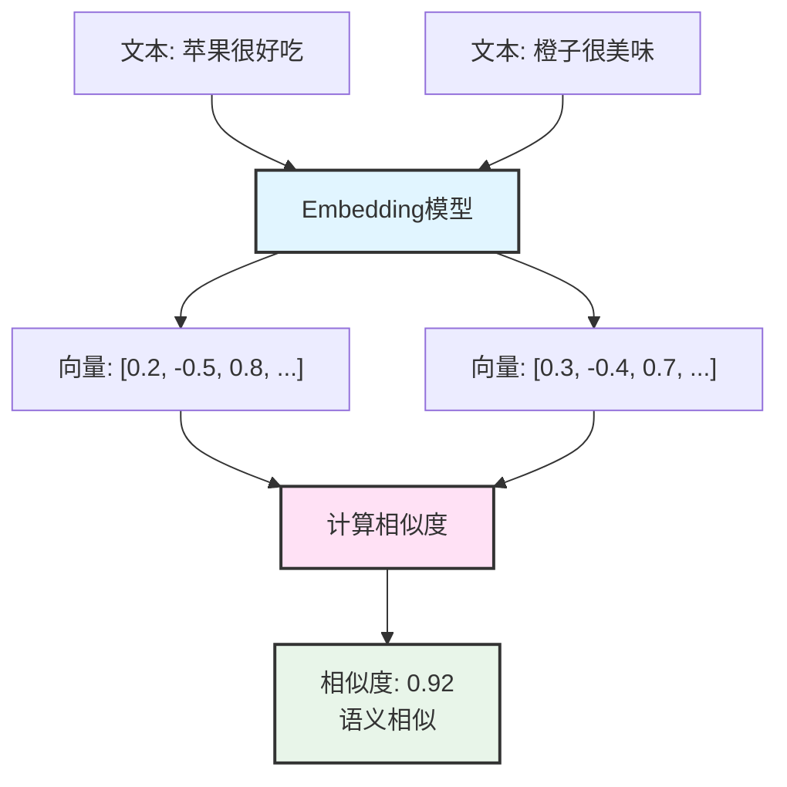
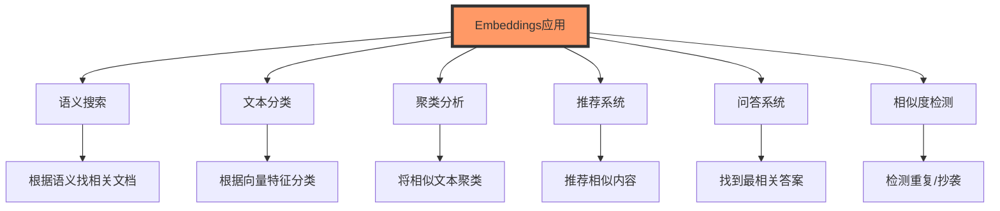
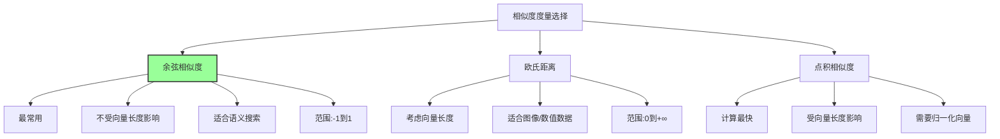
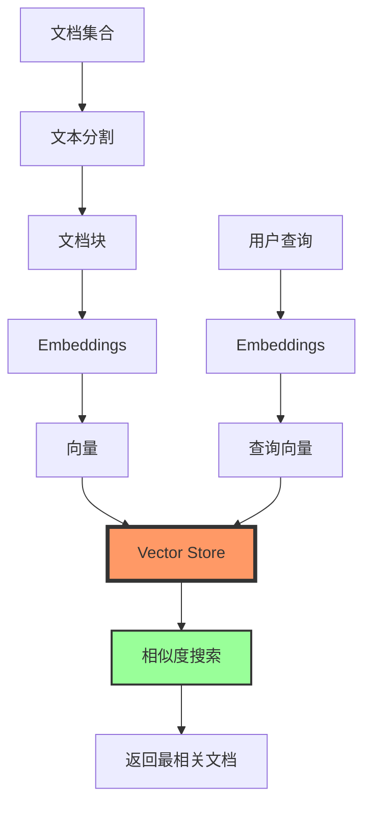
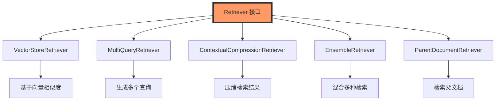

---
title: 第9周-Embeddings和Vector Stores详解
date: 2025-01-10
categories:
  - AI
  - LangChain
---

# 第9周:Embeddings和Vector Stores详解

## 本周学习目标

通过本周的学习,你将掌握:

1. 理解 Embeddings 的原理和作用
2. 掌握不同 Embedding 模型的使用
3. 理解向量相似度计算方法
4. 掌握 Vector Stores 的核心概念
5. 学会使用 FAISS、Chroma、Pinecone 等向量数据库
6. 实现高效的向量存储和检索系统
7. 优化向量搜索的性能和准确性
8. 构建生产级的语义搜索系统

## 第一部分:Embeddings 基础

### 1.1 什么是 Embeddings?

Embeddings(嵌入/向量化)是将文本转换为高维向量的过程,使计算机能够理解和处理文本的语义信息。



**核心特点**:
- **语义表示**: 捕捉文本的语义信息,而非仅仅是词频
- **高维向量**: 通常是 384、768、1536 维的浮点数向量
- **相似度计算**: 语义相似的文本在向量空间中距离更近
- **可比较性**: 不同文本可以通过向量距离进行比较

### 1.2 Embeddings 的应用场景



### 1.3 第一个 Embeddings 示例

```python
from langchain_openai import OpenAIEmbeddings
from langchain_community.embeddings import HuggingFaceEmbeddings

# ===== 方法1: 使用 OpenAI Embeddings =====
openai_embeddings = OpenAIEmbeddings(
    model="text-embedding-3-small",  # 推荐模型,性价比高
    openai_api_key="your-api-key"
)

# 嵌入单个文本
text = "LangChain 是一个强大的 LLM 应用开发框架"
vector = openai_embeddings.embed_query(text)

print(f"文本: {text}")
print(f"向量维度: {len(vector)}")
print(f"向量前5个值: {vector[:5]}")
# 输出:
# 向量维度: 1536
# 向量前5个值: [0.0123, -0.0456, 0.0789, -0.0234, 0.0567]

# ===== 方法2: 使用 HuggingFace Embeddings(本地免费) =====
hf_embeddings = HuggingFaceEmbeddings(
    model_name="sentence-transformers/paraphrase-multilingual-MiniLM-L12-v2",  # 支持中文
    model_kwargs={'device': 'cpu'},  # 使用CPU,如有GPU改为'cuda'
    encode_kwargs={'normalize_embeddings': True}  # 归一化向量
)

# 嵌入多个文本
texts = [
    "Python 是一门编程语言",
    "Java 是一门编程语言",
    "苹果是一种水果"
]

vectors = hf_embeddings.embed_documents(texts)

print(f"\n嵌入了 {len(vectors)} 个文本")
print(f"每个向量维度: {len(vectors[0])}")
```

### 1.4 向量相似度计算

```python
import numpy as np
from numpy.linalg import norm

def cosine_similarity(vec1, vec2):
    """
    计算余弦相似度

    余弦相似度范围: [-1, 1]
    - 1 表示完全相同
    - 0 表示无关
    - -1 表示完全相反
    """
    return np.dot(vec1, vec2) / (norm(vec1) * norm(vec2))

def euclidean_distance(vec1, vec2):
    """
    计算欧氏距离

    欧氏距离范围: [0, +∞)
    - 0 表示完全相同
    - 值越大表示差异越大
    """
    return norm(np.array(vec1) - np.array(vec2))

def dot_product_similarity(vec1, vec2):
    """
    计算点积相似度

    点积相似度范围: (-∞, +∞)
    - 值越大表示越相似
    """
    return np.dot(vec1, vec2)

# ===== 实际示例:计算文本相似度 =====
from langchain_openai import OpenAIEmbeddings

embeddings = OpenAIEmbeddings()

# 准备测试文本
text1 = "我喜欢编程"
text2 = "我热爱写代码"
text3 = "今天天气很好"

# 生成向量
vec1 = embeddings.embed_query(text1)
vec2 = embeddings.embed_query(text2)
vec3 = embeddings.embed_query(text3)

# 计算相似度
sim_1_2 = cosine_similarity(vec1, vec2)
sim_1_3 = cosine_similarity(vec1, vec3)

print(f"'{text1}' 和 '{text2}' 的相似度: {sim_1_2:.4f}")
# 输出: 0.8723 (很高,因为语义相近)

print(f"'{text1}' 和 '{text3}' 的相似度: {sim_1_3:.4f}")
# 输出: 0.1245 (很低,因为语义不相关)
```

### 1.5 不同相似度度量的选择



**选择建议**:
- **语义搜索**: 使用余弦相似度(最推荐)
- **图像搜索**: 可以使用欧氏距离
- **性能优先**: 使用点积(需先归一化)

## 第二部分:Embedding 模型详解

### 2.1 主流 Embedding 模型对比

```python
"""
主流 Embedding 模型对比表

+------------------+--------+-------+--------+----------+----------+
| 模型             | 维度   | 语言  | 收费   | 性能     | 推荐度   |
+------------------+--------+-------+--------+----------+----------+
| OpenAI           | 1536   | 多语言| 收费   | ⭐⭐⭐⭐⭐| ⭐⭐⭐⭐⭐|
| text-embedding-3 |        |       |        |          |          |
+------------------+--------+-------+--------+----------+----------+
| OpenAI           | 3072   | 多语言| 收费   | ⭐⭐⭐⭐⭐| ⭐⭐⭐⭐  |
| text-embedding-  |        |       |(更贵)  |          |          |
| 3-large          |        |       |        |          |          |
+------------------+--------+-------+--------+----------+----------+
| HuggingFace      | 384    | 多语言| 免费   | ⭐⭐⭐⭐  | ⭐⭐⭐⭐⭐|
| paraphrase-      |        |       |(本地)  |          |(免费)    |
| multilingual     |        |       |        |          |          |
+------------------+--------+-------+--------+----------+----------+
| HuggingFace      | 768    | 中文  | 免费   | ⭐⭐⭐⭐  | ⭐⭐⭐⭐  |
| shibing624/      |        |       |(本地)  |          |(中文优)  |
| text2vec-base    |        |       |        |          |          |
+------------------+--------+-------+--------+----------+----------+
| Cohere           | 1024   | 多语言| 收费   | ⭐⭐⭐⭐  | ⭐⭐⭐    |
| embed-multilingual|       |       |        |          |          |
+------------------+--------+-------+--------+----------+----------+
"""

# ===== 1. OpenAI Embeddings(推荐用于生产) =====
from langchain_openai import OpenAIEmbeddings

openai_emb = OpenAIEmbeddings(
    model="text-embedding-3-small",  # 或 text-embedding-3-large
    openai_api_key="your-api-key"
)

# ===== 2. HuggingFace Embeddings(推荐用于开发/测试) =====
from langchain_community.embeddings import HuggingFaceEmbeddings

# 多语言模型(支持中文)
hf_emb_multi = HuggingFaceEmbeddings(
    model_name="sentence-transformers/paraphrase-multilingual-MiniLM-L12-v2"
)

# 中文优化模型
hf_emb_chinese = HuggingFaceEmbeddings(
    model_name="shibing624/text2vec-base-chinese"
)

# ===== 3. Cohere Embeddings =====
from langchain_community.embeddings import CohereEmbeddings

cohere_emb = CohereEmbeddings(
    model="embed-multilingual-v3.0",
    cohere_api_key="your-api-key"
)

# ===== 4. 本地 Ollama Embeddings(完全免费) =====
from langchain_community.embeddings import OllamaEmbeddings

ollama_emb = OllamaEmbeddings(
    model="nomic-embed-text"  # 需要先下载: ollama pull nomic-embed-text
)
```

### 2.2 Embedding 模型性能测试

```python
import time
from typing import List, Dict
from langchain_openai import OpenAIEmbeddings
from langchain_community.embeddings import HuggingFaceEmbeddings

def benchmark_embeddings(
    embeddings_models: Dict[str, any],
    test_texts: List[str],
    repeat: int = 3
) -> Dict:
    """
    测试不同 Embedding 模型的性能

    参数:
        embeddings_models: {模型名称: 模型实例}
        test_texts: 测试文本列表
        repeat: 重复测试次数

    返回:
        性能测试结果
    """
    results = {}

    for model_name, model in embeddings_models.items():
        print(f"\n测试 {model_name}...")

        # 预热(首次调用可能较慢)
        _ = model.embed_query(test_texts[0])

        # 单个文本嵌入测试
        start = time.time()
        for _ in range(repeat):
            for text in test_texts[:5]:  # 测试前5个文本
                _ = model.embed_query(text)
        single_time = (time.time() - start) / (repeat * 5)

        # 批量嵌入测试
        start = time.time()
        for _ in range(repeat):
            _ = model.embed_documents(test_texts)
        batch_time = (time.time() - start) / repeat

        # 获取向量维度
        sample_vector = model.embed_query(test_texts[0])
        dimension = len(sample_vector)

        results[model_name] = {
            "dimension": dimension,
            "single_text_time": f"{single_time*1000:.2f}ms",
            "batch_time": f"{batch_time*1000:.2f}ms",
            "texts_per_second": f"{len(test_texts)/batch_time:.2f}"
        }

    return results

# ===== 运行性能测试 =====
if __name__ == "__main__":
    # 准备测试文本
    test_texts = [
        "人工智能正在改变世界",
        "机器学习是AI的重要分支",
        "深度学习在图像识别中表现出色",
        "自然语言处理让机器理解人类语言",
        "LangChain 简化了 LLM 应用开发",
        "向量数据库用于高效的语义搜索",
        "RAG 结合了检索和生成",
        "Prompt Engineering 是一门艺术",
        "Agent 可以自主规划和执行任务",
        "Embeddings 将文本转换为向量"
    ]

    # 准备测试模型
    models = {
        "OpenAI": OpenAIEmbeddings(model="text-embedding-3-small"),
        "HuggingFace-Multi": HuggingFaceEmbeddings(
            model_name="sentence-transformers/paraphrase-multilingual-MiniLM-L12-v2"
        ),
        "HuggingFace-Chinese": HuggingFaceEmbeddings(
            model_name="shibing624/text2vec-base-chinese"
        )
    }

    # 运行测试
    results = benchmark_embeddings(models, test_texts)

    # 打印结果
    print("\n" + "="*60)
    print("性能测试结果:")
    print("="*60)
    for model_name, metrics in results.items():
        print(f"\n{model_name}:")
        for metric, value in metrics.items():
            print(f"  {metric}: {value}")
```

### 2.3 Embedding 缓存优化

```python
from langchain.embeddings import CacheBackedEmbeddings
from langchain.storage import LocalFileStore
from langchain_openai import OpenAIEmbeddings
import hashlib

# ===== 方法1: 使用 LangChain 内置缓存 =====
# 创建本地文件存储
store = LocalFileStore("./embedding_cache")

# 创建底层 Embeddings
underlying_embeddings = OpenAIEmbeddings()

# 包装为缓存 Embeddings
cached_embeddings = CacheBackedEmbeddings.from_bytes_store(
    underlying_embeddings=underlying_embeddings,
    document_embedding_cache=store,
    namespace=underlying_embeddings.model  # 使用模型名作为命名空间
)

# 使用(首次会调用API,后续会使用缓存)
text = "LangChain 是一个强大的框架"
vector1 = cached_embeddings.embed_query(text)  # 调用 API
vector2 = cached_embeddings.embed_query(text)  # 使用缓存,瞬间返回

# ===== 方法2: 自定义缓存系统 =====
import json
import os
from typing import List

class EmbeddingCache:
    """自定义 Embedding 缓存系统"""

    def __init__(self, cache_file: str = "embedding_cache.json"):
        """
        初始化缓存

        参数:
            cache_file: 缓存文件路径
        """
        self.cache_file = cache_file
        self.cache = self._load_cache()

    def _load_cache(self) -> dict:
        """从文件加载缓存"""
        if os.path.exists(self.cache_file):
            with open(self.cache_file, 'r', encoding='utf-8') as f:
                return json.load(f)
        return {}

    def _save_cache(self):
        """保存缓存到文件"""
        with open(self.cache_file, 'w', encoding='utf-8') as f:
            json.dump(self.cache, f, ensure_ascii=False, indent=2)

    def _get_cache_key(self, text: str, model: str) -> str:
        """生成缓存键"""
        content = f"{model}:{text}"
        return hashlib.md5(content.encode()).hexdigest()

    def get(self, text: str, model: str) -> List[float]:
        """
        从缓存获取向量

        参数:
            text: 文本
            model: 模型名称

        返回:
            向量,如果不存在返回 None
        """
        key = self._get_cache_key(text, model)
        return self.cache.get(key)

    def set(self, text: str, model: str, vector: List[float]):
        """
        设置缓存

        参数:
            text: 文本
            model: 模型名称
            vector: 向量
        """
        key = self._get_cache_key(text, model)
        self.cache[key] = vector
        self._save_cache()

    def clear(self):
        """清空缓存"""
        self.cache = {}
        self._save_cache()

    def stats(self) -> dict:
        """获取缓存统计信息"""
        return {
            "total_cached": len(self.cache),
            "cache_file": self.cache_file,
            "cache_size": os.path.getsize(self.cache_file) if os.path.exists(self.cache_file) else 0
        }

# ===== 使用自定义缓存 =====
from langchain_openai import OpenAIEmbeddings

class CachedEmbeddings:
    """带缓存的 Embeddings"""

    def __init__(self, embeddings: OpenAIEmbeddings, cache: EmbeddingCache):
        self.embeddings = embeddings
        self.cache = cache
        self.model_name = embeddings.model

    def embed_query(self, text: str) -> List[float]:
        """嵌入单个查询(带缓存)"""
        # 尝试从缓存获取
        cached = self.cache.get(text, self.model_name)
        if cached:
            print(f"✓ 缓存命中: {text[:30]}...")
            return cached

        # 缓存未命中,调用 API
        print(f"✗ 缓存未命中,调用 API: {text[:30]}...")
        vector = self.embeddings.embed_query(text)

        # 存入缓存
        self.cache.set(text, self.model_name, vector)
        return vector

    def embed_documents(self, texts: List[str]) -> List[List[float]]:
        """嵌入多个文档(带缓存)"""
        vectors = []
        uncached_texts = []
        uncached_indices = []

        # 检查缓存
        for i, text in enumerate(texts):
            cached = self.cache.get(text, self.model_name)
            if cached:
                vectors.append(cached)
            else:
                vectors.append(None)
                uncached_texts.append(text)
                uncached_indices.append(i)

        # 批量处理未缓存的文本
        if uncached_texts:
            print(f"调用 API 嵌入 {len(uncached_texts)} 个文本...")
            new_vectors = self.embeddings.embed_documents(uncached_texts)

            # 填充结果并更新缓存
            for i, (text, vector) in enumerate(zip(uncached_texts, new_vectors)):
                idx = uncached_indices[i]
                vectors[idx] = vector
                self.cache.set(text, self.model_name, vector)

        return vectors

# ===== 测试缓存效果 =====
if __name__ == "__main__":
    # 创建缓存系统
    cache = EmbeddingCache("./my_embedding_cache.json")

    # 创建带缓存的 Embeddings
    base_embeddings = OpenAIEmbeddings()
    embeddings = CachedEmbeddings(base_embeddings, cache)

    # 测试文本
    test_texts = [
        "LangChain 是什么?",
        "如何使用 Embeddings?",
        "Vector Store 的作用是什么?"
    ]

    # 首次调用(会调用 API)
    print("\n===== 首次调用 =====")
    import time
    start = time.time()
    vectors1 = embeddings.embed_documents(test_texts)
    time1 = time.time() - start
    print(f"耗时: {time1:.2f}秒")

    # 第二次调用(使用缓存)
    print("\n===== 第二次调用 =====")
    start = time.time()
    vectors2 = embeddings.embed_documents(test_texts)
    time2 = time.time() - start
    print(f"耗时: {time2:.2f}秒")

    # 性能提升
    print(f"\n性能提升: {time1/time2:.1f}x")

    # 缓存统计
    print("\n缓存统计:")
    stats = cache.stats()
    for key, value in stats.items():
        print(f"  {key}: {value}")
```

## 第三部分:Vector Stores 详解

### 3.1 什么是 Vector Store?

Vector Store(向量存储/向量数据库)是专门用于存储和检索向量数据的数据库系统。



**核心功能**:
1. **向量存储**: 高效存储大量向量数据
2. **相似度搜索**: 快速找到最相似的向量
3. **元数据过滤**: 结合元数据进行筛选
4. **持久化**: 数据持久化到磁盘
5. **索引优化**: 使用 ANN 算法加速搜索

### 3.2 主流 Vector Stores 对比

```python
"""
主流 Vector Stores 对比

+-------------+--------+--------+--------+--------+--------+----------+
| 数据库      | 类型   | 持久化 | 性能   | 易用性 | 价格   | 推荐场景 |
+-------------+--------+--------+--------+--------+--------+----------+
| FAISS       | 本地   | 支持   | ⭐⭐⭐⭐⭐| ⭐⭐⭐  | 免费   | 开发测试 |
|             | 内存   |        | (最快) |        |        | 中小规模 |
+-------------+--------+--------+--------+--------+--------+----------+
| Chroma      | 本地   | 支持   | ⭐⭐⭐⭐| ⭐⭐⭐⭐⭐| 免费   | 开发测试 |
|             | 内存   |        |        |(最简单)|        | 推荐入门 |
+-------------+--------+--------+--------+--------+--------+----------+
| Pinecone    | 云端   | 自动   | ⭐⭐⭐⭐⭐| ⭐⭐⭐⭐| 收费   | 生产环境 |
|             |        |        |        |        |        | 大规模   |
+-------------+--------+--------+--------+--------+--------+----------+
| Weaviate    | 本地/云| 支持   | ⭐⭐⭐⭐| ⭐⭐⭐  | 免费/收| 生产环境 |
|             |        |        |        |        | 费     | 复杂场景 |
+-------------+--------+--------+--------+--------+--------+----------+
| Qdrant      | 本地/云| 支持   | ⭐⭐⭐⭐⭐| ⭐⭐⭐⭐| 免费/收| 生产环境 |
|             |        |        |        |        | 费     | 推荐     |
+-------------+--------+--------+--------+--------+--------+----------+
| Milvus      | 本地/云| 支持   | ⭐⭐⭐⭐⭐| ⭐⭐   | 免费/收| 超大规模 |
|             |        |        |(复杂) |        | 费     | 企业级   |
+-------------+--------+--------+--------+--------+--------+----------+
"""
```

**选择建议**:
- **快速原型**: Chroma(最简单)
- **本地开发**: FAISS(最快)
- **生产环境**: Pinecone 或 Qdrant
- **企业级**: Milvus

### 3.3 FAISS 入门

FAISS(Facebook AI Similarity Search)是 Meta 开发的高性能向量检索库。

```python
from langchain_community.vectorstores import FAISS
from langchain_openai import OpenAIEmbeddings
from langchain.schema import Document

# ===== 创建 FAISS Vector Store =====
# 准备文档
documents = [
    Document(
        page_content="LangChain 是一个用于开发 LLM 应用的框架",
        metadata={"source": "doc1", "category": "框架"}
    ),
    Document(
        page_content="FAISS 是一个高效的向量检索库",
        metadata={"source": "doc2", "category": "工具"}
    ),
    Document(
        page_content="向量数据库用于存储和检索 Embeddings",
        metadata={"source": "doc3", "category": "数据库"}
    ),
    Document(
        page_content="语义搜索基于向量相似度计算",
        metadata={"source": "doc4", "category": "技术"}
    ),
    Document(
        page_content="RAG 结合了检索和生成两个步骤",
        metadata={"source": "doc5", "category": "技术"}
    )
]

# 创建 Embeddings
embeddings = OpenAIEmbeddings()

# 从文档创建 FAISS Vector Store
vectorstore = FAISS.from_documents(
    documents=documents,
    embedding=embeddings
)

print("✓ FAISS Vector Store 创建成功!")

# ===== 相似度搜索 =====
# 方法1: 基本搜索
query = "什么是向量数据库?"
results = vectorstore.similarity_search(
    query=query,
    k=3  # 返回前3个最相关的文档
)

print(f"\n查询: {query}")
print("\n搜索结果:")
for i, doc in enumerate(results, 1):
    print(f"{i}. {doc.page_content}")
    print(f"   元数据: {doc.metadata}")

# 方法2: 带相似度分数的搜索
results_with_scores = vectorstore.similarity_search_with_score(
    query=query,
    k=3
)

print(f"\n查询: {query}")
print("\n搜索结果(带分数):")
for i, (doc, score) in enumerate(results_with_scores, 1):
    print(f"{i}. 相似度: {score:.4f}")
    print(f"   内容: {doc.page_content}")
    print(f"   元数据: {doc.metadata}\n")

# 方法3: 使用阈值过滤
results_with_threshold = vectorstore.similarity_search_with_relevance_scores(
    query=query,
    k=5,
    score_threshold=0.5  # 只返回相似度 > 0.5 的结果
)

print(f"\n查询: {query}")
print(f"\n搜索结果(相似度 > 0.5):")
for i, (doc, score) in enumerate(results_with_threshold, 1):
    print(f"{i}. 相似度: {score:.4f} - {doc.page_content}")

# ===== 元数据过滤 =====
# 只搜索特定类别的文档
results_filtered = vectorstore.similarity_search(
    query="检索技术",
    k=3,
    filter={"category": "技术"}  # 只搜索 category 为 "技术" 的文档
)

print("\n搜索结果(只搜索'技术'类别):")
for doc in results_filtered:
    print(f"- {doc.page_content}")

# ===== 添加新文档 =====
new_documents = [
    Document(
        page_content="Prompt Engineering 是设计有效提示词的技术",
        metadata={"source": "doc6", "category": "技术"}
    )
]

# 添加到现有 Vector Store
vectorstore.add_documents(new_documents)
print("\n✓ 新文档已添加!")

# ===== 保存和加载 =====
# 保存到本地
vectorstore.save_local("./faiss_index")
print("\n✓ FAISS 索引已保存到 ./faiss_index")

# 从本地加载
loaded_vectorstore = FAISS.load_local(
    folder_path="./faiss_index",
    embeddings=embeddings,
    allow_dangerous_deserialization=True  # 需要明确允许反序列化
)
print("✓ FAISS 索引已加载!")

# 测试加载的 Vector Store
test_results = loaded_vectorstore.similarity_search("LangChain", k=1)
print(f"\n加载后的搜索测试: {test_results[0].page_content}")
```

### 3.4 Chroma 入门

Chroma 是一个开源的向量数据库,专为 LLM 应用设计。

```python
from langchain_community.vectorstores import Chroma
from langchain_openai import OpenAIEmbeddings
from langchain.schema import Document

# ===== 方法1: 内存模式(不持久化) =====
documents = [
    Document(
        page_content="Python 是一门编程语言",
        metadata={"language": "Python", "year": 1991}
    ),
    Document(
        page_content="Java 是一门面向对象的语言",
        metadata={"language": "Java", "year": 1995}
    ),
    Document(
        page_content="JavaScript 用于 Web 开发",
        metadata={"language": "JavaScript", "year": 1995}
    )
]

embeddings = OpenAIEmbeddings()

# 创建内存模式的 Chroma
vectorstore = Chroma.from_documents(
    documents=documents,
    embedding=embeddings
)

# 搜索
results = vectorstore.similarity_search("编程语言", k=2)
print("搜索结果:")
for doc in results:
    print(f"- {doc.page_content}")

# ===== 方法2: 持久化模式 =====
persist_directory = "./chroma_db"

# 创建持久化的 Chroma
vectorstore_persistent = Chroma.from_documents(
    documents=documents,
    embedding=embeddings,
    persist_directory=persist_directory  # 指定持久化目录
)

print(f"\n✓ Chroma 数据已持久化到 {persist_directory}")

# ===== 方法3: 从现有持久化目录加载 =====
loaded_vectorstore = Chroma(
    persist_directory=persist_directory,
    embedding_function=embeddings
)

print("✓ Chroma 数据已加载!")

# ===== 高级搜索功能 =====
# 1. MMR 搜索(最大边际相关性,增加结果多样性)
results_mmr = loaded_vectorstore.max_marginal_relevance_search(
    query="编程",
    k=2,
    fetch_k=5,  # 先获取5个候选,再从中选择2个多样化的结果
    lambda_mult=0.5  # 多样性参数: 0=最大多样性, 1=最大相关性
)

print("\nMMR 搜索结果(增加多样性):")
for doc in results_mmr:
    print(f"- {doc.page_content}")

# 2. 元数据过滤
results_filtered = loaded_vectorstore.similarity_search(
    query="语言",
    k=3,
    filter={"year": 1995}  # 只搜索 1995 年发布的语言
)

print("\n过滤搜索结果(year=1995):")
for doc in results_filtered:
    print(f"- {doc.page_content} (year: {doc.metadata['year']})")

# ===== 更新和删除 =====
# 添加新文档并获取 ID
new_docs = [
    Document(
        page_content="Go 是 Google 开发的语言",
        metadata={"language": "Go", "year": 2009}
    )
]

ids = loaded_vectorstore.add_documents(new_docs)
print(f"\n✓ 新文档已添加,ID: {ids}")

# 删除文档
loaded_vectorstore.delete(ids=ids)
print(f"✓ 文档已删除,ID: {ids}")

# ===== 集合管理 =====
# Chroma 支持多个集合(类似数据库的表)
vectorstore_collection = Chroma(
    collection_name="my_documents",  # 指定集合名称
    embedding_function=embeddings,
    persist_directory="./chroma_db"
)

print(f"\n✓ 使用集合: my_documents")
```

### 3.5 Chroma 完整示例:构建文档问答系统

```python
from langchain_community.vectorstores import Chroma
from langchain_openai import OpenAIEmbeddings, ChatOpenAI
from langchain.text_splitter import RecursiveCharacterTextSplitter
from langchain.chains import RetrievalQA
from langchain_community.document_loaders import TextLoader

# ===== 步骤1: 加载文档 =====
print("步骤1: 加载文档...")

# 假设我们有一个知识库文档
knowledge_text = """
LangChain 是什么?
LangChain 是一个用于开发基于大语言模型(LLM)的应用程序的框架。它提供了一套工具和抽象,
使开发者能够轻松构建复杂的 LLM 应用,如聊天机器人、问答系统、文档分析工具等。

LangChain 的核心组件:
1. Models: 支持多种 LLM 提供商(OpenAI、Anthropic、HuggingFace等)
2. Prompts: 提示词模板和管理工具
3. Chains: 将多个组件链接起来完成复杂任务
4. Memory: 为对话添加记忆功能
5. Agents: 能够自主决策和调用工具的智能体
6. Embeddings: 文本向量化工具
7. Vector Stores: 向量数据库集成

如何使用 LangChain?
首先安装: pip install langchain langchain-openai
然后创建一个简单的聊天机器人:
from langchain_openai import ChatOpenAI
llm = ChatOpenAI()
response = llm.invoke("你好!")

LangChain 的优势:
- 模块化设计,易于扩展
- 丰富的集成,支持多种工具和服务
- 活跃的社区和丰富的文档
- 适合快速原型开发和生产部署
"""

# 将文本写入临时文件
import tempfile
with tempfile.NamedTemporaryFile(mode='w', delete=False, suffix='.txt', encoding='utf-8') as f:
    f.write(knowledge_text)
    temp_file = f.name

# 加载文档
loader = TextLoader(temp_file, encoding='utf-8')
documents = loader.load()

print(f"✓ 加载了 {len(documents)} 个文档")

# ===== 步骤2: 分割文档 =====
print("\n步骤2: 分割文档...")

text_splitter = RecursiveCharacterTextSplitter(
    chunk_size=300,
    chunk_overlap=50,
    separators=["\n\n", "\n", "。", " ", ""]
)

splits = text_splitter.split_documents(documents)
print(f"✓ 分割为 {len(splits)} 个文档块")

# ===== 步骤3: 创建 Vector Store =====
print("\n步骤3: 创建向量存储...")

embeddings = OpenAIEmbeddings()

vectorstore = Chroma.from_documents(
    documents=splits,
    embedding=embeddings,
    persist_directory="./langchain_qa_db"
)

print("✓ 向量存储创建成功!")

# ===== 步骤4: 创建检索器 =====
print("\n步骤4: 创建检索器...")

retriever = vectorstore.as_retriever(
    search_type="similarity",  # 或 "mmr" 增加多样性
    search_kwargs={"k": 3}  # 返回前3个最相关的文档块
)

# 测试检索器
test_query = "LangChain 有哪些核心组件?"
retrieved_docs = retriever.get_relevant_documents(test_query)

print(f"\n测试查询: {test_query}")
print(f"✓ 检索到 {len(retrieved_docs)} 个相关文档块:")
for i, doc in enumerate(retrieved_docs, 1):
    print(f"{i}. {doc.page_content[:100]}...")

# ===== 步骤5: 创建问答链 =====
print("\n步骤5: 创建问答链...")

llm = ChatOpenAI(model="gpt-3.5-turbo", temperature=0)

qa_chain = RetrievalQA.from_chain_type(
    llm=llm,
    chain_type="stuff",  # 将所有检索的文档一次性传给 LLM
    retriever=retriever,
    return_source_documents=True,  # 返回源文档
    verbose=False
)

print("✓ 问答链创建成功!")

# ===== 步骤6: 测试问答系统 =====
print("\n步骤6: 测试问答系统...")

test_questions = [
    "LangChain 是什么?",
    "LangChain 有哪些核心组件?",
    "如何安装 LangChain?",
    "LangChain 的优势是什么?"
]

for question in test_questions:
    print(f"\n问题: {question}")

    result = qa_chain.invoke({"query": question})

    print(f"回答: {result['result']}")

    # 显示源文档
    print(f"参考文档数: {len(result['source_documents'])}")

# ===== 步骤7: 交互式问答 =====
print("\n" + "="*60)
print("文档问答系统已启动!")
print("输入 'quit' 退出")
print("="*60)

while True:
    question = input("\n请输入问题: ").strip()

    if question.lower() == 'quit':
        print("再见!")
        break

    if not question:
        continue

    result = qa_chain.invoke({"query": question})
    print(f"\n回答: {result['result']}")

# 清理临时文件
import os
os.remove(temp_file)
```

### 3.6 Pinecone 入门(云端 Vector Store)

Pinecone 是一个托管的向量数据库服务,适合生产环境。

```python
from langchain_community.vectorstores import Pinecone as LangchainPinecone
from langchain_openai import OpenAIEmbeddings
from langchain.schema import Document
import pinecone
import os

# ===== 步骤1: 初始化 Pinecone =====
# 需要先注册 Pinecone 账号: https://www.pinecone.io/
# 获取 API Key 和 Environment

PINECONE_API_KEY = os.getenv("PINECONE_API_KEY")
PINECONE_ENV = os.getenv("PINECONE_ENV")  # 例如: "us-west1-gcp"

# 初始化 Pinecone 客户端
from pinecone import Pinecone, ServerlessSpec

pc = Pinecone(api_key=PINECONE_API_KEY)

# ===== 步骤2: 创建索引 =====
index_name = "langchain-demo"

# 检查索引是否存在
if index_name not in pc.list_indexes().names():
    # 创建新索引
    pc.create_index(
        name=index_name,
        dimension=1536,  # OpenAI embeddings 的维度
        metric="cosine",  # 相似度度量: cosine, euclidean, dotproduct
        spec=ServerlessSpec(
            cloud="aws",
            region="us-west-2"
        )
    )
    print(f"✓ 索引 {index_name} 创建成功!")
else:
    print(f"✓ 索引 {index_name} 已存在")

# ===== 步骤3: 创建文档并上传 =====
documents = [
    Document(
        page_content="LangChain 简化了 LLM 应用开发",
        metadata={"source": "intro", "page": 1}
    ),
    Document(
        page_content="Pinecone 是一个云端向量数据库",
        metadata={"source": "tools", "page": 2}
    ),
    Document(
        page_content="RAG 结合了检索和生成",
        metadata={"source": "concepts", "page": 3}
    )
]

embeddings = OpenAIEmbeddings()

# 创建 LangChain 的 Pinecone Vector Store
vectorstore = LangchainPinecone.from_documents(
    documents=documents,
    embedding=embeddings,
    index_name=index_name
)

print("✓ 文档已上传到 Pinecone!")

# ===== 步骤4: 搜索 =====
query = "什么是向量数据库?"
results = vectorstore.similarity_search(query, k=2)

print(f"\n查询: {query}")
print("搜索结果:")
for i, doc in enumerate(results, 1):
    print(f"{i}. {doc.page_content}")
    print(f"   元数据: {doc.metadata}")

# ===== 步骤5: 带分数的搜索 =====
results_with_scores = vectorstore.similarity_search_with_score(query, k=2)

print(f"\n查询: {query}")
print("搜索结果(带分数):")
for doc, score in results_with_scores:
    print(f"相似度: {score:.4f} - {doc.page_content}")

# ===== 步骤6: 元数据过滤 =====
results_filtered = vectorstore.similarity_search(
    query="LangChain",
    k=3,
    filter={"source": "intro"}  # 只搜索 source 为 "intro" 的文档
)

print("\n过滤搜索结果(source=intro):")
for doc in results_filtered:
    print(f"- {doc.page_content}")

# ===== 步骤7: 从现有索引连接 =====
# 如果索引已存在,可以直接连接
existing_vectorstore = LangchainPinecone.from_existing_index(
    index_name=index_name,
    embedding=embeddings
)

print(f"\n✓ 已连接到现有索引: {index_name}")

# ===== 步骤8: 删除文档 =====
# Pinecone 使用 ID 删除文档
# 首先需要在创建时指定 ID
documents_with_ids = [
    Document(
        page_content="这是一个测试文档",
        metadata={"id": "test-doc-1"}
    )
]

ids = ["test-doc-1"]

# 添加文档
vectorstore.add_documents(documents_with_ids, ids=ids)
print(f"✓ 文档已添加,ID: {ids}")

# 删除文档
index = pc.Index(index_name)
index.delete(ids=ids)
print(f"✓ 文档已删除,ID: {ids}")

# ===== 步骤9: 删除整个索引(清理) =====
# 警告: 这会删除所有数据!
# pc.delete_index(index_name)
# print(f"✓ 索引 {index_name} 已删除")
```

### 3.7 不同 Vector Stores 的选择指南

```python
"""
Vector Store 选择决策树

用途: 快速原型开发?
  是 -> 使用 Chroma
    - 安装简单: pip install chromadb
    - API 直观
    - 支持持久化

用途: 本地开发,需要最快性能?
  是 -> 使用 FAISS
    - Meta 开发,性能最优
    - 支持多种索引类型
    - 适合大规模数据

用途: 生产环境,需要托管服务?
  是 -> 规模如何?
    小规模(< 1M vectors) -> Pinecone
      - 托管服务,无需维护
      - 自动扩展
      - 按量付费

    大规模(> 1M vectors) -> 评估预算
      预算充足 -> Pinecone
      预算有限 -> 自建 Qdrant 或 Milvus

用途: 需要复杂的元数据过滤?
  是 -> Weaviate 或 Qdrant
    - 强大的过滤能力
    - 支持混合搜索
    - 企业级特性
"""

# ===== 实际对比示例 =====
from langchain_community.vectorstores import FAISS, Chroma
from langchain_openai import OpenAIEmbeddings
from langchain.schema import Document
import time

# 准备测试数据
documents = [
    Document(page_content=f"这是第 {i} 个测试文档,包含一些测试内容")
    for i in range(100)
]

embeddings = OpenAIEmbeddings()

# 测试 FAISS
print("测试 FAISS...")
start = time.time()
faiss_store = FAISS.from_documents(documents, embeddings)
faiss_time = time.time() - start
print(f"FAISS 创建时间: {faiss_time:.2f}秒")

start = time.time()
faiss_results = faiss_store.similarity_search("测试", k=5)
faiss_search_time = time.time() - start
print(f"FAISS 搜索时间: {faiss_search_time*1000:.2f}毫秒")

# 测试 Chroma
print("\n测试 Chroma...")
start = time.time()
chroma_store = Chroma.from_documents(documents, embeddings)
chroma_time = time.time() - start
print(f"Chroma 创建时间: {chroma_time:.2f}秒")

start = time.time()
chroma_results = chroma_store.similarity_search("测试", k=5)
chroma_search_time = time.time() - start
print(f"Chroma 搜索时间: {chroma_search_time*1000:.2f}毫秒")

# 对比结果
print("\n性能对比:")
print(f"创建速度: FAISS {faiss_time:.2f}秒 vs Chroma {chroma_time:.2f}秒")
print(f"搜索速度: FAISS {faiss_search_time*1000:.2f}ms vs Chroma {chroma_search_time*1000:.2f}ms")
```

## 第四部分:高级检索技术

### 4.1 检索器(Retriever)详解

Retriever 是 LangChain 中的检索接口,提供统一的文档检索 API。



```python
from langchain_community.vectorstores import FAISS
from langchain_openai import OpenAIEmbeddings
from langchain.schema import Document

# 创建测试 Vector Store
documents = [
    Document(page_content="Python 是一门解释型编程语言"),
    Document(page_content="Java 是一门编译型编程语言"),
    Document(page_content="JavaScript 用于 Web 前端开发"),
    Document(page_content="机器学习需要大量数据"),
    Document(page_content="深度学习是机器学习的子集")
]

embeddings = OpenAIEmbeddings()
vectorstore = FAISS.from_documents(documents, embeddings)

# ===== 1. 基本 Vector Store Retriever =====
retriever = vectorstore.as_retriever(
    search_type="similarity",  # 检索类型
    search_kwargs={"k": 3}  # 返回前3个结果
)

results = retriever.get_relevant_documents("编程语言")
print("基本检索结果:")
for doc in results:
    print(f"- {doc.page_content}")

# ===== 2. MMR Retriever(增加多样性) =====
retriever_mmr = vectorstore.as_retriever(
    search_type="mmr",  # Maximum Marginal Relevance
    search_kwargs={
        "k": 3,  # 最终返回3个结果
        "fetch_k": 10,  # 先获取10个候选
        "lambda_mult": 0.5  # 平衡相关性和多样性(0-1)
    }
)

results_mmr = retriever_mmr.get_relevant_documents("编程")
print("\nMMR 检索结果(更多样):")
for doc in results_mmr:
    print(f"- {doc.page_content}")

# ===== 3. 相似度阈值 Retriever =====
retriever_threshold = vectorstore.as_retriever(
    search_type="similarity_score_threshold",
    search_kwargs={
        "k": 5,
        "score_threshold": 0.5  # 只返回相似度 > 0.5 的结果
    }
)

results_threshold = retriever_threshold.get_relevant_documents("机器学习")
print("\n阈值检索结果(相似度>0.5):")
for doc in results_threshold:
    print(f"- {doc.page_content}")
```

### 4.2 Multi-Query Retriever(多查询检索)

Multi-Query Retriever 自动生成多个相关查询,提高召回率。

```python
from langchain.retrievers.multi_query import MultiQueryRetriever
from langchain_openai import ChatOpenAI
from langchain_community.vectorstores import FAISS
from langchain_openai import OpenAIEmbeddings
from langchain.schema import Document

# 创建 Vector Store
documents = [
    Document(page_content="LangChain 是一个 LLM 应用开发框架"),
    Document(page_content="RAG 将检索和生成结合起来"),
    Document(page_content="向量数据库存储 Embeddings"),
    Document(page_content="Prompt Engineering 是一门艺术"),
    Document(page_content="Agent 可以自主调用工具")
]

embeddings = OpenAIEmbeddings()
vectorstore = FAISS.from_documents(documents, embeddings)

# 创建 Multi-Query Retriever
llm = ChatOpenAI(temperature=0)

retriever = MultiQueryRetriever.from_llm(
    retriever=vectorstore.as_retriever(search_kwargs={"k": 2}),
    llm=llm
)

# 执行查询
query = "如何构建问答系统?"

# 启用日志查看生成的查询
import logging
logging.basicConfig()
logging.getLogger("langchain.retrievers.multi_query").setLevel(logging.INFO)

results = retriever.get_relevant_documents(query)

print(f"\n原始查询: {query}")
print("\n检索结果:")
for i, doc in enumerate(results, 1):
    print(f"{i}. {doc.page_content}")

# ===== 自定义查询生成 =====
from langchain.prompts import PromptTemplate
from langchain.chains import LLMChain
from langchain.output_parsers import PydanticOutputParser
from pydantic import BaseModel, Field
from typing import List

class LineList(BaseModel):
    """多个查询的列表"""
    lines: List[str] = Field(description="查询列表")

output_parser = PydanticOutputParser(pydantic_object=LineList)

# 自定义提示词模板
QUERY_PROMPT = PromptTemplate(
    input_variables=["question"],
    template="""你是一个帮助生成多个搜索查询的 AI 助手。

用户的问题是: {question}

请生成 3 个不同但相关的搜索查询,这些查询应该从不同角度理解用户的问题。
每个查询一行,不要编号。

查询:""",
)

# 创建自定义 Multi-Query Retriever
custom_retriever = MultiQueryRetriever.from_llm(
    retriever=vectorstore.as_retriever(search_kwargs={"k": 2}),
    llm=llm,
    prompt=QUERY_PROMPT
)

# 测试
custom_results = custom_retriever.get_relevant_documents("LangChain 的核心功能")
print("\n自定义 Multi-Query 结果:")
for doc in custom_results:
    print(f"- {doc.page_content}")
```

### 4.3 Contextual Compression Retriever(上下文压缩)

压缩检索结果,只返回最相关的部分,减少噪音。

```python
from langchain.retrievers import ContextualCompressionRetriever
from langchain.retrievers.document_compressors import LLMChainExtractor
from langchain_openai import ChatOpenAI, OpenAIEmbeddings
from langchain_community.vectorstores import FAISS
from langchain.schema import Document

# 创建包含长文档的 Vector Store
documents = [
    Document(page_content="""
    LangChain 是一个强大的框架,用于开发基于大语言模型的应用程序。
    它提供了许多组件,包括 Models、Prompts、Chains、Memory、Agents 等。
    LangChain 支持多种 LLM 提供商,如 OpenAI、Anthropic、HuggingFace 等。
    使用 LangChain 可以大大简化 LLM 应用的开发过程。
    """),
    Document(page_content="""
    向量数据库是专门用于存储和检索向量数据的数据库系统。
    常见的向量数据库包括 FAISS、Chroma、Pinecone、Weaviate、Qdrant 等。
    向量数据库使用 ANN(近似最近邻)算法实现高效的相似度搜索。
    在 RAG 系统中,向量数据库扮演着关键的角色。
    """),
    Document(page_content="""
    RAG(Retrieval-Augmented Generation)是一种结合检索和生成的技术。
    RAG 的工作流程是: 检索相关文档 -> 将文档作为上下文 -> 生成回答。
    RAG 可以让 LLM 访问外部知识库,提供更准确的回答。
    RAG 是构建企业级问答系统的重要技术。
    """)
]

embeddings = OpenAIEmbeddings()
vectorstore = FAISS.from_documents(documents, embeddings)

# 创建基础检索器
base_retriever = vectorstore.as_retriever(search_kwargs={"k": 3})

# ===== 方法1: LLM Chain Extractor(使用 LLM 提取相关部分) =====
llm = ChatOpenAI(temperature=0)

compressor = LLMChainExtractor.from_llm(llm)

compression_retriever = ContextualCompressionRetriever(
    base_compressor=compressor,
    base_retriever=base_retriever
)

# 测试压缩效果
query = "什么是 RAG?"

# 普通检索
normal_results = base_retriever.get_relevant_documents(query)
print("普通检索结果:")
for i, doc in enumerate(normal_results, 1):
    print(f"\n{i}. {doc.page_content[:200]}...")
    print(f"   长度: {len(doc.page_content)} 字符")

# 压缩检索
compressed_results = compression_retriever.get_relevant_documents(query)
print("\n\n压缩检索结果:")
for i, doc in enumerate(compressed_results, 1):
    print(f"\n{i}. {doc.page_content}")
    print(f"   长度: {len(doc.page_content)} 字符")

# ===== 方法2: Embeddings Filter(基于相似度过滤) =====
from langchain.retrievers.document_compressors import EmbeddingsFilter

embeddings_filter = EmbeddingsFilter(
    embeddings=embeddings,
    similarity_threshold=0.7  # 只保留相似度 > 0.7 的句子
)

compression_retriever_emb = ContextualCompressionRetriever(
    base_compressor=embeddings_filter,
    base_retriever=base_retriever
)

# 测试
emb_filtered_results = compression_retriever_emb.get_relevant_documents(query)
print("\n\nEmbedding 过滤结果:")
for i, doc in enumerate(emb_filtered_results, 1):
    print(f"\n{i}. {doc.page_content}")

# ===== 方法3: Pipeline Compressor(组合多个压缩器) =====
from langchain.retrievers.document_compressors import DocumentCompressorPipeline
from langchain.text_splitter import CharacterTextSplitter

# 创建压缩管道
splitter = CharacterTextSplitter(
    chunk_size=300,
    chunk_overlap=0,
    separator=". "
)

pipeline_compressor = DocumentCompressorPipeline(
    transformers=[
        splitter,  # 先分割
        embeddings_filter,  # 再过滤
        # compressor  # 最后提取(可选)
    ]
)

compression_retriever_pipeline = ContextualCompressionRetriever(
    base_compressor=pipeline_compressor,
    base_retriever=base_retriever
)

# 测试
pipeline_results = compression_retriever_pipeline.get_relevant_documents(query)
print("\n\nPipeline 压缩结果:")
for i, doc in enumerate(pipeline_results, 1):
    print(f"\n{i}. {doc.page_content}")
```

### 4.4 Ensemble Retriever(集成检索)

组合多个检索器,提高召回率和准确性。

```python
from langchain.retrievers import EnsembleRetriever
from langchain_community.retrievers import BM25Retriever
from langchain_community.vectorstores import FAISS
from langchain_openai import OpenAIEmbeddings
from langchain.schema import Document

# 准备文档
documents = [
    Document(page_content="Python 是一门解释型编程语言,语法简洁优雅"),
    Document(page_content="Java 是一门面向对象的编程语言,广泛用于企业开发"),
    Document(page_content="JavaScript 是 Web 开发的核心语言之一"),
    Document(page_content="机器学习需要大量数据进行模型训练"),
    Document(page_content="深度学习使用神经网络模拟人脑工作")
]

# ===== 检索器1: BM25(基于关键词) =====
bm25_retriever = BM25Retriever.from_documents(documents)
bm25_retriever.k = 3  # 返回前3个结果

# ===== 检索器2: Vector Store(基于语义) =====
embeddings = OpenAIEmbeddings()
vectorstore = FAISS.from_documents(documents, embeddings)
vector_retriever = vectorstore.as_retriever(search_kwargs={"k": 3})

# ===== 创建 Ensemble Retriever =====
ensemble_retriever = EnsembleRetriever(
    retrievers=[bm25_retriever, vector_retriever],
    weights=[0.5, 0.5]  # 权重: BM25 50%, Vector 50%
)

# ===== 测试不同检索器的效果 =====
query = "编程语言有哪些?"

# BM25 检索(关键词匹配)
print("BM25 检索结果(关键词):")
bm25_results = bm25_retriever.get_relevant_documents(query)
for i, doc in enumerate(bm25_results, 1):
    print(f"{i}. {doc.page_content}")

# Vector 检索(语义相似)
print("\nVector 检索结果(语义):")
vector_results = vector_retriever.get_relevant_documents(query)
for i, doc in enumerate(vector_results, 1):
    print(f"{i}. {doc.page_content}")

# Ensemble 检索(混合)
print("\nEnsemble 检索结果(混合):")
ensemble_results = ensemble_retriever.get_relevant_documents(query)
for i, doc in enumerate(ensemble_results, 1):
    print(f"{i}. {doc.page_content}")

# ===== 调整权重的影响 =====
# 更侧重关键词
ensemble_keyword = EnsembleRetriever(
    retrievers=[bm25_retriever, vector_retriever],
    weights=[0.7, 0.3]  # BM25 70%, Vector 30%
)

# 更侧重语义
ensemble_semantic = EnsembleRetriever(
    retrievers=[bm25_retriever, vector_retriever],
    weights=[0.3, 0.7]  # BM25 30%, Vector 70%
)

print("\n\n权重对比:")
print("\n侧重关键词(0.7, 0.3):")
for doc in ensemble_keyword.get_relevant_documents(query)[:3]:
    print(f"- {doc.page_content[:50]}...")

print("\n侧重语义(0.3, 0.7):")
for doc in ensemble_semantic.get_relevant_documents(query)[:3]:
    print(f"- {doc.page_content[:50]}...")
```

### 4.5 Parent Document Retriever(父文档检索)

先检索小块,再返回完整的父文档,平衡检索精度和上下文完整性。

```python
from langchain.retrievers import ParentDocumentRetriever
from langchain.storage import InMemoryStore
from langchain.text_splitter import RecursiveCharacterTextSplitter
from langchain_community.vectorstores import Chroma
from langchain_openai import OpenAIEmbeddings
from langchain.schema import Document

# 准备长文档
documents = [
    Document(
        page_content="""
        第一章: Python 基础

        Python 是一门解释型、面向对象、动态类型的编程语言。
        它由 Guido van Rossum 于 1991 年创建,以简洁优雅的语法著称。

        Python 的特点:
        1. 语法简洁,易于学习
        2. 丰富的标准库和第三方包
        3. 跨平台支持
        4. 适用于多种应用场景

        Python 广泛应用于 Web 开发、数据分析、机器学习、自动化等领域。
        """,
        metadata={"source": "python_guide.txt", "chapter": 1}
    ),
    Document(
        page_content="""
        第二章: 机器学习入门

        机器学习是人工智能的一个分支,让计算机从数据中学习规律。

        机器学习的主要类型:
        1. 监督学习: 从标注数据中学习,如分类和回归
        2. 无监督学习: 从无标注数据中发现模式,如聚类
        3. 强化学习: 通过奖励信号学习最优策略

        常用的机器学习库包括 scikit-learn、TensorFlow、PyTorch 等。
        机器学习在图像识别、语音识别、推荐系统等领域有广泛应用。
        """,
        metadata={"source": "ml_guide.txt", "chapter": 2}
    )
]

# ===== 创建 Parent Document Retriever =====
# 1. 创建父文档分割器(大块)
parent_splitter = RecursiveCharacterTextSplitter(
    chunk_size=400,  # 父文档块大小
    chunk_overlap=0
)

# 2. 创建子文档分割器(小块,用于检索)
child_splitter = RecursiveCharacterTextSplitter(
    chunk_size=100,  # 子文档块大小(较小,提高检索精度)
    chunk_overlap=20
)

# 3. 创建 Vector Store(存储子文档)
embeddings = OpenAIEmbeddings()
vectorstore = Chroma(
    collection_name="parent_doc_demo",
    embedding_function=embeddings
)

# 4. 创建 Document Store(存储父文档)
docstore = InMemoryStore()

# 5. 创建 Parent Document Retriever
retriever = ParentDocumentRetriever(
    vectorstore=vectorstore,
    docstore=docstore,
    child_splitter=child_splitter,
    parent_splitter=parent_splitter,
)

# 添加文档
retriever.add_documents(documents)

print(f"✓ 已添加 {len(documents)} 个文档")
print(f"✓ Vector Store 中有 {vectorstore._collection.count()} 个子文档块")

# ===== 测试检索效果 =====
query = "Python 有哪些特点?"

# 检索(返回完整的父文档)
results = retriever.get_relevant_documents(query)

print(f"\n查询: {query}")
print(f"返回 {len(results)} 个结果:\n")

for i, doc in enumerate(results, 1):
    print(f"结果 {i}:")
    print(f"内容: {doc.page_content}")
    print(f"元数据: {doc.metadata}")
    print(f"长度: {len(doc.page_content)} 字符\n")

# ===== 对比普通检索 =====
# 普通检索(只返回小块)
normal_retriever = vectorstore.as_retriever(search_kwargs={"k": 3})
normal_results = normal_retriever.get_relevant_documents(query)

print("\n对比 - 普通检索结果(小块):")
for i, doc in enumerate(normal_results, 1):
    print(f"{i}. {doc.page_content}")
    print(f"   长度: {len(doc.page_content)} 字符\n")

# ===== 变体: 不分割父文档 =====
# 如果希望返回完整的原始文档,不设置 parent_splitter
retriever_full = ParentDocumentRetriever(
    vectorstore=vectorstore,
    docstore=docstore,
    child_splitter=child_splitter,
    # 不设置 parent_splitter,将返回完整原文档
)

retriever_full.add_documents(documents, ids=["doc1", "doc2"])

full_results = retriever_full.get_relevant_documents("机器学习")
print("\n返回完整文档:")
for doc in full_results:
    print(f"长度: {len(doc.page_content)} 字符")
```

## 第五部分:实战项目

### 5.1 项目一:智能文档搜索引擎

构建一个支持语义搜索、多种过滤、结果排序的文档搜索引擎。

```python
from langchain_community.vectorstores import Chroma
from langchain_openai import OpenAIEmbeddings, ChatOpenAI
from langchain.text_splitter import RecursiveCharacterTextSplitter
from langchain_community.document_loaders import DirectoryLoader, TextLoader
from langchain.schema import Document
from typing import List, Dict, Optional
import os
from datetime import datetime

class DocumentSearchEngine:
    """智能文档搜索引擎"""

    def __init__(
        self,
        persist_directory: str = "./search_engine_db",
        collection_name: str = "documents"
    ):
        """
        初始化搜索引擎

        参数:
            persist_directory: 数据持久化目录
            collection_name: 集合名称
        """
        self.embeddings = OpenAIEmbeddings()
        self.persist_directory = persist_directory
        self.collection_name = collection_name

        # 创建或加载 Vector Store
        if os.path.exists(persist_directory):
            self.vectorstore = Chroma(
                persist_directory=persist_directory,
                embedding_function=self.embeddings,
                collection_name=collection_name
            )
            print(f"✓ 已加载现有搜索引擎,包含 {self.vectorstore._collection.count()} 个文档块")
        else:
            self.vectorstore = Chroma(
                persist_directory=persist_directory,
                embedding_function=self.embeddings,
                collection_name=collection_name
            )
            print("✓ 创建新的搜索引擎")

    def index_documents(
        self,
        documents: List[Document],
        chunk_size: int = 500,
        chunk_overlap: int = 50
    ):
        """
        索引文档

        参数:
            documents: 文档列表
            chunk_size: 文档块大小
            chunk_overlap: 重叠大小
        """
        print(f"开始索引 {len(documents)} 个文档...")

        # 分割文档
        text_splitter = RecursiveCharacterTextSplitter(
            chunk_size=chunk_size,
            chunk_overlap=chunk_overlap
        )

        splits = text_splitter.split_documents(documents)

        # 添加时间戳
        for split in splits:
            split.metadata["indexed_at"] = datetime.now().isoformat()

        # 添加到 Vector Store
        self.vectorstore.add_documents(splits)

        print(f"✓ 成功索引 {len(splits)} 个文档块")

    def index_directory(
        self,
        directory: str,
        glob_pattern: str = "**/*.txt",
        chunk_size: int = 500,
        chunk_overlap: int = 50
    ):
        """
        索引整个目录

        参数:
            directory: 目录路径
            glob_pattern: 文件匹配模式
            chunk_size: 文档块大小
            chunk_overlap: 重叠大小
        """
        print(f"加载目录: {directory}")

        loader = DirectoryLoader(
            directory,
            glob=glob_pattern,
            loader_cls=TextLoader,
            loader_kwargs={"encoding": "utf-8"}
        )

        documents = loader.load()

        print(f"✓ 加载了 {len(documents)} 个文件")

        self.index_documents(documents, chunk_size, chunk_overlap)

    def search(
        self,
        query: str,
        k: int = 5,
        filter_dict: Optional[Dict] = None,
        search_type: str = "similarity"
    ) -> List[Document]:
        """
        搜索文档

        参数:
            query: 搜索查询
            k: 返回结果数量
            filter_dict: 元数据过滤条件
            search_type: 搜索类型(similarity/mmr)

        返回:
            相关文档列表
        """
        search_kwargs = {"k": k}

        if filter_dict:
            search_kwargs["filter"] = filter_dict

        if search_type == "mmr":
            search_kwargs["fetch_k"] = k * 3
            search_kwargs["lambda_mult"] = 0.5

        retriever = self.vectorstore.as_retriever(
            search_type=search_type,
            search_kwargs=search_kwargs
        )

        return retriever.get_relevant_documents(query)

    def search_with_scores(
        self,
        query: str,
        k: int = 5,
        filter_dict: Optional[Dict] = None
    ) -> List[tuple]:
        """
        搜索文档并返回相似度分数

        参数:
            query: 搜索查询
            k: 返回结果数量
            filter_dict: 元数据过滤条件

        返回:
            (文档, 分数) 元组列表
        """
        # 生成查询向量
        query_embedding = self.embeddings.embed_query(query)

        # 执行搜索
        results = self.vectorstore.similarity_search_by_vector_with_relevance_scores(
            embedding=query_embedding,
            k=k,
            filter=filter_dict
        )

        return results

    def get_stats(self) -> Dict:
        """获取搜索引擎统计信息"""
        return {
            "total_chunks": self.vectorstore._collection.count(),
            "collection_name": self.collection_name,
            "persist_directory": self.persist_directory
        }

    def delete_by_filter(self, filter_dict: Dict):
        """根据过滤条件删除文档"""
        # Chroma 的删除功能
        # 注意: 需要先查询获取 ID,再删除
        results = self.vectorstore.get(where=filter_dict)
        if results and results["ids"]:
            self.vectorstore.delete(ids=results["ids"])
            print(f"✓ 删除了 {len(results['ids'])} 个文档块")
        else:
            print("没有找到匹配的文档")

    def clear_all(self):
        """清空所有文档"""
        self.vectorstore.delete_collection()
        print("✓ 已清空所有文档")

# ===== 使用示例 =====
if __name__ == "__main__":
    # 创建搜索引擎
    engine = DocumentSearchEngine()

    # ===== 1. 索引示例文档 =====
    sample_docs = [
        Document(
            page_content="""
            LangChain 是一个用于开发大语言模型应用的强大框架。
            它提供了 Models、Prompts、Chains、Memory、Agents 等核心组件。
            LangChain 支持多种 LLM 提供商,包括 OpenAI、Anthropic、HuggingFace 等。
            """,
            metadata={"source": "langchain_intro.txt", "category": "框架", "author": "张三"}
        ),
        Document(
            page_content="""
            RAG(Retrieval-Augmented Generation)是一种结合检索和生成的技术。
            RAG 的工作流程: 1)检索相关文档 2)将文档作为上下文 3)生成回答。
            RAG 能让 LLM 访问外部知识库,提供更准确、更新的信息。
            """,
            metadata={"source": "rag_guide.txt", "category": "技术", "author": "李四"}
        ),
        Document(
            page_content="""
            向量数据库专门用于存储和检索向量数据。
            常见的向量数据库: FAISS、Chroma、Pinecone、Weaviate、Qdrant。
            向量数据库使用 ANN 算法实现高效的相似度搜索。
            """,
            metadata={"source": "vectordb_guide.txt", "category": "数据库", "author": "王五"}
        ),
        Document(
            page_content="""
            Prompt Engineering 是设计有效提示词的技术。
            好的 Prompt 应该: 明确、具体、包含示例、指定输出格式。
            高级技巧包括: Chain of Thought、Few-shot Learning、Self-Consistency。
            """,
            metadata={"source": "prompt_guide.txt", "category": "技术", "author": "张三"}
        )
    ]

    engine.index_documents(sample_docs)

    # ===== 2. 基本搜索 =====
    print("\n" + "="*60)
    print("测试1: 基本语义搜索")
    print("="*60)

    results = engine.search("如何提高 LLM 的回答质量?", k=3)

    for i, doc in enumerate(results, 1):
        print(f"\n{i}. {doc.page_content[:100]}...")
        print(f"   来源: {doc.metadata.get('source', 'N/A')}")
        print(f"   类别: {doc.metadata.get('category', 'N/A')}")

    # ===== 3. 带分数的搜索 =====
    print("\n" + "="*60)
    print("测试2: 带相似度分数的搜索")
    print("="*60)

    results_with_scores = engine.search_with_scores("向量数据库", k=3)

    for i, (doc, score) in enumerate(results_with_scores, 1):
        print(f"\n{i}. 相似度: {score:.4f}")
        print(f"   {doc.page_content[:80]}...")
        print(f"   来源: {doc.metadata.get('source', 'N/A')}")

    # ===== 4. 元数据过滤搜索 =====
    print("\n" + "="*60)
    print("测试3: 元数据过滤搜索")
    print("="*60)

    # 只搜索"技术"类别的文档
    filtered_results = engine.search(
        query="检索技术",
        k=5,
        filter_dict={"category": "技术"}
    )

    print(f"\n只搜索'技术'类别,找到 {len(filtered_results)} 个结果:")
    for doc in filtered_results:
        print(f"- {doc.page_content[:60]}...")
        print(f"  类别: {doc.metadata['category']}")

    # ===== 5. MMR 搜索(增加多样性) =====
    print("\n" + "="*60)
    print("测试4: MMR 搜索(增加结果多样性)")
    print("="*60)

    mmr_results = engine.search(
        query="AI 技术",
        k=3,
        search_type="mmr"
    )

    print("\nMMR 搜索结果:")
    for doc in mmr_results:
        print(f"- 类别: {doc.metadata['category']} | {doc.page_content[:50]}...")

    # ===== 6. 统计信息 =====
    print("\n" + "="*60)
    print("搜索引擎统计")
    print("="*60)

    stats = engine.get_stats()
    for key, value in stats.items():
        print(f"{key}: {value}")

    # ===== 7. 交互式搜索 =====
    print("\n" + "="*60)
    print("交互式搜索(输入 'quit' 退出)")
    print("="*60)

    while True:
        query = input("\n请输入搜索关键词: ").strip()

        if query.lower() == 'quit':
            print("再见!")
            break

        if not query:
            continue

        # 执行搜索
        results = engine.search_with_scores(query, k=3)

        if not results:
            print("没有找到相关文档")
            continue

        print(f"\n找到 {len(results)} 个相关结果:")
        for i, (doc, score) in enumerate(results, 1):
            print(f"\n{i}. 相似度: {score:.4f}")
            print(f"   {doc.page_content[:150]}...")
            print(f"   来源: {doc.metadata.get('source', 'N/A')}")
            print(f"   类别: {doc.metadata.get('category', 'N/A')}")
```

### 5.2 项目二:多语言文档问答系统

支持中英文文档的智能问答系统,带答案溯源。

```python
from langchain_community.vectorstores import Chroma
from langchain_openai import OpenAIEmbeddings, ChatOpenAI
from langchain.chains import RetrievalQA
from langchain.prompts import PromptTemplate
from langchain.text_splitter import RecursiveCharacterTextSplitter
from langchain.schema import Document
from typing import List, Dict

class MultilingualQASystem:
    """多语言文档问答系统"""

    def __init__(self, persist_directory: str = "./qa_system_db"):
        """初始化问答系统"""
        self.embeddings = OpenAIEmbeddings()
        self.persist_directory = persist_directory
        self.llm = ChatOpenAI(model="gpt-3.5-turbo", temperature=0)

        # 创建或加载 Vector Store
        self.vectorstore = Chroma(
            persist_directory=persist_directory,
            embedding_function=self.embeddings
        )

        # 自定义提示词模板(支持中文)
        self.prompt_template = """请基于以下参考文档回答问题。如果文档中没有相关信息,请明确说明"根据提供的文档无法回答该问题"。

参考文档:
{context}

问题: {question}

回答要求:
1. 回答要准确、完整
2. 如果可能,引用文档中的原文
3. 如果文档不包含答案,诚实说明
4. 请用中文回答

回答:"""

        self.prompt = PromptTemplate(
            template=self.prompt_template,
            input_variables=["context", "question"]
        )

        # 创建问答链
        self.qa_chain = None
        self._setup_qa_chain()

    def _setup_qa_chain(self):
        """设置问答链"""
        if self.vectorstore._collection.count() > 0:
            retriever = self.vectorstore.as_retriever(
                search_type="similarity",
                search_kwargs={"k": 4}
            )

            self.qa_chain = RetrievalQA.from_chain_type(
                llm=self.llm,
                chain_type="stuff",
                retriever=retriever,
                return_source_documents=True,
                chain_type_kwargs={"prompt": self.prompt}
            )

            print("✓ 问答链已初始化")

    def add_documents(
        self,
        documents: List[Document],
        chunk_size: int = 500,
        chunk_overlap: int = 50
    ):
        """
        添加文档到知识库

        参数:
            documents: 文档列表
            chunk_size: 文档块大小
            chunk_overlap: 重叠大小
        """
        print(f"添加 {len(documents)} 个文档到知识库...")

        # 分割文档
        text_splitter = RecursiveCharacterTextSplitter(
            chunk_size=chunk_size,
            chunk_overlap=chunk_overlap,
            separators=["\n\n", "\n", "。", ". ", " ", ""]
        )

        splits = text_splitter.split_documents(documents)

        # 添加到向量存储
        self.vectorstore.add_documents(splits)

        print(f"✓ 成功添加 {len(splits)} 个文档块")

        # 重新设置问答链
        self._setup_qa_chain()

    def ask(self, question: str) -> Dict:
        """
        提问

        参数:
            question: 问题

        返回:
            包含答案和源文档的字典
        """
        if not self.qa_chain:
            return {
                "answer": "知识库为空,请先添加文档",
                "sources": []
            }

        # 执行问答
        result = self.qa_chain.invoke({"query": question})

        # 整理源文档
        sources = []
        for doc in result["source_documents"]:
            sources.append({
                "content": doc.page_content,
                "metadata": doc.metadata
            })

        return {
            "answer": result["result"],
            "sources": sources
        }

    def ask_with_sources(self, question: str):
        """
        提问并显示源文档

        参数:
            question: 问题
        """
        print(f"\n问题: {question}\n")

        result = self.ask(question)

        print(f"回答: {result['answer']}\n")

        if result['sources']:
            print("参考来源:")
            for i, source in enumerate(result['sources'], 1):
                print(f"\n{i}. {source['content'][:100]}...")
                if source['metadata']:
                    print(f"   元数据: {source['metadata']}")

    def interactive_mode(self):
        """交互式问答模式"""
        print("\n" + "="*60)
        print("多语言文档问答系统")
        print("输入 'quit' 退出,'stats' 查看统计")
        print("="*60)

        while True:
            question = input("\n请输入问题: ").strip()

            if question.lower() == 'quit':
                print("再见!")
                break

            if question.lower() == 'stats':
                count = self.vectorstore._collection.count()
                print(f"知识库包含 {count} 个文档块")
                continue

            if not question:
                continue

            self.ask_with_sources(question)

# ===== 使用示例 =====
if __name__ == "__main__":
    # 创建问答系统
    qa_system = MultilingualQASystem()

    # ===== 准备中英文文档 =====
    documents = [
        # 中文文档
        Document(
            page_content="""
            LangChain 是什么?

            LangChain 是一个用于开发基于大语言模型(LLM)的应用程序的框架。
            它由 Harrison Chase 于 2022 年 10 月创建,旨在简化 LLM 应用的开发流程。

            LangChain 的核心特性包括:
            1. 模块化设计: 提供可组合的组件
            2. 丰富的集成: 支持多种 LLM 提供商和工具
            3. 链式调用: 通过 Chains 组合多个组件
            4. 记忆功能: Memory 组件支持对话历史
            5. 智能代理: Agents 可以自主决策和调用工具
            """,
            metadata={"source": "langchain_intro_cn.txt", "language": "中文"}
        ),
        Document(
            page_content="""
            如何安装 LangChain?

            安装 LangChain 非常简单,只需要使用 pip:

            基础安装:
            pip install langchain

            安装 OpenAI 集成:
            pip install langchain-openai

            安装社区集成:
            pip install langchain-community

            完整安装(包含所有依赖):
            pip install langchain[all]

            建议使用虚拟环境进行安装,避免依赖冲突。
            """,
            metadata={"source": "langchain_install_cn.txt", "language": "中文"}
        ),
        Document(
            page_content="""
            RAG 技术详解

            RAG(Retrieval-Augmented Generation,检索增强生成)是一种结合检索和生成的技术。

            RAG 的工作流程:
            1. 索引阶段: 将文档分割并转换为向量,存储到向量数据库
            2. 检索阶段: 将用户查询转换为向量,检索最相关的文档
            3. 生成阶段: 将检索到的文档作为上下文,让 LLM 生成回答

            RAG 的优势:
            - 提供最新、准确的信息
            - 减少 LLM 的幻觉(hallucination)
            - 支持企业内部知识库
            - 可以追溯答案来源
            """,
            metadata={"source": "rag_guide_cn.txt", "language": "中文"}
        ),
        # 英文文档
        Document(
            page_content="""
            What is LangChain?

            LangChain is a framework for developing applications powered by large language models (LLMs).
            It was created by Harrison Chase in October 2022.

            Key features of LangChain:
            1. Modular design with composable components
            2. Rich integrations with various LLM providers
            3. Chain composition for complex workflows
            4. Memory management for conversation history
            5. Agents for autonomous decision-making
            """,
            metadata={"source": "langchain_intro_en.txt", "language": "English"}
        ),
        Document(
            page_content="""
            Vector Databases in LangChain

            Vector databases are specialized databases designed for storing and retrieving vector embeddings.

            Popular vector databases supported by LangChain:
            - FAISS: Fast similarity search library by Meta
            - Chroma: Open-source embedding database
            - Pinecone: Managed vector database service
            - Weaviate: Vector search engine with ML models
            - Qdrant: Vector similarity search engine

            Vector databases use ANN (Approximate Nearest Neighbor) algorithms for efficient similarity search.
            """,
            metadata={"source": "vectordb_en.txt", "language": "English"}
        )
    ]

    # 添加文档到知识库
    qa_system.add_documents(documents)

    # ===== 测试中文问答 =====
    print("\n" + "="*60)
    print("测试1: 中文问答")
    print("="*60)

    qa_system.ask_with_sources("LangChain 是谁创建的?什么时候创建的?")

    qa_system.ask_with_sources("如何安装 LangChain?")

    qa_system.ask_with_sources("RAG 技术的工作流程是什么?")

    # ===== 测试英文问答 =====
    print("\n" + "="*60)
    print("测试2: 英文问答")
    print("="*60)

    qa_system.ask_with_sources("What are the key features of LangChain?")

    qa_system.ask_with_sources("What vector databases does LangChain support?")

    # ===== 测试无法回答的问题 =====
    print("\n" + "="*60)
    print("测试3: 文档中不存在的信息")
    print("="*60)

    qa_system.ask_with_sources("LangChain 的创始人在哪里上大学?")

    # ===== 进入交互模式 =====
    qa_system.interactive_mode()
```

## 练习题

### 基础练习

1. **Embeddings 练习**:
   - 使用 OpenAI Embeddings 嵌入 10 个句子
   - 计算任意两个句子的余弦相似度
   - 找出与给定句子最相似的 3 个句子

2. **FAISS 练习**:
   - 创建包含 20 个文档的 FAISS Vector Store
   - 实现相似度搜索
   - 保存和加载 FAISS 索引

3. **Chroma 练习**:
   - 创建持久化的 Chroma 数据库
   - 添加带元数据的文档
   - 使用元数据过滤进行搜索

### 进阶练习

4. **Retriever 练习**:
   - 实现一个使用 MMR 的检索器
   - 对比 MMR 和普通相似度搜索的结果差异
   - 调整 lambda_mult 参数观察效果

5. **Multi-Query Retriever 练习**:
   - 创建 Multi-Query Retriever
   - 观察生成的查询变体
   - 对比单查询和多查询的召回率

6. **Ensemble Retriever 练习**:
   - 组合 BM25 和向量检索器
   - 测试不同权重配置
   - 找出最佳权重组合

### 实战练习

7. **文档搜索引擎**:
   - 实现一个支持多种搜索类型的搜索引擎
   - 添加统计功能(总文档数、平均相似度等)
   - 支持按日期、类别等元数据过滤

8. **代码搜索引擎**:
   - 索引 Python 代码文件
   - 实现代码片段搜索
   - 支持按编程语言、函数名等过滤

9. **智能问答系统**:
   - 构建带答案溯源的问答系统
   - 当答案不确定时,返回多个可能的答案
   - 添加答案质量评分

## 本周总结

### 核心概念

1. **Embeddings**:
   - 将文本转换为向量的过程
   - 捕捉语义信息
   - 支持相似度计算

2. **Vector Stores**:
   - 专门存储和检索向量的数据库
   - 使用 ANN 算法加速搜索
   - 支持元数据过滤

3. **Retrievers**:
   - 统一的文档检索接口
   - 多种检索策略(相似度、MMR、阈值等)
   - 可组合和扩展

### 最佳实践

1. **Embedding 模型选择**:
   - 开发测试: HuggingFace(免费)
   - 生产环境: OpenAI(高质量)
   - 中文优化: text2vec-base-chinese

2. **Vector Store 选择**:
   - 快速原型: Chroma
   - 本地高性能: FAISS
   - 云端生产: Pinecone/Qdrant

3. **检索优化**:
   - 使用 Multi-Query 提高召回率
   - 使用 MMR 增加结果多样性
   - 使用 Contextual Compression 减少噪音
   - 使用 Ensemble 结合多种检索方法

4. **性能优化**:
   - 使用缓存减少 API 调用
   - 批量处理文档
   - 选择合适的 chunk_size
   - 使用异步处理提高吞吐量

### 常见问题

**Q: 如何选择 chunk_size?**
A:
- 太小(< 200): 语义碎片化,上下文不足
- 太大(> 1000): 检索精度降低,噪音增加
- 推荐: 300-600,根据文档特点调整

**Q: FAISS 和 Chroma 哪个更好?**
A:
- FAISS: 性能最优,但 API 相对复杂
- Chroma: 易用性最好,性能也不错
- 推荐: 开发用 Chroma,生产用 FAISS 或 Pinecone

**Q: 如何提高检索准确性?**
A:
1. 优化文档分割(chunk_size, overlap)
2. 使用高质量 Embedding 模型
3. 添加元数据进行过滤
4. 使用 Reranking 二次排序
5. 结合 Multi-Query 和 MMR

**Q: 向量数据库需要多少内存?**
A:
- FAISS(1536维): 约 6KB/向量
- 100万向量约需 6GB 内存
- 可以使用量化(quantization)减少内存

### 下周预告

下周我们将学习 **RAG(Retrieval-Augmented Generation)系统**,包括:
- RAG 架构设计
- 高级检索技术
- 生成质量优化
- 混合搜索策略
- 生产级 RAG 系统

---

**作业**:
1. 完成所有练习题
2. 实现一个完整的文档搜索引擎
3. 对比至少 3 种 Vector Stores 的性能
4. 阅读 LangChain 官方文档中关于 Embeddings 和 Vector Stores 的部分

**推荐阅读**:
- [FAISS 官方文档](https://github.com/facebookresearch/faiss/wiki)
- [Chroma 官方文档](https://docs.trychroma.com/)
- [Pinecone 最佳实践](https://docs.pinecone.io/docs/overview)
- [Vector Database Comparison](https://github.com/langchain-ai/langchain/discussions/10545)
