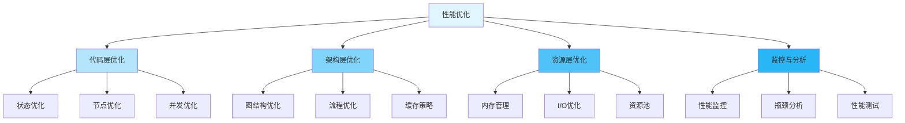

---
title: LangGraph 性能优化指南
date: 2025-01-30
categories:
  - AI
  - LangGraph
---

# LangGraph 性能优化指南

## 一、性能优化体系



## 二、性能分析

### 2.1 性能基准测试

```python
import time
import cProfile
import pstats
from typing import TypedDict
from langgraph.graph import StateGraph, END

class BenchmarkState(TypedDict):
    data: list[int]
    result: int

def expensive_computation(state: BenchmarkState) -> dict:
    """耗时计算"""
    result = sum(x * x for x in state["data"])
    return {"result": result}

class PerformanceProfiler:
    """性能分析器"""

    @staticmethod
    def time_it(func, *args, **kwargs):
        """测量执行时间"""
        start = time.perf_counter()
        result = func(*args, **kwargs)
        duration = time.perf_counter() - start
        return result, duration

    @staticmethod
    def profile_function(func, *args, **kwargs):
        """详细性能分析"""
        profiler = cProfile.Profile()
        profiler.enable()

        result = func(*args, **kwargs)

        profiler.disable()

        # 打印统计信息
        stats = pstats.Stats(profiler)
        stats.sort_stats('cumulative')
        stats.print_stats(10)  # 打印前10个最耗时的函数

        return result

    @staticmethod
    def benchmark_graph(app, state, iterations=100):
        """图性能基准测试"""
        times = []

        for _ in range(iterations):
            start = time.perf_counter()
            app.invoke(state)
            duration = time.perf_counter() - start
            times.append(duration)

        avg_time = sum(times) / len(times)
        min_time = min(times)
        max_time = max(times)

        print(f"\n性能统计 (n={iterations}):")
        print(f"  平均: {avg_time*1000:.2f}ms")
        print(f"  最小: {min_time*1000:.2f}ms")
        print(f"  最大: {max_time*1000:.2f}ms")

        return {
            "avg": avg_time,
            "min": min_time,
            "max": max_time
        }

# 使用示例
def test_performance():
    """性能测试"""
    state = {"data": list(range(10000)), "result": 0}

    # 测量执行时间
    result, duration = PerformanceProfiler.time_it(
        expensive_computation,
        state
    )
    print(f"执行时间: {duration*1000:.2f}ms")

    # 详细性能分析
    result = PerformanceProfiler.profile_function(
        expensive_computation,
        state
    )
```

### 2.2 内存分析

```python
import tracemalloc
import gc
from typing import TypedDict

class MemoryState(TypedDict):
    large_data: list[dict]
    result: dict | None

class MemoryProfiler:
    """内存分析器"""

    def __init__(self):
        self.snapshots = []

    def start(self):
        """开始内存跟踪"""
        gc.collect()
        tracemalloc.start()

    def snapshot(self, label: str = ""):
        """创建内存快照"""
        current, peak = tracemalloc.get_traced_memory()
        self.snapshots.append({
            "label": label,
            "current": current,
            "peak": peak
        })

    def stop(self):
        """停止跟踪并显示报告"""
        tracemalloc.stop()

        print("\n内存使用报告:")
        for snap in self.snapshots:
            print(f"  {snap['label']:20s} - "
                  f"当前: {snap['current']/1024/1024:.2f}MB, "
                  f"峰值: {snap['peak']/1024/1024:.2f}MB")

    @staticmethod
    def compare_snapshots(snap1, snap2, top_n=10):
        """比较两个快照"""
        stats = snap2.compare_to(snap1, 'lineno')

        print(f"\n内存增长 Top {top_n}:")
        for stat in stats[:top_n]:
            print(f"  {stat}")

# 使用示例
def test_memory_usage():
    """内存使用测试"""
    profiler = MemoryProfiler()
    profiler.start()

    # 基线
    profiler.snapshot("基线")

    # 创建大量数据
    state = {
        "large_data": [{"id": i, "data": f"item_{i}"} for i in range(100000)],
        "result": None
    }
    profiler.snapshot("创建数据")

    # 处理数据
    result = {"count": len(state["large_data"])}
    state["result"] = result
    profiler.snapshot("处理数据")

    # 清理
    del state
    gc.collect()
    profiler.snapshot("清理后")

    profiler.stop()
```

## 三、状态优化

### 3.1 减少状态大小

```python
from typing import TypedDict, Annotated
import operator

# ❌ 低效：在状态中保存大量数据
class InefficientState(TypedDict):
    full_documents: list[str]  # 可能非常大
    all_embeddings: list[list[float]]  # 巨大的向量
    complete_history: list[dict]  # 完整历史

# ✅ 高效：只保存必要的引用和摘要
class EfficientState(TypedDict):
    document_ids: list[str]  # 只保存ID
    embedding_cache_key: str  # 缓存键而非数据
    recent_history: Annotated[list[dict], lambda old, new: (old + new)[-10:]]  # 限制大小

# 实现外部存储
class DocumentStore:
    """文档存储（外部）"""

    def __init__(self):
        self._documents = {}
        self._embeddings = {}

    def save_document(self, doc_id: str, content: str):
        """保存文档"""
        self._documents[doc_id] = content

    def get_document(self, doc_id: str) -> str:
        """获取文档"""
        return self._documents.get(doc_id, "")

    def save_embeddings(self, key: str, embeddings: list):
        """保存嵌入向量"""
        self._embeddings[key] = embeddings

    def get_embeddings(self, key: str) -> list:
        """获取嵌入向量"""
        return self._embeddings.get(key, [])

# 使用外部存储的节点
doc_store = DocumentStore()

def optimized_node(state: EfficientState) -> dict:
    """优化的节点 - 使用外部存储"""
    # 从外部存储获取数据
    documents = [doc_store.get_document(doc_id) for doc_id in state["document_ids"]]

    # 处理...
    result_ids = ["doc_1", "doc_2"]

    # 只返回ID
    return {"document_ids": result_ids}
```

### 3.2 避免不必要的复制

```python
from typing import TypedDict
import copy

class DataState(TypedDict):
    config: dict
    large_array: list[int]

# ❌ 低效：深拷贝大数据
def inefficient_node(state: DataState) -> dict:
    new_state = copy.deepcopy(state)  # 深拷贝整个状态！
    new_state["config"]["updated"] = True
    return new_state

# ✅ 高效：只复制需要修改的部分
def efficient_node(state: DataState) -> dict:
    # 只返回需要更新的字段
    updated_config = {**state["config"], "updated": True}
    return {"config": updated_config}
    # large_array 不变，不需要复制

# ✅ 更高效：使用 Reducer 累积
class OptimizedState(TypedDict):
    config: dict
    items: Annotated[list, operator.add]  # 使用 reducer

def optimized_node(state: OptimizedState) -> dict:
    # 只返回新增的项
    return {"items": [1, 2, 3]}  # Reducer 会自动合并
```

### 3.3 懒加载

```python
from typing import TypedDict, Optional
from functools import lru_cache

class LazyState(TypedDict):
    user_id: str
    user_data_loaded: bool
    user_data: Optional[dict]

# 外部数据源（模拟）
@lru_cache(maxsize=128)
def fetch_user_data(user_id: str) -> dict:
    """从数据库获取用户数据（带缓存）"""
    print(f"Fetching data for user: {user_id}")
    # 模拟数据库查询
    return {
        "id": user_id,
        "name": f"User {user_id}",
        "preferences": {"theme": "dark"}
    }

def lazy_load_node(state: LazyState) -> dict:
    """懒加载节点"""
    # 只在需要时加载数据
    if not state.get("user_data_loaded"):
        user_data = fetch_user_data(state["user_id"])
        return {
            "user_data": user_data,
            "user_data_loaded": True
        }

    # 数据已加载，不做任何事
    return {}

def process_node(state: LazyState) -> dict:
    """处理节点 - 可能需要用户数据"""
    if state.get("user_data"):
        # 使用已加载的数据
        theme = state["user_data"]["preferences"]["theme"]
        print(f"Using theme: {theme}")

    return {}
```

## 四、节点优化

### 4.1 批处理

```python
from typing import TypedDict, Annotated
import operator

class BatchState(TypedDict):
    items: Annotated[list[dict], operator.add]
    processed_count: int

# ❌ 低效：逐个处理
def process_one_by_one(state: BatchState) -> dict:
    """逐个处理项目"""
    results = []
    for item in state["items"]:
        # 每次调用都有开销
        result = expensive_api_call(item)
        results.append(result)
    return {"items": results}

# ✅ 高效：批量处理
def process_in_batches(state: BatchState, batch_size: int = 100) -> dict:
    """批量处理项目"""
    items = state["items"]
    results = []

    for i in range(0, len(items), batch_size):
        batch = items[i:i + batch_size]
        # 批量API调用
        batch_results = expensive_api_call_batch(batch)
        results.extend(batch_results)

    return {
        "items": results,
        "processed_count": len(results)
    }

def expensive_api_call(item: dict) -> dict:
    """单个API调用（慢）"""
    import time
    time.sleep(0.01)
    return {"processed": True, **item}

def expensive_api_call_batch(items: list[dict]) -> list[dict]:
    """批量API调用（快）"""
    import time
    time.sleep(0.01)  # 同样的延迟，处理多个项目
    return [{"processed": True, **item} for item in items]

# 性能对比
def benchmark_batch_processing():
    """批处理性能对比"""
    items = [{"id": i} for i in range(1000)]
    state = {"items": items, "processed_count": 0}

    import time

    # 逐个处理
    start = time.time()
    result1 = process_one_by_one({"items": items[:100], "processed_count": 0})
    time1 = time.time() - start
    print(f"逐个处理 100 项: {time1:.2f}s")

    # 批量处理
    start = time.time()
    result2 = process_in_batches({"items": items[:100], "processed_count": 0})
    time2 = time.time() - start
    print(f"批量处理 100 项: {time2:.2f}s")

    print(f"速度提升: {time1/time2:.1f}x")
```

### 4.2 并行处理

```python
import asyncio
from typing import TypedDict
from concurrent.futures import ThreadPoolExecutor, ProcessPoolExecutor

class ParallelState(TypedDict):
    tasks: list[dict]
    results: list[dict]

# ❌ 串行处理
def sequential_processing(state: ParallelState) -> dict:
    """串行处理多个任务"""
    results = []
    for task in state["tasks"]:
        result = process_task(task)
        results.append(result)
    return {"results": results}

# ✅ 线程并行（I/O密集型）
def parallel_processing_threads(state: ParallelState) -> dict:
    """使用线程并行处理（适合I/O密集型）"""
    with ThreadPoolExecutor(max_workers=10) as executor:
        results = list(executor.map(process_task, state["tasks"]))
    return {"results": results}

# ✅ 进程并行（CPU密集型）
def parallel_processing_processes(state: ParallelState) -> dict:
    """使用进程并行处理（适合CPU密集型）"""
    with ProcessPoolExecutor(max_workers=4) as executor:
        results = list(executor.map(cpu_intensive_task, state["tasks"]))
    return {"results": results}

# ✅ 异步并行
async def async_parallel_processing(state: ParallelState) -> dict:
    """异步并行处理"""
    tasks = [async_process_task(task) for task in state["tasks"]]
    results = await asyncio.gather(*tasks)
    return {"results": results}

def process_task(task: dict) -> dict:
    """I/O密集型任务"""
    import time
    time.sleep(0.1)  # 模拟I/O等待
    return {"task_id": task["id"], "result": "done"}

def cpu_intensive_task(task: dict) -> dict:
    """CPU密集型任务"""
    result = sum(i * i for i in range(1000000))
    return {"task_id": task["id"], "result": result}

async def async_process_task(task: dict) -> dict:
    """异步任务"""
    await asyncio.sleep(0.1)
    return {"task_id": task["id"], "result": "done"}

# 性能对比
def benchmark_parallel():
    """并行处理性能对比"""
    import time

    tasks = [{"id": i} for i in range(50)]
    state = {"tasks": tasks, "results": []}

    # 串行
    start = time.time()
    sequential_processing(state)
    seq_time = time.time() - start
    print(f"串行处理: {seq_time:.2f}s")

    # 并行（线程）
    start = time.time()
    parallel_processing_threads(state)
    par_time = time.time() - start
    print(f"并行处理: {par_time:.2f}s")

    print(f"速度提升: {seq_time/par_time:.1f}x")
```

### 4.3 缓存优化

```python
from functools import lru_cache
from typing import TypedDict
import hashlib
import json

class CacheState(TypedDict):
    query: str
    cache_key: str | None
    result: dict | None

# ✅ 函数级缓存
@lru_cache(maxsize=128)
def cached_expensive_function(input_data: str) -> dict:
    """带缓存的耗时函数"""
    import time
    time.sleep(0.5)  # 模拟耗时操作
    return {"result": f"processed_{input_data}"}

# ✅ 状态级缓存
class StateCache:
    """状态缓存管理器"""

    def __init__(self):
        self._cache = {}

    def get_cache_key(self, data: dict) -> str:
        """生成缓存键"""
        # 使用数据的哈希作为键
        json_str = json.dumps(data, sort_keys=True)
        return hashlib.md5(json_str.encode()).hexdigest()

    def get(self, key: str) -> dict | None:
        """获取缓存"""
        return self._cache.get(key)

    def set(self, key: str, value: dict):
        """设置缓存"""
        self._cache[key] = value

    def clear(self):
        """清空缓存"""
        self._cache.clear()

# 全局缓存实例
state_cache = StateCache()

def cached_node(state: CacheState) -> dict:
    """带缓存的节点"""
    # 生成缓存键
    cache_key = state_cache.get_cache_key({"query": state["query"]})

    # 检查缓存
    cached_result = state_cache.get(cache_key)
    if cached_result is not None:
        print("缓存命中！")
        return {
            "cache_key": cache_key,
            "result": cached_result
        }

    # 执行耗时操作
    print("缓存未命中，执行计算...")
    result = cached_expensive_function(state["query"])

    # 保存到缓存
    state_cache.set(cache_key, result)

    return {
        "cache_key": cache_key,
        "result": result
    }

# ✅ 分布式缓存（Redis）
class RedisCache:
    """Redis 缓存"""

    def __init__(self, redis_client):
        self.redis = redis_client

    def get(self, key: str) -> dict | None:
        """从 Redis 获取缓存"""
        value = self.redis.get(key)
        if value:
            return json.loads(value)
        return None

    def set(self, key: str, value: dict, ttl: int = 3600):
        """保存到 Redis"""
        self.redis.setex(
            key,
            ttl,
            json.dumps(value)
        )

# 使用示例
def test_caching():
    """测试缓存性能"""
    import time

    state = {"query": "test query", "cache_key": None, "result": None}

    # 第一次调用（无缓存）
    start = time.time()
    result1 = cached_node(state)
    time1 = time.time() - start
    print(f"第一次调用: {time1:.3f}s")

    # 第二次调用（有缓存）
    start = time.time()
    result2 = cached_node(state)
    time2 = time.time() - start
    print(f"第二次调用: {time2:.3f}s")

    print(f"速度提升: {time1/time2:.1f}x")
```

## 五、图结构优化

### 5.1 减少节点跳转

```python
from langgraph.graph import StateGraph, END
from typing import TypedDict

class OptState(TypedDict):
    value: int
    result: int

# ❌ 低效：多次小跳转
def create_inefficient_graph():
    """低效的图 - 过多的小节点"""
    def add_1(state: OptState) -> dict:
        return {"value": state["value"] + 1}

    def add_2(state: OptState) -> dict:
        return {"value": state["value"] + 2}

    def add_3(state: OptState) -> dict:
        return {"value": state["value"] + 3}

    graph = StateGraph(OptState)
    graph.add_node("step1", add_1)
    graph.add_node("step2", add_2)
    graph.add_node("step3", add_3)

    graph.set_entry_point("step1")
    graph.add_edge("step1", "step2")
    graph.add_edge("step2", "step3")
    graph.add_edge("step3", END)

    return graph.compile()

# ✅ 高效：合并节点
def create_efficient_graph():
    """高效的图 - 合并相关操作"""
    def add_all(state: OptState) -> dict:
        # 在一个节点中完成所有操作
        return {"value": state["value"] + 1 + 2 + 3}

    graph = StateGraph(OptState)
    graph.add_node("combined", add_all)

    graph.set_entry_point("combined")
    graph.add_edge("combined", END)

    return graph.compile()

# 性能对比
def benchmark_graph_structure():
    """图结构性能对比"""
    import time

    state = {"value": 0, "result": 0}

    # 低效图
    inefficient_app = create_inefficient_graph()
    start = time.time()
    for _ in range(1000):
        inefficient_app.invoke(state)
    time1 = time.time() - start
    print(f"低效图: {time1:.3f}s")

    # 高效图
    efficient_app = create_efficient_graph()
    start = time.time()
    for _ in range(1000):
        efficient_app.invoke(state)
    time2 = time.time() - start
    print(f"高效图: {time2:.3f}s")

    print(f"速度提升: {time1/time2:.1f}x")
```

### 5.2 条件路由优化

```python
class RouteState(TypedDict):
    category: str
    priority: int
    result: str

# ❌ 低效：链式条件检查
def inefficient_router(state: RouteState) -> str:
    """低效的路由 - 顺序检查"""
    if state["category"] == "A":
        return "handler_a"
    elif state["category"] == "B":
        return "handler_b"
    elif state["category"] == "C":
        return "handler_c"
    # ... 更多条件
    else:
        return "default"

# ✅ 高效：查找表
ROUTE_MAP = {
    "A": "handler_a",
    "B": "handler_b",
    "C": "handler_c",
    # ... 更多映射
}

def efficient_router(state: RouteState) -> str:
    """高效的路由 - 字典查找 O(1)"""
    return ROUTE_MAP.get(state["category"], "default")

# ✅ 更高效：考虑优先级的快速路由
def optimized_router(state: RouteState) -> str:
    """优化的路由 - 先检查常见情况"""
    # 快速路径：处理最常见的情况
    if state["priority"] > 5:
        return "high_priority_handler"

    # 正常路径：使用查找表
    return ROUTE_MAP.get(state["category"], "default")
```

### 5.3 避免不必要的分支

```python
class BranchState(TypedDict):
    needs_processing: bool
    data: dict

# ❌ 低效：即使不需要也创建分支
def create_inefficient_branching():
    """低效的分支"""
    def check(state: BranchState) -> str:
        if state["needs_processing"]:
            return "process"
        else:
            return "skip"

    def process(state: BranchState) -> dict:
        return {"data": {"processed": True}}

    def skip(state: BranchState) -> dict:
        return {}  # 什么都不做

    graph = StateGraph(BranchState)
    graph.add_node("process", process)
    graph.add_node("skip", skip)

    graph.set_conditional_entry_point(check, {
        "process": "process",
        "skip": "skip"
    })

    graph.add_edge("process", END)
    graph.add_edge("skip", END)

    return graph.compile()

# ✅ 高效：在节点内部条件处理
def create_efficient_branching():
    """高效的方式 - 减少节点"""
    def conditional_process(state: BranchState) -> dict:
        if state["needs_processing"]:
            return {"data": {"processed": True}}
        return {}  # 不需要处理时直接返回

    graph = StateGraph(BranchState)
    graph.add_node("process", conditional_process)

    graph.set_entry_point("process")
    graph.add_edge("process", END)

    return graph.compile()
```

## 六、资源管理优化

### 6.1 连接池

```python
from typing import TypedDict
import queue
import threading

class ConnectionPool:
    """连接池管理器"""

    def __init__(self, create_connection, max_size=10):
        self.create_connection = create_connection
        self.max_size = max_size
        self.pool = queue.Queue(maxsize=max_size)
        self.size = 0
        self.lock = threading.Lock()

    def get_connection(self):
        """获取连接"""
        try:
            # 尝试从池中获取
            return self.pool.get_nowait()
        except queue.Empty:
            # 池为空，创建新连接
            with self.lock:
                if self.size < self.max_size:
                    self.size += 1
                    return self.create_connection()
                else:
                    # 等待可用连接
                    return self.pool.get()

    def return_connection(self, conn):
        """归还连接"""
        try:
            self.pool.put_nowait(conn)
        except queue.Full:
            # 池已满，关闭连接
            conn.close()
            with self.lock:
                self.size -= 1

    def __enter__(self):
        """上下文管理器"""
        self.conn = self.get_connection()
        return self.conn

    def __exit__(self, exc_type, exc_val, exc_tb):
        """归还连接"""
        self.return_connection(self.conn)

# 使用示例
def create_db_connection():
    """创建数据库连接（示例）"""
    class FakeConnection:
        def query(self, sql):
            return {"result": "data"}
        def close(self):
            pass
    return FakeConnection()

# 创建连接池
db_pool = ConnectionPool(create_db_connection, max_size=5)

class PoolState(TypedDict):
    query: str
    result: dict | None

def node_with_pool(state: PoolState) -> dict:
    """使用连接池的节点"""
    with db_pool as conn:
        result = conn.query(state["query"])
    return {"result": result}
```

### 6.2 内存限制

```python
from typing import TypedDict, Annotated
import sys

class LimitedState(TypedDict):
    items: list[dict]
    summary: dict

# ✅ 限制列表大小
def limit_list_size(old: list, new: list, max_size: int = 1000) -> list:
    """限制列表大小的 Reducer"""
    combined = old + new
    if len(combined) > max_size:
        # 只保留最新的项
        return combined[-max_size:]
    return combined

class SizeLimitedState(TypedDict):
    items: Annotated[list, lambda old, new: limit_list_size(old, new, max_size=100)]

# ✅ 监控内存使用
class MemoryGuard:
    """内存监控器"""

    @staticmethod
    def get_object_size(obj) -> int:
        """获取对象大小（字节）"""
        return sys.getsizeof(obj)

    @staticmethod
    def check_state_size(state: dict, max_mb: float = 100):
        """检查状态大小"""
        total_size = 0
        for key, value in state.items():
            size = sys.getsizeof(value)
            total_size += size

            if size > max_mb * 1024 * 1024:
                raise ValueError(
                    f"State field '{key}' exceeds {max_mb}MB: "
                    f"{size/1024/1024:.2f}MB"
                )

        return total_size

def memory_aware_node(state: dict) -> dict:
    """内存感知的节点"""
    # 检查输入状态大小
    MemoryGuard.check_state_size(state, max_mb=50)

    # 处理...
    result = {"data": "processed"}

    # 检查输出大小
    MemoryGuard.check_state_size(result, max_mb=50)

    return result
```

### 6.3 资源清理

```python
import weakref
from typing import TypedDict
from contextlib import contextmanager

class ResourceState(TypedDict):
    resource_id: str
    data: dict | None

class ResourceManager:
    """资源管理器"""

    def __init__(self):
        self._resources = weakref.WeakValueDictionary()
        self._cleanup_handlers = []

    def acquire(self, resource_id: str):
        """获取资源"""
        if resource_id not in self._resources:
            resource = self._create_resource(resource_id)
            self._resources[resource_id] = resource
        return self._resources[resource_id]

    def release(self, resource_id: str):
        """释放资源"""
        if resource_id in self._resources:
            resource = self._resources[resource_id]
            self._cleanup_resource(resource)
            del self._resources[resource_id]

    def _create_resource(self, resource_id: str):
        """创建资源"""
        print(f"Creating resource: {resource_id}")
        return {"id": resource_id, "data": {}}

    def _cleanup_resource(self, resource):
        """清理资源"""
        print(f"Cleaning up resource: {resource['id']}")
        resource["data"].clear()

    @contextmanager
    def use_resource(self, resource_id: str):
        """资源上下文管理器"""
        resource = self.acquire(resource_id)
        try:
            yield resource
        finally:
            # 自动清理（通过弱引用，不再使用时会自动回收）
            pass

# 使用示例
resource_manager = ResourceManager()

def node_with_resource(state: ResourceState) -> dict:
    """使用资源的节点"""
    with resource_manager.use_resource(state["resource_id"]) as resource:
        # 使用资源
        data = resource["data"]
        # 处理...
        return {"data": data}
```

## 七、监控与分析

### 7.1 性能监控

```python
import time
from typing import TypedDict, Callable
from collections import defaultdict

class PerformanceMonitor:
    """性能监控器"""

    def __init__(self):
        self.metrics = defaultdict(list)

    def record_time(self, operation: str, duration: float):
        """记录时间"""
        self.metrics[f"{operation}_time"].append(duration)

    def record_count(self, operation: str, count: int):
        """记录计数"""
        self.metrics[f"{operation}_count"].append(count)

    def get_stats(self, operation: str):
        """获取统计信息"""
        times = self.metrics.get(f"{operation}_time", [])
        if not times:
            return None

        return {
            "count": len(times),
            "avg": sum(times) / len(times),
            "min": min(times),
            "max": max(times),
            "total": sum(times)
        }

    def print_report(self):
        """打印报告"""
        print("\n=== 性能报告 ===")
        operations = set(key.rsplit("_", 1)[0] for key in self.metrics.keys())

        for op in operations:
            stats = self.get_stats(op)
            if stats:
                print(f"\n{op}:")
                print(f"  调用次数: {stats['count']}")
                print(f"  平均时间: {stats['avg']*1000:.2f}ms")
                print(f"  最小时间: {stats['min']*1000:.2f}ms")
                print(f"  最大时间: {stats['max']*1000:.2f}ms")
                print(f"  总时间: {stats['total']*1000:.2f}ms")

    def monitor(self, operation: str):
        """装饰器：监控函数执行"""
        def decorator(func: Callable):
            def wrapper(*args, **kwargs):
                start = time.perf_counter()
                result = func(*args, **kwargs)
                duration = time.perf_counter() - start

                self.record_time(operation, duration)
                return result
            return wrapper
        return decorator

# 全局监控器
monitor = PerformanceMonitor()

# 使用示例
@monitor.monitor("node_execution")
def monitored_node(state: dict) -> dict:
    """被监控的节点"""
    time.sleep(0.1)  # 模拟处理
    return {"result": "done"}

def test_monitoring():
    """测试监控"""
    state = {}

    # 执行多次
    for _ in range(10):
        monitored_node(state)

    # 打印报告
    monitor.print_report()
```

### 7.2 性能追踪

```python
import time
from typing import TypedDict
from contextlib import contextmanager

class PerformanceTracer:
    """性能追踪器"""

    def __init__(self):
        self.traces = []
        self.current_trace = None

    @contextmanager
    def trace(self, name: str, **metadata):
        """追踪上下文"""
        trace_id = len(self.traces)
        start = time.perf_counter()

        trace = {
            "id": trace_id,
            "name": name,
            "metadata": metadata,
            "start": start,
            "children": []
        }

        # 保存父追踪
        parent_trace = self.current_trace
        if parent_trace:
            parent_trace["children"].append(trace)

        self.current_trace = trace

        try:
            yield trace
        finally:
            # 记录结束时间
            trace["end"] = time.perf_counter()
            trace["duration"] = trace["end"] - trace["start"]

            # 恢复父追踪
            self.current_trace = parent_trace

            # 如果是顶层追踪，添加到列表
            if parent_trace is None:
                self.traces.append(trace)

    def print_traces(self, trace=None, indent=0):
        """打印追踪树"""
        traces_to_print = [trace] if trace else self.traces

        for t in traces_to_print:
            prefix = "  " * indent
            print(f"{prefix}{t['name']}: {t['duration']*1000:.2f}ms")

            if t.get("metadata"):
                print(f"{prefix}  Metadata: {t['metadata']}")

            for child in t.get("children", []):
                self.print_traces(child, indent + 1)

# 全局追踪器
tracer = PerformanceTracer()

def traced_node(state: dict) -> dict:
    """带追踪的节点"""
    with tracer.trace("node_execution", node_type="processing"):
        with tracer.trace("data_loading"):
            time.sleep(0.05)

        with tracer.trace("computation"):
            time.sleep(0.1)

        with tracer.trace("result_formatting"):
            time.sleep(0.02)

    return {"result": "done"}

def test_tracing():
    """测试追踪"""
    state = {}
    traced_node(state)

    print("\n=== 性能追踪 ===")
    tracer.print_traces()
```

## 八、性能优化清单

### 8.1 代码层优化清单

- ✅ 最小化状态大小
- ✅ 使用外部存储存放大数据
- ✅ 避免不必要的深拷贝
- ✅ 使用适当的 Reducer
- ✅ 实现懒加载
- ✅ 使用批处理
- ✅ 启用并行处理
- ✅ 添加缓存层
- ✅ 优化查找和路由

### 8.2 架构层优化清单

- ✅ 合并相关节点
- ✅ 减少不必要的分支
- ✅ 优化条件路由
- ✅ 使用高效的图结构
- ✅ 实现流式处理
- ✅ 设计合理的分层

### 8.3 资源层优化清单

- ✅ 使用连接池
- ✅ 限制内存使用
- ✅ 及时释放资源
- ✅ 监控资源使用
- ✅ 实现资源复用

### 8.4 监控层优化清单

- ✅ 添加性能监控
- ✅ 实现性能追踪
- ✅ 记录关键指标
- ✅ 定期性能测试
- ✅ 建立性能基线

## 九、性能优化案例

### 案例：优化大规模文档处理

```python
# 优化前后对比
```

详细案例请参考实际项目文档。

## 十、总结

性能优化是一个持续的过程，需要：

1. **测量优先**：先测量，找到真正的瓶颈
2. **针对性优化**：针对瓶颈进行优化
3. **权衡取舍**：性能 vs 可读性 vs 维护性
4. **持续监控**：生产环境持续监控性能

---

**下一步：** 学习 [10.高级特性详解](./10.高级特性详解.md) 掌握高级功能！
