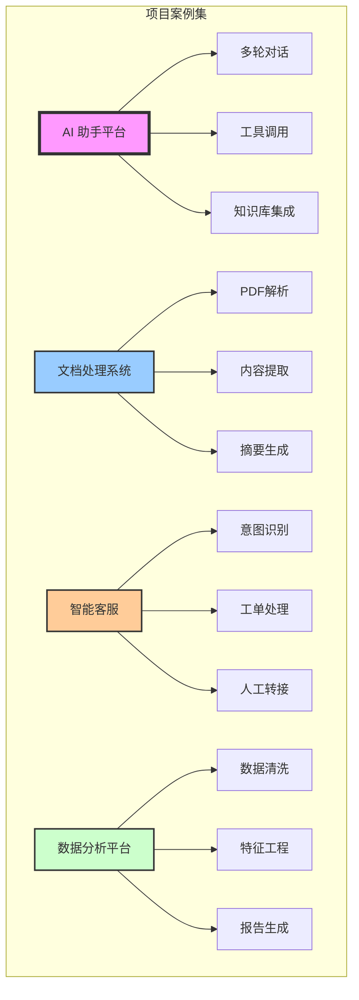
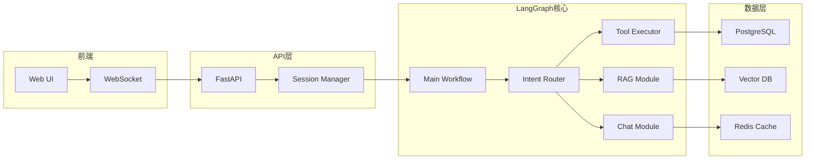

---
title: LangGraph 实际项目案例
date: 2025-09-30
categories:
  - AI
  - LangGraph
---

# LangGraph 实际项目案例

## 概述

本文档展示了使用 LangGraph 构建的实际项目案例，包括完整的代码实现和架构设计。



## 项目一：企业级 AI 助手平台

### 项目概述

一个完整的企业级 AI 助手平台，支持多轮对话、工具调用、知识库检索和人工审批。

### 架构设计



### 完整实现

```python
# src/ai_assistant/main_workflow.py
from typing import TypedDict, List, Dict, Annotated, Optional, Literal
from operator import add
from langgraph.graph import StateGraph, END
from langgraph.checkpoint import SqliteSaver
from datetime import datetime
import uuid

# 1. 状态定义
class AssistantState(TypedDict):
    # 会话信息
    session_id: str
    user_id: str
    conversation_id: str

    # 消息历史
    messages: Annotated[List[Dict], add]

    # 当前处理
    current_query: str
    intent: Optional[str]
    confidence: float

    # 工具调用
    tools_to_call: List[str]
    tool_results: Annotated[List[Dict], add]

    # RAG 相关
    retrieved_docs: List[Dict]
    context: str

    # 响应生成
    draft_response: str
    final_response: str

    # 控制流
    requires_approval: bool
    approval_status: Optional[Literal["pending", "approved", "rejected"]]
    error: Optional[str]

    # 元数据
    processing_time: float
    tokens_used: int

# 2. 主工作流
class AIAssistantWorkflow:
    """企业级AI助手工作流"""

    def __init__(self):
        self.workflow = StateGraph(AssistantState)
        self.checkpointer = SqliteSaver.from_conn_string("assistant.db")
        self._setup_workflow()

    def _setup_workflow(self):
        """设置工作流"""
        # 添加节点
        self.workflow.add_node("receive_input", self.receive_input_node)
        self.workflow.add_node("analyze_intent", self.analyze_intent_node)
        self.workflow.add_node("retrieve_context", self.retrieve_context_node)
        self.workflow.add_node("select_tools", self.select_tools_node)
        self.workflow.add_node("execute_tools", self.execute_tools_node)
        self.workflow.add_node("generate_response", self.generate_response_node)
        self.workflow.add_node("check_approval", self.check_approval_node)
        self.workflow.add_node("human_approval", self.human_approval_node)
        self.workflow.add_node("finalize", self.finalize_node)
        self.workflow.add_node("error_handler", self.error_handler_node)

        # 设置入口
        self.workflow.set_entry_point("receive_input")

        # 添加边
        self.workflow.add_edge("receive_input", "analyze_intent")

        # 意图路由
        self.workflow.add_conditional_edges(
            "analyze_intent",
            self.route_by_intent,
            {
                "needs_context": "retrieve_context",
                "needs_tools": "select_tools",
                "direct_response": "generate_response",
                "error": "error_handler"
            }
        )

        self.workflow.add_edge("retrieve_context", "generate_response")
        self.workflow.add_edge("select_tools", "execute_tools")
        self.workflow.add_edge("execute_tools", "generate_response")
        self.workflow.add_edge("generate_response", "check_approval")

        # 审批路由
        self.workflow.add_conditional_edges(
            "check_approval",
            lambda s: "approve" if s["requires_approval"] else "finalize",
            {
                "approve": "human_approval",
                "finalize": "finalize"
            }
        )

        self.workflow.add_conditional_edges(
            "human_approval",
            lambda s: "finalize" if s["approval_status"] == "approved" else "regenerate",
            {
                "finalize": "finalize",
                "regenerate": "generate_response"
            }
        )

        self.workflow.add_edge("finalize", END)
        self.workflow.add_edge("error_handler", END)

    # 3. 节点实现
    def receive_input_node(self, state: AssistantState) -> Dict:
        """接收用户输入"""
        import time
        start_time = time.time()

        # 生成会话ID
        if not state.get("session_id"):
            session_id = str(uuid.uuid4())
        else:
            session_id = state["session_id"]

        # 添加用户消息
        user_message = {
            "role": "user",
            "content": state["current_query"],
            "timestamp": datetime.now().isoformat()
        }

        return {
            "session_id": session_id,
            "messages": [user_message],
            "processing_time": time.time() - start_time
        }

    def analyze_intent_node(self, state: AssistantState) -> Dict:
        """分析用户意图"""
        from langchain_openai import ChatOpenAI

        llm = ChatOpenAI(model="gpt-4")

        prompt = f"""
        分析用户查询的意图：
        用户查询: {state['current_query']}

        可能的意图:
        - question: 问答查询
        - task: 任务执行
        - search: 信息搜索
        - analysis: 数据分析
        - conversation: 闲聊

        返回格式:
        意图: <intent>
        置信度: <0-1的数字>
        需要工具: <yes/no>
        需要上下文: <yes/no>
        """

        response = llm.invoke(prompt)

        # 解析响应
        lines = response.content.split('\n')
        intent = "question"  # 默认
        confidence = 0.5
        needs_tools = False
        needs_context = False

        for line in lines:
            if "意图:" in line:
                intent = line.split(":")[-1].strip()
            elif "置信度:" in line:
                confidence = float(line.split(":")[-1].strip())
            elif "需要工具:" in line:
                needs_tools = "yes" in line.lower()
            elif "需要上下文:" in line:
                needs_context = "yes" in line.lower()

        return {
            "intent": intent,
            "confidence": confidence,
            "tools_to_call": ["search", "calculate"] if needs_tools else [],
            "requires_context": needs_context
        }

    def route_by_intent(self, state: AssistantState) -> str:
        """根据意图路由"""
        if state.get("error"):
            return "error"

        if state.get("requires_context", False):
            return "needs_context"

        if state.get("tools_to_call"):
            return "needs_tools"

        return "direct_response"

    def retrieve_context_node(self, state: AssistantState) -> Dict:
        """检索相关上下文"""
        from langchain.vectorstores import Chroma
        from langchain.embeddings import OpenAIEmbeddings

        # 初始化向量数据库
        embeddings = OpenAIEmbeddings()
        vectorstore = Chroma(
            collection_name="knowledge_base",
            embedding_function=embeddings
        )

        # 检索相关文档
        docs = vectorstore.similarity_search(
            state["current_query"],
            k=5
        )

        # 构建上下文
        context_parts = []
        retrieved_docs = []

        for doc in docs:
            context_parts.append(doc.page_content)
            retrieved_docs.append({
                "content": doc.page_content,
                "metadata": doc.metadata
            })

        return {
            "retrieved_docs": retrieved_docs,
            "context": "\n\n".join(context_parts)
        }

    def select_tools_node(self, state: AssistantState) -> Dict:
        """选择要执行的工具"""
        from langchain.tools import Tool

        available_tools = {
            "search": Tool(
                name="search",
                func=self.search_tool,
                description="Search for information"
            ),
            "calculate": Tool(
                name="calculate",
                func=self.calculate_tool,
                description="Perform calculations"
            ),
            "database": Tool(
                name="database",
                func=self.database_tool,
                description="Query database"
            ),
            "api": Tool(
                name="api",
                func=self.api_tool,
                description="Call external API"
            )
        }

        # 根据意图选择工具
        intent = state.get("intent", "")
        selected_tools = []

        if "search" in state.get("tools_to_call", []):
            selected_tools.append("search")

        if "calculate" in state.get("tools_to_call", []):
            selected_tools.append("calculate")

        if intent == "analysis":
            selected_tools.append("database")

        return {"tools_to_call": selected_tools}

    def execute_tools_node(self, state: AssistantState) -> Dict:
        """执行选定的工具"""
        tool_results = []

        for tool_name in state.get("tools_to_call", []):
            try:
                if tool_name == "search":
                    result = self.search_tool(state["current_query"])
                elif tool_name == "calculate":
                    result = self.calculate_tool(state["current_query"])
                elif tool_name == "database":
                    result = self.database_tool(state["current_query"])
                elif tool_name == "api":
                    result = self.api_tool(state["current_query"])
                else:
                    result = {"error": f"Unknown tool: {tool_name}"}

                tool_results.append({
                    "tool": tool_name,
                    "result": result,
                    "timestamp": datetime.now().isoformat()
                })
            except Exception as e:
                tool_results.append({
                    "tool": tool_name,
                    "error": str(e)
                })

        return {"tool_results": tool_results}

    def generate_response_node(self, state: AssistantState) -> Dict:
        """生成响应"""
        from langchain_openai import ChatOpenAI

        llm = ChatOpenAI(model="gpt-4", temperature=0.7)

        # 构建提示
        messages = state.get("messages", [])
        context = state.get("context", "")
        tool_results = state.get("tool_results", [])

        prompt = f"""
        基于以下信息生成响应：

        用户查询: {state['current_query']}

        历史对话:
        {self._format_messages(messages)}

        相关上下文:
        {context}

        工具执行结果:
        {self._format_tool_results(tool_results)}

        请生成一个专业、准确、有帮助的响应。
        """

        response = llm.invoke(prompt)

        # 检查是否需要审批
        requires_approval = self._check_requires_approval(response.content)

        return {
            "draft_response": response.content,
            "requires_approval": requires_approval,
            "tokens_used": len(response.content.split())
        }

    def check_approval_node(self, state: AssistantState) -> Dict:
        """检查是否需要人工审批"""
        # 审批规则
        keywords_requiring_approval = [
            "delete", "remove", "payment", "transfer",
            "sensitive", "confidential", "private"
        ]

        response = state.get("draft_response", "").lower()

        requires_approval = any(
            keyword in response
            for keyword in keywords_requiring_approval
        )

        # 高风险操作需要审批
        if state.get("intent") in ["task", "analysis"] and state.get("confidence", 0) < 0.8:
            requires_approval = True

        return {"requires_approval": requires_approval}

    def human_approval_node(self, state: AssistantState) -> Dict:
        """人工审批节点"""
        # 实际应用中，这里会发送到审批队列
        # 这里模拟审批过程
        import random

        # 模拟审批决策
        approval_status = random.choice(["approved", "rejected"])

        if approval_status == "rejected":
            return {
                "approval_status": "rejected",
                "draft_response": "抱歉，该操作需要更高权限或不符合政策。"
            }

        return {"approval_status": "approved"}

    def finalize_node(self, state: AssistantState) -> Dict:
        """完成处理"""
        import time

        # 添加助手消息
        assistant_message = {
            "role": "assistant",
            "content": state.get("draft_response", ""),
            "timestamp": datetime.now().isoformat()
        }

        # 保存到数据库
        self._save_to_database(state)

        # 更新缓存
        self._update_cache(state)

        return {
            "final_response": state.get("draft_response", ""),
            "messages": [assistant_message],
            "processing_time": time.time() - state.get("processing_time", 0)
        }

    def error_handler_node(self, state: AssistantState) -> Dict:
        """错误处理"""
        error_message = f"处理请求时出错: {state.get('error', 'Unknown error')}"

        return {
            "final_response": error_message,
            "messages": [{
                "role": "system",
                "content": error_message,
                "timestamp": datetime.now().isoformat()
            }]
        }

    # 4. 辅助方法
    def search_tool(self, query: str) -> Dict:
        """搜索工具"""
        # 实现搜索逻辑
        return {"results": f"Search results for: {query}"}

    def calculate_tool(self, expression: str) -> Dict:
        """计算工具"""
        try:
            result = eval(expression)  # 生产环境应使用安全的表达式求值
            return {"result": result}
        except:
            return {"error": "Invalid expression"}

    def database_tool(self, query: str) -> Dict:
        """数据库查询工具"""
        # 实现数据库查询
        return {"data": "Database query results"}

    def api_tool(self, endpoint: str) -> Dict:
        """API调用工具"""
        # 实现API调用
        return {"response": "API response"}

    def _format_messages(self, messages: List[Dict]) -> str:
        """格式化消息历史"""
        formatted = []
        for msg in messages[-5:]:  # 只取最近5条
            formatted.append(f"{msg['role']}: {msg['content']}")
        return "\n".join(formatted)

    def _format_tool_results(self, results: List[Dict]) -> str:
        """格式化工具结果"""
        formatted = []
        for result in results:
            formatted.append(f"{result['tool']}: {result.get('result', result.get('error', 'N/A'))}")
        return "\n".join(formatted)

    def _check_requires_approval(self, response: str) -> bool:
        """检查是否需要审批"""
        sensitive_keywords = ["delete", "payment", "confidential"]
        return any(keyword in response.lower() for keyword in sensitive_keywords)

    def _save_to_database(self, state: AssistantState):
        """保存到数据库"""
        # 实现数据库保存逻辑
        pass

    def _update_cache(self, state: AssistantState):
        """更新缓存"""
        # 实现缓存更新逻辑
        pass

    def compile(self):
        """编译工作流"""
        return self.workflow.compile(checkpointer=self.checkpointer)

# 5. API 接口
from fastapi import FastAPI, WebSocket, HTTPException
from fastapi.responses import JSONResponse
import asyncio

app = FastAPI(title="AI Assistant API")

# 初始化工作流
assistant_workflow = AIAssistantWorkflow().compile()

@app.post("/api/chat")
async def chat_endpoint(
    user_id: str,
    message: str,
    session_id: Optional[str] = None
):
    """聊天接口"""
    try:
        # 准备输入状态
        input_state = {
            "user_id": user_id,
            "current_query": message,
            "session_id": session_id or str(uuid.uuid4()),
            "messages": [],
            "tool_results": [],
            "processing_time": 0
        }

        # 配置
        config = {
            "configurable": {
                "thread_id": input_state["session_id"]
            }
        }

        # 执行工作流
        result = await assistant_workflow.ainvoke(input_state, config)

        return JSONResponse({
            "session_id": result["session_id"],
            "response": result["final_response"],
            "processing_time": result.get("processing_time", 0),
            "tokens_used": result.get("tokens_used", 0)
        })

    except Exception as e:
        raise HTTPException(status_code=500, detail=str(e))

@app.websocket("/ws/chat/{session_id}")
async def websocket_chat(websocket: WebSocket, session_id: str):
    """WebSocket 实时聊天"""
    await websocket.accept()

    try:
        while True:
            # 接收消息
            data = await websocket.receive_json()

            # 准备输入
            input_state = {
                "user_id": data.get("user_id"),
                "current_query": data.get("message"),
                "session_id": session_id,
                "messages": [],
                "tool_results": [],
                "processing_time": 0
            }

            config = {
                "configurable": {
                    "thread_id": session_id
                }
            }

            # 流式执行
            async for chunk in assistant_workflow.astream(input_state, config):
                # 发送中间状态
                await websocket.send_json({
                    "type": "progress",
                    "data": chunk
                })

            # 发送最终结果
            await websocket.send_json({
                "type": "response",
                "data": {
                    "response": chunk.get("final_response"),
                    "processing_time": chunk.get("processing_time")
                }
            })

    except Exception as e:
        await websocket.send_json({
            "type": "error",
            "error": str(e)
        })
    finally:
        await websocket.close()

# 6. Docker 配置
"""
# Dockerfile
FROM python:3.11-slim

WORKDIR /app

COPY requirements.txt .
RUN pip install -r requirements.txt

COPY . .

CMD ["uvicorn", "src.ai_assistant.main_workflow:app", "--host", "0.0.0.0", "--port", "8000"]
"""

# 7. 部署配置
"""
# kubernetes/deployment.yaml
apiVersion: apps/v1
kind: Deployment
metadata:
  name: ai-assistant
spec:
  replicas: 3
  selector:
    matchLabels:
      app: ai-assistant
  template:
    metadata:
      labels:
        app: ai-assistant
    spec:
      containers:
      - name: ai-assistant
        image: ai-assistant:latest
        ports:
        - containerPort: 8000
        env:
        - name: OPENAI_API_KEY
          valueFrom:
            secretKeyRef:
              name: ai-secrets
              key: openai-api-key
        resources:
          requests:
            memory: "2Gi"
            cpu: "1000m"
          limits:
            memory: "4Gi"
            cpu: "2000m"
"""
```

## 项目二：智能文档处理系统

### 项目概述

自动化文档处理系统，支持 PDF 解析、内容提取、分类和摘要生成。

### 实现代码

```python
# src/document_processor/workflow.py
from typing import TypedDict, List, Dict, Annotated
from operator import add
from langgraph.graph import StateGraph, END
import PyPDF2
import numpy as np

class DocumentState(TypedDict):
    # 输入
    file_path: str
    file_type: str

    # 处理阶段
    raw_text: str
    chunks: List[Dict]
    embeddings: List[List[float]]

    # 分析结果
    document_type: str
    key_entities: List[str]
    summary: str
    extracted_data: Dict

    # 元数据
    page_count: int
    word_count: int
    processing_status: str

class DocumentProcessor:
    """文档处理工作流"""

    def __init__(self):
        self.workflow = StateGraph(DocumentState)
        self._setup_workflow()

    def _setup_workflow(self):
        # 添加节点
        self.workflow.add_node("parse_document", self.parse_document_node)
        self.workflow.add_node("chunk_text", self.chunk_text_node)
        self.workflow.add_node("generate_embeddings", self.generate_embeddings_node)
        self.workflow.add_node("classify_document", self.classify_document_node)
        self.workflow.add_node("extract_entities", self.extract_entities_node)
        self.workflow.add_node("generate_summary", self.generate_summary_node)
        self.workflow.add_node("extract_structured_data", self.extract_structured_data_node)
        self.workflow.add_node("quality_check", self.quality_check_node)
        self.workflow.add_node("save_results", self.save_results_node)

        # 设置流程
        self.workflow.set_entry_point("parse_document")
        self.workflow.add_edge("parse_document", "chunk_text")
        self.workflow.add_edge("chunk_text", "generate_embeddings")

        # 并行处理
        self.workflow.add_edge("generate_embeddings", "classify_document")
        self.workflow.add_edge("generate_embeddings", "extract_entities")
        self.workflow.add_edge("generate_embeddings", "generate_summary")

        # 汇聚结果
        self.workflow.add_edge("classify_document", "extract_structured_data")
        self.workflow.add_edge("extract_entities", "extract_structured_data")
        self.workflow.add_edge("generate_summary", "extract_structured_data")

        self.workflow.add_edge("extract_structured_data", "quality_check")

        # 条件结束
        self.workflow.add_conditional_edges(
            "quality_check",
            lambda s: "save" if s["processing_status"] == "success" else "retry",
            {
                "save": "save_results",
                "retry": "parse_document"  # 重试
            }
        )

        self.workflow.add_edge("save_results", END)

    def parse_document_node(self, state: DocumentState) -> Dict:
        """解析文档"""
        file_path = state["file_path"]
        file_type = state.get("file_type", "pdf")

        if file_type == "pdf":
            text = self._parse_pdf(file_path)
        elif file_type == "docx":
            text = self._parse_docx(file_path)
        else:
            text = self._parse_text(file_path)

        return {
            "raw_text": text,
            "word_count": len(text.split()),
            "processing_status": "parsed"
        }

    def chunk_text_node(self, state: DocumentState) -> Dict:
        """文本分块"""
        text = state["raw_text"]
        chunks = []

        # 智能分块
        chunk_size = 1000
        overlap = 200

        for i in range(0, len(text), chunk_size - overlap):
            chunk = text[i:i + chunk_size]
            chunks.append({
                "text": chunk,
                "start": i,
                "end": min(i + chunk_size, len(text))
            })

        return {"chunks": chunks}

    def generate_embeddings_node(self, state: DocumentState) -> Dict:
        """生成向量嵌入"""
        from langchain.embeddings import OpenAIEmbeddings

        embeddings_model = OpenAIEmbeddings()
        chunks = state["chunks"]

        # 批量生成嵌入
        texts = [chunk["text"] for chunk in chunks]
        embeddings = embeddings_model.embed_documents(texts)

        return {"embeddings": embeddings}

    def classify_document_node(self, state: DocumentState) -> Dict:
        """文档分类"""
        from langchain_openai import ChatOpenAI

        llm = ChatOpenAI(model="gpt-4")
        text_sample = state["raw_text"][:2000]

        prompt = f"""
        分类以下文档：
        {text_sample}

        可能的类别：
        - 合同
        - 报告
        - 发票
        - 简历
        - 技术文档
        - 其他

        返回最匹配的类别。
        """

        response = llm.invoke(prompt)
        document_type = response.content.strip()

        return {"document_type": document_type}

    def extract_entities_node(self, state: DocumentState) -> Dict:
        """提取实体"""
        import spacy

        nlp = spacy.load("en_core_web_sm")
        doc = nlp(state["raw_text"][:5000])  # 处理前5000字符

        entities = []
        for ent in doc.ents:
            entities.append({
                "text": ent.text,
                "type": ent.label_
            })

        # 去重
        unique_entities = list({e["text"]: e for e in entities}.values())

        return {"key_entities": unique_entities[:20]}  # 返回前20个实体

    def generate_summary_node(self, state: DocumentState) -> Dict:
        """生成摘要"""
        from langchain_openai import ChatOpenAI

        llm = ChatOpenAI(model="gpt-4")
        text = state["raw_text"][:3000]

        prompt = f"""
        为以下文档生成简洁的摘要（200字以内）：
        {text}
        """

        response = llm.invoke(prompt)

        return {"summary": response.content}

    def extract_structured_data_node(self, state: DocumentState) -> Dict:
        """提取结构化数据"""
        document_type = state.get("document_type", "other")

        if document_type == "发票":
            extracted = self._extract_invoice_data(state)
        elif document_type == "合同":
            extracted = self._extract_contract_data(state)
        elif document_type == "简历":
            extracted = self._extract_resume_data(state)
        else:
            extracted = {}

        return {"extracted_data": extracted}

    def quality_check_node(self, state: DocumentState) -> Dict:
        """质量检查"""
        # 检查必要字段
        required_fields = ["raw_text", "chunks", "summary"]
        missing_fields = [f for f in required_fields if not state.get(f)]

        if missing_fields:
            return {"processing_status": "failed", "error": f"Missing: {missing_fields}"}

        # 检查质量
        if state["word_count"] < 10:
            return {"processing_status": "failed", "error": "Document too short"}

        return {"processing_status": "success"}

    def save_results_node(self, state: DocumentState) -> Dict:
        """保存结果"""
        import json

        # 准备保存的数据
        results = {
            "file_path": state["file_path"],
            "document_type": state["document_type"],
            "summary": state["summary"],
            "entities": state["key_entities"],
            "extracted_data": state["extracted_data"],
            "metadata": {
                "word_count": state["word_count"],
                "chunk_count": len(state.get("chunks", []))
            }
        }

        # 保存到文件
        output_path = state["file_path"].replace(".pdf", "_processed.json")
        with open(output_path, 'w', encoding='utf-8') as f:
            json.dump(results, f, ensure_ascii=False, indent=2)

        # 保存向量到数据库
        self._save_embeddings_to_db(state["embeddings"], state["chunks"])

        return {"processing_status": "completed", "output_path": output_path}

    def _parse_pdf(self, file_path: str) -> str:
        """解析PDF"""
        text = ""
        with open(file_path, 'rb') as file:
            pdf_reader = PyPDF2.PdfReader(file)
            for page in pdf_reader.pages:
                text += page.extract_text()
        return text

    def _parse_docx(self, file_path: str) -> str:
        """解析DOCX"""
        # 实现DOCX解析
        return ""

    def _parse_text(self, file_path: str) -> str:
        """解析文本文件"""
        with open(file_path, 'r', encoding='utf-8') as f:
            return f.read()

    def _extract_invoice_data(self, state: DocumentState) -> Dict:
        """提取发票数据"""
        # 实现发票数据提取逻辑
        return {
            "invoice_number": "INV-001",
            "date": "2024-01-01",
            "amount": "1000.00"
        }

    def _extract_contract_data(self, state: DocumentState) -> Dict:
        """提取合同数据"""
        # 实现合同数据提取逻辑
        return {
            "parties": ["Party A", "Party B"],
            "date": "2024-01-01",
            "terms": []
        }

    def _extract_resume_data(self, state: DocumentState) -> Dict:
        """提取简历数据"""
        # 实现简历数据提取逻辑
        return {
            "name": "John Doe",
            "email": "john@example.com",
            "skills": []
        }

    def _save_embeddings_to_db(self, embeddings: List, chunks: List):
        """保存向量到数据库"""
        # 实现向量数据库保存
        pass

    def compile(self):
        return self.workflow.compile()
```

## 项目三：实时数据分析平台

### 项目概述

实时数据流处理和分析平台，支持数据清洗、特征工程和自动报告生成。

### 实现代码

```python
# src/data_analysis/realtime_workflow.py
from typing import TypedDict, List, Dict, Annotated, Optional
from operator import add
from langgraph.graph import StateGraph, END
import pandas as pd
import numpy as np
from datetime import datetime, timedelta

class AnalysisState(TypedDict):
    # 数据源
    data_source: str
    query_params: Dict

    # 原始数据
    raw_data: pd.DataFrame
    data_quality_report: Dict

    # 清洗后数据
    cleaned_data: pd.DataFrame
    missing_values_handled: bool

    # 特征工程
    features: pd.DataFrame
    feature_importance: Dict

    # 分析结果
    statistical_summary: Dict
    anomalies: List[Dict]
    predictions: Optional[pd.DataFrame]

    # 可视化
    charts: List[Dict]

    # 报告
    report_sections: Annotated[List[Dict], add]
    final_report: str

    # 控制
    processing_mode: Literal["batch", "stream"]
    alert_triggered: bool

class RealtimeAnalysisPlatform:
    """实时数据分析平台"""

    def __init__(self):
        self.workflow = StateGraph(AnalysisState)
        self._setup_workflow()

    def _setup_workflow(self):
        # 数据采集和清洗
        self.workflow.add_node("fetch_data", self.fetch_data_node)
        self.workflow.add_node("assess_quality", self.assess_quality_node)
        self.workflow.add_node("clean_data", self.clean_data_node)

        # 特征工程
        self.workflow.add_node("engineer_features", self.engineer_features_node)
        self.workflow.add_node("select_features", self.select_features_node)

        # 分析
        self.workflow.add_node("statistical_analysis", self.statistical_analysis_node)
        self.workflow.add_node("anomaly_detection", self.anomaly_detection_node)
        self.workflow.add_node("predictive_modeling", self.predictive_modeling_node)

        # 报告生成
        self.workflow.add_node("generate_visualizations", self.generate_visualizations_node)
        self.workflow.add_node("compile_report", self.compile_report_node)
        self.workflow.add_node("send_alerts", self.send_alerts_node)

        # 流程控制
        self.workflow.set_entry_point("fetch_data")
        self.workflow.add_edge("fetch_data", "assess_quality")

        # 质量检查路由
        self.workflow.add_conditional_edges(
            "assess_quality",
            lambda s: "clean" if s["data_quality_report"]["quality_score"] < 0.8 else "proceed",
            {
                "clean": "clean_data",
                "proceed": "engineer_features"
            }
        )

        self.workflow.add_edge("clean_data", "engineer_features")
        self.workflow.add_edge("engineer_features", "select_features")

        # 并行分析
        self.workflow.add_edge("select_features", "statistical_analysis")
        self.workflow.add_edge("select_features", "anomaly_detection")
        self.workflow.add_edge("select_features", "predictive_modeling")

        # 汇聚到可视化
        self.workflow.add_edge("statistical_analysis", "generate_visualizations")
        self.workflow.add_edge("anomaly_detection", "generate_visualizations")
        self.workflow.add_edge("predictive_modeling", "generate_visualizations")

        self.workflow.add_edge("generate_visualizations", "compile_report")

        # 告警检查
        self.workflow.add_conditional_edges(
            "compile_report",
            lambda s: "alert" if s.get("alert_triggered", False) else "end",
            {
                "alert": "send_alerts",
                "end": END
            }
        )

        self.workflow.add_edge("send_alerts", END)

    def fetch_data_node(self, state: AnalysisState) -> Dict:
        """获取数据"""
        data_source = state["data_source"]

        if "database" in data_source:
            data = self._fetch_from_database(state["query_params"])
        elif "api" in data_source:
            data = self._fetch_from_api(state["query_params"])
        else:
            data = self._fetch_from_file(data_source)

        return {
            "raw_data": data,
            "processing_mode": "batch" if len(data) > 10000 else "stream"
        }

    def assess_quality_node(self, state: AnalysisState) -> Dict:
        """评估数据质量"""
        df = state["raw_data"]

        quality_report = {
            "total_rows": len(df),
            "total_columns": len(df.columns),
            "missing_values": df.isnull().sum().to_dict(),
            "duplicates": df.duplicated().sum(),
            "data_types": df.dtypes.to_dict(),
            "quality_score": 0
        }

        # 计算质量分数
        missing_ratio = df.isnull().sum().sum() / (len(df) * len(df.columns))
        duplicate_ratio = df.duplicated().sum() / len(df)

        quality_score = 1 - (missing_ratio * 0.5 + duplicate_ratio * 0.5)
        quality_report["quality_score"] = quality_score

        return {"data_quality_report": quality_report}

    def clean_data_node(self, state: AnalysisState) -> Dict:
        """清洗数据"""
        df = state["raw_data"].copy()

        # 处理缺失值
        numerical_columns = df.select_dtypes(include=[np.number]).columns
        categorical_columns = df.select_dtypes(include=['object']).columns

        # 数值列用中位数填充
        for col in numerical_columns:
            df[col].fillna(df[col].median(), inplace=True)

        # 分类列用众数填充
        for col in categorical_columns:
            df[col].fillna(df[col].mode()[0] if not df[col].mode().empty else 'Unknown', inplace=True)

        # 移除重复行
        df = df.drop_duplicates()

        # 异常值处理
        for col in numerical_columns:
            q1 = df[col].quantile(0.25)
            q3 = df[col].quantile(0.75)
            iqr = q3 - q1
            lower = q1 - 1.5 * iqr
            upper = q3 + 1.5 * iqr
            df[col] = df[col].clip(lower, upper)

        return {
            "cleaned_data": df,
            "missing_values_handled": True
        }

    def engineer_features_node(self, state: AnalysisState) -> Dict:
        """特征工程"""
        df = state.get("cleaned_data", state["raw_data"]).copy()

        # 时间特征
        if 'timestamp' in df.columns:
            df['timestamp'] = pd.to_datetime(df['timestamp'])
            df['hour'] = df['timestamp'].dt.hour
            df['day_of_week'] = df['timestamp'].dt.dayofweek
            df['month'] = df['timestamp'].dt.month

        # 聚合特征
        numerical_columns = df.select_dtypes(include=[np.number]).columns
        for col in numerical_columns[:5]:  # 限制特征数量
            df[f'{col}_rolling_mean'] = df[col].rolling(window=5, min_periods=1).mean()
            df[f'{col}_rolling_std'] = df[col].rolling(window=5, min_periods=1).std()

        # 交互特征
        if len(numerical_columns) >= 2:
            df['feature_product'] = df[numerical_columns[0]] * df[numerical_columns[1]]
            df['feature_ratio'] = df[numerical_columns[0]] / (df[numerical_columns[1]] + 1e-8)

        return {"features": df}

    def select_features_node(self, state: AnalysisState) -> Dict:
        """特征选择"""
        df = state["features"]

        # 简单的特征重要性评分
        feature_importance = {}
        numerical_columns = df.select_dtypes(include=[np.number]).columns

        for col in numerical_columns:
            # 使用方差作为简单的重要性度量
            importance = df[col].var()
            feature_importance[col] = float(importance)

        # 选择前20个最重要的特征
        important_features = sorted(feature_importance.items(), key=lambda x: x[1], reverse=True)[:20]
        selected_columns = [f[0] for f in important_features]

        return {
            "features": df[selected_columns],
            "feature_importance": dict(important_features)
        }

    def statistical_analysis_node(self, state: AnalysisState) -> Dict:
        """统计分析"""
        df = state["features"]

        summary = {
            "basic_stats": df.describe().to_dict(),
            "correlations": df.corr().to_dict(),
            "skewness": df.skew().to_dict(),
            "kurtosis": df.kurtosis().to_dict()
        }

        return {"statistical_summary": summary}

    def anomaly_detection_node(self, state: AnalysisState) -> Dict:
        """异常检测"""
        from sklearn.ensemble import IsolationForest

        df = state["features"]
        anomalies = []

        # 使用Isolation Forest检测异常
        clf = IsolationForest(contamination=0.1, random_state=42)
        predictions = clf.fit_predict(df)

        anomaly_indices = np.where(predictions == -1)[0]

        for idx in anomaly_indices[:10]:  # 只返回前10个异常
            anomalies.append({
                "index": int(idx),
                "data": df.iloc[idx].to_dict(),
                "score": float(clf.score_samples([df.iloc[idx]])[0])
            })

        # 检查是否需要告警
        alert_triggered = len(anomalies) > 5

        return {
            "anomalies": anomalies,
            "alert_triggered": alert_triggered
        }

    def predictive_modeling_node(self, state: AnalysisState) -> Dict:
        """预测建模"""
        from sklearn.ensemble import RandomForestRegressor
        from sklearn.model_selection import train_test_split

        df = state["features"]

        # 简单的预测：预测第一个数值列
        if len(df.columns) > 1:
            target = df.columns[0]
            features = df.columns[1:]

            X = df[features]
            y = df[target]

            X_train, X_test, y_train, y_test = train_test_split(X, y, test_size=0.2, random_state=42)

            model = RandomForestRegressor(n_estimators=100, random_state=42)
            model.fit(X_train, y_train)

            predictions = model.predict(X_test)

            pred_df = pd.DataFrame({
                'actual': y_test,
                'predicted': predictions
            })

            return {"predictions": pred_df}

        return {"predictions": None}

    def generate_visualizations_node(self, state: AnalysisState) -> Dict:
        """生成可视化"""
        import json

        charts = []

        # 统计图表
        if state.get("statistical_summary"):
            charts.append({
                "type": "summary_statistics",
                "data": state["statistical_summary"]["basic_stats"]
            })

        # 异常图表
        if state.get("anomalies"):
            charts.append({
                "type": "anomaly_scatter",
                "data": state["anomalies"]
            })

        # 预测图表
        if state.get("predictions") is not None:
            charts.append({
                "type": "prediction_comparison",
                "data": state["predictions"].to_dict()
            })

        return {"charts": charts}

    def compile_report_node(self, state: AnalysisState) -> Dict:
        """编译报告"""
        sections = []

        # 数据质量部分
        sections.append({
            "title": "数据质量报告",
            "content": self._format_quality_report(state["data_quality_report"])
        })

        # 统计分析部分
        if state.get("statistical_summary"):
            sections.append({
                "title": "统计分析",
                "content": self._format_statistical_summary(state["statistical_summary"])
            })

        # 异常检测部分
        if state.get("anomalies"):
            sections.append({
                "title": "异常检测",
                "content": f"检测到 {len(state['anomalies'])} 个异常点"
            })

        # 生成最终报告
        final_report = self._generate_markdown_report(sections)

        return {
            "report_sections": sections,
            "final_report": final_report
        }

    def send_alerts_node(self, state: AnalysisState) -> Dict:
        """发送告警"""
        # 实现告警逻辑
        alert_message = f"Alert: Detected {len(state.get('anomalies', []))} anomalies in the data"

        # 发送邮件、短信或其他通知
        self._send_notification(alert_message)

        return {"alert_sent": True}

    def _fetch_from_database(self, params: Dict) -> pd.DataFrame:
        """从数据库获取数据"""
        # 实现数据库查询
        return pd.DataFrame()

    def _fetch_from_api(self, params: Dict) -> pd.DataFrame:
        """从API获取数据"""
        # 实现API调用
        return pd.DataFrame()

    def _fetch_from_file(self, file_path: str) -> pd.DataFrame:
        """从文件获取数据"""
        return pd.read_csv(file_path)

    def _format_quality_report(self, report: Dict) -> str:
        """格式化质量报告"""
        return f"Quality Score: {report['quality_score']:.2f}"

    def _format_statistical_summary(self, summary: Dict) -> str:
        """格式化统计摘要"""
        return "Statistical summary generated"

    def _generate_markdown_report(self, sections: List[Dict]) -> str:
        """生成Markdown报告"""
        report = "# 数据分析报告\n\n"
        for section in sections:
            report += f"## {section['title']}\n\n{section['content']}\n\n"
        return report

    def _send_notification(self, message: str):
        """发送通知"""
        print(f"Alert: {message}")

    def compile(self):
        return self.workflow.compile()
```

## 项目部署和运维

### 监控配置

```python
# monitoring/metrics.py
from prometheus_client import Counter, Histogram, Gauge
import time

# 定义监控指标
workflow_executions = Counter(
    'workflow_executions_total',
    'Total workflow executions',
    ['project', 'status']
)

workflow_duration = Histogram(
    'workflow_duration_seconds',
    'Workflow execution duration',
    ['project']
)

active_sessions = Gauge(
    'active_sessions',
    'Number of active sessions',
    ['project']
)

def monitor_workflow(project_name: str):
    """监控装饰器"""
    def decorator(func):
        def wrapper(*args, **kwargs):
            active_sessions.labels(project=project_name).inc()
            start_time = time.time()

            try:
                result = func(*args, **kwargs)
                workflow_executions.labels(
                    project=project_name,
                    status='success'
                ).inc()
                return result
            except Exception as e:
                workflow_executions.labels(
                    project=project_name,
                    status='failure'
                ).inc()
                raise
            finally:
                duration = time.time() - start_time
                workflow_duration.labels(project=project_name).observe(duration)
                active_sessions.labels(project=project_name).dec()

        return wrapper
    return decorator
```

## 总结

这些实际项目展示了 LangGraph 在不同领域的应用：

1. **AI助手平台**：展示了完整的对话系统实现
2. **文档处理系统**：展示了批处理和并行处理能力
3. **数据分析平台**：展示了实时流处理和复杂分析

每个项目都包含了：
- 完整的工作流设计
- 生产级的错误处理
- 性能优化措施
- 部署和监控配置

这些案例可以作为构建类似系统的参考模板。