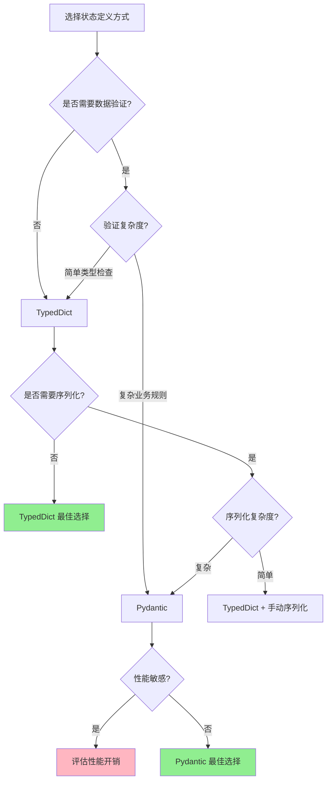

# LangGraph 状态管理详解

## 一、状态管理概述

状态管理是 LangGraph 的核心机制，决定了数据如何在节点间流转和更新。


## 二、状态定义方式对比

### 2.1 TypedDict vs Pydantic 选择指南



### 2.2 TypedDict 方式

**适用场景：**
- ✅ 简单的数据结构，主要用于类型提示
- ✅ 性能敏感的应用（零运行时开销）
- ✅ 快速原型开发
- ✅ 与现有字典代码集成
- ✅ 不需要复杂验证的场景

**优点：**
- 🚀 零运行时性能开销
- 📦 轻量级，无额外依赖
- 🔧 与标准 Python 字典完全兼容
- 💡 简单易用，学习成本低

**缺点：**
- ❌ 仅提供静态类型检查，无运行时验证
- ❌ 不支持数据验证逻辑
- ❌ 需要手动处理序列化/反序列化
- ❌ 缺少默认值和字段约束

**示例：**

```python
from typing import TypedDict, List, Dict, Optional

# 简单状态 - 适合轻量级应用
class SimpleState(TypedDict):
    message: str
    count: int
    active: bool

# 嵌套状态 - 适合明确结构的场景
class UserInfo(TypedDict):
    name: str
    email: str
    age: int

class ComplexState(TypedDict):
    user: UserInfo
    messages: List[str]
    metadata: Dict[str, any]
    error: Optional[str]

# 实战示例：聊天机器人状态
class ChatState(TypedDict):
    """适合快速开发的聊天状态"""
    session_id: str
    messages: List[Dict[str, str]]  # [{"role": "user", "content": "..."}]
    context: Dict[str, any]
    response: Optional[str]

def chat_node(state: ChatState) -> ChatState:
    """处理聊天 - 简单直接"""
    messages = state["messages"]
    # 调用 LLM
    response = llm.invoke(messages)

    return {
        "response": response,
        "messages": messages + [{"role": "assistant", "content": response}]
    }
```

### 2.3 Pydantic 方式

**适用场景：**
- ✅ 需要强数据验证的生产环境
- ✅ 复杂的业务规则和约束
- ✅ API 接口数据验证
- ✅ 需要序列化/反序列化（JSON、数据库等）
- ✅ 多团队协作，需要严格数据契约
- ✅ 外部数据源集成（需要验证输入）

**优点：**
- ✅ 强大的运行时数据验证
- ✅ 自动类型转换和强制
- ✅ 丰富的字段约束（范围、正则、自定义验证）
- ✅ 内置序列化/反序列化
- ✅ 优秀的错误消息
- ✅ 支持默认值工厂

**缺点：**
- ⚠️ 有运行时性能开销（验证需要时间）
- ⚠️ 额外的依赖（pydantic 库）
- ⚠️ 学习曲线稍陡
- ⚠️ 可能过度设计简单场景

**示例：**

```python
from pydantic import BaseModel, Field, validator, root_validator
from typing import List, Optional, Dict
from datetime import datetime
from enum import Enum

class MessageRole(str, Enum):
    """消息角色"""
    USER = "user"
    ASSISTANT = "assistant"
    SYSTEM = "system"

class Message(BaseModel):
    """单条消息 - 严格验证"""
    role: MessageRole
    content: str = Field(..., min_length=1, max_length=10000)
    timestamp: datetime = Field(default_factory=datetime.now)

    @validator('content')
    def validate_content(cls, v):
        """自定义内容验证"""
        if v.strip() == "":
            raise ValueError('消息内容不能为空白')
        return v.strip()

class PydanticChatState(BaseModel):
    """生产级聊天状态 - 完整验证"""

    session_id: str = Field(..., regex=r'^[a-zA-Z0-9-]+$')
    user_id: str = Field(..., description="用户唯一标识")

    messages: List[Message] = Field(default_factory=list, max_items=1000)

    # 元数据验证
    temperature: float = Field(default=0.7, ge=0.0, le=2.0)
    max_tokens: int = Field(default=2000, gt=0, le=32000)

    # 状态标记
    is_completed: bool = Field(default=False)
    error: Optional[str] = Field(None, max_length=500)

    # 统计信息
    token_usage: Dict[str, int] = Field(default_factory=lambda: {
        "prompt_tokens": 0,
        "completion_tokens": 0,
        "total_tokens": 0
    })

    created_at: datetime = Field(default_factory=datetime.now)
    updated_at: datetime = Field(default_factory=datetime.now)

    @validator('messages')
    def validate_message_count(cls, v):
        """验证消息数量"""
        if len(v) > 100:
            raise ValueError('单次会话消息不能超过100条')
        return v

    @root_validator
    def validate_state(cls, values):
        """全局状态验证"""
        if values.get('is_completed') and not values.get('messages'):
            raise ValueError('完成状态必须包含消息')
        return values

    class Config:
        # 序列化配置
        json_encoders = {
            datetime: lambda v: v.isoformat()
        }
        # 允许任意类型（用于 LangGraph 集成）
        arbitrary_types_allowed = True

def validated_chat_node(state: Dict) -> Dict:
    """带验证的聊天节点"""
    try:
        # 验证输入状态
        validated_state = PydanticChatState(**state)

        # 业务逻辑
        new_message = Message(
            role=MessageRole.ASSISTANT,
            content="这是回复"
        )

        validated_state.messages.append(new_message)
        validated_state.updated_at = datetime.now()

        # 转回字典
        return validated_state.dict()

    except ValidationError as e:
        # 详细的错误信息
        return {
            "error": str(e),
            "is_completed": True
        }
```

### 2.4 场景对比详解

#### 场景1：快速原型开发

```python
# ✅ 推荐：TypedDict - 快速简单
class PrototypeState(TypedDict):
    query: str
    result: Optional[str]

# ❌ 过度设计：Pydantic - 增加复杂度
class OverengineeredState(BaseModel):
    query: str = Field(..., min_length=1)
    result: Optional[str] = None
```

#### 场景2：生产环境 API

```python
# ❌ 不推荐：TypedDict - 缺少验证
class WeakAPIState(TypedDict):
    user_input: str  # 可能包含恶意内容
    score: float     # 可能超出范围

# ✅ 推荐：Pydantic - 严格验证
class SecureAPIState(BaseModel):
    user_input: str = Field(..., max_length=1000, regex=r'^[a-zA-Z0-9\s]+$')
    score: float = Field(..., ge=0.0, le=1.0)

    @validator('user_input')
    def sanitize_input(cls, v):
        # XSS 防护
        return html.escape(v.strip())
```

#### 场景3：高性能批处理

```python
# ✅ 推荐：TypedDict - 零开销
class BatchState(TypedDict):
    items: List[Dict[str, any]]
    processed_count: int

# 处理 100万条记录时，TypedDict 几乎无性能影响
# Pydantic 每次验证都有开销

# ⚠️ 如果确需 Pydantic，使用性能优化
class OptimizedBatchState(BaseModel):
    items: List[Dict[str, any]]
    processed_count: int

    class Config:
        # 跳过验证（仅在确信数据安全时）
        validate_assignment = False
```

#### 场景4：外部数据集成

```python
# ❌ 不推荐：TypedDict - 无法处理脏数据
class UnsafeIntegrationState(TypedDict):
    external_data: Dict  # 未知结构
    timestamp: str       # 可能格式不对

# ✅ 推荐：Pydantic - 自动转换和验证
class SafeIntegrationState(BaseModel):
    external_data: Dict
    timestamp: datetime

    @validator('timestamp', pre=True)
    def parse_timestamp(cls, v):
        """处理多种时间格式"""
        if isinstance(v, str):
            # 尝试多种格式
            for fmt in ['%Y-%m-%d', '%Y-%m-%d %H:%M:%S', '%Y-%m-%dT%H:%M:%S']:
                try:
                    return datetime.strptime(v, fmt)
                except ValueError:
                    continue
            raise ValueError(f'无法解析时间: {v}')
        return v
```

### 2.5 性能对比

```python
import time
from typing import TypedDict
from pydantic import BaseModel

# TypedDict 版本
class TypedDictState(TypedDict):
    value: int
    name: str

# Pydantic 版本
class PydanticState(BaseModel):
    value: int
    name: str

# 性能测试
def benchmark():
    iterations = 100000

    # TypedDict - 零开销
    start = time.time()
    for i in range(iterations):
        state = {"value": i, "name": f"item_{i}"}
    typeddict_time = time.time() - start

    # Pydantic - 有验证开销
    start = time.time()
    for i in range(iterations):
        state = PydanticState(value=i, name=f"item_{i}")
    pydantic_time = time.time() - start

    print(f"TypedDict: {typeddict_time:.3f}s")
    print(f"Pydantic:  {pydantic_time:.3f}s")
    print(f"Pydantic 慢 {pydantic_time/typeddict_time:.1f}x")

# 典型结果：
# TypedDict: 0.012s
# Pydantic:  0.156s
# Pydantic 慢 13.0x
```

### 2.6 混合使用策略

```python
from typing import TypedDict, Annotated
from pydantic import BaseModel, Field

# 策略1：外层用 TypedDict，内部关键数据用 Pydantic
class UserInput(BaseModel):
    """仅验证用户输入"""
    query: str = Field(..., min_length=1, max_length=500)
    max_results: int = Field(default=10, ge=1, le=100)

class HybridState(TypedDict):
    """主状态用 TypedDict 保持性能"""
    user_input: UserInput  # 关键部分用 Pydantic
    results: List[Dict]    # 内部数据用字典
    cache: Dict[str, any]  # 缓存不需验证

# 策略2：开发用 TypedDict，生产切换 Pydantic
if ENVIRONMENT == "development":
    class AppState(TypedDict):
        data: Dict
        count: int
else:
    class AppState(BaseModel):
        data: Dict
        count: int = Field(..., ge=0)
```

### 2.7 选择建议总结

| 场景 | 推荐方式 | 原因 |
|------|---------|------|
| 快速原型 | TypedDict | 简单快速，零开销 |
| 生产环境 | Pydantic | 严格验证，减少 Bug |
| 高性能批处理 | TypedDict | 性能关键 |
| API 接口 | Pydantic | 数据验证必需 |
| 内部工具 | TypedDict | 简单够用 |
| 外部集成 | Pydantic | 处理脏数据 |
| 团队协作 | Pydantic | 明确数据契约 |
| 个人项目 | TypedDict | 灵活便捷 |

**一句话总结：**
- 🎯 **简单场景用 TypedDict，复杂场景用 Pydantic**
- 🎯 **内部可控用 TypedDict，外部输入用 Pydantic**
- 🎯 **性能优先用 TypedDict，安全优先用 Pydantic**

### 2.8 与 Reducer 结合使用

```python
from typing import TypedDict, Annotated
import operator

class HybridState(TypedDict):
    """混合使用不同的状态管理方式"""

    # 普通字段
    user_id: str

    # 带 Reducer 的字段
    messages: Annotated[List[str], operator.add]

    # 自定义 Reducer
    latest_action: Annotated[str, lambda x, y: y]

    # 复杂 Reducer
    stats: Annotated[Dict[str, int], lambda old, new: {
        **old,
        **new,
        "total": old.get("total", 0) + new.get("count", 0)
    }]
```

## 三、Reducer 机制详解

### 3.1 内置 Reducer

```python
import operator
from typing import Annotated

class BuiltinReducers(TypedDict):
    # 加法（列表连接、数字相加）
    concat_list: Annotated[List, operator.add]
    sum_number: Annotated[int, operator.add]

    # 乘法
    product: Annotated[int, operator.mul]

    # 逻辑运算
    all_true: Annotated[bool, operator.and_]
    any_true: Annotated[bool, operator.or_]

    # 位运算
    bitwise_or: Annotated[int, operator.or_]
    bitwise_and: Annotated[int, operator.and_]
```

### 3.2 自定义 Reducer

```python
from typing import Any, List, Dict

# 保留最新值
def keep_latest(old: Any, new: Any) -> Any:
    """总是使用新值"""
    return new

# 保留最大值
def keep_max(old: float, new: float) -> float:
    """保留较大的值"""
    return max(old, new) if old is not None else new

# 去重合并列表
def merge_unique(old: List, new: List) -> List:
    """合并列表并去重"""
    return list(set(old + new))

# 深度合并字典
def deep_merge_dict(old: Dict, new: Dict) -> Dict:
    """递归合并字典"""
    result = old.copy()

    for key, value in new.items():
        if key in result and isinstance(result[key], dict) and isinstance(value, dict):
            result[key] = deep_merge_dict(result[key], value)
        else:
            result[key] = value

    return result

# 应用自定义 Reducer
class CustomReducerState(TypedDict):
    latest_value: Annotated[str, keep_latest]
    max_score: Annotated[float, keep_max]
    unique_items: Annotated[List, merge_unique]
    config: Annotated[Dict, deep_merge_dict]
```

### 3.3 条件 Reducer

```python
def conditional_reducer(condition_key: str):
    """根据条件选择更新策略"""
    def reducer(old: Any, new: Dict) -> Any:
        if new.get(condition_key):
            return new.get("value")
        return old
    return reducer

class ConditionalState(TypedDict):
    value: Annotated[Any, conditional_reducer("should_update")]
    should_update: bool
```

## 四、状态更新模式

### 4.1 全量更新

```python
def full_update_node(state: State) -> State:
    """返回完整的新状态"""
    return {
        "field1": "new_value1",
        "field2": "new_value2",
        "field3": state["field3"] + 1  # 基于旧值计算
    }
```

### 4.2 部分更新

```python
def partial_update_node(state: State) -> Dict:
    """只返回需要更新的字段"""
    return {
        "updated_field": "new_value",
        # 其他字段保持不变
    }
```

### 4.3 条件更新

```python
def conditional_update_node(state: State) -> Dict:
    """根据条件决定更新内容"""
    updates = {}

    if state.get("condition1"):
        updates["field1"] = "value1"

    if state.get("condition2"):
        updates["field2"] = "value2"

    return updates if updates else {}
```

## 五、高级状态管理模式

### 5.1 状态版本控制

```python
from typing import TypedDict, List, Annotated
import operator
from datetime import datetime
import copy

class VersionedState(TypedDict):
    current: Dict
    history: Annotated[List[Dict], operator.add]
    version: int

def versioned_update(state: VersionedState, updates: Dict) -> VersionedState:
    """创建新版本的状态"""
    # 保存当前状态到历史
    history_entry = {
        "version": state["version"],
        "data": copy.deepcopy(state["current"]),
        "timestamp": datetime.now().isoformat()
    }

    # 应用更新
    new_current = {**state["current"], **updates}

    return {
        "current": new_current,
        "history": [history_entry],
        "version": state["version"] + 1
    }
```

### 5.2 状态分区

```python
class PartitionedState(TypedDict):
    """将状态分区管理"""
    # 用户数据分区
    user_data: Dict[str, Any]

    # 系统状态分区
    system_state: Dict[str, Any]

    # 临时数据分区（不持久化）
    temp_data: Dict[str, Any]

    # 共享数据分区
    shared_data: Annotated[Dict[str, Any], operator.add]

def user_node(state: PartitionedState) -> Dict:
    """只更新用户数据分区"""
    return {
        "user_data": {
            **state["user_data"],
            "last_action": "user_update"
        }
    }

def system_node(state: PartitionedState) -> Dict:
    """只更新系统状态分区"""
    return {
        "system_state": {
            **state["system_state"],
            "process_count": state["system_state"].get("process_count", 0) + 1
        }
    }
```

### 5.3 状态验证

```python
from typing import TypedDict, List
import jsonschema

class ValidatedState(TypedDict):
    data: Dict
    errors: List[str]
    valid: bool

# 定义状态模式
STATE_SCHEMA = {
    "type": "object",
    "properties": {
        "name": {"type": "string", "minLength": 1},
        "age": {"type": "integer", "minimum": 0, "maximum": 120},
        "email": {"type": "string", "format": "email"}
    },
    "required": ["name", "age"]
}

def validate_state(state: Dict) -> ValidatedState:
    """验证状态是否符合模式"""
    errors = []

    try:
        jsonschema.validate(state, STATE_SCHEMA)
        return {
            "data": state,
            "errors": [],
            "valid": True
        }
    except jsonschema.ValidationError as e:
        errors.append(str(e))
        return {
            "data": state,
            "errors": errors,
            "valid": False
        }
```

## 六、状态持久化

### 6.1 使用 Checkpointer

```python
from langgraph.checkpoint.memory import MemorySaver
from langgraph.checkpoint.sqlite import SqliteSaver

# 内存持久化
memory_saver = MemorySaver()

# SQLite 持久化
sqlite_saver = SqliteSaver.from_conn_string("state.db")

# 编译时指定 checkpointer
app = graph.compile(checkpointer=sqlite_saver)

# 使用 thread_id 管理会话
config = {"configurable": {"thread_id": "session-001"}}
result = app.invoke(initial_state, config=config)
```

### 6.2 自定义持久化

```python
import json
import redis
from typing import Optional, Dict, Any

class RedisCheckpointer:
    """Redis 状态持久化"""

    def __init__(self, redis_client: redis.Redis):
        self.redis = redis_client

    def save_state(self, thread_id: str, state: Dict) -> None:
        """保存状态"""
        key = f"langgraph:state:{thread_id}"
        value = json.dumps(state)
        self.redis.set(key, value)

        # 添加到历史
        history_key = f"langgraph:history:{thread_id}"
        self.redis.lpush(history_key, value)

    def load_state(self, thread_id: str) -> Optional[Dict]:
        """加载状态"""
        key = f"langgraph:state:{thread_id}"
        value = self.redis.get(key)

        if value:
            return json.loads(value)
        return None

    def get_history(self, thread_id: str, limit: int = 10) -> List[Dict]:
        """获取历史状态"""
        history_key = f"langgraph:history:{thread_id}"
        history = self.redis.lrange(history_key, 0, limit - 1)

        return [json.loads(h) for h in history]
```

## 七、状态优化技巧

### 7.1 减少状态大小

```python
class OptimizedState(TypedDict):
    # 使用 ID 引用而不是嵌入大对象
    user_id: str  # 而不是 user: UserObject

    # 使用压缩格式
    compressed_data: str  # base64 编码的压缩数据

    # 限制列表大小
    recent_messages: Annotated[List[str], lambda old, new: (old + new)[-10:]]
```

### 7.2 懒加载

```python
class LazyState(TypedDict):
    data_loaded: bool
    data: Optional[Dict]

def lazy_load_node(state: LazyState) -> LazyState:
    """按需加载数据"""
    if not state.get("data_loaded"):
        # 加载数据
        data = load_heavy_data()
        return {
            "data": data,
            "data_loaded": True
        }
    return state
```

### 7.3 状态缓存

```python
from functools import lru_cache
import hashlib

class CachedState(TypedDict):
    input_hash: str
    cached_result: Optional[Any]

@lru_cache(maxsize=128)
def expensive_computation(input_hash: str) -> Any:
    """昂贵的计算，结果会被缓存"""
    # 执行计算
    return result

def cached_node(state: CachedState) -> CachedState:
    """使用缓存避免重复计算"""
    input_data = state.get("input_data")
    input_hash = hashlib.md5(str(input_data).encode()).hexdigest()

    if state.get("input_hash") == input_hash and state.get("cached_result"):
        # 使用缓存结果
        return state

    # 计算新结果
    result = expensive_computation(input_hash)

    return {
        "input_hash": input_hash,
        "cached_result": result
    }
```

## 八、实战案例：复杂状态管理

```python
from langgraph.graph import StateGraph, END
from typing import TypedDict, List, Dict, Annotated, Optional
import operator
from datetime import datetime
from enum import Enum

# 定义复杂状态
class ProcessingStatus(Enum):
    PENDING = "pending"
    PROCESSING = "processing"
    COMPLETED = "completed"
    FAILED = "failed"

class TaskState(TypedDict):
    id: str
    status: ProcessingStatus
    created_at: str
    updated_at: str
    data: Dict

class WorkflowState(TypedDict):
    # 任务队列
    task_queue: Annotated[List[TaskState], operator.add]

    # 当前处理的任务
    current_task: Optional[TaskState]

    # 已完成任务
    completed_tasks: Annotated[List[str], operator.add]

    # 失败任务及错误信息
    failed_tasks: Annotated[Dict[str, str], lambda old, new: {**old, **new}]

    # 统计信息
    stats: Annotated[Dict[str, int], lambda old, new: {
        "total": old.get("total", 0) + new.get("total", 0),
        "processed": old.get("processed", 0) + new.get("processed", 0),
        "failed": old.get("failed", 0) + new.get("failed", 0)
    }]

    # 配置信息（保持最新）
    config: Annotated[Dict, lambda old, new: {**old, **new}]

# 节点函数
def fetch_task(state: WorkflowState) -> WorkflowState:
    """从队列获取任务"""
    if state["task_queue"]:
        task = state["task_queue"][0]
        remaining_queue = state["task_queue"][1:]

        # 更新任务状态
        task["status"] = ProcessingStatus.PROCESSING
        task["updated_at"] = datetime.now().isoformat()

        return {
            "current_task": task,
            "task_queue": remaining_queue,  # 会被覆盖，因为没有 reducer
            "stats": {"total": 1}
        }

    return {"current_task": None}

def process_task(state: WorkflowState) -> WorkflowState:
    """处理任务"""
    task = state["current_task"]

    if not task:
        return state

    try:
        # 模拟处理
        if "error" in task["data"]:
            raise Exception(task["data"]["error"])

        # 成功处理
        return {
            "completed_tasks": [task["id"]],
            "stats": {"processed": 1},
            "current_task": None
        }

    except Exception as e:
        # 处理失败
        return {
            "failed_tasks": {task["id"]: str(e)},
            "stats": {"failed": 1},
            "current_task": None
        }

def generate_report(state: WorkflowState) -> WorkflowState:
    """生成报告"""
    report = {
        "summary": {
            "total_tasks": state["stats"].get("total", 0),
            "processed": state["stats"].get("processed", 0),
            "failed": state["stats"].get("failed", 0),
            "success_rate": (
                state["stats"].get("processed", 0) /
                state["stats"].get("total", 1) * 100
                if state["stats"].get("total", 0) > 0 else 0
            )
        },
        "completed_tasks": state["completed_tasks"],
        "failed_tasks": state["failed_tasks"]
    }

    print("=" * 50)
    print("工作流执行报告")
    print("=" * 50)
    print(f"总任务数: {report['summary']['total_tasks']}")
    print(f"成功: {report['summary']['processed']}")
    print(f"失败: {report['summary']['failed']}")
    print(f"成功率: {report['summary']['success_rate']:.1f}%")

    return state

# 路由函数
def should_continue(state: WorkflowState) -> str:
    if state["current_task"]:
        return "process"
    elif state["task_queue"]:
        return "fetch"
    else:
        return "report"

# 创建工作流
def create_workflow():
    graph = StateGraph(WorkflowState)

    # 添加节点
    graph.add_node("fetch", fetch_task)
    graph.add_node("process", process_task)
    graph.add_node("report", generate_report)

    # 添加边
    graph.add_edge("fetch", "process")

    graph.add_conditional_edges(
        "process",
        should_continue,
        {
            "fetch": "fetch",
            "report": "report"
        }
    )

    graph.add_edge("report", END)

    # 设置入口
    graph.set_entry_point("fetch")

    return graph.compile()

# 测试
def test_workflow():
    workflow = create_workflow()

    # 准备测试任务
    tasks = [
        TaskState(
            id=f"task_{i}",
            status=ProcessingStatus.PENDING,
            created_at=datetime.now().isoformat(),
            updated_at=datetime.now().isoformat(),
            data={"value": i} if i % 3 != 0 else {"error": f"Task {i} error"}
        )
        for i in range(1, 6)
    ]

    # 初始状态
    initial_state = {
        "task_queue": tasks,
        "current_task": None,
        "completed_tasks": [],
        "failed_tasks": {},
        "stats": {"total": 0, "processed": 0, "failed": 0},
        "config": {"max_retries": 3, "timeout": 30}
    }

    # 执行工作流
    result = workflow.invoke(initial_state)

    print("\n最终状态:")
    print(f"完成的任务: {result['completed_tasks']}")
    print(f"失败的任务: {result['failed_tasks']}")

if __name__ == "__main__":
    test_workflow()
```

## 九、状态管理最佳实践

### 9.1 设计原则

1. **最小化原则**：只在状态中保存必要的信息
2. **不可变原则**：避免直接修改状态，返回新的更新
3. **类型安全**：使用 TypedDict 或 Pydantic 确保类型安全
4. **清晰命名**：使用描述性的字段名称
5. **合理分区**：将相关的状态字段组织在一起

### 9.2 性能建议

1. **避免深拷贝**：只在必要时进行深拷贝
2. **使用引用**：大对象使用 ID 引用而不是嵌入
3. **限制大小**：限制列表和字符串字段的大小
4. **懒加载**：延迟加载大型数据
5. **缓存结果**：缓存昂贵的计算结果

### 9.3 调试技巧

1. **状态日志**：记录每次状态变更
2. **验证检查**：在关键节点验证状态
3. **可视化**：使用工具可视化状态流转
4. **断点调试**：在节点函数中设置断点
5. **单元测试**：为状态更新逻辑编写测试

## 十、总结

状态管理是 LangGraph 的核心，掌握好状态管理能让你：

- ✅ 设计清晰的数据流
- ✅ 实现复杂的业务逻辑
- ✅ 优化性能和内存使用
- ✅ 提高代码的可维护性
- ✅ 更容易调试和测试

---

**下一步：** 学习 [05.路由与控制流](./05.路由与控制流.md) 掌握流程控制技巧！