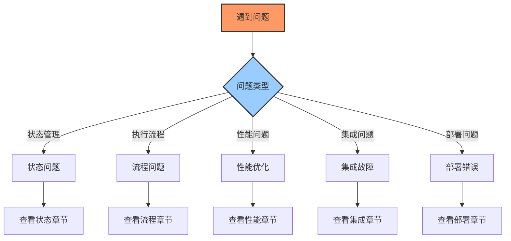

---
title: LangGraph 常见问题与解决方案
date: 2025-09-30
categories:
  - AI
  - LangGraph
---

# LangGraph 常见问题与解决方案

## 概述

本文档整理了 LangGraph 开发和部署过程中的常见问题及其解决方案，帮助开发者快速定位和解决问题。



## 1. 状态管理问题

### 问题 1.1：状态更新不生效

**症状**：节点返回了更新，但状态没有变化

```python
# 错误示例
def node_function(state):
    state["field"] = "new_value"  # 直接修改状态
    return state  # 返回整个状态
```

**原因**：直接修改状态对象而不是返回更新字典

**解决方案**：

```python
# 正确示例
def node_function(state):
    # 返回要更新的字段
    return {"field": "new_value"}

# 或者创建新的状态副本
def node_function(state):
    new_state = state.copy()
    new_state["field"] = "new_value"
    return {"field": new_state["field"]}
```

### 问题 1.2：Annotated 字段未按预期合并

**症状**：使用 `Annotated[List, add]` 但列表被覆盖而非追加

```python
# 问题代码
class State(TypedDict):
    messages: Annotated[List[str], add]

def node(state):
    return {"messages": "single message"}  # 错误：返回字符串而非列表
```

**解决方案**：

```python
# 正确示例
def node(state):
    return {"messages": ["single message"]}  # 返回列表

# 或使用自定义 reducer
def custom_add(current, update):
    if isinstance(update, list):
        return current + update
    return current + [update]

class State(TypedDict):
    messages: Annotated[List[str], custom_add]
```

### 问题 1.3：状态中的复杂对象丢失

**症状**：自定义类实例在状态传递中变成字典

```python
# 问题代码
class CustomObject:
    def __init__(self, data):
        self.data = data

class State(TypedDict):
    obj: CustomObject  # 复杂对象

def node1(state):
    return {"obj": CustomObject("test")}

def node2(state):
    # state["obj"] 可能不是 CustomObject 实例
    print(type(state["obj"]))  # <class 'dict'>
```

**解决方案**：

```python
# 方案1：使用可序列化的数据结构
from dataclasses import dataclass, asdict
from typing import Dict

@dataclass
class CustomObject:
    data: str

    def to_dict(self) -> Dict:
        return asdict(self)

    @classmethod
    def from_dict(cls, data: Dict):
        return cls(**data)

class State(TypedDict):
    obj_data: Dict  # 存储字典形式

def node1(state):
    obj = CustomObject("test")
    return {"obj_data": obj.to_dict()}

def node2(state):
    obj = CustomObject.from_dict(state["obj_data"])
    # 使用 obj
```

```python
# 方案2：使用 pickle 序列化
import pickle
import base64

def serialize_object(obj):
    return base64.b64encode(pickle.dumps(obj)).decode()

def deserialize_object(data):
    return pickle.loads(base64.b64decode(data))

class State(TypedDict):
    obj_serialized: str

def node1(state):
    obj = CustomObject("test")
    return {"obj_serialized": serialize_object(obj)}

def node2(state):
    obj = deserialize_object(state["obj_serialized"])
    # 使用 obj
```

## 2. 执行流程问题

### 问题 2.1：无限循环

**症状**：工作流永远不结束，一直在循环执行

```python
# 问题代码
workflow.add_edge("node_a", "node_b")
workflow.add_edge("node_b", "node_a")  # 无条件循环
```

**解决方案**：

```python
# 添加终止条件
def should_continue(state):
    if state.get("iteration", 0) >= 10:  # 最多10次
        return "end"
    if state.get("converged", False):    # 收敛条件
        return "end"
    return "continue"

workflow.add_conditional_edges(
    "node_b",
    should_continue,
    {
        "continue": "node_a",
        "end": END
    }
)

# 在节点中更新迭代次数
def node_a(state):
    iteration = state.get("iteration", 0) + 1
    # 检查收敛条件
    converged = check_convergence(state)
    return {"iteration": iteration, "converged": converged}
```

### 问题 2.2：条件边未正确路由

**症状**：条件边总是走同一条路径

```python
# 问题代码
def router(state):
    if state["value"] > 10:  # KeyError if "value" not in state
        return "high"
    return "low"
```

**解决方案**：

```python
# 安全的路由函数
def router(state):
    try:
        value = state.get("value", 0)  # 使用默认值
        if value > 10:
            return "high"
        return "low"
    except Exception as e:
        logger.error(f"Router error: {e}")
        return "error"  # 错误路径

workflow.add_conditional_edges(
    "decision",
    router,
    {
        "high": "high_path",
        "low": "low_path",
        "error": "error_handler"
    }
)
```

### 问题 2.3：节点执行顺序不符合预期

**症状**：节点执行顺序混乱

**原因**：并行执行或异步问题

**解决方案**：

```python
# 确保顺序执行
workflow = StateGraph(State)

# 串行执行
workflow.add_node("step1", step1_node)
workflow.add_node("step2", step2_node)
workflow.add_node("step3", step3_node)

workflow.set_entry_point("step1")
workflow.add_edge("step1", "step2")  # step1 必须在 step2 之前
workflow.add_edge("step2", "step3")  # step2 必须在 step3 之前
workflow.add_edge("step3", END)

# 如果需要并行执行后同步
workflow.add_node("sync", sync_node)
workflow.add_edge("parallel1", "sync")
workflow.add_edge("parallel2", "sync")
workflow.add_edge("parallel3", "sync")
```

## 3. 性能问题

### 问题 3.1：内存泄漏

**症状**：长时间运行后内存持续增长

```python
# 问题代码
class State(TypedDict):
    history: List[Dict]  # 无限增长的历史记录

def node(state):
    history = state.get("history", [])
    history.append({"timestamp": time.time(), "data": large_data})
    return {"history": history}
```

**解决方案**：

```python
# 方案1：限制历史记录大小
def node(state):
    history = state.get("history", [])
    history.append({"timestamp": time.time(), "data": large_data})

    # 只保留最近100条
    if len(history) > 100:
        history = history[-100:]

    return {"history": history}

# 方案2：使用外部存储
def node(state):
    # 存储到数据库而非状态
    save_to_database({
        "timestamp": time.time(),
        "data": large_data
    })

    # 状态中只保留引用
    return {"last_record_id": get_last_record_id()}
```

### 问题 3.2：LLM 调用过慢

**症状**：工作流执行时间过长，主要耗时在 LLM 调用

**解决方案**：

```python
# 方案1：并行调用
async def parallel_llm_calls(state):
    prompts = state["prompts"]

    # 并行执行所有 LLM 调用
    tasks = [llm.ainvoke(prompt) for prompt in prompts]
    results = await asyncio.gather(*tasks)

    return {"results": results}

# 方案2：缓存 LLM 响应
from functools import lru_cache
import hashlib

def cache_key(prompt: str) -> str:
    return hashlib.md5(prompt.encode()).hexdigest()

# 使用 Redis 缓存
def cached_llm_call(prompt: str) -> str:
    key = f"llm:{cache_key(prompt)}"

    # 检查缓存
    cached = redis_client.get(key)
    if cached:
        return cached

    # 调用 LLM
    response = llm.invoke(prompt)

    # 缓存结果
    redis_client.setex(key, 3600, response)  # 1小时过期

    return response

# 方案3：使用更快的模型
def adaptive_model_selection(state):
    complexity = assess_complexity(state["query"])

    if complexity == "simple":
        model = "gpt-3.5-turbo"  # 快速模型
    elif complexity == "medium":
        model = "gpt-4"
    else:
        model = "gpt-4-turbo"  # 最强模型

    llm = ChatOpenAI(model=model)
    return llm.invoke(state["query"])
```

### 问题 3.3：检查点存储过大

**症状**：检查点占用大量存储空间

**解决方案**：

```python
# 方案1：压缩检查点
import zlib
import pickle

class CompressedCheckpointer:
    def save_checkpoint(self, state: Dict) -> None:
        # 序列化并压缩
        serialized = pickle.dumps(state)
        compressed = zlib.compress(serialized, level=9)

        # 存储压缩后的数据
        save_to_storage(compressed)

    def load_checkpoint(self) -> Dict:
        # 读取并解压
        compressed = load_from_storage()
        serialized = zlib.decompress(compressed)
        return pickle.loads(serialized)

# 方案2：增量检查点
class IncrementalCheckpointer:
    def __init__(self):
        self.base_checkpoint = None
        self.deltas = []

    def save_checkpoint(self, state: Dict) -> None:
        if self.base_checkpoint is None:
            # 保存完整检查点
            self.base_checkpoint = state.copy()
            save_full_checkpoint(state)
        else:
            # 只保存差异
            delta = compute_delta(self.base_checkpoint, state)
            self.deltas.append(delta)
            save_delta(delta)

            # 定期创建新的基准检查点
            if len(self.deltas) > 10:
                self.base_checkpoint = state.copy()
                self.deltas = []
                save_full_checkpoint(state)
```

## 4. 集成问题

### 问题 4.1：LangChain 工具调用失败

**症状**：工具执行报错或返回 None

```python
# 问题代码
from langchain.tools import Tool

tool = Tool(
    name="calculator",
    func=lambda x: eval(x),  # 危险且可能失败
    description="Calculator"
)
```

**解决方案**：

```python
# 安全的工具实现
def safe_calculator(expression: str) -> str:
    try:
        # 只允许安全的操作
        allowed_names = {
            k: v for k, v in math.__dict__.items() if not k.startswith("__")
        }
        allowed_names.update({"abs": abs, "round": round})

        # 使用 ast.literal_eval 或 numexpr
        code = compile(expression, "<string>", "eval")

        # 检查是否只包含允许的操作
        for name in code.co_names:
            if name not in allowed_names:
                return f"Error: Operation '{name}' not allowed"

        result = eval(code, {"__builtins__": {}}, allowed_names)
        return str(result)

    except Exception as e:
        return f"Error: {str(e)}"

tool = Tool(
    name="calculator",
    func=safe_calculator,
    description="Safe calculator for mathematical expressions"
)

# 添加重试逻辑
def tool_with_retry(tool: Tool, max_retries: int = 3):
    def wrapper(input_str: str) -> str:
        for attempt in range(max_retries):
            try:
                result = tool.func(input_str)
                if result and not result.startswith("Error"):
                    return result
            except Exception as e:
                if attempt == max_retries - 1:
                    return f"Failed after {max_retries} attempts: {str(e)}"
                time.sleep(2 ** attempt)  # 指数退避
        return "Max retries reached"

    return Tool(
        name=tool.name,
        func=wrapper,
        description=tool.description
    )
```

### 问题 4.2：向量数据库连接问题

**症状**：向量搜索失败或返回空结果

**解决方案**：

```python
# 健壮的向量数据库连接
class RobustVectorStore:
    def __init__(self, primary_store, backup_store=None):
        self.primary = primary_store
        self.backup = backup_store
        self.last_error = None

    def similarity_search(self, query: str, k: int = 4) -> List[Document]:
        try:
            # 尝试主存储
            results = self.primary.similarity_search(query, k=k)
            if results:
                return results
        except Exception as e:
            self.last_error = e
            logger.error(f"Primary vector store failed: {e}")

            # 尝试备份存储
            if self.backup:
                try:
                    return self.backup.similarity_search(query, k=k)
                except Exception as backup_error:
                    logger.error(f"Backup vector store also failed: {backup_error}")

        # 降级策略：返回空结果而非崩溃
        logger.warning("All vector stores failed, returning empty results")
        return []

    def add_documents(self, documents: List[Document]) -> List[str]:
        ids = []
        try:
            # 添加到主存储
            ids = self.primary.add_documents(documents)
        except Exception as e:
            logger.error(f"Failed to add to primary store: {e}")

        # 同时添加到备份（如果有）
        if self.backup:
            try:
                self.backup.add_documents(documents)
            except Exception as e:
                logger.error(f"Failed to add to backup store: {e}")

        return ids
```

## 5. 部署问题

### 问题 5.1：容器启动失败

**症状**：Docker 容器无法启动或立即退出

**常见原因和解决方案**：

```dockerfile
# 问题：缺少依赖
FROM python:3.11-slim

# 解决：安装必要的系统依赖
RUN apt-get update && apt-get install -y \
    gcc \
    g++ \
    libpq-dev \  # PostgreSQL
    && rm -rf /var/lib/apt/lists/*

# 问题：权限错误
# 解决：创建非 root 用户
RUN useradd -m -u 1000 appuser
USER appuser

# 问题：端口冲突
# 解决：使用环境变量配置端口
ENV PORT=8000
EXPOSE ${PORT}

# 问题：启动命令错误
# 解决：使用正确的启动命令
CMD ["sh", "-c", "uvicorn main:app --host 0.0.0.0 --port ${PORT}"]
```

### 问题 5.2：环境变量未加载

**症状**：应用无法读取环境变量

**解决方案**：

```python
# 使用 python-dotenv
from dotenv import load_dotenv
import os

# 加载 .env 文件
load_dotenv()

# 使用默认值防止错误
class Config:
    OPENAI_API_KEY = os.getenv("OPENAI_API_KEY", "")
    DATABASE_URL = os.getenv("DATABASE_URL", "sqlite:///./app.db")
    REDIS_URL = os.getenv("REDIS_URL", "redis://localhost:6379")

    @classmethod
    def validate(cls):
        """验证必要的配置"""
        errors = []

        if not cls.OPENAI_API_KEY:
            errors.append("OPENAI_API_KEY is required")

        if errors:
            raise ValueError(f"Configuration errors: {', '.join(errors)}")

# 启动时验证
try:
    Config.validate()
except ValueError as e:
    logger.error(f"Configuration validation failed: {e}")
    sys.exit(1)
```

### 问题 5.3：数据库迁移失败

**症状**：数据库架构不匹配

**解决方案**：

```python
# 使用 Alembic 进行数据库迁移
from alembic import command
from alembic.config import Config

def run_migrations():
    """运行数据库迁移"""
    try:
        alembic_cfg = Config("alembic.ini")
        command.upgrade(alembic_cfg, "head")
        logger.info("Database migrations completed successfully")
    except Exception as e:
        logger.error(f"Migration failed: {e}")
        # 尝试回滚
        try:
            command.downgrade(alembic_cfg, "-1")
            logger.info("Rolled back last migration")
        except:
            logger.error("Rollback also failed")
        raise

# 启动时自动迁移
if __name__ == "__main__":
    run_migrations()
    uvicorn.run(app, host="0.0.0.0", port=8000)
```

## 6. 调试技巧

### 6.1 启用详细日志

```python
import logging
import sys

def setup_debug_logging():
    """设置调试日志"""
    # 创建详细的格式化器
    formatter = logging.Formatter(
        '%(asctime)s - %(name)s - %(levelname)s - '
        '%(filename)s:%(lineno)d - %(message)s'
    )

    # 控制台处理器
    console_handler = logging.StreamHandler(sys.stdout)
    console_handler.setFormatter(formatter)

    # 文件处理器
    file_handler = logging.FileHandler('debug.log')
    file_handler.setFormatter(formatter)

    # 配置根日志器
    root_logger = logging.getLogger()
    root_logger.setLevel(logging.DEBUG)
    root_logger.addHandler(console_handler)
    root_logger.addHandler(file_handler)

    # 配置特定模块
    logging.getLogger("langgraph").setLevel(logging.DEBUG)
    logging.getLogger("langchain").setLevel(logging.DEBUG)

# 在工作流中添加日志
def logged_node(name: str):
    def decorator(func):
        def wrapper(state):
            logger.debug(f"Entering node: {name}")
            logger.debug(f"Input state: {state}")

            try:
                result = func(state)
                logger.debug(f"Node {name} output: {result}")
                return result
            except Exception as e:
                logger.error(f"Node {name} failed: {e}", exc_info=True)
                raise
        return wrapper
    return decorator
```

### 6.2 状态快照

```python
class StateDebugger:
    """状态调试器"""

    def __init__(self, workflow):
        self.workflow = workflow
        self.snapshots = []

    def capture_snapshot(self, node_name: str, state: Dict):
        """捕获状态快照"""
        snapshot = {
            "node": node_name,
            "timestamp": time.time(),
            "state": copy.deepcopy(state)
        }
        self.snapshots.append(snapshot)

    def get_state_diff(self, idx1: int, idx2: int) -> Dict:
        """比较两个快照的差异"""
        if idx1 >= len(self.snapshots) or idx2 >= len(self.snapshots):
            return {}

        state1 = self.snapshots[idx1]["state"]
        state2 = self.snapshots[idx2]["state"]

        diff = {}
        all_keys = set(state1.keys()) | set(state2.keys())

        for key in all_keys:
            val1 = state1.get(key)
            val2 = state2.get(key)
            if val1 != val2:
                diff[key] = {"before": val1, "after": val2}

        return diff

    def export_trace(self, filename: str):
        """导出执行轨迹"""
        import json
        with open(filename, 'w') as f:
            json.dump(self.snapshots, f, indent=2, default=str)
```

### 6.3 性能分析

```python
import cProfile
import pstats
from io import StringIO

def profile_workflow(workflow, input_state):
    """分析工作流性能"""
    profiler = cProfile.Profile()

    # 开始分析
    profiler.enable()
    result = workflow.invoke(input_state)
    profiler.disable()

    # 生成报告
    stream = StringIO()
    stats = pstats.Stats(profiler, stream=stream)
    stats.sort_stats('cumulative')
    stats.print_stats(20)  # 打印前20个最耗时的函数

    print(stream.getvalue())
    return result

# 使用装饰器进行性能监控
import functools
import time

def measure_time(func):
    """测量函数执行时间"""
    @functools.wraps(func)
    def wrapper(*args, **kwargs):
        start = time.perf_counter()
        try:
            result = func(*args, **kwargs)
            return result
        finally:
            end = time.perf_counter()
            logger.info(f"{func.__name__} took {end - start:.3f} seconds")
    return wrapper
```

## 7. 最佳实践检查清单

```python
"""
LangGraph 开发最佳实践检查清单
"""

checklist = {
    "状态设计": [
        "✓ 使用 TypedDict 定义状态结构",
        "✓ 为累加字段使用 Annotated",
        "✓ 避免在状态中存储大对象",
        "✓ 实现状态验证"
    ],
    "节点设计": [
        "✓ 节点函数是纯函数",
        "✓ 返回部分更新而非完整状态",
        "✓ 添加错误处理",
        "✓ 实现幂等性"
    ],
    "流程控制": [
        "✓ 避免无限循环",
        "✓ 设置最大迭代次数",
        "✓ 实现超时机制",
        "✓ 添加断路器模式"
    ],
    "性能优化": [
        "✓ 实现缓存策略",
        "✓ 使用异步操作",
        "✓ 批处理请求",
        "✓ 限制状态大小"
    ],
    "错误处理": [
        "✓ 捕获所有异常",
        "✓ 实现重试机制",
        "✓ 提供降级方案",
        "✓ 记录详细错误日志"
    ],
    "监控调试": [
        "✓ 添加结构化日志",
        "✓ 实现性能指标",
        "✓ 启用状态追踪",
        "✓ 设置告警规则"
    ]
}

def validate_workflow(workflow):
    """验证工作流是否符合最佳实践"""
    issues = []

    # 检查是否有 END 节点
    if END not in workflow.nodes:
        issues.append("工作流缺少 END 节点")

    # 检查是否有入口点
    if not workflow.entry_point:
        issues.append("工作流缺少入口点")

    # 检查是否有孤立节点
    # ... 更多检查

    return issues
```

## 总结

解决 LangGraph 问题的关键：

1. **理解核心概念**：状态、节点、边的工作原理
2. **遵循最佳实践**：使用推荐的设计模式
3. **添加监控日志**：便于问题定位
4. **实现错误处理**：提高系统健壮性
5. **性能优化**：缓存、异步、批处理
6. **测试验证**：单元测试、集成测试、压力测试

通过本指南，你应该能够快速诊断和解决大部分 LangGraph 相关问题。