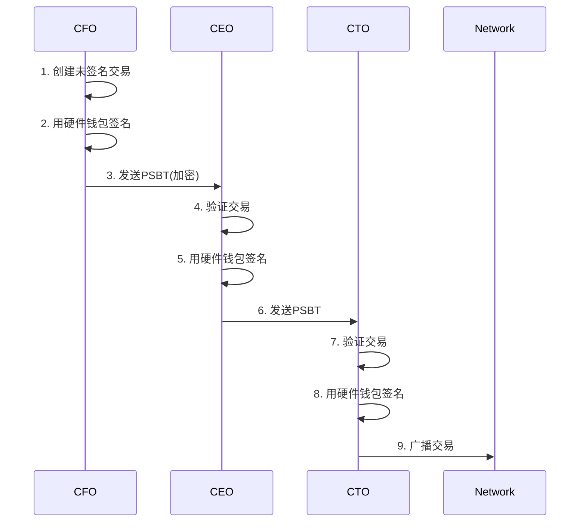
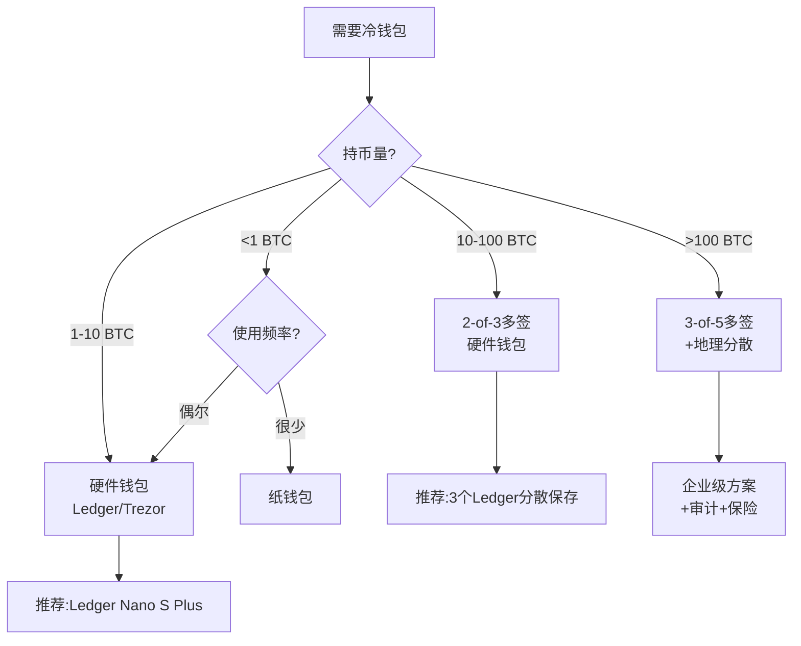

---
title: 比特币冷钱包方案-10分钟脚本
date: 2025-09-30
categories:
  - Technology
  - Learning
---

# 比特币冷钱包方案 - 10分钟演讲脚本

## 开场白 (30秒)

大家好!今天咱们聊聊冷钱包——可能是比特币世界里最重要的安全话题。

先给大家讲个真实故事:2016年,Bitfinex交易所被黑,12万个BTC被盗,当时价值7200万美金。但你们知道吗?同一时期,有个持有10万BTC的早期矿工,把币放在冷钱包里,睡得特别香——因为黑客根本碰不到他的币。

冷钱包和热钱包的区别,就像银行金库和你口袋里的钱包。口袋里放点零花钱方便,但大额资产必须放金库。

我见过太多案例:有人把几千个BTC放在交易所热钱包,结果交易所跑路了;也有人把私钥保存在云盘,结果账号被黑了。但用冷钱包的人,只要不是自己作死(比如把私钥发朋友圈),基本都守住了财富。

今天10分钟,我教大家从入门到企业级,把冷钱包这件事彻底搞明白。

## 第一部分:冷热钱包对比——为什么要用冷钱包? (2分钟)

### 热钱包 vs 冷钱包

先说清楚什么是冷、什么是热。

**热钱包(Hot Wallet):**
- 私钥保存在**联网设备**上
- 比如:交易所账户、手机钱包App、桌面钱包
- 优点:方便快捷,随时交易
- 缺点:随时可能被黑

**冷钱包(Cold Wallet):**
- 私钥保存在**离线设备**上
- 比如:纸钱包、硬件钱包、离线电脑
- 优点:黑客够不着,极度安全
- 缺点:使用麻烦,不适合频繁交易

我给大家打个比方:热钱包就像支付宝,你每天买奶茶用;冷钱包就像银行定期存款,放着不动,等升值。

### 典型的资产分配策略

我服务过的交易所和大户,都是这么分配的:

**个人用户:**
- 热钱包(手机): <0.1 BTC,日常花费
- 硬件钱包: 0.1-10 BTC,中期持有
- 纸钱包/多签冷钱包: >10 BTC,长期储存

**交易所/企业:**
- 热钱包: 5%,处理提现
- 温钱包: 15%,备用金
- 冷钱包: 80%,长期储备

这个比例很关键。我见过有交易所把50%资产放热钱包,结果被黑了一次就破产了。也见过有交易所只放2%在热钱包,提现太慢,用户骂死。

我的建议:**个人不超过10%,企业不超过5%**。

### 冷钱包的安全等级

冷钱包也分三六九等,不是所有冷钱包都一样安全:

**基础级(纸钱包):**
- 私钥打印在纸上
- 成本几乎为0
- 适合:赠送比特币、长期储存小额资金(<1 BTC)
- 缺点:纸容易损坏、被偷看、不防火不防水

**标准级(硬件钱包):**
- Ledger、Trezor等专业设备
- 成本约$50-$150
- 适合:大部分个人用户
- 优点:方便、安全、支持多币种

**高级级(多签硬件钱包):**
- 多个硬件钱包组成多签
- 成本约$500+
- 适合:持币量>100 BTC的大户
- 优点:即使丢失1-2个设备,资金仍然安全

**企业级(多签+地理分散+时间锁):**
- 成本约$5000+
- 适合:交易所、基金公司
- 优点:极致安全,防内部作恶

我自己用的是标准级,两个Ledger Nano S,一个在家保险柜,一个在父母家。够用了。

## 第二部分:纸钱包——最简单的冷存储 (2分钟)

纸钱包是最古老也最简单的冷钱包方案——把私钥打印在纸上,就这么简单。

### 怎么制作纸钱包?

**正确流程:**

1. **离线环境**: 断网!拔网线!关WiFi!
2. **可信工具**: 用开源工具,比如bitaddress.org(下载到本地)
3. **生成密钥对**: 随机生成私钥和地址
4. **打印**: 用没联网的打印机打印
5. **保存**: 装进密封袋,放保险柜

我见过有人直接在联网电脑上生成纸钱包,然后币就莫名其妙丢了——因为私钥可能被木马记录了。

**千万注意:**
- 生成过程必须离线
- 打印机不能联网(有些智能打印机会上传打印内容)
- 打印完立即清理浏览器缓存
- 最好用专门的"干净电脑",只做这一件事

### BIP38加密:给纸钱包上锁

普通纸钱包有个问题:如果纸被人看到,私钥就泄露了。BIP38解决了这个问题——用密码加密私钥。

加密后的私钥看起来像这样:
```
6PRVWUbkzzsbcVac2qwfssoUJAN1Xhrg6bNk8J7Nzm5H7kxEbn2Nh2ZoGg
```

即使别人拿到这张纸,没有密码也无法使用。

但有利有弊:
- 好处:防偷窥
- 坏处:忘记密码,币就永远锁死了

我的建议:如果金额不大(<5 BTC),不用加密,放保险柜就行;如果金额大,加密,但密码要分开保存(比如写在另一张纸上放父母家)。

### 纸钱包的最大缺点:花费很麻烦

纸钱包的致命问题是:**只能一次性花完**。

为什么?因为比特币的UTXO机制,你花费时必须把整个UTXO都花掉。如果你只想花一部分,剩余的要发到找零地址,而纸钱包通常没有找零功能。

而且,花费纸钱包时你要把私钥输入到软件钱包,这时私钥就"热"了,不再安全。

所以纸钱包适合:
- 长期储存,不打算动
- 一次性转账(比如赠送)
- 备份用途

不适合频繁交易。

## 第三部分:硬件钱包——最佳选择 (2.5分钟)

如果你要我推荐一种冷钱包方案,我肯定选**硬件钱包**——安全性和便利性的最佳平衡点。

### 硬件钱包的核心原理

硬件钱包是一个专用设备,核心思想是:**私钥永不离开设备**。

工作流程:
1. 电脑/手机创建未签名交易
2. 通过USB/蓝牙发送到硬件钱包
3. 硬件钱包在内部签名(私钥不泄露)
4. 签名后的交易发回电脑
5. 电脑广播交易

整个过程中,私钥始终在硬件钱包里,即使电脑被黑也拿不到私钥。

这就像你去银行取钱,柜员看到你的取款单(未签名交易),但不知道你的密码(私钥);你在密码器上输密码(硬件钱包签名),柜员只看到签名结果。

### 主流硬件钱包对比

| 型号 | 价格 | 优点 | 缺点 | 适合人群 |
|------|------|------|------|---------|
| Ledger Nano S Plus | ~$80 | 安全性高、支持多币种 | 闭源固件 | 普通用户 |
| Trezor Model One | ~$60 | 完全开源 | 屏幕小、易被物理攻击 | 技术用户 |
| Ledger Nano X | ~$150 | 蓝牙、大容量 | 价格贵 | 高端用户 |
| Coldcard | ~$150 | 比特币专用、可气隙 | 只支持BTC、操作复杂 | 极客 |

我自己用的是Ledger Nano S Plus,原因:
1. 安全性经过市场检验
2. 支持1000+币种(虽然我主要存BTC和ETH)
3. 界面友好,老妈都会用

如果你只存比特币,而且是技术大神,我推荐Coldcard——它可以完全离线操作(通过SD卡传输交易),安全性拉满。

### 硬件钱包使用流程

我用实际流程演示一下(以Ledger为例):

**初始化设备:**
```
1. 插入USB,打开Ledger Live
2. 创建新钱包(或恢复)
3. 设置PIN码(4-8位)
4. 抄写24词助记词(手写,不要拍照!)
5. 验证助记词
6. 完成!
```

**接收比特币:**
```
1. 在Ledger Live点击"接收"
2. 选择比特币账户
3. 硬件钱包显示地址
4. 核对地址一致(防中间人攻击)
5. 把地址给付款方
```

**发送比特币:**
```
1. 在Ledger Live创建交易
2. 输入接收地址、金额、手续费
3. 连接硬件钱包
4. 在设备屏幕上验证交易详情
5. 设备上按确认键
6. 交易广播完成
```

**核心安全点:**
- 地址必须在硬件钱包屏幕上验证(防电脑被黑)
- 交易确认必须在硬件钱包上完成(防钓鱼)

### 硬件钱包的坑

虽然硬件钱包很安全,但也有坑:

**坑1: 供应链攻击**

别在淘宝、eBay买二手硬件钱包!有人买到被篡改过的设备,里面预设了助记词,币一打进去就被转走了。

**正确做法:**
- 从官网或授权经销商购买
- 收到后检查封条
- 验证固件签名

**坑2: 钓鱼攻击**

有人收到假的Ledger邮件,说"你的设备有安全漏洞,请访问xx网站输入助记词升级"。输入后,币就没了。

**正确做法:**
- 永远不要在任何网站输入助记词
- 只从官网下载Ledger Live
- 固件升级只在Ledger Live里操作

**坑3: 助记词保存不当**

我见过有人:
- 拍照保存在手机(被云同步泄露)
- 存在Evernote(账号被黑)
- 截图保存(被木马上传)

**正确做法:**
- 手写在防火防水的纸上
- 分多份保存在不同地方
- 考虑用金属板刻字(防火灾)

我自己是:
- 主份:保险柜
- 副份1:父母家保险柜
- 副份2:银行保险箱

三份,分散存储,即使家里着火也不怕。

## 第四部分:企业级方案——多签+地理分散 (2.5分钟)

如果你是交易所、基金公司,或者持币量超过1000 BTC,那就需要企业级冷存储方案了。

### 3-of-5多签冷钱包架构

我服务过的交易所用的方案:

**密钥分布:**
- 密钥1: CEO,硬件钱包,纽约办公室保险柜
- 密钥2: CTO,硬件钱包,旧金山办公室保险柜
- 密钥3: CFO,硬件钱包,伦敦办公室保险柜
- 密钥4: 安全总监,硬件钱包,新加坡办公室保险柜
- 密钥5: 外部审计公司,硬件钱包,独立保管

**转账流程:**

任意三人同意即可转账,流程如下:



**优点:**
- 单人无法作恶(需要3个人串通)
- 容错性强(即使2个人出事,剩余3人照样能用)
- 地理分散(黑客无法同时攻击多个地点)

**缺点:**
- 操作繁琐(每次转账要协调3个人)
- 成本高(5个硬件钱包+保险柜+差旅费)

但为了安全,值得!

### 气隙离线签名

更高级的玩法是**气隙(Air-Gapped)签名**——签名设备完全不联网,通过QR码或SD卡传输交易。

**流程:**

1. **在线机**: 创建未签名交易,生成QR码
2. **摄像头**: 离线机扫描QR码
3. **离线机**: 用冷钱包签名,生成签名QR码
4. **摄像头**: 在线机扫描签名QR码
5. **在线机**: 广播交易

这样,签名设备从头到尾不联网,黑客连攻击的入口都没有。

听起来麻烦,但对于管理几十亿美金资产的机构,这是标准操作。

我见过某大型矿池,冷钱包放在山区的独立房间里,房间没有网络、没有WiFi、甚至没有电话线——只有一个摄像头对着QR码。你说这安全性,拉满了吧?

### 定期审计

企业级冷钱包还有个关键:定期审计。

**审计清单:**

- [ ] 余额核对(链上地址余额 vs 账本记录)
- [ ] 密钥可访问性(所有硬件钱包都能正常使用)
- [ ] 固件版本(是否需要升级)
- [ ] 助记词备份(是否完好、可读)
- [ ] 交易历史(是否有异常转账)

频率:
- 小型企业:每季度
- 大型交易所:每月
- 超大资产:每周

我服务的交易所,每周五下午固定审计,CEO和CFO一起去保险柜,拿出硬件钱包检查,确认无误后重新封存。

这个习惯救了他们一命——有次发现一个硬件钱包的电池漏液,差点损坏设备,幸好及时发现更换了。

### 灾难恢复演练

最后一个重点:**定期演练**。

别等真出事了才发现:
- 硬件钱包找不到了
- 助记词抄错了一个词
- 多签需要的3个人里,2个出差联系不上

我的建议:每半年做一次完整的灾难恢复演练:

**演练剧本:**

假设:CFO的硬件钱包丢失,需要紧急转移资金

**步骤:**
1. 通知其他4个密钥持有人
2. 召集CEO、CTO、安全总监(凑齐3人)
3. 创建新的5-of-3多签地址
4. 用旧钱包剩余的3个密钥,把资金转到新地址
5. 为CFO配置新硬件钱包
6. 更新内部文档和流程

如果演练失败(比如凑不齐人),那就要改进流程,比如增加备用密钥或调整M-of-N比例。

## 结尾总结 (30秒)

好了,10分钟时间到。咱们今天讲了:
1. **冷热钱包对比**: 热钱包方便但危险,冷钱包安全但麻烦
2. **纸钱包**: 最简单,适合长期储存,但容易损坏
3. **硬件钱包**: 最佳选择,安全+便利的平衡点
4. **企业级方案**: 多签+地理分散+定期审计

我给大家总结一个原则:**资产分层,风险分散**。

- 日常花费用热钱包
- 中期持有用硬件钱包
- 长期储存用多签冷钱包

别把所有鸡蛋放一个篮子。

最后送大家一句话:在比特币世界,**你就是你自己的银行**。银行要是管理不善就倒闭,你的冷钱包要是管理不善就归零。所以,把冷钱包当成保护家人的事业来做,认真对待每一个细节。

祝大家的币都能安安全全躺在冷钱包里升值!

---

## 补充材料

### 1. 冷钱包方案选择决策树



### 2. 完整纸钱包生成脚本

```java
import org.bitcoinj.core.*;
import java.security.SecureRandom;

/**
 * 安全的纸钱包生成器
 * 警告:必须在完全离线的环境中运行!
 */
public class SecurePaperWalletGenerator {

    public static void main(String[] args) {
        System.out.println("=== 比特币纸钱包生成器 ===\n");

        // 安全检查
        if (isOnline()) {
            System.err.println("⚠️ 错误:检测到网络连接!");
            System.err.println("请断开所有网络连接(WiFi、以太网)后再运行");
            System.exit(1);
        }

        System.out.println("✓ 网络已断开\n");

        // 生成私钥
        SecureRandom random = new SecureRandom();
        byte[] privateKeyBytes = new byte[32];
        random.nextBytes(privateKeyBytes);

        ECKey key = ECKey.fromPrivate(privateKeyBytes);

        // 生成地址
        NetworkParameters params = MainNetParams.get();
        Address address = key.toAddress(ScriptType.P2PKH, params);

        // 输出
        System.out.println("纸钱包已生成!\n");
        System.out.println("=== 公开信息 ===");
        System.out.println("地址: " + address);
        System.out.println("公钥: " + key.getPublicKeyAsHex());

        System.out.println("\n=== 私密信息(请妥善保管!) ===");
        System.out.println("私钥(WIF): " + key.getPrivateKeyAsWiF(params));
        System.out.println("私钥(Hex): " + key.getPrivateKeyAsHex());

        System.out.println("\n=== 使用说明 ===");
        System.out.println("1. 打印此页面(使用离线打印机)");
        System.out.println("2. 将私钥部分折叠或遮盖");
        System.out.println("3. 装入密封袋");
        System.out.println("4. 存放于保险柜");
        System.out.println("5. 清除屏幕和打印机缓存");
        System.out.println("\n⚠️ 警告:私钥泄露 = 资金被盗!");

        // 生成QR码(可选)
        generateQRCodes(address.toString(), key.getPrivateKeyAsWiF(params));
    }

    private static boolean isOnline() {
        try {
            // 检查常见网络接口
            java.net.NetworkInterface.getNetworkInterfaces();

            java.util.Enumeration<java.net.NetworkInterface> interfaces =
                java.net.NetworkInterface.getNetworkInterfaces();

            while (interfaces.hasMoreElements()) {
                java.net.NetworkInterface iface = interfaces.nextElement();

                // 跳过本地回环
                if (iface.isLoopback()) continue;

                // 如果接口启动且有IP,说明在线
                if (iface.isUp() && iface.getInetAddresses().hasMoreElements()) {
                    return true;
                }
            }

            return false;
        } catch (Exception e) {
            // 无法检测网络状态,保守起见认为在线
            return true;
        }
    }

    private static void generateQRCodes(String address, String privateKey) {
        // 使用ZXing库生成QR码
        // 实现略...
    }
}
```

### 3. 硬件钱包对比详表

| 特性 | Ledger Nano S Plus | Trezor Model One | Coldcard Mk4 | BitBox02 |
|------|-------------------|-----------------|--------------|----------|
| **价格** | $79 | $69 | $147 | $149 |
| **屏幕** | 128x64 | 128x64 | 240x320彩屏 | 128x64 OLED |
| **开源** | 部分 | 完全 | 完全 | 完全 |
| **支持币种** | 5500+ | 1000+ | 仅BTC | 主流币 |
| **气隙模式** | ✗ | ✗ | ✓ (SD卡/QR) | ✗ |
| **多签** | ✓ | ✓ | ✓ (原生) | ✓ |
| **密码短语** | ✓ | ✓ | ✓ | ✓ |
| **安全芯片** | ✓ CC EAL5+ | ✗ | ✓ Microchip | ✓ ATECC608B |
| **蓝牙** | ✗ | ✗ | ✗ | ✗ |
| **电池** | ✗ | ✗ | ✗ | ✗ |
| **适合人群** | 大众 | 技术用户 | BTC极客 | 隐私爱好者 |
| **推荐指数** | ⭐⭐⭐⭐⭐ | ⭐⭐⭐⭐ | ⭐⭐⭐⭐ | ⭐⭐⭐⭐ |

**我的推荐:**
- **新手**: Ledger Nano S Plus(界面友好、生态成熟)
- **技术用户**: Trezor Model One(完全开源、可定制)
- **BTC only**: Coldcard Mk4(专为BTC优化、气隙签名)
- **隐私至上**: BitBox02(简洁、开源、瑞士制造)

### 4. 助记词保存方案

**方案对比:**

| 方案 | 成本 | 防火 | 防水 | 防盗 | 推荐度 |
|------|------|------|------|------|--------|
| 纸张 | $0 | ✗ | ✗ | ✗ | ⭐⭐ |
| 层压纸 | $5 | ⭐ | ⭐⭐ | ✗ | ⭐⭐⭐ |
| 金属板刻字 | $30-100 | ⭐⭐⭐⭐⭐ | ⭐⭐⭐⭐⭐ | ⭐⭐ | ⭐⭐⭐⭐⭐ |
| 保险箱(纸) | $200+ | ⭐⭐⭐⭐ | ⭐⭐⭐ | ⭐⭐⭐⭐⭐ | ⭐⭐⭐⭐ |
| 银行保险柜 | $50/年 | ⭐⭐⭐⭐⭐ | ⭐⭐⭐⭐⭐ | ⭐⭐⭐⭐⭐ | ⭐⭐⭐⭐⭐ |

**我的实践:**

主份(金属板):
```
[Cryptosteel Capsule]
- 不锈钢材质
- 防火1000°C
- 防水防尘
- 存放:家中保险柜
```

副份1(层压纸):
```
- A4纸手写
- 塑封层压
- 存放:父母家保险柜
```

副份2(纸):
```
- 防水纸
- 密封袋
- 存放:银行保险柜
```

**分词保存法(高级):**

如果你特别paranoid,可以这样:

```
24个词分成3组,每组8个词:
- 组A(词1-8):  地点1
- 组B(词9-16): 地点2
- 组C(词17-24):地点3

同时保存:
- 地点1:组A + 组B
- 地点2:组B + 组C
- 地点3:组C + 组A
```

这样任意两个地点被破坏,都能恢复。但任意单个地点被盗,都不够恢复钱包。

但说实话,这太复杂了,一般人用不着。

### 5. 冷钱包安全检查清单

**每月检查:**
- [ ] 硬件钱包能否正常开机
- [ ] 助记词备份是否完好可读
- [ ] 固件版本是否需要更新
- [ ] 余额是否与预期一致
- [ ] 是否有未经授权的交易

**每季度检查:**
- [ ] 保险柜/保险箱是否完好
- [ ] 备份是否需要更新(如果用了新地址)
- [ ] 灾难恢复计划是否有效
- [ ] 硬件钱包电池/组件是否老化

**每年检查:**
- [ ] 更换密封袋/层压纸(防老化)
- [ ] 审查安全策略是否需要升级
- [ ] 进行完整的灾难恢复演练
- [ ] 考虑是否需要增加多签

**紧急情况处理:**

情况1:硬件钱包丢失
```
1. 立即用备份助记词恢复到新设备
2. 将资金转移到新钱包
3. 报警(如果是被盗)
4. 更新保险记录
```

情况2:助记词泄露疑似
```
1. 立即创建新钱包
2. 紧急转移所有资金
3. 废弃旧钱包
4. 调查泄露原因
```

情况3:硬件钱包损坏
```
1. 不要尝试修复
2. 用备份助记词恢复
3. 联系厂商(可能保修)
4. 准备更换设备
```

### 6. 常见问题FAQ

**Q1: 硬件钱包值得买吗?**

A: 如果你持有超过0.5 BTC,绝对值得。$100的硬件钱包,保护的是可能价值几万甚至几十万美金的资产,这个ROI太高了。

而且硬件钱包可以用很多年,分摊下来每年成本不到$20。

**Q2: 硬件钱包公司倒闭了怎么办?**

A: 不影响!只要你有助记词,可以用任何兼容BIP39的钱包恢复。

比如Ledger倒闭了,你可以用Trezor恢复;Trezor倒闭了,你可以用Electrum恢复。

助记词是标准化的,不绑定特定厂商。

**Q3: 纸钱包过时了吗?**

A: 不完全。对于以下场景,纸钱包还有用:
- 赠送比特币(生日礼物)
- 超长期储存(10年+不动)
- 备份用途

但对于日常使用,硬件钱包确实更好。

**Q4: 多签一定比单签安全吗?**

A: 不一定!如果你设置了2-of-2多签,但两个密钥都放在家里,还不如单签+备份安全(因为2-of-2任一密钥丢失就完蛋)。

多签的安全性来自:
1. 密钥分散存储
2. 需要多人合谋才能作恶
3. 有容错余量(M < N)

单纯多签不代表安全,要配合地理分散和合理的M-of-N设计。

**Q5: 云备份助记词安全吗?**

A: **绝对不安全!**

即使你用了加密云盘(如iCloud、Google Drive加密),也不要这样做:
1. 云服务商可能被黑
2. 你的账号可能被钓鱼
3. 政府可能要求云服务商提供数据

助记词永远只能离线保存!

**Q6: 硬件钱包可以防物理攻击吗?**

A: 取决于型号。

- Ledger:有安全芯片,物理攻击很难
- Trezor:没有安全芯片,物理攻击可能提取私钥(但需要专业设备)
- Coldcard:有安全芯片,而且有防拆封检测

但所有硬件钱包都怕:
- 橡皮管攻击($5 wrench attack):绑架你,威胁你说出PIN
- 供应链攻击:出厂前被篡改

所以物理安全也很重要,别让人知道你有很多币。

### 7. 进阶学习资源

**必读BIP:**
- BIP32: HD钱包
- BIP39: 助记词标准
- BIP38: 私钥加密
- BIP44: 多币种派生路径
- BIP174: PSBT(部分签名交易)

**推荐书籍:**
- 《Mastering Bitcoin》第4章:密钥和地址
- 《Cryptoasset Inheritance Planning》:遗产规划

**工具:**
- **Electrum**: 功能强大的桌面钱包,支持硬件钱包
- **Sparrow Wallet**: PSBT和多签的最佳客户端
- **Caravan**: 多签钱包协调工具
- **iancoleman.io/bip39**: 助记词工具(仅离线使用!)

**硬件钱包官网:**
- Ledger: https://www.ledger.com
- Trezor: https://trezor.io
- Coldcard: https://coldcard.com
- BitBox: https://shiftcrypto.ch

---

**演讲者备注:**
- 开场可以讲Bitfinex被盗的故事,数字很震撼
- 硬件钱包部分准备实物展示,让观众看看Ledger长什么样
- 如果现场有白板,画一个多签签名流程图会更直观
- 强调"助记词永不上网"这一点,重复三遍都不为过
- 结尾可以提问"谁已经在用硬件钱包?",互动一下
- 如果时间够,可以演示一次Ledger接收比特币的完整流程
- 准备一个真实的纸钱包样例(空钱包,仅演示用)
