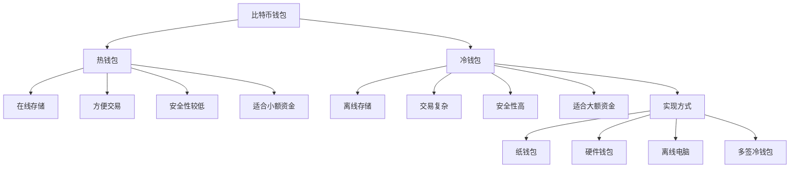

---
title: 比特币冷钱包方案
date: 2025-09-30
categories:
  - Technology
  - Learning
---

# 比特币冷钱包方案

## 1. 冷钱包基础

### 1.1 冷热钱包对比



### 1.2 冷钱包安全模型

```java
/**
 * 冷钱包安全框架
 */
public class ColdWalletSecurity {

    /**
     * 安全等级评估
     */
    public enum SecurityLevel {
        BASIC,      // 基础: 纸钱包
        STANDARD,   // 标准: 硬件钱包
        ADVANCED,   // 高级: 多签+硬件
        ENTERPRISE  // 企业: 多签+地理分散+时间锁
    }

    /**
     * 评估冷钱包安全等级
     */
    public SecurityLevel assessSecurityLevel(ColdWalletConfig config) {
        int score = 0;

        // 离线存储
        if (config.isOffline()) score += 20;

        // 多重签名
        if (config.isMultiSig()) score += 30;

        // 硬件设备
        if (config.useHardwareDevice()) score += 20;

        // 地理分散
        if (config.isGeographicallyDistributed()) score += 15;

        // 时间锁保护
        if (config.hasTimeLock()) score += 10;

        // 社会恢复
        if (config.hasSocialRecovery()) score += 5;

        if (score >= 80) return SecurityLevel.ENTERPRISE;
        if (score >= 60) return SecurityLevel.ADVANCED;
        if (score >= 40) return SecurityLevel.STANDARD;
        return SecurityLevel.BASIC;
    }

    /**
     * 冷钱包配置
     */
    public static class ColdWalletConfig {
        private boolean offline;
        private boolean multiSig;
        private boolean hardwareDevice;
        private boolean geographicallyDistributed;
        private boolean timeLock;
        private boolean socialRecovery;

        public boolean isOffline() { return offline; }
        public boolean isMultiSig() { return multiSig; }
        public boolean useHardwareDevice() { return hardwareDevice; }
        public boolean isGeographicallyDistributed() { return geographicallyDistributed; }
        public boolean hasTimeLock() { return timeLock; }
        public boolean hasSocialRecovery() { return socialRecovery; }
    }
}
```

## 2. 纸钱包

### 2.1 纸钱包生成

```java
/**
 * 纸钱包生成器
 */
public class PaperWalletGenerator {

    /**
     * 生成纸钱包
     */
    public PaperWallet generate() {
        // 生成私钥
        SecureRandom random = new SecureRandom();
        byte[] privateKeyBytes = new byte[32];
        random.nextBytes(privateKeyBytes);

        ECPrivateKey privateKey = new ECPrivateKey(privateKeyBytes);

        // 派生公钥
        ECPublicKey publicKey = privateKey.derivePublicKey();

        // 生成地址
        byte[] pubKeyHash = Hash.hash160(publicKey.getEncoded());
        String address = encodeAddress(pubKeyHash);

        // 生成WIF格式私钥
        String wif = encodeWIF(privateKeyBytes);

        PaperWallet wallet = new PaperWallet();
        wallet.setAddress(address);
        wallet.setPrivateKeyWIF(wif);
        wallet.setPublicKey(Hex.encode(publicKey.getEncoded()));

        return wallet;
    }

    /**
     * 生成BIP38加密纸钱包
     */
    public EncryptedPaperWallet generateEncrypted(String passphrase) {
        PaperWallet wallet = generate();

        // BIP38加密
        byte[] encryptedKey = bip38Encrypt(
            wallet.getPrivateKeyWIF(),
            passphrase
        );

        EncryptedPaperWallet encrypted = new EncryptedPaperWallet();
        encrypted.setAddress(wallet.getAddress());
        encrypted.setEncryptedPrivateKey(Base58.encode(encryptedKey));
        encrypted.setNeedsPassphrase(true);

        return encrypted;
    }

    /**
     * BIP38加密
     */
    private byte[] bip38Encrypt(String privateKeyWIF, String passphrase) {
        try {
            // 1. 解码WIF私钥
            byte[] privateKey = decodeWIF(privateKeyWIF);

            // 2. 派生地址
            byte[] address = deriveAddress(privateKey);

            // 3. 使用scrypt派生加密密钥
            byte[] salt = Arrays.copyOf(Hash.sha256(Hash.sha256(address)), 4);

            byte[] derivedKey = SCrypt.generate(
                passphrase.getBytes("UTF-8"),
                salt,
                16384, // N
                8,     // r
                8,     // p
                64     // dkLen
            );

            byte[] derivedHalf1 = Arrays.copyOfRange(derivedKey, 0, 32);
            byte[] derivedHalf2 = Arrays.copyOfRange(derivedKey, 32, 64);

            // 4. AES加密私钥
            Cipher cipher = Cipher.getInstance("AES/ECB/NoPadding");
            SecretKeySpec keySpec = new SecretKeySpec(derivedHalf2, "AES");
            cipher.init(Cipher.ENCRYPT_MODE, keySpec);

            // XOR私钥和derivedHalf1
            byte[] xored = new byte[32];
            for (int i = 0; i < 32; i++) {
                xored[i] = (byte)(privateKey[i] ^ derivedHalf1[i]);
            }

            byte[] encrypted = cipher.doFinal(xored);

            // 5. 组装BIP38格式
            ByteArrayOutputStream baos = new ByteArrayOutputStream();
            baos.write(0x01); // prefix
            baos.write(0x42); // type
            baos.write(0xC0); // flags
            baos.write(salt);
            baos.write(encrypted);

            return baos.toByteArray();

        } catch (Exception e) {
            throw new RuntimeException("BIP38加密失败", e);
        }
    }

    /**
     * 生成纸钱包PDF
     */
    public void generatePDF(PaperWallet wallet, String outputPath) {
        try {
            PDDocument document = new PDDocument();
            PDPage page = new PDPage();
            document.addPage(page);

            PDPageContentStream contentStream = new PDPageContentStream(
                document, page
            );

            // 标题
            contentStream.beginText();
            contentStream.setFont(PDType1Font.HELVETICA_BOLD, 20);
            contentStream.newLineAtOffset(50, 750);
            contentStream.showText("Bitcoin Paper Wallet");
            contentStream.endText();

            // 公开地址
            contentStream.beginText();
            contentStream.setFont(PDType1Font.HELVETICA, 12);
            contentStream.newLineAtOffset(50, 700);
            contentStream.showText("Public Address (Share freely):");
            contentStream.endText();

            contentStream.beginText();
            contentStream.setFont(PDType1Font.COURIER, 10);
            contentStream.newLineAtOffset(50, 680);
            contentStream.showText(wallet.getAddress());
            contentStream.endText();

            // 生成地址二维码
            BufferedImage addressQR = generateQRCode(wallet.getAddress());
            // 插入QR码图片...

            // 私钥 (警告)
            contentStream.beginText();
            contentStream.setFont(PDType1Font.HELVETICA_BOLD, 12);
            contentStream.newLineAtOffset(50, 600);
            contentStream.showText("Private Key (KEEP SECRET!):");
            contentStream.endText();

            contentStream.beginText();
            contentStream.setFont(PDType1Font.COURIER, 10);
            contentStream.newLineAtOffset(50, 580);
            contentStream.showText(wallet.getPrivateKeyWIF());
            contentStream.endText();

            // 生成私钥二维码
            BufferedImage keyQR = generateQRCode(wallet.getPrivateKeyWIF());
            // 插入QR码图片...

            // 使用说明
            contentStream.beginText();
            contentStream.setFont(PDType1Font.HELVETICA, 10);
            contentStream.newLineAtOffset(50, 500);
            contentStream.showText("Instructions:");
            contentStream.newLineAtOffset(0, -15);
            contentStream.showText("1. Send Bitcoin to the Public Address");
            contentStream.newLineAtOffset(0, -15);
            contentStream.showText("2. Keep Private Key secure and offline");
            contentStream.newLineAtOffset(0, -15);
            contentStream.showText("3. Import Private Key to spend funds");
            contentStream.endText();

            contentStream.close();

            document.save(outputPath);
            document.close();

            System.out.println("纸钱包已生成: " + outputPath);

        } catch (IOException e) {
            throw new RuntimeException("PDF生成失败", e);
        }
    }

    private String encodeWIF(byte[] privateKey) {
        // WIF编码实现
        return Base58.encode(privateKey);
    }

    private byte[] decodeWIF(String wif) {
        return Base58.decode(wif);
    }

    private String encodeAddress(byte[] pubKeyHash) {
        return Base58.encodeWithChecksum(pubKeyHash);
    }

    private byte[] deriveAddress(byte[] privateKey) {
        return new byte[20];
    }

    private BufferedImage generateQRCode(String data) {
        // 生成QR码
        return new BufferedImage(200, 200, BufferedImage.TYPE_INT_RGB);
    }

    /**
     * 纸钱包实体
     */
    public static class PaperWallet {
        private String address;
        private String privateKeyWIF;
        private String publicKey;

        public String getAddress() { return address; }
        public void setAddress(String address) { this.address = address; }
        public String getPrivateKeyWIF() { return privateKeyWIF; }
        public void setPrivateKeyWIF(String privateKeyWIF) {
            this.privateKeyWIF = privateKeyWIF;
        }
        public String getPublicKey() { return publicKey; }
        public void setPublicKey(String publicKey) { this.publicKey = publicKey; }
    }

    public static class EncryptedPaperWallet {
        private String address;
        private String encryptedPrivateKey;
        private boolean needsPassphrase;

        public String getAddress() { return address; }
        public void setAddress(String address) { this.address = address; }
        public String getEncryptedPrivateKey() { return encryptedPrivateKey; }
        public void setEncryptedPrivateKey(String key) { this.encryptedPrivateKey = key; }
        public boolean isNeedsPassphrase() { return needsPassphrase; }
        public void setNeedsPassphrase(boolean needs) { this.needsPassphrase = needs; }
    }
}
```

## 3. 硬件钱包集成

### 3.1 硬件钱包接口

```java
/**
 * 硬件钱包抽象接口
 */
public interface HardwareWallet {

    /**
     * 连接设备
     */
    void connect() throws WalletException;

    /**
     * 断开连接
     */
    void disconnect();

    /**
     * 获取设备信息
     */
    DeviceInfo getDeviceInfo();

    /**
     * 生成地址
     */
    String getAddress(String derivationPath);

    /**
     * 签名交易
     */
    byte[] signTransaction(Transaction tx, List<String> derivationPaths);

    /**
     * 验证地址
     */
    boolean verifyAddress(String address, String derivationPath);
}

/**
 * Ledger硬件钱包实现
 */
public class LedgerWallet implements HardwareWallet {

    private HIDDevice device;
    private boolean connected;

    @Override
    public void connect() throws WalletException {
        try {
            // 查找Ledger设备
            HIDManager hidManager = HIDManager.getInstance();
            List<HIDDevice> devices = hidManager.listDevices(
                0x2c97,  // Ledger VID
                0x0001   // Nano S PID
            );

            if (devices.isEmpty()) {
                throw new WalletException("未找到Ledger设备");
            }

            device = devices.get(0);
            device.open();
            connected = true;

            System.out.println("Ledger设备已连接");

        } catch (Exception e) {
            throw new WalletException("连接失败", e);
        }
    }

    @Override
    public void disconnect() {
        if (device != null) {
            device.close();
            connected = false;
        }
    }

    @Override
    public DeviceInfo getDeviceInfo() {
        if (!connected) {
            throw new IllegalStateException("设备未连接");
        }

        // 发送APDU命令获取设备信息
        byte[] apdu = buildAPDU(0xE0, 0x01, 0x00, 0x00, new byte[0]);
        byte[] response = device.sendAPDU(apdu);

        return parseDeviceInfo(response);
    }

    @Override
    public String getAddress(String derivationPath) {
        if (!connected) {
            throw new IllegalStateException("设备未连接");
        }

        // 解析派生路径
        byte[] pathBytes = encodePath(derivationPath);

        // 发送获取地址命令
        byte[] apdu = buildAPDU(0xE0, 0x40, 0x00, 0x00, pathBytes);
        byte[] response = device.sendAPDU(apdu);

        // 解析地址
        return parseAddress(response);
    }

    @Override
    public byte[] signTransaction(Transaction tx, List<String> derivationPaths) {
        if (!connected) {
            throw new IllegalStateException("设备未连接");
        }

        try {
            // 序列化交易
            byte[] txBytes = tx.serialize();

            // 分块发送交易数据
            int offset = 0;
            int chunkSize = 255;

            while (offset < txBytes.length) {
                int len = Math.min(chunkSize, txBytes.length - offset);
                byte[] chunk = Arrays.copyOfRange(txBytes, offset, offset + len);

                byte p1 = (byte)(offset == 0 ? 0x00 : 0x80);
                byte[] apdu = buildAPDU(0xE0, 0x04, p1, 0x00, chunk);

                device.sendAPDU(apdu);
                offset += len;
            }

            // 发送签名命令
            byte[] pathBytes = encodePath(derivationPaths.get(0));
            byte[] apdu = buildAPDU(0xE0, 0x48, 0x00, 0x00, pathBytes);

            // 等待用户在设备上确认
            System.out.println("请在Ledger设备上确认交易...");

            byte[] signature = device.sendAPDU(apdu);

            return signature;

        } catch (Exception e) {
            throw new WalletException("签名失败", e);
        }
    }

    @Override
    public boolean verifyAddress(String address, String derivationPath) {
        // 在设备屏幕上显示地址供用户验证
        byte[] pathBytes = encodePath(derivationPath);
        byte[] apdu = buildAPDU(0xE0, 0x42, 0x01, 0x00, pathBytes);

        device.sendAPDU(apdu);

        System.out.println("请在Ledger设备上验证地址: " + address);

        return true;
    }

    /**
     * 构建APDU命令
     */
    private byte[] buildAPDU(int cla, int ins, int p1, int p2, byte[] data) {
        ByteArrayOutputStream baos = new ByteArrayOutputStream();

        baos.write(cla);
        baos.write(ins);
        baos.write(p1);
        baos.write(p2);
        baos.write(data.length);
        try {
            baos.write(data);
        } catch (IOException e) {
            throw new RuntimeException(e);
        }

        return baos.toByteArray();
    }

    /**
     * 编码BIP32派生路径
     */
    private byte[] encodePath(String path) {
        // 解析路径如 m/44'/0'/0'/0/0
        String[] parts = path.split("/");
        ByteArrayOutputStream baos = new ByteArrayOutputStream();

        baos.write(parts.length - 1); // 深度

        for (int i = 1; i < parts.length; i++) {
            String part = parts[i];
            boolean hardened = part.endsWith("'");

            if (hardened) {
                part = part.substring(0, part.length() - 1);
            }

            int index = Integer.parseInt(part);
            if (hardened) {
                index |= 0x80000000;
            }

            writeUint32BE(baos, index);
        }

        return baos.toByteArray();
    }

    private void writeUint32BE(ByteArrayOutputStream os, int value) {
        os.write((value >> 24) & 0xFF);
        os.write((value >> 16) & 0xFF);
        os.write((value >> 8) & 0xFF);
        os.write(value & 0xFF);
    }

    private DeviceInfo parseDeviceInfo(byte[] response) {
        // 解析设备信息
        return new DeviceInfo();
    }

    private String parseAddress(byte[] response) {
        // 解析地址
        return "";
    }

    public static class DeviceInfo {
        String model;
        String firmwareVersion;
        boolean initialized;
    }

    public static class WalletException extends Exception {
        public WalletException(String message) {
            super(message);
        }

        public WalletException(String message, Throwable cause) {
            super(message, cause);
        }
    }
}
```

## 4. 离线签名方案

### 4.1 气隙交易流程

```java
/**
 * 气隙离线签名系统
 */
public class AirGappedSigner {

    /**
     * 离线机: 创建未签名交易
     */
    public UnsignedTransaction createUnsignedTransaction(
            List<UTXO> inputs,
            List<TxOutput> outputs) {

        Transaction tx = new Transaction();
        tx.setVersion(2);

        for (UTXO utxo : inputs) {
            TxInput input = new TxInput();
            input.setPrevTxid(utxo.txid);
            input.setPrevVout(utxo.vout);
            tx.addInput(input);
        }

        for (TxOutput output : outputs) {
            tx.addOutput(output);
        }

        UnsignedTransaction unsigned = new UnsignedTransaction();
        unsigned.setTransaction(tx);
        unsigned.setInputs(inputs);

        return unsigned;
    }

    /**
     * 序列化为QR码(传输到离线机)
     */
    public String serializeToQR(UnsignedTransaction unsigned) {
        // 使用紧凑格式序列化
        JSONObject json = new JSONObject();

        // 交易数据
        json.put("tx", Hex.encode(unsigned.getTransaction().serialize()));

        // 输入信息(用于签名)
        JSONArray inputs = new JSONArray();
        for (UTXO utxo : unsigned.getInputs()) {
            JSONObject input = new JSONObject();
            input.put("txid", utxo.txid);
            input.put("vout", utxo.vout);
            input.put("amount", utxo.amount);
            input.put("scriptPubKey", Hex.encode(utxo.scriptPubKey));
            inputs.put(input);
        }
        json.put("inputs", inputs);

        // Base43编码(适合QR码)
        return Base43.encode(json.toString().getBytes());
    }

    /**
     * 离线机: 签名交易
     */
    public SignedTransaction signOffline(
            UnsignedTransaction unsigned,
            List<PrivateKey> privateKeys) {

        Transaction tx = unsigned.getTransaction();

        // 为每个输入签名
        for (int i = 0; i < tx.getInputs().size(); i++) {
            UTXO utxo = unsigned.getInputs().get(i);
            PrivateKey key = privateKeys.get(i);

            // 计算签名哈希
            byte[] sigHash = calculateSigHash(tx, i, utxo);

            // ECDSA签名
            byte[] signature = sign(sigHash, key);

            // 构建scriptSig
            byte[] scriptSig = buildScriptSig(signature, key.getPublicKey());

            tx.getInputs().get(i).setScriptSig(scriptSig);
        }

        SignedTransaction signed = new SignedTransaction();
        signed.setTransaction(tx);

        return signed;
    }

    /**
     * 序列化签名交易为QR码(传输回在线机)
     */
    public String serializeSignedToQR(SignedTransaction signed) {
        byte[] txBytes = signed.getTransaction().serialize();
        return Base43.encode(txBytes);
    }

    /**
     * 在线机: 广播交易
     */
    public String broadcastTransaction(SignedTransaction signed) throws Exception {
        Transaction tx = signed.getTransaction();

        // 验证交易
        if (!validateTransaction(tx)) {
            throw new Exception("交易验证失败");
        }

        // 广播到网络
        BitcoinRpcClient rpc = new BitcoinRpcClient();
        String txHex = Hex.encode(tx.serialize());

        String txid = rpc.call("sendrawtransaction", txHex)
            .getString("result");

        System.out.println("交易已广播: " + txid);

        return txid;
    }

    /**
     * PSBT格式支持(BIP174)
     */
    public PSBT createPSBT(UnsignedTransaction unsigned) {
        PSBT psbt = new PSBT();
        psbt.setUnsignedTransaction(unsigned.getTransaction());

        // 添加输入元数据
        for (int i = 0; i < unsigned.getInputs().size(); i++) {
            UTXO utxo = unsigned.getInputs().get(i);

            PSBTInput input = new PSBTInput();
            input.setPreviousTxid(utxo.txid);
            input.setPreviousVout(utxo.vout);
            input.setAmount(utxo.amount);
            input.setScriptPubKey(utxo.scriptPubKey);

            psbt.addInput(input);
        }

        return psbt;
    }

    /**
     * Base43编码(优化QR码)
     */
    public static class Base43 {
        private static final String ALPHABET =
            "0123456789ABCDEFGHIJKLMNOPQRSTUVWXYZ$*+-./:";

        public static String encode(byte[] data) {
            BigInteger num = new BigInteger(1, data);
            StringBuilder sb = new StringBuilder();

            while (num.compareTo(BigInteger.ZERO) > 0) {
                BigInteger[] divmod = num.divideAndRemainder(
                    BigInteger.valueOf(43)
                );
                sb.insert(0, ALPHABET.charAt(divmod[1].intValue()));
                num = divmod[0];
            }

            return sb.toString();
        }

        public static byte[] decode(String encoded) {
            BigInteger num = BigInteger.ZERO;

            for (char c : encoded.toCharArray()) {
                int digit = ALPHABET.indexOf(c);
                num = num.multiply(BigInteger.valueOf(43))
                         .add(BigInteger.valueOf(digit));
            }

            return num.toByteArray();
        }
    }

    private byte[] calculateSigHash(Transaction tx, int index, UTXO utxo) {
        return new byte[32];
    }

    private byte[] sign(byte[] hash, PrivateKey key) {
        return new byte[64];
    }

    private byte[] buildScriptSig(byte[] signature, PublicKey pubKey) {
        return new byte[107];
    }

    private boolean validateTransaction(Transaction tx) {
        return true;
    }

    public static class UnsignedTransaction {
        private Transaction transaction;
        private List<UTXO> inputs;

        public Transaction getTransaction() { return transaction; }
        public void setTransaction(Transaction transaction) {
            this.transaction = transaction;
        }
        public List<UTXO> getInputs() { return inputs; }
        public void setInputs(List<UTXO> inputs) { this.inputs = inputs; }
    }

    public static class SignedTransaction {
        private Transaction transaction;

        public Transaction getTransaction() { return transaction; }
        public void setTransaction(Transaction transaction) {
            this.transaction = transaction;
        }
    }

    public static class PSBT {
        private Transaction unsignedTransaction;
        private List<PSBTInput> inputs = new ArrayList<>();

        public Transaction getUnsignedTransaction() { return unsignedTransaction; }
        public void setUnsignedTransaction(Transaction tx) {
            this.unsignedTransaction = tx;
        }
        public void addInput(PSBTInput input) { inputs.add(input); }
    }

    public static class PSBTInput {
        private String previousTxid;
        private int previousVout;
        private long amount;
        private byte[] scriptPubKey;

        public void setPreviousTxid(String txid) { this.previousTxid = txid; }
        public void setPreviousVout(int vout) { this.previousVout = vout; }
        public void setAmount(long amount) { this.amount = amount; }
        public void setScriptPubKey(byte[] script) { this.scriptPubKey = script; }
    }
}
```

## 5. 企业级冷存储

### 5.1 多签冷钱包方案

```java
/**
 * 企业级冷存储方案
 */
public class EnterpriseColdStorage {

    /**
     * 创建3-of-5多签冷钱包
     */
    public MultiSigColdWallet create3of5Wallet(
            String[] locations,
            HardwareWallet[] devices) {

        if (locations.length != 5 || devices.length != 5) {
            throw new IllegalArgumentException("需要5个位置和5个设备");
        }

        MultiSigColdWallet wallet = new MultiSigColdWallet();
        wallet.setRequiredSignatures(3);
        wallet.setTotalKeys(5);

        // 为每个位置生成密钥
        List<KeyShard> shards = new ArrayList<>();

        for (int i = 0; i < 5; i++) {
            // 使用硬件钱包生成密钥
            HardwareWallet device = devices[i];
            device.connect();

            String derivationPath = "m/48'/0'/0'/2'/0";
            String address = device.getAddress(derivationPath);
            PublicKey pubKey = device.getPublicKey(derivationPath);

            KeyShard shard = new KeyShard();
            shard.setShardId(i + 1);
            shard.setLocation(locations[i]);
            shard.setPublicKey(pubKey);
            shard.setDeviceId(device.getDeviceInfo().serialNumber);

            shards.add(shard);

            device.disconnect();

            System.out.println("密钥分片 " + (i+1) + " 已创建于: " + locations[i]);
        }

        wallet.setKeyShards(shards);

        // 生成多签地址
        List<PublicKey> pubKeys = shards.stream()
            .map(KeyShard::getPublicKey)
            .collect(Collectors.toList());

        String multiSigAddress = createMultiSigAddress(3, pubKeys);
        wallet.setAddress(multiSigAddress);

        return wallet;
    }

    /**
     * 执行冷存储交易(需要3个签名)
     */
    public String executeColdStorageTransaction(
            MultiSigColdWallet wallet,
            String recipient,
            double amount,
            HardwareWallet[] signingDevices) throws Exception {

        if (signingDevices.length < 3) {
            throw new IllegalArgumentException("至少需要3个签名设备");
        }

        // 1. 在线机创建未签名交易
        UnsignedTransaction unsigned = createWithdrawalTransaction(
            wallet, recipient, amount
        );

        // 2. 传输到第一个签名位置
        System.out.println("传输交易到签名位置1...");
        String psbtData = serializePSBT(unsigned);

        PartiallySignedTransaction psbt = null;

        // 3. 收集3个签名
        for (int i = 0; i < 3; i++) {
            System.out.println("\n在位置 " + (i+1) + " 签名...");

            HardwareWallet device = signingDevices[i];
            device.connect();

            // 在设备上验证交易
            System.out.println("请在设备上验证交易详情:");
            System.out.println("接收方: " + recipient);
            System.out.println("金额: " + amount + " BTC");

            // 签名
            byte[] signature = device.signTransaction(
                unsigned.getTransaction(),
                Arrays.asList("m/48'/0'/0'/2'/0")
            );

            if (psbt == null) {
                psbt = createPSBT(unsigned);
            }

            psbt.addSignature(i, signature);

            device.disconnect();

            System.out.println("签名 " + (i+1) + " 已完成");
        }

        // 4. 组合签名并广播
        Transaction finalTx = finalizePSBT(psbt);
        String txid = broadcastTransaction(finalTx);

        System.out.println("\n交易已广播: " + txid);

        return txid;
    }

    /**
     * 定期审计
     */
    public AuditReport performAudit(MultiSigColdWallet wallet) {
        AuditReport report = new AuditReport();
        report.setAuditDate(LocalDateTime.now());
        report.setWalletAddress(wallet.getAddress());

        // 检查余额
        double balance = checkBalance(wallet.getAddress());
        report.setBalance(balance);

        // 验证所有密钥分片可访问
        int accessibleShards = 0;
        for (KeyShard shard : wallet.getKeyShards()) {
            if (verifyShardAccess(shard)) {
                accessibleShards++;
            } else {
                report.addIssue("无法访问分片: " + shard.getLocation());
            }
        }

        report.setAccessibleShards(accessibleShards);
        report.setTotalShards(wallet.getKeyShards().size());

        // 检查交易历史
        List<String> recentTxs = getRecentTransactions(wallet.getAddress(), 10);
        report.setRecentTransactions(recentTxs);

        return report;
    }

    private String createMultiSigAddress(int m, List<PublicKey> pubKeys) {
        return "";
    }

    private UnsignedTransaction createWithdrawalTransaction(
            MultiSigColdWallet wallet, String recipient, double amount) {
        return new UnsignedTransaction();
    }

    private String serializePSBT(UnsignedTransaction unsigned) {
        return "";
    }

    private PartiallySignedTransaction createPSBT(UnsignedTransaction unsigned) {
        return new PartiallySignedTransaction();
    }

    private Transaction finalizePSBT(PartiallySignedTransaction psbt) {
        return new Transaction();
    }

    private String broadcastTransaction(Transaction tx) {
        return "";
    }

    private double checkBalance(String address) {
        return 0.0;
    }

    private boolean verifyShardAccess(KeyShard shard) {
        return true;
    }

    private List<String> getRecentTransactions(String address, int limit) {
        return new ArrayList<>();
    }

    public static class MultiSigColdWallet {
        private int requiredSignatures;
        private int totalKeys;
        private String address;
        private List<KeyShard> keyShards;

        public int getRequiredSignatures() { return requiredSignatures; }
        public void setRequiredSignatures(int n) { this.requiredSignatures = n; }
        public int getTotalKeys() { return totalKeys; }
        public void setTotalKeys(int n) { this.totalKeys = n; }
        public String getAddress() { return address; }
        public void setAddress(String address) { this.address = address; }
        public List<KeyShard> getKeyShards() { return keyShards; }
        public void setKeyShards(List<KeyShard> shards) { this.keyShards = shards; }
    }

    public static class KeyShard {
        private int shardId;
        private String location;
        private PublicKey publicKey;
        private String deviceId;

        public int getShardId() { return shardId; }
        public void setShardId(int id) { this.shardId = id; }
        public String getLocation() { return location; }
        public void setLocation(String location) { this.location = location; }
        public PublicKey getPublicKey() { return publicKey; }
        public void setPublicKey(PublicKey key) { this.publicKey = key; }
        public String getDeviceId() { return deviceId; }
        public void setDeviceId(String id) { this.deviceId = id; }
    }

    public static class AuditReport {
        private LocalDateTime auditDate;
        private String walletAddress;
        private double balance;
        private int accessibleShards;
        private int totalShards;
        private List<String> recentTransactions;
        private List<String> issues = new ArrayList<>();

        public void setAuditDate(LocalDateTime date) { this.auditDate = date; }
        public void setWalletAddress(String address) { this.walletAddress = address; }
        public void setBalance(double balance) { this.balance = balance; }
        public void setAccessibleShards(int n) { this.accessibleShards = n; }
        public void setTotalShards(int n) { this.totalShards = n; }
        public void setRecentTransactions(List<String> txs) {
            this.recentTransactions = txs;
        }
        public void addIssue(String issue) { this.issues.add(issue); }
    }
}
```

## 6. 相关文档

- [比特币钱包技术实现](./07.比特币钱包技术实现.md)
- [比特币多签钱包开发](./27.比特币多签钱包开发.md)
- [比特币攻击案例分析](./28.比特币攻击案例分析.md)

## 参考资源

- [BIP38: Passphrase-protected private key](https://github.com/bitcoin/bips/blob/master/bip-0038.mediawiki)
- [BIP174: Partially Signed Bitcoin Transaction Format](https://github.com/bitcoin/bips/blob/master/bip-0174.mediawiki)
- [Hardware Wallet Guide](https://bitcoin.org/en/wallets/hardware/)