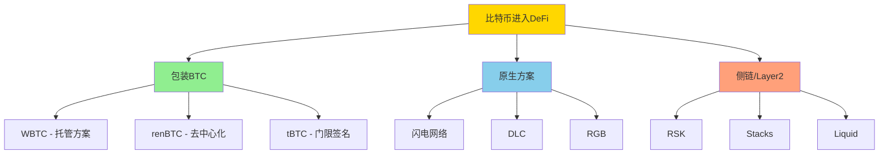

---
title: 比特币与DeFi
date: 2025-09-30
categories:
  - Technology
  - Learning
---

# 比特币与DeFi

## 1. 比特币DeFi概述

### 1.1 比特币进入DeFi的方式



### 1.2 包装BTC对比

```java
/**
 * 包装比特币方案对比
 */
public class WrappedBTCComparison {

    public enum WrappedType {
        WBTC("WBTC", "托管", "BitGo托管", "高流动性"),
        RENBTC("renBTC", "去中心化", "RenVM网络", "无需许可"),
        TBTC("tBTC", "门限签名", "随机验证人", "最去中心化"),
        HBTC("HBTC", "托管", "火币托管", "交易所背书"),
        BTCB("BTCB", "托管", "币安托管", "BSC生态");

        private String name;
        private String trustModel;
        private String custodian;
        private String advantage;

        WrappedType(String name, String trustModel, String custodian, String advantage) {
            this.name = name;
            this.trustModel = trustModel;
            this.custodian = custodian;
            this.advantage = advantage;
        }

        public String getName() { return name; }
        public String getTrustModel() { return trustModel; }
        public String getCustodian() { return custodian; }
        public String getAdvantage() { return advantage; }
    }

    /**
     * 方案对比分析
     */
    public void compareWrappedBTC() {
        System.out.println("=== 包装BTC方案对比 ===\n");

        for (WrappedType type : WrappedType.values()) {
            System.out.println(type.getName() + ":");
            System.out.println("  信任模型: " + type.getTrustModel());
            System.out.println("  托管方: " + type.getCustodian());
            System.out.println("  优势: " + type.getAdvantage());
            System.out.println();
        }

        System.out.println("市场份额 (TVL):");
        System.out.println("  WBTC: ~$10B (70%)");
        System.out.println("  renBTC: ~$1B (7%)");
        System.out.println("  HBTC: ~$500M (3.5%)");
        System.out.println("  tBTC: ~$100M (0.7%)");
        System.out.println("  其他: ~$2.7B (18.8%)\n");
    }

    /**
     * 风险评估
     */
    public static class RiskAssessment {

        public void assessRisks(WrappedType type) {
            System.out.println("=== " + type.getName() + " 风险评估 ===\n");

            switch (type) {
                case WBTC:
                    System.out.println("托管风险: ★★★☆☆");
                    System.out.println("  - BitGo单点托管");
                    System.out.println("  - 需要信任第三方");
                    System.out.println("  - 受监管,相对可靠\n");

                    System.out.println("技术风险: ★☆☆☆☆");
                    System.out.println("  - 简单ERC20代币");
                    System.out.println("  - 久经考验\n");

                    System.out.println("流动性风险: ★☆☆☆☆");
                    System.out.println("  - 最高流动性");
                    System.out.println("  - 主流DeFi协议支持");
                    break;

                case RENBTC:
                    System.out.println("托管风险: ★★☆☆☆");
                    System.out.println("  - RenVM去中心化网络");
                    System.out.println("  - 多节点托管");
                    System.out.println("  - 经济激励保证安全\n");

                    System.out.println("技术风险: ★★★☆☆");
                    System.out.println("  - 复杂的MPC协议");
                    System.out.println("  - 相对较新\n");

                    System.out.println("流动性风险: ★★☆☆☆");
                    System.out.println("  - 中等流动性");
                    System.out.println("  - 主要DeFi支持");
                    break;

                case TBTC:
                    System.out.println("托管风险: ★☆☆☆☆");
                    System.out.println("  - 最去中心化");
                    System.out.println("  - 随机验证人");
                    System.out.println("  - 无需许可\n");

                    System.out.println("技术风险: ★★★★☆");
                    System.out.println("  - 门限签名复杂");
                    System.out.println("  - 相对较新");
                    System.out.println("  - 多次重启\n");

                    System.out.println("流动性风险: ★★★★☆");
                    System.out.println("  - 流动性较低");
                    System.out.println("  - 支持有限");
                    break;

                default:
                    System.out.println("暂无评估");
            }
        }
    }
}
```

## 2. WBTC实现

### 2.1 WBTC铸造与赎回

```java
/**
 * WBTC (Wrapped Bitcoin) 实现
 */
public class WBTCImplementation {

    /**
     * 铸造WBTC
     */
    public String mintWBTC(String userBTCAddress, double amount) throws Exception {
        System.out.println("=== 铸造WBTC ===\n");

        // 1. 用户发送KYC信息给商户
        System.out.println("1. 完成KYC验证...");
        String merchantId = verifyKYC(userBTCAddress);

        // 2. 用户发送BTC到商户
        System.out.println("2. 发送 " + amount + " BTC 到商户...");
        String btcTxid = sendBTCToMerchant(userBTCAddress, merchantId, amount);

        // 3. 商户验证后向托管人发送请求
        System.out.println("3. 商户请求铸造...");
        waitForConfirmations(btcTxid, 6);

        // 4. 托管人(BitGo)发送BTC到多签地址
        System.out.println("4. 托管人锁定BTC...");
        String custodyTxid = custodianLockBTC(btcTxid, amount);

        // 5. 在以太坊上铸造WBTC
        System.out.println("5. 铸造WBTC代币...");
        String ethTxHash = mintWBTCOnEthereum(userBTCAddress, amount);

        System.out.println("\n✓ 铸造完成!");
        System.out.println("以太坊交易: " + ethTxHash);
        System.out.println("WBTC余额: " + amount + " WBTC");

        return ethTxHash;
    }

    /**
     * 赎回WBTC
     */
    public String burnWBTC(String ethAddress, double amount, String btcAddress)
            throws Exception {
        System.out.println("=== 赎回WBTC ===\n");

        // 1. 用户在以太坊上销毁WBTC
        System.out.println("1. 销毁 " + amount + " WBTC...");
        String burnTxHash = burnWBTCOnEthereum(ethAddress, amount);

        // 2. 等待确认
        System.out.println("2. 等待以太坊确认...");
        waitForEthConfirmations(burnTxHash, 12);

        // 3. 商户验证并请求释放BTC
        System.out.println("3. 商户处理赎回请求...");
        String releaseRequest = merchantRequestRelease(burnTxHash, btcAddress);

        // 4. 托管人释放BTC
        System.out.println("4. 托管人释放BTC...");
        String btcTxid = custodianReleaseBTC(releaseRequest, btcAddress, amount);

        System.out.println("\n✓ 赎回完成!");
        System.out.println("比特币交易: " + btcTxid);
        System.out.println("已发送 " + amount + " BTC 到 " + btcAddress);

        return btcTxid;
    }

    /**
     * WBTC智能合约(简化版)
     */
    public static class WBTCContract {

        private Map<String, Double> balances;
        private String controller; // 托管人地址
        private double totalSupply;

        /**
         * 铸造WBTC
         */
        public void mint(String recipient, double amount) {
            require(msg.sender == controller, "Only controller");

            balances.put(recipient, balances.getOrDefault(recipient, 0.0) + amount);
            totalSupply += amount;

            emit("Mint", recipient, amount);
        }

        /**
         * 销毁WBTC
         */
        public void burn(String from, double amount) {
            require(balances.getOrDefault(from, 0.0) >= amount, "Insufficient balance");

            balances.put(from, balances.get(from) - amount);
            totalSupply -= amount;

            emit("Burn", from, amount);
        }

        /**
         * 转账
         */
        public void transfer(String from, String to, double amount) {
            require(balances.getOrDefault(from, 0.0) >= amount, "Insufficient balance");

            balances.put(from, balances.get(from) - amount);
            balances.put(to, balances.getOrDefault(to, 0.0) + amount);

            emit("Transfer", from, to, amount);
        }

        private void require(boolean condition, String message) {
            if (!condition) {
                throw new RuntimeException(message);
            }
        }

        private void emit(String event, Object... args) {
            System.out.println("Event: " + event + " " + Arrays.toString(args));
        }

        private static class msg {
            static String sender = "0x...";
        }
    }

    private String verifyKYC(String address) {
        return "merchant_" + address.substring(0, 8);
    }

    private String sendBTCToMerchant(String from, String merchantId, double amount) {
        return "btc_txid_" + System.currentTimeMillis();
    }

    private void waitForConfirmations(String txid, int confirmations) {
    }

    private String custodianLockBTC(String txid, double amount) {
        return "custody_txid";
    }

    private String mintWBTCOnEthereum(String address, double amount) {
        return "0xeth_mint_" + System.currentTimeMillis();
    }

    private String burnWBTCOnEthereum(String address, double amount) {
        return "0xeth_burn_" + System.currentTimeMillis();
    }

    private void waitForEthConfirmations(String txHash, int confirmations) {
    }

    private String merchantRequestRelease(String burnTxHash, String btcAddress) {
        return "release_request_" + System.currentTimeMillis();
    }

    private String custodianReleaseBTC(String request, String address, double amount) {
        return "btc_release_" + System.currentTimeMillis();
    }
}
```

## 3. renBTC去中心化方案

### 3.1 RenVM实现

```java
/**
 * renBTC (RenVM) 实现
 */
public class RenBTCImplementation {

    /**
     * RenVM去中心化托管
     */
    public String mintRenBTC(String userBTCAddress, String ethAddress, double amount)
            throws Exception {
        System.out.println("=== 通过RenVM铸造renBTC ===\n");

        // 1. 生成网关地址(由RenVM darknodes生成)
        System.out.println("1. 生成RenVM网关地址...");
        String gatewayAddress = generateRenVMGateway(ethAddress);
        System.out.println("网关地址: " + gatewayAddress);

        // 2. 用户发送BTC到网关
        System.out.println("\n2. 发送 " + amount + " BTC 到网关...");
        String btcTxid = sendBTCToGateway(userBTCAddress, gatewayAddress, amount);

        // 3. 等待确认
        System.out.println("3. 等待比特币确认...");
        waitForConfirmations(btcTxid, 6);

        // 4. RenVM darknodes达成共识
        System.out.println("4. RenVM节点处理...");
        RenVMConsensus consensus = renVMReachConsensus(btcTxid, ethAddress, amount);

        // 5. 使用MPC签名铸造renBTC
        System.out.println("5. RenVM生成MPC签名...");
        byte[] mpcSignature = consensus.generateMPCSignature();

        // 6. 在以太坊上铸造
        System.out.println("6. 铸造renBTC...");
        String ethTxHash = mintRenBTCWithSignature(ethAddress, amount, mpcSignature);

        System.out.println("\n✓ 铸造完成!");
        System.out.println("以太坊交易: " + ethTxHash);
        System.out.println("renBTC余额: " + amount + " renBTC");

        return ethTxHash;
    }

    /**
     * 销毁renBTC
     */
    public String burnRenBTC(String ethAddress, String btcAddress, double amount)
            throws Exception {
        System.out.println("=== 销毁renBTC ===\n");

        // 1. 在以太坊上销毁
        System.out.println("1. 销毁 " + amount + " renBTC...");
        String burnTxHash = burnRenBTCOnEthereum(ethAddress, amount, btcAddress);

        // 2. RenVM监听销毁事件
        System.out.println("2. RenVM监听销毁事件...");
        waitForEthConfirmations(burnTxHash, 12);

        // 3. RenVM darknodes共同签名BTC交易
        System.out.println("3. RenVM生成BTC释放签名...");
        String btcTxid = renVMReleaseBTC(burnTxHash, btcAddress, amount);

        System.out.println("\n✓ 赎回完成!");
        System.out.println("比特币交易: " + btcTxid);

        return btcTxid;
    }

    /**
     * RenVM共识机制
     */
    public static class RenVMConsensus {

        private List<DarkNode> darkNodes;
        private int threshold; // 门限值

        /**
         * RenVM使用sMPC(安全多方计算)
         */
        public byte[] generateMPCSignature() {
            System.out.println("RenVM MPC签名过程:");

            // 1. 选择签名者集合
            List<DarkNode> signers = selectRandomSigners();
            System.out.println("  选择 " + signers.size() + " 个节点参与签名");

            // 2. 每个节点生成私钥分片签名
            List<byte[]> signatureShares = new ArrayList<>();
            for (DarkNode node : signers) {
                byte[] share = node.signWithKeyShare();
                signatureShares.add(share);
            }

            // 3. 组合签名分片
            byte[] finalSignature = combineSignatureShares(signatureShares);

            System.out.println("  ✓ MPC签名生成完成");

            return finalSignature;
        }

        /**
         * 密钥生成(DKG - 分布式密钥生成)
         */
        public void distributedKeyGeneration() {
            System.out.println("RenVM分布式密钥生成:");

            // 1. 每个节点生成密钥分片
            for (DarkNode node : darkNodes) {
                node.generateKeyShare();
            }

            // 2. 节点间交换加密的密钥分片
            for (DarkNode node : darkNodes) {
                node.shareEncryptedShards(darkNodes);
            }

            // 3. 每个节点验证收到的分片
            for (DarkNode node : darkNodes) {
                if (!node.verifyShards()) {
                    throw new RuntimeException("密钥分片验证失败");
                }
            }

            System.out.println("  ✓ 分布式密钥生成完成");
            System.out.println("  门限: " + threshold + "/" + darkNodes.size());
        }

        private List<DarkNode> selectRandomSigners() {
            // 随机选择足够数量的节点
            return darkNodes.subList(0, threshold);
        }

        private byte[] combineSignatureShares(List<byte[]> shares) {
            // 使用Shamir秘密共享重建签名
            return new byte[64];
        }

        static class DarkNode {
            private byte[] keyShare;
            private String nodeId;

            void generateKeyShare() {
                this.keyShare = new byte[32];
                new SecureRandom().nextBytes(keyShare);
            }

            void shareEncryptedShards(List<DarkNode> nodes) {
                // 加密并分享密钥分片给其他节点
            }

            boolean verifyShards() {
                // 验证收到的密钥分片
                return true;
            }

            byte[] signWithKeyShare() {
                // 使用密钥分片签名
                return new byte[32];
            }
        }
    }

    private String generateRenVMGateway(String ethAddress) {
        // RenVM为每个铸造请求生成唯一网关地址
        return "bc1qrenvm" + Hash.sha256(ethAddress.getBytes()).substring(0, 32);
    }

    private String sendBTCToGateway(String from, String gateway, double amount) {
        return "btc_txid";
    }

    private void waitForConfirmations(String txid, int confirmations) {
    }

    private RenVMConsensus renVMReachConsensus(String txid, String ethAddress, double amount) {
        RenVMConsensus consensus = new RenVMConsensus();
        consensus.darkNodes = new ArrayList<>();
        consensus.threshold = 2;
        return consensus;
    }

    private String mintRenBTCWithSignature(String address, double amount, byte[] signature) {
        return "0xeth_mint";
    }

    private String burnRenBTCOnEthereum(String address, double amount, String btcAddress) {
        return "0xeth_burn";
    }

    private void waitForEthConfirmations(String txHash, int confirmations) {
    }

    private String renVMReleaseBTC(String burnTxHash, String btcAddress, double amount) {
        return "btc_release";
    }
}
```

## 4. 比特币原生DeFi

### 4.1 DLC (Discreet Log Contracts)

```java
/**
 * DLC (离散对数合约) 实现
 */
public class DLCImplementation {

    /**
     * 创建DLC
     */
    public DLCContract createDLC(
            Party alice,
            Party bob,
            Oracle oracle,
            OutcomePayouts payouts) throws Exception {

        System.out.println("=== 创建DLC ===\n");

        // 1. 双方创建资金交易
        System.out.println("1. 创建资金交易...");
        Transaction fundingTx = new Transaction();

        // Alice和Bob各自出资
        TxOutput fundingOutput = new TxOutput();
        fundingOutput.setValue(alice.funding + bob.funding);
        fundingOutput.setScriptPubKey(createDLCScript(alice, bob));
        fundingTx.addOutput(fundingOutput);

        // 2. 为每个可能的结果创建CET(合约执行交易)
        System.out.println("2. 创建合约执行交易...");
        Map<String, Transaction> cets = new HashMap<>();

        for (Map.Entry<String, Long[]> entry : payouts.payouts.entrySet()) {
            String outcome = entry.getKey();
            Long[] payout = entry.getValue(); // [alice金额, bob金额]

            Transaction cet = new Transaction();

            // 添加资金输入
            TxInput input = new TxInput();
            input.setPrevTxid(fundingTx.getTxid());
            input.setPrevVout(0);
            cet.addInput(input);

            // Alice的输出
            if (payout[0] > 0) {
                TxOutput aliceOutput = new TxOutput();
                aliceOutput.setValue(payout[0]);
                aliceOutput.setAddress(alice.address);
                cet.addOutput(aliceOutput);
            }

            // Bob的输出
            if (payout[1] > 0) {
                TxOutput bobOutput = new TxOutput();
                bobOutput.setValue(payout[1]);
                bobOutput.setAddress(bob.address);
                cet.addOutput(bobOutput);
            }

            cets.put(outcome, cet);
        }

        // 3. 使用预言机的公钥适配器签名
        System.out.println("3. 创建适配器签名...");
        Map<String, AdaptorSignature> adaptorSigs = new HashMap<>();

        for (Map.Entry<String, Transaction> entry : cets.entrySet()) {
            String outcome = entry.getKey();
            Transaction cet = entry.getValue();

            // 为每个结果创建适配器签名
            AdaptorSignature aliceSig = alice.createAdaptorSignature(
                cet, oracle.getPublicKey(), outcome
            );
            AdaptorSignature bobSig = bob.createAdaptorSignature(
                cet, oracle.getPublicKey(), outcome
            );

            adaptorSigs.put(outcome, aliceSig);
        }

        // 4. 广播资金交易
        System.out.println("4. 广播资金交易...");
        String fundingTxid = broadcastTransaction(fundingTx);

        DLCContract contract = new DLCContract();
        contract.fundingTxid = fundingTxid;
        contract.cets = cets;
        contract.adaptorSignatures = adaptorSigs;
        contract.oracle = oracle;

        System.out.println("✓ DLC已创建: " + fundingTxid);

        return contract;
    }

    /**
     * 执行DLC
     */
    public String executeDLC(DLCContract contract, String outcome) throws Exception {
        System.out.println("=== 执行DLC ===\n");

        // 1. 预言机签名结果
        System.out.println("1. 预言机发布结果: " + outcome);
        OracleAttestation attestation = contract.oracle.attest(outcome);

        // 2. 使用预言机签名解锁适配器签名
        System.out.println("2. 解锁CET...");
        Transaction cet = contract.cets.get(outcome);
        AdaptorSignature adaptorSig = contract.adaptorSignatures.get(outcome);

        // 使用预言机的签名调整适配器签名
        byte[] finalSignature = adaptorSig.complete(attestation.signature);

        // 3. 广播CET
        System.out.println("3. 广播合约执行交易...");
        cet.getInputs().get(0).setScriptSig(finalSignature);
        String cetTxid = broadcastTransaction(cet);

        System.out.println("✓ DLC已执行: " + cetTxid);

        return cetTxid;
    }

    /**
     * DLC示例: 比特币价格预测
     */
    public void examplePriceBet() throws Exception {
        System.out.println("=== DLC示例: 比特币价格预测 ===\n");

        // Alice认为BTC价格会涨到$100K
        // Bob认为不会
        // 双方各出1 BTC

        Party alice = new Party("Alice", "bc1qalice...", 100000000L);
        Party bob = new Party("Bob", "bc1qbob...", 100000000L);

        // 使用价格预言机
        Oracle priceOracle = new Oracle("price_oracle");

        // 定义支付结果
        OutcomePayouts payouts = new OutcomePayouts();
        payouts.addPayout(">=100000", new Long[]{200000000L, 0L}); // Alice赢全部
        payouts.addPayout("80000-99999", new Long[]{100000000L, 100000000L}); // 平分
        payouts.addPayout("<80000", new Long[]{0L, 200000000L}); // Bob赢全部

        // 创建DLC
        DLCContract contract = createDLC(alice, bob, priceOracle, payouts);

        System.out.println("合约已创建,等待结算日期...");

        // 结算日,预言机发布价格
        String finalOutcome = ">=100000"; // BTC涨到了$105K
        executeDLC(contract, finalOutcome);

        System.out.println("Alice获得 2 BTC");
    }

    private byte[] createDLCScript(Party alice, Party bob) {
        // 2-of-2多签脚本
        return new byte[0];
    }

    private String broadcastTransaction(Transaction tx) {
        return "txid";
    }

    public static class Party {
        String name;
        String address;
        long funding;

        Party(String name, String address, long funding) {
            this.name = name;
            this.address = address;
            this.funding = funding;
        }

        AdaptorSignature createAdaptorSignature(
                Transaction tx,
                PublicKey oraclePubKey,
                String outcome) {
            return new AdaptorSignature();
        }
    }

    public static class Oracle {
        String name;
        PrivateKey privateKey;

        Oracle(String name) {
            this.name = name;
        }

        PublicKey getPublicKey() {
            return null;
        }

        OracleAttestation attest(String outcome) {
            OracleAttestation attestation = new OracleAttestation();
            attestation.outcome = outcome;
            attestation.signature = new byte[64];
            // 使用私钥签名结果
            return attestation;
        }
    }

    public static class OracleAttestation {
        String outcome;
        byte[] signature;
    }

    public static class OutcomePayouts {
        Map<String, Long[]> payouts = new HashMap<>();

        void addPayout(String outcome, Long[] amounts) {
            payouts.put(outcome, amounts);
        }
    }

    public static class DLCContract {
        String fundingTxid;
        Map<String, Transaction> cets;
        Map<String, AdaptorSignature> adaptorSignatures;
        Oracle oracle;
    }

    public static class AdaptorSignature {
        byte[] complete(byte[] oracleSignature) {
            return new byte[64];
        }
    }
}
```

### 4.2 比特币上的借贷协议

```java
/**
 * 基于DLC的借贷协议
 */
public class BTCLendingProtocol {

    /**
     * 创建抵押借贷
     */
    public LendingContract createLoan(
            String borrower,
            long collateralAmount,  // 抵押BTC
            long loanAmount,        // 借出稳定币
            int durationDays,
            double interestRate) throws Exception {

        System.out.println("=== 创建抵押借贷 ===\n");

        System.out.println("借款人: " + borrower);
        System.out.println("抵押: " + collateralAmount / 1e8 + " BTC");
        System.out.println("借出: $" + loanAmount);
        System.out.println("期限: " + durationDays + " 天");
        System.out.println("利率: " + (interestRate * 100) + "%\n");

        // 1. 借款人锁定抵押品到DLC
        System.out.println("1. 锁定抵押品...");
        String collateralTxid = lockCollateral(borrower, collateralAmount);

        // 2. 创建DLC定义清算条件
        System.out.println("2. 创建DLC清算合约...");

        // 使用价格预言机
        Oracle priceOracle = new Oracle("chainlink_btc_usd");

        // 定义清算逻辑
        OutcomePayouts payouts = new OutcomePayouts();

        // 如果BTC价格跌破清算线,贷方可以清算
        long liquidationPrice = calculateLiquidationPrice(
            collateralAmount, loanAmount
        );

        payouts.addPayout("price_below_liquidation", new Long[]{
            0L,                 // 借款人失去抵押品
            collateralAmount    // 贷方获得抵押品
        });

        payouts.addPayout("price_above_liquidation", new Long[]{
            collateralAmount,   // 借款人取回抵押品
            0L
        });

        // 3. 发放贷款(稳定币)
        System.out.println("3. 发放贷款...");
        String loanTxid = disburseLoan(borrower, loanAmount);

        LendingContract contract = new LendingContract();
        contract.borrower = borrower;
        contract.collateralAmount = collateralAmount;
        contract.loanAmount = loanAmount;
        contract.interestRate = interestRate;
        contract.durationDays = durationDays;
        contract.liquidationPrice = liquidationPrice;
        contract.maturityDate = LocalDateTime.now().plusDays(durationDays);

        System.out.println("✓ 借贷合约已创建");
        System.out.println("清算价格: $" + liquidationPrice);

        return contract;
    }

    /**
     * 还款
     */
    public String repayLoan(LendingContract contract) throws Exception {
        System.out.println("=== 还款 ===\n");

        // 计算应还金额(本金+利息)
        long interest = (long)(contract.loanAmount * contract.interestRate);
        long totalRepayment = contract.loanAmount + interest;

        System.out.println("应还金额: $" + totalRepayment);

        // 1. 借款人还款
        System.out.println("1. 还款...");
        String repaymentTxid = repayStablecoin(
            contract.borrower,
            totalRepayment
        );

        // 2. 释放抵押品
        System.out.println("2. 释放抵押品...");
        String releaseTxid = releaseCollateral(
            contract.borrower,
            contract.collateralAmount
        );

        System.out.println("✓ 还款完成,抵押品已释放");

        return releaseTxid;
    }

    /**
     * 清算
     */
    public String liquidate(LendingContract contract, long currentPrice)
            throws Exception {
        System.out.println("=== 清算 ===\n");

        if (currentPrice >= contract.liquidationPrice) {
            throw new IllegalStateException("价格未达清算线");
        }

        System.out.println("当前价格: $" + currentPrice);
        System.out.println("清算价格: $" + contract.liquidationPrice);

        // 执行DLC清算
        System.out.println("执行清算...");
        String liquidationTxid = executeLiquidation(contract);

        System.out.println("✓ 清算完成,贷方获得抵押品");

        return liquidationTxid;
    }

    /**
     * 计算清算价格
     */
    private long calculateLiquidationPrice(long collateralAmount, long loanAmount) {
        // 抵押率150%, 清算阈值120%
        double collateralRatio = 1.2;
        long btcValue = loanAmount * (long)collateralRatio;
        return btcValue / (collateralAmount / 100000000);
    }

    private String lockCollateral(String borrower, long amount) {
        return "collateral_txid";
    }

    private String disburseLoan(String borrower, long amount) {
        return "loan_txid";
    }

    private String repayStablecoin(String from, long amount) {
        return "repayment_txid";
    }

    private String releaseCollateral(String to, long amount) {
        return "release_txid";
    }

    private String executeLiquidation(LendingContract contract) {
        return "liquidation_txid";
    }

    public static class LendingContract {
        String borrower;
        long collateralAmount;
        long loanAmount;
        double interestRate;
        int durationDays;
        long liquidationPrice;
        LocalDateTime maturityDate;
    }

    static class OutcomePayouts {
        void addPayout(String outcome, Long[] amounts) {
        }
    }

    static class Oracle {
        Oracle(String name) {
        }
    }
}
```

## 5. 比特币DeFi生态

### 5.1 主要DeFi协议

```java
/**
 * 比特币DeFi生态
 */
public class BTCDeFiEcosystem {

    /**
     * 生态概览
     */
    public void overviewEcosystem() {
        System.out.println("=== 比特币DeFi生态概览 ===\n");

        System.out.println("1. DEX (去中心化交易所)");
        System.out.println("   - Bisq: 无需KYC的P2P交易");
        System.out.println("   - ALEX (Stacks): AMM DEX");
        System.out.println("   - Sovryn (RSK): DeFi平台\n");

        System.out.println("2. 借贷协议");
        System.out.println("   - Sovryn: 借贷市场");
        System.out.println("   - Arkadiko (Stacks): 稳定币协议");
        System.out.println("   - Atomic Finance: DLC借贷\n");

        System.out.println("3. 稳定币");
        System.out.println("   - USDA (Arkadiko): BTC抵押稳定币");
        System.out.println("   - DOC (MoneyOnChain): RSK稳定币");
        System.out.println("   - XUSD (Sovryn): 多抵押稳定币\n");

        System.out.println("4. 收益聚合");
        System.out.println("   - Stackswap: Stacks流动性挖矿");
        System.out.println("   - Babelfish (RSK): 稳定币聚合\n");

        System.out.println("5. 衍生品");
        System.out.println("   - DLC.Link: DLC衍生品");
        System.out.println("   - Atomic Finance: 期权期货");
    }

    /**
     * TVL统计
     */
    public void displayTVL() {
        System.out.println("=== 比特币DeFi TVL ===\n");

        System.out.println("总TVL: ~$3B\n");

        System.out.println("分布:");
        System.out.println("  包装BTC: ~$12B (80%)");
        System.out.println("    - 以太坊: $10B");
        System.out.println("    - 其他链: $2B");
        System.out.println("  RSK: ~$100M (0.7%)");
        System.out.println("  Stacks: ~$50M (0.3%)");
        System.out.println("  Liquid: ~$300M (2%)");
        System.out.println("  其他: ~$2.5B (17%)\n");

        System.out.println("增长趋势:");
        System.out.println("  - 原生BTC DeFi增长最快");
        System.out.println("  - 包装BTC主导地位下降");
        System.out.println("  - 闪电网络DeFi崛起");
    }
}
```

## 6. 未来展望

```java
/**
 * 比特币DeFi未来
 */
public class BTCDeFiFuture {

    /**
     * 技术趋势
     */
    public void analyzeTrends() {
        System.out.println("=== 比特币DeFi技术趋势 ===\n");

        System.out.println("1. Taproot升级带来的机会");
        System.out.println("   - Schnorr签名聚合");
        System.out.println("   - MAST脚本树");
        System.out.println("   - 更复杂的智能合约\n");

        System.out.println("2. 闪电网络DeFi");
        System.out.println("   - 闪电网络资产");
        System.out.println("   - 原子交换改进");
        System.out.println("   - 即时结算\n");

        System.out.println("3. zkProof集成");
        System.out.println("   - 零知识证明验证");
        System.out.println("   - 隐私增强");
        System.out.println("   - Rollup扩展\n");

        System.out.println("4. BitVM");
        System.out.println("   - 比特币虚拟机");
        System.out.println("   - 通用计算");
        System.out.println("   - 无需软分叉\n");
    }

    /**
     * 挑战与机遇
     */
    public void challengesAndOpportunities() {
        System.out.println("=== 挑战与机遇 ===\n");

        System.out.println("挑战:");
        System.out.println("  1. 比特币脚本限制");
        System.out.println("  2. 缺乏原生智能合约");
        System.out.println("  3. 跨链桥安全性");
        System.out.println("  4. 流动性分散\n");

        System.out.println("机遇:");
        System.out.println("  1. 最高安全性和去中心化");
        System.out.println("  2. 最大的流动性池($1.5T)");
        System.out.println("  3. 机构采用增加");
        System.out.println("  4. Layer 2技术成熟");
    }
}
```

## 7. 相关文档

- [比特币二层生态全景](./30.比特币二层生态全景.md)
- [比特币智能合约](./21.比特币智能合约.md)
- [闪电网络原理详解](./08.闪电网络原理详解.md)

## 参考资源

- [WBTC](https://wbtc.network/)
- [renBTC](https://renproject.io/)
- [DLC Specs](https://github.com/discreetlogcontracts/dlcspecs)
- [Sovryn](https://sovryn.app/)
- [Stacks DeFi](https://www.stacks.co/defi)