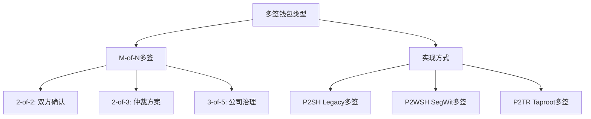

---
title: 比特币多签钱包开发
date: 2025-09-30
categories:
  - Technology
  - Learning
---

# 比特币多签钱包开发

## 1. 多签钱包基础

### 1.1 多签类型



### 1.2 多签地址生成

```java
/**
 * 多签钱包管理器
 */
public class MultiSigWalletManager {

    /**
     * 创建2-of-3多签钱包
     */
    public MultiSigWallet create2of3Wallet(
            String name,
            PublicKey pubKey1,
            PublicKey pubKey2,
            PublicKey pubKey3) {

        MultiSigWallet wallet = new MultiSigWallet();
        wallet.setName(name);
        wallet.setRequiredSignatures(2);
        wallet.setTotalKeys(3);

        // 添加公钥
        List<PublicKey> publicKeys = Arrays.asList(pubKey1, pubKey2, pubKey3);
        wallet.setPublicKeys(publicKeys);

        // 生成赎回脚本
        byte[] redeemScript = createRedeemScript(2, publicKeys);
        wallet.setRedeemScript(redeemScript);

        // 生成P2SH地址
        byte[] scriptHash = Hash.hash160(redeemScript);
        String address = encodeP2SHAddress(scriptHash);
        wallet.setAddress(address);

        // 生成P2WSH地址(SegWit)
        byte[] witnessScriptHash = Hash.sha256(redeemScript);
        String segwitAddress = encodeP2WSHAddress(witnessScriptHash);
        wallet.setSegwitAddress(segwitAddress);

        return wallet;
    }

    /**
     * 创建赎回脚本
     */
    private byte[] createRedeemScript(int m, List<PublicKey> publicKeys) {
        ScriptBuilder builder = new ScriptBuilder();

        // OP_M
        builder.number(m);

        // 添加所有公钥(按字典序排序)
        List<PublicKey> sortedKeys = new ArrayList<>(publicKeys);
        sortedKeys.sort((a, b) ->
            new BigInteger(1, a.getEncoded())
                .compareTo(new BigInteger(1, b.getEncoded()))
        );

        for (PublicKey pubKey : sortedKeys) {
            builder.data(pubKey.getEncoded());
        }

        // OP_N
        builder.number(publicKeys.size());

        // OP_CHECKMULTISIG
        builder.op(OP_CHECKMULTISIG);

        return builder.build().getBytes();
    }

    /**
     * 编码P2SH地址
     */
    private String encodeP2SHAddress(byte[] scriptHash) {
        // 添加版本字节(主网P2SH: 0x05)
        byte[] payload = new byte[21];
        payload[0] = 0x05;
        System.arraycopy(scriptHash, 0, payload, 1, 20);

        // 计算校验和
        byte[] checksum = Arrays.copyOf(
            Hash.sha256(Hash.sha256(payload)), 4
        );

        // 组合并Base58编码
        byte[] addressBytes = new byte[25];
        System.arraycopy(payload, 0, addressBytes, 0, 21);
        System.arraycopy(checksum, 0, addressBytes, 21, 4);

        return Base58.encode(addressBytes);
    }

    /**
     * 编码P2WSH地址(Bech32)
     */
    private String encodeP2WSHAddress(byte[] witnessScriptHash) {
        // Bech32编码
        return Bech32.encode("bc", 0, witnessScriptHash);
    }

    /**
     * 验证多签地址
     */
    public boolean verifyMultiSigAddress(
            String address,
            int m,
            List<PublicKey> publicKeys) {

        byte[] redeemScript = createRedeemScript(m, publicKeys);
        byte[] scriptHash = Hash.hash160(redeemScript);
        String derivedAddress = encodeP2SHAddress(scriptHash);

        return address.equals(derivedAddress);
    }

    /**
     * 多签钱包实体
     */
    public static class MultiSigWallet {
        private String name;
        private int requiredSignatures;
        private int totalKeys;
        private List<PublicKey> publicKeys;
        private byte[] redeemScript;
        private String address;        // P2SH地址
        private String segwitAddress;  // P2WSH地址

        // Getters and Setters
        public String getName() { return name; }
        public void setName(String name) { this.name = name; }
        public int getRequiredSignatures() { return requiredSignatures; }
        public void setRequiredSignatures(int requiredSignatures) {
            this.requiredSignatures = requiredSignatures;
        }
        public int getTotalKeys() { return totalKeys; }
        public void setTotalKeys(int totalKeys) { this.totalKeys = totalKeys; }
        public List<PublicKey> getPublicKeys() { return publicKeys; }
        public void setPublicKeys(List<PublicKey> publicKeys) {
            this.publicKeys = publicKeys;
        }
        public byte[] getRedeemScript() { return redeemScript; }
        public void setRedeemScript(byte[] redeemScript) {
            this.redeemScript = redeemScript;
        }
        public String getAddress() { return address; }
        public void setAddress(String address) { this.address = address; }
        public String getSegwitAddress() { return segwitAddress; }
        public void setSegwitAddress(String segwitAddress) {
            this.segwitAddress = segwitAddress;
        }
    }
}
```

## 2. 多签交易构建

### 2.1 交易创建与签名

```java
/**
 * 多签交易构建器
 */
public class MultiSigTransactionBuilder {

    /**
     * 创建多签交易
     */
    public Transaction createMultiSigTransaction(
            MultiSigWallet wallet,
            List<UTXO> inputs,
            List<TxOutput> outputs) {

        Transaction tx = new Transaction();
        tx.setVersion(2);

        // 添加输入
        for (UTXO utxo : inputs) {
            TxInput input = new TxInput();
            input.setPrevTxid(utxo.txid);
            input.setPrevVout(utxo.vout);
            input.setSequence(0xFFFFFFFE); // 支持RBF
            tx.addInput(input);
        }

        // 添加输出
        for (TxOutput output : outputs) {
            tx.addOutput(output);
        }

        tx.setLockTime(0);

        return tx;
    }

    /**
     * 部分签名交易(第一个签名者)
     */
    public PartiallySignedTransaction firstSign(
            Transaction tx,
            MultiSigWallet wallet,
            PrivateKey privateKey,
            List<UTXO> utxos) {

        PartiallySignedTransaction psbt = new PartiallySignedTransaction();
        psbt.setTransaction(tx);
        psbt.setRedeemScript(wallet.getRedeemScript());

        // 为每个输入签名
        for (int i = 0; i < tx.getInputs().size(); i++) {
            byte[] signature = signInput(tx, i, wallet.getRedeemScript(),
                                        utxos.get(i), privateKey);

            InputSignature inputSig = new InputSignature();
            inputSig.setInputIndex(i);
            inputSig.addSignature(signature);

            psbt.addInputSignature(inputSig);
        }

        return psbt;
    }

    /**
     * 添加额外签名
     */
    public PartiallySignedTransaction addSignature(
            PartiallySignedTransaction psbt,
            PrivateKey privateKey,
            List<UTXO> utxos) {

        Transaction tx = psbt.getTransaction();
        byte[] redeemScript = psbt.getRedeemScript();

        // 为每个输入添加签名
        for (int i = 0; i < tx.getInputs().size(); i++) {
            byte[] signature = signInput(tx, i, redeemScript,
                                        utxos.get(i), privateKey);

            InputSignature inputSig = psbt.getInputSignatures().get(i);
            inputSig.addSignature(signature);
        }

        return psbt;
    }

    /**
     * 完成交易(组装所有签名)
     */
    public Transaction finalizeTransaction(PartiallySignedTransaction psbt) {
        Transaction tx = psbt.getTransaction();
        byte[] redeemScript = psbt.getRedeemScript();

        // 为每个输入构建scriptSig
        for (int i = 0; i < tx.getInputs().size(); i++) {
            InputSignature inputSig = psbt.getInputSignatures().get(i);
            byte[] scriptSig = buildScriptSig(inputSig.getSignatures(), redeemScript);

            tx.getInputs().get(i).setScriptSig(scriptSig);
        }

        return tx;
    }

    /**
     * 签名单个输入
     */
    private byte[] signInput(
            Transaction tx,
            int inputIndex,
            byte[] redeemScript,
            UTXO utxo,
            PrivateKey privateKey) {

        // 计算签名哈希
        byte[] sigHash = calculateSigHash(tx, inputIndex, redeemScript, utxo.amount);

        // 使用ECDSA签名
        ECDSASigner signer = new ECDSASigner();
        signer.init(true, new ECPrivateKeyParameters(
            new BigInteger(1, privateKey.getEncoded()),
            SECP256K1
        ));

        BigInteger[] signature = signer.generateSignature(sigHash);

        // DER编码
        byte[] derSig = encodeDER(signature[0], signature[1]);

        // 添加SIGHASH_ALL标志
        byte[] fullSig = new byte[derSig.length + 1];
        System.arraycopy(derSig, 0, fullSig, 0, derSig.length);
        fullSig[derSig.length] = 0x01; // SIGHASH_ALL

        return fullSig;
    }

    /**
     * 构建scriptSig
     */
    private byte[] buildScriptSig(List<byte[]> signatures, byte[] redeemScript) {
        ScriptBuilder builder = new ScriptBuilder();

        // OP_0 (CHECKMULTISIG bug修复)
        builder.op(OP_0);

        // 添加所有签名
        for (byte[] sig : signatures) {
            builder.data(sig);
        }

        // 添加赎回脚本
        builder.data(redeemScript);

        return builder.build().getBytes();
    }

    /**
     * 计算签名哈希
     */
    private byte[] calculateSigHash(
            Transaction tx,
            int inputIndex,
            byte[] scriptCode,
            long amount) {

        ByteArrayOutputStream baos = new ByteArrayOutputStream();

        try {
            // 简化版本(实际应使用BIP143 for SegWit)

            // 1. Transaction version
            writeUint32(baos, tx.getVersion());

            // 2. Input count
            writeVarInt(baos, tx.getInputs().size());

            // 3. Inputs
            for (int i = 0; i < tx.getInputs().size(); i++) {
                TxInput input = tx.getInputs().get(i);

                // Previous output
                baos.write(Hex.decode(input.getPrevTxid()));
                writeUint32(baos, input.getPrevVout());

                // Script
                if (i == inputIndex) {
                    writeVarInt(baos, scriptCode.length);
                    baos.write(scriptCode);
                } else {
                    writeVarInt(baos, 0);
                }

                // Sequence
                writeUint32(baos, input.getSequence());
            }

            // 4. Outputs
            writeVarInt(baos, tx.getOutputs().size());
            for (TxOutput output : tx.getOutputs()) {
                writeUint64(baos, output.getValue());
                byte[] scriptPubKey = output.getScriptPubKey();
                writeVarInt(baos, scriptPubKey.length);
                baos.write(scriptPubKey);
            }

            // 5. Locktime
            writeUint32(baos, tx.getLockTime());

            // 6. SIGHASH type
            writeUint32(baos, 0x01); // SIGHASH_ALL

        } catch (IOException e) {
            throw new RuntimeException(e);
        }

        // 双SHA256
        return Hash.sha256(Hash.sha256(baos.toByteArray()));
    }

    /**
     * DER编码签名
     */
    private byte[] encodeDER(BigInteger r, BigInteger s) {
        ByteArrayOutputStream baos = new ByteArrayOutputStream();

        try {
            // 0x30 [total-length] 0x02 [R-length] [R] 0x02 [S-length] [S]
            byte[] rBytes = r.toByteArray();
            byte[] sBytes = s.toByteArray();

            baos.write(0x30);
            baos.write(rBytes.length + sBytes.length + 4);

            baos.write(0x02);
            baos.write(rBytes.length);
            baos.write(rBytes);

            baos.write(0x02);
            baos.write(sBytes.length);
            baos.write(sBytes);

        } catch (IOException e) {
            throw new RuntimeException(e);
        }

        return baos.toByteArray();
    }

    private void writeUint32(OutputStream os, long value) throws IOException {
        for (int i = 0; i < 4; i++) {
            os.write((int)((value >> (i * 8)) & 0xFF));
        }
    }

    private void writeUint64(OutputStream os, long value) throws IOException {
        for (int i = 0; i < 8; i++) {
            os.write((int)((value >> (i * 8)) & 0xFF));
        }
    }

    private void writeVarInt(OutputStream os, long value) throws IOException {
        if (value < 0xFD) {
            os.write((int)value);
        } else if (value <= 0xFFFF) {
            os.write(0xFD);
            os.write((int)(value & 0xFF));
            os.write((int)((value >> 8) & 0xFF));
        } else {
            os.write(0xFE);
            writeUint32(os, value);
        }
    }

    /**
     * 部分签名交易
     */
    public static class PartiallySignedTransaction {
        private Transaction transaction;
        private byte[] redeemScript;
        private List<InputSignature> inputSignatures;

        public PartiallySignedTransaction() {
            this.inputSignatures = new ArrayList<>();
        }

        public Transaction getTransaction() { return transaction; }
        public void setTransaction(Transaction transaction) {
            this.transaction = transaction;
        }
        public byte[] getRedeemScript() { return redeemScript; }
        public void setRedeemScript(byte[] redeemScript) {
            this.redeemScript = redeemScript;
        }
        public List<InputSignature> getInputSignatures() { return inputSignatures; }
        public void addInputSignature(InputSignature sig) {
            this.inputSignatures.add(sig);
        }

        /**
         * 序列化为JSON(用于传输)
         */
        public String toJSON() {
            JSONObject json = new JSONObject();
            json.put("transaction", Hex.encode(transaction.serialize()));
            json.put("redeemScript", Hex.encode(redeemScript));

            JSONArray sigs = new JSONArray();
            for (InputSignature inputSig : inputSignatures) {
                JSONObject sigJson = new JSONObject();
                sigJson.put("inputIndex", inputSig.getInputIndex());

                JSONArray sigArray = new JSONArray();
                for (byte[] sig : inputSig.getSignatures()) {
                    sigArray.put(Hex.encode(sig));
                }
                sigJson.put("signatures", sigArray);

                sigs.put(sigJson);
            }
            json.put("inputSignatures", sigs);

            return json.toString();
        }

        /**
         * 从JSON反序列化
         */
        public static PartiallySignedTransaction fromJSON(String json) {
            JSONObject obj = new JSONObject(json);

            PartiallySignedTransaction psbt = new PartiallySignedTransaction();
            psbt.setTransaction(Transaction.deserialize(
                Hex.decode(obj.getString("transaction"))
            ));
            psbt.setRedeemScript(Hex.decode(obj.getString("redeemScript")));

            JSONArray sigs = obj.getJSONArray("inputSignatures");
            for (int i = 0; i < sigs.length(); i++) {
                JSONObject sigJson = sigs.getJSONObject(i);

                InputSignature inputSig = new InputSignature();
                inputSig.setInputIndex(sigJson.getInt("inputIndex"));

                JSONArray sigArray = sigJson.getJSONArray("signatures");
                for (int j = 0; j < sigArray.length(); j++) {
                    inputSig.addSignature(Hex.decode(sigArray.getString(j)));
                }

                psbt.addInputSignature(inputSig);
            }

            return psbt;
        }
    }

    /**
     * 输入签名
     */
    public static class InputSignature {
        private int inputIndex;
        private List<byte[]> signatures;

        public InputSignature() {
            this.signatures = new ArrayList<>();
        }

        public int getInputIndex() { return inputIndex; }
        public void setInputIndex(int inputIndex) { this.inputIndex = inputIndex; }
        public List<byte[]> getSignatures() { return signatures; }
        public void addSignature(byte[] signature) { this.signatures.add(signature); }
    }
}
```

## 3. 多签钱包应用

### 3.1 企业金库方案

```java
/**
 * 企业多签金库
 */
public class CorporateTreasury {

    /**
     * 创建公司治理钱包(3-of-5)
     */
    public MultiSigWallet createGovernanceWallet(
            PublicKey ceo,
            PublicKey cfo,
            PublicKey cto,
            PublicKey director1,
            PublicKey director2) {

        MultiSigWalletManager manager = new MultiSigWalletManager();

        List<PublicKey> keys = Arrays.asList(ceo, cfo, cto, director1, director2);

        MultiSigWallet wallet = manager.create2of3Wallet(
            "Company Treasury",
            keys.get(0), keys.get(1), keys.get(2)
        );

        // 实际应该是5个key的3-of-5
        wallet.setTotalKeys(5);
        wallet.setRequiredSignatures(3);
        wallet.setPublicKeys(keys);

        return wallet;
    }

    /**
     * 提案系统
     */
    public static class WithdrawalProposal {
        String proposalId;
        String proposer;
        String recipient;
        double amount;
        String reason;
        ProposalStatus status;
        List<Approval> approvals;
        LocalDateTime createdAt;
        LocalDateTime expiresAt;

        public WithdrawalProposal() {
            this.approvals = new ArrayList<>();
        }
    }

    public enum ProposalStatus {
        PENDING,    // 待审批
        APPROVED,   // 已批准
        EXECUTED,   // 已执行
        REJECTED,   // 已拒绝
        EXPIRED     // 已过期
    }

    public static class Approval {
        String approver;
        LocalDateTime approvedAt;
        byte[] signature;
    }

    /**
     * 创建提现提案
     */
    public WithdrawalProposal createProposal(
            String proposer,
            String recipient,
            double amount,
            String reason) {

        WithdrawalProposal proposal = new WithdrawalProposal();
        proposal.proposalId = generateProposalId();
        proposal.proposer = proposer;
        proposal.recipient = recipient;
        proposal.amount = amount;
        proposal.reason = reason;
        proposal.status = ProposalStatus.PENDING;
        proposal.createdAt = LocalDateTime.now();
        proposal.expiresAt = LocalDateTime.now().plusDays(7);

        return proposal;
    }

    /**
     * 批准提案
     */
    public void approveProposal(
            WithdrawalProposal proposal,
            String approver,
            PrivateKey privateKey) {

        // 创建批准记录
        Approval approval = new Approval();
        approval.approver = approver;
        approval.approvedAt = LocalDateTime.now();

        // 签名提案
        String message = proposal.proposalId + proposal.amount + proposal.recipient;
        approval.signature = signMessage(message, privateKey);

        proposal.approvals.add(approval);

        // 检查是否达到所需签名数
        if (proposal.approvals.size() >= 3) {
            proposal.status = ProposalStatus.APPROVED;
        }
    }

    /**
     * 执行提案
     */
    public String executeProposal(
            WithdrawalProposal proposal,
            MultiSigWallet wallet) throws Exception {

        if (proposal.status != ProposalStatus.APPROVED) {
            throw new IllegalStateException("提案未获批准");
        }

        // 构建交易
        MultiSigTransactionBuilder builder = new MultiSigTransactionBuilder();

        // 选择UTXO
        List<UTXO> utxos = selectUTXOs(wallet, proposal.amount);

        // 创建输出
        TxOutput output = new TxOutput();
        output.setAddress(proposal.recipient);
        output.setValue((long)(proposal.amount * 1e8));

        Transaction tx = builder.createMultiSigTransaction(
            wallet,
            utxos,
            Arrays.asList(output)
        );

        // 使用提案中的签名完成交易
        PartiallySignedTransaction psbt = null;

        for (int i = 0; i < proposal.approvals.size() && i < 3; i++) {
            Approval approval = proposal.approvals.get(i);
            PrivateKey key = getPrivateKey(approval.approver);

            if (psbt == null) {
                psbt = builder.firstSign(tx, wallet, key, utxos);
            } else {
                psbt = builder.addSignature(psbt, key, utxos);
            }
        }

        // 完成并广播交易
        Transaction finalTx = builder.finalizeTransaction(psbt);
        String txid = broadcastTransaction(finalTx);

        proposal.status = ProposalStatus.EXECUTED;

        return txid;
    }

    private List<UTXO> selectUTXOs(MultiSigWallet wallet, double amount) {
        // 选择UTXO
        return new ArrayList<>();
    }

    private PrivateKey getPrivateKey(String approver) {
        // 获取私钥(实际应该从安全存储中获取)
        return null;
    }

    private byte[] signMessage(String message, PrivateKey privateKey) {
        // 签名消息
        return new byte[64];
    }

    private String broadcastTransaction(Transaction tx) {
        // 广播交易
        return tx.getTxid();
    }

    private String generateProposalId() {
        return "PROP-" + System.currentTimeMillis();
    }
}
```

### 3.2 托管服务

```java
/**
 * 2-of-3托管服务
 */
public class EscrowService {

    /**
     * 创建托管交易
     */
    public EscrowContract createEscrow(
            PublicKey buyer,
            PublicKey seller,
            PublicKey arbiter,
            double amount) {

        MultiSigWalletManager manager = new MultiSigWalletManager();

        // 创建2-of-3多签钱包
        MultiSigWallet escrowWallet = manager.create2of3Wallet(
            "Escrow",
            buyer, seller, arbiter
        );

        EscrowContract contract = new EscrowContract();
        contract.contractId = generateContractId();
        contract.buyer = buyer;
        contract.seller = seller;
        contract.arbiter = arbiter;
        contract.amount = amount;
        contract.wallet = escrowWallet;
        contract.status = EscrowStatus.CREATED;
        contract.createdAt = LocalDateTime.now();

        return contract;
    }

    /**
     * 买家确认收货(买家+卖家签名释放资金)
     */
    public String releaseToSeller(
            EscrowContract contract,
            PrivateKey buyerKey,
            PrivateKey sellerKey) throws Exception {

        if (contract.status != EscrowStatus.FUNDED) {
            throw new IllegalStateException("托管账户未充值");
        }

        // 构建支付给卖家的交易
        Transaction tx = createPaymentTransaction(
            contract.wallet,
            getSellerAddress(contract.seller),
            contract.amount
        );

        // 买家和卖家签名
        MultiSigTransactionBuilder builder = new MultiSigTransactionBuilder();
        List<UTXO> utxos = getUTXOs(contract.wallet);

        PartiallySignedTransaction psbt = builder.firstSign(
            tx, contract.wallet, buyerKey, utxos
        );
        psbt = builder.addSignature(psbt, sellerKey, utxos);

        Transaction finalTx = builder.finalizeTransaction(psbt);
        String txid = broadcastTransaction(finalTx);

        contract.status = EscrowStatus.RELEASED;
        contract.releaseTxid = txid;

        return txid;
    }

    /**
     * 买家申请退款(买家+仲裁签名)
     */
    public String refundToBuyer(
            EscrowContract contract,
            PrivateKey buyerKey,
            PrivateKey arbiterKey) throws Exception {

        if (contract.status != EscrowStatus.FUNDED) {
            throw new IllegalStateException("托管账户未充值");
        }

        // 构建退款给买家的交易
        Transaction tx = createPaymentTransaction(
            contract.wallet,
            getBuyerAddress(contract.buyer),
            contract.amount
        );

        // 买家和仲裁签名
        MultiSigTransactionBuilder builder = new MultiSigTransactionBuilder();
        List<UTXO> utxos = getUTXOs(contract.wallet);

        PartiallySignedTransaction psbt = builder.firstSign(
            tx, contract.wallet, buyerKey, utxos
        );
        psbt = builder.addSignature(psbt, arbiterKey, utxos);

        Transaction finalTx = builder.finalizeTransaction(psbt);
        String txid = broadcastTransaction(finalTx);

        contract.status = EscrowStatus.REFUNDED;
        contract.refundTxid = txid;

        return txid;
    }

    private Transaction createPaymentTransaction(
            MultiSigWallet wallet,
            String recipient,
            double amount) {
        // 创建支付交易
        return new Transaction();
    }

    private List<UTXO> getUTXOs(MultiSigWallet wallet) {
        return new ArrayList<>();
    }

    private String getSellerAddress(PublicKey seller) {
        return "";
    }

    private String getBuyerAddress(PublicKey buyer) {
        return "";
    }

    private String broadcastTransaction(Transaction tx) {
        return tx.getTxid();
    }

    private String generateContractId() {
        return "ESC-" + System.currentTimeMillis();
    }

    public static class EscrowContract {
        String contractId;
        PublicKey buyer;
        PublicKey seller;
        PublicKey arbiter;
        double amount;
        MultiSigWallet wallet;
        EscrowStatus status;
        String fundTxid;
        String releaseTxid;
        String refundTxid;
        LocalDateTime createdAt;
    }

    public enum EscrowStatus {
        CREATED,   // 已创建
        FUNDED,    // 已充值
        RELEASED,  // 已释放
        REFUNDED,  // 已退款
        DISPUTED   // 有争议
    }
}
```

## 4. 时间锁多签

### 4.1 继承钱包

```java
/**
 * 时间锁继承钱包
 */
public class InheritanceWallet {

    /**
     * 创建继承钱包
     * 正常情况: 所有者单独控制
     * 超时后: 继承人可以使用
     */
    public MultiSigWallet createInheritanceWallet(
            PublicKey owner,
            PublicKey heir,
            int lockTimeBlocks) {

        // 创建时间锁脚本
        byte[] script = createTimeLockScript(owner, heir, lockTimeBlocks);

        MultiSigWallet wallet = new MultiSigWallet();
        wallet.setRedeemScript(script);

        // 生成地址
        byte[] scriptHash = Hash.hash160(script);
        wallet.setAddress(encodeP2SHAddress(scriptHash));

        return wallet;
    }

    /**
     * 创建时间锁脚本
     */
    private byte[] createTimeLockScript(
            PublicKey owner,
            PublicKey heir,
            int lockTimeBlocks) {

        ScriptBuilder builder = new ScriptBuilder();

        // IF
        builder.op(OP_IF);

        // 所有者可以随时花费
        builder.data(owner.getEncoded());
        builder.op(OP_CHECKSIG);

        // ELSE
        builder.op(OP_ELSE);

        // 继承人需要等待锁定期
        builder.number(lockTimeBlocks);
        builder.op(OP_CHECKSEQUENCEVERIFY);
        builder.op(OP_DROP);
        builder.data(heir.getEncoded());
        builder.op(OP_CHECKSIG);

        // ENDIF
        builder.op(OP_ENDIF);

        return builder.build().getBytes();
    }

    /**
     * 所有者花费(无需等待)
     */
    public Transaction ownerSpend(
            MultiSigWallet wallet,
            String recipient,
            double amount,
            PrivateKey ownerKey) {

        Transaction tx = new Transaction();
        // ... 构建交易

        // 设置scriptSig
        ScriptBuilder scriptSig = new ScriptBuilder();
        byte[] signature = sign(tx, ownerKey);
        scriptSig.data(signature);
        scriptSig.number(1); // 选择IF分支
        scriptSig.data(wallet.getRedeemScript());

        return tx;
    }

    /**
     * 继承人花费(需要等待)
     */
    public Transaction heirSpend(
            MultiSigWallet wallet,
            String recipient,
            double amount,
            PrivateKey heirKey,
            int currentBlock) {

        Transaction tx = new Transaction();
        // ... 构建交易

        // 设置sequence以激活CSV
        for (TxInput input : tx.getInputs()) {
            input.setSequence(/* lockTimeBlocks */);
        }

        // 设置scriptSig
        ScriptBuilder scriptSig = new ScriptBuilder();
        byte[] signature = sign(tx, heirKey);
        scriptSig.data(signature);
        scriptSig.number(0); // 选择ELSE分支
        scriptSig.data(wallet.getRedeemScript());

        return tx;
    }

    private byte[] sign(Transaction tx, PrivateKey key) {
        return new byte[64];
    }

    private String encodeP2SHAddress(byte[] scriptHash) {
        return "";
    }
}
```

## 5. 相关文档

- [比特币钱包技术实现](./07.比特币钱包技术实现.md)
- [比特币脚本语言详解](./09.比特币脚本语言详解.md)
- [比特币交易构建与广播](./16.比特币交易构建与广播.md)

## 参考资源

- [BIP11: M-of-N Standard Transactions](https://github.com/bitcoin/bips/blob/master/bip-0011.mediawiki)
- [BIP16: Pay to Script Hash](https://github.com/bitcoin/bips/blob/master/bip-0016.mediawiki)
- [BIP174: Partially Signed Bitcoin Transaction Format](https://github.com/bitcoin/bips/blob/master/bip-0174.mediawiki)