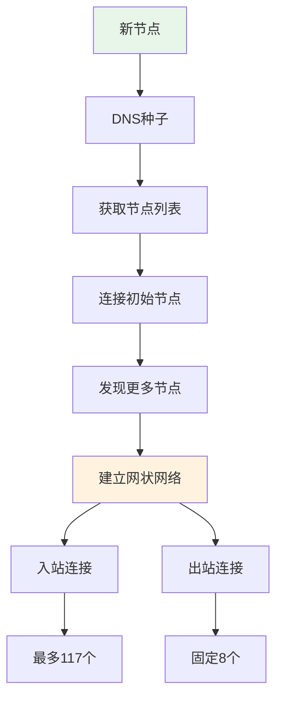

---
title: 比特币网络协议详解
date: 2025-09-29
categories:
  - Technology
  - Learning
---

# 比特币网络协议详解

## 前言

比特币网络是一个去中心化的点对点（P2P）网络，运行在TCP/IP协议之上。网络中的每个节点都是平等的，没有中心服务器或特殊节点。本文将深入解析比特币网络协议的技术细节、消息格式、节点通信机制以及网络拓扑结构。

## 一、网络架构概述

### 1.1 P2P网络模型

```python
import socket
import hashlib
import struct
import time
import threading
from collections import deque

class BitcoinP2PNetwork:
    """比特币P2P网络基础架构"""
    
    def __init__(self, node_id=None):
        self.node_id = node_id or self.generate_node_id()
        self.peers = {}  # 连接的对等节点
        self.max_peers = 125  # 最大连接数
        self.listening_port = 8333  # 默认端口
        self.network_magic = 0xD9B4BEF9  # 主网魔数
        
        # 网络拓扑
        self.inbound_connections = []  # 入站连接
        self.outbound_connections = []  # 出站连接
        self.max_inbound = 117  # 最大入站连接
        self.max_outbound = 8   # 最大出站连接
    
    def generate_node_id(self):
        """生成节点ID"""
        # 使用随机数和时间戳生成唯一ID
        data = f"{time.time()}{os.urandom(32).hex()}"
        return hashlib.sha256(data.encode()).hexdigest()[:16]
```

### 1.2 节点类型

```python
class NodeTypes:
    """比特币网络中的节点类型"""
    
    class FullNode:
        """全节点"""
        def __init__(self):
            self.features = {
                'blockchain': 'complete',  # 完整区块链
                'validation': True,         # 验证所有交易和区块
                'relay': True,             # 中继交易和区块
                'wallet': 'optional',      # 可选钱包功能
                'mining': 'optional',      # 可选挖矿功能
                'services': 0x01          # NODE_NETWORK服务
            }
            self.storage_requirement = "~400GB"  # 存储需求
            self.bandwidth = "high"              # 带宽需求
    
    class SPVNode:
        """SPV轻节点"""
        def __init__(self):
            self.features = {
                'blockchain': 'headers_only',  # 只存储区块头
                'validation': 'limited',        # 有限验证
                'relay': False,                # 不中继
                'wallet': True,                # 钱包功能
                'mining': False,               # 不挖矿
                'services': 0x00              # 无网络服务
            }
            self.storage_requirement = "~100MB"
            self.bandwidth = "low"
    
    class PruningNode:
        """剪枝节点"""
        def __init__(self):
            self.features = {
                'blockchain': 'pruned',        # 剪枝的区块链
                'validation': True,            # 完全验证
                'relay': 'limited',           # 有限中继
                'wallet': 'optional',         # 可选钱包
                'mining': 'optional',         # 可选挖矿
                'services': 0x03             # NODE_NETWORK | NODE_BLOOM
            }
            self.prune_target = 550  # MB，最小剪枝目标
    
    class ArchivalNode:
        """存档节点"""
        def __init__(self):
            self.features = {
                'blockchain': 'complete_indexed',  # 完整且索引
                'validation': True,
                'relay': True,
                'wallet': False,
                'mining': False,
                'services': 0x05,  # NODE_NETWORK | NODE_WITNESS
                'additional': 'transaction_index'  # 交易索引
            }
```

### 1.3 网络拓扑



## 二、协议消息格式

### 2.1 消息结构

```python
class MessageStructure:
    """比特币协议消息结构"""
    
    def __init__(self):
        self.message_header_size = 24  # 字节
    
    def create_message_header(self, command, payload):
        """创建消息头
        
        消息头格式（24字节）：
        - Magic (4 bytes): 网络标识
        - Command (12 bytes): 命令名称
        - Length (4 bytes): 载荷长度
        - Checksum (4 bytes): 载荷校验和
        """
        # 网络魔数
        magic = struct.pack('<I', 0xD9B4BEF9)  # 主网
        
        # 命令（12字节，空字符填充）
        cmd = command.encode('ascii')
        cmd = cmd + b'\x00' * (12 - len(cmd))
        
        # 载荷长度
        length = struct.pack('<I', len(payload))
        
        # 校验和（双SHA256的前4字节）
        checksum = hashlib.sha256(hashlib.sha256(payload).digest()).digest()[:4]
        
        return magic + cmd + length + checksum
    
    def parse_message_header(self, data):
        """解析消息头"""
        if len(data) < 24:
            raise ValueError("Incomplete message header")
        
        magic = struct.unpack('<I', data[0:4])[0]
        command = data[4:16].strip(b'\x00').decode('ascii')
        length = struct.unpack('<I', data[16:20])[0]
        checksum = data[20:24]
        
        return {
            'magic': hex(magic),
            'command': command,
            'length': length,
            'checksum': checksum.hex()
        }
    
    def create_full_message(self, command, payload):
        """创建完整消息"""
        header = self.create_message_header(command, payload)
        return header + payload
```

### 2.2 核心消息类型

```python
class ProtocolMessages:
    """协议消息类型"""
    
    def __init__(self):
        self.message_types = {
            # 控制消息
            'version': self.create_version_message,
            'verack': self.create_verack_message,
            'ping': self.create_ping_message,
            'pong': self.create_pong_message,
            'addr': self.create_addr_message,
            'getaddr': self.create_getaddr_message,
            
            # 数据消息
            'inv': self.create_inv_message,
            'getdata': self.create_getdata_message,
            'notfound': self.create_notfound_message,
            'getblocks': self.create_getblocks_message,
            'getheaders': self.create_getheaders_message,
            'tx': self.create_tx_message,
            'block': self.create_block_message,
            'headers': self.create_headers_message,
            
            # 其他消息
            'mempool': self.create_mempool_message,
            'reject': self.create_reject_message,
            'sendheaders': self.create_sendheaders_message,
            'feefilter': self.create_feefilter_message
        }
    
    def create_version_message(self, peer_address):
        """创建version消息（握手）"""
        version = 70015  # 协议版本
        services = 1     # NODE_NETWORK
        timestamp = int(time.time())
        
        # 接收方地址
        addr_recv = self.serialize_network_address(peer_address, services)
        
        # 发送方地址
        addr_from = self.serialize_network_address(
            ('127.0.0.1', 8333), services
        )
        
        # 随机nonce
        nonce = struct.pack('<Q', random.getrandbits(64))
        
        # 用户代理
        user_agent = self.serialize_string('/Satoshi:0.21.0/')
        
        # 起始高度
        start_height = struct.pack('<i', 700000)
        
        # 中继标志
        relay = struct.pack('?', True)
        
        payload = struct.pack('<i', version)
        payload += struct.pack('<Q', services)
        payload += struct.pack('<q', timestamp)
        payload += addr_recv
        payload += addr_from
        payload += nonce
        payload += user_agent
        payload += start_height
        payload += relay
        
        return payload
    
    def create_inv_message(self, inventory):
        """创建库存消息"""
        count = self.serialize_varint(len(inventory))
        payload = count
        
        for inv_item in inventory:
            # 类型：1=TX, 2=Block, 3=Filtered Block, 4=Compact Block
            inv_type = struct.pack('<I', inv_item['type'])
            inv_hash = bytes.fromhex(inv_item['hash'])
            payload += inv_type + inv_hash
        
        return payload
    
    def serialize_network_address(self, address, services):
        """序列化网络地址"""
        # 服务标志
        payload = struct.pack('<Q', services)
        
        # IPv6格式（IPv4映射到IPv6）
        ip = address[0]
        if '.' in ip:  # IPv4
            ip_bytes = socket.inet_aton(ip)
            ip_bytes = b'\x00' * 10 + b'\xff\xff' + ip_bytes
        else:  # IPv6
            ip_bytes = socket.inet_pton(socket.AF_INET6, ip)
        
        payload += ip_bytes
        
        # 端口（大端序）
        payload += struct.pack('>H', address[1])
        
        return payload
```

## 三、节点发现与连接

### 3.1 节点发现机制

```python
class NodeDiscovery:
    """节点发现机制"""
    
    def __init__(self):
        self.dns_seeds = [
            'seed.bitcoin.sipa.be',          # Pieter Wuille
            'dnsseed.bluematt.me',           # Matt Corallo
            'dnsseed.bitcoin.dashjr.org',    # Luke Dashjr
            'seed.bitcoinstats.com',         # Christian Decker
            'seed.bitcoin.jonasschnelli.ch', # Jonas Schnelli
            'seed.btc.petertodd.org'        # Peter Todd
        ]
        self.hardcoded_seeds = []  # 硬编码种子节点
        self.peer_database = {}     # 本地节点数据库
    
    def discover_peers(self):
        """发现对等节点的完整流程"""
        peers = []
        
        # 1. 检查本地数据库
        if self.peer_database:
            peers.extend(self.get_peers_from_database())
        
        # 2. DNS种子查询
        if len(peers) < 10:
            peers.extend(self.query_dns_seeds())
        
        # 3. 硬编码节点（最后手段）
        if len(peers) < 5:
            peers.extend(self.hardcoded_seeds)
        
        # 4. 通过已连接节点发现更多节点
        if peers:
            self.discover_from_peers(peers)
        
        return peers
    
    def query_dns_seeds(self):
        """查询DNS种子"""
        discovered_peers = []
        
        for seed in self.dns_seeds:
            try:
                # DNS查询
                answers = socket.getaddrinfo(seed, 8333, 
                                           socket.AF_UNSPEC, 
                                           socket.SOCK_STREAM)
                for answer in answers:
                    ip = answer[4][0]
                    discovered_peers.append({
                        'ip': ip,
                        'port': 8333,
                        'source': f'dns:{seed}',
                        'timestamp': time.time()
                    })
            except Exception as e:
                print(f"DNS seed {seed} query failed: {e}")
        
        return discovered_peers
    
    def discover_from_peers(self, initial_peers):
        """从已连接节点发现更多节点"""
        for peer in initial_peers[:8]:  # 连接前8个
            try:
                # 发送getaddr消息
                self.send_getaddr(peer)
                
                # 接收addr消息
                new_peers = self.receive_addr(peer)
                
                # 更新本地数据库
                self.update_peer_database(new_peers)
                
            except Exception as e:
                print(f"Peer discovery from {peer} failed: {e}")
```

### 3.2 连接管理

```python
class ConnectionManager:
    """连接管理器"""
    
    def __init__(self):
        self.connections = {}
        self.connection_slots = {
            'inbound': 117,   # 入站连接槽位
            'outbound': 8,    # 出站连接槽位
            'feeler': 1,      # 探测连接
            'addnode': 8      # 手动添加节点
        }
        self.banned_peers = {}  # 禁止列表
        
    def establish_connection(self, peer_info):
        """建立连接"""
        sock = socket.socket(socket.AF_INET, socket.SOCK_STREAM)
        sock.settimeout(10)
        
        try:
            # TCP连接
            sock.connect((peer_info['ip'], peer_info['port']))
            
            # 发送version消息
            version_msg = self.create_version_message(peer_info)
            sock.send(version_msg)
            
            # 等待version响应
            their_version = self.receive_version(sock)
            
            # 发送verack
            verack_msg = self.create_verack_message()
            sock.send(verack_msg)
            
            # 等待verack
            their_verack = self.receive_verack(sock)
            
            # 握手成功，保存连接
            connection = {
                'socket': sock,
                'peer': peer_info,
                'version': their_version,
                'connected_at': time.time(),
                'type': 'outbound',
                'services': their_version['services']
            }
            
            self.connections[peer_info['ip']] = connection
            
            # 开始消息循环
            self.start_message_loop(connection)
            
            return True
            
        except Exception as e:
            print(f"Connection to {peer_info['ip']} failed: {e}")
            sock.close()
            return False
    
    def connection_lifecycle(self):
        """连接生命周期管理"""
        
        class ConnectionState:
            CONNECTING = 1     # 连接中
            HANDSHAKING = 2    # 握手中
            CONNECTED = 3      # 已连接
            DISCONNECTING = 4  # 断开中
            DISCONNECTED = 5   # 已断开
        
        def manage_connection(self, connection):
            """管理单个连接的生命周期"""
            state = ConnectionState.CONNECTING
            
            while state != ConnectionState.DISCONNECTED:
                if state == ConnectionState.CONNECTING:
                    if self.tcp_connect(connection):
                        state = ConnectionState.HANDSHAKING
                    else:
                        state = ConnectionState.DISCONNECTED
                
                elif state == ConnectionState.HANDSHAKING:
                    if self.perform_handshake(connection):
                        state = ConnectionState.CONNECTED
                    else:
                        state = ConnectionState.DISCONNECTING
                
                elif state == ConnectionState.CONNECTED:
                    if not self.maintain_connection(connection):
                        state = ConnectionState.DISCONNECTING
                
                elif state == ConnectionState.DISCONNECTING:
                    self.close_connection(connection)
                    state = ConnectionState.DISCONNECTED
```

### 3.3 节点地址管理

```python
class AddressManager:
    """地址管理器"""
    
    def __init__(self):
        self.addr_book = {}  # 地址簿
        self.new_bucket_count = 1024   # 新地址桶数量
        self.tried_bucket_count = 256  # 已尝试地址桶数量
        self.bucket_size = 64          # 每桶大小
        
    def add_address(self, addr, source):
        """添加地址到地址簿"""
        addr_key = f"{addr['ip']}:{addr['port']}"
        
        if addr_key not in self.addr_book:
            self.addr_book[addr_key] = {
                'addr': addr,
                'source': source,
                'attempts': 0,
                'last_try': 0,
                'last_success': 0,
                'services': addr.get('services', 0),
                'timestamp': time.time()
            }
            
            # 分配到桶
            bucket = self.get_new_bucket(addr, source)
            self.add_to_bucket(addr_key, bucket, 'new')
    
    def get_new_bucket(self, addr, source):
        """计算新地址应该放入的桶"""
        # 使用地址和源的哈希来确定桶
        data = f"{addr['ip']}{source}"
        hash_val = hashlib.sha256(data.encode()).digest()
        bucket_num = int.from_bytes(hash_val[:2], 'big') % self.new_bucket_count
        return bucket_num
    
    def select_addresses(self, count=1000):
        """选择要广播的地址"""
        addresses = []
        
        # 优先选择最近成功连接的地址
        sorted_addrs = sorted(
            self.addr_book.values(),
            key=lambda x: x['last_success'],
            reverse=True
        )
        
        for addr_info in sorted_addrs[:count]:
            # 过滤条件
            if self.is_routable(addr_info['addr']):
                addresses.append(addr_info['addr'])
        
        return addresses
    
    def is_routable(self, addr):
        """检查地址是否可路由"""
        ip = addr['ip']
        
        # 排除本地地址
        if ip.startswith('127.') or ip == 'localhost':
            return False
        
        # 排除私有地址
        private_ranges = [
            '10.',
            '172.16.', '172.17.', '172.18.', '172.19.',
            '172.20.', '172.21.', '172.22.', '172.23.',
            '172.24.', '172.25.', '172.26.', '172.27.',
            '172.28.', '172.29.', '172.30.', '172.31.',
            '192.168.'
        ]
        
        for private in private_ranges:
            if ip.startswith(private):
                return False
        
        return True
```

## 四、数据同步协议

### 4.1 初始区块下载（IBD）

```python
class InitialBlockDownload:
    """初始区块下载"""
    
    def __init__(self):
        self.ibd_state = True
        self.sync_progress = 0
        self.chain_tip = 0
        self.download_window = 1024  # 区块下载窗口
        
    def start_ibd(self):
        """开始初始区块下载"""
        print("Starting Initial Block Download...")
        
        # 1. 获取对等节点的最佳链高度
        peer_heights = self.get_peer_heights()
        best_height = max(peer_heights.values())
        
        # 2. 选择同步节点
        sync_peers = self.select_sync_peers(peer_heights, best_height)
        
        # 3. 并行下载区块
        self.parallel_block_download(sync_peers, best_height)
        
        # 4. 验证和连接区块
        self.validate_and_connect_blocks()
        
        # 5. 退出IBD模式
        if self.chain_tip >= best_height:
            self.ibd_state = False
            print("Initial Block Download completed!")
    
    def parallel_block_download(self, peers, target_height):
        """并行区块下载"""
        
        class BlockDownloader:
            def __init__(self, peers):
                self.peers = peers
                self.download_queue = deque()
                self.in_flight = {}  # 正在下载的区块
                self.completed = {}   # 已完成的区块
                
            def download(self, start_height, end_height):
                """下载指定范围的区块"""
                # 创建下载任务
                for height in range(start_height, end_height + 1):
                    self.download_queue.append(height)
                
                # 分配任务给不同节点
                threads = []
                for i, peer in enumerate(self.peers):
                    thread = threading.Thread(
                        target=self.download_from_peer,
                        args=(peer, i)
                    )
                    threads.append(thread)
                    thread.start()
                
                # 等待所有下载完成
                for thread in threads:
                    thread.join()
            
            def download_from_peer(self, peer, peer_index):
                """从特定节点下载"""
                while self.download_queue:
                    try:
                        # 获取任务
                        height = self.download_queue.popleft()
                        
                        # 标记为正在下载
                        self.in_flight[height] = peer
                        
                        # 发送getdata请求
                        block_hash = self.get_block_hash_at_height(height)
                        getdata_msg = self.create_getdata_message(
                            'block', block_hash
                        )
                        peer.send(getdata_msg)
                        
                        # 接收区块
                        block = peer.receive_block()
                        
                        # 保存区块
                        self.completed[height] = block
                        
                        # 从in_flight中移除
                        del self.in_flight[height]
                        
                    except Exception as e:
                        # 重新加入队列
                        self.download_queue.append(height)
                        print(f"Download from {peer} failed: {e}")
        
        downloader = BlockDownloader(peers)
        downloader.download(self.chain_tip + 1, target_height)
```

### 4.2 区块传播

```python
class BlockPropagation:
    """区块传播机制"""
    
    def __init__(self):
        self.relay_protocols = {
            'legacy': self.legacy_relay,
            'compact_blocks': self.compact_block_relay,
            'headers_first': self.headers_first_relay
        }
    
    def compact_block_relay(self):
        """紧凑区块中继（BIP152）"""
        
        class CompactBlock:
            def __init__(self, block):
                self.header = block['header']
                self.nonce = os.urandom(8)
                self.short_ids = []
                self.prefilled_txs = []
                
                # 生成短交易ID
                for tx in block['transactions'][1:]:  # 跳过coinbase
                    short_id = self.calculate_short_id(tx)
                    self.short_ids.append(short_id)
                
                # 预填充coinbase交易
                self.prefilled_txs.append({
                    'index': 0,
                    'tx': block['transactions'][0]
                })
            
            def calculate_short_id(self, tx):
                """计算6字节短ID"""
                tx_hash = hashlib.sha256(tx).digest()
                siphash = self.siphash24(self.nonce, tx_hash)
                return siphash[:6]
            
            def serialize(self):
                """序列化紧凑区块"""
                data = self.header
                data += self.nonce
                data += self.serialize_varint(len(self.short_ids))
                for short_id in self.short_ids:
                    data += short_id
                data += self.serialize_prefilled()
                return data
        
        return CompactBlock
    
    def headers_first_relay(self):
        """头部优先传播"""
        
        def propagate_new_block(self, block):
            """传播新区块"""
            
            # 1. 立即广播区块头
            headers_msg = self.create_headers_message([block['header']])
            self.broadcast_to_peers(headers_msg)
            
            # 2. 等待getdata请求
            requests = self.wait_for_getdata_requests()
            
            # 3. 发送完整区块给请求的节点
            for peer, request in requests:
                if request['type'] == 'block':
                    self.send_block(peer, block)
                elif request['type'] == 'cmpctblock':
                    compact = CompactBlock(block)
                    self.send_compact_block(peer, compact)
```

### 4.3 交易传播

```python
class TransactionPropagation:
    """交易传播"""
    
    def __init__(self):
        self.mempool = {}
        self.orphan_pool = {}
        self.relay_fee_filter = 1000  # satoshis/KB
        
    def handle_new_transaction(self, tx, peer):
        """处理新交易"""
        tx_id = self.calculate_txid(tx)
        
        # 1. 检查是否已存在
        if tx_id in self.mempool:
            return False
        
        # 2. 验证交易
        validation_result = self.validate_transaction(tx)
        
        if validation_result['valid']:
            # 3. 添加到内存池
            self.mempool[tx_id] = {
                'tx': tx,
                'fee': validation_result['fee'],
                'size': len(tx),
                'time': time.time(),
                'height': self.get_chain_height()
            }
            
            # 4. 中继给其他节点
            self.relay_transaction(tx, exclude_peer=peer)
            
            return True
            
        elif validation_result['reason'] == 'missing_inputs':
            # 添加到孤儿池
            self.orphan_pool[tx_id] = {
                'tx': tx,
                'peer': peer,
                'time': time.time()
            }
            
            # 请求缺失的父交易
            self.request_parent_transactions(tx)
            
        return False
    
    def relay_transaction(self, tx, exclude_peer=None):
        """中继交易"""
        tx_id = self.calculate_txid(tx)
        
        # 创建inv消息
        inv_msg = self.create_inv_message([{
            'type': 1,  # MSG_TX
            'hash': tx_id
        }])
        
        # 广播给符合条件的节点
        for peer in self.get_connected_peers():
            if peer == exclude_peer:
                continue
            
            # 检查费用过滤器
            if self.check_fee_filter(tx, peer):
                peer.send(inv_msg)
    
    def transaction_request_handling(self):
        """交易请求处理"""
        
        class TransactionRequest:
            def __init__(self):
                self.requested = {}  # 已请求的交易
                self.max_requests = 100  # 最大并发请求
                
            def handle_inv(self, inv_list, peer):
                """处理库存消息"""
                to_request = []
                
                for item in inv_list:
                    if item['type'] == 1:  # 交易
                        tx_id = item['hash']
                        
                        # 检查是否需要请求
                        if tx_id not in self.mempool and \
                           tx_id not in self.requested:
                            to_request.append(tx_id)
                            self.requested[tx_id] = {
                                'peer': peer,
                                'time': time.time()
                            }
                
                # 发送getdata请求
                if to_request:
                    getdata_msg = self.create_getdata_message(to_request)
                    peer.send(getdata_msg)
```

## 五、网络安全机制

### 5.1 防御机制

```python
class NetworkDefense:
    """网络防御机制"""
    
    def __init__(self):
        self.ban_score_threshold = 100
        self.dos_score = {}
        self.banned_peers = {}
        
    def dos_protection(self):
        """DoS保护"""
        
        class DoSMitigation:
            def __init__(self):
                self.rate_limiters = {}
                self.connection_limits = {
                    'per_ip': 1,          # 每IP连接数
                    'per_subnet_16': 4,   # 每/16子网连接数
                    'per_subnet_24': 2    # 每/24子网连接数
                }
                
            def check_rate_limit(self, peer, message_type):
                """速率限制检查"""
                key = f"{peer}:{message_type}"
                
                if key not in self.rate_limiters:
                    self.rate_limiters[key] = {
                        'count': 0,
                        'window_start': time.time()
                    }
                
                limiter = self.rate_limiters[key]
                current_time = time.time()
                
                # 重置窗口
                if current_time - limiter['window_start'] > 60:
                    limiter['count'] = 0
                    limiter['window_start'] = current_time
                
                limiter['count'] += 1
                
                # 检查限制
                limits = {
                    'ping': 2,      # 每分钟2个
                    'addr': 1,      # 每分钟1个
                    'inv': 10,      # 每分钟10个
                    'getdata': 100  # 每分钟100个
                }
                
                if message_type in limits:
                    if limiter['count'] > limits[message_type]:
                        return False  # 超过限制
                
                return True
            
            def check_connection_limits(self, ip):
                """连接数限制检查"""
                # 检查每IP限制
                ip_connections = self.count_connections_from_ip(ip)
                if ip_connections >= self.connection_limits['per_ip']:
                    return False
                
                # 检查子网限制
                subnet_24 = '.'.join(ip.split('.')[:-1])
                subnet_24_connections = self.count_connections_from_subnet(
                    subnet_24
                )
                if subnet_24_connections >= self.connection_limits['per_subnet_24']:
                    return False
                
                return True
    
    def ban_management(self):
        """禁止管理"""
        
        def increase_ban_score(self, peer, score, reason):
            """增加禁止分数"""
            if peer not in self.dos_score:
                self.dos_score[peer] = 0
            
            self.dos_score[peer] += score
            
            print(f"Peer {peer} ban score increased by {score} for {reason}")
            print(f"Current score: {self.dos_score[peer]}")
            
            # 检查是否需要禁止
            if self.dos_score[peer] >= self.ban_score_threshold:
                self.ban_peer(peer, 86400)  # 禁止24小时
        
        def ban_peer(self, peer, duration):
            """禁止节点"""
            self.banned_peers[peer] = {
                'banned_at': time.time(),
                'duration': duration,
                'reason': f"Ban score exceeded ({self.dos_score[peer]})"
            }
            
            # 断开连接
            self.disconnect_peer(peer)
            
            # 清除分数
            if peer in self.dos_score:
                del self.dos_score[peer]
        
        def is_banned(self, peer):
            """检查是否被禁止"""
            if peer in self.banned_peers:
                ban_info = self.banned_peers[peer]
                if time.time() - ban_info['banned_at'] < ban_info['duration']:
                    return True
                else:
                    # 禁止期已过
                    del self.banned_peers[peer]
            
            return False
```

### 5.2 Eclipse攻击防御

```python
class EclipseAttackDefense:
    """Eclipse攻击防御"""
    
    def __init__(self):
        self.anchor_connections = []  # 锚定连接
        self.diverse_peer_selection = True
        
    def maintain_connection_diversity(self):
        """维护连接多样性"""
        
        def select_diverse_peers(self, candidates, count):
            """选择多样化的节点"""
            selected = []
            used_subnets = set()
            used_asns = set()
            
            for candidate in candidates:
                # 获取子网和ASN
                subnet = self.get_subnet(candidate['ip'])
                asn = self.get_asn(candidate['ip'])
                
                # 检查多样性
                if subnet not in used_subnets or asn not in used_asns:
                    selected.append(candidate)
                    used_subnets.add(subnet)
                    used_asns.add(asn)
                    
                    if len(selected) >= count:
                        break
            
            return selected
        
        def use_anchor_connections(self):
            """使用锚定连接"""
            # 保存两个成功连接作为锚定
            if len(self.connections) >= 2:
                self.anchor_connections = [
                    self.connections[0],
                    self.connections[1]
                ]
                
                # 下次启动时优先连接锚定节点
                self.save_anchors_to_file()
        
        def feeler_connections(self):
            """探测连接"""
            # 定期建立短期连接来测试新节点
            def run_feeler():
                while True:
                    # 选择随机地址
                    test_addr = self.select_random_address()
                    
                    # 尝试连接
                    if self.test_connection(test_addr):
                        # 如果成功，考虑替换现有连接
                        self.consider_eviction(test_addr)
                    
                    # 等待下次探测
                    time.sleep(120)  # 2分钟
            
            threading.Thread(target=run_feeler, daemon=True).start()
```

### 5.3 隐私保护

```python
class PrivacyProtection:
    """隐私保护机制"""
    
    def __init__(self):
        self.bloom_filters = {}  # SPV节点的布隆过滤器
        self.tor_support = True   # Tor支持
        
    def bloom_filter_support(self):
        """布隆过滤器支持（BIP37）"""
        
        class BloomFilter:
            def __init__(self, size=1024, hash_funcs=5, tweak=0):
                self.size = size
                self.bit_array = [0] * size
                self.hash_funcs = hash_funcs
                self.tweak = tweak
                
            def add(self, data):
                """添加元素到过滤器"""
                for i in range(self.hash_funcs):
                    seed = i * 0xFBA4C795 + self.tweak
                    hash_val = self.murmur3(data, seed)
                    bit_pos = hash_val % self.size
                    self.bit_array[bit_pos] = 1
            
            def contains(self, data):
                """检查元素是否可能存在"""
                for i in range(self.hash_funcs):
                    seed = i * 0xFBA4C795 + self.tweak
                    hash_val = self.murmur3(data, seed)
                    bit_pos = hash_val % self.size
                    if self.bit_array[bit_pos] == 0:
                        return False
                return True
            
            def murmur3(self, data, seed):
                """MurmurHash3算法"""
                # 简化的MurmurHash3实现
                h = seed
                for byte in data:
                    h ^= byte
                    h *= 0x5bd1e995
                    h ^= h >> 15
                return h
        
        return BloomFilter
    
    def tor_integration(self):
        """Tor集成"""
        
        class TorConnection:
            def __init__(self):
                self.tor_proxy = ('127.0.0.1', 9050)  # Tor SOCKS5代理
                self.onion_addresses = []
                
            def connect_through_tor(self, address):
                """通过Tor连接"""
                import socks
                
                # 创建SOCKS5套接字
                sock = socks.socksocket()
                sock.set_proxy(
                    proxy_type=socks.SOCKS5,
                    addr=self.tor_proxy[0],
                    port=self.tor_proxy[1]
                )
                
                # 连接到.onion地址或普通地址
                try:
                    if address.endswith('.onion'):
                        # Tor隐藏服务
                        sock.connect((address, 8333))
                    else:
                        # 普通地址通过Tor
                        sock.connect((address, 8333))
                    
                    return sock
                    
                except Exception as e:
                    print(f"Tor connection failed: {e}")
                    return None
            
            def create_hidden_service(self):
                """创建Tor隐藏服务"""
                # 配置Tor以创建隐藏服务
                tor_config = """
                HiddenServiceDir /var/lib/tor/bitcoin_node/
                HiddenServicePort 8333 127.0.0.1:8333
                """
                
                # 返回.onion地址
                with open('/var/lib/tor/bitcoin_node/hostname', 'r') as f:
                    onion_address = f.read().strip()
                
                return onion_address
```

## 六、性能优化

### 6.1 带宽优化

```python
class BandwidthOptimization:
    """带宽优化"""
    
    def __init__(self):
        self.upload_limit = 5 * 1024 * 1024    # 5 MB/s
        self.download_limit = 10 * 1024 * 1024 # 10 MB/s
        
    def compact_blocks_implementation(self):
        """紧凑区块实现"""
        
        class CompactBlockOptimization:
            def __init__(self):
                self.mempool_sync_interval = 10  # 秒
                
            def optimize_block_relay(self):
                """优化区块中继"""
                
                # 高带宽模式：接收紧凑区块
                def high_bandwidth_mode(self):
                    return {
                        'send_cmpct': True,
                        'version': 2,  # 版本2支持SegWit
                        'announce': True  # 无需inv直接发送
                    }
                
                # 低带宽模式：只接收区块头
                def low_bandwidth_mode(self):
                    return {
                        'send_cmpct': False,
                        'headers_only': True,
                        'request_full': 'on_demand'
                    }
    
    def transaction_batching(self):
        """交易批处理"""
        
        def batch_inv_messages(self, transactions):
            """批量发送inv消息"""
            batch_size = 35000  # 最大inv项目数
            batches = []
            
            for i in range(0, len(transactions), batch_size):
                batch = transactions[i:i+batch_size]
                inv_items = [{
                    'type': 1,
                    'hash': self.get_txid(tx)
                } for tx in batch]
                
                batches.append(self.create_inv_message(inv_items))
            
            return batches
```

### 6.2 延迟优化

```python
class LatencyOptimization:
    """延迟优化"""
    
    def __init__(self):
        self.ping_interval = 120  # 2分钟
        self.ping_timeout = 20    # 20秒
        
    def optimize_peer_selection(self):
        """优化节点选择"""
        
        def measure_peer_latency(self, peer):
            """测量节点延迟"""
            start_time = time.time()
            
            # 发送ping
            nonce = os.urandom(8)
            ping_msg = self.create_ping_message(nonce)
            peer.send(ping_msg)
            
            # 等待pong
            pong = peer.receive_pong(timeout=self.ping_timeout)
            
            if pong and pong['nonce'] == nonce:
                latency = time.time() - start_time
                return latency * 1000  # 毫秒
            
            return float('inf')  # 超时
        
        def select_low_latency_peers(self):
            """选择低延迟节点"""
            peer_latencies = {}
            
            # 测量所有节点延迟
            for peer in self.connections:
                latency = self.measure_peer_latency(peer)
                peer_latencies[peer] = latency
            
            # 排序并选择最佳节点
            sorted_peers = sorted(
                peer_latencies.items(),
                key=lambda x: x[1]
            )
            
            # 优先使用低延迟节点
            return [peer for peer, latency in sorted_peers[:8]]
```

## 七、监控与调试

### 7.1 网络监控

```python
class NetworkMonitoring:
    """网络监控"""
    
    def __init__(self):
        self.stats = {
            'messages_sent': {},
            'messages_received': {},
            'bytes_sent': 0,
            'bytes_received': 0,
            'connections': 0
        }
        
    def collect_network_stats(self):
        """收集网络统计"""
        
        def update_message_stats(self, msg_type, direction, size):
            """更新消息统计"""
            if direction == 'sent':
                stats_dict = self.stats['messages_sent']
                self.stats['bytes_sent'] += size
            else:
                stats_dict = self.stats['messages_received']
                self.stats['bytes_received'] += size
            
            if msg_type not in stats_dict:
                stats_dict[msg_type] = {'count': 0, 'bytes': 0}
            
            stats_dict[msg_type]['count'] += 1
            stats_dict[msg_type]['bytes'] += size
        
        def get_network_info(self):
            """获取网络信息"""
            return {
                'version': 70015,
                'subversion': '/Satoshi:0.21.0/',
                'protocolversion': 70015,
                'connections': len(self.connections),
                'connections_in': len(self.inbound_connections),
                'connections_out': len(self.outbound_connections),
                'networks': self.get_network_stats(),
                'relayfee': self.relay_fee_filter,
                'warnings': self.get_network_warnings()
            }
        
        def get_peer_info(self):
            """获取节点信息"""
            peers = []
            
            for peer in self.connections:
                peer_info = {
                    'id': peer['id'],
                    'addr': f"{peer['ip']}:{peer['port']}",
                    'addrlocal': peer.get('local_addr'),
                    'services': hex(peer['services']),
                    'lastsend': peer['last_send'],
                    'lastrecv': peer['last_recv'],
                    'bytessent': peer['bytes_sent'],
                    'bytesrecv': peer['bytes_recv'],
                    'conntime': peer['connected_at'],
                    'pingtime': peer.get('ping_time', 0),
                    'version': peer['version'],
                    'subver': peer['user_agent'],
                    'inbound': peer['type'] == 'inbound',
                    'startingheight': peer['starting_height'],
                    'banscore': self.dos_score.get(peer['ip'], 0),
                    'synced_headers': peer['synced_headers'],
                    'synced_blocks': peer['synced_blocks']
                }
                peers.append(peer_info)
            
            return peers
```

### 7.2 调试工具

```python
class NetworkDebugTools:
    """网络调试工具"""
    
    def __init__(self):
        self.message_log = []
        self.debug_mode = False
        
    def message_tracing(self):
        """消息追踪"""
        
        def trace_message(self, msg_type, direction, peer, data):
            """追踪消息"""
            if self.debug_mode:
                trace = {
                    'timestamp': time.time(),
                    'type': msg_type,
                    'direction': direction,
                    'peer': peer,
                    'size': len(data),
                    'data_preview': data[:100].hex() if len(data) <= 100 
                                   else data[:100].hex() + '...'
                }
                
                self.message_log.append(trace)
                
                # 打印调试信息
                print(f"[{direction}] {msg_type} {'to' if direction == 'sent' else 'from'} {peer}")
                
                # 保存到日志文件
                self.save_to_log_file(trace)
    
    def network_simulator(self):
        """网络模拟器"""
        
        class NetworkSimulator:
            """用于测试的网络模拟器"""
            
            def __init__(self):
                self.simulated_latency = 100  # ms
                self.packet_loss = 0.01       # 1%
                self.nodes = []
                
            def create_test_network(self, num_nodes):
                """创建测试网络"""
                for i in range(num_nodes):
                    node = {
                        'id': i,
                        'ip': f"192.168.1.{i+1}",
                        'port': 8333 + i,
                        'connections': []
                    }
                    self.nodes.append(node)
                
                # 创建网络拓扑
                self.create_topology()
            
            def simulate_message_propagation(self, message, origin_node):
                """模拟消息传播"""
                visited = set()
                queue = [(origin_node, 0)]  # (节点, 跳数)
                
                propagation_times = {}
                
                while queue:
                    node, hops = queue.pop(0)
                    
                    if node in visited:
                        continue
                    
                    visited.add(node)
                    
                    # 计算传播时间
                    prop_time = hops * self.simulated_latency
                    propagation_times[node] = prop_time
                    
                    # 模拟丢包
                    if random.random() < self.packet_loss:
                        continue  # 消息丢失
                    
                    # 传播给邻居
                    for neighbor in node['connections']:
                        if neighbor not in visited:
                            queue.append((neighbor, hops + 1))
                
                return propagation_times
```

## 八、高级特性

### 8.1 服务标志

```python
class ServiceFlags:
    """服务标志"""
    
    # 服务标志位
    NODE_NONE = 0
    NODE_NETWORK = (1 << 0)          # 可以提供完整区块
    NODE_GETUTXO = (1 << 1)          # BIP64: getutxo
    NODE_BLOOM = (1 << 2)            # BIP111: 布隆过滤器
    NODE_WITNESS = (1 << 3)          # BIP144: SegWit
    NODE_XTHIN = (1 << 4)            # 未使用
    NODE_COMPACT_FILTERS = (1 << 6)  # BIP157/158: 紧凑过滤器
    NODE_NETWORK_LIMITED = (1 << 10) # BIP159: 有限区块服务
    
    def interpret_services(self, services):
        """解释服务标志"""
        active_services = []
        
        if services & self.NODE_NETWORK:
            active_services.append('NETWORK')
        if services & self.NODE_BLOOM:
            active_services.append('BLOOM')
        if services & self.NODE_WITNESS:
            active_services.append('WITNESS')
        if services & self.NODE_COMPACT_FILTERS:
            active_services.append('COMPACT_FILTERS')
        if services & self.NODE_NETWORK_LIMITED:
            active_services.append('NETWORK_LIMITED')
        
        return active_services
```

### 8.2 版本协商

```python
class VersionNegotiation:
    """版本协商"""
    
    def perform_handshake(self, peer_socket):
        """执行握手"""
        
        # 1. 发送version消息
        my_version = {
            'version': 70015,
            'services': ServiceFlags.NODE_NETWORK | ServiceFlags.NODE_WITNESS,
            'timestamp': int(time.time()),
            'addr_recv': peer_socket.getpeername(),
            'addr_from': peer_socket.getsockname(),
            'nonce': random.getrandbits(64),
            'user_agent': '/Satoshi:0.21.0/',
            'start_height': 700000,
            'relay': True
        }
        
        version_msg = self.create_version_message(my_version)
        peer_socket.send(version_msg)
        
        # 2. 接收对方version
        their_version = self.receive_version(peer_socket)
        
        # 3. 版本协商
        negotiated_version = min(my_version['version'], 
                                their_version['version'])
        
        # 4. 发送verack
        if negotiated_version >= 209:  # 最小支持版本
            verack_msg = self.create_verack_message()
            peer_socket.send(verack_msg)
            
            # 5. 接收verack
            their_verack = self.receive_verack(peer_socket)
            
            if their_verack:
                return {
                    'success': True,
                    'negotiated_version': negotiated_version,
                    'peer_services': their_version['services'],
                    'peer_height': their_version['start_height']
                }
        
        return {'success': False}
```

## 总结

比特币网络协议是一个精心设计的P2P通信系统，具有以下特点：

1. **去中心化架构**：没有中心服务器，所有节点平等
2. **健壮性**：通过冗余连接和多路径传播确保可靠性
3. **安全性**：多层防御机制防止各种攻击
4. **可扩展性**：支持多种优化协议如紧凑区块
5. **隐私保护**：支持Tor和各种隐私增强技术

网络协议的设计体现了比特币系统的核心理念：
- **无需信任**：通过密码学验证而非信任
- **抗审查**：多路径传播确保交易和区块无法被阻止
- **开放性**：任何人都可以运行节点参与网络
- **激励相容**：诚实行为得到奖励，恶意行为受到惩罚

理解比特币网络协议对于开发区块链应用、运行比特币节点以及深入理解分布式系统都具有重要意义。

---

*"The nature of Bitcoin is such that once version 0.1 was released, the core design was set in stone for the rest of its lifetime."* - Satoshi Nakamoto

比特币网络协议的优雅设计确保了这个去中心化网络能够在没有中央协调的情况下稳定运行超过15年，处理了价值数万亿美元的交易。
