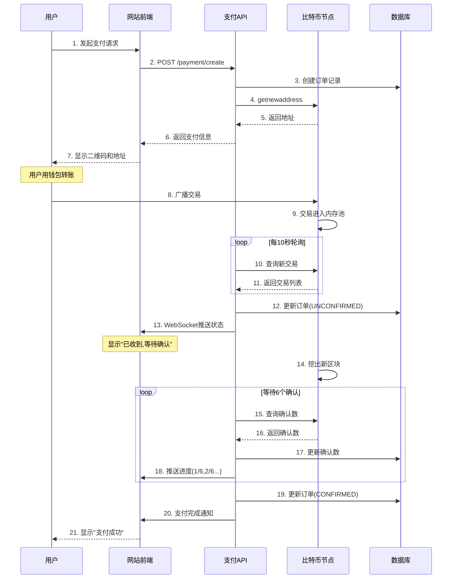

---
title: 比特币支付集成实战 - 10分钟讲解脚本
date: 2025-10-23
categories:
  - Technology
  - Learning
---

# 比特币支付集成实战 - 10分钟讲解脚本

## 开场 (30秒)

大家好,今天咱们聊聊怎么在自己的网站或应用里集成比特币支付。

可能有人会想,比特币支付不是很简单吗?给用户一个地址,让他转账不就行了?理论上是这样,但实际做起来,坑可不少。

我见过太多项目,刚开始觉得很容易,结果上线后各种问题:金额不对怎么办?付多了怎么退?付少了怎么处理?交易一直不确认怎么办?用户说付了但我这边没收到,谁的问题?这些都是真实的业务场景,处理不好会让用户很抓狂。

今天我就结合实战经验,从支付流程设计、交易监控、退款处理到前端集成,给大家讲讲怎么搭建一个靠谱的比特币支付系统。

## 第一部分:支付流程设计——别让用户迷路 (2.5分钟)

首先说说支付流程,这是整个系统的骨架。

一个完整的比特币支付流程是这样的:

1. **用户发起支付**:比如买个商品,点击"用比特币支付"
2. **系统生成订单**:创建一个唯一的订单号,生成一个专属的收款地址
3. **显示支付信息**:告诉用户要付多少BTC,往哪个地址付,最好有个二维码
4. **用户转账**:用户用钱包扫码或者复制地址转账
5. **系统监控交易**:实时检测这个地址有没有收到钱
6. **交易确认**:等待足够的区块确认,确保不会被重组
7. **完成支付**:标记订单为"已支付",给用户发货或开通服务

听起来简单,但每一步都有细节要处理。

**第一个关键:地址生成策略**。

千万不要用一个地址收所有人的钱!这样你根本分不清哪笔钱是哪个订单的。正确的做法是:每个订单生成一个新地址。

怎么生成?用HD钱包(Hierarchical Deterministic Wallet)。从一个主密钥派生出无数个子地址,每个地址都有唯一的索引。这样既安全又方便管理。

```java
String address = bitcoinCli.call("getnewaddress", orderId);
database.save(address, orderId); // 记录地址和订单的映射关系
```

**第二个关键:金额计算**。

比特币价格波动很大,你不能说"这个商品100美元,永远等于0.002 BTC"。必须实时转换。

我的建议是:在用户点击支付的那一刻,调用价格API(比如CoinGecko、Binance)获取实时汇率,计算出需要支付的BTC金额,然后给这个金额设置30分钟的有效期。

为什么要有效期?因为如果用户拖了两小时才付款,这期间价格可能已经变了10%,你亏了还是赚了都不好说。设个有效期,超时就让用户重新下单,避免纠纷。

**第三个关键:金额容错**。

比特币转账有手续费,用户实际支付的金额可能跟你要求的不完全一样。比如你要0.001 BTC,用户付了0.00099 BTC(因为钱包自动扣了手续费),你能不能接受?

我的做法是:设置一个容错范围,比如±1%。在这个范围内的都算有效支付。太少了(比如只付了一半),标记为"金额不足",联系用户补齐;太多了(比如多付了10%),标记为"金额过多",主动退款或者询问用户意向。

这些细节处理好了,用户体验会好很多。

## 第二部分:交易监控——别让用户干等着 (2分钟)

支付流程设计好了,接下来最重要的就是**交易监控**——怎么知道用户付钱了?

比特币没有"已读回执",你不能坐等用户截图给你看,必须主动监控区块链。

有两种监控方式:**轮询**和**Webhook**。

**轮询**就是定时去查:每隔10秒,检查一下内存池(Mempool)和新区块,看看有没有发往你监控地址的交易。

```java
while (running) {
    List<String> txids = getNewTransactions();
    for (String txid : txids) {
        Transaction tx = getTransaction(txid);
        checkIfPayment(tx); // 检查是不是支付给我的
    }
    Thread.sleep(10000); // 10秒轮询一次
}
```

轮询的好处是简单可靠,坏处是有延迟,而且不太优雅。

**Webhook**是更好的方案,但需要比特币节点支持。节点发现新交易或新区块时,主动推送通知给你的服务器。这样响应更快,用户体验更好。

但不管用哪种方式,都要处理好这几个状态:

1. **PENDING(等待支付)**:订单刚创建,还没收到钱
2. **UNCONFIRMED(未确认)**:收到钱了,但还在内存池,没有区块确认
3. **CONFIRMING(确认中)**:已经有1-5个确认,正在等更多确认
4. **CONFIRMED(已确认)**:达到所需确认数(通常6个),支付完成
5. **EXPIRED(已超时)**:超过有效期还没付款,订单取消

用户付款后,第一时间显示"我们已收到您的支付,正在等待确认",让用户知道系统在工作,不要让他们干等着啥反馈都没有,那样会很焦虑。

**确认数怎么定?**根据金额大小:
- 小额(几十块):1个确认就行
- 中等金额(几百块):3个确认
- 大额(上千):6个确认
- 特大额(上万):10-20个确认

别嫌麻烦,这是为了防止双花攻击。虽然概率很低,但涉及资金安全,必须谨慎。

还有一点:**处理异常情况**。比如用户付款后,交易一直不确认(可能费率设低了),这种情况要及时通知用户,让他用RBF加速,或者等待更长时间。别让用户误以为支付失败。

## 第三部分:退款处理——别让钱进来容易出去难 (2分钟)

支付容易,退款难——这是很多比特币支付系统的通病。

传统支付(支付宝、信用卡)都有退款功能,一键操作。但比特币是不可逆的,没有"撤销"按钮。退款得你主动发起一笔新交易,把钱退回去。

**第一个问题:退到哪里?**

用户付款给你的时候,你知道了他的付款地址(从交易输入里提取)。但这个地址未必是他的,可能是交易所的中转地址,可能是别人的。

所以,最好的做法是:**让用户提供退款地址**。在退款申请的时候,让用户填写一个他确实拥有的地址,然后你往那个地址打钱。

千万别自作聪明,直接退回原地址,可能会退丢。我见过有人把钱退给了交易所的充值地址,结果钱进了交易所的大池子,用户找不回来,那叫一个尴尬。

**第二个问题:退多少?**

如果是全额退款,很简单,原价退回(扣除必要的手续费)。但如果是部分退款呢?比如用户买了3件商品,退了1件,你得按比例退。

还有个麻烦事:汇率变化。用户付款时BTC价格是$40000,现在退款时价格涨到$50000了,你退多少?退当初收的BTC数量,还是按现在的汇率重算?

我的建议是:**按BTC数量退**,不考虑汇率变化。理由很简单:汇率风险是双向的,涨了用户赚、跌了商家赚,平均下来是公平的。如果你要按法币金额退,那你得承担汇率风险,还得做对冲,太复杂了。

当然,这个逻辑要在用户付款前就说清楚,写在服务条款里,别事后扯皮。

**第三个问题:手续费谁出?**

发起退款交易,需要付矿工费。这个费用谁承担?

常见做法:
- 商家责任(质量问题、发错货):商家承担手续费,全额退款
- 用户责任(不想要了、买错了):从退款中扣除手续费

比如用户付了0.01 BTC,要退款,当前手续费是0.0001 BTC,那就退0.0099 BTC。

写代码的时候,记得处理好这些逻辑,不然容易出纠纷。

## 第四部分:前端集成——让用户会用 (1.5分钟)

后端逻辑搞定了,最后是前端集成——怎么让普通用户也能顺畅地用比特币支付?

**支付页面要清晰**:
1. 显示要付的比特币金额,精确到小数点后8位
2. 显示对应的法币金额(比如≈ $50 USD)
3. 显示收款地址,最好既有文本也有二维码
4. 显示倒计时,告诉用户还有多少时间完成支付
5. 实时显示支付状态,不要让用户刷新页面

**二维码很重要**。手机用户占大多数,扫码支付比复制地址方便多了。二维码里要包含:
- 地址
- 金额
- 订单备注

用BIP21标准格式:
```
bitcoin:bc1q...?amount=0.001&label=Order%20123
```

这样用户一扫码,钱包自动填好地址和金额,点一下确认就发送了,体验很顺滑。

**支付状态要实时更新**。用户付款后,页面要立刻显示"已收到支付,等待确认",然后显示确认数:1/6、2/6...直到6/6完成。

这个可以用WebSocket或者轮询实现:
```javascript
// 前端每5秒轮询一次
setInterval(() => {
  fetch(`/api/payment/status/${orderId}`)
    .then(res => res.json())
    .then(data => {
      updateStatus(data.status);
    });
}, 5000);
```

**异常提示要友好**。如果用户付错了金额、地址填错了、交易一直不确认,要用人话告诉他怎么办,别甩一堆技术术语。

比如:"您的支付金额少了0.00005 BTC,请补齐差额或联系客服",而不是:"UNDERPAID ERROR: delta=-0.00005"。

## 第五部分:安全和最佳实践 (1.5分钟)

最后说说安全,这是重中之重。

**第一,私钥管理**。收到的比特币存在哪里?千万别直接存在服务器的热钱包里!

我的建议是:**冷热钱包分离**。每天定时把热钱包里的比特币转到冷钱包(离线存储),热钱包里只保留够一天用的零钱。这样即使服务器被黑,损失也有限。

**第二,防止重放攻击**。用户可能复制你的支付地址,重复付款好几次,然后要求退款。怎么防?

每个订单生成唯一地址,一个地址只用一次。收到第一笔付款就标记地址为"已使用",后续往这个地址的付款,要么拒绝,要么标记为"重复支付",单独处理。

**第三,防止金额操纵**。不要相信前端传来的金额!

前端显示"需支付0.001 BTC",但狡猾的用户可能改代码,发送请求时改成0.0001 BTC。你得在后端重新计算一遍,确保金额正确。

```java
// 错误做法
double amount = request.getAmount(); // 信任前端

// 正确做法
double amount = calculateAmount(productId, quantity); // 后端计算
```

**第四,日志和审计**。所有支付相关的操作都要记录日志:订单创建、收到支付、确认、退款,等等。出了问题能追溯,也能防止内部作弊。

**第五,测试!测试!测试!**

先在测试网(Testnet)上跑通整个流程,确保没问题再上主网。测试时要模拟各种异常场景:
- 用户付错金额
- 交易一直不确认
- 订单超时
- 退款失败
- 网络断线
- 节点挂了

每个场景都要有应对方案,别等上线了出问题再抓瞎。

## 结尾总结 (30秒)

好,今天就分享到这。

总结一下:集成比特币支付不难,但细节很多——地址生成、金额计算、交易监控、退款处理、前端集成,每一环都不能马虎。最重要的是:**以用户为中心**,把流程做清晰,把反馈做及时,把异常处理做友好。

比特币支付虽然没有支付宝、微信那么傻瓜化,但只要你设计得好,用户体验一样可以很顺畅。而且比特币支付有个巨大的优势——全球通用、手续费低、不会被冻结,这是传统支付做不到的。

对于跨境电商、数字商品、订阅服务这些场景,比特币支付是个很好的补充。做好了,能打开一个新的市场。

好了,今天就到这里,谢谢大家!

---

## 补充资料(可选展开)

### 完整的支付状态机

```
PENDING (等待支付)
    ↓ 收到交易
UNCONFIRMED (未确认,0 conf)
    ↓ 第1个区块确认
CONFIRMING (确认中,1-5 conf)
    ↓ 达到所需确认数
CONFIRMED (已确认,6+ conf)
    ↓ 商户处理订单
COMPLETED (完成)

特殊路径:
PENDING --超时--> EXPIRED
PENDING --金额不足--> UNDERPAID
PENDING --金额过多--> OVERPAID
CONFIRMED --申请退款--> REFUNDING --> REFUNDED
```

### Mermaid 流程图:支付完整流程



### 实战代码:简单的支付监控

```java
/**
 * 支付监控服务
 */
@Service
public class PaymentMonitorService {

    @Autowired
    private BitcoinRpcClient rpcClient;

    @Autowired
    private PaymentOrderRepository orderRepo;

    /**
     * 定时任务:每10秒检查一次
     */
    @Scheduled(fixedDelay = 10000)
    public void monitorPayments() {
        // 获取所有等待支付的订单
        List<PaymentOrder> pendingOrders =
            orderRepo.findByStatus(PaymentStatus.PENDING);

        for (PaymentOrder order : pendingOrders) {
            checkOrderPayment(order);
        }

        // 检查未确认订单的确认数
        List<PaymentOrder> unconfirmedOrders =
            orderRepo.findByStatus(PaymentStatus.UNCONFIRMED);

        for (PaymentOrder order : unconfirmedOrders) {
            checkOrderConfirmations(order);
        }

        // 处理超时订单
        List<PaymentOrder> expiredOrders =
            orderRepo.findExpiredOrders();

        for (PaymentOrder order : expiredOrders) {
            order.setStatus(PaymentStatus.EXPIRED);
            orderRepo.save(order);
        }
    }

    private void checkOrderPayment(PaymentOrder order) {
        try {
            // 查询地址收到的交易
            List<Transaction> txs =
                rpcClient.listReceivedByAddress(order.getAddress());

            if (!txs.isEmpty()) {
                Transaction tx = txs.get(0);
                double received = tx.getAmount();

                // 检查金额
                if (received >= order.getAmount() * 0.99) {
                    order.setStatus(PaymentStatus.UNCONFIRMED);
                    order.setTxid(tx.getTxid());
                    order.setReceivedAmount(received);
                    orderRepo.save(order);

                    // 通知商户
                    notifyMerchant(order, "RECEIVED");
                }
            }
        } catch (Exception e) {
            log.error("检查支付失败: {}", order.getOrderId(), e);
        }
    }

    private void checkOrderConfirmations(PaymentOrder order) {
        try {
            int confirmations =
                rpcClient.getConfirmations(order.getTxid());

            int required = getRequiredConfirmations(order.getAmount());

            if (confirmations >= required) {
                order.setStatus(PaymentStatus.CONFIRMED);
                order.setConfirmedAt(LocalDateTime.now());
                orderRepo.save(order);

                // 通知商户
                notifyMerchant(order, "CONFIRMED");
            }
        } catch (Exception e) {
            log.error("检查确认数失败: {}", order.getOrderId(), e);
        }
    }

    private int getRequiredConfirmations(double amount) {
        if (amount < 0.01) return 1;
        if (amount < 1.0) return 3;
        if (amount < 10.0) return 6;
        return 12;
    }
}
```

### BIP21支付URI格式

```
bitcoin:<address>[?amount=<amount>][?label=<label>][?message=<message>]
```

**示例:**
```
bitcoin:bc1qxy2kgdygjrsqtzq2n0yrf2493p83kkfjhx0wlh?amount=0.001&label=Order%20123&message=Payment%20for%20Order%20123
```

**生成二维码:**
```java
public String generatePaymentQR(PaymentOrder order) {
    String uri = String.format(
        "bitcoin:%s?amount=%.8f&label=%s",
        order.getAddress(),
        order.getAmount(),
        URLEncoder.encode("Order " + order.getOrderId(), "UTF-8")
    );

    // 使用 zxing 库生成二维码
    QRCodeWriter qrWriter = new QRCodeWriter();
    BitMatrix bitMatrix = qrWriter.encode(
        uri,
        BarcodeFormat.QR_CODE,
        300,
        300
    );

    // 转换为Base64图片
    ByteArrayOutputStream pngOutputStream = new ByteArrayOutputStream();
    MatrixToImageWriter.writeToStream(bitMatrix, "PNG", pngOutputStream);
    byte[] pngData = pngOutputStream.toByteArray();

    return "data:image/png;base64," +
           Base64.getEncoder().encodeToString(pngData);
}
```

### 前端支付页面示例

```javascript
// payment.js

class BitcoinPayment {
    constructor(orderId) {
        this.orderId = orderId;
        this.statusCheckInterval = null;
    }

    async init() {
        // 显示支付信息
        const paymentInfo = await this.getPaymentInfo();
        this.displayPaymentInfo(paymentInfo);

        // 开始监控支付状态
        this.startStatusCheck();

        // 启动倒计时
        this.startCountdown(paymentInfo.expiresAt);
    }

    async getPaymentInfo() {
        const response = await fetch(`/api/payment/${this.orderId}`);
        return await response.json();
    }

    displayPaymentInfo(info) {
        document.getElementById('address').textContent = info.address;
        document.getElementById('amount').textContent = info.amount.toFixed(8);
        document.getElementById('fiat-amount').textContent =
            `≈ $${info.fiatAmount.toFixed(2)} USD`;
        document.getElementById('qr-code').src = info.qrCode;

        // 添加复制按钮
        document.getElementById('copy-address').onclick = () => {
            navigator.clipboard.writeText(info.address);
            alert('地址已复制!');
        };
    }

    startStatusCheck() {
        this.statusCheckInterval = setInterval(async () => {
            const status = await this.checkStatus();
            this.updateStatus(status);

            if (status.status === 'CONFIRMED') {
                this.onPaymentCompleted();
            }
        }, 5000); // 每5秒检查一次
    }

    async checkStatus() {
        const response = await fetch(
            `/api/payment/status/${this.orderId}`
        );
        return await response.json();
    }

    updateStatus(status) {
        const statusEl = document.getElementById('status');

        switch(status.status) {
            case 'PENDING':
                statusEl.innerHTML = '⏳ 等待支付...';
                break;
            case 'UNCONFIRMED':
                statusEl.innerHTML = '✅ 已收到支付,等待确认...';
                break;
            case 'CONFIRMING':
                const confirmations = status.confirmations || 0;
                const required = status.requiredConfirmations || 6;
                statusEl.innerHTML =
                    `🔄 确认中... ${confirmations}/${required}`;
                break;
            case 'CONFIRMED':
                statusEl.innerHTML = '✨ 支付成功!';
                break;
            case 'EXPIRED':
                statusEl.innerHTML = '⏰ 订单已超时';
                break;
        }
    }

    startCountdown(expiresAt) {
        const expiresTime = new Date(expiresAt).getTime();

        const countdown = setInterval(() => {
            const now = new Date().getTime();
            const distance = expiresTime - now;

            if (distance < 0) {
                clearInterval(countdown);
                document.getElementById('countdown').innerHTML = '已超时';
                return;
            }

            const minutes = Math.floor(
                (distance % (1000 * 60 * 60)) / (1000 * 60)
            );
            const seconds = Math.floor((distance % (1000 * 60)) / 1000);

            document.getElementById('countdown').innerHTML =
                `${minutes}:${seconds.toString().padStart(2, '0')}`;
        }, 1000);
    }

    onPaymentCompleted() {
        clearInterval(this.statusCheckInterval);

        // 显示成功页面
        setTimeout(() => {
            window.location.href = '/order/success/' + this.orderId;
        }, 2000);
    }
}

// 初始化
const orderId = getOrderIdFromUrl();
const payment = new BitcoinPayment(orderId);
payment.init();
```

### 数据库表设计

```sql
-- 支付订单表
CREATE TABLE payment_orders (
    id BIGINT PRIMARY KEY AUTO_INCREMENT,
    order_id VARCHAR(64) UNIQUE NOT NULL,
    merchant_id VARCHAR(64) NOT NULL,
    address VARCHAR(128) NOT NULL,
    amount DECIMAL(16, 8) NOT NULL COMMENT 'BTC金额',
    fiat_amount DECIMAL(16, 2) COMMENT '法币金额',
    currency VARCHAR(8) COMMENT '法币类型',
    status VARCHAR(32) NOT NULL,
    txid VARCHAR(128),
    received_amount DECIMAL(16, 8),
    confirmations INT DEFAULT 0,
    created_at TIMESTAMP NOT NULL,
    expires_at TIMESTAMP NOT NULL,
    received_at TIMESTAMP,
    confirmed_at TIMESTAMP,
    INDEX idx_address (address),
    INDEX idx_status (status),
    INDEX idx_merchant (merchant_id),
    INDEX idx_expires (expires_at)
);

-- 退款记录表
CREATE TABLE refunds (
    id BIGINT PRIMARY KEY AUTO_INCREMENT,
    refund_id VARCHAR(64) UNIQUE NOT NULL,
    order_id VARCHAR(64) NOT NULL,
    amount DECIMAL(16, 8) NOT NULL,
    reason VARCHAR(512),
    refund_address VARCHAR(128) NOT NULL,
    status VARCHAR(32) NOT NULL,
    txid VARCHAR(128),
    fail_reason VARCHAR(512),
    created_at TIMESTAMP NOT NULL,
    processed_at TIMESTAMP,
    FOREIGN KEY (order_id) REFERENCES payment_orders(order_id)
);

-- 地址映射表
CREATE TABLE address_mappings (
    id BIGINT PRIMARY KEY AUTO_INCREMENT,
    address VARCHAR(128) UNIQUE NOT NULL,
    order_id VARCHAR(64) NOT NULL,
    used BOOLEAN DEFAULT FALSE,
    created_at TIMESTAMP NOT NULL,
    INDEX idx_order (order_id)
);
```

### 常见问题FAQ

**Q: 用户付错地址怎么办?**
A: 这个比特币本身无法撤销。只能在页面上明确提示用户"仔细核对地址",最好让用户扫二维码而不是手动输入。如果真的付错了,无法找回。

**Q: 交易卡了好几天都不确认怎么办?**
A: 引导用户使用 RBF 加速,或者用 CPFP。如果用户不会,可以提供客服协助。极端情况下,如果交易被网络抛弃(超过2周未确认),可以让用户重新支付。

**Q: 比特币价格波动太大,怎么对冲?**
A: 收到比特币后,立即在交易所卖出换成稳定币(USDT)或法币。或者使用专业的支付服务商(如BTCPay Server),他们提供即时换汇功能。

**Q: 需要自己跑比特币节点吗?还是可以用第三方API?**
A: 建议自己跑节点,更安全可控。第三方API(如Blockchain.info)有速率限制,而且依赖他们的服务稳定性。节点也不贵,几百块钱的VPS就够了。

**Q: 怎么处理测试?**
A: 先在Testnet上完整测试,确保流程没问题。Testnet的币可以从水龙头免费领。千万别直接在主网上测试!
