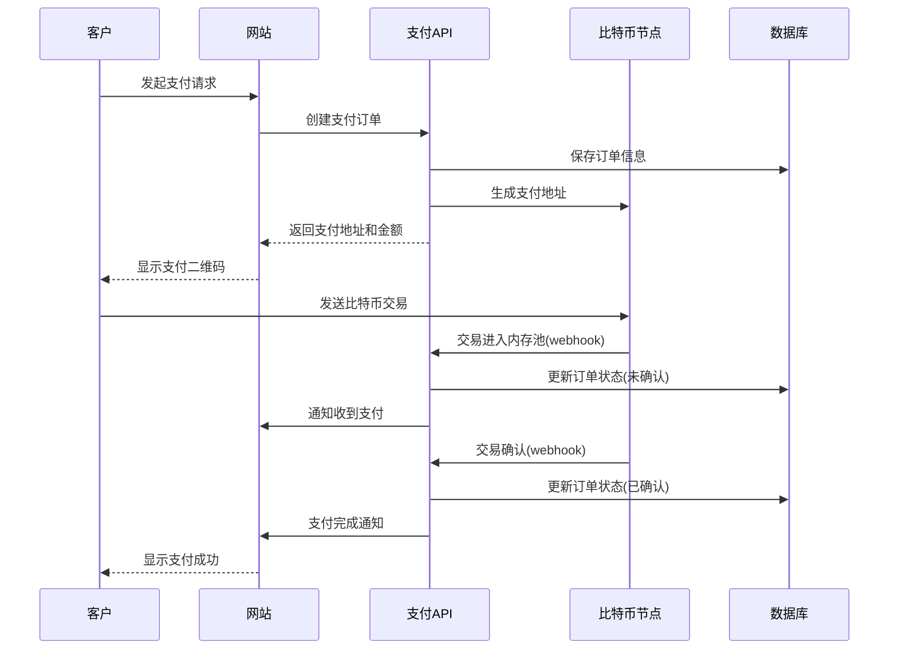

---
title: 比特币支付集成实战
date: 2025-09-30
categories:
  - Technology
  - Learning
---

# 比特币支付集成实战

## 1. 支付系统架构

### 1.1 支付流程设计



### 1.2 支付网关实现

```java
/**
 * 比特币支付网关
 */
public class BitcoinPaymentGateway {

    private BitcoinRpcClient rpcClient;
    private PaymentDatabase database;
    private WebhookNotifier notifier;

    /**
     * 创建支付订单
     */
    public PaymentOrder createPaymentOrder(PaymentRequest request) {
        // 生成唯一订单ID
        String orderId = generateOrderId();

        // 生成新的接收地址
        String address = generatePaymentAddress(orderId);

        // 计算比特币金额
        double btcAmount = convertToBTC(request.amount, request.currency);

        // 创建订单
        PaymentOrder order = new PaymentOrder();
        order.setOrderId(orderId);
        order.setMerchantId(request.merchantId);
        order.setAddress(address);
        order.setAmount(btcAmount);
        order.setFiatAmount(request.amount);
        order.setCurrency(request.currency);
        order.setStatus(PaymentStatus.PENDING);
        order.setCreatedAt(LocalDateTime.now());
        order.setExpiresAt(LocalDateTime.now().plusMinutes(30));

        // 保存到数据库
        database.saveOrder(order);

        return order;
    }

    /**
     * 生成支付地址
     */
    private String generatePaymentAddress(String orderId) {
        try {
            // 使用HD钱包生成新地址
            String address = rpcClient.call("getnewaddress", orderId)
                .getString("result");

            // 记录地址映射
            database.saveAddressMapping(address, orderId);

            return address;
        } catch (Exception e) {
            throw new RuntimeException("生成地址失败", e);
        }
    }

    /**
     * 监控支付地址
     */
    public void monitorPayments() {
        // 启动区块链监听器
        BlockchainMonitor monitor = new BlockchainMonitor(rpcClient);

        monitor.onTransaction(tx -> {
            // 检查交易输出
            for (TxOutput output : tx.getOutputs()) {
                String address = output.getAddress();

                // 查找订单
                PaymentOrder order = database.findOrderByAddress(address);
                if (order != null && order.getStatus() == PaymentStatus.PENDING) {
                    handleIncomingPayment(order, tx, output);
                }
            }
        });

        monitor.start();
    }

    /**
     * 处理收到的支付
     */
    private void handleIncomingPayment(
            PaymentOrder order,
            Transaction tx,
            TxOutput output) {

        // 验证金额
        double receivedAmount = output.getValue() / 1e8; // satoshi to BTC

        if (receivedAmount < order.getAmount() * 0.99) { // 允许1%误差
            // 金额不足
            order.setStatus(PaymentStatus.UNDERPAID);
            order.setReceivedAmount(receivedAmount);
            database.updateOrder(order);

            notifier.notify(order.getMerchantId(), new PaymentNotification(
                order.getOrderId(),
                "UNDERPAID",
                "收到金额不足"
            ));
            return;
        }

        if (receivedAmount > order.getAmount() * 1.01) { // 允许1%误差
            // 金额过多
            order.setStatus(PaymentStatus.OVERPAID);
            order.setReceivedAmount(receivedAmount);
        } else {
            order.setStatus(PaymentStatus.UNCONFIRMED);
            order.setReceivedAmount(receivedAmount);
        }

        order.setTxid(tx.getTxid());
        order.setReceivedAt(LocalDateTime.now());
        database.updateOrder(order);

        // 通知商户
        notifier.notify(order.getMerchantId(), new PaymentNotification(
            order.getOrderId(),
            "RECEIVED",
            "收到支付,等待确认"
        ));
    }

    /**
     * 检查交易确认
     */
    public void checkConfirmations() {
        // 获取所有未确认的订单
        List<PaymentOrder> unconfirmedOrders = database.findOrdersByStatus(
            PaymentStatus.UNCONFIRMED
        );

        for (PaymentOrder order : unconfirmedOrders) {
            try {
                int confirmations = getConfirmations(order.getTxid());

                if (confirmations >= getRequiredConfirmations(order.getAmount())) {
                    // 支付已确认
                    order.setStatus(PaymentStatus.CONFIRMED);
                    order.setConfirmedAt(LocalDateTime.now());
                    database.updateOrder(order);

                    // 通知商户
                    notifier.notify(order.getMerchantId(), new PaymentNotification(
                        order.getOrderId(),
                        "CONFIRMED",
                        "支付已确认"
                    ));
                }
            } catch (Exception e) {
                System.err.println("检查确认失败: " + order.getOrderId());
            }
        }
    }

    /**
     * 处理超时订单
     */
    public void handleExpiredOrders() {
        List<PaymentOrder> expiredOrders = database.findExpiredOrders();

        for (PaymentOrder order : expiredOrders) {
            if (order.getStatus() == PaymentStatus.PENDING) {
                order.setStatus(PaymentStatus.EXPIRED);
                database.updateOrder(order);

                notifier.notify(order.getMerchantId(), new PaymentNotification(
                    order.getOrderId(),
                    "EXPIRED",
                    "订单已超时"
                ));
            }
        }
    }

    /**
     * 根据金额确定所需确认数
     */
    private int getRequiredConfirmations(double amountBTC) {
        if (amountBTC < 0.01) return 1;
        if (amountBTC < 1.0) return 3;
        if (amountBTC < 10.0) return 6;
        return 12;
    }

    /**
     * 货币转换
     */
    private double convertToBTC(double amount, String currency) {
        // 从价格API获取实时汇率
        double btcPrice = getPriceInCurrency(currency);
        return amount / btcPrice;
    }

    private double getPriceInCurrency(String currency) {
        // 调用价格API
        return 50000.0; // 示例价格
    }

    private int getConfirmations(String txid) throws Exception {
        JSONObject tx = rpcClient.call("gettransaction", txid);
        return tx.getInt("confirmations");
    }

    private String generateOrderId() {
        return "ORD-" + System.currentTimeMillis() + "-" +
               new Random().nextInt(10000);
    }

    /**
     * 支付订单实体
     */
    public static class PaymentOrder {
        private String orderId;
        private String merchantId;
        private String address;
        private double amount;
        private double fiatAmount;
        private String currency;
        private PaymentStatus status;
        private String txid;
        private double receivedAmount;
        private LocalDateTime createdAt;
        private LocalDateTime expiresAt;
        private LocalDateTime receivedAt;
        private LocalDateTime confirmedAt;

        // Getters and Setters
        public String getOrderId() { return orderId; }
        public void setOrderId(String orderId) { this.orderId = orderId; }
        public String getMerchantId() { return merchantId; }
        public void setMerchantId(String merchantId) { this.merchantId = merchantId; }
        public String getAddress() { return address; }
        public void setAddress(String address) { this.address = address; }
        public double getAmount() { return amount; }
        public void setAmount(double amount) { this.amount = amount; }
        public double getFiatAmount() { return fiatAmount; }
        public void setFiatAmount(double fiatAmount) { this.fiatAmount = fiatAmount; }
        public String getCurrency() { return currency; }
        public void setCurrency(String currency) { this.currency = currency; }
        public PaymentStatus getStatus() { return status; }
        public void setStatus(PaymentStatus status) { this.status = status; }
        public String getTxid() { return txid; }
        public void setTxid(String txid) { this.txid = txid; }
        public double getReceivedAmount() { return receivedAmount; }
        public void setReceivedAmount(double receivedAmount) { this.receivedAmount = receivedAmount; }
        public LocalDateTime getCreatedAt() { return createdAt; }
        public void setCreatedAt(LocalDateTime createdAt) { this.createdAt = createdAt; }
        public LocalDateTime getExpiresAt() { return expiresAt; }
        public void setExpiresAt(LocalDateTime expiresAt) { this.expiresAt = expiresAt; }
        public LocalDateTime getReceivedAt() { return receivedAt; }
        public void setReceivedAt(LocalDateTime receivedAt) { this.receivedAt = receivedAt; }
        public LocalDateTime getConfirmedAt() { return confirmedAt; }
        public void setConfirmedAt(LocalDateTime confirmedAt) { this.confirmedAt = confirmedAt; }
    }

    public enum PaymentStatus {
        PENDING,      // 等待支付
        UNCONFIRMED,  // 已收到但未确认
        CONFIRMED,    // 已确认
        UNDERPAID,    // 金额不足
        OVERPAID,     // 金额过多
        EXPIRED       // 已超时
    }

    public static class PaymentRequest {
        String merchantId;
        double amount;
        String currency;
    }

    public static class PaymentNotification {
        String orderId;
        String status;
        String message;

        public PaymentNotification(String orderId, String status, String message) {
            this.orderId = orderId;
            this.status = status;
            this.message = message;
        }
    }
}
```

## 2. 区块链监控

### 2.1 交易监听器

```java
/**
 * 区块链交易监听器
 */
public class BlockchainMonitor {

    private BitcoinRpcClient rpcClient;
    private List<TransactionListener> listeners;
    private Set<String> processedTxs;
    private volatile boolean running;

    public interface TransactionListener {
        void onTransaction(Transaction tx);
    }

    /**
     * 启动监控
     */
    public void start() {
        running = true;

        // 方法1: 轮询内存池
        Thread mempoolThread = new Thread(this::monitorMempool);
        mempoolThread.start();

        // 方法2: 监听新区块
        Thread blockThread = new Thread(this::monitorBlocks);
        blockThread.start();
    }

    /**
     * 监控内存池
     */
    private void monitorMempool() {
        while (running) {
            try {
                // 获取内存池中的所有交易
                JSONArray rawMempool = rpcClient.call("getrawmempool")
                    .getJSONArray("result");

                for (int i = 0; i < rawMempool.length(); i++) {
                    String txid = rawMempool.getString(i);

                    if (!processedTxs.contains(txid)) {
                        processTransaction(txid);
                        processedTxs.add(txid);
                    }
                }

                // 每10秒检查一次
                Thread.sleep(10000);

            } catch (Exception e) {
                System.err.println("监控内存池错误: " + e.getMessage());
            }
        }
    }

    /**
     * 监控新区块
     */
    private void monitorBlocks() {
        String lastBlockHash = null;

        while (running) {
            try {
                String currentHash = rpcClient.call("getbestblockhash")
                    .getString("result");

                if (lastBlockHash != null && !currentHash.equals(lastBlockHash)) {
                    // 新区块产生
                    processNewBlock(currentHash);
                }

                lastBlockHash = currentHash;

                // 每30秒检查一次
                Thread.sleep(30000);

            } catch (Exception e) {
                System.err.println("监控区块错误: " + e.getMessage());
            }
        }
    }

    /**
     * 处理新区块
     */
    private void processNewBlock(String blockHash) throws Exception {
        JSONObject block = rpcClient.call("getblock", blockHash, 2);
        JSONArray txs = block.getJSONArray("tx");

        for (int i = 0; i < txs.length(); i++) {
            JSONObject txJson = txs.getJSONObject(i);
            String txid = txJson.getString("txid");

            if (!processedTxs.contains(txid)) {
                Transaction tx = parseTransaction(txJson);
                notifyListeners(tx);
                processedTxs.add(txid);
            }
        }

        // 清理旧的已处理交易记录
        if (processedTxs.size() > 100000) {
            processedTxs.clear();
        }
    }

    /**
     * 处理单个交易
     */
    private void processTransaction(String txid) {
        try {
            JSONObject rawTx = rpcClient.call("getrawtransaction", txid, true);
            Transaction tx = parseTransaction(rawTx);
            notifyListeners(tx);
        } catch (Exception e) {
            System.err.println("处理交易失败: " + txid);
        }
    }

    /**
     * 解析交易
     */
    private Transaction parseTransaction(JSONObject txJson) {
        Transaction tx = new Transaction();
        tx.setTxid(txJson.getString("txid"));

        // 解析输出
        JSONArray vout = txJson.getJSONArray("vout");
        List<TxOutput> outputs = new ArrayList<>();

        for (int i = 0; i < vout.length(); i++) {
            JSONObject output = vout.getJSONObject(i);
            TxOutput txOutput = new TxOutput();

            txOutput.setVout(output.getInt("n"));
            txOutput.setValue((long)(output.getDouble("value") * 1e8));

            JSONObject scriptPubKey = output.getJSONObject("scriptPubKey");
            if (scriptPubKey.has("address")) {
                txOutput.setAddress(scriptPubKey.getString("address"));
            } else if (scriptPubKey.has("addresses")) {
                JSONArray addresses = scriptPubKey.getJSONArray("addresses");
                if (addresses.length() > 0) {
                    txOutput.setAddress(addresses.getString(0));
                }
            }

            outputs.add(txOutput);
        }

        tx.setOutputs(outputs);

        return tx;
    }

    /**
     * 通知监听器
     */
    private void notifyListeners(Transaction tx) {
        for (TransactionListener listener : listeners) {
            try {
                listener.onTransaction(tx);
            } catch (Exception e) {
                System.err.println("监听器处理失败: " + e.getMessage());
            }
        }
    }

    public void onTransaction(TransactionListener listener) {
        listeners.add(listener);
    }

    public void stop() {
        running = false;
    }
}
```

### 2.2 Webhook通知系统

```java
/**
 * Webhook通知器
 */
public class WebhookNotifier {

    private ExecutorService executor;
    private Map<String, MerchantConfig> merchants;

    public static class MerchantConfig {
        String merchantId;
        String webhookUrl;
        String secret;
        int maxRetries;
    }

    /**
     * 发送通知
     */
    public void notify(String merchantId, PaymentNotification notification) {
        MerchantConfig config = merchants.get(merchantId);
        if (config == null) {
            System.err.println("未找到商户配置: " + merchantId);
            return;
        }

        // 异步发送
        executor.submit(() -> sendWebhook(config, notification));
    }

    /**
     * 发送Webhook
     */
    private void sendWebhook(MerchantConfig config, PaymentNotification notification) {
        int retries = 0;

        while (retries < config.maxRetries) {
            try {
                // 构建请求体
                JSONObject payload = new JSONObject();
                payload.put("orderId", notification.orderId);
                payload.put("status", notification.status);
                payload.put("message", notification.message);
                payload.put("timestamp", System.currentTimeMillis());

                // 生成签名
                String signature = generateSignature(payload.toString(), config.secret);

                // 发送HTTP请求
                URL url = new URL(config.webhookUrl);
                HttpURLConnection conn = (HttpURLConnection) url.openConnection();
                conn.setRequestMethod("POST");
                conn.setRequestProperty("Content-Type", "application/json");
                conn.setRequestProperty("X-Signature", signature);
                conn.setDoOutput(true);

                try (OutputStream os = conn.getOutputStream()) {
                    os.write(payload.toString().getBytes());
                    os.flush();
                }

                int responseCode = conn.getResponseCode();
                if (responseCode >= 200 && responseCode < 300) {
                    // 成功
                    System.out.println("Webhook发送成功: " + notification.orderId);
                    return;
                }

                System.err.println("Webhook失败: " + responseCode);

            } catch (Exception e) {
                System.err.println("Webhook错误: " + e.getMessage());
            }

            retries++;
            if (retries < config.maxRetries) {
                // 指数退避
                try {
                    Thread.sleep((long) Math.pow(2, retries) * 1000);
                } catch (InterruptedException e) {
                    Thread.currentThread().interrupt();
                    return;
                }
            }
        }

        System.err.println("Webhook最终失败: " + notification.orderId);
    }

    /**
     * 生成HMAC签名
     */
    private String generateSignature(String payload, String secret) {
        try {
            Mac mac = Mac.getInstance("HmacSHA256");
            SecretKeySpec secretKey = new SecretKeySpec(secret.getBytes(), "HmacSHA256");
            mac.init(secretKey);
            byte[] hash = mac.doFinal(payload.getBytes());
            return Hex.encode(hash);
        } catch (Exception e) {
            throw new RuntimeException("签名生成失败", e);
        }
    }
}
```

## 3. 退款处理

### 3.1 自动退款系统

```java
/**
 * 退款处理器
 */
public class RefundProcessor {

    private BitcoinRpcClient rpcClient;
    private PaymentDatabase database;

    /**
     * 创建退款
     */
    public Refund createRefund(String orderId, double amount, String reason) {
        // 查找原订单
        PaymentOrder order = database.findOrderById(orderId);
        if (order == null) {
            throw new IllegalArgumentException("订单不存在");
        }

        if (order.getStatus() != PaymentStatus.CONFIRMED) {
            throw new IllegalStateException("订单未确认,无法退款");
        }

        // 创建退款记录
        Refund refund = new Refund();
        refund.setRefundId(generateRefundId());
        refund.setOrderId(orderId);
        refund.setAmount(amount);
        refund.setReason(reason);
        refund.setStatus(RefundStatus.PENDING);
        refund.setCreatedAt(LocalDateTime.now());

        database.saveRefund(refund);

        return refund;
    }

    /**
     * 处理退款
     */
    public void processRefund(String refundId) throws Exception {
        Refund refund = database.findRefundById(refundId);
        if (refund == null) {
            throw new IllegalArgumentException("退款不存在");
        }

        PaymentOrder order = database.findOrderById(refund.getOrderId());

        // 获取原支付交易
        Transaction originalTx = getTransaction(order.getTxid());

        // 找到支付来源地址
        String refundAddress = extractSourceAddress(originalTx);

        if (refundAddress == null) {
            refund.setStatus(RefundStatus.FAILED);
            refund.setFailReason("无法确定退款地址");
            database.updateRefund(refund);
            return;
        }

        // 创建退款交易
        try {
            String txid = sendRefund(refundAddress, refund.getAmount());

            refund.setTxid(txid);
            refund.setStatus(RefundStatus.SENT);
            refund.setProcessedAt(LocalDateTime.now());
            database.updateRefund(refund);

        } catch (Exception e) {
            refund.setStatus(RefundStatus.FAILED);
            refund.setFailReason(e.getMessage());
            database.updateRefund(refund);
            throw e;
        }
    }

    /**
     * 发送退款
     */
    private String sendRefund(String address, double amount) throws Exception {
        // 构建交易
        JSONObject tx = new JSONObject();

        JSONArray outputs = new JSONArray();
        JSONObject output = new JSONObject();
        output.put(address, amount);
        outputs.put(output);

        // 创建原始交易
        String rawTx = rpcClient.call("createrawtransaction",
            new JSONArray(), outputs).getString("result");

        // 自动选择输入和签名
        JSONObject fundedTx = rpcClient.call("fundrawtransaction", rawTx);
        String fundedHex = fundedTx.getString("hex");

        // 签名
        JSONObject signedTx = rpcClient.call("signrawtransactionwithwallet", fundedHex);
        String signedHex = signedTx.getString("hex");

        // 广播
        String txid = rpcClient.call("sendrawtransaction", signedHex)
            .getString("result");

        return txid;
    }

    /**
     * 提取支付来源地址
     */
    private String extractSourceAddress(Transaction tx) {
        // 从第一个输入提取地址
        if (tx.getInputs().isEmpty()) {
            return null;
        }

        TxInput input = tx.getInputs().get(0);

        try {
            // 获取输入引用的交易
            Transaction prevTx = getTransaction(input.getPrevTxid());
            TxOutput prevOutput = prevTx.getOutputs().get(input.getPrevVout());

            return prevOutput.getAddress();
        } catch (Exception e) {
            return null;
        }
    }

    private Transaction getTransaction(String txid) throws Exception {
        JSONObject txJson = rpcClient.call("getrawtransaction", txid, true);
        // 解析交易
        return new Transaction();
    }

    private String generateRefundId() {
        return "REF-" + System.currentTimeMillis();
    }

    public static class Refund {
        private String refundId;
        private String orderId;
        private double amount;
        private String reason;
        private RefundStatus status;
        private String txid;
        private String failReason;
        private LocalDateTime createdAt;
        private LocalDateTime processedAt;

        // Getters and Setters
        public String getRefundId() { return refundId; }
        public void setRefundId(String refundId) { this.refundId = refundId; }
        public String getOrderId() { return orderId; }
        public void setOrderId(String orderId) { this.orderId = orderId; }
        public double getAmount() { return amount; }
        public void setAmount(double amount) { this.amount = amount; }
        public String getReason() { return reason; }
        public void setReason(String reason) { this.reason = reason; }
        public RefundStatus getStatus() { return status; }
        public void setStatus(RefundStatus status) { this.status = status; }
        public String getTxid() { return txid; }
        public void setTxid(String txid) { this.txid = txid; }
        public String getFailReason() { return failReason; }
        public void setFailReason(String failReason) { this.failReason = failReason; }
        public LocalDateTime getCreatedAt() { return createdAt; }
        public void setCreatedAt(LocalDateTime createdAt) { this.createdAt = createdAt; }
        public LocalDateTime getProcessedAt() { return processedAt; }
        public void setProcessedAt(LocalDateTime processedAt) { this.processedAt = processedAt; }
    }

    public enum RefundStatus {
        PENDING,   // 等待处理
        SENT,      // 已发送
        CONFIRMED, // 已确认
        FAILED     // 失败
    }
}
```

## 4. 支付页面集成

### 4.1 前端支付组件

```java
/**
 * 支付页面API
 */
@RestController
@RequestMapping("/api/payment")
public class PaymentController {

    @Autowired
    private BitcoinPaymentGateway gateway;

    /**
     * 创建支付
     */
    @PostMapping("/create")
    public ResponseEntity<PaymentResponse> createPayment(
            @RequestBody PaymentRequest request) {

        PaymentOrder order = gateway.createPaymentOrder(request);

        PaymentResponse response = new PaymentResponse();
        response.setOrderId(order.getOrderId());
        response.setAddress(order.getAddress());
        response.setAmount(order.getAmount());
        response.setExpiresAt(order.getExpiresAt());
        response.setQrCode(generateQRCode(order));

        return ResponseEntity.ok(response);
    }

    /**
     * 查询支付状态
     */
    @GetMapping("/status/{orderId}")
    public ResponseEntity<PaymentStatus> getPaymentStatus(
            @PathVariable String orderId) {

        PaymentOrder order = database.findOrderById(orderId);
        if (order == null) {
            return ResponseEntity.notFound().build();
        }

        return ResponseEntity.ok(order.getStatus());
    }

    /**
     * 生成支付二维码
     */
    private String generateQRCode(PaymentOrder order) {
        // BIP21 URI格式
        String uri = String.format(
            "bitcoin:%s?amount=%.8f&label=%s",
            order.getAddress(),
            order.getAmount(),
            URLEncoder.encode("Order " + order.getOrderId(), "UTF-8")
        );

        // 生成QR码(Base64编码的图片)
        return QRCodeGenerator.generate(uri);
    }

    public static class PaymentResponse {
        private String orderId;
        private String address;
        private double amount;
        private LocalDateTime expiresAt;
        private String qrCode;

        // Getters and Setters
        public String getOrderId() { return orderId; }
        public void setOrderId(String orderId) { this.orderId = orderId; }
        public String getAddress() { return address; }
        public void setAddress(String address) { this.address = address; }
        public double getAmount() { return amount; }
        public void setAmount(double amount) { this.amount = amount; }
        public LocalDateTime getExpiresAt() { return expiresAt; }
        public void setExpiresAt(LocalDateTime expiresAt) { this.expiresAt = expiresAt; }
        public String getQrCode() { return qrCode; }
        public void setQrCode(String qrCode) { this.qrCode = qrCode; }
    }
}
```

### 4.2 WebSocket实时通知

```java
/**
 * WebSocket支付状态推送
 */
@Component
public class PaymentWebSocketHandler extends TextWebSocketHandler {

    private Map<String, WebSocketSession> sessions = new ConcurrentHashMap<>();

    @Override
    public void afterConnectionEstablished(WebSocketSession session) {
        String orderId = extractOrderId(session);
        sessions.put(orderId, session);
    }

    @Override
    public void afterConnectionClosed(WebSocketSession session, CloseStatus status) {
        String orderId = extractOrderId(session);
        sessions.remove(orderId);
    }

    /**
     * 推送支付状态更新
     */
    public void pushStatusUpdate(String orderId, PaymentStatus status) {
        WebSocketSession session = sessions.get(orderId);
        if (session != null && session.isOpen()) {
            try {
                JSONObject message = new JSONObject();
                message.put("orderId", orderId);
                message.put("status", status.toString());
                message.put("timestamp", System.currentTimeMillis());

                session.sendMessage(new TextMessage(message.toString()));
            } catch (IOException e) {
                System.err.println("WebSocket发送失败: " + e.getMessage());
            }
        }
    }

    private String extractOrderId(WebSocketSession session) {
        String query = session.getUri().getQuery();
        // 解析 orderId=xxx
        return query.split("=")[1];
    }
}
```

## 5. 相关文档

- [比特币交易构建与广播](./16.比特币交易构建与广播.md)
- [比特币钱包技术实现](./07.比特币钱包技术实现.md)
- [比特币节点运维实战](./22.比特币节点运维实战.md)

## 参考资源

- [BIP21: URI Scheme](https://github.com/bitcoin/bips/blob/master/bip-0021.mediawiki)
- [BTCPay Server](https://github.com/btcpayserver/btcpayserver)
- [Bitcoin Payment Processing](https://developer.bitcoin.org/examples/payment_processing.html)