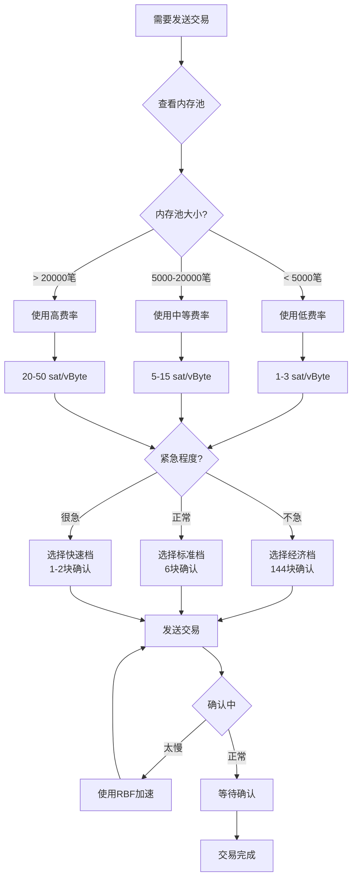
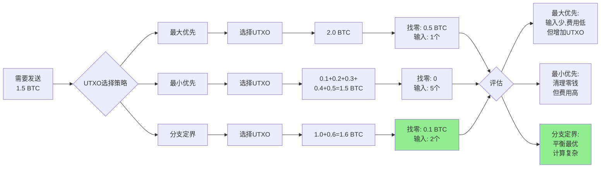

---
title: 比特币性能优化 - 10分钟讲解脚本
date: 2025-10-23
categories:
  - Technology
  - Learning
---

# 比特币性能优化 - 10分钟讲解脚本

## 开场 (30秒)

大家好,今天咱们聊聊比特币的性能优化。

说到比特币,很多人第一印象是"慢"、"贵"。每秒只能处理7笔交易,一笔转账动辄几十块钱手续费,牛市的时候更夸张,手续费能飙到几百块。这确实是事实,但不是全部真相。

其实比特币有很多性能优化的空间,从交易费用的优化、SegWit的使用,到UTXO的管理、批量支付的技巧,每一个环节都有优化的余地。我见过太多项目,因为不懂优化,白白浪费了几十个BTC的手续费,太可惜了。

今天我就从手续费优化、SegWit应用、UTXO管理这几个最实用的角度,给大家讲讲怎么让你的比特币交易又快又省钱。

## 第一部分:手续费优化——别让矿工赚太多 (2.5分钟)

先说最直接影响钱包的——**手续费**。

比特币的手续费不是固定的,是个自由市场。你出价高,矿工优先打包;出价低,可能要等好几天。关键是找到那个平衡点——既不会等太久,也不会多花冤枉钱。

**动态费率估算**是第一步。比特币节点有个 `estimatesmartfee` 命令,能根据当前网络状况给你建议费率。但这个估算不是万能的,有时候太保守,有时候又太激进,你得结合实际情况判断。

我的经验是:看内存池(Mempool)的拥堵程度。内存池就是那些等待打包的交易排队的地方。如果内存池里积压了5万笔交易,说明网络拥堵,费率得往上调;如果只有几千笔,那用最低费率也能很快确认。

有个网站叫 mempool.space,可以实时看到内存池状态和推荐费率,非常直观。比如现在显示"1 sat/vByte 可在 6 个区块内确认",你就知道不用花太多钱。如果显示"需要 50 sat/vByte 才能进下一个区块",那就等等,除非真的很急。

**UTXO管理**也很重要,这是个很容易被忽略的优化点。

UTXO 就是"未花费交易输出",你可以把它理解成钱包里的一张张钞票。每次收款,钱包里就多一张"钞票";每次花钱,要从这些"钞票"里选几张凑够金额。

问题来了:如果你的钱包里有100张小额UTXO,每次发送交易都要选很多个输入,交易就会很大,手续费就贵。打个比方,你要付100块钱,用一张100块的钞票,还是用100张1块的钞票?肯定是前者更方便对吧。

所以,定期"整理钱包"很有必要。在网络不拥堵、费率很低的时候(比如周末凌晨),把钱包里那些小额UTXO合并成大额的。这就像是把零钱换成整钞,下次用的时候就省事了。

```bash
# 查看钱包里的UTXO
bitcoin-cli listunspent

# 在费率低的时候整合
# 比如把10个小额UTXO发给自己,合并成1个
```

这个操作花点手续费,但长期来看是赚的,因为你后续的每笔交易都会更便宜。

**批量支付**是交易所和支付平台必备的优化技巧。

假设你要给100个人发钱,一笔一笔发,就是100笔交易,每笔都要付手续费。但如果你用批量支付,把这100个输出打包到一笔交易里,只需要付一次手续费,能省90%以上!

比特币有个 `sendmany` 命令,专门用来批量支付:
```bash
bitcoin-cli sendmany "" '{
  "地址1": 0.1,
  "地址2": 0.2,
  "地址3": 0.3
}'
```

我见过有交易所,每天要处理上万笔提现,通过批量支付,一个月能省几十个BTC的手续费。这笔钱可不少,值得花时间优化。

## 第二部分:SegWit——不用白不用的折扣 (2分钟)

说到性能优化,不得不提**SegWit(隔离见证)**。

SegWit 是2017年激活的软分叉,最大的好处就是**降低交易费用**。怎么降的?通过一个巧妙的设计——把交易签名(Witness)从交易主体中分离出来,放到一个单独的区域,这部分数据按75%的折扣计费。

具体点说,一个传统的(Legacy)比特币交易,输入大概 148 字节;用 SegWit 后,同样的输入只算 68 虚拟字节(vByte)。少了一半多!手续费是按字节算的,字节少了,自然就便宜了。

我做过一个对比:同样的交易,用 Legacy 地址(1开头)要花 20 美元手续费,用 SegWit 地址(bc1开头)只要 9 美元,省了一半多。这还只是普通交易,如果是多输入的交易,省的更多。

SegWit 有两种地址:
1. **P2SH-P2WPKH**(3开头):兼容性好,老钱包也能发送
2. **P2WPKH**(bc1开头,也叫 bech32):原生SegWit,最省钱,但有些老交易所不支持

现在大部分交易所和钱包都支持 bc1 地址了,如果你还在用 1 或 3 开头的地址,赶紧换吧,真的能省不少钱。

SegWit 还有个额外好处:**修复了交易可塑性问题**。这是什么意思?简单说,以前的比特币交易,TXID(交易哈希)可以被修改,导致一些复杂的合约(比如闪电网络)没法实现。SegWit 解决了这个问题,让闪电网络成为可能。

闪电网络是什么?就是比特币的二层支付网络,交易几乎瞬时完成,手续费只要几分钱。虽然现在还不够成熟,但未来肯定是比特币扩容的主要方向。所以用 SegWit,不仅省钱,还为未来做准备。

**怎么启用 SegWit?**

如果你用 Bitcoin Core 钱包,创建钱包的时候选择 bech32 地址类型:
```bash
bitcoin-cli createwallet "mywallet" false false "" false true
bitcoin-cli -rpcwallet=mywallet getnewaddress "" "bech32"
```

如果你用硬件钱包(Ledger、Trezor),在设置里选择 Native SegWit 就行。

## 第三部分:交易构造技巧——魔鬼在细节里 (2分钟)

除了 SegWit,还有一些交易构造的技巧能帮你省钱。

**RBF (Replace-By-Fee)** 是个很实用的功能。

有时候你发了一笔交易,费率设低了,好几个小时都没确认。怎么办?以前只能干等着,现在可以用 RBF"加速"——重新发一笔费率更高的交易,替换掉原来那笔。

但这个功能需要在创建交易的时候就开启,设置 sequence 为一个小于 0xfffffffe 的值。大部分钱包现在都默认开启了,你发送的时候留意一下就行。

有了 RBF,你就可以先用低费率试探,如果一直不确认,再加价。这样既不会因为出价太低浪费时间,也不会因为出价太高浪费钱,进可攻退可守。

**CPFP (Child-Pays-For-Parent)** 是另一个加速交易的办法。

如果你收到一笔未确认的钱,但你很急着要花,怎么办?可以用 CPFP——用这笔未确认的钱创建一笔新交易,手续费设高一点,矿工为了赚这笔高手续费,会把父交易和子交易一起打包。

举个例子:Alice 给你发了 1 BTC,但她费率设得太低了,交易卡了一天还没确认。你现在要用这 1 BTC,就可以创建一笔交易,花这 1 BTC 的同时,付高一点的手续费(比如 50 sat/vByte)。矿工看到这笔子交易,为了拿到高手续费,会把 Alice 的父交易一起打包,你就能收到钱了。

**UTXO 选择算法**也有讲究。

前面说了 UTXO 像钞票,那怎么选呢?有好几种策略:
- **最大优先**:先用大额UTXO,留下小额的以后用
- **最小优先**:先用小额UTXO,正好清理零钱
- **分支定界**:找到最优组合,最小化找零

比特币核心钱包用的是**分支定界算法**,尽量找到刚好够用的UTXO组合,减少找零,节省空间。但这个算法比较复杂,有时候还不如简单的"最大优先"策略快。

如果你自己写钱包,可以根据场景选择:
- 平时用最大优先,快速简单
- 网络拥堵时用分支定界,省手续费
- 定期整理时用最小优先,清理小额UTXO

## 第四部分:网络和存储优化——给节点提速 (1.5分钟)

如果你跑比特币节点,还有一些网络和存储层面的优化。

**节点连接优化**很重要。比特币节点默认连接125个peer,但不是越多越好。连接太多,带宽占用高,CPU也吃不消;连接太少,交易传播慢,可能错过好的价格。

我的建议是:保持40-50个高质量连接就够了。怎么判断质量?看延迟和区块高度。延迟低于500ms、区块高度跟你一致的,就是好节点;延迟超过1秒或者区块落后的,断开连接。

可以写个脚本,定期检查peer质量:
```bash
bitcoin-cli getpeerinfo | jq '.[] | {addr, pingtime, startingheight}'
```

把那些慢的peer断开:
```bash
bitcoin-cli disconnectnode "ip:port"
```

**交易广播策略**也有优化空间。发送交易的时候,选几个延迟最低的peer,并行发送,能更快地传播到全网。不要等一个个发,那样太慢了。

**存储优化**方面,最大的开销是区块链数据,现在已经600多G了。如果你不需要完整历史,可以用**修剪模式**(prune),只保留最近的区块,能省下90%的空间:
```bash
bitcoind -prune=10000  # 只保留10GB数据
```

但修剪模式有个缺点,就是不能查询很久以前的交易,也不能为其他节点提供完整的历史数据。所以看你的需求,如果只是个人钱包,修剪模式完全够用;如果是区块链浏览器,就得用完整节点了。

**数据库优化**也很关键。比特币用 LevelDB 存储UTXO集合,如果你的系统支持SSD,性能会提升好几倍。机械硬盘的随机读写性能太差,验证区块的时候会成为瓶颈。

还有就是内存缓存,Bitcoin Core 有个 `dbcache` 参数,默认是 450MB,如果你内存够,可以调大到 4GB 甚至更高,能显著提升同步速度:
```bash
bitcoind -dbcache=4096
```

初次同步的时候尤其有用,能把同步时间从一周缩短到一两天。

## 第五部分:实战案例与最佳实践 (1.5分钟)

最后分享几个实战案例。

**案例一:交易所的批量提现优化**

某交易所每天处理1万笔BTC提现,原来是一笔一笔发送,每天手续费大概2 BTC(当时费率比较高)。后来做了批量优化:
1. 每10分钟汇总一次提现请求
2. 把所有提现打包到一笔交易里
3. 使用 SegWit 地址和最优 UTXO 选择

优化后,每天手续费降到0.3 BTC,省了85%!一年省下几百个BTC,这笔钱可不是小数目。

**案例二:钱包的手续费智能推荐**

某钱包App 原来固定用 20 sat/vByte 的费率,用户抱怨有时候太慢,有时候又太贵。后来加了智能推荐:
1. 实时监控内存池状态
2. 提供三档选择:经济(144块)、正常(6块)、快速(1-2块)
3. 显示预计确认时间和手续费金额

用户满意度大幅提升,因为可以根据需求灵活选择,不急的用经济档,急的用快速档,体验好了很多。

**最佳实践总结**:
1. **默认使用 SegWit 地址**(bc1开头),省钱省空间
2. **监控内存池状态**,动态调整费率,不盲目出高价
3. **定期整理 UTXO**,在费率低的时候合并小额输出
4. **批量支付**能省则省,尤其是交易量大的业务
5. **启用 RBF**,费率设低了还能加价,更灵活
6. **运行节点的话优化连接和存储**,提升性能

还有一点:**关注比特币的技术更新**。比如未来可能激活的 Taproot,会进一步提升隐私和效率;闪电网络也在快速发展,小额支付可以完全走闪电网络,成本几乎为零。保持学习,才能用好比特币。

## 结尾总结 (30秒)

好,今天就分享到这。

总结一下:比特币性能优化不是玄学,都是实实在在的技术手段——用 SegWit 能省一半手续费,管好 UTXO 让交易更轻量,批量支付省90%的钱,RBF 和 CPFP 让交易更灵活。

这些优化看似琐碎,但积少成多,尤其是交易量大的项目,一年能省几十个BTC。在比特币的世界里,每一个聪(satoshi)都值得珍惜,毕竟只有2100万个BTC,能省则省。

希望今天的分享对大家有帮助。记住:不是比特币太贵,是你还没学会怎么优化!

谢谢大家!

---

## 补充资料(可选展开)

### 手续费计算公式

```
手续费 = 交易大小(vByte) × 费率(sat/vByte)
```

**Legacy 交易大小估算:**
```
大小 ≈ 10 + 输入数 × 148 + 输出数 × 34 字节
```

**SegWit 交易虚拟大小估算:**
```
vSize ≈ 10 + 输入数 × 68 + 输出数 × 34 vByte
```

**示例计算:**

场景:1个输入、2个输出(1个收款、1个找零)

- Legacy: 10 + 1×148 + 2×34 = 226 字节
- SegWit: 10 + 1×68 + 2×34 = 146 vByte

费率 10 sat/vByte:
- Legacy 手续费: 226 × 10 = 2260 satoshi (≈ $0.60)
- SegWit 手续费: 146 × 10 = 1460 satoshi (≈ $0.39)
- 节省: 35%

### 实时费率监控工具

1. **mempool.space**
   - 最直观的内存池浏览器
   - 实时费率推荐
   - 支持多语言

2. **bitcoinfees.earn.com**
   - 预测不同费率的确认时间
   - 历史费率趋势

3. **jochen-hoenicke.de/queue**
   - 内存池大小可视化
   - 按费率分层显示

### UTXO 管理脚本

```bash
#!/bin/bash
# utxo-consolidate.sh - UTXO整合脚本

# 1. 查看当前UTXO情况
echo "=== 当前UTXO统计 ==="
UTXO_COUNT=$(bitcoin-cli listunspent | jq 'length')
TOTAL_BTC=$(bitcoin-cli listunspent | jq '[.[].amount] | add')

echo "UTXO数量: $UTXO_COUNT"
echo "总金额: $TOTAL_BTC BTC"

# 2. 找出小额UTXO (小于0.001 BTC)
DUST_UTXOS=$(bitcoin-cli listunspent | jq '[.[] | select(.amount < 0.001)]')
DUST_COUNT=$(echo $DUST_UTXOS | jq 'length')

echo -e "\n小额UTXO数量: $DUST_COUNT"

if [ $DUST_COUNT -lt 5 ]; then
    echo "小额UTXO不多,暂不需要整合"
    exit 0
fi

# 3. 检查当前费率
CURRENT_FEE=$(bitcoin-cli estimatesmartfee 144 | jq '.feerate')

echo -e "\n当前费率: $CURRENT_FEE BTC/KB"

# 询问是否继续
read -p "是否整合小额UTXO? (y/n) " -n 1 -r
echo
if [[ ! $REPLY =~ ^[Yy]$ ]]; then
    exit 0
fi

# 4. 获取找零地址
CHANGE_ADDR=$(bitcoin-cli getrawchangeaddress)

# 5. 创建整合交易
# 选择所有小额UTXO,发送到找零地址
TXID=$(bitcoin-cli sendtoaddress $CHANGE_ADDR 0.001 "" "" true true 1)

echo "整合交易已发送: $TXID"
echo "建议等待确认后检查UTXO情况"
```

### Mermaid 流程图:费率选择决策



### Mermaid 流程图:UTXO选择算法对比



### SegWit vs Legacy 详细对比

| 特性 | Legacy (P2PKH) | SegWit (P2WPKH) | 节省 |
|------|---------------|----------------|------|
| 地址格式 | 1开头 | bc1开头 | N/A |
| 输入大小 | ~148 bytes | ~68 vBytes | 54% |
| 签名位置 | scriptSig | witness | N/A |
| 交易可塑性 | 存在 | 已修复 | N/A |
| 闪电网络 | 不支持 | 支持 | N/A |
| 手续费(1输入2输出,10 sat/vB) | 2260 sat | 1460 sat | 35% |
| 年费用(1000笔交易,平均费率) | ~$600 | ~$390 | $210 |

### 批量支付节省计算

**场景**: 给100人每人发送0.01 BTC

**单独发送**:
```
每笔交易: 1输入 + 2输出 = 10 + 68 + 68 = 146 vByte
100笔交易: 146 × 100 = 14600 vByte
费率 10 sat/vByte: 146000 satoshi = 0.00146 BTC
```

**批量发送**:
```
1笔交易: 1输入 + 100输出 = 10 + 68 + 3400 = 3478 vByte
费率 10 sat/vByte: 34780 satoshi = 0.0003478 BTC
```

**节省**:
```
0.00146 - 0.0003478 = 0.0011122 BTC (76% 节省!)
按 BTC = $40000 计算: 节省 $44.5
```

### 交易费用优化检查清单

#### 发送前检查
- [ ] 是否使用 SegWit 地址?
- [ ] 当前网络拥堵程度如何?
- [ ] 选择的费率是否合理?
- [ ] 是否启用了 RBF?
- [ ] 能否等到费率更低时发送?

#### UTXO 管理
- [ ] UTXO 数量是否过多(>20个)?
- [ ] 是否有大量小额 UTXO(<$10)?
- [ ] 上次整合时间是否超过3个月?
- [ ] 当前费率是否适合整合(<5 sat/vB)?

#### 批量操作
- [ ] 是否有多笔待发送交易可合并?
- [ ] 批量发送能节省多少费用?
- [ ] 接收方是否都支持批量接收?

#### 节点性能
- [ ] 节点连接数是否合理(40-50)?
- [ ] 慢速peer是否已断开?
- [ ] dbcache 是否足够(推荐4GB)?
- [ ] 是否使用SSD存储?

### 推荐的费率设置(当前网络状况)

| 紧急程度 | 目标确认时间 | 推荐费率 | 说明 |
|---------|------------|---------|------|
| 不急 | 1-2天(144块) | 1-3 sat/vB | 周末深夜,费率最低 |
| 正常 | 1小时(6块) | 5-10 sat/vB | 工作日白天 |
| 较急 | 30分钟(3块) | 15-25 sat/vB | 网络繁忙时段 |
| 很急 | 下一区块(1块) | 30-50 sat/vB | 牛市高峰期可能更高 |
| 紧急 | 立即确认 | 50+ sat/vB | 仅在必要时使用 |

注:以上费率会根据网络状况实时变化,使用前请查看 mempool.space

### 性能优化效果预估

**小型个人钱包**(每月10笔交易):
- 使用 SegWit: 年省 ~$50
- UTXO管理: 年省 ~$20
- 总节省: ~$70

**中型商户**(每天100笔交易):
- 使用 SegWit: 年省 ~$18000
- 批量支付: 年省 ~$50000
- UTXO管理: 年省 ~$2000
- 总节省: ~$70000

**大型交易所**(每天10000笔交易):
- 使用 SegWit: 年省 ~$1.8M
- 批量支付: 年省 ~$5M
- UTXO管理: 年省 ~$200K
- 总节省: ~$7M

*(按平均费率 10 sat/vB 和 BTC = $40000 计算)*
