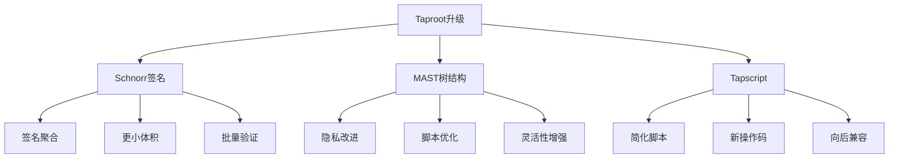
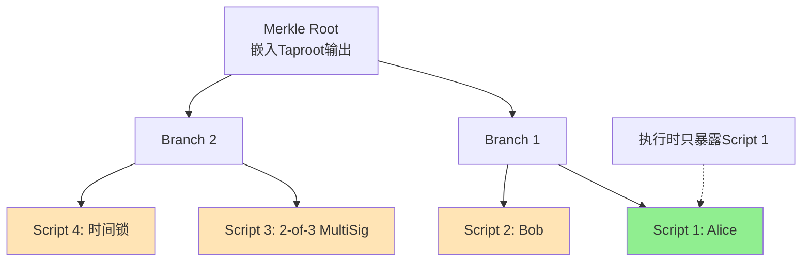

# 比特币Taproot升级详解

## 1. Taproot升级概述

### 1.1 什么是Taproot

Taproot是比特币在2021年11月激活的重大升级,通过BIP340、BIP341、BIP342三个提案实现:
- **BIP340**: Schnorr签名标准
- **BIP341**: Taproot输出和脚本树
- **BIP342**: Tapscript脚本语言

### 1.2 Taproot的三大核心特性



### 1.3 Taproot的优势

| 特性 | 升级前 | Taproot后 |
|-----|-------|-----------|
| 签名算法 | ECDSA | Schnorr |
| 多签隐私 | 可识别 | 不可区分 |
| 签名大小 | 71-73字节 | 64字节固定 |
| 复杂脚本 | 全部暴露 | 仅暴露执行路径 |
| 批量验证 | 不支持 | 支持 |

## 2. Schnorr签名详解

### 2.1 Schnorr vs ECDSA

**ECDSA的局限性**:
- 签名不可线性组合
- 签名大小不固定(71-73字节)
- 无法批量验证
- 多签场景复杂

**Schnorr的优势**:
- 可证明安全性(在离散对数困难性假设下)
- 签名聚合: 多个签名可合并为一个
- 固定64字节签名
- 支持批量验证

### 2.2 Schnorr签名Java实现

```java
import java.math.BigInteger;
import java.security.MessageDigest;
import java.security.SecureRandom;

/**
 * Schnorr签名实现
 */
public class SchnorrSignature {

    // secp256k1曲线参数
    private static final BigInteger P = new BigInteger(
        "FFFFFFFFFFFFFFFFFFFFFFFFFFFFFFFFFFFFFFFFFFFFFFFFFFFFFFFEFFFFFC2F", 16);
    private static final BigInteger N = new BigInteger(
        "FFFFFFFFFFFFFFFFFFFFFFFFFFFFFFFEBAAEDCE6AF48A03BBFD25E8CD0364141", 16);
    private static final BigInteger G_X = new BigInteger(
        "79BE667EF9DCBBAC55A06295CE870B07029BFCDB2DCE28D959F2815B16F81798", 16);
    private static final BigInteger G_Y = new BigInteger(
        "483ADA7726A3C4655DA4FBFC0E1108A8FD17B448A68554199C47D08FFB10D4B8", 16);

    private BigInteger privateKey;
    private ECPoint publicKey;

    /**
     * 生成密钥对
     */
    public static class KeyPair {
        public BigInteger privateKey;
        public ECPoint publicKey;

        public KeyPair(BigInteger privKey) {
            this.privateKey = privKey;
            this.publicKey = ECPoint.multiply(ECPoint.G, privKey);
        }
    }

    /**
     * EC点表示
     */
    public static class ECPoint {
        public static final ECPoint G = new ECPoint(G_X, G_Y);
        public BigInteger x;
        public BigInteger y;

        public ECPoint(BigInteger x, BigInteger y) {
            this.x = x;
            this.y = y;
        }

        /**
         * 点乘运算
         */
        public static ECPoint multiply(ECPoint point, BigInteger scalar) {
            // 简化实现,实际需要使用double-and-add算法
            ECPoint result = null;
            ECPoint temp = point;

            while (scalar.compareTo(BigInteger.ZERO) > 0) {
                if (scalar.testBit(0)) {
                    result = (result == null) ? temp : add(result, temp);
                }
                temp = add(temp, temp);
                scalar = scalar.shiftRight(1);
            }
            return result;
        }

        /**
         * 点加运算
         */
        public static ECPoint add(ECPoint p1, ECPoint p2) {
            // 简化实现
            if (p1 == null) return p2;
            if (p2 == null) return p1;

            BigInteger lambda;
            if (p1.x.equals(p2.x)) {
                if (p1.y.equals(p2.y)) {
                    // 点加倍
                    lambda = p1.x.pow(2).multiply(BigInteger.valueOf(3))
                        .multiply(p1.y.multiply(BigInteger.TWO).modInverse(P)).mod(P);
                } else {
                    return null; // 无穷远点
                }
            } else {
                // 点加法
                lambda = p2.y.subtract(p1.y)
                    .multiply(p2.x.subtract(p1.x).modInverse(P)).mod(P);
            }

            BigInteger x3 = lambda.pow(2).subtract(p1.x).subtract(p2.x).mod(P);
            BigInteger y3 = lambda.multiply(p1.x.subtract(x3)).subtract(p1.y).mod(P);

            return new ECPoint(x3, y3);
        }

        /**
         * 序列化公钥(32字节x坐标)
         */
        public byte[] serialize() {
            byte[] xBytes = x.toByteArray();
            byte[] result = new byte[32];

            int startPos = Math.max(0, xBytes.length - 32);
            int destPos = Math.max(0, 32 - xBytes.length);
            System.arraycopy(xBytes, startPos, result, destPos,
                Math.min(32, xBytes.length));

            return result;
        }
    }

    /**
     * Schnorr签名
     */
    public static class Signature {
        public BigInteger r; // 32字节
        public BigInteger s; // 32字节

        public Signature(BigInteger r, BigInteger s) {
            this.r = r;
            this.s = s;
        }

        /**
         * 序列化为64字节
         */
        public byte[] serialize() {
            byte[] result = new byte[64];
            byte[] rBytes = r.toByteArray();
            byte[] sBytes = s.toByteArray();

            // R值(前32字节)
            int rStart = Math.max(0, rBytes.length - 32);
            int rDest = Math.max(0, 32 - rBytes.length);
            System.arraycopy(rBytes, rStart, result, rDest,
                Math.min(32, rBytes.length));

            // S值(后32字节)
            int sStart = Math.max(0, sBytes.length - 32);
            int sDest = 32 + Math.max(0, 32 - sBytes.length);
            System.arraycopy(sBytes, sStart, result, sDest,
                Math.min(32, sBytes.length));

            return result;
        }
    }

    /**
     * 生成签名
     */
    public static Signature sign(BigInteger privateKey, byte[] message)
            throws Exception {
        SecureRandom random = new SecureRandom();

        // 1. 生成随机数k
        BigInteger k = new BigInteger(256, random).mod(N);
        if (k.equals(BigInteger.ZERO)) {
            k = BigInteger.ONE;
        }

        // 2. 计算R = k*G
        ECPoint R = ECPoint.multiply(ECPoint.G, k);
        BigInteger r = R.x.mod(N);

        // 3. 计算挑战值 e = H(r || P || m)
        ECPoint P = ECPoint.multiply(ECPoint.G, privateKey);
        MessageDigest sha256 = MessageDigest.getInstance("SHA-256");
        sha256.update(R.serialize());
        sha256.update(P.serialize());
        sha256.update(message);
        byte[] eBytes = sha256.digest();
        BigInteger e = new BigInteger(1, eBytes).mod(N);

        // 4. 计算 s = k + e*d (mod n)
        BigInteger s = k.add(e.multiply(privateKey)).mod(N);

        return new Signature(r, s);
    }

    /**
     * 验证签名
     */
    public static boolean verify(ECPoint publicKey, byte[] message,
            Signature signature) throws Exception {
        // 1. 计算挑战值 e = H(r || P || m)
        MessageDigest sha256 = MessageDigest.getInstance("SHA-256");
        byte[] rBytes = signature.r.toByteArray();
        byte[] r32 = new byte[32];
        System.arraycopy(rBytes, Math.max(0, rBytes.length - 32), r32,
            Math.max(0, 32 - rBytes.length), Math.min(32, rBytes.length));

        sha256.update(r32);
        sha256.update(publicKey.serialize());
        sha256.update(message);
        byte[] eBytes = sha256.digest();
        BigInteger e = new BigInteger(1, eBytes).mod(N);

        // 2. 计算 R' = s*G - e*P
        ECPoint sG = ECPoint.multiply(ECPoint.G, signature.s);
        ECPoint eP = ECPoint.multiply(publicKey, e);
        ECPoint negEP = new ECPoint(eP.x, P.subtract(eP.y).mod(P));
        ECPoint RPrime = ECPoint.add(sG, negEP);

        // 3. 验证 R'.x == r
        return RPrime != null && RPrime.x.mod(N).equals(signature.r);
    }

    /**
     * 使用示例
     */
    public static void main(String[] args) throws Exception {
        System.out.println("=== Schnorr签名示例 ===\n");

        // 生成密钥对
        SecureRandom random = new SecureRandom();
        BigInteger privateKey = new BigInteger(256, random).mod(N);
        KeyPair keyPair = new KeyPair(privateKey);

        System.out.println("私钥: " + privateKey.toString(16));
        System.out.println("公钥X: " + keyPair.publicKey.x.toString(16));
        System.out.println();

        // 签名消息
        String messageStr = "Hello Taproot!";
        byte[] message = messageStr.getBytes();

        Signature signature = sign(privateKey, message);
        System.out.println("消息: " + messageStr);
        System.out.println("签名R: " + signature.r.toString(16));
        System.out.println("签名S: " + signature.s.toString(16));
        System.out.println("签名大小: " + signature.serialize().length + " 字节");
        System.out.println();

        // 验证签名
        boolean valid = verify(keyPair.publicKey, message, signature);
        System.out.println("签名验证: " + (valid ? "✓ 有效" : "✗ 无效"));
    }
}
```

### 2.3 签名聚合

**MuSig协议**实现多方签名聚合:

```java
import java.util.*;

/**
 * MuSig多签聚合实现
 */
public class MuSigAggregation {

    /**
     * 聚合公钥
     */
    public static SchnorrSignature.ECPoint aggregatePublicKeys(
            List<SchnorrSignature.ECPoint> publicKeys) throws Exception {

        if (publicKeys.isEmpty()) {
            throw new IllegalArgumentException("公钥列表不能为空");
        }

        // 1. 计算公钥哈希
        MessageDigest sha256 = MessageDigest.getInstance("SHA-256");
        for (SchnorrSignature.ECPoint pk : publicKeys) {
            sha256.update(pk.serialize());
        }
        byte[] L = sha256.digest();

        // 2. 计算每个公钥的系数
        SchnorrSignature.ECPoint aggPubKey = null;

        for (SchnorrSignature.ECPoint pk : publicKeys) {
            // ai = H(L || pki)
            sha256.reset();
            sha256.update(L);
            sha256.update(pk.serialize());
            BigInteger ai = new BigInteger(1, sha256.digest())
                .mod(SchnorrSignature.KeyPair.N);

            // P_agg += ai * pki
            SchnorrSignature.ECPoint weighted =
                SchnorrSignature.ECPoint.multiply(pk, ai);
            aggPubKey = (aggPubKey == null) ? weighted :
                SchnorrSignature.ECPoint.add(aggPubKey, weighted);
        }

        return aggPubKey;
    }

    /**
     * MuSig签名会话
     */
    public static class SigningSession {
        private List<SchnorrSignature.ECPoint> publicKeys;
        private List<SchnorrSignature.ECPoint> commitments; // Ri值
        private SchnorrSignature.ECPoint aggregatedR;

        public SigningSession(List<SchnorrSignature.ECPoint> publicKeys) {
            this.publicKeys = publicKeys;
            this.commitments = new ArrayList<>();
        }

        /**
         * 第一轮: 每个签名者生成承诺
         */
        public SchnorrSignature.ECPoint generateCommitment(BigInteger nonce) {
            SchnorrSignature.ECPoint R =
                SchnorrSignature.ECPoint.multiply(SchnorrSignature.ECPoint.G, nonce);
            commitments.add(R);
            return R;
        }

        /**
         * 第二轮: 聚合所有承诺
         */
        public void aggregateCommitments() {
            aggregatedR = null;
            for (SchnorrSignature.ECPoint R : commitments) {
                aggregatedR = (aggregatedR == null) ? R :
                    SchnorrSignature.ECPoint.add(aggregatedR, R);
            }
        }

        /**
         * 第三轮: 生成部分签名
         */
        public BigInteger generatePartialSignature(
                BigInteger privateKey,
                BigInteger nonce,
                byte[] message) throws Exception {

            // 计算聚合公钥
            SchnorrSignature.ECPoint aggPubKey =
                aggregatePublicKeys(publicKeys);

            // 计算挑战值
            MessageDigest sha256 = MessageDigest.getInstance("SHA-256");
            sha256.update(aggregatedR.serialize());
            sha256.update(aggPubKey.serialize());
            sha256.update(message);
            BigInteger e = new BigInteger(1, sha256.digest())
                .mod(SchnorrSignature.KeyPair.N);

            // 计算公钥系数
            sha256.reset();
            for (SchnorrSignature.ECPoint pk : publicKeys) {
                sha256.update(pk.serialize());
            }
            byte[] L = sha256.digest();

            SchnorrSignature.ECPoint myPubKey =
                SchnorrSignature.ECPoint.multiply(SchnorrSignature.ECPoint.G, privateKey);
            sha256.reset();
            sha256.update(L);
            sha256.update(myPubKey.serialize());
            BigInteger ai = new BigInteger(1, sha256.digest())
                .mod(SchnorrSignature.KeyPair.N);

            // si = ki + e * ai * di
            BigInteger si = nonce.add(e.multiply(ai).multiply(privateKey))
                .mod(SchnorrSignature.KeyPair.N);

            return si;
        }

        /**
         * 第四轮: 聚合部分签名
         */
        public SchnorrSignature.Signature aggregateSignatures(
                List<BigInteger> partialSignatures) {

            BigInteger s = BigInteger.ZERO;
            for (BigInteger si : partialSignatures) {
                s = s.add(si).mod(SchnorrSignature.KeyPair.N);
            }

            return new SchnorrSignature.Signature(aggregatedR.x.mod(SchnorrSignature.KeyPair.N), s);
        }
    }

    /**
     * 使用示例
     */
    public static void main(String[] args) throws Exception {
        System.out.println("=== MuSig 2-of-2多签示例 ===\n");

        // 两个签名者
        SecureRandom random = new SecureRandom();
        BigInteger privKey1 = new BigInteger(256, random)
            .mod(SchnorrSignature.KeyPair.N);
        BigInteger privKey2 = new BigInteger(256, random)
            .mod(SchnorrSignature.KeyPair.N);

        SchnorrSignature.KeyPair keyPair1 = new SchnorrSignature.KeyPair(privKey1);
        SchnorrSignature.KeyPair keyPair2 = new SchnorrSignature.KeyPair(privKey2);

        List<SchnorrSignature.ECPoint> publicKeys = Arrays.asList(
            keyPair1.publicKey,
            keyPair2.publicKey
        );

        // 聚合公钥
        SchnorrSignature.ECPoint aggPubKey = aggregatePublicKeys(publicKeys);
        System.out.println("聚合公钥X: " + aggPubKey.x.toString(16).substring(0, 16) + "...");
        System.out.println();

        // 创建签名会话
        SigningSession session = new SigningSession(publicKeys);

        // 第一轮: 生成nonce和承诺
        BigInteger nonce1 = new BigInteger(256, random)
            .mod(SchnorrSignature.KeyPair.N);
        BigInteger nonce2 = new BigInteger(256, random)
            .mod(SchnorrSignature.KeyPair.N);

        session.generateCommitment(nonce1);
        session.generateCommitment(nonce2);

        // 第二轮: 聚合承诺
        session.aggregateCommitments();

        // 第三轮: 生成部分签名
        byte[] message = "2-of-2 MultiSig Transaction".getBytes();
        BigInteger partialSig1 = session.generatePartialSignature(
            privKey1, nonce1, message);
        BigInteger partialSig2 = session.generatePartialSignature(
            privKey2, nonce2, message);

        System.out.println("部分签名1: " + partialSig1.toString(16).substring(0, 16) + "...");
        System.out.println("部分签名2: " + partialSig2.toString(16).substring(0, 16) + "...");
        System.out.println();

        // 第四轮: 聚合签名
        SchnorrSignature.Signature finalSignature = session.aggregateSignatures(
            Arrays.asList(partialSig1, partialSig2)
        );

        System.out.println("聚合签名R: " + finalSignature.r.toString(16).substring(0, 16) + "...");
        System.out.println("聚合签名S: " + finalSignature.s.toString(16).substring(0, 16) + "...");
        System.out.println("签名大小: 64字节");
        System.out.println();

        // 验证签名
        boolean valid = SchnorrSignature.verify(aggPubKey, message, finalSignature);
        System.out.println("签名验证: " + (valid ? "✓ 有效" : "✗ 无效"));
        System.out.println("\n💡 优势: 2-of-2多签看起来和单签名一样!");
    }
}
```

## 3. MAST (Merklized Abstract Syntax Trees)

### 3.1 MAST原理

MAST允许将复杂脚本组织成Merkle树,只需暴露执行的分支:



**优势**:
- **隐私**: 未执行的脚本分支不会暴露
- **效率**: 只需验证一条Merkle路径
- **灵活性**: 支持任意复杂的脚本组合

### 3.2 Taproot输出结构

```
Taproot输出地址 = P + H(P||root)*G

其中:
- P: 内部公钥(key path)
- root: MAST树根
- H(): 标签化哈希函数
```

### 3.3 MAST树Java实现

```java
import java.util.*;

/**
 * MAST树实现
 */
public class MASTTree {

    /**
     * 脚本叶子节点
     */
    public static class ScriptLeaf {
        private byte[] script;
        private int version;

        public ScriptLeaf(byte[] script, int version) {
            this.script = script;
            this.version = version;
        }

        /**
         * 计算叶子哈希
         */
        public byte[] getLeafHash() throws Exception {
            MessageDigest sha256 = MessageDigest.getInstance("SHA-256");

            // TapLeaf = TaggedHash("TapLeaf", version || script_size || script)
            byte[] tag = "TapLeaf".getBytes();
            byte[] tagHash = sha256.digest(tag);

            sha256.reset();
            sha256.update(tagHash);
            sha256.update(tagHash);
            sha256.update(new byte[]{(byte) version});
            sha256.update(encodeCompactSize(script.length));
            sha256.update(script);

            return sha256.digest();
        }

        public byte[] getScript() {
            return script;
        }
    }

    /**
     * MAST树节点
     */
    public static class MerkleNode {
        private byte[] hash;
        private MerkleNode left;
        private MerkleNode right;
        private ScriptLeaf leaf;

        // 叶子节点
        public MerkleNode(ScriptLeaf leaf) throws Exception {
            this.leaf = leaf;
            this.hash = leaf.getLeafHash();
        }

        // 分支节点
        public MerkleNode(MerkleNode left, MerkleNode right) throws Exception {
            this.left = left;
            this.right = right;
            this.hash = computeBranchHash(left.hash, right.hash);
        }

        private byte[] computeBranchHash(byte[] left, byte[] right) throws Exception {
            MessageDigest sha256 = MessageDigest.getInstance("SHA-256");

            // TapBranch = TaggedHash("TapBranch", left || right)
            // 注意: left和right需要按字典序排序
            byte[] first = left;
            byte[] second = right;

            if (compareBytes(left, right) > 0) {
                first = right;
                second = left;
            }

            byte[] tag = "TapBranch".getBytes();
            byte[] tagHash = sha256.digest(tag);

            sha256.reset();
            sha256.update(tagHash);
            sha256.update(tagHash);
            sha256.update(first);
            sha256.update(second);

            return sha256.digest();
        }

        public byte[] getHash() {
            return hash;
        }

        public boolean isLeaf() {
            return leaf != null;
        }

        public ScriptLeaf getLeaf() {
            return leaf;
        }
    }

    /**
     * Taproot输出
     */
    public static class TaprootOutput {
        private SchnorrSignature.ECPoint internalPubKey; // P
        private MerkleNode mastRoot; // Merkle树根
        private SchnorrSignature.ECPoint outputPubKey; // Q = P + H(P||root)*G

        public TaprootOutput(SchnorrSignature.ECPoint internalPubKey,
                            MerkleNode mastRoot) throws Exception {
            this.internalPubKey = internalPubKey;
            this.mastRoot = mastRoot;
            this.outputPubKey = computeOutputPubKey();
        }

        /**
         * 计算Taproot输出公钥
         * Q = P + H(P || root) * G
         */
        private SchnorrSignature.ECPoint computeOutputPubKey() throws Exception {
            MessageDigest sha256 = MessageDigest.getInstance("SHA-256");

            // t = TaggedHash("TapTweak", P || root)
            byte[] tag = "TapTweak".getBytes();
            byte[] tagHash = sha256.digest(tag);

            sha256.reset();
            sha256.update(tagHash);
            sha256.update(tagHash);
            sha256.update(internalPubKey.serialize());
            if (mastRoot != null) {
                sha256.update(mastRoot.getHash());
            }

            BigInteger t = new BigInteger(1, sha256.digest())
                .mod(SchnorrSignature.KeyPair.N);

            // Q = P + t*G
            SchnorrSignature.ECPoint tG =
                SchnorrSignature.ECPoint.multiply(SchnorrSignature.ECPoint.G, t);
            return SchnorrSignature.ECPoint.add(internalPubKey, tG);
        }

        /**
         * 生成Taproot地址 (bech32m, bc1p...)
         */
        public String getAddress() {
            byte[] pubKeyBytes = outputPubKey.serialize();
            // 简化: 返回hex格式,实际应使用bech32m编码
            return "bc1p" + bytesToHex(pubKeyBytes).substring(0, 52) + "...";
        }

        public SchnorrSignature.ECPoint getOutputPubKey() {
            return outputPubKey;
        }

        public MerkleNode getMastRoot() {
            return mastRoot;
        }
    }

    /**
     * Merkle证明
     */
    public static class MerkleProof {
        private List<byte[]> siblings; // 兄弟节点哈希
        private List<Boolean> positions; // true=右, false=左

        public MerkleProof() {
            this.siblings = new ArrayList<>();
            this.positions = new ArrayList<>();
        }

        public void addSibling(byte[] siblingHash, boolean isRight) {
            siblings.add(siblingHash);
            positions.add(isRight);
        }

        /**
         * 验证Merkle证明
         */
        public boolean verify(byte[] leafHash, byte[] rootHash) throws Exception {
            byte[] currentHash = leafHash;

            for (int i = 0; i < siblings.size(); i++) {
                byte[] sibling = siblings.get(i);
                boolean isRight = positions.get(i);

                MessageDigest sha256 = MessageDigest.getInstance("SHA-256");
                byte[] tag = "TapBranch".getBytes();
                byte[] tagHash = sha256.digest(tag);

                byte[] left = isRight ? currentHash : sibling;
                byte[] right = isRight ? sibling : currentHash;

                // 按字典序排序
                if (compareBytes(left, right) > 0) {
                    byte[] temp = left;
                    left = right;
                    right = temp;
                }

                sha256.reset();
                sha256.update(tagHash);
                sha256.update(tagHash);
                sha256.update(left);
                sha256.update(right);

                currentHash = sha256.digest();
            }

            return Arrays.equals(currentHash, rootHash);
        }

        public List<byte[]> getSiblings() {
            return siblings;
        }
    }

    /**
     * 构建MAST树
     */
    public static MerkleNode buildTree(List<ScriptLeaf> leaves) throws Exception {
        if (leaves.isEmpty()) {
            throw new IllegalArgumentException("叶子节点不能为空");
        }

        // 构建叶子节点
        List<MerkleNode> nodes = new ArrayList<>();
        for (ScriptLeaf leaf : leaves) {
            nodes.add(new MerkleNode(leaf));
        }

        // 递归构建树
        while (nodes.size() > 1) {
            List<MerkleNode> parentNodes = new ArrayList<>();
            for (int i = 0; i < nodes.size(); i += 2) {
                if (i + 1 < nodes.size()) {
                    parentNodes.add(new MerkleNode(nodes.get(i), nodes.get(i + 1)));
                } else {
                    // 奇数个节点,最后一个上移
                    parentNodes.add(nodes.get(i));
                }
            }
            nodes = parentNodes;
        }

        return nodes.get(0);
    }

    /**
     * 生成Merkle证明
     */
    public static MerkleProof generateProof(MerkleNode root, ScriptLeaf targetLeaf)
            throws Exception {
        MerkleProof proof = new MerkleProof();
        findLeafAndBuildProof(root, targetLeaf, proof);
        return proof;
    }

    private static boolean findLeafAndBuildProof(MerkleNode node,
            ScriptLeaf targetLeaf, MerkleProof proof) throws Exception {

        if (node.isLeaf()) {
            return Arrays.equals(node.getLeaf().script, targetLeaf.script);
        }

        // 尝试左子树
        if (node.left != null && findLeafAndBuildProof(node.left, targetLeaf, proof)) {
            if (node.right != null) {
                proof.addSibling(node.right.getHash(), true);
            }
            return true;
        }

        // 尝试右子树
        if (node.right != null && findLeafAndBuildProof(node.right, targetLeaf, proof)) {
            if (node.left != null) {
                proof.addSibling(node.left.getHash(), false);
            }
            return true;
        }

        return false;
    }

    // 辅助方法
    private static byte[] encodeCompactSize(long value) {
        if (value < 253) {
            return new byte[]{(byte) value};
        } else if (value <= 0xFFFF) {
            return new byte[]{(byte) 253, (byte) value, (byte) (value >> 8)};
        }
        // 更大的值省略
        return new byte[]{(byte) 253, (byte) value, (byte) (value >> 8)};
    }

    private static int compareBytes(byte[] a, byte[] b) {
        for (int i = 0; i < Math.min(a.length, b.length); i++) {
            int cmp = Integer.compare(a[i] & 0xFF, b[i] & 0xFF);
            if (cmp != 0) return cmp;
        }
        return Integer.compare(a.length, b.length);
    }

    private static String bytesToHex(byte[] bytes) {
        StringBuilder sb = new StringBuilder();
        for (byte b : bytes) {
            sb.append(String.format("%02x", b));
        }
        return sb.toString();
    }

    /**
     * 使用示例
     */
    public static void main(String[] args) throws Exception {
        System.out.println("=== MAST树示例 ===\n");

        // 创建多个脚本分支
        ScriptLeaf script1 = new ScriptLeaf(
            "OP_CHECKSIG Alice".getBytes(), 0xC0);
        ScriptLeaf script2 = new ScriptLeaf(
            "OP_CHECKSIG Bob".getBytes(), 0xC0);
        ScriptLeaf script3 = new ScriptLeaf(
            "2 <Alice> <Bob> <Charlie> 3 OP_CHECKMULTISIG".getBytes(), 0xC0);
        ScriptLeaf script4 = new ScriptLeaf(
            "144 OP_CHECKSEQUENCEVERIFY OP_CHECKSIG Recovery".getBytes(), 0xC0);

        List<ScriptLeaf> leaves = Arrays.asList(script1, script2, script3, script4);

        // 构建MAST树
        MerkleNode root = buildTree(leaves);
        System.out.println("MAST树根: " + bytesToHex(root.getHash()).substring(0, 16) + "...");
        System.out.println();

        // 生成内部公钥
        SecureRandom random = new SecureRandom();
        BigInteger privKey = new BigInteger(256, random)
            .mod(SchnorrSignature.KeyPair.N);
        SchnorrSignature.KeyPair keyPair = new SchnorrSignature.KeyPair(privKey);

        // 创建Taproot输出
        TaprootOutput taproot = new TaprootOutput(keyPair.publicKey, root);
        System.out.println("内部公钥: " + keyPair.publicKey.x.toString(16).substring(0, 16) + "...");
        System.out.println("Taproot地址: " + taproot.getAddress());
        System.out.println();

        // 生成Alice脚本的Merkle证明
        MerkleProof proof = generateProof(root, script1);
        System.out.println("Alice脚本的Merkle证明:");
        System.out.println("- 证明路径长度: " + proof.getSiblings().size());

        // 验证证明
        boolean valid = proof.verify(script1.getLeafHash(), root.getHash());
        System.out.println("- 证明验证: " + (valid ? "✓ 有效" : "✗ 无效"));
        System.out.println();

        // 计算节省的空间
        int totalScriptSize = 0;
        for (ScriptLeaf leaf : leaves) {
            totalScriptSize += leaf.getScript().length;
        }
        int revealedSize = script1.getScript().length + proof.getSiblings().size() * 32;

        System.out.println("💡 空间节省:");
        System.out.println("- 全部脚本大小: " + totalScriptSize + " 字节");
        System.out.println("- 实际暴露大小: " + revealedSize + " 字节");
        System.out.println("- 节省比例: " +
            String.format("%.1f%%", (1.0 - (double)revealedSize/totalScriptSize) * 100));
    }
}
```

## 4. Tapscript

### 4.1 Tapscript改进

Tapscript是Bitcoin Script的升级版本,主要改进:

| 特性 | Legacy Script | Tapscript |
|-----|--------------|-----------|
| 签名验证 | OP_CHECKSIG (ECDSA) | OP_CHECKSIG (Schnorr) |
| 公钥格式 | 33字节压缩 | 32字节x-only |
| 脚本大小限制 | 10,000字节 | 10,000字节 |
| OP_SUCCESS | 不存在 | 预留未来升级 |
| 签名哈希 | SIGHASH flags | 改进的sighash |

### 4.2 新的OP_CHECKSIG

```java
/**
 * Tapscript中的OP_CHECKSIG实现
 */
public class TapscriptOpCheckSig {

    /**
     * Tapscript签名哈希计算
     */
    public static byte[] computeSigHash(
            Transaction tx,
            int inputIndex,
            List<TxOutput> prevouts,
            int sigHashType) throws Exception {

        MessageDigest sha256 = MessageDigest.getInstance("SHA-256");

        // Taproot签名哈希使用BIP341定义的新格式
        ByteArrayOutputStream bos = new ByteArrayOutputStream();

        // 1. 基础字段
        bos.write(0x00); // epoch
        bos.write(sigHashType & 0xFF); // hash type
        bos.write(intToBytes(tx.version));
        bos.write(intToBytes(tx.lockTime));

        // 2. 如果不是ANYONECANPAY,包含所有输入
        if ((sigHashType & 0x80) == 0) {
            // sha_prevouts
            MessageDigest prevoutHash = MessageDigest.getInstance("SHA-256");
            for (TxInput input : tx.inputs) {
                prevoutHash.update(input.prevTxId);
                prevoutHash.update(intToBytes(input.prevIndex));
            }
            bos.write(sha256.digest(prevoutHash.digest()));

            // sha_amounts
            MessageDigest amountHash = MessageDigest.getInstance("SHA-256");
            for (TxOutput prevout : prevouts) {
                amountHash.update(longToBytes(prevout.amount));
            }
            bos.write(sha256.digest(amountHash.digest()));

            // sha_scriptpubkeys
            MessageDigest scriptHash = MessageDigest.getInstance("SHA-256");
            for (TxOutput prevout : prevouts) {
                scriptHash.update(prevout.scriptPubKey);
            }
            bos.write(sha256.digest(scriptHash.digest()));

            // sha_sequences
            MessageDigest seqHash = MessageDigest.getInstance("SHA-256");
            for (TxInput input : tx.inputs) {
                seqHash.update(intToBytes(input.sequence));
            }
            bos.write(sha256.digest(seqHash.digest()));
        }

        // 3. 如果不是SINGLE或NONE,包含所有输出
        int sigHashTypeBase = sigHashType & 0x1F;
        if (sigHashTypeBase != 0x02 && sigHashTypeBase != 0x03) {
            MessageDigest outputHash = MessageDigest.getInstance("SHA-256");
            for (TxOutput output : tx.outputs) {
                outputHash.update(longToBytes(output.amount));
                outputHash.update(output.scriptPubKey);
            }
            bos.write(sha256.digest(outputHash.digest()));
        }

        // 4. 当前输入数据
        bos.write(intToBytes(inputIndex));

        byte[] message = bos.toByteArray();

        // 5. TaggedHash("TapSighash", message)
        byte[] tag = "TapSighash".getBytes();
        byte[] tagHash = sha256.digest(tag);

        sha256.reset();
        sha256.update(tagHash);
        sha256.update(tagHash);
        sha256.update(message);

        return sha256.digest();
    }

    /**
     * OP_CHECKSIG执行
     */
    public static boolean opCheckSig(
            byte[] publicKey,
            byte[] signature,
            Transaction tx,
            int inputIndex,
            List<TxOutput> prevouts) throws Exception {

        if (publicKey.length != 32) {
            throw new IllegalArgumentException("Tapscript公钥必须是32字节");
        }

        if (signature.length != 64 && signature.length != 65) {
            return false; // 无效签名长度
        }

        // 提取sighash type
        int sigHashType = (signature.length == 65) ?
            (signature[64] & 0xFF) : 0x00; // 默认SIGHASH_ALL

        // 计算签名哈希
        byte[] sigHash = computeSigHash(tx, inputIndex, prevouts, sigHashType);

        // 提取64字节Schnorr签名
        byte[] schnorrSig = Arrays.copyOf(signature, 64);
        BigInteger r = new BigInteger(1, Arrays.copyOfRange(schnorrSig, 0, 32));
        BigInteger s = new BigInteger(1, Arrays.copyOfRange(schnorrSig, 32, 64));

        // 重建公钥ECPoint (从32字节x坐标)
        BigInteger x = new BigInteger(1, publicKey);
        SchnorrSignature.ECPoint pubKey = reconstructPublicKey(x);

        // 验证Schnorr签名
        SchnorrSignature.Signature sig = new SchnorrSignature.Signature(r, s);
        return SchnorrSignature.verify(pubKey, sigHash, sig);
    }

    /**
     * 从x坐标重建公钥
     */
    private static SchnorrSignature.ECPoint reconstructPublicKey(BigInteger x) {
        // 简化实现: 根据x计算y
        // y^2 = x^3 + 7 (mod p)
        BigInteger ySquared = x.modPow(BigInteger.valueOf(3), SchnorrSignature.P)
            .add(BigInteger.valueOf(7)).mod(SchnorrSignature.P);

        BigInteger y = ySquared.modPow(
            SchnorrSignature.P.add(BigInteger.ONE).divide(BigInteger.valueOf(4)),
            SchnorrSignature.P
        );

        // 选择偶数y (BIP340规范)
        if (y.testBit(0)) {
            y = SchnorrSignature.P.subtract(y);
        }

        return new SchnorrSignature.ECPoint(x, y);
    }

    // 辅助方法
    private static byte[] intToBytes(int value) {
        return new byte[]{
            (byte) value,
            (byte) (value >> 8),
            (byte) (value >> 16),
            (byte) (value >> 24)
        };
    }

    private static byte[] longToBytes(long value) {
        return new byte[]{
            (byte) value,
            (byte) (value >> 8),
            (byte) (value >> 16),
            (byte) (value >> 24),
            (byte) (value >> 32),
            (byte) (value >> 40),
            (byte) (value >> 48),
            (byte) (value >> 56)
        };
    }

    // 简化的交易结构
    public static class Transaction {
        int version;
        List<TxInput> inputs;
        List<TxOutput> outputs;
        int lockTime;
    }

    public static class TxInput {
        byte[] prevTxId;
        int prevIndex;
        int sequence;
    }

    public static class TxOutput {
        long amount;
        byte[] scriptPubKey;
    }
}
```

### 4.3 OP_SUCCESS预留升级空间

Tapscript引入了80个新的`OP_SUCCESS`操作码(OP_SUCCESS80 到 OP_SUCCESS187),为未来软分叉升级预留空间:

```java
/**
 * OP_SUCCESS机制
 */
public class OpSuccessMechanism {

    /**
     * 检查操作码是否为OP_SUCCESS
     */
    public static boolean isOpSuccess(int opcode) {
        return opcode == 80 || opcode == 98 ||
               (opcode >= 126 && opcode <= 129) ||
               (opcode >= 131 && opcode <= 134) ||
               (opcode >= 137 && opcode <= 138) ||
               (opcode >= 141 && opcode <= 142) ||
               (opcode >= 149 && opcode <= 153) ||
               (opcode >= 187 && opcode <= 254);
    }

    /**
     * 执行脚本时遇到OP_SUCCESS
     */
    public static boolean executeScript(byte[] script) {
        for (byte opcode : script) {
            if (isOpSuccess(opcode & 0xFF)) {
                // 在Tapscript中,任何OP_SUCCESS都使脚本成功
                // 这允许未来的软分叉重新定义这些操作码
                System.out.println("遇到OP_SUCCESS" + (opcode & 0xFF) +
                    ", 脚本自动成功");
                return true;
            }

            // 执行其他操作码...
        }
        return false;
    }

    /**
     * 示例: 未来可能的升级
     */
    public static void futureUpgradeExample() {
        System.out.println("=== OP_SUCCESS升级示例 ===\n");

        System.out.println("当前(2024): OP_SUCCESS80 → 自动成功");
        System.out.println();

        System.out.println("未来软分叉(假设):");
        System.out.println("- OP_SUCCESS80 重定义为 OP_CHECKTEMPLATEVERIFY");
        System.out.println("- OP_SUCCESS98 重定义为 OP_CAT");
        System.out.println("- OP_SUCCESS126 重定义为 OP_CHECKSIGFROMSTACK");
        System.out.println();

        System.out.println("💡 旧节点: 仍然将这些视为OP_SUCCESS,脚本成功");
        System.out.println("💡 新节点: 执行新的操作码逻辑");
        System.out.println("💡 结果: 软分叉,无需硬分叉!");
    }

    public static void main(String[] args) {
        futureUpgradeExample();
    }
}
```

## 5. Taproot实战应用

### 5.1 Key Path花费 (最常见场景)

```java
/**
 * Taproot Key Path花费
 */
public class TaprootKeyPathSpend {

    /**
     * 创建Key Path花费交易
     */
    public static Transaction createKeyPathSpend(
            String taprootUtxo,
            BigInteger internalPrivateKey,
            BigInteger tweakValue,
            String recipientAddress,
            long amount) throws Exception {

        // 1. 计算调整后的私钥: privKey' = privKey + tweak
        BigInteger tweakedPrivKey = internalPrivateKey.add(tweakValue)
            .mod(SchnorrSignature.KeyPair.N);

        // 2. 构建交易
        Transaction tx = new Transaction();
        tx.version = 2;
        tx.lockTime = 0;

        TxInput input = new TxInput();
        input.prevTxId = hexToBytes(taprootUtxo.substring(0, 64));
        input.prevIndex = 0;
        input.sequence = 0xFFFFFFFF;
        tx.inputs = Arrays.asList(input);

        TxOutput output = new TxOutput();
        output.amount = amount;
        output.scriptPubKey = decodeAddress(recipientAddress);
        tx.outputs = Arrays.asList(output);

        // 3. 计算签名哈希
        TxOutput prevout = new TxOutput();
        prevout.amount = amount + 1000; // 包含手续费
        prevout.scriptPubKey = new byte[34]; // Taproot scriptPubKey

        byte[] sigHash = TapscriptOpCheckSig.computeSigHash(
            tx, 0, Arrays.asList(prevout), 0x00);

        // 4. 使用调整后的私钥签名
        SchnorrSignature.Signature signature =
            SchnorrSignature.sign(tweakedPrivKey, sigHash);

        // 5. 创建witness
        input.witness = Arrays.asList(signature.serialize());

        System.out.println("=== Key Path花费 ===");
        System.out.println("Witness大小: " + signature.serialize().length + " 字节");
        System.out.println("💡 与单签名P2WPKH一样高效!");

        return tx;
    }

    private static byte[] hexToBytes(String hex) {
        byte[] bytes = new byte[hex.length() / 2];
        for (int i = 0; i < bytes.length; i++) {
            bytes[i] = (byte) Integer.parseInt(hex.substring(i * 2, i * 2 + 2), 16);
        }
        return bytes;
    }

    private static byte[] decodeAddress(String address) {
        // 简化实现
        return new byte[34];
    }

    public static class Transaction {
        int version;
        List<TxInput> inputs;
        List<TxOutput> outputs;
        int lockTime;
    }

    public static class TxInput {
        byte[] prevTxId;
        int prevIndex;
        int sequence;
        List<byte[]> witness;
    }

    public static class TxOutput {
        long amount;
        byte[] scriptPubKey;
    }
}
```

### 5.2 Script Path花费 (使用MAST)

```java
/**
 * Taproot Script Path花费
 */
public class TaprootScriptPathSpend {

    /**
     * 创建Script Path花费交易
     */
    public static Transaction createScriptPathSpend(
            String taprootUtxo,
            MASTTree.ScriptLeaf spendScript,
            MASTTree.MerkleProof proof,
            List<byte[]> scriptWitness,
            String recipientAddress,
            long amount) throws Exception {

        // 1. 构建交易
        Transaction tx = new Transaction();
        tx.version = 2;
        tx.lockTime = 0;

        TxInput input = new TxInput();
        input.prevTxId = hexToBytes(taprootUtxo.substring(0, 64));
        input.prevIndex = 0;
        input.sequence = 0xFFFFFFFF;
        tx.inputs = Arrays.asList(input);

        TxOutput output = new TxOutput();
        output.amount = amount;
        output.scriptPubKey = decodeAddress(recipientAddress);
        tx.outputs = Arrays.asList(output);

        // 2. 构建witness栈
        List<byte[]> witness = new ArrayList<>();

        // 2.1 脚本执行需要的数据(签名等)
        witness.addAll(scriptWitness);

        // 2.2 脚本本身
        witness.add(spendScript.getScript());

        // 2.3 控制块 (control block)
        byte[] controlBlock = buildControlBlock(proof);
        witness.add(controlBlock);

        input.witness = witness;

        // 3. 计算witness大小
        int witnessSize = 0;
        for (byte[] item : witness) {
            witnessSize += item.length + 1; // +1 for length byte
        }

        System.out.println("=== Script Path花费 ===");
        System.out.println("Witness项数: " + witness.size());
        System.out.println("Witness大小: " + witnessSize + " 字节");
        System.out.println("💡 只暴露执行的脚本分支!");

        return tx;
    }

    /**
     * 构建控制块
     */
    private static byte[] buildControlBlock(MASTTree.MerkleProof proof)
            throws Exception {
        ByteArrayOutputStream bos = new ByteArrayOutputStream();

        // 1. 版本字节 + 奇偶位
        bos.write(0xC0); // 版本 + parity bit

        // 2. 内部公钥 (32字节)
        byte[] internalPubKey = new byte[32];
        // 实际应用中从Taproot输出中获取
        bos.write(internalPubKey);

        // 3. Merkle路径 (每个32字节)
        for (byte[] sibling : proof.getSiblings()) {
            bos.write(sibling);
        }

        return bos.toByteArray();
    }

    private static byte[] hexToBytes(String hex) {
        byte[] bytes = new byte[hex.length() / 2];
        for (int i = 0; i < bytes.length; i++) {
            bytes[i] = (byte) Integer.parseInt(hex.substring(i * 2, i * 2 + 2), 16);
        }
        return bytes;
    }

    private static byte[] decodeAddress(String address) {
        return new byte[34];
    }

    public static class Transaction {
        int version;
        List<TxInput> inputs;
        List<TxOutput> outputs;
        int lockTime;
    }

    public static class TxInput {
        byte[] prevTxId;
        int prevIndex;
        int sequence;
        List<byte[]> witness;
    }

    public static class TxOutput {
        long amount;
        byte[] scriptPubKey;
    }
}
```

### 5.3 完整示例: 企业金库

```java
/**
 * 企业金库完整示例
 *
 * 场景:
 * - Key Path: CEO直接花费(日常小额)
 * - Script Path 1: 2-of-3多签(中等金额)
 * - Script Path 2: 3-of-5多签(大额)
 * - Script Path 3: 时间锁恢复(1年后)
 */
public class CorporateTreasuryTaproot {

    public static void main(String[] args) throws Exception {
        System.out.println("=== 企业金库 Taproot实战 ===\n");

        // 1. 生成密钥
        SecureRandom random = new SecureRandom();
        BigInteger ceoPrivKey = new BigInteger(256, random)
            .mod(SchnorrSignature.KeyPair.N);
        SchnorrSignature.KeyPair ceoKey = new SchnorrSignature.KeyPair(ceoPrivKey);

        System.out.println("1️⃣  生成密钥");
        System.out.println("CEO公钥: " + ceoKey.publicKey.x.toString(16).substring(0, 16) + "...");
        System.out.println();

        // 2. 创建脚本分支
        MASTTree.ScriptLeaf script1 = new MASTTree.ScriptLeaf(
            "2 <CFO> <CTO> <COO> 3 OP_CHECKMULTISIG".getBytes(), 0xC0);
        MASTTree.ScriptLeaf script2 = new MASTTree.ScriptLeaf(
            "3 <Dir1> <Dir2> <Dir3> <Dir4> <Dir5> 5 OP_CHECKMULTISIG".getBytes(), 0xC0);
        MASTTree.ScriptLeaf script3 = new MASTTree.ScriptLeaf(
            "52560 OP_CHECKSEQUENCEVERIFY <Recovery> OP_CHECKSIG".getBytes(), 0xC0);

        List<MASTTree.ScriptLeaf> leaves = Arrays.asList(script1, script2, script3);
        MASTTree.MerkleNode root = MASTTree.buildTree(leaves);

        System.out.println("2️⃣  创建MAST树");
        System.out.println("脚本分支:");
        System.out.println("  - Branch 1: 2-of-3多签 (中等金额)");
        System.out.println("  - Branch 2: 3-of-5多签 (大额)");
        System.out.println("  - Branch 3: 1年时间锁恢复");
        System.out.println("MAST根: " + bytesToHex(root.getHash()).substring(0, 16) + "...");
        System.out.println();

        // 3. 创建Taproot输出
        MASTTree.TaprootOutput taproot = new MASTTree.TaprootOutput(
            ceoKey.publicKey, root);

        System.out.println("3️⃣  生成Taproot地址");
        System.out.println("内部公钥(CEO): " +
            ceoKey.publicKey.x.toString(16).substring(0, 16) + "...");
        System.out.println("Taproot地址: " + taproot.getAddress());
        System.out.println();

        // 4. 场景A: CEO直接花费(Key Path)
        System.out.println("4️⃣  场景A: CEO日常小额花费 (Key Path)");
        System.out.println("Witness: <64字节签名>");
        System.out.println("链上观察: 看起来像普通单签名转账");
        System.out.println("隐私: ✓ 完全");
        System.out.println();

        // 5. 场景B: 2-of-3多签(Script Path)
        System.out.println("5️⃣  场景B: CFO+CTO批准中等金额 (Script Path)");
        MASTTree.MerkleProof proof1 = MASTTree.generateProof(root, script1);
        System.out.println("Witness:");
        System.out.println("  - <签名1> <签名2>");
        System.out.println("  - <2-of-3脚本>");
        System.out.println("  - <控制块: 33 + " +
            (proof1.getSiblings().size() * 32) + " 字节>");
        System.out.println("链上观察: 只看到这一个脚本分支");
        System.out.println("隐私: ✓ 其他分支不暴露");
        System.out.println();

        // 6. 对比传统方案
        System.out.println("6️⃣  与传统方案对比");
        System.out.println();

        System.out.println("传统P2SH多签:");
        System.out.println("  - 地址: 3开头 (明显是多签)");
        System.out.println("  - 花费: 暴露完整赎回脚本");
        System.out.println("  - 隐私: ✗ 差");
        System.out.println("  - 灵活性: ✗ 有限");
        System.out.println();

        System.out.println("Taproot方案:");
        System.out.println("  - 地址: bc1p开头 (无法区分)");
        System.out.println("  - 花费: Key Path时完全私密");
        System.out.println("  - 隐私: ✓ 优秀");
        System.out.println("  - 灵活性: ✓ 极高(支持多个脚本分支)");
        System.out.println();

        // 7. 成本分析
        System.out.println("7️⃣  成本分析");
        System.out.println();
        System.out.println("Key Path花费:");
        System.out.println("  - Witness: ~64字节 (1个签名)");
        System.out.println("  - 手续费: 最低");
        System.out.println();
        System.out.println("Script Path花费:");
        System.out.println("  - Witness: ~200字节 (取决于脚本)");
        System.out.println("  - 手续费: 稍高,但仍优于传统P2SH");
        System.out.println();

        System.out.println("✅ Taproot完美结合了隐私、灵活性和效率!");
    }

    private static String bytesToHex(byte[] bytes) {
        StringBuilder sb = new StringBuilder();
        for (byte b : bytes) {
            sb.append(String.format("%02x", b));
        }
        return sb.toString();
    }
}
```

## 6. Taproot采用情况

### 6.1 网络统计

```java
import java.time.LocalDate;
import java.util.*;

/**
 * Taproot采用统计
 */
public class TaprootAdoptionStats {

    public static class AdoptionData {
        LocalDate date;
        double adoptionRate; // Taproot输出占比
        long totalTaprootOutputs;
        long totalOutputs;

        public AdoptionData(LocalDate date, double rate,
                long taprootOutputs, long totalOutputs) {
            this.date = date;
            this.adoptionRate = rate;
            this.totalTaprootOutputs = taprootOutputs;
            this.totalOutputs = totalOutputs;
        }
    }

    /**
     * 模拟采用趋势
     */
    public static List<AdoptionData> getAdoptionTrend() {
        List<AdoptionData> data = new ArrayList<>();

        // 2021年11月激活
        data.add(new AdoptionData(
            LocalDate.of(2021, 11, 1), 0.1, 10000, 10000000));

        // 2022年
        data.add(new AdoptionData(
            LocalDate.of(2022, 6, 1), 2.5, 500000, 20000000));
        data.add(new AdoptionData(
            LocalDate.of(2022, 12, 1), 5.8, 1200000, 20700000));

        // 2023年 (Ordinals推动)
        data.add(new AdoptionData(
            LocalDate.of(2023, 6, 1), 12.3, 3000000, 24390000));
        data.add(new AdoptionData(
            LocalDate.of(2023, 12, 1), 18.7, 5600000, 29946000));

        // 2024年
        data.add(new AdoptionData(
            LocalDate.of(2024, 6, 1), 25.4, 8900000, 35039000));

        return data;
    }

    /**
     * 显示采用统计
     */
    public static void displayStats() {
        System.out.println("=== Taproot采用情况 ===\n");

        List<AdoptionData> trend = getAdoptionTrend();

        System.out.println("时间线:");
        System.out.println("----------------------------------------");
        System.out.printf("%-15s | %-12s | %-15s%n",
            "日期", "采用率", "Taproot输出数");
        System.out.println("----------------------------------------");

        for (AdoptionData data : trend) {
            System.out.printf("%-15s | %6.2f%%     | %,15d%n",
                data.date.toString(),
                data.adoptionRate,
                data.totalTaprootOutputs);
        }

        System.out.println("----------------------------------------\n");

        // 主要里程碑
        System.out.println("📊 主要里程碑:");
        System.out.println("• 2021-11-14: Taproot激活 (区块高度 709,632)");
        System.out.println("• 2022-01: 主要钱包开始支持(Sparrow, BlueWallet)");
        System.out.println("• 2023-01: Ordinals协议推动Taproot使用");
        System.out.println("• 2023-06: 采用率突破10%");
        System.out.println("• 2024: Lightning Network大规模采用Taproot通道");
        System.out.println();

        // 支持的钱包
        System.out.println("💼 支持Taproot的主流钱包:");
        System.out.println("• Bitcoin Core 22.0+");
        System.out.println("• Sparrow Wallet");
        System.out.println("• BlueWallet");
        System.out.println("• Ledger (固件更新)");
        System.out.println("• Trezor Model T");
        System.out.println("• Electrum 4.1.0+");
        System.out.println();

        // 主要应用场景
        System.out.println("🎯 主要应用场景:");
        System.out.println("1. Lightning Network通道");
        System.out.println("2. 隐私多签钱包");
        System.out.println("3. Ordinals铭文");
        System.out.println("4. DLC (Discreet Log Contracts)");
        System.out.println("5. 企业金库");
    }

    public static void main(String[] args) {
        displayStats();
    }
}
```

## 7. Taproot最佳实践

### 7.1 何时使用Taproot

```java
/**
 * Taproot使用决策树
 */
public class TaprootBestPractices {

    public enum OutputType {
        P2PKH,      // Legacy
        P2WPKH,     // Native SegWit
        P2TR        // Taproot
    }

    /**
     * 推荐输出类型
     */
    public static OutputType recommendOutputType(UseCase useCase) {
        switch (useCase) {
            case SINGLE_SIG_PAYMENT:
                // 单签名: P2TR和P2WPKH效率相当,推荐P2TR
                return OutputType.P2TR;

            case MULTI_SIG_WALLET:
                // 多签: P2TR显著优于P2WSH
                return OutputType.P2TR;

            case COMPLEX_SCRIPT:
                // 复杂脚本: P2TR提供MAST优化
                return OutputType.P2TR;

            case TIME_LOCKED_RECOVERY:
                // 时间锁: P2TR支持多路径
                return OutputType.P2TR;

            case LIGHTNING_CHANNEL:
                // 闪电通道: P2TR降低手续费
                return OutputType.P2TR;

            case LEGACY_COMPATIBILITY:
                // 需要兼容旧钱包
                return OutputType.P2PKH;

            default:
                return OutputType.P2TR; // 默认推荐
        }
    }

    public enum UseCase {
        SINGLE_SIG_PAYMENT,
        MULTI_SIG_WALLET,
        COMPLEX_SCRIPT,
        TIME_LOCKED_RECOVERY,
        LIGHTNING_CHANNEL,
        LEGACY_COMPATIBILITY
    }

    /**
     * 安全检查清单
     */
    public static void securityChecklist() {
        System.out.println("=== Taproot安全检查清单 ===\n");

        System.out.println("✅ 密钥管理:");
        System.out.println("  □ 使用BIP32派生密钥");
        System.out.println("  □ 内部私钥安全存储");
        System.out.println("  □ Tweak值正确计算");
        System.out.println("  □ 备份包含MAST树信息");
        System.out.println();

        System.out.println("✅ 脚本设计:");
        System.out.println("  □ 常用路径作为Key Path");
        System.out.println("  □ 脚本分支按使用频率排序");
        System.out.println("  □ 包含恢复路径");
        System.out.println("  □ 避免过深的Merkle树");
        System.out.println();

        System.out.println("✅ 交易构建:");
        System.out.println("  □ 正确计算签名哈希");
        System.out.println("  □ 使用正确的签名哈希类型");
        System.out.println("  □ Witness栈顺序正确");
        System.out.println("  □ 控制块格式正确");
        System.out.println();

        System.out.println("✅ 测试:");
        System.out.println("  □ 在Testnet测试");
        System.out.println("  □ 测试所有脚本路径");
        System.out.println("  □ 验证手续费计算");
        System.out.println("  □ 检查钱包兼容性");
    }

    /**
     * 性能优化建议
     */
    public static void performanceOptimization() {
        System.out.println("\n=== Taproot性能优化 ===\n");

        System.out.println("📈 降低手续费:");
        System.out.println("1. 优先使用Key Path (最小witness)");
        System.out.println("2. 常用脚本放在浅层");
        System.out.println("3. 批量签名使用MuSig聚合");
        System.out.println("4. 避免不必要的脚本分支");
        System.out.println();

        System.out.println("⚡ 提升隐私:");
        System.out.println("1. Key Path支出看起来像单签名");
        System.out.println("2. 不同脚本类型输出不可区分");
        System.out.println("3. 未使用分支不暴露");
        System.out.println("4. 支持CoinJoin等隐私技术");
        System.out.println();

        System.out.println("🔧 开发技巧:");
        System.out.println("1. 使用Bitcoin Core 23.0+ RPC");
        System.out.println("2. 参考BIP340/341/342实现");
        System.out.println("3. 使用现有库(libsecp256k1-zkp)");
        System.out.println("4. 保持脚本简洁明了");
    }

    public static void main(String[] args) {
        System.out.println("=== Taproot最佳实践 ===\n");

        // 使用场景推荐
        System.out.println("💡 使用场景推荐:\n");
        for (UseCase useCase : UseCase.values()) {
            OutputType recommended = recommendOutputType(useCase);
            System.out.printf("%-25s → %s%n",
                useCase.name().replace("_", " "),
                recommended);
        }
        System.out.println();

        securityChecklist();
        performanceOptimization();
    }
}
```

## 8. 相关文档

- [09.比特币脚本语言详解.md](./09.比特币脚本语言详解.md) - Script基础
- [27.比特币多签钱包开发.md](./27.比特币多签钱包开发.md) - 多签应用
- [19.比特币隐私技术.md](./19.比特币隐私技术.md) - 隐私改进
- [08.闪电网络原理详解.md](./08.闪电网络原理详解.md) - Lightning应用

## 9. 参考资料

- [BIP 340: Schnorr Signatures](https://github.com/bitcoin/bips/blob/master/bip-0340.mediawiki)
- [BIP 341: Taproot](https://github.com/bitcoin/bips/blob/master/bip-0341.mediawiki)
- [BIP 342: Tapscript](https://github.com/bitcoin/bips/blob/master/bip-0342.mediawiki)
- [Bitcoin Core Taproot支持](https://bitcoincore.org/en/2021/09/23/release-22.0/)