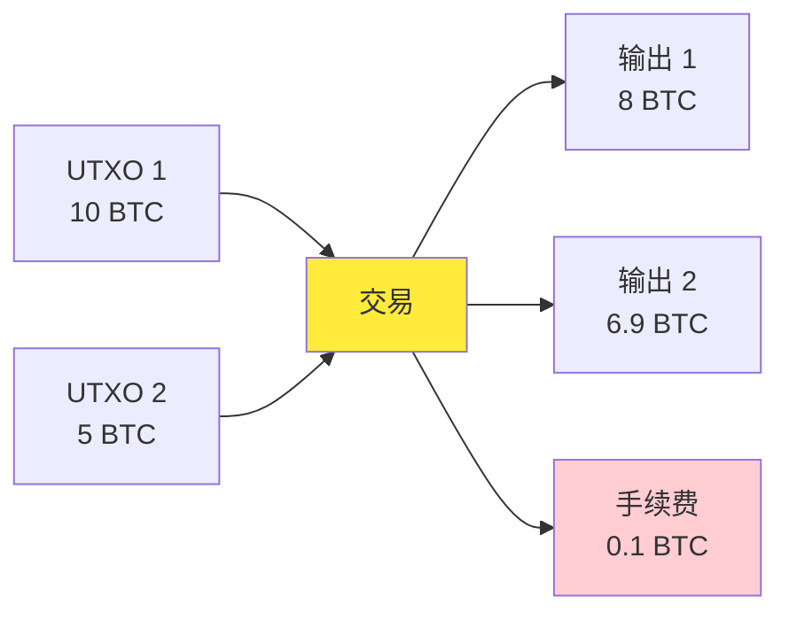
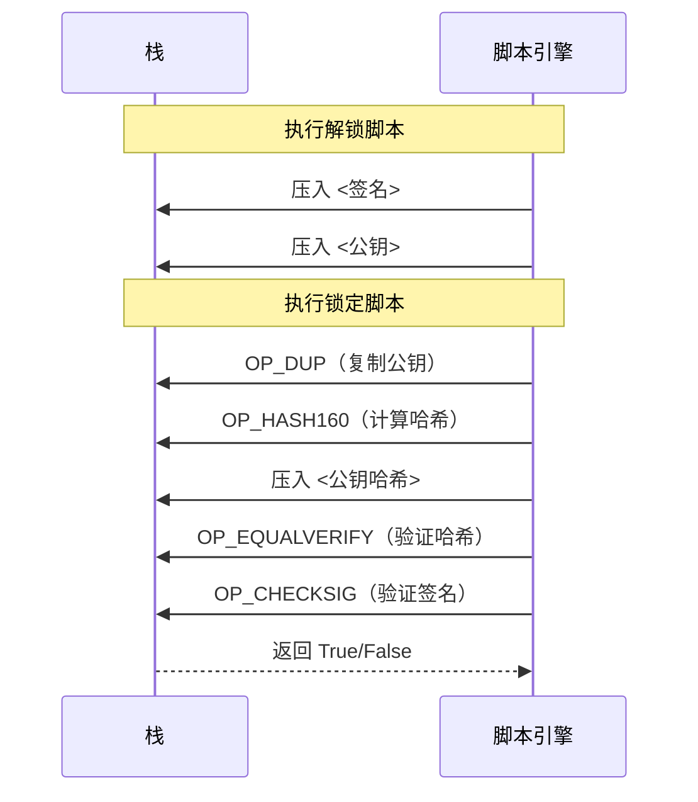
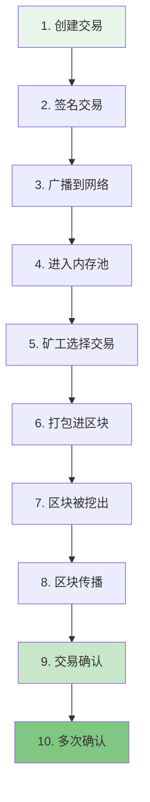

---
title: 比特币交易详解
date: 2025-09-29
categories:
  - Technology
  - Learning
---

# 比特币交易详解

## 1. 交易概述

比特币交易是比特币系统的核心，它记录了比特币的转移过程。每笔交易都是一个数据结构，包含输入和输出，代表了价值的流动。

### 1.1 交易的本质



**关键概念：**
- 交易消费之前的输出（UTXO）
- 创建新的输出供未来消费
- 输入总和必须大于等于输出总和
- 差额作为交易手续费给矿工

## 2. 交易结构

### 2.1 交易的数据结构

```python
class Transaction:
    """
    比特币交易结构
    """
    def __init__(self):
        self.version = 1          # 版本号（4字节）
        self.tx_in_count = 0      # 输入数量（可变长度）
        self.tx_in = []           # 输入列表
        self.tx_out_count = 0     # 输出数量（可变长度）
        self.tx_out = []          # 输出列表
        self.lock_time = 0        # 锁定时间（4字节）
```

### 2.2 交易输入（Input）

```python
class TransactionInput:
    """
    交易输入结构
    """
    def __init__(self):
        self.previous_output = {
            'hash': '',           # 引用的交易哈希（32字节）
            'index': 0           # 输出索引（4字节）
        }
        self.script_sig = ''     # 解锁脚本（可变长度）
        self.sequence = 0xFFFFFFFF  # 序列号（4字节）
```

**输入字段说明：**
- **previous_output**：指向要花费的UTXO
- **script_sig**：证明有权花费该UTXO的签名脚本
- **sequence**：用于相对时间锁定（BIP68）

### 2.3 交易输出（Output）

```python
class TransactionOutput:
    """
    交易输出结构
    """
    def __init__(self):
        self.value = 0            # 金额（8字节，单位：聪）
        self.script_pubkey = ''   # 锁定脚本（可变长度）
```

**输出字段说明：**
- **value**：输出金额，以聪（satoshi）为单位，1 BTC = 100,000,000 聪
- **script_pubkey**：定义花费条件的脚本

## 3. 交易类型

### 3.1 P2PKH（Pay to Public Key Hash）

最常见的交易类型，支付到公钥哈希地址。

```python
def create_p2pkh_script(pubkey_hash):
    """
    创建P2PKH锁定脚本
    """
    script = (
        OP_DUP +           # 复制栈顶元素
        OP_HASH160 +       # 计算RIPEMD160(SHA256(x))
        pubkey_hash +      # 公钥哈希
        OP_EQUALVERIFY +   # 验证相等
        OP_CHECKSIG        # 验证签名
    )
    return script

# 解锁脚本
def create_p2pkh_unlock(signature, public_key):
    """
    创建P2PKH解锁脚本
    """
    return signature + public_key
```

**执行过程：**



### 3.2 P2SH（Pay to Script Hash）

支付到脚本哈希，支持更复杂的脚本，如多重签名。

```python
def create_p2sh_script(script_hash):
    """
    创建P2SH锁定脚本
    """
    return OP_HASH160 + script_hash + OP_EQUAL

def create_multisig_redeem_script(m, n, public_keys):
    """
    创建m-of-n多重签名赎回脚本
    
    参数：
    - m: 需要的签名数量
    - n: 总公钥数量
    - public_keys: 公钥列表
    """
    script = bytes([OP_1 + m - 1])  # m
    
    for pubkey in public_keys:
        script += bytes([len(pubkey)]) + pubkey
    
    script += bytes([OP_1 + n - 1])  # n
    script += bytes([OP_CHECKMULTISIG])
    
    return script
```

### 3.3 P2WPKH（Pay to Witness Public Key Hash）

隔离见证版本的P2PKH，签名数据移到见证字段。

```python
def create_p2wpkh_script(pubkey_hash):
    """
    创建P2WPKH锁定脚本（原生隔离见证）
    """
    return bytes([0x00, 0x14]) + pubkey_hash  # 版本0，20字节哈希

class WitnessTransaction(Transaction):
    """
    隔离见证交易
    """
    def __init__(self):
        super().__init__()
        self.witness = []  # 见证数据
        self.marker = 0x00  # 标记
        self.flag = 0x01    # 标志
```

### 3.4 P2TR（Pay to Taproot）

Taproot交易，提供更好的隐私和效率。

```python
def create_p2tr_script(taproot_output):
    """
    创建P2TR锁定脚本
    """
    return bytes([0x51, 0x20]) + taproot_output  # 版本1，32字节输出
```

## 4. 交易脚本系统

### 4.1 脚本操作码

比特币使用基于栈的脚本语言，主要操作码：

| 操作码 | 十六进制 | 功能 |
|--------|----------|------|
| OP_DUP | 0x76 | 复制栈顶元素 |
| OP_HASH160 | 0xa9 | 计算RIPEMD160(SHA256(x)) |
| OP_EQUAL | 0x87 | 检查两元素相等 |
| OP_VERIFY | 0x69 | 验证栈顶为真 |
| OP_CHECKSIG | 0xac | 验证签名 |
| OP_CHECKMULTISIG | 0xae | 验证多重签名 |
| OP_RETURN | 0x6a | 标记输出不可花费 |

### 4.2 脚本验证引擎

```python
class ScriptEngine:
    """
    简化的脚本验证引擎
    """
    def __init__(self):
        self.stack = []
        self.alt_stack = []
    
    def execute(self, script):
        """
        执行脚本
        """
        for opcode in script:
            if opcode == OP_DUP:
                if len(self.stack) < 1:
                    return False
                self.stack.append(self.stack[-1])
                
            elif opcode == OP_HASH160:
                if len(self.stack) < 1:
                    return False
                element = self.stack.pop()
                hash160 = ripemd160(sha256(element))
                self.stack.append(hash160)
                
            elif opcode == OP_EQUAL:
                if len(self.stack) < 2:
                    return False
                a = self.stack.pop()
                b = self.stack.pop()
                self.stack.append(1 if a == b else 0)
                
            elif opcode == OP_VERIFY:
                if len(self.stack) < 1:
                    return False
                if self.stack.pop() == 0:
                    return False
                    
            elif opcode == OP_CHECKSIG:
                if len(self.stack) < 2:
                    return False
                pubkey = self.stack.pop()
                signature = self.stack.pop()
                valid = self.verify_signature(signature, pubkey)
                self.stack.append(1 if valid else 0)
                
            else:
                # 数据元素
                self.stack.append(opcode)
        
        # 最终栈顶必须为真
        return len(self.stack) > 0 and self.stack[-1] != 0
```

## 5. 交易的生命周期

### 5.1 交易创建到确认流程



### 5.2 创建交易示例

```python
def create_transaction(inputs, outputs, network='mainnet'):
    """
    创建比特币交易
    
    参数：
    - inputs: 输入列表 [{'txid': '', 'vout': 0, 'script': '', 'amount': 0}]
    - outputs: 输出列表 [{'address': '', 'amount': 0}]
    """
    tx = Transaction()
    tx.version = 2
    
    # 添加输入
    for inp in inputs:
        tx_input = TransactionInput()
        tx_input.previous_output['hash'] = inp['txid']
        tx_input.previous_output['index'] = inp['vout']
        tx_input.script_sig = ''  # 稍后添加签名
        tx.tx_in.append(tx_input)
    
    # 添加输出
    for out in outputs:
        tx_output = TransactionOutput()
        tx_output.value = int(out['amount'] * 100000000)  # BTC转聪
        tx_output.script_pubkey = address_to_script(out['address'])
        tx.tx_out.append(tx_output)
    
    # 计算手续费
    total_input = sum(inp['amount'] for inp in inputs)
    total_output = sum(out['amount'] for out in outputs)
    fee = total_input - total_output
    
    print(f"交易手续费: {fee} BTC")
    
    return tx
```

### 5.3 签名交易

```python
def sign_transaction(tx, private_keys, inputs):
    """
    签名交易
    
    参数：
    - tx: 交易对象
    - private_keys: 私钥列表
    - inputs: 输入信息列表
    """
    for i, tx_input in enumerate(tx.tx_in):
        # 获取对应的私钥
        private_key = private_keys[i]
        
        # 获取前一个输出的脚本
        prev_script = inputs[i]['script']
        
        # 创建签名哈希
        sighash = create_signature_hash(tx, i, prev_script)
        
        # 使用私钥签名
        signature = sign_with_private_key(private_key, sighash)
        
        # 添加签名类型
        signature += bytes([SIGHASH_ALL])
        
        # 获取公钥
        public_key = get_public_key(private_key)
        
        # 创建解锁脚本
        tx_input.script_sig = create_unlock_script(signature, public_key)
    
    return tx

def create_signature_hash(tx, input_index, prev_script, sighash_type=SIGHASH_ALL):
    """
    创建签名哈希
    """
    # 复制交易
    tx_copy = copy.deepcopy(tx)
    
    # 清空所有输入的脚本
    for inp in tx_copy.tx_in:
        inp.script_sig = ''
    
    # 设置当前输入的脚本
    tx_copy.tx_in[input_index].script_sig = prev_script
    
    # 序列化交易
    serialized = tx_copy.serialize()
    
    # 添加签名类型
    serialized += struct.pack('<I', sighash_type)
    
    # 双重SHA256
    return hashlib.sha256(hashlib.sha256(serialized).digest()).digest()
```

## 6. 交易验证

### 6.1 验证规则

```python
class TransactionValidator:
    """
    交易验证器
    """
    def __init__(self, utxo_set):
        self.utxo_set = utxo_set
    
    def validate_transaction(self, tx):
        """
        验证交易
        """
        # 1. 基本检查
        if not self.check_basic_rules(tx):
            return False, "基本规则检查失败"
        
        # 2. 验证输入
        if not self.validate_inputs(tx):
            return False, "输入验证失败"
        
        # 3. 验证输出
        if not self.validate_outputs(tx):
            return False, "输出验证失败"
        
        # 4. 验证脚本
        if not self.validate_scripts(tx):
            return False, "脚本验证失败"
        
        # 5. 检查双花
        if not self.check_double_spend(tx):
            return False, "检测到双花"
        
        return True, "验证通过"
    
    def check_basic_rules(self, tx):
        """
        基本规则检查
        """
        # 交易不能为空
        if len(tx.tx_in) == 0 or len(tx.tx_out) == 0:
            return False
        
        # 交易大小限制（标准交易100KB）
        if len(tx.serialize()) > 100000:
            return False
        
        # 输出值必须为正
        for output in tx.tx_out:
            if output.value <= 0:
                return False
        
        return True
    
    def validate_inputs(self, tx):
        """
        验证输入
        """
        total_input = 0
        
        for tx_input in tx.tx_in:
            # 查找引用的UTXO
            utxo = self.utxo_set.get(
                tx_input.previous_output['hash'],
                tx_input.previous_output['index']
            )
            
            if not utxo:
                return False  # UTXO不存在
            
            total_input += utxo.value
        
        # 检查输入总额
        total_output = sum(out.value for out in tx.tx_out)
        if total_input < total_output:
            return False  # 输入不足
        
        return True
```

### 6.2 交易确认

```python
def get_transaction_confirmations(tx_hash, blockchain):
    """
    获取交易确认数
    
    参数：
    - tx_hash: 交易哈希
    - blockchain: 区块链对象
    """
    # 查找包含交易的区块
    block = blockchain.find_transaction_block(tx_hash)
    
    if not block:
        return 0  # 未确认
    
    # 计算确认数
    block_height = blockchain.get_block_height(block)
    current_height = blockchain.get_current_height()
    
    confirmations = current_height - block_height + 1
    
    return confirmations

def wait_for_confirmations(tx_hash, required_confirmations=6):
    """
    等待交易确认
    
    参数：
    - tx_hash: 交易哈希
    - required_confirmations: 需要的确认数
    """
    while True:
        confirmations = get_transaction_confirmations(tx_hash)
        
        if confirmations >= required_confirmations:
            print(f"交易已获得 {confirmations} 个确认")
            break
        
        print(f"当前确认数: {confirmations}，等待中...")
        time.sleep(60)  # 等待1分钟
```

## 7. 高级交易特性

### 7.1 时间锁定

```python
class TimeLockTransaction:
    """
    时间锁定交易
    """
    
    @staticmethod
    def create_absolute_timelock(tx, lock_time):
        """
        创建绝对时间锁定
        
        参数：
        - lock_time: Unix时间戳或区块高度
        """
        tx.lock_time = lock_time
        
        # 所有输入的序列号必须小于0xFFFFFFFE
        for tx_input in tx.tx_in:
            tx_input.sequence = 0xFFFFFFFE
        
        return tx
    
    @staticmethod
    def create_relative_timelock(tx_input, blocks=None, seconds=None):
        """
        创建相对时间锁定（BIP68）
        
        参数：
        - blocks: 区块数量
        - seconds: 秒数
        """
        if blocks:
            # 基于区块的相对锁定
            sequence = blocks & 0xFFFF
        elif seconds:
            # 基于时间的相对锁定
            sequence = (seconds // 512) | 0x400000
        else:
            return
        
        tx_input.sequence = sequence
```

### 7.2 RBF（Replace-By-Fee）

```python
def enable_rbf(tx):
    """
    启用RBF（费用替换）
    
    BIP125: 允许通过支付更高手续费替换未确认交易
    """
    for tx_input in tx.tx_in:
        # 序列号小于0xFFFFFFFE表示支持RBF
        tx_input.sequence = 0xFFFFFFFD
    
    return tx

def replace_transaction(original_tx, new_fee_rate):
    """
    替换交易（提高手续费）
    """
    new_tx = copy.deepcopy(original_tx)
    
    # 减少一个输出的金额来增加手续费
    current_fee = calculate_fee(original_tx)
    new_fee = calculate_fee_by_rate(new_tx, new_fee_rate)
    fee_difference = new_fee - current_fee
    
    # 从找零输出中扣除
    if len(new_tx.tx_out) > 1:
        new_tx.tx_out[-1].value -= fee_difference
    
    # 重新签名
    # sign_transaction(new_tx, ...)
    
    return new_tx
```

### 7.3 批量交易

```python
def create_batch_payment(inputs, recipients, change_address):
    """
    创建批量支付交易
    
    参数：
    - inputs: 输入UTXO列表
    - recipients: 接收者列表 [{'address': '', 'amount': 0}]
    - change_address: 找零地址
    """
    tx = Transaction()
    
    # 添加所有输入
    total_input = 0
    for utxo in inputs:
        tx_input = TransactionInput()
        tx_input.previous_output = utxo['outpoint']
        tx.tx_in.append(tx_input)
        total_input += utxo['value']
    
    # 添加所有接收者输出
    total_output = 0
    for recipient in recipients:
        tx_output = TransactionOutput()
        tx_output.value = recipient['amount']
        tx_output.script_pubkey = address_to_script(recipient['address'])
        tx.tx_out.append(tx_output)
        total_output += recipient['amount']
    
    # 计算找零
    fee = estimate_fee(len(tx.tx_in), len(tx.tx_out) + 1)
    change = total_input - total_output - fee
    
    if change > DUST_LIMIT:  # 高于粉尘限制
        change_output = TransactionOutput()
        change_output.value = change
        change_output.script_pubkey = address_to_script(change_address)
        tx.tx_out.append(change_output)
    
    return tx
```

## 8. 交易优化

### 8.1 手续费估算

```python
class FeeEstimator:
    """
    手续费估算器
    """
    
    @staticmethod
    def estimate_size(num_inputs, num_outputs):
        """
        估算交易大小
        
        公式：
        - 基础大小: 10字节
        - 每个输入: ~148字节（P2PKH）
        - 每个输出: ~34字节
        """
        base_size = 10
        input_size = num_inputs * 148
        output_size = num_outputs * 34
        
        return base_size + input_size + output_size
    
    @staticmethod
    def estimate_fee(num_inputs, num_outputs, fee_rate):
        """
        估算手续费
        
        参数：
        - fee_rate: 聪/字节
        """
        size = FeeEstimator.estimate_size(num_inputs, num_outputs)
        return size * fee_rate
    
    @staticmethod
    def get_optimal_fee_rate(priority='normal'):
        """
        获取最优手续费率
        
        参数：
        - priority: 'slow', 'normal', 'fast'
        """
        # 实际应从费率API获取
        fee_rates = {
            'slow': 5,      # 5 sat/byte
            'normal': 20,   # 20 sat/byte
            'fast': 50      # 50 sat/byte
        }
        
        return fee_rates.get(priority, 20)
```

### 8.2 UTXO选择策略

```python
class UTXOSelector:
    """
    UTXO选择器
    """
    
    @staticmethod
    def select_utxos(utxos, target_amount, strategy='largest_first'):
        """
        选择UTXO
        
        策略：
        - largest_first: 优先最大
        - smallest_first: 优先最小
        - optimize: 优化选择
        """
        if strategy == 'largest_first':
            sorted_utxos = sorted(utxos, key=lambda x: x['value'], reverse=True)
        elif strategy == 'smallest_first':
            sorted_utxos = sorted(utxos, key=lambda x: x['value'])
        else:
            # 优化策略：尽量减少找零
            return UTXOSelector.optimize_selection(utxos, target_amount)
        
        selected = []
        total = 0
        
        for utxo in sorted_utxos:
            selected.append(utxo)
            total += utxo['value']
            
            if total >= target_amount:
                break
        
        return selected, total
    
    @staticmethod
    def optimize_selection(utxos, target_amount):
        """
        优化UTXO选择（背包问题）
        """
        # 简化实现：寻找最接近目标金额的组合
        best_combination = None
        best_change = float('inf')
        
        # 这里应使用动态规划或其他优化算法
        # 为简化，只展示概念
        
        return best_combination
```

## 9. 实战示例

### 9.1 创建并广播交易

```python
import requests

def create_and_broadcast_transaction():
    """
    完整的交易创建和广播流程
    """
    
    # 1. 准备数据
    private_key = "your_private_key"
    from_address = "1A1zP1eP5QGefi2DMPTfTL5SLmv7DivfNa"
    to_address = "1BvBMSEYstWetqTFn5Au4m4GFg7xJaNVN2"
    amount = 0.001  # BTC
    
    # 2. 获取UTXO
    utxos = get_utxos(from_address)
    
    # 3. 选择UTXO
    selected_utxos, total_input = select_utxos_for_amount(utxos, amount)
    
    # 4. 创建交易
    tx = create_transaction(
        inputs=selected_utxos,
        outputs=[
            {'address': to_address, 'amount': amount},
            {'address': from_address, 'amount': total_input - amount - 0.0001}  # 找零
        ]
    )
    
    # 5. 签名交易
    signed_tx = sign_transaction(tx, private_key)
    
    # 6. 序列化交易
    raw_tx = signed_tx.serialize().hex()
    
    # 7. 广播交易
    txid = broadcast_transaction(raw_tx)
    
    print(f"交易已广播，TXID: {txid}")
    
    # 8. 等待确认
    wait_for_confirmations(txid, required=6)
    
    return txid

def broadcast_transaction(raw_tx):
    """
    广播交易到网络
    """
    # 使用公共API广播
    url = "https://blockstream.info/api/tx"
    response = requests.post(url, data=raw_tx)
    
    if response.status_code == 200:
        return response.text
    else:
        raise Exception(f"广播失败: {response.text}")
```

## 10. 交易安全注意事项

### 10.1 安全检查清单

- [ ] 验证接收地址格式正确
- [ ] 确认交易金额无误
- [ ] 检查手续费是否合理
- [ ] 私钥安全存储
- [ ] 使用硬件钱包签名大额交易
- [ ] 等待足够的确认数
- [ ] 避免地址重用
- [ ] 检查找零地址

### 10.2 常见问题

**Q: 为什么交易一直未确认？**
A: 可能手续费太低，可以使用RBF提高手续费。

**Q: 如何取消未确认的交易？**
A: 比特币交易不能真正"取消"，但可以用RBF创建冲突交易。

**Q: 什么是粉尘攻击？**
A: 发送极小额比特币来追踪地址，应忽略粉尘输出。

**Q: 为什么需要多个确认？**
A: 防止双花攻击和区块重组，6个确认通常被认为是安全的。

## 总结

比特币交易是整个系统的核心，理解交易机制对于开发区块链应用至关重要。本文详细介绍了：

1. **交易结构**：输入、输出、脚本系统
2. **交易类型**：P2PKH、P2SH、隔离见证、Taproot
3. **交易生命周期**：从创建到确认的完整流程
4. **高级特性**：时间锁、RBF、批量支付
5. **优化策略**：手续费估算、UTXO选择

掌握这些知识，你就能深入理解比特币的价值转移机制，并能开发相关应用。

---

下一篇：[比特币挖矿原理](./04.比特币挖矿原理.md)
