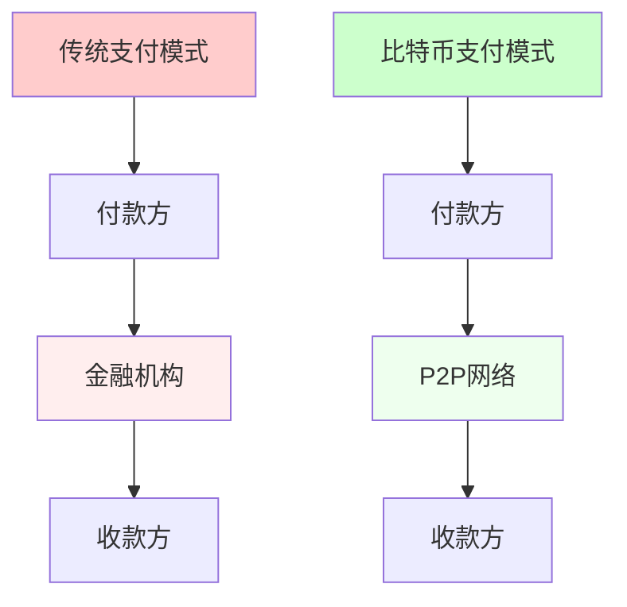
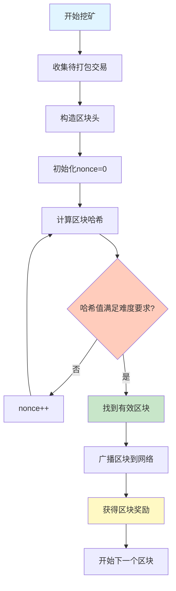
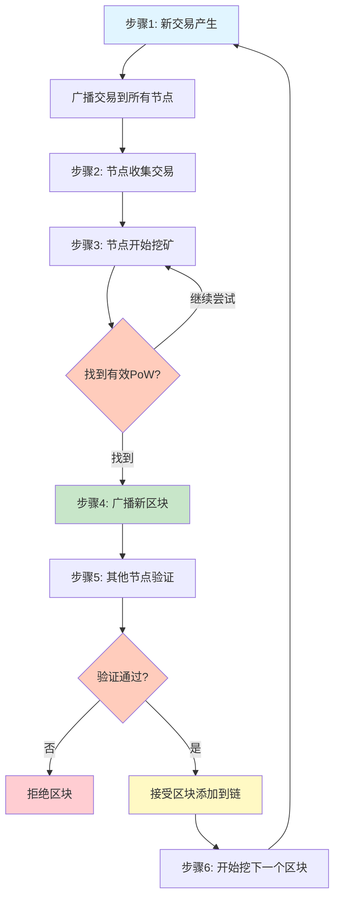
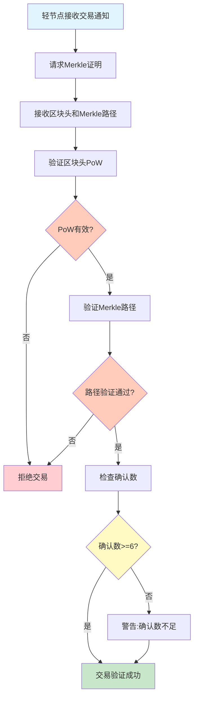
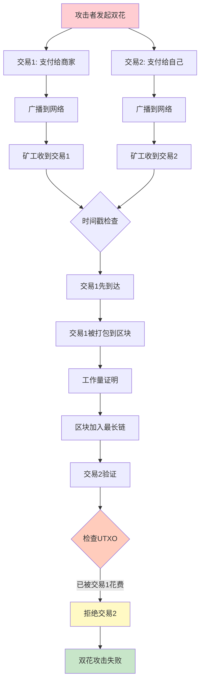

---
title: 比特币白皮书深度解读
date: 2025-09-29
categories:
  - Technology
  - Learning
---

# 比特币白皮书深度解读

## 前言

2008年10月31日,一个化名为中本聪(Satoshi Nakamoto)的人或团体,在密码学邮件列表中发布了一篇题为《比特币:一种点对点的电子现金系统》的论文。这篇仅有9页的白皮书,开启了区块链技术和数字货币的新时代。

## 一、白皮书核心内容解读

### 1.1 摘要解读

**原文核心观点:**
> "A purely peer-to-peer version of electronic cash would allow online payments to be sent directly from one party to another without going through a financial institution."

**深度解析:**

白皮书开篇即提出了比特币的根本目标:创建一个无需金融机构参与的点对点支付系统。



**关键创新点:**
1. **去中介化**:移除可信第三方
2. **时间戳服务器**:证明交易顺序
3. **工作量证明**:解决双花问题
4. **最长链原则**:达成共识

### 1.2 交易(Transactions)

**白皮书设计:**

```java
import java.security.*;
import java.util.*;

/**
 * 比特币交易类 - 实现数字签名链
 *
 * @author Bitcoin Network
 */
public class Transaction {
    private List<TransactionInput> inputs;
    private List<TransactionOutput> outputs;

    public Transaction() {
        this.inputs = new ArrayList<>();
        this.outputs = new ArrayList<>();
    }

    /**
     * 创建交易:将币从前一个所有者转给新所有者
     *
     * @param prevTxHash 前一笔交易的哈希值
     * @param prevOwnerPubkey 前一个所有者的公钥
     * @param newOwnerPubkey 新所有者的公钥
     * @param amount 转账金额
     * @return 交易哈希值
     */
    public String createTransaction(String prevTxHash, PublicKey prevOwnerPubkey,
                                    PublicKey newOwnerPubkey, double amount,
                                    PrivateKey prevOwnerPrivateKey) {
        try {
            // 1. 引用之前的交易
            InputReference inputRef = new InputReference(prevTxHash, 0);

            // 2. 创建新输出
            TransactionOutput output = new TransactionOutput(amount, newOwnerPubkey);

            // 3. 前一个所有者签名
            String message = hashTransactionData(inputRef, output);
            String signature = signWithPrivateKey(message, prevOwnerPrivateKey);

            // 4. 构建完整交易
            TransactionInput input = new TransactionInput(inputRef, signature, prevOwnerPubkey);
            this.inputs.add(input);
            this.outputs.add(output);

            return calculateHash();
        } catch (Exception e) {
            throw new RuntimeException("创建交易失败", e);
        }
    }

    private String hashTransactionData(InputReference inputRef, TransactionOutput output) {
        // 计算交易数据的哈希值
        return SHA256Hash.hash(inputRef.toString() + output.toString());
    }

    private String signWithPrivateKey(String message, PrivateKey privateKey)
            throws NoSuchAlgorithmException, InvalidKeyException, SignatureException {
        Signature sig = Signature.getInstance("SHA256withECDSA");
        sig.initSign(privateKey);
        sig.update(message.getBytes());
        return Base64.getEncoder().encodeToString(sig.sign());
    }

    private String calculateHash() {
        // 计算交易哈希
        return SHA256Hash.hash(this.toString());
    }

    /**
     * 交易输入引用
     */
    static class InputReference {
        private String prevTx;
        private int prevOutputIndex;

        public InputReference(String prevTx, int prevOutputIndex) {
            this.prevTx = prevTx;
            this.prevOutputIndex = prevOutputIndex;
        }

        @Override
        public String toString() {
            return prevTx + ":" + prevOutputIndex;
        }
    }

    /**
     * 交易输入
     */
    static class TransactionInput {
        private InputReference reference;
        private String signature;
        private PublicKey pubkey;

        public TransactionInput(InputReference reference, String signature, PublicKey pubkey) {
            this.reference = reference;
            this.signature = signature;
            this.pubkey = pubkey;
        }
    }

    /**
     * 交易输出
     */
    static class TransactionOutput {
        private double value;
        private PublicKey pubkey;

        public TransactionOutput(double value, PublicKey pubkey) {
            this.value = value;
            this.pubkey = pubkey;
        }

        @Override
        public String toString() {
            return value + ":" + pubkey.toString();
        }
    }
}
```

**核心思想:**
- 电子币是一串数字签名链
- 每次转账都需要前一个所有者的签名
- 收款人可以验证签名链的有效性

### 1.3 时间戳服务器(Timestamp Server)

**白皮书方案:**

```java
import java.security.MessageDigest;
import java.util.*;
import com.google.gson.Gson;

/**
 * 时间戳服务器:证明数据在某个时间点存在
 *
 * @author Bitcoin Network
 */
public class TimestampServer {
    private List<TimestampBlock> timestampChain;
    private Gson gson;

    public TimestampServer() {
        this.timestampChain = new ArrayList<>();
        this.gson = new Gson();
    }

    /**
     * 为一组数据创建时间戳
     *
     * @param dataItems 数据项列表
     * @return 区块哈希值
     */
    public String createTimestamp(List<String> dataItems) {
        TimestampBlockData blockData = new TimestampBlockData(
            System.currentTimeMillis(),
            dataItems,
            getLastHash()
        );

        // 计算包含前一个哈希的新哈希
        String blockHash = calculateHash(blockData);

        // 广播发布哈希
        publishHash(blockHash);

        TimestampBlock block = new TimestampBlock(blockData, blockHash);
        this.timestampChain.add(block);

        return blockHash;
    }

    /**
     * 计算区块哈希
     *
     * @param block 区块数据
     * @return 哈希值
     */
    private String calculateHash(TimestampBlockData block) {
        try {
            String blockString = gson.toJson(block);
            MessageDigest digest = MessageDigest.getInstance("SHA-256");
            byte[] hash = digest.digest(blockString.getBytes());
            return bytesToHex(hash);
        } catch (Exception e) {
            throw new RuntimeException("哈希计算失败", e);
        }
    }

    /**
     * 公开发布哈希值
     * 在白皮书中,这相当于在报纸或Usenet上发布
     *
     * @param hashValue 哈希值
     */
    private void publishHash(String hashValue) {
        System.out.println("Published Hash: " + hashValue);
    }

    private String getLastHash() {
        if (timestampChain.isEmpty()) {
            return "0";
        }
        return timestampChain.get(timestampChain.size() - 1).getHash();
    }

    private String bytesToHex(byte[] bytes) {
        StringBuilder result = new StringBuilder();
        for (byte b : bytes) {
            result.append(String.format("%02x", b));
        }
        return result.toString();
    }

    /**
     * 时间戳区块数据
     */
    static class TimestampBlockData {
        private long timestamp;
        private List<String> items;
        private String prevHash;

        public TimestampBlockData(long timestamp, List<String> items, String prevHash) {
            this.timestamp = timestamp;
            this.items = items;
            this.prevHash = prevHash;
        }
    }

    /**
     * 时间戳区块
     */
    static class TimestampBlock {
        private TimestampBlockData block;
        private String hash;

        public TimestampBlock(TimestampBlockData block, String hash) {
            this.block = block;
            this.hash = hash;
        }

        public String getHash() {
            return hash;
        }
    }
}
```

**重要性:**
- 证明某个时间点数据的存在性
- 形成不可篡改的时间序列
- 为工作量证明奠定基础

### 1.4 工作量证明(Proof-of-Work)

**白皮书实现:**

```java
import java.security.MessageDigest;
import java.util.HashMap;
import java.util.Map;

/**
 * 工作量证明机制
 *
 * @author Bitcoin Network
 */
public class ProofOfWork {
    private int difficulty;
    private String target;

    /**
     * 构造工作量证明实例
     *
     * @param difficulty 难度(前导零的数量)
     */
    public ProofOfWork(int difficulty) {
        this.difficulty = difficulty;
        this.target = "0".repeat(difficulty);
    }

    /**
     * 挖矿:找到满足难度要求的nonce
     *
     * @param blockData 区块数据
     * @return 挖矿结果
     */
    public MiningResult mineBlock(String blockData) {
        long nonce = 0;
        long startTime = System.currentTimeMillis();

        while (true) {
            // 构造待哈希的数据
            String dataToHash = blockData + nonce;
            String hashResult = calculateSHA256(dataToHash);

            // 检查是否满足难度要求
            if (hashResult.startsWith(target)) {
                long endTime = System.currentTimeMillis();
                double timeSpent = (endTime - startTime) / 1000.0;

                System.out.println("成功挖矿!");
                System.out.println("Nonce: " + nonce);
                System.out.println("Hash: " + hashResult);
                System.out.printf("耗时: %.2f秒%n", timeSpent);
                System.out.println("尝试次数: " + nonce);

                return new MiningResult(nonce, hashResult, timeSpent);
            }

            nonce++;
        }
    }

    /**
     * 验证工作量证明
     *
     * @param blockData 区块数据
     * @param nonce 随机数
     * @param blockHash 区块哈希
     * @return 是否验证通过
     */
    public boolean verifyProof(String blockData, long nonce, String blockHash) {
        String dataToHash = blockData + nonce;
        String calculatedHash = calculateSHA256(dataToHash);

        return calculatedHash.equals(blockHash) &&
               calculatedHash.startsWith(target);
    }

    private String calculateSHA256(String input) {
        try {
            MessageDigest digest = MessageDigest.getInstance("SHA-256");
            byte[] hash = digest.digest(input.getBytes());
            StringBuilder hexString = new StringBuilder();
            for (byte b : hash) {
                String hex = Integer.toHexString(0xff & b);
                if (hex.length() == 1) hexString.append('0');
                hexString.append(hex);
            }
            return hexString.toString();
        } catch (Exception e) {
            throw new RuntimeException("SHA-256计算失败", e);
        }
    }

    /**
     * 挖矿结果
     */
    public static class MiningResult {
        private long nonce;
        private String hash;
        private double timeSpent;

        public MiningResult(long nonce, String hash, double timeSpent) {
            this.nonce = nonce;
            this.hash = hash;
            this.timeSpent = timeSpent;
        }

        public long getNonce() {
            return nonce;
        }

        public String getHash() {
            return hash;
        }

        public double getTimeSpent() {
            return timeSpent;
        }
    }
}
```

**设计精妙之处:**
1. **不对称性**:挖矿困难,验证简单
2. **可调节性**:通过难度调整控制出块时间
3. **公平性**:算力越大,获得奖励概率越高



### 1.5 网络(Network)

**白皮书描述的网络运行步骤:**

```java
import java.util.*;
import com.google.gson.Gson;

/**
 * 比特币P2P网络
 *
 * @author Bitcoin Network
 */
public class BitcoinNetwork {
    private Set<Node> nodes;
    private List<Transaction> pendingTransactions;
    private List<Block> blockchain;
    private Gson gson;

    public BitcoinNetwork() {
        this.nodes = new HashSet<>();
        this.pendingTransactions = new ArrayList<>();
        this.blockchain = new ArrayList<>();
        this.gson = new Gson();
    }

    /**
     * 步骤1: 新交易向所有节点广播
     *
     * @param transaction 交易
     */
    public void broadcastTransaction(Transaction transaction) {
        for (Node node : nodes) {
            node.receiveTransaction(transaction);
        }
    }

    /**
     * 步骤2: 每个节点将新交易收集到区块中
     *
     * @param node 节点
     * @return 区块
     */
    public Block collectTransactions(Node node) {
        List<Transaction> txs = node.getPendingTransactions()
                                    .subList(0, Math.min(100, node.getPendingTransactions().size()));

        Block block = new Block(
            txs,
            getLastBlockHash(),
            System.currentTimeMillis()
        );

        return block;
    }

    /**
     * 步骤3: 每个节点努力为区块找到工作量证明
     *
     * @param block 区块
     * @return 包含POW的区块
     */
    public Block findProofOfWork(Block block) {
        ProofOfWork pow = new ProofOfWork(4);
        String blockData = gson.toJson(block);
        ProofOfWork.MiningResult result = pow.mineBlock(blockData);

        block.setNonce(result.getNonce());
        block.setHash(result.getHash());

        return block;
    }

    /**
     * 步骤4: 找到工作量证明后向所有节点广播
     *
     * @param block 区块
     */
    public void broadcastBlock(Block block) {
        for (Node node : nodes) {
            node.receiveBlock(block);
        }
    }

    /**
     * 步骤5: 节点验证并接受区块
     *
     * @param node 节点
     * @param block 区块
     * @return 是否接受
     */
    public boolean acceptBlock(Node node, Block block) {
        // 验证所有交易
        if (!verifyTransactions(block.getTransactions())) {
            return false;
        }

        // 验证工作量证明
        if (!verifyPow(block)) {
            return false;
        }

        // 验证前一个区块哈希
        if (!block.getPrevHash().equals(node.getLastBlockHash())) {
            return false;
        }

        // 接受区块
        node.addBlock(block);
        // 从待处理交易中移除已确认交易
        node.removeConfirmedTransactions(block.getTransactions());

        return true;
    }

    /**
     * 步骤6: 节点开始下一个区块的工作
     *
     * @param node 节点
     */
    public void startNextBlock(Node node) {
        // 使用新区块的哈希作为前一个哈希
        Block currentBlock = new Block(
            new ArrayList<>(),
            node.getLastBlockHash(),
            System.currentTimeMillis()
        );
        node.setCurrentBlock(currentBlock);
    }

    private String getLastBlockHash() {
        if (blockchain.isEmpty()) {
            return "0";
        }
        return blockchain.get(blockchain.size() - 1).getHash();
    }

    private boolean verifyTransactions(List<Transaction> transactions) {
        // 验证交易的实现
        return true;
    }

    private boolean verifyPow(Block block) {
        // 验证工作量证明的实现
        return true;
    }

    /**
     * 区块类
     */
    public static class Block {
        private List<Transaction> transactions;
        private String prevHash;
        private long timestamp;
        private long nonce;
        private String hash;

        public Block(List<Transaction> transactions, String prevHash, long timestamp) {
            this.transactions = transactions;
            this.prevHash = prevHash;
            this.timestamp = timestamp;
        }

        public List<Transaction> getTransactions() {
            return transactions;
        }

        public String getPrevHash() {
            return prevHash;
        }

        public void setNonce(long nonce) {
            this.nonce = nonce;
        }

        public void setHash(String hash) {
            this.hash = hash;
        }

        public String getHash() {
            return hash;
        }
    }

    /**
     * 节点类
     */
    public static class Node {
        private List<Transaction> pendingTransactions;
        private List<Block> blockchain;
        private Block currentBlock;

        public Node() {
            this.pendingTransactions = new ArrayList<>();
            this.blockchain = new ArrayList<>();
        }

        public void receiveTransaction(Transaction tx) {
            pendingTransactions.add(tx);
        }

        public void receiveBlock(Block block) {
            // 处理接收到的区块
        }

        public List<Transaction> getPendingTransactions() {
            return pendingTransactions;
        }

        public String getLastBlockHash() {
            if (blockchain.isEmpty()) {
                return "0";
            }
            return blockchain.get(blockchain.size() - 1).getHash();
        }

        public void addBlock(Block block) {
            blockchain.add(block);
        }

        public void removeConfirmedTransactions(List<Transaction> transactions) {
            pendingTransactions.removeAll(transactions);
        }

        public void setCurrentBlock(Block block) {
            this.currentBlock = block;
        }
    }
}
```



### 1.6 激励机制(Incentive)

**白皮书设计的经济模型:**

```java
/**
 * 比特币激励系统
 *
 * @author Bitcoin Network
 */
public class IncentiveSystem {
    private static final double INITIAL_REWARD = 50.0;
    private static final int HALVING_INTERVAL = 210000;
    private static final long MAX_SUPPLY = 21000000;

    /**
     * 计算区块奖励
     *
     * @param blockHeight 区块高度
     * @return 区块奖励(BTC)
     */
    public double calculateBlockReward(int blockHeight) {
        int halvings = blockHeight / HALVING_INTERVAL;

        // 约到2140年后无新币产生
        if (halvings >= 64) {
            return 0;
        }

        double reward = INITIAL_REWARD / Math.pow(2, halvings);
        return reward;
    }

    /**
     * 计算当前总供应量
     *
     * @param blockHeight 当前区块高度
     * @return 总供应量(BTC)
     */
    public double calculateTotalSupply(int blockHeight) {
        double total = 0;
        double currentReward = INITIAL_REWARD;

        for (int halving = 0; halving < 64; halving++) {
            int blocksInPeriod = Math.min(
                HALVING_INTERVAL,
                Math.max(0, blockHeight - halving * HALVING_INTERVAL)
            );

            total += currentReward * blocksInPeriod;
            currentReward /= 2;

            if (blockHeight < (halving + 1) * HALVING_INTERVAL) {
                break;
            }
        }

        return total;
    }

    /**
     * 创建币基交易(区块奖励)
     *
     * @param minerAddress 矿工地址
     * @param blockHeight 区块高度
     * @return 币基交易
     */
    public CoinbaseTransaction createCoinbaseTransaction(String minerAddress, int blockHeight) {
        double reward = calculateBlockReward(blockHeight);
        double fees = collectTransactionFees();

        CoinbaseTransaction coinbaseTx = new CoinbaseTransaction();
        coinbaseTx.addInput(new CoinbaseInput("Block #" + blockHeight));
        coinbaseTx.addOutput(new TransactionOutput(reward + fees, minerAddress));

        return coinbaseTx;
    }

    private double collectTransactionFees() {
        // 收集交易手续费的实现
        return 0.5;
    }

    /**
     * 币基输入
     */
    static class CoinbaseInput {
        private String coinbase;

        public CoinbaseInput(String coinbase) {
            this.coinbase = coinbase;
        }
    }

    /**
     * 交易输出
     */
    static class TransactionOutput {
        private double value;
        private String address;

        public TransactionOutput(double value, String address) {
            this.value = value;
            this.address = address;
        }
    }

    /**
     * 币基交易
     */
    static class CoinbaseTransaction {
        private List<CoinbaseInput> inputs;
        private List<TransactionOutput> outputs;

        public CoinbaseTransaction() {
            this.inputs = new ArrayList<>();
            this.outputs = new ArrayList<>();
        }

        public void addInput(CoinbaseInput input) {
            inputs.add(input);
        }

        public void addOutput(TransactionOutput output) {
            outputs.add(output);
        }
    }
}
```

**激励设计的精妙之处:**
1. **发行机制**:通过挖矿发行新币
2. **通缩设计**:总量有限,逐步减半
3. **安全激励**:诚实挖矿比攻击更有利可图

### 1.7 回收磁盘空间(Reclaiming Disk Space)

**Merkle树剪枝方案:**

```java
import java.security.MessageDigest;
import java.util.*;

/**
 * 磁盘空间优化
 *
 * @author Bitcoin Network
 */
public class DiskSpaceOptimization {

    /**
     * 创建支持剪枝的Merkle树
     *
     * @param transactions 交易列表
     * @return Merkle树根节点
     */
    public MerkleNode createMerkleTreeWithPruning(List<Transaction> transactions) {
        List<String> txHashes = new ArrayList<>();
        for (Transaction tx : transactions) {
            txHashes.add(hashTransaction(tx));
        }

        return buildTree(txHashes);
    }

    /**
     * 递归构建Merkle树
     *
     * @param txHashes 交易哈希列表
     * @return 树根节点
     */
    private MerkleNode buildTree(List<String> txHashes) {
        if (txHashes.size() == 1) {
            return new MerkleNode(null, null, txHashes.get(0));
        }

        List<MerkleNode> nodes = new ArrayList<>();

        for (int i = 0; i < txHashes.size(); i += 2) {
            String leftHash = txHashes.get(i);
            String rightHash = (i + 1 < txHashes.size()) ?
                              txHashes.get(i + 1) : leftHash;

            String parentHash = calculateHash(leftHash + rightHash);

            MerkleNode node = new MerkleNode(
                new MerkleNode(null, null, leftHash),
                new MerkleNode(null, null, rightHash),
                parentHash
            );

            nodes.add(node);
        }

        // 递归构建上层
        List<String> parentHashes = new ArrayList<>();
        for (MerkleNode node : nodes) {
            parentHashes.add(node.getHash());
        }

        return buildTree(parentHashes);
    }

    /**
     * 剪枝已花费的交易
     *
     * @param merkleRoot Merkle树根节点
     * @param spentTxs 已花费的交易哈希列表
     */
    public void pruneSpentTransactions(MerkleNode merkleRoot, List<String> spentTxs) {
        for (String txHash : spentTxs) {
            pruneNode(merkleRoot, txHash);
        }
    }

    private void pruneNode(MerkleNode node, String txHash) {
        if (node == null || node.isPruned()) {
            return;
        }

        // 叶子节点
        if (node.getLeft() == null) {
            if (node.getHash().equals(txHash)) {
                node.setPruned(true);
                // 只保留哈希,删除交易数据
                node.setTransactionData(null);
            }
        } else {
            pruneNode(node.getLeft(), txHash);
            pruneNode(node.getRight(), txHash);
        }
    }

    /**
     * 计算存储节省
     */
    public void calculateStorageSavings() {
        // 不剪枝: 80字节 * 平均600笔交易/区块
        int fullSize = 80 * 600;  // 48KB

        // 剪枝后: 区块头 + Merkle分支
        int prunedSize = 80 + 32 * 10;  // ~400字节

        double savingsRatio = (double)(fullSize - prunedSize) / fullSize * 100;
        System.out.printf("存储节省: %.1f%%%n", savingsRatio);
    }

    private String hashTransaction(Transaction tx) {
        return calculateHash(tx.toString());
    }

    private String calculateHash(String input) {
        try {
            MessageDigest digest = MessageDigest.getInstance("SHA-256");
            byte[] hash = digest.digest(input.getBytes());
            StringBuilder hexString = new StringBuilder();
            for (byte b : hash) {
                String hex = Integer.toHexString(0xff & b);
                if (hex.length() == 1) hexString.append('0');
                hexString.append(hex);
            }
            return hexString.toString();
        } catch (Exception e) {
            throw new RuntimeException("哈希计算失败", e);
        }
    }

    /**
     * Merkle树节点
     */
    static class MerkleNode {
        private MerkleNode left;
        private MerkleNode right;
        private String hash;
        private boolean isPruned;
        private Object transactionData;

        public MerkleNode(MerkleNode left, MerkleNode right, String hash) {
            this.left = left;
            this.right = right;
            this.hash = hash;
            this.isPruned = false;
        }

        public MerkleNode getLeft() {
            return left;
        }

        public MerkleNode getRight() {
            return right;
        }

        public String getHash() {
            return hash;
        }

        public boolean isPruned() {
            return isPruned;
        }

        public void setPruned(boolean pruned) {
            isPruned = pruned;
        }

        public void setTransactionData(Object data) {
            this.transactionData = data;
        }
    }
}
```

### 1.8 简化支付验证(SPV)

**SPV实现:**

```java
import java.security.MessageDigest;
import java.util.*;

/**
 * 简化支付验证(轻节点)
 *
 * @author Bitcoin Network
 */
public class SimplifiedPaymentVerification {
    private List<BlockHeader> blockHeaders;

    public SimplifiedPaymentVerification() {
        this.blockHeaders = new ArrayList<>();
    }

    /**
     * 验证交易是否被包含在区块中
     *
     * @param txHash 交易哈希
     * @param merkleProof Merkle证明
     * @param blockHeader 区块头
     * @return 是否验证通过
     */
    public boolean verifyTransaction(String txHash, List<MerkleProofNode> merkleProof,
                                    BlockHeader blockHeader) {
        // 1. 验证区块头的工作量证明
        if (!verifyBlockHeader(blockHeader)) {
            return false;
        }

        // 2. 验证Merkle路径
        if (!verifyMerkleProof(txHash, merkleProof, blockHeader.getMerkleRoot())) {
            return false;
        }

        // 3. 检查确认数(区块深度)
        int confirmations = getConfirmations(blockHeader);
        if (confirmations < 6) {
            System.out.println("警告: 只有" + confirmations + "个确认");
        }

        return true;
    }

    /**
     * 验证Merkle证明
     *
     * @param txHash 交易哈希
     * @param proofPath Merkle证明路径
     * @param rootHash 根哈希
     * @return 是否验证通过
     */
    private boolean verifyMerkleProof(String txHash, List<MerkleProofNode> proofPath,
                                     String rootHash) {
        String currentHash = txHash;

        for (MerkleProofNode node : proofPath) {
            String combined;
            if (node.isLeft()) {
                combined = node.getSiblingHash() + currentHash;
            } else {
                combined = currentHash + node.getSiblingHash();
            }

            currentHash = calculateSHA256(combined);
        }

        return currentHash.equals(rootHash);
    }

    /**
     * 验证区块头
     *
     * @param blockHeader 区块头
     * @return 是否验证通过
     */
    private boolean verifyBlockHeader(BlockHeader blockHeader) {
        String headerHash = blockHeader.calculateHash();
        // 验证工作量证明
        return headerHash.startsWith("0000"); // 简化的难度检查
    }

    /**
     * 获取交易的Merkle证明
     *
     * @param txHash 交易哈希
     * @param block 区块
     * @return Merkle证明路径
     */
    public List<MerkleProofNode> getTransactionProof(String txHash, Block block) {
        // 构建从交易到根的路径
        List<MerkleProofNode> proofPath = new ArrayList<>();
        // ... 构建Merkle路径的逻辑
        return proofPath;
    }

    private int getConfirmations(BlockHeader blockHeader) {
        // 计算确认数的实现
        return 6;
    }

    private String calculateSHA256(String input) {
        try {
            MessageDigest digest = MessageDigest.getInstance("SHA-256");
            byte[] hash = digest.digest(input.getBytes());
            StringBuilder hexString = new StringBuilder();
            for (byte b : hash) {
                String hex = Integer.toHexString(0xff & b);
                if (hex.length() == 1) hexString.append('0');
                hexString.append(hex);
            }
            return hexString.toString();
        } catch (Exception e) {
            throw new RuntimeException("SHA-256计算失败", e);
        }
    }

    /**
     * 区块头
     */
    public static class BlockHeader {
        private String prevBlockHash;
        private String merkleRoot;
        private long timestamp;
        private int difficulty;
        private long nonce;

        public BlockHeader(String prevBlockHash, String merkleRoot,
                          long timestamp, int difficulty, long nonce) {
            this.prevBlockHash = prevBlockHash;
            this.merkleRoot = merkleRoot;
            this.timestamp = timestamp;
            this.difficulty = difficulty;
            this.nonce = nonce;
        }

        public String getMerkleRoot() {
            return merkleRoot;
        }

        public String calculateHash() {
            // 计算区块头哈希的实现
            return "0000" + prevBlockHash.substring(4);
        }
    }

    /**
     * Merkle证明节点
     */
    public static class MerkleProofNode {
        private String siblingHash;
        private boolean isLeft;

        public MerkleProofNode(String siblingHash, boolean isLeft) {
            this.siblingHash = siblingHash;
            this.isLeft = isLeft;
        }

        public String getSiblingHash() {
            return siblingHash;
        }

        public boolean isLeft() {
            return isLeft;
        }
    }

    /**
     * 区块
     */
    public static class Block {
        private BlockHeader header;
        private List<Transaction> transactions;

        public Block(BlockHeader header, List<Transaction> transactions) {
            this.header = header;
            this.transactions = transactions;
        }
    }
}
```



## 二、中本聪的设计理念

### 2.1 信任最小化(Trust Minimization)

**核心理念:不依赖任何中心化的可信第三方**

```java
import java.util.*;

/**
 * 信任最小化设计
 *
 * @author Bitcoin Philosophy
 */
public class TrustMinimization {
    private Map<String, List<String>> trustRequirements;

    public TrustMinimization() {
        this.trustRequirements = new HashMap<>();
        trustRequirements.put("传统银行",
            Arrays.asList("银行诚信", "政府监管", "法律保护"));
        trustRequirements.put("比特币",
            Arrays.asList("数学", "密码学", "经济激励"));
    }

    /**
     * 对比信任模型
     *
     * @return 信任模型对比
     */
    public Map<String, TrustModel> compareTrustModels() {
        Map<String, TrustModel> models = new HashMap<>();

        // 传统模型:基于机构的信任
        TrustModel traditional = new TrustModel(
            "中心化机构",
            Arrays.asList("机构破产", "内部欺诈", "政府干预"),
            "法律诉讼",
            "需要许可"
        );

        // 比特币模型:基于密码学的信任
        TrustModel bitcoin = new TrustModel(
            "密码学证明",
            Arrays.asList("51%攻击"),  // 极难实现
            "分叉",
            "无需许可"
        );

        models.put("传统金融", traditional);
        models.put("比特币", bitcoin);

        return models;
    }

    /**
     * 信任模型类
     */
    static class TrustModel {
        private String trustSource;
        private List<String> failurePoints;
        private String recovery;
        private String accessibility;

        public TrustModel(String trustSource, List<String> failurePoints,
                         String recovery, String accessibility) {
            this.trustSource = trustSource;
            this.failurePoints = failurePoints;
            this.recovery = recovery;
            this.accessibility = accessibility;
        }

        // Getters省略
    }
}
```

### 2.2 去中心化哲学

**设计原则:**

```java
import java.util.*;

/**
 * 去中心化设计哲学
 *
 * @author Bitcoin Philosophy
 */
public class DecentralizationPhilosophy {
    private List<String> principles;

    public DecentralizationPhilosophy() {
        this.principles = Arrays.asList(
            "没有单点故障",
            "没有审查能力",
            "没有准入门槛",
            "没有特权节点"
        );
    }

    /**
     * 实现去中心化的关键要素
     *
     * @return 去中心化要素映射
     */
    public Map<String, DecentralizationElement> implementDecentralization() {
        Map<String, DecentralizationElement> elements = new HashMap<>();

        elements.put("共识机制", new DecentralizationElement(
            "Proof of Work",
            "算力投票,一CPU一票",
            "防止Sybil攻击"
        ));

        elements.put("网络架构", new DecentralizationElement(
            "P2P网络",
            "所有节点平等",
            "抗审查,高可用"
        ));

        elements.put("数据存储", new DecentralizationElement(
            "分布式账本",
            "每个节点都有完整副本",
            "透明可审计"
        ));

        elements.put("治理模式", new DecentralizationElement(
            "分叉机制",
            "用户用脚投票",
            "民主化升级"
        ));

        return elements;
    }

    /**
     * 去中心化要素
     */
    static class DecentralizationElement {
        private String method;
        private String property;
        private String benefit;

        public DecentralizationElement(String method, String property, String benefit) {
            this.method = method;
            this.property = property;
            this.benefit = benefit;
        }
    }
}
```

### 2.3 激励相容设计

**博弈论思想:**

```java
import java.util.*;

/**
 * 激励相容性设计
 *
 * @author Bitcoin Game Theory
 */
public class IncentiveCompatibility {

    /**
     * 分析博弈论设计
     *
     * @return 纳什均衡分析
     */
    public Map<String, MinerStrategy> analyzeGameTheory() {
        Map<String, MinerStrategy> strategies = new HashMap<>();

        // 矿工的选择
        strategies.put("诚实挖矿", new MinerStrategy(
            "电力 + 硬件",
            "区块奖励 + 手续费",
            "低",
            "网络健康,币值稳定"
        ));

        strategies.put("恶意攻击", new MinerStrategy(
            "51%算力成本",
            "双花获利",
            "极高",
            "网络崩溃,币值归零"
        ));

        // 纳什均衡:诚实是最优策略
        String nashEquilibrium = calculateNashEquilibrium(strategies);
        System.out.println("纳什均衡: " + nashEquilibrium);

        return strategies;
    }

    /**
     * 计算安全预算
     *
     * @param btcPrice BTC价格
     * @param blockReward 区块奖励
     * @param txFees 交易手续费
     * @return 安全预算信息
     */
    public SecurityBudget calculateSecurityBudget(double btcPrice,
                                                  double blockReward,
                                                  double txFees) {
        // 网络安全 = 攻击成本 > 攻击收益
        double dailyRewards = (blockReward + txFees) * 144;  // 每天144个区块
        double securityValue = dailyRewards * btcPrice;
        double attackCost = securityValue * 0.51;  // 51%攻击成本

        return new SecurityBudget(
            securityValue,
            attackCost,
            attackCost / securityValue
        );
    }

    private String calculateNashEquilibrium(Map<String, MinerStrategy> strategies) {
        return "诚实挖矿";
    }

    /**
     * 矿工策略
     */
    static class MinerStrategy {
        private String cost;
        private String reward;
        private String risk;
        private String longTerm;

        public MinerStrategy(String cost, String reward, String risk, String longTerm) {
            this.cost = cost;
            this.reward = reward;
            this.risk = risk;
            this.longTerm = longTerm;
        }
    }

    /**
     * 安全预算
     */
    static class SecurityBudget {
        private double dailySecurityBudget;
        private double attackCost51Percent;
        private double securityFactor;

        public SecurityBudget(double dailySecurityBudget,
                             double attackCost51Percent,
                             double securityFactor) {
            this.dailySecurityBudget = dailySecurityBudget;
            this.attackCost51Percent = attackCost51Percent;
            this.securityFactor = securityFactor;
        }
    }
}
```

### 2.4 简洁优雅的设计

**奥卡姆剃刀原则:**

```java
import java.util.*;

/**
 * 简洁优雅的设计
 *
 * @author Bitcoin Design
 */
public class ElegantDesign {

    /**
     * 设计原则展示
     *
     * @return 设计原则映射
     */
    public Map<String, DesignPrinciple> designPrinciples() {
        Map<String, DesignPrinciple> principles = new HashMap<>();

        principles.put("UTXO模型", new DesignPrinciple(
            "状态无关,并行验证",
            "避免了账户模型的复杂性"
        ));

        principles.put("固定供应量", new DesignPrinciple(
            "2100万硬编码",
            "避免了货币政策的争议"
        ));

        principles.put("10分钟区块", new DesignPrinciple(
            "固定时间窗口",
            "安全性与效率的平衡"
        ));

        principles.put("Script语言", new DesignPrinciple(
            "非图灵完备",
            "可预测,安全"
        ));

        return principles;
    }

    /**
     * 设计原则
     */
    static class DesignPrinciple {
        private String simplicity;
        private String comparison;

        public DesignPrinciple(String simplicity, String comparison) {
            this.simplicity = simplicity;
            this.comparison = comparison;
        }
    }
}
```

## 三、比特币要解决的问题

### 3.1 双重支付问题(Double Spending)

**问题本质与解决方案:**

```java
import java.util.*;

/**
 * 双重支付问题解决方案
 *
 * @author Bitcoin Network
 */
public class DoubleSpendingSolution {
    private List<Block> blockchain;
    private List<Transaction> pendingTransactions;

    public DoubleSpendingSolution() {
        this.blockchain = new ArrayList<>();
        this.pendingTransactions = new ArrayList<>();
    }

    /**
     * 演示双花攻击
     *
     * @return 防御结果
     */
    public Map<String, Object> demonstrateDoubleSpendingAttack() {
        double attackerBalance = 10.0;

        // 交易1:支付给商家
        Transaction tx1 = new Transaction(
            "attacker",
            "merchant",
            10.0,
            System.currentTimeMillis()
        );

        // 交易2:支付给自己的另一个地址
        Transaction tx2 = new Transaction(
            "attacker",
            "attacker_alt",
            10.0,
            System.currentTimeMillis() + 1000
        );

        // 在中心化系统中,需要可信第三方判断
        // 在比特币中,通过工作量证明解决
        return preventDoubleSpending(tx1, tx2);
    }

    /**
     * 比特币如何防止双花
     *
     * @param tx1 第一笔交易
     * @param tx2 第二笔交易(双花尝试)
     * @return 防御结果
     */
    public Map<String, Object> preventDoubleSpending(Transaction tx1, Transaction tx2) {
        Map<String, Object> result = new HashMap<>();

        // 1. 时间戳证明顺序
        Transaction firstTx = (tx1.getTimestamp() < tx2.getTimestamp()) ? tx1 : tx2;
        Transaction doubleSpendTx = (tx1.getTimestamp() < tx2.getTimestamp()) ? tx2 : tx1;

        // 2. 工作量证明确认
        Block blockWithTx1 = mineBlockWithTransaction(firstTx);

        // 3. 最长链原则
        // 一旦tx1被确认在最长链中,tx2将被拒绝
        boolean isTx2Valid = validateAgainstBlockchain(doubleSpendTx);

        result.put("accepted", firstTx);
        result.put("rejected", isTx2Valid ? null : doubleSpendTx);
        result.put("mechanism", "工作量证明 + 最长链原则");

        return result;
    }

    private Block mineBlockWithTransaction(Transaction tx) {
        // 挖矿实现
        return new Block(Arrays.asList(tx), "prev_hash", System.currentTimeMillis());
    }

    private boolean validateAgainstBlockchain(Transaction tx) {
        // 验证交易是否与区块链冲突
        return false;
    }

    /**
     * 交易类
     */
    static class Transaction {
        private String from;
        private String to;
        private double amount;
        private long timestamp;

        public Transaction(String from, String to, double amount, long timestamp) {
            this.from = from;
            this.to = to;
            this.amount = amount;
            this.timestamp = timestamp;
        }

        public long getTimestamp() {
            return timestamp;
        }
    }

    /**
     * 区块类
     */
    static class Block {
        private List<Transaction> transactions;
        private String prevHash;
        private long timestamp;

        public Block(List<Transaction> transactions, String prevHash, long timestamp) {
            this.transactions = transactions;
            this.prevHash = prevHash;
            this.timestamp = timestamp;
        }
    }
}
```



### 3.2 拜占庭将军问题

**分布式共识:**

```java
import java.security.MessageDigest;
import java.util.*;

/**
 * 拜占庭将军问题
 *
 * @author Bitcoin Consensus
 */
public class ByzantineGeneralsProblem {
    private int numGenerals;
    private int numTraitors;

    public ByzantineGeneralsProblem(int numGenerals, int numTraitors) {
        this.numGenerals = numGenerals;
        this.numTraitors = numTraitors;
    }

    /**
     * 传统解决方案的局限
     *
     * @return 局限性映射
     */
    public Map<String, Object> traditionalSolution() {
        Map<String, Object> limitations = new HashMap<>();

        // 需要知道参与者身份
        // 需要2/3以上诚实节点
        // 通信复杂度O(n²)

        limitations.put("identity_requirement", true);
        limitations.put("honest_majority", "> 2/3");
        limitations.put("communication_complexity", "O(n²)");
        limitations.put("scalability", "Poor");

        return limitations;
    }

    /**
     * 中本聪共识解决方案
     *
     * @return 优势映射
     */
    public Map<String, Object> nakamotoConsensus() {
        NakamotoSolution solution = new NakamotoSolution(4);

        Map<String, Object> advantages = new HashMap<>();
        advantages.put("identity_requirement", false);  // 无需身份
        advantages.put("honest_majority", "> 50% hashpower");  // 只需50%算力
        advantages.put("communication_complexity", "O(n)");  // 线性复杂度
        advantages.put("scalability", "Good");
        advantages.put("sybil_resistance", true);  // 抗女巫攻击

        return advantages;
    }

    /**
     * 中本聪共识解决方案实现
     */
    static class NakamotoSolution {
        private int difficulty;

        public NakamotoSolution(int difficulty) {
            this.difficulty = difficulty;
        }

        /**
         * 通过PoW达成共识
         *
         * @param proposals 提案列表
         * @return 获胜提案
         */
        public String reachConsensus(List<String> proposals) {
            String winningProposal = null;
            String minHash = "f".repeat(64);  // 最大哈希值

            for (String proposal : proposals) {
                // 每个将军尝试为自己的提案找PoW
                long nonce = 0;
                int maxAttempts = 100000;

                while (nonce < maxAttempts) {
                    String data = proposal + nonce;
                    String hashVal = calculateSHA256(data);

                    if (hashVal.compareTo(minHash) < 0 &&
                        hashVal.startsWith("0".repeat(difficulty))) {
                        minHash = hashVal;
                        winningProposal = proposal;
                        break;
                    }

                    nonce++;
                }
            }

            return winningProposal;
        }

        private String calculateSHA256(String input) {
            try {
                MessageDigest digest = MessageDigest.getInstance("SHA-256");
                byte[] hash = digest.digest(input.getBytes());
                StringBuilder hexString = new StringBuilder();
                for (byte b : hash) {
                    String hex = Integer.toHexString(0xff & b);
                    if (hex.length() == 1) hexString.append('0');
                    hexString.append(hex);
                }
                return hexString.toString();
            } catch (Exception e) {
                throw new RuntimeException("SHA-256计算失败", e);
            }
        }
    }
}
```

### 3.3 可信第三方问题

**消除中介:**

```java
import java.util.*;

/**
 * 消除可信第三方
 *
 * @author Bitcoin Philosophy
 */
public class TrustedThirdPartyElimination {

    /**
     * 对比支付系统
     *
     * @return 支付系统对比
     */
    public Map<String, PaymentSystem> comparePaymentSystems() {
        Map<String, PaymentSystem> systems = new HashMap<>();

        // 传统支付系统
        PaymentSystem traditional = new PaymentSystem();
        traditional.setParticipants(Arrays.asList("Payer", "Bank", "Payee"));
        traditional.setTrustPoints(Arrays.asList(
            "Bank won't steal funds",
            "Bank won't freeze account",
            "Bank maintains accurate records",
            "Bank is solvent"
        ));
        traditional.setFailureScenarios(Arrays.asList(
            "2008 Financial Crisis",
            "Cyprus Banking Crisis 2013",
            "Greek Capital Controls 2015"
        ));
        traditional.setCosts(new PaymentCosts("2-3%", "$25-50", "High"));

        // 比特币支付系统
        PaymentSystem bitcoin = new PaymentSystem();
        bitcoin.setParticipants(Arrays.asList("Payer", "Bitcoin Network", "Payee"));
        bitcoin.setTrustPoints(Arrays.asList(
            "Mathematics (SHA-256)",
            "Cryptography (ECDSA)",
            "Game Theory (Incentives)",
            "Open Source Code"
        ));
        bitcoin.setFailureScenarios(Arrays.asList(
            "51% Attack (Never successful on Bitcoin)",
            "Cryptographic Break (Theoretical)",
            "Quantum Computing (Future risk)"
        ));
        bitcoin.setCosts(new PaymentCosts("< 1%", "Same as domestic", "None"));

        systems.put("Traditional", traditional);
        systems.put("Bitcoin", bitcoin);

        return systems;
    }

    /**
     * 支付系统
     */
    static class PaymentSystem {
        private List<String> participants;
        private List<String> trustPoints;
        private List<String> failureScenarios;
        private PaymentCosts costs;

        // Getters and Setters
        public void setParticipants(List<String> participants) {
            this.participants = participants;
        }

        public void setTrustPoints(List<String> trustPoints) {
            this.trustPoints = trustPoints;
        }

        public void setFailureScenarios(List<String> failureScenarios) {
            this.failureScenarios = failureScenarios;
        }

        public void setCosts(PaymentCosts costs) {
            this.costs = costs;
        }
    }

    /**
     * 支付成本
     */
    static class PaymentCosts {
        private String transactionFee;
        private String internationalWire;
        private String chargebackRisk;

        public PaymentCosts(String transactionFee, String internationalWire,
                           String chargebackRisk) {
            this.transactionFee = transactionFee;
            this.internationalWire = internationalWire;
            this.chargebackRisk = chargebackRisk;
        }
    }
}
```

### 3.4 货币发行垄断问题

**去中心化发行:**

```java
/**
 * 去中心化货币发行
 *
 * @author Bitcoin Economics
 */
public class DecentralizedIssuance {
    private FiatMonetarySystem fiatSystem;
    private BitcoinMonetarySystem bitcoinSystem;

    public DecentralizedIssuance() {
        this.fiatSystem = new FiatMonetarySystem();
        this.bitcoinSystem = new BitcoinMonetarySystem();
    }

    /**
     * 法币系统
     */
    static class FiatMonetarySystem {
        private String control = "Central Bank";
        private String supply = "Unlimited";
        private String transparency = "Opaque";

        /**
         * 印钱
         *
         * @param amount 金额
         * @return 印钱结果
         */
        public String printMoney(double amount) {
            return String.format("Created $%,.0f out of thin air", amount);
        }

        /**
         * 通胀影响
         *
         * @param moneySupplyIncrease 货币供应增加量
         * @return 购买力损失
         */
        public double inflationImpact(double moneySupplyIncrease) {
            double inflationRate = moneySupplyIncrease * 0.8;  // 简化模型
            double purchasingPowerLoss = 1.0 / (1.0 + inflationRate);
            return purchasingPowerLoss;
        }
    }

    /**
     * 比特币系统
     */
    static class BitcoinMonetarySystem {
        private String control = "Protocol Rules";
        private long supply = 21_000_000;
        private String transparency = "Complete";

        /**
         * 挖比特币
         *
         * @param blockHeight 区块高度
         * @return 区块奖励
         */
        public double mineBitcoin(int blockHeight) {
            int halvings = blockHeight / 210000;
            double reward = (halvings < 64) ? 50.0 / Math.pow(2, halvings) : 0;
            return reward;
        }

        /**
         * 计算存量/流量比
         *
         * @param year 年份
         * @return S2F比率
         */
        public double calculateStockToFlow(int year) {
            double totalSupply = getSupplyAtYear(year);
            double annualProduction = getAnnualProduction(year);

            if (annualProduction > 0) {
                return totalSupply / annualProduction;
            }
            return Double.POSITIVE_INFINITY;  // 2140年后
        }

        private double getSupplyAtYear(int year) {
            // 计算某年的总供应量
            return 19_000_000;  // 简化
        }

        private double getAnnualProduction(int year) {
            // 计算某年的年产量
            return 300_000;  // 简化
        }
    }
}
```

## 四、去中心化的意义

### 4.1 金融主权与自由

**个人金融主权:**

```java
import java.util.*;

/**
 * 金融主权
 *
 * @author Bitcoin Freedom
 */
public class FinancialSovereignty {
    private TraditionalFinance traditionalControl;
    private BitcoinSovereignty bitcoinSovereignty;

    public FinancialSovereignty() {
        this.traditionalControl = new TraditionalFinance();
        this.bitcoinSovereignty = new BitcoinSovereignty();
    }

    /**
     * 传统金融
     */
    static class TraditionalFinance {
        public Map<String, String> accountControl() {
            Map<String, String> control = new HashMap<>();
            control.put("account_opening", "Requires permission");
            control.put("transaction_approval", "Bank discretion");
            control.put("account_freezing", "Government/Bank can freeze");
            control.put("asset_confiscation", "Possible");
            control.put("privacy", "None");
            control.put("cross_border", "Restricted");
            return control;
        }
    }

    /**
     * 比特币主权
     */
    static class BitcoinSovereignty {
        public Map<String, String> walletControl() {
            Map<String, String> control = new HashMap<>();
            control.put("wallet_creation", "Permissionless");
            control.put("transaction_approval", "Self-sovereign");
            control.put("wallet_freezing", "Impossible");
            control.put("asset_confiscation", "Requires private key");
            control.put("privacy", "Pseudonymous");
            control.put("cross_border", "Borderless");
            return control;
        }
    }

    /**
     * 演示主权控制
     *
     * @return 场景对比
     */
    public Map<String, String> demonstrateSovereignty() {
        Map<String, String> scenarios = new HashMap<>();

        // 传统:银行可以冻结账户
        scenarios.put("传统金融",
            "政府命令 -> 银行执行 -> 账户冻结\n" +
            "用户资金无法使用");

        // 比特币:只有私钥持有者能控制
        scenarios.put("比特币",
            "政府命令 -> ??? -> 无法执行\n" +
            "只要保管好私钥,无人能动用你的比特币\n" +
            "'Not your keys, not your coins'");

        return scenarios;
    }
}
```

### 4.2 抗审查性

**审查抵抗机制:**

```java
import java.util.*;

/**
 * 抗审查性
 *
 * @author Bitcoin Censorship Resistance
 */
public class CensorshipResistance {
    private P2PBroadcast p2pNetwork;
    private OpenMining miningCompetition;

    public CensorshipResistance() {
        this.p2pNetwork = new P2PBroadcast();
        this.miningCompetition = new OpenMining();
    }

    /**
     * P2P广播机制
     */
    static class P2PBroadcast {
        /**
         * 广播交易
         *
         * @param tx 交易
         * @return 传播结果
         */
        public String broadcastTransaction(Transaction tx) {
            // 交易可以从任何节点广播
            // 只要有一个节点接受,就能传播到全网
            List<String> propagationPaths = Arrays.asList(
                "Node A -> Node B -> Miner",
                "Node A -> Node C -> Node D -> Miner",
                "Node A -> Tor -> Node E -> Miner"
            );

            // 即使部分路径被阻断,仍可通过其他路径
            return "Transaction reaches miners through multiple paths";
        }
    }

    /**
     * 开放挖矿
     */
    static class OpenMining {
        /**
         * 包含交易
         *
         * @param tx 交易
         * @param censorshipAttempt 是否有审查尝试
         * @return 结果
         */
        public String includeTransaction(Transaction tx, boolean censorshipAttempt) {
            if (censorshipAttempt) {
                return "矿工A(30%算力): 审查交易❌\n" +
                       "矿工B(20%算力): 审查交易❌\n" +
                       "矿工C(10%算力): 包含交易✓\n" +
                       "矿工D(15%算力): 包含交易✓\n" +
                       "矿工E(25%算力): 包含交易✓\n\n" +
                       "结果:交易仍有50%概率被打包";
            } else {
                return "交易正常被打包";
            }
        }
    }

    /**
     * 真实世界案例
     *
     * @return 案例列表
     */
    public List<CensorshipCase> realWorldExamples() {
        List<CensorshipCase> examples = new ArrayList<>();

        examples.add(new CensorshipCase(
            "WikiLeaks 2010",
            "PayPal, Visa, Mastercard封锁捐款",
            "通过比特币接收捐款继续运营"
        ));

        examples.add(new CensorshipCase(
            "Canadian Truckers 2022",
            "银行账户被冻结",
            "比特币捐款无法被阻止"
        ));

        examples.add(new CensorshipCase(
            "Nigerian Protests 2020",
            "银行账户被政府关闭",
            "通过比特币筹集和分发资金"
        ));

        return examples;
    }

    /**
     * 审查案例
     */
    static class CensorshipCase {
        private String caseName;
        private String problem;
        private String solution;

        public CensorshipCase(String caseName, String problem, String solution) {
            this.caseName = caseName;
            this.problem = problem;
            this.solution = solution;
        }
    }
}
```

### 4.3 金融包容性

**无银行账户者的金融服务:**

```java
/**
 * 金融包容性
 *
 * @author Bitcoin Financial Inclusion
 */
public class FinancialInclusion {
    private static final double UNBANKED_POPULATION = 1.7e9;  // 17亿无银行账户人口

    /**
     * 传统银行的障碍
     *
     * @return 障碍映射
     */
    public Map<String, Object> traditionalBankingBarriers() {
        Map<String, Object> barriers = new HashMap<>();

        barriers.put("documentation",
            Arrays.asList("身份证明", "地址证明", "收入证明"));
        barriers.put("minimum_balance", "$500-1000");
        barriers.put("physical_access", "需要前往银行网点");
        barriers.put("credit_history", "需要信用记录");
        barriers.put("discrimination", "可能因各种原因被拒");

        return barriers;
    }

    /**
     * 比特币的可访问性
     *
     * @return 要求和用例
     */
    public Map<String, Object> bitcoinAccessibility() {
        Map<String, Object> result = new HashMap<>();

        Map<String, Object> requirements = new HashMap<>();
        requirements.put("documentation", Arrays.asList());  // 无需任何文件
        requirements.put("minimum_balance", "1 satoshi (0.00000001 BTC)");
        requirements.put("physical_access", "只需互联网连接");
        requirements.put("credit_history", "不需要");
        requirements.put("discrimination", "协议对所有人一视同仁");

        List<String> useCases = Arrays.asList(
            "非洲农民通过手机接收国际汇款",
            "委内瑞拉民众对抗恶性通胀",
            "阿富汗女性在塔利班统治下保存财富",
            "移民工人低成本汇款回家"
        );

        result.put("requirements", requirements);
        result.put("use_cases", useCases);

        return result;
    }

    /**
     * 计算汇款节省
     *
     * @param amount 汇款金额
     * @return 节省描述
     */
    public String calculateRemittanceSavings(double amount) {
        // 传统汇款
        double traditionalFeePercent = 0.07;  // 7%平均费率
        double traditionalFeeFixed = 5.0;
        double traditionalTotalCost = amount * traditionalFeePercent + traditionalFeeFixed;

        // 比特币汇款
        double bitcoinFeePercent = 0.001;  // 0.1%网络费
        double bitcoinTotalCost = amount * bitcoinFeePercent;

        double savings = traditionalTotalCost - bitcoinTotalCost;
        double savingsPercent = savings / amount * 100;

        return String.format("节省 $%.2f (%.1f%%)", savings, savingsPercent);
    }
}
```

### 4.4 技术创新的意义

**区块链技术的革命性影响:**

```java
import java.util.*;

/**
 * 技术创新意义
 *
 * @author Bitcoin Innovation
 */
public class TechnologicalInnovation {
    private Map<String, Innovation> innovations;

    public TechnologicalInnovation() {
        this.innovations = catalogInnovations();
    }

    /**
     * 编目创新
     *
     * @return 创新映射
     */
    private Map<String, Innovation> catalogInnovations() {
        Map<String, Innovation> innovations = new HashMap<>();

        innovations.put("分布式共识", new Innovation(
            "无需可信第三方的共识",
            Arrays.asList("分布式数据库", "供应链", "IoT")
        ));

        innovations.put("智能合约", new Innovation(
            "可编程的货币",
            Arrays.asList("DeFi", "NFT", "DAO")
        ));

        innovations.put("密码学经济", new Innovation(
            "经济激励保证安全",
            Arrays.asList("代币经济", "质押机制", "预测市场")
        ));

        innovations.put("零知识证明", new Innovation(
            "隐私保护计算",
            Arrays.asList("隐私币", "身份验证", "合规")
        ));

        return innovations;
    }

    /**
     * 对其他领域的影响
     *
     * @return 影响映射
     */
    public Map<String, List<String>> impactOnOtherFields() {
        Map<String, List<String>> impacts = new HashMap<>();

        impacts.put("计算机科学", Arrays.asList(
            "分布式系统新范式",
            "BFT共识算法改进",
            "密码学应用创新"
        ));

        impacts.put("经济学", Arrays.asList(
            "加密经济学新学科",
            "代币经济模型",
            "去中心化金融理论"
        ));

        impacts.put("法律", Arrays.asList(
            "智能合约法律地位",
            "数字资产产权",
            "DAO治理结构"
        ));

        impacts.put("社会", Arrays.asList(
            "去中心化组织形式",
            "全球化协作",
            "信任机制革新"
        ));

        return impacts;
    }

    /**
     * 创新类
     */
    static class Innovation {
        private String breakthrough;
        private List<String> applications;

        public Innovation(String breakthrough, List<String> applications) {
            this.breakthrough = breakthrough;
            this.applications = applications;
        }
    }
}
```

### 4.5 货币进化的里程碑

**比特币在货币史上的地位:**

```java
import java.util.*;

/**
 * 货币进化
 *
 * @author Bitcoin History
 */
public class MonetaryEvolution {
    private List<MonetaryEra> timeline;

    public MonetaryEvolution() {
        this.timeline = createTimeline();
    }

    /**
     * 创建货币进化时间线
     *
     * @return 进化时间线
     */
    private List<MonetaryEra> createTimeline() {
        List<MonetaryEra> evolution = new ArrayList<>();

        evolution.add(new MonetaryEra(
            "物物交换",
            "~10000 BCE",
            "双重巧合需求",
            null
        ));

        evolution.add(new MonetaryEra(
            "商品货币",
            "~3000 BCE",
            "不便携、不可分",
            "价值存储"
        ));

        evolution.add(new MonetaryEra(
            "金属货币",
            "~600 BCE",
            "重量、纯度验证",
            "标准化、可分割"
        ));

        evolution.add(new MonetaryEra(
            "纸币",
            "~1000 CE",
            "需要发行方信任",
            "便携性"
        ));

        evolution.add(new MonetaryEra(
            "法定货币",
            "1971",
            "无限通胀、中心化控制",
            "弹性供应"
        ));

        evolution.add(new MonetaryEra(
            "比特币",
            "2009",
            "扩展性、能源消耗",
            "去中心化、可编程、绝对稀缺"
        ));

        return evolution;
    }

    /**
     * 比特币的货币属性
     *
     * @return 属性评分
     */
    public Map<String, MonetaryProperty> bitcoinMonetaryProperties() {
        Map<String, MonetaryProperty> properties = new HashMap<>();

        properties.put("稀缺性", new MonetaryProperty(10, "2100万上限,绝对稀缺"));
        properties.put("可分割性", new MonetaryProperty(10, "可分割到1亿分之一(1聪)"));
        properties.put("可携带性", new MonetaryProperty(10, "数字形式,全球即时传输"));
        properties.put("耐用性", new MonetaryProperty(10, "数字形式,不会损耗"));
        properties.put("可验证性", new MonetaryProperty(10, "密码学保证,即时验证"));
        properties.put("可替代性", new MonetaryProperty(7, "基本可替代,但有交易历史"));
        properties.put("抗审查性", new MonetaryProperty(10, "去中心化网络,无法审查"));
        properties.put("可编程性", new MonetaryProperty(10, "智能合约,可编程货币"));

        return properties;
    }

    /**
     * 货币时代
     */
    static class MonetaryEra {
        private String era;
        private String years;
        private String limitation;
        private String innovation;

        public MonetaryEra(String era, String years, String limitation, String innovation) {
            this.era = era;
            this.years = years;
            this.limitation = limitation;
            this.innovation = innovation;
        }
    }

    /**
     * 货币属性
     */
    static class MonetaryProperty {
        private int score;
        private String detail;

        public MonetaryProperty(int score, String detail) {
            this.score = score;
            this.detail = detail;
        }

        public int getScore() {
            return score;
        }
    }
}
```

## 五、白皮书的历史影响

### 5.1 开创性贡献

```java
import java.util.*;

/**
 * 历史影响
 *
 * @author Bitcoin History
 */
public class HistoricalImpact {
    private String publicationDate = "2008-10-31";
    private String genesisBlock = "2009-01-03";

    /**
     * 关键贡献
     *
     * @return 贡献映射
     */
    public Map<String, List<String>> keyContributions() {
        Map<String, List<String>> contributions = new HashMap<>();

        contributions.put("理论突破", Arrays.asList(
            "首个实用的去中心化数字货币",
            "解决了拜占庭将军问题的新方法",
            "创造了密码学经济学"
        ));

        contributions.put("技术创新", Arrays.asList(
            "区块链数据结构",
            "中本聪共识(PoW + 最长链)",
            "UTXO模型"
        ));

        contributions.put("经济设计", Arrays.asList(
            "固定供应量的通缩模型",
            "挖矿激励机制",
            "难度调整算法"
        ));

        contributions.put("社会影响", Arrays.asList(
            "启发了整个加密货币行业",
            "推动了DeFi革命",
            "改变了人们对货币的认知"
        ));

        return contributions;
    }

    /**
     * 影响时间线
     *
     * @return 时间线列表
     */
    public List<TimelineEvent> timelineOfInfluence() {
        List<TimelineEvent> timeline = new ArrayList<>();

        timeline.add(new TimelineEvent("2009", "比特币网络启动"));
        timeline.add(new TimelineEvent("2010", "首次真实交易(披萨)"));
        timeline.add(new TimelineEvent("2011", "其他加密货币出现(莱特币)"));
        timeline.add(new TimelineEvent("2013", "以太坊白皮书发布"));
        timeline.add(new TimelineEvent("2017", "ICO热潮"));
        timeline.add(new TimelineEvent("2020", "DeFi爆发"));
        timeline.add(new TimelineEvent("2021", "萨尔瓦多采用为法币"));
        timeline.add(new TimelineEvent("2024", "比特币ETF获批"));

        return timeline;
    }

    /**
     * 时间线事件
     */
    static class TimelineEvent {
        private String year;
        private String event;

        public TimelineEvent(String year, String event) {
            this.year = year;
            this.event = event;
        }
    }
}
```

## 六、白皮书的局限与演进

### 6.1 技术局限性

```java
import java.util.*;

/**
 * 白皮书的局限性
 *
 * @author Bitcoin Evolution
 */
public class WhitepaperLimitations {

    /**
     * 已识别的局限
     *
     * @return 局限映射
     */
    public Map<String, Limitation> identifiedLimitations() {
        Map<String, Limitation> limitations = new HashMap<>();

        limitations.put("扩展性", new Limitation(
            "~7 TPS限制",
            Arrays.asList("闪电网络", "Liquid侧链", "Taproot")
        ));

        limitations.put("隐私性", new Limitation(
            "交易公开可追踪",
            Arrays.asList("CoinJoin", "Taproot", "PayJoin")
        ));

        limitations.put("能源消耗", new Limitation(
            "PoW能源密集",
            Arrays.asList("可再生能源", "废能利用", "效率提升")
        ));

        limitations.put("治理机制", new Limitation(
            "升级困难",
            Arrays.asList("BIP流程", "软分叉", "社区共识")
        ));

        return limitations;
    }

    /**
     * 后续创新
     *
     * @return 创新映射
     */
    public Map<String, String> subsequentInnovations() {
        Map<String, String> innovations = new HashMap<>();

        innovations.put("2012", "P2SH (BIP16) - 多重签名");
        innovations.put("2014", "HD钱包 (BIP32/44)");
        innovations.put("2017", "SegWit - 隔离见证");
        innovations.put("2021", "Taproot - 隐私和效率提升");
        innovations.put("Future", "Covenants, SIGHASH_ANYPREVOUT");

        return innovations;
    }

    /**
     * 局限类
     */
    static class Limitation {
        private String problem;
        private List<String> solutions;

        public Limitation(String problem, List<String> solutions) {
            this.problem = problem;
            this.solutions = solutions;
        }
    }
}
```

## 七、学习白皮书的方法

### 7.1 阅读指南

```java
import java.util.*;

/**
 * 白皮书学习指南
 *
 * @author Bitcoin Education
 */
public class WhitepaperStudyGuide {

    /**
     * 推荐阅读顺序
     *
     * @return 阅读顺序列表
     */
    public List<ReadingSection> readingOrder() {
        List<ReadingSection> order = new ArrayList<>();

        order.add(new ReadingSection(
            "Introduction",
            "理解问题背景",
            "30 min"
        ));

        order.add(new ReadingSection(
            "Transactions",
            "理解数字签名链",
            "1 hour"
        ));

        order.add(new ReadingSection(
            "Proof-of-Work",
            "理解共识机制",
            "2 hours"
        ));

        order.add(new ReadingSection(
            "Network",
            "理解P2P架构",
            "1 hour"
        ));

        order.add(new ReadingSection(
            "Incentive",
            "理解经济模型",
            "1 hour"
        ));

        return order;
    }

    /**
     * 学习资源
     *
     * @return 资源映射
     */
    public Map<String, String> studyResources() {
        Map<String, String> resources = new HashMap<>();

        resources.put("原文", "https://bitcoin.org/bitcoin.pdf");
        resources.put("注释版", "https://bitcoin.org/en/bitcoin-paper");
        resources.put("可视化", "https://www.youtube.com/watch?v=bBC-nXj3Ng4");
        resources.put("代码实现", "https://github.com/bitcoin/bitcoin");
        resources.put("深入解读", "《精通比特币》第1-2章");

        return resources;
    }

    /**
     * 阅读章节
     */
    static class ReadingSection {
        private String section;
        private String focus;
        private String time;

        public ReadingSection(String section, String focus, String time) {
            this.section = section;
            this.focus = focus;
            this.time = time;
        }
    }
}
```

## 总结

比特币白皮书是人类历史上一份具有里程碑意义的技术文献。它不仅解决了困扰密码学家数十年的问题,更重要的是开创了一种全新的思维范式:

1. **技术层面**:创造了区块链这一革命性的数据结构
2. **经济层面**:设计了自我维持的激励机制
3. **社会层面**:提供了去中心化组织的蓝图
4. **哲学层面**:重新定义了信任和价值

中本聪的天才之处不仅在于技术创新,更在于将密码学、经济学、博弈论、分布式系统等多个领域的知识巧妙结合,创造出一个优雅而强大的系统。

比特币白皮书告诉我们:
- **代码即法律**:通过密码学而非法律实现规则
- **数学即信任**:通过算法而非机构建立信任
- **去中心化即自由**:通过分布而非集中获得主权

正如中本聪在创世区块中留下的信息:
> "The Times 03/Jan/2009 Chancellor on brink of second bailout for banks"

这不仅是一个时间戳,更是对现有金融体系的深刻反思和对新世界的憧憬。

比特币白皮书的意义远超其技术内容本身,它代表着人类在数字时代对自由、隐私和主权的追求。无论比特币的未来如何,这份白皮书都将作为人类文明进步的重要文献被永远铭记。

---

*"It might make sense just to get some in case it catches on."* - Satoshi Nakamoto

愿每个学习白皮书的人都能从中获得启发,为构建更加自由、公平的世界贡献力量。