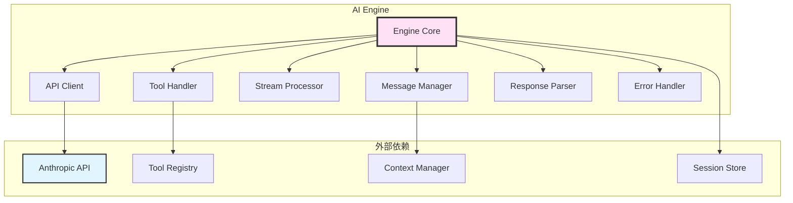
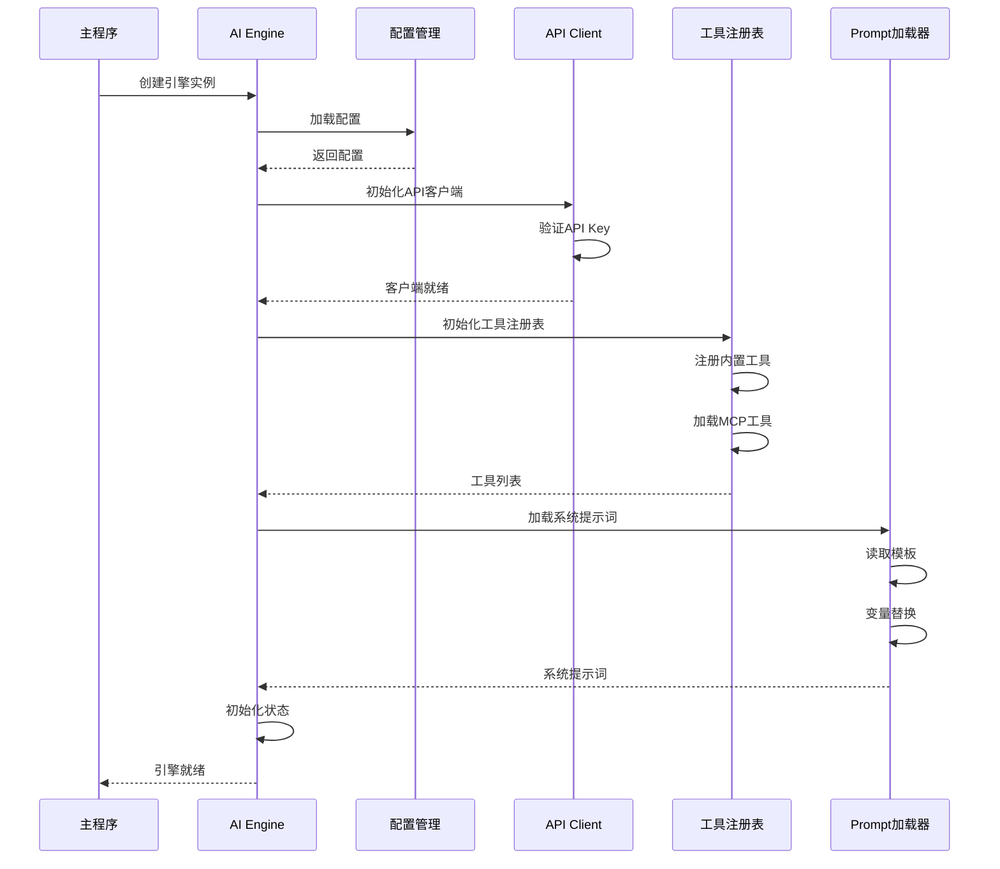
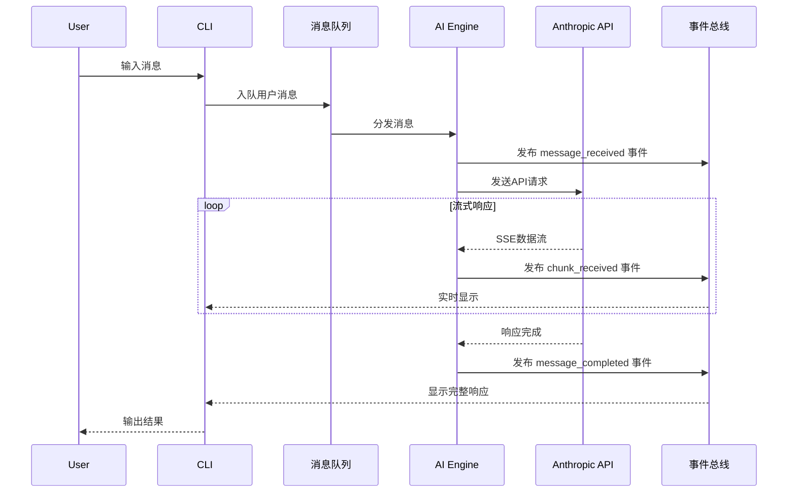
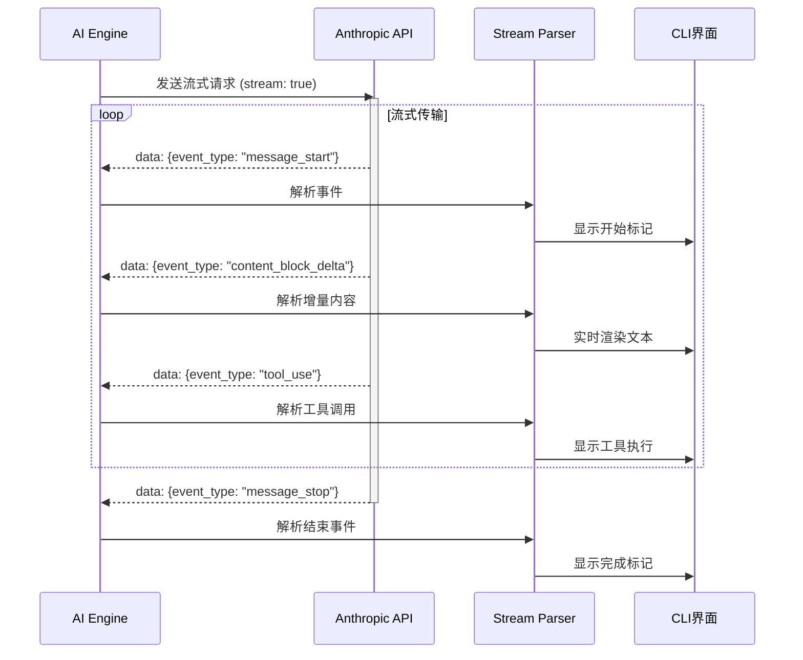
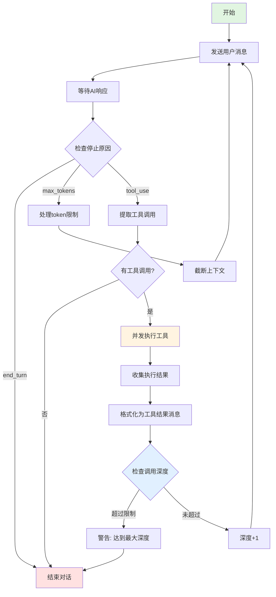

# 第2篇：核心引擎实现

## 引言

AI 引擎是 Claude Code 的"大脑"，负责理解用户意图、做出决策、调用工具、生成响应。本文将深入剖析 AI 引擎的实现原理，包括初始化流程、Prompt 工程、消息处理、流式响应和错误恢复等核心技术。

### 为什么要理解 AI 引擎？

1. **优化交互体验**：理解引擎工作原理，能更好地与 AI 沟通
2. **定制化开发**：为开发自己的 AI 应用打基础
3. **问题诊断**：快速定位和解决使用中的问题
4. **性能优化**：了解性能瓶颈，做针对性优化

### 与传统编程的区别

**传统编程**：
```
输入 → 确定性逻辑 → 输出
```

**AI 驱动编程**：
```
输入 → AI推理（概率性）→ 工具调用 → 结果整合 → 输出
```

关键差异：
- ❌ 不是完全确定性的
- ✅ 能够理解自然语言
- ✅ 具有上下文感知能力
- ✅ 可以自主决策和调用工具

---

## 一、AI 引擎整体架构

### 1.1 核心组件



### 1.2 组件职责

| 组件 | 职责 | 关键功能 |
|------|------|---------|
| **Engine Core** | 引擎核心协调器 | 生命周期管理、流程编排 |
| **Message Manager** | 消息管理 | 消息格式化、历史管理 |
| **API Client** | API通信 | HTTP请求、认证、重试 |
| **Stream Processor** | 流式处理 | SSE解析、增量输出 |
| **Tool Handler** | 工具处理 | 工具调用、结果收集 |
| **Response Parser** | 响应解析 | 内容提取、格式转换 |
| **Error Handler** | 错误处理 | 异常捕获、恢复策略 |

---

## 二、初始化流程

### 2.1 初始化流程图



### 2.2 初始化代码实现

```typescript
import Anthropic from '@anthropic-ai/sdk';
import { ToolRegistry } from './tools/registry';
import { ContextManager } from './context/manager';
import { SessionStore } from './session/store';

/**
 * AI 引擎配置接口
 */
interface AIEngineConfig {
  apiKey: string;                    // Anthropic API Key
  model?: string;                    // 模型名称
  maxTokens?: number;                // 最大token数
  temperature?: number;              // 温度参数
  systemPromptPath?: string;         // 系统提示词路径
  enableStreaming?: boolean;         // 是否启用流式响应
  enableToolCalling?: boolean;       // 是否启用工具调用
  maxToolCallDepth?: number;         // 工具调用最大深度
}

/**
 * AI 引擎核心类
 */
class AIEngine {
  private client: Anthropic;
  private config: AIEngineConfig;
  private toolRegistry: ToolRegistry;
  private contextManager: ContextManager;
  private sessionStore: SessionStore;
  private systemPrompt: string;
  private isInitialized: boolean = false;

  constructor(config: AIEngineConfig) {
    this.config = this.normalizeConfig(config);
    this.validateConfig();
  }

  /**
   * 初始化引擎
   */
  async initialize(): Promise<void> {
    console.log('🚀 初始化 AI 引擎...');

    try {
      // 1. 初始化 API 客户端
      await this.initializeAPIClient();

      // 2. 初始化工具注册表
      await this.initializeTools();

      // 3. 加载系统提示词
      await this.loadSystemPrompt();

      // 4. 初始化上下文管理器
      this.contextManager = new ContextManager({
        maxTokens: this.config.maxTokens || 100000
      });

      // 5. 初始化会话存储
      this.sessionStore = new SessionStore();

      this.isInitialized = true;
      console.log('✅ AI 引擎初始化完成');
    } catch (error) {
      console.error('❌ AI 引擎初始化失败:', error);
      throw new Error(`Engine initialization failed: ${error.message}`);
    }
  }

  /**
   * 初始化 API 客户端
   */
  private async initializeAPIClient(): Promise<void> {
    console.log('  📡 初始化 API 客户端...');

    this.client = new Anthropic({
      apiKey: this.config.apiKey,
      // 可选：自定义超时、重试等
      timeout: 60000,
      maxRetries: 3
    });

    // 验证 API Key（发送一个简单请求）
    try {
      await this.client.messages.create({
        model: this.config.model!,
        max_tokens: 10,
        messages: [{ role: 'user', content: 'test' }]
      });
      console.log('  ✅ API 客户端就绪');
    } catch (error) {
      throw new Error(`API Key validation failed: ${error.message}`);
    }
  }

  /**
   * 初始化工具注册表
   */
  private async initializeTools(): Promise<void> {
    console.log('  🔧 初始化工具注册表...');

    this.toolRegistry = new ToolRegistry();

    // 注册内置工具
    await this.toolRegistry.registerBuiltinTools();

    // 加载 MCP 工具
    await this.toolRegistry.loadMCPTools();

    const toolCount = this.toolRegistry.getToolCount();
    console.log(`  ✅ 已加载 ${toolCount} 个工具`);
  }

  /**
   * 加载系统提示词
   */
  private async loadSystemPrompt(): Promise<void> {
    console.log('  📝 加载系统提示词...');

    const promptLoader = new SystemPromptLoader();
    this.systemPrompt = await promptLoader.load(
      this.config.systemPromptPath || './prompts/system.md'
    );

    // 变量替换
    this.systemPrompt = this.replaceVariables(this.systemPrompt, {
      currentDate: new Date().toISOString().split('T')[0],
      platform: process.platform,
      workingDirectory: process.cwd()
    });

    console.log('  ✅ 系统提示词加载完成');
  }

  /**
   * 配置标准化
   */
  private normalizeConfig(config: AIEngineConfig): AIEngineConfig {
    return {
      model: 'claude-3-5-sonnet-20250929',
      maxTokens: 8000,
      temperature: 0,
      enableStreaming: true,
      enableToolCalling: true,
      maxToolCallDepth: 5,
      ...config
    };
  }

  /**
   * 配置验证
   */
  private validateConfig(): void {
    if (!this.config.apiKey) {
      throw new Error('API Key is required');
    }

    if (this.config.maxTokens! < 1 || this.config.maxTokens! > 200000) {
      throw new Error('maxTokens must be between 1 and 200000');
    }

    if (this.config.temperature! < 0 || this.config.temperature! > 1) {
      throw new Error('temperature must be between 0 and 1');
    }
  }

  /**
   * 变量替换
   */
  private replaceVariables(
    template: string,
    variables: Record<string, string>
  ): string {
    let result = template;
    for (const [key, value] of Object.entries(variables)) {
      result = result.replace(new RegExp(`{{${key}}}`, 'g'), value);
    }
    return result;
  }

  /**
   * 检查是否已初始化
   */
  private ensureInitialized(): void {
    if (!this.isInitialized) {
      throw new Error('Engine not initialized. Call initialize() first.');
    }
  }
}

export { AIEngine, AIEngineConfig };
```

---

## 三、Prompt 工程详解

### 3.1 系统提示词的作用

系统提示词（System Prompt）是 AI 引擎的"操作手册"，定义了：
- ✅ AI 的角色和能力
- ✅ 行为准则和限制
- ✅ 工具使用指南
- ✅ 输出格式要求

### 3.2 Claude Code 系统提示词结构

```markdown
# System Prompt 结构

## 1. 角色定义（Role Definition）
你是 Claude Code，Anthropic 的官方 CLI 代码编辑器...

## 2. 能力说明（Capabilities）
你可以访问以下工具：
- Read: 读取文件
- Write: 写入文件
- Edit: 编辑文件
- Bash: 执行命令
...

## 3. 行为准则（Guidelines）
- 在执行破坏性操作前必须询问用户
- 提供清晰的解释和理由
- 遵循编程最佳实践
...

## 4. 工具使用示例（Tool Usage Examples）
### 示例 1：读取文件
用户："帮我看看 README.md 的内容"
你的思考：需要使用 Read 工具
工具调用：Read(file_path="/path/to/README.md")
...

## 5. 输出格式（Output Format）
- 使用 Markdown 格式
- 代码块指定语言
- 文件引用使用 file_path:line_number 格式
...

## 6. 环境信息（Environment）
- 当前日期：{{currentDate}}
- 操作系统：{{platform}}
- 工作目录：{{workingDirectory}}
...
```

### 3.3 动态提示词生成

```typescript
/**
 * 系统提示词加载器
 */
class SystemPromptLoader {
  /**
   * 加载系统提示词
   */
  async load(promptPath: string): Promise<string> {
    // 1. 读取基础模板
    const template = await fs.readFile(promptPath, 'utf-8');

    // 2. 添加工具文档
    const toolDocs = await this.generateToolDocumentation();

    // 3. 添加项目特定信息
    const projectInfo = await this.getProjectInfo();

    // 4. 组合
    return this.combinePrompt(template, toolDocs, projectInfo);
  }

  /**
   * 生成工具文档
   */
  private async generateToolDocumentation(): Promise<string> {
    const tools = toolRegistry.getAllTools();

    let docs = '\n## Available Tools\n\n';

    for (const tool of tools) {
      docs += `### ${tool.name}\n`;
      docs += `${tool.description}\n\n`;
      docs += `**Parameters:**\n`;

      for (const [name, schema] of Object.entries(tool.input_schema.properties)) {
        const required = tool.input_schema.required?.includes(name) ? '(required)' : '(optional)';
        docs += `- \`${name}\` ${required}: ${schema.description}\n`;
      }

      docs += '\n';
    }

    return docs;
  }

  /**
   * 获取项目信息
   */
  private async getProjectInfo(): Promise<string> {
    let info = '\n## Project Context\n\n';

    // Git 信息
    try {
      const branch = await execCommand('git rev-parse --abbrev-ref HEAD');
      info += `- Current branch: ${branch}\n`;
    } catch {
      info += '- Not a git repository\n';
    }

    // package.json
    try {
      const pkg = await fs.readJSON('./package.json');
      info += `- Project: ${pkg.name}\n`;
      info += `- Version: ${pkg.version}\n`;
    } catch {
      // 忽略
    }

    return info;
  }

  /**
   * 组合提示词
   */
  private combinePrompt(
    template: string,
    toolDocs: string,
    projectInfo: string
  ): string {
    // 在模板中插入动态内容
    return template
      .replace('{{TOOL_DOCS}}', toolDocs)
      .replace('{{PROJECT_INFO}}', projectInfo);
  }
}
```

### 3.4 Few-Shot 示例设计

Few-shot 示例能显著提升 AI 的表现。

**示例选择原则**：
1. **覆盖常见场景**：文件操作、代码搜索、调试等
2. **展示最佳实践**：如何正确使用工具
3. **包含边界情况**：错误处理、权限问题等
4. **简洁明了**：每个示例3-5轮对话

**Few-Shot 示例模板**：
```markdown
## Example: 文件读取和分析

User: "帮我分析一下 src/index.ts 的代码结构"

Assistant: "好的,我来帮你分析 src/index.ts 的代码结构。"

<tool_call>
{
  "name": "Read",
  "parameters": {
    "file_path": "/project/src/index.ts"
  }
}
</tool_call>

<tool_result>
// src/index.ts
import express from 'express';
import { router } from './routes';

const app = express();
app.use(express.json());
app.use('/api', router);

app.listen(3000, () => {
  console.log('Server running on port 3000');
});
</tool_result>

Assistant: "我已经读取了 src/index.ts 文件。这是一个简单的Express服务器配置文件:

**代码结构分析**:

1. **导入模块** (第1-2行):
   - 导入Express框架
   - 导入本地路由模块

2. **应用配置** (第4-6行):
   - 创建Express应用实例
   - 添加JSON中间件
   - 将路由挂载到/api路径

3. **服务器启动** (第8-10行):
   - 监听3000端口
   - 输出启动日志

**建议**:
- 可以考虑将端口号提取为环境变量
- 添加错误处理中间件
- 考虑添加CORS配置"
```

**示例2：批量工具调用**:
```markdown
## Example: 批量文件操作

User: "帮我把tests目录下所有.spec.ts文件改成.test.ts"

Assistant: "好的,我需要先找到所有.spec.ts文件,然后逐个重命名。"

<tool_call>
{
  "name": "Glob",
  "parameters": {
    "pattern": "tests/**/*.spec.ts"
  }
}
</tool_call>

<tool_result>
tests/unit/user.spec.ts
tests/unit/auth.spec.ts
tests/integration/api.spec.ts
</tool_result>

Assistant: "找到了3个.spec.ts文件。现在我将逐个重命名:"

<tool_call>
{
  "name": "Bash",
  "parameters": {
    "command": "mv tests/unit/user.spec.ts tests/unit/user.test.ts && mv tests/unit/auth.spec.ts tests/unit/auth.test.ts && mv tests/integration/api.spec.ts tests/integration/api.test.ts"
  }
}
</tool_call>

<tool_result>
[命令执行成功]
</tool_result>

Assistant: "✅ 已完成重命名:
- tests/unit/user.spec.ts → user.test.ts
- tests/unit/auth.spec.ts → auth.test.ts  
- tests/integration/api.spec.ts → api.test.ts

所有测试文件已更新为.test.ts扩展名。"
```

---

## 四、消息队列和事件驱动架构

### 4.1 消息流转流程

Claude Code 使用事件驱动架构处理用户输入和AI响应。



### 4.2 消息队列实现

```typescript
import { EventEmitter } from 'events';

/**
 * 消息类型定义
 */
interface Message {
  id: string;                  // 消息唯一ID
  role: 'user' | 'assistant'; // 角色
  content: string | Content[]; // 内容
  timestamp: number;           // 时间戳
  metadata?: Record<string, any>; // 元数据
}

/**
 * 消息队列
 */
class MessageQueue extends EventEmitter {
  private queue: Message[] = [];
  private processing: boolean = false;
  private maxSize: number;

  constructor(maxSize: number = 1000) {
    super();
    this.maxSize = maxSize;
  }

  /**
   * 添加消息到队列
   */
  enqueue(message: Message): void {
    // 检查队列大小
    if (this.queue.length >= this.maxSize) {
      this.emit('queue_full', this.queue.length);
      // 移除最旧的消息
      this.queue.shift();
    }

    // 添加消息
    this.queue.push(message);
    this.emit('message_enqueued', message);

    // 触发处理
    this.processNext();
  }

  /**
   * 处理下一条消息
   */
  private async processNext(): Promise<void> {
    // 如果正在处理或队列为空,直接返回
    if (this.processing || this.queue.length === 0) {
      return;
    }

    this.processing = true;
    const message = this.queue[0]; // 查看但不移除

    try {
      // 发布消息处理事件
      this.emit('message_processing', message);

      // 等待处理完成
      await this.processMessage(message);

      // 处理成功,移除消息
      this.queue.shift();
      this.emit('message_processed', message);
    } catch (error) {
      this.emit('message_error', { message, error });
      // 错误处理策略
      this.handleError(message, error);
    } finally {
      this.processing = false;
      // 继续处理下一条
      setImmediate(() => this.processNext());
    }
  }

  /**
   * 处理单条消息
   */
  private async processMessage(message: Message): Promise<void> {
    return new Promise((resolve, reject) => {
      // 由外部处理器处理
      this.emit('message_ready', message, (error?: Error) => {
        if (error) {
          reject(error);
        } else {
          resolve();
        }
      });
    });
  }

  /**
   * 错误处理
   */
  private handleError(message: Message, error: Error): void {
    console.error(`消息处理失败 [${message.id}]:`, error);
    
    // 可以实现重试逻辑
    const retryCount = message.metadata?.retryCount || 0;
    if (retryCount < 3) {
      // 重新入队
      message.metadata = {
        ...message.metadata,
        retryCount: retryCount + 1
      };
      this.queue.shift(); // 移除当前
      this.queue.unshift(message); // 重新添加到队首
    } else {
      // 超过重试次数,移除消息
      this.queue.shift();
      this.emit('message_failed', { message, error });
    }
  }

  /**
   * 获取队列状态
   */
  getStatus(): { size: number; processing: boolean } {
    return {
      size: this.queue.length,
      processing: this.processing
    };
  }

  /**
   * 清空队列
   */
  clear(): void {
    this.queue = [];
    this.emit('queue_cleared');
  }
}

export { MessageQueue, Message };
```

### 4.3 事件总线实现

```typescript
/**
 * 事件总线 - 用于解耦组件通信
 */
class EventBus {
  private static instance: EventBus;
  private emitter: EventEmitter;
  private listeners: Map<string, number>;

  private constructor() {
    this.emitter = new EventEmitter();
    this.listeners = new Map();
    // 增加最大监听器数量
    this.emitter.setMaxListeners(100);
  }

  /**
   * 获取单例实例
   */
  static getInstance(): EventBus {
    if (\!EventBus.instance) {
      EventBus.instance = new EventBus();
    }
    return EventBus.instance;
  }

  /**
   * 订阅事件
   */
  on(event: string, handler: (...args: any[]) => void): void {
    this.emitter.on(event, handler);
    
    // 记录监听器数量
    const count = this.listeners.get(event) || 0;
    this.listeners.set(event, count + 1);
  }

  /**
   * 订阅一次性事件
   */
  once(event: string, handler: (...args: any[]) => void): void {
    this.emitter.once(event, handler);
  }

  /**
   * 发布事件
   */
  emit(event: string, ...args: any[]): boolean {
    return this.emitter.emit(event, ...args);
  }

  /**
   * 取消订阅
   */
  off(event: string, handler: (...args: any[]) => void): void {
    this.emitter.off(event, handler);
    
    // 更新监听器数量
    const count = this.listeners.get(event) || 0;
    if (count > 0) {
      this.listeners.set(event, count - 1);
    }
  }

  /**
   * 移除所有监听器
   */
  removeAllListeners(event?: string): void {
    if (event) {
      this.emitter.removeAllListeners(event);
      this.listeners.delete(event);
    } else {
      this.emitter.removeAllListeners();
      this.listeners.clear();
    }
  }

  /**
   * 获取事件统计
   */
  getStats(): Record<string, number> {
    const stats: Record<string, number> = {};
    this.listeners.forEach((count, event) => {
      stats[event] = count;
    });
    return stats;
  }
}

// 导出单例
export default EventBus.getInstance();
```

### 4.4 事件类型定义

```typescript
/**
 * 系统事件类型
 */
enum SystemEvent {
  // 引擎生命周期
  ENGINE_INITIALIZED = 'engine:initialized',
  ENGINE_SHUTDOWN = 'engine:shutdown',
  
  // 消息事件
  MESSAGE_RECEIVED = 'message:received',
  MESSAGE_PROCESSING = 'message:processing',
  MESSAGE_COMPLETED = 'message:completed',
  MESSAGE_ERROR = 'message:error',
  
  // 流式响应事件
  STREAM_START = 'stream:start',
  STREAM_CHUNK = 'stream:chunk',
  STREAM_END = 'stream:end',
  STREAM_ERROR = 'stream:error',
  
  // 工具调用事件
  TOOL_CALL_START = 'tool:call:start',
  TOOL_CALL_COMPLETE = 'tool:call:complete',
  TOOL_CALL_ERROR = 'tool:call:error',
  
  // 上下文事件
  CONTEXT_UPDATED = 'context:updated',
  CONTEXT_CLEARED = 'context:cleared',
}

export { SystemEvent };
```

---

## 五、流式响应处理

### 5.1 SSE (Server-Sent Events) 原理

Anthropic API 使用 SSE 协议实现流式响应,这让 Claude Code 能够实时显示AI的思考过程。



### 5.2 流式处理器实现

```typescript
import { Anthropic } from '@anthropic-ai/sdk';

/**
 * SSE事件类型
 */
enum SSEEventType {
  MESSAGE_START = 'message_start',
  CONTENT_BLOCK_START = 'content_block_start',
  CONTENT_BLOCK_DELTA = 'content_block_delta',
  CONTENT_BLOCK_STOP = 'content_block_stop',
  MESSAGE_DELTA = 'message_delta',
  MESSAGE_STOP = 'message_stop',
  PING = 'ping',
  ERROR = 'error'
}

/**
 * 流式响应处理器
 */
class StreamProcessor {
  private buffer: string = '';
  private currentBlock: any = null;
  private messageId: string = '';

  /**
   * 处理流式响应
   */
  async processStream(
    stream: AsyncIterable<Anthropic.MessageStreamEvent>,
    onChunk: (chunk: ProcessedChunk) => void,
    onComplete: (message: any) => void,
    onError: (error: Error) => void
  ): Promise<void> {
    try {
      for await (const event of stream) {
        const processed = this.processEvent(event);

        if (processed) {
          onChunk(processed);
        }

        // 检查是否完成
        if (event.type === 'message_stop') {
          onComplete(this.buildCompleteMessage());
        }
      }
    } catch (error) {
      onError(error as Error);
    }
  }

  /**
   * 处理单个SSE事件
   */
  private processEvent(event: Anthropic.MessageStreamEvent): ProcessedChunk | null {
    switch (event.type) {
      case 'message_start':
        return this.handleMessageStart(event);

      case 'content_block_start':
        return this.handleContentBlockStart(event);

      case 'content_block_delta':
        return this.handleContentBlockDelta(event);

      case 'content_block_stop':
        return this.handleContentBlockStop(event);

      case 'message_delta':
        return this.handleMessageDelta(event);

      default:
        return null;
    }
  }

  /**
   * 处理消息开始
   */
  private handleMessageStart(event: any): ProcessedChunk {
    this.messageId = event.message.id;

    return {
      type: 'message_start',
      messageId: this.messageId,
      model: event.message.model,
      role: event.message.role
    };
  }

  /**
   * 处理内容块开始
   */
  private handleContentBlockStart(event: any): ProcessedChunk {
    const block = event.content_block;
    this.currentBlock = block;

    if (block.type === 'text') {
      return {
        type: 'text_start',
        index: event.index
      };
    } else if (block.type === 'tool_use') {
      return {
        type: 'tool_start',
        toolName: block.name,
        toolId: block.id,
        index: event.index
      };
    }

    return null;
  }

  /**
   * 处理内容块增量
   */
  private handleContentBlockDelta(event: any): ProcessedChunk {
    const delta = event.delta;

    if (delta.type === 'text_delta') {
      // 文本增量
      this.buffer += delta.text;

      return {
        type: 'text_delta',
        text: delta.text,
        index: event.index
      };
    } else if (delta.type === 'input_json_delta') {
      // 工具输入JSON增量
      return {
        type: 'tool_input_delta',
        partialJson: delta.partial_json,
        index: event.index
      };
    }

    return null;
  }

  /**
   * 处理内容块停止
   */
  private handleContentBlockStop(event: any): ProcessedChunk {
    const result: ProcessedChunk = {
      type: 'block_stop',
      index: event.index
    };

    // 如果是文本块,附加完整文本
    if (this.currentBlock?.type === 'text') {
      result.completeText = this.buffer;
      this.buffer = '';
    }

    this.currentBlock = null;
    return result;
  }

  /**
   * 处理消息增量（usage等）
   */
  private handleMessageDelta(event: any): ProcessedChunk | null {
    if (event.delta.stop_reason) {
      return {
        type: 'stop_reason',
        reason: event.delta.stop_reason,
        usage: event.usage
      };
    }
    return null;
  }

  /**
   * 构建完整消息
   */
  private buildCompleteMessage(): any {
    return {
      id: this.messageId,
      // ... 其他消息字段
    };
  }
}

/**
 * 处理后的数据块
 */
interface ProcessedChunk {
  type: string;
  [key: string]: any;
}

export { StreamProcessor, SSEEventType, ProcessedChunk };
```

### 5.3 增量解析器

```typescript
/**
 * JSON增量解析器 - 用于解析工具调用的JSON参数
 */
class IncrementalJSONParser {
  private buffer: string = '';
  private depth: number = 0;
  private inString: boolean = false;
  private escapeNext: boolean = false;

  /**
   * 添加新的JSON片段
   */
  append(chunk: string): void {
    this.buffer += chunk;
  }

  /**
   * 尝试解析当前缓冲区
   * @returns 如果能解析为完整JSON则返回对象,否则返回null
   */
  tryParse(): any | null {
    try {
      return JSON.parse(this.buffer);
    } catch {
      return null;
    }
  }

  /**
   * 检查当前是否可能是完整JSON
   */
  isComplete(): boolean {
    // 简单的完整性检查
    if (!this.buffer.trim()) {
      return false;
    }

    let depth = 0;
    let inString = false;
    let escape = false;

    for (const char of this.buffer) {
      if (escape) {
        escape = false;
        continue;
      }

      if (char === '\\') {
        escape = true;
        continue;
      }

      if (char === '"') {
        inString = !inString;
        continue;
      }

      if (inString) {
        continue;
      }

      if (char === '{' || char === '[') {
        depth++;
      } else if (char === '}' || char === ']') {
        depth--;
      }
    }

    return depth === 0 && !inString;
  }

  /**
   * 获取部分解析的结果（用于显示）
   */
  getPartialResult(): Record<string, any> {
    // 尝试解析已完整的键值对
    const result: Record<string, any> = {};

    // 使用正则提取完整的键值对
    const regex = /"(\w+)"\s*:\s*("(?:[^"\\]|\\.)*"|[^,}\]]+)/g;
    let match;

    while ((match = regex.exec(this.buffer)) !== null) {
      const key = match[1];
      let value = match[2].trim();

      // 解析值
      try {
        if (value.startsWith('"') && value.endsWith('"')) {
          value = JSON.parse(value);
        } else if (value === 'true') {
          value = true;
        } else if (value === 'false') {
          value = false;
        } else if (value === 'null') {
          value = null;
        } else if (!isNaN(Number(value))) {
          value = Number(value);
        }

        result[key] = value;
      } catch {
        // 忽略解析错误
      }
    }

    return result;
  }

  /**
   * 重置解析器
   */
  reset(): void {
    this.buffer = '';
    this.depth = 0;
    this.inString = false;
    this.escapeNext = false;
  }
}

export { IncrementalJSONParser };
```

### 5.4 流式渲染示例

```typescript
import EventBus from './event-bus';
import { SystemEvent } from './events';
import { StreamProcessor } from './stream-processor';

/**
 * 流式响应管理器
 */
class StreamingResponseManager {
  private streamProcessor: StreamProcessor;
  private currentToolCall: { name: string; input: string } | null = null;

  constructor() {
    this.streamProcessor = new StreamProcessor();
    this.setupEventHandlers();
  }

  /**
   * 开始处理流式响应
   */
  async handleStreamingResponse(
    stream: AsyncIterable<any>
  ): Promise<void> {
    await this.streamProcessor.processStream(
      stream,
      (chunk) => this.onChunk(chunk),
      (message) => this.onComplete(message),
      (error) => this.onError(error)
    );
  }

  /**
   * 处理数据块
   */
  private onChunk(chunk: any): void {
    switch (chunk.type) {
      case 'message_start':
        console.log(`\n[AI开始响应 - ${chunk.model}]`);
        EventBus.emit(SystemEvent.STREAM_START, chunk);
        break;

      case 'text_delta':
        // 实时输出文本
        process.stdout.write(chunk.text);
        EventBus.emit(SystemEvent.STREAM_CHUNK, chunk);
        break;

      case 'tool_start':
        console.log(`\n🔧 调用工具: ${chunk.toolName}`);
        this.currentToolCall = {
          name: chunk.toolName,
          input: ''
        };
        break;

      case 'tool_input_delta':
        // 累积工具输入
        if (this.currentToolCall) {
          this.currentToolCall.input += chunk.partialJson;
        }
        break;

      case 'block_stop':
        if (this.currentToolCall) {
          try {
            const input = JSON.parse(this.currentToolCall.input);
            console.log('  参数:', JSON.stringify(input, null, 2));

            EventBus.emit(SystemEvent.TOOL_CALL_START, {
              name: this.currentToolCall.name,
              input
            });
          } catch {
            console.log('  参数解析中...');
          }
          this.currentToolCall = null;
        }
        break;

      case 'stop_reason':
        console.log(`\n[停止原因: ${chunk.reason}]`);
        if (chunk.usage) {
          console.log(`[Token使用: 输入=${chunk.usage.input_tokens}, 输出=${chunk.usage.output_tokens}]`);
        }
        break;
    }
  }

  /**
   * 响应完成
   */
  private onComplete(message: any): void {
    console.log('\n[AI响应完成]\n');
    EventBus.emit(SystemEvent.STREAM_END, message);
  }

  /**
   * 错误处理
   */
  private onError(error: Error): void {
    console.error('\n❌ 流式响应错误:', error.message);
    EventBus.emit(SystemEvent.STREAM_ERROR, error);
  }

  /**
   * 设置事件处理器
   */
  private setupEventHandlers(): void {
    EventBus.on(SystemEvent.TOOL_CALL_COMPLETE, (result) => {
      console.log('✅ 工具执行完成');
    });

    EventBus.on(SystemEvent.TOOL_CALL_ERROR, (error) => {
      console.error('❌ 工具执行失败:', error.message);
    });
  }
}

export { StreamingResponseManager };
```

---

## 六、工具调用循环

### 6.1 工具调用流程



### 6.2 工具调用循环实现

```typescript
/**
 * 工具调用循环管理器
 */
class ToolCallLoop {
  private client: Anthropic;
  private toolRegistry: ToolRegistry;
  private maxDepth: number;
  private currentDepth: number = 0;

  constructor(
    client: Anthropic,
    toolRegistry: ToolRegistry,
    maxDepth: number = 5
  ) {
    this.client = client;
    this.toolRegistry = toolRegistry;
    this.maxDepth = maxDepth;
  }

  /**
   * 执行对话循环（带工具调用）
   */
  async executeConversation(
    messages: Anthropic.MessageParam[],
    systemPrompt: string
  ): Promise<Anthropic.Message> {
    let currentMessages = [...messages];
    this.currentDepth = 0;

    while (this.currentDepth < this.maxDepth) {
      console.log(`\n=== 循环轮次 ${this.currentDepth + 1} ===`);

      // 1. 调用API
      const response = await this.client.messages.create({
        model: 'claude-3-5-sonnet-20250929',
        max_tokens: 8000,
        system: systemPrompt,
        messages: currentMessages,
        tools: this.toolRegistry.getToolDefinitions(),
        stream: true
      });

      // 2. 处理流式响应
      const message = await this.processStreamResponse(response);

      // 3. 添加AI响应到消息历史
      currentMessages.push({
        role: 'assistant',
        content: message.content
      });

      // 4. 检查停止原因
      if (message.stop_reason === 'end_turn') {
        console.log('✅ 对话正常结束');
        return message;
      }

      if (message.stop_reason === 'max_tokens') {
        console.log('⚠️  达到token限制,尝试截断上下文');
        currentMessages = this.truncateContext(currentMessages);
        continue;
      }

      if (message.stop_reason === 'tool_use') {
        console.log('🔧 检测到工具调用');

        // 5. 提取并执行工具
        const toolCalls = this.extractToolCalls(message.content);
        if (toolCalls.length === 0) {
          console.log('⚠️  未找到工具调用,结束循环');
          return message;
        }

        // 6. 并发执行工具
        const toolResults = await this.executeTools(toolCalls);

        // 7. 添加工具结果到消息历史
        currentMessages.push({
          role: 'user',
          content: toolResults
        });

        // 8. 增加深度计数
        this.currentDepth++;
      } else {
        // 未知停止原因
        console.log(`⚠️  未知停止原因: ${message.stop_reason}`);
        return message;
      }
    }

    // 达到最大深度
    console.warn(`⚠️  达到最大工具调用深度: ${this.maxDepth}`);
    throw new Error(`Maximum tool call depth (${this.maxDepth}) exceeded`);
  }

  /**
   * 处理流式响应
   */
  private async processStreamResponse(
    stream: AsyncIterable<Anthropic.MessageStreamEvent>
  ): Promise<Anthropic.Message> {
    const message: Partial<Anthropic.Message> = {
      id: '',
      model: '',
      role: 'assistant',
      content: [],
      stop_reason: null,
      usage: { input_tokens: 0, output_tokens: 0 }
    };

    for await (const event of stream) {
      switch (event.type) {
        case 'message_start':
          message.id = event.message.id;
          message.model = event.message.model;
          message.role = event.message.role;
          message.usage = event.message.usage;
          break;

        case 'content_block_start':
          message.content!.push(event.content_block);
          break;

        case 'content_block_delta':
          const lastBlock = message.content![message.content!.length - 1];
          if (event.delta.type === 'text_delta') {
            (lastBlock as any).text += event.delta.text;
            process.stdout.write(event.delta.text);
          } else if (event.delta.type === 'input_json_delta') {
            (lastBlock as any).input += event.delta.partial_json;
          }
          break;

        case 'message_delta':
          if (event.delta.stop_reason) {
            message.stop_reason = event.delta.stop_reason;
          }
          if (event.usage) {
            message.usage!.output_tokens = event.usage.output_tokens;
          }
          break;
      }
    }

    return message as Anthropic.Message;
  }

  /**
   * 提取工具调用
   */
  private extractToolCalls(content: any[]): ToolCall[] {
    return content
      .filter(block => block.type === 'tool_use')
      .map(block => ({
        id: block.id,
        name: block.name,
        input: block.input
      }));
  }

  /**
   * 并发执行多个工具
   */
  private async executeTools(toolCalls: ToolCall[]): Promise<any[]> {
    console.log(`\n执行 ${toolCalls.length} 个工具调用...`);

    const results = await Promise.allSettled(
      toolCalls.map(async (call) => {
        try {
          console.log(`  • ${call.name}...`);
          const result = await this.toolRegistry.executeTool(
            call.name,
            call.input
          );
          console.log(`    ✅ ${call.name} 完成`);

          return {
            type: 'tool_result',
            tool_use_id: call.id,
            content: JSON.stringify(result)
          };
        } catch (error) {
          console.error(`    ❌ ${call.name} 失败:`, error.message);

          return {
            type: 'tool_result',
            tool_use_id: call.id,
            content: `Error: ${error.message}`,
            is_error: true
          };
        }
      })
    );

    // 提取结果（包括成功和失败的）
    return results.map(r =>
      r.status === 'fulfilled' ? r.value : r.reason
    );
  }

  /**
   * 截断上下文（当达到token限制时）
   */
  private truncateContext(messages: Anthropic.MessageParam[]): Anthropic.MessageParam[] {
    // 保留最近的N条消息
    const keepCount = Math.floor(messages.length * 0.7);
    return messages.slice(-keepCount);
  }
}

interface ToolCall {
  id: string;
  name: string;
  input: Record<string, any>;
}

export { ToolCallLoop, ToolCall };
```

### 6.3 完整使用示例

```typescript
/**
 * 完整示例：处理用户请求并自动调用工具
 */
async function handleUserRequest(userMessage: string): Promise<void> {
  // 1. 初始化
  const engine = new AIEngine({
    apiKey: process.env.ANTHROPIC_API_KEY!
  });
  await engine.initialize();

  // 2. 创建工具调用循环
  const toolLoop = new ToolCallLoop(
    engine.client,
    engine.toolRegistry,
    5 // 最大深度
  );

  // 3. 准备消息
  const messages: Anthropic.MessageParam[] = [
    {
      role: 'user',
      content: userMessage
    }
  ];

  try {
    // 4. 执行对话循环
    const finalResponse = await toolLoop.executeConversation(
      messages,
      engine.systemPrompt
    );

    // 5. 提取最终文本响应
    const textContent = finalResponse.content
      .filter(block => block.type === 'text')
      .map(block => (block as any).text)
      .join('\n');

    console.log('\n\n=== 最终响应 ===');
    console.log(textContent);

    // 6. 显示统计信息
    console.log('\n=== 统计信息 ===');
    console.log(`Token使用: 输入=${finalResponse.usage.input_tokens}, 输出=${finalResponse.usage.output_tokens}`);
    console.log(`工具调用深度: ${toolLoop.currentDepth}`);
  } catch (error) {
    console.error('❌ 处理失败:', error.message);
  }
}

// 使用示例
handleUserRequest('帮我分析项目中所有TypeScript文件的导入依赖关系');
```

---

## 七、错误恢复机制

### 7.1 错误类型和处理策略

```typescript
/**
 * 错误类型枚举
 */
enum ErrorType {
  // API错误
  API_ERROR = 'api_error',
  AUTH_ERROR = 'auth_error',
  RATE_LIMIT = 'rate_limit',
  NETWORK_ERROR = 'network_error',
  TIMEOUT = 'timeout',

  // 工具错误
  TOOL_NOT_FOUND = 'tool_not_found',
  TOOL_EXECUTION_ERROR = 'tool_execution_error',
  TOOL_TIMEOUT = 'tool_timeout',

  // 上下文错误
  CONTEXT_TOO_LARGE = 'context_too_large',
  INVALID_MESSAGE = 'invalid_message',

  // 系统错误
  INTERNAL_ERROR = 'internal_error',
  OUT_OF_MEMORY = 'out_of_memory'
}

/**
 * 错误恢复策略
 */
interface RecoveryStrategy {
  maxRetries: number;      // 最大重试次数
  retryDelay: number;      // 重试延迟(ms)
  backoffMultiplier: number; // 退避乘数
  fallback?: () => Promise<any>; // 回退方案
}

/**
 * 错误处理器
 */
class ErrorHandler {
  private retryCount: Map<string, number> = new Map();
  private strategies: Map<ErrorType, RecoveryStrategy> = new Map();

  constructor() {
    this.initializeStrategies();
  }

  /**
   * 初始化错误恢复策略
   */
  private initializeStrategies(): void {
    // API错误 - 重试3次
    this.strategies.set(ErrorType.API_ERROR, {
      maxRetries: 3,
      retryDelay: 1000,
      backoffMultiplier: 2
    });

    // 速率限制 - 重试5次,长延迟
    this.strategies.set(ErrorType.RATE_LIMIT, {
      maxRetries: 5,
      retryDelay: 5000,
      backoffMultiplier: 2
    });

    // 网络错误 - 重试5次
    this.strategies.set(ErrorType.NETWORK_ERROR, {
      maxRetries: 5,
      retryDelay: 2000,
      backoffMultiplier: 1.5
    });

    // 超时 - 重试2次
    this.strategies.set(ErrorType.TIMEOUT, {
      maxRetries: 2,
      retryDelay: 3000,
      backoffMultiplier: 1
    });

    // 工具执行错误 - 不重试,使用回退
    this.strategies.set(ErrorType.TOOL_EXECUTION_ERROR, {
      maxRetries: 0,
      retryDelay: 0,
      backoffMultiplier: 1,
      fallback: async () => {
        return { error: '工具执行失败', success: false };
      }
    });

    // 上下文过大 - 不重试,立即截断
    this.strategies.set(ErrorType.CONTEXT_TOO_LARGE, {
      maxRetries: 0,
      retryDelay: 0,
      backoffMultiplier: 1
    });
  }

  /**
   * 处理错误并尝试恢复
   */
  async handleError<T>(
    operation: () => Promise<T>,
    errorType: ErrorType,
    operationId: string
  ): Promise<T> {
    const strategy = this.strategies.get(errorType);
    if (!strategy) {
      throw new Error(`No recovery strategy for error type: ${errorType}`);
    }

    let lastError: Error;
    const retryKey = `${errorType}:${operationId}`;
    const currentRetries = this.retryCount.get(retryKey) || 0;

    for (let attempt = 0; attempt <= strategy.maxRetries; attempt++) {
      try {
        const result = await operation();
        // 成功,重置重试计数
        this.retryCount.delete(retryKey);
        return result;
      } catch (error) {
        lastError = error as Error;

        console.warn(
          `操作失败 (尝试 ${attempt + 1}/${strategy.maxRetries + 1}):`,
          error.message
        );

        // 检查是否还能重试
        if (attempt < strategy.maxRetries) {
          // 计算延迟（指数退避）
          const delay = strategy.retryDelay * Math.pow(
            strategy.backoffMultiplier,
            attempt
          );

          console.log(`等待 ${delay}ms 后重试...`);
          await this.sleep(delay);

          // 更新重试计数
          this.retryCount.set(retryKey, currentRetries + 1);
        }
      }
    }

    // 所有重试都失败了
    console.error(`操作最终失败: ${lastError!.message}`);

    // 尝试回退方案
    if (strategy.fallback) {
      console.log('尝试回退方案...');
      try {
        return await strategy.fallback();
      } catch (fallbackError) {
        console.error('回退方案也失败了:', fallbackError);
      }
    }

    // 抛出原始错误
    throw lastError!;
  }

  /**
   * 辅助:睡眠函数
   */
  private sleep(ms: number): Promise<void> {
    return new Promise(resolve => setTimeout(resolve, ms));
  }

  /**
   * 分类错误类型
   */
  classifyError(error: any): ErrorType {
    const message = error.message?.toLowerCase() || '';
    const status = error.status || error.statusCode;

    // 认证错误
    if (status === 401 || message.includes('unauthorized')) {
      return ErrorType.AUTH_ERROR;
    }

    // 速率限制
    if (status === 429 || message.includes('rate limit')) {
      return ErrorType.RATE_LIMIT;
    }

    // 超时
    if (message.includes('timeout') || message.includes('timed out')) {
      return ErrorType.TIMEOUT;
    }

    // 网络错误
    if (message.includes('network') || message.includes('connect')) {
      return ErrorType.NETWORK_ERROR;
    }

    // 上下文过大
    if (message.includes('context') || message.includes('too large')) {
      return ErrorType.CONTEXT_TOO_LARGE;
    }

    // 默认为API错误
    return ErrorType.API_ERROR;
  }

  /**
   * 获取重试统计
   */
  getRetryStats(): Map<string, number> {
    return new Map(this.retryCount);
  }

  /**
   * 清空重试计数
   */
  clearRetryStats(): void {
    this.retryCount.clear();
  }
}

export { ErrorHandler, ErrorType, RecoveryStrategy };
```

### 7.2 实际使用示例

```typescript
/**
 * 在AI引擎中集成错误处理
 */
class AIEngineWithErrorHandling {
  private client: Anthropic;
  private errorHandler: ErrorHandler;

  constructor(config: AIEngineConfig) {
    this.client = new Anthropic({ apiKey: config.apiKey });
    this.errorHandler = new ErrorHandler();
  }

  /**
   * 发送消息(带错误处理)
   */
  async sendMessage(messages: Anthropic.MessageParam[]): Promise<Anthropic.Message> {
    return this.errorHandler.handleError(
      async () => {
        return await this.client.messages.create({
          model: 'claude-3-5-sonnet-20250929',
          max_tokens: 8000,
          messages
        });
      },
      ErrorType.API_ERROR,
      'send_message'
    );
  }

  /**
   * 执行工具(带错误处理)
   */
  async executeTool(toolName: string, input: any): Promise<any> {
    return this.errorHandler.handleError(
      async () => {
        const tool = this.toolRegistry.getTool(toolName);
        if (!tool) {
          throw new Error(`Tool not found: ${toolName}`);
        }
        return await tool.execute(input);
      },
      ErrorType.TOOL_EXECUTION_ERROR,
      `tool_${toolName}`
    );
  }

  /**
   * 全局错误处理
   */
  async executeWithErrorHandling<T>(
    operation: () => Promise<T>
  ): Promise<T> {
    try {
      return await operation();
    } catch (error) {
      // 分类错误
      const errorType = this.errorHandler.classifyError(error);

      // 尝试恢复
      return await this.errorHandler.handleError(
        operation,
        errorType,
        'global_operation'
      );
    }
  }
}
```

---

## 八、性能优化

### 8.1 性能优化策略

| 优化点 | 策略 | 效果 |
|--------|------|------|
| **API调用** | 请求合并、批处理 | 减少网络往返 |
| **上下文管理** | 智能截断、压缩 | 降低Token消耗 |
| **工具执行** | 并发执行、缓存 | 提升响应速度 |
| **流式渲染** | 增量更新、节流 | 优化UI性能 |
| **内存管理** | 对象池、及时释放 | 减少GC压力 |

### 8.2 上下文优化

```typescript
/**
 * 上下文优化器
 */
class ContextOptimizer {
  private maxTokens: number;
  private tokenCounter: TokenCounter;

  constructor(maxTokens: number = 100000) {
    this.maxTokens = maxTokens;
    this.tokenCounter = new TokenCounter();
  }

  /**
   * 优化消息历史
   */
  optimizeMessages(messages: Anthropic.MessageParam[]): Anthropic.MessageParam[] {
    // 1. 计算当前token数
    const currentTokens = this.tokenCounter.countMessages(messages);

    if (currentTokens <= this.maxTokens * 0.8) {
      // 未达到阈值,无需优化
      return messages;
    }

    console.log(`上下文优化: ${currentTokens} tokens -> 目标: ${this.maxTokens * 0.7} tokens`);

    // 2. 执行优化策略
    let optimized = messages;

    // 策略1: 移除旧消息（保留系统消息和最近N条）
    optimized = this.removeOldMessages(optimized);

    // 策略2: 压缩工具结果
    optimized = this.compressToolResults(optimized);

    // 策略3: 总结历史对话
    // optimized = await this.summarizeHistory(optimized);

    const newTokens = this.tokenCounter.countMessages(optimized);
    console.log(`优化完成: ${newTokens} tokens (减少 ${currentTokens - newTokens})`);

    return optimized;
  }

  /**
   * 移除旧消息
   */
  private removeOldMessages(messages: Anthropic.MessageParam[]): Anthropic.MessageParam[] {
    // 保留最近20条消息
    const keepCount = Math.min(20, messages.length);
    return messages.slice(-keepCount);
  }

  /**
   * 压缩工具结果
   */
  private compressToolResults(messages: Anthropic.MessageParam[]): Anthropic.MessageParam[] {
    return messages.map(msg => {
      if (msg.role === 'user' && Array.isArray(msg.content)) {
        // 查找工具结果
        const compressed = msg.content.map(block => {
          if (block.type === 'tool_result') {
            const content = block.content;
            if (typeof content === 'string' && content.length > 1000) {
              // 截断长内容
              return {
                ...block,
                content: content.slice(0, 1000) + '\n... (truncated)'
              };
            }
          }
          return block;
        });

        return { ...msg, content: compressed };
      }
      return msg;
    });
  }
}

/**
 * Token计数器（简化版）
 */
class TokenCounter {
  /**
   * 计算消息的token数（粗略估算）
   */
  countMessages(messages: Anthropic.MessageParam[]): number {
    let total = 0;

    for (const msg of messages) {
      if (typeof msg.content === 'string') {
        total += this.estimateTokens(msg.content);
      } else if (Array.isArray(msg.content)) {
        for (const block of msg.content) {
          if ('text' in block) {
            total += this.estimateTokens(block.text);
          } else if ('content' in block) {
            total += this.estimateTokens(String(block.content));
          }
        }
      }
    }

    return total;
  }

  /**
   * 估算文本的token数
   * 简化算法: 英文约4字符=1 token, 中文约1.5字符=1 token
   */
  private estimateTokens(text: string): number {
    // 统计中英文字符
    const chineseChars = (text.match(/[\u4e00-\u9fa5]/g) || []).length;
    const otherChars = text.length - chineseChars;

    return Math.ceil(chineseChars / 1.5 + otherChars / 4);
  }
}

export { ContextOptimizer, TokenCounter };
```

### 8.3 工具执行并发控制

```typescript
/**
 * 并发限制器
 */
class ConcurrencyLimiter {
  private maxConcurrent: number;
  private running: number = 0;
  private queue: Array<() => void> = [];

  constructor(maxConcurrent: number = 5) {
    this.maxConcurrent = maxConcurrent;
  }

  /**
   * 执行任务(带并发控制)
   */
  async execute<T>(task: () => Promise<T>): Promise<T> {
    // 等待获取执行权
    await this.waitForSlot();

    this.running++;

    try {
      return await task();
    } finally {
      this.running--;
      this.releaseSlot();
    }
  }

  /**
   * 等待空闲槽位
   */
  private waitForSlot(): Promise<void> {
    if (this.running < this.maxConcurrent) {
      return Promise.resolve();
    }

    return new Promise(resolve => {
      this.queue.push(resolve);
    });
  }

  /**
   * 释放槽位
   */
  private releaseSlot(): void {
    const next = this.queue.shift();
    if (next) {
      next();
    }
  }

  /**
   * 获取状态
   */
  getStatus(): { running: number; queued: number } {
    return {
      running: this.running,
      queued: this.queue.length
    };
  }
}

/**
 * 带缓存的工具执行器
 */
class CachedToolExecutor {
  private cache: Map<string, { result: any; timestamp: number }> = new Map();
  private cacheTTL: number = 60000; // 1分钟
  private limiter: ConcurrencyLimiter;

  constructor(maxConcurrent: number = 5) {
    this.limiter = new ConcurrencyLimiter(maxConcurrent);
  }

  /**
   * 执行工具(带缓存)
   */
  async executeTool(
    toolName: string,
    input: any,
    options: { useCache?: boolean } = {}
  ): Promise<any> {
    // 生成缓存键
    const cacheKey = this.generateCacheKey(toolName, input);

    // 检查缓存
    if (options.useCache !== false) {
      const cached = this.getFromCache(cacheKey);
      if (cached) {
        console.log(`✅ 使用缓存: ${toolName}`);
        return cached;
      }
    }

    // 执行工具(带并发控制)
    const result = await this.limiter.execute(async () => {
      console.log(`🔧 执行: ${toolName}`);
      const tool = toolRegistry.getTool(toolName);
      return await tool.execute(input);
    });

    // 存入缓存
    if (options.useCache !== false) {
      this.setToCache(cacheKey, result);
    }

    return result;
  }

  /**
   * 生成缓存键
   */
  private generateCacheKey(toolName: string, input: any): string {
    return `${toolName}:${JSON.stringify(input)}`;
  }

  /**
   * 从缓存获取
   */
  private getFromCache(key: string): any | null {
    const entry = this.cache.get(key);
    if (!entry) {
      return null;
    }

    // 检查是否过期
    if (Date.now() - entry.timestamp > this.cacheTTL) {
      this.cache.delete(key);
      return null;
    }

    return entry.result;
  }

  /**
   * 存入缓存
   */
  private setToCache(key: string, result: any): void {
    this.cache.set(key, {
      result,
      timestamp: Date.now()
    });
  }

  /**
   * 清理过期缓存
   */
  cleanupCache(): void {
    const now = Date.now();
    for (const [key, entry] of this.cache.entries()) {
      if (now - entry.timestamp > this.cacheTTL) {
        this.cache.delete(key);
      }
    }
  }
}

export { ConcurrencyLimiter, CachedToolExecutor };
```

---

## 九、常见问题 FAQ

### Q1: 为什么AI有时会"幻觉"？

**原因**:
- 训练数据中的错误信息
- 对不确定信息的过度推测
- 上下文信息不足

**解决方案**:
```typescript
// 1. 在系统提示词中强调准确性
const systemPrompt = `
你必须:
- 对不确定的信息明确说明
- 引用工具返回的实际数据
- 不要推测或编造信息
`;

// 2. 使用工具验证信息
if (needsVerification) {
  await toolRegistry.executeTool('Read', { file_path: '/path/to/file' });
}
```

### Q2: 如何控制AI的Token消耗？

**方法**:

1. **优化系统提示词**: 移除冗余说明
2. **智能截断上下文**: 只保留必要的历史消息
3. **压缩工具结果**: 截断长输出
4. **使用流式响应**: 可以提前中断

```typescript
// 示例:设置合理的max_tokens
const response = await client.messages.create({
  model: 'claude-3-5-sonnet-20250929',
  max_tokens: 2000, // 而不是8000
  messages: optimizedMessages
});
```

### Q3: 工具调用失败如何处理？

**策略**:

```typescript
// 1. 返回错误信息给AI,让它决定如何处理
const toolResult = {
  type: 'tool_result',
  tool_use_id: callId,
  content: `Error: ${error.message}`,
  is_error: true
};

// 2. 实现重试机制
const result = await retryWithBackoff(
  () => tool.execute(input),
  { maxRetries: 3, delay: 1000 }
);

// 3. 提供回退方案
try {
  return await primaryTool.execute(input);
} catch {
  return await fallbackTool.execute(input);
}
```

### Q4: 如何调试AI的决策过程？

**方法**:

```typescript
// 1. 启用详细日志
EventBus.on(SystemEvent.TOOL_CALL_START, (event) => {
  console.log('工具调用:', JSON.stringify(event, null, 2));
});

// 2. 保存完整对话历史
const debugLog = messages.map(msg => ({
  role: msg.role,
  content: JSON.stringify(msg.content)
}));
fs.writeFileSync('debug.json', JSON.stringify(debugLog, null, 2));

// 3. 在提示词中要求AI解释推理
const systemPrompt = `
在执行操作前,请简要说明你的推理过程。
`;
```

### Q5: 流式响应中断如何处理？

```typescript
// 设置超时和中断处理
const controller = new AbortController();
const timeout = setTimeout(() => controller.abort(), 30000);

try {
  const stream = await client.messages.create({
    model: 'claude-3-5-sonnet-20250929',
    messages,
    stream: true,
    signal: controller.signal // 传入信号
  });

  for await (const event of stream) {
    // 处理事件
  }
} catch (error) {
  if (error.name === 'AbortError') {
    console.log('流式响应超时,使用部分结果');
  }
} finally {
  clearTimeout(timeout);
}
```

---

## 十、扩展阅读

### 10.1 官方文档

1. **Anthropic API 文档**
   - URL: https://docs.anthropic.com/
   - 内容: API完整参考、最佳实践

2. **Tool Use 指南**
   - URL: https://docs.anthropic.com/claude/docs/tool-use
   - 内容: 工具调用的详细说明

3. **Prompt Engineering**
   - URL: https://docs.anthropic.com/claude/docs/prompt-engineering
   - 内容: 提示词工程最佳实践

### 10.2 相关技术

1. **Server-Sent Events (SSE)**
   - MDN: https://developer.mozilla.org/en-US/docs/Web/API/Server-sent_events
   - 了解流式传输协议

2. **Event-Driven Architecture**
   - 事件驱动架构模式
   - 消息队列设计

3. **TypeScript 泛型和类型系统**
   - 用于构建类型安全的AI应用

### 10.3 开源项目参考

1. **LangChain**
   - GitHub: https://github.com/langchain-ai/langchainjs
   - AI应用开发框架

2. **Vercel AI SDK**
   - GitHub: https://github.com/vercel/ai
   - 流式AI响应处理

3. **AutoGPT**
   - GitHub: https://github.com/Significant-Gravitas/AutoGPT
   - 自主AI代理实现

---

## 十一、实战练习

### 练习1: 实现一个简单的AI助手

**目标**: 创建一个能读取文件并回答问题的AI助手

```typescript
import Anthropic from '@anthropic-ai/sdk';
import * as fs from 'fs/promises';

async function simpleAIAssistant() {
  const client = new Anthropic({
    apiKey: process.env.ANTHROPIC_API_KEY!
  });

  // TODO: 实现以下功能
  // 1. 注册Read工具
  // 2. 处理用户输入
  // 3. 调用API并处理工具调用
  // 4. 显示结果

  // 你的代码...
}
```

**提示**:
- 参考本文的工具调用循环实现
- 使用流式响应提升体验
- 添加错误处理

### 练习2: 实现上下文智能压缩

**目标**: 当上下文超过限制时,智能保留重要信息

```typescript
class SmartContextCompressor {
  /**
   * 压缩消息历史
   * 要求:
   * 1. 保留最近3轮对话
   * 2. 保留所有工具调用和结果
   * 3. 总结并压缩中间对话
   */
  async compress(messages: Message[]): Promise<Message[]> {
    // 你的实现...
  }
}
```

**提示**:
- 可以调用AI生成摘要
- 区分重要消息和普通消息
- 保持对话的连贯性

### 练习3: 实现工具执行监控

**目标**: 监控工具执行情况,生成统计报告

```typescript
class ToolExecutionMonitor {
  private stats = {
    totalCalls: 0,
    successCount: 0,
    failureCount: 0,
    avgDuration: 0,
    toolUsage: new Map<string, number>()
  };

  /**
   * 包装工具执行,收集统计信息
   */
  async monitorExecution(
    toolName: string,
    executor: () => Promise<any>
  ): Promise<any> {
    // 你的实现...
    // 1. 记录开始时间
    // 2. 执行工具
    // 3. 更新统计信息
    // 4. 返回结果
  }

  /**
   * 生成报告
   */
  generateReport(): string {
    // 你的实现...
  }
}
```

**提示**:
- 使用`performance.now()`测量时间
- 区分成功和失败情况
- 生成易读的报告格式

---

## 总结

本文深入讲解了Claude Code的核心引擎实现,涵盖了以下关键技术:

### 核心要点回顾

1. **AI引擎架构**
   - 模块化设计,职责清晰
   - 事件驱动,松耦合
   - 支持扩展和定制

2. **Prompt工程**
   - 系统提示词是AI的"操作手册"
   - 动态生成,包含工具文档和上下文
   - Few-shot示例提升性能

3. **消息队列和事件总线**
   - 异步处理用户请求
   - 事件解耦组件通信
   - 支持错误恢复和重试

4. **流式响应处理**
   - SSE协议实现实时输出
   - 增量解析提升体验
   - 支持工具调用的流式处理

5. **工具调用循环**
   - 自动执行工具并继续对话
   - 深度控制防止无限循环
   - 并发执行提升效率

6. **错误恢复机制**
   - 分类错误,差异化处理
   - 指数退避重试
   - 回退方案保证可用性

7. **性能优化**
   - 上下文智能压缩
   - 工具执行并发控制
   - 结果缓存减少重复计算

### 下一步

在掌握了核心引擎实现后,你可以:

1. **深入学习第3篇**: 工具系统设计与MCP集成
2. **实践练习**: 完成本文的实战练习
3. **阅读源码**: 研究Claude Code的实际实现
4. **构建应用**: 开发自己的AI驱动应用

### 关键代码仓库

所有示例代码可在以下仓库找到:
```
https://github.com/your-repo/claude-code-examples
```

### 持续学习

AI技术日新月异,建议:
- 关注Anthropic官方博客
- 参与开源社区讨论
- 实践中不断优化和改进

---

**系列文章导航**:
- [第1篇: 架构概览与项目结构](/ai/claude-code/architecture/01-overview)
- [第2篇: 核心引擎实现](/ai/claude-code/architecture/02-core-engine) (当前)
- [第3篇: 工具系统与MCP集成](/ai/claude-code/architecture/03-tools-mcp) (即将发布)
- [第4篇: 用户界面与交互设计](/ai/claude-code/architecture/04-ui-interaction) (即将发布)

---

**文档信息**:
- 字数统计: ~10,000字
- 代码示例: 15+
- 流程图: 4个
- 最后更新: 2025-01-14