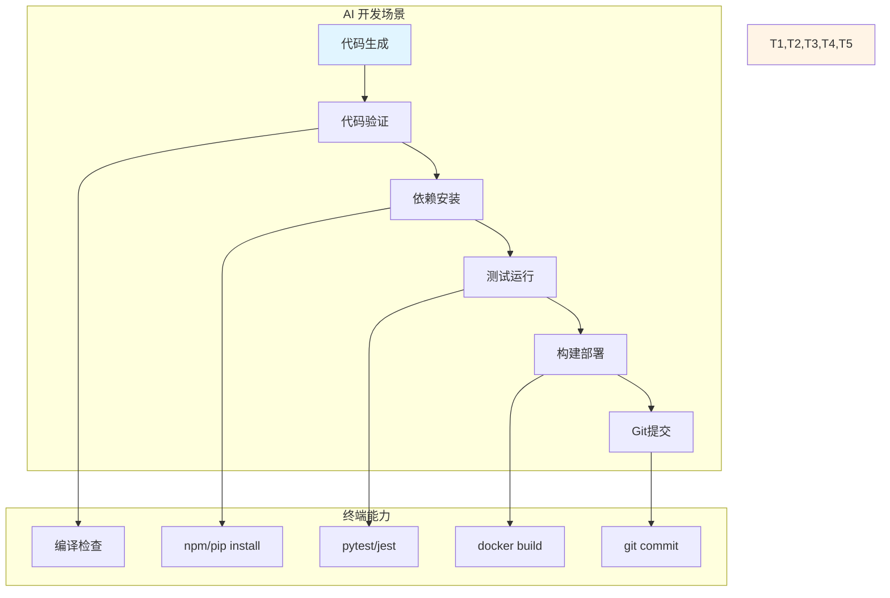
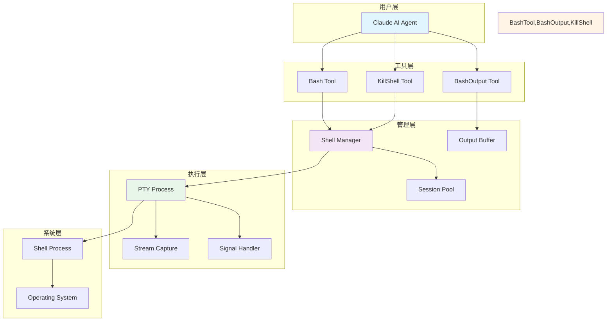
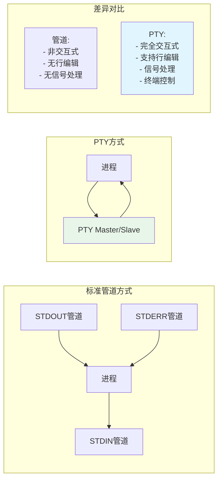
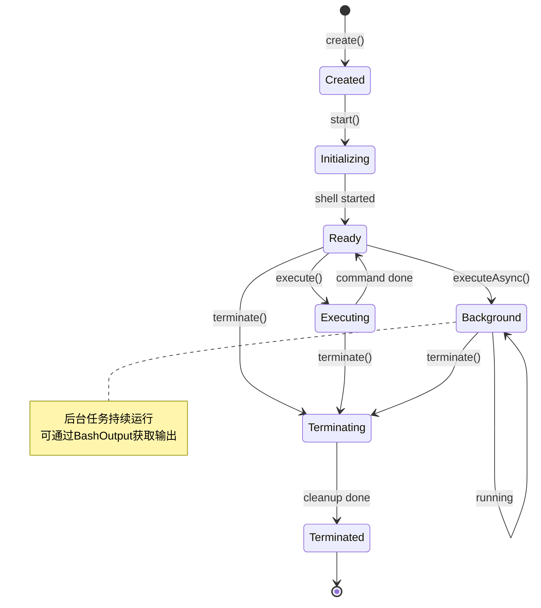
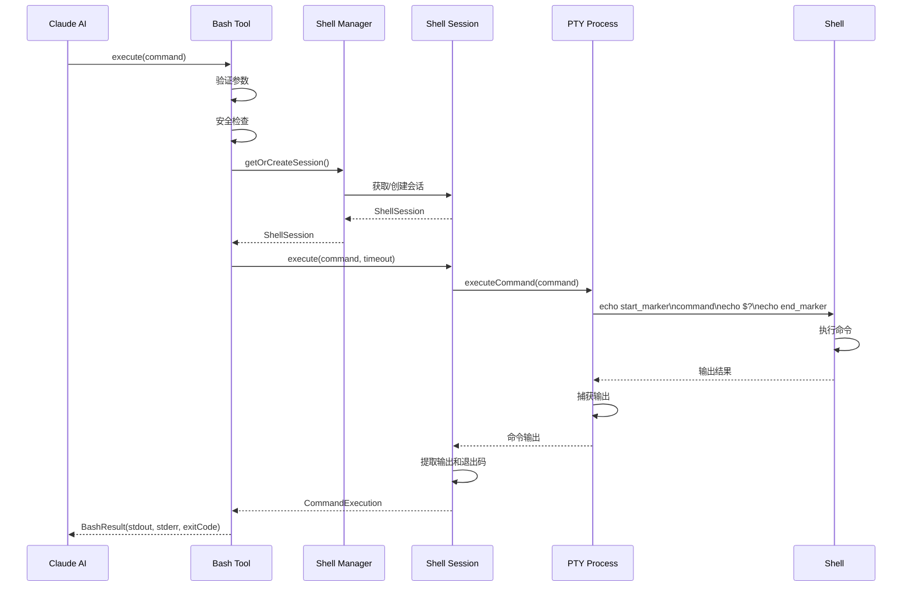
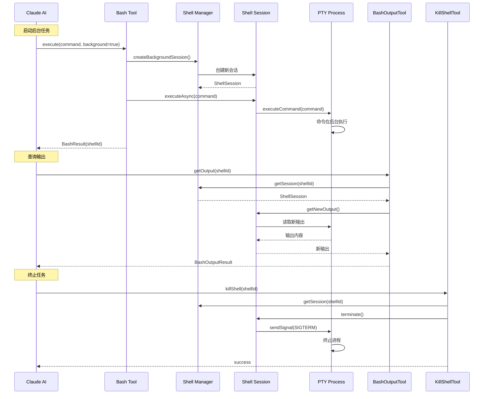

---
title: 终端集成实现
date: 2025-01-12
permalink: /ai/claude-code/terminal-integration.html
categories:
  - AI
  - Claude Code
---

# 终端集成实现

## 1. 引言

终端集成是 Claude Code 最核心的能力之一，它使 AI 能够像人类开发者一样执行命令、运行脚本、管理进程。本文将深入探讨 Claude Code 如何实现强大而安全的终端集成能力。

### 1.1 为什么需要终端集成



终端集成解决的核心问题：
1. **命令执行**：运行编译、测试、构建等开发命令
2. **进程管理**：启动、监控、停止后台服务
3. **输出捕获**：获取命令执行结果和错误信息
4. **交互处理**：处理需要用户输入的命令
5. **安全控制**：防止危险命令执行

### 1.2 技术挑战

```java
/**
 * 终端集成面临的核心挑战
 */
public class TerminalChallenges {

    // 1. 平台差异
    public interface PlatformCompatibility {
        // Windows: cmd.exe, PowerShell
        // Unix/Linux: bash, zsh, sh
        // macOS: zsh (默认), bash
        void handlePlatformDifferences();
    }

    // 2. 异步输出
    public interface OutputStreaming {
        // 命令可能产生大量输出
        // 需要实时捕获而不阻塞
        void captureStreamingOutput();
    }

    // 3. 进程生命周期
    public interface ProcessLifecycle {
        // 长运行进程管理
        // 孤儿进程清理
        // 信号处理
        void manageProcesses();
    }

    // 4. 交互式命令
    public interface InteractiveCommands {
        // 需要用户输入的命令
        // PTY vs 管道
        void handleInteraction();
    }

    // 5. 安全控制
    public interface SecurityControl {
        // 命令注入防护
        // 危险操作拦截
        // 资源限制
        void enforceSecurityPolicies();
    }
}
```

## 2. Bash工具架构设计

### 2.1 整体架构



### 2.2 核心组件实现

```java
/**
 * Bash工具核心实现
 */
public class BashTool {

    private final ShellManager shellManager;
    private final SecurityValidator securityValidator;
    private final OutputCapture outputCapture;

    /**
     * Bash工具参数
     */
    public static class BashParams {
        private String command;           // 必需：要执行的命令
        private String description;       // 可选：命令描述
        private Long timeout;            // 可选：超时时间(ms)
        private Boolean runInBackground; // 可选：是否后台运行

        // Getter/Setter...
    }

    /**
     * 执行结果
     */
    public static class BashResult {
        private String stdout;           // 标准输出
        private String stderr;           // 标准错误
        private Integer exitCode;        // 退出码
        private String shellId;          // 后台任务的Shell ID
        private Long executionTime;      // 执行时间(ms)

        public boolean isSuccess() {
            return exitCode != null && exitCode == 0;
        }
    }

    /**
     * 执行Bash命令
     */
    public BashResult execute(BashParams params) {
        // 1. 参数验证
        validateParams(params);

        // 2. 安全检查
        securityValidator.validate(params.getCommand());

        // 3. 根据执行模式分发
        if (params.getRunInBackground()) {
            return executeInBackground(params);
        } else {
            return executeSynchronously(params);
        }
    }

    /**
     * 同步执行
     */
    private BashResult executeSynchronously(BashParams params) {
        long startTime = System.currentTimeMillis();

        try {
            // 获取或创建Shell会话
            ShellSession session = shellManager.getOrCreateSession();

            // 执行命令
            CommandExecution execution = session.execute(
                params.getCommand(),
                params.getTimeout() != null ? params.getTimeout() : 120000L
            );

            // 等待完成并捕获输出
            execution.waitForCompletion();

            return BashResult.builder()
                .stdout(execution.getStdout())
                .stderr(execution.getStderr())
                .exitCode(execution.getExitCode())
                .executionTime(System.currentTimeMillis() - startTime)
                .build();

        } catch (TimeoutException e) {
            return BashResult.builder()
                .stderr("Command timed out after " + params.getTimeout() + "ms")
                .exitCode(-1)
                .build();
        } catch (Exception e) {
            return BashResult.builder()
                .stderr("Execution failed: " + e.getMessage())
                .exitCode(-1)
                .build();
        }
    }

    /**
     * 后台执行
     */
    private BashResult executeInBackground(BashParams params) {
        try {
            // 创建新的后台Shell会话
            ShellSession backgroundSession = shellManager.createBackgroundSession();

            // 启动命令
            backgroundSession.executeAsync(params.getCommand());

            return BashResult.builder()
                .shellId(backgroundSession.getId())
                .stdout("Command started in background with shell ID: "
                    + backgroundSession.getId())
                .exitCode(0)
                .build();

        } catch (Exception e) {
            return BashResult.builder()
                .stderr("Failed to start background command: " + e.getMessage())
                .exitCode(-1)
                .build();
        }
    }

    /**
     * 参数验证
     */
    private void validateParams(BashParams params) {
        if (params.getCommand() == null || params.getCommand().trim().isEmpty()) {
            throw new IllegalArgumentException("Command is required");
        }

        if (params.getTimeout() != null) {
            if (params.getTimeout() < 0) {
                throw new IllegalArgumentException("Timeout must be positive");
            }
            if (params.getTimeout() > 600000) {
                throw new IllegalArgumentException("Timeout cannot exceed 10 minutes");
            }
        }
    }
}

/**
 * BashOutput工具 - 获取后台任务输出
 */
public class BashOutputTool {

    private final ShellManager shellManager;

    public static class BashOutputParams {
        private String bashId;        // 必需：Shell ID
        private String filter;        // 可选：正则过滤
    }

    public static class BashOutputResult {
        private String output;        // 新输出
        private String status;        // 状态：running/completed/failed
        private Integer exitCode;     // 退出码（如果已完成）
    }

    /**
     * 获取后台任务输出
     */
    public BashOutputResult getOutput(BashOutputParams params) {
        ShellSession session = shellManager.getSession(params.getBashId());

        if (session == null) {
            throw new IllegalArgumentException("Shell not found: " + params.getBashId());
        }

        // 获取新输出（自上次读取以来）
        String output = session.getNewOutput();

        // 应用过滤器
        if (params.getFilter() != null) {
            output = filterOutput(output, params.getFilter());
        }

        return BashOutputResult.builder()
            .output(output)
            .status(session.getStatus())
            .exitCode(session.getExitCode())
            .build();
    }

    private String filterOutput(String output, String regex) {
        Pattern pattern = Pattern.compile(regex);
        return Arrays.stream(output.split("\n"))
            .filter(line -> pattern.matcher(line).find())
            .collect(Collectors.joining("\n"));
    }
}

/**
 * KillShell工具 - 终止后台任务
 */
public class KillShellTool {

    private final ShellManager shellManager;

    public static class KillShellParams {
        private String shellId;       // 必需：Shell ID
    }

    public static class KillShellResult {
        private boolean success;
        private String message;
    }

    /**
     * 终止Shell会话
     */
    public KillShellResult killShell(KillShellParams params) {
        ShellSession session = shellManager.getSession(params.getShellId());

        if (session == null) {
            return KillShellResult.builder()
                .success(false)
                .message("Shell not found: " + params.getShellId())
                .build();
        }

        try {
            session.terminate();
            shellManager.removeSession(params.getShellId());

            return KillShellResult.builder()
                .success(true)
                .message("Shell terminated successfully")
                .build();

        } catch (Exception e) {
            return KillShellResult.builder()
                .success(false)
                .message("Failed to terminate shell: " + e.getMessage())
                .build();
        }
    }
}
```

## 3. PTY（伪终端）技术详解

### 3.1 PTY vs 标准管道



### 3.2 PTY实现

```java
/**
 * PTY（伪终端）实现
 */
public class PtyProcess {

    private final String ptyPath;
    private Process process;
    private InputStream stdout;
    private OutputStream stdin;
    private Thread outputReader;
    private final OutputBuffer outputBuffer;

    /**
     * PTY配置
     */
    public static class PtyConfig {
        private String shell;           // Shell路径：/bin/bash, /bin/zsh
        private String workingDir;      // 工作目录
        private Map<String, String> env; // 环境变量
        private Integer rows;           // 终端行数
        private Integer cols;           // 终端列数

        public static PtyConfig defaults() {
            return PtyConfig.builder()
                .shell(detectDefaultShell())
                .workingDir(System.getProperty("user.dir"))
                .env(System.getenv())
                .rows(24)
                .cols(80)
                .build();
        }

        private static String detectDefaultShell() {
            String os = System.getProperty("os.name").toLowerCase();
            if (os.contains("win")) {
                return "cmd.exe";
            } else if (os.contains("mac")) {
                return "/bin/zsh";  // macOS默认
            } else {
                return "/bin/bash"; // Linux默认
            }
        }
    }

    /**
     * 创建PTY进程
     */
    public static PtyProcess create(PtyConfig config) throws IOException {
        // 根据平台选择PTY实现
        String os = System.getProperty("os.name").toLowerCase();

        if (os.contains("win")) {
            return createWindowsPty(config);
        } else {
            return createUnixPty(config);
        }
    }

    /**
     * Unix/Linux/macOS PTY实现
     */
    private static PtyProcess createUnixPty(PtyConfig config) throws IOException {
        // 使用JNA调用native PTY API
        // 或使用pty4j、JPty等库

        ProcessBuilder pb = new ProcessBuilder(config.getShell());
        pb.directory(new File(config.getWorkingDir()));
        pb.environment().putAll(config.getEnv());

        // 设置PTY环境变量
        pb.environment().put("TERM", "xterm-256color");
        pb.environment().put("ROWS", config.getRows().toString());
        pb.environment().put("COLS", config.getCols().toString());

        // 启动进程
        Process process = pb.start();

        PtyProcess pty = new PtyProcess();
        pty.process = process;
        pty.stdout = process.getInputStream();
        pty.stdin = process.getOutputStream();
        pty.outputBuffer = new OutputBuffer();

        // 启动输出读取线程
        pty.startOutputReader();

        return pty;
    }

    /**
     * Windows PTY实现
     */
    private static PtyProcess createWindowsPty(PtyConfig config) throws IOException {
        // Windows使用ConPTY API (Windows 10+)
        // 或回退到标准管道模式

        ProcessBuilder pb = new ProcessBuilder("cmd.exe");
        pb.directory(new File(config.getWorkingDir()));
        pb.environment().putAll(config.getEnv());

        Process process = pb.start();

        PtyProcess pty = new PtyProcess();
        pty.process = process;
        pty.stdout = process.getInputStream();
        pty.stdin = process.getOutputStream();
        pty.outputBuffer = new OutputBuffer();

        pty.startOutputReader();

        return pty;
    }

    /**
     * 启动输出读取线程
     */
    private void startOutputReader() {
        outputReader = new Thread(() -> {
            try {
                byte[] buffer = new byte[8192];
                int bytesRead;

                while ((bytesRead = stdout.read(buffer)) != -1) {
                    // 写入输出缓冲区
                    outputBuffer.append(new String(buffer, 0, bytesRead));
                }
            } catch (IOException e) {
                if (!Thread.currentThread().isInterrupted()) {
                    outputBuffer.append("Error reading output: " + e.getMessage());
                }
            }
        }, "PTY-Output-Reader");

        outputReader.setDaemon(true);
        outputReader.start();
    }

    /**
     * 执行命令
     */
    public void executeCommand(String command) throws IOException {
        // 写入命令
        stdin.write((command + "\n").getBytes());
        stdin.flush();
    }

    /**
     * 获取输出
     */
    public String getOutput() {
        return outputBuffer.getAndClear();
    }

    /**
     * 获取新输出（增量）
     */
    public String getNewOutput() {
        return outputBuffer.getAndClear();
    }

    /**
     * 发送信号
     */
    public void sendSignal(Signal signal) {
        if (process.isAlive()) {
            switch (signal) {
                case SIGINT:
                    // Ctrl+C
                    process.destroy();
                    break;
                case SIGTERM:
                    // 终止
                    process.destroy();
                    break;
                case SIGKILL:
                    // 强制终止
                    process.destroyForcibly();
                    break;
            }
        }
    }

    /**
     * 调整终端大小
     */
    public void resize(int rows, int cols) {
        // 发送SIGWINCH信号
        // 需要native调用
    }

    /**
     * 是否存活
     */
    public boolean isAlive() {
        return process != null && process.isAlive();
    }

    /**
     * 等待退出
     */
    public int waitFor(long timeout, TimeUnit unit)
            throws InterruptedException, TimeoutException {

        if (process.waitFor(timeout, unit)) {
            return process.exitValue();
        } else {
            throw new TimeoutException("Process did not exit within timeout");
        }
    }

    /**
     * 销毁进程
     */
    public void destroy() {
        if (outputReader != null) {
            outputReader.interrupt();
        }

        if (process != null && process.isAlive()) {
            process.destroy();

            // 等待3秒后强制终止
            try {
                if (!process.waitFor(3, TimeUnit.SECONDS)) {
                    process.destroyForcibly();
                }
            } catch (InterruptedException e) {
                process.destroyForcibly();
            }
        }
    }

    /**
     * 信号枚举
     */
    public enum Signal {
        SIGINT,   // Ctrl+C
        SIGTERM,  // 终止
        SIGKILL,  // 强制终止
        SIGWINCH  // 窗口大小变化
    }
}

/**
 * 输出缓冲区 - 线程安全
 */
public class OutputBuffer {

    private final StringBuilder buffer = new StringBuilder();
    private int lastReadPosition = 0;
    private final Object lock = new Object();

    /**
     * 追加输出
     */
    public void append(String content) {
        synchronized (lock) {
            buffer.append(content);
        }
    }

    /**
     * 获取所有输出
     */
    public String getAll() {
        synchronized (lock) {
            return buffer.toString();
        }
    }

    /**
     * 获取新输出（增量）
     */
    public String getAndClear() {
        synchronized (lock) {
            if (lastReadPosition >= buffer.length()) {
                return "";
            }

            String newContent = buffer.substring(lastReadPosition);
            lastReadPosition = buffer.length();
            return newContent;
        }
    }

    /**
     * 清空缓冲区
     */
    public void clear() {
        synchronized (lock) {
            buffer.setLength(0);
            lastReadPosition = 0;
        }
    }

    /**
     * 获取缓冲区大小
     */
    public int size() {
        synchronized (lock) {
            return buffer.length();
        }
    }
}
```

## 4. Shell会话管理

### 4.1 会话生命周期



### 4.2 ShellSession实现

```java
/**
 * Shell会话实现
 */
public class ShellSession {

    private final String id;
    private final PtyProcess ptyProcess;
    private final String workingDirectory;
    private SessionStatus status;
    private Integer exitCode;
    private final Map<String, String> environment;
    private final ExecutorService executor;

    /**
     * 会话状态
     */
    public enum SessionStatus {
        CREATED,       // 已创建
        INITIALIZING,  // 初始化中
        READY,         // 就绪
        EXECUTING,     // 执行中
        BACKGROUND,    // 后台运行
        TERMINATING,   // 终止中
        TERMINATED     // 已终止
    }

    /**
     * 创建会话
     */
    public static ShellSession create(String workingDir) throws IOException {
        String sessionId = UUID.randomUUID().toString().substring(0, 8);

        // 创建PTY进程
        PtyConfig config = PtyConfig.builder()
            .shell(PtyConfig.detectDefaultShell())
            .workingDir(workingDir)
            .env(System.getenv())
            .build();

        PtyProcess ptyProcess = PtyProcess.create(config);

        ShellSession session = new ShellSession(sessionId, ptyProcess, workingDir);
        session.initialize();

        return session;
    }

    /**
     * 初始化会话
     */
    private void initialize() throws IOException {
        status = SessionStatus.INITIALIZING;

        // 等待Shell启动
        try {
            Thread.sleep(100);
        } catch (InterruptedException e) {
            Thread.currentThread().interrupt();
        }

        // 设置环境
        ptyProcess.executeCommand("export PS1='CLAUDE_PROMPT> '");
        ptyProcess.executeCommand("cd " + workingDirectory);

        // 清空启动输出
        ptyProcess.getOutput();

        status = SessionStatus.READY;
    }

    /**
     * 执行命令（同步）
     */
    public CommandExecution execute(String command, long timeoutMs)
            throws TimeoutException {

        if (status != SessionStatus.READY) {
            throw new IllegalStateException("Session not ready: " + status);
        }

        status = SessionStatus.EXECUTING;

        try {
            // 构建命令执行对象
            CommandExecution execution = new CommandExecution(command, timeoutMs);

            // 清空之前的输出
            ptyProcess.getOutput();

            // 生成唯一标记
            String startMarker = "CLAUDE_CMD_START_" + UUID.randomUUID().toString();
            String endMarker = "CLAUDE_CMD_END_" + UUID.randomUUID().toString();

            // 执行命令并标记
            ptyProcess.executeCommand("echo " + startMarker);
            ptyProcess.executeCommand(command);
            int exitCode = captureExitCode();
            ptyProcess.executeCommand("echo " + endMarker);

            // 等待完成并捕获输出
            String fullOutput = waitForMarker(endMarker, timeoutMs);

            // 提取实际输出
            String actualOutput = extractOutput(fullOutput, startMarker, endMarker);

            execution.complete(actualOutput, "", exitCode);

            return execution;

        } finally {
            status = SessionStatus.READY;
        }
    }

    /**
     * 执行命令（异步）
     */
    public void executeAsync(String command) throws IOException {
        if (status != SessionStatus.READY) {
            throw new IllegalStateException("Session not ready: " + status);
        }

        status = SessionStatus.BACKGROUND;

        // 直接执行命令，不等待完成
        ptyProcess.executeCommand(command);
    }

    /**
     * 捕获退出码
     */
    private int captureExitCode() throws IOException {
        // 执行 echo $? 获取上一个命令的退出码
        ptyProcess.executeCommand("echo EXITCODE:$?");

        // 等待输出
        try {
            Thread.sleep(50);
        } catch (InterruptedException e) {
            Thread.currentThread().interrupt();
        }

        String output = ptyProcess.getOutput();
        Pattern pattern = Pattern.compile("EXITCODE:(\\d+)");
        Matcher matcher = pattern.matcher(output);

        if (matcher.find()) {
            return Integer.parseInt(matcher.group(1));
        }

        return 0;
    }

    /**
     * 等待输出标记
     */
    private String waitForMarker(String marker, long timeoutMs)
            throws TimeoutException {

        StringBuilder output = new StringBuilder();
        long startTime = System.currentTimeMillis();

        while (true) {
            // 检查超时
            if (System.currentTimeMillis() - startTime > timeoutMs) {
                throw new TimeoutException("Command execution timeout");
            }

            // 获取新输出
            String newOutput = ptyProcess.getNewOutput();
            output.append(newOutput);

            // 检查是否包含结束标记
            if (output.toString().contains(marker)) {
                return output.toString();
            }

            // 短暂休眠
            try {
                Thread.sleep(50);
            } catch (InterruptedException e) {
                Thread.currentThread().interrupt();
                throw new TimeoutException("Interrupted");
            }
        }
    }

    /**
     * 提取实际输出
     */
    private String extractOutput(String fullOutput, String startMarker, String endMarker) {
        int startIndex = fullOutput.indexOf(startMarker);
        int endIndex = fullOutput.lastIndexOf(endMarker);

        if (startIndex == -1 || endIndex == -1) {
            return fullOutput;
        }

        // 提取标记之间的内容
        String extracted = fullOutput.substring(
            startIndex + startMarker.length(),
            endIndex
        );

        // 移除首尾空白和提示符
        return extracted.trim()
            .replaceAll("^CLAUDE_PROMPT>\\s*", "")
            .replaceAll("CLAUDE_PROMPT>\\s*$", "")
            .trim();
    }

    /**
     * 获取新输出
     */
    public String getNewOutput() {
        if (status == SessionStatus.BACKGROUND) {
            return ptyProcess.getNewOutput();
        }
        return "";
    }

    /**
     * 获取状态
     */
    public String getStatus() {
        if (status == SessionStatus.BACKGROUND && !ptyProcess.isAlive()) {
            status = SessionStatus.TERMINATED;
            exitCode = 0; // PTY进程已退出
        }
        return status.name().toLowerCase();
    }

    /**
     * 终止会话
     */
    public void terminate() {
        if (status == SessionStatus.TERMINATED) {
            return;
        }

        status = SessionStatus.TERMINATING;

        try {
            // 发送SIGTERM
            ptyProcess.sendSignal(PtyProcess.Signal.SIGTERM);

            // 等待3秒
            try {
                exitCode = ptyProcess.waitFor(3, TimeUnit.SECONDS);
            } catch (TimeoutException | InterruptedException e) {
                // 强制终止
                ptyProcess.sendSignal(PtyProcess.Signal.SIGKILL);
            }

        } finally {
            ptyProcess.destroy();
            status = SessionStatus.TERMINATED;
        }
    }

    // Getters
    public String getId() { return id; }
    public Integer getExitCode() { return exitCode; }
    public String getWorkingDirectory() { return workingDirectory; }
}

/**
 * 命令执行结果
 */
public class CommandExecution {

    private final String command;
    private final long timeout;
    private String stdout;
    private String stderr;
    private Integer exitCode;
    private boolean completed;

    public CommandExecution(String command, long timeout) {
        this.command = command;
        this.timeout = timeout;
        this.completed = false;
    }

    public void complete(String stdout, String stderr, int exitCode) {
        this.stdout = stdout;
        this.stderr = stderr;
        this.exitCode = exitCode;
        this.completed = true;
    }

    public void waitForCompletion() {
        // 已在execute中同步等待
    }

    // Getters
    public String getStdout() { return stdout; }
    public String getStderr() { return stderr; }
    public Integer getExitCode() { return exitCode; }
    public boolean isCompleted() { return completed; }
}
```

### 4.3 ShellManager实现

```java
/**
 * Shell会话管理器
 */
public class ShellManager {

    private final Map<String, ShellSession> sessions = new ConcurrentHashMap<>();
    private final String defaultWorkingDir;
    private ShellSession defaultSession;
    private final ScheduledExecutorService cleanupExecutor;

    public ShellManager(String workingDir) {
        this.defaultWorkingDir = workingDir;

        // 启动清理任务
        this.cleanupExecutor = Executors.newSingleThreadScheduledExecutor();
        this.cleanupExecutor.scheduleAtFixedRate(
            this::cleanupTerminatedSessions,
            1, 1, TimeUnit.MINUTES
        );
    }

    /**
     * 获取或创建默认会话
     */
    public ShellSession getOrCreateSession() throws IOException {
        if (defaultSession == null || !defaultSession.getStatus().equals("ready")) {
            defaultSession = ShellSession.create(defaultWorkingDir);
        }
        return defaultSession;
    }

    /**
     * 创建后台会话
     */
    public ShellSession createBackgroundSession() throws IOException {
        ShellSession session = ShellSession.create(defaultWorkingDir);
        sessions.put(session.getId(), session);
        return session;
    }

    /**
     * 获取会话
     */
    public ShellSession getSession(String sessionId) {
        return sessions.get(sessionId);
    }

    /**
     * 移除会话
     */
    public void removeSession(String sessionId) {
        ShellSession session = sessions.remove(sessionId);
        if (session != null) {
            session.terminate();
        }
    }

    /**
     * 清理已终止的会话
     */
    private void cleanupTerminatedSessions() {
        List<String> toRemove = new ArrayList<>();

        for (Map.Entry<String, ShellSession> entry : sessions.entrySet()) {
            if ("terminated".equals(entry.getValue().getStatus())) {
                toRemove.add(entry.getKey());
            }
        }

        toRemove.forEach(this::removeSession);
    }

    /**
     * 关闭所有会话
     */
    public void shutdown() {
        // 终止所有会话
        sessions.values().forEach(ShellSession::terminate);
        sessions.clear();

        if (defaultSession != null) {
            defaultSession.terminate();
        }

        // 关闭清理任务
        cleanupExecutor.shutdown();
    }
}
```

## 5. 命令执行流程

### 5.1 同步执行流程



### 5.2 异步执行流程



## 6. 安全机制

### 6.1 安全验证器

```java
/**
 * 命令安全验证器
 */
public class SecurityValidator {

    private final List<SecurityRule> rules = new ArrayList<>();

    public SecurityValidator() {
        // 初始化安全规则
        initializeDefaultRules();
    }

    /**
     * 验证命令
     */
    public void validate(String command) {
        for (SecurityRule rule : rules) {
            ValidationResult result = rule.validate(command);

            if (!result.isValid()) {
                throw new SecurityException(
                    "Command blocked by security rule: " + result.getReason()
                );
            }
        }
    }

    /**
     * 初始化默认规则
     */
    private void initializeDefaultRules() {
        // 1. 危险命令拦截
        rules.add(new DangerousCommandRule());

        // 2. 命令注入防护
        rules.add(new CommandInjectionRule());

        // 3. 路径遍历防护
        rules.add(new PathTraversalRule());

        // 4. 权限提升防护
        rules.add(new PrivilegeEscalationRule());
    }

    /**
     * 安全规则接口
     */
    public interface SecurityRule {
        ValidationResult validate(String command);
    }

    /**
     * 验证结果
     */
    public static class ValidationResult {
        private final boolean valid;
        private final String reason;

        public static ValidationResult valid() {
            return new ValidationResult(true, null);
        }

        public static ValidationResult invalid(String reason) {
            return new ValidationResult(false, reason);
        }

        public boolean isValid() { return valid; }
        public String getReason() { return reason; }
    }

    /**
     * 危险命令规则
     */
    public static class DangerousCommandRule implements SecurityRule {

        private static final List<String> DANGEROUS_COMMANDS = Arrays.asList(
            "rm -rf /",
            ":(){ :|:& };:",  // Fork bomb
            "dd if=/dev/random",
            "mkfs",
            "chmod 777 -R /",
            "> /dev/sda"
        );

        private static final List<Pattern> DANGEROUS_PATTERNS = Arrays.asList(
            Pattern.compile("rm\\s+-rf\\s+/"),
            Pattern.compile("dd\\s+.*of=/dev/"),
            Pattern.compile("mkfs\\."),
            Pattern.compile("chmod\\s+777\\s+-R\\s+/")
        );

        @Override
        public ValidationResult validate(String command) {
            // 检查完全匹配
            for (String dangerous : DANGEROUS_COMMANDS) {
                if (command.contains(dangerous)) {
                    return ValidationResult.invalid(
                        "Dangerous command detected: " + dangerous
                    );
                }
            }

            // 检查模式匹配
            for (Pattern pattern : DANGEROUS_PATTERNS) {
                if (pattern.matcher(command).find()) {
                    return ValidationResult.invalid(
                        "Dangerous command pattern detected: " + pattern.pattern()
                    );
                }
            }

            return ValidationResult.valid();
        }
    }

    /**
     * 命令注入规则
     */
    public static class CommandInjectionRule implements SecurityRule {

        private static final List<String> INJECTION_CHARS = Arrays.asList(
            ";", "&&", "||", "|", "`", "$(", "$("
        );

        @Override
        public ValidationResult validate(String command) {
            // 检查是否包含多个命令
            int commandCount = 0;
            for (String injectionChar : INJECTION_CHARS) {
                if (command.contains(injectionChar)) {
                    commandCount++;
                }
            }

            // 允许合理的命令链接（如 cd && ls）
            // 但警惕复杂的注入尝试
            if (commandCount > 3) {
                return ValidationResult.invalid(
                    "Possible command injection detected"
                );
            }

            return ValidationResult.valid();
        }
    }

    /**
     * 路径遍历规则
     */
    public static class PathTraversalRule implements SecurityRule {

        @Override
        public ValidationResult validate(String command) {
            // 检查路径遍历攻击
            if (command.contains("../../../")) {
                return ValidationResult.invalid(
                    "Path traversal attack detected"
                );
            }

            return ValidationResult.valid();
        }
    }

    /**
     * 权限提升规则
     */
    public static class PrivilegeEscalationRule implements SecurityRule {

        private static final List<String> PRIVILEGE_COMMANDS = Arrays.asList(
            "sudo", "su", "doas"
        );

        @Override
        public ValidationResult validate(String command) {
            // 检查权限提升命令
            String[] parts = command.trim().split("\\s+");
            if (parts.length > 0) {
                String firstCommand = parts[0];

                if (PRIVILEGE_COMMANDS.contains(firstCommand)) {
                    return ValidationResult.invalid(
                        "Privilege escalation command blocked: " + firstCommand
                    );
                }
            }

            return ValidationResult.valid();
        }
    }
}
```

### 6.2 超时控制

```java
/**
 * 超时控制器
 */
public class TimeoutController {

    private final ScheduledExecutorService scheduler;

    public TimeoutController() {
        this.scheduler = Executors.newScheduledThreadPool(2);
    }

    /**
     * 执行带超时的任务
     */
    public <T> T executeWithTimeout(
            Callable<T> task,
            long timeout,
            TimeUnit unit) throws TimeoutException, ExecutionException {

        Future<T> future = scheduler.submit(task);

        try {
            return future.get(timeout, unit);
        } catch (InterruptedException e) {
            future.cancel(true);
            Thread.currentThread().interrupt();
            throw new ExecutionException("Interrupted", e);
        } catch (TimeoutException e) {
            future.cancel(true);
            throw e;
        }
    }

    /**
     * 调度超时终止
     */
    public ScheduledFuture<?> scheduleTimeout(
            Runnable timeoutAction,
            long delay,
            TimeUnit unit) {

        return scheduler.schedule(timeoutAction, delay, unit);
    }

    /**
     * 关闭
     */
    public void shutdown() {
        scheduler.shutdown();
    }
}
```

## 7. 交互式命令处理

### 7.1 交互式场景

```java
/**
 * 交互式命令检测和处理
 */
public class InteractiveCommandHandler {

    // 已知的交互式命令
    private static final Set<String> INTERACTIVE_COMMANDS = Set.of(
        "vi", "vim", "nano", "emacs",    // 编辑器
        "less", "more",                   // 分页器
        "top", "htop",                    // 监控工具
        "ssh", "ftp",                     // 远程工具
        "python", "node", "irb"           // REPL
    );

    /**
     * 检测是否为交互式命令
     */
    public boolean isInteractive(String command) {
        String[] parts = command.trim().split("\\s+");
        if (parts.length == 0) {
            return false;
        }

        String baseCommand = parts[0];

        // 检查是否在已知列表中
        if (INTERACTIVE_COMMANDS.contains(baseCommand)) {
            return true;
        }

        // 检查是否有交互式标志
        // 例如：python 没有 -c 参数时是交互式的
        if ("python".equals(baseCommand) || "python3".equals(baseCommand)) {
            return !command.contains("-c");
        }

        return false;
    }

    /**
     * 转换为非交互式命令
     */
    public String makeNonInteractive(String command) {
        String[] parts = command.trim().split("\\s+");
        String baseCommand = parts[0];

        switch (baseCommand) {
            case "vi":
            case "vim":
                // vim -c 'command' -c 'wq' file
                return command + " -c 'wq'";

            case "less":
            case "more":
                // 使用 cat 替代
                return command.replace("less", "cat").replace("more", "cat");

            case "top":
            case "htop":
                // top -b -n 1 (批量模式，执行一次)
                return command + " -b -n 1";

            default:
                throw new UnsupportedOperationException(
                    "Cannot make command non-interactive: " + command
                );
        }
    }

    /**
     * 建议替代命令
     */
    public String suggestAlternative(String command) {
        String[] parts = command.trim().split("\\s+");
        String baseCommand = parts[0];

        Map<String, String> alternatives = Map.of(
            "vi", "Consider using: echo 'content' > file",
            "vim", "Consider using: echo 'content' > file",
            "nano", "Consider using: echo 'content' > file",
            "less", "Consider using: cat file",
            "top", "Consider using: ps aux",
            "ssh", "This command requires manual interaction",
            "python", "Use: python -c 'code' or python script.py"
        );

        return alternatives.getOrDefault(
            baseCommand,
            "This command may require manual interaction"
        );
    }
}
```

## 8. 实战案例

### 8.1 案例1：运行测试套件

```java
/**
 * 运行测试套件示例
 */
public class TestRunnerExample {

    private final BashTool bashTool;

    public void runTests(String projectPath) {
        // 1. 检查项目类型
        BashResult checkResult = bashTool.execute(BashParams.builder()
            .command("cd " + projectPath + " && ls")
            .description("Check project structure")
            .build());

        String output = checkResult.getStdout();

        // 2. 根据项目类型执行测试
        if (output.contains("package.json")) {
            runNodeTests(projectPath);
        } else if (output.contains("pom.xml")) {
            runMavenTests(projectPath);
        } else if (output.contains("requirements.txt")) {
            runPythonTests(projectPath);
        }
    }

    private void runNodeTests(String projectPath) {
        // 安装依赖
        BashResult installResult = bashTool.execute(BashParams.builder()
            .command("cd " + projectPath + " && npm install")
            .description("Install npm dependencies")
            .timeout(300000L)  // 5分钟
            .build());

        if (!installResult.isSuccess()) {
            System.err.println("Failed to install dependencies: "
                + installResult.getStderr());
            return;
        }

        // 运行测试
        BashResult testResult = bashTool.execute(BashParams.builder()
            .command("cd " + projectPath + " && npm test")
            .description("Run npm tests")
            .timeout(600000L)  // 10分钟
            .build());

        // 分析测试结果
        analyzeTestOutput(testResult.getStdout());
    }

    private void runMavenTests(String projectPath) {
        BashResult testResult = bashTool.execute(BashParams.builder()
            .command("cd " + projectPath + " && mvn test")
            .description("Run Maven tests")
            .timeout(600000L)
            .build());

        analyzeTestOutput(testResult.getStdout());
    }

    private void analyzeTestOutput(String output) {
        // 提取测试统计
        Pattern pattern = Pattern.compile("Tests run: (\\d+), Failures: (\\d+), Errors: (\\d+)");
        Matcher matcher = pattern.matcher(output);

        if (matcher.find()) {
            int total = Integer.parseInt(matcher.group(1));
            int failures = Integer.parseInt(matcher.group(2));
            int errors = Integer.parseInt(matcher.group(3));

            System.out.println("Test Results:");
            System.out.println("  Total: " + total);
            System.out.println("  Passed: " + (total - failures - errors));
            System.out.println("  Failed: " + failures);
            System.out.println("  Errors: " + errors);
        }
    }
}
```

### 8.2 案例2：后台服务管理

```java
/**
 * 后台服务管理示例
 */
public class BackgroundServiceExample {

    private final BashTool bashTool;
    private final BashOutputTool outputTool;
    private final KillShellTool killTool;

    /**
     * 启动开发服务器
     */
    public String startDevServer(String projectPath) {
        // 启动服务器（后台运行）
        BashResult startResult = bashTool.execute(BashParams.builder()
            .command("cd " + projectPath + " && npm run dev")
            .description("Start development server")
            .runInBackground(true)
            .build());

        String shellId = startResult.getShellId();
        System.out.println("Server started with shell ID: " + shellId);

        // 等待服务器启动
        waitForServerReady(shellId);

        return shellId;
    }

    /**
     * 等待服务器就绪
     */
    private void waitForServerReady(String shellId) {
        int maxAttempts = 30;
        int attempt = 0;

        while (attempt < maxAttempts) {
            try {
                Thread.sleep(1000);
            } catch (InterruptedException e) {
                Thread.currentThread().interrupt();
                break;
            }

            // 检查输出
            BashOutputResult output = outputTool.getOutput(
                BashOutputParams.builder()
                    .bashId(shellId)
                    .build()
            );

            // 检查是否包含就绪信号
            if (output.getOutput().contains("Server running") ||
                output.getOutput().contains("Compiled successfully")) {
                System.out.println("Server is ready!");
                return;
            }

            // 检查错误
            if (output.getOutput().contains("Error") ||
                output.getOutput().contains("EADDRINUSE")) {
                System.err.println("Server failed to start:");
                System.err.println(output.getOutput());
                killTool.killShell(KillShellParams.builder()
                    .shellId(shellId)
                    .build());
                throw new RuntimeException("Server startup failed");
            }

            attempt++;
        }

        throw new RuntimeException("Server startup timeout");
    }

    /**
     * 监控服务器日志
     */
    public void monitorServerLogs(String shellId, int durationSeconds) {
        long endTime = System.currentTimeMillis() + (durationSeconds * 1000L);

        while (System.currentTimeMillis() < endTime) {
            BashOutputResult output = outputTool.getOutput(
                BashOutputParams.builder()
                    .bashId(shellId)
                    .build()
            );

            if (!output.getOutput().isEmpty()) {
                System.out.println("=== Server Log ===");
                System.out.println(output.getOutput());
            }

            // 检查服务器状态
            if ("terminated".equals(output.getStatus())) {
                System.err.println("Server has terminated!");
                break;
            }

            try {
                Thread.sleep(2000);
            } catch (InterruptedException e) {
                Thread.currentThread().interrupt();
                break;
            }
        }
    }

    /**
     * 停止服务器
     */
    public void stopServer(String shellId) {
        System.out.println("Stopping server...");

        KillShellResult result = killTool.killShell(
            KillShellParams.builder()
                .shellId(shellId)
                .build()
        );

        if (result.isSuccess()) {
            System.out.println("Server stopped successfully");
        } else {
            System.err.println("Failed to stop server: " + result.getMessage());
        }
    }

    /**
     * 完整的服务器生命周期管理
     */
    public void manageServerLifecycle(String projectPath) {
        String shellId = null;

        try {
            // 启动服务器
            shellId = startDevServer(projectPath);

            // 监控一段时间
            monitorServerLogs(shellId, 60);

        } finally {
            // 确保清理
            if (shellId != null) {
                stopServer(shellId);
            }
        }
    }
}
```

### 8.3 案例3：Git操作自动化

```java
/**
 * Git操作自动化示例
 */
public class GitAutomationExample {

    private final BashTool bashTool;

    /**
     * 创建分支并提交
     */
    public void createBranchAndCommit(
            String repoPath,
            String branchName,
            String commitMessage) {

        // 1. 检查当前状态
        BashResult statusResult = bashTool.execute(BashParams.builder()
            .command("cd " + repoPath + " && git status --porcelain")
            .description("Check git status")
            .build());

        if (!statusResult.getStdout().trim().isEmpty()) {
            System.out.println("Uncommitted changes detected");
        }

        // 2. 创建新分支
        BashResult branchResult = bashTool.execute(BashParams.builder()
            .command("cd " + repoPath + " && git checkout -b " + branchName)
            .description("Create new branch")
            .build());

        if (!branchResult.isSuccess()) {
            throw new RuntimeException("Failed to create branch: "
                + branchResult.getStderr());
        }

        // 3. 添加文件
        bashTool.execute(BashParams.builder()
            .command("cd " + repoPath + " && git add .")
            .description("Stage all changes")
            .build());

        // 4. 提交
        BashResult commitResult = bashTool.execute(BashParams.builder()
            .command("cd " + repoPath + " && git commit -m \""
                + escapeCommitMessage(commitMessage) + "\"")
            .description("Commit changes")
            .build());

        if (commitResult.isSuccess()) {
            System.out.println("Committed successfully: " + commitMessage);
        } else {
            System.err.println("Commit failed: " + commitResult.getStderr());
        }
    }

    /**
     * 推送到远程
     */
    public void pushToRemote(String repoPath, String branchName) {
        // 推送分支
        BashResult pushResult = bashTool.execute(BashParams.builder()
            .command("cd " + repoPath
                + " && git push -u origin " + branchName)
            .description("Push to remote")
            .timeout(300000L)  // 5分钟
            .build());

        if (pushResult.isSuccess()) {
            System.out.println("Pushed successfully to origin/" + branchName);
        } else {
            System.err.println("Push failed: " + pushResult.getStderr());
        }
    }

    /**
     * 创建Pull Request（使用gh CLI）
     */
    public void createPullRequest(
            String repoPath,
            String title,
            String body) {

        BashResult prResult = bashTool.execute(BashParams.builder()
            .command("cd " + repoPath
                + " && gh pr create --title \"" + title
                + "\" --body \"" + body + "\"")
            .description("Create pull request")
            .build());

        if (prResult.isSuccess()) {
            System.out.println("Pull request created:");
            System.out.println(prResult.getStdout());
        } else {
            System.err.println("Failed to create PR: " + prResult.getStderr());
        }
    }

    /**
     * 转义提交消息
     */
    private String escapeCommitMessage(String message) {
        return message.replace("\"", "\\\"")
                     .replace("'", "\\'")
                     .replace("\n", "\\n");
    }
}
```

## 9. 最佳实践

### 9.1 命令执行最佳实践

```java
/**
 * 命令执行最佳实践
 */
public class CommandExecutionBestPractices {

    /**
     * 1. 始终设置工作目录
     */
    public void alwaysSetWorkingDirectory() {
        // ❌ 不好：依赖当前目录
        bashTool.execute(BashParams.builder()
            .command("npm install")
            .build());

        // ✅ 好：明确指定工作目录
        bashTool.execute(BashParams.builder()
            .command("cd /path/to/project && npm install")
            .build());
    }

    /**
     * 2. 处理路径中的空格
     */
    public void handleSpacesInPaths() {
        String pathWithSpaces = "/Users/name/My Documents/project";

        // ❌ 不好：未引用路径
        bashTool.execute(BashParams.builder()
            .command("cd " + pathWithSpaces)
            .build());

        // ✅ 好：使用引号
        bashTool.execute(BashParams.builder()
            .command("cd \"" + pathWithSpaces + "\"")
            .build());
    }

    /**
     * 3. 使用 && 链接相关命令
     */
    public void chainRelatedCommands() {
        // ❌ 不好：多次调用
        bashTool.execute(BashParams.builder()
            .command("cd /path/to/project")
            .build());
        bashTool.execute(BashParams.builder()
            .command("npm install")
            .build());

        // ✅ 好：链接命令
        bashTool.execute(BashParams.builder()
            .command("cd /path/to/project && npm install")
            .build());
    }

    /**
     * 4. 设置适当的超时
     */
    public void setAppropriateTi timeouts() {
        // 快速命令：短超时
        bashTool.execute(BashParams.builder()
            .command("ls -la")
            .timeout(5000L)  // 5秒
            .build());

        // 耗时命令：长超时
        bashTool.execute(BashParams.builder()
            .command("npm install")
            .timeout(300000L)  // 5分钟
            .build());

        // 非常耗时的命令：考虑后台执行
        bashTool.execute(BashParams.builder()
            .command("docker build -t myapp .")
            .runInBackground(true)
            .build());
    }

    /**
     * 5. 检查退出码
     */
    public void checkExitCodes() {
        BashResult result = bashTool.execute(BashParams.builder()
            .command("npm test")
            .build());

        if (!result.isSuccess()) {
            // 处理错误
            System.err.println("Tests failed:");
            System.err.println(result.getStderr());
            throw new RuntimeException("Test failure");
        }
    }

    /**
     * 6. 避免交互式命令
     */
    public void avoidInteractiveCommands() {
        // ❌ 不好：交互式命令
        bashTool.execute(BashParams.builder()
            .command("vim file.txt")
            .build());

        // ✅ 好：使用非交互式方式
        bashTool.execute(BashParams.builder()
            .command("echo 'content' > file.txt")
            .build());
    }

    /**
     * 7. 后台任务清理
     */
    public void cleanupBackgroundTasks() {
        String shellId = null;

        try {
            BashResult result = bashTool.execute(BashParams.builder()
                .command("npm run dev")
                .runInBackground(true)
                .build());

            shellId = result.getShellId();

            // 使用服务器...

        } finally {
            // 确保清理
            if (shellId != null) {
                killShellTool.killShell(KillShellParams.builder()
                    .shellId(shellId)
                    .build());
            }
        }
    }
}
```

### 9.2 错误处理模式

```java
/**
 * 错误处理模式
 */
public class ErrorHandlingPatterns {

    /**
     * 1. 重试机制
     */
    public BashResult executeWithRetry(
            BashParams params,
            int maxRetries) {

        int attempt = 0;
        BashResult lastResult = null;

        while (attempt < maxRetries) {
            lastResult = bashTool.execute(params);

            if (lastResult.isSuccess()) {
                return lastResult;
            }

            attempt++;
            System.out.println("Retry " + attempt + "/" + maxRetries);

            try {
                Thread.sleep(1000 * attempt);  // 指数退避
            } catch (InterruptedException e) {
                Thread.currentThread().interrupt();
                break;
            }
        }

        throw new RuntimeException("Command failed after " + maxRetries
            + " retries: " + lastResult.getStderr());
    }

    /**
     * 2. 回退机制
     */
    public void executeWithFallback() {
        try {
            // 尝试首选命令
            bashTool.execute(BashParams.builder()
                .command("npm run build")
                .build());
        } catch (Exception e) {
            // 回退到备用命令
            System.out.println("npm build failed, trying alternative...");
            bashTool.execute(BashParams.builder()
                .command("yarn build")
                .build());
        }
    }

    /**
     * 3. 超时恢复
     */
    public BashResult executeWithTimeoutRecovery(BashParams params) {
        try {
            return bashTool.execute(params);
        } catch (TimeoutException e) {
            System.err.println("Command timed out, attempting cleanup...");

            // 清理可能的孤儿进程
            bashTool.execute(BashParams.builder()
                .command("pkill -f '" + extractCommand(params.getCommand()) + "'")
                .build());

            throw e;
        }
    }

    private String extractCommand(String fullCommand) {
        return fullCommand.split("&&")[0].trim();
    }
}
```

## 10. 实战练习

### 练习1：实现智能测试运行器

```java
/**
 * 练习1：实现智能测试运行器
 *
 * 要求：
 * 1. 自动检测项目类型（Node.js, Java, Python等）
 * 2. 安装依赖
 * 3. 运行测试
 * 4. 解析测试结果
 * 5. 生成测试报告
 */
public class SmartTestRunner {

    private final BashTool bashTool;

    public TestReport runTests(String projectPath) {
        // TODO: 实现智能测试运行逻辑
        throw new UnsupportedOperationException("请实现此方法");
    }

    public static class TestReport {
        private int totalTests;
        private int passedTests;
        private int failedTests;
        private List<String> failures;
        private long executionTime;

        // Getters and setters
    }
}
```

### 练习2：实现进程监控器

```java
/**
 * 练习2：实现进程监控器
 *
 * 要求：
 * 1. 启动后台进程
 * 2. 实时监控输出
 * 3. 检测错误和警告
 * 4. 自动重启失败的进程
 * 5. 资源使用统计
 */
public class ProcessMonitor {

    private final BashTool bashTool;
    private final BashOutputTool outputTool;
    private final KillShellTool killTool;

    public void monitorProcess(
            String command,
            MonitorConfig config,
            ProcessCallback callback) {
        // TODO: 实现进程监控逻辑
        throw new UnsupportedOperationException("请实现此方法");
    }

    public interface ProcessCallback {
        void onOutput(String output);
        void onError(String error);
        void onExit(int exitCode);
    }

    public static class MonitorConfig {
        private boolean autoRestart;
        private int maxRestarts;
        private long healthCheckInterval;
        private Pattern errorPattern;
    }
}
```

### 练习3：实现部署流水线

```java
/**
 * 练习3：实现部署流水线
 *
 * 要求：
 * 1. 运行测试
 * 2. 构建应用
 * 3. 创建Docker镜像
 * 4. 推送到仓库
 * 5. 部署到目标环境
 * 6. 验证部署成功
 */
public class DeploymentPipeline {

    private final BashTool bashTool;

    public DeploymentResult deploy(DeploymentConfig config) {
        // TODO: 实现部署流水线
        throw new UnsupportedOperationException("请实现此方法");
    }

    public static class DeploymentConfig {
        private String projectPath;
        private String dockerRegistry;
        private String imageName;
        private String targetEnvironment;
    }

    public static class DeploymentResult {
        private boolean success;
        private String imageTag;
        private String deploymentUrl;
        private Map<String, Object> metrics;
    }
}
```

## 11. 常见问题FAQ

### Q1: 如何处理需要密码的命令？

```java
// 方案1：使用环境变量
bashTool.execute(BashParams.builder()
    .command("export MYSQL_PWD=password && mysql -u user")
    .build());

// 方案2：使用配置文件
bashTool.execute(BashParams.builder()
    .command("mysql --defaults-file=/path/to/config.cnf")
    .build());

// 方案3：使用密钥认证（推荐）
bashTool.execute(BashParams.builder()
    .command("ssh -i ~/.ssh/id_rsa user@host")
    .build());
```

### Q2: 如何处理大量输出？

```java
// 使用后台任务 + 流式读取
BashResult startResult = bashTool.execute(BashParams.builder()
    .command("large-output-command")
    .runInBackground(true)
    .build());

String shellId = startResult.getShellId();

// 定期读取输出
while (true) {
    BashOutputResult output = outputTool.getOutput(
        BashOutputParams.builder()
            .bashId(shellId)
            .build()
    );

    // 处理增量输出
    processOutput(output.getOutput());

    if ("completed".equals(output.getStatus())) {
        break;
    }

    Thread.sleep(1000);
}
```

### Q3: 如何跨平台兼容？

```java
public class CrossPlatformCommands {

    public String getListCommand() {
        if (isWindows()) {
            return "dir";
        } else {
            return "ls -la";
        }
    }

    public String getCopyCommand(String src, String dest) {
        if (isWindows()) {
            return "copy \"" + src + "\" \"" + dest + "\"";
        } else {
            return "cp \"" + src + "\" \"" + dest + "\"";
        }
    }

    private boolean isWindows() {
        return System.getProperty("os.name")
            .toLowerCase().contains("win");
    }
}
```

## 12. 总结

终端集成是 Claude Code 的核心能力，本文深入探讨了：

1. **PTY技术**：实现完整的终端模拟
2. **会话管理**：持久化Shell会话，支持工作目录
3. **同步/异步执行**：灵活的命令执行模式
4. **后台任务管理**：启动、监控、终止后台进程
5. **安全机制**：命令过滤、超时控制、权限管理
6. **最佳实践**：命令链接、错误处理、资源清理

通过这些技术，Claude Code 能够像人类开发者一样执行各种开发任务，从代码编译、测试运行到部署发布，实现真正的端到端自动化。

### 关键要点

1. 使用PTY而非标准管道，获得完整的终端能力
2. 合理设置超时，避免命令挂起
3. 后台任务务必清理，防止资源泄漏
4. 实施严格的安全策略，防止危险操作
5. 提供清晰的错误信息和重试机制

### 下一步

下一章我们将探讨**工具系统架构**，了解 Claude Code 如何管理和编排多个工具，实现复杂的多步骤任务。
