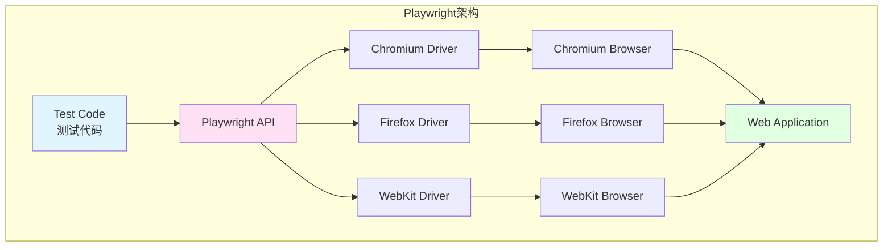
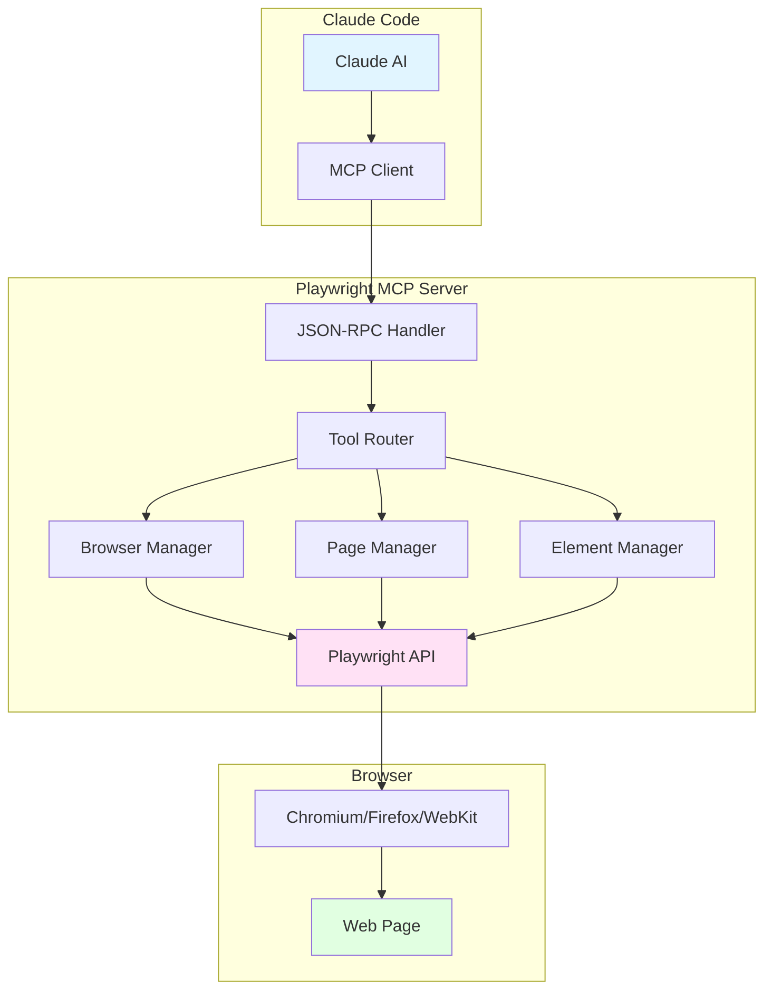
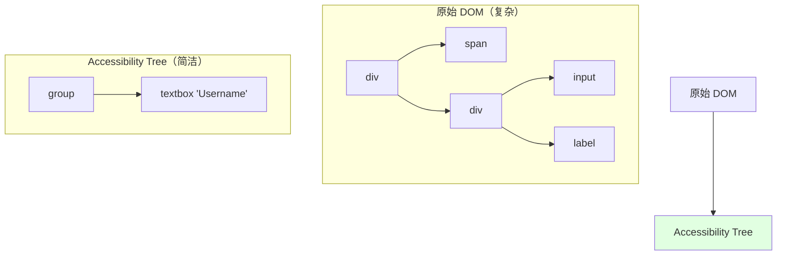
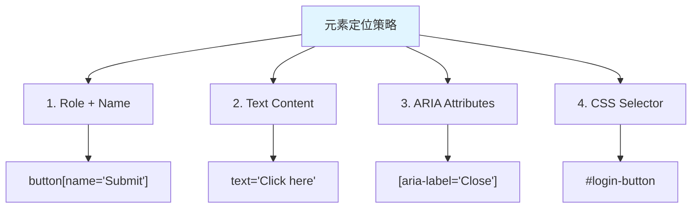
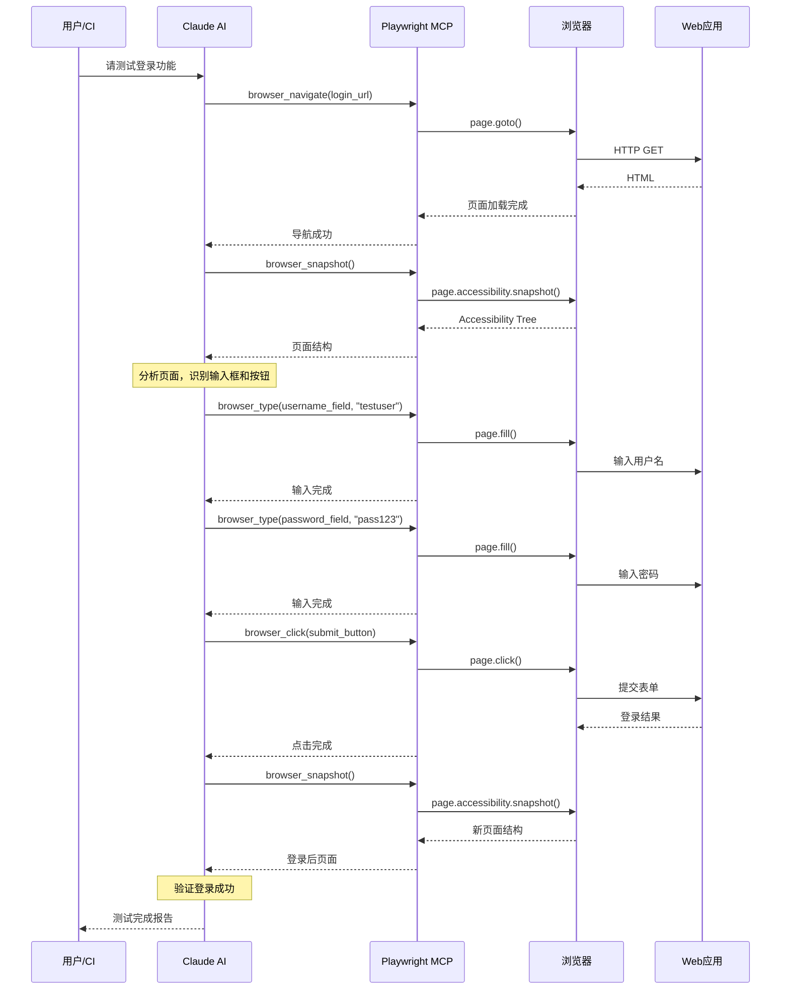
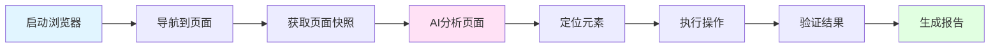

---
title: Claude Code架构详解（十）：浏览器自动化集成
date: 2025-01-16
permalink: /ai/claude-code/architecture/10-browser-automation.html
categories:
  - AI
  - Claude Code
---

# 第10篇：浏览器自动化集成

## 引言

浏览器自动化是现代软件开发中不可或缺的能力，无论是 Web 应用测试、网页数据抓取，还是自动化运维任务，都需要与浏览器进行交互。Claude Code 通过 Playwright MCP Server 提供了强大的浏览器自动化能力，让 AI 能够像人类一样操作浏览器。

### 为什么需要浏览器自动化？

在 AI 辅助开发中，浏览器自动化有以下应用场景：

1. **自动化测试**：自动执行 Web 应用的端到端测试
2. **网页数据采集**：从动态网页中提取数据
3. **UI 交互调试**：模拟用户操作，定位前端问题
4. **截图和文档生成**：自动生成应用截图和文档
5. **网站监控**：定期检查网站可用性和功能正常性

### 本文目标

通过本文，你将学习到：
- Playwright MCP Server 的实现原理
- 页面快照和 DOM 解析（Accessibility Tree）
- 元素定位和交互（click、type、select 等）
- 网络请求监控和拦截
- 截图和 PDF 生成
- 自动化测试场景
- 完整的 Web 自动化实战案例

---

## 一、Playwright 简介

### 1.1 什么是 Playwright？

Playwright 是微软开源的端到端测试框架，支持多种浏览器（Chromium、Firefox、WebKit）和多种语言（JavaScript、TypeScript、Python、Java、.NET）。

**核心特性**：
- 🌐 **多浏览器支持**：Chromium、Firefox、WebKit
- 📱 **移动端模拟**：模拟移动设备和触摸操作
- 🚀 **自动等待**：自动等待元素可操作
- 🎭 **浏览器上下文**：隔离的浏览器会话
- 📸 **截图和视频**：自动截图和录制视频
- 🔍 **强大的选择器**：CSS、XPath、文本、角色等

### 1.2 Playwright 架构



### 1.3 Playwright 与 Selenium 的区别

| 特性 | Playwright | Selenium |
|------|-----------|----------|
| **浏览器控制** | 直接控制浏览器内核 | 通过 WebDriver 协议 |
| **自动等待** | 内置自动等待机制 | 需要手动等待 |
| **网络拦截** | 原生支持 | 需要额外工具 |
| **多标签页** | 原生支持，API 友好 | 支持但 API 复杂 |
| **速度** | 更快（直接控制） | 较慢（协议通信） |
| **浏览器支持** | Chromium、Firefox、WebKit | 所有主流浏览器 |

---

## 二、Playwright MCP Server 实现

### 2.1 整体架构

Claude Code 通过 MCP（Model Context Protocol）与 Playwright Server 通信，实现浏览器自动化能力。



### 2.2 核心组件

#### **BrowserManager（浏览器管理器）**

负责浏览器实例的生命周期管理：

```typescript
/**
 * 浏览器管理器
 * 管理浏览器实例的创建、配置和销毁
 */
class BrowserManager {
  private browser: Browser | null = null;
  private context: BrowserContext | null = null;
  private page: Page | null = null;

  /**
   * 启动浏览器
   */
  async launch(options: LaunchOptions = {}): Promise<void> {
    const playwright = require('playwright');

    // 默认配置
    const defaultOptions: LaunchOptions = {
      headless: false,  // 显示浏览器窗口
      slowMo: 0,        // 操作延迟（ms）
      timeout: 30000,   // 超时时间
      args: [
        '--no-sandbox',
        '--disable-setuid-sandbox',
        '--disable-dev-shm-usage'
      ]
    };

    // 启动浏览器
    this.browser = await playwright.chromium.launch({
      ...defaultOptions,
      ...options
    });

    // 创建浏览器上下文
    this.context = await this.browser.newContext({
      viewport: { width: 1280, height: 720 },
      userAgent: 'Mozilla/5.0 (Macintosh; Intel Mac OS X 10_15_7)',
      locale: 'en-US',
      timezoneId: 'America/New_York',
      permissions: ['geolocation', 'notifications']
    });

    // 创建页面
    this.page = await this.context.newPage();

    console.error('[BrowserManager] Browser launched successfully');
  }

  /**
   * 获取当前页面
   */
  getPage(): Page {
    if (!this.page) {
      throw new Error('Browser not launched. Call launch() first.');
    }
    return this.page;
  }

  /**
   * 调整窗口大小
   */
  async resize(width: number, height: number): Promise<void> {
    await this.getPage().setViewportSize({ width, height });
  }

  /**
   * 关闭浏览器
   */
  async close(): Promise<void> {
    if (this.browser) {
      await this.browser.close();
      this.browser = null;
      this.context = null;
      this.page = null;
      console.error('[BrowserManager] Browser closed');
    }
  }
}
```

#### **PageManager（页面管理器）**

负责页面导航和状态管理：

```typescript
/**
 * 页面管理器
 * 管理页面导航、网络监控、控制台消息等
 */
class PageManager {
  private page: Page;
  private consoleMessages: ConsoleMessage[] = [];
  private networkRequests: Request[] = [];
  private dialogs: Dialog[] = [];

  constructor(page: Page) {
    this.page = page;
    this.setupListeners();
  }

  /**
   * 设置事件监听
   */
  private setupListeners(): void {
    // 监听控制台消息
    this.page.on('console', (msg) => {
      this.consoleMessages.push(msg);
      console.error(`[Console] ${msg.type()}: ${msg.text()}`);
    });

    // 监听网络请求
    this.page.on('request', (request) => {
      this.networkRequests.push(request);
      console.error(`[Network] ${request.method()} ${request.url()}`);
    });

    // 监听对话框
    this.page.on('dialog', (dialog) => {
      this.dialogs.push(dialog);
      console.error(`[Dialog] ${dialog.type()}: ${dialog.message()}`);
    });

    // 监听页面错误
    this.page.on('pageerror', (error) => {
      console.error('[PageError]', error);
    });
  }

  /**
   * 导航到 URL
   */
  async navigate(url: string, options?: NavigationOptions): Promise<string> {
    try {
      console.error(`[PageManager] Navigating to: ${url}`);

      const response = await this.page.goto(url, {
        waitUntil: 'domcontentloaded',
        timeout: 30000,
        ...options
      });

      const status = response?.status() || 0;
      const finalUrl = this.page.url();

      return `Navigated to ${finalUrl} (Status: ${status})`;
    } catch (error) {
      throw new Error(`Navigation failed: ${error.message}`);
    }
  }

  /**
   * 后退
   */
  async goBack(): Promise<string> {
    await this.page.goBack();
    return `Navigated back to ${this.page.url()}`;
  }

  /**
   * 前进
   */
  async goForward(): Promise<string> {
    await this.page.goForward();
    return `Navigated forward to ${this.page.url()}`;
  }

  /**
   * 刷新页面
   */
  async reload(): Promise<string> {
    await this.page.reload();
    return 'Page reloaded';
  }

  /**
   * 等待加载完成
   */
  async waitForLoad(state: 'load' | 'domcontentloaded' | 'networkidle' = 'load'): Promise<void> {
    await this.page.waitForLoadState(state);
  }

  /**
   * 获取控制台消息
   */
  getConsoleMessages(onlyErrors = false): string {
    let messages = this.consoleMessages;

    if (onlyErrors) {
      messages = messages.filter(msg => msg.type() === 'error');
    }

    return messages
      .map(msg => `[${msg.type()}] ${msg.text()}`)
      .join('\n');
  }

  /**
   * 获取网络请求
   */
  getNetworkRequests(): string {
    return this.networkRequests
      .map(req => `${req.method()} ${req.url()} -> ${req.response()?.status() || 'pending'}`)
      .join('\n');
  }

  /**
   * 清空记录
   */
  clearRecords(): void {
    this.consoleMessages = [];
    this.networkRequests = [];
    this.dialogs = [];
  }
}
```

#### **ElementManager（元素管理器）**

负责元素定位和交互：

```typescript
/**
 * 元素管理器
 * 负责元素定位、交互和操作
 */
class ElementManager {
  private page: Page;

  constructor(page: Page) {
    this.page = page;
  }

  /**
   * 点击元素
   */
  async click(selector: string, options?: ClickOptions): Promise<string> {
    try {
      // 等待元素可见
      await this.page.waitForSelector(selector, { state: 'visible', timeout: 10000 });

      // 点击元素
      await this.page.click(selector, {
        timeout: 5000,
        ...options
      });

      return `Clicked element: ${selector}`;
    } catch (error) {
      throw new Error(`Click failed for ${selector}: ${error.message}`);
    }
  }

  /**
   * 输入文本
   */
  async type(selector: string, text: string, options?: TypeOptions): Promise<string> {
    try {
      await this.page.waitForSelector(selector, { state: 'visible', timeout: 10000 });

      // 清空输入框
      await this.page.fill(selector, '');

      // 输入文本
      if (options?.slowly) {
        await this.page.type(selector, text, { delay: 100 });
      } else {
        await this.page.fill(selector, text);
      }

      // 是否提交（按 Enter）
      if (options?.submit) {
        await this.page.press(selector, 'Enter');
      }

      return `Typed text into ${selector}`;
    } catch (error) {
      throw new Error(`Type failed for ${selector}: ${error.message}`);
    }
  }

  /**
   * 选择下拉选项
   */
  async select(selector: string, values: string[]): Promise<string> {
    try {
      await this.page.waitForSelector(selector, { state: 'visible', timeout: 10000 });
      await this.page.selectOption(selector, values);
      return `Selected options in ${selector}: ${values.join(', ')}`;
    } catch (error) {
      throw new Error(`Select failed for ${selector}: ${error.message}`);
    }
  }

  /**
   * 勾选/取消勾选复选框
   */
  async check(selector: string, checked: boolean): Promise<string> {
    try {
      await this.page.waitForSelector(selector, { state: 'visible', timeout: 10000 });

      if (checked) {
        await this.page.check(selector);
      } else {
        await this.page.uncheck(selector);
      }

      return `${checked ? 'Checked' : 'Unchecked'} ${selector}`;
    } catch (error) {
      throw new Error(`Check failed for ${selector}: ${error.message}`);
    }
  }

  /**
   * 悬停
   */
  async hover(selector: string): Promise<string> {
    try {
      await this.page.waitForSelector(selector, { state: 'visible', timeout: 10000 });
      await this.page.hover(selector);
      return `Hovered over ${selector}`;
    } catch (error) {
      throw new Error(`Hover failed for ${selector}: ${error.message}`);
    }
  }

  /**
   * 拖拽
   */
  async drag(sourceSelector: string, targetSelector: string): Promise<string> {
    try {
      await this.page.waitForSelector(sourceSelector, { state: 'visible', timeout: 10000 });
      await this.page.waitForSelector(targetSelector, { state: 'visible', timeout: 10000 });

      const source = await this.page.locator(sourceSelector);
      const target = await this.page.locator(targetSelector);

      await source.dragTo(target);

      return `Dragged ${sourceSelector} to ${targetSelector}`;
    } catch (error) {
      throw new Error(`Drag failed: ${error.message}`);
    }
  }

  /**
   * 等待元素
   */
  async waitFor(selector: string, state: 'visible' | 'hidden' | 'attached' = 'visible'): Promise<string> {
    try {
      await this.page.waitForSelector(selector, { state, timeout: 30000 });
      return `Element ${selector} is now ${state}`;
    } catch (error) {
      throw new Error(`Wait failed for ${selector}: ${error.message}`);
    }
  }

  /**
   * 获取元素文本
   */
  async getText(selector: string): Promise<string> {
    try {
      const element = await this.page.waitForSelector(selector, { timeout: 10000 });
      const text = await element.textContent();
      return text || '';
    } catch (error) {
      throw new Error(`Get text failed for ${selector}: ${error.message}`);
    }
  }

  /**
   * 获取元素属性
   */
  async getAttribute(selector: string, attribute: string): Promise<string> {
    try {
      const element = await this.page.waitForSelector(selector, { timeout: 10000 });
      const value = await element.getAttribute(attribute);
      return value || '';
    } catch (error) {
      throw new Error(`Get attribute failed: ${error.message}`);
    }
  }
}
```

### 2.3 MCP Server 实现

完整的 Playwright MCP Server 实现：

```typescript
import { Browser, BrowserContext, Page } from 'playwright';
import { chromium } from 'playwright';

/**
 * Playwright MCP Server
 * 提供浏览器自动化能力
 */
class PlaywrightMCPServer {
  private browserManager: BrowserManager;
  private pageManager: PageManager | null = null;
  private elementManager: ElementManager | null = null;
  private tools: Map<string, any> = new Map();

  constructor() {
    this.browserManager = new BrowserManager();
    this.registerTools();
  }

  /**
   * 注册所有工具
   */
  private registerTools(): void {
    // 浏览器控制工具
    this.registerTool({
      name: 'browser_navigate',
      description: 'Navigate to a URL',
      inputSchema: {
        type: 'object',
        properties: {
          url: {
            type: 'string',
            description: 'The URL to navigate to'
          }
        },
        required: ['url']
      }
    }, this.handleNavigate.bind(this));

    this.registerTool({
      name: 'browser_snapshot',
      description: 'Capture accessibility snapshot of the current page. This returns the DOM structure which is better than a screenshot for understanding page content.',
      inputSchema: {
        type: 'object',
        properties: {}
      }
    }, this.handleSnapshot.bind(this));

    this.registerTool({
      name: 'browser_click',
      description: 'Click on an element',
      inputSchema: {
        type: 'object',
        properties: {
          element: {
            type: 'string',
            description: 'Human-readable element description'
          },
          ref: {
            type: 'string',
            description: 'Element reference from snapshot'
          }
        },
        required: ['element', 'ref']
      }
    }, this.handleClick.bind(this));

    this.registerTool({
      name: 'browser_type',
      description: 'Type text into an editable element',
      inputSchema: {
        type: 'object',
        properties: {
          element: {
            type: 'string',
            description: 'Human-readable element description'
          },
          ref: {
            type: 'string',
            description: 'Element reference from snapshot'
          },
          text: {
            type: 'string',
            description: 'Text to type'
          },
          submit: {
            type: 'boolean',
            description: 'Press Enter after typing'
          }
        },
        required: ['element', 'ref', 'text']
      }
    }, this.handleType.bind(this));

    this.registerTool({
      name: 'browser_select_option',
      description: 'Select an option in a dropdown',
      inputSchema: {
        type: 'object',
        properties: {
          element: {
            type: 'string',
            description: 'Human-readable element description'
          },
          ref: {
            type: 'string',
            description: 'Element reference from snapshot'
          },
          values: {
            type: 'array',
            items: { type: 'string' },
            description: 'Values to select'
          }
        },
        required: ['element', 'ref', 'values']
      }
    }, this.handleSelectOption.bind(this));

    this.registerTool({
      name: 'browser_take_screenshot',
      description: 'Take a screenshot of the current page',
      inputSchema: {
        type: 'object',
        properties: {
          filename: {
            type: 'string',
            description: 'Filename for the screenshot'
          },
          fullPage: {
            type: 'boolean',
            description: 'Take full page screenshot'
          }
        }
      }
    }, this.handleScreenshot.bind(this));

    this.registerTool({
      name: 'browser_console_messages',
      description: 'Get all console messages from the page',
      inputSchema: {
        type: 'object',
        properties: {
          onlyErrors: {
            type: 'boolean',
            description: 'Only return error messages'
          }
        }
      }
    }, this.handleConsoleMessages.bind(this));

    this.registerTool({
      name: 'browser_network_requests',
      description: 'Get all network requests since loading the page',
      inputSchema: {
        type: 'object',
        properties: {}
      }
    }, this.handleNetworkRequests.bind(this));

    this.registerTool({
      name: 'browser_evaluate',
      description: 'Execute JavaScript code in the page context',
      inputSchema: {
        type: 'object',
        properties: {
          function: {
            type: 'string',
            description: 'JavaScript function to execute'
          }
        },
        required: ['function']
      }
    }, this.handleEvaluate.bind(this));

    this.registerTool({
      name: 'browser_close',
      description: 'Close the browser',
      inputSchema: {
        type: 'object',
        properties: {}
      }
    }, this.handleClose.bind(this));

    console.error(`[Playwright MCP] Registered ${this.tools.size} tools`);
  }

  /**
   * 注册工具
   */
  private registerTool(tool: any, handler: (params: any) => Promise<string>): void {
    this.tools.set(tool.name, { tool, handler });
  }

  /**
   * 确保浏览器已启动
   */
  private async ensureBrowser(): Promise<void> {
    if (!this.browserManager.getPage) {
      await this.browserManager.launch();
      const page = this.browserManager.getPage();
      this.pageManager = new PageManager(page);
      this.elementManager = new ElementManager(page);
    }
  }

  // ========== 工具处理函数 ==========

  async handleNavigate(params: { url: string }): Promise<string> {
    await this.ensureBrowser();
    return await this.pageManager!.navigate(params.url);
  }

  async handleSnapshot(params: {}): Promise<string> {
    await this.ensureBrowser();
    const page = this.browserManager.getPage();

    // 获取 accessibility tree
    const snapshot = await page.accessibility.snapshot();

    // 格式化输出
    return this.formatAccessibilityTree(snapshot);
  }

  private formatAccessibilityTree(node: any, indent = 0): string {
    if (!node) return '';

    const spaces = '  '.repeat(indent);
    let output = `${spaces}[${node.role}]`;

    if (node.name) {
      output += ` ${node.name}`;
    }

    if (node.value) {
      output += ` (value: ${node.value})`;
    }

    output += '\n';

    if (node.children) {
      for (const child of node.children) {
        output += this.formatAccessibilityTree(child, indent + 1);
      }
    }

    return output;
  }

  async handleClick(params: { element: string; ref: string }): Promise<string> {
    await this.ensureBrowser();
    return await this.elementManager!.click(params.ref);
  }

  async handleType(params: { element: string; ref: string; text: string; submit?: boolean }): Promise<string> {
    await this.ensureBrowser();
    return await this.elementManager!.type(params.ref, params.text, { submit: params.submit });
  }

  async handleSelectOption(params: { element: string; ref: string; values: string[] }): Promise<string> {
    await this.ensureBrowser();
    return await this.elementManager!.select(params.ref, params.values);
  }

  async handleScreenshot(params: { filename?: string; fullPage?: boolean }): Promise<string> {
    await this.ensureBrowser();
    const page = this.browserManager.getPage();

    const filename = params.filename || `screenshot-${Date.now()}.png`;

    await page.screenshot({
      path: filename,
      fullPage: params.fullPage || false
    });

    return `Screenshot saved to ${filename}`;
  }

  async handleConsoleMessages(params: { onlyErrors?: boolean }): Promise<string> {
    await this.ensureBrowser();
    return this.pageManager!.getConsoleMessages(params.onlyErrors);
  }

  async handleNetworkRequests(params: {}): Promise<string> {
    await this.ensureBrowser();
    return this.pageManager!.getNetworkRequests();
  }

  async handleEvaluate(params: { function: string }): Promise<string> {
    await this.ensureBrowser();
    const page = this.browserManager.getPage();

    try {
      const result = await page.evaluate(params.function);
      return JSON.stringify(result, null, 2);
    } catch (error) {
      throw new Error(`Evaluate failed: ${error.message}`);
    }
  }

  async handleClose(params: {}): Promise<string> {
    await this.browserManager.close();
    this.pageManager = null;
    this.elementManager = null;
    return 'Browser closed';
  }

  // ========== MCP 协议处理 ==========

  async handleToolsList(): Promise<{ tools: any[] }> {
    const tools = Array.from(this.tools.values()).map(t => t.tool);
    return { tools };
  }

  async handleToolCall(params: { name: string; arguments: any }): Promise<any> {
    const toolEntry = this.tools.get(params.name);

    if (!toolEntry) {
      throw new Error(`Tool not found: ${params.name}`);
    }

    try {
      const result = await toolEntry.handler(params.arguments);

      return {
        content: [
          {
            type: 'text',
            text: result
          }
        ],
        isError: false
      };
    } catch (error) {
      return {
        content: [
          {
            type: 'text',
            text: `Error: ${error.message}`
          }
        ],
        isError: true
      };
    }
  }

  async start(): Promise<void> {
    // 实现 MCP Server 启动逻辑
    // （与前文 Git MCP Server 类似）
    console.error('[Playwright MCP] Server started');
  }
}

// 导出
export { PlaywrightMCPServer };
```

---

## 三、页面快照和 DOM 解析

### 3.1 Accessibility Tree 介绍

Accessibility Tree（无障碍树）是浏览器为辅助技术（如屏幕阅读器）提供的 DOM 结构表示。它比原始 DOM 更简洁，只包含有意义的元素和信息。



**为什么使用 Accessibility Tree？**

1. ✅ **结构清晰**：过滤掉无意义的 DOM 节点
2. ✅ **语义丰富**：包含元素的角色（role）和名称（name）
3. ✅ **体积小**：相比完整 DOM，数据量小得多
4. ✅ **AI 友好**：易于 AI 理解页面结构

### 3.2 获取 Accessibility Tree

```typescript
/**
 * 获取页面的 Accessibility Tree
 */
async function captureAccessibilitySnapshot(page: Page): Promise<string> {
  // 获取快照
  const snapshot = await page.accessibility.snapshot();

  // 格式化输出
  return formatSnapshot(snapshot);
}

/**
 * 格式化 Accessibility Tree
 */
function formatSnapshot(node: any, indent = 0, index = 0): string {
  if (!node) return '';

  const spaces = '  '.repeat(indent);
  const prefix = index > 0 ? `[${index}] ` : '';

  let output = `${spaces}${prefix}`;

  // 节点角色
  output += `<${node.role}>`;

  // 节点名称
  if (node.name) {
    output += ` "${node.name}"`;
  }

  // 节点值
  if (node.value) {
    output += ` = "${node.value}"`;
  }

  // 节点状态
  if (node.checked !== undefined) {
    output += ` [${node.checked ? 'checked' : 'unchecked'}]`;
  }

  if (node.disabled) {
    output += ' [disabled]';
  }

  if (node.focused) {
    output += ' [focused]';
  }

  output += '\n';

  // 递归处理子节点
  if (node.children && node.children.length > 0) {
    node.children.forEach((child: any, idx: number) => {
      output += formatSnapshot(child, indent + 1, idx + 1);
    });
  }

  return output;
}
```

**输出示例**：

```
<WebArea> "Login Page"
  [1] <main>
    [1] <heading> "Welcome Back"
    [2] <form>
      [1] <group> "Username"
        [1] <textbox> "Username" = ""
      [2] <group> "Password"
        [1] <textbox> "Password" = "" [password]
      [3] <checkbox> "Remember me" [unchecked]
      [4] <button> "Log In"
    [3] <link> "Forgot password?"
```

### 3.3 元素定位策略

基于 Accessibility Tree，Claude Code 使用以下策略定位元素：



**定位函数实现**：

```typescript
/**
 * 智能元素定位
 * 根据元素描述和 Accessibility Tree 定位元素
 */
class SmartLocator {
  private page: Page;

  constructor(page: Page) {
    this.page = page;
  }

  /**
   * 根据角色和名称定位
   */
  async locateByRoleAndName(role: string, name: string) {
    return this.page.getByRole(role as any, { name });
  }

  /**
   * 根据文本内容定位
   */
  async locateByText(text: string, exact = false) {
    return this.page.getByText(text, { exact });
  }

  /**
   * 根据标签定位
   */
  async locateByLabel(label: string) {
    return this.page.getByLabel(label);
  }

  /**
   * 根据占位符定位
   */
  async locateByPlaceholder(placeholder: string) {
    return this.page.getByPlaceholder(placeholder);
  }

  /**
   * 根据 CSS 选择器定位
   */
  async locateBySelector(selector: string) {
    return this.page.locator(selector);
  }

  /**
   * 智能定位（尝试多种策略）
   */
  async smartLocate(description: string): Promise<Locator> {
    // 策略 1：尝试按钮角色
    if (description.toLowerCase().includes('button')) {
      try {
        return await this.locateByRoleAndName('button', description);
      } catch {}
    }

    // 策略 2：尝试文本匹配
    try {
      return await this.locateByText(description);
    } catch {}

    // 策略 3：尝试标签匹配
    try {
      return await this.locateByLabel(description);
    } catch {}

    // 策略 4：作为 CSS 选择器
    return await this.locateBySelector(description);
  }
}
```

---

## 四、元素交互操作

### 4.1 点击操作

```typescript
/**
 * 点击操作的完整实现
 */
class ClickHandler {
  private page: Page;

  constructor(page: Page) {
    this.page = page;
  }

  /**
   * 普通点击
   */
  async click(selector: string): Promise<void> {
    await this.page.click(selector, {
      timeout: 5000,
      force: false  // 不强制点击（确保元素可点击）
    });
  }

  /**
   * 双击
   */
  async doubleClick(selector: string): Promise<void> {
    await this.page.dblclick(selector);
  }

  /**
   * 右键点击
   */
  async rightClick(selector: string): Promise<void> {
    await this.page.click(selector, { button: 'right' });
  }

  /**
   * 带修饰键的点击
   */
  async clickWithModifier(
    selector: string,
    modifiers: ('Alt' | 'Control' | 'Meta' | 'Shift')[]
  ): Promise<void> {
    await this.page.click(selector, { modifiers });
  }

  /**
   * 点击并等待导航
   */
  async clickAndWaitForNavigation(selector: string): Promise<void> {
    await Promise.all([
      this.page.waitForNavigation(),
      this.page.click(selector)
    ]);
  }

  /**
   * 点击并等待请求
   */
  async clickAndWaitForRequest(
    selector: string,
    urlPattern: string | RegExp
  ): Promise<Request> {
    const [request] = await Promise.all([
      this.page.waitForRequest(urlPattern),
      this.page.click(selector)
    ]);
    return request;
  }

  /**
   * 点击并等待响应
   */
  async clickAndWaitForResponse(
    selector: string,
    urlPattern: string | RegExp
  ): Promise<Response> {
    const [response] = await Promise.all([
      this.page.waitForResponse(urlPattern),
      this.page.click(selector)
    ]);
    return response;
  }
}
```

### 4.2 输入操作

```typescript
/**
 * 输入操作的完整实现
 */
class InputHandler {
  private page: Page;

  constructor(page: Page) {
    this.page = page;
  }

  /**
   * 快速填充（推荐）
   */
  async fill(selector: string, value: string): Promise<void> {
    // 清空并填充
    await this.page.fill(selector, value);
  }

  /**
   * 逐字符输入（模拟真实输入）
   */
  async type(selector: string, text: string, delay = 100): Promise<void> {
    // 先清空
    await this.page.fill(selector, '');

    // 逐字符输入
    await this.page.type(selector, text, { delay });
  }

  /**
   * 按键操作
   */
  async press(selector: string, key: string): Promise<void> {
    await this.page.press(selector, key);
  }

  /**
   * 组合键
   */
  async pressSequence(selector: string, keys: string[]): Promise<void> {
    for (const key of keys) {
      await this.page.press(selector, key);
    }
  }

  /**
   * 清空输入框
   */
  async clear(selector: string): Promise<void> {
    await this.page.fill(selector, '');
  }

  /**
   * 输入并提交（按 Enter）
   */
  async typeAndSubmit(selector: string, text: string): Promise<void> {
    await this.fill(selector, text);
    await this.press(selector, 'Enter');
  }

  /**
   * 文件上传
   */
  async uploadFile(selector: string, filePaths: string | string[]): Promise<void> {
    const paths = Array.isArray(filePaths) ? filePaths : [filePaths];
    await this.page.setInputFiles(selector, paths);
  }

  /**
   * 清除文件上传
   */
  async clearFiles(selector: string): Promise<void> {
    await this.page.setInputFiles(selector, []);
  }
}
```

### 4.3 表单操作

```typescript
/**
 * 表单操作的完整实现
 */
class FormHandler {
  private page: Page;

  constructor(page: Page) {
    this.page = page;
  }

  /**
   * 勾选复选框
   */
  async check(selector: string): Promise<void> {
    await this.page.check(selector);
  }

  /**
   * 取消勾选复选框
   */
  async uncheck(selector: string): Promise<void> {
    await this.page.uncheck(selector);
  }

  /**
   * 设置复选框状态
   */
  async setChecked(selector: string, checked: boolean): Promise<void> {
    if (checked) {
      await this.check(selector);
    } else {
      await this.uncheck(selector);
    }
  }

  /**
   * 选择单选按钮
   */
  async selectRadio(name: string, value: string): Promise<void> {
    await this.page.check(`input[type="radio"][name="${name}"][value="${value}"]`);
  }

  /**
   * 选择下拉选项（单选）
   */
  async selectOption(selector: string, value: string): Promise<void> {
    await this.page.selectOption(selector, value);
  }

  /**
   * 选择下拉选项（多选）
   */
  async selectMultipleOptions(selector: string, values: string[]): Promise<void> {
    await this.page.selectOption(selector, values);
  }

  /**
   * 填充整个表单
   */
  async fillForm(formData: Record<string, any>): Promise<void> {
    for (const [key, value] of Object.entries(formData)) {
      if (typeof value === 'boolean') {
        // 复选框
        await this.setChecked(`[name="${key}"]`, value);
      } else if (Array.isArray(value)) {
        // 多选下拉
        await this.selectMultipleOptions(`[name="${key}"]`, value);
      } else {
        // 普通输入
        await this.page.fill(`[name="${key}"]`, String(value));
      }
    }
  }

  /**
   * 提交表单
   */
  async submit(formSelector: string): Promise<void> {
    await this.page.evaluate((selector) => {
      const form = document.querySelector(selector) as HTMLFormElement;
      if (form) {
        form.submit();
      }
    }, formSelector);
  }

  /**
   * 获取表单数据
   */
  async getFormData(formSelector: string): Promise<Record<string, any>> {
    return await this.page.evaluate((selector) => {
      const form = document.querySelector(selector) as HTMLFormElement;
      if (!form) return {};

      const formData = new FormData(form);
      const data: Record<string, any> = {};

      for (const [key, value] of formData.entries()) {
        data[key] = value;
      }

      return data;
    }, formSelector);
  }
}
```

---

## 五、网络请求监控和拦截

### 5.1 请求监控

```typescript
/**
 * 网络请求监控器
 */
class NetworkMonitor {
  private page: Page;
  private requests: Request[] = [];
  private responses: Response[] = [];
  private failedRequests: Request[] = [];

  constructor(page: Page) {
    this.page = page;
    this.setupListeners();
  }

  /**
   * 设置监听器
   */
  private setupListeners(): void {
    // 监听请求
    this.page.on('request', (request) => {
      this.requests.push(request);
      console.error(`[Request] ${request.method()} ${request.url()}`);
    });

    // 监听响应
    this.page.on('response', (response) => {
      this.responses.push(response);
      const status = response.status();
      const statusText = status >= 400 ? '❌' : '✅';
      console.error(`[Response] ${statusText} ${status} ${response.url()}`);
    });

    // 监听失败的请求
    this.page.on('requestfailed', (request) => {
      this.failedRequests.push(request);
      console.error(`[RequestFailed] ${request.url()}: ${request.failure()?.errorText}`);
    });
  }

  /**
   * 获取所有请求
   */
  getAllRequests(): Request[] {
    return this.requests;
  }

  /**
   * 按 URL 模式过滤请求
   */
  filterRequestsByUrl(pattern: string | RegExp): Request[] {
    const regex = typeof pattern === 'string' ? new RegExp(pattern) : pattern;
    return this.requests.filter(req => regex.test(req.url()));
  }

  /**
   * 按方法过滤请求
   */
  filterRequestsByMethod(method: string): Request[] {
    return this.requests.filter(req => req.method() === method.toUpperCase());
  }

  /**
   * 获取 API 请求
   */
  getApiRequests(): Request[] {
    return this.requests.filter(req => {
      const url = req.url();
      return url.includes('/api/') ||
             req.resourceType() === 'xhr' ||
             req.resourceType() === 'fetch';
    });
  }

  /**
   * 获取失败的请求
   */
  getFailedRequests(): Request[] {
    return this.failedRequests;
  }

  /**
   * 生成请求报告
   */
  generateReport(): string {
    let report = '=== Network Request Report ===\n\n';

    report += `Total Requests: ${this.requests.length}\n`;
    report += `Total Responses: ${this.responses.length}\n`;
    report += `Failed Requests: ${this.failedRequests.length}\n\n`;

    // 按类型统计
    const byType = new Map<string, number>();
    this.requests.forEach(req => {
      const type = req.resourceType();
      byType.set(type, (byType.get(type) || 0) + 1);
    });

    report += '--- Requests by Type ---\n';
    for (const [type, count] of byType.entries()) {
      report += `${type}: ${count}\n`;
    }

    report += '\n--- Failed Requests ---\n';
    this.failedRequests.forEach(req => {
      report += `${req.method()} ${req.url()}\n`;
      report += `  Error: ${req.failure()?.errorText}\n`;
    });

    return report;
  }

  /**
   * 清空记录
   */
  clear(): void {
    this.requests = [];
    this.responses = [];
    this.failedRequests = [];
  }
}
```

### 5.2 请求拦截

```typescript
/**
 * 请求拦截器
 */
class RequestInterceptor {
  private page: Page;

  constructor(page: Page) {
    this.page = page;
  }

  /**
   * 启用路由
   */
  async enableRouting(): Promise<void> {
    await this.page.route('**/*', (route) => {
      // 默认继续请求
      route.continue();
    });
  }

  /**
   * 阻止特定资源加载
   */
  async blockResourceTypes(types: string[]): Promise<void> {
    await this.page.route('**/*', (route) => {
      if (types.includes(route.request().resourceType())) {
        route.abort();
      } else {
        route.continue();
      }
    });
  }

  /**
   * 阻止图片和样式（加速页面加载）
   */
  async blockAssetsForSpeed(): Promise<void> {
    await this.blockResourceTypes(['image', 'stylesheet', 'font']);
  }

  /**
   * 阻止第三方脚本
   */
  async blockThirdPartyScripts(): Promise<void> {
    await this.page.route('**/*', (route) => {
      const url = route.request().url();
      const isThirdParty = !url.includes(this.page.url());
      const isScript = route.request().resourceType() === 'script';

      if (isThirdParty && isScript) {
        route.abort();
      } else {
        route.continue();
      }
    });
  }

  /**
   * 修改请求头
   */
  async modifyHeaders(headers: Record<string, string>): Promise<void> {
    await this.page.route('**/*', (route) => {
      route.continue({
        headers: {
          ...route.request().headers(),
          ...headers
        }
      });
    });
  }

  /**
   * Mock API 响应
   */
  async mockApiResponse(
    urlPattern: string | RegExp,
    responseData: any
  ): Promise<void> {
    await this.page.route(urlPattern, (route) => {
      route.fulfill({
        status: 200,
        contentType: 'application/json',
        body: JSON.stringify(responseData)
      });
    });
  }

  /**
   * 重定向请求
   */
  async redirectRequest(
    fromPattern: string | RegExp,
    toUrl: string
  ): Promise<void> {
    await this.page.route(fromPattern, (route) => {
      route.continue({ url: toUrl });
    });
  }

  /**
   * 记录并继续
   */
  async logAndContinue(): Promise<void> {
    await this.page.route('**/*', (route) => {
      const request = route.request();
      console.error(`[Intercept] ${request.method()} ${request.url()}`);
      route.continue();
    });
  }
}
```

**使用示例**：

```typescript
// 创建拦截器
const interceptor = new RequestInterceptor(page);

// 阻止图片加载以加速
await interceptor.blockResourceTypes(['image']);

// Mock API 响应
await interceptor.mockApiResponse(/\/api\/users/, {
  users: [
    { id: 1, name: 'John' },
    { id: 2, name: 'Jane' }
  ]
});

// 添加自定义请求头
await interceptor.modifyHeaders({
  'X-Custom-Header': 'test-value',
  'Authorization': 'Bearer test-token'
});
```

---

## 六、截图和 PDF 生成

### 6.1 截图功能

```typescript
/**
 * 截图工具
 */
class ScreenshotTool {
  private page: Page;

  constructor(page: Page) {
    this.page = page;
  }

  /**
   * 基础截图
   */
  async takeScreenshot(path: string): Promise<void> {
    await this.page.screenshot({ path });
  }

  /**
   * 全页截图
   */
  async takeFullPageScreenshot(path: string): Promise<void> {
    await this.page.screenshot({
      path,
      fullPage: true
    });
  }

  /**
   * 元素截图
   */
  async takeElementScreenshot(selector: string, path: string): Promise<void> {
    const element = await this.page.locator(selector);
    await element.screenshot({ path });
  }

  /**
   * 指定区域截图
   */
  async takeClipScreenshot(
    path: string,
    clip: { x: number; y: number; width: number; height: number }
  ): Promise<void> {
    await this.page.screenshot({
      path,
      clip
    });
  }

  /**
   * 截图为 Buffer（用于进一步处理）
   */
  async screenshotToBuffer(): Promise<Buffer> {
    return await this.page.screenshot({ type: 'png' });
  }

  /**
   * 截图为 Base64
   */
  async screenshotToBase64(): Promise<string> {
    const buffer = await this.screenshotToBuffer();
    return buffer.toString('base64');
  }

  /**
   * 隐藏元素后截图
   */
  async screenshotWithHiddenElements(
    path: string,
    hideSelectors: string[]
  ): Promise<void> {
    // 隐藏元素
    await this.page.evaluate((selectors) => {
      selectors.forEach(selector => {
        const elements = document.querySelectorAll(selector);
        elements.forEach(el => {
          (el as HTMLElement).style.visibility = 'hidden';
        });
      });
    }, hideSelectors);

    // 截图
    await this.page.screenshot({ path });

    // 恢复元素
    await this.page.evaluate((selectors) => {
      selectors.forEach(selector => {
        const elements = document.querySelectorAll(selector);
        elements.forEach(el => {
          (el as HTMLElement).style.visibility = 'visible';
        });
      });
    }, hideSelectors);
  }

  /**
   * 自动等待并截图
   */
  async screenshotWhenStable(path: string, maxWait = 5000): Promise<void> {
    // 等待网络空闲
    await this.page.waitForLoadState('networkidle', { timeout: maxWait });

    // 等待一小段时间确保动画完成
    await this.page.waitForTimeout(500);

    // 截图
    await this.page.screenshot({ path });
  }
}
```

### 6.2 PDF 生成

```typescript
/**
 * PDF 生成工具
 */
class PdfGenerator {
  private page: Page;

  constructor(page: Page) {
    this.page = page;
  }

  /**
   * 基础 PDF 生成
   */
  async generatePdf(path: string): Promise<void> {
    await this.page.pdf({ path });
  }

  /**
   * 自定义格式 PDF
   */
  async generateCustomPdf(
    path: string,
    options: {
      format?: 'A4' | 'Letter' | 'Legal';
      landscape?: boolean;
      printBackground?: boolean;
      margin?: {
        top?: string;
        right?: string;
        bottom?: string;
        left?: string;
      };
    } = {}
  ): Promise<void> {
    await this.page.pdf({
      path,
      format: options.format || 'A4',
      landscape: options.landscape || false,
      printBackground: options.printBackground !== false,
      margin: options.margin || {
        top: '1cm',
        right: '1cm',
        bottom: '1cm',
        left: '1cm'
      }
    });
  }

  /**
   * 多页 PDF
   */
  async generateMultiPagePdf(
    urls: string[],
    outputPath: string
  ): Promise<void> {
    const PDFDocument = require('pdf-lib').PDFDocument;
    const mergedPdf = await PDFDocument.create();

    for (const url of urls) {
      // 导航到页面
      await this.page.goto(url);

      // 生成临时 PDF
      const pdfBuffer = await this.page.pdf();

      // 加载 PDF
      const pdf = await PDFDocument.load(pdfBuffer);
      const copiedPages = await mergedPdf.copyPages(pdf, pdf.getPageIndices());

      // 添加页面
      copiedPages.forEach((page) => {
        mergedPdf.addPage(page);
      });
    }

    // 保存合并后的 PDF
    const mergedPdfBytes = await mergedPdf.save();
    require('fs').writeFileSync(outputPath, mergedPdfBytes);
  }

  /**
   * 带页眉页脚的 PDF
   */
  async generatePdfWithHeaderFooter(
    path: string,
    options: {
      headerTemplate?: string;
      footerTemplate?: string;
      displayHeaderFooter?: boolean;
    } = {}
  ): Promise<void> {
    await this.page.pdf({
      path,
      format: 'A4',
      displayHeaderFooter: options.displayHeaderFooter !== false,
      headerTemplate: options.headerTemplate || '<div></div>',
      footerTemplate: options.footerTemplate || `
        <div style="font-size: 10px; text-align: center; width: 100%;">
          Page <span class="pageNumber"></span> of <span class="totalPages"></span>
        </div>
      `,
      margin: {
        top: '2cm',
        bottom: '2cm'
      }
    });
  }
}
```

---

## 七、自动化测试场景

### 7.1 端到端测试框架

```typescript
/**
 * 端到端测试框架
 */
class E2ETestFramework {
  private page: Page;
  private testResults: TestResult[] = [];

  constructor(page: Page) {
    this.page = page;
  }

  /**
   * 运行测试套件
   */
  async runTestSuite(tests: Test[]): Promise<TestSuiteResult> {
    console.log(`Running ${tests.length} tests...`);

    const results: TestResult[] = [];
    let passed = 0;
    let failed = 0;

    for (const test of tests) {
      const result = await this.runTest(test);
      results.push(result);

      if (result.passed) {
        passed++;
      } else {
        failed++;
      }
    }

    return {
      total: tests.length,
      passed,
      failed,
      results
    };
  }

  /**
   * 运行单个测试
   */
  private async runTest(test: Test): Promise<TestResult> {
    const startTime = Date.now();

    try {
      console.log(`  Running: ${test.name}`);

      // 执行测试
      await test.fn(this.page);

      const duration = Date.now() - startTime;
      console.log(`  ✅ PASSED (${duration}ms)`);

      return {
        name: test.name,
        passed: true,
        duration,
        error: null
      };
    } catch (error) {
      const duration = Date.now() - startTime;
      console.log(`  ❌ FAILED (${duration}ms)`);
      console.log(`     ${error.message}`);

      return {
        name: test.name,
        passed: false,
        duration,
        error: error.message
      };
    }
  }

  /**
   * 断言：元素可见
   */
  async assertVisible(selector: string, message?: string): Promise<void> {
    const element = await this.page.locator(selector);
    const isVisible = await element.isVisible();

    if (!isVisible) {
      throw new Error(message || `Element not visible: ${selector}`);
    }
  }

  /**
   * 断言：元素不可见
   */
  async assertHidden(selector: string, message?: string): Promise<void> {
    const element = await this.page.locator(selector);
    const isHidden = await element.isHidden();

    if (!isHidden) {
      throw new Error(message || `Element should be hidden: ${selector}`);
    }
  }

  /**
   * 断言：文本内容
   */
  async assertText(selector: string, expectedText: string): Promise<void> {
    const element = await this.page.locator(selector);
    const actualText = await element.textContent();

    if (actualText?.trim() !== expectedText.trim()) {
      throw new Error(`Text mismatch: expected "${expectedText}", got "${actualText}"`);
    }
  }

  /**
   * 断言：URL
   */
  async assertUrl(expectedUrl: string): Promise<void> {
    const actualUrl = this.page.url();

    if (!actualUrl.includes(expectedUrl)) {
      throw new Error(`URL mismatch: expected "${expectedUrl}", got "${actualUrl}"`);
    }
  }

  /**
   * 断言：元素数量
   */
  async assertCount(selector: string, expectedCount: number): Promise<void> {
    const elements = await this.page.locator(selector);
    const actualCount = await elements.count();

    if (actualCount !== expectedCount) {
      throw new Error(`Count mismatch: expected ${expectedCount}, got ${actualCount}`);
    }
  }
}

// 类型定义
interface Test {
  name: string;
  fn: (page: Page) => Promise<void>;
}

interface TestResult {
  name: string;
  passed: boolean;
  duration: number;
  error: string | null;
}

interface TestSuiteResult {
  total: number;
  passed: number;
  failed: number;
  results: TestResult[];
}
```

### 7.2 测试示例

```typescript
/**
 * 登录功能测试
 */
async function testLogin(page: Page) {
  // 导航到登录页
  await page.goto('https://example.com/login');

  // 输入用户名
  await page.fill('input[name="username"]', 'testuser');

  // 输入密码
  await page.fill('input[name="password"]', 'testpass123');

  // 点击登录按钮
  await page.click('button[type="submit"]');

  // 等待导航
  await page.waitForURL('**/dashboard');

  // 验证登录成功
  await page.waitForSelector('.user-profile');
}

/**
 * 搜索功能测试
 */
async function testSearch(page: Page) {
  const framework = new E2ETestFramework(page);

  // 导航到首页
  await page.goto('https://example.com');

  // 输入搜索关键词
  await page.fill('input[name="search"]', 'playwright');

  // 提交搜索
  await page.press('input[name="search"]', 'Enter');

  // 等待结果加载
  await page.waitForSelector('.search-results');

  // 验证至少有一个结果
  await framework.assertVisible('.search-result-item');
}

/**
 * 购物车功能测试
 */
async function testShoppingCart(page: Page) {
  const framework = new E2ETestFramework(page);

  // 访问产品页
  await page.goto('https://example.com/products/1');

  // 添加到购物车
  await page.click('button.add-to-cart');

  // 等待成功消息
  await page.waitForSelector('.success-message');

  // 访问购物车
  await page.goto('https://example.com/cart');

  // 验证产品在购物车中
  await framework.assertCount('.cart-item', 1);
}

/**
 * 运行所有测试
 */
async function runAllTests() {
  const browser = await chromium.launch();
  const page = await browser.newPage();
  const framework = new E2ETestFramework(page);

  const tests: Test[] = [
    { name: 'Login Test', fn: testLogin },
    { name: 'Search Test', fn: testSearch },
    { name: 'Shopping Cart Test', fn: testShoppingCart }
  ];

  const results = await framework.runTestSuite(tests);

  console.log('\n=== Test Results ===');
  console.log(`Total: ${results.total}`);
  console.log(`Passed: ${results.passed}`);
  console.log(`Failed: ${results.failed}`);

  await browser.close();
}
```

---

## 八、最佳实践和 FAQ

### 8.1 最佳实践

#### **1. 使用等待而非延时**

```typescript
// ❌ 不好：使用固定延时
await page.waitForTimeout(3000);
await page.click('.button');

// ✅ 好：等待元素可交互
await page.waitForSelector('.button', { state: 'visible' });
await page.click('.button');

// ✅ 更好：Playwright 自动等待
await page.click('.button');  // Playwright 会自动等待元素可点击
```

#### **2. 使用有意义的选择器**

```typescript
// ❌ 不好：使用脆弱的选择器
await page.click('body > div:nth-child(3) > button:nth-child(2)');

// ✅ 好：使用语义化选择器
await page.click('button[data-testid="submit-button"]');

// ✅ 更好：使用 Role 和 Text
await page.click('role=button[name="Submit"]');
```

#### **3. 页面对象模式**

```typescript
/**
 * 页面对象模式
 * 封装页面的结构和行为
 */
class LoginPage {
  private page: Page;

  // 选择器定义
  private selectors = {
    usernameInput: 'input[name="username"]',
    passwordInput: 'input[name="password"]',
    submitButton: 'button[type="submit"]',
    errorMessage: '.error-message'
  };

  constructor(page: Page) {
    this.page = page;
  }

  async navigate() {
    await this.page.goto('/login');
  }

  async login(username: string, password: string) {
    await this.page.fill(this.selectors.usernameInput, username);
    await this.page.fill(this.selectors.passwordInput, password);
    await this.page.click(this.selectors.submitButton);
  }

  async getErrorMessage(): Promise<string> {
    const element = await this.page.locator(this.selectors.errorMessage);
    return await element.textContent() || '';
  }
}

// 使用
const loginPage = new LoginPage(page);
await loginPage.navigate();
await loginPage.login('testuser', 'testpass');
```

#### **4. 错误处理和重试**

```typescript
/**
 * 带重试的操作
 */
async function clickWithRetry(
  page: Page,
  selector: string,
  maxRetries = 3
): Promise<void> {
  for (let i = 0; i < maxRetries; i++) {
    try {
      await page.click(selector, { timeout: 5000 });
      return;
    } catch (error) {
      if (i === maxRetries - 1) {
        throw error;
      }
      console.error(`Click failed, retrying (${i + 1}/${maxRetries})...`);
      await page.waitForTimeout(1000);
    }
  }
}
```

#### **5. 清理资源**

```typescript
/**
 * 确保浏览器关闭
 */
class BrowserSession {
  private browser: Browser | null = null;

  async start() {
    this.browser = await chromium.launch();
  }

  async close() {
    if (this.browser) {
      await this.browser.close();
      this.browser = null;
    }
  }

  async execute<T>(fn: (page: Page) => Promise<T>): Promise<T> {
    await this.start();

    try {
      const page = await this.browser!.newPage();
      return await fn(page);
    } finally {
      await this.close();
    }
  }
}

// 使用
const session = new BrowserSession();
await session.execute(async (page) => {
  await page.goto('https://example.com');
  // 执行操作...
});
// 自动清理
```

### 8.2 常见问题 FAQ

#### **Q1: 元素找不到怎么办？**

**排查步骤**：
1. 检查元素是否在 iframe 中
2. 检查元素是否需要等待加载
3. 使用 Playwright Inspector 调试
4. 检查选择器是否正确

```typescript
// 调试技巧
await page.pause();  // 暂停并打开 Playwright Inspector

// 检查元素是否存在
const exists = await page.locator(selector).count() > 0;
console.log(`Element exists: ${exists}`);

// 等待更长时间
await page.waitForSelector(selector, { timeout: 30000 });
```

#### **Q2: 如何处理 iframe？**

```typescript
// 获取 iframe
const frame = page.frameLocator('iframe[name="myframe"]');

// 在 iframe 中操作
await frame.locator('button').click();

// 或者使用 frame 对象
const frameElement = await page.frame({ name: 'myframe' });
await frameElement?.click('button');
```

#### **Q3: 如何处理弹窗？**

```typescript
// 监听并自动处理
page.on('dialog', async (dialog) => {
  console.log(`Dialog message: ${dialog.message()}`);
  await dialog.accept();  // 或 dialog.dismiss()
});

// 手动处理
const [dialog] = await Promise.all([
  page.waitForEvent('dialog'),
  page.click('.trigger-dialog')
]);

await dialog.accept('input text');
```

#### **Q4: 如何模拟移动设备？**

```typescript
const { devices } = require('playwright');

// 使用预定义设备
const iPhone = devices['iPhone 12'];
const context = await browser.newContext({
  ...iPhone,
  locale: 'en-US',
  geolocation: { latitude: 37.7749, longitude: -122.4194 },
  permissions: ['geolocation']
});

const page = await context.newPage();
```

#### **Q5: 如何处理文件下载？**

```typescript
// 等待下载
const [download] = await Promise.all([
  page.waitForEvent('download'),
  page.click('a[download]')
]);

// 保存文件
const path = await download.path();
console.log(`Downloaded to: ${path}`);

// 或者保存到指定位置
await download.saveAs('/path/to/save/file.pdf');
```

---

## 九、实战：完整的 Web 自动化案例

### 9.1 案例：GitHub 仓库自动化

```typescript
/**
 * GitHub 自动化工具
 * 自动创建仓库、提交代码、创建 PR
 */
class GitHubAutomation {
  private page: Page;

  constructor(page: Page) {
    this.page = page;
  }

  /**
   * 登录 GitHub
   */
  async login(username: string, password: string): Promise<void> {
    console.log('Logging in to GitHub...');

    await this.page.goto('https://github.com/login');

    // 输入用户名
    await this.page.fill('input[name="login"]', username);

    // 输入密码
    await this.page.fill('input[name="password"]', password);

    // 提交登录
    await this.page.click('input[type="submit"]');

    // 等待登录成功
    await this.page.waitForURL('https://github.com/**', { timeout: 10000 });

    console.log('Login successful');
  }

  /**
   * 创建新仓库
   */
  async createRepository(name: string, description: string, isPrivate = false): Promise<void> {
    console.log(`Creating repository: ${name}...`);

    // 访问创建仓库页面
    await this.page.goto('https://github.com/new');

    // 输入仓库名
    await this.page.fill('input[name="repository[name]"]', name);

    // 输入描述
    await this.page.fill('input[name="repository[description]"]', description);

    // 选择可见性
    if (isPrivate) {
      await this.page.check('input[value="private"]');
    } else {
      await this.page.check('input[value="public"]');
    }

    // 初始化 README
    await this.page.check('input[name="repository[auto_init]"]');

    // 提交创建
    await this.page.click('button[type="submit"]');

    // 等待仓库页面加载
    await this.page.waitForURL(`**/${name}`, { timeout: 10000 });

    console.log(`Repository created: ${name}`);
  }

  /**
   * 创建文件
   */
  async createFile(repoName: string, fileName: string, content: string): Promise<void> {
    console.log(`Creating file: ${fileName}...`);

    // 访问仓库页面
    await this.page.goto(`https://github.com/${repoName}`);

    // 点击 "Add file" 按钮
    await this.page.click('button:has-text("Add file")');

    // 选择 "Create new file"
    await this.page.click('a:has-text("Create new file")');

    // 输入文件名
    await this.page.fill('input[name="filename"]', fileName);

    // 输入内容
    await this.page.fill('.CodeMirror textarea', content);

    // 提交
    await this.page.click('button:has-text("Commit new file")');

    console.log(`File created: ${fileName}`);
  }

  /**
   * 创建 Issue
   */
  async createIssue(repoName: string, title: string, body: string): Promise<void> {
    console.log(`Creating issue: ${title}...`);

    // 访问 Issues 页面
    await this.page.goto(`https://github.com/${repoName}/issues/new`);

    // 输入标题
    await this.page.fill('input[name="issue[title]"]', title);

    // 输入内容
    await this.page.fill('textarea[name="issue[body]"]', body);

    // 提交
    await this.page.click('button:has-text("Submit new issue")');

    console.log(`Issue created: ${title}`);
  }

  /**
   * 搜索代码
   */
  async searchCode(query: string): Promise<string[]> {
    console.log(`Searching for: ${query}...`);

    // 访问搜索页面
    await this.page.goto(`https://github.com/search?q=${encodeURIComponent(query)}&type=code`);

    // 等待结果加载
    await this.page.waitForSelector('.code-list-item');

    // 提取结果
    const results = await this.page.evaluate(() => {
      const items = document.querySelectorAll('.code-list-item');
      return Array.from(items).map(item => {
        const title = item.querySelector('.f4 a')?.textContent?.trim();
        const repo = item.querySelector('.f6 a')?.textContent?.trim();
        return `${repo}: ${title}`;
      });
    });

    console.log(`Found ${results.length} results`);
    return results;
  }
}
```

### 9.2 案例：电商网站测试

```typescript
/**
 * 电商网站自动化测试
 */
class EcommerceTestSuite {
  private page: Page;

  constructor(page: Page) {
    this.page = page;
  }

  /**
   * 测试完整购物流程
   */
  async testCompletePurchaseFlow(): Promise<void> {
    console.log('Starting complete purchase flow test...');

    // 1. 访问首页
    await this.page.goto('https://example-shop.com');
    await this.page.waitForLoadState('networkidle');

    // 2. 搜索产品
    await this.page.fill('input[name="search"]', 'laptop');
    await this.page.press('input[name="search"]', 'Enter');
    await this.page.waitForSelector('.product-list');

    // 3. 选择产品
    await this.page.click('.product-item:first-child .product-link');
    await this.page.waitForSelector('.product-detail');

    // 4. 添加到购物车
    await this.page.click('button.add-to-cart');
    await this.page.waitForSelector('.cart-notification');

    // 5. 访问购物车
    await this.page.click('a[href="/cart"]');
    await this.page.waitForSelector('.cart-items');

    // 验证产品在购物车中
    const cartItemCount = await this.page.locator('.cart-item').count();
    console.assert(cartItemCount === 1, 'Expected 1 item in cart');

    // 6. 进入结账
    await this.page.click('button.checkout');
    await this.page.waitForSelector('.checkout-form');

    // 7. 填写配送信息
    await this.fillShippingInfo({
      fullName: 'John Doe',
      email: 'john@example.com',
      address: '123 Main St',
      city: 'New York',
      zipCode: '10001',
      phone: '555-1234'
    });

    // 8. 填写支付信息
    await this.page.click('button.continue-to-payment');
    await this.fillPaymentInfo({
      cardNumber: '4111111111111111',
      cardHolder: 'John Doe',
      expiryDate: '12/25',
      cvv: '123'
    });

    // 9. 确认订单
    await this.page.click('button.place-order');

    // 10. 验证订单成功
    await this.page.waitForSelector('.order-confirmation');
    const orderNumber = await this.page.textContent('.order-number');
    console.log(`Order placed successfully: ${orderNumber}`);

    // 11. 截图留存
    await this.page.screenshot({ path: `order-${orderNumber}.png` });
  }

  /**
   * 填写配送信息
   */
  private async fillShippingInfo(info: any): Promise<void> {
    await this.page.fill('input[name="fullName"]', info.fullName);
    await this.page.fill('input[name="email"]', info.email);
    await this.page.fill('input[name="address"]', info.address);
    await this.page.fill('input[name="city"]', info.city);
    await this.page.fill('input[name="zipCode"]', info.zipCode);
    await this.page.fill('input[name="phone"]', info.phone);
  }

  /**
   * 填写支付信息
   */
  private async fillPaymentInfo(info: any): Promise<void> {
    await this.page.fill('input[name="cardNumber"]', info.cardNumber);
    await this.page.fill('input[name="cardHolder"]', info.cardHolder);
    await this.page.fill('input[name="expiryDate"]', info.expiryDate);
    await this.page.fill('input[name="cvv"]', info.cvv);
  }

  /**
   * 测试性能
   */
  async testPagePerformance(): Promise<void> {
    console.log('Testing page performance...');

    // 启动性能追踪
    await this.page.goto('https://example-shop.com');

    // 获取性能指标
    const metrics = await this.page.evaluate(() => {
      const navigation = performance.getEntriesByType('navigation')[0] as PerformanceNavigationTiming;
      return {
        domContentLoaded: navigation.domContentLoadedEventEnd - navigation.domContentLoadedEventStart,
        loadComplete: navigation.loadEventEnd - navigation.loadEventStart,
        firstPaint: performance.getEntriesByType('paint')[0]?.startTime || 0
      };
    });

    console.log('Performance Metrics:');
    console.log(`  DOM Content Loaded: ${metrics.domContentLoaded}ms`);
    console.log(`  Load Complete: ${metrics.loadComplete}ms`);
    console.log(`  First Paint: ${metrics.firstPaint}ms`);

    // 验证性能指标
    console.assert(metrics.domContentLoaded < 2000, 'DOM load too slow');
    console.assert(metrics.firstPaint < 1000, 'First paint too slow');
  }
}
```

### 9.3 使用流程



---

## 十、总结

浏览器自动化是 Claude Code 的强大能力之一，通过 Playwright MCP Server，AI 能够像人类一样操作浏览器，执行复杂的 Web 自动化任务。

### 关键要点

✅ **Playwright 强大而灵活**：支持多浏览器、自动等待、网络拦截等高级功能
✅ **Accessibility Tree 是核心**：提供简洁的页面结构，便于 AI 理解和操作
✅ **MCP 协议标准化**：统一的接口，易于扩展和维护
✅ **实战应用广泛**：测试、爬虫、监控、自动化运维等

### 核心流程



### 下一步学习

1. 阅读下一篇文章，深入了解其他 MCP 工具
2. 尝试编写自己的自动化脚本
3. 将浏览器自动化集成到 CI/CD 流程

---

**浏览器自动化让 AI 能够真正与 Web 世界交互，开启无限可能！** 🚀
