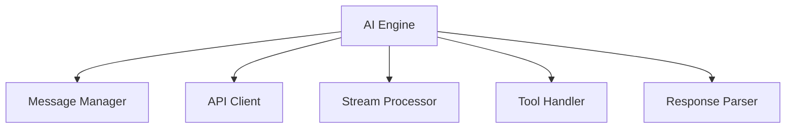
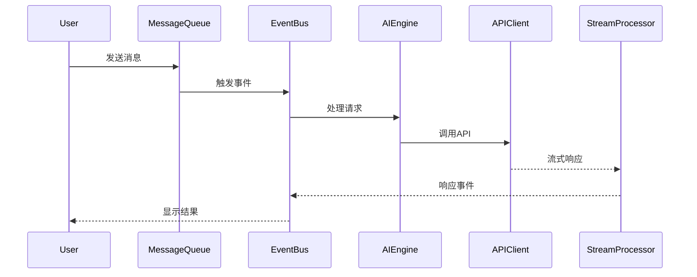
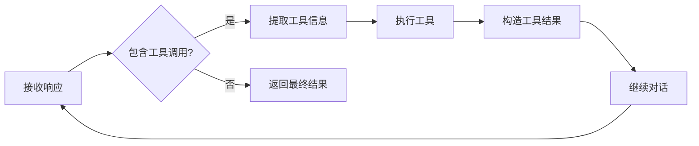
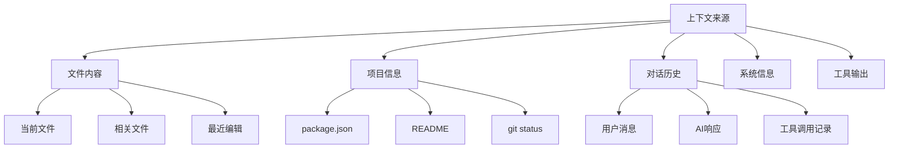
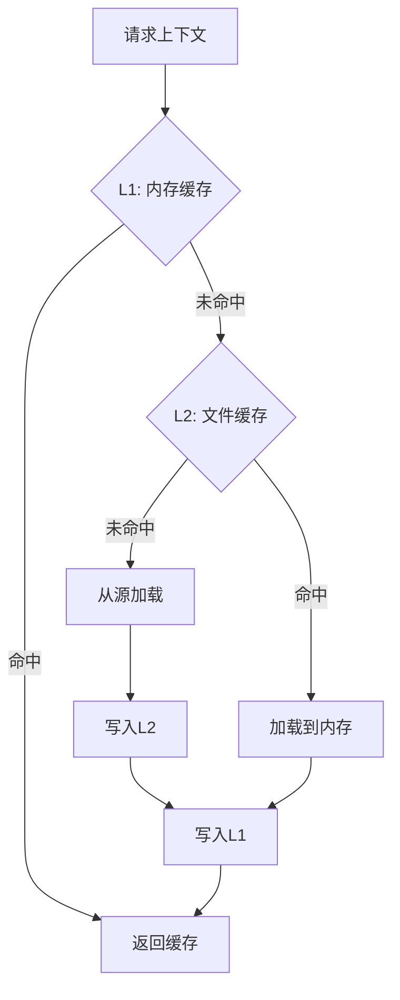
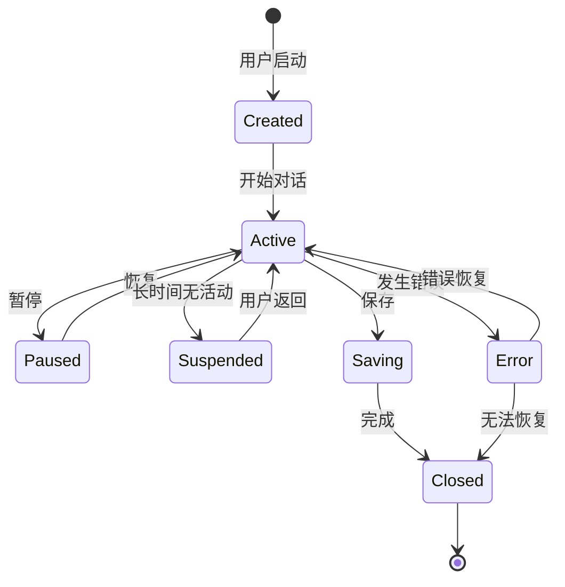

---
title: 文章大纲汇总
date: 2025-11-17
categories:
  - AI
  - Claude Code
---

# Claude Code架构详解系列 - 文章大纲汇总

本文档汇总了所有20篇文章的详细大纲，供后续编写参考。

---

## 阶段一：基础架构（第1-4篇）

### 第1篇：整体架构设计 ✅ 已完成

**目标读者**：所有人
**难度**：⭐⭐
**预计字数**：8000字

**内容大纲**：
1. 引言
2. 技术栈概览
3. 整体架构设计（四层架构）
4. 与传统IDE的对比
5. 核心设计理念
6. 性能与可扩展性
7. 安全性设计
8. 最佳实践
9. 常见问题
10. 扩展阅读

**关键Mermaid图**：
- 技术栈图
- 四层架构图
- 数据流动图
- 架构对比图

---

### 第2篇：核心引擎实现

**目标读者**：中高级开发者
**难度**：⭐⭐⭐
**预计字数**：10000字

**内容大纲**：

#### 1. 引言
- AI引擎的作用
- 与传统编程的区别

#### 2. AI引擎架构


#### 3. 初始化流程
- 配置加载
- API客户端创建
- 工具注册
- 系统提示词加载

**代码示例**：
```typescript
class AIEngine {
  constructor(config: AIConfig) {
    this.client = new Anthropic({
      apiKey: config.apiKey
    });
    this.tools = new ToolRegistry();
    this.systemPrompt = loadSystemPrompt();
  }
}
```

#### 4. Prompt工程详解
- 系统提示词设计原则
- Few-shot示例选择
- 上下文组织策略
- 提示词模板

**实例分析**：
```
# Claude Code 的系统提示词结构

## Role Definition
你是 Claude Code，一个AI编程助手...

## Capabilities
你可以：
- 读取和编辑文件
- 搜索代码
- 执行命令
...

## Guidelines
- 在执行破坏性操作前询问用户
- 提供清晰的解释
...

## Tool Usage Examples
[few-shot examples]
```

#### 5. 消息队列和事件驱动
- 消息队列设计
- 事件总线架构
- 异步处理机制
- 背压处理

**架构图**：


#### 6. 流式响应处理
- SSE (Server-Sent Events)
- 增量解析
- 实时输出
- 错误处理

**代码示例**：
```typescript
async function* streamResponse(messages: Message[]) {
  const stream = await client.messages.stream({
    model: 'claude-3-5-sonnet-20250929',
    messages,
    max_tokens: 8000
  });

  for await (const chunk of stream) {
    if (chunk.type === 'content_block_delta') {
      yield chunk.delta.text;
    }
  }
}
```

#### 7. 工具调用循环
- Tool Use 检测
- 参数提取
- 工具执行
- 结果返回
- 继续对话

**流程图**：


#### 8. 错误恢复机制
- API错误处理
- 重试策略
- 降级方案
- 状态恢复

#### 9. 性能优化
- 请求合并
- 并行处理
- 缓存策略
- Token优化

#### 10. 实战练习
- 实现一个简化的AI引擎
- 处理流式响应
- 实现工具调用循环

---

### 第3篇：上下文管理系统

**目标读者**：中级开发者
**难度**：⭐⭐⭐
**预计字数**：9000字

**内容大纲**：

#### 1. 引言
- 上下文的重要性
- Claude的上下文窗口（200K tokens）
- 上下文管理的挑战

#### 2. 上下文类型和来源


#### 3. Token计数和预算控制
**技术选型**：
- tiktoken库
- 模型特定的tokenizer
- 实时计数

**代码示例**：
```typescript
import { encoding_for_model } from 'tiktoken';

class TokenCounter {
  private encoding;

  constructor(model: string) {
    this.encoding = encoding_for_model(model);
  }

  count(text: string): number {
    return this.encoding.encode(text).length;
  }

  countMessages(messages: Message[]): number {
    let total = 0;
    for (const msg of messages) {
      total += this.count(msg.content);
      total += 4; // 消息格式的固定开销
    }
    return total;
  }
}
```

#### 4. 智能截断算法
**策略**：
- 头部保留（系统提示词）
- 尾部保留（最近对话）
- 中间智能选择

**算法实现**：
```typescript
interface ContextItem {
  type: 'system' | 'file' | 'conversation' | 'tool';
  content: string;
  priority: number;
  tokens: number;
}

class SmartTruncator {
  truncate(items: ContextItem[], maxTokens: number): ContextItem[] {
    // 1. 按优先级排序
    const sorted = items.sort((a, b) => b.priority - a.priority);

    // 2. 累加token，超出预算时停止
    let totalTokens = 0;
    const result: ContextItem[] = [];

    for (const item of sorted) {
      if (totalTokens + item.tokens <= maxTokens) {
        result.push(item);
        totalTokens += item.tokens;
      } else {
        // 3. 尝试截断当前项
        const remaining = maxTokens - totalTokens;
        if (remaining > 100) { // 至少保留100 tokens
          const truncated = this.truncateItem(item, remaining);
          result.push(truncated);
        }
        break;
      }
    }

    return result;
  }
}
```

#### 5. 上下文优先级排序
**优先级矩阵**：
| 上下文类型 | 基础优先级 | 调整因素 |
|-----------|----------|---------|
| 系统提示词 | 10 | 固定 |
| 当前文件 | 9 | 用户明确指定+1 |
| 最近编辑 | 8 | 时间衰减 |
| 错误信息 | 8 | - |
| 相关文件 | 7 | 相关度评分 |
| 工具输出 | 6 | 最近使用+1 |
| 项目信息 | 5 | - |
| 历史对话 | 4 | 时间衰减 |

**动态调整**：
```typescript
class PriorityCalculator {
  calculate(item: ContextItem, context: Context): number {
    let priority = item.basePriority;

    // 时间衰减
    if (item.timestamp) {
      const age = Date.now() - item.timestamp;
      const decay = Math.exp(-age / (1000 * 60 * 60)); // 1小时衰减
      priority *= decay;
    }

    // 相关性加权
    if (item.relevanceScore) {
      priority *= item.relevanceScore;
    }

    // 用户明确指定
    if (item.explicitlyRequested) {
      priority += 2;
    }

    return priority;
  }
}
```

#### 6. 缓存机制设计
**多级缓存**：


**缓存策略**：
- LRU（最近最少使用）
- TTL（生存时间）
- 基于文件修改时间的失效

**代码示例**：
```typescript
class ContextCache {
  private l1: Map<string, CacheEntry> = new Map(); // 内存缓存
  private l2Path: string; // 文件缓存路径
  private maxL1Size = 100;

  async get(key: string): Promise<string | null> {
    // L1缓存
    const l1Entry = this.l1.get(key);
    if (l1Entry && !this.isExpired(l1Entry)) {
      return l1Entry.content;
    }

    // L2缓存
    const l2Entry = await this.loadFromL2(key);
    if (l2Entry) {
      this.putL1(key, l2Entry);
      return l2Entry.content;
    }

    return null;
  }

  async set(key: string, content: string, ttl: number = 3600) {
    const entry = {
      content,
      timestamp: Date.now(),
      ttl
    };

    // 写入L1
    this.putL1(key, entry);

    // 异步写入L2
    this.saveToL2(key, entry);
  }

  private putL1(key: string, entry: CacheEntry) {
    if (this.l1.size >= this.maxL1Size) {
      // LRU驱逐
      const oldest = this.findOldest();
      this.l1.delete(oldest);
    }
    this.l1.set(key, entry);
  }
}
```

#### 7. 文件监听和增量更新
- 文件系统监听（chokidar）
- 增量Diff
- 智能更新策略

#### 8. 上下文压缩技术
- 摘要生成
- 关键信息提取
- 代码简化

#### 9. 最佳实践
- 何时包含完整文件
- 何时使用摘要
- 如何处理大型文件

#### 10. 实战练习
- 实现Token计数器
- 实现智能截断算法
- 实现优先级排序

---

### 第4篇：会话与状态管理

**目标读者**：中级开发者
**难度**：⭐⭐⭐
**预计字数**：8500字

**内容大纲**：

#### 1. 引言
- 会话的重要性
- 状态管理的挑战

#### 2. 会话生命周期


#### 3. 会话数据结构
```typescript
interface Session {
  id: string;
  createdAt: Date;
  lastActiveAt: Date;
  status: 'active' | 'paused' | 'suspended' | 'closed';

  // 元数据
  metadata: {
    workspaceRoot: string;
    projectName: string;
    gitBranch?: string;
  };

  // 对话历史
  messages: Message[];

  // 上下文快照
  context: {
    files: string[];
    recentEdits: EditHistory[];
  };

  // 配置
  config: SessionConfig;

  // 统计信息
  stats: {
    messageCount: number;
    tokensUsed: number;
    toolCallsCount: number;
  };
}
```

#### 4. 持久化方案
**技术选型对比**：
| 方案 | 优点 | 缺点 | 适用场景 |
|------|------|------|---------|
| SQLite | 轻量、无需服务 | 并发性能一般 | 单用户应用 |
| JSON文件 | 简单、可读性好 | 大数据性能差 | 小规模数据 |
| LevelDB | 高性能KV | 查询能力弱 | 时序数据 |
| PostgreSQL | 功能强大 | 需要额外服务 | 企业级应用 |

**Claude Code选择：SQLite**

**Schema设计**：
```sql
-- 会话表
CREATE TABLE sessions (
  id TEXT PRIMARY KEY,
  created_at INTEGER NOT NULL,
  last_active_at INTEGER NOT NULL,
  status TEXT NOT NULL,
  metadata TEXT NOT NULL, -- JSON
  config TEXT NOT NULL,   -- JSON
  stats TEXT NOT NULL     -- JSON
);

-- 消息表
CREATE TABLE messages (
  id TEXT PRIMARY KEY,
  session_id TEXT NOT NULL,
  role TEXT NOT NULL,
  content TEXT NOT NULL,
  timestamp INTEGER NOT NULL,
  tokens INTEGER,
  FOREIGN KEY (session_id) REFERENCES sessions(id)
);

-- 上下文快照表
CREATE TABLE context_snapshots (
  id TEXT PRIMARY KEY,
  session_id TEXT NOT NULL,
  timestamp INTEGER NOT NULL,
  context_data TEXT NOT NULL, -- JSON
  FOREIGN KEY (session_id) REFERENCES sessions(id)
);

-- 索引
CREATE INDEX idx_sessions_status ON sessions(status);
CREATE INDEX idx_messages_session ON messages(session_id);
CREATE INDEX idx_messages_timestamp ON messages(timestamp);
```

**持久化实现**：
```typescript
class SessionPersistence {
  private db: Database;

  async saveSession(session: Session): Promise<void> {
    await this.db.run(
      `INSERT OR REPLACE INTO sessions VALUES (?, ?, ?, ?, ?, ?, ?)`,
      [
        session.id,
        session.createdAt.getTime(),
        session.lastActiveAt.getTime(),
        session.status,
        JSON.stringify(session.metadata),
        JSON.stringify(session.config),
        JSON.stringify(session.stats)
      ]
    );

    // 保存消息
    for (const msg of session.messages) {
      await this.saveMessage(session.id, msg);
    }
  }

  async loadSession(sessionId: string): Promise<Session | null> {
    const row = await this.db.get(
      `SELECT * FROM sessions WHERE id = ?`,
      [sessionId]
    );

    if (!row) return null;

    const messages = await this.loadMessages(sessionId);

    return {
      id: row.id,
      createdAt: new Date(row.created_at),
      lastActiveAt: new Date(row.last_active_at),
      status: row.status,
      metadata: JSON.parse(row.metadata),
      config: JSON.parse(row.config),
      stats: JSON.parse(row.stats),
      messages
    };
  }
}
```

#### 5. 会话恢复机制
- 崩溃恢复
- 断点续传
- 状态一致性保证

#### 6. 多会话并发处理
- 会话隔离
- 资源管理
- 锁机制

#### 7. 会话清理和归档
- 自动清理策略
- 归档格式
- 导出/导入

#### 8. 实战练习
- 实现会话管理器
- 实现SQLite持久化
- 实现会话恢复

---

## 阶段二：工具系统（第5-8篇）

### 第5篇：工具系统架构

**关键内容**：
- Tool Schema设计规范
- 工具注册和发现机制
- 参数验证和类型检查
- 工具权限管理
- 工具调用流程

### 第6篇：文件操作工具实现

**关键内容**：
- Read工具实现（偏移、限制、行号）
- Write工具实现（覆盖、备份）
- Edit工具实现（精确字符串替换、冲突检测）
- 文件监听和变更检测
- 安全沙箱机制

### 第7篇：代码搜索与分析工具

**关键内容**：
- Glob工具实现（模式匹配、递归搜索）
- Grep工具实现（正则、上下文行、性能优化）
- AST解析（TypeScript、Python、Java）
- 符号索引构建
- 代码导航实现

### 第8篇：终端集成实现

**关键内容**：
- Bash工具实现
- PTY（伪终端）技术
- 命令执行和输出捕获
- 后台任务管理
- 交互式命令处理
- 信号处理

---

## 阶段三：高级特性（第9-12篇）

### 第9篇：MCP协议深入解析

**关键内容**：
- MCP协议设计理念
- 协议规范和消息格式
- MCP Server开发指南
- 内置MCP工具解析（Playwright、Filesystem等）
- 自定义MCP扩展开发

### 第10篇：浏览器自动化集成

**关键内容**：
- Playwright MCP Server实现
- 页面快照和DOM解析
- 元素定位和交互
- 网络请求监控
- 截图和PDF生成

### 第11篇：Agent工作流引擎

**关键内容**：
- Task Agent实现原理
- 多步任务规划算法
- 子Agent派发机制
- 并行任务执行
- 失败重试和回滚策略

### 第12篇：多模态交互实现

**关键内容**：
- 图像处理能力（Claude Vision）
- 截图分析实现
- PDF文档解析
- 代码高亮渲染
- Markdown实时预览

---

## 阶段四：工程化实践（第13-16篇）

### 第13篇：性能优化深度剖析

**关键内容**：
- 请求批处理和合并
- 智能缓存策略（多级缓存）
- 增量更新机制
- 懒加载和预加载
- 内存优化技巧
- Token使用优化

### 第14篇：错误处理与容错设计

**关键内容**：
- 分层错误处理机制
- API限流和重试策略（指数退避）
- 优雅降级方案
- 错误日志和追踪
- 用户友好的错误提示

### 第15篇：安全机制设计

**关键内容**：
- API Key管理（环境变量、keychain）
- 敏感信息过滤（正则、规则引擎）
- 命令白名单/黑名单
- 文件访问权限控制
- 用户确认机制（Hooks）

### 第16篇：测试与质量保证

**关键内容**：
- 单元测试框架（Jest）
- 集成测试策略
- E2E测试实践
- Mock和Stub技术
- CI/CD流程（GitHub Actions）

---

## 阶段五：实战与扩展（第17-20篇）

### 第17篇：自定义工具开发实战

**3个实战案例**：
1. 数据库查询工具（SQL执行、结果格式化）
2. API调用工具（RESTful、GraphQL）
3. 代码生成工具（模板引擎、AST生成）

### 第18篇：MCP Server开发实战

**3个实战案例**：
1. Git操作Server（status、commit、push）
2. Docker管理Server（容器、镜像、网络）
3. 数据分析Server（Pandas、数据可视化）

### 第19篇：集成第三方服务

**集成示例**：
- GitHub API（Issues、PRs、Actions）
- Jira/Linear（任务管理）
- Slack/Discord（消息通知）
- 数据库连接（MySQL、PostgreSQL、MongoDB）
- 云服务（AWS S3、Azure Blob）

### 第20篇：构建自己的AI编程助手

**完整项目**：
- 技术栈选择
- 架构设计
- MVP功能实现
- 部署方案
- 商业化思考

---

## 每篇文章的标准结构

1. **引言**（500字）
   - 为什么需要这个功能
   - 应用场景
   - 本文目标

2. **核心概念**（1000字）
   - 关键技术点讲解
   - 理论基础

3. **架构设计**（1500字）
   - 设计思路
   - 架构图（Mermaid）
   - 组件划分

4. **实现细节**（3000-4000字）
   - 核心代码
   - 算法讲解
   - 流程图

5. **代码示例**（1000字）
   - 完整可运行的代码
   - 详细注释

6. **最佳实践**（800字）
   - 设计建议
   - 注意事项
   - 常见陷阱

7. **常见问题**（500字）
   - FAQ
   - 疑难解答

8. **扩展阅读**（300字）
   - 相关资源
   - 延伸话题

9. **实战练习**（500字）
   - 动手练习题
   - 参考答案

10. **总结**（300字）
    - 要点回顾
    - 下一篇预告

**总字数**：8000-10000字/篇

---

## Mermaid图表类型规划

每篇文章至少包含3-5个Mermaid图：

1. **架构图**（graph TB/LR）
2. **流程图**（flowchart/graph）
3. **时序图**（sequenceDiagram）
4. **状态图**（stateDiagram-v2）
5. **类图**（classDiagram）- 适用于面向对象设计

---

## 代码风格规范

- **语言**：TypeScript（主要）
- **注释**：中文详细注释
- **命名**：驼峰命名法
- **格式**：Prettier标准
- **类型**：完整的类型定义

---

## 总计划

- **总篇数**：20篇
- **总字数**：约18万字
- **总图表数**：约100个Mermaid图
- **代码示例**：约200个
- **预计完成时间**：5个月（每月4篇）

---

## 优先级排序

**第一批（核心必读）**：
1. 第1篇 ✅
2. 第2篇
3. 第5篇
4. 第9篇

**第二批（深入理解）**：
5. 第3篇
6. 第4篇
7. 第6篇
8. 第11篇

**第三批（实战技能）**：
9. 第17篇
10. 第18篇
11. 第7篇
12. 第8篇

**第四批（工程化）**：
13. 第13篇
14. 第14篇
15. 第15篇
16. 第16篇

**第五批（高级扩展）**：
17. 第10篇
18. 第12篇
19. 第19篇
20. 第20篇

---

**下一步**：开始编写第2篇《核心引擎实现》
