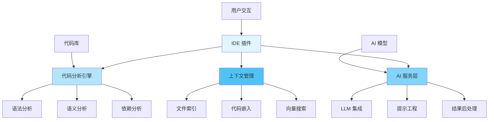
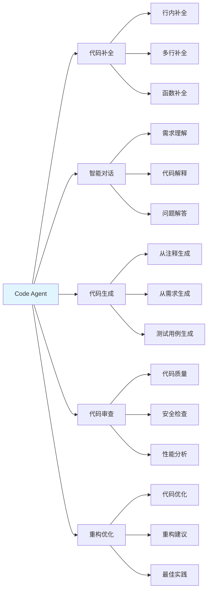
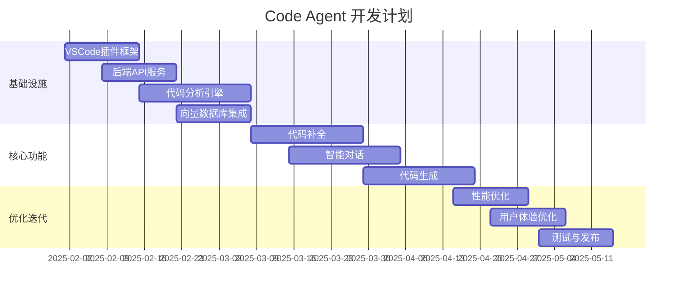
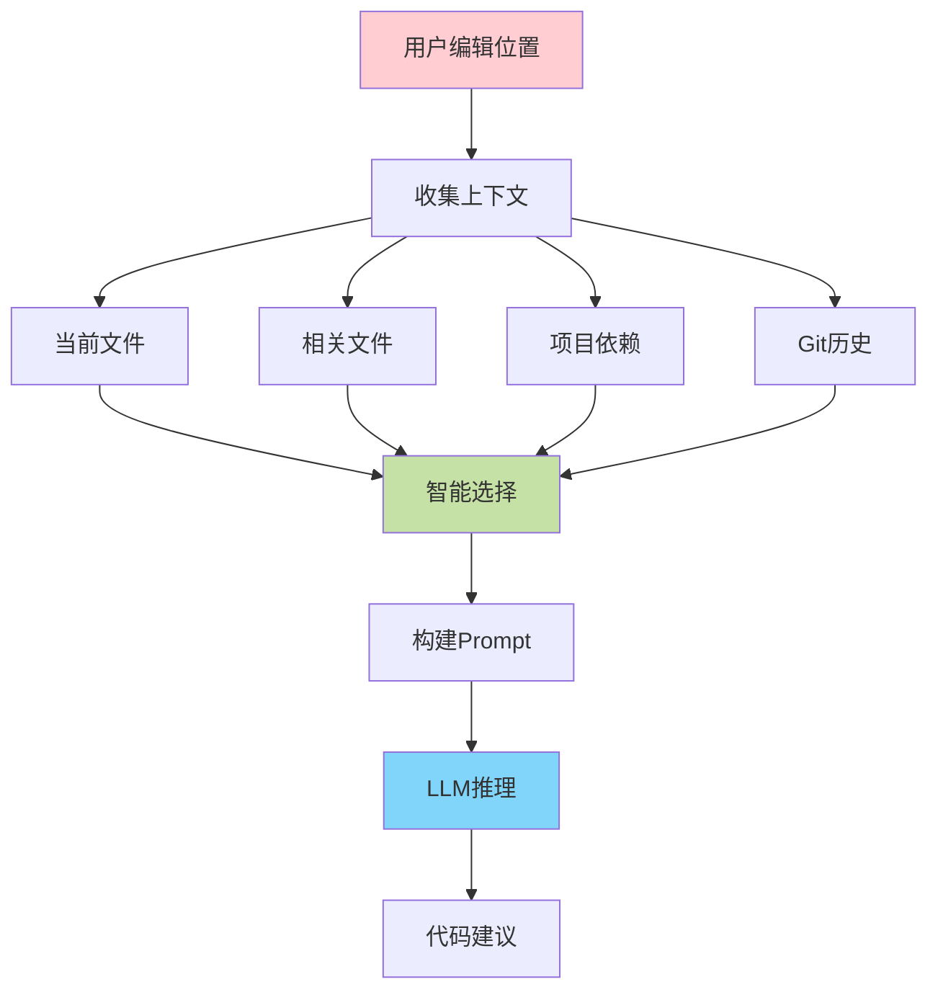

# Code Agent 开发指南

## 一、项目概述

### 1.1 什么是 Code Agent

Code Agent 是一个 AI 驱动的智能编程助手，类似于 Cursor、GitHub Copilot 等工具，能够：

- 💬 **智能对话**: 理解自然语言需求，给出代码建议
- ✍️ **代码补全**: 实时预测并补全代码
- 🔄 **代码重构**: 自动优化和重构代码
- 🐛 **Bug 修复**: 识别并修复代码问题
- 📝 **代码解释**: 解释复杂代码的功能
- 🧪 **测试生成**: 自动生成单元测试
- 📊 **代码审查**: 提供代码质量建议

### 1.2 系统架构总览



### 1.3 核心技术栈

#### 前端 (IDE 插件)
- **VSCode Extension API**: 插件开发框架
- **TypeScript**: 主要开发语言
- **React**: UI 界面（侧边栏面板）
- **Monaco Editor**: 代码编辑器集成

#### 后端服务
- **FastAPI**: Python Web 框架
- **LangChain/LangGraph**: AI 工作流编排
- **LlamaIndex**: 代码索引和检索
- **ChromaDB/Qdrant**: 向量数据库

#### AI 模型
- **OpenAI GPT-4**: 主力模型
- **Claude**: 备选模型
- **Codex/CodeLlama**: 代码专用模型
- **本地模型**: Ollama 支持离线使用

#### 代码分析
- **Tree-sitter**: 语法解析
- **Language Server Protocol (LSP)**: 代码智能
- **AST**: 抽象语法树分析

## 二、功能模块划分

### 2.1 核心功能



### 2.2 辅助功能

- **代码搜索**: 语义化代码搜索
- **文档生成**: 自动生成代码文档
- **错误诊断**: 智能错误提示和修复建议
- **Git 集成**: Commit 消息生成、代码差异分析
- **终端集成**: 命令建议和错误解释

## 三、开发路线图

### 第一阶段：基础设施（1-2个月）



**核心任务：**
1. ✅ 搭建 VSCode 插件基础框架
2. ✅ 实现基础的 AI 服务调用
3. ✅ 建立代码分析能力
4. ✅ 完成向量数据库集成

### 第二阶段：核心功能（2-3个月）

**核心任务：**
1. ✅ 实现代码补全功能
2. ✅ 开发智能对话系统
3. ✅ 构建代码生成能力
4. ✅ 集成多种 AI 模型

### 第三阶段：优化迭代（1-2个月）

**核心任务：**
1. ✅ 性能优化（响应速度、资源占用）
2. ✅ 用户体验改进
3. ✅ 安全性加固
4. ✅ 测试和 Bug 修复

## 四、技术难点与解决方案

### 4.1 上下文理解

**难点**: 如何让 AI 理解完整的代码上下文



**解决方案**：
```python
class ContextBuilder:
    """上下文构建器"""

    def __init__(self):
        self.embeddings = OpenAIEmbeddings()
        self.vector_store = ChromaDB()
        self.ast_parser = TreeSitterParser()

    def build_context(self, cursor_position: Position) -> Context:
        """构建完整上下文"""
        context = {
            "current_file": self._get_current_file_context(cursor_position),
            "related_files": self._get_related_files(cursor_position),
            "dependencies": self._get_dependencies(),
            "recent_changes": self._get_git_history(),
        }

        # 智能压缩上下文（控制 token 数量）
        compressed = self._compress_context(context)

        return compressed

    def _get_current_file_context(self, position: Position) -> dict:
        """获取当前文件上下文"""
        # 1. 当前函数/类
        current_scope = self.ast_parser.get_enclosing_scope(position)

        # 2. 导入语句
        imports = self.ast_parser.get_imports()

        # 3. 光标前后的代码
        surrounding_code = self._get_surrounding_code(position, lines=50)

        return {
            "scope": current_scope,
            "imports": imports,
            "code": surrounding_code
        }

    def _get_related_files(self, position: Position) -> list:
        """获取相关文件（通过向量相似度）"""
        # 当前代码片段
        current_code = self._get_current_function(position)

        # 向量搜索相关代码
        similar_chunks = self.vector_store.similarity_search(
            current_code,
            k=5
        )

        return similar_chunks
```

### 4.2 代码补全性能

**难点**: 实时补全要求极低延迟（<100ms）

**解决方案**：
1. **本地缓存**: 缓存常用补全结果
2. **流式输出**: 逐字输出，提升感知速度
3. **预测式请求**: 提前发送请求
4. **本地模型**: 使用小型本地模型做初步补全

```typescript
// VSCode 插件端
class CompletionProvider implements vscode.InlineCompletionItemProvider {
    private cache = new LRUCache<string, string>(100);
    private debouncer = new Debouncer(150); // 150ms 防抖

    async provideInlineCompletionItems(
        document: vscode.TextDocument,
        position: vscode.Position,
        context: vscode.InlineCompletionContext
    ): Promise<vscode.InlineCompletionItem[]> {
        const cacheKey = this.getCacheKey(document, position);

        // 检查缓存
        const cached = this.cache.get(cacheKey);
        if (cached) {
            return [new vscode.InlineCompletionItem(cached)];
        }

        // 防抖
        return this.debouncer.run(async () => {
            // 调用 API
            const completion = await this.fetchCompletion(document, position);

            // 缓存结果
            this.cache.set(cacheKey, completion);

            return [new vscode.InlineCompletionItem(completion)];
        });
    }

    private async fetchCompletion(
        document: vscode.TextDocument,
        position: vscode.Position
    ): Promise<string> {
        const context = await this.buildContext(document, position);

        // 流式请求
        const stream = await fetch('/api/completion/stream', {
            method: 'POST',
            body: JSON.stringify(context),
        });

        let completion = '';
        const reader = stream.body?.getReader();

        while (true) {
            const { done, value } = await reader!.read();
            if (done) break;

            const chunk = new TextDecoder().decode(value);
            completion += chunk;

            // 增量更新 UI
            this.updateInlineCompletion(completion);
        }

        return completion;
    }
}
```

### 4.3 多模型支持

**难点**: 支持多种 AI 模型，统一接口

```python
from abc import ABC, abstractmethod
from typing import AsyncIterator

class LLMProvider(ABC):
    """LLM 提供者抽象基类"""

    @abstractmethod
    async def complete(self, prompt: str, **kwargs) -> str:
        """同步补全"""
        pass

    @abstractmethod
    async def stream_complete(self, prompt: str, **kwargs) -> AsyncIterator[str]:
        """流式补全"""
        pass

class OpenAIProvider(LLMProvider):
    """OpenAI 实现"""

    def __init__(self, api_key: str, model: str = "gpt-4"):
        self.client = AsyncOpenAI(api_key=api_key)
        self.model = model

    async def complete(self, prompt: str, **kwargs) -> str:
        response = await self.client.chat.completions.create(
            model=self.model,
            messages=[{"role": "user", "content": prompt}],
            **kwargs
        )
        return response.choices[0].message.content

    async def stream_complete(self, prompt: str, **kwargs) -> AsyncIterator[str]:
        stream = await self.client.chat.completions.create(
            model=self.model,
            messages=[{"role": "user", "content": prompt}],
            stream=True,
            **kwargs
        )

        async for chunk in stream:
            if chunk.choices[0].delta.content:
                yield chunk.choices[0].delta.content

class OllamaProvider(LLMProvider):
    """Ollama 本地模型实现"""

    def __init__(self, base_url: str = "http://localhost:11434"):
        self.base_url = base_url
        self.client = httpx.AsyncClient()

    async def complete(self, prompt: str, **kwargs) -> str:
        response = await self.client.post(
            f"{self.base_url}/api/generate",
            json={
                "model": kwargs.get("model", "codellama"),
                "prompt": prompt,
                "stream": False
            }
        )
        return response.json()["response"]

    async def stream_complete(self, prompt: str, **kwargs) -> AsyncIterator[str]:
        async with self.client.stream(
            "POST",
            f"{self.base_url}/api/generate",
            json={
                "model": kwargs.get("model", "codellama"),
                "prompt": prompt,
                "stream": True
            }
        ) as response:
            async for line in response.aiter_lines():
                if line:
                    data = json.loads(line)
                    yield data.get("response", "")

# 统一的模型管理器
class ModelManager:
    """模型管理器"""

    def __init__(self):
        self.providers: dict[str, LLMProvider] = {}
        self.default_provider = "openai"

    def register(self, name: str, provider: LLMProvider):
        """注册模型提供者"""
        self.providers[name] = provider

    async def complete(
        self,
        prompt: str,
        provider: str = None,
        **kwargs
    ) -> str:
        """使用指定提供者补全"""
        provider_name = provider or self.default_provider
        llm = self.providers[provider_name]
        return await llm.complete(prompt, **kwargs)

    async def stream_complete(
        self,
        prompt: str,
        provider: str = None,
        **kwargs
    ) -> AsyncIterator[str]:
        """流式补全"""
        provider_name = provider or self.default_provider
        llm = self.providers[provider_name]

        async for chunk in llm.stream_complete(prompt, **kwargs):
            yield chunk

# 使用示例
manager = ModelManager()
manager.register("openai", OpenAIProvider(api_key="..."))
manager.register("ollama", OllamaProvider())

# 根据配置选择模型
result = await manager.complete("写一个快排", provider="openai")
```

## 五、快速开始

### 5.1 环境准备

```bash
# 1. 安装依赖
npm install -g yo generator-code
pip install fastapi uvicorn langchain openai chromadb tree-sitter

# 2. 创建项目结构
mkdir code-agent
cd code-agent
mkdir -p {extension,backend,shared}

# 3. 初始化 VSCode 插件
cd extension
yo code

# 4. 初始化后端
cd ../backend
python -m venv venv
source venv/bin/activate  # Windows: venv\Scripts\activate
pip install -r requirements.txt
```

### 5.2 最小可行产品（MVP）

```typescript
// extension/src/extension.ts - VSCode 插件入口
import * as vscode from 'vscode';

export function activate(context: vscode.ExtensionContext) {
    console.log('Code Agent 已激活');

    // 注册补全提供者
    const completionProvider = vscode.languages.registerInlineCompletionItemProvider(
        { pattern: '**' },
        {
            async provideInlineCompletionItems(document, position, context) {
                // 获取当前行
                const line = document.lineAt(position.line).text;
                const prefix = line.substring(0, position.character);

                // 调用后端 API
                const response = await fetch('http://localhost:8000/complete', {
                    method: 'POST',
                    headers: { 'Content-Type': 'application/json' },
                    body: JSON.stringify({ prefix })
                });

                const { completion } = await response.json();

                return [new vscode.InlineCompletionItem(completion)];
            }
        }
    );

    context.subscriptions.push(completionProvider);
}
```

```python
# backend/main.py - 后端 API
from fastapi import FastAPI
from pydantic import BaseModel
from openai import AsyncOpenAI

app = FastAPI()
client = AsyncOpenAI(api_key="your-api-key")

class CompletionRequest(BaseModel):
    prefix: str

@app.post("/complete")
async def complete(request: CompletionRequest):
    """代码补全 API"""
    prompt = f"补全以下代码：\n{request.prefix}"

    response = await client.chat.completions.create(
        model="gpt-3.5-turbo",
        messages=[{"role": "user", "content": prompt}],
        max_tokens=100
    )

    completion = response.choices[0].message.content

    return {"completion": completion}

if __name__ == "__main__":
    import uvicorn
    uvicorn.run(app, host="0.0.0.0", port=8000)
```

## 六、学习资源

### 6.1 官方文档
- [VSCode Extension API](https://code.visualstudio.com/api)
- [Language Server Protocol](https://microsoft.github.io/language-server-protocol/)
- [Tree-sitter](https://tree-sitter.github.io/tree-sitter/)
- [LangChain](https://python.langchain.com/)

### 6.2 开源项目参考
- **Continue**: 开源的 AI 编程助手
- **Tabby**: 自托管的代码补全工具
- **Cody**: Sourcegraph 的 AI 助手
- **Aider**: 命令行 AI 编程工具

### 6.3 相关技术
- **编译原理**: 理解代码解析
- **向量数据库**: 代码检索
- **Prompt Engineering**: 优化 AI 输出
- **IDE 插件开发**: VSCode/JetBrains 插件

## 七、文档导航

1. [01.架构设计详解](./01.架构设计详解.md)
2. [02.VSCode插件开发](./02.VSCode插件开发.md)
3. [03.代码分析引擎](./03.代码分析引擎.md)
4. [04.AI服务集成](./04.AI服务集成.md)
5. [05.代码补全实现](./05.代码补全实现.md)
6. [06.智能对话系统](./06.智能对话系统.md)
7. [07.性能优化指南](./07.性能优化指南.md)
8. [08.部署与发布](./08.部署与发布.md)

---

**下一步**: 查看 [01.架构设计详解](./01.架构设计详解.md) 深入了解系统架构！
