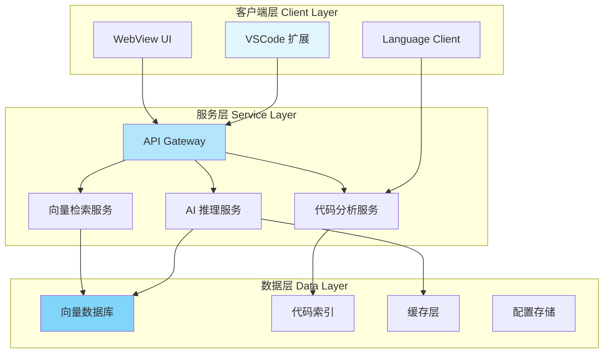
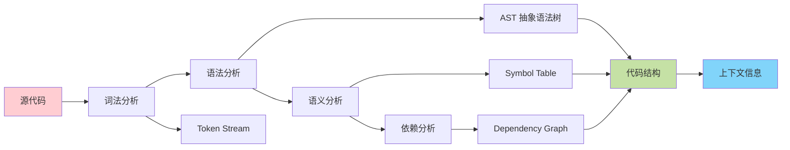
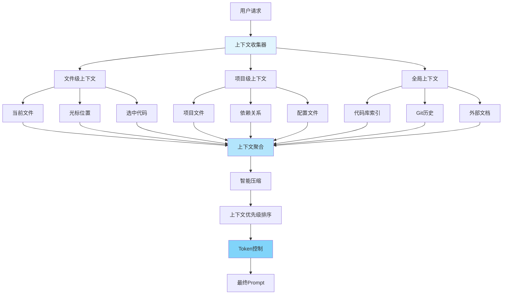
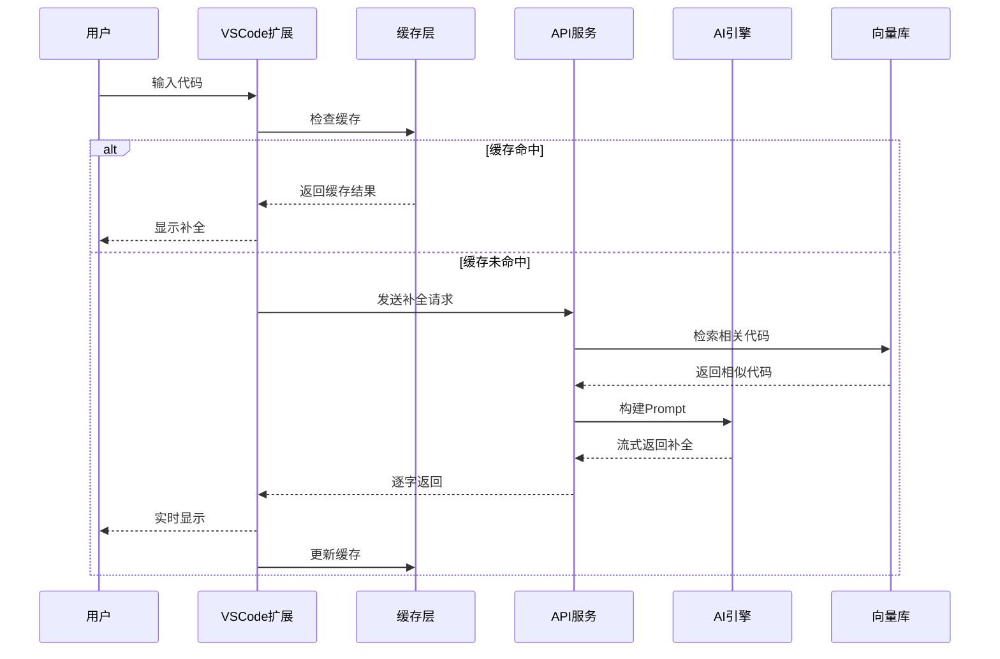
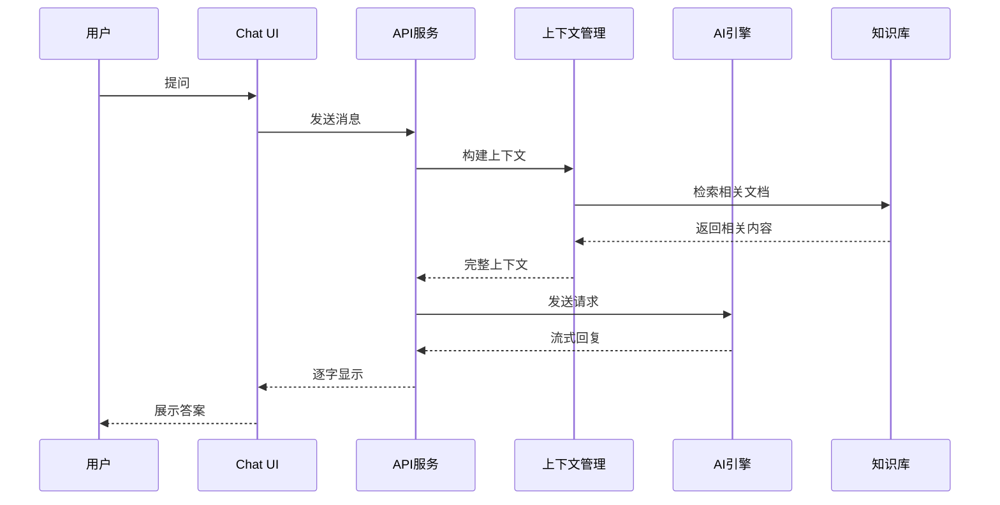
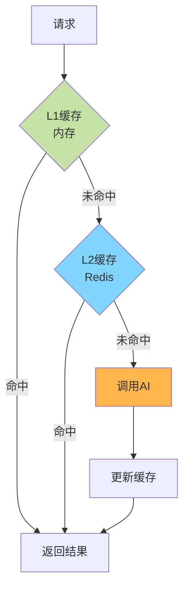

---
title: Code Agent 架构设计详解
date: 2025-01-30
permalink: /ai/codeagent/architecture.html
categories:
  - AI
  - CodeAgent
---

# Code Agent 架构设计详解

## 一、整体架构

### 1.1 三层架构



### 1.2 模块划分

```java
// 项目结构
code-agent/
├── extension/              # VSCode 扩展
│   ├── src/
│   │   ├── extension.ts    # 扩展入口
│   │   ├── providers/      # 各种 Provider
│   │   │   ├── CompletionProvider.ts
│   │   │   ├── HoverProvider.ts
│   │   │   └── CodeActionProvider.ts
│   │   ├── services/       # 服务层
│   │   │   ├── ApiClient.ts
│   │   │   ├── ContextBuilder.ts
│   │   │   └── CacheManager.ts
│   │   ├── ui/            # UI 组件
│   │   │   ├── ChatPanel.tsx
│   │   │   └── DiffView.tsx
│   │   └── utils/         # 工具函数
│   └── package.json
│
├── backend/               # 后端服务
│   ├── api/              # API 层
│   │   ├── routes/
│   │   │   ├── completion.py
│   │   │   ├── chat.py
│   │   │   └── analysis.py
│   │   └── middleware/
│   ├── core/             # 核心逻辑
│   │   ├── code_analyzer/    # 代码分析
│   │   ├── ai_engine/        # AI 引擎
│   │   ├── context_manager/  # 上下文管理
│   │   └── retrieval/        # 检索系统
│   ├── models/           # 数据模型
│   ├── services/         # 业务服务
│   └── utils/            # 工具函数
│
├── shared/               # 共享代码
│   ├── types/           # 类型定义
│   └── constants/       # 常量定义
│
└── docker/              # 容器化
    ├── Dockerfile
    └── docker-compose.yml
```

## 二、核心组件设计

### 2.1 代码分析引擎



**核心实现**：

```python
from tree_sitter import Language, Parser
import tree_sitter_python as tspython

class CodeAnalyzer:
    """代码分析引擎"""

    def __init__(self):
        # 初始化 Tree-sitter
        self.PY_LANGUAGE = Language(tspython.language())
        self.parser = Parser(self.PY_LANGUAGE)

    def analyze(self, code: str, language: str = "python") -> AnalysisResult:
        """分析代码"""
        # 1. 解析 AST
        tree = self.parser.parse(bytes(code, "utf8"))
        root_node = tree.root_node

        # 2. 提取信息
        functions = self._extract_functions(root_node)
        classes = self._extract_classes(root_node)
        imports = self._extract_imports(root_node)
        variables = self._extract_variables(root_node)

        # 3. 构建依赖图
        dependencies = self._build_dependency_graph(root_node)

        # 4. 计算代码指标
        metrics = self._calculate_metrics(root_node)

        return AnalysisResult(
            ast=root_node,
            functions=functions,
            classes=classes,
            imports=imports,
            variables=variables,
            dependencies=dependencies,
            metrics=metrics
        )

    def _extract_functions(self, node) -> List[FunctionInfo]:
        """提取函数定义"""
        functions = []

        def traverse(n):
            if n.type == 'function_definition':
                func_info = FunctionInfo(
                    name=self._get_function_name(n),
                    parameters=self._get_parameters(n),
                    return_type=self._get_return_type(n),
                    docstring=self._get_docstring(n),
                    start_line=n.start_point[0],
                    end_line=n.end_point[0],
                    body=self._get_node_text(n)
                )
                functions.append(func_info)

            for child in n.children:
                traverse(child)

        traverse(node)
        return functions

    def _extract_classes(self, node) -> List[ClassInfo]:
        """提取类定义"""
        classes = []

        def traverse(n):
            if n.type == 'class_definition':
                class_info = ClassInfo(
                    name=self._get_class_name(n),
                    bases=self._get_base_classes(n),
                    methods=self._get_methods(n),
                    attributes=self._get_attributes(n),
                    docstring=self._get_docstring(n)
                )
                classes.append(class_info)

            for child in n.children:
                traverse(child)

        traverse(node)
        return classes

    def _build_dependency_graph(self, node) -> DependencyGraph:
        """构建依赖图"""
        graph = DependencyGraph()

        # 分析函数调用
        calls = self._find_function_calls(node)
        for call in calls:
            graph.add_edge(call.caller, call.callee)

        # 分析类继承
        inheritances = self._find_inheritances(node)
        for inh in inheritances:
            graph.add_edge(inh.child, inh.parent, edge_type="inherits")

        # 分析导入关系
        imports = self._extract_imports(node)
        for imp in imports:
            graph.add_edge("current_file", imp.module, edge_type="imports")

        return graph

    def get_scope_at_position(self, code: str, line: int, col: int) -> Scope:
        """获取指定位置的作用域"""
        tree = self.parser.parse(bytes(code, "utf8"))

        # 找到包含该位置的节点
        node = self._find_node_at_position(tree.root_node, line, col)

        # 构建作用域链
        scope = Scope()
        current = node

        while current:
            if current.type in ['function_definition', 'class_definition']:
                scope.add_level(self._extract_scope_variables(current))
            current = current.parent

        return scope

    def _calculate_metrics(self, node) -> CodeMetrics:
        """计算代码指标"""
        return CodeMetrics(
            lines_of_code=self._count_lines(node),
            cyclomatic_complexity=self._calculate_complexity(node),
            maintainability_index=self._calculate_maintainability(node),
            comment_ratio=self._calculate_comment_ratio(node)
        )
```

### 2.2 上下文管理系统



**实现代码**：

```python
from dataclasses import dataclass
from typing import List, Dict
import tiktoken

@dataclass
class ContextChunk:
    """上下文片段"""
    content: str
    priority: int  # 优先级 1-10
    tokens: int
    source: str  # 来源：file/project/web
    metadata: Dict

class ContextManager:
    """上下文管理器"""

    def __init__(self, max_tokens: int = 8000):
        self.max_tokens = max_tokens
        self.tokenizer = tiktoken.encoding_for_model("gpt-4")
        self.vector_store = ChromaDB()

    async def build_context(
        self,
        request: ContextRequest
    ) -> PromptContext:
        """构建完整上下文"""

        chunks: List[ContextChunk] = []

        # 1. 收集文件级上下文
        file_chunks = await self._get_file_context(request)
        chunks.extend(file_chunks)

        # 2. 收集项目级上下文
        project_chunks = await self._get_project_context(request)
        chunks.extend(project_chunks)

        # 3. 向量检索相关代码
        similar_chunks = await self._get_similar_code(request.query)
        chunks.extend(similar_chunks)

        # 4. 智能压缩和排序
        compressed = self._compress_and_prioritize(chunks)

        # 5. 构建最终 Prompt
        prompt = self._build_prompt(compressed, request)

        return PromptContext(
            prompt=prompt,
            chunks=compressed,
            total_tokens=self._count_tokens(prompt)
        )

    async def _get_file_context(
        self,
        request: ContextRequest
    ) -> List[ContextChunk]:
        """获取文件级上下文"""
        chunks = []

        # 当前函数/类
        current_scope = await self._get_current_scope(
            request.file_path,
            request.position
        )
        if current_scope:
            chunks.append(ContextChunk(
                content=current_scope.code,
                priority=10,  # 最高优先级
                tokens=self._count_tokens(current_scope.code),
                source="current_scope",
                metadata={"type": current_scope.type}
            ))

        # 导入语句
        imports = await self._get_imports(request.file_path)
        if imports:
            chunks.append(ContextChunk(
                content=imports,
                priority=8,
                tokens=self._count_tokens(imports),
                source="imports",
                metadata={}
            ))

        # 光标前后代码
        surrounding = await self._get_surrounding_code(
            request.file_path,
            request.position,
            lines_before=20,
            lines_after=10
        )
        if surrounding:
            chunks.append(ContextChunk(
                content=surrounding,
                priority=9,
                tokens=self._count_tokens(surrounding),
                source="surrounding",
                metadata={}
            ))

        return chunks

    async def _get_project_context(
        self,
        request: ContextRequest
    ) -> List[ContextChunk]:
        """获取项目级上下文"""
        chunks = []

        # README 文件
        readme = await self._get_readme(request.project_path)
        if readme:
            chunks.append(ContextChunk(
                content=readme[:500],  # 只取前500字符
                priority=5,
                tokens=self._count_tokens(readme[:500]),
                source="readme",
                metadata={}
            ))

        # 项目配置
        config = await self._get_project_config(request.project_path)
        if config:
            chunks.append(ContextChunk(
                content=str(config),
                priority=4,
                tokens=self._count_tokens(str(config)),
                source="config",
                metadata={}
            ))

        # 相关文件（基于依赖分析）
        related_files = await self._get_related_files(request.file_path)
        for file in related_files[:3]:  # 最多3个相关文件
            content = await self._read_file(file.path)
            chunks.append(ContextChunk(
                content=content,
                priority=6,
                tokens=self._count_tokens(content),
                source="related_file",
                metadata={"path": file.path, "relation": file.relation}
            ))

        return chunks

    async def _get_similar_code(self, query: str) -> List[ContextChunk]:
        """向量检索相似代码"""
        # 将查询转换为向量
        results = await self.vector_store.similarity_search(
            query,
            k=5
        )

        chunks = []
        for i, result in enumerate(results):
            chunks.append(ContextChunk(
                content=result.content,
                priority=7 - i,  # 优先级递减
                tokens=self._count_tokens(result.content),
                source="vector_search",
                metadata={
                    "score": result.score,
                    "file": result.metadata.get("file")
                }
            ))

        return chunks

    def _compress_and_prioritize(
        self,
        chunks: List[ContextChunk]
    ) -> List[ContextChunk]:
        """压缩并排序上下文"""

        # 1. 按优先级排序
        sorted_chunks = sorted(chunks, key=lambda x: x.priority, reverse=True)

        # 2. Token 预算分配
        result = []
        total_tokens = 0

        for chunk in sorted_chunks:
            if total_tokens + chunk.tokens <= self.max_tokens:
                result.append(chunk)
                total_tokens += chunk.tokens
            else:
                # 尝试截断
                remaining = self.max_tokens - total_tokens
                if remaining > 100:  # 至少保留100 tokens
                    truncated = self._truncate_content(
                        chunk.content,
                        remaining
                    )
                    result.append(ContextChunk(
                        content=truncated,
                        priority=chunk.priority,
                        tokens=remaining,
                        source=chunk.source,
                        metadata={**chunk.metadata, "truncated": True}
                    ))
                break

        return result

    def _build_prompt(
        self,
        chunks: List[ContextChunk],
        request: ContextRequest
    ) -> str:
        """构建最终 Prompt"""

        # 系统消息
        system = "你是一个专业的编程助手，精通多种编程语言。"

        # 上下文部分
        context_parts = []

        # 按来源组织上下文
        grouped = self._group_by_source(chunks)

        if "current_scope" in grouped:
            context_parts.append(
                f"## 当前作用域\n\n```python\n{grouped['current_scope'][0].content}\n```"
            )

        if "imports" in grouped:
            context_parts.append(
                f"## 导入语句\n\n```python\n{grouped['imports'][0].content}\n```"
            )

        if "surrounding" in grouped:
            context_parts.append(
                f"## 周围代码\n\n```python\n{grouped['surrounding'][0].content}\n```"
            )

        if "related_file" in grouped:
            context_parts.append("## 相关文件")
            for chunk in grouped["related_file"]:
                path = chunk.metadata.get("path", "unknown")
                context_parts.append(
                    f"### {path}\n\n```python\n{chunk.content}\n```"
                )

        # 用户请求
        user_message = f"""
{chr(10).join(context_parts)}

## 用户请求
{request.query}

请基于以上上下文回答问题或生成代码。
"""

        return f"{system}\n\n{user_message}"

    def _count_tokens(self, text: str) -> int:
        """计算 token 数量"""
        return len(self.tokenizer.encode(text))

    def _truncate_content(self, content: str, max_tokens: int) -> str:
        """截断内容到指定 token 数"""
        tokens = self.tokenizer.encode(content)
        if len(tokens) <= max_tokens:
            return content

        truncated_tokens = tokens[:max_tokens]
        return self.tokenizer.decode(truncated_tokens)

    def _group_by_source(
        self,
        chunks: List[ContextChunk]
    ) -> Dict[str, List[ContextChunk]]:
        """按来源分组"""
        grouped = {}
        for chunk in chunks:
            if chunk.source not in grouped:
                grouped[chunk.source] = []
            grouped[chunk.source].append(chunk)
        return grouped
```

## 三、数据流设计

### 3.1 代码补全流程



### 3.2 智能对话流程



## 四、性能优化策略

### 4.1 缓存架构



**实现**：

```python
from functools import wraps
import hashlib
import redis
from typing import Optional

class CacheManager:
    """多级缓存管理器"""

    def __init__(self):
        # L1: 内存缓存
        self.memory_cache = {}
        self.max_memory_size = 100

        # L2: Redis 缓存
        self.redis_client = redis.Redis(
            host='localhost',
            port=6379,
            db=0,
            decode_responses=True
        )

    def get_cache_key(self, *args, **kwargs) -> str:
        """生成缓存键"""
        key_str = f"{args}_{kwargs}"
        return hashlib.md5(key_str.encode()).hexdigest()

    def get(self, key: str) -> Optional[str]:
        """获取缓存"""
        # 先查 L1
        if key in self.memory_cache:
            return self.memory_cache[key]

        # 再查 L2
        value = self.redis_client.get(key)
        if value:
            # 回填 L1
            self._set_memory(key, value)
            return value

        return None

    def set(self, key: str, value: str, ttl: int = 3600):
        """设置缓存"""
        # 更新 L1
        self._set_memory(key, value)

        # 更新 L2
        self.redis_client.setex(key, ttl, value)

    def _set_memory(self, key: str, value: str):
        """设置内存缓存（LRU）"""
        if len(self.memory_cache) >= self.max_memory_size:
            # 移除最旧的
            oldest_key = next(iter(self.memory_cache))
            del self.memory_cache[oldest_key]

        self.memory_cache[key] = value

def cached(ttl: int = 3600):
    """缓存装饰器"""
    def decorator(func):
        @wraps(func)
        async def wrapper(*args, **kwargs):
            cache = CacheManager()
            key = cache.get_cache_key(func.__name__, *args, **kwargs)

            # 检查缓存
            cached_value = cache.get(key)
            if cached_value:
                return cached_value

            # 调用函数
            result = await func(*args, **kwargs)

            # 缓存结果
            cache.set(key, result, ttl)

            return result

        return wrapper
    return decorator

# 使用示例
@cached(ttl=1800)
async def get_completion(prompt: str) -> str:
    """获取补全（带缓存）"""
    return await call_llm_api(prompt)
```

### 4.2 请求合并与批处理

```python
import asyncio
from collections import defaultdict
from typing import List

class RequestBatcher:
    """请求批处理器"""

    def __init__(self, batch_size: int = 10, wait_time: float = 0.1):
        self.batch_size = batch_size
        self.wait_time = wait_time
        self.pending_requests = []
        self.lock = asyncio.Lock()

    async def add_request(self, request: dict) -> str:
        """添加请求到批次"""
        future = asyncio.Future()

        async with self.lock:
            self.pending_requests.append((request, future))

            # 达到批次大小，立即处理
            if len(self.pending_requests) >= self.batch_size:
                await self._process_batch()

        # 等待结果
        return await future

    async def _process_batch(self):
        """处理批次"""
        if not self.pending_requests:
            return

        batch = self.pending_requests[:]
        self.pending_requests.clear()

        # 批量调用 AI
        requests = [r for r, _ in batch]
        results = await self._batch_call_ai(requests)

        # 设置结果
        for (_, future), result in zip(batch, results):
            future.set_result(result)

    async def _batch_call_ai(self, requests: List[dict]) -> List[str]:
        """批量调用 AI"""
        # 实现批量调用逻辑
        return await call_llm_batch(requests)

# 后台任务定期处理
async def batch_processor_worker(batcher: RequestBatcher):
    """后台批处理 worker"""
    while True:
        await asyncio.sleep(batcher.wait_time)
        async with batcher.lock:
            if batcher.pending_requests:
                await batcher._process_batch()
```

## 五、安全性设计

### 5.1 敏感信息保护

```python
import re
from typing import List, Pattern

class SensitiveDataFilter:
    """敏感数据过滤器"""

    def __init__(self):
        # 定义敏感模式
        self.patterns: List[Pattern] = [
            re.compile(r'sk-[a-zA-Z0-9]{48}'),  # OpenAI API Key
            re.compile(r'ghp_[a-zA-Z0-9]{36}'),  # GitHub Token
            re.compile(r'[A-Za-z0-9+/]{40}'),   # AWS Secret
            re.compile(r'\d{16}'),              # 信用卡号
            re.compile(r'\d{3}-\d{2}-\d{4}'),   # SSN
        ]

    def filter(self, text: str) -> str:
        """过滤敏感信息"""
        filtered = text

        for pattern in self.patterns:
            filtered = pattern.sub('[REDACTED]', filtered)

        return filtered

    def scan_code(self, code: str) -> List[dict]:
        """扫描代码中的敏感信息"""
        findings = []

        for i, line in enumerate(code.split('\n'), 1):
            for pattern in self.patterns:
                matches = pattern.finditer(line)
                for match in matches:
                    findings.append({
                        "line": i,
                        "column": match.start(),
                        "matched": match.group(),
                        "severity": "HIGH"
                    })

        return findings
```

### 5.2 权限控制

```python
from enum import Enum
from typing import Set

class Permission(Enum):
    """权限枚举"""
    READ_CODE = "read_code"
    WRITE_CODE = "write_code"
    EXECUTE_CODE = "execute_code"
    ACCESS_NETWORK = "access_network"
    READ_FILES = "read_files"
    WRITE_FILES = "write_files"

class AccessControl:
    """访问控制"""

    def __init__(self):
        self.user_permissions: dict[str, Set[Permission]] = {}

    def grant_permission(self, user_id: str, permission: Permission):
        """授予权限"""
        if user_id not in self.user_permissions:
            self.user_permissions[user_id] = set()

        self.user_permissions[user_id].add(permission)

    def check_permission(self, user_id: str, permission: Permission) -> bool:
        """检查权限"""
        return permission in self.user_permissions.get(user_id, set())

    def require_permission(self, permission: Permission):
        """权限装饰器"""
        def decorator(func):
            async def wrapper(user_id: str, *args, **kwargs):
                if not self.check_permission(user_id, permission):
                    raise PermissionError(
                        f"User {user_id} lacks {permission.value} permission"
                    )
                return await func(user_id, *args, **kwargs)
            return wrapper
        return decorator

# 使用示例
access_control = AccessControl()

@access_control.require_permission(Permission.WRITE_CODE)
async def modify_code(user_id: str, code: str):
    """修改代码（需要写权限）"""
    # ...实现代码修改逻辑
    pass
```

---

**下一步**: 查看 [02.VSCode插件开发](./02.VSCode插件开发.md) 学习插件实现！
