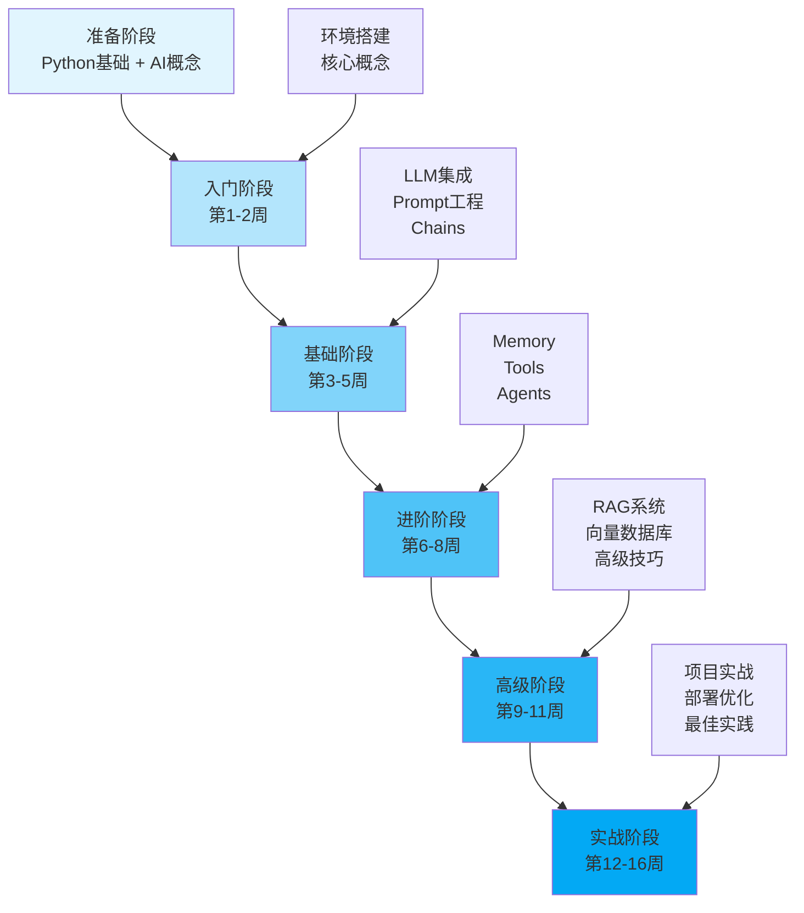

---
title: LangChain 学习路线图
date: 2025-01-30
permalink: /ai/langchain/learning-roadmap.html
categories:
  - AI
  - LangChain
---

# LangChain 学习路线图

## 📚 课程概述

**什么是 LangChain?**

LangChain 是一个强大的框架,用于开发由大语言模型(LLM)驱动的应用程序。它提供了一套完整的工具链,帮助开发者构建智能应用,从简单的聊天机器人到复杂的 AI Agent 系统。

**为什么学习 LangChain?**

- 🚀 **快速开发**: 提供开箱即用的组件,加速 AI 应用开发
- 🔧 **灵活组合**: 模块化设计,可灵活组合各种组件
- 🌐 **生态丰富**: 支持多种 LLM、向量数据库、工具等
- 💼 **企业就绪**: 包含生产环境所需的记忆、缓存、监控等功能
- 📈 **社区活跃**: 持续更新,有大量示例和最佳实践

**学习目标**

通过本路线图学习,你将能够:
- ✅ 理解 LangChain 的核心概念和架构
- ✅ 熟练使用 LangChain 的各种组件
- ✅ 构建实际的 AI 应用(聊天机器人、RAG 系统、Agent 等)
- ✅ 掌握生产环境部署和优化技巧
- ✅ 解决常见问题和性能瓶颈

## 🎯 学习路线图



## 📅 详细学习计划

### 阶段 0: 准备阶段 (开始前)

**学习目标**: 打好基础,了解必要的前置知识

**前置要求**

1. **Python 基础** (必须)
   - 基本语法和数据结构
   - 面向对象编程
   - 异步编程基础
   - 包管理(pip, conda)

2. **AI/ML 概念** (推荐)
   - 什么是大语言模型(LLM)
   - Token、Embedding 的概念
   - API 调用基础

3. **工具准备**
   - Python 3.8+
   - IDE (VSCode/PyCharm)
   - Git 版本控制
   - OpenAI/Anthropic API Key

**学习资源**

- [Python 官方教程](https://docs.python.org/3/tutorial/)
- [OpenAI API 文档](https://platform.openai.com/docs)
- [Anthropic Claude 文档](https://docs.anthropic.com/)

**检验标准**

✅ 能编写基本的 Python 程序
✅ 理解什么是 API 和 JSON
✅ 知道如何使用 pip 安装包
✅ 获得至少一个 LLM API Key

---

### 阶段 1: 入门阶段 (第 1-2 周)

**学习目标**: 了解 LangChain 基础,能运行简单示例

#### 第 1 周: 环境搭建与核心概念

**学习内容**

1. **安装和配置**
   ```bash
   pip install langchain langchain-openai langchain-community
   pip install python-dotenv  # 环境变量管理
   ```

2. **核心概念理解**
   - LangChain 架构
   - 模块化设计理念
   - 主要组件概览

3. **第一个程序**
   ```python
   from langchain_openai import ChatOpenAI
   from langchain_core.messages import HumanMessage

   llm = ChatOpenAI(model="gpt-3.5-turbo")
   response = llm.invoke([HumanMessage(content="Hello!")])
   print(response.content)
   ```

**实践项目**
- 配置开发环境
- 运行官方 Quick Start 示例
- 调用不同的 LLM(OpenAI, Anthropic)

**学习资源**
- [LangChain 官方文档](https://python.langchain.com/)
- [Quick Start 教程](https://python.langchain.com/docs/get_started/quickstart)

**检验标准**
✅ 成功安装 LangChain
✅ 能调用 LLM 并获得响应
✅ 理解基本的调用流程

#### 第 2 周: Messages 和 Prompts

**学习内容**

1. **消息类型**
   - SystemMessage: 系统角色设定
   - HumanMessage: 用户输入
   - AIMessage: AI 响应
   - FunctionMessage: 函数调用结果

2. **Prompt Templates**
   ```python
   from langchain.prompts import ChatPromptTemplate

   template = ChatPromptTemplate.from_messages([
       ("system", "你是一个{role}"),
       ("human", "{input}")
   ])
   ```

3. **Prompt 工程基础**
   - Few-shot learning
   - Chain of Thought
   - 角色设定技巧

**实践项目**
- 创建不同类型的 Prompts
- 实现一个简单的翻译助手
- 尝试不同的 Prompt 策略

**学习资源**
- [Prompts 文档](https://python.langchain.com/docs/modules/model_io/prompts/)
- [Prompt Engineering Guide](https://www.promptingguide.ai/)

**检验标准**
✅ 熟练使用各种消息类型
✅ 能编写有效的 Prompt Templates
✅ 理解 Prompt 工程的基本原则

---

### 阶段 2: 基础阶段 (第 3-5 周)

**学习目标**: 掌握核心组件,能构建简单应用

#### 第 3 周: Models 和 Output Parsers

**学习内容**

1. **LLM vs Chat Models**
   - 区别和使用场景
   - 参数配置(temperature, max_tokens 等)
   - 流式输出

2. **Output Parsers**
   ```python
   from langchain.output_parsers import PydanticOutputParser
   from pydantic import BaseModel, Field

   class Person(BaseModel):
       name: str = Field(description="人名")
       age: int = Field(description="年龄")

   parser = PydanticOutputParser(pydantic_object=Person)
   ```

3. **Runnable 接口**
   - invoke(), batch(), stream()
   - 异步方法: ainvoke(), abatch(), astream()

**实践项目**
- 实现结构化输出解析
- 对比不同 LLM 的性能
- 实现流式聊天界面

**检验标准**
✅ 能配置和使用不同的 LLM
✅ 能解析结构化输出
✅ 理解同步和异步调用

#### 第 4 周: Chains

**学习内容**

1. **LLMChain**
   ```python
   from langchain.chains import LLMChain

   chain = LLMChain(llm=llm, prompt=prompt)
   result = chain.run(input="...")
   ```

2. **Sequential Chains**
   - SimpleSequentialChain
   - SequentialChain
   - 管道式处理

3. **LCEL (LangChain Expression Language)**
   ```python
   chain = prompt | llm | parser
   result = chain.invoke({"input": "..."})
   ```

**实践项目**
- 创建多步骤处理链
- 实现文本总结后翻译的管道
- 使用 LCEL 简化链定义

**学习资源**
- [Chains 文档](https://python.langchain.com/docs/modules/chains/)
- [LCEL 教程](https://python.langchain.com/docs/expression_language/)

**检验标准**
✅ 能创建和使用各种 Chain
✅ 熟练使用 LCEL 语法
✅ 理解链的组合和复用

#### 第 5 周: Document Loaders 和 Text Splitters

**学习内容**

1. **Document Loaders**
   ```python
   from langchain_community.document_loaders import TextLoader

   loader = TextLoader("data.txt")
   documents = loader.load()
   ```

2. **Text Splitters**
   ```python
   from langchain.text_splitter import RecursiveCharacterTextSplitter

   splitter = RecursiveCharacterTextSplitter(
       chunk_size=1000,
       chunk_overlap=200
   )
   chunks = splitter.split_documents(documents)
   ```

3. **文档处理管道**
   - 加载 → 分割 → 向量化 → 存储

**实践项目**
- 加载不同格式的文档(PDF, CSV, JSON)
- 实验不同的分割策略
- 构建文档预处理管道

**检验标准**
✅ 能加载多种格式文档
✅ 理解分割策略的影响
✅ 能构建完整的文档处理流程

---

### 阶段 3: 进阶阶段 (第 6-8 周)

**学习目标**: 掌握高级组件,构建智能应用

#### 第 6 周: Memory

**学习内容**

1. **Memory 类型**
   - ConversationBufferMemory: 完整历史
   - ConversationSummaryMemory: 摘要历史
   - ConversationBufferWindowMemory: 滑动窗口

2. **Memory 集成**
   ```python
   from langchain.memory import ConversationBufferMemory

   memory = ConversationBufferMemory()
   chain = LLMChain(llm=llm, memory=memory)
   ```

3. **自定义 Memory**
   - 实现持久化存储
   - Redis/数据库集成

**实践项目**
- 实现多轮对话机器人
- 对比不同 Memory 策略
- 集成数据库持久化

**检验标准**
✅ 能使用各种 Memory 类型
✅ 理解 Memory 对性能的影响
✅ 能实现自定义 Memory

#### 第 7 周: Tools 和 Toolkits

**学习内容**

1. **内置工具**
   ```python
   from langchain_community.tools import DuckDuckGoSearchRun

   search = DuckDuckGoSearchRun()
   result = search.run("LangChain")
   ```

2. **自定义工具**
   ```python
   from langchain.tools import tool

   @tool
   def calculator(expression: str) -> str:
       """计算数学表达式"""
       return str(eval(expression))
   ```

3. **Toolkits**
   - SQLDatabaseToolkit
   - VectorStoreToolkit
   - FileManagementToolkit

**实践项目**
- 集成搜索、计算等工具
- 创建自定义业务工具
- 使用 Toolkit 操作数据库

**检验标准**
✅ 能使用和扩展内置工具
✅ 能创建自定义工具
✅ 理解工具的描述对 Agent 的重要性

#### 第 8 周: Agents

**学习内容**

1. **Agent 类型**
   - Zero-shot ReAct: 推理+行动
   - Conversational: 对话式
   - OpenAI Functions: 函数调用

2. **Agent 执行流程**
   ```python
   from langchain.agents import create_react_agent, AgentExecutor

   agent = create_react_agent(llm, tools, prompt)
   executor = AgentExecutor(agent=agent, tools=tools)
   result = executor.invoke({"input": "..."})
   ```

3. **自定义 Agent**
   - 自定义决策逻辑
   - 控制执行流程

**实践项目**
- 创建不同类型的 Agent
- 实现带工具的智能助手
- 调试 Agent 的推理过程

**学习资源**
- [Agents 文档](https://python.langchain.com/docs/modules/agents/)
- [Agent Examples](https://python.langchain.com/docs/use_cases/agents/)

**检验标准**
✅ 理解 Agent 的工作原理
✅ 能创建和配置 Agent
✅ 能调试 Agent 的执行过程

---

### 阶段 4: 高级阶段 (第 9-11 周)

**学习目标**: 掌握企业级应用开发技能

#### 第 9 周: Embeddings 和 Vector Stores

**学习内容**

1. **Embeddings**
   ```python
   from langchain_openai import OpenAIEmbeddings

   embeddings = OpenAIEmbeddings()
   vector = embeddings.embed_query("Hello")
   ```

2. **Vector Stores**
   - FAISS: 本地向量存储
   - Pinecone: 云端向量数据库
   - Chroma: 开源向量数据库

3. **相似度搜索**
   ```python
   from langchain_community.vectorstores import FAISS

   vectorstore = FAISS.from_documents(docs, embeddings)
   results = vectorstore.similarity_search("query", k=3)
   ```

**实践项目**
- 构建文档向量索引
- 对比不同向量数据库性能
- 实现语义搜索

**检验标准**
✅ 理解 Embeddings 原理
✅ 能使用多种向量数据库
✅ 能实现高效的相似度搜索

#### 第 10 周: RAG (Retrieval-Augmented Generation)

**学习内容**

1. **RAG 基础架构**
   ```
   文档 → 分割 → 向量化 → 存储
              ↓
   查询 → 检索相关文档 → LLM 生成答案
   ```

2. **实现 RAG**
   ```python
   from langchain.chains import RetrievalQA

   qa = RetrievalQA.from_chain_type(
       llm=llm,
       retriever=vectorstore.as_retriever(),
       chain_type="stuff"
   )
   ```

3. **RAG 优化**
   - 重排序(Re-ranking)
   - 混合搜索
   - 上下文压缩

**实践项目**
- 构建知识库问答系统
- 实现文档检索优化
- 添加引用来源

**学习资源**
- [RAG 教程](https://python.langchain.com/docs/use_cases/question_answering/)
- [高级 RAG 技巧](https://blog.langchain.dev/improving-document-retrieval-with-contextual-compression/)

**检验标准**
✅ 理解 RAG 的完整流程
✅ 能构建生产级 RAG 系统
✅ 能优化检索质量

#### 第 11 周: Callbacks 和 Monitoring

**学习内容**

1. **Callbacks**
   ```python
   from langchain.callbacks import StdOutCallbackHandler

   llm = ChatOpenAI(callbacks=[StdOutCallbackHandler()])
   ```

2. **LangSmith**
   - 请求追踪
   - 性能分析
   - 调试工具

3. **自定义监控**
   ```python
   from langchain.callbacks.base import BaseCallbackHandler

   class CustomHandler(BaseCallbackHandler):
       def on_llm_start(self, ...):
           # 记录开始时间
           pass

       def on_llm_end(self, ...):
           # 记录结束时间和 token 使用
           pass
   ```

**实践项目**
- 集成 LangSmith 监控
- 实现成本追踪
- 构建性能仪表盘

**检验标准**
✅ 能使用 Callbacks 监控执行
✅ 能使用 LangSmith 调试
✅ 能实现自定义监控逻辑

---

### 阶段 5: 实战阶段 (第 12-16 周)

**学习目标**: 完成实际项目,掌握生产部署

#### 第 12-13 周: 项目实战 1 - 智能客服系统

**项目需求**
- 多轮对话能力
- 知识库问答
- 工具调用(查订单、查物流)
- 对话历史管理

**技术栈**
- LangChain + OpenAI
- FAISS 向量存储
- ConversationBufferMemory
- 自定义工具

**实现步骤**
1. 需求分析和架构设计
2. 知识库构建和索引
3. 工具开发
4. Agent 集成
5. 测试和优化

**检验标准**
✅ 完整的对话功能
✅ 准确的知识库检索
✅ 工具调用正常
✅ 用户体验良好

#### 第 14 周: 项目实战 2 - 文档分析助手

**项目需求**
- 支持多格式文档(PDF, Word, Excel)
- 文档问答
- 摘要生成
- 多文档对比

**技术栈**
- LangChain + Claude
- Chroma 向量数据库
- RecursiveCharacterTextSplitter
- RetrievalQA

**实现步骤**
1. 文档加载器开发
2. 分割策略优化
3. RAG 系统实现
4. 多文档管理
5. 界面开发

**检验标准**
✅ 支持多种文档格式
✅ 检索准确率高
✅ 响应速度快
✅ 结果可追溯

#### 第 15 周: 项目实战 3 - AI 研究助手

**项目需求**
- 联网搜索
- 学术论文检索
- 数据分析
- 报告生成

**技术栈**
- LangChain + GPT-4
- Serper API (搜索)
- PandasAI (数据分析)
- ReAct Agent

**实现步骤**
1. 搜索工具集成
2. Agent 设计
3. 数据分析能力
4. 报告生成模板
5. 端到端测试

**检验标准**
✅ 能自主完成研究任务
✅ 搜索结果相关性高
✅ 报告结构清晰
✅ 数据分析准确

#### 第 16 周: 部署和优化

**学习内容**

1. **性能优化**
   - 缓存策略
   - 批处理优化
   - 异步调用
   - 成本控制

2. **部署方案**
   - FastAPI + LangChain
   - Docker 容器化
   - 负载均衡
   - 监控告警

3. **生产最佳实践**
   - 错误处理
   - 限流和重试
   - 日志管理
   - A/B 测试

**实践项目**
- 优化项目性能
- 部署到生产环境
- 建立监控体系

**检验标准**
✅ 响应时间优化 50%+
✅ 成功部署到云端
✅ 完善的监控和告警
✅ 通过压力测试

---

## 🛠️ 学习资源汇总

### 官方资源

1. **文档**
   - [LangChain 官方文档](https://python.langchain.com/)
   - [LangChain API 参考](https://api.python.langchain.com/)
   - [LangSmith 文档](https://docs.smith.langchain.com/)

2. **代码示例**
   - [LangChain Templates](https://github.com/langchain-ai/langchain/tree/master/templates)
   - [LangChain Hub](https://smith.langchain.com/hub)
   - [Cookbook](https://github.com/langchain-ai/langchain/tree/master/cookbook)

### 社区资源

1. **教程和文章**
   - [LangChain Blog](https://blog.langchain.dev/)
   - [DeepLearning.AI LangChain 课程](https://www.deeplearning.ai/short-courses/langchain-for-llm-application-development/)
   - [YouTube 教程](https://www.youtube.com/@LangChain)

2. **开源项目**
   - [AutoGPT](https://github.com/Significant-Gravitas/AutoGPT)
   - [LangFlow](https://github.com/logspace-ai/langflow)
   - [Quivr](https://github.com/StanGirard/quivr)

### 工具和框架

1. **开发工具**
   - LangSmith: 调试和监控
   - LangServe: API 服务化
   - LangChain Hub: Prompt 分享

2. **辅助库**
   - ChromaDB: 向量数据库
   - FAISS: 相似度搜索
   - Unstructured: 文档加载

---

## 📊 学习进度跟踪

### 阶段检查清单

**入门阶段** (第 1-2 周)
- [ ] 环境搭建完成
- [ ] 能运行基本示例
- [ ] 理解核心概念
- [ ] 能使用 Prompts

**基础阶段** (第 3-5 周)
- [ ] 熟练使用 Models
- [ ] 能创建 Chains
- [ ] 掌握文档处理
- [ ] 理解 LCEL

**进阶阶段** (第 6-8 周)
- [ ] 能使用 Memory
- [ ] 能创建自定义工具
- [ ] 理解 Agent 原理
- [ ] 能调试 Agent

**高级阶段** (第 9-11 周)
- [ ] 掌握向量数据库
- [ ] 能构建 RAG 系统
- [ ] 能实现监控
- [ ] 能优化性能

**实战阶段** (第 12-16 周)
- [ ] 完成 3 个项目
- [ ] 部署到生产
- [ ] 建立监控体系
- [ ] 掌握最佳实践

### 技能自评表

| 技能领域 | 入门 | 熟练 | 精通 |
|---------|------|------|------|
| **基础组件** | | | |
| LLM 调用 | ☐ | ☐ | ☐ |
| Prompts 设计 | ☐ | ☐ | ☐ |
| Chains 使用 | ☐ | ☐ | ☐ |
| **进阶组件** | | | |
| Memory 管理 | ☐ | ☐ | ☐ |
| Tools 开发 | ☐ | ☐ | ☐ |
| Agent 构建 | ☐ | ☐ | ☐ |
| **高级能力** | | | |
| RAG 系统 | ☐ | ☐ | ☐ |
| 向量数据库 | ☐ | ☐ | ☐ |
| 性能优化 | ☐ | ☐ | ☐ |
| **生产能力** | | | |
| 系统架构 | ☐ | ☐ | ☐ |
| 部署运维 | ☐ | ☐ | ☐ |
| 监控调试 | ☐ | ☐ | ☐ |

---

## 💡 学习建议

### 学习方法

1. **理论与实践结合**
   - 看文档 30% + 写代码 70%
   - 每个概念都要写示例代码
   - 遇到问题立即调试

2. **循序渐进**
   - 不要跳跃学习
   - 打好基础再进阶
   - 每周复习前面内容

3. **项目驱动**
   - 从第 4 周开始规划项目
   - 边学边用到项目中
   - 完整项目比小 demo 重要

4. **社区参与**
   - 加入 Discord/Slack 社区
   - 阅读他人代码
   - 分享自己的学习心得

### 常见陷阱

❌ **避免的错误**

1. **直接上手复杂项目**
   - 基础不牢,后期重构痛苦
   - 建议: 从简单示例开始

2. **只看不练**
   - 看懂 ≠ 会用
   - 建议: 每个知识点写代码验证

3. **忽视性能和成本**
   - 开发时疯狂调用 API
   - 建议: 从开始就注意成本控制

4. **不看官方文档**
   - 只看教程容易过时
   - 建议: 遇到问题先查官方文档

### 时间管理

**每周学习计划**

- **工作日**: 每天 1-2 小时
  - 30 分钟: 阅读文档/教程
  - 60 分钟: 编写代码/练习
  - 30 分钟: 总结和记录

- **周末**: 每天 3-4 小时
  - 2 小时: 深入学习新主题
  - 2 小时: 项目实践

**加速学习**

如果你有更多时间,可以:
- 压缩每个阶段到 1 周
- 总学习时间缩短到 8-10 周
- 但不建议跳过任何阶段

---

## 🎯 学习成果

完成本路线图后,你将能够:

### 技术能力

✅ **开发能力**
- 独立开发 AI 应用
- 集成各种 LLM 和工具
- 构建复杂的 Agent 系统
- 实现 RAG 知识库

✅ **工程能力**
- 系统架构设计
- 性能优化和成本控制
- 生产部署和运维
- 监控和调试

✅ **问题解决**
- 快速定位问题
- 阅读源码理解原理
- 自定义组件扩展
- 社区贡献能力

### 职业方向

可以从事的岗位:
- 🚀 AI 应用开发工程师
- 🤖 LLM 应用架构师
- 📚 RAG 系统专家
- 🔧 AI Agent 开发者
- 💼 AI 产品经理(技术型)

---

## 📝 学习笔记模板

建议每周写学习笔记,推荐格式:

```markdown
# Week X 学习笔记

## 本周目标
- [ ] 目标 1
- [ ] 目标 2

## 学习内容
### 主题 1
- 核心概念
- 关键代码
- 遇到的问题

### 主题 2
...

## 实践项目
- 项目描述
- 实现步骤
- 遇到的坑

## 本周收获
- 学到了什么
- 还有什么不懂
- 下周计划

## 代码片段
​```python
# 本周最有用的代码
...
​```
```

---

## 🌟 进阶方向

完成本路线图后,可以继续学习:

### 1. 深度方向

**LangGraph**
- 复杂流程编排
- 状态管理
- 多 Agent 协作

**LangServe**
- API 服务化
- 生产部署
- 性能优化

### 2. 广度方向

**其他框架**
- LlamaIndex: 另一个 RAG 框架
- Semantic Kernel: 微软的 LLM 框架
- AutoGPT: 自主 Agent

**相关技术**
- 向量数据库深入(Pinecone, Weaviate)
- Fine-tuning 微调
- 本地部署(Ollama, LocalAI)

### 3. 领域应用

**垂直领域**
- 金融: 财报分析、风险评估
- 医疗: 病历分析、诊断辅助
- 教育: 智能辅导、作业批改
- 法律: 合同审查、案例检索

---

## 🤝 社区和支持

### 官方社区

- [Discord](https://discord.gg/langchain)
- [Twitter](https://twitter.com/LangChainAI)
- [GitHub Discussions](https://github.com/langchain-ai/langchain/discussions)

### 中文社区

- 微信群
- 知乎专栏
- B站视频教程

### 获取帮助

遇到问题时:
1. 🔍 先搜索官方文档
2. 💬 查看 GitHub Issues
3. 🗣️ 在 Discord 提问
4. 📝 写详细的问题描述

---

## 📚 附录

### A. 常用代码片段

#### 1. 基础 LLM 调用
```python
from langchain_openai import ChatOpenAI
from langchain_core.messages import HumanMessage, SystemMessage

llm = ChatOpenAI(model="gpt-3.5-turbo", temperature=0.7)

messages = [
    SystemMessage(content="你是一个有帮助的助手"),
    HumanMessage(content="你好!")
]

response = llm.invoke(messages)
print(response.content)
```

#### 2. 简单 Chain
```python
from langchain.prompts import ChatPromptTemplate
from langchain_openai import ChatOpenAI

prompt = ChatPromptTemplate.from_template("给我讲一个关于{topic}的笑话")
llm = ChatOpenAI()

chain = prompt | llm
result = chain.invoke({"topic": "程序员"})
```

#### 3. RAG 系统
```python
from langchain_community.document_loaders import TextLoader
from langchain.text_splitter import RecursiveCharacterTextSplitter
from langchain_openai import OpenAIEmbeddings
from langchain_community.vectorstores import FAISS
from langchain.chains import RetrievalQA

# 加载文档
loader = TextLoader("data.txt")
documents = loader.load()

# 分割
splitter = RecursiveCharacterTextSplitter(chunk_size=1000, chunk_overlap=200)
chunks = splitter.split_documents(documents)

# 向量化
embeddings = OpenAIEmbeddings()
vectorstore = FAISS.from_documents(chunks, embeddings)

# QA
qa = RetrievalQA.from_chain_type(
    llm=ChatOpenAI(),
    retriever=vectorstore.as_retriever()
)

result = qa.invoke("你的问题")
```

### B. 环境变量配置

`.env` 文件示例:
```bash
# OpenAI
OPENAI_API_KEY=sk-...
OPENAI_API_BASE=https://api.openai.com/v1

# Anthropic
ANTHROPIC_API_KEY=sk-...

# LangSmith
LANGCHAIN_TRACING_V2=true
LANGCHAIN_API_KEY=ls__...
LANGCHAIN_PROJECT=my-project
```

### C. 常见错误解决

| 错误 | 原因 | 解决方案 |
|------|------|---------|
| API Key 错误 | 未配置或过期 | 检查环境变量 |
| Rate Limit | 调用频率过高 | 添加重试机制 |
| Token 超限 | 输入太长 | 分割文本或使用更大模型 |
| 内存不足 | 向量数据库太大 | 使用云端向量数据库 |

---

**祝学习顺利!** 🚀

有问题欢迎在社区讨论,也期待看到你的项目! 💪

---

**最后更新**: 2025-01-30
**作者**: LemonLog
**版本**: 1.0
