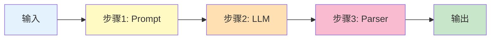
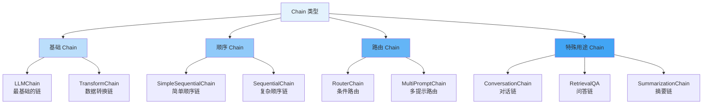
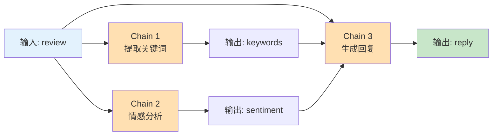
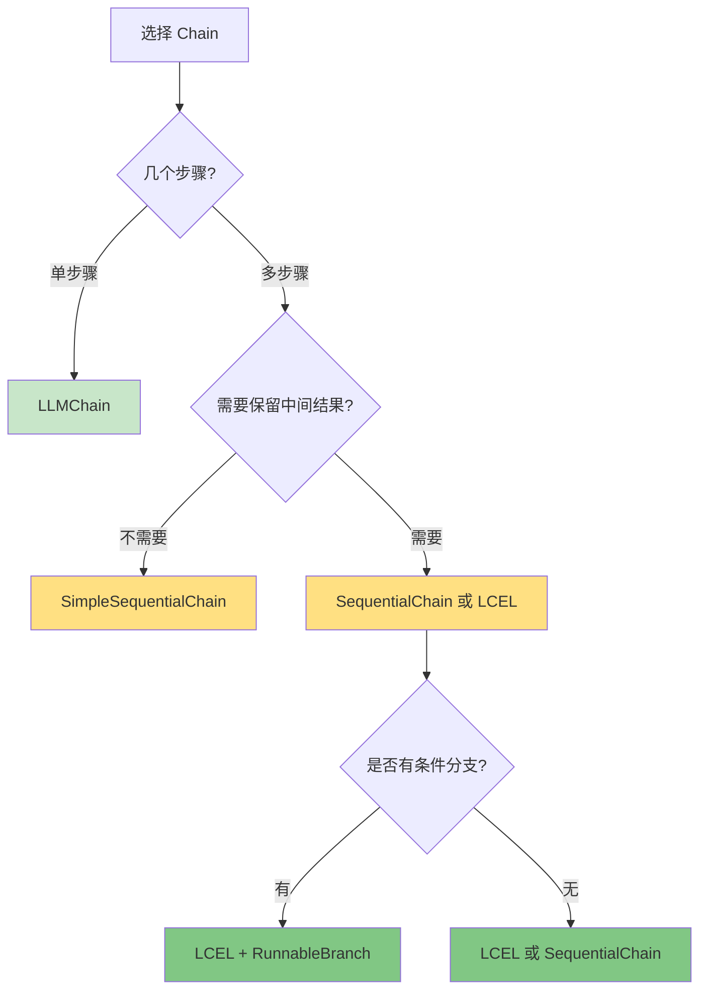

# 第4周：Chains 基础

::: tip 本周学习目标
- 🔗 理解 Chain 的概念和作用
- 🛠️ 掌握 LLMChain、SequentialChain 等基础 Chain
- 🚀 学习 LCEL (LangChain Expression Language)
- 🎯 能够组合多个组件构建复杂流程
- 💡 实现实际业务场景的 Chain 应用
:::

## 一、Chain 基础概念

### 1.1 什么是 Chain？

**Chain（链）** 是 LangChain 的核心抽象，用于将多个组件（LLM、Prompts、Tools等）按照特定顺序连接起来，形成完整的工作流程。



#### 为什么需要 Chain？

**对比：无 Chain vs 有 Chain**

```python
"""
场景：翻译并总结一段文本
"""
from langchain_openai import ChatOpenAI
from langchain.schema import HumanMessage

llm = ChatOpenAI(model="gpt-3.5-turbo")

# ❌ 方式1：手动管理多个步骤（繁琐）
def manual_translate_and_summarize(text: str) -> str:
    # 步骤1：翻译
    translate_prompt = f"将以下文本翻译成英文：\n{text}"
    translation = llm.invoke([HumanMessage(content=translate_prompt)])

    # 步骤2：总结
    summary_prompt = f"总结以下文本（50字以内）：\n{translation.content}"
    summary = llm.invoke([HumanMessage(content=summary_prompt)])

    return summary.content

# ✅ 方式2：使用 Chain（优雅）
from langchain.chains import LLMChain, SimpleSequentialChain
from langchain.prompts import PromptTemplate

# 定义翻译链
translate_chain = LLMChain(
    llm=llm,
    prompt=PromptTemplate.from_template("将以下文本翻译成英文：\n{text}")
)

# 定义总结链
summary_chain = LLMChain(
    llm=llm,
    prompt=PromptTemplate.from_template("总结以下文本（50字以内）：\n{text}")
)

# 组合成顺序链
overall_chain = SimpleSequentialChain(
    chains=[translate_chain, summary_chain],
    verbose=True  # 显示中间步骤
)

# 使用
result = overall_chain.run("人工智能正在改变世界，它在医疗、教育、交通等领域都有广泛应用。")
```

**Chain 的优势：**

| 特性 | 手动管理 | 使用 Chain |
|------|---------|-----------|
| **代码复用** | ❌ 重复代码多 | ✅ 高度复用 |
| **可维护性** | ❌ 难以维护 | ✅ 结构清晰 |
| **调试** | ❌ 难以追踪 | ✅ 内置调试支持 |
| **扩展性** | ❌ 修改困难 | ✅ 易于扩展 |
| **错误处理** | ❌ 手动处理 | ✅ 自动处理 |

### 1.2 Chain 的类型

LangChain 提供了多种预定义的 Chain：



---

## 二、基础 Chain

### 2.1 LLMChain

**LLMChain** 是最基础的 Chain，将 Prompt 和 LLM 组合在一起。

#### 2.1.1 基本用法

```python
"""
LLMChain 基础示例
"""
from langchain_openai import ChatOpenAI
from langchain.chains import LLMChain
from langchain.prompts import PromptTemplate

# 1. 创建 LLM
llm = ChatOpenAI(model="gpt-3.5-turbo", temperature=0.7)

# 2. 创建 Prompt 模板
prompt = PromptTemplate(
    input_variables=["topic"],
    template="请用3句话介绍{topic}"
)

# 3. 创建 LLMChain
chain = LLMChain(
    llm=llm,
    prompt=prompt,
    verbose=True  # 显示执行过程
)

# 4. 运行
result = chain.run(topic="量子计算")
print(f"结果：{result}")

# 或者使用 invoke（推荐，返回更多信息）
result = chain.invoke({"topic": "量子计算"})
print(f"结果：{result['text']}")
```

#### 2.1.2 多变量 Prompt

```python
"""
多变量 LLMChain
"""
from langchain.chains import LLMChain
from langchain.prompts import PromptTemplate
from langchain_openai import ChatOpenAI

llm = ChatOpenAI(model="gpt-3.5-turbo")

# 多个输入变量
prompt = PromptTemplate(
    input_variables=["language", "topic", "level"],
    template="""作为一名{language}专家，请用{level}的语言解释{topic}。

要求：
- 语言：{language}
- 难度：{level}
- 主题：{topic}

请开始："""
)

chain = LLMChain(llm=llm, prompt=prompt)

# 提供所有变量
result = chain.invoke({
    "language": "Python",
    "topic": "装饰器",
    "level": "初学者"
})

print(result['text'])
```

#### 2.1.3 批量处理

```python
"""
LLMChain 批量处理
"""
from langchain.chains import LLMChain
from langchain.prompts import PromptTemplate
from langchain_openai import ChatOpenAI

llm = ChatOpenAI(model="gpt-3.5-turbo")
prompt = PromptTemplate.from_template("将{word}翻译成英文")
chain = LLMChain(llm=llm, prompt=prompt)

# 批量翻译
words = ["苹果", "香蕉", "橙子", "葡萄"]
inputs = [{"word": word} for word in words]

results = chain.batch(inputs)

for word, result in zip(words, results):
    print(f"{word} -> {result['text']}")
```

### 2.2 TransformChain

**TransformChain** 用于数据转换，不涉及 LLM 调用。

```python
"""
TransformChain 示例：数据预处理
"""
from langchain.chains import TransformChain

def preprocess_text(inputs: dict) -> dict:
    """
    文本预处理函数
    - 去除多余空格
    - 转换为小写
    - 移除标点
    """
    text = inputs["text"]

    # 处理
    text = text.strip()
    text = text.lower()
    text = ''.join(c for c in text if c.isalnum() or c.isspace())

    return {"processed_text": text}

# 创建转换链
transform_chain = TransformChain(
    input_variables=["text"],
    output_variables=["processed_text"],
    transform=preprocess_text
)

# 使用
result = transform_chain.run(text="  Hello, World!  ")
print(f"预处理结果：{result}")
```

---

## 三、顺序 Chain

### 3.1 SimpleSequentialChain

**SimpleSequentialChain** 用于简单的顺序执行，每个 Chain 的输出作为下一个的输入。

```python
"""
SimpleSequentialChain 示例：文章生成流水线
流程：生成大纲 -> 扩写第一段 -> 润色文本
"""
from langchain_openai import ChatOpenAI
from langchain.chains import LLMChain, SimpleSequentialChain
from langchain.prompts import PromptTemplate

llm = ChatOpenAI(model="gpt-3.5-turbo", temperature=0.7)

# Chain 1: 生成大纲
outline_chain = LLMChain(
    llm=llm,
    prompt=PromptTemplate.from_template(
        "为主题'{topic}'生成一个3点大纲"
    )
)

# Chain 2: 扩写第一段
expand_chain = LLMChain(
    llm=llm,
    prompt=PromptTemplate.from_template(
        "根据以下大纲，扩写第一段（100字左右）：\n{outline}"
    )
)

# Chain 3: 润色文本
polish_chain = LLMChain(
    llm=llm,
    prompt=PromptTemplate.from_template(
        "润色以下文本，使其更加流畅：\n{text}"
    )
)

# 组合成顺序链
overall_chain = SimpleSequentialChain(
    chains=[outline_chain, expand_chain, polish_chain],
    verbose=True
)

# 运行
result = overall_chain.run("人工智能的未来")
print(f"\n最终结果：\n{result}")
```

**输出示例：**

```
> Entering new SimpleSequentialChain chain...

1. 人工智能的定义和发展历程
2. 当前人工智能的主要应用领域
3. 未来人工智能的发展趋势和挑战

人工智能（AI）是指让机器模拟人类智能的技术...（第一段扩写）

经过润色的文本：
人工智能作为计算机科学的前沿领域...（润色后的文本）

> Finished chain.
```

::: warning 注意
SimpleSequentialChain 的限制：
- 只能有一个输入和一个输出
- 每个 Chain 的输出必须是字符串
- 不能保留中间结果
:::

### 3.2 SequentialChain

**SequentialChain** 是更强大的顺序链，支持：
- 多个输入和输出
- 保留中间结果
- 更灵活的数据流

```python
"""
SequentialChain 示例：商品评论分析
流程：提取关键词 -> 情感分析 -> 生成回复
"""
from langchain.chains import LLMChain, SequentialChain
from langchain.prompts import PromptTemplate
from langchain_openai import ChatOpenAI

llm = ChatOpenAI(model="gpt-3.5-turbo", temperature=0.3)

# Chain 1: 提取关键词
keyword_chain = LLMChain(
    llm=llm,
    prompt=PromptTemplate(
        input_variables=["review"],
        template="从以下评论中提取3-5个关键词（逗号分隔）：\n{review}\n\n关键词："
    ),
    output_key="keywords"  # 指定输出键名
)

# Chain 2: 情感分析
sentiment_chain = LLMChain(
    llm=llm,
    prompt=PromptTemplate(
        input_variables=["review"],
        template="判断以下评论的情感（正面/负面/中性）：\n{review}\n\n情感："
    ),
    output_key="sentiment"
)

# Chain 3: 生成回复
reply_chain = LLMChain(
    llm=llm,
    prompt=PromptTemplate(
        input_variables=["review", "keywords", "sentiment"],
        template="""作为客服，根据以下信息生成回复：

评论：{review}
关键词：{keywords}
情感：{sentiment}

回复（50字以内）："""
    ),
    output_key="reply"
)

# 组合成 SequentialChain
overall_chain = SequentialChain(
    chains=[keyword_chain, sentiment_chain, reply_chain],
    input_variables=["review"],  # 初始输入
    output_variables=["keywords", "sentiment", "reply"],  # 需要保留的输出
    verbose=True
)

# 测试
review = "这个产品质量很好，物流也很快，但是价格有点贵。客服态度不错。"
result = overall_chain.invoke({"review": review})

print("\n" + "=" * 60)
print("分析结果：")
print(f"关键词：{result['keywords']}")
print(f"情感：{result['sentiment']}")
print(f"回复：{result['reply']}")
print("=" * 60)
```

**输出示例：**

```
============================================================
分析结果：
关键词：质量好, 物流快, 价格贵, 客服态度
情感：正面
回复：感谢您的认可！我们会继续保持优质的产品和服务，同时也会考虑价格优化。
============================================================
```

### 3.3 顺序链的数据流



---

## 四、LCEL (LangChain Expression Language)

### 4.1 什么是 LCEL？

**LCEL** 是 LangChain 的新语法，用更简洁的方式构建 Chain。

**传统方式 vs LCEL：**

```python
"""
对比：传统 Chain vs LCEL
"""
from langchain_openai import ChatOpenAI
from langchain.prompts import PromptTemplate
from langchain.chains import LLMChain
from langchain.schema.output_parser import StrOutputParser

llm = ChatOpenAI(model="gpt-3.5-turbo")
prompt = PromptTemplate.from_template("讲一个关于{topic}的笑话")

# ❌ 传统方式（繁琐）
traditional_chain = LLMChain(llm=llm, prompt=prompt)
result = traditional_chain.run(topic="程序员")

# ✅ LCEL 方式（简洁）
lcel_chain = prompt | llm | StrOutputParser()
result = lcel_chain.invoke({"topic": "程序员"})
```

### 4.2 LCEL 基础语法

#### 语法1：管道操作符 `|`

```python
"""
LCEL 管道操作符
作用：将组件串联起来
"""
from langchain_openai import ChatOpenAI
from langchain.prompts import ChatPromptTemplate
from langchain.schema.output_parser import StrOutputParser

# 定义组件
prompt = ChatPromptTemplate.from_template("翻译成英文：{text}")
llm = ChatOpenAI(model="gpt-3.5-turbo")
output_parser = StrOutputParser()

# 使用 | 连接
chain = prompt | llm | output_parser

# 等价于：
# 1. prompt.format(text="你好") -> messages
# 2. llm.invoke(messages) -> AIMessage
# 3. output_parser.parse(AIMessage) -> str

result = chain.invoke({"text": "你好，世界！"})
print(result)  # "Hello, World!"
```

#### 语法2：并行执行 `RunnableParallel`

```python
"""
LCEL 并行执行
场景：同时执行多个独立任务
"""
from langchain_openai import ChatOpenAI
from langchain.prompts import ChatPromptTemplate
from langchain.schema.output_parser import StrOutputParser
from langchain.schema.runnable import RunnableParallel

llm = ChatOpenAI(model="gpt-3.5-turbo")

# 定义多个独立的链
translate_chain = (
    ChatPromptTemplate.from_template("翻译成英文：{text}")
    | llm
    | StrOutputParser()
)

summarize_chain = (
    ChatPromptTemplate.from_template("总结（20字以内）：{text}")
    | llm
    | StrOutputParser()
)

sentiment_chain = (
    ChatPromptTemplate.from_template("判断情感（正面/负面/中性）：{text}")
    | llm
    | StrOutputParser()
)

# 并行执行
parallel_chain = RunnableParallel(
    translation=translate_chain,
    summary=summarize_chain,
    sentiment=sentiment_chain
)

result = parallel_chain.invoke({
    "text": "这部电影太棒了！剧情紧凑，演员演技出色，视觉效果震撼。强烈推荐！"
})

print("翻译：", result["translation"])
print("摘要：", result["summary"])
print("情感：", result["sentiment"])
```

#### 语法3：条件分支 `RunnableBranch`

```python
"""
LCEL 条件分支
场景：根据条件选择不同的处理路径
"""
from langchain_openai import ChatOpenAI
from langchain.prompts import ChatPromptTemplate
from langchain.schema.output_parser import StrOutputParser
from langchain.schema.runnable import RunnableBranch

llm = ChatOpenAI(model="gpt-3.5-turbo")

# 定义不同的处理链
positive_chain = (
    ChatPromptTemplate.from_template("感谢您的正面评价：{review}\n\n生成感谢回复：")
    | llm
    | StrOutputParser()
)

negative_chain = (
    ChatPromptTemplate.from_template("抱歉给您带来不好的体验：{review}\n\n生成道歉和改进方案：")
    | llm
    | StrOutputParser()
)

neutral_chain = (
    ChatPromptTemplate.from_template("感谢您的反馈：{review}\n\n生成中性回复：")
    | llm
    | StrOutputParser()
)

# 判断情感的函数
def classify_sentiment(inputs):
    review = inputs["review"]
    if "好" in review or "棒" in review or "赞" in review:
        return "positive"
    elif "差" in review or "烂" in review or "糟" in review:
        return "negative"
    else:
        return "neutral"

# 创建分支
branch = RunnableBranch(
    (lambda x: classify_sentiment(x) == "positive", positive_chain),
    (lambda x: classify_sentiment(x) == "negative", negative_chain),
    neutral_chain  # 默认分支
)

# 测试
reviews = [
    {"review": "产品质量很好，非常满意！"},
    {"review": "质量太差了，完全不值这个价格。"},
    {"review": "一般般，没什么特别的。"}
]

for review in reviews:
    result = branch.invoke(review)
    print(f"评论：{review['review']}")
    print(f"回复：{result}\n")
```

### 4.3 LCEL 高级特性

#### 特性1：数据传递和转换

```python
"""
LCEL 数据传递
使用 RunnablePassthrough 和 RunnableLambda
"""
from langchain.schema.runnable import RunnablePassthrough, RunnableLambda
from langchain_openai import ChatOpenAI
from langchain.prompts import ChatPromptTemplate
from langchain.schema.output_parser import StrOutputParser

llm = ChatOpenAI(model="gpt-3.5-turbo")

# 场景：生成代码并添加注释
chain = (
    {
        "code": ChatPromptTemplate.from_template("用Python写一个{function}函数")
                | llm
                | StrOutputParser(),
        "language": RunnablePassthrough()  # 直接传递输入
    }
    | RunnableLambda(lambda x: f"# 语言：{x['language']}\n{x['code']}")  # 自定义处理
)

result = chain.invoke({"function": "计算斐波那契数列", "language": "Python"})
print(result)
```

#### 特性2：流式输出

```python
"""
LCEL 流式输出
"""
from langchain_openai import ChatOpenAI
from langchain.prompts import ChatPromptTemplate
from langchain.schema.output_parser import StrOutputParser

llm = ChatOpenAI(model="gpt-3.5-turbo", streaming=True)

chain = (
    ChatPromptTemplate.from_template("写一篇关于{topic}的短文")
    | llm
    | StrOutputParser()
)

# 流式输出
print("生成中：", end="", flush=True)
for chunk in chain.stream({"topic": "人工智能"}):
    print(chunk, end="", flush=True)
print()
```

#### 特性3：批量处理

```python
"""
LCEL 批量处理
"""
from langchain_openai import ChatOpenAI
from langchain.prompts import ChatPromptTemplate
from langchain.schema.output_parser import StrOutputParser

chain = (
    ChatPromptTemplate.from_template("将{word}翻译成英文")
    | ChatOpenAI(model="gpt-3.5-turbo")
    | StrOutputParser()
)

# 批量翻译
words = [{"word": "苹果"}, {"word": "香蕉"}, {"word": "橙子"}]
results = chain.batch(words)

for word, result in zip(words, results):
    print(f"{word['word']} -> {result}")
```

### 4.4 LCEL vs 传统 Chain

| 对比项 | 传统 Chain | LCEL |
|--------|-----------|------|
| **语法** | 对象式，繁琐 | 管道式，简洁 |
| **可读性** | ⭐⭐ | ⭐⭐⭐⭐⭐ |
| **流式支持** | 需要特殊处理 | 原生支持 |
| **批量处理** | 需要手动实现 | 内置支持 |
| **并行执行** | 复杂 | 简单 |
| **推荐程度** | ⭐⭐ | ⭐⭐⭐⭐⭐ |

---

## 五、实战项目

### 5.1 项目：智能文章生成系统

```python
"""
项目：智能文章生成系统
功能：
1. 生成文章大纲
2. 逐段扩写
3. 添加总结
4. 格式化输出
"""
from langchain_openai import ChatOpenAI
from langchain.prompts import ChatPromptTemplate
from langchain.schema.output_parser import StrOutputParser
from langchain.schema.runnable import RunnablePassthrough

class ArticleGenerator:
    """文章生成器"""

    def __init__(self, model: str = "gpt-3.5-turbo"):
        self.llm = ChatOpenAI(model=model, temperature=0.7)

    def generate_outline(self, topic: str, num_points: int = 3) -> str:
        """生成大纲"""
        chain = (
            ChatPromptTemplate.from_template(
                "为主题'{topic}'生成{num_points}点大纲，每点用一行，格式：\n1. ...\n2. ..."
            )
            | self.llm
            | StrOutputParser()
        )
        return chain.invoke({"topic": topic, "num_points": num_points})

    def expand_point(self, point: str) -> str:
        """扩写单个要点"""
        chain = (
            ChatPromptTemplate.from_template(
                "将以下要点扩写成一段话（100-150字）：\n{point}"
            )
            | self.llm
            | StrOutputParser()
        )
        return chain.invoke({"point": point})

    def generate_conclusion(self, article: str) -> str:
        """生成结论"""
        chain = (
            ChatPromptTemplate.from_template(
                "为以下文章写一个简短的结论（50字以内）：\n\n{article}"
            )
            | self.llm
            | StrOutputParser()
        )
        return chain.invoke({"article": article})

    def generate_article(self, topic: str, num_points: int = 3) -> dict:
        """
        生成完整文章

        返回:
            包含 title, outline, body, conclusion 的字典
        """
        print(f"正在生成文章：{topic}")

        # 步骤1：生成大纲
        print("  [1/4] 生成大纲...")
        outline = self.generate_outline(topic, num_points)
        print(f"  大纲：\n{outline}\n")

        # 步骤2：扩写每个要点
        print("  [2/4] 扩写要点...")
        points = [line.strip() for line in outline.split("\n") if line.strip()]
        paragraphs = []

        for i, point in enumerate(points, 1):
            print(f"    扩写第 {i} 点...")
            paragraph = self.expand_point(point)
            paragraphs.append(paragraph)

        body = "\n\n".join(paragraphs)

        # 步骤3：生成结论
        print("  [3/4] 生成结论...")
        conclusion = self.generate_conclusion(body)

        # 步骤4：格式化
        print("  [4/4] 格式化输出...")
        full_article = f"""# {topic}

## 大纲
{outline}

## 正文
{body}

## 结论
{conclusion}
"""

        return {
            "title": topic,
            "outline": outline,
            "body": body,
            "conclusion": conclusion,
            "full_article": full_article
        }

# 使用示例
if __name__ == "__main__":
    generator = ArticleGenerator()

    result = generator.generate_article(
        topic="人工智能在医疗领域的应用",
        num_points=3
    )

    print("\n" + "=" * 60)
    print(result["full_article"])
    print("=" * 60)
```

### 5.2 项目：多语言翻译校对系统

```python
"""
项目：多语言翻译校对系统
功能：
1. 翻译文本
2. 回译校对
3. 评估翻译质量
4. 提供改进建议
"""
from langchain_openai import ChatOpenAI
from langchain.prompts import ChatPromptTemplate
from langchain.schema.output_parser import StrOutputParser
from langchain.schema.runnable import RunnableParallel

class TranslationReviewer:
    """翻译校对系统"""

    def __init__(self):
        self.llm = ChatOpenAI(model="gpt-3.5-turbo", temperature=0.3)

    def translate(self, text: str, target_language: str) -> str:
        """翻译文本"""
        chain = (
            ChatPromptTemplate.from_template(
                "将以下文本翻译成{target_language}：\n{text}"
            )
            | self.llm
            | StrOutputParser()
        )
        return chain.invoke({"text": text, "target_language": target_language})

    def back_translate(self, text: str, original_language: str) -> str:
        """回译文本"""
        chain = (
            ChatPromptTemplate.from_template(
                "将以下文本翻译成{original_language}：\n{text}"
            )
            | self.llm
            | StrOutputParser()
        )
        return chain.invoke({"text": text, "original_language": original_language})

    def evaluate_quality(self, original: str, back_translated: str) -> dict:
        """评估翻译质量"""
        chain = (
            ChatPromptTemplate.from_template(
                """比较原文和回译文本，评估翻译质量：

原文：{original}
回译：{back_translated}

请提供：
1. 相似度评分（0-100）
2. 主要差异
3. 改进建议

格式：
评分: XX
差异: ...
建议: ..."""
            )
            | self.llm
            | StrOutputParser()
        )
        evaluation = chain.invoke({
            "original": original,
            "back_translated": back_translated
        })

        # 解析评估结果
        lines = evaluation.split("\n")
        score = None
        differences = ""
        suggestions = ""

        for line in lines:
            if "评分" in line or "score" in line.lower():
                import re
                match = re.search(r'\d+', line)
                if match:
                    score = int(match.group())
            elif "差异" in line or "difference" in line.lower():
                differences = line.split(":", 1)[1].strip() if ":" in line else ""
            elif "建议" in line or "suggestion" in line.lower():
                suggestions = line.split(":", 1)[1].strip() if ":" in line else ""

        return {
            "score": score or 0,
            "differences": differences,
            "suggestions": suggestions,
            "full_evaluation": evaluation
        }

    def review_translation(
        self,
        text: str,
        target_language: str,
        original_language: str = "中文"
    ) -> dict:
        """
        完整的翻译校对流程

        返回:
            包含翻译结果和质量评估的字典
        """
        print(f"开始翻译校对流程...")
        print(f"  原文：{text}")

        # 步骤1：翻译
        print(f"\n[1/3] 翻译成{target_language}...")
        translation = self.translate(text, target_language)
        print(f"  译文：{translation}")

        # 步骤2：回译
        print(f"\n[2/3] 回译成{original_language}...")
        back_translation = self.back_translate(translation, original_language)
        print(f"  回译：{back_translation}")

        # 步骤3：评估
        print(f"\n[3/3] 评估翻译质量...")
        evaluation = self.evaluate_quality(text, back_translation)

        print(f"\n评估结果：")
        print(f"  相似度评分：{evaluation['score']}/100")
        print(f"  主要差异：{evaluation['differences']}")
        print(f"  改进建议：{evaluation['suggestions']}")

        return {
            "original": text,
            "translation": translation,
            "back_translation": back_translation,
            "evaluation": evaluation
        }

# 使用示例
if __name__ == "__main__":
    reviewer = TranslationReviewer()

    result = reviewer.review_translation(
        text="人工智能正在深刻改变我们的生活方式和工作方式。",
        target_language="英文",
        original_language="中文"
    )

    print("\n" + "=" * 60)
    print("完整报告：")
    print(f"原文：{result['original']}")
    print(f"译文：{result['translation']}")
    print(f"回译：{result['back_translation']}")
    print(f"质量评分：{result['evaluation']['score']}/100")
    print("=" * 60)
```

---

## 六、本周练习题

### 练习1：构建简单 Chain（难度：⭐⭐）

**任务**：创建一个"代码审查 Chain"，包含：
1. 检查代码风格
2. 分析潜在 bug
3. 提供优化建议

<details>
<summary>查看提示</summary>

使用 SequentialChain，创建三个 LLMChain 分别处理上述任务。
</details>

### 练习2：LCEL 实践（难度：⭐⭐）

**任务**：用 LCEL 实现并行的多语言翻译（同时翻译成英文、日文、法文）。

<details>
<summary>查看参考答案</summary>

```python
from langchain_openai import ChatOpenAI
from langchain.prompts import ChatPromptTemplate
from langchain.schema.output_parser import StrOutputParser
from langchain.schema.runnable import RunnableParallel

llm = ChatOpenAI(model="gpt-3.5-turbo")

# 定义各语言的翻译链
en_chain = (
    ChatPromptTemplate.from_template("翻译成英文：{text}")
    | llm | StrOutputParser()
)

ja_chain = (
    ChatPromptTemplate.from_template("翻译成日文：{text}")
    | llm | StrOutputParser()
)

fr_chain = (
    ChatPromptTemplate.from_template("翻译成法文：{text}")
    | llm | StrOutputParser()
)

# 并行执行
parallel_chain = RunnableParallel(
    english=en_chain,
    japanese=ja_chain,
    french=fr_chain
)

result = parallel_chain.invoke({"text": "你好，世界！"})
print(result)
```
</details>

### 练习3：实战项目（难度：⭐⭐⭐）

**任务**：构建"智能简历优化系统"，包含：
1. 分析简历结构
2. 识别薄弱环节
3. 生成优化建议
4. 改写关键部分

<details>
<summary>查看提示</summary>

1. 使用 SequentialChain 组织流程
2. 用 RunnableParallel 并行分析不同部分
3. 最后汇总生成报告
</details>

---

## 七、本周总结

### 7.1 知识点清单

- [x] Chain 的概念和作用
- [x] LLMChain 基础用法
- [x] SimpleSequentialChain 和 SequentialChain
- [x] LCEL 语法和高级特性
- [x] 并行执行和条件分支
- [x] 实战项目开发

### 7.2 Chain 选择指南



### 7.3 下周预习

**第5周主题：Documents 文档处理**

预习内容：
1. DocumentLoader 的作用
2. TextSplitter 的分割策略
3. 如何处理 PDF、Word 等文件

**思考问题**：
- 为什么要分割文档？
- 如何选择合适的分割大小？

---

::: tip 学习建议
1. **多练习 LCEL**：这是未来的主流语法
2. **理解数据流**：搞清楚每个 Chain 的输入输出
3. **模块化思维**：把复杂任务分解成小的 Chain
4. **实战为主**：通过实际项目巩固知识
:::

**本周完成！继续加油！🚀**
